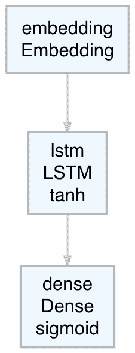
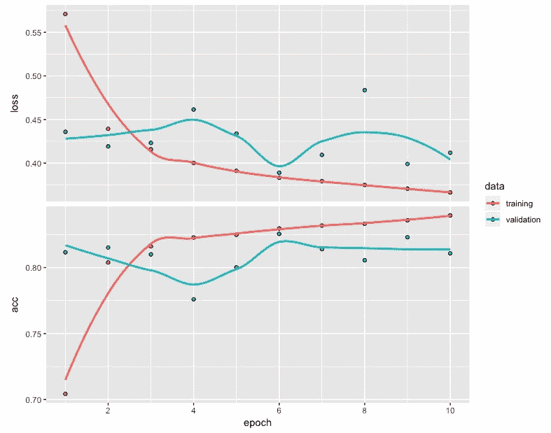
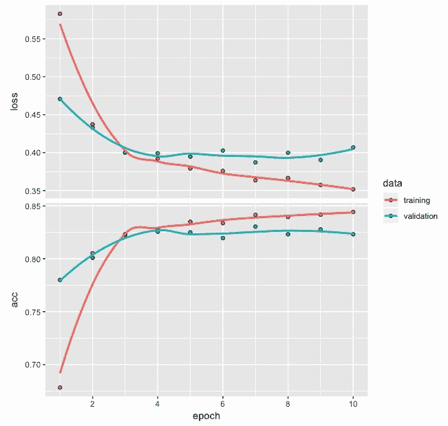
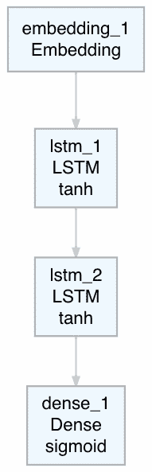
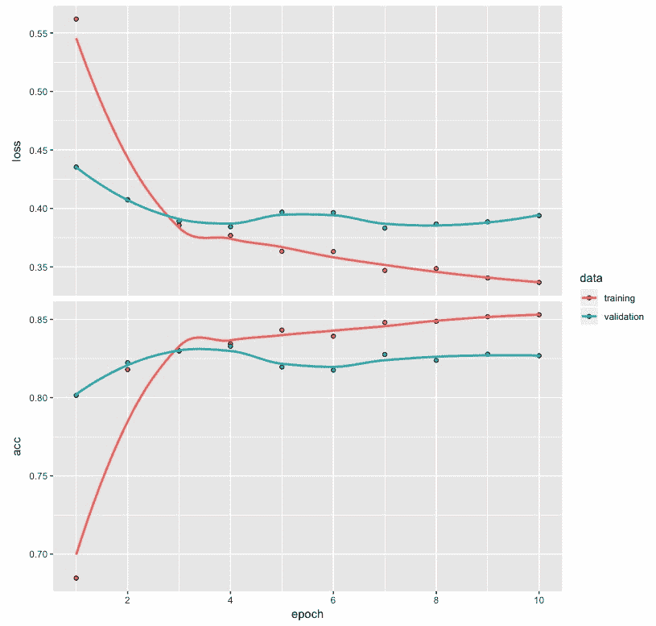
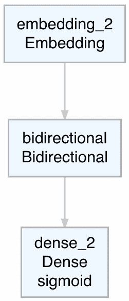
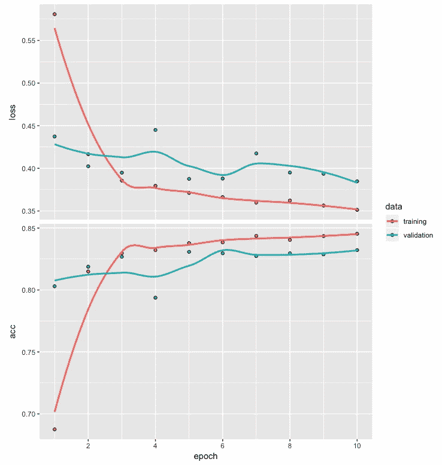

<title>Text classification Using Long Short-Term Memory Network</title>  

# 基于长短期记忆网络的文本分类

在前一章中，我们使用递归神经网络为以单词序列为特征的文本数据开发了一个电影评论情感分类模型。**长短期记忆** ( **LSTM** )神经网络是一种特殊类型的**递归神经网络** ( **RNNs** )对涉及序列的数据很有用，并提供我们将在下一节讨论的优势。本章说明了使用 LSTM 神经网络进行情感分类的步骤。将 LSTM 网络应用于商业问题的步骤可能包括文本数据准备、创建 LSTM 模型、训练模型以及评估模型性能。

更具体地说，在本章中，我们将讨论以下主题:

*   我们为什么使用 LSTM 网络？
*   为模型构建准备文本数据
*   创建长短期记忆网络模型
*   拟合 LSTM 模型
*   评估模型性能
*   性能优化技巧和最佳实践

<title>Why do we use LSTM networks?</title>  

# 我们为什么使用 LSTM 网络？

在前一章中，我们已经看到，当处理涉及序列的数据时，递归神经网络提供了不错的性能。使用 LSTM 网络的一个关键优势在于，它们解决了消失梯度问题，该问题使得对于长的单词或整数序列的网络训练变得困难。梯度用于更新 RNN 参数和用于长的单词或整数序列；这些梯度变得越来越小，以至于实际上无法进行网络训练。LSTM 网络有助于克服这个问题，并使捕获相距较远的序列中的关键字或整数之间的长期相关性成为可能。例如，考虑以下两个句子，其中第一个句子很短，第二个句子相对较长:

*   我喜欢吃巧克力。
*   只要有机会，而且通常有很多机会，我就喜欢吃巧克力。

在这些句子中，抓住句子主要精髓的两个重要单词是 **like** 和**chocolate**。在第一句话中，单词**如**和**巧克力**彼此更接近，它们之间只隔着两个单词。另一方面，在第二句话中，这两个词之间被多达 14 个词隔开。LSTM 网络被设计用来处理这种在较长的句子或较长的整数序列中观察到的长期依赖性。在这一章中，我们集中于应用 LSTM 网络来开发一个电影评论情感分类模型。

<title>Preparing text data for model building</title>  

# 为模型构建准备文本数据

我们将继续使用 IMDB 电影评论数据，我们在上一章中使用了递归神经网络。这些数据已经以一种格式可用，我们可以用它来开发深度网络模型，只需要最少的数据处理。

让我们来看看下面的代码:

```
# IMDB data
library(keras)
imdb <- dataset_imdb(num_words = 500) 
c(c(train_x, train_y), c(test_x, test_y)) %<-% imdb
train_x <- pad_sequences(train_x, maxlen = 200) 
test_x <- pad_sequences(test_x, maxlen = 200)
```

捕获训练和测试数据的整数序列分别存储在`train_x`和`test_x`中。类似地，`train_y`和`test_y`存储捕获关于电影评论是正面还是负面的信息的标签。我们已经指定最常用单词的数量为 500。对于填充，我们使用 200 作为训练和测试数据的整数序列的最大长度。

当整数的实际长度小于 200 时，会在序列的开头添加零，以人为地将整数的长度增加到 200。但是，当整数的长度超过 200 时，开头的整数将被删除，以便整数的总长度保持在 200。

如前所述，训练和测试数据集都是平衡的，每个数据集都包含涉及 25，000 条电影评论的数据。对于每个电影评论，积极或消极的标签也是可用的。

请注意，`maxlen`值的选择会影响模型性能。如果选择的值太小，序列中的更多单词或整数将被截断。另一方面，如果选择的值太大，那么序列中的更多单词或整数将需要填充，并添加零。避免过多填充或过多截断的一种方法是选择一个更接近中值的值。

<title>Creating a long short-term memory network model</title>  

# 创建长短期记忆网络模型

在本节中，我们将从一个简单的 LSTM 网络体系结构开始，看看如何计算参数的数量。随后，我们将编译模型。

<title>LSTM network architecture</title>  

# LSTM 网络架构

我们将从 LSTM 网络架构的简单流程图开始，如下面的屏幕截图所示:



前面的 LSTM 网络流程图强调了体系结构中的各层以及所使用的激活功能。在 LSTM 层中，使用了`tanh`激活功能，这是该层的默认激活功能。在密集层，使用`sigmoid`激活功能。

让我们来看看下面的代码和模型摘要:

```
# Model architecture
model <- keras_model_sequential() %>%
         layer_embedding(input_dim = 500, output_dim = 32) %>%
         layer_lstm(units = 32) %>%
         layer_dense(units = 1, activation = "sigmoid")
model
__________________________________________________________________________
Layer (type)                      Output Shape                  Param # 
==========================================================================
embedding (Embedding)             (None, None, 32)              16000 
__________________________________________________________________________
lstm (LSTM)                       (None, 32)                    8320 
__________________________________________________________________________
dense (Dense)                     (None, 1)                     33 
==========================================================================
Total params: 24,353
Trainable params: 24,353
Non-trainable params: 0
__________________________________________________________________________
```

除了我们在上一章中用于 RNN 模型的，我们在这个例子中用`layer_lstm`代替了`layer_simple_rnn`用于 LSTM 网络。对于嵌入层，我们总共有 16，000 (500 x 32)个参数。如下所示的计算将计算 LSTM 图层的参数数量:

*= 4x【LSTM 层单位 x(LSTM 层单位+输出维度)+LSTM 层单位】*

*= 4 x [32(32+32) + 32]*

*= 8320*

对于涉及 RNN 层的类似架构，我们将有 2080 个参数。LSTM 层参数数量的四倍增长也导致更多的训练时间，因此需要相对较高的处理成本。密集层的参数数量为 *[(32x1) + 1]* ，共计 33 个。因此，在这个网络中总共有 24，353 个参数。

<title>Compiling the LSTM network model</title>  

# 编制 LSTM 网络模型

为了编译 LSTM 网络模型，我们将使用以下代码:

```
# Compile
model %>% compile(optimizer = "rmsprop",  
         loss = "binary_crossentropy",
         metrics = c("acc"))
```

我们使用`rmsprop`作为优化器，使用`binary_crossentropy`作为损失，因为电影评论有二元反应，或者换句话说，它们要么是正面的，要么是负面的。对于度量标准，我们使用分类准确性。编译完模型后，我们准备进入下一步，拟合 LSTM 模型。

<title>Fitting the LSTM model</title>  

# 拟合 LSTM 模型

为了训练 LSTM 模型，我们将使用以下代码:

```
# Fit model
model_one <- model %>% fit(train_x, train_y,
         epochs = 10,
         batch_size = 128,
         validation_split = 0.2)
plot(model_one)
```

我们将使用训练数据来拟合具有 10 个时期的 LSTM 模型，并使用 128 的批量大小。我们还将保留 20%的训练数据作为验证数据，用于评估模型训练期间的损失和准确性值。

<title>Loss and accuracy plot</title>  

# 损失和准确度图

下面的屏幕截图显示了`model_one`的损耗和精度图:



基于训练和验证数据的损失和准确度的图显示了曲线之间的总体接近度。从图中观察到的情况如下:

*   两条线没有大的分歧，说明不存在过拟合问题。
*   增加历元数可能不会显著提高模型性能。
*   然而，基于验证数据的损失和精度值显示出一定量的不均匀性或振荡，其中它们偏离训练损失和精度相对较高的量。
*   时期 4 和 8 在这方面特别突出，显示出基于训练数据的损失和准确性的显著偏离。

接下来，我们将评估`model_one`，并使用它来预测电影评论情绪。

<title>Evaluating model performance </title>  

# 评估模型性能

在本节中，我们将基于训练和测试数据来评估模型。我们还将为训练和测试数据创建混淆矩阵，以进一步了解模型的电影评论情感分类性能。

<title>Model evaluation with train data</title>  

# 用训练数据进行模型评估

我们将首先使用以下代码评估列车数据的模型性能:

```
# Evaluate
model %>% evaluate(train_x, train_y)
$loss
 [1] 0.3749587
$acc
 [1] 0.82752
```

从前面的输出可以看出，对于训练数据，我们获得了损失值`0.375`和大约`0.828`的准确度。考虑到相对简单的 LSTM 架构，这是相当不错的表现。接下来，我们使用该模型对电影评论情绪进行预测，并通过使用以下代码开发混淆矩阵来总结结果:

```
# Confusion Matrix
pred <- model %>% predict_classes(train_x)
table(Predicted=pred, Actual=imdb$train$y)
         Actual
 Predicted     0     1
         0  9258  1070
         1  3242 11430
```

我们可以从混淆矩阵中得出以下结论:

*   据观察，与负面电影评论(9，258 个正确预测)相比，该模型在预测正面电影评论(11，430 个正确预测)方面似乎更准确。换句话说，对于训练数据，该模型以大约 91.4%的比率(也称为模型的敏感度)正确分类正面评论。
*   类似地，对于训练数据，该模型以大约 74.1%的比率(也称为模型的特异性)正确地分类负面评论。
*   还观察到负面电影评论被错误分类为正面评论的比率是正面评论被错误分类为负面(1，070 个评论)的大约三倍(3，242 个评论)。
*   因此，尽管总的来说，该模型似乎对训练数据表现良好，但更深入地看，我们观察到对正面电影评论进行正确分类的一些偏差，代价是对负面评论进行正确分类的准确性较低。

基于训练数据观察到的模型性能是否会导致测试数据的类似行为，这将是一件有趣的事情。

<title>Model evaluation with test data</title>  

# 用测试数据进行模型评估

我们现在将使用测试数据，通过以下代码获得模型的损耗和精度值:

```
# Evaluate
model %>% evaluate(test_x, test_y)
$loss
 [1] 0.3997277
$acc
 [1] 0.81992
```

从前面的输出可以看出，对于测试数据，我们获得的损失值为 0.399，精确度约为 0.819。正如所料，这些值比从列车数据中获得的值稍差。然而，它们与基于训练数据的结果足够接近，可以认为该模型行为是一致的。

使用测试数据获得混淆矩阵的代码如下:

```
# Confusion Matrix
pred1 <- model %>$ predict_classes(text_x)
table(Predicted=pred1, Actual=imdb$test$y)
         Actual
 Predicted     0     1
         0  9159  1161
         1  3341 11339
```

从上面显示的混淆矩阵中，可以得出以下观察结果:

*   基于使用测试数据的预测的混淆矩阵显示了与我们之前观察到的训练数据相似的模式。
*   与正确分类负面评论(大约 73.3%)相比，该模型在准确分类正面电影评论(大约 90.7%)时似乎表现得更好。
*   因此，当正确分类正面电影评论时，该模型继续表现出偏差。

在下一节中，我们将进行一些实验来探索模型的电影评论情感分类性能的可能改进。

<title>Performance optimization tips and best practices</title>  

# 性能优化技巧和最佳实践

在这一部分中，我们将进行三个不同的实验来搜索改进的基于 LSTM 的电影评论情感分类模型。这将包括在编译模型时尝试不同的优化器，在开发模型架构时添加另一个 LSTM 层，以及在网络中使用双向 LSTM 层。

<title>Experimenting with the Adam optimizer</title>  

# 试用 Adam 优化器

我们将使用`adam`(自适应矩优化)优化器，而不是之前编译模型时使用的`rmsprop`(均方根传播)优化器。为了更容易地比较模型性能，我们将保持其他一切与前面相同，如下面的代码所示:

```
# Model architecture
model <- keras_model_sequential() %>%
         layer_embedding(input_dim = 500, output_dim = 32) %>%
         layer_lstm(units = 32) %>%
         layer_dense(units = 1, activation = "sigmoid")

# Compile
model %>% compile(optimizer = "adam",  
         loss = "binary_crossentropy",
         metrics = c("acc"))

# Fit model
model_two <- model %>% fit(train_x, train_y,
         epochs = 10,
         batch_size = 128,
         validation_split = 0.2)
plot(model_two)
```

运行前述代码并训练模型后，每个时期的精度和损耗值存储在`model_two`中。我们使用`model_two`中的损耗和精度值来绘制以下图表:



根据前面的损耗和精度图，我们可以得出以下结论:

*   基于训练和验证数据的损失和准确度图显示，与我们用`model_one`构建的第一个模型的图相比，模式略有改善。
*   在基于`model_one`的图中，我们观察到验证数据的损失和准确度值偶尔会与基于训练数据的值出现较大偏差。在这个图中，我们看不到两条线之间有任何如此大的偏差。

*   此外，基于验证数据的最后几个值的损失和准确度值似乎是平坦的，这表明我们使用的十个时期足以训练模型，并且增加时期数不太可能有助于提高模型性能。

接下来，让我们使用以下代码获得训练数据的损失、准确性和混淆矩阵:

```
# Loss and accuracy
model %>% evaluate(train_x, train_y)
$loss
[1] 0.3601628
$acc
[1] 0.8434

pred <- model %>%   predict_classes(train_x)

# Confusion Matrix
table(Predicted=pred, Actual=imdb$train$y)
         Actual
Predicted     0     1
        0 11122  2537
        1  1378  9963
```

从前面的代码输出中，我们可以观察到以下情况:

*   通过使用`adam`优化器，我们获得训练数据的损失和准确度分别为 0.360 和 0.843。这两个数字都显示了与我们使用`rmsprop`优化器的早期模型相比的改进。
*   从混淆矩阵中可以观察到另一个差异。该模型在正确分类负面电影评论时(以大约 88.9%的比率)比正确分类正面评论(以大约 79.7%的比率)表现得更好。
*   这种行为与之前模型中观察到的情况相反。与正确分类正面评论相比，该模型似乎偏向于正确分类负面电影评论情绪。

使用训练数据查看了模型的性能后，我们现在将使用以下代码对测试数据重复该过程，以获得损失、准确性和混淆矩阵:

```
# Loss and accuracy
model %>% evaluate(test_x, test_y)
$loss
[1] 0.3854687
$acc
[1] 0.82868

pred1 <- model %>%   predict_classes(test_x)

# Confusion Matrix
table(Predicted=pred1, Actual=imdb$test$y)
         Actual
Predicted     0     1
        0 10870  2653
        1  1630  9847
```

从前面的代码输出中，我们可以观察到以下情况:

*   基于测试数据的损耗和准确度分别为 0.385 和 0.829。基于测试数据的这些结果也显示了与具有测试数据的先前模型相比更好的模型性能。
*   混淆矩阵显示了我们在训练数据中观察到的类似模式。对于测试数据，负面电影评论情绪被正确分类为大约 86.9%的比率。
*   类似地，对于测试数据，正面的电影评论情绪被模型以大约 78.8%的比率正确分类。
*   此行为与使用训练数据获得的模型性能一致。

虽然尝试`adam`优化器提高了整体电影评论情感分类性能，但当正确地将一个类别与另一个类别相比较时，它仍然会保留偏差。一个好的模型不仅应该提高整体性能，还应该在正确分类时将任何偏差最小化。以下代码提供了一个表格，显示了`train`和`test`数据中负面和正面评论的数量:

```
# Number of positive and negative reviews in the train data
table(train_y)
train_y
    0     1 
12500 12500 

# Number of positive and negative review in the test data
table(test_y)
test_y
    0     1 
12500 12500 
```

从前面的代码输出可以看出，这个电影评论数据是平衡的，其中训练和测试数据都有 25，000 个评论。这个数据在正面或负面评论的数量上也是平衡的。训练和测试数据集各有 12，500 条正面和 12，500 条负面电影评论。因此，在提供给模型用于训练的负面或正面评论的数量上没有偏差。然而，在正确分类负面和正面电影评论时看到的偏见肯定是需要改进的。

在下一个实验中，让我们探索更多的 LSTM 层，看看我们是否可以获得更好的电影评论情感分类模型。

<title>Experimenting with the LSTM network having an additional layer</title>  

# 尝试 LSTM 网络增加一层

在第二个实验中，为了提高分类模型的性能，我们将添加一个额外的 LSTM 层。让我们看看下面的代码:

```
# Model architecture
model <- keras_model_sequential() %>%
         layer_embedding(input_dim = 500, output_dim = 32) %>%
         layer_lstm(units = 32,
                    return_sequences = TRUE) %>%
         layer_lstm(units = 32) %>%
         layer_dense(units = 1, activation = "sigmoid")

# Compiling model
model %>% compile(optimizer = "adam",   
         loss = "binary_crossentropy",
         metrics = c("acc"))

# Fitting model
model_three <- model %>% fit(train_x, train_y,
         epochs = 10,
         batch_size = 128,
         validation_split = 0.2)

# Loss and accuracy plot
plot(model_three)
```

通过向网络中添加一个额外的 LSTM 图层，如前面的代码所示，这两个 LSTM 图层的参数总数现在将增加到 32，673 个，而之前一个 LSTM 图层的参数总数为 24，353 个。在训练网络时，参数数量的增加也将导致更长的训练时间。在编译模型时，我们还保留了 Adam 优化器的使用。我们保持其他一切与我们在以前的模型中使用的相同。

下面的屏幕截图显示了本实验中使用的具有两个 LSTM 层的网络架构的简单流程图:



前面显示的 LSTM 网络流程图强调了体系结构中的两层以及所使用的激活功能。在两个 LSTM 层中，`tanh`被用作默认激活功能。在密集层中，我们继续使用之前使用的`sigmoid`激活函数。

训练模型后，每个历元的精度和损失值存储在`model_three`中。我们使用`model_three`中的损耗和精度值绘制以下图表:



从所示的损耗和精度图中，我们可以观察到以下情况:

*   损失值和准确度值的图并不表示存在过拟合问题，因为训练数据和验证数据的曲线彼此接近。

*   与早期模型一样，验证数据的损失和准确性似乎在最后几个时期保持不变，表明十个时期足以训练模型，增加时期的数量不太可能改善结果。

我们现在可以使用以下代码获得训练数据的损失、准确性和混淆矩阵:

```
# Loss and accuracy
model %>% evaluate(train_x, train_y)
$loss
[1] 0.3396379
$acc
[1] 0.85504

pred <- model %>%   predict_classes(train_x)

# Confusion Matrix
table(Predicted=pred, Actual=imdb$train$y) 
         Actual
Predicted     0     1
        0 11245  2369
        1  1255 10131
```

从前面的代码输出中，我们可以观察到以下情况:

*   基于训练数据的损失和精度值分别被获得为`0.339`和`0.855`。与前两个模型相比，损耗和精度都有所提高。
*   我们可以使用这个模型对训练数据中的每个评论进行预测，并与实际标签进行比较，然后以混淆矩阵的形式总结结果。
*   对于训练数据，混淆矩阵表明，该模型在大约 90%的时间内正确分类负面电影评论，在大约 81%的时间内正确分类正面评论。
*   因此，尽管模型性能总体上有所提高，但当正确地将一个类别与另一个类别进行比较时，我们仍然会观察到偏差。

在使用训练数据检查了模型的性能之后，我们现在将使用测试数据重复该过程。以下是获取损失、准确度和混淆矩阵的代码:

```
# Loss and accuracy
model %>% evaluate(test_x, test_y)
$loss
[1] 0.3761043
$acc
[1] 0.83664

pred1 <- model %>%   predict_classes(test_x)

# Confusion Matrix
table(Predicted=pred1, Actual=imdb$test$y)
         Actual
Predicted     0     1
        0 10916  2500
        1  1584 10000
```

从前面的代码输出中，我们可以观察到以下情况:

*   对于测试数据，损失值和准确度值分别为 0.376 和 0.837。对于测试数据，这两个结果都显示了比前两个模型更好的分类性能。
*   混淆矩阵显示，负面影评的正确分类率约为 87.3%，正面影评的正确分类率约为 80%。
*   因此，这些结果与使用训练数据获得的结果一致，并显示出与我们观察到的训练数据相似的偏差。

总之，通过添加额外的 LSTM 层，我们能够提高模型的电影评论情感分类性能。然而，当正确地将一个类别与另一个类别相比较时，我们继续观察到偏差。因此，尽管我们在提高模型性能方面取得了一定的成功，但仍有进一步提高模型分类性能的空间。

<title>Experimenting with a bidirectional LSTM layer</title>  

# 试验双向 LSTM 图层

顾名思义，双向 LSTM 不仅使用提供的整数序列作为输入，还使用它的逆序作为附加输入。可能存在这样的情况，通过捕获原始 LSTM 网络可能没有捕获的数据中的有用模式，这种方法可能有助于实现进一步的模型分类性能改进。

对于这个实验，我们将在第一个实验中修改 LSTM 层，如以下代码所示:

```
# Model architecture
model <- keras_model_sequential() %>%
          layer_embedding(input_dim = 500, output_dim = 32) %>%
          bidirectional(layer_lstm(units = 32)) %>%
          layer_dense(units = 1, activation = "sigmoid")
# Model summary
summary(model)
Model
__________________________________________________________
Layer (type)              Output Shape           Param #  
==========================================================
embedding_8 (Embedding)   (None, None, 32)       16000    
__________________________________________________________
bidirectional_5 (Bidirect (None, 64)             16640    
__________________________________________________________
dense_11 (Dense)          (None, 1)              65       
==========================================================
Total params: 32,705
Trainable params: 32,705
Non-trainable params: 0
__________________________________________________________
```

从前面的代码输出中，我们可以观察到以下情况:

*   我们使用双向`()`功能将 LSTM 层转换为双向 LSTM 层。
*   这一变化使与 LSTM 层相关的参数数量增加了一倍，达到 16，640 个，这可以从模型摘要中看出。
*   这个架构的参数总数现在增加到 32，705 个。参数数量的增加将进一步降低训练网络的速度。

以下是双向 LSTM 网络架构的简单流程图:



双向 LSTM 网络的流程图显示了嵌入层、双向层和密集层。在双向 LSTM 层中，`tanh`用作激活函数，密集层使用`sigmoid`激活函数。编译和定型模型的代码如下:

```
# Compiling model
model %>% compile(optimizer = "adam",   
          loss = "binary_crossentropy",
          metrics = c("acc"))

# Fitting model
 model_four <- model %>% fit(train_x, train_y,
          epochs = 10,
          batch_size = 128,
          validation_split = 0.2)

# Loss and accuracy plot
plot(model_four)
```

从前面的代码中可以看出，我们将继续使用`adam`优化器，并保持其他设置与之前相同，以便编译和拟合模型。

在我们训练模型之后，每个历元的精度和损失值被存储在`model_four`中。我们使用`model_four`中的损耗和精度值绘制以下图表:



从前面的图中，我们可以得出以下结论:

*   损失和准确度图没有显示任何过度拟合的原因，因为训练线和验证线彼此相当接近。
*   该图还表明，我们不需要十个以上的历元来训练该模型。

我们将使用以下代码获得训练数据的损失、准确性和混淆矩阵:

```
# Loss and accuracy
model %>% evaluate(train_x, train_y)
$loss
[1] 0.3410529
$acc
[1] 0.85232

pred <- model %>%   predict_classes(train_x)

# Confusion Matrix
table(Predicted=pred, Actual=imdb$train$y)
         Actual
Predicted     0     1
        0 10597  1789
        1  1903 10711
```

从前面的代码输出中，我们可以观察到以下情况:

*   对于训练数据，我们分别获得 0.341 和 0.852 的损失和准确度值。这些结果仅略次于先前的结果，并且没有显著差异。
*   这次的混淆矩阵在正确分类正面和负面电影评论方面表现得更加均匀。
*   对于负面电影评论，正确的分类率约为 84.8%，而对于正面评论，正确的分类率约为 85.7%。
*   这个大约 1%的差异比我们在早期模型中观察到的要小得多。

我们现在将对测试数据重复前面的过程。以下是获取损失、准确度和混淆矩阵的代码:

```
# Loss and accuracy
model %>% evaluate(test_x, test_y)
$loss
[1] 0.3737377
$acc
[1] 0.83448

pred1 <- model %>%   predict_classes(test_x)

#Confusion Matrix
table(Predicted=pred1, Actual=imdb$test$y)
         Actual
Predicted     0     1
        0 10344  1982
        1  2156 10518
```

从前面的代码输出中，我们可以观察到以下情况:

*   对于测试数据，损失值和准确度值分别为 0.374 和 0.834。
*   混淆矩阵显示，模型对负面评论的正确分类率约为 82.8%。
*   该模型对电影正面评论的正确分类率约为 84.1%。
*   这些结果与从训练数据中获得的结果一致。

使用双向 LSTM 的实验有助于在损耗和精度方面获得与之前实验中使用两个 LSTM 层获得的性能相当的性能。然而，观察到的主要收获是实现了我们可以以更好的一致性正确分类负面或正面电影评论的结果。

在这一章中，我们使用 LSTM 网络开发了一个电影评论情感分类模型。当数据涉及序列时，LSTM 网络有助于捕捉单词或整数序列中的长期相关性。我们对四个不同的 LSTM 模型进行了实验，对模型进行了一些更改，相同的结果总结在下表中。

下表总结了四种 LSTM 型号的性能:

| **型号** | **LSTM 层层** | **优化器** | **数据** | **损失** | **精度** | **负面评价的准确性或特异性** | **正面评价的准确性或敏感度** |
| 一个 | 一 | `rmsprop` | 火车 | 0.375 | 82.8% | 74.1% | 91.4% |
|   |   |   | 试验 | 0.399 | 81.9% | 73.3% | 90.7% |
| 二 | 一 | `adam` | 火车 | 0.360 | 84.3% | 88.9% | 79.7% |
|   |   |   | 试验 | 0.385 | 82.9% | 86.9% | 78.8% |
| 三 | 2 | `adam` | 火车 | 0.339 | 85.5% | 90.0% | 81.0% |
|   |   |   | 试验 | 0.376 | 83.7% | 87.3% | 80.0% |
| 四 | 双向的 | `adam` | 火车 | 0.341 | 85.2% | 84.8% | 85.7% |
|   |   |   | 试验 | 0.374 | 83.4% | 82.8% | 84.1% |

我们可以从上表中观察到以下情况:

*   在尝试的四个模型中，双向 LSTM 模型提供了比其他三个模型更好的性能。根据测试数据，它具有最低的损耗值。
*   尽管与第三个模型相比，第四个模型的总体准确性稍低，但正确分类负面和正面评论的准确性更加一致，从 82.8%到 84.1%不等，或者只有大约 1.3%的差距。
*   第三个模型似乎偏向于负面评论，对测试数据的正确分类率为 87.3%。对于第三个模型，测试数据中正面评论的正确分类只有 80%。因此，对于第三模型，负面和正面评论的正确分类之间的差异超过 7%。
*   对于前两个模型，灵敏度和特异性之间的差异甚至更高。

虽然第四个模型提供了很好的结果，但通过进一步试验其他变量，肯定可以探索更多的改进。可用于进一步实验的变量可包括最频繁单词的数量、使用前置还是后置来填充和/或截断、用于填充的最大长度、LSTM 层中的单元数量以及在编译模型时对另一优化器的选择。

<title>Summary</title>  

# 摘要

在这一章中，我们举例说明了 LSTM 网络在开发电影评论情感分类模型中的应用。我们在上一章中使用的递归神经网络所面临的问题之一是，它难以捕捉可能存在于一系列单词或整数中的两个单词/整数之间的长期依赖性。**长短期记忆** ( **LSTM** )网络是为了人工保留长期记忆而设计的，这些记忆在处理长句或一长串整数时很重要。

在下一章中，我们将继续处理文本数据，并探索使用**卷积递归神经网络** **s** ( **CRNNs** )，它将**卷积神经网络** ( **CNNs** )和**递归神经网络** ( **RNNs** )的优点结合到单个网络中。我们将借助一个有趣的公开文本数据集`reuter_50_50`来说明这种网络的使用。