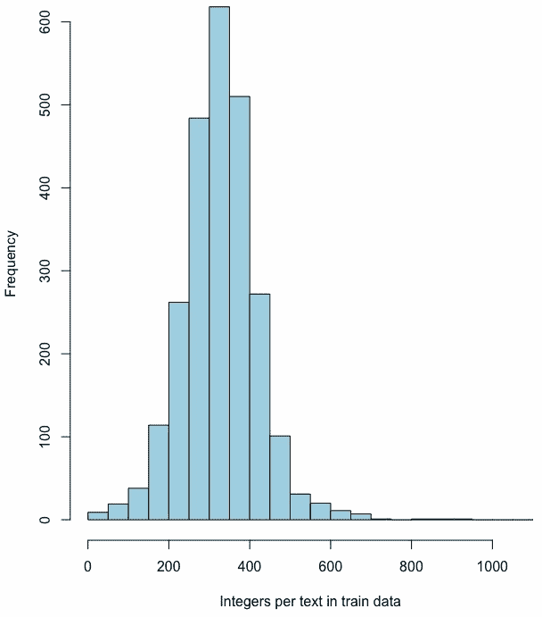
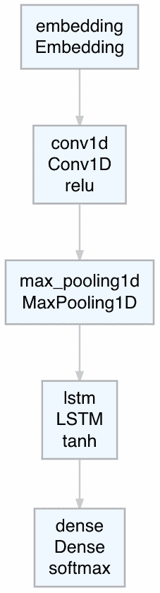
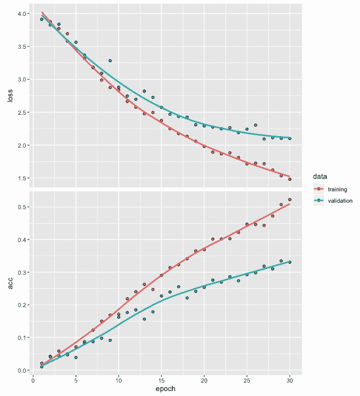
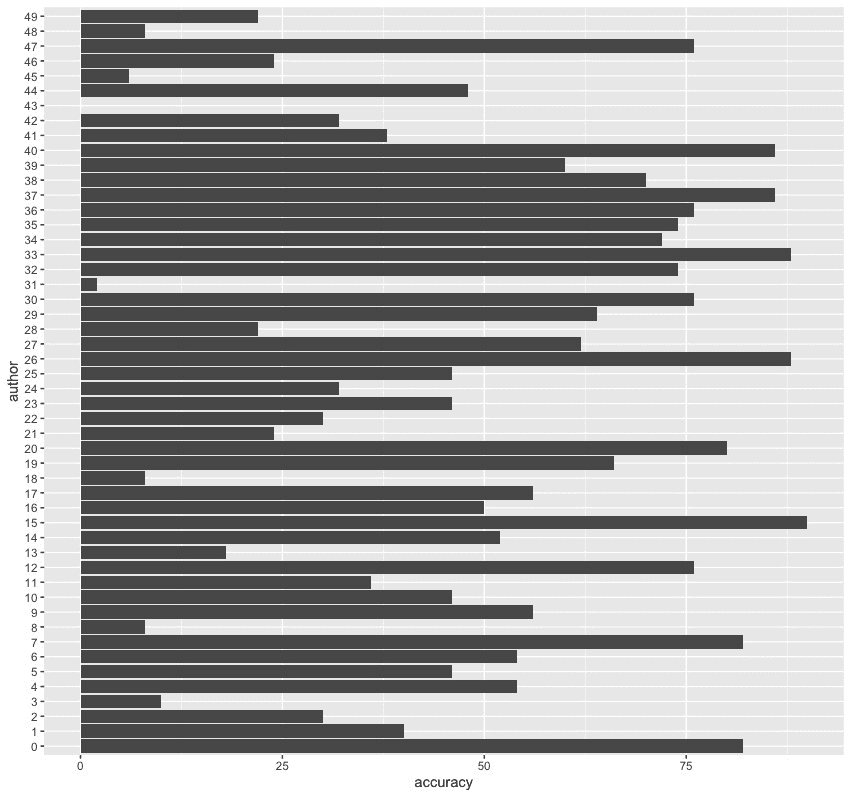
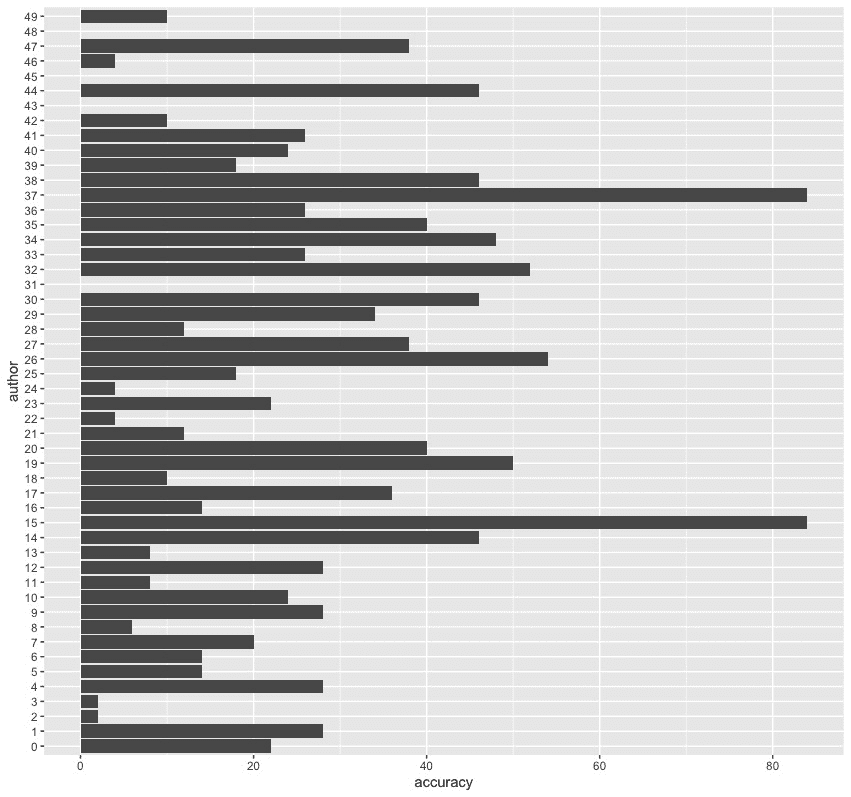
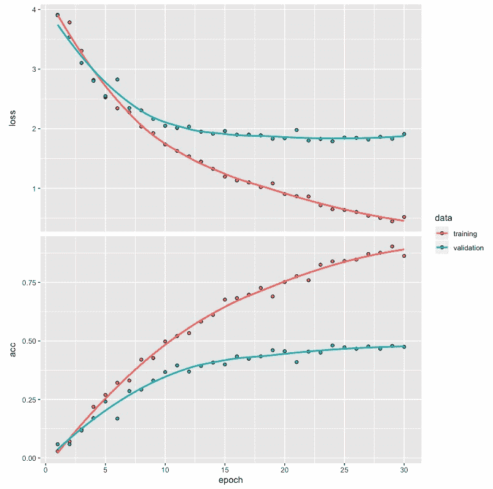
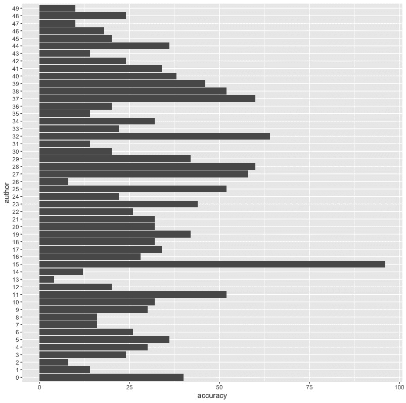
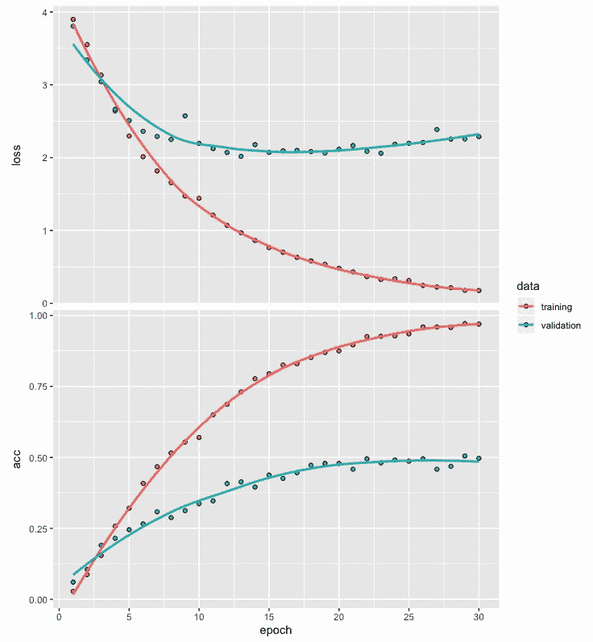
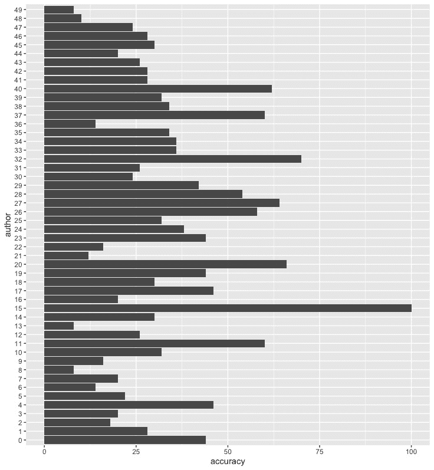

# 十二、基于卷积循环神经网络的文本分类

**卷积神经网络**(**CNN**)已经被发现在从数据中捕捉高级局部特征方面是有用的。另一方面，**循环神经网络** ( **RNNs** )，比如**长短期记忆** ( **LSTM** )，已经被发现在捕捉涉及文本等序列的数据中的长期依赖性方面很有用。当我们在同一模型架构中使用 CNN 和 RNNs 时，就产生了所谓的**卷积循环神经网络** ( **CRNNs** )。

本章通过结合 RNNs 和 CNN 网络的优点，说明了如何将卷积循环神经网络应用于文本分类问题。此过程中涉及的步骤包括文本数据准备、定义卷积循环网络模型、训练模型和模型评估。

更具体地说，在本章中，我们将讨论以下主题:

*   使用 reuter_50_50 数据集
*   为模型构建准备数据
*   开发模型架构
*   编译和拟合模型
*   评估模型和预测类别
*   性能优化技巧和最佳实践


# 使用 reuter_50_50 数据集

在前面的章节中，当处理文本数据时，我们利用已经被转换成整数序列的数据来开发深度网络模型。在本章中，我们将使用需要转换成整数序列的文本数据。我们将从阅读我们将用来说明如何开发文本分类深度网络模型的数据开始。我们还将探索我们将使用的数据集，以便更好地理解它。

在本章中，我们将使用`keras`、`deepviz`和`readtext`库，如以下代码所示:

```r
# Libraries used
library(keras)
library(deepviz)
library(readtext)
```

为了说明开发卷积循环网络模型所涉及的步骤，我们将利用`reuter_50_50`文本数据集，该数据集可从 https://archive.ics.uci.edu/ml/datasets/Reuter_50_50#[UCI 机器学习库](https://archive.ics.uci.edu/ml/datasets/Reuter_50_50#)获得。

此数据集包含两个文件夹中的文本文件，一个文件夹用于存储定型数据，另一个文件夹用于存储测试数据:

*   包含训练数据的文件夹有 2，500 个文本文件，每个文件包含来自 50 位作者的 50 篇文章。
*   类似地，包含测试数据的文件夹也有 2，500 个文本文件，每个文件包含来自相同的 50 位作者的 50 篇文章。


# 读取训练数据

我们可以通过从我们为 UCI 机器学习库提供的链接转到`Data`文件夹来访问`reuter_50_50`数据集。从这里，我们可以下载`C50.zip`文件夹。解压缩后，它包含一个包含`C50train`和`C50test`文件夹的`C50`文件夹。首先，我们将使用以下代码从`C50train`文件夹中读取文本文件:

```r
# Reading Reuters train data
setwd("~/Desktop/C50/C50train")
temp = list.files(pattern="*.*")
k <- 1; tr <- list(); trainx <- list(); trainy <- list()
for (i in 1:length(temp)) {for (j in 1:50) 
         { trainy[k] <- temp[i]
         k <- k+1}
author <- temp[i]
files <- paste0("~/Desktop/C50/C50train/", author, "/*")
tr <- readtext(files)
trainx <- rbind(trainx, tr)}
trainx <- trainx$text
```

在前面代码的帮助下，我们可以将 2500 篇文章的数据从`C50train`文件夹读入`trainx`，并将关于作者姓名的信息保存到`trainy`。我们首先使用`setwd`函数将工作目录设置为`C50train`文件夹。`C50train`文件夹包含以 50 位作者命名的 50 个文件夹，每个文件夹包含相应作者写的 50 篇文章。我们将值 1 赋给 k，并将`tr`、`trainx`和`trainy`初始化为一个列表。然后，我们创建一个循环，将作者的名字存储在`trainy`中，其中包含每篇文章的作者名字，并且`trainx`包含作者写的相应文章。注意，在读取这 2500 个文本文件的数据后，`trainx`还包含关于文件名的信息。使用最后一行代码，我们只保留了 2，500 个文本的数据，并删除了关于我们不需要的文件名的信息。

现在，让我们使用以下代码来查看来自训练数据的文本文件 901 的内容:

```r
# Text file 901
trainx[901]
[1] "Drug discovery specialist Chiroscience Group plc said on Monday it is testing two anti-cancer compounds before deciding which will go forward into human trials before the end of the year.\nBoth are MMP inhibitors, the same novel class of drug as British Biotech Plc's potential blockbuster Marimastat, which are believed to stop cancer cells from spreading.\nIn an interview, chief executive John Padfield said Chiroscience hoped to have its own competitor to Marimastat in early trials next year and Phase III trials in 1998."

# Author
trainy[901]
[[1]]
[1] "JonathanBirt"
```

从前面的代码和输出中，我们可以观察到以下情况:

*   `trainx`中的测试文件 901 包含关于 Chiroscience Group 的药物试验的某些新闻项目
*   这篇短文的作者是乔纳森·伯特

在阅读了训练数据的文本文件和作者姓名之后，我们可以对测试数据重复这个过程。


# 读取测试数据

现在，我们将从位于`C50`文件夹中的`C50test`文件夹中读取文本文件。我们将使用以下代码来实现这一点:

```r
# Reuters test data
setwd("~/Desktop/C50/C50test")
temp = list.files(pattern="*.*")
k <- 1; tr <- list(); testx <- list(); testy <- list()
for (i in 1:length(temp)) {for (j in 1:50) 
         { testy[k] <- temp[i]
         k <- k+1}
         author <- temp[i]
         files <- paste0("~/Desktop/C50/C50test/", author, "/*")
         tr <- readtext(files)
         testx <- rbind(testx, tr)}
testx <- testx$text
```

在这里，我们可以看到这段代码中唯一的变化是我们基于位于`C50test`文件夹中的测试数据创建了`testx`和`testy`。我们将 2500 篇文章从`C50test`文件夹读入`testx`，并将关于作者姓名的信息保存到`testy`。我们再次使用最后一行代码来保留测试数据中的 2500 个文本的数据，并删除文件名信息，这是我们的分析所不需要的。

既然我们已经创建了训练和测试数据，我们将执行数据预处理，以便我们可以开发一个作者分类模型。


# 为模型构建准备数据

在本节中，我们将准备一些数据，以便我们可以开发一个作者分类模型。我们将从使用标记将文章形式的文本数据转换成整数序列开始。我们还将做一些更改，通过唯一的整数来标识每个作者。随后，我们将使用填充和截断来为表示 50 位作者的文章的整数序列获得相同的长度。我们将通过将训练数据划分为训练和验证数据集，然后对响应变量执行一次性编码来结束这一部分。


# 标记化和将文本转换成整数序列

我们将首先执行标记化，然后将文本形式的文章转换为整数序列。为此，我们可以使用以下代码:

```r
# Tokenization
token <- text_tokenizer(num_words = 500) %>%    
         fit_text_tokenizer(trainx)

# Text to sequence of integers
trainx <- texts_to_sequences(token, trainx)
testx <- texts_to_sequences(token, testx)

# Examples
trainx[[7]]
[1] 98   4  41  5  4  2  4  425  5  20  4  9  4  195  5  157  1  18
[19] 87  3  90  3  59 1 169 346  2  29  52 425   6  72 386 110 331  24
[37] 5   4  3  31  3  22   7  65  33 169 329  10 105  1 239  11   4  31
[55] 11 422  8  60 163 318  10  58 102   2 137 329 277  98 58 287  20  81
[73] 3 142  9   6  87   3  49  20 142   2 142   6   2  60  13   1 470   8
[91] 137 190  60   1  85 152   5  6 211  1  3  1  85  11  2 211 233  51
[109] 233 490  7 155   3 305   6  4  86  3  70  4  3 157  52 142   6 282
[127] 233  4 286  11 485  47  11   9  1 386 497  2  72  7  33   6  3  1
[145] 60   3 234  23  32  72 485   7 203   6  29 390  5   3  19  13  55 184
[163] 53  10   1  41  19 485 119  18   6  59  1 169   1  41  10  17 458  91
[181] 6  23  12   1   3   3  10 491   2  14   1   1 194 469 491  2  1   4
[199] 331 112 485 475  16  1 469  1 331  14   2 485 234  5 171 296  1  85
[217] 11 135 157  2 189  1  31  24   4   5 318 490 338   6 147 194  24 347
[235] 386  23  24  32 117 286 161  6 338  25   4  32  2  9  1  38  8 316
[253] 60 153  27 234 496 457 153  20 316  2 254 219 145 117  25  46  27  7
[271] 228  34 184  75 11 418  52 296   1 194 469 180 469  6  1 268  6 250
[289] 469  29 90  6  15  58 175  32  33 229  37 424  36  51  36  3 169  15
[307] 1  7 175  1 319 207  5   4

trainx[[901]]
[1]  74 356 7  9 199  12  11  61 145 31  22 399 79 145  1 133  3  1  28 203
[21] 29  1 319  3  18 101 470 31  29  2  20  5  33 369 116 134  7  2  25 17
[41] 303  2  5 222 100  28   6   5
```

从前面的代码和输出中，我们可以观察到以下内容:

*   对于标记化，我们将`num_words`指定为 500，表示我们将使用训练数据中文本中最频繁出现的 500 个单词。
*   请注意，使用`fit_text_tokenizer`会自动将文本转换为小写，并删除包含文本数据的文章中可以观察到的任何标点符号。将文本转换成小写有助于我们避免单词重复，其中一个可能包含小写字母字符，而另一个可能包含大写字母字符。删除标点符号是因为在开发以文本作为输入的作者分类模型时，标点符号不会增加价值。
*   我们使用`texts_to_sequences`将文本中最常见的单词转换成一个整数序列。这样做的原因是为了转换非结构化数据，使其具有结构化格式，这是深度学习模型所需要的。
*   文本文件 7 的输出总共显示了 314 个介于 1 和 497 之间的整数。
*   查看文本文件 901 的输出(与我们之前查看的训练数据中的示例相同)，我们可以看到它由 1 到 470 之间的 48 个整数组成。原始文本由超过 80 个单词组成，不属于 500 个最常用单词的那些单词不会出现在这个整数序列中。
*   前五个整数，即 74、356、7、9、199，分别对应`group`、`plc`、`said`、`on`、`monday`四个字。文本开头没有被转换成整数的其他单词不属于文章中最常用的前 500 个单词。

现在，我们来看看训练和测试数据中每篇文章的整数个数。我们可以用下面的代码做到这一点:

```r
# Integers per article for train data
z <- NULL
for (i in 1:2500) {z[i] <- print(length(trainx[[i]]))}
summary(z)
   Min. 1st Qu.  Median    Mean 3rd Qu.    Max. 
   31.0   271.0   326.0   326.8   380.0   918.0 

# Intergers per article for text data
z <- NULL
for (i in 1:2500) {z[i] <- print(length(testx[[i]]))}
summary(z)
   Min. 1st Qu.  Median    Mean 3rd Qu.    Max. 
   39.0   271.0   331.0   329.1   384.0  1001.0 
```

根据前面的总结，我们可以得出以下结论:

*   训练数据中每篇文章的整数个数在 31 到 918 之间，中位数约为 326 个单词。
*   类似地，对于测试数据，每篇文章的整数范围从 39 到 1001，中位数约为 331。
*   如果最频繁单词的数量从 500 增加到更高的值，则单词的中值数量预计也会增加。这可能导致需要对模型架构和参数值进行适当的更改。例如，每篇文章字数的增加可能需要深层网络中更多的神经元。

训练数据的每个文本文件的整数数量直方图如下:



前面的训练数据的每个文本文件的整数直方图显示了整体模式，平均值和中值约为 326。该直方图的尾部向高值方向略长，呈现出适度右偏或正偏的模式。

既然我们已经将文本数据转换成了一个整数序列，我们也将把火车和文本数据的标签转换成整数。


# 将标签更改为整数

在为分类问题开发深度学习网络时，我们总是使用整数形式的响应或标签。训练和测试文本数据的作者姓名分别存储在`trainy`和`testy`中。`trainy`和`testy`都是 2500 个条目的列表，包含 50 个作者的名字。要将标签转换成整数，我们可以使用下面的代码:

```r
# Train and test labels to integers
trainy <- as.factor(unlist(trainy))
trainy <- as.integer(trainy) -1 
testy <- as.factor(unlist(testy))
testy <- as.integer(testy) -1

# Saving original labels
trainy_org <- trainy
testy_org <- testy
```

正如我们所看到的，要将包含作者姓名的标签转换成整数，我们需要取消它们的列表，然后使用从 0 到 49 的整数来表示这 50 位作者。我们也可以使用`trainy_org`和`testy_org`来保存这些原始的整数标签，以备后用。

接下来，我们将进行填充和截断，以使整数序列上的数据对于每篇文章都具有相等的长度。


# 序列的填充和截断

在开发作者分类模型时，每个训练和测试文本数据的整数数量需要长度相等。我们可以通过填充和截断整数序列来实现这一点，如下所示:

```r
# Padding and truncation
trainx <- pad_sequences(trainx, maxlen = 300) 
testx <- pad_sequences(testx, maxlen = 300)
dim(trainx) 
[1] 2500  300
```

这里，我们指定所有序列的最大长度，即`maxlen`，为 300。这将截断项目中长于 300 个整数的任何序列，并向项目中短于 300 个整数的序列添加零。注意，对于填充和截断，已经使用了默认设置“pre ”,并且在代码中没有特别指出。

这意味着对于截断和填充，整数序列开头的整数会受到影响。对于整数序列末尾的填充和/或截断，我们可以在代码中使用`padding = "post"`和/或`truncation = "post"`。我们还可以看到`trainx`的尺寸显示为 2,500 x 300 的矩阵。

让我们看看火车数据中文本文件 7 和 901 的输出，如下所示:

```r
# Example of truncation
trainx[7,]
  [1]   5 157   1  18  87   3  90   3  59   1 169 346   2  29  52 425
 [17]   6  72 386 110 331  24   5   4   3  31   3  22   7  65  33 169
 [33] 329  10 105   1 239  11   4  31  11 422   8  60 163 318  10  58
 [49] 102   2 137 329 277  98  58 287  20  81   3 142   9   6  87   3
 [65]  49  20 142   2 142   6   2  60  13   1 470   8 137 190  60   1
 [81]  85 152   5   6 211   1   3   1  85  11   2 211 233  51 233 490
 [97]   7 155   3 305   6   4  86   3  70   4   3 157  52 142   6 282
[113] 233   4 286  11 485  47  11   9   1 386 497   2  72   7  33   6
[129]   3   1  60   3 234  23  32  72 485   7 203   6  29 390   5   3
[145]  19  13  55 184  53  10   1  41  19 485 119  18   6  59   1 169
[161]   1  41  10  17 458  91   6  23  12   1   3   3  10 491   2  14
[177]   1   1 194 469 491   2   1   4 331 112 485 475  16   1 469   1
[193] 331  14   2 485 234   5 171 296   1  85  11 135 157   2 189   1
[209]  31  24   4   5 318 490 338   6 147 194  24 347 386  23  24  32
[225] 117 286 161   6 338  25   4  32   2   9   1  38   8 316  60 153
[241]  27 234 496 457 153  20 316   2 254 219 145 117  25  46  27   7
[257] 228  34 184  75  11 418  52 296   1 194 469 180 469   6   1 268
[273]   6 250 469  29  90   6  15  58 175  32  33 229  37 424  36  51
[289]  36   3 169  15   1   7 175   1 319 207   5   4

# Example of padding
trainx[901,]
  [1]   0   0   0   0   0   0   0   0   0   0   0   0   0   0   0   0
 [17]   0   0   0   0   0   0   0   0   0   0   0   0   0   0   0   0
 [33]   0   0   0   0   0   0   0   0   0   0   0   0   0   0   0   0
 [49]   0   0   0   0   0   0   0   0   0   0   0   0   0   0   0   0
 [65]   0   0   0   0   0   0   0   0   0   0   0   0   0   0   0   0
 [81]   0   0   0   0   0   0   0   0   0   0   0   0   0   0   0   0
 [97]   0   0   0   0   0   0   0   0   0   0   0   0   0   0   0   0
[113]   0   0   0   0   0   0   0   0   0   0   0   0   0   0   0   0
[129]   0   0   0   0   0   0   0   0   0   0   0   0   0   0   0   0
[145]   0   0   0   0   0   0   0   0   0   0   0   0   0   0   0   0
[161]   0   0   0   0   0   0   0   0   0   0   0   0   0   0   0   0
[177]   0   0   0   0   0   0   0   0   0   0   0   0   0   0   0   0
[193]   0   0   0   0   0   0   0   0   0   0   0   0   0   0   0   0
[209]   0   0   0   0   0   0   0   0   0   0   0   0   0   0   0   0
[225]   0   0   0   0   0   0   0   0   0   0   0   0   0   0   0   0
[241]   0   0   0   0   0   0   0   0   0   0   0   0  74 356   7   9
[257] 199  12  11  61 145  31  22 399  79 145   1 133   3   1  28 203
[273]  29   1 319   3  18 101 470  31  29   2  20   5  33 369 116 134
[289]   7   2  25  17 303   2   5 222 100  28   6   5
```

从前面的输出中，我们可以观察到以下情况:

*   文本文件 7 有 314 个整数，现在减少到 300 个整数。请注意，这一步删除了序列开头的 14 个整数。
*   文本文件 901 有 48 个整数，现在有 300 个整数，这是通过在序列的开头添加零以人为地使整数总数为 300 来实现的。

接下来，我们将训练数据划分为训练和验证数据，在拟合模型时，训练和评估网络将需要这些数据。


# 数据划分

在训练模型时，我们使用`validation_split`，它使用指定百分比的训练数据来评估验证错误。此示例中的训练数据包含第一作者的前 50 篇文章的数据，后面是第二作者的 50 篇文章的数据，依此类推。如果我们将`validation_split`指定为 0.2，模型将基于前 40 位作者的前 80%(或 2000 篇)文章进行训练，后 10 位作者撰写的后 20%(或 500 篇)文章将用于评估验证错误。这将导致没有来自最后 10 个作者的输入被用于模型训练。为了解决这个问题，我们将使用以下代码将训练数据随机划分为训练数据和验证数据:

```r
# Data partition
trainx_org <- trainx  
testx_org <- testx
set.seed(1234)
ind <- sample(2, nrow(trainx), replace = T, prob=c(.8, .2))
trainx <- trainx_org[ind==1, ]
validx <- trainx_org[ind==2, ]
trainy <- trainy_org[ind==1]
validy <- trainy_org[ind==2]
```

正如我们所看到的，为了将数据划分为训练和验证数据，我们使用了 80:20 的分割。我们还使用了`set.seed`函数来实现可重复性。

在对训练数据进行划分之后，我们将对标签进行一次性编码，这有助于我们用值 1 表示正确的作者，用值 0 表示所有其他作者。


# 一键编码标签

为了对标签进行一键编码，我们将使用以下代码:

```r
# OHE
trainy <- to_categorical(trainy, 50)
validy <- to_categorical(validy, 50)
testy <- to_categorical(testy, 50)
```

这里，我们使用了`to_categorical`函数对响应变量进行一键编码。我们使用 50 来表示 50 个类别的存在，因为这些文章是由 50 个作者写的，我们计划使用他们写的文章作为输入来分类。

现在，数据已准备好开发卷积循环网络模型，用于根据作者撰写的文章进行作者分类。


# 开发模型架构

在本节中，我们将利用同一网络中的卷积层和 LSTM 层。卷积循环网络架构可以用简单的流程图来描述:



在这里，我们可以看到流程图包含嵌入、卷积 1D、最大池、LSTM 和密集层。请注意，嵌入层始终是网络中的第一层，通常用于涉及文本数据的应用程序。嵌入层的主要目的是找到每个唯一单词的映射，在我们的例子中是 500，并将其转换为一个更小的向量，我们将使用`output_dim`来指定。在卷积层，我们将使用`relu`激活函数。类似地，将用于 LSTM 和密集层的激活函数将分别为`tanh`和`softmax`。

我们可以使用下面的代码来开发模型架构。这也包括模型摘要的输出:

```r
# Model architecture
model <- keras_model_sequential() %>%
         layer_embedding(input_dim = 500, 
                         output_dim = 32, 
                         input_length = 300) %>%
         layer_conv_1d(filters = 32, 
                  kernel_size = 5, 
                  padding = "valid",
                  activation = "relu",
                  strides = 1) %>%
         layer_max_pooling_1d(pool_size = 4) %>%
         layer_lstm(units = 32) %>%
         layer_dense(units = 50, activation = "softmax") 

# Model summary
summary(model)
___________________________________________________________________________
Layer (type)                     Output Shape                  Param #     
===========================================================================
embedding (Embedding)            (None, 300, 32)               16000       
___________________________________________________________________________
conv1d (Conv1D)                  (None, 296, 32)               5152        
___________________________________________________________________________
max_pooling1d (MaxPooling1D)     (None, 74, 32)                0           
___________________________________________________________________________
lstm (LSTM)                      (None, 32)                    8320        
___________________________________________________________________________
dense (Dense)                    (None, 50)                    1650        
===========================================================================
Total params: 31,122
Trainable params: 31,122
Non-trainable params: 0
___________________________________________________________________________
```

从前面的代码中，我们可以观察到以下情况:

*   我们将`input_dim`指定为 500，这是在数据准备过程中使用最频繁的单词数。
*   对于`output_dim`，我们用的是 32，代表嵌入向量的大小。但是，请注意，也可以研究其他数字，我们将在本章后面的性能优化中这样做。
*   对于`input_length`，我们指定了 300，这是每个序列中的整数个数。

在嵌入层之后，我们添加了一个带有 32 个滤波器的 1D 卷积层。在前面的章节中，我们在处理图像分类问题时使用了 2D 卷积层。在这个例子中，我们有涉及序列的数据，在这种情况下，1D 卷积层更合适。对于该层，我们指定了以下内容:

*   使用`kernel_size`将 1D 卷积窗的长度指定为 5。
*   我们使用`valid`来填充，表示不需要填充。
*   我们将激活函数指定为`relu`。
*   卷积的步长被指定为 1。

卷积层之后是池层。以下是对池和后续层的一些注释:

*   卷积层帮助我们提取特征，卷积层之后的池层帮助我们进行下采样，检测重要特征。
*   在本例中，我们指定池大小为 4，这意味着输出(74)的大小是输入(296)的四分之一。这一点在车型总结中也能看出来。
*   下一层是有 32 个单元的 LSTM。
*   最后一层是一个密集层，有 50 个作者的 50 个单元，以及`softmax`激活功能。
*   `softmax`激活函数使所有 50 个输出的总值为 1，从而允许它们被用作 50 个作者中每一个的概率。
*   从模型的总结可以看出，这个网络的参数总数是 31122。

接下来，我们将编译该模型，然后对其进行训练。


# 编译和拟合模型

在本节中，我们将编译模型，然后使用训练和验证数据集，使用`fit`函数训练模型。我们还将绘制训练模型时获得的损失和精度值。


# 编译模型

为了编译模型，我们将使用以下代码:

```r
# Compile model
model %>% compile(optimizer = "adam",  
         loss = "categorical_crossentropy",
         metrics = c("acc"))
```

这里，我们指定了`adam`优化器。我们使用`categorical_crossentropy`作为损失函数，因为标签是基于 50 个作者的。对于度量标准，我们指定了作者分类的准确性。

现在模型已经编译好了，可以开始训练了。


# 拟合模型

我们将使用以下代码来训练模型:

```r
# Fitting the model
model_one <- model %>% fit(trainx, trainy,
         epochs = 30,
         batch_size = 32,
         validation_data = list(validx, validy))

# Loss and accuracy plot
plot(model_one)
```

这里，我们使用`trainx`作为输入，使用`trainy`作为输出来训练模型。模型的训练进行 30 个时期，每批 32 个。为了评估训练过程中每个时期的验证损失和验证准确性，我们使用了`validx`和`validy`，这是我们之前通过从训练数据中抽取大约 20%的随机样本而创建的。

基于 30 个时期中每个时期的训练和验证数据的损失和精度值存储在`model_one`中。以下是该数据的曲线图:



从前面的图中，我们可以得出以下结论:

*   训练和验证数据的损失值随着我们从 1 到 30 个时期而减少。然而，随着训练的进行，与训练数据的损失值相比，验证数据的损失值以较慢的速度降低。
*   训练和验证数据的准确度值显示了相反方向的类似模式。

*   在训练期间增加历元的数量可能改善损失和准确度值；然而，曲线之间的差异预计也会增加，这可能会导致过度拟合的情况。

接下来，我们将评估`model_one`，并使用训练和测试数据进行预测。


# 评估模型和预测类别

在本节中，我们将根据我们的培训和测试数据来评估模型。我们将通过使用训练和测试数据的混淆矩阵对每个作者进行正确分类来获得准确性，以获得进一步的洞察力。我们还将使用条形图来直观显示识别每个作者的准确性。


# 使用训练数据的模型评估

首先，我们将使用训练数据评估模型的性能。然后，我们将使用该模型来预测代表 50 位作者中每一位的类别。评估模型的代码如下:

```r
# Loss and accuracy
model %>% evaluate(trainx, trainy)
$loss
[1] 1.45669
$acc
[1] 0.5346288
```

这里，我们可以看到，通过使用训练数据，我们获得了大约 1.457 的损失值和大约 0.535 的准确度。接下来，我们使用该模型来预测训练数据中文章的类别。这些预测然后被用于达到代表 50 个作者的 50 个类别中的每一个的准确度读数。用于实现这一点的代码如下:

```r
# Prediction and confusion matrix
pred <- model %>%   predict_classes(trainx_org)
tab <- table(Predicted=pred, Actual=trainy_org)
(accuracy <- 100*diag(tab)/colSums(tab))
 0  1  2  3  4  5  6  7  8  9 10 11 12 13 14 15 16 17 18 19 20 21 22 23 24 
82 40 30 10 54 46 54 82  8 56 46 36 76 18 52 90 50 56  8 66 80 24 30 46 32 
25 26 27 28 29 30 31 32 33 34 35 36 37 38 39 40 41 42 43 44 45 46 47 48 49 
46 88 62 22 64 76  2 74 88 72 74 76 86 70 60 86 38 32  0 48  6 24 76  8 22 
```

在前面的代码中，为了节省空间，我们没有打印混淆矩阵的输出，因为它将是一个 50 x 50 的矩阵。然而，我们已经使用混淆矩阵中的信息，通过根据每个作者所写的文章正确预测他们来达到模型的准确性。我们获得的输出如下:



前面的条形图提供了关于每个作者的模型性能的进一步洞察:

*   对于作者 15，正确分类作者的准确率最高值为 90%。
*   对于作者 43，正确分类作者的准确度具有最低值 0%。
*   该模型很难正确地对某些作者的文章进行分类，例如那些标记为 3、8、18、31、43、45 和 48 的文章。

使用训练数据评估了模型之后，我们将使用测试数据重复这个过程。


# 用测试数据进行模型评估

我们将使用该模型，通过以下代码从测试数据中获得损失和精度值:

```r
# Loss and accuracy
model %>% evaluate(testx, testy)
$loss
[1] 2.460835
$acc
[1] 0.2508
```

从前面的代码中，我们可以看到基于测试数据的损失值和准确度值分别是 2.461 和 0.251。这两个结果都比我们基于训练数据获得的结果差，这是通常预期的。如下面的代码所示，预测每个作者的类别并计算分类的准确性，将有助于提供进一步的见解:

```r
# Prediction and confusion matrix
pred1 <- model %>%   predict_classes(testx)
tab1 <- table(Predicted=pred1, Actual=testy_org)
(accuracy <- 100*diag(tab1)/colSums(tab1))
 0  1  2  3  4  5  6  7  8  9 10 11 12 13 14 15 16 17 18 19 20 21 22 23 24 
22 28  2  2 28 14 14 20  6 28 24  8 28  8 46 84 14 36 10 50 40 12  4 22  4 
25 26 27 28 29 30 31 32 33 34 35 36 37 38 39 40 41 42 43 44 45 46 47 48 49 
18 54 38 12 34 46  0 52 26 48 40 26 84 46 18 24 26 10  0 46  0  4 38  0 10
```

混淆矩阵中的信息存储在`tab1`中，用于达到正确分类来自每个作者的文章的准确度。结果如下:



测试数据的大约 25%的总体准确度已经暗示了基于测试数据的明显较差的性能。这也可以在前面的条形图中看到。让我们来看看从中可以得出的一些观察结果:

*   对于标有 31、43、45、48 的作者，每位作者写的 50 篇文章没有一篇被正确分类。
*   作者标注 15 和 38 的文章 80%以上被正确分类。

从这个初始示例中，我们可以看到我们的模型分类性能需要进一步改进。我们观察到的训练和测试数据之间的性能差异也表明了过度拟合问题的存在。因此，我们需要对模型架构进行更改，以获得不仅在分类性能方面提供更高准确性，而且在训练和测试数据之间显示一致性能的模型。我们将在下一节探讨这一点。


# 性能优化技巧和最佳实践

在这一节中，我们将探讨可以对模型架构和其他设置进行的更改，以提高作者分类性能。我们将进行两个实验，在这两个实验中，我们将把最常用单词的数量从 500 增加到 1，500，并将整数序列的长度从 300 增加到 400。对于这两个实验，我们还将在池层之后添加一个 dropout 层。


# 尝试减少批量

我们将在这个实验中使用的代码如下:

```r
# Model architecture
model <- keras_model_sequential() %>%
         layer_embedding(input_dim = 1500, 
                         output_dim = 32, 
                         input_length = 400) %>%
         layer_conv_1d(filters = 32, 
                  kernel_size = 5, 
                  padding = "valid",
                  activation = "relu",
                  strides = 1) %>%
         layer_max_pooling_1d(pool_size = 4) %>%
         layer_dropout(0.25) %>%
         layer_lstm(units = 32) %>%
         layer_dense(units = 50, activation = "softmax") 

# Compiling the model
model %>% compile(optimizer = "adam",  
         loss = "categorical_crossentropy",
         metrics = c("acc"))

# Fitting the model
model_two <- model %>% fit(trainx, trainy,
         epochs = 30,
         batch_size = 16,
         validation_data = list(validx, validy))

# Plot of loss and accuracy
plot(model_two)
```

从前面的代码中，我们可以观察到以下情况:

*   我们将更新模型架构，将`input_dim`指定为 1500，将`input_length`指定为 400。
*   我们将把拟合模型时使用的批量大小从 32 减少到 16。
*   为了解决过度拟合问题，我们添加了一个比率为 25%的辍学层。
*   我们将所有其他设置保持为与先前模型中使用的设置相同。

基于 30 个时期中每个时期的训练和验证数据的损失和准确度值存储在`model_two`中。结果可以在下面的图中看到:



前面的图表明验证数据的损失和准确度值在最后几个时期保持不变。然而，它们不会变质。接下来，我们将使用`evaluate`函数根据训练和测试数据获得损耗和精度值，如下所示:

```r
# Loss and accuracy for train data
model %>% evaluate(trainx, trainy)
$loss
[1] 0.3890106
$acc
[1] 0.9133034

# Loss and accuracy for test data
model %>% evaluate(testx, testy)
$loss
[1] 2.710119
$acc
[1] 0.308
```

从前面的代码和输出中，我们可以观察到，与以前的模型相比，定型数据的损失和准确性值显示了更好的结果。但是对于测试数据来说，虽然精度值更好，但是损耗值稍差。

通过对来自每个作者的测试数据中的文章进行正确分类而获得的准确度可以在下面的条形图中看到:



从前面的柱状图中，我们可以观察到以下情况:

*   柱状图直观地显示了与之前型号相比的改进。
*   在前面的模型中，对于测试数据，我们有四个作者，没有文章被正确分类。然而，现在，我们没有没有正确分类的作者。

在下一个实验中，我们将着眼于我们可以做出的更多改变，以进一步提高作者的分类性能。


# 在 CNN 中试验批量大小、内核大小和过滤器

本实验将使用的代码如下:

```r
# Model architecture
model <- keras_model_sequential() %>%
          layer_embedding(input_dim = 1500,
                          output_dim = 32,
                          input_length = 400) %>%
          layer_conv_1d(filters = 64,
                   kernel_size = 4,
                   padding = "valid",
                   activation = "relu",
                   strides = 1) %>%
          layer_max_pooling_1d(pool_size = 4) %>%
          layer_dropout(0.25) %>%
          layer_lstm(units = 32) %>%
          layer_dense(units = 50, activation = "softmax")

# Compiling the model
 model %>% compile(optimizer = "adam",  
          loss = "categorical_crossentropy",
          metrics = c("acc"))

 # Fitting the model
 model_three <- model %>% fit(trainx, trainy,
          epochs = 30,
          batch_size = 8,
          validation_data = list(validx, validy))

# Loss and accuracy plot
plot(model_three)
```

从前面的代码中，我们可以观察到以下情况:

*   我们已经将内核大小从 5 减少到 4。
*   我们将卷积层的滤波器数量从 32 个增加到 64 个。
*   在训练模型时，我们已经将批量大小从 16 减少到 8。
*   我们将所有其他设置保持为与先前型号相同。

基于 30 个时期中每个时期的训练和验证数据的损失和准确度值存储在`model_three`中。该数据的曲线图如下:



损耗和精度的曲线显示如下:

*   验证数据的准确度值在最后几个时期保持不变，而在训练数据的最后几个时期以相对较慢的速度增加。
*   基于验证数据的损失值在最后几个时期开始增加，并且对于训练数据继续减少。

现在，我们将使用`evaluate`函数根据训练和测试数据获得损耗和精度值，如下所示:

```r
# Loss and accuracy for train data
model %>% evaluate(trainx, trainy)
$loss
[1] 0.1093387
$acc
[1] 0.9880419

# Loss and accuracy for test data
model %>% evaluate(testx, testy)
[1] 3.262691
$acc
[1] 0.337
```

从前面的代码和输出中，我们可以观察到以下内容:

*   基于训练数据的损失和准确度值显示了与前两个模型相比的改进。
*   对于测试数据，尽管与前两个模型相比损失值更高，但是大约 34%的准确度值显示了在分类作者文章方面更好的准确度。

下面的条形图显示了在测试数据中正确分类文章作者的准确性:



从前面的柱状图中，我们可以观察到以下情况:

*   与前两个模型相比，正确分类来自每个作者的文章的准确度显示出更好的性能，因为我们没有任何准确度为零的作者。
*   当使用测试数据比较我们到目前为止使用的三个模型时，我们可以看到第一个模型有四个作者，分类准确率为 50%或更高。然而，对于第二个和第三个模型，分类准确率为 50%或更高的作者数量分别增加到 8 个和 9 个。

在这一部分，我们进行了两个实验，实验表明该模型的作者分类性能可以进一步提高。


# 摘要

在这一章中，我们举例说明了基于作者所写的文章开发用于作者分类的卷积循环神经网络的步骤。卷积循环神经网络将两个网络的优点结合成一个网络。一方面，卷积网络可以从数据中捕获高级局部特征，而另一方面，循环网络可以捕获涉及序列的数据中的长期依赖性。

首先，卷积循环神经网络使用一维卷积层提取特征。然后，将这些提取的特征传递给 LSTM 递归层，以获得隐藏的长期依赖关系，然后将这些长期依赖关系传递给完全连接的密集层。这个密集层根据文章中的数据获得每个作者正确分类的概率。尽管我们将卷积循环神经网络用于作者分类问题，但是这种类型的深度网络可以应用于涉及序列的其他类型的数据，例如自然语言处理、语音和视频相关问题。

下一章将是这本书的最后一章，将介绍一些技巧、窍门和未来的道路。为不同类型的数据开发深度学习网络既是艺术也是科学。每一项应用都会带来新的挑战，同时也是我们学习和提高技能的机会。在下一章中，我们将总结一些这样的经验，这些经验在某些应用中非常有用，有助于节省大量时间来获得性能良好的模型。