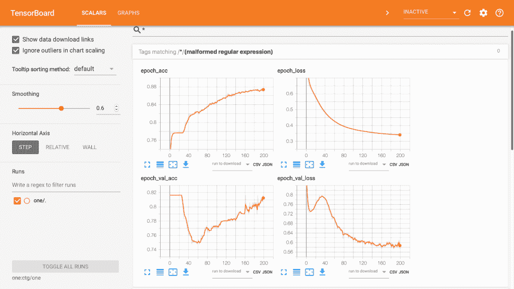
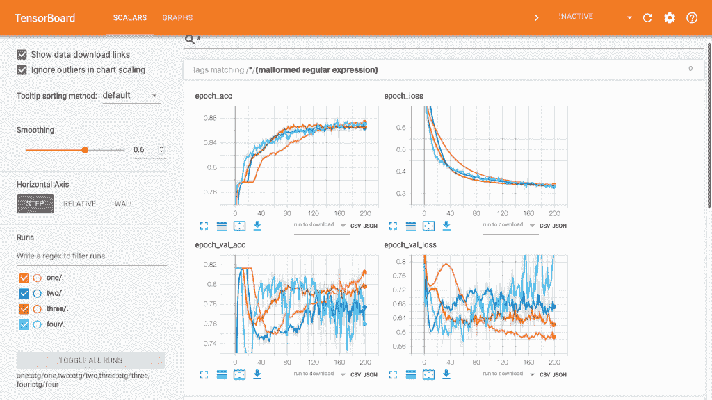
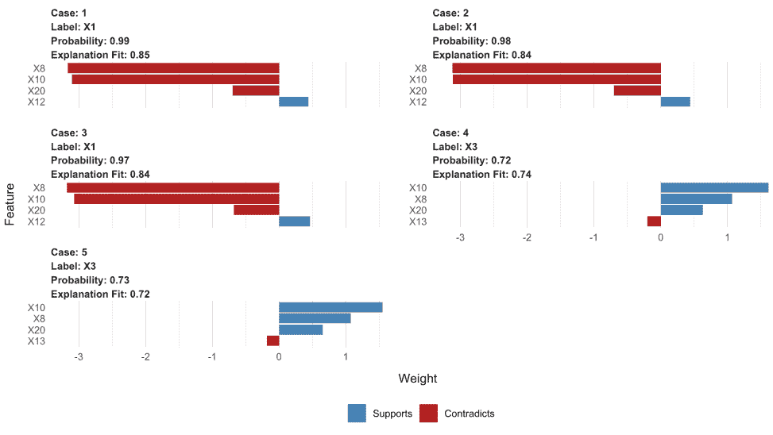
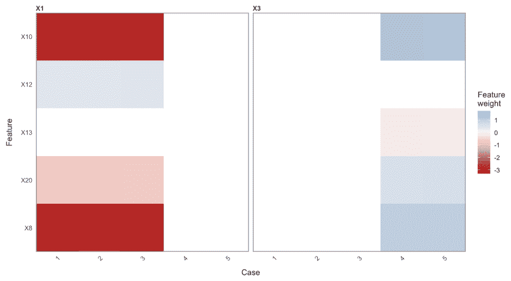
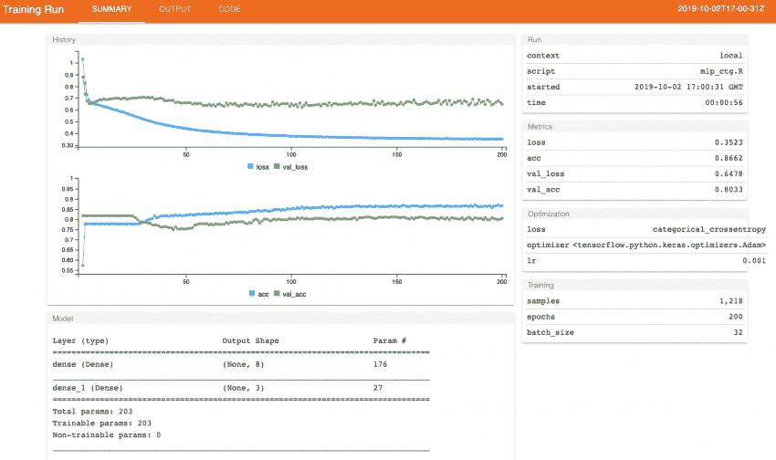
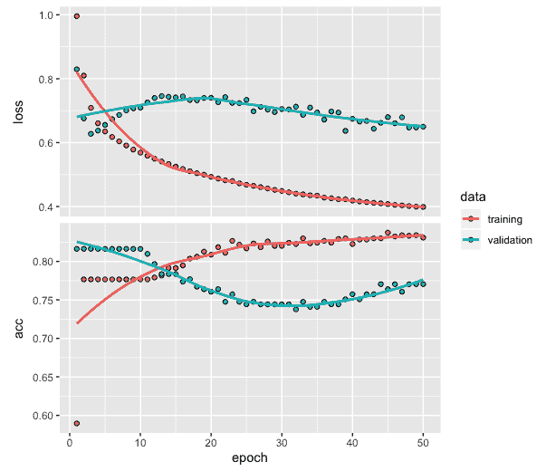
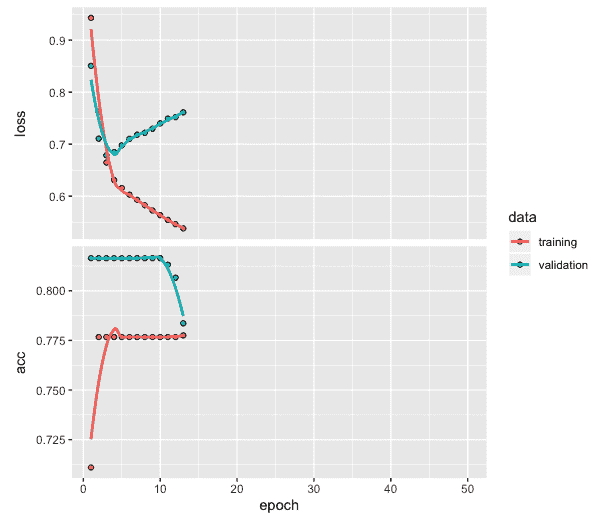

# 十三、提示、技巧和未来之路

在本书中，我们讲述了如何应用各种深度学习网络来开发预测和分类模型。我们介绍的几个技巧和诀窍是特定应用领域特有的，它们帮助我们为我们开发的模型获得更好的预测或分类性能。

在这一章中，我们将回顾一些技巧和窍门，当你继续将这些方法应用于新数据和不同问题时，它们将会非常有用。我们将总共涵盖四个主题。请注意，这些方法在前面的章节中没有涉及到，但是我们将利用其中的一些例子来说明它们的用法。

在本章中，我们将讨论以下主题:

*   用于训练表现可视化的张量板
*   用石灰可视化深层网络模型
*   使用 tfruns 可视化模型训练
*   网络训练提前停止


# 用于训练表现可视化的张量板

对于可视化深度网络训练表现，TensorBoard 是一个有用的工具，作为 TensorFlow 软件包的一部分提供。我们将重新运行我们在[第 2 章](c5c236d5-fc58-4d90-95b0-2b05b148b187.xhtml)、*用于多类分类的深度神经网络*中使用的深度网络模型，其中我们使用 CTG 数据为患者开发了一个多类分类模型。有关数据处理、模型架构和编译模型的代码，可以参考[第二章](c5c236d5-fc58-4d90-95b0-2b05b148b187.xhtml)、*多类分类的深度神经网络*。

以下是[第二章](c5c236d5-fc58-4d90-95b0-2b05b148b187.xhtml)、*多类分类深度神经网络*中`model_one`的代码:

```r
# Fitting model and TensorBoard
setwd("~/Desktop/")
model_one <- model %>% fit(training, 
                         trainLabels, 
                         epochs = 200,  
                         batch_size = 32,
                         validation_split = 0.2,
                         callbacks = callback_tensorboard('ctg/one'))
tensorboard('ctg/one')
```

从前面的代码中，我们可以观察到以下内容:

*   我们已经设置了一个工作目录，这将是一个桌面，用于存储模型的训练结果，以便在 TensorBoard 上可视化。
*   使用附加的特性回调来拟合模型，其中我们使用`callback_tensorboard`函数将数据存储在桌面上的`ctg/one`文件夹中，以便以后可视化。
*   注意，`ctg`目录是在拟合模型时自动创建的。
*   最后，`tensorboard`功能用于使用存储在`ctg/one`文件夹中的数据进行可视化。

以下截图是 TensorBoard 的:



前面的屏幕截图显示了 200 个时期的训练和验证数据的损失和准确度图。这用于训练模型。TensorBoard 上的这种可视化本质上是交互式的，并为用户提供了额外的选项，以便他们可以在训练过程中探索和理解模型性能。

正如我们在本书的所有章节中看到的，这些章节阐释了各种深度学习方法的使用，提高分类或预测模型的性能需要大量的实验。为了帮助进行这样的实验，使用张量板的一个主要好处是它允许使用交互式可视化非常容易地比较模型性能。

我们运行了来自第二章[和*的三个模型，用于多类分类*，并将模型训练数据存储在`ctg`文件夹的子文件夹`two`、`three`和`four`中。运行以下代码进行 TensorBoard 可视化:](c5c236d5-fc58-4d90-95b0-2b05b148b187.xhtml)

```r
# TensorBoard visualization for multiple models
tensorboard(c('ctg/one', 'ctg/two', 'ctg/three', 'ctg/four'))
```

前面的代码为所有四个模型创建了 TensorBoard 可视化。生成的 TensorBoard 页面的屏幕截图如下:



前面的可视化显示了所有四个模型的训练和验证数据的损失和准确性值。以下是我们对这个情节的一些观察:

*   运行的四个模型的结果以不同的颜色显示，以便我们快速识别它们并进行比较。
*   与通过训练数据观察到的结果相比，基于验证数据的损失和准确度值在结果中显示出更高的可变性。
*   还提供了下载任何图或相关数据的选项。

当我们选择用于深度网络的架构类型、历元数、批量大小和其他感兴趣的模型相关属性时，可视化具有不同参数值的不同模型的能力会很有用。如果需要，它还可以为我们提供进一步实验的方向，并帮助我们比较当前和过去的结果。


# 用石灰可视化深层网络模型

在本书到目前为止提供的应用示例中，在我们开发了分类或预测深度网络模型之后，我们进行了可视化以查看模型的整体性能。这些评估是使用训练和测试数据完成的。这种评估背后的主要思想是获得对模型性能的整体或全局理解。然而，在某些情况下，我们希望获得更深入的理解，以及对特定预测的解释。例如，我们可能对理解影响测试数据中特定预测的主要特征或变量感兴趣。这种“局部”解释是一个名为**局部可解释模型不可知解释**或 **LIME** 的包的焦点。LIME 有助于对每个预测提供更深入的见解。

对于我们在 Keras 中开发的模型，使用 LIME 执行可视化的代码如下:

```r
# LIME package
library(lime)

# Using LIME with keras
model_type.keras.engine.sequential.Sequential <- 
function(x, ...) {"classification"}
predict_model.keras.engine.sequential.Sequential <- 
  function(x,newdata,type, ...) {p <- predict_proba(object=x, x=as.matrix(newdata))
         data.frame(p)}

# Create explainer using lime
explainer <- lime(x = data.frame(training), 
             model = model, 
             bin_continuous = FALSE)

# Create explanation
explanation <- explain(data.frame(test)[1:5,],  
                  explainer    = explainer, 
                  n_labels     = 1,  
                  n_features   = 4,  
                  kernel_width = 0.5)
testtarget[1:5]
[1] 0 0 0 2 2
```

如前面的代码所示，我们使用两个函数来将 LIME 与 Keras 模型结合使用。在第一个函数中，我们指出我们将使用一个分类模型。第二个函数获取预测概率。在本节中，我们将使用第二章、*中的`model_one`进行多类分类*。然后，我们将对训练数据、模型(即`model_one`)使用`lime`函数，并将连续变量的宁滨指定为`FALSE`。产生的解释器与`explain`函数一起使用，其中我们将指定标签的数量为一个，并将每种情况下使用的最重要的特征的数量指定为四个。我们指定内核宽度为 0.5。我们还可以看到，测试数据中的前三位患者，其类别被标记为 0，表明他们属于正常患者类别。同样，测试数据中的第 4 个和第 5 个患者已被标记为 2，表明他们属于病理患者类别。

我们使用`plot_features(explanation)`获得了以下图:



前面的图为测试数据中的前五名患者提供了单独的图。以下是从该图中可以得出的一些观察结果:

*   五个病人都被正确分类了。
*   前三个患者已经被分类为属于标记为 0 的类别，代表正常患者。

*   剩余的两个患者被分类为属于标记为 2 的类别，代表病理患者。
*   前三个病例的预测概率为 0.97 或以上，第四和第五个患者的预测概率为 0.72 或以上。
*   该图描述了对每个患者进行具体分类的四个最重要的特征。
*   对于每个患者，带有蓝色条的特征支持模型的结论，而带有红色条的特征与模型的结论相矛盾。
*   X8、X10 和 X20 变量的较高值似乎对被分类为病理性的患者具有较高的影响。
*   X12 变量的较高值似乎影响被分类为正常的患者。

使用`plot_explanations(explanation)`可以获得以下热图:



我们可以从前面的热图中观察到以下情况:

*   热图使得比较每个患者的不同变量更容易，从而有助于解释。
*   它总结了案例、特征和标签组合的结果，但不像前面的图提供那么多细节。
*   对于 X1 类或标记为正常的患者(1、2 和 3)，所有四个特征(X8、X10、X12 和 X20)具有非常相似的权重。
*   对于 X3 分类，或标记为病理性(4 和 5)的患者，所有四个特征(X8、X10、X13 和 X20)再次具有近似相似的权重。


# 使用 tfruns 可视化模型训练

当我们使用 Keras 运行深度网络模型时，我们可以利用`tfruns`来可视化损失和准确度图，以及其他与模型相关的摘要。虽然我们也可以在需要时获取剧情和相关摘要，但是使用`tfruns`的主要优势是我们可以在一个地方获取所有内容。我们可以利用下面的代码来实现这一点:

```r
library(tfruns)
training_run("mlp_ctg.R")
```

在前面的代码中，被引用的`R`文件包含运行[第 2 章](c5c236d5-fc58-4d90-95b0-2b05b148b187.xhtml)、*中的`model_one`用于多类分类的深度神经网络*的代码。当我们运行代码时，`mlp_ctg.R`文件可能存储在计算机上。一旦我们运行了代码，就会自动出现以下交互式屏幕:



前面屏幕截图中显示的页面提供了以下内容:

*   训练和验证数据的损失和准确度值的交互图
*   基于模型架构的模型摘要
*   关于运行的信息，包括完成所有时期所用的时间
*   基于训练和验证数据的准确性和损失形式的数字摘要
*   使用的样本、时期数和指定的批次大小


# 网络训练提前停止

当训练一个网络时，我们预先指定需要的历元数，而不知道实际需要多少个历元。如果我们指定的历元数与实际需要的相比太少，我们可能必须通过指定更多的历元来再次训练网络。另一方面，如果我们指定了比实际需要的更多的时期，那么这可能导致过度拟合的情况，并且我们可能必须通过减少时期的数量来重新训练网络。对于每个历元都需要很长时间才能完成的应用来说，这种试错法非常耗时。在这种情况下，我们可以利用回调来帮助在适当的时候停止网络训练。

为了说明这个问题，让我们使用来自第 2 章、*的[的 CTG 数据开发一个分类模型，用于多类分类的深度神经网络](c5c236d5-fc58-4d90-95b0-2b05b148b187.xhtml)*，使用以下代码:

```r
# Training network for classification with CTG data (chapter-2)
model <- keras_model_sequential()
model %>% 
  layer_dense(units = 25, activation = 'relu', input_shape = c(21)) %>%
  layer_dense(units = 3, activation = 'softmax') 
model %>% compile(loss = 'categorical_crossentropy', 
                  optimizer = 'adam',
                  metrics = 'accuracy')
history <- model %>% fit(training, 
                         trainLabels, 
                         epochs = 50,  
                         batch_size = 32,
                         validation_split = 0.2)
plot(history)
```

在前面的代码中，我们指定了 50 个时期。训练过程完成后，我们可以绘制训练和验证数据的损失和准确度值，如下所示:



从前面的图中，我们可以观察到以下情况:

*   我们可以观察到，验证数据的损失值最初在最初的几个时期减少，然后开始增加。
*   该图还显示，在最初的几个时期之后，训练和验证数据的损失值显示出差异，并且趋向于相反的方向。
*   如果我们想更早地停止训练过程，而不是等待所有 50 个纪元完成，那么我们可以利用 Keras 中可用的回调功能。

以下代码包括在训练网络时`fit`函数中的回调功能:

```r
# Training network with callback
model <- keras_model_sequential()
model %>% 
  layer_dense(units = 25, activation = 'relu', input_shape = c(21)) %>%
  layer_dense(units = 3, activation = 'softmax') 
model %>% compile(loss = 'categorical_crossentropy', 
                  optimizer = 'adam',
                  metrics = 'accuracy')
history <- model %>% fit(training, 
                         trainLabels, 
                         epochs = 50,  
                         batch_size = 32,
                         validation_split = 0.2,
                         callbacks = callback_early_stopping(monitor = "val_loss", 
                                                   patience = 10))
plot(history)
```

在前面的代码中，回调包含了提前停止:

*   我们用于监控的指标是验证损失值。在这种情况下，可以尝试的另一个度量是验证准确性，因为我们正在开发一个分类模型。
*   我们已经将耐心指定为 10，这意味着当 10 个时期没有改进时，训练过程将自动停止。

损失图和精确度图也有助于我们决定适当的耐心值。以下是损失和准确度的曲线图:



正如我们所看到的，这一次，训练过程没有运行所有 50 个时期，并且一旦 10 个时期的损失值没有改善就停止。


# 摘要

使用深度学习网络开发分类和预测模型涉及大量实验，以获得具有高质量性能的模型。为了有助于这一过程，有各种方法对可视化和控制网络训练非常有用。在这一章中，我们讨论了四种有用的方法。我们看到 TensorBoard 提供了一个工具，在用不同的架构和模型中的其他变化训练网络之后，我们可以使用它来评估和比较模型性能。使用 TensorBoard 的优势在于它以一种用户友好的方式将所有必要的信息集中在一个地方。在某些情况下，我们希望了解在使用分类或预测模型时，特定预测的主要特征或变量是如何受到影响的。在这种情况下，我们可以使用 LIME 来想象主要特性的影响。

我们在本章举例说明的另一个有用的技巧是借助 tfruns 的可视化。在开发深度网络模型时，我们会遇到与特定模型相关的各种情节和摘要。使用 tfruns，我们可以借助交互式屏幕在一个地方可视化所有信息。在接下来的旅程中非常有用的另一个技巧是，当开发出合适的分类或预测模型时，使用回调来自动停止训练过程。本章讨论的所有方法对未来的旅程都非常有用，尤其是当你在处理复杂而具有挑战性的问题时。