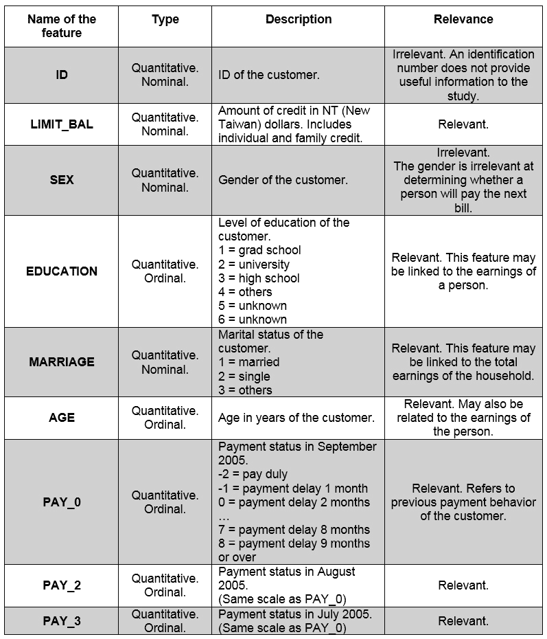
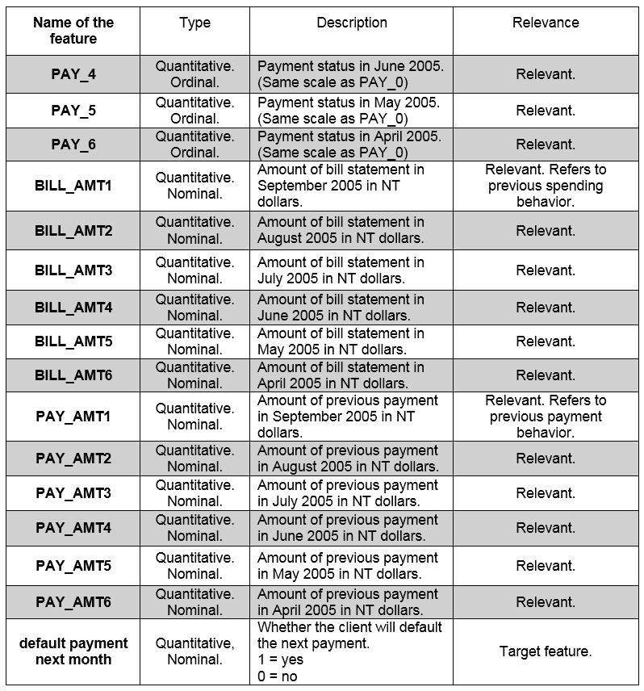
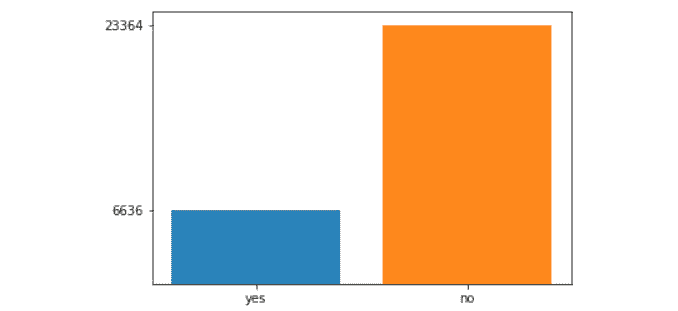

# 三、使用 DNN 的分类问题

## 学习目标

本章结束时，您将能够:

*   解释深度学习在银行业的用途
*   区分为回归任务和分类任务构建神经网络
*   在 PyTorch 中应用自定义模块的概念来解决问题
*   使用深度神经网络解决分类问题
*   处理装配不足或装配过度的模型
*   部署 PyTorch 模型

在这一章中，我们将重点关注使用 DNNs 解决简单的分类任务，以巩固我们在深度神经网络方面的知识。

## 简介

虽然深度神经网络(DNNs)可以用于解决回归问题，如前一章所述，但它们更常用于解决分类任务，其目标是从一系列选项中预测结果。

利用这种模型的一个领域是银行业。这主要是因为他们需要根据人口统计数据预测未来的行为，以及确保长期盈利的主要目标。在银行业中的一些应用包括贷款申请评估、信用卡审批、股票市场价格预测以及通过分析行为检测欺诈。

本章将重点关注使用深度人工神经网络解决分类银行问题，遵循实现有效模型所需的所有步骤:数据探索、数据准备、架构定义和模型训练、模型微调、错误分析，以及最终模型的部署。

#### 注意

提醒一下，包含本章使用的所有代码的 GitHub 资源库可以在以下站点找到:[https://GitHub . com/TrainingByPackt/Applied-Deep-Learning-with-py torch](https://github.com/TrainingByPackt/Applied-Deep-Learning-with-PyTorch)。

## 问题定义

定义问题与构建模型或提高准确性一样重要。为什么会这样呢？因为即使你能够使用最强大的算法，使用最先进的方法来改善结果，如果你解决了错误的问题，或者使用了错误的数据，那么它也可能是无用的。

此外，学会如何深入思考以理解什么能做什么不能做，以及什么能做是如何完成的，这一点至关重要。考虑到当我们正在学习应用机器学习或深度学习算法时，问题总是清楚地呈现，并且除了模型的训练和性能的改进之外不需要进一步的分析，这是特别相关的；另一方面，现实生活中，问题往往扑朔迷离，数据往往杂乱无章。

因此，在本节中，您将学习一些最佳实践，以便根据您组织的需求和您手头的数据来定义您的问题。

为此，需要做的事情如下:

*   理解问题的内容、原因和方式。
*   分析手头的数据，以确定我们的模型的一些关键参数，例如要执行的学习任务的类型、必要的准备以及绩效指标的定义。
*   执行数据准备，以降低向模型引入偏差的可能性。

### 银行业的深度学习

与医疗行业类似，银行和金融机构每天都要处理大量的信息，他们需要利用这些信息做出重要的决策，这些决策不仅会影响他们自己组织的未来，还会影响信任他们的数百万个人的未来。

这些决策每秒钟都会做出，早在 20 世纪 90 年代，银行部门的人们曾经依赖于专家系统，这些专家系统基本上使用人类专家知识来编写基于规则的程序。不足为奇的是，这类程序存在缺陷，因为它们需要预先对所有信息或可能的情景进行编程，这使得它们在处理不确定性和高度变化的市场时效率低下。

随着技术的进步以及收集客户数据能力的提高，银行业一直在引领向更专业的系统过渡，这些系统利用统计模型来帮助做出此类决策。此外，由于银行既需要考虑自身的盈利能力，也需要考虑客户的盈利能力，因此它们被认为是不断跟上技术进步、每天都变得更加高效和准确的行业之一。

如今，随着医疗保健市场的发展，银行和金融行业正在推动神经网络市场的发展。这主要是由于神经网络通过使用大量以前的数据来预测未来行为来处理不确定性的能力。考虑到人脑没有能力分析如此大量的数据，这是基于人类专家知识的系统无法实现的。

深度学习在银行和金融服务的一些领域得到了展示和简要说明:

*   **Loan application evaluation**: Banks issue loans to customers based on different factors, including demographical information, credit history, and so on. Their main objective in this process is to minimize the number of customers that will default on loan payments (minimize the failure rate), and this way, maximize the returns obtained through the loans that have been issued.

    神经网络用于帮助做出是否给予贷款的决定。他们通常使用以前未能还贷的贷款申请人以及那些按时还贷的贷款申请人的数据进行训练。一旦创建了模型，就要将新申请人的数据输入到模型中，以便预测他们是否会偿还贷款，考虑到模型的重点应该是减少误报的数量(模型预测客户会拖欠贷款，但实际上他们不会)。

    众所周知，在工业中，神经网络的失败率低于依赖人类专业知识的传统方法。

*   **Detection of fraud**: Fraud detection is crucial for banks and financial providers, now more than ever, considering the advancements of technology that, in spite of making our lives easier, also leave us exposed to greater financial risks, especially on online banking platforms.

    在该领域中使用神经网络，特别是卷积神经网络(CNN ),用于字符和图像识别，以检测字符图像中的隐藏和抽象模式，从而确定用户是否被取代。

*   `.xls`文件。

### 探索数据集

在接下来的小节中，我们将重点使用信用卡客户的**违约** ( **DCCC** )数据集来解决一个与信用卡支付相关的分类任务，这个数据集以前是从 UC Irvine Repository 站点下载的。

本节的主要思想是清楚地陈述数据问题的内容、原因和方式，这将有助于确定研究的目的和评估标准。此外，在本节中，我们将详细分析手头的数据，以确定数据准备过程中所需的一些步骤(例如，将定性特征转换为数字表示)。

首先，让我们定义什么、为什么和如何。考虑这样做是为了识别组织的真正需求:

**What** :建立一个能够确定客户是否会拖欠即将到来的付款的模型。

**为什么**:能够预见下个月要收到的付款金额(货币)。这将有助于公司确定当月的支出策略，此外还允许公司定义对每个客户采取的行动，以确保那些将支付账单的客户未来付款，并提高那些违约客户的付款概率。

**如何**:使用历史数据来训练模型，该历史数据包含人口统计信息、信用历史以及有和没有拖欠付款的客户的先前账单。在对输入数据进行训练后，该模型应该能够确定客户是否有可能拖欠下次付款。

考虑到这一点，目标特性应该是声明客户是否会拖欠下一次付款，这需要一个二元结果(是/否)。这意味着要开发的学习任务是一个分类任务，因此，损失函数应该能够测量这种类型的学习的差异(例如，交叉熵函数，如前一章所述)。

一旦很好地定义了问题，您需要确定最终模型的优先级。这意味着确定所有输出类是否同等重要。例如，测量肺部肿块是否是恶性的模型应该主要集中在最小化`false negatives`(模型预测没有恶性肿块，但肿块实际上是恶性的患者)。另一方面，为识别手写字符而构建的模型不应专注于一个特定的字符，而应在同等地识别所有字符方面最大化其性能。

考虑到这一点，以及“为什么”语句中的解释，`Default of Credit Card Clients`数据集的模型的优先级应该是最大化模型的整体性能，而不是优先考虑任何类标签。这主要是因为“为什么”声明宣称，研究的主要目的应该是更好地了解银行将收到的资金，以及对可能拖欠付款的客户采取某些行动，并对那些不会拖欠付款的客户采取不同的行动。

据此，在本案例研究中使用的性能指标是**准确度**，其重点是最大化**正确分类的实例**。这是指任何类别标签的正确分类实例与实例总数之间的比率。

下表包含对数据集中出现的每个要素的简要说明，这有助于确定它们与研究目的的相关性，并确定需要执行的一些准备任务。



###### 图 3.1:DCCC 数据集中的要素描述



###### 图 3.2:DCCC 数据集中的要素描述(续)

考虑到这些信息，可以得出结论，在 25 个特征(包括目标特征)中，有 2 个需要从数据集中移除，因为它们被认为与研究目的无关。请记住，与本研究无关的特征可能与其他研究相关。例如，一项关于个人卫生用品的研究可能认为性别特征是相关的。

此外，所有要素都是定量的，这意味着除了重新调整它们的比例之外，不需要转换它们的值。目标特征也被转换成其数字表示，其中拖欠下一次付款的客户用 1 表示，而没有拖欠付款的客户用 0 表示。

### 资料准备

虽然在这方面有一些好的做法，但没有一套固定的步骤来准备(预处理)数据集以开发深度学习解决方案，而且大多数时候，采取的步骤将取决于手头的数据、要使用的算法和研究的其他特征。

尽管如此，在开始训练您的模型之前，有一些关键的方面必须作为良好的实践来处理。其中大部分您已经在上一章中了解过，将针对所讨论的数据集进行修订，并在目标要素中添加了类别不平衡的修订内容:

#### 注意

本节将介绍准备 DCCC 数据集的过程，并附有简要说明。随意打开一个 Jupyter 笔记本，复制这个过程，考虑到这将是后续活动的起点。

*   `skiprows` argument to remove the first row of the Excel file, which is irrelevant as it contains a second set of headers.

    从给出的代码行中，可以获得以下结果:


###### 图 3.3:DCCC 数据集的头部

数据集的形状为 30，000 行 25 列，可以使用以下代码行获得:

```
print("rows:",data.shape[0]," columns:", data.shape[1])
```

*   **Remove irrelevant features**: By performing the analysis of each of the features, it was possible to determine that two of the features are to be removed from the dataset as they are irrelevant to the purpose of the study.

    ```
    data_clean = data.drop(columns=["ID", "SEX"])
    data_clean.head()
    ```

    结果数据集应该包含 23 列，而不是最初的 25:


###### 图 3.4:移除不相关要素后的 DCCC 数据集的头部

*   **Check for missing values**: Next, it is time to check whether the dataset is missing values, and if so, calculate the percentage of how much they represent each feature, which can be done using the following lines of code:

    ```
    total = data_clean.isnull().sum()
    percent = (data_clean.isnull().sum()/
                     data_clean.isnull().count()*100)
    pd.concat([total, percent], axis=1, 
    keys=['Total', 'Percent']).transpose()
    ```

    第一行对数据集的每个要素的缺失值进行求和。接下来，我们计算每个要素中缺失值与所有值的比例。最后，我们连接前面计算的两个值，在一个表中显示结果。结果如*图 3.5* 所示:

。


###### 图 3.5:DCCC 数据集中缺失值的计数

根据这些结果，可以说数据集没有丢失任何值，因此这里不需要进一步的过程。

*   `BILL_AMT1` and `BILL_AMT4`, each with a participation of 2.3% of the total instances.

    这意味着，考虑到他们的参与太少，不需要采取进一步的行动，并且不太可能对最终模型产生影响。

    **检查类别不平衡**:当目标特征中的类别标签没有被同等地表示时，类别不平衡发生；例如，一个数据集包含 90%没有拖欠下一次付款的客户，而只有 10%的客户拖欠，这样的数据集被认为是不平衡的。

    有几种方法来处理阶级不平衡，其中一些解释如下:

    **收集更多数据**:虽然这并不总是一个可行的途径，但它可能有助于平衡类，或者允许在不严重减少数据集的情况下移除过多的类。

    **改变性能指标**:一些指标，比如准确性，对于测量不平衡数据集的性能并不好。反过来，建议使用分类问题的精度或召回率等指标来衡量性能。

    **对数据集进行重采样**:这包括改变数据集以平衡类别。这可以通过两种不同的方式实现:1)添加欠采样类的副本(称为过采样)，或者 2)删除欠采样类的实例(称为欠采样)。

    只需计算目标要素中每个类的出现次数，就可以检测到类的不平衡，如下所示:

    ```
    target = data_clean["default payment next month"]
    yes = target[target == 1].count()
    no = target[target == 0].count()
    print("yes %: " + str(yes/len(target)*100) + " - no %: " + str(no/len(target)*100))
    ```

    从前面的代码中，可以得出拖欠付款的客户数量占数据集的 22.12%的结论。这些结果也可以使用以下代码行显示在图中:

    ```
    import matplotlib.pyplot as plt
    fig, ax = plt.subplots()
    plt.bar("yes", yes)
    plt.bar("no", no)
    ax.set_yticks([yes,no])
    plt.show()
    ```

    这导致了下图:



###### 图 3.6:目标特征的类别计数

为了解决这个问题，并考虑到没有更多的数据要添加，性能指标实际上是准确性，有必要执行数据重采样。

以下是对数据集执行过采样的代码片段，随机创建代表不足的类的重复行:

```
data_yes = data_clean[data_clean["default payment next month"]                       == 1]
data_no = data_clean[data_clean["default payment next month"]                      == 0]
over_sampling = data_yes.sample(no, replace=True, random_state                                 = 0)
data_resampled = pd.concat([data_no, over_sampling], axis=0)
```

首先，我们将每个类标签的数据分成独立的数据帧。接下来，我们使用 pandas 的`sample()`函数来构造一个新的数据帧，它包含与过度表示的类‘data frame’一样多的重复实例。

最后，`concat()`函数用于连接过度表示的类的数据帧和新创建的相同大小的数据帧。

通过计算每个类在整个数据集上的参与度，结果应该会显示出平等表示的类。此外，数据集到这一点的最终形状应该等于(46728，23)。

*   **从目标中分割特征**:我们将数据集分割成特征矩阵和目标矩阵，以避免重新调整目标值:

    ```
    X = data_clean.drop(columns=["default payment next month"]) y = data_clean["default payment next month"] 
    ```

*   **Rescale the data**: Finally, we rescale the values of the features matrix in order to avoid introducing bias to the model:

    ```
    X = (X - X.min())/(X.max() - X.min())
    X.head()
    ```

    前面几行代码的结果如*图 3.7* 所示:


###### 图 3.7:标准化后的特征矩阵

#### 注意

考虑到**婚姻**和**教育**都是序数特征，意味着它们遵循一个顺序或等级；选择重新调整方法时，请确保保持有序。

为了便于在即将到来的活动中使用准备好的数据集，特征(`X`)和目标(`y`)矩阵将连接成一个 pandas DataFrame，该 DataFrame 将保存为一个 CSV 文件，使用以下代码:

```
final_data = pd.concat([X, y], axis=1)
final_data.to_csv("dccc_prepared.csv", index=False)
```

执行完所有这些步骤后，DCCC 数据集(在一个新的 CSV 文件中)就可以用于训练模型了，这将在下一节中进行解释。

### 建立模型

一旦定义了问题，并研究和准备了手头的数据，就该定义模型了。网络体系结构的定义、层的类型、损失函数等等应该在前面的分析之后处理。这主要是因为机器学习没有“放之四海而皆准”的方法，深度学习更没有。

回归任务与分类任务需要不同的方法，聚类、计算机视觉或机器翻译也是如此。因此，在下一节中，您将会发现构建解决分类任务的模型的关键特征，以及如何实现“良好”架构的解释，以及如何以及何时使用 PyTorch 中的定制模块。

### 用于分类任务的神经网络

正如在上一章的练习中所看到的，为回归任务构建的神经网络使用输出作为连续值，这就是为什么输出函数没有激活函数，只有一个输出节点(真实值)，就像基于房屋和邻近地区的特征构建模型来预测房价一样。

考虑到这一点，应该通过计算实际值和预测值之间的差异来测量性能，就像计算 125.3(预测值)和 126.38(实际值)之间的距离一样。如前所述，有许多方法可以测量这种差异，最常用的度量是**均方误差** ( **MSE** )或其变体**均方根误差**(**)。**

 **与此相反，分类任务的输出是某一组输入要素属于每个输出标注或类的概率，这是使用 Sigmoid(用于二元分类)或 Softmax(用于多类分类)激活函数完成的。而且，对于二元分类任务，输出层应该包含一个(对于 sigmoid)或两个(对于 softmax)输出节点，而对于多类分类任务，输出节点应该等于类标签的数量。

这种计算属于每个输出类的可能性的能力，再加上 argmax 函数，将检索具有更高概率的类作为最终预测。

#### 注意

Python 中的 argmax 是一个函数，能够返回轴上最大值的索引。

考虑到这一点，模型的性能应该是实例是否被分类到正确的类别标签的问题，而不是与两个值之间的距离的测量有关的问题，因此使用不同的损失函数(交叉熵是最常用的)来训练用于分类问题的神经网络，以及使用不同的性能度量，例如准确度、精确度和召回率。

### 好的架构

首先，正如整本书所解释的，为了确定神经网络的一般拓扑，理解手头的数据问题是很重要的。同样，常规分类问题不需要与计算机视觉问题相同的网络架构。

一旦确定了这一点，并考虑到在确定隐藏层的数量、类型或每层中的单元数量方面没有正确的答案，最好的方法是从初始架构开始，然后可以对其进行改进以提高性能。

为什么这如此重要？因为有大量的参数需要优化，所以有时很难做出承诺和开始。考虑到在训练神经网络时，一旦初始架构已经被训练和测试，有几种方法来确定需要改进什么，这是不幸的。事实上，将数据集划分为三个子集的全部原因是考虑到以下可能性:用一个子集训练数据集，用另一个子集测量和微调模型，最后用以前未使用过的最终子集测量最终模型的性能。

考虑到所有这些，下面将解释一组惯例和经验法则，以帮助定义人工神经网络初始结构的决策过程:

*   **输入层**:这很简单——只有一个输入层，其单元数取决于训练数据的形状。具体来说，输入图层中的单位数应等于输入数据包含的要素数。
*   **Hidden layer**: Hidden layers can vary in quantity. ANNs can have one, more, or none. To choose the right number, it is important to consider the following:

    数据问题越简单，需要的隐藏层就越少。记住可以线性分离的数据问题应该只有一个隐藏层。另一方面，随着深度学习的进步，现在可以使用许多隐藏层(无限制)来解决真正复杂的数据问题。

    首先，隐藏单元的数量应该介于输入层的单元数量和输出层的单元数量之间。

*   **输出层**:同样，任何人工神经网络只有一个输出层。它包含的单元数量取决于要开发的学习任务以及数据问题。如前所述，对于回归任务，只有一个单位，即预测值。另一方面，对于分类问题，考虑到模型的输出应该是属于每个类标签的一组特征的概率，单元的数量应该等于可用的类标签的数量。
*   **其他参数**:按照惯例，对于网络的第一次配置，其他参数应保留默认值。这主要是因为在考虑更复杂的近似之前，测试最简单的数据问题模型总是一个好的做法，更复杂的近似可能表现得一样好或更差，但需要更多的资源。

一旦定义了初始架构，就应该训练和测量模型的性能，以便执行进一步的分析，这很可能导致网络架构或其他参数值的变化，例如学习速率的变化或正则化项的增加。

### PyTorch 定制模块

PyTorch 的开发团队创建了定制模块，为用户提供了更大的灵活性。与前几章中探讨的`Sequential`容器相反，当希望构建更复杂的模型架构时，或者当希望进一步控制每一层中发生的计算时，应该使用定制模块。

然而，这并不意味着定制模块方法只能在这种情况下使用。相反，一旦您学会了使用这两种方法，那么选择哪一种用于不太复杂的体系结构就是一个偏好问题了。

例如，下面是使用`Sequential`容器定义的两层神经网络的代码片段:

```
import torch.nn as nn
model = nn.Sequential(nn.Linear(D_i, D_h),
                      nn.ReLU(),
                      nn.Linear(D_h, D_o),
                      nn.Softmax())
```

这里，`D_i`是指输入维度(输入数据中的特征)，`D_h`是指隐藏维度(隐藏层中的节点数)，`D_o`是指输出维度。

使用自定义模块，可以构建等效的网络体系结构，如下所示:

```
import torch
from torch import nn, optim
import torch.nn.functional as F
class Classifier(nn.Module):
    def __init__(self, input_size):
        super().__init__()
        self.hidden_1 = nn.Linear(input_size, 100)
        self.hidden_2 = nn.Linear(100, 100)
        self.hidden_3 = nn.Linear(100, 50)
        self.hidden_4 = nn.Linear(50,50)
        self.output = nn.Linear(50, 2)

        self.dropout = nn.Dropout(p=0.1)
        #self.dropout_2 = nn.Dropout(p=0.1)

    def forward(self, x):
        z = self.dropout(F.relu(self.hidden_1(x)))
        z = self.dropout(F.relu(self.hidden_2(z)))
        z = self.dropout(F.relu(self.hidden_3(z)))
        z = self.dropout(F.relu(self.hidden_4(z)))
        out = F.log_softmax(self.output(z), dim=1)

        return out
```

值得一提的是，交叉熵损失函数要求网络的输出是原始的(在通过使用 softmax 激活函数获得概率之前)，这就是为什么通常发现用于分类问题的神经网络架构没有用于输出层的激活函数。此外，为了从这种方法中获得预测，有必要在训练后将 softmax 激活函数应用于网络的输出。

处理这种限制的另一种方法是对输出层使用`log_softmax`激活函数。接下来，损失函数被定义为负对数似然损失(`nn.NLLLoss`)。最后，通过从网络的输出中取指数，可以得到属于每个类别标签的实际概率。这是本章活动将使用的方法。

一旦定义了模型架构，接下来的步骤将是编写负责根据训练数据训练模型的部分，以及测量它在训练和验证集上的性能。

这里，将给出对我们所讨论的内容进行编码的逐步说明:

```
model = Classifier()
criterion = nn.NLLLoss()
optimizer = optim.Adam(model.parameters(), lr=0.005)
epochs = 10
batch_size = 100
```

可以看出，第一步是定义在网络训练期间将使用的所有变量。

#### 注意

提醒一下，`epochs`指的是整个数据集在网络架构中来回传递的次数。`batch_size`指单批(数据集的一个切片)训练样本的数量。最后，迭代指的是完成一个历元所需的批次数量。

接下来，第一个`for`循环用于遍历先前定义的历元数。在此之后，一个新的`for`循环用于遍历全部数据集的每一批，直到一个时期完成。在这个循环中，会发生以下计算:

1.  该模型在一批训练集中被训练。这里得到一个预测。
2.  通过比较上一步的预测和来自训练集的标签(基本事实)来计算损失。
3.  梯度归零，并为当前步骤再次计算。
4.  基于梯度更新网络的参数。
5.  模型对训练数据的准确度计算如下:
    *   获取模型预测的指数，以获取属于每个类标签的给定数据的概率。
    *   使用`topk()`方法获得概率较高的类标签。
    *   使用 scikit-learn 的公制部分，计算准确度、精确度或召回率。您还可以探索其他性能指标。
6.  关闭梯度计算是为了验证当前模型在验证数据上的性能，如下所示:
    *   该模型对验证集中的数据执行预测。
    *   通过将先前的预测与来自验证集的标签进行比较来计算损失函数。
    *   要计算验证集模型的准确性，请使用与训练数据相同的计算步骤:

        ```
        train_losses, dev_losses, train_acc, dev_acc= [], [], [], [] for e in range(epochs):     X, y = shuffle(X_train, y_train)     running_loss = 0     running_acc = 0     iterations = 0     for i in range(0, len(X), batch_size):         iterations += 1         b = i + batch_size         X_batch = torch.tensor(X.iloc[i:b,:].values).float()         y_batch = torch.tensor(y.iloc[i:b].values)         pred = model(X_batch)         loss = criterion(pred, y_batch)         optimizer.zero_grad()         loss.backward()         optimizer.step()         running_loss += loss.item()         ps = torch.exp(pred)         top_p, top_class = ps.topk(1, dim=1)         running_acc += accuracy_score(y_batch, top_class)     dev_loss = 0     acc = 0     with torch.no_grad():         pred_dev = model(X_dev_torch)         dev_loss = criterion(pred_dev, y_dev_torch)         ps_dev = torch.exp(pred_dev)         top_p, top_class_dev = ps_dev.topk(1, dim=1)         acc = accuracy_score(y_dev_torch, top_class_dev)     train_losses.append(running_loss/iterations)     dev_losses.append(dev_loss)     train_acc.append(running_acc/iterations)     dev_acc.append(acc)     print("Epoch: {}/{}.. ".format(e+1, epochs),           "Training Loss: {:.3f}.. ".format(running_loss/iterations),           "Validation Loss: {:.3f}.. ".format(dev_loss),           "Training Accuracy: {:.3f}.. ".format(running_acc/iterations),           "Validation Accuracy: {:.3f}".format(acc))
        ```

前面的代码片段将打印两组数据的损失和准确性。

### 活动 4:构建人工神经网络

对于此活动，使用之前准备的数据集，我们将构建一个四层模型，该模型能够确定客户是否会拖欠下次付款。为此，我们将使用定制模块方法。

让我们看看下面的场景:你在一家数据科学精品店工作，这家精品店专门为世界各地的银行提供机器/深度学习解决方案。他们最近接受了一家银行的项目，该银行希望预测下个月不会收到的付款。探索性数据分析团队已经为您准备好了数据集，他们要求您构建模型并计算模型的准确性:

1.  Import the following libraries.

    ```
    import pandas as pd
    import numpy as np
    from sklearn.model_selection import train_test_split
    from sklearn.utils import shuffle
    from sklearn.metrics import accuracy_score
    import torch
    from torch import nn, optim
    import torch.nn.functional as F
    import matplotlib.pyplot as plt
    ```

    #### 注意

    考虑到训练集在每个时期之前被混洗，即使使用种子，该活动的确切结果也将是不可再现的。

2.  读取之前准备好的数据集，应该已经命名为`dccc_prepared.csv`。
3.  从目标中分离特征。
4.  使用 scikit-learn 的`train_test_split`函数，将数据集分成训练集、验证集和测试集。使用 60/20/20%的分割比率。将`random_state`设为 0。
5.  将验证集和测试集转换为张量，考虑到特征矩阵应该是浮点类型，而目标矩阵不应该是。暂时不要转换训练集，因为它们将经历进一步的转换。
6.  构建自定义模块类来定义网络层。包括指定将应用于每层输出的激活函数的转发函数。对所有层使用 ReLU，除了输出，你应该使用`log_softmax`。
7.  定义模型训练所需的所有变量。将时期数设置为 50，将批处理大小设置为 128。使用 0.001 的学习率。
8.  Train the network using the training sets data. Use the validation sets to measure performance. To do so, save the loss and the accuracy for both the training and validation sets in each epoch.

    #### 注意

    培训过程可能需要几分钟，具体取决于您的资源。添加打印报表是查看培训过程进度的好方法。

9.  绘制两组的损失图。
10.  Plot the accuracy of both sets.

    #### 注意

    这项活动的解决方案可在第 192 页找到。

## 处理装备不足或装备过度的模型

构建深度学习解决方案不仅仅是定义一个架构，然后使用输入数据训练一个模型；相反，大多数人会同意这是容易的部分。创建高科技模型的艺术包括实现超越人类表现的高水平的准确性。鉴于此，本节将介绍错误分析的主题，错误分析通常用于诊断已训练的模型，以便发现哪些操作更有可能对模型的性能产生积极影响。

### 误差分析

顾名思义，错误分析是指对训练和验证数据集的错误率进行初步分析。然后，该分析用于确定最佳行动方案，以提高模型的性能。

为了进行误差分析，有必要确定 Bayes 误差，也称为不可约误差，它是可达到的最小误差。几十年前，贝叶斯误差相当于人为误差，这意味着在当时，专家能够达到的最小误差水平。

如今，随着技术和算法的改进，这一价值变得越来越难以估计，因为机器能够超越人类的表现，但没有办法衡量它们与人类相比能做得多好，因为我们只能了解我们的能力。

开始时，为了进行误差分析，通常将贝叶斯误差设置为等于人为误差。然而，这种限制并不是一成不变的，研究人员知道超越人类的表现也应该是最终目标。

执行误差分析的过程如下:

1.  通过计算选择的度量来衡量模型的性能。这个度量应该在训练和验证数据集上进行计算。
2.  使用这种方法，通过从 1 中减去先前计算的性能指标来计算每个集合的错误率。以下面的等式为例:

    ###### 图 3.8:计算训练集

    上模型的错误率的等式
3.  从训练集误差(A)中减去贝叶斯误差。保存差异，这将用于进一步的分析。
4.  从验证集误差(B)中减去训练集误差，并保存差值。
    *   取第 3 步和第 4 步中计算的差值，并使用以下规则:
    *   如果步骤 3 中计算的差值高于另一个，则模型欠拟合，也称为高偏差。
5.  如果步骤 4 中计算出的差异高于另一个，则模型过度拟合，也称为高方差:


###### 图 3.9:显示如何执行错误分析的图表

我们解释的规则并不表明模型可能只存在上述问题之一，而是具有较高差异的问题对模型的性能有更大的影响，这意味着修复它将在更大程度上提高性能。

让我们解释一下如何处理这些问题:

*   **High-bias**: An underfitted model, or a model suffering from high bias, is a model that is not capable of understanding the training data, and hence, it is not able to uncover patterns and generalize with other sets of data. This means that the model does not perform well over any set of data.

    为了减少影响模型的偏差，建议定义一个更大/更深的网络(更多的隐藏层)或训练更多的迭代。通过添加更多的层和增加训练时间，网络有更多的资源来发现描述训练数据的模式。

*   **High-variance**: An overfitted model, or a model suffering from high variance, is a model that is having trouble generalizing the training data; it is learning the details of the training data too well, including its outliers. This means that the model is performing too well over the training data, but poorly over other sets of data.

    这通常通过向训练集添加更多数据，或者通过向损失函数添加正则化项来处理。第一种方法旨在迫使网络对数据进行归纳，而不是理解少量例子的细节。另一方面，第二种方法惩罚具有较高权重的输入，以忽略异常值，并同等考虑所有值。

考虑到这一点，处理影响模型的一个条件可能会导致另一个条件出现或增加。例如，遭受高偏差的模型在被处理后可以提高其相对于训练数据的性能，但相对于验证数据的性能没有提高，这意味着该模型将开始遭受高方差，并且将需要采取另一组补救措施。

一旦对模型进行了诊断，并采取了必要的措施来提高性能，就应该选择最佳模型进行最终测试。这些模型中的每一个都应该用于对测试集(唯一对模型的构建没有影响的集)执行预测。

考虑到这一点，有可能选择最终模型作为在测试数据上表现最好的模型。这主要是因为对测试数据的性能作为模型对未来未知数据集性能的指标，这是最终目标。

### 练习 7:执行错误分析

在本练习中，我们将使用上一练习中计算的准确性指标来执行错误分析，这将帮助我们确定在接下来的练习中要对模型执行的操作:

#### 注意

这项活动不需要编码，而是需要分析前一项活动的结果。

1.  Assuming a Bayes error of 0.15, perform error analysis and diagnose the model:

    ```
    Bayes error (BE) = 0.15
    Training set error (TSE) = 1 – 0.715 = 0.285
    Validation set error (VSE) = 1 – 0.706 = 0.294
    ```

    用作两组精确度的值(0.715 和 0.706)是在前一个“活动”的最后一次迭代中获得的值。

    ```
    Bias = TSE – BE = 0.135
    Variance = VSE – TSE = 0.009
    ```

    根据这一点，该模型正遭受高偏差，这意味着该模型拟合不足。

2.  Determine the actions to be followed to improve accuracy of the model.

    为了提高模型的性能，有两种方法可以遵循，即增加历元数和增加隐藏层数和/或单元数。

    据此，可以进行一组测试，以达到最佳结果。

恭喜你！您已经成功执行了错误分析。

### 活动 5:提高模特的表现

对于以下活动，我们将实现练习中定义的操作，以减少影响模型性能的高偏差。让我们看看下面的场景:在将模型交付给你的团队成员之后，他们对你的工作和你的代码组织方式印象深刻(干得好！)，但是他们要求您尝试将性能提高到 80%，考虑到这是他们对客户的承诺:

#### 注意

在此活动中使用不同的笔记本。在这里，您将再次加载数据集，并执行与上一个活动类似的步骤，不同之处在于训练过程将进行多次，以训练不同的体系结构和训练时间。

1.  导入与上一练习中相同的库。
2.  加载数据并从目标中分割要素。接下来，使用 60:20:20 的分割比例将数据分割成三个子集(训练、验证和测试)。最后，将验证集和测试集转换成 PyTorch 张量，就像您在上一个活动中所做的那样。
3.  Considering that the model is suffering from high bias, the focus should be on increasing the number of epochs or increasing the size of the network by adding additional layers or units to each layer. The aim should be to approximate the accuracy over the testing set to 80%.

    #### 注意

    考虑到没有一个正确的方法来选择先进行哪个测试，所以要有创造性和分析性。如果模型架构的变化减少或消除了高偏差，但是引入了高方差，那么考虑，例如，保持变化，但是增加一些措施来对抗高方差。

4.  绘制两组数据的损失和精确度。
5.  Using the best performing model, perform prediction over the testing set (which should have not been used during the fine-tuning process). Compare the prediction to the ground truth by calculating the accuracy of the model over this set.

    #### 注意

    这项活动的解决方案可在第 196 页找到。

## 部署您的模型

到目前为止，为常规回归和分类问题构建异常深度学习模型的关键概念和技巧已经被讨论并付诸实践。在现实生活中，模型不仅仅是为了学习而构建的。相反，在为研究之外的目的训练模型时，主要思想是能够在将来重用它们来对新数据执行预测，尽管模型没有被训练，但模型应该在中执行得同样好。

在小型组织中，序列化和反序列化模型的能力就足够了。然而，当模型被大公司、用户使用，或者改变一个非常重要的大型任务时，更好的做法是将模型转换成一种可以在大多数生产环境中使用的格式，比如 API、网站、在线和离线应用程序等等。

据此，在本节中，我们将学习如何保存和加载模型，以及如何使用 PyTorch 的最新功能将您的模型转换成高度通用的 C++应用程序。

### 保存并加载你的模型

正如你可能想象的那样，每次要使用模型时都重新训练它是非常不切实际的，尤其是考虑到大多数深度学习模型可能需要相当长的时间来训练(取决于你的资源)。

相反，PyTorch 中的模型可以被训练、保存和重新加载，以执行进一步的训练或进行推理。考虑到 PyTorch 模型每一层的参数(权重和偏差)都保存在`state_dict dictionary`中，这是可以实现的。

这里给出了如何保存和加载已训练模型的分步指南:

1.  Originally, a checkpoint of a model will only include the model's parameters. However, when loading the model, this is not the only information required, but depending on the arguments that your classifier takes in, it may be necessary to save further information, such as the number of input units. Considering this, the first step is to define the information to be saved:

    ```
    checkpoint = {"input": X_train.shape[1],
                  "state_dict": model.state_dict()}
    ```

    这将把输入层中的单元数量保存到检查点中，这将在加载模型时派上用场。

2.  使用您选择的文本编辑器，创建一个 Python 文件，该文件导入 PyTorch 库并包含创建您的模型的网络架构的类。这样做是为了能够方便地将模型加载到一个新的工作表中，而不是用于定型模型的工作表。
3.  Save the model using PyTorch's `save()` function:

    ```
    torch.save(checkpoint, "checkpoint.pth")
    ```

    第一个参数引用先前创建的字典，第二个参数是要使用的文件名。

4.  To load the model, let's create a function that will perform three main actions:

    ```
    def load_model_checkpoint(path):
        checkpoint = torch.load(path)
        model = final_model.Classifier(checkpoint["input"],
                           checkpoint["output"],
                          checkpoint["hidden"])
        model.load_state_dict(checkpoint["state_dict"])
        return model
    model = load_model_checkpoint("checkpoint.pth")
    ```

    该函数接收保存的模型文件的路径作为输入。首先，加载检查点。接下来，使用保存在 Python 文件中的网络架构初始化模型。这里，`final_model`指的是 Python 文件的名称，它应该已经被导入到新的工作表中，`Classifier()`指的是保存在那个文件中的类的名称。该模型将具有随机初始化的参数。最后，来自检查点的参数被加载到模型中。

    当被调用时，该函数返回训练好的模型，该模型现在可用于进一步的训练或执行推理。

### PyTorch 用于 C++中的生产

根据框架的名称，PyTorch 的主要接口是 Python 编程语言。这主要是由于许多用户偏爱这种编程语言，这要归功于这种语言在开发机器学习解决方案方面的活力和易用性。

然而，在某些情况下，Python 属性变得不利。这正是为生产开发的环境的情况，在这种环境中，其他编程语言被证明更有用。C++就是这种情况，它被广泛用于机器/深度学习解决方案的生产目的。

有鉴于此，PyTorch 最近提出了一种简单的方法，让用户享受两个世界的好处。虽然他们可以继续以 Python 的方式编程，但现在有可能将您的模型序列化为可以从 C++加载和执行的表示，而不依赖于 Python。

将 PyTorch 模型转换成 Torch 脚本是通过 PyTorch 的 JIT(实时)编译器模块完成的。这是通过`torch.jit.trace()`函数传递您的模型和示例输入来实现的，如下所示:

```
traced_script = torch.jit.trace(model, example)
```

这将返回一个脚本模块，它可以用作常规的 PyTorch 模块，如下所示:

```
prediction = traced_script(input)
```

上面将返回通过模型运行输入数据获得的输出。

### 活动 6:利用你的模型

对于本活动，保存在上一个活动中创建的模型。此外，保存的模型将被加载到新的笔记本中使用。我们要做的是将模型转换成可以在 C++上执行的序列化表示。我们来看下面这个场景:哇！每个人都对您致力于改进模型以及模型的最终版本非常满意，所以他们要求您保存模型，并将其转换为一种格式，以便他们可以用来为客户构建在线应用程序。

#### 注意

这项活动将使用两个 Jupyter 笔记本。首先，我们将使用与上一个活动相同的笔记本来保存最终模型。接下来，我们将打开一个新的笔记本，它将用于加载保存的模型。

1.  打开您在之前的活动中使用的 Jupyter 笔记本。
2.  保存包含类的 Python 文件，在该文件中定义性能最佳的模块的架构。确保导入 PyTorch 所需的库和模块。命名为`final_model.py`。
3.  保存性能最好的模型。确保保存每个层的单元信息以及模型的参数。命名为`checkpoint.pth`。
4.  打开新的 Jupyter 笔记本。
5.  导入 PyTorch，以及之前创建的 Python 文件。
6.  创建一个加载模型的函数。
7.  通过将以下张量输入到您的模型中来执行预测。

    ```
    torch.tensor([[0.0606, 0.5000, 0.3333, 0.4828, 0.4000, 0.4000, 0.4000, 0.4000, 0.4000, 0.4000, 0.1651, 0.0869, 0.0980, 0.1825, 0.1054, 0.2807, 0.0016, 0.0000, 0.0033, 0.0027, 0.0031, 0.0021]]).float()
    ```

8.  使用 JIT 模块转换模型。
9.  Perform a prediction by inputting the same tensor to the traced script of your model.

    #### 注意

    这项活动的解决方案可在第 202 页找到。

## 总结

在涵盖了前面几章的大部分理论知识之后，本章用一个真实的案例来巩固我们的知识。这个想法是鼓励通过动手实践来学习。

本章首先解释了深度学习在广泛的行业中的影响，这些行业需要准确性。推动深度学习增长的主要行业之一是银行和金融，这类算法正被用于评估贷款申请、检测欺诈和评估过去的决策以预测未来行为等领域，这主要是因为算法在这些方面能够超越人类的表现。

本章使用了一家亚洲银行的真实数据集，目的是预测客户是否会拖欠付款。本章从解决方案的开发开始，解释了定义任何数据问题的内容、原因和方式的重要性，以及分析手头的数据以充分利用数据的重要性。

一旦根据问题定义准备好了数据，本章就探讨了定义一个“好的”架构的想法。在这个主题中，尽管有一些经验法则可以考虑，但主要的收获是在不过度思考的情况下构建一个初始架构，以便获得一些可用于执行错误分析的结果，从而提高模型的性能。

误差分析的思想包括分析模型在训练集和验证集上的误差率，以便确定模型是否遭受更大比例的高偏差或高方差。模型的这种诊断然后被用于改变模型的架构和一些学习参数，这将导致性能的改进。

最后，本章探讨了利用最佳性能模型的两种主要方法。第一种方法包括保存模型，然后将其重新加载到任何编码平台中，以继续训练或执行推理。另一方面，第二种方法主要用于将模型投入生产，并通过使用 PyTorch 的 JIT 模块来实现，该模块创建了可以在 C++上运行的模型的序列化表示。

在下一章中，我们将关注使用深度神经网络解决简单的分类任务。**