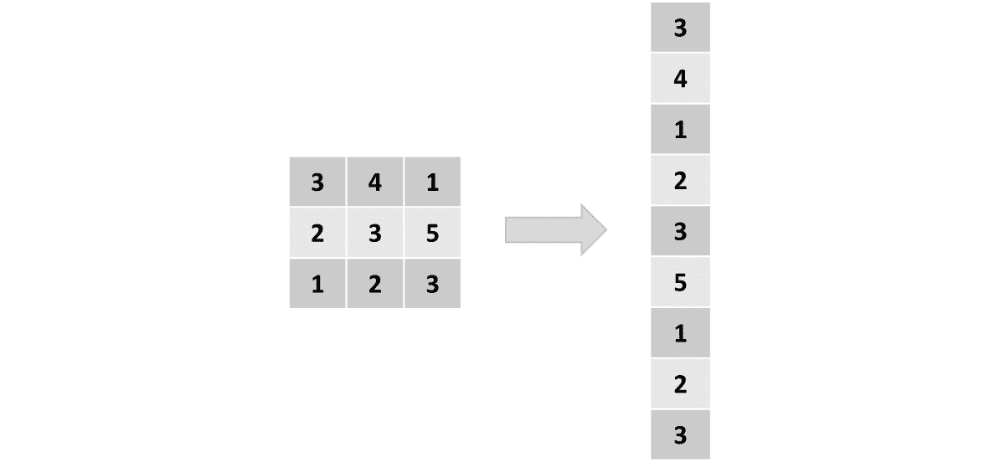
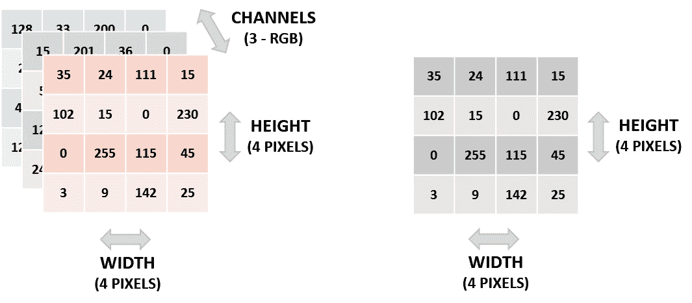
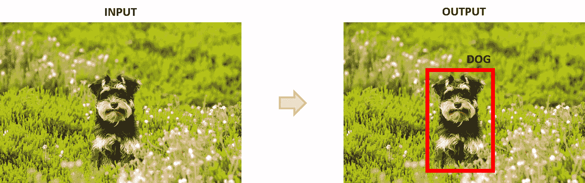
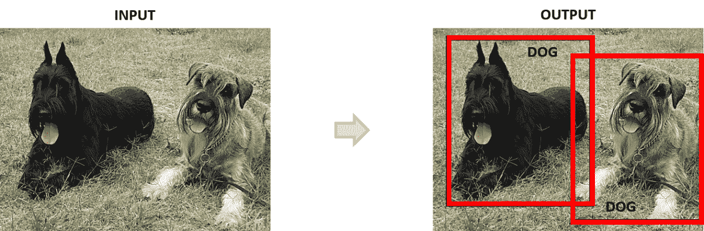
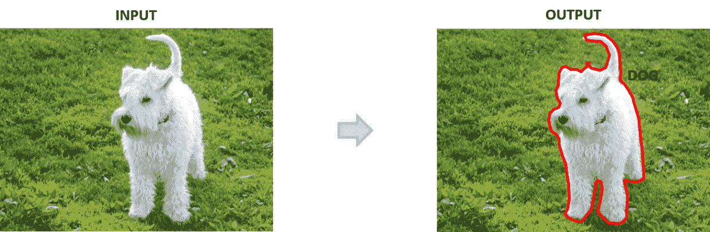
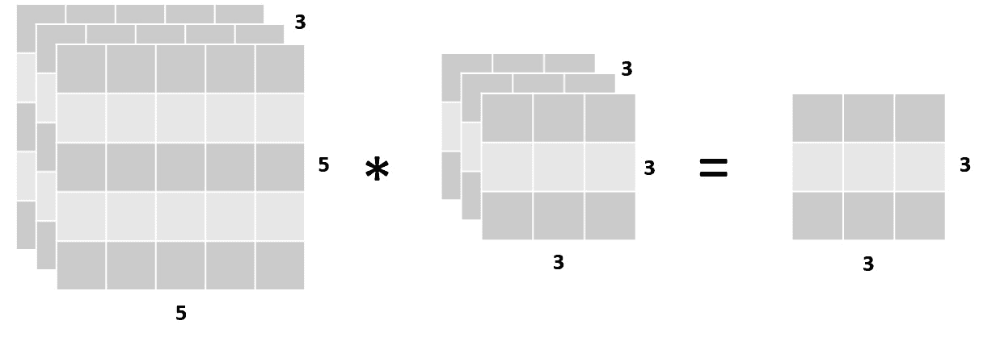
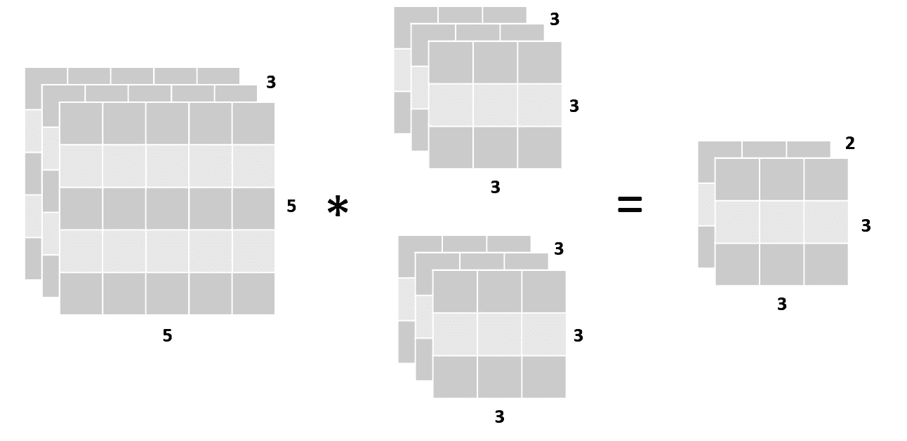
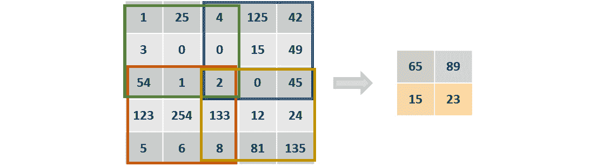
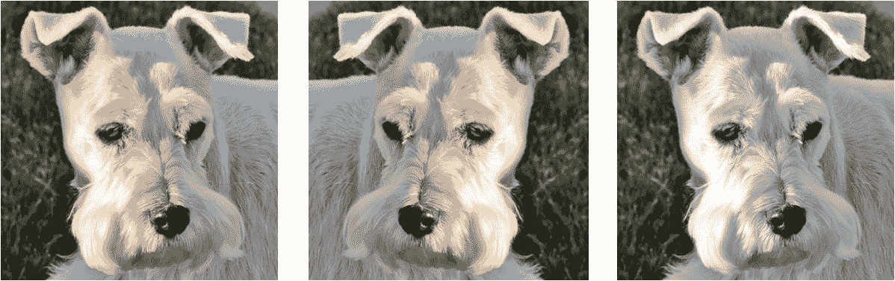
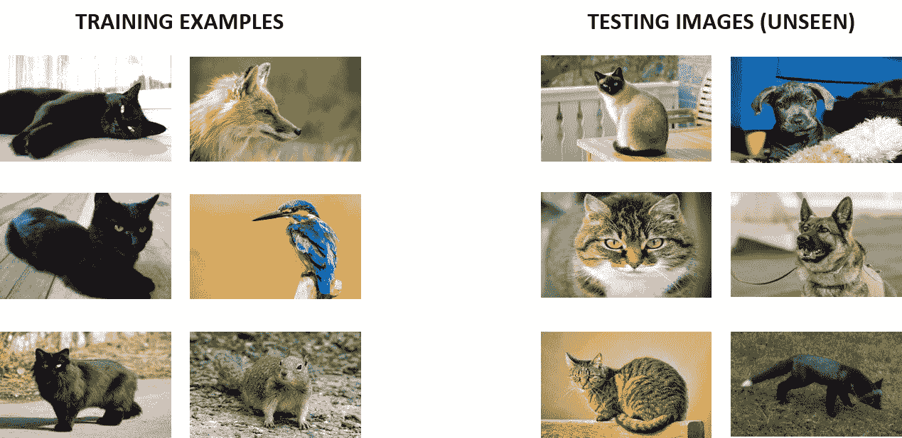

<title>C11865_04_ePub_Final_NT</title>

# *第四章*

# 卷积神经网络

## 学习目标

本章结束时，您将能够:

*   解释卷积神经网络(CNN)的训练过程
*   执行数据扩充
*   对 CNN 应用批处理规范化
*   使用 CNN 解决图像分类问题

在这一章中，你将被介绍给 CNN。您将学习一些概念，如卷积、池化、填充和步幅。

## 简介

尽管现在所有的神经网络领域都很流行，但 CNN 可能是所有神经网络架构中最流行的。这主要是因为，尽管他们在许多领域工作，但他们特别擅长处理图像，并且技术的进步使得收集大量图像成为可能，以便应对当今各种各样的挑战。

从图像分类到物体检测，CNN 正被用于诊断癌症患者和检测系统中的欺诈行为，以及构建深思熟虑的自动驾驶汽车，这将彻底改变未来。

本章将重点解释 CNN 在处理图像时优于其他架构的原因，以及更详细地解释其架构的构建块。它将涵盖构建 CNN 的主要编码结构，以解决图像分类数据问题。

此外，它将探讨数据扩充和批量规范化的概念，这将用于提高模型的性能。本章的最终目标是比较使用 CNN 解决图像分类问题的三种不同方法的结果。

#### 注意

提醒一下，包含本章使用的所有代码的 GitHub 知识库可以在[https://GitHub . com/TrainingByPackt/Applied-Deep-Learning-with-py torch](https://github.com/TrainingByPackt/Applied-Deep-Learning-with-PyTorch)找到。

## 建立有线电视新闻网

众所周知，在处理图像数据问题时，CNN 是一种可行的方法。然而，它们经常未被充分利用，因为它们通常仅在图像分类方面为人所知，而事实是它们的能力扩展到了与图像有关的其他领域。这一章不仅会解释 CNN 如此擅长理解图像的原因，还会确定可以处理的不同任务，并给出一些现实生活中的应用示例。

此外，本章将探索 CNN 的不同构建模块及其使用 PyTorch 的应用，最终使用 PyTorch 的一个图像分类数据集构建一个解决数据问题的模型。

### 为什么选择 CNN？

图像是像素的矩阵，所以你可能会问为什么我们不干脆把矩阵展平成向量，然后用传统的神经网络架构来处理它？答案是，即使是最简单的图像，也存在一些改变图像含义的像素相关性。例如，一只猫的眼睛、一个汽车轮胎、甚至一个物体的边缘都是由以某种方式排列的几个像素构成的。通过展平图像，这些依赖性消失了，传统模型的准确性也消失了:



###### 图 4.1:展平矩阵的表示

另一方面，CNN 能够捕捉图像的空间依赖性，因为它将它们作为矩阵进行处理，并根据过滤器的大小一次分析图像的整个块。例如，使用大小为 3x3 的过滤器的卷积层将一次分析 9 个像素，直到它覆盖整个图像。

图像的每个块都有一组参数(权重和偏差),这些参数是指该组像素与整个图像的相关性，具体取决于手边的过滤器。这意味着垂直边缘滤波器将为包含垂直边缘的图像块分配更大的权重。据此，通过减少参数的数量和通过分块分析图像，CNN 能够更好地呈现图像。

### 输入

如前所述，CNN 的典型输入是矩阵形式的图像。矩阵的每个值代表图像中的一个像素，其中的数值由颜色的强度决定，取值范围从 0 到 255。

在灰度图像中，白色像素用数字 255 表示，黑色像素用数字 0 表示。灰色像素是介于两者之间的任何数字，取决于颜色的强度；灰色越浅，数字越接近 255。

彩色图像通常使用 RGB 系统来表示，RGB 系统将每种颜色表示为红色、绿色和蓝色的组合。这里，每个像素将有三个维度，每种颜色一个。每个维度中的值范围从 0 到 255。在这里，颜色越强烈，数字越接近 255。

根据前面的段落，给定图像的矩阵是三维的，其中第一维指的是图像的高度(以像素的数量表示)，第二维指的是图像的宽度(以像素的数量表示)，第三维被称为通道，并且指的是图像的颜色方案。

彩色图像的通道有三个(RGB 系统中每种颜色一个通道)。另一方面，灰度图像只有一个通道:



###### 图 4.2:图像的矩阵表示。左边是彩色图像。右边是灰度图像。

与文本数据不同，输入 CNN 的图像不需要太多预处理。图像通常按原样输入，唯一的变化是值被归一化以加快学习过程并提高性能，并且考虑到 CNN 模型通常是使用较小的图像构建的，这也有助于加快学习过程，图像可以缩小是一种良好的做法。

归一化输入的最简单方法是取每个像素的值，然后除以 255，最后得到 0 到 1 之间的值。然而，有不同的方法来标准化图像，如平均中心技术。选择一个或另一个的决定，在大多数时候，是一个偏好的问题；但是，当使用预训练模型时，强烈建议您使用第一次基于预训练模型文档中始终可用的信息来训练模型时使用的相同技术。

### 细胞神经网络的应用

虽然 CNN 主要用于计算机视觉问题，但重要的是要提到它们解决其他学习问题的能力，主要是在分析数据序列方面。例如，已知 CNN 在文本、音频和视频序列上表现良好，有时与其他网络架构相结合，或者通过将序列转换成可由 CNN 处理的图像。使用 CNN 和数据序列可以解决的一些具体数据问题包括文本的机器翻译、自然语言处理和视频帧标记等。

此外，CNN 可以执行适用于所有监督学习问题的不同任务。然而，从现在开始，这一章将集中讨论计算机视觉。以下是对每项任务的简要说明，以及每项任务的真实示例:

**分类**:这是计算机视觉中最常见的任务。主要思想是将图像的一般内容分成一组类别，称为标签。

例如，分类可以确定图像是狗、猫还是任何其他动物。这种分类是通过输出图像属于每个类别的概率来完成的，如下图所示:


###### 图 4.3:分类任务

**定位**:主要目的是生成一个包围盒，描述物体在图像中的位置。输出由一个类标签和一个边界框组成。

它可以在传感器中使用，以确定对象是在屏幕的左侧还是右侧:



###### 图 4.4:本地化任务

**检测**:该任务包括对图像中的所有对象执行对象定位。输出由多个边界框和多个类标签(每个框一个)组成。

它用于建造自动驾驶汽车，目的是能够定位交通标志、道路、其他汽车、行人和任何其他可能与确保安全驾驶相关的物体:



###### 图 4.5:检测任务

**分割**:这里的任务是输出图像中出现的每个对象的类别标签和轮廓。这主要用于标记图像的重要对象，以便进一步分析。

例如，它可以用于在患者整个肺的图像中严格划定对应于肿瘤的区域:



###### 图 4.6:分段任务

从这一节开始，本章将重点关注使用 PyTorch 的一个影像数据集训练一个模型来执行影像分类。

### CNN 的构建模块

如前所述，深度卷积网络将图像作为输入，通过一系列具有过滤器、池层和全连接层的卷积层，最终应用将图像分类到类别标签的`softmax`激活函数。与人工神经网络一样，分类是通过计算图像属于每个类别标签的概率来进行的，给每个类别标签一个介于 0 和 1 之间的值。具有较高概率的类别标签是被选择作为该图像的最终预测的类别标签。

以下是对每个层的详细解释，以及如何在 PyTorch 中定义这些层的编码示例:

**卷积层**

这是从图像中提取特征的第一步。目标是通过学习图像的小部分的特征来保持邻近像素之间的关系。

在这一层进行数学运算，给出两个输入(图像和滤镜)并获得一个输出。如前所述，该操作包括卷积滤波器和与滤波器大小相同的图像部分。对图像的所有子部分重复该操作。

#### 注意

重温*第 2 章*、*神经网络的构建模块*，标题为“CNN 简介”的章节，提醒您输入和滤波器之间执行的精确计算。

所得矩阵将具有取决于输入形状的形状，其中大小为(h x w x c)的图像矩阵和大小为(fh x fw x c)的滤波器将根据以下等式输出矩阵:


###### 等式 4.7:卷积图层的输出高度、宽度和深度

这里，h 是指输入图像的高度，w 是宽度，c 是指深度(也称为通道)，fh 和 fw 是由用户设置的关于滤波器大小的值。



###### 图 4.8:输入、滤波器和输出的尺寸

值得一提的是，在单个卷积层中，几个滤波器可以应用于相同的图像，所有滤波器都具有相同的形状。考虑到这一点，就深度而言，对输入应用两个滤波器的卷积层的输出形状等于 2，如下图所示:



###### 图 4.9:带两个滤波器的卷积层

这些过滤器中的每一个将执行不同的操作，以便从图像中发现不同的特征。例如，在具有两个滤波器的单个卷积层中，操作可以是垂直边缘检测和水平边缘检测。此外，随着网络在层数方面的增长，滤波器将执行利用先前检测到的特征的更复杂的操作，例如，通过使用来自边缘检测器的输入来检测人的轮廓。

此外，过滤器通常在每层中增加。这意味着，虽然第一个卷积层有八个滤波器，但通常创建第二个卷积层的滤波器数量是这个数字的两倍(16)，依此类推。

然而，值得一提的是，在 PyTorch 中，正如在许多其他框架中一样，您应该只定义要使用的过滤器的数量，而不是过滤器的类型(例如，垂直边缘检测器)。每个滤波器配置(它包含的检测特定特征的数字)是系统变量的一部分。

对于卷积层的主题，有两个额外的概念要介绍，将解释如下:

**填充**:

顾名思义，填充功能用零填充图像。这意味着它向图像的每一侧添加额外的像素，这些像素用零填充。

下图显示了一个图像的示例，该图像的每一侧都填充了一个像素:


###### 图 4.10:用 1 填充的输入图像的图形表示

这用于在输入矩阵通过过滤器后保持其形状。这是因为，尤其是在前几层，目标应该是尽可能多地保留原始输入的信息，以便从中提取最多的特征。

为了更好地理解填充的概念，请考虑以下场景:

对形状为 32 x 32 x 3 的彩色图像应用三乘三滤镜将得到形状为 30 x 30 x 1 的矩阵。这意味着下一层的输入已经收缩。另一方面，通过向输入图像添加 1 的填充，输入的形状变为 34 x 34 x 3，从而使用相同的滤波器产生 32 x 32 x 1 的输出。

使用填充时，以下公式可用于计算输出宽度:


###### 图 4.11:使用填充的卷积层后的输出宽度

这里 W 是指输入矩阵的宽度，F 是指滤波器的宽度，P 是指填充。同样的等式可以适用于计算输出的高度。

要获得与输入相同形状的输出矩阵，请使用以下等式来计算填充值(假设步幅等于 1):


###### 图 4.12:填充数字以获得与输入大小相等的输出矩阵

请记住，输出通道的数量(深度)将始终等于应用于输入的滤镜数量。

**跨步**:

此参数指的是过滤器在输入矩阵上水平和垂直移动的像素数。正如我们到目前为止所看到的，过滤器通过图像的左上角，然后向右移动一个像素，依此类推，直到它垂直和水平地通过图像的所有部分。这个例子是一个卷积层，跨距等于 1，这是这个参数的默认配置。

当步幅等于 2 时，位移将为两个像素，如下图所示:



###### 图 4.13:步长为 2 的卷积层的图形表示

可以看出，初始操作发生在左上角，然后，通过向右移动两个像素，第二次计算发生在右上角。接下来，该计算向下移动两个像素以在左下角执行计算，最后，通过再次向右移动两个像素，最终计算发生在右下角。

#### 注意

*图 4.13* 中的数字是虚构的，并非实际计算。重点应该放在解释步幅等于 2 时的移动过程的方框上。

使用 stride 时，以下公式可用于计算输出宽度:


###### 等式 4.14:使用跨距的卷积层后的输出宽度

这里，W 是指输入矩阵的宽度，F 是指滤波器的宽度，S 是指跨距。同样的等式可以适用于计算输出的高度。

一旦引入这些参数，计算从卷积层导出的矩阵的输出形状(宽度和高度)的最终等式如下:


###### 等式 4.15:使用填充和步幅的卷积层后的输出宽度

当值是浮点数时，应该向下舍入。这基本上意味着输入的一些区域被忽略，并且没有从它们中提取特征。

最后，一旦输入已经通过所有滤波器，输出被馈送到激活函数，以便打破线性，类似于传统神经网络的过程。虽然在这个步骤中使用了几个激活函数，但是首选的是 ReLU 函数，因为它在 CNN 中表现出了出色的结果。这里获得的输出成为后续层的输入，这通常是一个池层。

### 练习 8:计算卷积层的输出形状

考虑给定的等式，考虑以下场景并计算输出矩阵的形状。

#### 注意

这个练习不需要编码，而是由前面提到的概念的练习组成。

1.  形状为 64 x 64 x 3 的输入。形状为 3×3×3 的过滤器:

    ```
    Output height = 64 -3 + 1 = 62 Output width = 64 - 3 + 1 = 62 Output depth = 1
    ```

2.  形状为 32 x 32 x 3 的输入。10 个形状为 5 x 5 x 3 的过滤器。填充 2:

    ```
    Output height = 32 - 5 + (2 * 2) + 1 = 32 Output width = 32-5 + (2 * 2) + 1 = 32 Output depth = 10
    ```

3.  形状为 128 x 128 x 1 的输入。5 个形状为 5 x 5 x 1 的过滤器。步幅 3:

    ```
    Output height = (128 - 5)/ 3 + 1 = 42 Output width = (128 - 5)/ 3 + 1 = 42 Output depth = 5
    ```

4.  形状为 64 x 64 x 1 的输入。形状为 8 x 8 x 1 的过滤器。填充 3，步幅 3:

    ```
    Output height = ((64 - 8 + (2 * 3)) / 3) +1 = 21.6 ≈ 21 Output width = ((64 - 8 + (2 * 3)) / 3) +1 = 21.6 ≈ 21 Output depth = 1
    ```

恭喜你！你已经成功地计算了从卷积层导出的矩阵的输出形状。

在 PyTorch 中编码一个卷积层非常简单。使用定制模块，只需要创建`network`类，该类有一个包含网络各层的`__init__`函数，以及一个定义通过先前定义的不同层传递信息的步骤的`forward`函数，如下面的代码片段所示:

```
import torch.nn as nn
import torch.nn.functional as F
class CNN_network(nn.Module):
    def __init__(self):
        super(CNN_network, self).__init__()
# input channels = 3, output channels = 18,
# filter size = 3, stride = 1 and padding = 1
        self.conv1 = nn.Conv2d(3, 18, 3, 1, 1)
        def forward(self, x):
            x = F.relu(self.conv1(x))
        return x
```

定义卷积层时，从左到右传递的参数是指输入通道、输出通道(滤波器数量)、内核大小(滤波器大小)、步幅和填充。

考虑到这一点，前面的例子包括一个卷积层，它有三个输入通道，18 个滤波器，每个滤波器的大小为 3，跨距和填充等于 1。

另一种有效的方法，相当于前面的例子，包括自定义模块的语法和使用`Sequential`容器的组合，如下面的代码片段所示:

```
import torch.nn as nn
class CNN_network(nn.Module):
    def __init__(self):
        super(CNN_network, self).__init__()
        self.conv1 = nn.Sequential(nn.Conv2d(1, 16, 5, 1, 2,),                               nn.ReLU())
    def forward(self, x):
        x = self.conv1(x)

        return x
```

这里，层的定义发生在`Sequential`容器内部。通常，一个容器包括一个卷积层、一个激活函数和一个池层。一组新的图层将包含在下面的不同容器中。

**汇集层**

通常，汇集层是特征选择步骤的最后一部分，这就是为什么汇集层通常位于卷积层之后。如前几章所述，这个想法是从图像的子部分中提取最相关的信息。池层的大小通常是两个，跨距等于它的大小。

根据前面的段落，池层通常会将输入的高度和重量减少一半。这一点很重要，因为为了让卷积层找到图像中的所有特征，需要使用几个滤波器，并且该操作的输出可能会变得太大，这意味着需要考虑许多参数。池层旨在通过保留最相关的要素来减少网络中的参数数量。从图像的子部分中选择相关特征或者通过获取最大数量或者通过平均该区域中的数量来进行。

对于影像分类任务，最常见的是使用最大池图层，而不是平均池图层。这是因为前者在保留最相关的特征是关键的任务中表现出更好的结果，而后者已被证明在平滑图像等任务中工作得更好。

为了计算输出矩阵的形状，可以使用下面的等式:


###### 方程 4.16: 输出合并图层后的矩阵宽度

这里 W 是指输入的宽度，F 是指滤波器的大小，S 是指步幅。同样的等式可以适用于计算输出高度

输入的通道或深度保持不变，因为池层将对图像的所有通道执行相同的操作。这意味着池化图层的结果仅影响宽度和长度方面的输入。

### 练习 9:计算一组卷积层和池层的输出形状

以下练习将结合卷积层和池层。目标是在经过一组层之后确定输出矩阵的大小。

#### 注意

这项活动不需要编码，而是由前面提到的概念的练习组成。

考虑以下图层集，并在所有变换结束时指定输出图层的形状:

1.  尺寸为 256 x 256 x 3 的输入图像。
2.  一个卷积层，有 16 个大小为 3 的滤波器，步长和填充为 1。
3.  具有大小为 2 的过滤器和大小为 2 的步幅的池层。
4.  一个卷积层，有八个大小为 7、步幅为 1、填充为 3 的滤波器。
5.  A pooling layer with a filter of size two and a stride of two as well.

    下面显示了经过每一层后矩阵的输出大小:

    ```
    # After the first convolutional layer
    output_matrix_size = 256 x 256 x 16
    # After the first pooling layer
    output_matrix_size = 128 x 128 x 16
    # After the second convolutional layer
    output_matrix_size = 128 x 128 x 8
    # After the second pooling layer
    output_matrix_size = 64 x 64 x 8
    ```

    恭喜你！您已经成功地计算出了从一系列卷积层和汇集层导出的矩阵的输出形状。

    使用与前面相同的编码示例，定义池层的 PyTorch 方法如下面的代码片段所示:

    ```
    import torch.nn as nn
    import torch.nn.functional as F
    class CNN_network(nn.Module):
        def __init__(self):
            super(CNN_network, self).__init__()
            self.conv1 = nn.Conv2d(3, 18, 3, 1, 1)
            self.pool1 = nn.MaxPool2d(2, 2)
            def forward(self, x):
                x = F.relu(self.conv1(x))
                x = self.pool1(x)
            return x
    ```

    这里，进入最大池层的参数，从左到右，是过滤器的大小和步幅。

    同样，这里展示了一种同样有效的方法，使用定制模块和`Sequential`容器:

    ```
    import torch.nn as nn
    class CNN_network(nn.Module):
        def __init__(self):
            super(CNN_network, self).__init__()
            self.conv1 = nn.Sequential(nn.Conv2d(1, 16, 5, 1, 2,),                               nn.ReLU(),
                                  nn.MaxPool2d(2, 2))
        def forward(self, x):
            x = self.conv1(x)

            return x
    ```

如前所述，池层也包含在与卷积层和激活函数相同的容器中。下面将在一个新的`Sequential`容器中定义一组后续层(卷积、激活和池化)。

**全连接图层**

在输入通过一组卷积层和池层之后，全连接(FC)层在网络架构的末端定义。来自第一个全连接层之前的层的输出数据从矩阵展平为向量，该向量可以被馈送到全连接层(与传统神经网络的隐藏层相同)。

这些 FC 层的主要目的是考虑由先前层检测到的所有特征，以便对图像进行分类。

不同的 FC 层通过激活函数传递，该函数通常是 ReLU，除非它是最终层，该层将使用 softmax 函数来输出属于每个类标签的输入的概率。

第一个完全连接层的输入大小对应于前一层的展平输出矩阵的大小。输出大小是由用户定义的，同样，与人工神经网络一样，没有精确的科学来设置这个数字。最后一个 FC 层的输出大小应该等于类标签的数量。

要在 PyTorch 中定义一组 FC 层，请考虑以下代码片段:

```
import torch.nn as nn
import torch.nn.functional as F
class CNN_network(nn.Module):

def __init__(self):
    super(CNN_network, self).__init__()

    self.conv1 = nn.Conv2d(3, 18, 3, 1, 1)    
    self.pool1 = nn.MaxPool2d(2, 2)
    self.linear1 = nn.Linear(32*32*16, 64)
    self.linear2 = nn.Linear(64, 10)

def forward(self, x):
    x = F.relu(self.conv1(x))
    x = self.pool1(x)
    x = x.view(-1, 32 * 32 *16)
    x = F.relu(self.linear1(x))
    x = F.log_softmax(self.linear2(x), dim=1)
    return x
```

这里，两个完全连接的层被添加到网络中。接下来，在 forward 函数中，使用`view()`函数展平池层的输出。然后，它通过应用激活功能的第一个 FC 层。最后，数据连同其激活功能一起通过最终的 FC 层。

使用自定义模块和`Sequential`容器定义完全连接层的代码如下所示:

```
import torch.nn as nn
class CNN_network(nn.Module):
    def __init__(self):
        super(CNN_network, self).__init__()
        self.conv1 = nn.Sequential(nn.Conv2d(1, 16, 5, 1, 2,),                               nn.ReLU(),
                              nn.MaxPool2d(2, 2))
        self.linear1 = nn.Linear(32*32*16, 64)
        self.linear2 = nn.Linear(64, 10)
    def forward(self, x):
        x = self.conv1(x)

        x = x.view(-1, 32 * 32 *16)
        x = F.relu(self.linear1(x))
        x = F.log_softmax(self.linear2(x), dim=1)

        return x
```

一旦定义了网络的体系结构，就可以用与 ann 相同的方式处理定义不同参数(包括损失函数和优化算法)的后续步骤以及训练过程。

### 旁注–从 PyTorch 下载数据集

要从 PyTorch 加载数据集，请使用以下代码。除了下载数据集之外，它还展示了如何使用数据加载器通过分批加载图像(而不是一次全部加载)来节省资源:

```
from torchvision import datasets
import torchvision.transforms as transforms
batch_size = 20
transform = transforms.Compose([transforms.ToTensor(),
transforms.Normalize((0.5, 0.5, 0.5), (0.5, 0.5, 0.5))])
train_data = datasets.MNIST(root='data', train=True,
download=True, transform=transform)
test_data = datasets.MNIST(root='data', train=False,
                           download=True, transform=transform)
dev_size = 0.2
idx = list(range(len(train_data)))
np.random.shuffle(idx)
split_size = int(np.floor(dev_size * len(train_data)))
train_idx, dev_idx = idx[split_size:], idx[:split_size]
train_sampler = SubsetRandomSampler(train_idx)
dev_sampler = SubsetRandomSampler(dev_idx)
train_loader = torch.utils.data.DataLoader(train_data, batch_size=batch_size, sampler=train_sampler)
dev_loader = torch.utils.data.DataLoader(train_data, batch_size=batch_size, sampler=dev_sampler)
test_loader = torch.utils.data.DataLoader(test_data, batch_size=batch_size)
```

在上述代码中，要下载的数据集是 MNIST。这是一个流行的数据集，包含从 0 到 9 的手写灰度数字图像。在下载数据集之前定义的`transform`变量负责对数据集进行一些转换。在这种情况下，数据集将被转换为张量，并在其所有维度上进行归一化。

PyTorch 的`SubsetRandomSampler()`函数用于通过随机抽样索引将原始训练集分为训练集和验证集。此外，`DataLoader()`函数负责批量加载图像。该函数的结果变量(`train_loader`、`dev_loader`和`test_loader`)将分别包含特征和目标的值。

### 活动 7:为图像分类问题构建 CNN

#### 注意

问题越复杂，网络越深入，模型训练的时间就越长。考虑到这一点，本章中的活动可能会比前几章中的活动花费更长的时间。

在以下活动中，CNN 将在 PyTorch 的图像数据集上进行训练。让我们看看下面的场景:

你在一家人工智能公司工作，该公司根据客户的需求开发定制模型。您的团队目前正在创建一个能够区分车辆和动物的模型，更具体地说，是一个能够区分不同动物和不同类型车辆的模型。他们为您提供了包含 60，000 幅图像的数据集，并希望您构建这样一个模型。

#### 注意

对于本章中的 act 活动，您需要具备 Python 3.6、Jupyter、NumPy 和 Matplotlib。

1.  Import the following libraries:

    ```
    import numpy as np
    import torch
    from torch import nn, optim
    import torch.nn.functional as F
    from torchvision import datasets
    import torchvision.transforms as transforms
    from torch.utils.data.sampler import SubsetRandomSampler
    from sklearn.metrics import accuracy_score
    import matplotlib.pyplot as plt
    ```

    #### 注意

    要使用的数据集是 PyTorch 的 CIFAR10，它包含总共 60，000 幅车辆和动物的图像。有 10 种不同的类别标签。训练集包含 50，000 幅图像，而测试集包含剩余的 10，000 幅图像。

2.  设置要对数据执行的变换，这将是数据到张量的转换和像素值的归一化。
3.  设置 100 个图像的批量大小，并从 CIFAR10 数据集下载训练和测试数据。
4.  使用 20%的验证大小，定义将用于将数据集分成这两组的定型和验证采样器。
5.  使用`DataLoader()`功能定义用于每组数据的批次。
6.  定义您的网络架构。为此，请使用以下信息:
    *   Conv1:卷积层，将彩色图像作为输入，并通过 10 个大小为 3 的过滤器。填充和步幅都应设置为 1。
    *   Conv2:将输入数据通过 20 个大小为 3 的过滤器的卷积层。填充和步幅都应设置为 1。
    *   Conv3:卷积层，将输入数据通过 40 个大小为 3 的过滤器。填充和步幅都应设置为 1。
    *   在每个卷积层之后使用 ReLU 激活函数。
    *   每个卷积层之后的池层，过滤器大小和步幅为 2。
    *   展平图像后设定为 20%的漏失项。
    *   Linear1:一个完全连接的层，接收来自前一层的展平矩阵作为输入，并生成 100 个单位的输出。对该层使用 ReLU 激活功能。这里的退出项设置为 20%。
    *   Linear2:一个全连接的层，生成 10 个输出，每个类标签一个。使用输出层的`log_softmax`激活功能。
7.  定义训练模型所需的所有参数。训练 50 个纪元。
8.  训练您的网络，并确保保存训练集和验证集的损失和准确性值。
9.  Plot the loss and accuracy of both sets.

    #### 注意

    由于每个时期中数据的混洗，结果将无法精确再现。但是，您应该能够得到类似的结果。

10.  Check the model's accuracy on the testing set.

    #### 注意

    这项活动的解决方案可在第 204 页找到。

## 数据扩充

学习如何有效地编码神经网络是开发最先进解决方案的步骤之一。此外，为了开发伟大的深度学习解决方案，找到一个我们可以为当前挑战提供解决方案的感兴趣的领域也是至关重要的(顺便说一下，这不是一项容易的任务)。但是，一旦所有这些都完成了，我们通常会面临同样的问题:通过自我收集或从互联网和其他可用来源获得适当大小的数据集，以从我们的模型中获得良好的性能。

正如你可能想象的那样，尽管现在收集和存储大量数据是可能的，但由于相关的成本，这不是一项容易的任务。因此，大部分时间，我们都在处理包含数万个条目的数据集，而涉及到图像时就更少了。

当开发计算机视觉问题的解决方案时，这成为一个相关的问题，主要是由于两个原因:

*   The larger the dataset, the better the results, and larger datasets are crucial to arrive at decent enough models. This is true considering that training a model is a matter of tuning a bunch of parameters such that it is capable of mapping a relationship between an input and an output, while minimizing the loss function by making the predicted value come as close to the ground truth as possible. Here, the more complex the model, the more parameters it requires.

    考虑到这一点，有必要向模型提供相当数量的示例，以便它能够找到这样的模式，其中训练示例的数量应该与要调整的参数的数量成比例。

*   此外，计算机视觉问题中最大的挑战之一是让你的模型在图像的多种变化中表现良好。这意味着图像不需要遵循特定的对齐方式或具有固定的质量，而是可以以其原始格式进行馈送，包括不同的位置、角度、光照和其他失真。正因为如此，有必要找到一种方法来为模型提供这种变化。

因此，数据增强技术被设计出来。简单来说，就是通过对已有的例子稍加修改，来增加训练样本数量的措施。例如，您可以复制当前可用的实例，并向这些副本添加一些噪声，以确保它们不完全相同。

在计算机视觉问题中，这意味着通过改变现有图像来增加训练数据集中的图像数量，这可以通过稍微改变当前图像来创建稍微不同的复制版本来完成。

这些对图像的微小调整可以是轻微旋转、改变对象在帧中的位置、水平或垂直翻转、不同的配色方案和扭曲等形式。考虑到 CNN 会将这些图像中的每一个视为不同的图像，这种技术是可行的。

例如，下图显示了一只狗的三幅图像，虽然对人眼来说这些图像是相同的，只是有某些变化，但对神经网络来说却是完全不同的:



###### 图 4.17:增强图像

能够独立于任何种类的变化识别图像中的对象的 CNN 被认为具有不变性。事实上，CNN 可以对每种类型的变异保持不变。

### 用 PyTorch 扩充数据

使用`torchvision`包在 PyTorch 中执行数据扩充非常容易。除了包含流行的数据集和模型架构之外，该包还具有可在数据集上执行的常见图像转换功能。

#### 注意

在这一节中，我们将提到一些图像变换。要获得可能转型的完整列表，请访问[https://pytorch.org/docs/stable/torchvision/transforms.html](https://pytorch.org/docs/stable/torchvision/transforms.html)。

与前面活动中使用的将数据集归一化并转换为张量的过程一样，执行数据扩充需要我们首先定义所需的转换，然后将它们应用到数据集，如以下代码片段所示:

```
transform = transforms.Compose([
            transforms.HorizontalFlip(probability_goes_here), 
            transforms.RandomGrayscale(probability_goes_here),
            transforms.ToTensor(),
            transforms.Normalize((0.5, 0.5, 0.5), (0.5, 0.5, 0.5))])
train_data = datasets.CIFAR10('data', train=True, download=True, transform=transform)
test_data = datasets.CIFAR10('data', train=False, download=True, transform=transform)
```

在这里，要下载的数据将进行水平翻转(考虑概率值，概率值定义了图像是否会翻转)，并将转换为灰度(也考虑概率)。然后，将数据转换为张量并归一化。

考虑到模型是在迭代过程中训练的，其中训练数据被馈送多次，这些变换确保通过数据集的第二次运行不会向模型馈送完全相同的图像。

而且，重要的是要提到，可以为不同的集合设置不同的变换。这很有用，因为数据扩充的目的是增加训练样本的数量，但用于测试模型的图像应该保持不变。然而，应该调整测试集的大小，以便为模型提供相同大小的图像。

这可以如代码片段所示完成:

```
transform = {
    "train": transforms.Compose([
    transforms.RandomHorizontalFlip(probability_goes_here), 
    transforms.RandomGrayscale(probability_goes_here),
    transforms.ToTensor(),
    transforms.Normalize((0.5, 0.5, 0.5), (0.5, 0.5, 0.5))]),
    "test": transforms.Compose([
    transforms.ToTensor(),
    transforms.Normalize((0.5, 0.5, 0.5), (0.5, 0.5, 0.5)),
    transforms.Resize(size_goes_here)])}
train_data = datasets.CIFAR10('data', train=True, download=True, transform=transform["train"])
test_data = datasets.CIFAR10('data', train=False, download=True, transform=transform["test"])
```

可以看出，定义了包含训练集和测试集的一组转换的字典。然后，调用它们来相应地对每个集合应用变换。

### 活动 8:实施实施数据扩充

在接下来的活动中，将对上一活动中创建的模型进行数据扩充，以测试其准确性是否可以提高。让我们看看下面的场景:

您创建的模型很好，但是其准确性还没有给任何人留下深刻印象。他们要求您想出一种可以提高模型性能的方法。

1.  复制之前活动中的非电子书。
2.  更改`transform`变量的定义，除了将数据标准化并转换为张量外，还包括以下转换:
    *   对于训练/验证集，一个概率为 50% (0.5)的`RandomHorizontalFlip`函数和一个概率为 10% (0.1)的`RandomGrayscale`函数。
    *   对于测试集，不要添加任何其他的转换。
3.  Train the model for 100 epochs.

    #### 注意

    由于每个时期中数据的混洗，结果将无法精确再现。但是，您应该能够得到类似的结果。

4.  Calculate the accuracy of the resulting model on the testing set.

    #### 注意

    这项活动的解决方案可在第 209 页找到。

## 批量归一化

通常会对输入图层进行归一化，以加快学习速度，并通过将所有要素重新调整到相同比例来提高性能。因此，问题是，如果模型受益于输入层的归一化，为什么不归一化所有隐藏层的输出，以试图进一步提高训练速度？

**批量归一化**，顾名思义，对隐藏层的输出进行归一化，从而减少每层的方差，这也称为协方差偏移。协方差偏移的这种减少是有用的，因为它允许模型在遵循与用于训练它的图像不同的分布的图像上也工作良好。

举个例子，一个网络的目的是检测一个动物是否是猫。当仅使用黑猫的图像来训练网络时，批量标准化还可以通过标准化数据来帮助网络对不同颜色的猫的新图像进行分类，使得黑色和彩色的猫图像都遵循相似的分布。下图显示了此类问题:



###### 图 4.18:猫分类器。模型能够识别彩色的猫，甚至在只使用黑猫训练之后

此外，除了上述内容之外，批处理规范化还为模型定型过程带来了以下好处，最终有助于您获得性能更好的模型:

*   它允许设置更高的学习率，因为批量标准化有助于确保输出不会过高或过低。更高的学习率相当于更快的学习时间。
*   It helps to reduce overfitting because it has a regularization effect. This makes it possible to set the dropout probability at a lower value, which means that less information is ignored in each forward pass.

    #### 注意

    值得一提的是，我们不应该主要依靠批量归一化来处理过度拟合。

如前几层所述，隐藏层输出的标准化是通过减去批次平均值并除以批次标准偏差来完成的。

此外，值得一提的是，批量归一化通常在卷积层以及全连接层(不包括输出层)上执行。

### 使用 PyTorch 进行批量标准化

在 PyTorch 中，考虑到有两种不同的类型，添加批处理规范化就像向网络架构添加一个新层一样简单，如下所述:

**batch normal 1d**:该层用于对二维或三维输入进行批量归一化。它接收前一层的输出节点数作为参数。这通常用于完全连接的层。

**BatchNorm2d** :对四维输入进行批量归一化。同样，它接受的参数是前一层的输出节点数。它通常用于卷积层，这意味着它接受的参数应该等于前一层的通道数。

据此，CNN 中批量归一化的实现如下:

```
class CNN(nn.Module):
    def __init__(self):
        super(CNN, self).__init__()
        self.conv1 = nn.Conv2d(3, 16, 3, 1, 1)
        self.norm1 = nn.BatchNorm2d(16)
        self.pool = nn.MaxPool2d(2, 2)
        self.linear1 = nn.Linear(16 * 16 * 16, 100)
        self.norm2 = nn.BatchNorm1d(100)
        self.linear2 = nn.Linear(100, 10)
        def forward(self, x):
            x = self.pool(self.norm1(F.relu(self.conv1(x))))
            x = x.view(-1, 16 * 16 * 16)
            x = self.norm2(F.relu(self.linear1(x)))
            x = F.log_softmax(self.linear2(x), dim=1)
        return x
```

可以看出，批处理规范化层最初是以与任何其他层相似的方式定义的。接下来，在激活函数之后，将每个应用于其相应层的输出。

### 活动 9:实现批量标准化

对于下面的活动，我们将在前面活动的架构上实现批量标准化，以查看是否有可能在测试集上进一步提高模型的性能。让我们看看下面的场景:

哇！你已经用上一次的表现提升给队友留下了深刻的印象，现在他们对你的期望更高了。他们要求你最后一次尝试改进模型，使准确率达到 80%；

1.  复制上一个活动中的笔记本。
2.  向每个卷积层以及第一个 FC 层添加批量归一化。
3.  Train the model for 100 epochs.

    #### 注意

    由于每个时期中数据的混洗，结果将无法精确再现。但是，您应该能够得到类似的结果。

4.  Calculate the accuracy of the resulting model on the testing set.

    #### 注意

    这项活动的解决方案可在第 211 页找到。

## 总结

前一章关注的是 CNN，它由一种在计算机视觉问题上表现出色的神经网络结构组成。它首先解释了 CNN 广泛用于处理图像数据集的主要原因，并介绍了通过使用 CNN 可以解决的不同任务。

此外，本章还解释了网络架构的不同构建模块，首先解释卷积层的性质，然后继续解释池层，最后解释全连接层。在每一节中，都包含了对每一层的用途的解释，以及在 PyTorch 中有效地对架构进行编码的代码片段。

这导致了图像分类问题的引入，该问题需要使用前面解释的构建块来解决。

接下来，数据扩充作为一种工具被引入，通过增加训练样本的数量来提高网络的性能，而无需收集更多的图像。这种技术着重于对现有图像执行一些变化，以创建“新的”图像提供给模型。

通过实施数据扩充，本章的第二项活动旨在解决同样的图像分类问题，目的是比较结果。

最后，本章解释了批处理规范化的概念。它包括标准化每个隐藏层的输出，以加速学习。在解释了在 PyTorch 中应用批量归一化的过程之后，本章的最后一个活动再次旨在使用批量归一化来解决相同的图像分类问题。