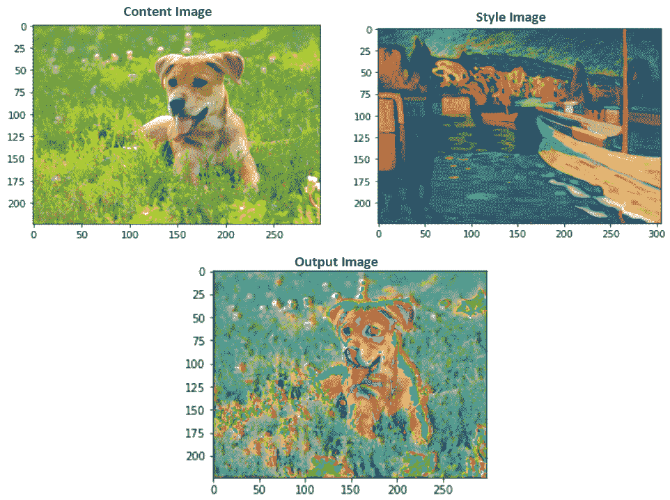

<title>C11865_05_ePub_Final_SZ</title>

# *第五章*

# 风格转移

## 学习目标

本章结束时，您将能够:

*   从 PyTorch 加载预训练模型
*   提取图像的样式
*   获取图像的内容
*   使用一个图像的样式和另一个图像的内容创建一个新图像

在这一章中，你将学习如何将艺术风格从一幅画转移到另一幅画。这样，你就能把日常照片变成杰作。

## 简介

前一章解释了传统卷积神经网络(CNN)的不同构建模块，以及一些能够提高性能和减少训练时间的技术。那里解释的架构虽然典型，但并不是一成不变的，相反，CNN 架构的扩散已经出现，以解决不同的数据问题，更常见的是在计算机视觉领域。

这些架构在配置和学习任务方面各不相同。现在非常流行的一个是由牛津视觉几何小组创造的 VGG 建筑。它是为对象识别而开发的，由于网络所依赖的大量参数，它实现了最先进的性能。它在数据科学家中受欢迎的主要原因之一是由于经过训练的模型的参数(权重和偏差)的可用性，这使得研究人员可以在没有训练的情况下使用它，以及模型的出色性能。

在这一章中，我们将使用这个预训练的模型来解决一个计算机视觉问题，这个问题由于专门分享图像的社交媒体渠道的流行而特别出名。它包括执行样式转换，以便用另一个图像的样式(颜色和纹理)来改善图像的外观。

当在社交媒体个人资料上发布时，在常规图像上应用过滤器以提高它们的质量和吸引力时，前面的任务每天被执行数百万次。虽然在使用时这看起来是一个简单的任务，但本章将解释这些图像编辑应用程序背后的神奇之处。

#### 注意

提醒一下，包含本章使用的所有代码的 GitHub 资源库可以在[https://GitHub . com/TrainingByPackt/Applied-Deep-Learning-with-py torch](https://github.com/TrainingByPackt/Applied-Deep-Learning-with-PyTorch)找到。

## 风格转移

简而言之，风格转换包括修改图像的风格，同时仍然保留其内容。例如，拍摄一幅动物图像，并将该样式转换为类似梵高的绘画，如下图所示:



###### 图 5.1:风格转换输入和输出。这是本章最后一次练习的结果。

根据上图，预训练模型有两个输入:内容图像和样式图像。内容是指对象，而风格是指颜色和纹理。因此，来自模型的输出应该是包含来自内容图像的对象和样式图像的艺术外观的图像。

### 它是如何工作的？

与解决传统的计算机视觉问题不同，风格转换需要遵循不同的步骤，以有效地将两幅图像作为输入，并创建一幅新图像作为输出。

以下是解决风格转换问题时所遵循的步骤的简要说明:

1.  **输入输入**:内容和样式图像都要输入到模型中，它们需要是相同的形状。这里的一个常见做法是调整样式图像的大小，使其与内容图像的形状相同。
2.  **Loading the model**: The Oxford's Visual Geometry Group created a model's architecture that performs outstandingly well over style transfer problems, which is known as the VGG network. Moreover, they also made the model's parameters available to anyone so that the training process of the model could be shortened or skipped.

    #### 注意

    VGG 网络有不同的版本，使用不同的层数。为了区分不同的版本，关于这个问题的命名法将在首字母缩略词的末尾添加一个破折号和一个数字，代表该特定架构的层数。在本章中，我们将使用网络的 19 层版本，即众所周知的 VGG-19。

    因此，使用 PyTorch 的预训练模型的子包，可以加载预训练的模型以执行风格转换任务，而无需使用大量图像训练网络。

3.  **确定层的功能**:考虑到手头有两个主要任务(识别图像的内容和区分另一个图像的风格)，不同的层将具有不同的功能来提取不同的特征；对于风格形象，重点要放在色彩和质感上；而对于内容图像，重点应该放在边缘和形式上。在这个步骤中，不同的层被分成不同的任务。
4.  **Defining the optimization problem**: Like any other supervised problem, it is necessary to define a loss function, which will have the responsibility of measuring the difference between the output and inputs. Unlike other supervised problems, it is required to minimize three different loss functions for style transfer problems:

    内容损失:这衡量内容图像和输出之间的距离，仅考虑与内容相关的特征。

    风格损失:这衡量的是风格图像和输出之间的距离，只考虑与风格相关的特征。

    总损失:这结合了内容和风格的损失。内容和风格损失都具有与之相关联的权重，该权重用于确定它们参与总损失的计算。

5.  **参数更新**:该步骤使用梯度来更新网络的不同参数。

## 使用 VGG-19 网络架构实现风格转移

VGG-19 是由 19 层组成的 CNN。它使用 ImageNet 数据库中的数百万张图像进行训练。该网络能够将图像分为 1000 个不同的类别，包括大量的动物和不同的工具。

#### 注意

要浏览 ImageNet 数据库，请使用以下 URL:[http://www.image-net.org/](http://www.image-net.org/)。

考虑到其深度，该网络能够从各种各样的图像中识别复杂的特征，这使得它特别适合于风格转移问题，其中特征提取在不同阶段和不同目的中是至关重要的。

下一节将重点解释使用预训练的 VGG-19 模型进行风格转换的过程。本章的最终目的是拍摄一幅动物或风景的图像(作为内容图像)和一幅知名艺术家的画作(作为风格图像)，以创建一幅具有艺术风格的常规物体的新图像。

但是，在深入研究该过程之前，下面是对导入的解释，并简要说明了它们的用途:

*   **NumPy** :这将用于转换要显示的图像。
*   **torch、torch.nn 和 torch.optim** :它们将实现神经网络，并定义优化算法。
*   **PIL。图像**:这将加载图像。
*   **matplotlib.pyplot** :这将显示图像。
*   **torchvision.transforms 和 torchvision.models** :这些将把图像转换成张量并加载预训练的模型。

### 输入:加载和显示

执行样式转换的第一步包括加载内容和样式图像。在该步骤中，处理基本的预处理，其中图像必须大小相等(最好是用于训练预训练模型的图像的大小)，这也将是输出图像的大小。此外，图像被转换为 PyTorch 张量，如果需要，可以进行归一化。

此外，显示已经加载的图像总是一个好的做法，以确保它们符合需要。考虑到图像已经被转换为张量并在这一点上被归一化，张量应该被克隆，并且需要执行一组新的转换，以便能够使用 Matplotlib 显示它们。

定义加载和显示图像的函数有助于节省时间，还可以确保对内容和样式图像进行相同的处理。这个过程将在下面的练习中展开。

#### 注意

本章的所有练习都将被编码在同一个笔记本中，因为它们将一起执行风格转换任务。

### 练习 10:加载和显示图像

这是执行样式转换的四个步骤中的第一步。本章的目的是加载和显示将在后续练习中使用的图像(包括内容和样式)。

#### 注

在 GitHub 资源库(本章开头共享的链接)中，您将能够找到不同的图片，这些图片将在本章的不同练习和活动中使用。

1.  导入执行风格转换所需的所有包:

    ```
    import numpy as np import torch from torch import nn, optim from PIL import Image import matplotlib.pyplot as plt from torchvision import transforms, models
    ```

2.  Set the image size to be used for both images. Also, set the transformations to be performed over images, which should include resizing images, converting them to tensors, and normalizing them:

    ```
    imsize = 224
    loader = transforms.Compose([
             transforms.Resize(imsize), 
             transforms.ToTensor(),
             transforms.Normalize((0.485, 0.456, 0.406), (0.229, 0.224, 0.225))])
    ```

    #### 注意

    使用归一化图像来训练 VGG 网络，其中每个通道分别具有 0.485、0.456 和 0.406 的平均值，以及 0.229、0.224 和 0.225 的标准偏差。

3.  定义一个接收图像路径作为输入的函数，并使用 PIL 打开图像。接下来，它应该对图像应用变换:

    ```
    def image_loader(image_name):     image = Image.open(image_name)     image = loader(image).unsqueeze(0)     return image
    ```

4.  调用函数来加载内容和样式图像。使用狗的图片作为内容，使用马蒂斯的图片作为样式，这两个图片都可以在 GitHub 资源库中找到:

    ```
    content_img = image_loader("images/dog.jpg") style_img = image_loader("images/matisse.jpg")
    ```

5.  To display the images, convert them back to PIL images and revert the normalization process. Define these transformations in a variable:

    ```
    unloader = transforms.Compose([
               transforms.Normalize((-0.485/0.229, -0.456/0.224,            -0.406/0.225), (1/0.229, 1/0.224, 1/0.225)),
               transforms.ToPILImage()])
    ```

    要恢复正常化，必须使用用于正常化数据的平均值的负值除以先前用于正常化数据的标准偏差作为平均值。此外，新的标准偏差应该等于 1 除以之前用于标准化数据的标准偏差。

6.  创建一个克隆张量的函数，挤压它，最后对张量应用变换:

    ```
    def tensor2image(tensor):     image = tensor.clone()      image = image.squeeze(0)       image = unloader(image)     return image
    ```

7.  为两幅图像调用函数并绘制结果:

    ```
    plt.figure() plt.imshow(tensor2image(content_img)) plt.title("Content Image") plt.show() plt.figure() plt.imshow(tensor2image(style_img)) plt.title("Style Image") plt.show()
    ```

生成的图像应该如下所示:


###### 图 5.2:内容图像


###### 图 5.3:样式图像

恭喜你！您已经成功加载并显示了用于风格转换的内容和风格图像。

### 领导模型

与许多其他框架一样，PyTorch 有一个包含不同模型的子包，这些模型之前已经过训练，可供公众使用。这一点很重要，因为从头开始训练神经网络非常耗时，而从预训练模型开始可以帮助减少训练时间。这意味着可以加载预训练的模型，以便使用它们的最终参数(应该是使损失函数最小化的参数)，而不需要经历迭代过程。

如前所述，用于执行风格转换任务的体系结构是 19 层的 VGG 网络，也称为 VGG-19。预训练模型在模型的`torchvision`子包下可用。PyTorch 中保存的模型分为两部分，如下所述:

1.  **vgg19.features** :这包括网络的所有卷积层和池层以及参数。这些层负责从图像中提取特征，其中一些层专门用于样式特征，如颜色，而其他层专门用于内容特征，如边缘。
2.  **vgg19.classifier**: This refers to the linear layers (also known as fully connected layers) that are located at the end of the network, including their parameters. These layers are the ones that perform the classification of the image into one of the label classes.

    #### 注意

    欲了解 PyTorch 中其他可用的预训练模型，请访问[https://pytorch.org/docs/stable/torchvision/models.html](https://pytorch.org/docs/stable/torchvision/models.html)。

根据前面的信息，为了提取内容和样式图像的必要特征，应该只加载模型的特征部分。加载模型包括调用模型的子包，后跟模型的名称，确保预训练参数设置为`True`，并且只加载要素层。

此外，每层中的参数应该保持不变，因为这些参数将有助于检测所需的特征。这可以通过定义模型不需要计算任何这些层的梯度来实现。

### 练习 11:在 PyTorch 中加载预训练模型

使用与上一个练习中相同的笔记本，本练习旨在加载预训练模型，该模型将在后续练习中使用，以使用之前加载的图像执行风格转换任务:

1.  打开上一个练习中的笔记本。
2.  Load the VGG-19 pretrained model from PyTorch:

    ```
    model = models.vgg19(pretrained=True).features
    ```

    如前所述，选择模型的特征部分。这将提供对模型的所有卷积层和汇集层的访问，这些层将用于在本章的后续练习中执行特征提取。

3.  Perform a `for` loop through the parameters of the previously loaded model. Set each parameter to not require gradients calculations:

    ```
    for param in model.parameters():
        param.requires_grad_(False)
    ```

    通过将梯度计算设置为`False`，我们确保在创建目标图像的过程中不需要改变梯度计算。

恭喜你！您已成功加载预训练模型。

### 提取特征

如前所述，VGG-19 网络包含 19 个不同的层，包括卷积层、汇集层和全连接层。卷积层出现在每个池层之前的堆栈中，五是整个架构中的堆栈数量。

在风格转换领域，已经有不同的论文确定了那些对识别内容和风格图像的相关特征至关重要的层。据此，通常认为每个堆栈的第一卷积层能够提取风格特征，而只有第四堆栈的第二卷积层应该用于提取内容特征。从现在开始，我们将提取风格特征的层称为`conv1_1`、`conv2_1`、`conv3_1`、`conv4_1`和`conv5_1`，而负责提取内容特征的层称为`conv4_2`。

#### 不是 e

用作本章指南的论文可在以下网址获取:[https://www . cv-foundation . org/open access/content _ cvpr _ 2016/papers/Gatys _ Image _ Style _ Transfer _ CVPR _ 2016 _ paper . pdf](https://www.cv-foundation.org/openaccess/content_cvpr_2016/papers/Gatys_Image_Style_Transfer_CVPR_2016_paper.pdf)。

这意味着样式图像要经过五个不同的层，而内容图像只需要经过一层。这些层中的每一层的输出用于将输出图像与输入图像进行比较，其中目标是修改目标图像的参数，以类似于内容图像的内容和样式图像的样式，这可以通过优化三个不同的损失函数来实现(这将在本章中进一步解释)。

为了确定目标图像是否包含与内容图像相同的内容，我们需要检查两个图像中是否存在某些特征。然而，为了检查目标图像和风格图像的风格表示，有必要检查相关性，而不是两个图像上特征的严格存在。这是因为两个图像的风格特征不会是精确的，而是近似的。

为此，引入了 gram 矩阵。它包括创建一个矩阵，查看给定层中不同风格特征的相关性。这是通过将卷积层的矢量化输出乘以相同的转置矢量化输出来实现的，如下图所示:


###### 图 5.4:gram 矩阵的计算

在上图中，A 指的是具有 4x 4 尺寸(高度和宽度)的输入样式图像，B 表示图像通过具有五个过滤器的卷积层后的输出。最后，C 是指 gram 矩阵的计算，其中左边的图像代表 B 的矢量化版本，右边的图像是它的转置版本。从矢量化输出的乘法中，创建 5×5 克矩阵，其值指示沿着不同通道(过滤器)的风格特征方面的相似性(相关性)。

这些相关性可用于确定与图像的风格表示相关的那些特征，然后可用于改变目标图像。考虑到风格特征是在五个不同的层中获得的，假定网络能够从风格图像中检测小的和大的特征是安全的，考虑到必须为每个层创建 gram 矩阵。

### 练习 12:设置特征提取流程

使用上一个练习中的网络架构和本章第一个练习中的图像，我们将创建两个能够从输入图像中提取特征并为样式特征创建 gram 矩阵的函数:

1.  打开上一个练习中的笔记本。
2.  打印上一个练习中加载的模型的架构。这将有助于识别执行风格转换任务的相关层:

    ```
    print(model)
    ```

3.  Create a dictionary mapping the index of the relevant layers (keys) to a name (values). This will facilitate the process of calling relevant layers in the future:

    ```
    relevant_layers = {'0': 'conv1_1', '5': 'conv2_1', '10': 'conv3_1', '19': 'conv4_1', '21': 'conv4_2', '28': 'conv5_1'}
    ```

    为了创建字典，我们使用上一步的输出来显示网络中的每个层。在那里，可以观察到第一堆栈的第一层被标记为`0`，而第二堆栈的第一层被标记为`5`等等。

4.  Create a function that will extract the relevant features (features extracted from the relevant layers only) from an input image. Name it `features_extractor` and make sure it takes as inputs the image, the model, and the dictionary previously created:

    ```
    def features_extractor(x, model, layers):
        features = {}
        for index, layer in model._modules.items():
            if index in layers:
                x = layer(x)
                features[layers[index]] = x
        return features
    ```

    `model._modules`包含一个保存网络各层的字典。通过对不同层执行`for`循环，我们将图像传递到感兴趣的层(之前创建的`layers`字典中的层)，并将输出保存到`features`字典中。

    输出字典由包含图层名称的关键字和包含该图层输出要素的值组成。

5.  对本章第一个练习中加载的内容和样式图像调用`features_extractor`函数:

    ```
    content_features = features_extractor(content_img, model,                                       relevant_layers) style_features = features_extractor(style_img, model, relevant_layers)
    ```

6.  对样式特征执行 gram 矩阵计算。考虑到样式特征是从不同的层获得的，这就是为什么应该创建不同的 gram 矩阵，每个层的输出一个:

    ```
    style_grams = {} for i in style_features:     layer = style_features[i]     _, d1, d2, d3 = layer.shape     features = layer.view(d1, d2 * d3)     gram = torch.mm(features, features.t())     style_grams[i] = gram
    ```

7.  Create an initial target image. This image will be later compared against the content and style images and be changed until the desired similarity is achieved:

    ```
    target_img = content_img.clone().requires_grad_(True)
    ```

    将初始目标映像创建为内容映像的副本是一种很好的做法。此外，考虑到我们希望能够在迭代过程中修改它，直到内容与内容图像的内容相似，并且样式与样式图像的样式相似，因此将它设置为需要计算梯度是很重要的。

8.  Using the `tensor2image` function created during the first exercise of this chapter, plot the target image, which should look the same as the content image:

    ```
    plt.figure()
    plt.imshow(tensor2image(target_img))
    plt.title("Target Image")
    plt.show()
    ```

    输出图像如下:


###### 图 5.5:目标图像

恭喜你！您已经成功地执行了特征提取和 gram 矩阵的计算，以执行风格转换任务。

### 优化算法、损耗和参数更新

虽然使用参数保持不变的预训练网络来执行风格转移，但是创建目标图像包括迭代过程，其中计算三个不同的损失函数，并且通过仅更新与目标图像相关的参数来最小化损失函数。

为了实现这一点，计算两个不同的损失函数(内容和风格损失)，然后将它们放在一起计算总损失函数，该总损失函数将被优化以达到适当的目标图像。然而，考虑到在内容和样式方面实现的测量精度非常不同，以下是对内容和样式损失函数的计算的解释，以及对如何计算总损失的描述:

**内容损失**

这由一个函数组成，该函数基于由给定层获得的特征图，计算内容图像和目标图像之间的距离。在 VGG-19 网络的情况下，仅基于来自`conv4_2`层的输出来计算内容损失。

内容损失函数背后的主要思想是最小化内容图像和目标图像之间的距离，使得后者在内容方面与前者高度相似。

内容损失可以计算为相关层的内容和目标图像的特征图之间的均方差(`conv4_2`)，这可以使用以下等式来实现:


###### 图 5.6:内容损失函数

**风格丧失**

类似于内容损失，风格损失是通过计算均方差，根据风格特征(例如，颜色和纹理)来测量风格和目标图像之间的距离的函数。

与内容损失相反，它不是比较从不同层导出的特征图，而是比较基于样式和目标图像的特征图计算的 gram 矩阵。

值得一提的是，必须使用`for`循环计算所有相关层(在本例中为五层)的风格损失。这将导致损失函数考虑来自两个图像的简单和复杂样式表示。

此外，最好在 0 到 1 之间对每个图层的样式表示进行加权，以便更重视提取较大和较简单要素的图层，而不是提取非常复杂要素的图层。这是通过给从风格图像中提取更多通用特征的早期层(`conv1_1`和`conv2_1`)更高的权重来实现的。

考虑到这一点，对于每个相关层，可以使用以下等式来计算风格损失:


###### 图 5.7:风格损失计算

**总损失**

最后，总损失函数包括内容损失和风格损失的组合。它的值在通过更新目标图像的参数来创建目标图像的迭代过程中被最小化。

同样，建议为内容和风格损失分配权重，以确定它们在最终输出中的参与程度。这有助于确定目标图像的风格化程度，同时使内容仍然可见。考虑到这一点，将内容损失的权重设置为 1 是一个很好的做法，而样式损失的权重必须高得多，以达到您喜欢的比率。

分配给内容损失的权重通常被称为α，而分配给风格损失的权重被称为β。

计算总损耗的最终公式如下:


###### 图 5.8:总损失计算

一旦损失的权重被定义，是时候设置迭代步骤的数量，以及应该只影响目标图像的优化算法。这意味着，在每个迭代步骤中，将计算所有三个损失，然后使用梯度来优化与目标图像相关联的参数，直到损失函数被最小化并且获得具有期望外观的目标函数。

像以前的神经网络的优化一样，以下是每次迭代中遵循的步骤:

1.  从目标图像中获取内容和风格方面的特征。在初始迭代中，这个图像将是内容图像的精确副本。
2.  计算内容损失。这是通过比较内容和目标图像的内容特征图来完成的。
3.  计算所有相关图层的平均样式损失。这是通过比较样式和目标图像的所有层的 gram 矩阵来实现的。
4.  计算总损失。
5.  计算总损失函数相对于目标图像参数(权重和偏差)的偏导数。
6.  重复，直到达到所需的迭代次数。

最终输出将是一个图像，其内容与内容图像相似，样式与样式图像相似。

### 练习 13:创建目标图像

在本章的最后一个练习中，我们将完成风格转换的任务。该练习包括对负责执行不同迭代的部分进行编码，同时优化损失函数，以达到理想的目标图像。为此，利用本章前面练习中编程的代码位至关重要:

1.  打开上一个练习中的笔记本。
2.  Define a dictionary containing the weights for each of the layers in charge of extracting style features:

    ```
    style_weights = {'conv1_1': 1., 'conv2_1': 0.8, 'conv3_1': 0.6, 'conv4_1': 0.4, 'conv5_1': 0.2}
    ```

    请确保使用您在上一个练习中为层指定的相同名称作为关键字。

3.  定义与内容和风格损失相关的权重:

    ```
    alpha = 1 beta = 1e6
    ```

4.  Define the number of iteration steps, as well as the optimization algorithm. We can also set the number of iterations after we want to see a plot of the image that has been created to that point.

    ```
    print_statement = 500
    optimizer = torch.optim.Adam([target_img], lr=0.001)
    iterations = 2000
    ```

    这个优化算法要更新的参数应该是目标图像的参数。

    #### 注意

    根据本练习中的示例，运行 2000 次迭代将会花费相当长的时间，这取决于您的资源。然而，为了在样式转换中达到出色的结果，通常需要更多的迭代(大约 6000 次)。

    为了了解目标图像在迭代之间发生的变化，几次迭代就足够了，但是鼓励您尝试训练更长的时间。

5.  定义将计算所有三个损失函数的`for`循环，并执行优化:

    ```
        for i in range(1, iterations+1):     target_features = features_extractor(target_img, model, relevant_    layers)     content_loss = torch.mean((target_features['conv4_2'] - content_    features['conv4_2'])**2)     style_losses = 0     for layer in style_weights:     target_feature = target_features[layer]         _, d1, d2, d3 = target_feature.shape     target_reshaped = target_feature.view(d1, d2 * d3)     target_gram = torch.mm(target_reshaped, target_reshaped.t())     style_gram = style_grams[layer]     style_loss = style_weights[layer] * torch.mean((target_gram -     style_gram)**2)     style_losses += style_loss / (d1 * d2 * d3)     total_loss = alpha * content_loss + beta * style_loss     optimizer.zero_grad()     total_loss.backward()     optimizer.step()     if  i % print_statement == 0 or i == 1:     print('Total loss: ', total_loss.item())     plt.imshow(tensor2image(target_img))     plt.show()
    ```

6.  Plot both the content and the target image to compare the results:

    ```
    fig, (ax1, ax2) = plt.subplots(1, 2, figsize=(20, 10))
    ax1.imshow(tensor2image(content_img))
    ax2.imshow(tensor2image(target_img))
    plt.show()
    ```

    最终的图像应该类似于下图:


###### 图 5.9:内容和目标图像之间的比较

恭喜你！您已经成功执行了样式转换任务。

### 活动 10:表演风格转移

在这个活动中，我们将执行风格转换的任务。为了做到这一点，我们将对本章中学到的所有概念进行编码。让我们看看下面的场景:

你是一个环球旅行者，你决定创建一个记录你旅行的博客。然而，你也对艺术充满热情，希望你所有的照片都有艺术感，就像莫奈的画一样。为了能够实现这一点，您决定创建一个代码，该代码使用预训练的神经网络来执行风格转换任务:

1.  导入所需的库。
2.  指定要对输入图像执行的变换。一定要把它们调整到相同的大小，转换成张量，然后归一化。
3.  定义一个图像加载函数。它应该打开图像并加载它。调用图像加载器函数来加载两个输入图像。
4.  为了能够显示图像，请设置变换以恢复图像的正常化，并将张量转换为 PIL 图像。
5.  创建一个能够在张量上执行上述变换的函数。为两幅图像调用该函数并绘制结果。
6.  装载 VGG-19 模型。
7.  创建将相关层的索引(键)映射到名称(值)的字典。然后，创建一个函数来提取相关图层的要素地图。使用它们来提取两个输入图像的特征。
8.  计算样式特征的 gram 矩阵。此外，创建初始目标图像。
9.  设置不同样式层的权重，以及内容和样式损失的权重。
10.  Run the model for 500 iterations. Define the Adam optimization algorithm before starting to train the model using 0.001 as the learning rate.

    #### 注意

    根据您的资源，训练过程可能需要几个小时，考虑到这一点，为了获得优异的结果，建议您进行数千次迭代训练。添加打印报表是查看培训过程进度的好方法。

    根据之前的信息，本章的结果是通过运行 30，000 次左右的迭代获得的，如果没有 GPU，运行时间会很长(这个配置可以在 GitHub 的资源库上找到)。然而，要看到一些微小的变化，按照本活动(500)中的建议，运行几百次迭代就足够了。

11.  Plot both the content and target images to compare the results.

    #### 注意

    这项活动的解决方案可在第 214 页找到。

## 总结

这一章介绍了风格转换，这是一个当今流行的任务，可以使用 CNN 来解决。它将内容和样式图像作为输入，并返回一个新创建的图像作为输出，该输出保留一个图像的内容和另一个图像的样式。它通常用于将随机的常规图像与伟大艺术家的画作相结合，从而赋予图像一种艺术的外观。

虽然使用 CNN 解决了风格转换，但是创建新图像的过程不是通过传统地训练网络来实现的。在本章中，我们解释了如何通过使用预训练网络来考虑某些特别擅长识别某些特征的相关图层的输出。

本章解释了开发能够执行样式转换任务的代码的每个步骤，其中第一步包括加载和显示输入。如前所述，模型有两个输入(内容和样式图像)。每个图像都要经过一系列的变换，这些变换的目的是将图像的大小调整为相等的大小，将它们转换为张量，并对它们进行归一化，以便网络能够正确地处理它们。

接下来，加载预训练的模型。如本章所述，VGG-19 是解决这类任务最常用的体系结构之一。它由 19 层组成，包括卷积层、池层和全连接层，其中，对于所讨论的任务，只使用了一些卷积层。考虑到 PyTorch 提供了一个包含几个预训练网络架构的子包，加载预训练模型的过程相当简单。

此外，一旦加载了网络，就解释了网络的某些层如何被识别为在检测对风格转移至关重要的某些特征方面表现优异。虽然五个不同的图层都能够提取与图像风格相关的特征，如颜色和纹理，但只有其中一个图层在提取内容特征方面表现出色，如边缘和形状。据此，定义这些相关层是至关重要的，这些层将用于从输入图像中提取信息，以便创建所需的目标图像。

最后，是时候编写能够创建具有所需特性的目标图像的迭代过程了。为此，计算了三种不同的损失。一个用于比较内容图像和目标图像之间在内容方面的差异(内容损失)，另一个用于比较样式图像和目标图像之间在样式方面的差异，这通过计算 gram 矩阵(样式损失)来实现。最后，综合两种损失(总损失)。

然后通过最小化总损失的值来实现目标图像，这可以通过更新与目标图像相关的参数来实现。尽管使用了预训练的网络，但达到理想目标图像的过程可能需要数千次迭代和相当长的时间。