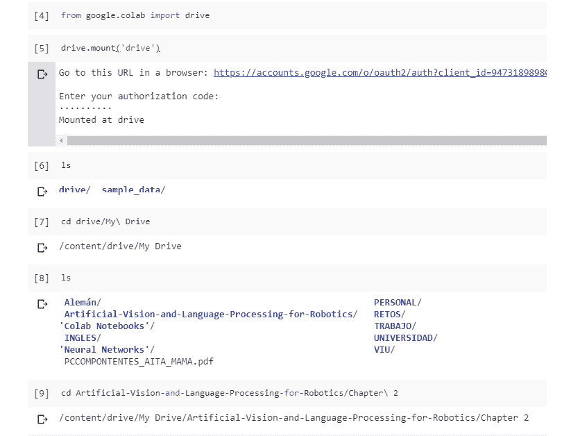
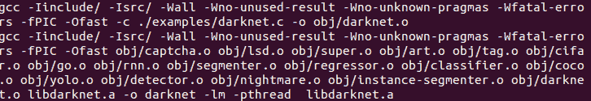
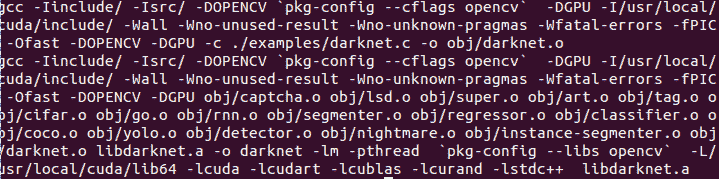

# 零、前言

## 关于

本节简要介绍作者、本书的覆盖范围、入门所需的技能，以及完成所有包含的活动和练习所需的硬件和软件要求。

## 关于这本书

*机器人的人工视觉和语言处理*从讨论机器人背后的理论开始。你将比较用于与机器人合作的不同方法，并探索计算机视觉、其算法和限制。然后你将学习如何用自然语言处理命令控制机器人。在阅读本书的过程中，您将学习 Word2Vec 和手套嵌入技术、非数字数据以及循环神经网络(RNNs)及其高级模型。您将使用 Keras 创建一个简单的 Word2Vec 模型，构建一个卷积神经网络(CNN ),并使用数据扩充和迁移学习对其进行改进。您将浏览 ROS 并构建一个对话代理来管理您的机器人。您还将集成您的代理和 ROS，并将图像转换为文本，将文本转换为语音。您将学习如何在视频剪辑的帮助下构建一个目标识别系统。

到本书结束时，你将拥有构建一个功能应用程序所需的技能，该应用程序可以与 ROS 集成，从你的环境中提取有用的信息。

### 关于作者

Á·阿尔瓦罗·莫雷纳·阿尔伯罗拉是一名计算机工程师，热爱机器人技术和人工智能。目前，他从事软件开发工作。他对 AI 的核心部分，也就是基于人工视觉的部分，极其感兴趣。Á·阿尔瓦罗喜欢使用新技术，学习如何使用先进的工具。他认为机器人是缓解人类生活的一种方式；一种帮助人们完成他们自己无法完成的任务的方式。

**Gonzalo Molina Gallego** 毕业于计算机科学专业，专攻人工智能和自然语言处理。他有在基于文本的对话系统上工作的经验，创建对话代理，并建议好的方法。目前，他正在研究混合领域对话系统的新技术。Gonzalo 认为对话式用户界面是未来的趋势。

**Unai Garay Maestre** 是计算机科学毕业生，专攻人工智能和计算机视觉领域。他成功地向 2018 年 CIARP 会议提交了一篇论文，该论文采用了一种使用可变自编码器进行数据增强的新方法。他也是一名机器学习开发者，将深度神经网络应用于图像。

### 目标

*   探索 ROS 并构建一个基本的机器人系统
*   用自然语言处理技术识别谈话意图
*   通过 Word2Vec 和 GloVe 学习和使用单词嵌入
*   使用深度学习来实现人工智能(AI)和对象识别
*   用 CNN 开发一个简单的目标识别系统
*   将人工智能与操作系统集成，使您的机器人能够识别目标

### 观众

*机器人人工视觉和语言处理*面向希望学习如何整合计算机视觉和深度学习技术来创建完整机器人系统的机器人工程师。如果你有 Python 的工作知识和深度学习的背景，这将是有益的。有 ROS 知识者优先。

### 方法

*机器人的人工视觉和语言处理*采用一种实用的方法，让你拥有创建集成计算机视觉和 NLP 的系统来控制机器人的工具。这本书分为三个部分:自然语言处理，计算机视觉和机器人。在详细介绍基础知识之后，它介绍了高级主题。它还包含多种活动，供您在高度相关的环境中练习和应用新技能。

### 最低硬件要求

为了获得最佳的学生体验，我们建议采用以下硬件配置:

*   处理器:2GHz 双核处理器或更好的处理器
*   内存:8 GB 内存
*   存储:5 GB 可用硬盘空间
*   良好的互联网连接

要训练神经网络，我们推荐使用 **Google Colab** 。但是如果你想用你的电脑训练这些网络，你需要:

*   英伟达 GPU

### 软件要求

由于与 ROS Kinetic 的兼容性问题，我们不建议本书使用 Ubuntu 16.04。但是如果你想用 Ubuntu 18.04，有一个版本是支持 ROS 的，名字叫 Melodic。在项目期间，您将需要安装几个库来完成所有的练习，例如`NLTK` ( < = 3.4)、`spaCy` ( < =2.0.18)、`gensim` ( < =3.7.0)、`NumPy` ( < =1.15.4)、`sklearn` ( < =0.20.1)、`Matplotlib` ( < =3.0.2)、`OpenCV` ( < =4.0.0。练习中解释了每个库的安装过程。

要在你的 Ubuntu 系统中使用 YOLO，你需要安装你的 GPU 的 **NVIDIA** 驱动和 NVIDIA **CUDA** 工具包。

### 惯例

文本中的码字、数据库表名、文件夹名、文件名、文件扩展名、路径名、虚拟 URL、用户输入和 Twitter 句柄如下所示:“使用`TfidfVectorizer` 方法，我们可以将语料库中的文档集合转换为 TF-IDF 特征矩阵”

代码块设置如下:

```
vectorizer = TfidfVectorizer()
X = vectorizer.fit_transform(corpus)
```

新术语和重要单词用粗体显示。您在屏幕上看到的单词，例如在菜单或对话框中看到的单词，会出现在文本中，如下所示:“**词法分析**:聚焦于一个句子的单词并分析其语素”

### 安装和设置

在开始阅读本书之前，您需要安装以下软件。您可以在此找到安装这些组件的步骤:

**安装 Git LFS**

为了从这本书的 GitHub 下载所有资源，并能够使用图像来训练你的神经网络模型，你将需要安装 **Git LFS** (Git 大文件存储)。它用 Git 中的文本指针替换了音频样本、视频、数据集和图形等大型文件。

如果您尚未克隆存储库:

1.  安装 Git LFS
2.  克隆 Git 存储库
3.  从存储库文件夹中，执行`gitlfs pull`
4.  完成的

如果存储库已经克隆:

1.  安装 Git LFS
2.  从存储库文件夹中，执行:`gitlfs pull`
3.  完成的

安装 https://github.com/git-lfs/git-lfs/wiki/Installation[LFS](https://github.com/git-lfs/git-lfs/wiki/Installation)

**【推荐】谷歌合作实验室**

如果你有选择，使用谷歌合作实验室。这是一个免费的 Jupyter 笔记本环境，不需要设置，完全在云中运行。您还可以利用在 GPU 上运行它的优势。

使用它的步骤如下:

1.  将整个 GitHub 上传到您的 Google Drive 帐户，这样您就可以使用存储在存储库中的文件。确保您首先使用了 Git LFS 来加载所有文件。
2.  转到要打开新 Google Colab 笔记本的文件夹，单击新建>更多>协作实验室。现在，您已经打开了一个 Google Colab 笔记本并保存在相应的文件夹中，您已经准备好使用 Python、Keras 或任何其他已经安装的库了。T38
3.  如果您想安装一个特定的库，您可以使用“pip”包安装或任何其他命令行安装并添加“！”开始的时候。比如，“！pip 安装 sklearn”，这将安装 scikit-learn。
4.  如果您希望能够从您的 Google Drive 加载文件，您需要在 Google Colab 单元格中执行这两行代码:

    ```
    from google.colab import drive drive.mount(‘drive’)
    ```

5.  然后，打开输出中出现的链接，使用您用来创建 Google Colab 笔记本的 Google 帐户登录。
6.  现在，您可以使用`ls`列出当前目录中的文件，并使用`cd`导航到特定文件夹:，导航到文件上传的位置
7.  现在，Google Colab 笔记本能够加载任何文件并执行任何任务，就像 Jupyter 笔记本在该文件夹中打开一样。

**安装 ROS Kinetic**

要在你的 Ubuntu 系统中安装框架，你必须遵循以下步骤:

1.  准备 Ubuntu 接受 ROS 软件:

    ```
    sudosh -c ‘echo “deb http://packages.ros.org/ros/ubuntu $(lsb_release -sc) main” > /etc/apt/sources.list.d/ros-latest.list’
    ```

2.  配置下载密钥:

    ```
    sudo apt-key adv --keyserver hkp://ha.pool.sks-keyservers.net:80 --recv-key 421C365BD9FF1F717815A3895523BAEEB01FA116
    ```

3.  确保系统更新:

    ```
    sudo apt-get update
    ```

4.  安装完整的框架以确保功能正常:

    ```
    sudo apt-get install ros-kinetic-desktop-full
    ```

5.  初始化并更新`rosdep`:T20
6.  Add environment variables to the `bashrc` file if you want to avoid declaring them each time you work with ROS:

    ```
    echo “source /opt/ros/kinetic/setup.bash” >> ~/.bashrcsource ~/.bashrc
    ```

    #### 注意

    完成此过程后，可能需要重新启动计算机，以便系统实施新的配置。

7.  通过启动来检查框架是否正常工作:

    ```
    roscore
    ```

**配置 TurtleBot**

#### 没有 te

可能会发生 TurtleBot 与您的 ROS 发行版不兼容的情况(我们使用 Kinetic Kame)，但不要担心，有很多机器人可以在 Gazebo 中模拟。您可以查找不同的机器人，并尝试将它们用于您的 ROS 发行版。

TurtleBot 的配置过程如下:

1.  安装其依赖项:

    ```
    sudo apt-get install ros-kinetic-turtlebotros-kinetic-turtlebot-apps ros-kinetic-turtlebot-interactions ros-kinetic-turtlebot-simulator ros-kinetic-kobuki-ftdiros-kinetic-ar-track-alvar-msgs
    ```

2.  在您的`catkin`工作区:

    ```
    cd ~/catkin_ws/src git clone https://github.com/turtlebot/turtlebot_simulator
    ```

    下载 TurtleBot 模拟器包
3.  After that, you should be able to use TurtleBot with Gazebo.

    如果你试图在 Gazebo 中可视化 TurtleBot 时出错，从我们的 GitHub 下载`turtlebot_simulator`文件夹并替换它。

    启动 ROS 服务:

    ```
    roscore
    ```

    启动 TurtleBot 世界:

    ```
    cd ~/catkin_ws
    catkin_make
    sourcedevel/setup.bash
    roslaunchturtlebot_gazeboturtlebot_world.launch
    ```

**暗网的基本安装**

按照以下步骤安装 Darknet:

1.  下载框架:

    ```
    git clone https://github.com/pjreddie/darknet
    ```

2.  Switch to the downloaded folder and run the compilation command:

    ```
    cd darknet
    make
    ```

    如果编译过程正确完成，您应该会看到如下输出:



###### 暗网编译输出

**暗网高级安装**

这是为了实现本章目标而必须完成的安装过程。它将允许您使用 GPU 计算来实时检测和识别对象。在执行此安装之前，您必须在 Ubuntu 系统上安装一些依赖项，例如:

*   **NVIDIA 驱动程序**:允许您的系统与您的 GPU 正常工作的驱动程序。你可能知道，肯定是英伟达的型号。
*   CUDA :这是一个 NVIDIA 工具包，为构建需要使用 GPU 的应用程序提供了一个开发环境。
*   **OpenCV**: This is a free artificial vision library, which is very useful for working with images.

    #### 注意

    重要的是要考虑到所有这些依赖项在几个版本中都是可用的。您必须找到与您的特定 GPU 和系统兼容的每个工具的版本。

    一旦系统准备就绪，您就可以执行高级安装:

1.  如果你没有做基本安装，下载框架:

    ```
    git clone https://github.com/pjreddie/darknet
    ```

2.  修改 Makefile 的第一行以启用 OpenCV 和 CUDA。应该是这样:

    ```
    GPU=1 CUDNN=0 OPENCV=1 OPENMP=0 DEBUG=0
    ```

3.  Save Makefile changes, switch to `darknet` directory and run the compilation command:

    ```
    cd darknet
    make
    ```

    现在，您应该会看到类似如下的输出:



###### 用 CUDA 和 OpenCV 实现暗网编译

**安装 YOLO**

在执行这个安装之前，你必须在你的 Ubuntu 系统上安装一些依赖项，正如在*Darknet 的高级安装中提到的。*

#### 注意

重要的是要考虑到所有这些依赖项在几个版本中都是可用的。您必须找到与您的特定 GPU 和系统兼容的每个工具的版本。

一旦系统准备就绪，您就可以执行高级安装:

1.  下载框架:

    ```
    git clone https://github.com/pjreddie/darknet
    ```

2.  修改 Makefile 的第一行以启用 OpenCV 和 CUDA。应该如下:

    ```
    GPU=1 CUDNN=0 OPENCV=1 OPENMP=0 DEBUG=0
    ```

3.  Sav e Makefile 更改，切换到 darknet 目录，运行编译命令:

    ```
    cd darknet Make
    ```

### 附加资源

本书的代码包也托管在 GitHub 上:[https://GitHub . com/packt publishing/Artificial-Vision-and-Language-Processing-for-Robotics](https://github.com/PacktPublishing/Artificial-Vision-and-Language-Processing-for-Robotics)。

我们在[https://github.com/PacktPublishing/](https://github.com/PacktPublishing/)也有丰富的书籍和视频目录中的其他代码包。看看他们！

文档链接:

活性氧动力学-[http://wiki.ros.org/kinetic/Installation](http://wiki.ros.org/kinetic/Installation)

Git 大文件存储-[https://git-lfs.github.com/](https://git-lfs.github.com/)