# *第三章*

# 自然语言处理基础

## 学习目标

本章结束时，您将能够:

*   对自然语言处理的不同领域进行分类
*   分析 Python 中的基本自然语言处理库
*   预测一组文本中的主题
*   开发一个简单的语言模型

本章涵盖了自然语言处理的不同基础和领域，以及 Python 中的库。

## 简介

**自然语言处理** ( **NLP** )是**人工智能** ( **AI** )的一个领域，目标是使计算机能够理解和操纵人类语言，以便执行有用的任务。在这个区域内，有两个部分:**自然语言理解** ( **NLU** )和**自然语言生成** ( **NLG** )。

近年来，人工智能改变了机器与人类的互动方式。人工智能通过执行任务来帮助人们解决复杂的方程，例如根据你的口味推荐一部电影(推荐系统)。由于 GPU 的高性能和可用的海量数据，有可能创建能够像人类一样学习和行为的智能系统。

有许多旨在帮助创建这些系统的库。在这一章中，我们将回顾最著名的从原始文本中提取和清理信息的 Python 库。你可能认为这项任务很复杂，但是完全理解和解释这门语言本身就是一项艰巨的任务。例如，“克里斯蒂亚诺·罗纳尔多进了三个球”这句话对机器来说很难理解，因为它不知道克里斯蒂亚诺·罗纳尔多是谁，也不知道进球的数量意味着什么。

NLP 中最受欢迎的话题之一是**问答** ( **QA** )。本专业还包括**信息检索** l ( **IR** )。这些系统通过向数据库查询知识或信息来构造答案，但是它们能够从自然语言文档的集合中提取答案。这就是谷歌等搜索引擎的工作方式。

在当今业界，NLP 越来越受欢迎。最新的自然语言处理趋势是在线广告匹配、情感分析、自动翻译和聊天机器人。

对话代理，俗称聊天机器人，是 NLP 的下一个挑战。他们可以进行真正的对话，许多公司通过聊天机器人分析客户的行为和意见，利用他们获得关于他们产品的反馈或创建新的广告活动。虚拟助手是 NLP 的一个很好的例子，它们已经被引入市场。最著名的有 Siri、亚马逊的 Alexa、Google Home。在本书中，我们将创建一个聊天机器人来控制一个能够理解我们想要机器人做什么的虚拟机器人。

### 自然语言处理

如前所述，NLP 是一个人工智能领域，负责理解和处理人类语言。NLP 位于人工智能、计算机科学和语言学的交叉点。这个领域的主要目标是让计算机理解用人类语言写的语句或单词:

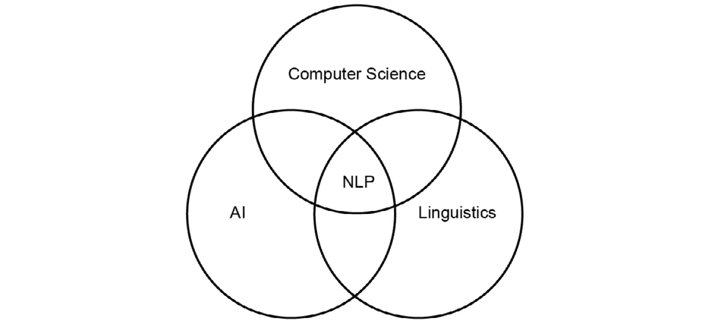

###### 图 3.1:人工智能、语言学和计算机科学中自然语言处理的表示

语言科学专注于人类语言的研究，试图描述和解释语言的不同途径。

语言可以定义为一套规则和一套符号。符号被组合并用于广播信息，并由规则构成。人类的语言是特殊的。我们不能简单地把它描绘成自然形成的符号和规则；根据上下文的不同，单词的意思会发生变化。

NLP 越来越受欢迎，可以解决很多难题。可用的文本数据量非常大，人类不可能处理所有这些数据。在维基百科中，每天平均有 547 篇新文章，总共有超过 500 万篇文章。你可以想象，一个人不可能阅读所有的信息。

NLP 面临三个挑战。第一个挑战是收集所有数据，第二个挑战是对数据进行分类，最后一个挑战是提取相关信息。

NLP 解决了很多繁琐的任务，比如邮件中的垃圾邮件检测、**词性** ( **词性**)标注、命名实体识别等。通过深度学习，NLP 还可以解决语音到文本的问题。虽然自然语言处理显示了很大的能力，但也有一些情况，比如在人机对话、问答系统摘要和机器翻译中没有很好的解决方案。

### NLP 的组成部分

如前所述，NLP 可以分为两组:NLU 和 NLG。

**自然语言理解**

NLP 的这一部分涉及对人类语言的理解和分析。它侧重于理解文本数据，并对其进行处理以提取相关信息。NLU 提供直接的人机交互，并执行与语言理解相关的任务。

NLU 涵盖了人工智能挑战中最困难的部分，那就是文本的解释。NLU 的主要挑战是理解对话。

#### 注意

NLP 使用一套方法来生成、处理和理解语言。NLU 用函数来理解文本的意思。

以前，对话被表示为一棵树，但是这种方法不能覆盖许多对话情况。为了覆盖更多的情况，需要更多的树，每个树对应一个对话的上下文，导致许多句子的重复:

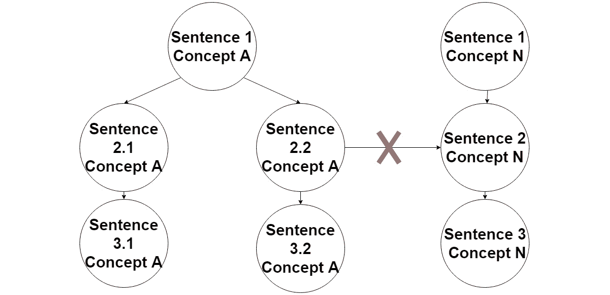

###### 图 3.2:用树表示对话

这种方法是过时和低效的，因为它是基于固定的规则；本质上是一个 if-else 结构。但现在，NLU 贡献了另一种方法。对话可以表示为维恩图，其中每个集合都是对话的上下文:

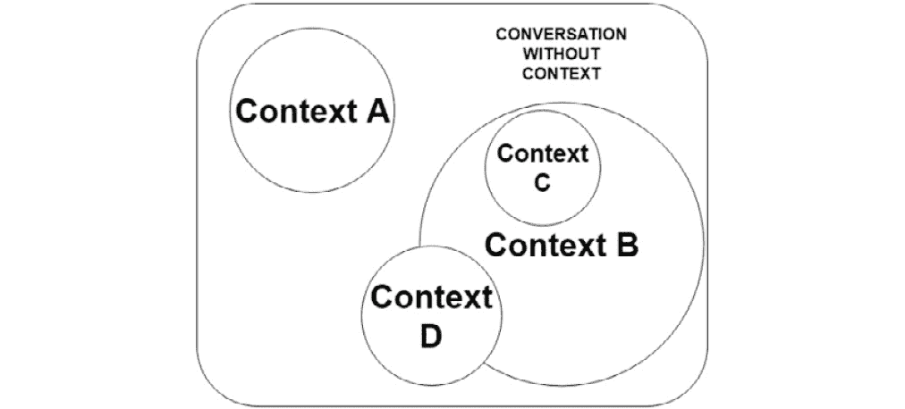

###### 图 3.3:使用文氏图表示对话

正如您在前面的图中所看到的，NLU 方法改善了理解对话的结构，因为它不是包含 if-else 条件的固定结构。NLU 的主要目标是解释人类语言的含义，处理对话的上下文，解决歧义和管理数据。

**自然语言生成**

NLG 是产生有意义和结构的短语、句子和段落的过程。这是自然语言处理的一个领域，不涉及理解文本。

为了生成自然语言，NLG 方法需要相关数据。

NLG 有三个组成部分:

*   **生成器**:负责将文本包含在意图中，使其与情境的上下文相关联
*   **表示的组件和级别**:为生成的文本提供结构
*   **应用**:保存对话中的相关数据，以遵循逻辑线索

生成的文本必须是人类可读的格式。NLG 的优点是你可以让你的数据可访问，你可以快速创建报告的摘要。

### 自然语言处理水平

人类语言有不同层次的表征。每个表示级别都比前一个级别更复杂。当我们通过等级提升时，理解语言变得更加困难。

前两个级别取决于数据类型(音频或文本)，其中包括:

*   **音韵分析**:如果数据是语音，首先我们需要分析音频才有句子。
*   **OCR/tokenization**: If we have text, we need to recognize the characters and form words using computer vision (OCR). If not, we will need to tokenize the text (that is, split the sentence into units of text).

    #### 注意

    OCR 过程是识别图像中的字符。一旦它生成单词，它们就被作为原始文本进行处理。

*   **词法分析**:聚焦句子的词，分析其语素。
*   **句法分析**:这个层次侧重于句子的语法结构。这意味着理解句子的不同部分，如主语或谓语。
*   **语义表示**:一个程序不理解一个单词；它可以通过知道单词在句子中的用法来知道单词的意思。例如，“猫”和“狗”对于算法来说可能意味着相同，因为它们可以以相同的方式使用。这样理解句子，叫做词级意义。
*   **话语处理**:分析和识别文本中的连接句子及其关系。通过这样做，算法可以理解文本的主题是什么。

NLP 在当今的行业中显示出巨大的潜力，但也有一些例外。使用深度学习概念，我们可以处理其中的一些异常，以获得更好的结果。其中一些问题将在第 4 章、*带 NLP 的神经网络*中讨论。文本处理技术的优势和循环神经网络的改进是自然语言处理变得越来越重要的原因。

## Python 中的自然语言处理

近年来，Python 变得非常流行，它将通用编程语言的强大功能与特定领域语言的使用相结合，如 MATLAB 和 R(专为数学和统计而设计)。它有不同的库用于数据加载、可视化、NLP、图像处理、统计等等。Python 拥有最强大的文本处理和机器学习算法库。

### 自然语言工具包(NLTK)

NLTK 是在 Python 中处理人类语言数据的最常见的工具包。它包括一组用于处理自然语言和统计的库和程序。NLTK 通常被用作学习工具和进行研究。

这个库为 50 多个语料库和词汇资源提供了接口和方法。NLTK 能够对文本进行分类并执行其他功能，如标记化、词干化(提取单词的词干)、标记化(识别单词的标签，如 person、city……)和解析(语法分析)。

### 练习 10:NLTK 简介

在本练习中，我们将回顾关于 NLTK 库的最基本的概念。正如我们之前所说，这个库是 NLP 最广泛使用的工具之一。它可以用来分析和研究文本，忽略无用的信息。这些技术可以应用于任何文本数据，例如，从一组推文中提取最重要的关键词或分析报纸上的一篇文章:

#### 注意

本章中的所有练习都将在 Google Colab 中执行。

1.  打开你的 Google Colab 界面。
2.  为该书创建一个文件夹。
3.  这里，我们将使用 NLTK 库的基本方法处理一个句子。首先，我们导入必要的方法(`stopwords`、`word_tokenize`、`sent_tokenize` ):

    ```
    from nltk.corpus import stopwords from nltk.tokenize import word_tokenize from nltk.tokenize import sent_tokenize  import nltk nltk.download('punkt')
    ```

4.  Now we create a sentence and apply the methods:

    ```
    example_sentence = "This course is great. I'm going to learn deep learning; Artificial Intelligence is amazing and I love robotics..."
    sent_tokenize(example_sentence) # Divide the text into sentences
    ```

    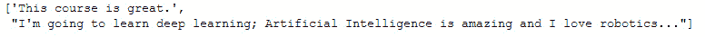

    ###### 图 3.4:句子分成一个子句子

    ```
    word_tokenize(example_sentence)
    ```

    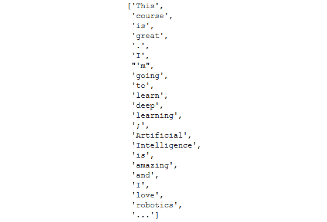

    ###### 图 3.5:将句子标记成单词

    #### 注意

    `Sent_tokenize`返回不同句子的列表。NLTK 的一个缺点是`sent_tokenize`不分析整篇文本的语义结构；它只是用点分割文本。

5.  随着句子一个单词一个单词地标记化，让我们减去停用词。停用词是一组没有文本相关信息的词。在使用`stopwords`之前，我们需要下载它:

    ```
    nltk.download('stopwords')
    ```

6.  Now, we set the language of our `stopwords` as English:

    ```
    stop_words = set(stopwords.words("english")) 
    print(stop_words)
    ```

    输出如下所示:

    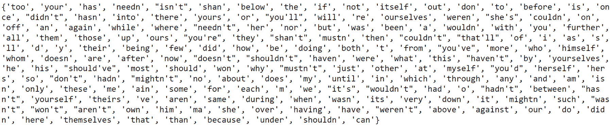

    ###### 图 3.6:设置为英语的停用词

7.  Process the sentence, deleting `stopwords`:

    ```
    print(word_tokenize(example_sentence))
    print([w for w in word_tokenize(example_sentence.lower()) if w not in stop_words]) 
    ```

    输出如下所示:

    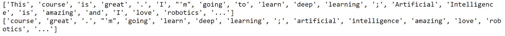

    ###### 图 3.7:没有停用词的句子

8.  我们现在可以修改`stopwords`的设置并检查输出:

    ```
    stop_words = stop_words - set(('this', 'i', 'and'))  print([w for w in word_tokenize(example_sentence.lower()) if w not in stop_words]) 
    ```

    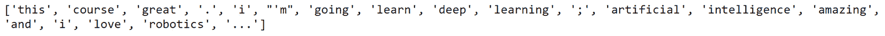

    ###### 图 3.8:设置停止字

9.  Stemmers remove morphological affixes from words. Let's define a stemmer and process our sentence. `Porter stemmer` is an algorithm for performing this task:

    ```
    from nltk.stem.porter import *    # importing a stemmer
    stemmer = PorterStemmer()    # importing a stemmer     
    print([stemmer.stem(w) for w in  word_tokenize(example_sentence)])
    ```

    输出如下所示:

    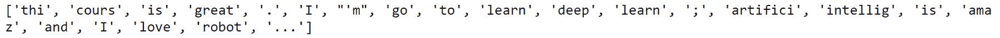

    ###### 图 3.9:设置停用词

10.  Finally, let's classify each word by its type. To do this, we will use a POS tagger:

    ```
    nltk.download('averaged_perceptron_tagger')
    t = nltk.pos_tag(word_tokenize(example_sentence)) #words with each tag
    t
    ```

    输出如下所示:

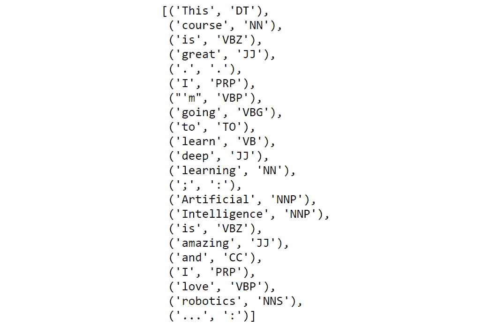

###### 图 3.10:位置标签

#### 注意

平均感知器标记器是一种被训练来预测单词类别的算法。

在这个练习中，您可能已经注意到，NLTK 可以轻松地处理一个句子。此外，它可以毫无问题地分析大量文本文档。它支持许多语言，标记化过程比类似的库更快，并且它有许多方法来解决每个 NLP 问题。

### 空间

spaCy 是 Python 中 NLP 的另一个库。它看起来确实与 NLTK 相似，但是您会看到它的工作方式有一些不同。

spaCy 由 Matt Honnibal 开发，旨在让数据科学家轻松清理和规范化文本。就为机器学习模型准备文本数据而言，它是最快的库。它包括内置的词向量和一些比较两个或多个文本之间相似性的方法(这些方法是用神经网络训练的)。

它的 API 易于使用，比 NLTK 更直观。通常，在 NLP 中，spaCy 被比作 NumPy。它提供了用于执行标记化、词条化、词性标注、NER、依存解析、句子和文档相似性、文本分类等的方法和功能。

除了语言特征，它还有统计模型。这意味着您可以预测一些语言学注释，例如一个单词是动词还是名词。根据您想要进行预测的语言，您将需要更改一个模块。在本节中有 Word2Vec 模型，我们将在*第 4 章*、*NLP 神经网络中讨论。*

正如我们以前说过的，空间有许多优点，但也有一些缺点；例如，它只支持 8 种语言(NLTK 支持 17 种语言)，标记化过程很慢(这种耗时的过程对于长语料库来说可能很关键)，而且总体来说，它不灵活(也就是说，它只提供 API 方法，没有修改任何参数的可能性)。

在开始练习之前，让我们回顾一下 spaCy 的架构。spaCy 最重要的数据结构是 Doc 和 Vocab。

文档结构是您正在加载的文本；它不是一个字符串。它由一系列标记及其注释组成。Vocab 结构是一组查找表，但是什么是查找表，为什么该结构很重要？嗯，计算中的查找表是一个数组，索引一个代替运行时的操作。空间集中了文档中可用的信息。这意味着它更有效，因为这样可以节省内存。如果没有这些结构，spaCy 的计算速度会更慢。

但是，Doc 的结构与 Vocab 不同，因为 Doc 是数据的容器。Doc 对象拥有数据，由一系列标记或范围组成。还有一些词位，它们与 Vocab 结构相关，因为它们没有上下文(不像令牌容器)。

#### 注意

词位是没有屈折词尾的词汇意义单位。这方面的研究领域是形态学分析。

图 3.11 向我们展示了空间结构。

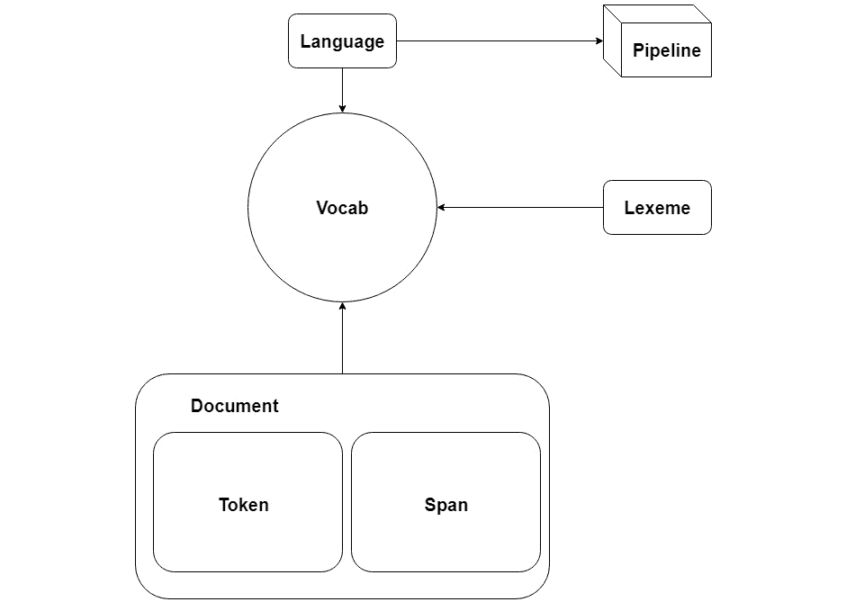

###### 图 3.11:空间架构

根据您正在加载的语言模型，您将拥有不同的管道和不同的 Vocab。

### 练习 11:空间简介

在本练习中，我们将进行与在*练习 10* 、*NLTK 简介*中相同的转换，并对与该练习中相同的句子进行转换，但使用 spaCy API。本练习将帮助您理解和了解这些库之间的差异:

1.  打开你的 Google Colab 界面。
2.  为该书创建一个文件夹。
3.  然后，导入包以使用它的所有特性:

    ```
    import spacy
    ```

4.  现在我们要初始化我们的`nlp`对象。该对象是 spaCy 方法的一部分。通过执行这行代码，我们加载了括号内的模型:

    ```
    import en_core_web_sm nlp = spacy.load('en')
    ```

5.  让我们使用与*练习 10* 、*NLTK 简介、*中相同的句子，并创建 Doc 容器:

    ```
    example_sentence = "This course is great. I'm going to learn deep learning; Artificial Intelligence is amazing and I love robotics..." doc1 = nlp(example_sentence)
    ```

6.  Now, print `doc1`, its format, the 5th and 11th token, and a span between the 5th and the 11th token. You will see this:

    ```
    print("Doc structure: {}".format(doc1))
    print("Type of doc1:{}".format(type(doc1)))
    print("5th and 10th Token of the Doc: {}, {}".format(doc1[5], doc1[11]))
    print("Span between the 5th token and the 10th: {}".format(doc1[5:11]))
    ```

    输出如下所示:

    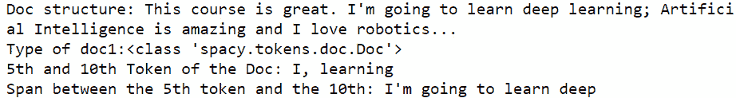

    ###### 图 3.12:空间文档的输出

7.  As we saw in Figure 3.5, documents are composed of tokens and spans. First, we are going to see the spans of `doc1`, and then its tokens.

    打印跨度:

    ```
    for s in doc1.sents:
        print(s)
    ```

    输出如下所示:

    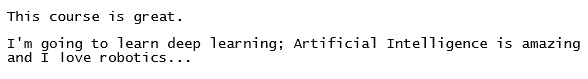

    ###### 图 3.13:打印文档 1 的跨度

    打印令牌:

    ```
    for i in doc1:
        print(i)
    ```

    输出如下所示:

    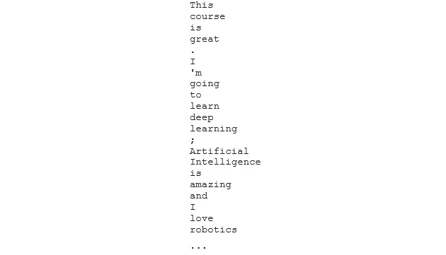

    ###### 图 3.14:打印 doc1 的令牌

8.  Once we have the document divided into tokens, the stop words can be removed.

    首先，我们需要导入它们:

    ```
    from spacy.lang.en.stop_words import STOP_WORDS
    print("Some stopwords of spaCy: {}".format(list(STOP_WORDS)[:10]))
    type(STOP_WORDS)
    ```

    输出如下所示:

    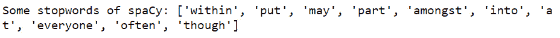

    ###### 图 3.15:空间中的 10 个停用词

    但是令牌容器具有`is_stop`属性:

    ```
    for i in doc1[0:5]:
        print("Token: {} | Stop word: {}".format(i, i.is_stop)
    ```

    输出如下所示:

    

    ###### 图 3.16:令牌的 is_stop 属性

9.  To add new stop words, we must modify the `vocab` container:

    ```
    nlp.vocab["This"].is_stop = True doc1[0].is_stop
    ```

    这里的输出如下所示:

    真实的

10.  To perform speech tagging, we initialize the token container:

    ```
    for i in doc1[0:5]:
        print("Token: {} | Tag: {}".format(i.text, i.pos_))
    ```

    输出如下所示:

    

    ###### 图 3.17:的。令牌的 pos_ 属性

11.  The document container has the `ents` attribute, with the entity of the tokens. To have more entities in our document, let's declare a new one:

    ```
    doc2 = nlp("I live in Madrid and I am working in Google from 10th of December.")
    for i in doc2.ents:
        print("Word: {} | Entity: {}".format(i.text, i.label_))
    ```

    输出如下所示:


###### 图 3.18:的。令牌的标签属性

#### 注意

正如您在这个练习中看到的，spaCy 比 NLTK 更容易使用，但是 NLTK 提供了更多的方法来对文本执行不同的操作。空间非常适合生产。这意味着，在最少的时间内，您可以对文本执行基本的处理。

演习已经结束！现在可以使用 NLTK 或 spaCy 对文本进行预处理。根据您想要执行的任务，您可以选择这些库中的一个来清理您的数据。

## 主题建模

在作为 NLP 的一部分的 NLU 中，可以执行的许多任务之一是提取句子、段落或整个文档的含义。理解文档的一种方法是通过它的主题。例如，如果一组文档来自报纸，那么主题可能是政治或体育。使用主题建模技术，我们可以获得代表不同主题的一串单词。根据您的文档集，您将有不同的主题用不同的单词表示。这些技术的目标是了解语料库中不同类型的文档。

### 词频-逆文档频率(TF-IDF)

**TF-IDF** 是一种常用的 NLP 模型，用于从文档中提取最重要的单词。为了执行这种分类，算法将为每个单词分配一个权重。这种方法的思想是忽略与全局概念的意义无关的单词，(这意味着文本的整体主题)，因此那些术语将被向下加权(这意味着它们将被忽略)。降低权重将允许我们找到该文档的关键词(权重最大的词)。

从数学上来说，计算文档中一个词的权重的算法如下:


###### 图 3.19: TF-IDF 公式

*   *Wi，j* :文档中 I 项的权重，j
*   *tf，j*:I 在 j 中出现的次数
*   *df，j* :包含 I 的文档数
*   *N* :文件总数

结果是某个术语在该文档中出现的次数，乘以文档总数的对数，再除以包含该术语的文档数。

### 潜在语义分析(LSA)

LSA 是主题建模的基础技术之一。它分析一组文档和它们的术语之间的关系，并产生一组与它们相关的概念。

与 TF-IDF 相比，LSA 领先一步。在大量文档中，TF-IDF 矩阵具有非常嘈杂的信息和许多冗余维度，因此 LSA 算法执行降维。

这种简化是通过奇异值分解(SVD)来实现的。SVD 将矩阵 M 分解为三个独立矩阵的乘积:


###### 图 3.20:奇异值分解

*   *A* :这是输入数据矩阵。
*   *m* :这是文件的数量。
*   *n* :这是项数。
*   *U* :左奇异向量。我们的文档-主题矩阵。
*   *S* :奇异值。代表每个概念的优势。这是一个对角矩阵。
*   *V*: Right singular vectors. Represents terms' vectors in terms of topics.

    #### 注意

    这种方法在大量文档上更有效，但是有更好的算法来执行这个任务，例如 LDA 或 PLSA。

### 练习 12:Python 中的主题建模

在本练习中，TF-IDF 和 LSA 将使用特定的库用 Python 进行编码。本练习结束时，您将能够使用这些技术来提取文档中某个术语的权重:

1.  打开你的 Google Colab 界面。
2.  为该书创建一个文件夹。
3.  为了生成 TF-IDF 矩阵，我们可以对图 3.19 中的公式进行编码，但是我们将使用 Python 中最著名的机器学习算法库之一 scikit-learn:

    ```
    from sklearn.feature_extraction.text import TfidfVectorizer from sklearn.decomposition import TruncatedSVD
    ```

4.  我们将在这个练习中使用的语料库很简单，只有四个句子:

    ```
    corpus = [      'My cat is white',      'I am the major of this city',      'I love eating toasted cheese',      'The lazy cat is sleeping', ]
    ```

5.  使用`TfidfVectorizer`方法，我们可以将语料库中的文档集合转换为 TF-IDF 特征矩阵:

    ```
    vectorizer = TfidfVectorizer() X = vectorizer.fit_transform(corpus)
    ```

6.  The `get_feature_names()` method shows the extracted features.

    #### 注意

    ```
    vectorizer.get_feature_names()
    ```

    输出如下所示:

    

    ###### 图 3.21:语料库的特征名称

7.  X is a sparse matrix. To see its content, we can use the `todense()` function:

    ```
    X.todense()
    ```

    输出如下所示:

    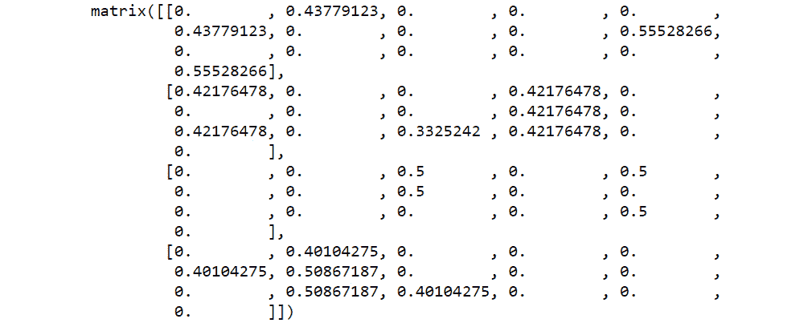

    ###### 图 3.22:语料库的 TF-IDF 矩阵

8.  Now let's perform dimensionality reduction with LSA. The `TruncatedSVD` method uses SVD to transform the input matrix. In this exercise, we'll use `n_components=10`. From now on, you have to use `n_components=100` (it has better results in larger corpuses):

    ```
    lsa = TruncatedSVD(n_components=10,algorithm='randomized',n_iter=10,random_state=0)
    lsa.fit_transform(X)
    ```

    输出如下所示:

    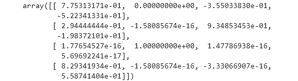

    ###### 图 23:LSA 降维

9.  `attribute .components_` shows the weight of each `vectorizer.get_feature_names()`. Notice that the LSA matrix has a range of 4x16, we have 4 documents in our corpus (concepts), and the vectorizer has 16 features (terms):

    ```
    lsa.components_
    ```

    输出如下所示:


###### 图 3.24:期望的 TF-IDF 矩阵输出

演习已经圆满结束！这是*活动 3* 、*过程一文集*的准备练习。务必检查练习的第七步——它会给你完成未来活动的钥匙。我鼓励您阅读 scikit-learn 文档，并了解如何看到这两种方法的潜力。现在你知道如何创建 TF-IDF 矩阵。这个矩阵可能非常庞大，因此为了更好地管理数据，LSA 算法对文档中每个术语的权重进行了降维。

### 活动 3:处理语料库

在本活动中，我们将处理一个非常小的语料库，使用 LSA 清理数据并提取关键词和概念。

想象一下这个场景:你所在城镇的报纸供应商发布了一份竞赛。它包括预测文章的类别。这份报纸没有结构化的数据库，这意味着它只有原始数据。他们提供了一小组文档，他们需要知道文章是政治、科学还是体育相关的:

#### 注意

您可以在 spaCy 和 NLTK 库之间进行选择。如果在 LSA 算法的末尾关键词是相关的，那么两种解决方案都是有效的。

1.  Load the corpus documents and store them in a list.

    #### 注意

    语料库文档可以在 GitHub 上找到，[https://GitHub . com/packt publishing/Artificial-Vision-and-Language-Processing-for-Robotics/tree/master/lesson 03/activity 03/dataset](https://github.com/PacktPublishing/Artificial-Vision-and-Language-Processing-for-Robotics/tree/master/Lesson03/Activity03/dataset)

2.  用 spaCy 或 NLTK 预处理文本。
3.  应用 LSA 算法。
4.  Show the first five keywords related to each concept:

    关键词:月球，阿波罗，地球，太空，美国宇航局

    关键词:码，触地得分，牛仔队，普雷斯科特，左

    关键词:facebook，隐私，技术，消费者，数据

    #### 注意

    输出关键字可能与您的不同。如果你的关键词不相关，那么检查解决方案。

    输出如下所示:

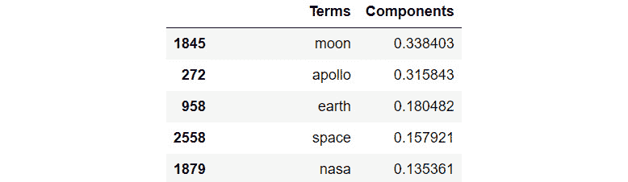

###### 图 3.25:概念中最相关单词的输出示例(f1)

#### 注意

这项活动的解决方案在第 306 页。

## 语言建模

到目前为止，我们已经回顾了预处理文本数据的最基本的技术。现在我们将深入自然语言的结构——语言模型。我们可以将这个主题视为 NLP 中机器学习的介绍。

### 语言模型简介

一个统计的**语言模型** ( **LM** )是一个单词序列的概率分布，也就是说，给一个特定的句子分配一个概率。例如，LMs 可以用来计算句子中即将出现的单词的概率。这包括对 LM 的结构以及它将如何形成做出一些假设。LM 的输出永远不会完全正确，但使用它通常是必要的。

LMs 用于更多的 NLP 任务。例如，在机器翻译中，知道下一个句子前面是什么是很重要的。LMs 还用于语音识别、避免歧义、拼写纠正和摘要。

让我们看看 LM 在数学上是如何表示的:

*   P(W) = P(w1，w2，w3，w4，…wn)

*P(W)* 是我们的 LM， *wi* 是包含在 *W* 中的单词，正如我们之前提到的，我们可以用它来计算即将出现的单词的概率，方法如下:

*   P(w5|w1，w2，w3，w4)

这(w1，w2，w3，w4)说明了在给定的单词序列中 *w5* (即将出现的单词)的概率是多少。

看这个例子，P (w5|w1，w2，w3，w4)，我们可以这样假设:

*   p(实际单词|先前单词)

根据我们正在寻找的先前单词的数量来获得实际单词的概率，我们可以使用不同的模型。所以，现在我们要介绍一些关于这类模型的重要概念。

### 二元模型

二元模型是两个连续单词的序列。例如，在“我的猫是白色的”这句话中，有这样的二元结构:

我的猫

凯特群岛

是白色的

数学上，二元模型有这样的形式:

*   二元模型:P(wi|wi-1)

### N 元模型

如果我们改变前一个单词的长度，我们就得到 N-gram 模型。它的工作方式和二元模型一样，但是考虑的单词比之前的多。

使用前面的例子“我的猫是白色的”，这是我们可以获得的:

*   **Trigram**

    我的猫是

    猫是白色的

*   **4 克**
*   我的猫是白色的

**N-Gram 问题**

在这一点上，您可能认为 n 元模型比二元模型更准确，因为 n 元模型可以访问额外的“先前知识”。但是 n-gram 模型有一定的局限性，因为长距离依赖。一个例子是，“经过深思熟虑，我买了一台电视机”，我们的计算方法是:

*   p(电视|想了很多，买了一个)

“想了很久，我买了一台电视机”这句话可能是我们语料库中唯一具有这种结构的单词序列。如果我们将“电视”一词换成另一个词，例如“计算机”，句子“想了很多之后，我买了一台计算机”也是有效的，但在我们的模型中，情况会是这样:

*   p(电脑|想了很多，买了一个)= 0

这句话是成立的，但我们的模型并不准确，所以我们需要谨慎使用 n 元模型。

### 计算概率

**单字概率**

单字是计算概率的最简单的例子。它计算一个单词在一组文档中出现的次数。这是它的公式:


###### 图 3.27:单字概率估计

*   *c(作业指导书)*是*的次数*
*   *wi* 出现在整个语料库中。语料库的大小就是其中有多少个标记。

**二元概率**

为了估计二元模型概率，我们将使用最大似然估计:


###### 图 3.27:二元模型概率估计

为了更好地理解这个公式，我们来看一个例子。

想象我们的语料库由这三个句子组成:

我叫查尔斯。

查尔斯是我的名字。

我的狗玩球。

语料库的大小是 14 个单词，现在我们要估计序列“我的名字”的概率:


###### 图 3.28:二元模型估计的例子

**链式法则**

现在我们知道了二元模型和 n 元模型的概念，我们需要知道如何获得这些概率。

如果你有基本的统计学知识，你可能会认为最好的选择是应用链式法则并加入每个概率。例如，在句子“我的猫是白色的”中，概率如下:

*   p(我的猫是白色的)= p(白色|我的猫是)p(是|我的猫)p(猫|我的)p(我的)

这个句子似乎是可行的，但如果我们有一个更长的句子，长距离依赖问题就会出现，n-gram 模型的结果可能不正确。

**平滑**

到目前为止，我们有一个概率模型，如果我们想估计我们的模型的参数，我们可以使用最大似然估计。

LMs 的一大问题是数据不足。我们的数据有限，所以会有很多未知事件。这是什么意思？这意味着我们最终会得到一个 LM，它给看不见的单词的概率是 0。

为了解决这个问题，我们将使用平滑方法。使用这种平滑方法，每个概率估计结果都将大于零。我们要使用的方法是加一平滑:


###### 图 3.29:二元模型估计中的加一平滑

*V* 是我们语料库中不同标记的数量。

#### 注意

平滑方法更多，性能更好；这是最基本的方法。

**马尔可夫假设**

马尔可夫假设对于估计长句的概率非常有用。用这种方法，我们可以解决远距离依赖的问题。马尔可夫假设简化了链规则来估计长单词序列。每个估计仅取决于前一步:


###### 图 3.30:马尔可夫假设

我们还可以有一个二阶马尔可夫假设，它取决于前面的两项，但我们将使用一阶马尔可夫假设:


###### 图 3.31:马尔可夫的例子

如果我们把这个应用到整个句子，我们得到这个:


###### 图 3.32:完整句子的马尔可夫示例

以上述方式分解单词序列将更准确地输出概率。

### 练习 13:创建二元模型

在本练习中，我们将创建一个包含单字和双字的简单 LM。此外，我们将比较没有添加平滑和添加平滑的 LM 的创建结果。例如，n-gram 的一个应用是在键盘应用程序中。他们可以预测你的下一个单词。这种预测可以用二元模型来完成:

1.  打开你的 Google Colab 界面。
2.  为该书创建一个文件夹。
3.  声明一个小的，容易训练的语料库:

    ```
    import numpy as np corpus = [      'My cat is white',      'I am the major of this city',      'I love eating toasted cheese',      'The lazy cat is sleeping', ]
    ```

4.  导入所需的库并加载模型:

    ```
    import spacy import en_core_web_sm from spacy.lang.en.stop_words import STOP_WORDS nlp = en_core_web_sm.load()
    ```

5.  Tokenize it with spaCy. To be faster in doing the smoothing and the bigrams, we are going to create three lists:

    `Tokens`:文集的所有记号

    `Tokens_doc`:每个语料库的标记列表

    `Distinc_tokens`:删除重复的所有令牌:

    ```
    tokens = []
    tokens_doc = []
    distinc_tokens = []
    ```

    让我们创建第一个循环来遍历语料库中的句子。`doc`变量将包含句子的符号序列:

    ```
    for c in corpus:
        doc = nlp(c)
        tokens_aux = []
    ```

    现在，我们将创建第二个循环来遍历令牌，将它们推入相应的列表。`t`变量将是句子的每个标记:

    ```
        for t in doc:
            tokens_aux.append(t.text)
            if t.text not in tokens:
                distinc_tokens.append(t.text) # without duplicates 
            tokens.append(t.text)
        tokens_doc.append(tokens_aux)
        tokens_aux = []
        print(tokens)
        print(distinc_tokens)
        print(tokens_doc)
    ```

6.  Create the unigram model and test it:

    ```
    def unigram_model(word):
        return tokens.count(word)/len(tokens)
    unigram_model("cat")
    ```

    结果= 0.138888888888889

7.  Add the smoothing and test it with the same word:

    ```
    def unigram_model_smoothing(word):
        return (tokens.count(word) + 1)/(len(tokens) + len(distinc_tokens))
    unigram_model_smoothing("cat")
    ```

    结果= 0.11111111111111

    #### 注意

    这种平滑方法的问题是每个看不见的单词都有相同的概率。

8.  创建二元模型:

    ```
    def bigram_model(word1, word2):     hit = 0
    ```

9.  We need to iterate through all of the tokens in the documents to try to find the number of times that `word1` and `word2` appear together:

    ```
        for d in tokens_doc:
            for t,i in zip(d, range(len(d))): # i is the length of d  
                if i <= len(d)-2:
                    if word1 == d[i] and word2 == d[i+1]:
                        hit += 1
        print("Hits: ",hit)
        return hit/tokens.count(word1)
    bigram_model("I","am")
    ```

    输出如下所示:

    

    ###### 图 3.33:显示 word1 和 word2 同时出现在文档中的输出

10.  Add the smoothing to the bigram model:

    ```
    def bigram_model_smoothing(word1, word2):
        hit = 0
        for d in tokens_doc:
            for t,i in zip(d, range(len(d))):
                if i <= len(d)-2:
                    if word1 == d[i] and word2 == d[i+1]:
                        hit += 1
        return (hit+1)/(tokens.count(word1)+len(distinc_tokens))
    bigram_model("I","am")
    ```

    输出如下所示:


###### 图 3.34:模型添加平滑后的输出

恭喜你！你已经完成了本章的最后一个练习。在下一章中，你会看到这种 LM 方法是一种基本的深度 NLP 方法。你现在可以使用一个巨大的语料库来创建你自己的 LM。

#### 注意

应用马尔可夫假设，最终概率将舍入到 0。我推荐使用 log()并添加每个组件。此外，检查代码的精度位(float16 < float32 < float64).

## Summary

NLP 在人工智能中越来越重要。行业分析大量的非结构化原始文本数据。为了理解这些数据，我们使用许多库来处理它们。NLP 分为两组方法和功能:NLG 生成自然语言，NLU 理解自然语言。

首先，清理文本数据很重要，因为会有很多无用的、不相关的信息。一旦数据准备好进行处理，通过数学算法，如 TF-IDF 或 LSA，大量的文件可以理解。NLTK 和 spaCy 之类的库对于完成这项任务非常有用。它们提供了消除数据中噪声的方法。文档可以表示为矩阵。首先，TF-IDF 可以给出文档的全局表示，但是当语料库很大时，更好的选择是使用 LSA 和奇异值分解进行降维。scikit-learn 提供了处理文档的算法，但是如果文档没有经过预处理，结果就不会准确。最后，语言模型的使用可能是必要的，但是它们需要由有效的文档训练集构成。如果文档集是好的，语言模型应该能够生成语言。

下一章我们将介绍**循环神经网络** ( **RNNs** )。我们将着眼于这些 rnn 的一些高级模型，并相应地在制造我们的机器人方面领先一步。