# 四、NLP 和神经网络

## 学习目标

本章结束时，您将能够:

*   解释什么是循环神经网络
*   设计并构建一个循环神经网络
*   评估非数字数据
*   使用 RNNs 评估不同的最新语言模型
*   用时间序列数据预测一个值

本章涵盖了 RNNs 的各个方面。它处理解释、设计和建造各种 RNN 模型。

## 简介

如前一章所述，自然语言处理(NLP)是人工智能(AI)的一个领域，涵盖了计算机如何理解和操纵人类语言以执行有用的任务。现在，随着深度学习技术的发展，深度自然语言处理已经成为一个新的研究领域。

那么，什么是深度 NLP 呢？它是 NLP 技术和深度学习的结合。这些技术相结合的结果是以下领域的进步:

*   语言学:语音到文本
*   工具:词性标注、实体识别和句子解析
*   应用:情感分析、问题回答、对话代理和机器翻译

深度自然语言处理最重要的方法之一是单词和句子的表示。单词可以表示为位于充满其他单词的平面中的向量。根据每个单词与另一个单词的相似性，其在平面中的距离将被相应地设置为更大或更小。

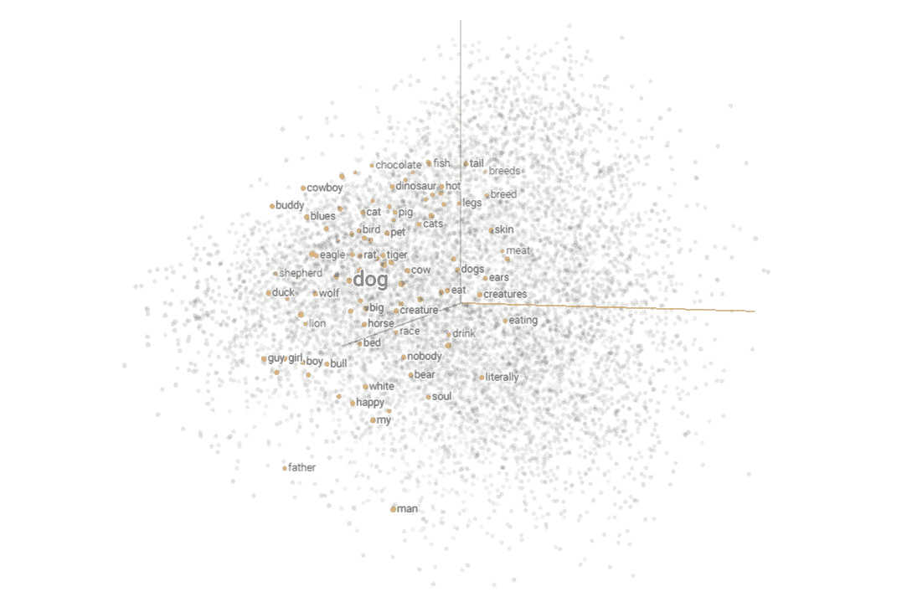

###### 图 4.1:多维度的单词表示

上图展示了一个单词嵌入的例子。**单词嵌入**是将语料库中的单词和句子映射成向量或实数的技术和方法的集合。它根据单词出现的上下文生成每个单词的表示。然后，单词嵌入可以发现单词之间的相似之处。例如，与 dog 最接近的单词如下:

1.  狗
2.  猫
3.  母牛
4.  鼠
5.  伯德

生成嵌入有不同的方法，比如 Word2Vec，这将在*第 7 章*、*构建一个对话代理来管理机器人*中涉及。

这并不是深度学习在形态学层面上给 NLP 带来的唯一大的改变。通过深度学习，一个单词可以表示为向量的组合。

每个语素都是一个向量，一个词是几个语素向量组合的结果。

这种组合向量的技术也在语义层面上使用，但是用于单词的创建和句子的创建。每个短语由许多词向量组合而成，因此一个句子可以表示为一个向量。

另一个改进是在句子解析方面。这个任务很难，因为它是模糊的。神经网络可以准确地确定句子的语法结构。

就全面应用而言，这些领域如下:

*   **情绪分析**:传统上，这是由一袋标有积极或消极情绪的单词组成。然后，把这几个词组合起来，就返回了整句话的情绪。现在使用深度学习和单词表示模型，效果更好。
*   **问题回答**:为了找到问题的答案，向量表示可以将文档、段落或句子与输入的问题进行匹配。
*   **对话代理**:通过神经语言模型，模型可以理解查询并创建响应。
*   机器翻译:机器翻译是自然语言处理中最困难的任务之一。已经尝试了许多方法和模型。传统模型非常庞大和复杂，但深度学习神经机器翻译解决了这个问题。句子用向量编码，输出解码。

单词的向量表示是深度自然语言处理的基础。制造一架飞机，可以完成很多任务。在分析深度 NLP 技术之前，我们将回顾什么是循环神经网络(RNN)，它在深度学习中的应用，以及如何创建我们的第一个 RNN。

我们未来的对话代理将检测对话的意图，并以预定义的答案做出响应。但是有了一个好的对话数据集，我们可以创建一个循环神经网络来训练一个语言模型(LM)，它能够对对话中的给定主题产生响应。该任务可以由其他神经网络架构来执行，例如 seq2seq 模型。

## 循环神经网络

在本节中，我们将回顾**循环神经网络** ( **RNNs** )。这个题目先来看看 RNNs 的理论。它将回顾该模型中的许多架构，并帮助您确定使用哪个模型来解决某个问题，它还将研究几种类型的 RNN 及其优缺点。此外，我们将看看如何创建一个简单的 RNN，训练它，并作出预测。

### 循环神经网络简介(RNN)

人类行为表现出一系列有序的行为序列。人类能够基于一组先前的动作或序列来学习动态路径。这意味着人们不是从零开始学习；我们有一些以前的知识，这对我们有帮助。例如，如果你不理解句子中的前一个单词，你就不能理解这个单词！

传统上，神经网络不能解决这类问题，因为它们不能学习以前的信息。但是，如果仅仅用当前的信息无法解决问题，会发生什么呢？

1986 年，Michael I. Jordan 提出了一个处理时间组织这一经典问题的模型。该模型能够通过研究动态对象先前的运动来学习其轨迹。约旦创造了第一个 RNN。

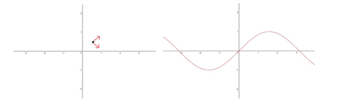

###### 图 4.2:非先前信息与时间序列的例子

在上图中，左边的图像向我们显示，如果没有任何信息，我们无法知道黑点的下一个动作会是什么，但如果我们假设它以前的运动被记录为图表右侧的红线，我们就可以预测它的下一个动作会是什么。

### 循环神经网络内部

到目前为止，我们已经看到 RNNs 不同于神经网络(NNs)。RNN 神经元就像正常的神经元一样，但其中有环路，允许它们存储时间状态。存储某一时刻的状态，他们可以根据以前的时间状态进行预测。

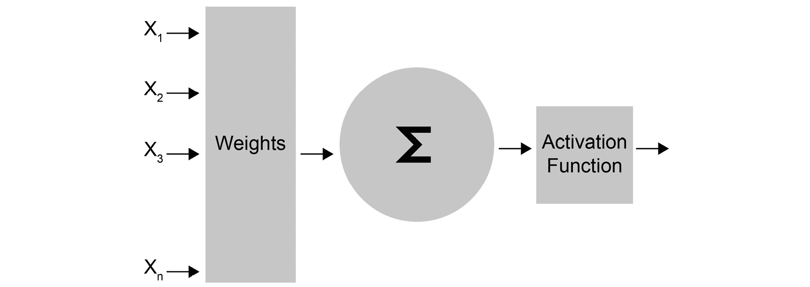

###### 图 4.3:传统神经元

上图显示了在神经网络中使用的传统神经元。*X*n 为神经元的输入，激活函数后，产生响应。RNN 神经元的模式是不同的:

.jpg)

###### 图 4.4:循环神经元

上图中的循环允许神经元存储时间状态。 *h* *n* 是输入的输出， *X* *n* ，以及之前的状态。神经元随着时间而变化和进化。

如果神经元的输入是一个序列，展开的 RNN 应该是这样的:

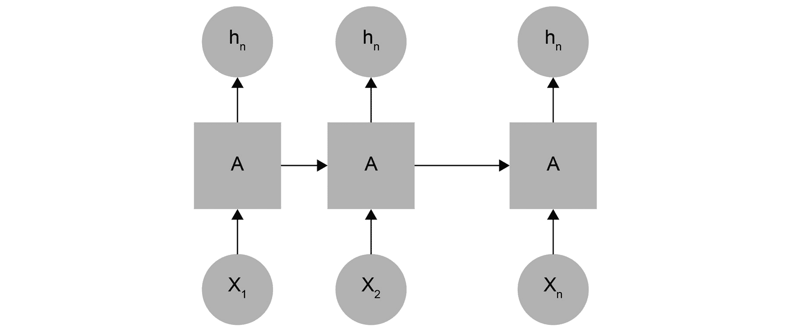

###### 图 4.5:展开的循环神经元

图 4.5 中的链状模式表明，rnn 与序列和列表密切相关。所以，我们有和输入一样多的神经元，每个神经元把它的状态传递给下一个。

### RNN 建筑

根据 RNN 中输入和输出的数量，有许多具有不同数量神经元的体系结构。每种体系结构都专门用于某项任务。到目前为止，有许多类型的网络:

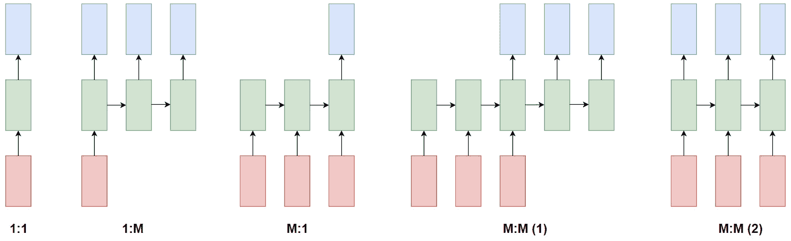

###### 图 4.6:rnn 的结构

上图显示了 rnn 的各种分类。在本书的前面，我们回顾了一对一的架构。在本章中，我们将学习多对一体系结构。

*   **一对一**:来自一个输入的分类或回归任务(图像分类)。
*   **一对多**:图像字幕任务。这些都是深度学习中的硬任务。例如，传递图像作为输入的模型可以描述图片中的元素。
*   **多对一**:时序、情感分析……每项任务只有一个输出，但基于一系列不同的输入。
*   多对多:机器自动翻译系统。
*   **同步多对多**:视频分类。

### 长期依赖问题

在某些任务中，只需要使用最新的信息来预测模型的下一步。对于时间序列，有必要检查较旧的元素来学习或预测句子中的下一个元素或单词。比如，看看这句话:

*   云在天空中。

现在想象一下这句话:

*   云朵在[？]

您可能会假设所需的单词是 sky，您知道这一点是因为前面的信息:

*   云在天空中

但是在其他任务中，模型需要先前的信息来获得更好的预测。比如，看看这句话:

*   我出生在意大利，但是当我 3 岁的时候，我搬到了法国…这就是我说话的原因[？]

为了预测单词，模型需要从句子的开头获取信息，这可能是一个问题。这是 RNNs 的一个问题:当与信息的距离较大时，学习难度更大。这个问题叫做**消失渐变**。

**消失渐变问题**

信息以 RNN 的形式在时间中传播，因此来自先前步骤的信息被用作下一步骤的输入。在每一步，模型计算成本函数，因此每次，模型可以获得误差度量。当通过网络传播计算的误差，并试图在更新权重时最小化该误差时，该操作的结果是更接近于零的数字(如果将两个小数字相乘，结果是更小的数字)。这意味着模型的梯度随着每次乘法变得越来越小。这里的问题是，网络将无法正常训练。RNNs 解决这个问题的方法是使用长短期记忆(LSTM)。

### 练习 14:用 RNN 预测房价

我们将使用 Keras 创建我们的第一个 RNN。这个练习不是时间序列问题。我们将使用回归数据集来介绍 RNNs。

我们可以使用 Keras 库中包含的几种方法作为模型或图层类型:

*   Keras 模型:这些让我们可以使用 Keras 中不同的可用模型。我们将使用顺序模型。
*   Keras 层:我们可以向我们的神经网络添加不同类型的层。在这个练习中，我们将使用 LSTM 和密集层。密集层是神经网络中神经元的规则层。每个神经元接收来自前一层所有神经元的输入，但它们紧密相连。

本练习的主要目标是预测波士顿一所房子的价值，因此我们的数据集将包含每所房子的信息，例如房产的总面积或房间数量:

1.  从`sklearn`导入波士顿房价的数据集，看一下数据:

    ```
    from sklearn.datasets import load_boston boston = load_boston() boston.data
    ```

    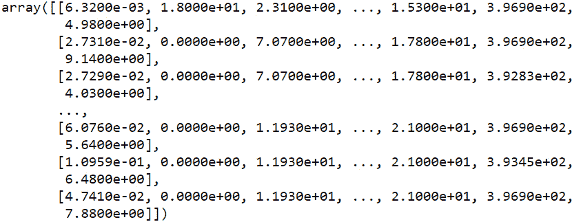

    ###### 图 4.7:波士顿房价数据

2.  您可以看到数据具有很高的值，因此最好的办法是对数据进行标准化。通过`sklearn`的`MinMaxScaler`函数，我们将把数据转换成 0 到 1 之间的值:

    ```
    from sklearn.preprocessing import MinMaxScaler import numpy as np   scaler = MinMaxScaler() x = scaler.fit_transform(boston.data)   aux = boston.target.reshape(boston.target.shape[0], 1) y = scaler.fit_transform(aux)
    ```

3.  将数据分为训练集和测试集。测试集的一个好的百分比是数据的 20%:

    ```
    from sklearn.model_selection import train_test_split   x_train, x_test, y_train, y_test = train_test_split(x, y, test_size=0.2, shuffle=False) print('Shape of x_train {}'.format(x_train.shape)) print('Shape of y_train {}'.format(y_train.shape)) print('Shape of x_test {}'.format(x_test.shape)) print('Shape of y_test {}'.format(y_test.shape))
    ```

    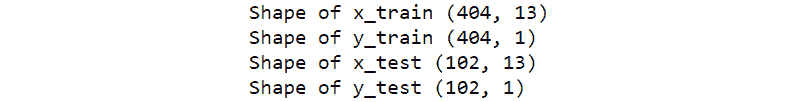

    ###### 图 4.8:列车的形状和测试数据

4.  导入 Keras 库并设置一个种子来初始化权重:

    ```
    import tensorflow as tf from keras.models import Sequential from keras.layers import Dense tf.set_random_seed(1)
    ```

5.  创建一个简单的模型。致密层只是一组神经元。最后一个密集层只有一个神经元返回输出:

    ```
    model = Sequential()   model.add(Dense(64, activation='relu')) model.add(Dense(32, activation='relu')) model.add(Dense(1))   model.compile(loss='mean_squared_error', optimizer='adam')
    ```

6.  训练网络:

    ```
    history = model.fit(x_train, y_train, batch_size=32, epochs=5, verbose=2)
    ```

    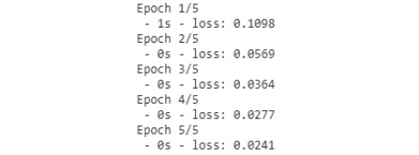

    ###### 图 4.9:训练网络

7.  计算模型误差:

    ```
    error = model.evaluate(x_test, y_test) print('MSE: {:.5f}'.format(error))
    ```

    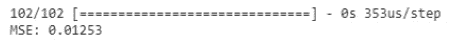

    ###### 图 4.10:计算模型误差

8.  绘制预测:

    ```
    import matplotlib.pyplot as plt   prediction = model.predict(x_test) print('Prediction shape: {}'.format(prediction.shape))   plt.plot(range(len(x_test)), prediction.reshape(prediction.shape[0]), '--r') plt.plot(range(len(y_test)), y_test) plt.show()
    ```

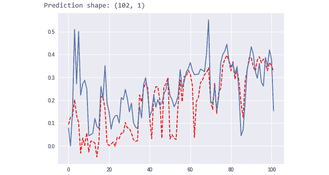

###### 图 4.11:我们模型的预测

现在你有了一个回归问题的 RNN！你可以尝试修改参数，增加更多的层，或者改变神经元的数量，看看会发生什么。在下一个练习中，我们将使用 LSTM 图层解决时间序列问题。

## 长短期记忆

LSTM 是一种 RNN，旨在解决长期依赖问题。它能记住长时间或短时间的数值。它与传统 rnn 的主要区别在于，它们包含一个单元或一个循环来内部存储内存。

Hochreiter 和 Schmidhuber 在 1997 年创建了这种类型的神经网络。这是 LSTM 神经元的基本模式:

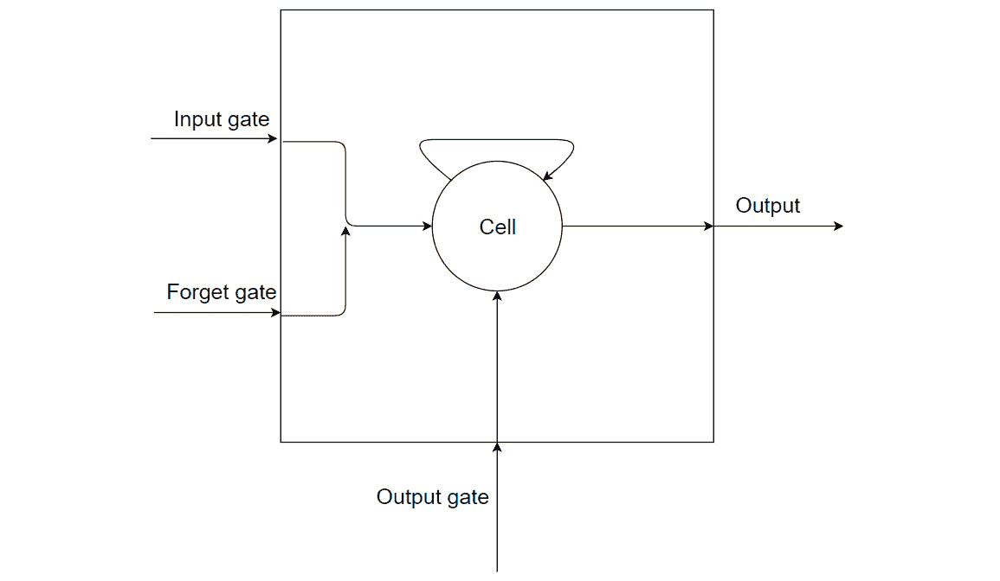

###### 图 4.12: LSTM 神经元结构

正如你在上图中看到的，LSTM 神经元的模式是复杂的。它有三种类型的门:

*   输入门:允许我们控制输入值来更新存储单元的状态。
*   遗忘门:允许我们删除记忆单元的内容。
*   输出门:允许我们控制输入和单元存储内容的返回值。

Keras 中的 LSTM 模型具有三维输入:

*   样本:是您拥有的数据量(序列的数量)。
*   时间步长:是你网络的内存。换句话说，它存储以前的信息，以便做出更好的预测。
*   Features: Is the number of features in every time step. For example, if you are processing pictures, the features are the number of pixels.

    #### 注意

    这种复杂的设计会导致形成另一种类型的网络。这种新型的神经网络是一个**门控递归单元(GRU)** ，它解决了消失梯度问题。

### 练习 15:预测一个数学函数的下一个解

在本练习中，我们将构建一个 LSTM 来预测正弦函数的值。在本练习中，您将学习如何使用 LSTM 模型对 Keras 模型进行定型和预测。此外，本练习将涵盖数据生成以及如何将数据分为训练样本和测试样本:

1.  通过 Keras，我们可以使用 Sequential 类创建一个 RNN，还可以创建一个 LSTM 来添加新的循环神经元。导入 LSTM 模型的 Keras 库、设置数据的 NumPy 库和打印图表的 matplotlib 库:

    ```
    import tensorflow as tf from keras.models import Sequential from keras.layers import LSTM, Dense import numpy as np import matplotlib.pyplot as plt
    ```

2.  创建数据集来训练和评估模型。我们将生成一个包含 1000 个值的数组，作为正弦函数的结果:

    ```
    serie = 1000 x_aux = [] #Natural numbers until serie x_aux = np.arange(serie) serie = (np.sin(2 * np.pi * 4 * x_aux / serie) + 1) / 2
    ```

3.  看数据好不好，我们来作图:

    ```
    plt.plot(x_aux, serie) plt.show()
    ```

    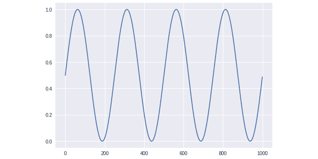

    ###### 图 4.13:用作图的数据输出

4.  As this chapter explains, RNN works with sequences of data, so we need to split our data into sequences. In our case, the maximum length of the sequences will be 5\. This is necessary because the RNNs need sequences as input.

    这个模型将是**多对一**，因为输入是一个序列，而输出只是一个值。要了解我们为什么要使用多对一结构创建 RNN，我们只需要知道输入和输出数据的维度:

    ```
    #Prepare input data
    maxlen = 5
    seq = []
    res = []
    for i in range(0, len(serie) - maxlen):
        seq.append(serie[i:maxlen+i])
        res.append(serie[maxlen+i])
    print(seq[:5])
    print(res[:5])
    ```

5.  Prepare the data to introduce it to the LSTM model. Pay attention to the shape of the `x` and `y` variables. RNNs need a three-dimensional vector as input and a two-dimensional vector as output. That's why we will reshape the variables:

    ```
    x = np.array(seq)
    y = np.array(res)
    x = x.reshape(x.shape[0], x.shape[1], 1)
    y = y.reshape(y.shape[0], 1)
    print('Shape of x {}'.format(x.shape))
    print('Shape of y {}'.format(y.shape))
    ```

    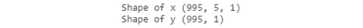

    ###### 图 4.14:重塑变量

    #### 注意

    LSTM 的输入维数是 3。

6.  将数据拆分成训练集和测试集:

    ```
    from sklearn.model_selection import train_test_split   x_train, x_test, y_train, y_test = train_test_split(x, y, test_size=0.2, shuffle=False) print('Shape of x_train {}'.format(x_train.shape)) print('Shape of y_train {}'.format(y_train.shape)) print('Shape of x_test {}'.format(x_test.shape)) print('Shape of y_test {}'.format(y_test.shape))
    ```

    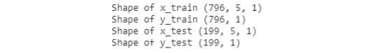

    ###### 图 4.15:将数据拆分成训练集和测试集

7.  建立一个简单的模型，该模型具有一个 LSTM 单元和一个具有一个神经元和线性激活的密集层。密集层只是一个规则的神经元层，它接收来自前一层的输入，并生成许多神经元作为输出。正因为如此，我们的密集层只有一个神经元，因为我们需要一个标量值作为输出:

    ```
    tf.set_random_seed(1) model = Sequential() model.add(LSTM(1, input_shape=(maxlen, 1)))    model.add(Dense(1, activation='linear'))       model.compile(loss='mse', optimizer='rmsprop')
    ```

8.  以 5 个时期(一个时期是当整个数据集被神经网络处理时)和 32 的批量大小训练模型并评估它:

    ```
    history = model.fit(x_train, y_train, batch_size=32, epochs=5, verbose=2) error = model.evaluate(x_test, y_test) print('MSE: {:.5f}'.format(error))
    ```

    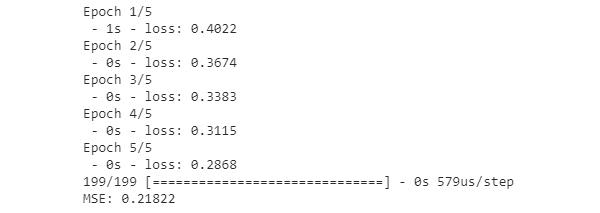

    ###### 图 4.16:以 32 的批量大小训练 5 个时期

9.  绘制测试预测，看看是否有效:

    ```
    prediction = model.predict(x_test) print('Prediction shape: {}'.format(prediction.shape)) plt.plot(range(len(x_test)), prediction.reshape(prediction.shape[0]), '--r') plt.plot(range(len(y_test)), y_test) plt.show()
    ```

    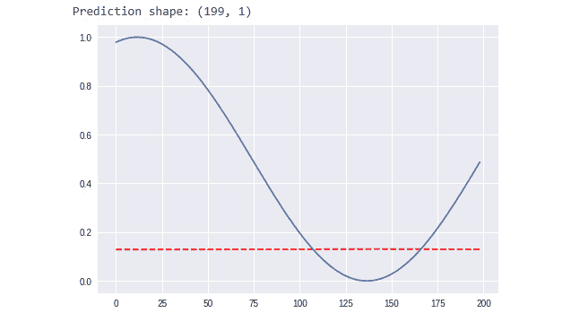

    ###### 图 4.17:绘制预测形状

10.  让我们改进我们的模型。创建一个新的，在 LSTM 层有四个单元，一个密集层有一个神经元，但是有 sigmoid 激活:

    ```
    model2 = Sequential() model2.add(LSTM(4,input_shape=(maxlen,1))) model2.add(Dense(1, activation='sigmoid')) model2.compile(loss='mse', optimizer='rmsprop')
    ```

11.  训练评估 25 个历元，批量为 8:

    ```
    history = model2.fit(x_train, y_train,                      batch_size=8,                      epochs=25,                       verbose=1) error = model2.evaluate(x_test, y_test) print('MSE: {:.5f}'.format(error))
    ```

    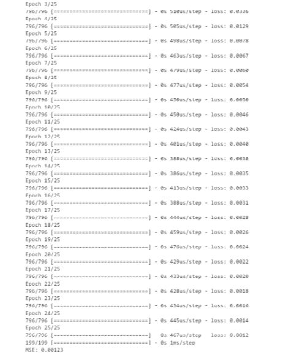

    ###### 图 4.18:训练 25 个历元，批量为 8

12.  绘制模型的预测:

    ```
    predict_2 = model2.predict(x_test) predict_2 = predict_2.reshape(predict_2.shape[0])  print(x_test.shape) plt.plot(range(len(x_test)),predict_2, '--r') plt.plot(range(len(y_test)), y_test) plt.show()
    ```

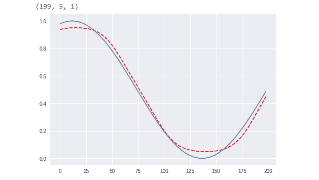

###### 图 4.19:我们神经网络的预测

你现在可以对比一下每个模型的剧情，我们可以看到第二个模型更好。通过这个练习，您已经学习了 LSTM 的基本知识，如何训练和评估您创建的模型，以及如何确定它是好是坏。

## 神经语言模型

*第 3 章*，*自然语言处理基础*向我们介绍了统计语言模型(LMs)，它是一个单词序列的概率分布。我们知道 LMs 可以用来预测句子中的下一个单词，或者计算下一个单词的概率分布。

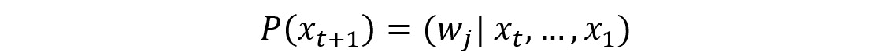

###### 图 4.20:计算即将出现的单词的概率分布的 LM 公式

单词顺序是 *x1* 、*x2*……下一个单词是*x*t+1。*w*j 是词汇中的一个词。 *V* 是词汇表， *j* 是单词在词汇表中的位置。*w*j*j*是位于 *V* 内 *j* 位置的字。

你每天都用 LMs。手机键盘使用这种技术来预测一个句子的下一个单词，谷歌等搜索引擎使用它来预测你想在他们的搜索引擎中搜索什么。

我们讨论了 n-gram 模型和计算语料库中单词的二元模型，但是这种解决方案有一些限制，比如长依赖。深度 NLP 和神经 LMs 将有助于避开这些限制。

### 神经语言模型简介

神经 LMs 遵循与统计 LMs 相同的结构。他们的目标是预测句子中的下一个单词，但方式不同。由于使用序列作为输入，神经 LM 受 RNN 的激励。

*练习 15* ，*预测一个数学函数的下一个解*从前面五个步骤的序列中预测正弦函数的下一个结果。在这种情况下，数据不是正弦函数结果的序列，而是单词，模型将预测下一个单词。

这些神经 LMs 是从改进统计方法的必要性中出现的。较新的模型可以解决传统 LMs 的一些限制和问题。

**统计 LMs 的问题**

在前一章中，我们回顾了 LMs 和 N 元模型、二元模型以及马尔可夫模型的概念。这些方法通过计算文本中的出现次数来执行。这就是为什么这些方法被称为统计 LMs。

LMs 的主要问题是数据限制。如果我们要计算的句子的概率分布在数据中不存在，我们该怎么办？这里的部分解决方案是平滑方法，但这是不够的。

另一种解决方案是使用马尔可夫假设(每个概率只取决于前一步，简化链式规则)来简化句子，但这不会给出很好的预测。这意味着，我们可以用 3 个字母来简化我们的模型。

这个问题的解决方案是增加语料库的大小，但是语料库最终会变得太大。n 元模型中的这些限制被称为**稀疏问题**。

**基于窗口的神经模型**

这个新模型的第一个近似是使用滑动窗口来计算下一个单词的概率。这个解决方案的概念来自于窗口分类。

在单词方面，没有任何上下文，很难理解单个单词的意思。如果这个词不在一个句子或一个段落中，就会有很多问题，例如，两个相似的词或自动反义词之间的歧义。自动反义词是有多重含义的词。根据上下文的不同，残障一词既可以表示优势(例如在体育运动中)，也可以表示劣势(有时是攻击性的，是身体上的问题)。

窗口分类将单词在其相邻单词的上下文(由窗口创建)中分类。滑动窗口的方法可以用于生成 LM。下面是一个图形示例:

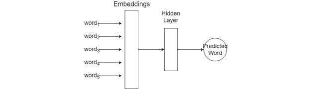

###### 图 4.21:基于窗口的神经 LM

在上图中，有一个基于窗口的神经模型如何工作的示例。窗口大小为 5(字 1 到字 5)。它创建一个向量来连接每个单词的嵌入向量，并在一个隐藏层中对此进行计算:

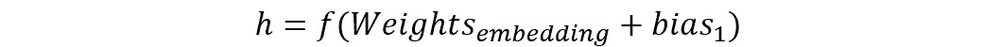

###### 图 4.22:隐藏层公式

最后，为了预测一个单词，该模型返回一个可用于对该单词的概率进行分类的值:

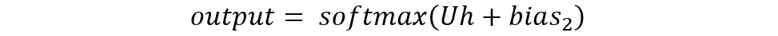

###### 图 4.23: Softmax 函数

然后，具有最高值的单词将是预测的单词。

#### 注意

我们不打算深入研究这些术语，因为我们将使用 LSTM 来创建 LM。

与传统方法相比，这种方法的优势如下:

*   更少的计算工作。基于窗口的神经模型需要较少的计算资源，因为它们不需要迭代通过语料库计算概率。
*   它避免了改变 N-gram 的维数以找到好的概率分布的问题。
*   生成的文本在意义上更有意义，因为这种方法解决了稀疏性问题。

但是也有一些问题:

*   窗口限制:窗口的大小不能太大，所以一些单词的意思可能是错误的。
*   每个窗口都有自己的权重值，因此会导致模糊。
*   如果窗口变大，模型也会变大。

通过分析窗口模型的问题，RNN 可以提高其性能。

### RNN 语言模型

RNN 能够在前面的一系列步骤中计算即将出现的单词的概率。这种方法的核心思想是在整个训练过程中重复使用相同的重量。

与基于窗口的模型相比，使用 RNN LM 有一些优势:

*   这种架构可以处理任何长度的句子；与基于窗口的方法不同，它没有固定的大小。
*   每个输入尺寸的模型都是相同的。投入再大也不会增长。
*   根据神经网络结构，它可以使用来自前面步骤和前面步骤的信息。
*   权重是跨时间步长共享的。

到目前为止，我们已经讨论了改进统计 LM 的不同方法以及每种方法的优缺点。在开发 RNN 逻辑模型之前，我们需要知道如何引入一个句子作为神经网络的输入。

**一键编码**

神经网络和机器学习是关于数字的。正如我们在本书中看到的，输入元素是数字，输出是编码标签。但是，如果神经网络有一个句子或一组字符作为输入，它如何将其转换为数值？

独热编码是离散变量的数字表示。它假设在一组离散的变量中，不同的值具有相同大小的特征向量。这意味着如果有一个大小为 10 的语料库，每个单词将被编码为长度为 10 的向量。因此，每个维度都对应于集合中的一个独特元素。

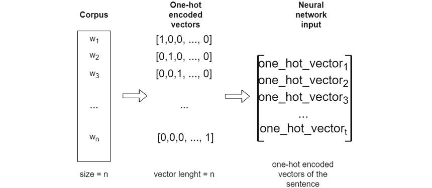

###### 图 4.24: RNN 预处理数据流

上图显示了独热编码的工作原理。理解每个向量的形状很重要，因为神经网络需要理解我们有什么输入数据以及我们想要获得什么输出。接下来，*练习 16，编码一个小语料库*将帮助你更详细地检查一键编码的基础。

### 练习 16:对小型语料库进行编码

在这个练习中，我们将学习如何使用一键编码对一组单词进行编码。这是最基本的编码方法，它给出了离散变量的表示。

本练习将涵盖执行此任务的不同方式。一种方法是手动执行编码，另一种方法是使用库。完成练习后，我们将获得每个单词的向量表示，准备用作神经网络的输入:

1.  定义一个语料库。这个语料库与我们在*第三章*、*自然语言处理基础* :

    ```
    corpus = [      'My cat is white',      'I am the major of this city',      'I love eating toasted cheese',      'The lazy cat is sleeping', ]
    ```

    中使用的是同一个语料库
2.  使用`spaCy`对其进行标记。我们不打算使用停用词(删除无用的词，如文章)的方法，因为我们有一个小的语料库。我们要所有的代币:

    ```
    import spacy import en_core_web_sm nlp = en_core_web_sm.load()   corpus_tokens = [] for c in corpus:     doc = nlp(c)     tokens = []     for t in doc:         tokens.append(t.text)     corpus_tokens.append(tokens) corpus_tokens
    ```

3.  创建一个包含语料库中每个唯一标记的列表:

    ```
    processed_corpus = [t for sentence in corpus_tokens for t in sentence] processed_corpus = set(processed_corpus) processed_corpus
    ```

    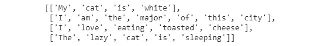

    ###### 图 4.25:包含语料库中每个唯一标记的列表

4.  创建一个字典，将语料库中的每个单词作为关键字，一个唯一的数字作为值。这个字典看起来会像{word:value}，这个值在一键编码向量中的索引为 1:

    ```
    word2int = dict([(tok, pos) for pos, tok in enumerate(processed_corpus)]) word2int
    ```

    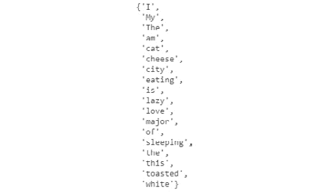

    ###### 图 4.26:每个单词作为一个键，一个唯一的数字作为一个值

5.  编码一个句子。这种执行编码的方式是手动的。有一些库，比如 sklearn，提供了自编码的方法:

    ```
    Import numpy as np sentence = 'My cat is lazy' tokenized_sentence = sentence.split() encoded_sentence = np.zeros([len(tokenized_sentence),len(processed_corpus)]) encoded_sentence for i,c in enumerate(sentence.split()):     encoded_sentence[i][ word2int[c] ] = 1 encoded_sentence
    ```

    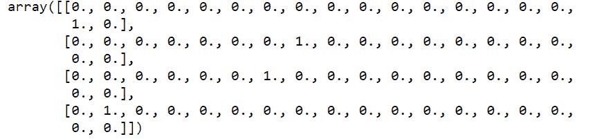

    ###### 图 4.27:手动一键编码矢量。

    ```
    print("Shape of the encoded sentence:", encoded_sentence.shape)
    ```

6.  导入`sklearn`方法。sklearn 首先用`LabelEncoder`对语料库中的每个唯一记号进行编码，然后用`OneHotEncoder`创建向量:

    ```
    from sklearn.preprocessing import LabelEncoder from sklearn.preprocessing import OneHotEncoder Declare the LabelEncoder() class. le = LabelEncoder() Encode the corpus with this class. labeled_corpus = le.fit_transform(list(processed_corpus)) labeled_corpus
    ```

    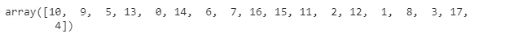

    ###### 图 4.28:用 OneHotEncoder 创建的向量

7.  现在，拿我们之前编码的同一个句子，应用我们创建的`LabelEncoder`变换方法:

    ```
    sentence = 'My cat is lazy' tokenized_sentence = sentence.split() integer_encoded = le.transform(tokenized_sentence) integer_encoded
    ```

    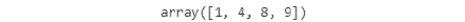

    ###### 图 4.29:应用的 LabelEncoder 变换

8.  我们可以解码`LabelEncoder`在初始句:

    ```
    le.inverse_transform(integer_encoded)
    ```

    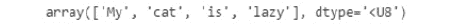

    ###### 图 4.30:解码的 LabelEncoder

9.  用`sparse=False`声明`OneHotEncoder`(如果不指定，将返回一个稀疏矩阵):

    ```
    onehot_encoder = OneHotEncoder(sparse=False)
    ```

10.  为了用我们创建的标签编码器对我们的句子进行编码，我们需要重塑我们的标签语料库，使其适合`onehot_encoder`方法:

    ```
    labeled_corpus = labeled_corpus.reshape(len(labeled_corpus), 1) onehot_encoded = onehot_encoder.fit(labeled_corpus)
    ```

11.  最后，我们可以将我们的句子(用 LabelEncoder 编码)转换成一个独热向量。这种编码方式和手工编码的结果不会相同，但它们会有相同的形状:

    ```
    sentence_encoded = onehot_encoded.transform(integer_encoded.reshape(len(integer_encoded), 1)) print(sentence_encoded)
    ```

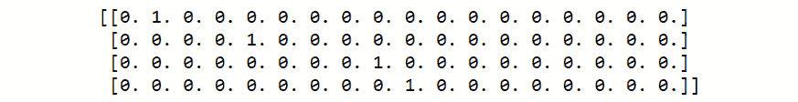

###### 图 4.31:使用 Sklearn 方法的一键编码向量

#### 注意

这个练习非常重要。如果你不理解矩阵的形状，就很难理解 rnn 的输入。

干得好！您已经完成了*练习 16* 。现在你可以把离散变量编码成向量。这是训练和评估神经网络的预处理数据的一部分。接下来，我们进行本章的活动，其目的是使用 RNNs 和一键编码创建一个 LM。

#### 注意

对于较大的语料库，一键编码不是很有用，因为它会为单词创建巨大的向量。相反，使用嵌入向量是正常的。这一概念将在本章的后面介绍。

### RNNs 的输入维度

在开始 RNN 活动之前，您可能不了解输入维度。在本节中，我们将重点了解 n 维数组的形状，以及如何添加新的维度或删除一个维度。

**序列数据格式**

我们已经提到了多对一架构，其中每个样本由一个固定的序列和一个标签组成。该标签对应于序列中即将到来的值。大概是这样的:

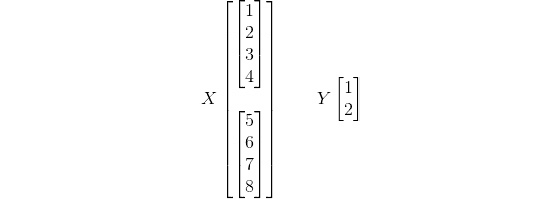

###### 图 4.32:序列数据的格式

在本例中，矩阵 X 中有两个序列，y 中有两个输出标签。因此，形状如下:

X = (2，4)

Y = (2)

但是，如果您尝试将这些数据插入到 RNN 中，将不会成功，因为它没有正确的维度。

**RNN 数据格式**

为了在 Keras 中实现具有时间序列的 RNN，该模型将需要一个三维的输入向量和一个二维的输出向量。

因此，对于 X 矩阵，我们将得到以下结果:

*   样本数目
*   序列长度
*   值长度

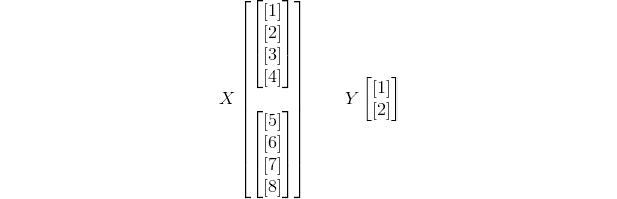

###### 图 4.33: RNN 数据格式

这里的形状如下:

X = (2，4，1)

Y = (2，1)

**一热格式**

使用一键编码，我们拥有与输入相同的维度，但是值的长度改变了。在上图中，我们可以看到一维的值([1]，[2]，…)。但是使用一键编码，这些值将变成向量，所以形状如下:

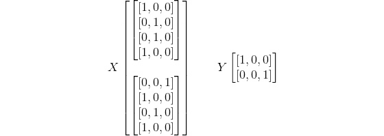

###### 图 4.34:一键格式

X = (2，4，3)

Y = (2，3)

为了对尺寸进行所有这些更改，将使用 NumPy 库中的 **reshape** 方法。

#### 注意

了解了维度之后，您就可以开始活动了。请记住，LSTM 的输入维度是三维的，输出维度是二维的。因此，如果您连续创建两个 LSTM 图层，如何将第三个维度添加到第一个图层的输出中？将返回状态更改为 True。

### 活动 4:预测序列中的下一个字符

在这个活动中，我们将预测一个长序列中即将出现的角色。必须使用一键编码来执行活动，以创建输入和输出向量。该模型的架构将是一个 LSTM，正如我们在*练习 14* 、*中看到的用 RNN* 预测房价。

场景:您在一家全球性公司担任安全经理。一天早上，您注意到一名黑客发现并更改了公司数据库的所有密码。你和你的工程师团队开始尝试解码黑客的密码进入系统并修复一切。分析所有新密码后，您会看到一个共同的结构。

你只需要解码密码中的一个字符，但你不知道这个字符是什么，你只有一次机会获得正确的密码。

然后，您决定创建一个程序来分析长数据序列和您已经知道的五个字符的密码。有了这些信息，它可以预测密码的最后一个字符。

密码的前五个字符是:tyuio。最后一个角色会是什么？

#### 注意

你必须使用一次性编码和 LSTM。您将使用一次性编码向量来训练您的模型。

1.  This is the sequence of data: qwertyuiopasdfghjklñzxcvbnm

    #### 注意

    这个序列重复 100 次，这样做:sequence = ' qwertyuiopasdfghjkl-zxcvbnm ' * 100。

2.  将数据分成五个字符的序列，并准备输出数据。
3.  将输入和输出序列编码为独热编码向量。
4.  设置训练和测试数据。
5.  Design the model.

    #### 注意

    输出中有许多零，因此很难获得精确的结果。使用 alpha 为 0.01 的 LeakyRelu 激活函数，在进行预测时，对该向量的值进行四舍五入。

6.  训练和评估它。
7.  Create a function that, when given five characters, predicts the next one in order to work out the last character of the password.

    #### 注意

    这项活动的解决方案可在第 308 页找到。

## 总结

得益于卷积网络，人工智能和深度学习在图像和人工视觉方面取得了巨大进步。但是 rnn 也有很大的权力。

在本章中，我们回顾了神经网络如何使用时间序列来预测正弦函数的值。如果您更改训练数据，该体系结构可以了解每个分布的股票走势。此外，rnn 有许多架构，每种架构都针对特定任务进行了优化。但是 rnn 有一个渐变消失的问题。这个问题的解决方案是一种新的模型，称为 LSTM，它改变神经元的结构来记忆时间步长。

着眼于语言学，统计 LMs 有许多与计算负荷和分布概率相关的问题。为了解决稀疏性问题，n-gram 模型的大小被降低到 4 或 3 克，但这不足以预测即将到来的单词。如果我们使用这种方法，就会出现稀疏性问题。具有固定窗口大小的神经 LM 可以防止稀疏性问题，但是仍然存在窗口大小和权重有限的问题。有了 RNNs，这些问题就不会出现，而且根据架构的不同，它可以获得更好的结果，向前向后看很多步。但是深度学习是关于向量和数字的。当你想预测单词时，你需要对数据进行编码来训练模型。有各种不同的方法，如一键编码器或标签编码器。现在，您可以从经过训练的语料库和 RNN 中生成文本。

在下一章，我们将讨论卷积神经网络(CNN)。我们将回顾细胞神经网络的基本技术和架构，也将着眼于更复杂的实现，如迁移学习。