# 五、用于计算机视觉的卷积神经网络

## 学习目标

本章结束时，您将能够:

*   解释卷积神经网络如何工作
*   构建卷积神经网络
*   通过使用数据扩充来改进构建的模型
*   通过实施迁移学习来使用最先进的模型

在这一章中，我们将学习如何使用概率分布作为一种无监督学习的形式。

## 简介

在上一章中，我们了解了如何训练神经网络来预测值，以及如何根据其架构来证明**循环神经网络(RNN)** 在许多情况下都是有用的。在本章中，我们将讨论并观察**卷积神经网络**如何以类似于密集神经网络的方式工作(也称为全连接神经网络，如*第 2 章*、*计算机视觉简介*中所述)。

CNN 的神经元具有在训练期间更新的权重和偏差。CNN 主要用于图像处理。图像被解释为像素，网络输出它认为图像属于的类别，以及陈述每个分类和每个输出的误差的损失函数。

这些类型的网络假设输入是图像或像图像一样工作，使它们能够更有效地工作(CNN 比深度神经网络更快更好)。在接下来的章节中，你会学到更多关于 CNN 的知识。

## 中枢神经系统的基础

在本主题中，我们将了解 CNN 的工作原理，并解释图像卷积的过程。

我们知道图像是由像素组成的，例如，如果图像是 RGB，它将有三个通道，其中每个字母/颜色(红绿蓝)都有自己的通道，包含一组相同大小的像素。完全连接的神经网络并不在每一层的图像中表示这种深度。相反，他们有一个单一的维度来表示这个深度，这是不够的。此外，它们将一层的每个单个神经元连接到下一层的每个单个神经元，等等。这反过来导致性能下降，这意味着你必须训练一个网络更长的时间，仍然不会得到好的结果。

CNN 是一种神经网络，在分类和图像识别等任务中非常有效。但是，它们也非常适合声音和文本数据。CNN 由输入层、隐藏层和输出层组成，就像普通的神经网络一样。输入层和隐藏层通常由**卷积层**、**汇集层**(减少输入空间大小的层)和**全连接层**(全连接层在*第 2 章*、*计算机视觉介绍*中解释)。卷积层和汇集层将在本章后面解释。

CNN 赋予每一层深度，从图像的原始深度到更深的隐藏层。下图显示了 CNN 的工作方式和外观:

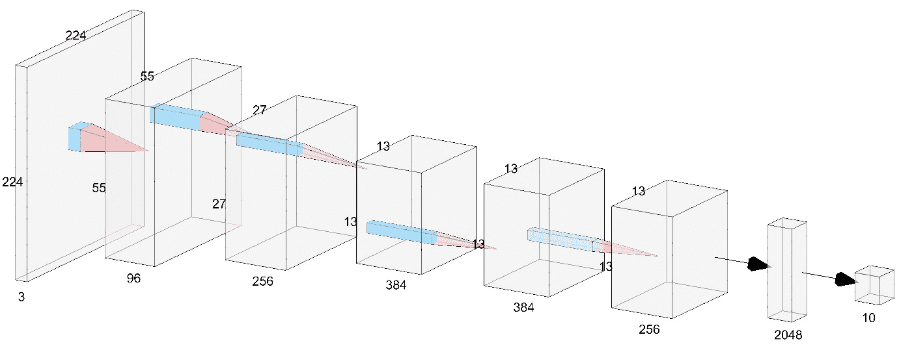

###### 图 5.1:CNN 的表示

在上图中，CNN 获取了一个 224 x 224 x 3 的输入图像，该图像通过卷积过程被转换到下一层，该层压缩了图像大小，但具有更大的深度(我们将在后面解释这些过程是如何工作的)。这些操作一遍又一遍地继续，直到图形表示变平，并且这些密集层被用于以数据集的相应类作为输出而结束。

**卷积层:**卷积层由一组固定大小的**滤波器**组成(通常是小尺寸)，它们是具有特定值/权重的矩阵，通过计算滤波器和输入之间的标量积，应用于整个输入(例如，一幅图像)，这称为卷积。这些过滤器中的每一个都产生二维激活图，该激活图沿着输入的深度堆叠。这些激活图在输入中寻找特征，并将决定网络学习的好坏。你有越多的过滤器，层越深，因此，你的网络学习得越多，但在训练时它变得越慢。例如，在一个特定的图像中，你希望在第一层有 3 个滤镜，在下一层有 96 个滤镜，在下一层有 256 个滤镜，以此类推。请注意，在网络的起点，通常比网络的终点或中间有更少的过滤器。这是因为网络的中间和末端有更多的潜在特征要提取，因此我们需要更多的过滤器，尺寸更小，朝向网络的末端。这是因为我们进入网络越深，我们就越关注图像中的小细节，因此我们希望从这些细节中提取更多的特征，以更好地理解图像。

例如，卷积层的滤波器大小通常从 2x2 到 7x7 不等，这取决于您是在网络的起点(较大的大小)还是在网络的终点(较小的大小)。

在图 5.1 中，我们可以看到使用过滤器(浅蓝色)应用卷积，输出将是进入下一步/层的单个值。

在执行卷积之后，在应用另一个卷积之前，通常应用最大汇集(**汇集层**)层，以便减小输入的大小，从而网络可以更深入地理解图像。然而，最近有一种趋势，即避免最大池，而是鼓励大步，这是在执行卷积时自然应用的，因此我们将通过自然应用卷积来解释图像缩小。

**步长:**这是应用于整个图像的滤镜步长的长度，以像素为单位。如果选择的步幅为 1，将应用过滤器，但一次一个像素。类似地，如果选择跨距为 2，则过滤器将一次应用两个像素，输出大小小于输入，依此类推。

让我们看一个例子。首先，图 5.2 将用作卷积图像的滤波器，图像是一个 2x2 矩阵:


###### 图 5.2:卷积滤波器

下面可能是我们正在卷积的图像(矩阵):

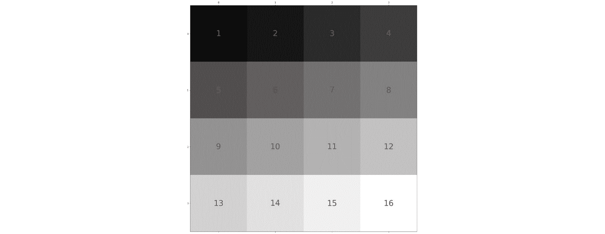

###### 图 5.3:要卷积的图像

当然，这不是真实的图像，但为了简单起见，我们采用一个具有随机值的 4x4 矩阵来演示卷积的工作原理。

现在，如果我们要应用步幅等于 1 的卷积，过程如下图所示:

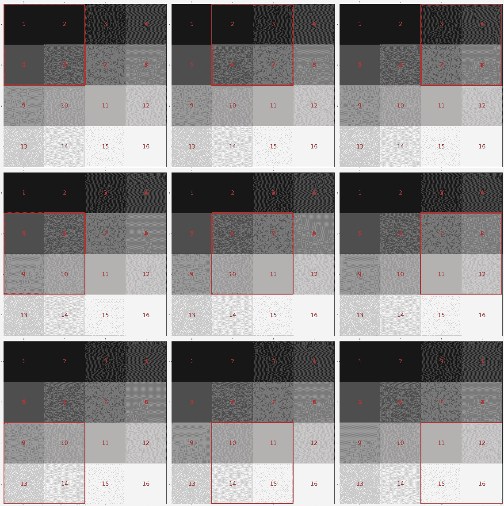

###### 图 5.4:卷积过程步幅=1

上图显示了对输入图像逐像素应用的 2x2 滤镜。这个过程从左到右，从上到下。

该过滤器将其矩阵中每个位置的每个值乘以应用该过滤器的区域(矩阵)中每个位置的每个值。例如，在该过程的第一部分，滤波器被应用于图像[1 2；5 6]而我们拥有的过滤器是[2 1；-1 ^ 2]，那么就是 1 * 2+2 * 1+5 *(1)+6 * 2 = 11。

应用过滤器矩阵后，生成的图像如下所示:

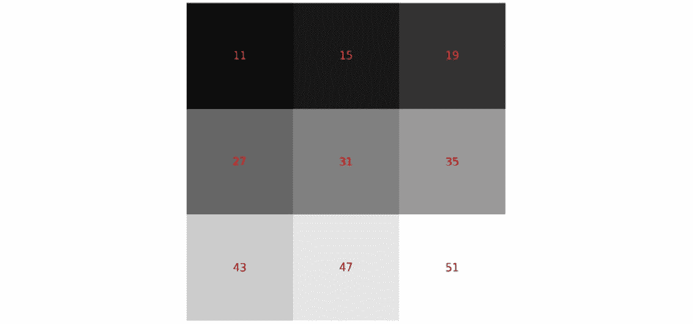

###### 图 5.5:卷积结果步幅=1

如你所见，生成的图像现在小了一个维度。这是因为还有一个参数，叫做 **padding** ，默认设置为“valid”，表示卷积会正常应用；也就是说，应用卷积自然会使图像变细一个像素。如果设置为“相同”，图像将被一行值等于零的像素包围，因此输出矩阵将具有与输入矩阵相同的大小。

现在，我们将应用步幅 2，以将大小减少 2(就像 2x2 的最大池层一样)。请记住，我们使用的填充等于“有效”

该流程的步骤会更少，如下图所示:

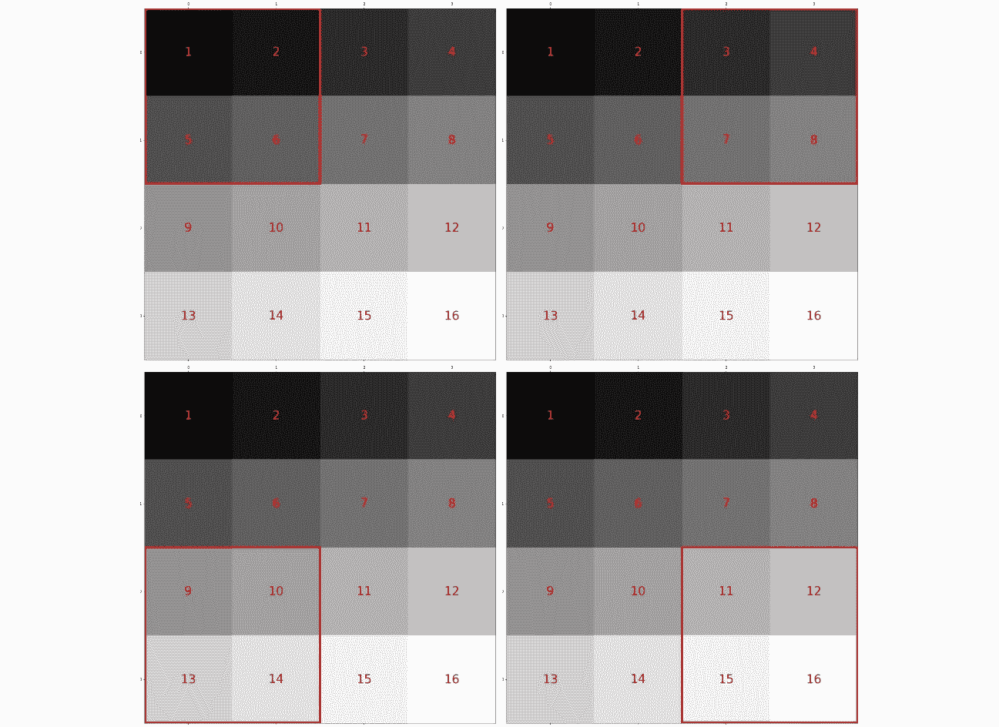

###### 图 5.6:卷积过程步幅=2

输出图像/矩阵如下所示:


###### 图 5.7:卷积结果步幅=2

得到的图像将是 2×2 像素的图像。这是由于步幅等于 2 的卷积的自然过程。

这些应用于每个卷积层的滤波器具有神经网络调整的权重，以便这些滤波器的输出帮助神经网络学习有价值的特征。如上所述，这些权重通过反向传播过程进行更新。提醒一下，反向传播是这样一个过程，在该过程中，计算在网络的训练步骤中所做的预测相对于预期结果的网络损失(或误差量),更新导致该误差的网络神经元的所有权重，以便它们不会再次犯同样的错误。

## 打造您的第一家 CNN

#### 注意

对于这一章，我们将仍然使用 TensorFlow 之上的 Keras 作为后端，正如本书第*章“计算机视觉简介*中提到的。此外，我们仍将使用 Google Colab 来训练我们的网络。

Keras 是一个非常好的实现卷积层的库，因为它抽象了用户，所以不必手工实现这些层。

在*第 2 章*、*计算机视觉介绍、*中，我们使用`keras.layers`包导入了密集层、漏失层和批处理标准化层，为了声明二维卷积层，我们将使用相同的包:

```
from keras.layers import Conv2D
```

`Conv2D`模块和其他模块一样:你必须声明一个顺序模型，这在本书*第二章《计算机视觉导论*中有解释，我们还增加了`Conv2D`:

```
model = Sequential()
model.add(Conv2D(32, kernel_size=(3, 3), padding='same', strides=(2,2), input_shape=input_shape))
```

对于第一个图层，必须指定输入形状，但之后就不再需要了。

必须指定的第一个参数是网络将在该层学习的过滤器数量。如前所述，在前面的层中，我们将过滤几个将要学习的层，而不是网络中更深的层。

第二个必须指定的参数是**内核大小**，它是应用于输入数据的过滤器的大小。通常，设置的内核大小为 3x3，甚至是 2x2，但有时当图像很大时，会设置更大的内核大小。

第三个参数是 **padding** ，默认设置为“valid”，但需要设置为“same”，因为我们希望保留输入的大小，以便理解对输入进行下采样的行为。

第四个参数是**步幅**，默认设置为(1，1)。我们将把它设置为(2，2)，因为这里有两个数字，并且必须为 x 轴和 y 轴都设置它。

在第一层之后，我们将应用与第 2 章*计算机视觉介绍*中提到的方法相同的方法:

```
model.add(BatchNormalization())
model.add(Activation('relu'))
model.add(Dropout(0.2))
```

提醒一下， **BatchNormalization** 层用于归一化每一层的输入，这有助于网络更快地收敛，并且总体上可能给出更好的结果。

`activation`函数是一个接受输入并计算其加权和的函数，加上一个偏差并决定它是否应该被激活(分别输出 1 和 0)。

**Dropout** 层通过关闭一定比例的神经元，帮助网络避免过度拟合，即训练集的精度远远高于验证集的精度。

我们可以应用更多组这样的层，根据要解决的问题的大小来改变参数。

根据问题的不同，最后几层与密集神经网络保持相同。

### 练习 17:构建 CNN

#### 注意

本练习使用与第 2 章“计算机视觉简介”相同的包和库。这些库是 Keras、Numpy、OpenCV 和 Matplotlib。

在这个练习中，我们将带着与*第 2 章*、*活动 2* 、*相同的问题对时尚 MNIST 数据库*中的 10 种服装进行分类。

请记住，在那个活动中，所建立的神经网络不能很好地进行归纳，以对我们传递给它的看不见的数据进行分类。

提醒一下，这个问题是一个分类问题，模型要正确分类 10 种衣服:

1.  打开你的 Google Colab 界面。
2.  为这本书创建一个文件夹，并从 GitHub 下载`Datasets`文件夹，然后上传到你驱动器的文件夹中。
3.  Import drive and mount it as follows:

    ```
    from google.colab import drive
    drive.mount('/content/drive')
    ```

    #### 注意

    每次使用新的 collaborator 时，将驱动器安装到所需的文件夹中。

4.  一旦你第一次安装了你的硬盘，你必须输入授权码，方法是点击谷歌给出的网址，然后按下键盘上的 **Enter** 键:

    ###### 图 5.8:在谷歌协作上安装

5.  Now that you have mounted the drive, you need to set the path of the directory:

    ```
    cd /content/drive/My Drive/C13550/Lesson05/
    ```

    #### 注意

    根据您在 Google Drive 上的文件夹设置，第 5 步中提到的路径可能会有所变化。路径总是以`cd /content/drive/My Drive/`开始。

6.  首先，让我们从 Keras 导入数据，并将随机种子初始化为 42，以获得可重复性:

    ```
    from keras.datasets import fashion_mnist  (x_train, y_train), (x_test, y_test) =fashion_mnist.load_data() import random random.seed(42) 
    ```

7.  我们导入 NumPy 以便对数据进行预处理，并使用 Keras 工具对标签进行一次性编码:

    ```
    import numpy as np from keras import utils as np_utils x_train = (x_train.astype(np.float32))/255.0  x_test = (x_test.astype(np.float32))/255.0  x_train = x_train.reshape(x_train.shape[0], 28, 28, 1)  x_test = x_test.reshape(x_test.shape[0], 28, 28, 1)  y_train = np_utils.to_categorical(y_train, 10)  y_test = np_utils.to_categorical(y_test, 10)  input_shape = x_train.shape[1:]
    ```

8.  We declare the `Sequential` function to make a sequential model in Keras, the callbacks, and, of course, the layers:

    ```
    from keras.models import Sequential
    from keras.callbacks import EarlyStopping, ModelCheckpoint
    from keras.layers import Input, Dense, Dropout, Flatten
    from keras.layers import Conv2D, Activation, BatchNormalization
    ```

    #### 注意

    我们已经导入了名为 **EarlyStopping** 的回调。这个回调所做的是在许多个时期之后停止训练，此时您选择的度量(例如，验证准确性)已经下降。您可以根据自己的需要来设置这个数字。

9.  Now, we are going to build our first CNN. First, let's declare the model as `Sequential` and add the first `Conv2D`:

    ```
    def CNN(input_shape):
        model = Sequential()
        model.add(Conv2D(32, kernel_size=(3, 3), padding='same', strides=(2,2), input_shape=input_shape))
    ```

    我们添加 32 个过滤器作为第一层，过滤器大小为 3x3。填充被设置为“`same`”，步距被设置为 2，以自然地减少`Conv2D`模块的维数。

10.  我们在这一层之后添加了`Activation`和`BatchNormalization`层:

    ```
        model.add(Activation('relu'))     model.add(BatchNormalization())
    ```

11.  我们将添加另外三个层，具有与之前相同的特征，应用 dropout 并跳转到另一个块:

    ```
        model.add(Conv2D(32, kernel_size=(3, 3), padding='same', strides=(2,2)))     model.add(Activation('relu'))     model.add(BatchNormalization())
    ```

12.  现在，我们应用 20%的下降，这关闭了网络中 20%的神经元:

    ```
        model.add(Dropout(0.2))
    ```

13.  我们将用 64 个过滤器再做一次同样的程序:

    ```
        model.add(Conv2D(64, kernel_size=(3, 3), padding='same', strides=(2,2)))     model.add(Activation('relu'))     model.add(BatchNormalization())     model.add(Conv2D(64, kernel_size=(3, 3), padding='same', strides=(2,2)))     model.add(Activation('relu'))     model.add(BatchNormalization())     model.add(Dropout(0.2))
    ```

14.  对于网络的末端，我们应用`Flatten`层，使得最后一层的输出是一维的。我们应用一个有 512 个神经元的`Dense`层。在网络物流发生的地方，我们应用`Activation`层和`BatchNormalization`层，然后应用 50%的`Dropout`:

    ```
        model.add(Flatten())     model.add(Dense(512))     model.add(Activation('relu'))     model.add(BatchNormalization())     model.add(Dropout(0.5))
    ```

15.  最后，我们将最后一层声明为一个有 10 个神经元的`dense`层，这是数据集的类的数量，以及一个`Softmax`激活函数，它确定图像更可能是哪个类，我们返回模型:

    ```
        model.add(Dense(10, activation="softmax"))     return model
    ```

16.  Let's declare the model along with the callbacks and compile it:

    ```
    model = CNN(input_shape)

    model.compile(loss='categorical_crossentropy', optimizer='Adadelta', metrics=['accuracy'])

    ckpt = ModelCheckpoint('Models/model.h5', save_best_only=True,monitor='val_loss', mode='min', save_weights_only=False) 
    earlyStopping = EarlyStopping(monitor='val_loss', patience=5, verbose=0,mode='min')
    ```

    对于编译，我们使用相同的优化器。对于声明检查点，我们使用相同的参数。对于声明`EarlyStopping`，我们使用验证损失作为主要指标，并设置五个时期的耐心。

17.  Let the training begin!

    ```
    model.fit(x_train, y_train, batch_size=128, epochs=100, verbose=1, validation_data=(x_test, y_test), callbacks=[ckpt,earlyStopping]) 
    ```

    我们将批量大小设置为 128，因为有足够多的图像，并且这样做将花费更少的时间来训练。纪元的数量被设置为 100，因为`EarlyStopping`会负责停止训练。

    获得的准确度比*第 2 章*、*计算机视觉介绍*中的练习更好——我们获得了 **92.72%** 的准确度。

    看一下下面的输出:

    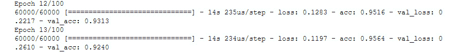

    ###### 图 5.9: val_acc 显示为 0.9240，即 92.72%

    #### 注意

    这个练习的完整代码可以在 GitHub 上找到:[https://GitHub . com/packt publishing/Artificial-Vision-and-Language-Processing-for-Robotics/blob/master/lesson 05/exercise 17/exercise 17 . ipynb](https://github.com/PacktPublishing/Artificial-Vision-and-Language-Processing-for-Robotics/blob/master/Lesson05/Exercise17/Exercise17.ipynb)。

18.  让我们用我们在*活动 2* 中试过的同样的例子来试一下，*对*第二章*的时尚-MNIST 数据库*中的 10 种服装进行分类，该数据库位于`Dataset/testing/` :

    ```
    import cv2    images = ['ankle-boot.jpg', 'bag.jpg', 'trousers.jpg', 't-shirt.jpg']    for number in range(len(images)):     imgLoaded = cv2.imread('Dataset/testing/%s'%(images[number]),0)      img = cv2.resize(imgLoaded, (28, 28))      img = np.invert(img)      img = (img.astype(np.float32))/255.0      img = img.reshape(1, 28, 28, 1)         plt.subplot(1,5,number+1),plt.imshow(imgLoaded,'gray')      plt.title(np.argmax(model.predict(img)[0]))      plt.xticks([]),plt.yticks([])  plt.show()
    ```

以下是输出结果:

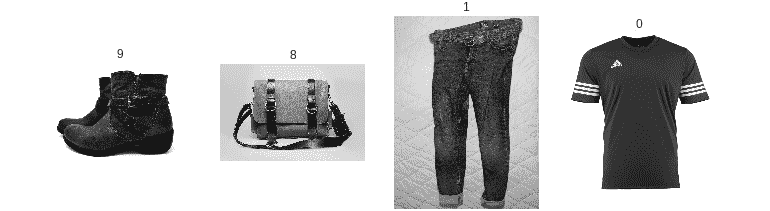

###### 图 5.10:使用 CNN 预测服装

提醒一下，下面是对应衣服编号的表格:

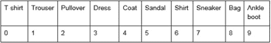

###### 图 5.11:对应衣服数量的表格

我们可以看到，该模型已经很好地预测了所有的图片，因此我们可以声明，该模型远远优于只有密集层的模型。

## 改善您的模型-数据扩充

有时，在某些情况下，您无法通过构建更好的模型来提高模型的准确性。有时候，问题不在于模型，而在于数据。使用机器学习时要考虑的最重要的事情之一是，您使用的数据必须足够好，以便潜在的模型可以概括这些数据。

数据可以代表现实生活中的事物，但也可能包含表现不佳的不正确数据。当数据不完整或者数据不能很好地表示类时，就会发生这种情况。对于这些情况，数据扩充已经成为最流行的方法之一。

数据扩充实际上增加了原始数据集的样本数量。对于计算机视觉来说，这可能意味着增加数据集中的图像数量。有几种数据扩充技术，您可能希望根据数据集使用特定的技术。这里提到了其中的一些技术:

*   **旋转**:用户设置数据集中图像的旋转角度。
*   **翻转**:水平或垂直翻转图像。
*   **裁剪**:从图像中随机裁剪一段。
*   **改变颜色**:改变图像的颜色。
*   **添加噪声**:给图像添加噪声。

应用这些或其他技术，你最终会生成不同于原始图像的新图像。

为了在代码中实现这一点，Keras 有一个名为`ImageDataGenerator`的模块，您可以在其中声明要应用于数据集的转换。您可以使用这行代码导入该模块:

```
from keras.preprocessing.image import ImageDataGenerator
```

为了声明将所有这些更改应用到数据集的变量，您必须按照下面的代码片段来声明它:

```
datagen = ImageDataGenerator(
        rotation_range=20,
        zoom_range = 0.2,
        width_shift_range=0.1,
        height_shift_range=0.1,
        horizontal_flip=True
        )
```

#### 注意

你可以通过查看 Keras 的这个文档来看看你能传递给`ImageDataGenerator`什么属性:[https://keras.io/preprocessing/image/](https://keras.io/preprocessing/image/)。

在声明了`datagen`之后，您必须使用下面的方法计算一些特征标准化的计算:

```
datagen.fit(x_train)
```

这里，`x_train`是你的训练集。

为了使用数据扩充来训练模型，应该使用以下代码:

```
model.fit_generator(datagen.flow(x_train, y_train,
                                 batch_size=batch_size),
                    epochs=epochs,
                    validation_data=(x_test, y_test),
                    callbacks=callbacks,
                    steps_per_epoch=len(x_train) // batch_size)
```

`Datagen.flow()`用于应用数据扩充。由于 Keras 不知道何时停止在给定数据中应用数据扩充，`Steps_per_epoch`是设置该限制的参数，该限制应该是训练集的长度除以批量大小。

现在我们将直接进入本章的第二个练习来观察输出。数据扩充承诺更好的结果和更高的准确性。让我们看看这是真是假。

### 练习 18:使用数据扩充改进模型

在这个练习中，我们将使用 Oxford - III 宠物数据集，这是不同大小和几个类别的不同猫/狗品种的 RGB 图像。在这种情况下，为了简单起见，我们将数据集分成两个类:猫和狗。每个类有 1000 张图片，不多，但是会增量数据增强的效果。这个数据集存储在 GitHub 上添加的`Dataset/dogs-cats/`文件夹中。

我们将构建一个 CNN，并在有和没有数据增强的情况下对其进行训练，我们将比较结果:

#### 注意

在这个练习中，我们将打开另一个 Google Colab 笔记本。

这个练习的完整代码可以在 GitHub 上找到:[https://GitHub . com/packt publishing/Artificial-Vision-and-Language-Processing-for-Robotics/blob/master/lesson 05/exercise 18/exercise 18 . ipynb](https://github.com/PacktPublishing/Artificial-Vision-and-Language-Processing-for-Robotics/blob/master/Lesson05/Exercise18/Exercise18.ipynb)。

1.  打开你的 Google Colab 界面。
2.  为这本书创建一个文件夹，并从 GitHub 下载`Datasets`文件夹，然后上传到你驱动器的文件夹中。
3.  Import drive and mount it as follows:

    ```
    from google.colab import drive
    drive.mount('/content/drive')
    ```

    #### 注意

    每次使用新的 collaborator 时，将驱动器安装到所需的文件夹中。

4.  一旦你第一次安装了你的硬盘，你必须点击谷歌提供的网址输入授权码。
5.  Now that you have mounted the drive, you need to set the path of the directory:

    ```
    cd /content/drive/My Drive/C13550/Lesson5/Dataset
    ```

    #### 注意

    根据您在 Google Drive 上的文件夹设置，第 5 步中提到的路径可能会有所变化。路径总是以`cd /content/drive/My Drive/`开始。

6.  First, let's use these two methods, which we have already used before, to load the data from disk:

    ```
    import re, os, cv2
    import numpy as np
    rows,cols = 128,128
    //{…}##the detailed code can be found on Github##
    def list_files(directory, ext=None):
    //{…}##the detailed code can be found on Github##
    def load_images(path,label):
    //{…}
        for fname in list_files( path, ext='jpg' ): 
            img = cv2.imread(fname)
            img = cv2.resize(img, (rows, cols))
    //{…}##the detailed code can be found on Github##
    ```

    #### 注意

    图像的大小被指定为 128x128。这个尺寸比以前使用的尺寸大，因为我们需要这些图像的更多细节，因为类别更难区分，主题呈现在不同的位置，这使得工作更加困难。

7.  我们加载相应的狗和猫的图像，作为图像的`X`和标签的`y`，我们打印出这些的形状:

    ```
    X, y = load_images('Dataset/dogs-cats/dogs',0) X_aux, y_aux = load_images('Dataset/dogs-cats/cats',1) X = np.concatenate((X, X_aux), axis=0) y = np.concatenate((y, y_aux), axis=0) print(X.shape) print(y.shape)
    ```

    

    ###### 图 5.12:狗和猫的数据形状

8.  现在我们将导入`random`，设置种子，并显示一些数据样本:

    ```
    import random  random.seed(42)  from matplotlib import pyplot as plt   for idx in range(5):      rnd_index = random.randint(0, X.shape[0]-1)     plt.subplot(1,5,idx+1)     plt.imshow(cv2.cvtColor(X[rnd_index],cv2.COLOR_BGR2RGB))      plt.xticks([]),plt.yticks([]) plt.show() 
    ```

    

    ###### 图 5.13:牛津 Pet 数据集的图像样本

9.  为了预处理数据，我们将使用与*练习 17:构建 CNN* :

    ```
    from keras import utils as np_utils X = (X.astype(np.float32))/255.0 X = X.reshape(X.shape[0], rows, cols, 3)  y = np_utils.to_categorical(y, 2) input_shape = X.shape[1:]
    ```

    中相同的程序
10.  现在，我们将`X`和`y`分为`x_train`和`y_train`用于训练集，将`x_test`和`y_test`用于测试集，并打印形状:

    ```
    from sklearn.model_selection import train_test_split x_train, x_test, y_train, y_test = train_test_split(X, y, test_size=0.2) print(x_train.shape) print(y_train.shape) print(x_test.shape) print(y_test.shape)
    ```

    

    ###### 图 5.14:训练和测试集形状

11.  我们导入相应的数据来构建、编译和训练模型:

    ```
    from keras.models import Sequential from keras.callbacks import EarlyStopping, ModelCheckpoint from keras.layers import Input, Dense, Dropout, Flatten from keras.layers import Conv2D, Activation, BatchNormalization
    ```

12.  Let's build the model:

    ```
    def CNN(input_shape):
        model = Sequential()

        model.add(Conv2D(16, kernel_size=(5, 5), padding='same', strides=(2,2), input_shape=input_shape))
        model.add(Activation('relu'))
        model.add(BatchNormalization())
        model.add(Conv2D(16, kernel_size=(3, 3), padding='same', strides=(2,2)))
        model.add(Activation('relu'))
        model.add(BatchNormalization())
        model.add(Dropout(0.2))
    //{…}##the detailed code can be found on Github##

        model.add(Conv2D(128, kernel_size=(2, 2), padding='same', strides=(2,2)))
        model.add(Activation('relu'))
        model.add(BatchNormalization())
        model.add(Dropout(0.2))

        model.add(Flatten())
        model.add(Dense(512))
        model.add(Activation('relu'))
        model.add(BatchNormalization())
        model.add(Dropout(0.5))

        model.add(Dense(2, activation="softmax"))

        return model
    ```

    该模型从第一层的 16 个过滤器到最后的 128 个过滤器，每两层的尺寸加倍。

    因为这个问题更难(我们有 3 个通道和 128x128 图像的更大的图像)，我们使模型更深，在开始时添加了另外两层 16 个过滤器(第一层的内核大小为 5x5，这在最初阶段更好)，在模型结束时添加了另外两层 128 个过滤器。

13.  Now, let's compile the model:

    ```
    model = CNN(input_shape)
    model.compile(loss='categorical_crossentropy', optimizer='Adadelta', metrics=['accuracy'])
    ckpt = ModelCheckpoint('Models/model_dogs-cats.h5', save_best_only=True,monitor='val_loss', mode='min', save_weights_only=False) 
    earlyStopping = EarlyStopping(monitor='val_loss', patience=15, verbose=0,mode='min')
    ```

    我们将 EarlyStopping 回调的耐心设置为 15 个历元，因为模型收敛到最佳点需要更多的历元，在此之前验证损失可能会有很大变化。

14.  Then, we train the model:

    ```
    model.fit(x_train, y_train,
              batch_size=8,
              epochs=100,
              verbose=1, 
              validation_data=(x_test, y_test),
              callbacks=[ckpt,earlyStopping]) 
    ```

    批量大小也很低，因为我们没有太多的数据，但它可以很容易地增加到 16。

15.  Then, evaluate the model:

    ```
    from sklearn import metrics
    model.load_weights('Models/model_dogs-cats.h5')
    y_pred = model.predict(x_test, batch_size=8, verbose=0)
    y_pred = np.argmax(y_pred, axis=1)
    y_test_aux = y_test.copy()
    y_test_pred = list()
    for i in y_test_aux:
        y_test_pred.append(np.argmax(i))

    print (y_pred)

    # Evaluate the prediction
    accuracy = metrics.accuracy_score(y_test_pred, y_pred)
    precision, recall, f1, support = metrics.precision_recall_fscore_support(y_test_pred, y_pred, average=None)
    print('\nFinal results...')
    print(metrics.classification_report(y_test_pred, y_pred))
    print('Acc      : %.4f' % accuracy)
    print('Precision: %.4f' % np.average(precision))
    print('Recall   : %.4f' % np.average(recall))
    print('F1       : %.4f' % np.average(f1))
    print('Support  :', np.sum(support))
    ```

    您应该会看到以下输出:

    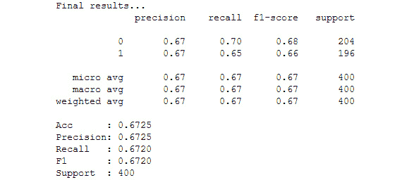

    ###### 图 5.15:显示模型准确性的输出

    从上图可以看出，使用该模型在该数据集中达到的准确率为 **67.25%** 。

16.  We are going to apply data augmentation to this process. We have to import ImageDataGenerator from Keras and declare it with transformations that we are going to make:

    ```
    from keras.preprocessing.image import ImageDataGenerator
    datagen = ImageDataGenerator(
            rotation_range=15,
            width_shift_range=0.2,
            height_shift_range=0.2,
            horizontal_flip=True,
            zoom_range=0.3
            )
    ```

    应用了以下转换:

    我们已经设置了 15 度的旋转范围，因为图像中的狗和猫可以以稍微不同的方式定位(随意调整这个参数)。

    我们将宽度移动范围和高度移动范围设置为 0.2，以水平和垂直移动图像，因为动物可以在图像中的任何位置(也可以调整)。

    我们将水平翻转属性设置为`True`,因为这些动物可以在数据集中翻转(水平翻转；有了垂直翻转，找到一个动物就困难多了)。

    最后，我们将缩放范围设置为 0.3，以随机缩放图像，因为狗和猫可能在图像中更远或更近。

17.  我们拟合用训练数据声明的`datagen`实例，以便计算特征标准化的数量，并再次声明和编译模型，以确保我们没有使用先前的实例:

    ```
    datagen.fit(x_train)   model = CNN(input_shape)   model.compile(loss='categorical_crossentropy', optimizer='Adadelta', metrics=['accuracy']) ckpt = ModelCheckpoint('Models/model_dogs-cats.h5', save_best_only=True,monitor='val_loss', mode='min', save_weights_only=False)
    ```

18.  Finally, we train the model with the `fit_generator` method of the model and the `flow()` method of the `datagen` instance generated:

    ```
    model.fit_generator(
              datagen.flow(x_train, y_train, batch_size=8),
              epochs=100,
              verbose=1, 
              validation_data=(x_test, y_test),
              callbacks=[ckpt,earlyStopping],
              steps_per_epoch=len(x_train) // 8,
              workers=4) 
    ```

    我们设置`steps_per_epoch`参数等于训练集的长度除以批量大小(8)。

    我们还将工作线程的数量设置为 4，以利用处理器的 4 个内核:

    ```
    from sklearn import metrics
    # Make a prediction
    print ("Making predictions...")
    model.load_weights('Models/model_dogs-cats.h5')
    #y_pred = model.predict(x_test)
    y_pred = model.predict(x_test, batch_size=8, verbose=0)
    y_pred = np.argmax(y_pred, axis=1)
    y_test_aux = y_test.copy()
    y_test_pred = list()
    for i in y_test_aux:
        y_test_pred.append(np.argmax(i))
    print (y_pred)
    # Evaluate the prediction
    accuracy = metrics.accuracy_score(y_test_pred, y_pred)
    precision, recall, f1, support = metrics.precision_recall_fscore_support(y_test_pred, y_pred, average=None)
    print('\nFinal results...')
    print(metrics.classification_report(y_test_pred, y_pred))
    print('Acc      : %.4f' % accuracy)
    print('Precision: %.4f' % np.average(precision))
    print('Recall   : %.4f' % np.average(recall))
    print('F1       : %.4f' % np.average(f1))
    print('Support  :', np.sum(support))
    ```

    您应该会看到以下输出:

    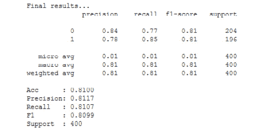

    ###### 图 5.16:显示模型准确性的输出

    从上图可以看出，通过数据扩充，我们实现了 **81%** 的准确率，这要好得多。

19.  如果我们想加载我们刚刚训练的模型(狗对猫)，下面的代码实现了这一点:

    ```
    from keras.models import load_model model = load_model('Models/model_dogs-cats.h5')
    ```

20.  Let's try the model with unseen data. The data can be found in the `Dataset/testing` folder and the code from *Exercise 17*, *Building a CNN* will be used (but with different names for the samples):

    ```
    images = ['dog1.jpg', 'dog2.jpg', 'cat1.jpg', 'cat2.jpg'] 

    for number in range(len(images)):
        imgLoaded = cv2.imread('testing/%s'%(images[number])) 
        img = cv2.resize(imgLoaded, (rows, cols)) 
        img = (img.astype(np.float32))/255.0 
        img = img.reshape(1, rows, cols, 3) 

    ```

    在这几行代码中，我们加载了一个图像，将其调整到预期的大小(128 x 128)，对图像进行了归一化处理(就像我们对训练集所做的那样),并将其整形为(1，128，128，3)以适合作为神经网络的输入。

    我们继续 for 循环:

    ```
      plt.subplot(1,5,number+1),plt.imshow(cv2.cvtColor(imgLoad ed,cv2.COLOR_BGR2RGB))
        plt.title(np.argmax(model.predict(img)[0])) 
        plt.xticks([]),plt.yticks([]) 
    fig = plt.gcf()
    plt.show()
    ```

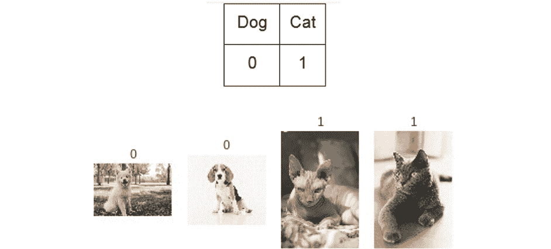

###### 图 5.17:使用 CNN 和数据扩充，用看不见的数据预测牛津 Pet 数据集

我们可以看到，模型已经很好地做出了所有的预测。请注意，并不是所有的品种都存储在数据集中，所以并不是所有的猫和狗都能被正确预测。为了达到这个目标，增加更多种类的品种是必要的。

### 活动 5:利用数据扩充对花卉图像进行正确分类

在这项活动中，你将把你所学到的东西付诸实践。我们将使用不同的数据集，其中的图像更大(150x150)。该数据集中有 5 个类:雏菊、蒲公英、玫瑰、向日葵和郁金香。总共有 4，323 张图片，与我们之前执行的练习相比，数量有所减少。这些类也没有相同数量的图像，但是不用担心。图像是 RGB 的，所以有三个通道。我们已经将它们存储在每个类的 NumPy 数组中，所以我们将提供一种正确加载它们的方法。

以下步骤将指导您完成这一过程:

1.  使用此代码加载数据集，因为数据以 NumPy 格式存储:

    ```
    import numpy as np classes = ['daisy','dandelion','rose','sunflower','tulip'] X = np.load("Dataset/flowers/%s_x.npy"%(classes[0])) y = np.load("Dataset/flowers/%s_y.npy"%(classes[0])) print(X.shape) for flower in classes[1:]:     X_aux = np.load("Dataset/flowers/%s_x.npy"%(flower))     y_aux = np.load("Dataset/flowers/%s_y.npy"%(flower))     print(X_aux.shape)     X = np.concatenate((X, X_aux), axis=0)     y = np.concatenate((y, y_aux), axis=0) print(X.shape) print(y.shape)
    ```

2.  Show some samples from the dataset by importing `random` and `matplotlib`, using a random index to access the `X` set.

    #### 注意

    NumPy 数组以 BGR 格式(OpenCV 格式)存储，因此为了正确显示图像，您需要使用下面的代码将格式更改为 RGB(仅显示图像):`image=cv2.cvtColor(image,cv2.COLOR_BGR2RGB)`。

    您将需要导入`cv2`。

3.  标准化`X`集合，并将标签设置为分类(即`y`集合)。
4.  将这些集分成一个训练集和一个测试集。
5.  Build a CNN.

    #### 注意

    由于我们有更大的图像，你应该考虑增加更多的层，从而减少图像的大小，第一层应该包含一个更大的内核(内核大于 3 时应该是奇数)。

6.  从 Keras 中声明 ImageDataGenerator，并进行您认为适合数据集变化的更改。
7.  训练模型。您可以选择提前停止策略，或者设置大量的时期，并在需要时等待或停止。如果您声明检查点回调，它将总是只保存最佳验证损失模型(如果这是您正在使用的度量)。
8.  Evaluate the model using this code:

    ```
    from sklearn import metrics
    y_pred = model.predict(x_test, batch_size=batch_size, verbose=0)
    y_pred = np.argmax(y_pred, axis=1)
    y_test_aux = y_test.copy()
    y_test_pred = list()
    for i in y_test_aux:
        y_test_pred.append(np.argmax(i))
    accuracy = metrics.accuracy_score(y_test_pred, y_pred)
    print(accuracy)
    ```

    #### 注意

    这将打印模型的准确性。请注意，batch_size 是您为训练集以及测试集`x_test`和`y_test`设置的批量大小。

    您可以使用这段代码来评估任何模型，但是首先您需要加载模型。如果你想从一个`.h5`文件中加载整个模型，你必须使用这个代码:

    `from keras.models import load_model` 
 `model = load_model('model.h5')`

9.  Try the model with unseen data. In the `Dataset/testing/` folder, you will find five images of flowers that you can load to try it out. Remember that the classes are in this order:

    classes=['雏菊'，'蒲公英'，'玫瑰'，'向日葵'，'郁金香']

    因此，结果应该是这样的:

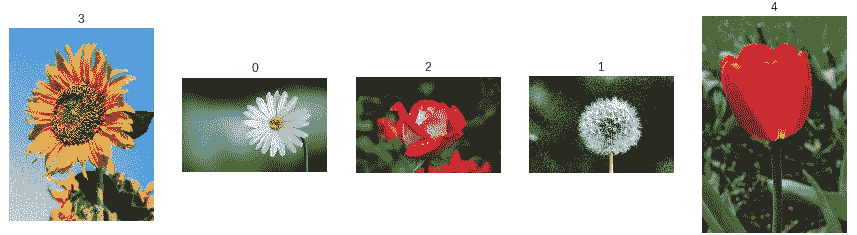

###### 图 5.18:使用 CNN 预测玫瑰

#### 注意

这项活动的解决方案可在第 313 页找到。

## 最先进的模型——迁移学习

人类不会从头开始学习他们想要完成的每一项任务；他们通常以以前的知识为基础，以便更快地学习任务。

在训练神经网络时，有些任务对每个人来说都是非常昂贵的，例如，有成千上万的图像用于训练，必须区分两个或更多类似的对象，最终需要花费几天的时间来实现良好的性能。这些神经网络被训练来完成这项昂贵的任务，因为神经网络能够保存这些知识，所以其他模型可以利用这些权重来为类似的任务重新训练特定的模型。

**转移学习**就是这么做的——它将预训练模型的知识转移到您的模型中，因此您可以利用这些知识。

因此，例如，如果您想要制作一个能够识别五个对象的分类器，但这项任务似乎过于昂贵(需要知识和时间)，您可以利用预先训练的模型(通常在著名的 **ImageNet** 数据集上训练)，并重新训练适应您的问题的模型。ImageNet 数据集是设计用于视觉对象识别研究的大型视觉数据库，具有超过 1400 万个图像，超过 20，000 个类别，这对于个人训练来说是非常昂贵的。

从技术上来说，您可以使用数据集的权重来加载模型，如果您想解决不同的问题，只需更改模型的最后一层。如果在 ImageNet 上训练模型，它可以有 1000 个类，但是你只有 5 个类，所以你可以将最后一层改为只有 5 个神经元的密集层。不过，您可以在最后一层之前添加更多层。

您已导入的模型层(基础模型)可以被冻结，这样它们的权重就不会反映在训练时间上。据此，有两种类型的迁移学习:

*   **传统**:冻结基础模型的所有图层
*   **微调**:仅冻结基础模型的一部分，通常是第一层

在 Keras 中，我们可以导入著名的预训练模型，如 Resnet50 和 VGG16。您可以导入带权重或不带权重的预训练模型(在 Keras 中，只有 ImageNet 的权重)，包括或不包括模型的顶部。仅当不包括顶部且最小尺寸为 32 时，才能指定输入形状。

使用以下代码行，您将导入不带顶部的 Resnet50 模型，其重量为`imagenet`，形状为 150x150x3:

```
from keras.applications import resnet50
model = resnet50.ResNet50(include_top=False, weights='imagenet', input_shape=(150,150,3))
```

如果您已经包括了模型的顶部，因为您想要使用模型的最后密集层(假设您的问题类似于 ImageNet，但是具有不同的类)，那么您应该编写以下代码:

```
from keras.models import Model
from keras.layers import Dense

model.layers.pop()
model.outputs = [model.layers[-1].output]
model.layers[-1].outbound_nodes = []

x=Dense(5, activation='softmax')(model.output)
model=Model(model.input,x)
```

这段代码去掉了分类层(最后一个密集层)并准备好模型，以便您可以添加自己的最后一层。当然，您可以在添加分类图层之前添加更多的图层。

如果您没有添加模型的顶部，那么您应该使用以下代码添加您自己的顶部:

```
from keras.models import Model
from keras.layers import Dense, GlobalAveragePooling2D
x=base_model.output
x=GlobalAveragePooling2D()(x)
x=Dense(512,activation='relu')(x) #dense layer 2
x=Dropout(0.3)(x)
x=Dense(512,activation='relu')(x) #dense layer 3
x=Dropout(0.3)(x)
preds=Dense(5,activation='softmax')(x) #final layer with softmax activation
model=Model(inputs=base_model.input,outputs=preds)
```

在这里，`GlobalAveragePooling2D`就像一种最大池。

对于这些类型的模型，您应该像处理训练这些模型的数据一样对数据进行预处理(如果您正在使用权重)。Keras 有一个`preprocess_input`方法，对每个模型都这样做。例如，对于 ResNet50，它应该是这样的:

```
from keras.applications.resnet50 import preprocess_input
```

您将图像数组传递给该函数，然后您将为训练准备好数据。

模型中的**学习率**是它应该多快将模型转换为局部最小值。通常，你不必担心这一点，但如果你正在重新训练一个神经网络，这是一个你必须调整的参数。重新训练神经网络时，应该减小该参数的值，以便神经网络不会忘记它已经学习过的内容。这个参数在声明优化器时被调整。您可以避免调整该参数，尽管模型可能最终不会收敛或过度拟合。

使用这种方法，您可以用很少的数据训练您的网络，并获得总体良好的结果，因为您利用了模型的权重。

你也可以把迁移学习和数据扩充结合起来。

### 练习 19:使用极少数据的迁移学习对€5 号和€20 号钞票进行分类

这个问题是关于用很少的数据区分€5 元纸币和€20 元纸币。我们每节课有 30 张图片，这比我们之前的练习要少得多。我们将加载数据，声明预训练模型，然后通过数据扩充声明对数据的更改，并训练模型。在此之后，我们将检查模型在看不见数据的情况下表现如何:

1.  Open up your Google Colab interface.

    #### 注意

    您需要在您的驱动器上安装`Dataset`文件夹，并相应地设置路径。

2.  Declare functions to load the data:

    ```
    import re, os, cv2
    import numpy as np
    def list_files(directory, ext=None):
    //{…}
    ##the detailed code can be found on Github##

    def load_images(path,label):
    //{…}
    ##the detailed code can be found on Github##
        for fname in list_files( path, ext='jpg' ): 
            img = cv2.imread(fname)
            img = cv2.resize(img, (224, 224))
    //{…}
    ##the detailed code can be found on Github##
    ```

    请注意，数据大小调整为 224x224。

3.  The data is stored in `Dataset/money/`, where you have both classes in subfolders. In order to load the data, you have to write the following code:

    ```
    X, y = load_images('Dataset/money/20',0)
    X_aux, y_aux = load_images('Dataset/money/5',1)
    X = np.concatenate((X, X_aux), axis=0)
    y = np.concatenate((y, y_aux), axis=0)
    print(X.shape)
    print(y.shape)
    ```

    €20 元钞票的标签是 0，€5 元钞票的标签是 1。

4.  我们来展示一下数据:

    ```
    import random  random.seed(42)  from matplotlib import pyplot as plt   for idx in range(5):      rnd_index = random.randint(0, 59)     plt.subplot(1,5,idx+1),plt.imshow(cv2.cvtColor(X[rnd_index],cv2.COLOR_BGR2RGB))      plt.xticks([]),plt.yticks([]) plt.savefig("money_samples.jpg", bbox_inches='tight') plt.show() 
    ```

    

    ###### 图 5.19:票据样本

5.  Now we are going to declare the pretrained model:

    ```
    from keras.applications.mobilenet import MobileNet, preprocess_input
    from keras.layers import Input, GlobalAveragePooling2D, Dense, Dropout
    from keras.models import Model

    input_tensor = Input(shape=(224, 224, 3))

    base_model = MobileNet(input_tensor=input_tensor,weights='imagenet',include_top=False)

    x = base_model.output
    x = GlobalAveragePooling2D()(x)
    x = Dense(512,activation='relu')(x)
    x = Dropout(0.5)(x)
    x = Dense(2, activation='softmax')(x)

    model = Model(base_model.input, x)
    ```

    在本例中，我们使用 imagenet 的权重加载 MobileNet 模型。我们不包括顶部，所以我们应该建立自己的顶部。输入形状为 224x224x3。

    我们已经通过获取 MobileNet 最后一层(不是分类层)的输出构建了模型的顶层，并开始在此基础上构建。我们添加了`GlobalAveragePooling2D`用于图像缩减，一个可以针对我们的具体问题进行训练的密集层，一个`Dropout`层用于避免过度拟合，最后是分类器层。

    末端的致密层有两个神经元，因为我们只有两个类，它有`Softmax`激活功能。对于二元分类，也可以使用 Sigmoid 函数，但是它会改变整个过程，因为您不应该使标签分类，并且预测看起来不同。

    随后，我们创建我们将要训练的模型，将 MobileNet 的输入作为输入，将分类密集层作为输出。

6.  我们将进行微调。为了做到这一点，我们必须冻结一些输入层，并保持其余的可训练数据不变:

    ```
    for layer in model.layers[:20]:     layer.trainable=False for layer in model.layers[20:]:     layer.trainable=True
    ```

7.  让我们用`Adadelta`优化器来编译这个模型:

    ```
    import keras model.compile(loss='categorical_crossentropy',optimizer=keras.optimizers.Adadelta(), metrics=['accuracy'])
    ```

8.  现在，我们将使用之前导入的`preprocess_input`方法来预处理 MobileNet 的`X`集合，然后我们将标签`y`转换为独热编码:

    ```
    from keras import utils as np_utils X = preprocess_input(X) #X = (X.astype(np.float32))/255.0  y = np_utils.to_categorical(y)
    ```

9.  我们使用`train_test_split`方法将数据分成训练集和测试集:

    ```
    from sklearn.model_selection import train_test_split x_train, x_test, y_train, y_test = train_test_split(X, y, test_size=0.2) print(x_train.shape) print(y_train.shape) print(x_test.shape) print(y_test.shape)
    ```

10.  We are going to apply data augmentation to our dataset:

    ```
    from keras.preprocessing.image import ImageDataGenerator
    train_datagen = ImageDataGenerator(  
          rotation_range=90,     
          width_shift_range = 0.2,
          height_shift_range = 0.2,
          horizontal_flip=True,    
          vertical_flip=True,
          zoom_range=0.4)
    train_datagen.fit(x_train)
    ```

    由于钞票可以处于不同的角度，我们选择旋转 90 度。对于这项任务来说，其他参数似乎是合理的。

11.  Let's declare a checkpoint to save the model when the validation loss decreases and train the model:

    ```
    from keras.callbacks import ModelCheckpoint
    ckpt = ModelCheckpoint('Models/model_money.h5', save_best_only=True, monitor='val_loss', mode='min', save_weights_only=False)
    model.fit_generator(train_datagen.flow(x_train, y_train,
                                    batch_size=4),
                        epochs=50,
                        validation_data=(x_test, y_test),
                        callbacks=[ckpt],
                        steps_per_epoch=len(x_train) // 4,
                        workers=4)
    ```

    我们将批大小设置为 4，因为我们只有几个数据样本，并且我们不想一次将所有样本传递给神经网络，而是分批传递。我们没有使用 EarlyStopping 回调，因为由于缺乏数据和使用具有高学习率的 Adadelta，损失会上下波动。

12.  Check the results: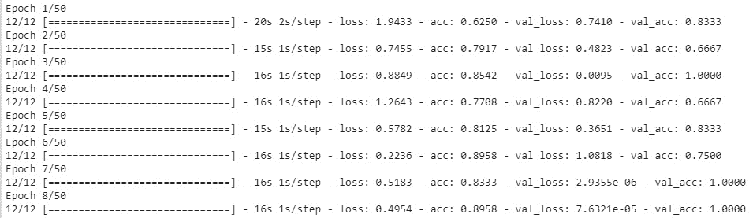

    ###### 图 5.20:显示期望的输出

    在上图中，我们可以看到，在第 7 个时期，我们已经实现了 100%的准确性和低损失。这是因为缺少验证集上的数据，因为只有 12 个样本，您无法判断模型是否对看不见的数据表现良好。

13.  Let's run the code to calculate the accuracy of this model:

    ```
    y_pred = model.predict(x_test, batch_size=4, verbose=0)
    y_pred = np.argmax(y_pred, axis=1)
    y_test_aux = y_test.copy()
    y_test_pred = list()
    for i in y_test_aux:
        y_test_pred.append(np.argmax(i))

    accuracy = metrics.accuracy_score(y_test_pred, y_pred)
    print('Acc: %.4f' % accuracy)
    ```

    输出如下所示:

    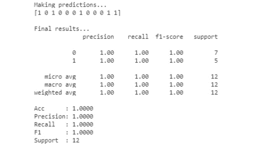

    ###### 图 5.21:准确率达到 100%

14.  Let's try this model with new data. There are test images in the `Dataset/testing` folder. We have added four examples of bills to check whether the model predicts them well:

    #### 注意

    ```
    images = ['20.jpg','20_1.jpg','5.jpg','5_1.jpg']
    model.load_weights('Models/model_money.h5')
    for number in range(len(images)):
        imgLoaded = cv2.imread('Dataset/testing/%s'%(images[number])) 
        img = cv2.resize(imgLoaded, (224, 224)) 
        #cv2.imwrite('test.jpg',img) 
        img = (img.astype(np.float32))/255.0 
        img = img.reshape(1, 224, 224, 3) 
        plt.subplot(1,5,number+1),plt.imshow(cv2.cvtColor(imgLoaded,cv2.COLOR_BGR2RGB)) 
        plt.title('20' if np.argmax(model.predict(img)[0]) == 0 else '5') 
        plt.xticks([]),plt.yticks([]) 
    plt.show()
    ```

    在这段代码中，我们还加载了不可见的示例，并且我们组合了输出图像，如下所示:

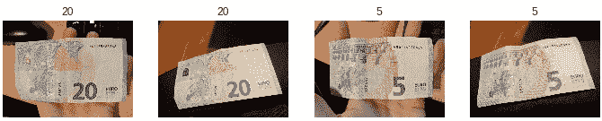

###### 图 5.22:账单预测

模型已经精确地预测了所有的图像！

恭喜你！现在，由于迁移学习，当数据很少时，你可以用自己的数据集训练模型。

#### 注意

这个练习的完整代码上传到 GitHub:https://GitHub . com/packt publishing/Artificial-Vision-and-Language-Processing-for-Robotics/blob/master/lesson 05/exercise 19/exercise 19 . ipynb。

## 总结

在处理图像时，CNN 已经显示出比全连接神经网络好得多的性能。此外，CNN 也能够用文本和声音数据实现良好的结果。

CNN 已经得到了深入的解释，卷积是如何工作的，以及随之而来的所有参数。之后，所有这些理论都通过一个练习付诸实践。

数据扩充是一种通过对原始数据进行简单变换以生成新图像来克服数据集中缺少数据或缺少变化的技术。这个技巧已经被解释过了，并通过一个练习和一个活动付诸实践，在那里你能够用你所获得的知识进行实验。

迁移学习是一种在缺乏数据或问题非常复杂以至于在正常的神经网络上训练需要太长时间时使用的技术。此外，这种技术根本不需要了解神经网络，因为模型已经实现了。它也可以与数据扩充一起使用。

迁移学习也包括在内，并在一个数据量很小的练习中付诸实践。

学习如何构建 CNN 对于在计算机视觉中识别目标或环境非常有用。当机器人使用其视觉传感器来识别环境时，通常使用 CNN，并且使用数据增强来提高 CNN 的性能。在*第八章*、*使用 CNN 引导机器人的目标识别中，*你所学的 CNN 概念将被应用到现实世界的应用中，你将能够使用深度学习来识别环境。

在应用这些技术来识别环境之前，首先你需要学习如何管理一个能够识别环境的机器人。在*第 6 章，机器人操作系统(ROS)* 中，你将学习如何利用一个叫做 ROS 的软件，使用模拟器来管理机器人。