<title>C13550_07_EPUB_Final_SW</title>

# *第七章*

# 建立基于文本的对话系统(聊天机器人)

## 学习目标

本章结束时，您将能够:

*   定义术语 GloVe、Word2Vec 和嵌入
*   开发你自己的 Word2Vec
*   选择创建对话代理的工具
*   预测谈话的意图
*   创建对话代理

本章介绍了一些术语，如 GloVe、Word2Vec、嵌入和工具，它们将帮助你创建一个对话代理。

## 简介

深度自然语言处理的最新趋势之一是对话代理的创建，也称为聊天机器人。聊天机器人是一种基于文本的对话系统，它能理解人类语言，并能与人进行真正的对话。许多公司使用这些系统与客户互动，以获得信息和反馈，例如，对新产品发布的意见。

聊天机器人被用作助手，例如，Siri、Alexa 和 Google Home。这些可以给我们关于天气或交通的实时信息。

在这一点上，问题是机器人如何理解我们？在前面的章节中，我们已经回顾了语言模型以及它们是如何工作的。然而，语言模型(LMs)中最重要的是单词在句子中的位置。每个单词都有一定的概率出现在一个句子中，这取决于该句子中已经存在的单词。但是概率分布方法并不适合这项任务。在这种情况下，我们需要理解含义，而不是预测下一个单词，在这之后，模型将理解给定语料库中某个单词的含义。

一个词本身是没有意义的，除非它被放在一个语境或语料库中。理解句子的意思很重要，这是由句子的结构(即单词在句子中的位置)决定的。然后，该模型将通过查看哪些单词接近它来预测单词的意思。但是首先，怎么可能用数学方法来表示它呢？

在*第 4 章*、*带 NLP 的神经网络*中，我们看了使用一个热码编码向量来表示一个单词，这是一个带有 1 和 0 的向量。然而，这种表示并没有给我们提供一个词的实际含义。让我们来看一个例子:

*   狗，狗
*   猫，猫，猫

狗和猫都是动物，但是它们用 1 和 0 来表示并不能给我们任何关于这些词的意思的信息。

但是，如果这些向量根据它们的意思给我们两个词之间的相似性，会发生什么呢？意思相似的两个词会在一个平面上彼此靠近放置，与没有任何这种关系的两个词相反。例如，一个国家的名字和它的首都是相关的。

有了这种方法，一组句子可以与一个会话意图或一个特定的主题相关联(也称为意图，这个术语将贯穿本章)。使用这个系统，我们将能够与人类保持合理的对话。

对话的目的就是对话的主题。例如，如果你在谈论皇家马德里和巴塞罗那之间的比赛，谈话的目的将是足球。

在本章的后面，我们将回顾把一个单词表示为向量的基本概念，以及如何创建这样的向量并使用它们来识别对话的意图。

## 向量空间中的单词表示

这一节将涵盖从语料库中计算单词的连续向量表示的不同架构。这些表示将取决于单词在意义上的相似性。此外，还将介绍一个新的 Python 库( **Gensim** )来完成这项任务。

### 单词嵌入

单词嵌入是从语料库中映射单词和句子并将其输出为向量或实数的技术和方法的集合。单词嵌入根据单词出现的上下文生成每个单词的表示。单词嵌入的主要任务是执行从每个单词一维的空间到连续向量空间的降维。

为了更好地理解这意味着什么，让我们来看一个例子。想象我们有两个相似的句子，比如这些:

*   我很好。
*   我很好。

现在，把这些句子编码成一个热点向量，我们有这样的东西:

*   我，0，0，0
*   am[0，1，0，0]
*   好的
*   好极了

我们知道前面两个句子是相似的(就它们的意思而言)，因为“伟大”和“好”有相似的意思。但是我们如何衡量这两个词的相似性呢？我们有两个代表单词的向量，所以让我们计算余弦相似度。

### 余弦相似度

余弦相似性度量两个向量之间的相似性。顾名思义，这个方法会陈述两个句子之间夹角的余弦值。其公式如下:


###### 图 7.1:余弦相似性公式

图 7.1 显示了余弦相似性的公式。a 和 B 是矢量。按照前面的例子，如果我们计算“好”和“很好”之间的相似度，结果是 0。这是因为独热编码向量是独立的，并且没有沿着相同维度的投影(这意味着在一个维度中只有一个 1，其余的都是 0)。

图 7.2 解释了这个概念:


###### 图 7.2:没有投影的尺寸

单词嵌入解决了这个问题。有许多技术来表示单词嵌入。但这些技术都是在无监督学习算法中。最著名的方法之一是 Word2Vec 模型，接下来将对其进行解释。

### Word2Vec

Word2Vec 的主要目标是生成单词嵌入。它处理一个语料库，然后为语料库中的每个唯一单词分配一个向量。然而，这种向量并不像一键向量方法那样工作。例如，如果我们有一个包含 10，000 个单词的语料库，那么我们的独热编码向量中就有 10，000 个维度，但是 Word2Vec 可以执行降维，通常是几百个维度。

Word2Vec 的核心思想是，一个单词的意义是由经常与它接近的单词来表示的。当一个单词出现在一个句子中时，它的上下文是由它附近的一组单词组成的。这组单词在固定大小的窗口内:


###### 图 7.3:wx 的上下文单词

图 7.3 显示了 *wx* 的上下文单词示例。

Word2Vec 的概念是托马斯·米科洛夫在 2013 年创造的。他提出了一个学习单词向量的框架。该方法的工作原理是遍历一个语料库，取一组带有中心词(在图 7.3 中，它是 *wx* )和上下文词(在图 7.3 中，黑色矩形框内显示的词)的词。这些词的向量不断更新，直到语料库结束。

执行 Word2Vec 有两种方法:

*   **Skip-Gram 模型**:在这个模型中，输入是放在中间的单词，然后它预测单词的上下文。
*   **CBOW 模型**:该模型的输入是上下文词的向量，输出是中心词。

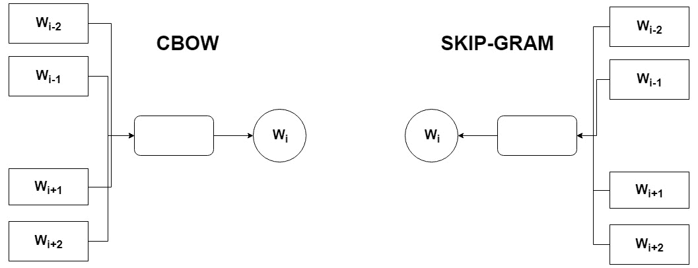

###### 图 7.4: CBOW 和跳跃图模型表示

这两种模型输出的结果都很好，但是 skip-gram 模型在处理少量数据时效果很好。我们不会深入研究这些模型来生成我们的 Word2Vec，但是我们将使用 Gensim 库，这将在本章中解释。

### word 2 vec 的问题

Word2Vec 在向量空间中表示单词有很多优点。它提高了任务的性能，并能捕捉复杂的词义。但是它并不完美，并且确实存在一些问题:

*   低效地使用统计学:它一次捕捉一个词的共现。这里的问题是，在经过训练的语料库中没有一起出现的单词在平面上往往会变得更近(这可能会导致歧义)，因为没有办法表示它们的关系。
*   需要修改模型的参数，即如果语料库规模发生变化。这样做，模型就要重新训练，这就要消耗大量的时间。

在深入研究如何用 Word2Vec 解决这些问题之前，我们将介绍 Gensim，一个用于创建 Word2Vec 模型的库。

### Gensim

Gensim 是一个 Python 库，提供了不同的 NLP 方法。它不像 NLTK 或 spaCy 这些库侧重于数据的预处理和分析。Gensim 为我们提供了处理原始文本(非结构化文本)的方法。

Gensim 的优势如下:

*   Gensim 可以用于一个巨大的语料库。它具有内存独立性，这意味着语料库将不需要存储在您的计算机的 RAM 中。此外，它有内存共享来存储训练好的模型。
*   它可以提供高效的向量空间算法，如 Word2Vec、Doc2Vec、LSI、LSA 等等。
*   它的 API 简单易学。

Gensim 的缺点如下:

*   它不提供预处理文本的方法，必须与 NLTK 或 spaCy 一起使用才能获得完整的 NLP 管道。

### 练习 24:创建单词嵌入

在本练习中，我们将使用一个小型语料库来创建单词嵌入，并使用 Gensim。一旦我们的模型被训练，我们将把它打印在二维图上，以检查单词的分布。

Gensim 提供了更改一些参数的可能性，以便对我们的数据进行良好的训练。一些有用的参数如下:

*   `Num_features`:表示向量的维数(维数越多，精度越高，但计算开销越大)。在我们的例子中，我们将把这个参数设置为 **2** (二维向量)。
*   `Window_size`:表示包含单词上下文的固定窗口的大小。在我们的例子中，语料库很小，所以这里的大小被设置为 **1** 。
*   `Min_word_count`:设定的最小字数阈值。
*   `Workers`:你电脑的线程并行运行。在我们的例子中，一个工人将适合我们的语料库的大小。

让我们从练习开始:

1.  导入库。我们将使用 Gensim 模型，Word2Vec:

    ```
    import nltk import gensim.models.word2vec as w2v import sklearn.manifold import numpy as np import matplotlib.pyplot as plt import pandas as pd
    ```

2.  定义一个小型随机语料库:

    ```
    corpus = ['king is a happy man',            'queen is a funny woman',           'queen is an old woman',           'king is an old man',            'boy is a young man',           'girl is a young woman',           'prince is a young king',           'princess is a young queen',           'man is happy,            'woman is funny,           'prince is a boy will be king',           'princess is a girl will be queen']
    ```

3.  现在我们用`spaCy`来标记每个句子。`spaCy`的概念在*第 3 章*、*自然语言处理基础* :

    ```
    import spacy import en_core_web_sm nlp = en_core_web_sm.load() def corpus_tokenizer(corpus):     sentences = []     for c in corpus:         doc = nlp(c)         tokens = []         for t in doc:             if t.is_stop == False:                 tokens.append(t.text)         sentences.append(tokens)     return sentences sentences = corpus_tokenizer(corpus) sentences
    ```

    中有所涉及
4.  现在让我们定义几个变量来创建 Word2vec 模型:

    ```
    num_features=2 window_size=1 workers=1 min_word_count=1
    ```

5.  使用种子为 0 的 Word2Vec 方法创建模型(该种子只是一个初始化模型权重的值；建议使用相同的种子获得相同的结果):

    ```
    model = w2v.Word2Vec(size=num_features, window=window_size,workers=workers,min_count=min_word_count,seed=0)
    ```

6.  现在我们将从语料库中建立词汇。首先，我们需要一个词汇表来训练我们的模型:

    ```
    model.build_vocab(sentences)
    ```

7.  训练模型。这里的参数是语料库的句子:总字数和时代。在这种情况下，1 个历元将是好的:

    ```
    model.train(sentences,total_words=model.corpus_count,epochs=1)
    ```

8.  现在，我们可以看到该模型在计算两个单词的相似度时是如何工作的:

    ```
    model.wv['king'] model.wv.similarity('boy', 'prince')
    ```

    

    ###### 图 7.5:说明两个单词相似度的计算结果

9.  现在，为了打印模型，用我们的语料库中的单词定义一个变量，用每个单词的向量定义一个数组:

    ```
    vocab = list(model.wv.vocab) X = model.wv[vocab]
    ```

10.  用这些数据创建一个`DataFrame`使用熊猫:

    ```
    df = pd.DataFrame(X, index=vocab, columns=['x', 'y']) df
    ```

    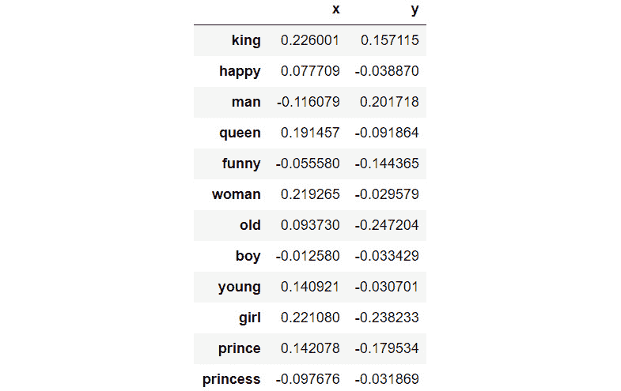

    ###### 图 7.6:我们的矢量坐标

11.  用每个单词在平面上的位置创建一个图形:

    ```
    fig = plt.figure() ax = fig.add_subplot(1, 1, 1) for word, pos in df.iterrows():     ax.annotate(word, pos) ax.scatter(df['x'], df['y']) plt.show()
    ```

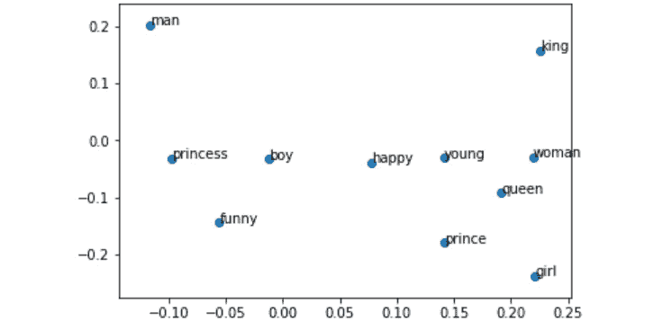

###### 图 7.7:word 2 vec 模型中项目的位置

如图 7.7 所示，单词可以用二维表示。如果你有一个较小的语料库，要找出两个词在意义上的相似性，你只需要测量这两个词的距离。

现在你知道如何训练自己的 Word2Vec 模型了吧！

### 全局向量(手套)

全局向量是单词表示的模型。它的工作方式就像 Word2Vec 模型一样，但是添加了一些新的特性，以便更加高效。

在开始使用这个模型之前，考虑创建单词向量的其他方法将是有益的。

语料库中单词出现的统计是我们可以找到的用于无监督算法的第一信息源，因此可以直接捕获共现计数。为了获得这些信息，我们不需要经过处理的方法；只有文本数据就足够了。

创建一个共现矩阵 X，以及一个固定大小的窗口，我们可以获得单词的新表示。例如，想象一下这个语料库:

*   我是查尔斯。
*   我很棒。
*   我喜欢苹果。

基于窗口的共现矩阵如下:

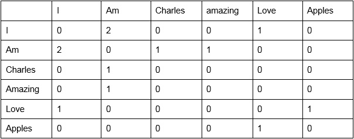

###### 图 7.8:基于窗口的共现矩阵

共现矩阵很好理解，统计一个词在语料库中出现在另一个词旁边的次数。

例如，在第一行中，对于单词“I”，单词“am”的值为 2，因为“I am”出现了 2 次。

这种表示改进了一键编码，并且可以捕获语义和句法信息，但是它确实存在某些问题，例如模型的大小、词汇的稀疏性，并且该模型总体上不太健壮。

但是在这种情况下，这些问题可以通过使用 **SVD** (在*第 3 章*、*自然语言处理基础*中有解释)用下面的公式降低矩阵的维数来解决:

*   A = USVT

这样做的结果很好，单词的表示也很有意义，但对于大型语料库来说，这仍然是个问题。

GloVe 方法通过以下方式解决了 Word2Vec 模型的问题:

*   如果语料库中有变化，则训练模型所花费的总时间减少。
*   统计数据得到有效利用。对于在语料库中出现次数不多的单词，它的表现更好。这是 Word2Vec 的一个问题，也就是说，不常见的单词有相似的向量。

GloVe 结合了前面两种方法来实现快速训练。它可以扩展到一个巨大的语料库，并可以在小向量的情况下获得更好的性能。

#### 注意

该模型由斯坦福大学创建，是一个开源项目。你可以在 https://github . com/packt publishing/Artificial-Vision-and-Language-Processing-for-Robotics/tree/master/lesson 07/exercise 25-26/utils 找到更多文档。

在下一个练习中，您将学习如何使用手套。

### 练习 25:使用预训练的手套观察单词在平面上的分布

在本练习中，您将学习如何使用手套以及如何绘制模型区域。我们将再次使用 Gensim 库:

#### 注意

要获得模型，您需要从 GitHub 上的`utils`文件夹中下载文件(这是 50 维模型):

[https://github . com/training bypackt/Artificial-Vision-and-Language-Processing-for-Robotics/tree/master/Chapter % 207/utils](https://github.com/TrainingByPackt/Artificial-Vision-and-Language-Processing-for-Robotics/tree/master/Chapter%207/utils)

1.  打开你的 Google Colab 界面。
2.  为书创建一个文件夹，从 GitHub 下载`utils`文件夹，上传到文件夹。
3.  导入驱动器并安装如下:

    ```
    from google.colab import drive drive.mount('/content/drive')
    ```

4.  一旦你第一次安装了你的硬盘，你将不得不通过点击谷歌提到的 URL 并按下键盘上的 **Enter** 键来输入授权码: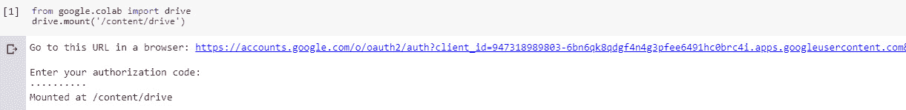

    ###### 图 7.9:显示谷歌 Colab 授权步骤的图像

5.  Now that you have mounted the drive, you need to set the path of the directory:

    ```
    cd /content/drive/My Drive/C13550/Lesson07/Exercise25/
    ```

    #### 注意

    根据您在 Google Drive 上的文件夹设置，第 5 步中提到的路径可能会有所变化。但是，路径总是以`cd /content/drive/My Drive/`开始。

    `utils` 文件夹必须在你设置的路径中。

6.  导入库:

    ```
    from gensim.scripts.glove2word2vec import glove2word2vec from gensim.models import KeyedVectors import numpy as np import pandas as pd
    ```

7.  Use the `glove2word2vec` function provided by Gensim to create the `word2vec` model:

    ```
    glove_input_file = 'utils/glove.6B.50d.txt'
    word2vec_output_file = 'utils/glove.6B.50d.txt.word2vec'
    glove2word2vec(glove_input_file, word2vec_output_file)
    ```

    #### 注意

    在这种情况下,`glove.6B.50d.txt`文件被放置在`utils`文件夹中。如果您选择将它放在其他地方，路径会相应地改变。

8.  使用`glove2word2vec`函数生成的文件初始化模型:

    ```
    filename = 'utils/glove.6B.50d.txt.word2vec' model = KeyedVectors.load_word2vec_format(filename, binary=False)
    ```

9.  使用 GloVe，您可以测量一对单词的相似度。通过计算两个词的相似度并打印一个词向量来检查模型是否工作:

    ```
    model.similarity('woman', 'queen')
    ```

    

    ###### 图 7.10:女人和女王的相似度

10.  在*练习 24* 、*创建单词嵌入*中，我们创建了自己的向量，但在这里，向量已经创建好了。要看一个词的表征向量，我们只需做以下几个:

    ```
    model['woman']
    ```

    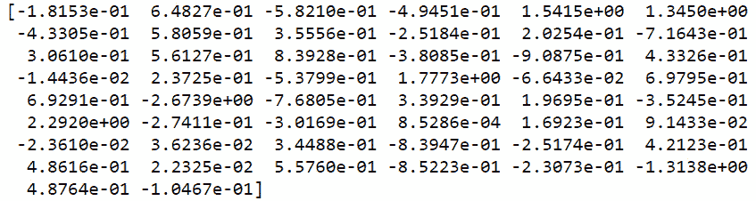

    ###### 图 7.11:“女人”的向量表征(50 维)

11.  我们还可以看到与其他单词最相似的单词。正如您在步骤 4 和 5 中看到的，GloVe 具有许多与单词表示相关的功能:

    ```
    model.similar_by_word(woman)
    ```

    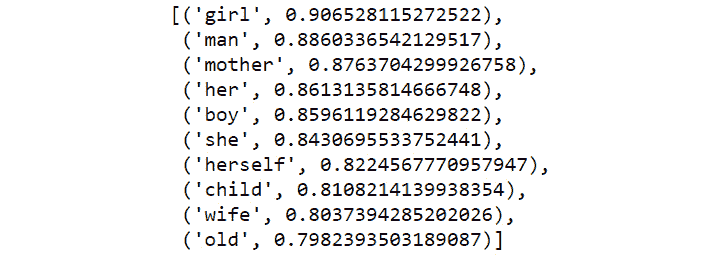

    ###### 图 7.12:与女人最相似的单词

12.  现在我们将使用奇异值分解(SVD)来可视化高维数据，以绘制与 woman 最相似的单词。导入必要的库:

    ```
    from sklearn.decomposition import TruncatedSVD import pandas as pd import matplotlib.pyplot as plt
    ```

13.  初始化一个 50 维的数组，并追加女人的向量。为了执行这个降维，我们将创建一个矩阵，它的行将是每个单词的向量:

    ```
    close_words=model.similar_by_word('woman')   arr = np.empty((0,50), dtype='f') labels = ['woman'] #Array with the vectors of the closest words arr = np.append(arr, np.array([model['woman']]), axis=0) print("Matrix with the word 'woman':\n", arr)
    ```

    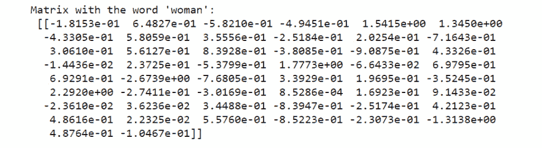

    ###### 图 7.13:带有单词“女人”的矩阵值

14.  Now, we have the word `dog` in the matrix and we need to append every vector of the similar words. Add the rest of the vectors to the matrix:

    ```
    for w in close_words:
        w_vector = model[w[0]]
        labels.append(w[0])
        arr = np.append(arr, np.array([w_vector]), axis=0)
    arr
    ```

    这个矩阵是这样的:

    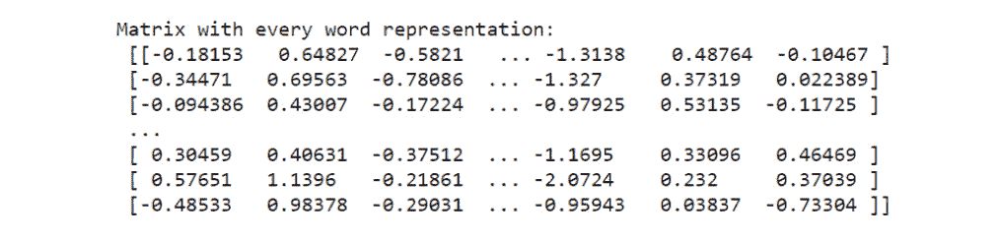

    ###### 图 7.14:与“女人”向量最相似的向量矩阵

15.  一旦我们有了矩阵中的所有向量，让我们初始化 TSNE 方法。是 Sklearn 的一个功能；

    ```
    svd = TruncatedSVD(n_components=2, n_iter=7, random_state=42) svdvals = svd.fit_transform(arr)
    ```

16.  将矩阵转换成二维向量，并创建一个有熊猫的 DataFrame 来存储它们:

    ```
    df = pd.DataFrame(svdvals, index=labels, columns=['x', 'y']) df
    ```

    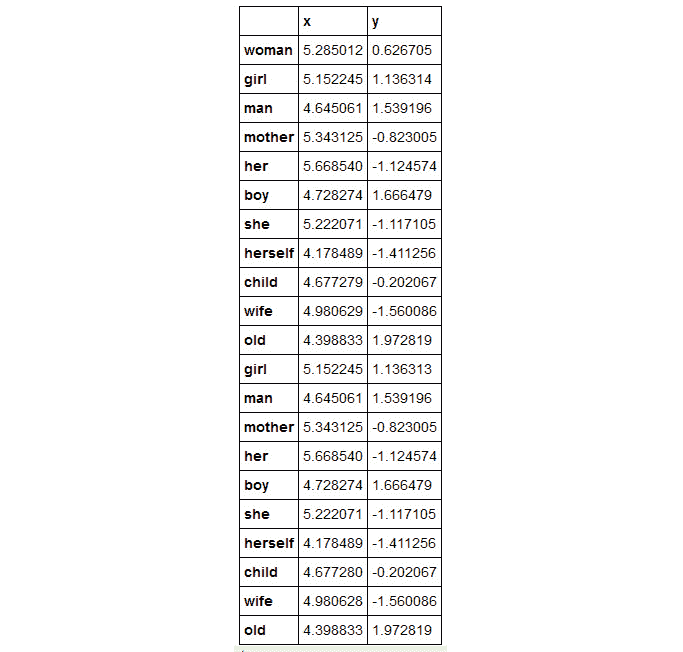

    ###### 图 7.15:二维向量的坐标

17.  创造一个情节在一个平面上看单词:

    ```
    fig = plt.figure() ax = fig.add_subplot(1, 1, 1) for word, pos in df.iterrows():     ax.annotate(word, pos) ax.scatter(df['x'], df['y']) plt.show()
    ```

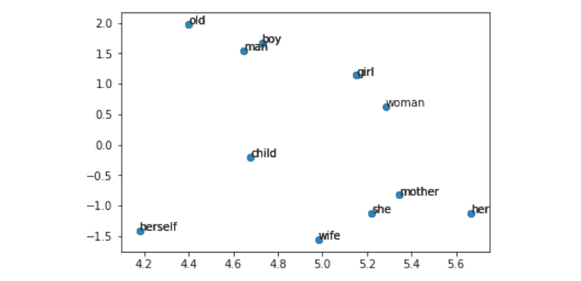

###### 图 7.16:与女性最相似的词的分布

这里，我们降低了向量的维数，以获得二维图形的输出。在这里，我们可以看到单词之间的相似关系。

您已经完成了练习 25！您现在可以选择使用自己的 word2vec 模型或手套模型。

## 对话系统

正如我们之前提到的，聊天机器人越来越受欢迎。他们可以全天候帮助人类，回答问题或只是进行对话。对话系统可以理解主题，给出合理的答案，并在与人的对话中检测情绪(如积极、中立或消极的情绪)。这些系统的主要目标是通过模仿人类来进行自然对话。这种像人一样行为或思考的能力是确保对话中良好用户体验的最重要因素之一。罗布纳奖是一项聊天机器人竞赛，使用许多不同的句子和问题对聊天机器人进行测试，最像人类的系统获胜。最受欢迎的对话代理之一是 Mitsuku 聊天机器人([https://www.pandorabots.com/mitsuku/](https://www.pandorabots.com/mitsuku/))。

聊天机器人通常被用作向用户提供信息的文本服务。例如，在西班牙最受欢迎的对话代理之一是 Lola，它可以给你你的星座信息([https://1millionbot.com/chatbot-lola/](https://1millionbot.com/chatbot-lola/))。你只需要发送一条消息，然后等几秒钟就能收到数据。但在 2011 年，苹果开发了 Siri，这是一款理解语音的虚拟助手，现在，我们也有了亚马逊的 Alexa 和谷歌助手。根据系统的输入类型，它们可以分为两组:**口头对话系统**和**基于文本的对话系统**，这将在本章的后面进行解释。

这不是对对话代理进行分类的唯一方法。根据他们拥有的知识类型，他们可以分为目标导向型和开放领域型。我们还将在本章后面回顾这些分类。

实际上，有许多工具可以在几分钟内创建自己的聊天机器人。但在这一章中，你将学习如何从零开始创建所需的系统知识。

### 开发聊天机器人的工具

聊天机器人帮助了许多即将成立的公司。但是创建一个聊天机器人，需要具备深度 NLP 的知识吗？多亏了这些工具，一个没有任何 NLP 知识的人可以在几个小时内创建一个聊天机器人:

*   对话流(dialog flow):这很容易创造出自然语言的对话。Dialogflow 是谷歌旗下的开发者，提供语音和对话界面。该系统使用谷歌的机器学习专业知识，在与用户的对话中找到合适的意图，并部署在谷歌云平台上。它支持超过 14 种语言和多个平台。
*   **IBM Watson**:Watson Assistant 提供了一个用户友好的界面来创建对话代理。它的工作方式类似于 Dialogflow，但它部署在 IBM Cloud 上，并由 IBM Watson knowledge 提供支持。Watson 还提供了几个工具来分析对话产生的数据。
*   **路易斯**:语言理解(LUIS)是微软基于机器学习的服务，用于构建自然语言应用。这个 bot 框架托管在 Azure 云上，使用微软知识。

上述工具是一个复杂的 NLP 系统。在这一章中，我们将学习一种使用预训练手套识别信息意图的基本方法。最新的聊天机器人趋势是语音助手。这些工具允许你实现一个语音控制的聊天机器人。有许多方法可以对对话代理进行分类。

### 对话代理的类型

根据输入-输出数据的类型和它们的知识限制，对话代理可以分为几组。当一家公司下令创建聊天机器人时，第一步是分析其沟通渠道(文本或语音)将是什么，以及对话的主题将是什么(有限的知识或没有限制)。

现在，我们将解释许多类型的组和每个组的特征。

### 按输入输出数据类型分类

语音控制的虚拟助理不像基本的聊天机器人，我们使用文本进行交流。根据输入输出类型，我们可以将它们分为两组:

*   **口语对话系统(SDS)** :这些型号设计为语音控制，没有聊天界面或键盘，但有麦克风和扬声器。这些系统比普通聊天机器人更难操作，因为它们由不同的模块组成:

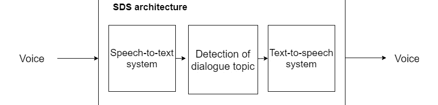

###### 图 7.17:SDS 模型的结构

*   图 7.17 显示了 SDS 的模块。SDS 有更高的错误概率，因为语音到文本系统需要将人的声音转换成文本，而这可能会失败。一旦语音被转换成文本，对话代理识别对话的意图并返回响应。在代理返回响应之前，答案被转换为语音。
*   **基于文本的对话系统**:与 SDS 相比，基于文本的对话系统基于聊天界面，用户使用键盘和屏幕与聊天机器人进行交互。在本章中，我们将创建一个基于文本的对话聊天机器人。

### 按系统知识分类

如果聊天机器人能够使用它的知识成功地响应每一种消息，或者如果它局限于一组特定的问题，这些对话代理可以被划分如下:

*   **封闭领域或目标导向(GO)** :模型已经被训练来识别一组意图。聊天机器人只会理解与这些话题相关的句子。如果对话代理没有识别意图(在本章的介绍中解释了意图)，它将返回一个预定义的句子。
*   **开放域**:并非所有聊天机器人都有一套明确的意图。如果系统能够使用 NLG 技术和其他数据源回答每一种类型的句子，它就被归类为开放域模型。这些系统的架构比 GO 模型更难构建。
*   还有第三类对话代理，基于其知识，即**混合域**。它是前面提到的模型的组合，因此，根据句子，聊天机器人将有预定义的响应(与许多响应相关联的意图)或没有。

### 创建基于文本的对话系统

到目前为止，我们已经知道对话代理的不同类别，以及它们如何选择或生成响应。还有许多其他方法来构建对话代理，NLP 提供了许多不同的方法来实现这个目标。例如， **seq2seq** (序列对序列)模型能够在给出问题时找到答案。此外，深度语言模型可以基于语料库生成响应，也就是说，如果聊天机器人有会话语料库，它可以跟踪会话。

在这一章中，我们将使用斯坦福的手套来构建一个聊天机器人。在*练习 26* ，*创建你的第一个对话代理*，你会发现对我们将要使用的技术的简要介绍，在活动中，我们将创建一个对话代理来控制一个机器人。

**范围定义和意图创建**

我们的对话代理将是一个基于文本和面向目标的对话系统。因此，我们将使用键盘与我们的聊天机器人进行交互，它只会理解与我们创建的意图相关的句子。

在开始意图创建之前，我们需要知道我们的聊天机器人的主要目标是什么(保持一般对话、控制设备和获取信息)以及用户可能会问哪些不同类型的句子。

一旦我们分析了聊天机器人可能的对话，我们就可以创建意图。每个意图将是一个带有几个训练句子的文本文件。这些训练句子是用户与我们的聊天机器人可能的互动。很好地定义这些句子非常重要，因为如果有两个意图不同的类似句子，聊天机器人可能会匹配错误的意图。

#### 注意

对我们的聊天机器人的可能对话的良好的先前分析将使意图定义更容易。很明显，聊天机器人不会理解用户可能说的所有句子，但它必须能够识别与我们意图相关的句子的意思。

系统还将有一个与意图文件同名的文件，但是它将有与意图相关的响应，而不是包含训练句子:

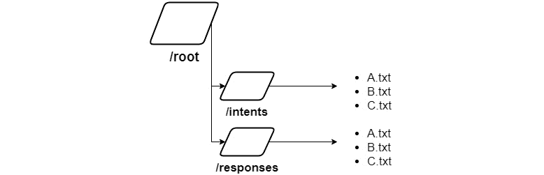

###### 图 7.18:系统的文件夹结构

在图 7.18 中，我们可以看到我们的聊天机器人的结构。意图和响应文件的扩展名是`.txt`，但是您也可以将它们保存为`.json`。

**意图检测手套**

在这一章的开始，我们回顾了单词嵌入、单词到向量和全局向量的基础知识。GloVe 用实值向量表示每个单词，这些向量可以在各种应用中用作特征。但是在这个例子中——构建一个对话代理——我们将使用完整的句子来训练我们的聊天机器人，而不仅仅是单词。

聊天机器人需要理解整个句子是由一组单词作为向量来表示的。这种将序列表示为向量的方式称为 **seq2vec** 。在内部，对话代理将用户的句子与每个意图训练短语进行比较，以找到最相似的意思。

此时，存在表示序列的向量，并且这些序列在与意图相关的文件中。如果前面提到的相同过程被用于将所有序列向量连接成一个，我们将有一个意图的表示。主要思想是不仅仅代表一个句子；就是用一个向量来表示一整篇文档，这个叫做 **Doc2vec** 。使用这种方法，当用户与聊天机器人交互时，它会发现用户短语的意图。

我们系统的最终结构将如图 7.19 所示:

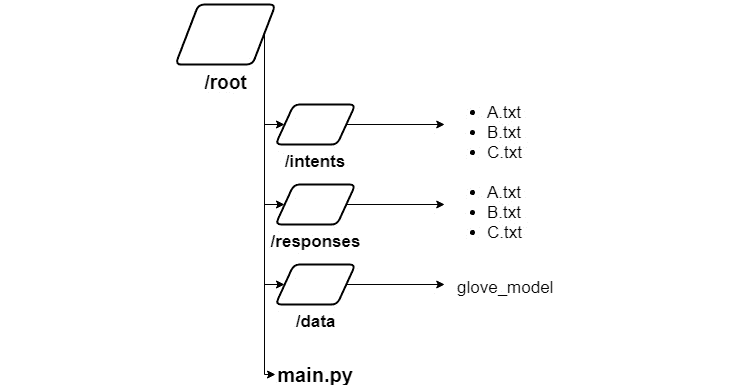

###### 图 7.19:最终的文件夹结构

名为`main.py`的文件将包含使用`/data`中的手套模型分析输入句子的不同方法，创建文档向量以执行用户句子和意图之间的匹配:

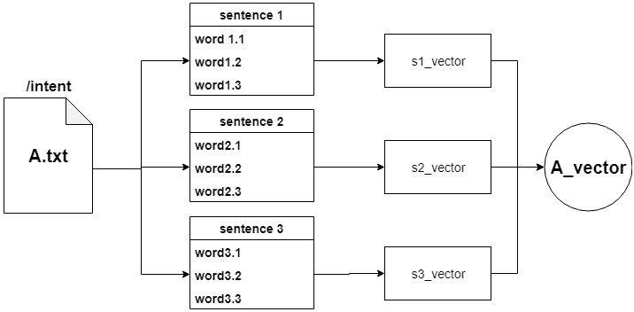

###### 图 7.20: Doc2Vec 转换

图 7.20 显示了在一个向量中转换一组句子的过程，这个向量代表一个文档。在示例中， **A.txt** 文件是一个包含三个句子的意图。每个句子有三个单词，所以每个句子有三个向量。组合向量，我们获得每组单词的表示，之后，我们获得文档向量。

将句子转换成向量的方法允许对文档向量中的向量序列进行比较，而没有任何问题。当用户与聊天机器人交互时，用户短语将被转换为 seq2vec，然后它将与每个文档向量进行比较，以找到最相似的一个。

### 练习 26:创建您的第一个对话代理

#### 注意

在执行练习 25 的文件夹中执行练习 26。

在本练习中，您将创建一个聊天机器人来理解基本对话。本练习将涵盖意图和响应定义、将单词转换为向量、表示文档以及将用户的句子与意图相匹配。

在开始练习之前，请看看 Google Colab 中的文件夹结构，如图 7.21 所示:

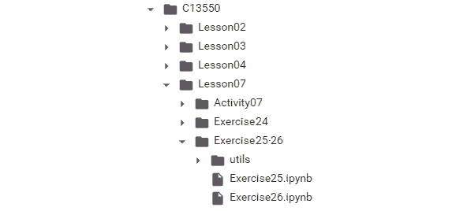

###### 图 7.21:练习 26 的结构

`Exercise26.ipynb`文件是我们之前遇到的`main.py`文件，在`utils`文件夹中，您会发现文件夹结构如之前练习中所述:


###### 图 7.22:练习 26 (2)的结构

文件夹响应包含用户与之交互时聊天机器人可以输出的短语文件。训练是在句子中定义意图的地方。为了获得每个单词的向量，我们将使用斯坦福的五维手套:

1.  First, we need to define the intents and the responses for each intent. This is an introduction exercise, so let's define three intents: welcome, how-are-you, and farewell, and create some related sentences (separated by commas).

    “欢迎”训练句子:嗨朋友，你好，嗨，欢迎。

    “告别”训练句子:再见，再见，再见，再见，祝你有美好的一天。

    “你好吗”训练句子:你好吗？这是怎么回事？你还好吗？

2.  Once we have the intents created, we will need the responses. Create three files with the same name as the intent files and add responses.

    “欢迎”回应:你好！你好。

    “你好吗？”回应:我很好！很好我的朋友:)

    “告别”回应:再见！再见！

3.  导入驱动器并安装如下:

    ```
    from google.colab import drive drive.mount('/content/drive')
    ```

4.  一旦你第一次安装了你的硬盘，你必须通过点击谷歌提到的网址并按下键盘上的 **Enter** 键来输入授权码: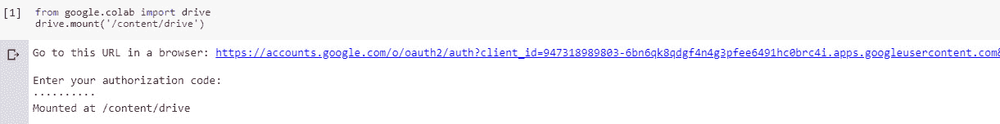

    ###### 图 7.23:谷歌 Colab 授权步骤

5.  现在你已经安装了驱动器，你需要设置目录的路径:

    ```
    /content/drive/My Drive/C13550/Lesson07/Exercise25-26
    ```

6.  导入必要的库:

    ```
    from gensim.scripts.glove2word2vec import glove2word2vec from gensim.models import KeyedVectors import numpy as np from os import listdir
    ```

7.  使用 spaCy，我们将对句子进行标记，并删除标点符号。现在，创建一个函数来标记文档中的每个句子。在本练习中，我们将通过将所有这些向量组合成一个向量来从单词 vectors 创建 Doc2vec。这就是为什么我们要对整个文档进行标记化，返回一个包含所有标记的数组。删除停用词也是很好的做法，但在本练习中没有必要。这个函数的输入是一组句子:

    ```
    import spacy import en_core_web_sm nlp = en_core_web_sm.load() # return a list of tokens without punctuation marks def pre_processing(sentences):     tokens = []     for s in sentences:         doc = nlp(s)         for t in doc:             if t.is_punct == False:                 tokens.append(t.lower_)     return tokens
    ```

8.  加载手套型号:

    ```
    filename = 'utils/glove.6B.50d.txt.word2vec' model = KeyedVectors.load_word2vec_format(filename, binary=False)
    ```

9.  用意图文件和响应文件的名称创建两个列表:

    ```
    intent_route = 'utils/training/' response_route = 'utils/responses/' intents = listdir(intent_route) responses = listdir(response_route)
    ```

10.  创建一个函数，返回一个表示文档的 100 维向量。这个函数的输入将是一个带有文档标记的列表。我们需要初始化一个 100 维的空向量。这个函数将执行的是将每个向量单词相加，然后除以标记化文档的长度:

    ```
    def doc_vector(tokens):     feature_vec = np.zeros((50,), dtype="float32")     for t in tokens:          feature_vec = np.add(feature_vec, model[t])     return np.array([np.divide(feature_vec,len(tokens))])
    ```

11.  现在，我们准备读取每个意图文件(位于 training 文件夹中)，对它们进行标记，并使用每个文档向量创建一个数组:

    ```
    doc_vectors = np.empty((0,50), dtype='f') for i in intents:     with open(intent_route + i) as f:         sentences = f.readlines()     sentences = [x.strip() for x in sentences]     sentences = pre_processing(sentences)     # adding the document vector to the array doc_vectors     doc_vectors=np.append(doc_vectors,doc_vector(sentences),axis=0) print("Vector representation of each document:\n",doc_vectors)
    ```

    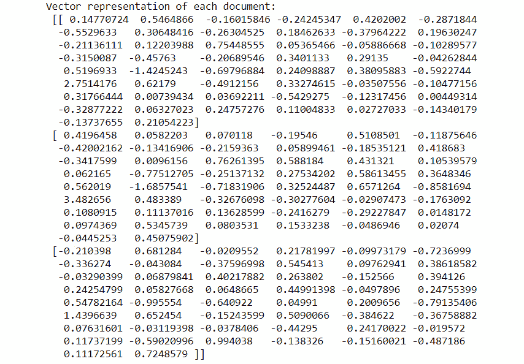

    ###### 图 7.24:表示为向量的文档

12.  使用名为`cosine_similarity`的`sklearn`函数，创建一个查找最相似意图的函数，将一个句子向量与每个文档向量进行比较:

    ```
    from sklearn.metrics.pairwise import cosine_similarity def select_intent(sent_vector, doc_vector):     index = -1     similarity = -1 #cosine_similarity is in the range of -1 to 1     for idx,v in zip(range(len(doc_vector)),doc_vector):         v = v.reshape(1,-1)         sent_vector = sent_vector.reshape(1,-1)         aux = cosine_similarity(sent_vector, v).reshape(1,)         if aux[0] > similarity:             index = idx             similarity = aux     return index
    ```

13.  让我们测试一下我们的聊天机器人。对用户的输入进行符号化，使用最后一个函数(`select_intent`)获取相关意图:

    ```
    user_sentence = "How are you" user_sentence = pre_processing([user_sentence]) user_vector = doc_vector(user_sentence).reshape(50,) intent = intents[select_intent(user_vector, doc_vectors)] intent
    ```

    

    ###### 图 7.25:预测的文档意图

14.  创建一个函数给用户一个响应:

    ```
    def send_response(intent_name):     with open(response_route + intent_name) as f:         sentences = f.readlines()     sentences = [x.strip() for x in sentences]     return sentences[np.random.randint(low=0, high=len(sentences)-1)] send_response(intent)
    ```

15.  Check for the output with the test sentence:

    ```
    send_response(intent)
    ```

    输出将如下所示:

    

    ###### 图 7.26:意向响应你好吗

16.  检查该系统是否适用于许多测试句子。

您已经完成了练习 26！您已经准备好构建一个对话代理来控制我们的虚拟机器人。正如你在练习 26(步骤 2)中看到的，你需要一个好的意图定义。如果你试图用两种不同的意图添加同一个句子，系统可能会失败。

### 活动 7:创建一个对话代理来控制机器人

在本活动中，我们将创建一个具有多种意图的聊天机器人。为了完成这项活动，我们将使用斯坦福的手套，如*练习 26* ，*创建您的第一个对话代理*。我们将学习如何创建一个等待用户句子的程序，当用户与聊天机器人交互时，它将返回一个响应。

场景:你在一家开发安全系统的公司工作。这个安全系统将是一个机器人，配备了一个摄像头来观察环境，并装有轮子来前进或后退。这个机器人将通过文本控制，所以你可以键入命令，机器人将执行不同的动作。

1.  The robot can perform the following actions:

    往前走。

    向后移动。

    旋转:

    向右 45 度。

    向左 45 度。

2.  Identify what the robot can see. This activity is performed in the same way as in *Exercise 26*, *Create Your First Conversational Agent*. To avoid rewriting code, the `chatbot_intro.py` file has four basic methods:

    `Pre_processing`:对句子进行分词

    `Doc_vector`:创建文档向量

    `Select_intent`:查找句子中引入的最相似的意图

    `Send_response`:发送位于回复文件夹中的句子

    知道了这些方法，核心工作就完成了，所以最重要的是意图的设计。

3.  We need to develop four different activities, but the rotation activity has two different types. We are going to define five intents, one per action (two for rotation). You can use these sentences, but you are free to add more training sentences or more actions:

    **向后**:

    退缩

    倒退

    向后的

    回去

    向后移动

    **环境**:

    你能看到什么？

    环境信息

    照相

    告诉我你看到了什么？

    你面前有什么？

    **前进**:

    预先的

    前进

    上前线

    开始移动

    向前

    **左**:

    向左转

    向左走

    向左看

    向左转

    左边的

    **右**:

    向右转

    走右边

    向右看

    向右转

    对吧

    您可以在活动/培训文件夹中找到这些文件:


###### 图 7.27:训练句子文件

#### 注意

这项活动的解决方案在第 323 页。

## 总结

对话代理，也称为聊天机器人，是基于文本的对话系统，可以理解人类语言，以便与人进行“真正的”对话。为了更好地理解一个人在说什么，聊天机器人需要将对话分类成意图，也就是说，一组代表一个意思的句子。根据输入输出数据的类型和知识限制，对话代理可以分为几组。这种意义的表达并不容易。为了让健全的知识支持聊天机器人，需要一个巨大的语料库。找到表示一个单词的最佳方式是一个挑战，而一次性编码是没有用的。独热编码的主要问题是编码向量的大小。如果我们有 88，000 个单词的语料库，那么向量的大小将是 88，000，并且单词之间没有任何关系。这就是单词嵌入概念出现的地方。

单词嵌入是将语料库中的单词和句子映射成向量或实数的技术和方法的集合。单词嵌入根据单词出现的上下文生成每个单词的表示。为了生成单词嵌入，我们可以使用 Word2Vec。Word2Vec 处理一个语料库，并为语料库中的每个唯一单词分配一个向量，它可以执行降维，通常是几百维。

Word2Vec 的核心思想是，一个单词的含义是由经常出现在它附近的单词给出的。当一个单词出现在一个句子中时，它的上下文是由它附近的一组单词组成的。Word2Vec 可以使用两种算法实现:skip-gram 和 CBOW。Word2Vec 的想法是表示有用的单词，但是从效率上来说，有问题。GloVe 结合了 Word2Vec 和一个语料库的统计信息。GloVe 结合了这两种方法来实现快速训练，可扩展到巨大的语料库，并在小向量的情况下实现更好的性能。有了手套，我们能够给我们的聊天机器人提供知识，结合定义我们一系列意图的训练句子。

*第八章*、*使用 CNN 引导机器人的物体识别*，将向您介绍使用不同预训练模型的物体识别。此外，它将着眼于计算机视觉的最新趋势——使用识别图片各部分内容的盒子来识别物体。