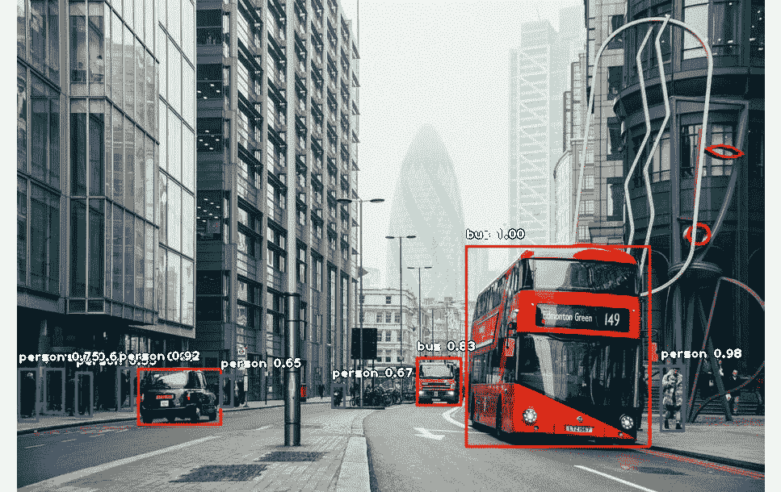
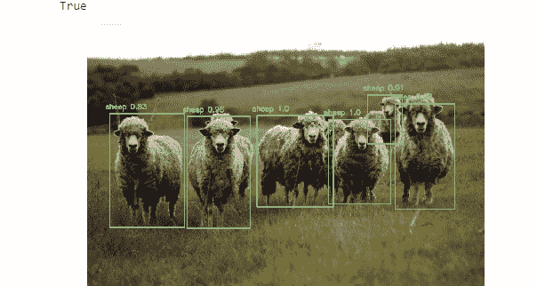
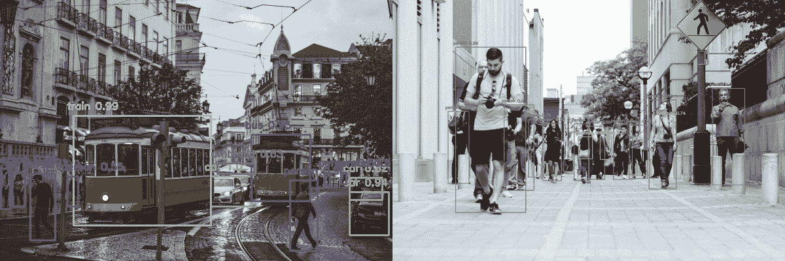
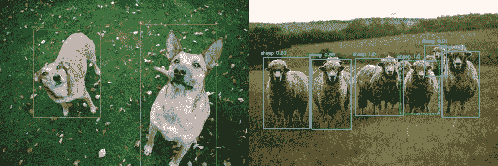
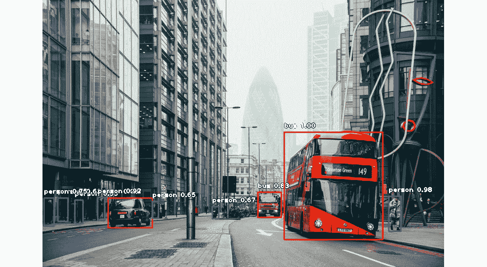
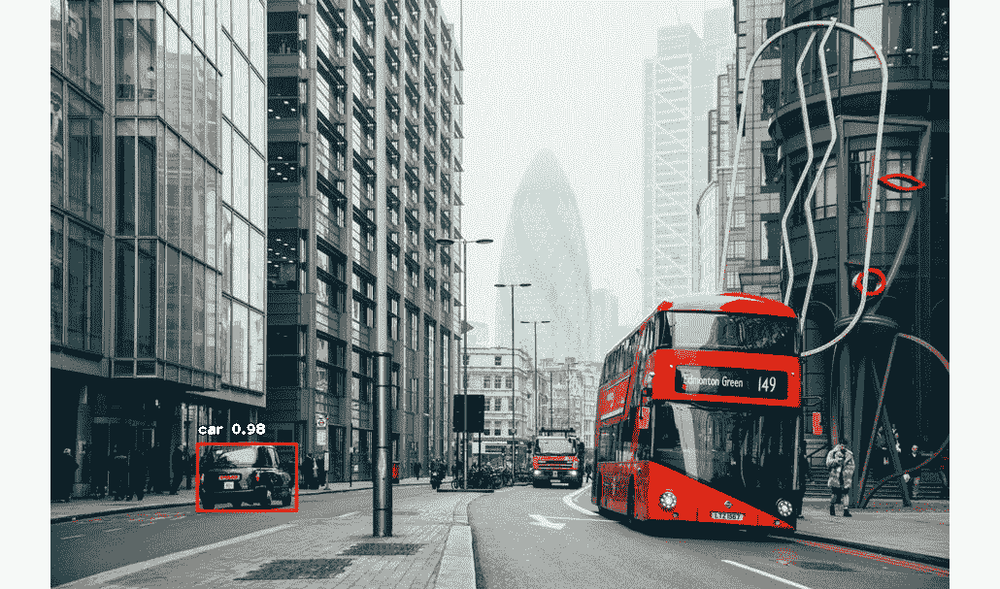
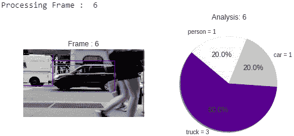

# 八、使用 CNN 引导机器人进行目标识别

## 学习目标

本章结束时，您将能够:

*   解释目标识别的工作原理
*   建立一个能够识别目标的网络
*   建立一个目标识别系统

本章通过构建一个能够基于视频识别目标的网络，讲述了目标识别的工作原理。

## 简介

**目标识别**是计算机视觉的一个领域，在这个领域中，机器人能够使用能够提取机器人周围图像的摄像机或传感器来检测环境中的目标。从这些图像中，软件检测每个图像中的对象，然后识别对象的类型。机器能够从机器人传感器捕获的图像或视频中识别目标。这使得机器人能够意识到他们的环境。

如果机器人能够识别其环境并使用目标识别获得这些信息，它将能够执行更复杂的任务，例如抓取目标或在环境中四处移动。在*第 9 章*、*机器人的计算机视觉*中，我们将看到一个机器人在虚拟环境中执行这些任务。

这里要执行的任务是检测图像中的特定对象并识别这些对象。这种类型的计算机视觉问题与我们在本书前面看到的问题有点不同。为了识别特定的对象，我们已经看到了标记这些对象并训练卷积神经网络，这在第 5 章、*用于计算机视觉的卷积神经网络*中讨论过，这将很好地工作，但是首先检测这些对象呢？

之前，我们了解到，我们想要识别的对象必须用它们所属的相应类来标记。因此，为了检测图像中的这些对象，必须在它们周围绘制矩形边界框，以便正确定位它们在图像中的位置。然后，神经网络将预测这些对象的边界框和标签。

用边界框标记对象是一项单调乏味的艰巨任务，因此我们不会展示用边界框标记数据集中的图像的过程，也不会展示训练神经网络来识别和检测这些对象的过程。尽管如此，还是有一个名为`labelImg`的库，你可以在这个 https://github.com/tzutalin/labelImg[githubrepository:﷟](https://github.com/tzutalin/labelImg)中访问它。这允许您为图像中的每个对象创建边界框。一旦创建了边界框(在数据方面称为坐标)，就可以训练神经网络来预测图像中每个对象的边界框和相应的标签。

在这一章中，我们将使用 YOLO 网络的最先进的方法，这些方法随时可以使用，将使你不必构建自己的算法。

## 多目标识别与检测

多对象识别和检测涉及检测和识别图像中的几个对象。这项任务包括用边界框标记每个对象，然后识别该对象的类型。

正因为如此，有许多可用的预训练模型可以检测许多对象。被称为 **YOLO** 的神经网络是这项特定任务的最佳模型之一，并实时工作。YOLO 将在下一章详细解释机器人模拟器的开发。

对于这一章，我们要使用的 YOLO 网络经过训练，可以识别和检测 80 种不同的类别。这些类别是:

人、自行车、汽车、摩托车、飞机、公共汽车、火车、卡车、船、交通灯、消防栓、停车标志、停车计时器、长凳、鸟、猫、狗、马、羊、牛、大象、熊、斑马、长颈鹿、背包、雨伞、手提包、领带、手提箱、飞盘、滑雪板、运动球、风筝、棒球棍、棒球手套、滑板、冲浪板、网球拍、瓶子、酒杯、杯子、叉子、刀、勺子、碗、香蕉、苹果、三明治、橙子、花椰菜、胡萝卜、热狗、比萨饼、油炸圈饼、蛋糕、椅子

在图 8.1 中，您可以看到一条街道的示例，其中使用 YOLO 检测到了人、汽车和公交车:



###### 图 8.1: YOLO 检测样本

在这个主题中，我们将建立一个静态图像的多目标识别和检测系统。

首先，我们将使用一个名为 **DNN** (深度神经网络)的 OpenCV 模块来这样做，它包含几行代码。稍后，我们将使用一个名为 **ImageAI** 的库，它做同样的事情，但代码不到 10 行，并且允许您选择想要检测和识别的特定对象。

为了用 OpenCV 实现 YOLO，你需要用 OpenCV 导入图像，就像我们在本书的其他章节中提到的那样。

### 练习 24:构建您的第一个多目标检测和识别算法

#### 注意

我们将使用 Google Colab 笔记本，因为这项任务不涉及训练算法，而是使用算法。

在这个练习中，我们将使用 YOLO 和 OpenCV 实现一个多目标检测和识别系统。我们将编写一个检测器和一个识别器系统，它将图像作为输入，检测并识别图像中的对象，然后输出包含这些检测的图像:

1.  打开你的 Google Colab 界面。
2.  导入以下库:

    ```
    import cv2 import numpy as np import matplotlib.pyplot as plt
    ```

3.  To input an image to this network, we need to use the `blobFromImage` method:

    #### 注意

    ```
    image = cv2.imread('Dataset/obj_det/image6.jpg')
    Width = image.shape[1]
    Height = image.shape[0]
    scale = 0.00392
    ```

    我们需要加载数据集的类，对于 YOLO，这些类存储在`Models/yolov3.txt`中，你可以在 GitHub 的`Chapter 8/Models`中找到。我们这样读这些课:

    ```
    # read class names from text file
    classes = None
    with open("Models/yolov3.txt", 'r') as f:
        classes = [line.strip() for line in f.readlines()]
    ```

4.  为不同的类生成不同的颜色:

    ```
    COLORS = np.random.uniform(0, 255, size=(len(classes), 3))
    ```

5.  读取预先训练好的模型和配置文件:

    ```
    net = cv2.dnn.readNet('Models/yolov3.weights', 'Models/yolov3.cfg')
    ```

6.  创建输入斑点:

    ```
    blob = cv2.dnn.blobFromImage(image.copy(), scale, (416,416), (0,0,0), True, crop=False)
    ```

7.  Set the input blob for the network:

    ```
    net.setInput(blob)
    ```

    为了声明网络，我们使用来自`Models/yolov3.weights`的`readNet`方法，这是网络的权重，以及`Models/yolov3.cfg`，这是模型的架构:

    #### 注意

    方法、类、权重和架构文件可以在 GitHub 的`Lesson08/Models/`文件夹中找到。

    现在我们已经设置好了，为了识别和检测图像中的所有对象，剩下的唯一事情就是运行和执行代码，这将在下面解释。

8.  为了获得网络的输出层，我们声明下面代码中提到的方法，然后运行接口以获得输出层的数组，它包含几个检测:

    ```
    # function to get the output layer names in the architecture def get_output_layers(net):          layer_names = net.getLayerNames()          output_layers = [layer_names[i[0] - 1] for i in net.getUnconnectedOutLayers()]     return output_layers
    ```

9.  创建一个函数，用类名:

    ```
    def draw_bounding_box(img, class_id, confidence, x, y, x_plus_w, y_plus_h):     label = str(classes[class_id])     color = COLORS[class_id]     cv2.rectangle(img, (x,y), (x_plus_w,y_plus_h), color, 2)     cv2.putText(img, label + " " + str(confidence), (x-10,y-10), cv2.FONT_HERSHEY_SIMPLEX, 0.5, color, 2)
    ```

    在检测到的对象周围绘制一个边界框
10.  Execute the code:

    ```
    # run inference through the network
    # and gather predictions from output layers
    outs = net.forward(get_output_layers(net))
    ```

    #### 注意

    outs 是一组预测。在后面的练习中，我们将看到我们必须循环这个数组，以获得每个检测的边界框和置信度，以及类的类型。

    对象检测算法经常多次检测一个对象，这是一个问题。这个问题可以通过使用**非最大抑制**来解决，它删除每个具有较低置信度(对象在预测类中的概率)的对象的边界框，之后唯一保留的边界框是具有最高置信度的边界框。在检测包围盒和置信度并声明相应的阈值之后，该算法可以如下运行:

11.  这一步是最重要的一步。这里，我们将从每个输出层(检测到的每个对象)、类 ID 和边界框的每个检测中收集置信度，但是我们将忽略置信度小于 50%的检测:

    ```
    # apply non-max suppression class_ids = [] confidences = [] boxes = [] conf_threshold = 0.5 nms_threshold = 0.4 indexes = cv2.dnn.NMSBoxes(boxes, confidences, conf_threshold, nms_threshold)
    ```

12.  对于来自每个输出层的每个检测，获取置信度、类 ID 和边界框参数，并忽略弱检测(置信度< 0.5): 【
13.  We loop over the list of indexes and use the method that we declared for printing to print every bounding box, every label, and every confidence on the input image: 【
14.  Finally, we show and save the resulting image. OpenCV has a method for showing it also; there is no need to use Matplotlib:

    ```
    # display output image    
    plt.axis("off")
    plt.imshow(cv2.cvtColor(image, cv2.COLOR_BGR2RGB))
    # save output image to disk
    cv2.imwrite("object-detection6.jpg", image)
    ```

    The output is as follows:

    

    ###### Figure 8.2: YOLO detection sample

    Finally, we have to draw the bounding boxes, its classes, and the confidence.

15.  Now let's try some other examples using the steps mentioned previously. You can find the images in the 【 folder. The outputs will be as shown in Figure 8.3:



###### Figure 8.3: YOLO detection sample

### ImageAI

还有另一种方法可以轻松实现这一点。您可以使用 **ImageAI** 库，它能够用几行代码执行对象检测和识别。

这个库的 GitHub 库的链接可以在这里找到:

[https://github.com/OlafenwaMoses/ImageAI](https://github.com/OlafenwaMoses/ImageAI)

为了安装该库，您可以通过使用 pip 和以下命令来完成:

```
pip install https://github.com/OlafenwaMoses/ImageAI/releases/download/2.0.2/imageai-2.0.2-py3-none-any.whl
```

要使用这个库，我们需要导入一个类:

```
from imageai.Detection import ObjectDetection
```

我们导入了`ObjectDetection`类，它将作为神经网络工作。

之后，我们声明将要进行预测的类的对象:

```
detector = ObjectDetection()
```

我们将要使用的模型必须声明。对于这个库，我们只能使用三种模型:RetinaNet、YOLOV3 和 TinyYOLOV3。YOLOV3 与我们之前使用的型号相同，具有中等的性能和准确性，检测时间也适中。

至于 RetinaNet，它具有更高的性能和准确性，但检测时间较长。

TinyYOLOV3 针对速度进行了优化，具有中等的性能和准确性，但检测时间要快得多。这个模型将在下一个主题中使用，因为它的速度。

您只需要修改几行代码就可以使用这些模型了。对于 YOLOV3，需要以下几行:

```
detector.setModelTypeAsYOLOv3()
detector.setModelPath("Models/yolo.h5")
detector.loadModel()
```

`.h5`文件包含了 YOLOV3 神经网络的权重和架构。

要运行推理并获得相应的检测，只需要一行代码:

```
detections = detector.detectObjectsFromImage(input_image="Dataset/obj_det/sample.jpg", output_image_path="samplenew.jpg")
```

这行代码的作用是将一幅图像作为输入，检测图像中的对象及其类的边界框。它输出用这些检测绘制的新图像，以及检测到的对象的列表。

让我们看看它如何检测我们在上一个练习中使用的`sample.jpg`图像:



###### 图 8.4: ImageAI YOLOV3 图像检测

ImageAI 还允许你定制你想要识别的对象。默认情况下，它还能够检测与 YOLO 相同的类，这是使用 OpenCV 构建的，即 80 个类。

您可以通过将一个对象作为名为`CustomObjects`的参数进行传递来定制它，以便只检测您想要的对象，在这里您可以指定您想要模型检测哪些对象。此外，检测器识别这些目标的方法从`detectObjectsFromImage()`变为`detectCustomObjectsFromImage()`。它是这样使用的:

```
custom_objects = detector.CustomObjects(car=True)
detections = detector.detectCustomObjectsFromImage(custom_objects=custom_objects, input_image="Dataset/obj_det/sample.jpg", output_image_path="samplenew.jpg")
```



###### 图 8.5: ImageAI YOLOV3 自定义图像检测

## 视频中的多目标识别与检测

静态图像中的多目标识别和检测听起来很神奇，但在视频中检测和识别目标呢？

你可以从互联网上下载任何视频，并尝试检测和识别视频中出现的所有对象。

接下来的过程是获取视频的每一帧，并为每一帧检测相应的对象及其标签。

首先声明相应的库:

```
from imageai.Detection import VideoObjectDetection
from matplotlib import pyplot as plt
```

`imageai`库包含一个对象，允许用户对视频应用对象检测和识别:

```
video_detector = VideoObjectDetection()
```

我们需要 V `ideoObjectDetection`来检测视频中的目标。此外，需要 Matplotlib 来显示每一帧的检测过程:



###### 图 8.6: ImageAI 单帧对象检测过程

现在我们首先需要加载模型。您可以根据您需要的视频处理速度和精度来决定加载什么模型。YOLOV3 处于中间，在 RetinaNet 和 TinyYOLOV3 之间，RetinaNet 最精确但最慢，TinyYOLOV3 最不精确但最快。我们将坚持使用 YOLOV3 型号，但也可以随意使用其他两种型号。声明视频对象检测后的声明与上一个主题中的声明相同:

```
video_detector.setModelTypeAsYOLOv3()
video_detector.setModelPath("Models/yolo.h5")
video_detector.loadModel()
```

在运行视频检测器之前，我们需要声明一个函数，该函数将应用于处理的每一帧。该函数不执行检测算法，但它处理每一帧的检测过程。为什么我们必须在目标检测过程之后处理每一帧的输出？这是因为我们希望使用 Matplotlib 一帧一帧地显示检测过程..

在声明该方法之前，我们需要声明对象将要打印的颜色:

```
color_index = {'bus': 'red', 'handbag': 'steelblue', 'giraffe': 'orange', 'spoon': 'gray', 'cup': 'yellow', 'chair': 'green', 'elephant': 'pink', 'truck': 'indigo', 'motorcycle': 'azure', 'refrigerator': 'gold', 'keyboard': 'violet', 'cow': 'magenta', 'mouse': 'crimson', 'sports ball': 'raspberry', 'horse': 'maroon', 'cat': 'orchid', 'boat': 'slateblue', 'hot dog': 'navy', 'apple': 'cobalt', 'parking meter': 'aliceblue', 'sandwich': 'skyblue', 'skis': 'deepskyblue', 'microwave': 'peacock', 'knife': 'cadetblue', 'baseball bat': 'cyan', 'oven': 'lightcyan', 'carrot': 'coldgrey', 'scissors': 'seagreen', 'sheep': 'deepgreen', 'toothbrush': 'cobaltgreen', 'fire hydrant': 'limegreen', 'remote': 'forestgreen', 'bicycle': 'olivedrab', 'toilet': 'ivory', 'tv': 'khaki', 'skateboard': 'palegoldenrod', 'train': 'cornsilk', 'zebra': 'wheat', 'tie': 'burlywood', 'orange': 'melon', 'bird': 'bisque', 'dining table': 'chocolate', 'hair drier': 'sandybrown', 'cell phone': 'sienna', 'sink': 'coral', 'bench': 'salmon', 'bottle': 'brown', 'car': 'silver', 'bowl': 'maroon', 'tennis racket': 'palevilotered', 'airplane': 'lavenderblush', 'pizza': 'hotpink', 'umbrella': 'deeppink', 'bear': 'plum', 'fork': 'purple', 'laptop': 'indigo', 'vase': 'mediumpurple', 'baseball glove': 'slateblue', 'traffic light': 'mediumblue', 'bed': 'navy', 'broccoli': 'royalblue', 'backpack': 'slategray', 'snowboard': 'skyblue', 'kite': 'cadetblue', 'teddy bear': 'peacock', 'clock': 'lightcyan', 'wine glass': 'teal', 'frisbee': 'aquamarine', 'donut': 'mincream', 'suitcase': 'seagreen', 'dog': 'springgreen', 'banana': 'emeraldgreen', 'person': 'honeydew', 'surfboard': 'palegreen', 'cake': 'sapgreen', 'book': 'lawngreen', 'potted plant': 'greenyellow', 'toaster': 'ivory', 'stop sign': 'beige', 'couch': 'khaki'}
```

现在我们要声明应用于每一帧的方法:

```
def forFrame(frame_number, output_array, output_count, returned_frame):
    plt.clf()
    this_colors = []
    labels = []
    sizes = []
    counter = 0
```

首先，如图所示，声明该函数，并将帧数、检测数组、检测到的每个对象的出现次数以及帧数传递给它。此外，我们声明了相应的变量，我们将使用这些变量来打印每一帧上的所有检测:

```
    for eachItem in output_count:
        counter += 1
        labels.append(eachItem + " = " + str(output_count[eachItem]))
        sizes.append(output_count[eachItem])
        this_colors.append(color_index[eachItem])
```

在这个循环中，存储对象及其相应的出现。还存储了代表每个对象的颜色:

```
    plt.subplot(1, 2, 1)
    plt.title("Frame : " + str(frame_number))
    plt.axis("off")
    plt.imshow(returned_frame, interpolation="none")
    plt.subplot(1, 2, 2)
    plt.title("Analysis: " + str(frame_number))
    plt.pie(sizes, labels=labels, colors=this_colors, shadow=True, startangle=140, autopct="%1.1f%%")
    plt.pause(0.01)
```

在最后这段代码中，为每一帧打印了两个图:一个显示带有相应检测的图像，另一个显示包含每个检测到的对象的出现次数及其占总出现次数的百分比的图表。

该输出如图 8.6 所示。

在最后一个单元格中，为了执行视频检测器，我们编写了这几行代码:

```
plt.show()
video_detector.detectObjectsFromVideo(input_file_path="path_to_video.mp4", output_file_path="output-video" ,  frames_per_second=20, per_frame_function=forFrame,  minimum_percentage_probability=30, return_detected_frame=True, log_progress=True)
```

第一行初始化 Matplotlib 图。

第二行开始视频检测。传递给该函数的参数如下:

*   `input_file_path`:输入视频路径
*   `output_file_path`:输出视频路径
*   `frames_per_second`:输出视频的每秒帧数
*   `per_frame_function`:每次检测帧内目标后的回调函数
*   `minimum_percentage_probability`:最小概率值阈值，仅考虑置信度最高的检测
*   `return_detected_frame`:如果设置为真，回调函数接收帧作为参数
*   `log_progress`:如果设置为 True，进程将记录在控制台中

### 活动 8:视频中的多目标检测和识别

在本练习中，我们将逐帧处理视频，检测每帧中所有可能的对象，并将输出视频保存到磁盘:

#### 注意

我们将在本次活动中使用的视频上传到 GitHub 的`Dataset/videos/street.mp4`文件夹中:

网址:[https://github . com/packt publishing/Artificial-Vision-and-Language-Processing-for-Robotics/blob/master/lesson 08/Dataset/videos/street . MP4](https://github.com/PacktPublishing/Artificial-Vision-and-Language-Processing-for-Robotics/blob/master/Lesson08/Dataset/videos/street.mp4)

1.  打开一个 Google Colab 笔记本，挂载磁盘，导航到第 8 章所在的位置。
2.  在笔记本中安装这个库，因为它没有预先安装，使用这个命令:

    ```
    !pip3 install https://github.com/OlafenwaMoses/ImageAI/releases/download/2.0.2/imageai-2.0.2-py3-none-any.whl
    ```

3.  导入开发该活动所需的库，并设置`matplotlib`。
4.  Declare the model that you are going to use for detecting and recognizing objects.

    #### 注意

    您可以在这里找到该信息:[https://github . com/OlafenwaMoses/ImageAI/blob/master/ImageAI/Detection/video . MD](https://github.com/OlafenwaMoses/ImageAI/blob/master/imageai/Detection/VIDEO.md)

    还要注意，所有模型都存储在`Models`文件夹中。

5.  声明在处理每一帧后将要调用的回调方法。
6.  Run Matplotlib and the video detection processes on the `street.mp4` video that is inside the `Dataset/videos/` folder. You can also try out the `park.mp4` video, which is in the same directory.

    #### 注意

    这项活动的解决方案在第 326 页。

## 总结

对象识别和检测能够识别图像中的几个对象，在这些对象周围绘制边界框，并预测它们是什么类型的对象。

已经解释了标记边界框和它们的标签的过程，但是不深入，因为需要巨大的过程。相反，我们使用最先进的模型来识别和检测这些目标。

YOLOV3 是本章中使用的主要型号。OpenCV 被用来解释如何使用它的 DNN 模块运行对象检测流水线。ImageAI 是一个用于对象检测和识别的替代库，它显示了用几行代码和简单的对象定制编写对象检测管道的潜力。

最后，通过使用一个视频将 ImageAI 对象检测管道付诸实践，其中从视频中获得的每一帧都通过该管道来检测和识别这些帧中的对象，并使用 Matplotlib 显示它们。