# *第九章*

# 机器人的计算机视觉

## 学习目标

本章结束时，您将能够:

*   使用人工视觉评估物体
*   将外部框架与 ROS 相结合
*   使用机器人与物体互动
*   创造一个能理解自然语言的机器人
*   开发您自己的端到端机器人应用

在这一章中，你将学习如何使用暗网和 YOLO。您还将使用人工智能评估对象，并集成 YOLO 和 ROS，使您的虚拟机器人能够预测虚拟环境中的对象。

## 简介

在前几章中，您遇到了许多对您来说可能是新的技术和技巧。您已经学习了许多有助于解决现实世界问题的概念和技术。现在，您将使用所有获得的技能来完成这最后一章，并构建您自己的端到端机器人应用程序。

在本章中，您将使用深度学习框架 Darknet 来构建能够实时识别物体的机器人。这个框架将与 ROS 集成，以便最终的应用程序可以应用于任何机器人。此外，重要的是要说，对象识别可以用于构建不同类型的机器人应用程序。

您将要构建的端到端应用程序不仅具有学术价值，而且对于现实世界的问题和生活场景也很有用。您甚至可以根据环境来调整应用程序的运行方式。这将使你在与机器人一起工作时有很多机会解决现实世界中的问题。

## 暗网

Darknet 是一个开源的神经网络框架，已经用 C 和 CUDA 写好了。它非常快，因为它允许 GPU 以及 CPU 计算。它是由专注于人工视觉的计算机科学家约瑟夫·雷德蒙开发的。

尽管我们不打算研究本章中的所有功能，但 Darknet 包含了许多有趣的应用。正如我们前面提到的，我们将使用 YOLO，但以下是其他暗网功能的列表:

*   **ImageNet 分类**:这是一个图像分类器，使用 AlexNet、ResNet、ResNeXt 等已知模型。在用所有这些模型对一些 ImageNet 图像进行分类之后，对它们进行了比较。它们基于时间、精度、重量等..
*   **RNN**:循环神经网络用于生成和管理自然语言。他们使用一种称为香草 RNN 的架构，具有三个递归模块，在语音识别和自然语言处理等任务中取得了良好的效果。
*   **Tiny Darknet**: Consists of another image classifier, but this time, the generated model is much lighter. This network obtains similar results to Darknet, but the model weight is only 4 MB.

    #### 注意

    除了上述内容，Darknet 还有其他一些应用。你可以通过访问它的网站获得更多关于这个框架的信息:[https://pjreddie.com/darknet/](https://pjreddie.com/darknet/)。

### 暗网的基本安装

Darknet 的基本安装不会让你使用整个 YOLO 的力量，但它将足以检查它是如何工作的，并作出你的第一个几个对象检测预测。它不会让你用 GPU 计算进行实时预测。对于更复杂的任务，请转到下一节。

#### 注意

有关 Darknet 的基本和高级安装的详细步骤，请参考第 vii 页的前言。

## YOLO

YOLO 是一个基于深度学习的实时对象检测系统，包含在 Darknet 框架中。它的名字来自首字母缩略词 *You Only Look Once* ，指的是 YOLO 的工作速度。

在网站([https://pjreddie.com/darknet/yolo/](https://pjreddie.com/darknet/yolo/))上，作者添加了一张图片，将该系统与具有相同目的的其他系统进行比较:

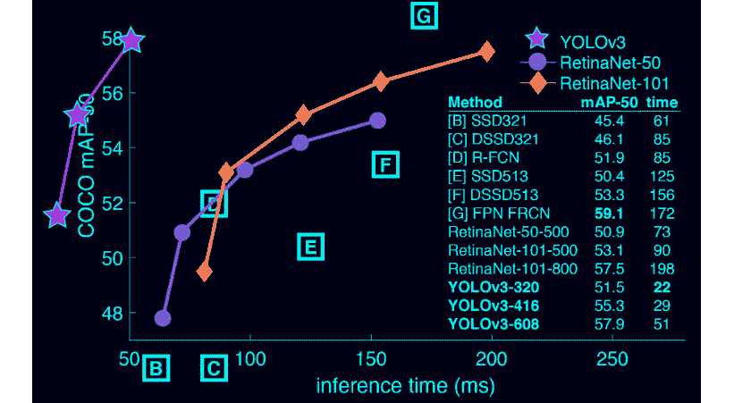

###### 图 9.1:物体探测系统的比较

在上图中， **y** 轴代表**图**(平均精度)，而 **x** 轴代表以毫秒为单位的时间。所以，你可以看到 YOLO 比其他系统在更短的时间内获得了更高的地图。

理解 YOLO 是如何运作的也很重要。它使用一个神经网络，该网络应用于整个图像并将它分成不同的部分，预测边界框。这些边界框类似于划分某些对象的矩形，这些对象将在稍后的过程中被识别。YOLO 速度很快，因为它能够仅通过对神经网络的评估来进行预测，而其他识别系统需要多次评估。

提到的网络具有 53 个卷积层，交替 3×3 和 1×1 层。这是从一位 YOLO 作者的论文中摘录的建筑图片([https://pjreddie.com/media/files/papers/YOLOv3.pdf](https://pjreddie.com/media/files/papers/YOLOv3.pdf))。

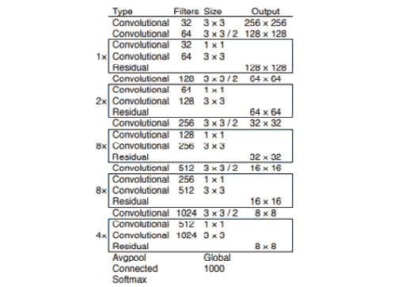

###### 图 9.2:YOLO 架构

### 使用 YOLO 进行影像分类的第一步

在这一节中，我们将对 YOLO 进行第一次预测。您需要完成基本安装。让我们开始识别单一图像中的对象:

1.  为了避免训练过程，我们将使用预训练模型，因此第一步是在暗网目录中下载网络权重:

    ```
    cd <darknet_path> wget https://pjreddie.com/media/files/yolov3.weights
    ```

2.  之后，我们将和 YOLO 一起做预测。在第一个例子中，我们试图识别一个物体，一只狗。这是我们正在使用的示例图像:

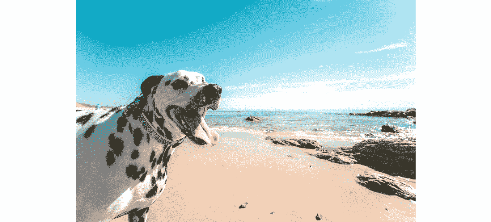

###### 图 9.3:要预测的样本图像

在 Darknet 目录下将该图像保存为. jpg 文件，并在其上运行 YOLO:

```
./darknet detect cfg/yolov3.cfg yolov3.weights dog.jpg
```

执行完成后，您应该会看到如下所示的输出:


###### 图 9.4:预测的输出

如你所见，YOLO 100%准确地检测到图像中有一只狗。它还生成一个名为`predictions.jpg`的新文件，在这里可以看到狗在图像中的位置。您可以从 Darknet 目录中打开它:

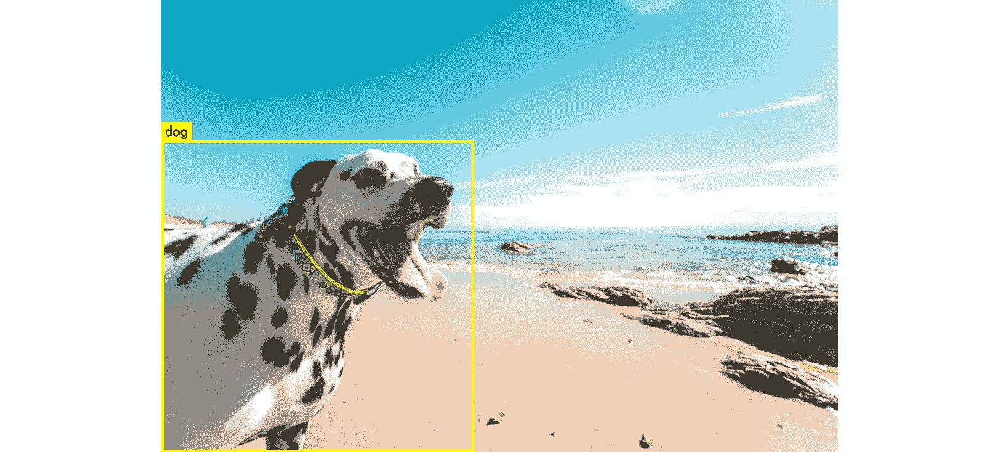

###### 图 9.5:图像中可识别的对象

使用 YOLO 的另一种可能性是通过一次执行对几幅图像进行预测。为此，您必须输入与之前相同的命令，但这次不要输入图像路径:

```
./darknet detect cfg/yolov3.cfg yolov3.weights
```

在这种情况下，您将看到以下输出:


###### 图 9.6:预测命令输出

如你所见，它要求你输入一幅图像。例如，你可以通过输入`dog.jpg`输入与之前相同的图像。然后会要求您输入另一个图像路径。这样，你可以对所有你想要的图像进行预测。这可能是一个例子:


###### 图 9.7:图像预测后的输出

如果这样做，您将获得以下图像:

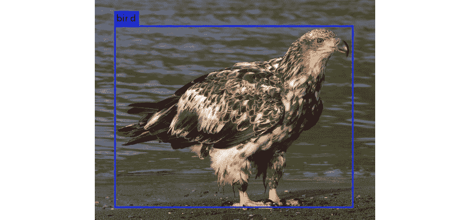

###### 图 9.8:图像预测

在使用 YOLO 时，还有一个有趣的命令需要知道。它可用于修改检测阈值。

#### 注意

检测阈值是预测不正确时要考虑的准确度限制。例如，如果将阈值设置为 0.75，则以较低精度检测到的对象将不会被视为正确的预测。

默认情况下，当预测精度为 0.25 或更高时，YOLO 会在其输出中包含一个对象。您可以使用以下命令的最后一个标志来更改阈值:

```
./darknet detect cfg/yolov3.cfg yolov3.weights dog2.jpg -thresh 0.5
```

如您所想，前面的命令将阈值设置为 0.5。让我们来看一个实际的例子。按照以下步骤测试阈值修改的功能:

1.  对图像进行预测，直到找到一个对象预测准确率低于 100%的图像。我们将以此为例，其中狗的识别准确率为 60%: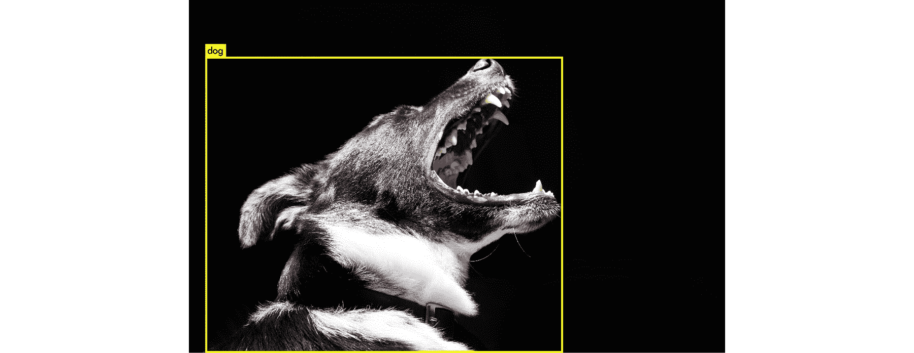

    ###### 图 9.9:准确率低于 100%的示例图像

2.  现在，使用`predict`命令修改检测阈值。由于狗以 60%的准确度被检测到，如果我们将阈值改变为 70%，则不会检测到任何物体:

    ```
    ./darknet detect cfg/yolov3.cfg yolov3.weights dog2.jpg -thresh 0.7
    ```

3.  如果我们检查`predictions`文件，我们可以确认没有检测到狗。因此，您可以看到阈值在识别中也起着重要的作用:

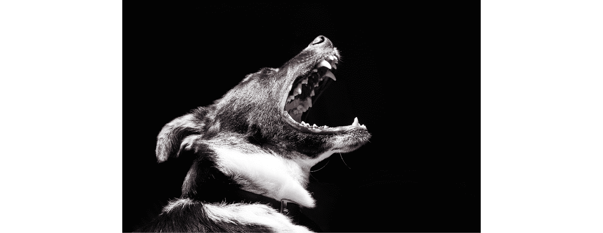

###### 图 9.10:修改阈值后的最终预测

### 网络摄像头上的 YOLO

一旦你用 YOLO 做了第一次预测，是时候尝试这个系统更有趣的功能了。通过将 YOLO 连接到您的个人网络摄像头，您将检测到您自己的真实物体。为此，您必须完成高级安装，因为它需要 GPU 和 OpenCV:

1.  确保您的网络摄像头已连接，并且可以被您的系统检测到。
2.  在 Darknet 目录中输入以下命令:

    ```
    ./darknet detector demo cfg/coco.data cfg/yolov3.cfg yolov3.weights
    ```

3.  试着识别你周围的物体；例如，我们检测到书架上的书籍:

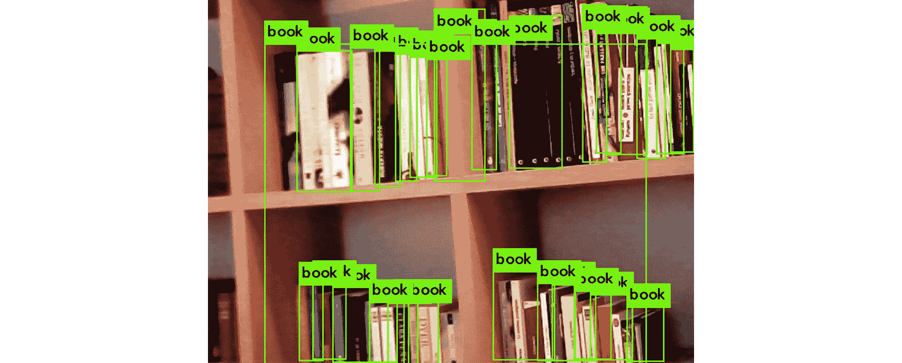

###### 图 9.11:使用网络摄像头识别书籍

### 练习 28:用 YOLO 编程

在本练习中，我们将了解如何使用 Python 对 YOLO 进行预测。我们将创建一个数据集，并检查数据集中有多少包含某个对象的图像。要构建数据集，请检查以下图像:

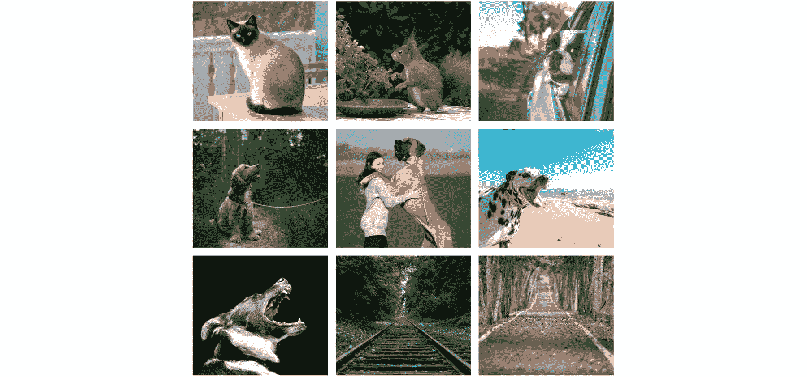

###### 图 9.12:数据集中包含的图像

如你所见，这是一个非常简单的数据集，包含动物和风景图片。您将要实现的 Python 程序将必须获得出现狗的图像的数量。

我们将从从 GitHub 克隆 Darknet 文件开始:

```
git clone https://github.com/pjreddie/darknet
cd darknet
make
```

1.  在 Darknet 目录下创建一个名为`dataset`的新文件夹。
2.  Place these images or others of your choice inside the new folder.

    #### 注意

    这些图片可以在 GitHub 的第 9 章/练习 28/数据集/文件夹中找到

    URL:[https://github . com/packt publishing/Artificial-Vision-and-Language-Processing-for-Robotics/tree/master/lesson 09/exercise 28/dataset](https://github.com/PacktPublishing/Artificial-Vision-and-Language-Processing-for-Robotics/tree/master/Lesson09/Exercise28/dataset)

3.  Create a Python file, `excercise1.py`, and start the implementation.

    导入 Python 本身和所需的库:

    ```
    #!usr/bin/env python
    import sys, os
    ```

4.  告诉系统在哪里可以找到 Darknet 框架，然后导入。如果你已经在 Darknet 目录下创建了一个文件，你可以这样做:

    #### 注意

    
5.  告诉 Darknet 程序执行用哪个 GPU:

    #### 注

    ```
    dn.set_gpu(0)
    ```

6.  Configure the network you are going to use for making your predictions. In this case, we are using the same configuration as before:

    ```
    net = dn.load_net("cfg/yolov3.cfg", "yolov3.weights", 0)
    meta = dn.load_meta("cfg/coco.data")
    ```

    #### 注意

    请注意此处输入的路径；如果您的 Python 文件不在 Darknet 的文件夹中，它们可能会改变。

7.  声明变量以统计图像总数和包含狗的图像数:

    ```
    dog_images = 0 number_of_images = 0
    ```

8.  实现一个循环来遍历数据集中的文件:

    ```
    for file in os.listdir("dataset/"):
    ```

9.  使用 Darknet 的`detect`方法识别每幅图像的物体:

    ```
        filename = "dataset/" + file     r = dn.detect(net, meta, filename)
    ```

10.  迭代已识别的对象，检查其中是否有狗。如果是，则在狗图像计数器中加一，并停止检查其余的对象。总计数器也加一:

    #### 注

    ```
        for obj in r:         if obj[0] == "dog":             dog_images += 1             break     number_of_images += 1
    ```

11.  Finally, print the obtained results. For example:

    ```
    print("There are " + str(dog_images) + "/" + str(number_of_images) + " images containing dogs")
    ```

    #### 注意

    ```
    cd ..
     wget https://pjreddie.com/media/files/yolov3.weights
    python exercise28.py
    ```

    #### 注意

    这里,`cd ..`命令切换到文件所在的目录，下载权重并运行脚本。

    例如`cd <your_script_location>`

您可以通过运行脚本来测试它是否按预期工作。如果使用建议的数据集，输出应该如下所示:

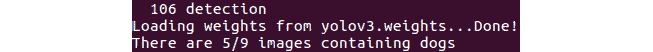

###### 图 9.13:练习 28 的最终输出

### 活性氧整合

现在，你已经学会了如何在一个普通的 Python 程序中使用 YOLO。现在是时候看看如何将它与机器人操作系统(ROS)集成，以便您可以在真实的机器人问题中使用它。你可以将它与任何机器人摄像头结合起来，让机器人检测和识别物体，达到人工视觉的目的。完成下面的练习后，你就能自己做了。

### 练习 29:活性氧和 YOLO 的整合

这个练习包括一个新的 ROS 节点实现，它使用 YOLO 来识别对象。我们将使用 TurtleBot 测试它，这是我们在*第 6 章机器人操作系统(ROS)* 中使用的 ROS 模拟器，但它将很容易适应任何带摄像头的机器人。这些是必须遵循的步骤:

1.  在您的柳絮工作区中创建一个新的包来包含集成节点。用这个命令包含正确的依赖项:

    ```
    cd ~/catkin_ws/ source devel/setup.bash roscore cd src catkin_create_pkg exercise29 rospy cv_bridge geometry_msgs image_transport sensor_msgs std_msgs
    ```

2.  切换到包文件夹并创建一个新的`scripts`目录。然后，创建 Python 文件并使其可执行:

    ```
    cd exercise29 mkdir scripts cd scripts touch exercise29.py chmod +x exercise29.py
    ```

3.  Begin with the implementation.

    导入将用于节点实现的库。您将需要`sys`和`os`从其路径导入 Darknet，`OpenCV`处理图像，以及`sensor_msgs`中的`Image`发布图像:

    ```
    import sys
    import os
    from cv_bridge import CvBridge, CvBridgeError
    from sensor_msgs.msg import Image
    ```

    告诉系统在哪里可以找到暗网:

    ```
    sys.path.append(os.path.join(os.getcwd(), '/home/alvaro/Escritorio/tfg/darknet/python/'))
    ```

    #### 注意

    ```
    import darknet as dn
    ```

    创建将在其中编码节点逻辑的类及其构造函数:

    ```
    class Exercise29():
        def __init__(self):
    ```

    编写构造函数代码:

    现在，我们将初始化节点:

    ```
            rospy.init_node('Exercise29', anonymous=True)
    ```

    创建桥对象:

    ```
            self.bridge = CvBridge()
    ```

    订阅相机专题:

    ```
            self.image_sub = rospy.Subscriber("camera/rgb/image_raw", Image, self.imageCallback)
    ```

    创建变量来存储获得的图像:

    ```
            self.imageToProcess = None
    ```

    为 YOLO 配置定义相应的路径:

    ```
            cfgPath =  "/home/alvaro/Escritorio/tfg/darknet/cfg/yolov3.cfg"
            weightsPath = "/home/alvaro/Escritorio/tfg/darknet/yolov3.weights"
            dataPath = "/home/alvaro/Escritorio/tfg/darknet/cfg/coco2.data"
    ```

    #### 注意

    ```
            self.net = dn.load_net(cfgPath, weightsPath, 0)
            self.meta = dn.load_meta(dataPath)
    ```

    定义将用于存储图像的名称:

    ```
            self.fileName = 'predict.jpg'
    ```

    实现回调函数以获取 OpenCV 格式的图像:

    ```
        def imageCallback(self, data):
            self.imageToProcess = self.bridge.imgmsg_to_cv2(data, "bgr8")
    ```

    创建一个对获得的图像进行预测的函数。该节点必须一直进行预测，直到用户停止执行。这将通过将图像存储到磁盘并使用检测功能对其进行预测来实现。最后，结果将被不断地打印出来:

    ```
        def run(self):
            while not rospy.core.is_shutdown():
                if(self.imageToProcess is not None):
                    cv2.imwrite(self.fileName, self.imageToProcess)
                    r = dn.detect(self.net, self.meta, self.fileName)
                    print r
    ```

    实现主程序入口。在这里，您必须初始化 Darknet，创建一个已创建类的实例，并调用它的 main 方法:

    ```
    if __name__ == '__main__':
        dn.set_gpu(0)
        node = Exercise29()
        try:
            node.run()
        except rospy.ROSInterruptException:
            pass
    ```

4.  Test whether the node works as it should.

    打开终端并启动 ROS:

    ```
    cd ../../
    cd ..
    source devel/setup.bash
    roscore
    ```

    打开另一个终端，用 TurtleBot 运行 Gazebo:

    ```
    cd ~/catkin_ws
    source devel/setup.bash
    roslaunch turtlebot_gazebo turtlebot_world.launch
    ```

    插入 YOLO 可识别的物体，让 TurtleBot **看着**它们。点击左上角的**插入**按钮可以插入新对象。例如，您可以插入一个碗:

    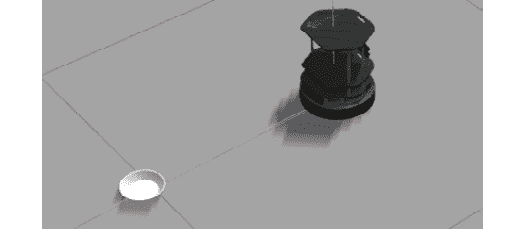

    ###### 图 9.14:露台中插入的碗

5.  Open a new terminal and run the created node:

    ```
    cd ~/catkin_ws
    source devel/setup.bash
    rosrun exercise29 exercise29.py
    ```

    如果您使用的是碗，请检查您得到的输出如下所示:

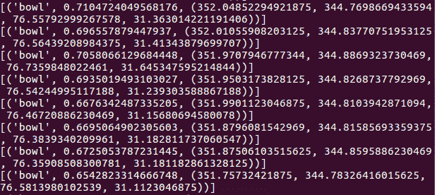

###### 图 9.15:节点预测的对象

### 活动 9:机器人保安

让我们假设一个类似于*第 6 章，活动 6，模拟器和传感器*活动中的场景:你为一家机器人公司工作，该公司最近获得了一个新客户，一个购物中心。客户希望贵公司为购物中心提供一些机器人，以避免夜间抢劫。这些机器人必须认为任何人都是小偷，如果它们发现了小偷，就会提醒顾客。

使用 Gazebo 为 TurtleBot 或任何其他模拟器提供所需的功能。您应该遵循以下步骤:

1.  创建一个用于存储所需节点的柳絮包。
2.  现在，实现第一个节点。它应该从机器人摄像头获取图像，并在其上运行 YOLO。
3.  接下来，它应该以字符串格式发布检测到的对象列表。
4.  实现第二个节点。它应该订阅发布检测到的对象的主题并获取它们。最后，它应该检查一个人是否是这些对象中的一个，如果是，则打印一条警告消息。
5.  Run both nodes simultaneously.

    #### 注意

    虽然这不是本活动的主要目标，但将这些节点的执行与另一个节点的执行相结合来移动机器人会很有趣(您可以使用在*第 6 章，机器人操作系统(ROS)* 中实现的那个)。

    这项活动的解决方案可以在第 330 页找到。

## 总结

我们现在已经实现了本书的目标，并为机器人构建了一个端到端的应用程序。这只是一个应用实例；然而，您可以使用在本书中学到的技术来构建机器人的其他应用程序。在本章中，您还学习了如何安装和使用 Darknet 和 YOLO。你通过使用人工智能评估物体，并集成 YOLO 和 ROS，使你的虚拟机器人能够预测物体。

你已经学会了如何用自然语言处理命令控制机器人，同时学习了本书中的各种模型，如 Word2Vec、手套嵌入技术和非数字数据。在此之后，您与 ROS 合作，构建了一个对话代理来管理您的虚拟机器人。您开发了构建功能性应用程序所需的技能，该应用程序可以与 ROS 集成，以提取关于您的环境的有用信息。你使用的工具不仅对机器人有用；你也可以使用人工视觉和语言处理。

我们以鼓励你开始你自己的机器人项目和用你在书中最喜欢的技术实践来结束这本书。您现在可以比较用于与机器人一起工作的不同方法，并探索计算机视觉、算法和限制。永远记住，机器人是一台可以拥有你想要它拥有的行为的机器。