# 四、建立并训练一个前馈神经网络

在 [*第三章*](B16391_03_Final_PG_ePUB.xhtml#_idTextAnchor073) 、*神经网络入门*中，你学习了神经网络和深度学习背后的基础理论。本章将这些知识付诸实践。我们将实现两个非常简单的分类示例:使用 **iris flower** 数据集的多类分类，以及使用成人数据集的二元分类，也称为**人口普查收入**数据集。

这两个数据集非常小，相应的分类解决方案也非常简单。在这两个例子中，完全连接的前馈网络就足够了。然而，我们决定在这里将它们作为玩具示例来展示，以描述构建、训练和应用具有 **KNIME 分析平台**和 **KNIME Keras 集成**的全连接前馈分类网络所需的所有步骤。

这些步骤包括常用的预处理技术、神经结构的设计、激活函数的设置、网络的训练和应用，以及最后的结果评估。

因此，本章涵盖以下主要主题:

*   准备数据
*   构建前馈神经架构
*   训练网络
*   测试和应用网络

# 准备数据

在 [*第 3 章*](B16391_03_Final_PG_ePUB.xhtml#_idTextAnchor073) 、*神经网络入门*中，我们介绍了反向传播算法，梯度下降算法使用它来训练神经网络。这些算法处理数字，无法处理名义/分类输入要素或类值。因此，如果我们希望网络使用标称输入特征或标称输出值，则必须将其编码为数值。在这一节中，我们将展示几种数字编码技术以及在 KNIME Analytics 平台中实现它们的相应节点。

除此之外，我们还将经历许多其他经典的数据预处理步骤，以提供机器学习算法:从原始数据集创建训练、验证和测试集；正常化；和缺失值插补。

在这个过程中，我们还将向您展示如何导入数据，如何执行一些额外的数据操作，以及 KNIME Analytics 平台中一些常用的技巧。本章中描述的工作流可在 KNIME Hub 上获得:[https://Hub . KNIME . com/kath rin/spaces/Codeless % 20 deep % 20 learning % 20 with % 20 KNIME/latest/Chapter % 204/](https://hub.knime.com/kathrin/spaces/Codeless%20Deep%20Learning%20with%20KNIME/latest/Chapter%204/)。

## 数据集和分类示例

在我们进入不同的预处理步骤之前，让我们快速浏览一下两个选择的数据集和相关的分类示例:

*   基于虹膜数据集的三种鸢尾花的分类
*   基于成人数据集数据的收入分类(二元类)

我们的第一个数据集给了我们一个多类分类问题的例子。

鸢尾数据集由三种鸢尾植物的花的例子组成:鸢尾-刚毛鸢尾、鸢尾-海滨鸢尾和鸢尾-杂色鸢尾。每一朵花通过四种方法来描述:萼片长度(厘米)，萼片宽度(厘米)，花瓣长度(厘米)，花瓣宽度(厘米)。这是一个小数据集，每个物种有 50 个样本，总共有 150 个样本。*图 4.1* 显示了数据集的概况。

目标是训练一个具有一个隐藏层(八个单元和 ReLU 激活函数)的神经网络，以基于四个输入特征区分三个物种。

Iris 数据集的一部分显示在以下表格中:

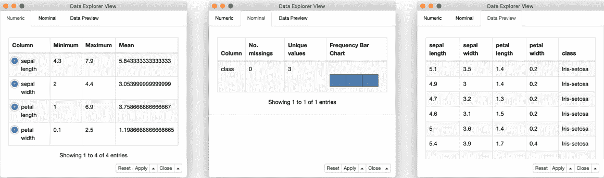

图 4.1–Iris 数据集概述，此处用于实现多类分类

第二个示例数据集为我们提供了一个二元分类问题。

成人数据集由 32561 名居住在美国的人组成。每个记录通过 14 个人口统计特征描述一个人，包括他们当前的年收入(> 50K/ < = 50K)。*图 4.2* 显示了数据集中特征的概述:数字特征，如年龄和每周工作时间，以及名义特征，如工作类别和婚姻状况。

目标是训练一个神经网络，使用所有其他属性作为输入特征，预测一个人的年收入是高于还是低于 5 万美元。我们要用的网络应该有两个隐藏层，每个隐藏层有八个单元和 ReLU 激活函数。

表格中显示的一些人口普查收入数据集如下:

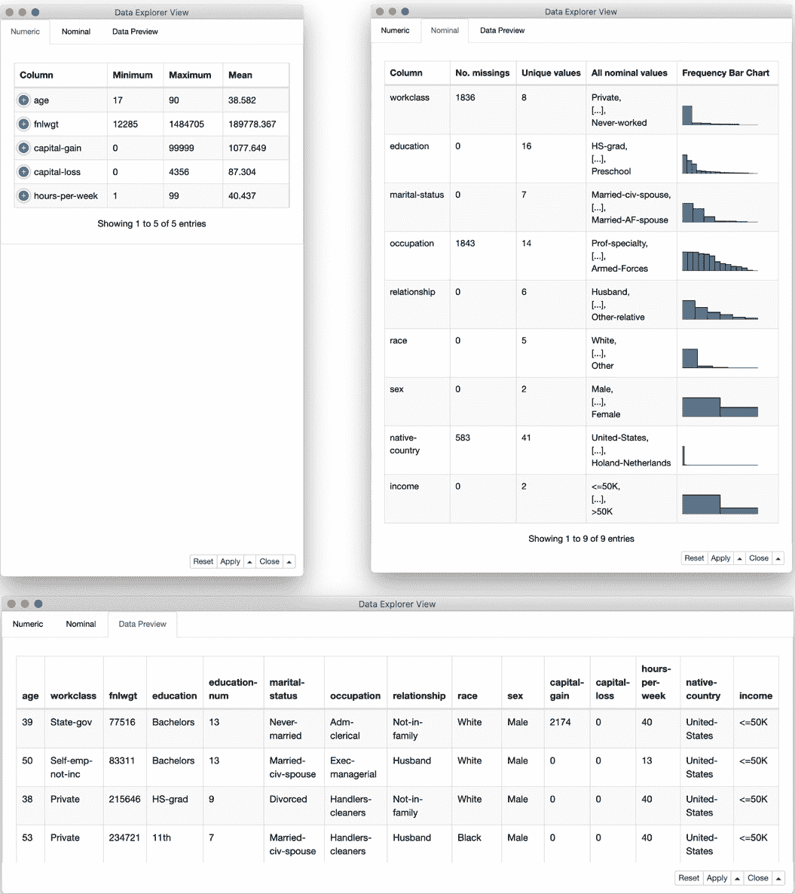

图 4.2-成人数据集概述，此处用于实现二元类分类

小费

为了获得数据集的概览，您可以使用**数据浏览器**节点。此节点在交互式视图中显示输入数据的一些统计度量。在*图 4.1* 和*图 4.2* 中，您可以看到两个示例数据集的节点视图。

总结一下虹膜数据集，它由四个数值特征，加上虹膜名义类组成；成人数据集由 14 个数字和名义混合特征组成。因此，数据准备的第一步是将所有名义特征转换成数字特征。那么，让我们继续讨论编码技术。

## 标称特征的编码

名义特征，有时也称为分类特征，只能采用字符串类型的值。例如，描述头发颜色的特征的唯一可能值可以是字符串类型，例如`black`、`brown`、`blond`和`red`；描述性别的特征传统上只假设两个字符串类型的值，`female`和`male`；教育特征的可能值可以是字符串，例如`Doctorate`、`Masters`、`Bachelors`或`Some-college`。最后一个例子取自成人数据集中名为`education`的列。这些值应该在输入神经网络之前转换成数字。

有两种常见的方法来编码标称特征:

*   **整数编码**
*   **一键编码**

整数编码将一个整数值分配给特征的每个可能标称值。例如，`"black"`可以是 1，`"brown"`可以是 2，`"blond"`可以是 3，`"red"`可以是 4。我们选择了数字 1、2、3 和 4，但它也可以是任何其他数字组。这种方法在不同的值之间引入了一种人为的关系——例如，`"black"`比`"red"`更接近于`"brown"`。这可以反映序数或等级特征中的值之间的真实关系，例如教育，其中`"Doctorate"`比`"Some-college"`更接近于`"Masters"`。但是，在其他情况下，例如前面提到的头发颜色，它引入了一个新的附加关系，该关系不能反映现实，并且会在学习过程中使模型产生偏差。一般来说，在名义上无序的特性上使用整数编码方法会导致性能更差的模型。

一键矢量编码通过用矢量表示每个特征克服了这个问题，其中所有矢量之间的距离总是相同的。向量由与原始特征中的可能值相同数量的二进制分量组成。然后，每个组件与其中一个值相关联，并被设置为该值的`1`；其他组件保持设置为`0`。在发色示例中，`"black"`变成了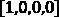，`"brown"`变成了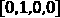，`"blond"`变成了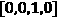，`"red"`变成了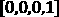。

重要说明

独热向量是一个只有一个`1`且所有其他值都是`0`的向量。它可以用来对不同的类进行编码，而无需在它们之间添加任何人为的距离。

现在让我们看看如何用 KNIME 节点实现这些编码。

### KNIME 分析平台中的整数编码

要执行整数编码，可以使用**类别对**节点进行编号。该节点有一个数据输入端口(在下图中用黑色三角形表示)和两个输出端口:

*   带有整数编码数据的数据输出端口(黑色三角形)
*   带有映射规则的 PMML 模型输出端口(蓝色方块)

*图 4.3* 显示了该节点及其配置窗口:

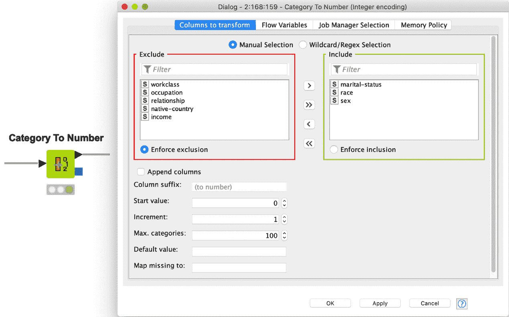

图 4.3–分类到编号节点对选定的列执行整数编码

在配置窗口的上部，您可以选择要应用整数编码的字符串类型输入列。**包含**框架中的列将被转换，而**不包含**框架中的列将保持不变。您可以使用框架之间的按钮将列从一个框架移动到另一个框架。

默认情况下，原始列中的值被替换为整数编码的值。然而，**追加列**复选框为整数编码的值创建了额外的列，以便不覆盖原来的列。如果激活此复选框，您还可以为新列标题定义自定义后缀。

在配置窗口的下半部分，您可以定义编码规则:起始值、增量、允许的最大类别数以及所有缺失值的整数值。

默认整数值被传递到输出 PMML 变换模型。 **PMML** 代表**预测模型标记语言**，是一种在不同应用之间描述和交换预测模型的方式。蓝色正方形输出端口处的 PMML 模型包含在该节点中构建的映射函数，并将应用于其他数据集。应用此整数编码 PMML 模型时，默认值被分配给当前映射未表示的所有输入值(如果有)。如果没有默认值，将使用一个缺失值。

小费

要将存储在 PMML 输出端口中的相同整数编码映射应用到另一个数据集，您可以使用**类别来编号(应用)**节点。

**类别到编号**节点自动定义映射。这意味着您不能手动定义哪个标称值应该由哪个整数值表示。如果你想这样做，你可以在 KNIME 分析平台中选择其他选项，我们将介绍其中的两个:单元格替换器节点和规则引擎节点。

**单元格替换器**节点根据字典表替换一列中的单元格值。它有两个输入:

*   具有要替换其值的目标列的表的顶部输入
*   字典表的下部输入

*图 4.4* 显示了 Cell Repla cer 节点的配置窗口:

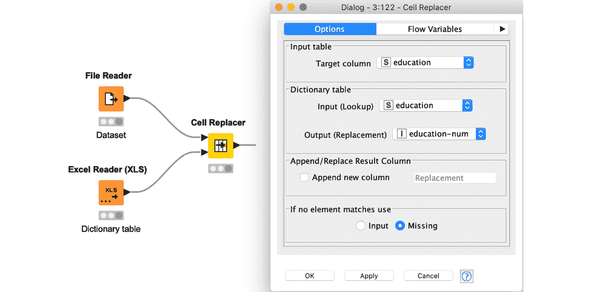

图 4.4–单元格替换器节点基于字典实现编码映射

在配置窗口的上部，可以从顶部输入端口的输入表中选择目标列；这意味着要根据字典值替换其值的列。

在配置窗口的**字典表**部分，您可以从下方输入端口的数据表中选择具有查找值的列——即**输入(查找)**列——和包含替换值的列——即**输出(替换)**列。

目标列(第一个输入)中匹配查找值的任何匹配项都将被相应的替换值替换。结果存储在输出列中，该列或者被添加到表中，或者替换原来的目标列。

缺失值被视为普通值；也就是说，它们作为查找值和替换值都是有效值。如果字典表的查找列中有重复项，则最后一个匹配项(最低行)定义替换对。

对于整数编码示例，您需要一个字典表来映射标称值和整数值。例如，每个教育水平应该映射到一个相应的整数值。然后，您可以将原始数据集输入到顶部输入端口，并将该地图/字典表输入到最低输入端口。

小费

**表创建者**节点可以帮助手动创建查找表。

如果您没有字典表并且不想创建一个，您可以使用**规则引擎**节点。

规则引擎节点根据一组手动定义的规则转换输入列中的值，这些规则在其配置窗口中定义。

*图 4.5* 显示了 Rul e 引擎节点的配置窗口:

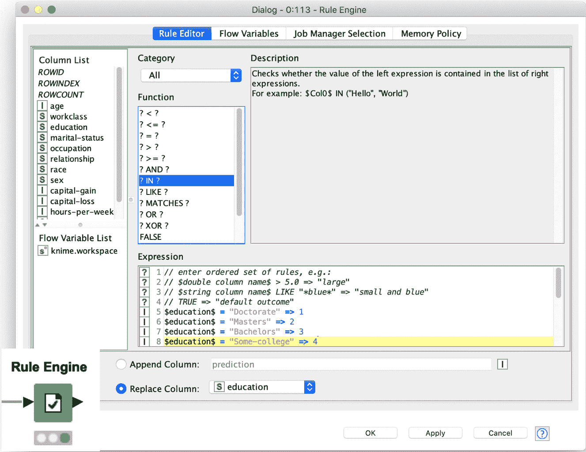

图 4.5–规则引擎节点根据用户定义的规则实现整数编码

在中的`=>`，以`"antecedent => consequence"`的形式出现。结果将被插入到新列中，或者替换选定列中的值。对于输入表中的每个数据行，规则匹配过程从顶部规则向底部规则移动:第一个匹配规则确定结果，然后规则过程停止。收集所有剩余数据行的最后一个默认条件被表示为`"TRUE => consequence"`。

规则的结果可能是一个字符串(在`"`或`/`符号之间)、一个数字、一个布尔常量或对另一列的引用。如果没有匹配的规则，则结果是缺少值。对其他列的引用由`$`之间的列名表示。您可以手动或双击配置窗口左侧**列列表**中的列来插入列引用。

除了**表达式**面板，您还可以找到**功能**、**列列表**和**流变量列表**面板。**功能**面板列出所有功能，**列列表**面板列出所有输入列，**流量变量列表**包含所有可用的流量变量。双击它们中的任何一个，用正确的语法将它们添加到**表达式**窗口中。此外，选择任何功能都会显示说明和示例。

综上所述，KNIME Analytics 平台有多种方式实现整数编码。我们引入了三个选项:

*   如果您不想手动定义映射，那么**类别到编号**节点提供了一种自动、简单的方法。
*   如果手头有一个查找表，那么**单元格替换器**节点非常有用。
*   如果您想通过一组规则手动定义标称值和整数值之间的映射，则**规则引擎**节点非常有用。

接下来，让我们看看 KNIME 分析平台中的一键编码。

### KNIME 分析平台中的一键编码

为了对名义特征执行一键编码，有**一对多**节点。这个节点获取一列中可用的标称值的列表，构建一个具有尽可能多的分量的向量，并产生每个值的一键编码:一个值变成许多二进制单元，因此得名。

在“配置”窗口中，您可以选择要对其执行一键编码的字符串类型列。对于每一列，由于有不同的值，将创建尽可能多的新列。每个新列的标题将是名义列中的原始值，其单元格取值为`0`或`1`，这取决于原始列中是否存在标题值。

*图 4.6* 显示了节点的配置 w 窗口:

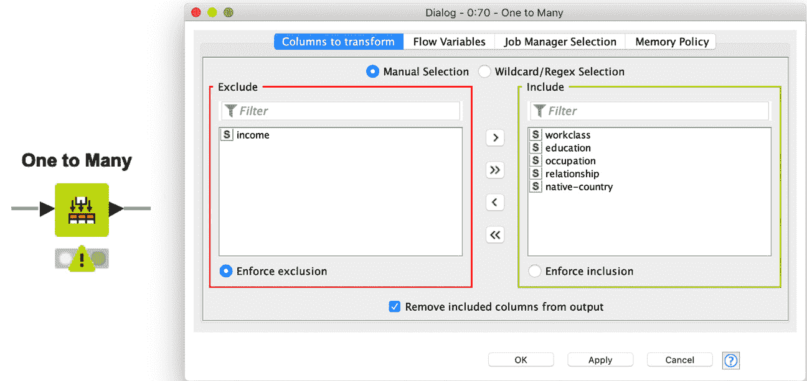

图 4.6–一对多节点实现名义特征的一键编码

创建独热编码向量导致非常大的和非常稀疏的数据表，其中有许多零。这可能会影响执行期间的工作流性能。Keras 学习者节点接受大而稀疏的单热编码数据表。然而，它还提供了一个非常好的可选特性，避免了用一次性编码的向量显式创建数据表的整个步骤。它可以从原始列的整数编码版本内部创建一个热编码向量。这样，数据的独热编码表示保持隐藏在 **Keras 网络学习器**节点中，并且从不在节点间传递。在这种情况下，每个整数编码单元的值必须作为集合类型单元呈现给 Keras 网络学习者节点。要创建集合类型单元格，可以使用**创建集合列**节点。在本章的*训练网络*一节中，您将看到如何正确配置 Keras 网络学习器节点以利用该功能。

*图 4.7* 显示了**创建收藏列**节点的配置窗口。在 **Exclude-Include** 框架中，您选择一个或多个列来聚集在集合类型列中。在 configuration 窗口的下半部分，您可以决定是否删除原来的列并定义新的 collection类型列的名称:

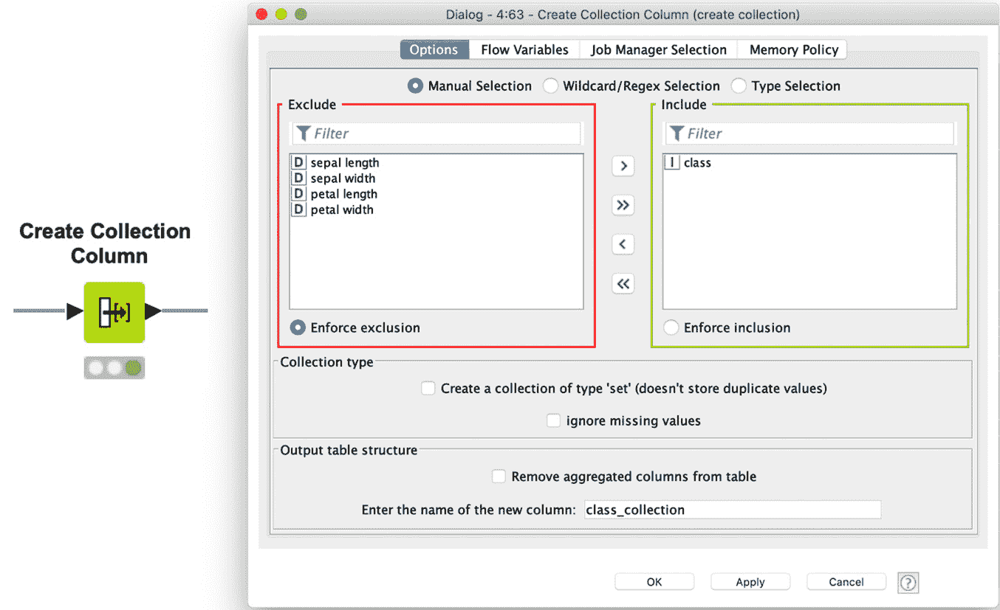

图 4.7–创建集合列节点将多个列中的值作为一个集合聚合到一个列中

注意，对于这种两步一热编码——首先是整数编码，然后是一热编码——您需要用上一节中列出的节点之一创建整数编码列，然后将 **Create Collection Column** 节点应用于一列:我们刚刚创建的整数编码列。

### 分类目标变量的编码

在上一章中，我们谈到了不同的激活函数和损失函数，它们可用于构建网络架构和训练网络来解决分类问题。当然，输出层中的激活函数和损失函数必须匹配。不仅如此，类编码还必须与选择的激活和丢失函数相匹配。这意味着不仅要对名义输入特征进行编码，还要对类值进行编码。如本节所述，同样的编码技术和节点也可以用于类编码。

二进制分类的常用方法是用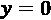和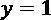对两个类别进行编码，然后训练网络来预测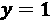类别的概率。在这种情况下,“类别到号码”节点或“规则引擎”节点都可以工作。

在多类问题的情况下，也有两个选项来编码类列:在上的**一对多**节点或者在创建集合列节点之后的分类到编号。

神经网络的另一个推荐预处理步骤是归一化。

## 正常化

大多数神经网络都是使用随机梯度下降的某种变体和反向传播算法来训练的，以计算梯度。具有不可比范围的输入特征会在学习过程中产生问题，因为具有最大范围的输入特征会超过权重更新的计算，甚至可能超过局部最小值。这可能会产生振荡并减缓学习过程的收敛。要加快学习阶段，建议提前将数据归一化；例如，通过使用 z 得分归一化，使每列中的值呈高斯分布，平均值为 0.0，标准偏差为 1.0。

在*图 4.8* 中，可以看到**规格化器**节点和其配置窗口，以及为**规格化器(应用)**节点:

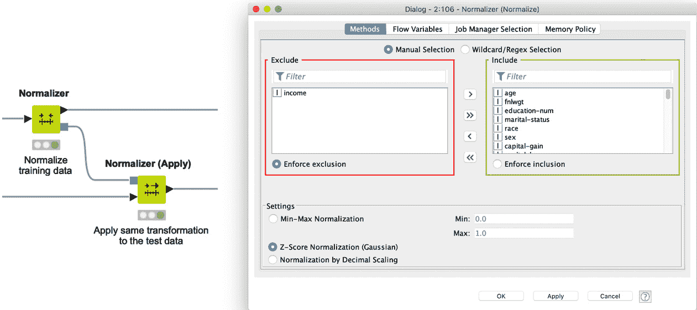

图 4.8–规格化器节点为选择的输入列创建一个规格化函数。规格化器(应用)节点将相同的规格化函数应用于另一个数据集

规范化器节点在选定的输入列上创建一个规范化函数，并对它们进行规范化。规格化器(应用)节点采用外部预定义的规格化函数，并将其应用于输入数据。应用这对节点的经典案例是在训练集和测试集上。规格化器节点规格化训练数据，规格化器(应用)节点将相同的规格化变换应用于测试数据。

规格化器节点有一个数据输入端口和两个输出端口:

*   一个带有标准化输入数据的数据输出端口
*   一个包含归一化参数的模型输出端口，可用于归一化器(应用)节点中的另一个数据集

在规格化器节点的配置窗口中，可以选择要规格化的数值列和规格化方法。

规格化器(应用)节点的配置窗口最小，因为所有必要的参数都包含在输入规格化模型中。

小费

使用分区节点，您可以在规范化数据之前创建训练和测试集*。*

## 其他有用的预处理节点

训练神经网络时，缺失值可能是一个问题，因为反向传播算法无法处理它们。表示 KNIME 数据表中缺失值的占位符值是一个红色问号。

用于估算缺失值的强大节点是**缺失值**节点。此节点允许您在多种插补方法中进行选择，例如平均值、固定值和最常见值等等。

*图 4.9* 显示了节点配置窗口的两个选项卡。在第一个选项卡**默认**选项卡中，您可以选择一种插补方法，应用于数据集中相同类型的所有列；除了在配置的第二个选项卡**列设置**选项卡中设置的列之外的所有列。在第二个选项卡中，您可以为每个单独的列定义插补方法 mn:

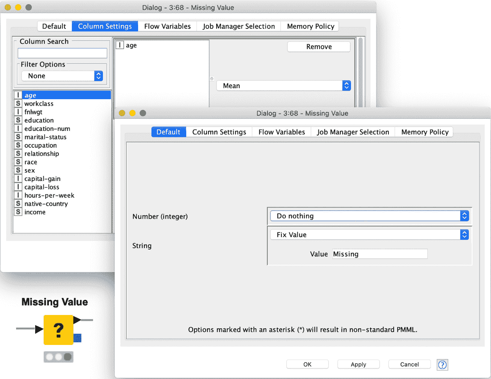

图 4.9–缺失值节点在缺失值的多种插补方法中进行选择

大多数神经网络都是在监督下训练的。因此，另一个必要的步骤是创建训练集和测试集，以及可选的验证集。要创建不同的不相交子集，您可以使用**分区**节点。

在*图 4.10* 中分区节点的配置窗口中，您可以设置第一个分区的大小，可以是绝对百分比，也可以是相对百分比。在此之下，您可以设置抽样技术来创建第一个子集，根据所选列中的类别，按照数据分布进行随机抽取(分层抽样)，每隔 *n* 个数据行进行线性抽取，或者从顶部开始按顺序抽取。顶部输出端口产生结果分区；较低的输出端口产生所有其他剩余的数据行:

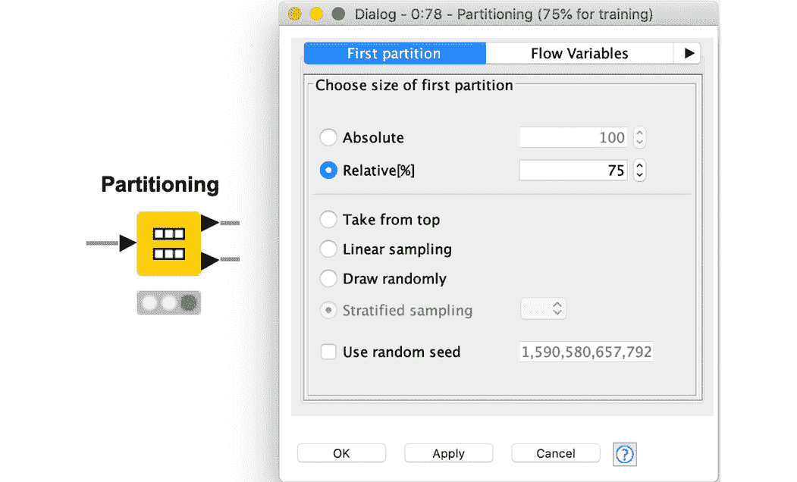

图 4.10–划分节点创建了两个不相交的子集

对于分类问题，推荐**分层抽样**方案。它确保所选列中类别的分布(大约)保留在两个分区中。对于时间序列分析，如果您的数据按日期升序排序，那么**从顶部取值**选项是更好的选择。时间上更早的样本将在一个分区中，而较新的样本在另一个分区中。

要创建额外的验证集，需要两个分区节点的序列。

我们已经讨论了分类特征的编码、数值特征的标准化、缺失值插补和数据集的划分。很可能这些不是为神经网络准备数据所需的唯一节点。

让我们通过在前面描述的两个示例数据集上实现数据准备部分，来看看数据准备在实践中是如何工作的。

## 虹膜数据集的数据准备

在*图 4.11* 中，您可以看到工作流的部分，专门用于为即将到来的神经网络访问和准备数据。

工作流程从使用**表读取器**节点读取 Iris 数据集开始。

小费

您可以在本章的数据文件夹中找到数据集。

由于数据集只有数字输入特征(花瓣和萼片测量)，因此不需要 e 编码:

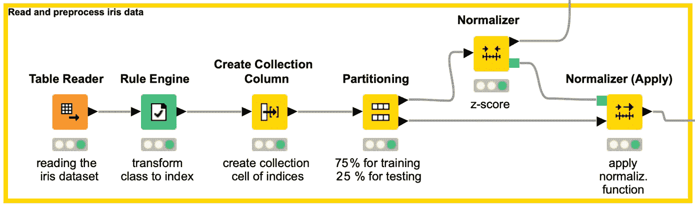

图 4.11–该工作流片段显示了 iris 数据集示例中数据的预处理

然而，目标变量包含三个不同的类别:每种花卉的名称。这个名义列中的类别需要通过某种编码技术转换成数字。为了避免引入不存在的关系，我们选择了一键编码。为了实现一键编码，我们选择了通过节点的整数编码和 Keras 学习器节点内的一键编码的组合。我们将在*训练网络*部分讨论 Keras 学习器节点内部的一键编码。这里，我们将重点关注集合类型列中 flower 类的整数编码的创建:

1.  为了将物种名称转换成索引，我们使用的`class`列。
2.  之后，我们通过一个`class`列传递来自规则引擎节点的结果，并在配置窗口中排除所有其他列。
3.  接下来，使用一个**分区**节点创建训练和测试集，使用 75%的数据进行训练，剩余的 25%用于测试。
4.  最后，使用 z 得分归一化对数据进行归一化。

虹膜数据集非常小，而且定义非常明确。只有几个节点(所需的最少节点)足以实现数据准备部分。

现在让我们看看在一个更复杂(但仍然很小)的数据集上发生了什么，比如成人数据集。

## 成人数据集上的数据准备

*图 4.12* 中的工作流是读取和预处理 ad ult 数据集的收入预测示例的一部分:

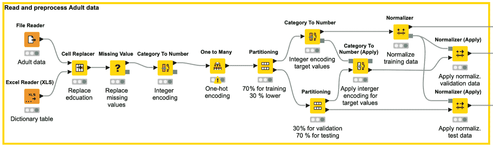

图 4.12–该工作流片段显示了成人数据集示例中的数据预处理

像虹膜数据集一样，您可以在本章的数据文件夹中找到工作流中使用的两个数据集:成人数据集和字典 Excel 表。在成人数据集中，教育水平以文本形式显示。字典 Excel 文件提供了教育水平和相应的标准整数代码之间的映射。我们可以使用这些整数代码作为教育输入特征的数字编码。

接下来，**单元替换器**节点用相应的代码替换所有教育级别。我们几乎不费吹灰之力就得到一种编码。

一些标称列缺少值。在`"Missing"`里面。

接下来，我们继续对除教育之外的所有其他名义特征进行编码。对于以下特性，使用了一个整数编码，由**类别实现，以对**节点进行编号:婚姻状况、种族和性别。我们可以在这里使用整数编码，因为这些特性要么是二进制的，要么只有几个类别。

对于剩余的名义特征——工作类别、职业、关系和本国——使用一键编码，由**一对多**节点实现。请记住，该节点为每个选定列中的每个值创建一个新列。因此，经过这种变换后，数据集有 82 个要素，而不是原来的 14 个。

接下来，使用两个`Income`类列的序列创建训练、验证和测试集。

最后，`Income`列在所有子集上都进行了整数编码，并且它们的所有数据都进行了规范化。

小费

为了隐藏复杂性并整理您的工作流，您可以创建**元节点**。元节点被描述为灰色节点，包含节点的子工作流。要创建一个元节点，选择想要隐藏的节点，点击右键，选择**创建元节点**。

我们的数据准备好了。让我们现在建立神经网络。

# 构建前馈神经架构

要使用 KNIME Keras 集成构建一个神经网络架构，您可以使用 Keras 层节点链。在**节点库**的 **Keras- > Layers** 文件夹中，可用于构建层的节点按类别分组，例如**高级激活**、**卷积**、**核心**、**嵌入**和**递归**等等。

显示在 **Keras- > Layers** 文件夹中的每一层都有一个专业。例如，**高级激活**中的层创建具有特定激活功能的单位的层；**卷积**中的层为卷积神经网络创建层；**核心**包含所有经典层，例如用于收集输入值的**输入**层和用于全连接前馈神经网络的**密集**层；诸如此类。

我们将在本书中一路探索这些层面。然而，在本章中，我们将把自己限制在全连接前馈神经网络所需的基本层。

任何网络的第一层都是接收输入值的层。让我们从 Keras 输入层节点开始。

## Keras 输入层节点

构建神经网络总是从定义网络的输入层开始。 **Keras 输入层**节点可以帮助你完成这个任务。事实上，该节点为网络构建所需的输入以接受输入值。

在*图 4.13* 的左侧，您可以看到 Keras 输入层节点，在右侧可以看到其配置窗口。如您所见，该节点没有输入端口，只有一个与目前遇到的节点形状和颜色不同的输出端口(红色方块):这是**Keras 网络端口**:

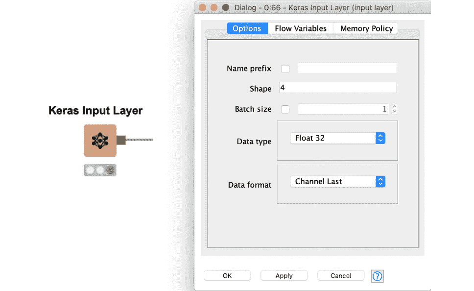

图 4.13–Keras 输入层节点定义了神经网络的输入层

小费

端口的颜色和形状表示哪些端口可以相互连接。大多数情况下，只能连接颜色和形状相同的端口，但也有例外。例如，您可以将一个灰色方块(Python DL 端口)与一个红色方块(Keras 端口)连接起来。

每个层节点都有一个配置窗口，带有该特定层所需的设置选项。与其他层节点相比，该节点具有简单的配置窗口，只有几个设置选项。

最重要的设定是**形状**。 **Shape** 允许你定义你的网络的输入形状，意味着你的输入层有多少神经元。请记住，输入层中神经元的数量必须与预处理输入列的数量相匹配。

虹膜数据集有四个我们将用作输入的特征:萼片长度、萼片宽度、花瓣长度和花瓣宽度。因此，这里的输入形状是 4。

此外，在 Keras 输入层节点的配置窗口中，可以设置以下内容:

*   一个**名称前缀**用于该层，以便以后更容易识别(可选)。
*   一个**批量**(可选)。记住，批量大小是培训的设置选项之一。推荐的方法是在学习者和执行者节点中定义批量大小。此外，您可以选择在这里定义它。如果定义了批次大小，则“学习者”和“执行者”节点中的“批次大小”选项不可用。
*   输入的**数据类型**和**数据格式**。

您的网络现在有了第一层，即输入层。现在，您可以通过创建下一层节点并将其连接到 Keras 输入层节点的输出来继续构建网络，例如， **Keras 密集层**节点。

小费

要创建一个节点并立即将其连接到现有节点，请在工作流编辑器中选择现有节点，然后双击节点存储库中的新节点。这将创建新节点，并将其自动连接到所选的现有节点。

## 喀拉斯密集层节点

**Keras 密集层**节点实现了前馈全连接网络中的经典层。这里要设置的参数是神经单元的数量和激活函数。

*图 4.14* 显示了该节点的配置窗口。设置选项分为两个选项卡:**选项**和**高级**。

**选项**选项卡包含最重要的设置，如神经元数量(也称为单位)和激活功能。

此外，**输入张量**设置定义了来自前一个节点的输入张量部分。在前馈网络中，输入张量是前一层的输出张量。然而，一些层节点——例如， **Keras LSTM 层**节点——创建的不仅仅是一个隐藏输出张量，而是多个。在这种情况下，必须在前一层节点产生的不同输入张量或隐藏状态中选择一个。像 Keras 密集层一样，Keras 输入层只产生一个输出向量，这是我们选择作为 Keras 密集层节点的输入张量。

在**高级**选项卡的上部，您可以选择如何随机初始化网络的权重和偏差；这意味着在学习过程的第一次迭代之前所有权重和偏差的起始值。

**高级**选项卡的下部允许您为该层中的权重添加规范正则化。范数正则化是一种避免过拟合的技术，我们在第 3 章 、*神经网络入门*中介绍过。在配置窗口中，可以选择是否将其应用于内核权重矩阵、偏移向量和/或层激活。激活相应的复选框后，您可以选择使用 L1 标准作为惩罚项，使用 L2 标准作为惩罚项，或者两者都使用。最后，您可以设置正则化参数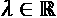的值，用于权重和偏移值的惩罚项和约束。

通过使用 **Keras 输入层**节点和多个 Keras 密集层节点，您可以为许多不同的任务构建一个前馈网络，例如对鸢尾花进行分类:

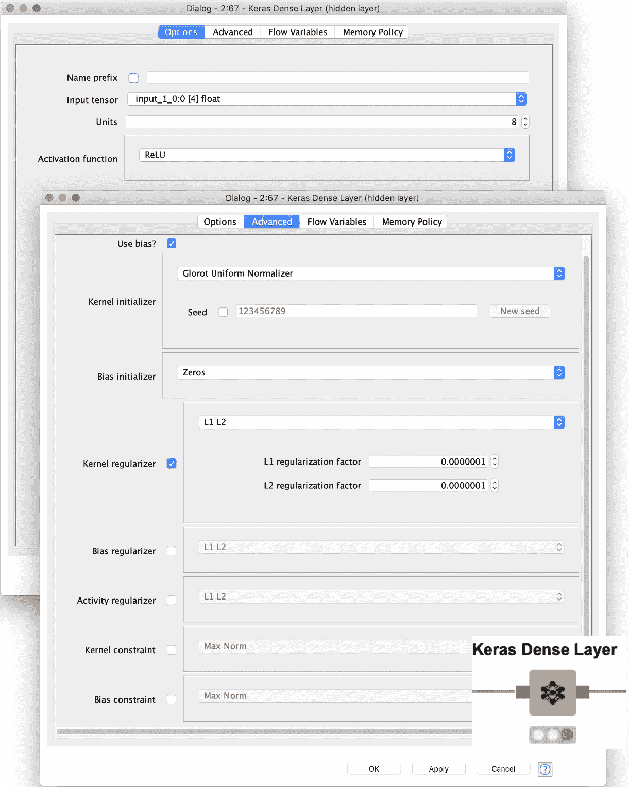

图 4.14–Keras 密集层节点允许您向神经网络添加完全连接的层，包括常用激活函数的选择

其他层节点的配置与这里针对密集层和输入层所描述的类似，您将在接下来的章节中了解更多相关信息。

因为本章中使用的两个基本例子都是指前馈网络，所以我们现在已经有了构建这两个前馈神经网络的所有必要部分。

## 构建鸢尾花分类的神经网络

对于使用 Iris 数据集的多类分类问题，目标是建立一个具有三层的全连接前馈神经网络:

*   一个输入图层包含四个单元，每个单元对应一个输入要素
*   一个具有八个单元和 ReLU 激活功能的隐藏层
*   一个包含三个单元的输出图层，每个单元对应一个输出类别，这意味着每个虹膜物种对应一个单元，具有 softmax 激活功能

我们在隐藏层中选择 ReLU 激活函数，因为它在隐藏层中使用时具有更好的性能，在输出层中选择 softmax 激活函数，因为它具有概率可解释性。来自 softmax 函数的具有最高输出的输出单元是具有最高分类概率的单元。

*图 4.15* 显示了用于 IRIs 分类问题的神经网络架构:

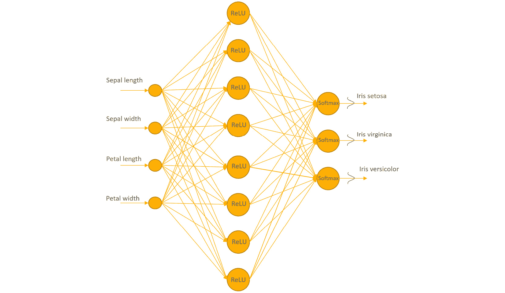

图 4.15–用于鸢尾花示例的前馈网络图

*图 4.16* 显示了工作流片段，其中三层节点构建网络及其配置窗口，包括单元数量和激活功能:

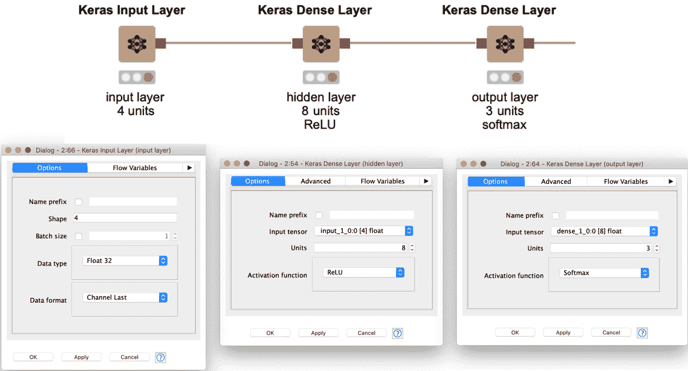

图 4.16–该工作流片段为 Iris 数据集示例构建了图 4.15 中的神经网络。它们下面的配置窗口显示了节点的配置

输入层有四个输入单元`Shape = 4`，用于的四个数字输入特征。第一个 Keras 密集层节点是隐藏层，有八个单元，使用 ReLU 激活函数。在输出层，softmax 激活函数与三个单元一起使用，每个类一个单元。

小费

在最后一层，名称前缀**输出**已经被使用。这使得识别**执行器**节点中的层变得更加容易，并且具有这样的优点:如果更多的 Keras 密集层节点被添加为隐藏层，层名称不会改变。

## 构建用于收入预测的神经网络

第二个提出的例子是一个二元分类问题:预测成人数据集中的收入(大于或小于每年 50K)。这里，我们采用了一个具有两个隐藏层的神经网络，总共有四层:

*   一个包含 81 个单元的输入图层，与输入要素一样多
*   一个具有六个单元和 ReLU 激活功能的隐藏层
*   多了一个隐藏层，有六个单元和 ReLU 激活功能
*   具有一个单元和 sigmoid 激活函数的一个输出层

输出层使用二进制分类问题的经典实现:一个具有 sigmoid 激活函数的单个单元。sigmoid 函数的范围从 0 到 1，它可以很容易地实现类属性，对一个类使用`0`，对另一个类使用`1`。因此，对于二进制分类问题，其中两个类别被编码为`0`和`1`，单独一个 sigmoid 函数可以产生编码为`1`的类别的概率。

*图 4.17* 向您展示了构建这个全连接前馈神经网络的工作流程片段:

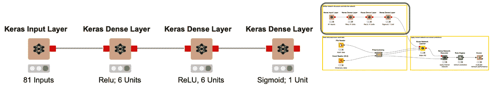

图 4.17–该工作流片段构建了完全连接的前馈神经网络，用作成人数据集示例的解决方案

预处理后，成人数据集最终有 82 列、81 个输入要素和目标列。所以输入层有`Shape = 81`。接下来，使用带有`Units = 6`和 ReLU 激活函数的两个 Keras 密集层节点构建两个隐藏层。输出层由一个 Keras 密集层节点组成，同样带有`Units = 1`和 sigmoid 激活函数。

在本节中，您已经学习了如何使用 KNIME Keras 集成节点构建前馈神经网络。下一步是设置网络训练所需的其他参数，例如损失函数，然后训练网络。

# 训练网络

我们已经准备好了数据和网络。本节的目标是向您展示如何使用训练集中的数据来训练网络。这需要损失函数的选择、训练参数的设置、训练集和验证集的规范以及训练进度的跟踪。

网络训练和所有这些训练设置的关键节点是 **Keras 网络学习者**节点。这是一个非常强大、非常灵活的节点，有许多可能的设置，分布在四个选项卡上:**输入数据**、**目标数据**、**选项**和**高级选项**。

Keras 网络学习节点有三个输入端口:

*   **顶口**:你要训练的神经网络
*   **中间端口**:训练集
*   **最低端口**:可选验证集

它有一个输出端口，输出训练好的网络。

此外，该节点有**学习监控**视图，您可以使用它来监控网络训练进度。

在继续学习训练参数之前，让我们先了解如何选择损失函数。

## 选择损失函数

在 [*第 3 章*](B16391_03_Final_PG_ePUB.xhtml#_idTextAnchor073) 、*神经网络入门*中，我们介绍了许多损失函数，每个一个适合一个特定的任务，作为你的网络的最后设计选择。例如，均方误差通常用于回归问题或多类分类问题中的类别交叉熵。在**目标数据**选项卡的下部，您可以在不同的标准预打包损失函数之间进行选择，或者使用 Python 定义您自己的自定义损失函数(参见*图 4.18* ) :

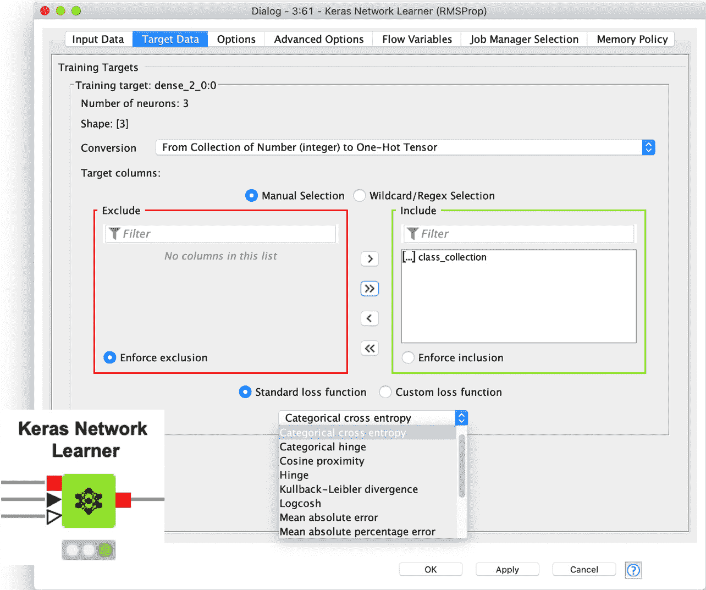

图 4.18–在 Keras 网络学习器节点的目标数据选项卡中，您可以选择目标列和损失函数

现在已经定义了网络结构并选择了正确的损失函数，下一步是定义输入数据集中的哪些列是网络的输入，以及哪些列包含目标值。

## 定义输入和输出数据

定义输入和输出列是您可以在**输入数据**和**目标数据**选项卡中完成的事情。让我们首先关注输入数据。

输入数据是网络期望作为输入的数据，这意味着符合网络输入大小的列。在**输入数据**选项卡中，所选网络的输入神经元数量和随之产生的形状显示在最顶端:


图 4.19–在 Keras 网络学习器节点的输入数据选项卡中，您可以选择输入列和正确的转换

接下来，您必须选择转换类型；这意味着将选定的输入列转换成网络输入规范可以接受的格式。可能的转换类型如下:

*   **从数(整数)的集合到单热张量**
*   **从数(双精度)**
*   **从数(整数)**
*   **来自集合的数(双精度)**
*   **来自集合的数(整数)**
*   **来自图像**

转换类型 1，**从数字集合(整数)到独热张量**，当网络需要独热向量时，这是一个非常有用的转换。您可以输入一系列整数编码的值，然后将它们一个接一个地转换成独热向量，而不是创建一个包含所有独热向量的矩阵，这样会占用空间和资源。在执行过程中，节点创建独热向量并将它们输入到网络中。整个过程对最终用户是隐藏的，并且不会创建额外的大型稀疏数据表。

其他转换类型只接受指定格式(double、integer 或 image)的输入列，并将它们呈现给网络。

在选择了转换类型之后，您可以通过包含-排除框架选择网络的输入列。请注意，该框架已经预加载了所有与所选转换类型匹配的输入列。

现在让我们选择目标列。目标数据必须与输出层的规范相匹配。这意味着，如果你的输出层有 20 个单元，你的目标数据必须是 20 维向量；或者，如果输出图层只有一个单元，则目标数据也必须由每个训练样本或数据行的一个值组成。

在**目标数据**选项卡中，在最顶端，报告了网络输出层的神经元数量和最终形状。与在**输入数据**选项卡中一样，在这里您可以从许多转换选项中进行选择，以将输入数据集转换为网络规范。该菜单具有所有可供选择的转换类型，并预先加载了符合网络输出层规范的转换类型。

对于多类分类问题，从数的集合(整数)到单热张量的转换类型确实很有帮助。您只需要对输入集合像元中的类(1)的位置进行编码，而不是预先创建一个热点向量。

让我们继续讨论培训参数。

## 设置训练参数

现在已经定义了网络和损失函数，下一步是设置训练参数。例如，您希望使用哪个优化器？你想训练多少个纪元？有许多参数需要定义。

所有的训练参数都可以在**选项**和**高级选项**选项卡中找到。在*图 4.20* 中，可以看到 **Keras 网络学习者** 节点的**选项**选项卡:

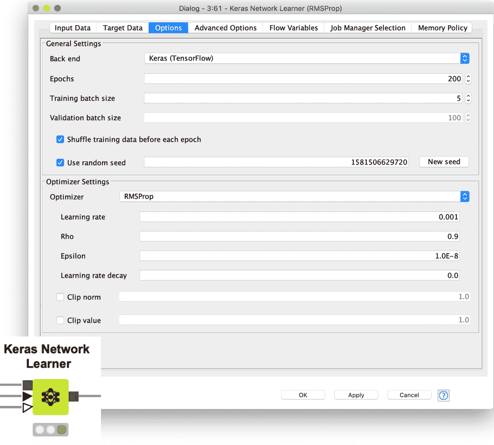

图 4.20–在“Keras 网络学习者”节点的“选项”选项卡中，您可以设置所有培训参数

在**选项**选项卡的上部，在配置窗口中，您可以定义时期数和批量大小。这决定了在每个训练迭代中要成批提供给网络的训练集和验证集中的数据行数。

重要说明

如果在 Keras 输入层节点中定义了批次大小，则批次大小设置将被停用。

在那下面，有两个复选框。一种是在每个时期之前随机打乱训练数据，一种是设置随机种子。打乱训练数据通常会改善学习过程。实际上，在每个时期以相同的顺序用相同的批次更新网络会对训练的收敛速度产生不利影响。如果选择了“随机播放”复选框，则“随机种子”复选框会变为活动状态，显示的数字用于生成随机播放操作的随机序列。随机种子的使用产生了可重复的随机洗牌过程，因此允许我们重复特定训练运行的结果。点击**新种子**按钮生成新的随机种子和新的随机洗牌程序。禁用随机种子的复选框会为每个节点执行创建一个新种子。

在**选项**选项卡的下部，您可以选择**优化器算法**，及其在训练期间使用的参数。优化器算法是训练算法。例如，您可以选择 **RMSProp** 优化器，然后选择相应的**学习率**和**学习率衰减**值。当节点被选中时，右边的**描述**面板会填充该节点的详细信息。提供了一个优化器列表，以及到原始 Keras 库的链接，解释了这个框架中需要的所有参数。

在**选项**选项卡的最底部，您可以约束渐变值的大小。如果勾选了**修剪规范**，L2 规范超过给定规范的梯度将被修剪到该规范。如果勾选了**剪辑值**，绝对值超过给定值的梯度将被剪辑到该值(或取反值)。

**高级选项**选项卡包含一些特殊终止和学习率降低情况的附加设置。最后一个选项允许您指定在具有多个 GPU 的系统上使用哪个 GPU。

## 跟踪培训进度

在设置好所有的训练参数后，你可以通过执行节点开始训练你的网络。执行节点时，您可以在**学习监视器**视图中查看学习进度。右键点击 Keras 网络学习者节点，选择**视图:学习监控**，可以打开**学习监控**视图；参见*图 4.21* 。

默认情况下，**学习监视器**视图以红色显示每次权重更新后，即一批数据通过网络后，训练集的准确度曲线的变化。精度值在 *y* 轴上报告，批次的前进数在 *x* 轴上报告。

点击线图上方的**损失**显示训练集的损失曲线，而不是准确度。

关于训练进度的更多信息可在 **Keras 日志输出**视图中获得。这可以在 Keras 学习节点视图的顶部选择，在**精确度** a 和**损失**之后的最后一个选项卡中:

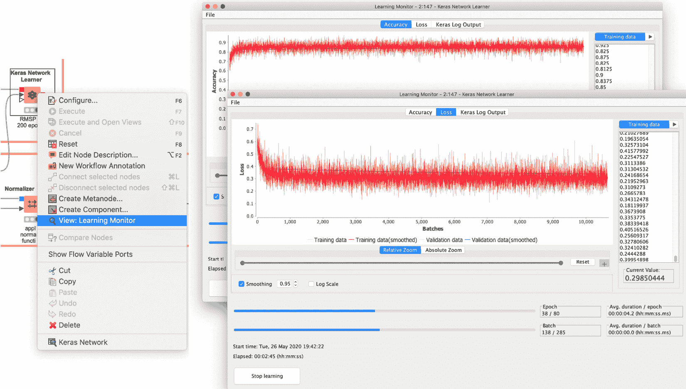

图 4.21–学习监控视图显示了学习过程的进度

小费

Keras 网络学习者节点的**学习监视器**视图允许您跟踪模型的学习。右键点击执行节点，选择**视图:学习监视器**即可打开。

如果使用认证组，准确度/损失图中会出现一条蓝线。蓝线显示了验证集上训练过程的相应进度。

在图中，您可以选择放大 *x* 轴——批次轴——以更详细地查看每个批次的进度。

**平滑**复选框引入原始精度或损失曲线的移动平均曲线。**对数刻度**复选框将曲线表示更改为对数刻度，以便对训练运行进行更详细的评估。

最后，在视图的底部，可以看到**停止学习**按钮。这是一个按需提前停止训练过程的选项。如果训练在完成前停止，网络将保存在当前状态。

## 鸢尾花分类的训练设置

对于基于虹膜数据集的虹膜花朵分类示例，我们在网络学习器节点中使用了以下设置。

在第一个选项卡**输入数据**选项卡中，四个数字输入被选为输入特征。在数据准备部分，我们没有对输入特征应用名义特征编码。所以，我们只是通过使用 **From Number (double)** 转换类型，将它们输入到网络的输入层。

在第二个选项卡中，`class_collection`输入列，包含作为集合的整数编码类，我们将**从 Number (integer)集合应用到 One-Hot Tensor** 转换。因此，在执行期间，Keras 网络学习器节点在三维向量中创建三个类的一次性编码版本，因为它也需要匹配网络输出。在第二个选项卡的下部，选择**分类交叉熵**损失函数。

在名为**选项**的第三个选项卡中，定义了训练参数。使用 50 个历元、5 的训练批量和 **RMSProp** 优化器来训练网络。

默认情况下，**高级选项**选项卡中的设置处于非活动状态。

## 收入预测的培训设置

对于多类分类问题，例如基于成人数据集的收入预测示例，设置会有所不同。我们使用了以下设置。

在第一个选项卡中，`Income`位于`Exclude`部分。在这里，在数据准备阶段，一些输入特征已经是数字的并且还没有被编码，一些已经被整数编码，一些已经通过 KNIME 本地节点被一次性编码。因此，所有输入要素都已准备好输入到网络中。请注意，由于我们决定混合整数编码、一键编码和原始特性，适用于所有这些不同特性的唯一可能的编码是简单的从 Number 类型的转换。

同样，在第二个选项卡中，`0`或`1`。这也符合网络输出层中 sigmoid 函数的一个输出。在包含-排除框架中，仅包含目标列`Income`。接下来，选择**二进制交叉熵**损失函数，以适合二进制分类问题，例如这个问题。

在第三个选项卡**选项**中，我们将网络设置为训练 80 个历元，训练批量为 80 个数据行。在本例中，我们还使用了一个验证集，以便能够在训练过程中看到未包含在训练集中的数据的网络进度。对于验证集的处理，设置了 40 个数据行的批量大小。最后，我们选择 **Adam** 作为这个训练过程的优化器。

同样，默认情况下，最后一个选项卡**高级选项**中的设置是禁用的。

# 测试和应用网络

现在已经训练了神经网络，最后一步是将网络应用于测试集并评估其性能。

## 执行网络

要执行一个训练好的网络，可以使用 **Keras 网络执行器**节点，如图*图 4.22* 所示。节点有两个输入端口:用于训练网络的 Keras 网络端口和用于测试集或新数据的数据输入端口。

在配置窗口的第一个名为**选项**的选项卡中，您可以在上部选择后端引擎、输入数据的批量大小以及是否在输出数据表中保留原始输入列。

在此之下，您可以指定输入列和所需的转换。像在 Keras 网络学习者节点中一样，来自神经网络的输入规范打印在顶部。请记住，由于您使用相同的网络和相同的数据格式，因此输入要素的设置必须与 Keras 网络学习者节点中的设置相同。

在该选项卡的最后一部分，您可以添加输出设置。首先，您需要指定从哪里获取输出；这应该是输入网络的输出层。要添加一个输出层，点击**添加输出**按钮。在新窗口中，您会看到一个包含输入网络中所有图层的菜单。如果在图层节点中配置了前缀，则可以在下拉菜单中看到它们，从而更容易识别感兴趣的图层。选择输出层:

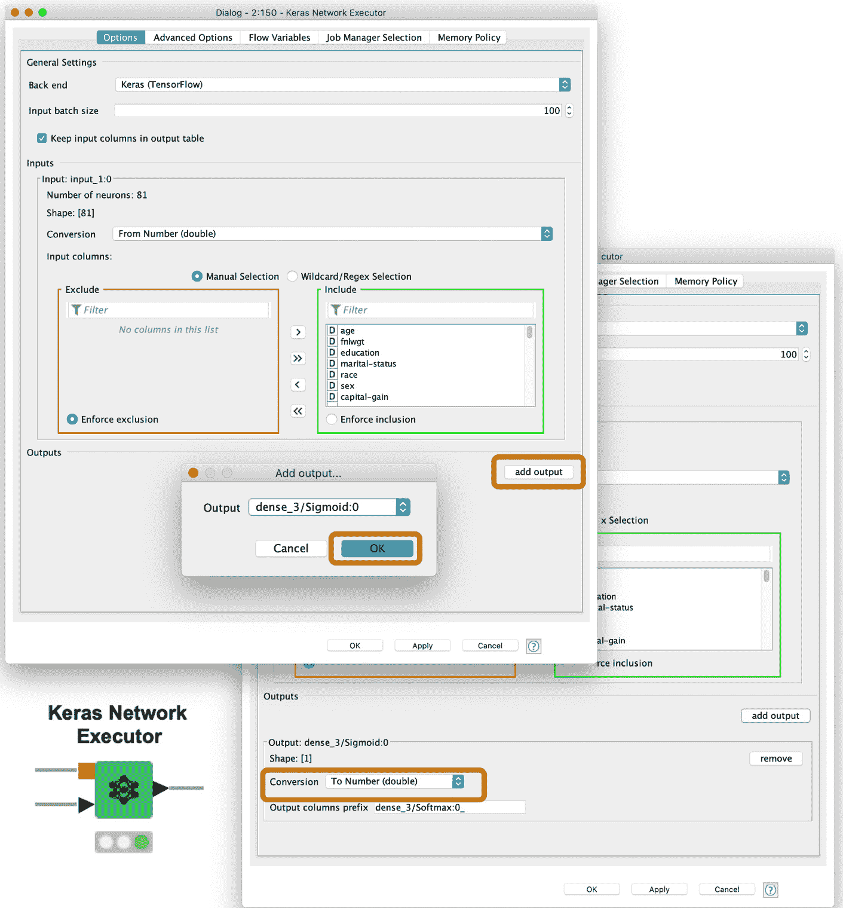

图 4.22–Keras 网络执行器节点根据新数据运行网络。在配置窗口中，您可以通过单击添加输出按钮来选择输出

在本书包含的所有使用案例中，网络的最后一层用作输出层。该层很容易识别，因为它是下拉列表中唯一没有**(隐藏)**后缀的层。

小费

您还可以输出隐藏层的输出，例如，用于调试目的。

最后，选择适当的转换类型，以获得您喜欢的形状的输出值——例如，在一个单元格中作为一个列表(**到数字(双精度)**列表)或每个输出单元有一个新列(**到数字(双精度)**)。在最后一种情况下，您可以定义一个前缀附加到输出列的名称上。

**高级选项**部分包含让网络在支持 GPU 的机器上运行的设置。

## 提取预测并评估网络性能

根据用例的不同，网络输出可能需要一些后处理来提取预测。例如，在二进制分类问题中，有一个输出单元和一个 sigmoid 激活函数，输出值是编码为`1`的类的概率。在这种情况下，为了产生实际的类分配，您可以对规则引擎节点内的概率应用一个阈值。

最后一步是模型的评估。要评估分类模型，您可以使用计分器**节点或 **ROC 曲线**节点。Scorer 节点的输出为您提供了常见的性能度量，例如准确性、Cohen’s kappa 或混淆矩阵。**

小费

另一个评估二进制分类问题的性能的非常好的节点是**二进制分类检查器**节点。该节点是 KNIME 机器学习可解释性扩展的一部分:[https://hub . KNIME . com/KNIME/extensions/org . KNIME . features . mli/latest](https://hub.knime.com/knime/extensions/org.knime.features.mli/latest)。

对于回归解的评估，**数字计分器**节点计算一些误差度量，例如均方误差、均方根误差、平均绝对误差、平均绝对百分比误差、平均符号差和 R 平方。

## 测试训练好的网络对鸢尾花进行分类

在*图 4.23* 中，您可以看到工作流程的部分，该部分应用训练好的网络，提取预测，并评估训练好的网络以对鸢尾花进行分类:


图 4.23–该工作流片段应用了训练好的网络，并提取和评估了鸢尾花示例的预测

在`"dense_2/Softmax:0_"`的配置窗口中，作为**转换的**类型的**到【双精度】**被选中。由于 Iris 数据集有三个不同的可能类值，因此节点添加了三个新列，其中包含三个类的三种概率。另一个转换选项是**到**的数字列表(双精度)。这个转换选项将只产生一个新列，一个单元格中的所有类别概率打包成一个列表。

接下来，使用规则引擎节点提取预测。不同类别的概率在类别 1 的`$Output_1/Softmax:0_0for class 0`和 `Output_1/Softmax:0_1`列中，类别 2 的`Output_1/Softmax:0_2`列中。这里，选择具有最高概率的类作为预测结果。

第一个规则通过将编码为`0`的类与其他两个类的概率进行比较，来检查该类是否具有最高的概率。第二个规则同样适用于编码为`1`的类，第三个规则适用于编码为`2`的类。最后一个规则定义了一个默认值。

这些规则通过以下代码应用于:

```py
$Output_1/Softmax:0_0$ > $Output_1/Softmax:0_1$ AND $Output_1/Softmax:0_0$ > $Output_1/Softmax:0_2$ => 0
$Output_1/Softmax:0_1$ > $Output_1/Softmax:0_0$ AND $Output_1/Softmax:0_1$ >$Output_1/Softmax:0_2$ => 1
$Output_1/Softmax:0_2$ > $Output_1/Softmax:0_0$ AND $Output_1/Softmax:0_2$ >$Output_1/Softmax:0_1$ => 2
TRUE => 3
```

最后，Scorer 节点用于评估网络性能。

## 测试为收入预测而训练的网络

具有不同设置的相同节点组合可用于应用经训练的网络、提取预测以及评估成人数据集上的收入预测示例的模型。

在 Keras 网络执行器节点的配置窗口中，在`dense_3`输出层被添加为输出。在这种情况下，网络的输出是编码为`1`、`">50K"`的类的概率。

最后，规则引擎节点使用以下代码检查输出概率是高于还是低于`0.5`阈值:

```py
$dense_3/Softmax:0_0$ < 0.5=> "<=50K"
TRUE => ">50K"
```

最后，用 Scorer 节点对网络性能进行评估。

这样，我们已经经历了整个过程，从数据访问和数据准备到使用 KNIME 分析平台定义、训练、应用和评估神经网络。

# 总结

我们已经到了本章的结尾，在这里你已经学会了如何执行在 KNIME Analytics Platform 中训练神经网络所涉及的不同步骤。

我们从常见的预处理步骤开始，包括不同的编码、规范化和丢失值处理。接下来，您学习了如何通过使用不同的 Keras 层节点来定义神经网络架构，而无需编写代码。然后，我们继续训练神经网络，您学习了如何定义损失函数，以及如何监控学习进度，将网络应用于新数据，并提取预测。

每个部分都以小的示例会话结束，为您自己执行所有这些步骤做准备。

在下一章中，你将看到这些步骤如何应用到本书的第一个用例:使用自编码器的欺诈检测。

# 问题和练习

通过回答以下问题，检查您对本章中介绍的概念的理解程度:

1.  How can you set the loss function to train your neural network?

    a)通过使用 Keras 损失功能节点

    b)通过使用 Keras 输出层节点

    c)在 Keras 网络学习器节点的配置窗口中

    d)在 Keras 网络执行器节点的配置窗口中

2.  How can you one-hot encode your features?

    a)通过使用一个热编码节点

    b)通过使用一对多节点

    c)通过使用类别到编号节点创建整数编码，然后，整数到一个热编码节点

    d)通过创建整数编码，将其转换为集合单元格，并选择正确的转换

3.  How can you define the number of neurons for the input of your network?

    a)通过使用 Keras 输入层节点。

    b)通过使用没有任何输入网络的 Keras 密集层节点。

    c)基于在 Keras 网络学习器节点中选择的特征自动设置输入维度。

    d)通过使用 Keras 开始层节点。

4.  How can you monitor the training of your neural network on a validation set?

    a)将验证集输入 Keras 网络学习器节点的可选输入端口，并打开训练监视器视图。验证集的性能显示为红色。

    b)点击培训监视器视图中的**应用于验证集**按钮。

    c)将验证集输入 Keras 网络学习器节点的可选输入端口，并打开训练监视器视图。验证集的性能以蓝色显示。

    d)将验证集输入 Keras 网络学习者节点的可选输入端口，并打开训练监视器视图的验证集选项卡。建立一个工作流来读取 Iris 数据集，并训练一个具有一个隐藏层(八个单元和 ReLU 激活函数)的神经网络，以根据四个输入特征将三个物种相互区分开来。