# *第五章:*用于欺诈检测的自编码器

在书中的这一点上，你应该已经知道神经网络和一些深度学习范式背后的基本数学和概念，以及对数据准备最有用的 KNIME 节点，如何建立神经网络，如何训练和测试它，最后，如何评估它。在 [*第 4 章*](B16391_04_Final_NM_ePUB.xhtml#_idTextAnchor101)*构建和训练前馈神经网络*中，我们一起构建了两个完全连接的前馈神经网络示例:一个用于解决虹膜数据集上的多类分类问题，另一个用于解决成人数据集上的二元分类问题。

这是使用非常小的数据集的两个简单示例，其中所有的类都被充分表示，网络中只有几个隐藏层，输出类的编码很简单。然而，它们服务于它们的目的:教你如何在 KNIME 分析平台中组装、训练和应用神经网络。

现在，是时候探索更现实的例子，应用更复杂的神经架构和更先进的深度学习范式，以解决有时基于病态数据集的更复杂的问题了。在接下来的章节中，你将会看到一些更现实的案例研究，需要一些更有创造性的解决方案，而不仅仅是一个完全连接的前馈网络来进行分类。

我们将从一个数据集的二元分类问题开始，该数据集只包含来自两个类中的一个类的数据。这里，经典的分类方法不能工作，因为两个类中的一个从训练集中丢失了。有许多这类问题，例如预测机械故障的异常检测或区分合法和欺诈信用卡交易的欺诈检测。

本章研究了一种替代的神经方法来设计欺诈检测中这种极端情况的解决方案:自编码器架构。

我们将讨论以下主题:

*   自编码器简介
*   为什么欺诈检测如此困难？
*   构建和训练自编码器
*   优化自编码器策略
*   部署欺诈检测器

# 介绍自编码器

在前面的章节中，我们已经看到神经网络是非常强大的算法。每个网络的强大之处在于它的架构、激活函数和正则项，以及其他一些特性。在各种各样的神经架构中，有一种非常通用的架构，特别适用于三个任务:检测未知事件、检测意外事件和降低输入空间的维度。这个神经网络是自编码器。

## 自编码器的架构

自编码器(或**自动联想器**)是一个多层前馈神经网络，被训练以将输入向量复制到输出层。像许多神经网络一样，它使用梯度下降算法或其现代变体之一来训练，对抗损失函数，例如**均方误差** ( **MSE** )。它可以有任意多的隐藏层。对于避免过拟合或改进学习过程有用的正则化项和其他通用参数也可以应用于此。

该架构的唯一限制是输入单元的数量必须与输出单元的数量相同，因为目标是训练自编码器将输入向量再现到输出层上。

最简单的自编码器只有三层:一个输入层、一个隐藏层和一个输出层。更复杂的结构化自编码器可能包括附加的隐藏层:

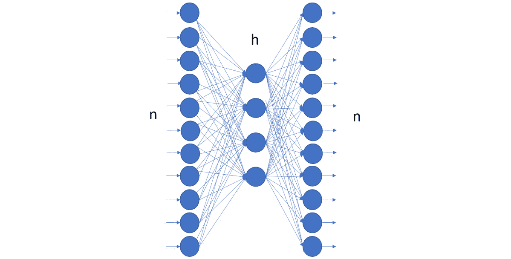

图 5.1–一个简单的自编码器

自编码器可以用于许多不同的任务。让我们首先来看看如何使用自编码器进行降维。

## 用自编码器减少输入维数

让我们考虑一个具有非常简单架构的自编码器:一个具有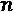单元的输入层；一个输出层，也带有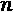单元；和一个带有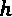单元的隐藏层。如果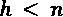，自编码器将输入向量压缩到隐藏层，将其维度从减少到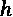。

在这种情况下，网络的第一部分将数据从大小为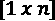的向量移动到大小为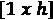的向量，扮演编码器的角色。网络的第二部分是解码器，将输入向量从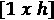空间重构回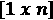空间。压缩率是然后是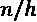。的值越大，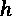的值越小，压缩率越高:

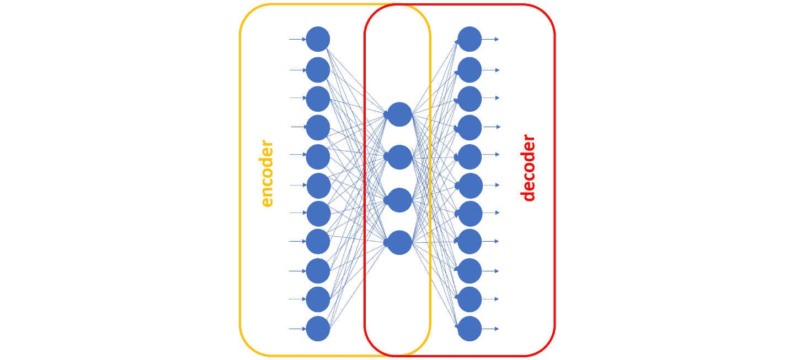

图 5.2–在三层自编码器中编码 r 和解码器子网

当使用自编码器进行**维度缩减**时，整个网络首先被训练以将输入向量再现到输出层上。然后在部署之前，分成两部分:编码器**(输入层和隐藏层)和解码器**(隐藏层和输出层)。这两个子网分开存储。****

 ****小费

如果对瓶颈层的输出感兴趣，可以配置 **Keras 网络执行器**节点输出中间层。或者，您可以通过编写几行 Python 代码在 **DL Python 网络编辑器**节点内分割网络。

在部署阶段，为了压缩输入记录，我们只需将它通过编码器，并将隐藏层的输出保存为压缩记录。然后，为了重构原始向量，我们将压缩记录通过解码器，并将输出层的输出值保存为重构向量。

如果自编码器使用更复杂的结构(例如，具有多个隐藏层)，则其中一个隐藏层必须作为压缩器输出，产生压缩记录并将编码器与解码器子网分开。

现在，当我们谈论数据压缩时，问题是原始记录能多忠实地被重建？使用隐藏层的输出代替原始数据向量会丢失多少信息？当然，这完全取决于 autoencoder 的表现和我们的容错能力。

在测试期间，当我们将网络应用于新数据时，我们对输出值进行反规格化，并计算所选的误差度量——例如，原始输入数据和整个测试集的重构数据之间的**均方根误差** ( **RMSE** )。这个误差值为我们提供了重建数据质量的度量。当然，压缩率越高，重建误差就越高。因此，根据我们的容错能力，问题变成了训练网络以达到可接受的性能。

让我们转到自编码器的下一个应用领域:异常检测。

## 使用自编码器检测异常

在大多数分类/预测问题中，我们有一组涵盖所有事件类别的示例，并且基于该数据集，我们训练一个模型来对事件进行分类。然而，有时，我们想要预测的事件类是如此罕见和意外，以至于根本没有(或几乎没有)实例可用。在这种情况下，我们不讨论分类或预测，而是讨论**异常检测**。

异常可以是任何罕见的、意外的、未知的事件:心律失常、机械故障、欺诈性交易或其他罕见的、意外的、未知的事件。在这种情况下，由于在训练集中没有异常的例子，我们需要以比传统的标准分类更有创造性的方式使用神经网络。自编码器结构有助于这种创造性的使用，如异常检测问题的解决方案所要求的(例如，参见 A.G. Gebresilassie，*用于异常(异常值)检测的神经网络*，[https://blog . good audience . com/Neural-Networks-for-Anomaly-Outliers-Detection-a 454 e 3 fdaae 8](https://blog.goodaudience.com/neural-networks-for-anomaly-outliers-detection-a454e3fdaae8))。

由于没有异常示例可用，自编码器仅在非异常示例上被训练。让我们称这些例子为“正常”类。在充满“正常”数据的训练集上，自编码器网络被训练成将输入特征向量再现到输出层上。

这个想法是,当需要复制一个“正常”类的向量时，自编码器可能会执行一个体面的工作，因为这是它被训练要做的。然而，当需要在输出层上再现异常时，它很可能会失败，因为它不会在整个训练阶段看到这种向量。因此，如果我们计算原始向量和复制向量之间的距离(任何距离),我们会看到“正常”类输入向量的距离很小，而代表异常的输入向量的距离要大得多。

因此，通过设置阈值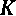，我们应该能够利用以下规则来检测异常:

如果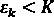，则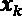 - >“正常”

如果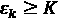那么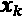 - >“异常”

这里，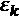是输入向量的重构误差，，并且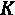是设置的阈值。

这种解决方案已经在欺诈检测中成功实施，如维尼林·瓦尔科夫(https://medium . com/@ curious ly/Credit-Card-Fraud-Detection-using-auto encoders-in-Keras - TensorFlow-for-hackers-Part-VII-20 e0c 853014)的博客文章《使用 Keras-tensor flow 中的自编码器进行信用卡欺诈检测(第六部分 [*I)】在这一章中，我们将使用相同的想法来构建一个使用不同的自编码器结构的类似解决方案。*](https://medium.com/@curiousily/credit-card-fraud-detection-using-autoencoders-in-keras-tensorflow-for-hackers-part-vii-20e0c85301bd)

让我们来看看自编码器的想法如何被用来检测欺诈性交易。

# 为什么发现欺诈如此困难？

**欺诈检测**是为防止通过欺诈手段获取金钱或财产而采取的一系列活动。欺诈检测应用于许多行业，如银行或保险。在银行业，欺诈可能包括伪造支票或使用偷来的信用卡。在这个例子中，我们将关注信用卡交易中的欺诈。

在信用卡交易中，这种欺诈对于信用卡发行人以及最终付款人来说都是一个巨大的问题。欧洲央行报告称，2016 年，使用在**单一欧元支付区** ( **SEPA** )发行的卡的卡欺诈案件总数达 1730 万起，使用在 SEPA 发行的卡的卡交易总数达 749 亿起([https://www . ECB . Europa . eu/pub/card fraud/html/ECB . card fraud report 201809 . en . html # toc1【T26](https://www.ecb.europa.eu/pub/cardfraud/html/ecb.cardfraudreport201809.en.html#toc1)

然而诈骗金额并不是唯一的问题。从数据科学的角度来看，欺诈检测也是一项非常难以解决的任务，因为欺诈交易的可用数据量很小。也就是说，通常我们有大量合法信用卡交易的数据，只有少量欺诈交易的数据。在这种情况下，经典的方法(训练，然后应用模型)是不可能的，因为这两个类中的一个缺少示例。

然而，欺诈检测也可以被视为异常检测。异常检测是数据集中的任何意外事件。欺诈交易确实是一个意外事件，因此我们可以认为它是合法正常信用卡交易数据集中的一个异常。

欺诈检测有几种不同的方法。

一种选择是区别对待的方法。基于包含合法交易和欺诈交易这两个类别的训练集，我们构建了一个模型来区分来自这两个类别的数据。这可能是一个简单的基于阈值的规则或监督机器学习模型。这是基于训练集的经典方法，训练集包括来自两个类的足够多的例子。

或者，您可以将欺诈检测问题视为异常检测。在这种情况下，可以使用一种为离群值(噪声)留出空间的聚类算法，比如**DBS can**；或者您可以使用**隔离森林技术**，该技术只需对合法数据进行几次切割就可以隔离离群值。然而，欺诈交易必须属于原始数据集，才能作为离群值被隔离。

另一种应用[方法，称为**生成方法**，涉及在训练](https://en.wikipedia.org/wiki/Generative_model)阶段只使用合法交易。这允许我们将输入向量复制到输出层。一旦训练了自编码器的模型，我们就在部署期间使用它来重现输入事务。然后我们计算输入值和输出值之间的距离(或误差)。如果该距离低于给定的阈值，则交易可能是合法的；否则，它将被标记为欺诈候选。

在这个例子中，我们将通过 Kaggle 使用[信用卡数据集。该数据集包含 2013 年 9 月欧洲持卡人的信用卡交易。欺诈交易被贴上了`1`的标签，而合法交易被贴上了`0`的标签。该数据集包含 284，807 笔交易，但其中只有 492 笔(0.2%)是欺诈性的。由于隐私原因，使用主成分而不是原始交易特征。因此，每笔信用卡交易都由 30 个特征表示:从原始信用卡数据中提取的 28 个主要成分、交易时间和交易金额。](https://www.kaggle.com/mlg-ulb/creditcardfraud)

让我们继续构建、训练和测试自编码器。

# 构建和训练自编码器

让我们进入关于我们将构建的用神经自编码器处理欺诈检测的特定应用程序的细节。像所有数据科学项目一样，它包括两个独立的应用程序:一个用于在专用数据集上训练和优化整个策略，另一个用于分析现实世界的信用卡交易。第一个应用是通过**培训工作流程**实现的；第二个应用程序通过**部署工作流**实现。

小费

通常，培训和部署是独立的应用程序，因为它们处理不同的数据并具有不同的目标。

训练工作流使用实验室数据集来产生可接受的模型以实现任务，有时需要一些不同的试验。部署工作流不再改变模型或策略；它只是将其应用于现实世界的交易，以获得欺诈警报。

在本节中，我们将重点关注培训阶段，包括以下步骤:

*   **数据访问**:这里我们从文件中读取实验室数据，包括所有 28 个主成分，交易金额，以及对应的时间。
*   **数据准备**:数据已经干净，经过**主成分分析** ( **PCA** )转换。在这一阶段剩下要做的是创建神经自编码器和整个策略的训练、优化和测试所需的所有数据子集。
*   **构建神经网络**:自编码器是一个前馈神经网络，其输入和输出一样多。接下来让我们决定隐藏层的数量，隐藏神经元的数量，以及每层中的激活函数，然后相应地构建它。
*   **训练神经自编码器**:在这一部分中，根据所选择的训练参数，例如至少损失函数、时期数和批量大小，利用训练算法(优化器)之一，在仅合法事务的训练集上训练自编码器。
*   **欺诈警报规则**:网络经过训练，能够在输出层重现合法交易后，我们需要通过计算输入层和输出层之间的距离，并设置基于阈值的规则来触发欺诈警报，从而完成策略。
*   **测试整体策略**:最后一步是测试整体策略性能。有多少合法交易被正确识别？有多少欺诈警报被正确触发，有多少是假警报？

## 数据获取和数据准备

来自 Kaggle 的信用卡数据集已经被清理和转换。我们现在需要创建所有的数据子集。具体来说，我们需要一个训练集和一个验证集来训练自编码器。它们必须只包含合法的交易。训练集用于训练网络，验证集用于监控自编码器在训练期间对不可见数据的性能。

然后，我们需要一个额外的数据子集，即阈值优化集，来优化基于规则的欺诈警报生成器中的阈值。除了一些合法交易外，最后一个子集应包括所有欺诈交易，如下所示:

*   所有合法交易的 2/3 专用于自编码器。
*   那些合法交易的 90%形成了**训练集**。
*   从到**验证集**的 10%。
*   所有合法交易的 1/3 (96K)和所有 492 笔欺诈交易组成**阈值优化集**，用于优化阈值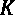的值。

这一切都转化为一个**行拆分器**节点将合法交易与欺诈性交易分开，一个**连接**节点将欺诈性交易添加回阈值优化集，以及多个**分区**节点。分区节点中的所有数据提取都是随机执行的:

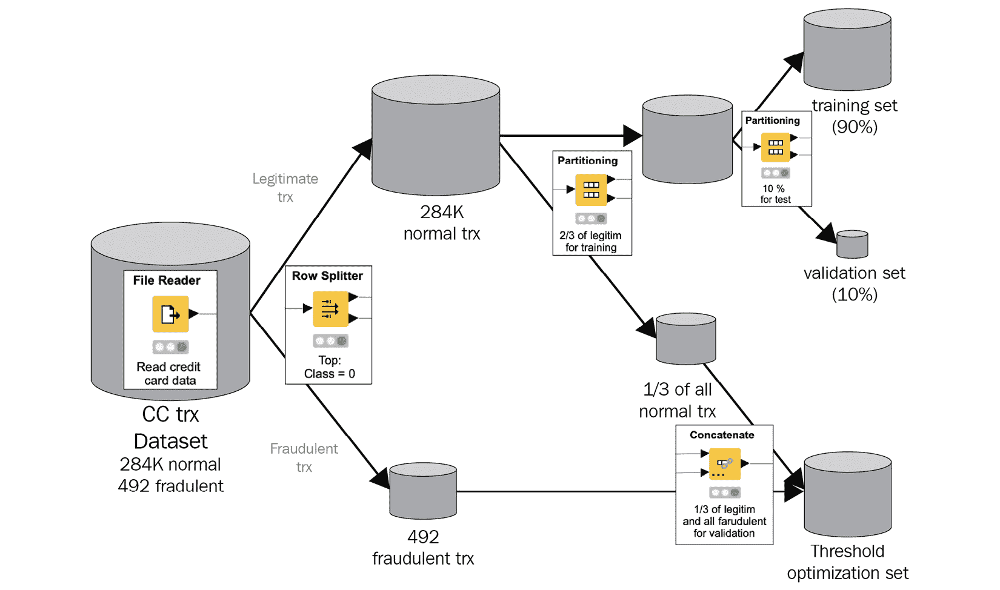

图 5.3—欺诈检测流程中使用的数据集

重要说明

训练集、验证集和阈值优化集必须完全分开。任何子集都不能共享任何记录。这是为了确保评估期间有意义的性能测量和独立的优化程序。

接下来，每个子集中的所有数据都必须标准化，以落入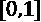中。标准化是在训练集上定义的，并应用于其他两个子集。使用**模型编写器**节点为部署工作流程保存标准化参数:

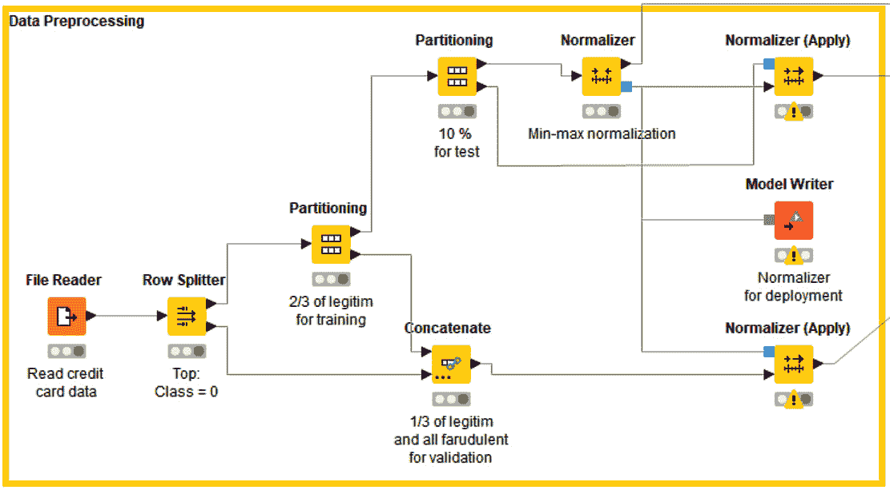

图 5.4-实施欺诈检测数据准备的工作流程

*图 5.4* 中的工作流程显示了如何在 KNIME 分析平台中创建不同的数据集并进行标准化。

## 构建自编码器

对于这个案例研究，我们构建了一个具有五个隐藏层的自编码器，使用`30-40-20-8-20-40-30`单元，sigmoid 作为激活函数。

使用以下内容构建神经网络(参见*图 5.5* ):

*   `Shape = 30`
*   五个 **Keras 密集层**节点实现隐藏层，分别使用 sigmoid 作为激活函数和 40、20、8、20 和 40 个单元
*   **Keras 密集层**节点为输出层，30 个单位，sigmoid 为激活函数:

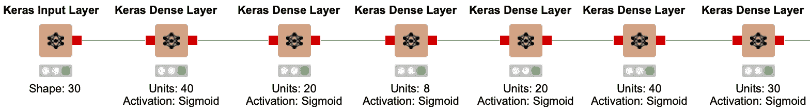

图 5.5–经过训练的神经自编码器的结构，用于将信用卡交易从输入层复制到输出层

现在我们已经构建了自编码器，让我们使用数据来训练和测试它。

## 训练和测试自编码器

为了训练和验证网络，我们使用 **Keras 网络学习器**节点，在输入端口设置训练集和验证集，以及以下设置(*图 5.6* ):

*   在**选项**选项卡中，历元数设置为`50`，训练和验证组的批量设置为`300`、[和](https://machinelearningmastery.com/adam-optimization-algorithm-for-deep-learning/)。使用**Adam**(backpr 运算的优化版本)训练算法。
*   损失函数被设置为**目标**选项卡中的 MSE。
*   目标和输入特征在**输入**选项卡和**目标**选项卡中是相同的，并被接受为简单的**双**数字。

在 Keras 网络学习器节点的**学习监视器**视图的**损失**选项卡中，您现在可以看到两条曲线:一条是一批中每个训练样本的平均损失(或误差)(红色),另一条是验证数据上每个样本的平均损失(蓝色)。

在训练阶段结束时，来自训练集的批次的最终平均损失值在[0.0012，0016]左右，来自验证集的批次的最终平均损失值在[0.0013，0.0018]左右。计算的损失是一个批次的平均重建误差，通过以下公式计算:

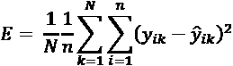

这里，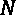为批量，为输出层的个单元，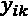为训练样本 *k* 的输出层神经元 *i* 的输出值，为对应的目标答案。

训练后，使用 **Keras 网络执行器**节点将网络应用于优化集，并使用 **Keras 网络编写器**节点将其保存为 Keras 文件进行部署。

*图 5.6* 显示了 Keras 网络执行器节点中**选项**选项卡的配置:所有 30 个输入特征作为**双**号传递，输入列被保留，以便以后计算重建误差。选择最后一层作为输出，并将值导出为简单的**双**数字:

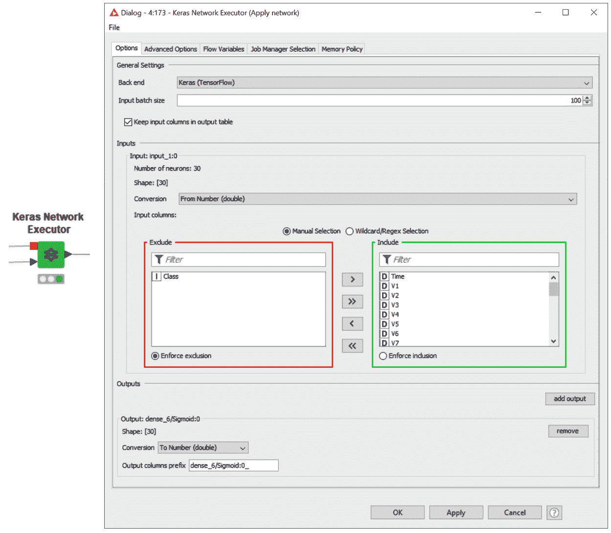

图 5.6–Keras 网络执行器节点及其配置窗口

下一步是计算原始特征向量和再现特征向量之间的距离，并应用阈值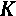，以发现欺诈候选。

## 检测欺诈交易

当模型训练完成时，自编码器已经学会如何在输出层上再现代表合法交易的特征向量。我们现在如何发现可疑交易？如果我们有一个新的交易，，我们如何判断它是可疑的还是合法的？

首先，我们通过 Keras 网络执行器节点，通过自编码器运行这个新事务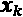。原始事务的复制在输出层生成。现在，计算重构误差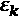，作为原始事务向量和再现的事务向量之间的距离。根据以下规则，交易将被视为欺诈候选交易:

如果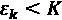那么 - >“合法 trx”

如果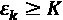，则 - >“欺诈候选人交易”

这里，是事务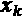的重构误差值，而 *K* 是阈值。MSE 也被用于重建误差:

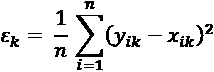

这里，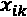是事务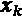的第 *i* 个特征，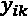是网络输出层上的对应值。

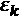通过一个`1`计算得出，是欺诈候选类，`0`是合法交易类。一个`1`。特异性是真正合法的交易数量与所有未引发任何警报的交易数量之间的比率。另一方面，敏感度衡量的是实际发生欺诈交易的欺诈警报的比率。

特异性衡量我们可能遗漏的欺诈，而敏感性衡量我们打击的欺诈:

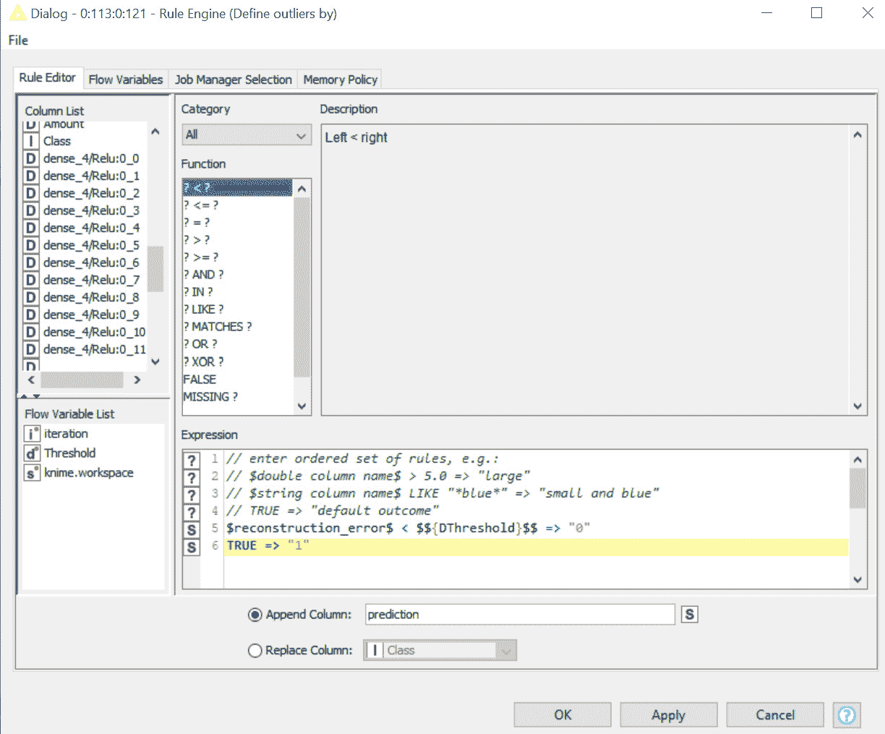

图 5.7–在规则引擎节点中实施的规则，比较重建误差和阈值

现在我们的模型已经训练和测试过了，还需要优化。

# 优化自编码器策略

阈值的最佳值是多少？在上一节中，我们根据自己的经验采用了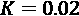。然而，这是的最佳值吗？在这种情况下，阈值不会通过训练程序自动优化。它只是训练算法外部的静态参数。在 KNIME Analytics 平台中，还可以优化**学习器**节点之外的静态参数。

## 优化阈值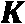

## 阈值是在单独的数据子集上定义的，称为优化集**。这里有两个选项:**

 ***   如果具有被标记的欺诈交易的优化集可用，则阈值的值相对于欺诈检测的任何准确性度量被优化。
*   如果在数据集中没有标记的欺诈交易，阈值的值被定义为优化集上重构误差的高百分比。

在数据准备阶段，我们生成了三个数据子集:Keras 网络学习者节点的训练集和验证集，用于训练和验证自编码器，以及最后一个子集，我们称之为阈值优化集。这个最终子集包括所有合法交易的 1/3 和少量欺诈交易。我们可以使用这个子集针对整个欺诈检测策略的准确性来优化阈值的值。

优化参数意味着在最大化或最小化给定测量的范围内找到值。根据我们的经验，我们假设 *K* 的值为正数(> 0)并且低于 0.02。因此，优化阈值的值意味着在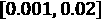中找到使整个应用的精度最大化的值。

通过 Scorer (JavaScript)节点计算应用程序的准确性，将规则引擎节点的结果视为预测，并将它们与优化集中的原始类(`0` =合法交易，`1` =欺诈性交易)进行比较。

由`loop start`节点和`loop end`节点执行值区间的跨越和最大准确度阈值的识别。在优化循环中，这两个节点分别是**参数优化循环开始**节点和**参数优化循环结束**节点。

**参数优化循环开始**节点以给定步长跨越给定间隔内的参数值。这里根据重构误差特征的范围选择了间隔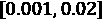和步长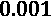，如 Keras 网络执行器节点后的数学公式节点输出端口的数据表**规格**选项卡中的**下限**和**上限**单元格所示，命名为 **MSE 输入输出距离**。

**参数优化循环结束**节点收集所有结果作为流量变量，检测目标测量的最佳(最大或最小)值，并将其与生成它的参数一起导出。在我们的例子中，目标度量是准确性，根据来自规则引擎节点的预测进行度量，必须最大化阈值的值。

循环开始和结束之间的所有节点构成循环的主体，即根据需要重复多次的部分，直到参数值的输入间隔都被覆盖。在循环体中，我们添加了额外的约束条件，即只有在特异性和敏感性的值接近时，才能找到最佳精度。这就是名为`Coefficient 0/1`的元节点的目标。这里，如果特异性和敏感性相差 10%以上，则将系数设置为`0`，否则设置为`1`。然后，这个系数乘以来自 Scorer (JavaScript)节点的整体准确性。这样，只有在特异性和敏感性彼此接近的情况下才能检测到最大的准确性:

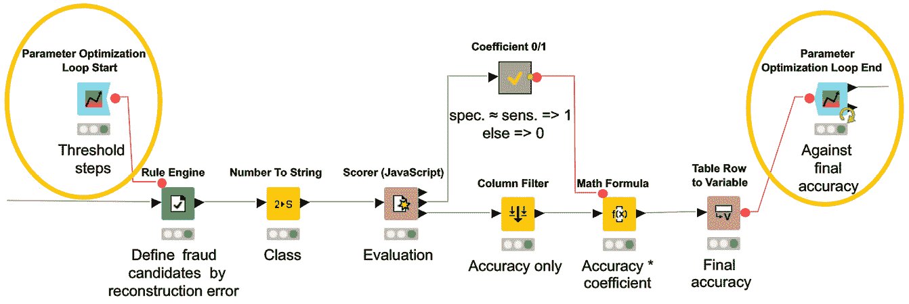

图 5.8–优化循环

在提取出最佳阈值后，我们将其转换为一个流变量，并将其传递给最终的规则实现。

### 包装成一个组件

现在，这整个阈值优化部分似乎是一个逻辑上独立的块。为了保持我们的工作流整洁和适当，我们可以将这个块包装在一个元节点中。更好的是，我们可以通过一种更强的元节点类型**组件**来确保包装紧密。

小费

元节点只是收集和打包节点。另一方面，组件将节点收集并打包在一起，此外，还继承所包含的小部件和 JavaScript 节点的视图以及所包含的配置节点的配置窗口。此外，除非特别定义，否则组件不允许外部流变量进入或内部流变量退出。

组件的创建方式与元节点相似。只需选择要组合在一起的节点，右键单击，然后选择**创建组件…** 。创建组件时，其上下文(右键单击)菜单提供了许多命令，用于通过设置打开、展开、修改和共享组件。要检查一个组件的内容，只需 *Ctrl* +双击该组件即可。一旦进入，您可以看到两个节点:**组件输入**和**组件输出**。在这两个节点的配置窗口中，您可以将流变量分别设置为在组件内部导入和在组件外部导出。

在我们创建的组件中，我们设置了**组件输出**节点来导出包含最佳阈值值的流变量。这个流变量需要退出组件，以便在欺诈检测的最终规则中使用。最终规则在新的规则引擎节点中实现，最终预测在新的计分器(JavaScript)节点中根据原始类进行评估。

使用信用卡交易数据训练和测试神经自编码器，并使用最佳阈值实施欺诈检测规则的最终工作流程如图*图 5.9* 所示。名为`01_Autoencoder_for_Fraud_Detection_Training`的工作流可从 KNIME Hub 下载:[https://Hub . KNIME . com/kathrin/spaces/Codeless % 20 deep % 20 learning % 20 with % 20 KNIME/latest/Chapter % 205/](https://hub.knime.com/kathrin/spaces/Codeless%20Deep%20Learning%20with%20KNIME/latest/Chapter%205/):

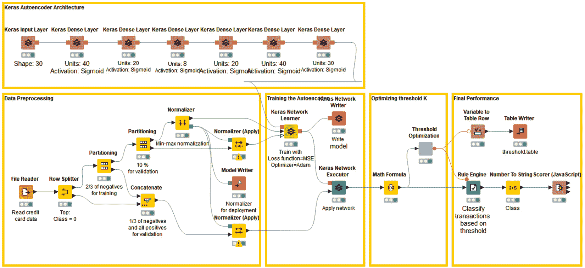

图 5.9–训练和测试自编码器并找到最佳阈值 K 的工作流程

现在我们已经找到了最佳阈值，让我们来看看自编码器的性能。

### 性能指标

在本节中，我们将报告在应用欺诈检测规则后，该方法在阈值优化集上的性能测量。对于 93.52%的准确度，发现最佳阈值是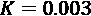。

在*图 5.10* 中，您可以看到**混淆矩阵**，基于它的分类统计数据，以及一般性能指标，所有这些都描述了欺诈检测器在优化集上的表现:

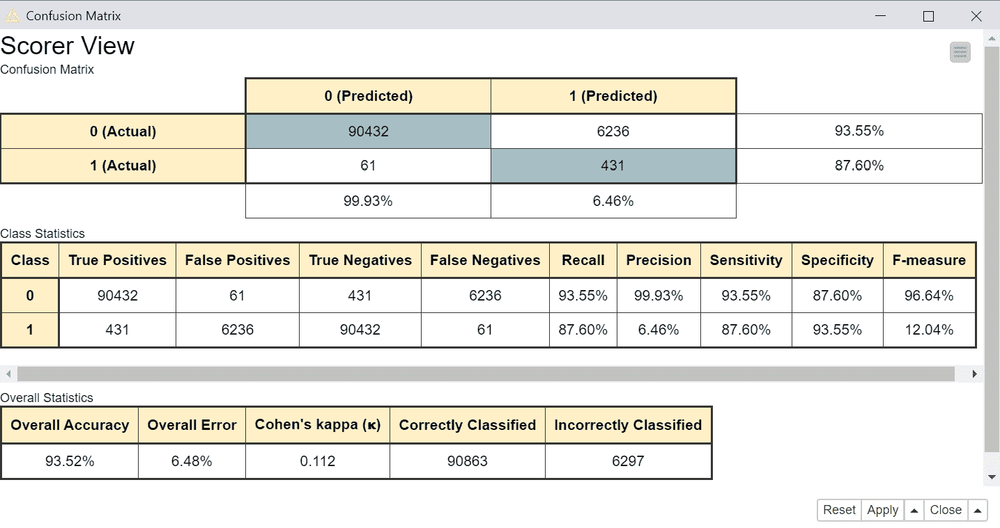

图 5.10–采用优化阈值 K 的最终欺诈检测器的性能指标

让我们把第一类(欺诈)看作积极的一类。大量的假阳性(6，236)显示了这种方法的弱点:它容易产生假阳性。换句话说，它倾向于将完全合法的交易贴上欺诈候选人的标签。现在，有案例研究表明假阳性不是一个大问题，这是其中之一。在误报的情况下，要付出的代价是向信用卡所有者发送关于当前交易的消息。如果信息被证明是无用的，与可能的风险相比，损失并不大。当然，这种容忍度并不适用于所有的案例研究。医疗诊断中的假阳性比信用卡交易中的错误欺诈警报承担更大的责任。

重要说明

通过在阈值 *K* 的定义中引入基于专业知识的偏见，整个过程也可能被迫更倾向于欺诈候选人或合法交易。

总的来说，自编码器在验证集中捕获 87%的欺诈交易和 93%的合法交易，总体准确率为 85%，Cohen's kappa 为 0.112。考虑到验证集中正常交易和欺诈交易数量之间的高度不平衡(96，668 对 492)，结果仍然令人乐观。

请注意，这种错误的阳性倾向方法对于案例研究来说是一种绝望的解决方案，在这种案例研究中，没有或者几乎没有来自某一类的例子。在带有标记样本的训练集上的监督分类器可能会达到更好的性能。但这是我们要处理的数据！

我们现在已经训练了自编码器，并为我们的规则系统找到了最佳阈值。在下一节中，我们将看到如何在真实的数据上部署它。

# 部署欺诈检测器

此时，我们有了一个自编码器网络和一个具有可接受的欺诈检测性能的规则。在本节中，我们将实现**部署**工作流。

与所有部署工作流一样，部署工作流(*图 5.11* )接收新的交易数据，将其通过自编码器，计算距离，应用欺诈检测规则，最后将输入交易标记为欺诈或合法。

此工作流程名为`02_Autoencoder_for_Fraud_Detection_Deployment`，可从 KNIME Hub 下载:[https://Hub . KNIME . com/kathrin/spaces/Codeless % 20 deep % 20 learning % 20 with % 20 KNIME/latest/Chapter % 205/](https://hub.knime.com/kathrin/spaces/Codeless%20Deep%20Learning%20with%20KNIME/latest/Chapter%205/):

图 5.11–部署工作流程

让我们详细看看工作流程的不同部分。

## 读取网络、新交易和规范化参数

在此工作流程中，首先使用**Keras 网络阅读器**节点从先前保存的 Keras 文件中读取 autoencoder 模型。

同时，使用**文件读取器**节点从文件中读取一些新信用卡交易的数据。这个特定的文件包含两个新的事务。

使用基于训练数据构建的相同参数对事务进行规范化，这些参数先前保存在名为`normalizer model`的文件中。使用**模型阅读器**节点从文件中读取这些标准化参数。

要读取的最后一个文件包含优化阈值的值， *K* 。

## 应用欺诈检测器

交易数据被输入自编码器网络，并通过 Keras 网络执行器节点在输出层再现。

之后，使用**数学公式**节点计算每个事务的原始特征和重构特征之间的 MSEs。

规则引擎节点应用在优化阶段定义的阈值，以检测可能的欺诈候选。

下表显示了两个事务的重建错误以及相应的类分配。应用程序(自编码器和距离规则)将第一笔交易定义为合法交易，将第二笔交易定义为欺诈候选交易:

图 5.12-用于部署的数据集中信用卡交易的重构错误和欺诈类别分配

## 采取行动

在工作流程的最后一部分，我们需要采取行动:

*   如果交易是合法的(类别 0) = >什么都不做
*   如果交易是欺诈候选(类别 1) = >向所有人发送消息进行确认

**IF-THEN** 涉及动作的条件通过开关块在 KNIME 分析平台中实现。与环路类似，交换块也有一个起始节点和一个结束节点。然而，交换块中的端节点是可选的。交换起始节点只激活一个输出端口，实际上只为数据流启用一条可能的进一步路径。交换端节点收集来自不同分支的结果。最通用的开关模块是**外壳开关**的所有倾斜功能:用于数据、流量变量或模型。

通过**开关箱启动**节点的配置窗口控制活动端口和活动分支。该配置设置通常由流量变量控制，其值每次启用一个或另一个输出。

在我们的例子中，我们有两个分支。上面的分支连接到端口`0`，由类`0`激活，不执行任何操作。第二个分支连接到端口`1`，由类`1`激活，并向信用卡所有者发送电子邮件。

我们在此结束关于实施基于自编码器的欺诈检测策略的部分。

# 总结

在这一章中，我们讨论了在没有或几乎没有欺诈类实例的绝望情况下，为信用卡交易构建欺诈检测器的方法。这种解决方案训练一个神经自编码器将合法的事务从输入层复制到输出层。一些后处理是必要的，以基于重建误差为欺诈候选设置警报。

在描述该解决方案时，我们介绍了培训和部署应用程序、组件、优化循环和交换机块的概念。

在下一章中，我们将讨论一类特殊的神经网络，即所谓的循环神经网络，以及如何使用它们来为序列数据训练神经网络。

## 问题和练习

通过回答以下问题，检查您对本章中介绍的概念的理解程度:

1.  What is the goal of an autoencoder during training?

    a)将输入复制到输出

    b)学习自编码

    c)对训练数据进行编码

    d)训练能够区分两个类别的网络

2.  What are common use cases for autoencoders?

    a)时间序列预测

    b)异常检测

    c)多类分类问题

    d)回归问题

3.  How can an autoencoder be used for dimensionality reduction?

    a)通过用比输入层数少的输出层训练网络

    b)通过训练自编码器并仅提取编码器

    c)通过构建自编码器并仅提取解码器

    d)通过建立具有比输入和输出层更多隐藏神经元的网络******