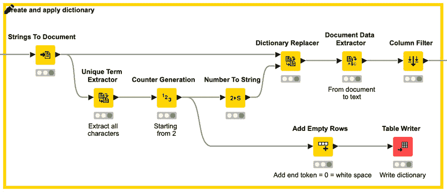

# 七、实现 NLP 应用

在 [*第六章*](B16391_06_Final_VK_ePUB.xhtml#_idTextAnchor181) 、*需求预测的循环神经网络*中，我们介绍了**循环神经网络** ( **RNNs** )作为一个神经网络家族，在分析序列数据方面特别强大。作为一个案例研究，我们训练了一个基于**长短期记忆** ( **LSTM** )的 RNN 来预测消耗电能时间序列中的下一个值。然而，随机神经网络不仅仅适用于严格的数字时间序列，因为它们也已经成功地应用于其他类型的时间序列。

RNNs 的另一个领域是自然语言处理。事实上，RNNs 已经成功地应用于文本分类、语言模型和神经机器翻译。在所有这些任务中，时间序列是单词或字符的序列，而不是数字。

在这一章中，我们将简要回顾一些经典的自然语言处理案例研究及其基于 RNN 的解决方案:一个情感分析应用程序、一个自由文本生成解决方案以及一个类似的新产品候选名称生成解决方案。

我们将从文本编码技术的概述开始，以准备单词/字符序列来输入我们的神经网络。然后，第一个案例研究基于文本的情感对其进行分类。最后两个案例研究分别将新文本生成为新单词序列，新单词生成为新字符序列。

在本章中，我们将讨论以下主题:

*   探索神经网络的文本编码技术
*   寻找客户的语气–情绪分析
*   使用 RNNs 生成自由文本
*   使用 rnn 生成产品名称

# 探索神经网络的文本编码技术

在 [*第 4 章*](B16391_04_Final_NM_ePUB.xhtml#_idTextAnchor101) 、*构建和训练前馈神经网络*中，您了解到前馈网络以及所有其他神经网络都是针对数字进行训练的，不理解名义值。在这一章中，我们想把单词和字符输入到神经网络中。因此，我们需要引入一些技术来将单词或字符的序列——也就是标称值的序列——编码成数字或数值向量的序列。此外，在使用 RNNs 的 NLP 应用程序中，在整个文本编码过程中，必须保持单词或字符在序列中的顺序。

在深入 NLP 案例研究之前，让我们先来看看一些**文本编码**技术。

## 索引编码

在第四章[](B16391_04_Final_NM_ePUB.xhtml#_idTextAnchor101)**建立和训练一个前馈神经网络*中，你学习了关于标称值的**指数编码**。想法是用一个整数值来表示每个名义类，也称为索引。*

 *我们可以将同样的想法用于文本编码。这里，我们不是用不同的索引对每个类进行编码，而是用不同的索引对每个单词或每个字符进行编码。首先，必须创建一个字典来将文本集合中的所有单词/字符映射到一个索引；之后，通过这种映射，每个单词/字符被转换成其相应的索引，因此，每个单词/字符序列被转换成相应的索引序列。最后，每个文本被表示为一系列索引，每个索引编码一个单词或一个字符。下图给出了一个例子:


图 7.1-通过单词级索引进行文本编码的例子

请注意，索引 1(代表单词*中的*)和索引 13(代表单词*中的棕色*)在序列中重复了两次，因为这些单词在例句中出现了两次，*快速的棕色狐狸跳过了棕色的狗*。

在本章后面的*寻找客户声音的语气–情绪分析*部分，我们将对单词使用索引编码来表示文本。

另一方面，在*使用 RNNs 的自由文本生成*部分，我们将使用一键向量作为字符的文本编码。让我们来探讨一下什么是一键矢量编码。

## 一键矢量编码

索引序列的缺点是它在单词/字符之间引入了人为的距离。例如，如果*苹果*编码为 1，*鞋*编码为 2，*梨*编码为 3，*苹果*和*梨*比*鞋*和*梨*(距离= 1)彼此距离更远(距离= 2)，这在语义上可能没有意义。这样，由于单词没有有序的结构，我们会在单词之间引入一个在现实中可能不存在的人为距离/相似度。我们在 [*第四章*](B16391_04_Final_NM_ePUB.xhtml#_idTextAnchor101) 、*建立和训练一个前馈神经网络*中也遇到了这个问题，我们通过引入一个热点向量的概念解决了这个问题。

`1`的概念是对特定的单词/字符进行编码，或者对`0`进行编码。这意味着每个单词/字符被表示为一个独热向量，因此，每个文本是一个独热向量序列。下图显示了句子*快速的棕色狐狸跳过棕色狗*的一个热点矢量编码示例。

注意，在*图 7.2* 中，单词*和*棕色*的单热向量在序列中重复两次:*

*

图 7.2–通过单词级的一键向量进行文本编码的例子

小费

请记住， **Keras 学习器**节点可以将基于索引的编码转换为独热向量。因此，为了在一个热点向量上训练神经网络，向其提供文本文档的基于索引的编码就足够了。

一种常用的文本编码——类似于一键向量，但不保留词序——是单词的`1`或缺失(`0`)。一个向量代表一个文本文档，包含多个 1。请注意，这种编码不保留单词顺序，因为所有文本都在相同的矢量结构中编码，而不管单词顺序。

使用单词时，一个热点向量的维数等于字典的大小，也就是说，等于文档语料库中可用的单词数。如果文档语料库很大，字典大小很快就变成了整个语言的字数。因此，单词级的一键矢量编码会导致非常大和稀疏的表示。

使用字符时，字典大小就是字符集的大小，即使包括标点符号和特殊符号，也比前面的情况小得多。因此，一键向量编码非常适合字符编码，但可能导致单词编码的维数爆炸。

要在单词级别对文档进行编码，更合适的方法是嵌入。

## 用于单词编码的嵌入

单词嵌入的目标是将单词映射到几何空间。这是通过将数字向量与字典中的每个单词相关联来实现的，使得具有相似含义的单词具有相似的向量，并且任意两个向量之间的距离捕获两个相关单词之间的部分语义关系。这些向量形成的几何空间称为*嵌入空间*。对于字编码，嵌入空间的维数(只有几十或几百)比一键矢量编码的矢量空间(大约几千)低。

为了学习每个单词到连续向量空间的投影，使用了专用的神经网络层，称为嵌入层。这一层学习将向量表示与每个单词相关联。最著名的单词嵌入技术是 **Word2vec** 和**手套**。

有两种方法可以使用单词嵌入(J. Brownlee，*如何使用单词嵌入层与 Keras 进行深度学习*，机器学习 Mastery Blog，2017，[https://machinelingmastery . com/Use-Word-Embedding-Layers-Deep-Learning-Keras/](https://machinelearningmastery.com/use-word-embedding-layers-deep-learning-keras/)):

*   采用预先在一些外部文本语料库上训练的现成层
*   训练一个新的嵌入层作为神经网络的一部分

如果与神经网络联合训练，嵌入层的输入是基于索引的编码序列。嵌入层中输出单元的数量定义了嵌入空间的维数。在网络训练期间学习嵌入层的权重，该权重用于计算每个索引的嵌入表示，并因此计算每个单词的嵌入表示。

现在我们已经熟悉了不同的文本编码技术，让我们继续我们的第一个 NLP 用例。

# 寻找客户的语气——情绪分析

NLP 的一个常见用例是**情感分析**。在这里，我们的目标是识别一些文本中潜在的情绪，无论是积极的还是消极的，以及其间的所有细微差别。情感分析在许多领域中被实现，例如分析到来的消息、电子邮件、评论、记录的对话以及其他类似的文本。

一般来说，情感分析属于被称为文本分类的一个更大的 NLP 应用组。在情感分析的情况下，目标是预测情感类别。

文本分类的另一个常见例子是语言检测。这里的目标是识别文本语言。在这两种情况下，如果我们使用 RNN 来完成任务，我们需要采用*多对一架构*。多对一神经架构在不同时间接受一系列输入，，并使用输出单元的最终状态来预测一个单一的类别——即情感或语言。

*图 7.3* 显示了一个多对一拱形结构的例子:


图 7.3–一个多对一神经架构的例子:在不同时间的许多输入的序列，只有输出的最终状态

在本章的第一个用例中，我们想要分析电影评论的情感。目标是用一个嵌入层和一个 LSTM 层在单词级别训练一个 RNN。

对于这个例子，我们将使用 IMDb 数据集，它包含两列:电影评论的文本和情感。对于正面评价，情绪被编码为`1`，对于负面评价，情绪被编码为`0`。

*图 7.4* 向您展示了一小部分正面和负面的电影评论:


图 7.4-IMDb 数据集的摘录，显示了正面和负面的评论

让我们从阅读和编码电影评论的文本开始。

## 预处理电影评论

嵌入层期望基于索引的编码输入序列。也就是说，每个评论必须被编码为一个索引序列，其中每个索引(一个整数值)代表字典中的一个单词。

由于 IMDb 文档语料库中可用的单词数量非常大，我们决定在文本预处理阶段通过删除停用词并将所有单词缩减到词干来减少这些单词。此外，只有训练集中最常用的术语使用专用索引进行编码，而所有其他术语仅接收默认索引。

理论上，RNNs 可以处理可变长度的序列。然而，在实践中，一个训练批次中所有输入样本的序列长度必须相同。由于每次审查的字数可能不同，我们定义了一个固定的序列长度，并对过短的序列进行零填充，即添加 0 来完成序列，并截断过长的序列。

所有这些预处理步骤都应用于训练集和测试集，只有一个区别。在训练集的预处理中，创建具有最频繁术语的字典。然后，该字典仅在 t est 集合的预处理期间被应用。

总之，我们执行以下预处理步骤:

1.  读取数据集并将其划分为训练集和测试集。
2.  对训练集和测试集中的电影评论进行分词、清理和词干处理。
3.  创建一个包含所有术语的字典。训练集中最频繁的术语由专用索引表示，所有其他术语由默认索引表示。
4.  将训练集和测试集中的单词映射到相应的词典索引。
5.  截断训练集和测试集中过长的单词序列。
6.  训练集和测试集中的零填充过短序列。

图 7.5 中的工作流程执行所有这些步骤:


图 7.5–情绪分析案例研究的预处理工作流片段

第一个元节点**读取并划分数据**，读取包含电影评论和情感信息的表，并将数据集划分为训练集和测试集。**预处理训练集**元节点对训练集执行不同的预处理步骤，并创建和应用字典，该字典在第二输出端口可用。最后一个元节点，**预处理测试集**，将创建的字典应用于测试集，并在测试集上执行不同的预处理步骤。

让我们看看所有这些步骤是如何在 KNIME 分析平台中实现的。

### 读取和分区数据集

第一部分，读取和分区数据集，由**读取和分区数据**元节点执行。

*图 7.6* 显示了 m 电子节点中的工作流片段:


图 7.6–读取和分区元节点内部的工作流片段

**读表器**节点读取情感信息为整数值、影评为字符串值的表。接下来，情感信息被转换成具有**号的字符串，以串**节点。这个步骤对于允许在**分区**节点中进行分层采样是必要的。在最后一步中，使用**字符串对**节点进行编号，将列情感的数据类型转换回整数，以便在 Keras 学习器节点训练期间将其用作目标列。

现在我们有了一个训练集和一个测试集，让我们继续训练集的预处理。

### 预处理训练集和字典创建

训练集的预处理和字典的创建在**预处理训练集**元节点中执行。

*图 7.7* 展示了 t he 元节点的内部:


图 7.7–预处理训练集元节点内的工作流片段

对于电影评论的预处理，使用了 **KNIME 文本处理**扩展。

小费

KNIME 文本处理扩展包括从各种文本格式读取文档和向各种文本格式写入文档的节点；改造文字；清理句子中的假字和无意义的词；将文本转换成数字表格；计算所有必需的文本统计信息；最后，探索话题和情感。

KNIME 文本处理扩展依赖于一种新的数据类型:**文档对象**。当附加元数据(如标题、作者、来源和类别)添加到原始文本中时，原始文本就变成了文档。文档中的文本按照许多可用的特定于语言的标记化算法之一进行标记化。**文档标记化**产生文本项的层次结构:章节、段落、句子和单词。单词通常被称为记号或术语。

为了使用 KNIME 文本处理扩展的预处理节点，我们需要通过文档节点的**字符串将电影评论转换成文档。这个节点收集来自不同列的值，并在标记主文本后将它们转换成一个文档对象。**

*图 7.8* 显示了**字符串到 D 文档**节点的配置窗口:


图 7.8–字符串到文档节点的配置窗口

节点为您提供了定义以下内容的机会:

*   通过**全文**选项的文档文本。
*   文档标题，作为**列**、**行 ID** ，或**空字符串**的值。
*   作为固定字符串或列值的文档来源、文档类别、文档作者和文档发布日期。如果使用列值，记得启用相应的标志。通常，**文档类别**字段用于存储任务类。
*   单据类型，如**交易**、**进行中**、**账面**，或者只是**未知**。
*   输出文档列的名称。
*   执行单词标记器的最大并行进程数。
*   单词标记器算法。

接下来，通过一系列文本预处理节点清理文档对象，这些节点包含在*图 7.7* 中工作流的**文本预处理**组件中。**文本预处理**组件内部如图*图 7.9* 中的所示:


图 7.9–显示预处理组件内部的工作流片段

工作流片段以**标点删除**节点开始，从输入文档中删除所有标点。

**数字过滤器**节点过滤掉所有数字，用数字表示，包括小数点(**、**或**)。**)和可能的前导符号( **+** 或 **-** )。

**N Chars Filter** 节点过滤掉所有少于——在我们的例子中是——字符的术语，如节点的配置窗口中所指定的。

填充词，如*所以*、*所以*等等，都是称为**停止词**。它们携带的信息很少，可以用**停止字过滤器**节点移除。此节点过滤出包含在所选停用词表中的所有术语。可以通过第二个输入端口将自定义的停用词表传递给节点，或者可以采用默认的内置停用词表。许多内置的停用词表可用于各种语言。

**大小写转换器**节点将所有术语转换成大写或小写。在本案例研究中，它们被转换成小写字母。

最后，**雪球斯特梅尔**节点使用雪球词干库([http://snowball.tartarus.org/](http://snowball.tartarus.org/))将单词缩减到它们的词干，移除语法变形。

重要说明

词干化的目标是将屈折形式和派生相关形式简化为一个共同的基本形式。比如*看*、*看*、*看*、*看*都换成了他们的梗、*看*。

既然我们已经清理了训练集的电影评论文本，我们就可以创建字典了。

#### 基于训练集创建字典

字典必须给每个单词分配两个索引:

*   **索引**:训练集中每个最频繁项的渐进整数索引，以及所有其他项的相同默认索引。
*   **计数器**:每个单词的渐进八位数索引。这个八位数的索引只是一个临时索引，它将帮助我们处理截断问题。

*图 7.10* 显示了你要创建的字典的一个子集:


F 图 7.10–字典的一个小子集，其中每个单词由一个渐进的整数索引和另一个渐进的八位整数索引表示

两个索引都是在**创建字典**组件中创建的，图 7.11 显示了组件内部的工作流片段:


图 7.11–包含在创建字典组件中的工作流片段

**创建字典**组件有一个配置窗口，如图 7.12 所示。配置窗口中的输入选项继承自整数配置节点，请求字典大小为文档集合中最频繁出现的单词的数量。默认为:


图e 7.12–创建字典组件的配置窗口

组件内部的工作流首先通过使用**唯一术语提取器**节点在所有文档上创建一组全局唯一术语:


图 7.13–唯一术语提取器节点的配置窗口

该节点允许我们创建索引列和频率列，如前面的屏幕截图所示。索引列包含一个从`1`开始的递增整数，其中`1`被分配给最频繁出现的术语。

节点可选地提供过滤前 *k* 个最频繁的术语的可能性。为此，有三种频率度量可用:**术语频率**、**文档频率**和逆文档频率。现在，我们想选择所有的术语，稍后我们将处理字典的大小。

重要说明

**词频** ( **TF** ):一个词在所有文档中出现的次数

**文档频率** ( **DF** ):一个术语出现的文档数量

**逆文档频率** ( **IDF** ):文档数除以 DF 的对数

八位数索引通过`1`作为步长创建。这个最小值保证了八位数的格式。

然后将**索引**和**计数器**列从整数转换为字符串，并将**号转换为字符串**节点。

接下来是字典大小的缩减。顶部的最频繁的术语保持由**唯一术语提取器**节点分配的的渐进索引，而所有其他术语获得默认索引。记住可以通过组件的配置窗口进行更改。在本例中，被设置为 20，000。在组件子工作流的下部，**行拆分器**节点将输入数据表拆分成两个子表:最上面的行(顶部输出端口)和其余的行(底部输出端口)。

然后**常数值列**节点用下级子表中的默认指标值替换所有指标值。最后，将两个子表连接在一起。

既然字典已经准备好了，我们可以继续删节影评了。

#### 截断过长的文档

我们已经声明我们将使用固定大小的文档——也就是说，每个文档使用最大字数。如果文档的字数超过了允许的字数，它将被截断。如果它的字数少于允许的字数，它将被零填充。让我们看看**截断**过程是如何工作的——也就是说，我们如何从过长的文档中删除最后的单词。这一切都发生在**截断**组件中。*图 7.14* 显示了组件内部的工作流片段:


图7.14–截断组件内的工作流片段

首先，我们设置文档中允许的术语的最大数量，。同样，这是一个可以通过组件的配置窗口改变的参数，通过**整数配置**节点进行整形。我们将文档中的最大术语数(即最大文档尺寸)设置为术语。如果一个文档太长，我们应该只保留第一个术语，扔掉其余的。

统计一篇课文的字数是不容易的。因为单词的长度是可变的，所以我们应该检测循环中单词之间的空格，然后计算单词的个数。然而，循环通常会降低执行速度。因此，另一个技巧是使用文本中单词的八位数字表示。

在文本中，每个单词通过**字典替换器**节点被其八位数代码替换。**字典替换器**节点将顶部输入端口的输入文档中的术语与底部输入端口的字典术语进行匹配，然后用字典表中的相应值替换它们。

**字典替换器**节点有两个输入端口:

*   包含要替换的术语的文档的上部输入端口
*   The lower input port with the dictionary table for the matching and replacement operation

    重要说明

    字典表必须至少包含两个字符串列。一个字符串列包含要替换的术语(键)，另一个字符串列包含替换字符串(值)。在配置窗口中，我们可以在较低的输入端口设置数据表中的两列。

在这一点上，我们有固定长度的文本(`8 digits + 1 <space>`)而不是可变长度的单词。因此，将文本限制为个单词与将文本限制为个字符相同，如果为 720 个字符。这个操作在没有循环或复杂节点结构的情况下执行要容易得多，但是只需要一个**字符串操作**节点。然而，**字符串操作**节点作用于字符串对象而不是文档。要使用它，我们需要暂时回到字符串形式的文本。

使用**文档数据提取器**节点从文档中提取简单字符串形式的文本。此节点从文档单元格中提取信息，例如文本和标题。

**数学公式(变量)**节点获取最大文档大小的流变量，并计算文档中允许的最大字符数。

使用`substr()`功能，`0`直到允许的最大字符数。这实际上只保留了顶部的项，而删除了所有其他项。

最后，文本被转换回一个文档，称为**截断文档**，所有多余的列在**列过滤器**节点中被删除。

在这一点上，八位数的索引已经完成了它们的任务，可以用渐进式整数索引来代替它们进行编码。这在**字典替换器**节点中再次完成。

这样，我们就将过长的文档截断到了允许的最大数量。接下来，我们需要对过短的文档进行补零。

#### 零填充过短的文档

当序列相对于设定数量的值过短时，通常会应用**零填充**。补零意味着 0 被添加到序列中，直到达到设定的数值数。在我们的例子中，如果一个文档的字数少于设定的数量，我们用 0 填充剩余的空白空间。这发生在**零填充**组件中。

*图 7.15* 显示了零填充组件内部的工作流片段:


图 7.15–零填充组件内部的工作流片段

零填充再次在字符串级执行，而不是在文档级。使用`<space>`将文本从输入文档中提取为字符串，并为每个索引创建一个新列。

请记住，所有截断的文本现在都有一个最大长度的索引。因此，根据这些文本，新生成的列的数量肯定是。对于所有其他具有短期序列的文本，**单元格拆分器**节点将用缺失值填充空列。将这些丢失的值变成 0 就足够了，并且填零过程完成。由**缺失值**节点执行缺失值替换为 0。

最后，删除**列过滤器**节点中所有多余的列。

既然所有的术语序列——也就是所有的文本——都有相同的长度，那么就用 **Create Collection Cell** 节点来创建集合单元，以提供给 Keras Learner 节点。

接下来，我们需要对测试执行相同的预处理，并应用创建的字典。

### 预处理测试集

测试集的预处理在**预处理测试集**元节点中进行。该元节点有两个输入端口:在**预处理训练集**元节点中创建的字典的上部端口和测试集的下部端口。

*图 7.16* 显示了预处理测试集元节点内部的工作流片段:


图 7.16–预处理测试集元节点内的工作流片段

工作流的下半部分类似于**预处理训练集**元节点内的工作流片段，只有包括创建字典的部分不同。这里，测试集的字典基于来自训练集的字典。训练集字典中可用的所有术语都接收相应的索引编码；所有剩余的术语都接受默认索引。

因此，首先使用**唯一术语提取器**节点创建测试集中所有术语的列表。接下来，使用右外连接将该列表与训练集字典中的术语列表连接起来。右外连接允许我们保留来自较低输入端口的所有行——即测试集中的所有术语——并添加来自训练字典的索引(如果可用的话)。对于不在训练字典中的所有术语，joiner 节点在索引列中创建缺失值。然后使用**缺失值**节点将这些缺失值替换为默认索引值。

所有其他步骤，例如截断和零填充，以与训练集预处理相同的方式执行。

我们已经完成了预处理阶段，现在可以继续定义网络架构及其训练。

## 定义和训练网络架构

在这一部分，我们将定义并训练用于这一情感分类任务的网络架构。

### 网络体系结构

我们想使用一个位于 LSTM 的 RNN，我们也在那里训练嵌入。嵌入由嵌入层训练。因此，我们创建了一个具有四层的神经网络:

*   一个**输入层**定义输入尺寸
*   一个**嵌入层**，用于产生术语空间的嵌入表示
*   一个 **LSTM 层**来利用文本的顺序属性
*   一个**密集层**，其中一个单元具有 sigmoid 激活函数，因为我们手头有一个二元分类问题

嵌入层期望一系列基于索引的编码项作为输入。因此，输入层必须接受整数索引的序列(在我们的例子中是)。这意味着 **Keras 输入层**节点的配置窗口中的`Shape = 80`和`data type = Int 32`。

接下来， **Keras 嵌入层**节点必须学会将整数索引嵌入到一个合适的高维向量空间中。*图 7.17* 显示了其配置窗口。输入张量直接从前一输入层的输出中恢复:


图 7.17–Keras 嵌入层节点的配置窗口

对于`128`，有两个重要的配置设置。`[sequence length`  `, embedding dimension]`的输出张量。在我们这里，这是`[80, 128]`。

接下来是`128`单元，表示`Units = 128`、`Activation = Tanh`、`Recurrent activation = Hard sigmoid`、`Dropout = 0.2`、`Recurrent dropout = 0.2`，以及返回序列、返回状态、后退，并展开所有`unchecked`。

最后，使用一个具有 sigmoid 激活函数的单元的 **Keras 密集层**节点来预测最终的二元情感分类。

现在我们有了预处理数据和神经结构，我们可以开始训练网络了。

### 用嵌入训练循环网络

像往常一样，用**Keras 网络学习器**节点训练网络。

在第一个标签页中，**输入数据**，选择**从集合数(整数)**转换，因为我们的输入是一个集合单元格的整数值(索引)，编码我们的电影评论。接下来，选择收集单元作为输入。

在第二个选项卡中，选择**目标数据**、来自数字(整数)转换类型的**和带有情感类别的列。在下半部分，选择二元交叉熵作为损失函数，因为它是一个二元分类任务。**

在第三个选项卡中，`Epochs = 30`、`Training batch size = 100`，在每个时期被激活之前混洗训练数据，以及`Optimizer = Adam`(使用默认设置)。

现在网络已经训练好了，我们可以将它应用到测试集中，并评估它在预测评论文本背后的情感方面的表现有多好。

## 在测试集上执行和评估网络

为了在测试集上执行网络，使用 **Keras 网络执行器**节点。

在配置窗口中，我们再次从数字(整数)集合中选择**作为转换类型，并选择集合单元格作为输入。**

作为输出，我们对最后一个密集层的输出感兴趣，因为这给了我们情绪等于`1`(正)的概率。因此，我们点击**添加输出**按钮，选择 sigmoid 层，并确保使用**到数字(double)** 转换。

`1`。

接下来，**规则引擎**节点用下面的表达式将这个概率转换成类别预测:

```
$dense_1/Sigmoid:0_0$ > 0.5 => 1
TRUE => 0
```

这里，`$dense_1/Sigmoid:0_0$`是网络输出列的名称。

该表达式将`0.5`以上的所有值转换为 1，否则转换为 0。

重要说明

请记住，**规则引擎**节点中的不同指令行是顺序执行的。当一行中的先行项得到验证时，执行停止。

最后，**计分器**节点评估模型的性能， **Keras 网络编写者**节点保存训练好的网络用于部署。*图 7.18* 显示了网络性能，在**评分者**节点看来，在电影评论上实现了 83%的正确情感分类:


图 7.18–基于 LSTM 和嵌入的网络在情感分类上的性能

至此，我们完成了第一个 NLP 案例研究。*图 7.19* 显示了用于实施该示例的完整工作流程。您可以从位于 https://Hub . KNIME . com/kath rin/spaces/Codeless % 20 deep % 20 learning % 20 with % 20 KNIME/latest/Chapter % 207/:


图图 7.19–准备文本并构建、训练和评估用于情感分析的神经网络的完整工作流程

目前，我们不提供部署工作流程。在 [*第十章*](B16391_10_Final_VK_ePUB.xhtml#_idTextAnchor367) ，*部署深度学习网络*中，我们将回到这个经过训练的网络来构建部署工作流程。

现在让我们转到下一个 NLP 应用程序:用 RNNs 生成自由文本。

# 使用 RNNs 生成自由文本

既然我们已经看到了如何使用 RNNs 进行文本分类，我们可以继续下一个案例研究。这里，我们希望训练一个 RNN 以某种风格生成新的自由文本，可以是莎士比亚式的英语、说唱歌曲，或者模仿格林兄弟的童话。我们将关注最后一个应用程序:训练一个网络来生成格林兄弟童话风格的自由文本。然而，网络和过程可以很容易地调整，以产生新的说唱歌曲或旧莎士比亚英语文本。

那么，我们如何训练 RNN 生成新的文本呢？

## 数据集

首先你需要一个文本语料库来训练网络生成新的文本。任何文本语料库都好。但是，请记住，用于培训的文本将定义自动生成的文本的样式。如果你在莎士比亚戏剧上训练网络，你会得到旧莎士比亚英语的新文本；如果你在说唱歌曲上训练网络，你会得到都市风格的文字，甚至可能有押韵；如果你对网络进行童话训练，你会得到童话风格的文本。

因此，对于一个产生新童话的网络来说，它必须根据现有的童话进行训练。我们从古腾堡计划、https://www.gutenberg.org/ebooks/2591 下载了格林兄弟文集。

## 预测单词还是字符？

要做的第二个决定是在单词或字符级别训练网络。两种选择各有利弊。

在单词层次上训练一个网络听起来更符合逻辑，因为语言是由单词而不是字符构成的。输入序列(单词序列)很短，但是字典大小(领域中的所有单词)很大。另一方面，在字符级别训练网络依赖于更小、更易管理的字典，但可能会导致很长的输入序列。例如，根据维基百科，英语有大约 170，000 个不同的单词，只有 26 个不同的字母。即使我们区分大写和小写，并添加数字、标点符号和特殊字符，我们的字典也只有不到 100 个字符。

我们想训练一个网络来生成格林兄弟风格的文本。为了做到这一点，我们用几个格林童话兄弟来训练网络，这已经意味着字典中有大量的单词。因此，为了避免庞大的字典和随之而来的可能难以管理的网络规模的问题，我们选择在角色层面上训练我们的童话生成器。

字符级的训练意味着网络必须学会在过去的字符通过输入后预测下一个字符。然后，训练集必须包含许多字符序列的样本以及下一个要预测的字符(目标值)。

在部署期间，字符的开始序列必须触发网络生成新文本。事实上，这第一个序列预测下一个字符；然后在下一步中，最近的初始字符和预测的字符将组成新的输入序列来预测下一个字符，以此类推。

在下一节中，我们将解释如何清理、转换和编码来自格林童话的文本数据，以提供给网络。

## 预处理和编码

我们使用滑动窗口方法填充训练集——也就是说，使用部分重叠的序列。为了更清楚，让我们使用窗口长度和滑动步长`1`将句子`Once upon a time`包含在训练集中。这五个字`Once<space>`应该预示着`u`；然后我们将窗口向右滑动一步，`nce<space>u`应该会预测到`p`。同样，我们将窗口向右滑动一个字符，`ce<space>up`应该预测`o`，依此类推。

在*图 7.20* 的左侧，您可以看到创建的输入序列和目标值:


图 7.20–用于训练的重叠序列示例

接下来，我们需要来编码字符序列。为了避免在字符之间引入人为的距离，我们选择了一键矢量编码。我们将分两步执行一键编码。首先，我们执行基于索引的编码；然后我们在 **Keras 网络学习器**节点通过**从数(整数)集合**转换选项到**独热张量**转换成独热编码。训练集的重叠索引编码序列显示在图 7.20 的右侧。

下图中的工作流片段读取童话故事，并将其转换为基于重叠索引的编码字符序列及其关联的目标字符。输入序列和目标字符都存储在集合类型的列中:


图 7.21-预处理工作流片段阅读和转换格林兄弟童话中的文本

工作流程执行以下步骤:

*   从语料库中读取所有的童话，并提取五个用于训练的童话和`Snow white and Rose red`作为部署的种子
*   改变文本的形状，在一列中每行放置一个字符
*   创建并应用基于索引的字典，在这种情况下，字典由字符集组成，包括标点符号和特殊符号
*   使用**滞后列**节点，创建重叠序列，然后将它们从序列中最老的字符到最新的字符重新排序
*   将输入序列和目标字符封装到集合类型的列中

让我们详细看看这些步骤。

### 阅读和摘抄童话

工作流片段，在**读取和提取童话**元节点中，首先使用**文件读取器**节点读取童话。该表有一列，每行的内容对应一个童话故事中的一行。

然后，**行过滤器**节点删除文件顶部和底部不必要的元信息，比如作者、标题、目录和许可协议。在培训或部署过程中，我们不会使用任何此类元信息。

顶部输出端口的`Snow white and Rose red`和所有其他的童话故事。我们将保存`Snow white and Rose red`以便部署。

接下来，一个**行过滤器**节点被用来提取前五个童话，用于训练。

下一步是将文本重新整形为一列字符序列。

### 重塑文本

在我们可以创建字符的重叠序列来输入网络之前，我们需要将所有的童话文本转换成一个由单个字符组成的长序列(列):每行一个字符。这个步骤被称为**整形**，它在**整形文本**元节点中实现。*图 7.22* 显示了其内容 ts:


图 7.22–重塑文本元节点内部的工作流片段

它以两个`<space>`字符开始，通过使用`regexReplace()`函数。`regexReplace()`利用正则表达式，比如`"[^\\s]"`匹配输入字符串中的任何字符，而`"$0 "`匹配的字符加上`<space>`。在`$Col0$`中使用的`regexReplace()`函数的最终语法如下:

```
regexReplace($Col0$,"[^\\s]" ,"$0 ")
```

接下来是`<space>`字符，产生许多列，每个单元格一个字符。

请注意，段落中的最后一个字符(换行符)后面没有接收到`<space>`字符。为了解决这个问题，使用**常量值列**节点添加一个带有`<space>`字符的常量列。

**取消透视**节点将数据表从多列重组为只有一列的单个字符序列。让我们花一点时间在 **Unpivoting** 节点和它用来重塑数据表的意想不到的技巧上。 **Unpivoting** 节点对输入的数据表进行分解。*图 7.23* 显示了一个例子。它区分值列和保留列。然后，选定的值列旋转成为行，并附加到保留列中的相应值。由于值列的旋转可能会产生多行，因此可能有必要复制保留列值的行:


图 7.23–取消透视操作的示例，其中产品 1 和产品 2 是选定的值列，ID 和 City 是选定的保留列

对于文本的整形,我们将所有列设置为值列，无列设置为保留列。结果是童话被表示为一列中的一长串字符。

最后，进行一些清理:用**行过滤器**节点删除所有缺失值的行。

### 创建和应用词典

我们现在需要为基于索引的编码创建字典和基于索引的映射。由于我们在角色层面工作，这里的字典只不过是字符集——也就是童话语料库中唯一的角色列表。为了得到这个列表，我们使用**删除重复过滤器**节点从整形后的文本中删除所有重复的字符。

小费

在检测和处理数据集中的重复记录时，**删除重复过滤器**节点是一个强大的节点。

接下来，我们给每一行分配一个索引——也就是给每个独特的字符——用`0`代表`1`代表**比例单位**。

现在我们已经准备好了字典，我们用**单元替换器**节点应用它，已经在 [*第 4 章*](B16391_04_Final_NM_ePUB.xhtml#_idTextAnchor101) 、*构建和训练前馈神经网络*中介绍过。

### 创建和重新排序重叠序列

为了创建字符的重叠序列，我们使用`100`、`1`，并跳过输出表开头和结尾的不完整行。

按照这个方式`col-100`是在最右边的一列；要预测的当前字符(`col`)在最左边的列中。基本上，序列的时间相对于网络所期望的是向后排序的。

下图向您展示了一个例子:


图 7.24–滞后列节点的结果输出，其中时间按从右到左的升序排序

我们需要对列进行重新排序，以遵循从左到右的升序，从而使最老的字符在左边，最近的字符在右边。这种重新排序是由 **Resort 列**元节点执行的。

*图 7.25* 显示了 t he 元节点的内部:


图 7.25–包含在度假村列元节点中的工作流片段

这里，**参考列再吸收器**节点根据在较低输入端口的数据表中建立的顺序，改变在顶部输入端口的表中的数据列的顺序。下部输入端口处的参考数据表必须包含一个字符串类型的列，其中第一个输入表中的列标题按特定顺序排列。然后，根据第二个数据表中列名的行顺序对第一个数据表中的列进行排序。

为了创建带有排序列标题的表格，我们用**提取列标题**节点提取列标题。**提取列标题**节点从表格内容中分离列标题，并在顶部输出端口输出列标题，在下部输出端口输出内容。

然后，列标题的行被转置成具有转置节点**的列。**

最后，我们通过**计数器生成**节点为每个列标题分配一个递增的整数，并使用**排序器**节点按计数器值降序对它们进行排序。

现在我们已经及时正确地排序了第一个表的列标题，我们可以在**引用列引用器**节点的下部端口输入它。结果是一个数据表，其中每一行都是一个字符序列，时间从左到右排序，后续行包含重叠的字符序列。此时，我们可以为网络的输入和目标数据创建收集单元。

重要说明

即使目标数据只包含一个值，我们仍然需要将它转换成一个集合单元，这样索引就可以由 **Keras 网络学习器**节点转换成一个热点向量。

让我们进入下一步:定义和训练网络架构。

## 定义和训练网络架构

现在让我们设计并训练一个合适的神经网络架构来处理时间序列、字符编码和过拟合，并预测序列中的下一个字符。

### 定义网络架构

对于这个案例研究，我们决定使用一个有四层的神经网络:

*   一个 **Keras 输入层**，定义输入形状
*   一个 **Keras LSTM 层**，用来处理时间序列
*   一个 **Keras 脱落层**，防止过度贴合
*   一个 **Keras 密集层**，输出下一个字符的概率

像往常一样，我们用一个`?, 65`来定义神经网络的输入形状。

由于我们不需要中间隐藏状态，我们在`512`中将大多数设置保留为默认。

自由文本生成可以看作是一个多类分类应用程序，其中的字符就是类。因此，网络输出端的 **Keras 密集层**节点用 softmax 激活函数设置为 65 个单元(字符集中的每个字符一个单元)，来评分每个字符成为下一个字符的概率。

让我们继续在编码重叠序列上训练这个网络。

### 训练网络

同样，为了训练网络，我们使用现在已经熟悉的 **Keras 网络学习器**节点。

在第一个配置选项卡中，**输入数据**，我们从数字(整数)到单热张量的集合中选择**来处理编码转换，并将字符序列作为输入的集合列。**

在第二个配置选项卡**目标数据**中，我们在包含目标值的集合列上再次从数字(整数)到单热张量的集合中选择**。由于这是一个多类分类问题，我们将损失函数设置为**分类交叉熵**。**

在第三个配置选项卡中，`50 epochs`，训练批量`256`，洗牌选项`on`，优化器为`Adam`，默认设置为学习率。

网络最终以 **Keras 格式**保存，带有 **Keras 网络作者**节点。此外，使用 **Keras 到 TensorFlow 网络转换器**节点将网络转换为 TensorFlow 网络，并使用 **TensorFlow 网络写入器**节点保存。TensorFlow 网络用于部署，以避免 Keras 网络所需的耗时的 Python 启动。

*图 7.26* 显示了实现所有描述步骤的完整工作流程，以训练神经网络生成童话故事。此工作流和使用的数据集可在 KNIME Hub 上获得，网址为 https://Hub . KNIME . com/kath rin/spaces/Codeless % 20 deep % 20 learning % 20 with % 20 KNIME/latest/Chapter % 207/:


图 7.26-训练神经网络生成童话的工作流程

现在我们已经训练并保存了网络，让我们继续部署以生成新的童话文本。

## 构建部署工作流

为了在部署期间触发新文本的生成，我们从与每个训练序列长度相同的输入序列开始()。我们把这个序列输入网络来预测下一个字符；然后，我们删除序列中最老的字符，添加预测的字符，并再次将网络应用于新的输入序列，等等。这与我们在需求预测案例研究中使用的程序完全相同。因此，我们将在这里用递归循环再次实现它(*图 7.27* ):


图 7.27–生成新自由文本的部署工作流

触发序列取自**白雪公主和玫瑰红**童话。触发序列的文本经过预处理、排序和编码，就像在用于训练网络的工作流中一样。这在**读取和预处理**元节点中完成，如图*图 7.28* 所示:


F 图 7.28–读取和预处理元节点中的工作流内容，以读取和预处理触发序列

该工作流程从训练工作流程中创建的文件中读取**白雪公主和玫瑰红**童话以及字典。然后，应用与训练工作流中相同的预处理步骤。

之后我们读取训练好的 TensorFlow 网络，用 **TensorFlow 网络执行器**节点应用到触发序列。

网络的输出是每个字符成为下一个字符的概率。我们可以按照两种可能的策略选择预测的角色:

*   概率最高的字符被指定为下一个字符，称为贪婪策略。
*   根据概率分布随机选取下一个字符。

我们已经在两个不同的部署工作流中的**提取索引**元节点中实现了这两种策略。

*图 7.29* 显示了实施第一种策略时**提取索引**元节点的内容:


F 图 7.29-提取概率最高的字符的工作流片段

这个元节点将执行网络的输出概率作为输入，并提取概率最高的字符。这里的关键节点是**多对一**节点，它从网络输出中提取得分(概率)最高的单元。

*图 7.30* 显示了实施第二种策略时**提取索引**元节点的内容:


图 7.30-根据概率分布选择下一个字符的工作流片段

这个工作流片段期望字符的概率分布作为输入，并根据它选择一个。这里的关键节点是**随机标签分配器(数据)**节点，它根据输入的概率分布分配一个值。

**随机标签分配器(数据)**节点基于上输入端口的概率分布，为下输入端口的每个数据行分配一个索引。上面输入端口的数据表必须有两列:一列是类值——在我们的例子中，是字符串格式的索引编码字符——另一列是相应的概率。因此，*图 7.30* 中工作流片段的第一部分使用**转置**节点、**计数器生成**节点和**数字到字符串**节点，从网络输出为**随机标签分配器(数据)**节点的顶部输入端口准备数据表，而**表创建者**节点使用**表创建者**创建一个只有一行的新表这意味着**随机标签分配器(数据)**节点然后基于第一输入端口的表格定义的概率分布挑选一个索引。****

小费

在第 6 章 、*用于需求预测的循环神经网络*中详细解释了递归循环的思想及其实现。

您可以从 KNIME Hub 下载实现这两个选项的部署工作流:https://Hub . KNIME . com/kath rin/spaces/Codeless % 20 deep % 20 learning % 20 with % 20 KNIME/latest/Chapter % 207/。

## 新童话

最后，我肯定你想看到网络能够产生的那种免费文本。下面是一个自由生成文本的例子，使用第一种策略。

100 个字符的触发序列(非斜体)来自童话故事的第一句话*白雪公主和玫瑰红*。剩余的文本由网络自动生成。

从前，有一个贫穷的寡妇住在一个偏僻的小屋里。在 cas 的前面，和一百瓶酒的门后；他回答说:“你想要什么，我就给你什么，像是好的，或者哭，我们就说我只是给了这个国家的孩子带走它。”但是当父亲说，“猫很快就克里克。”年轻人，老年人…

网络已经成功地学习了英语的结构。虽然文本并不完美，但你可以看到明智的字符组合，完整的单词，引号的一些正确用法，以及网络从训练文本中同化的其他类似的有趣特征。

# 使用 rnn 生成产品名称

最后一个 NLP 案例研究与前一个相似。在那里，我们希望网络基于开始序列创建新的自由文本；在这里，我们希望网络根据一个开始标记创造新的自由词。在那里，我们希望网络创造新的单词序列；在这里，我们希望网络创造新的字符序列。事实上，这个产品名称生成案例研究的目标是创造新的名称，也就是新的单词。虽然会有一些不同，但方法是相似的。

在本节中，我们将探索这种新方法的细节。

## 产品名称生成的问题

通常，我们不会将人工智能与创造力联系在一起，因为它通常用于根据之前看到的例子来预测结果。这个案例研究的挑战是使用人工智能来创造新的东西，这被认为是创造性思维的领域。

我们举一个经典的创意营销例子:产品命名。在一个新产品推向市场之前，它实际上需要一个名字。为了找到这个名字，公司最有创造力的头脑聚集在一起，考虑不同的需求，为产品名称提出许多建议。例如，产品名称应该让顾客听起来很熟悉，但也应该是新的和新鲜的。在所有这些候选者中，最终只有一个会存活下来并被采用作为新产品的名称。不是一件容易的事！

现在，让我们来看看最具创意的行业之一:时尚。一家专门从事户外服装的公司为市场准备了新的服装系列。任务是为新的服装系列产生足够多的候选名字。像许多其他户外时尚品牌一样，人们提出了山脉的名字。山的名字唤起了自然的感觉，听起来对潜在顾客来说很熟悉。然而，新名字也必须是无版权的，并且足够原创，才能在市场上脱颖而出。

那为什么不用虚构的山名呢？因为它们是虚构的，所以不受版权保护，并且不同于竞争对手的名称；然而，由于它们与现有的山脉名称相似，因此对于潜在客户来说，它们听起来也足够熟悉。人工智能模型能否帮助生成新的虚拟山脉名称，这些名称听起来仍然足够真实，并能唤起冒险的回忆？我们可以使用什么样的网络架构来完成这样的任务？

因为我们希望能够形成新的单词，这些单词在某种程度上让人想起山的名字，所以网络必须根据已经存在的山的名字进行训练。

为了形成训练集，我们使用了 33，012 个美国山脉名称的列表，这些名称是通过维基数据查询从维基百科中提取的。

*图 7.31* 显示了训练数据的子集:


图 7.31-训练集中美国山脉名称的子集

现在我们有了一些训练数据，我们可以考虑网络架构。这一次，我们要训练一个**多对多**的 LSTM RNN(见*图 7.32* )。这意味着在训练过程中，我们有一个序列作为输入，一个序列作为输出。在部署期间，基于一些初始化的隐藏状态和开始标记，RNN 必须预测新候选名称的第一个字符；然后，在下一步，根据预测的字符和更新的隐藏状态，它必须预测下一个字符——依此类推，直到预测到结束标记，生成新候选名称的过程结束:


图 7.32-产品名称生成案例研究的多对多 RNN 架构的简化展开可视化

为了训练这个任务的 LSTM 单元，我们需要两个序列:一个输入序列，由起始标记加上山脉名组成，一个目标序列，由山脉名加上结束标记组成。请注意，在每次训练迭代中，我们从训练集而不是其预测中将正确的字符输入到网络中。这就是所谓的**老师强制**训练方式。

让我们首先关注预处理和编码输入和目标序列。

## 山脉名称预处理和编码

预处理的目标是创建和编码输入和目标序列，包括开始和结束标记。与前面的案例研究一样，我们希望使用一键编码。因此，我们创建了一个基于索引的编码，我们使用`1`作为开始标记索引，使用`0`作为结束标记索引。

在上一个案例研究中，您了解到在训练过程中，一批序列的长度必须相同。所以我们取最长的山名的字符数(58)加 1 作为序列长度。因为这是最长的山脉名称的长度，所以不需要截断，但是所有较短的序列将通过添加多个结束标记来填充零:


图 7.33-读取、编码和创建用于生成山脉名称的输入和目标序列的工作流程

上图中的工作流片段通过执行以下操作创建输入和目标序列:

1.  使用**读表器**节点和**重复行过滤器**节点读取山脉名称并去除重复
2.  使用两个**字符串操作**节点，用波形符字符替换每个`<space>`，然后用字符本身和`<space>`替换每个字符(这个步骤在前面案例研究的预处理中有详细描述，使用 RNNs 生成*自由文本)*
3.  创建和应用字典(我们将在下一小节中仔细研究这一步)
4.  基于`<space>`进行字符分割，并用结束标记替换所有缺失值，以填充过短的序列
5.  将输入和目标序列创建为集合类型单元格

大多数步骤类似于使用 RNNs 生成自由文本的案例研究中的预处理步骤。我们将只仔细看看*第三步*和*第五步*。我们从*第三步*开始。

### 创建和应用词典

创建和应用字典在**创建和应用字典**元节点中实现。*图 7.34* 显示了其内容。这个元节点的输入是带有空格字符的山脉名称:



图 7.34–创建和应用字典元节点内部的工作流片段

在这个元节点中，我们再次使用来自 KNIME 文本处理扩展的节点。`2`，因为我们想使用索引`0`和`1`作为结束和开始标记。为了在下一步中将其用作字典，创建的数字索引通过**数字到字符串**节点转换为字符串。最后，应用字典(**字典替换器**节点)，将字符转换为原始山脉名称中的索引，并从文档中提取文本(**文档数据提取器**节点)。

小费

KNIME 文本处理扩展和它们的一些节点，例如文档的**字符串、**唯一术语提取器**、**字典替换器**和**文档数据提取器**，在本章的第一个案例研究*中有更详细的介绍。***

在工作流片段的单独的、较低的分支中，我们通过为结束令牌添加一行来完成部署的字典，使用`0`作为整数单元的默认值，并为字符串单元使用空字符串。这为我们的字典表添加了一个新行，索引列中有`0`，字符列中有空字符串。我们需要在部署工作流中添加这一行来删除结束标记:


图 7.35–添加空行节点的配置窗口

让我们进入预处理的最后一步。

### 创建输入和目标序列

在*图 7.35* 中的工作流中的**缺失值**节点之后，我们有零填充的编码序列。然而，缺少的是在输入序列开始处的开始标记和在目标序列结束处的结束标记，以确保输入和目标序列具有相同的长度。

添加了附加值，其中`1`用于输入序列中的开始标记，值`0`用于目标序列中的结束标记。在输入序列的情况下，带有开始标记的新列必须在开头。这由**柱吸收器**节点负责。现在，可以使用 **Create Collection Column** 节点将序列聚合并转换成集合单元格。

现在，让我们设计并训练适当的网络体系结构。

# 定义和训练网络架构

设计和训练网络的过程与之前 NLP 案例研究中使用的过程相似。

### 设计网络

在这种情况下，我们想要使用五层网络:

*   一个 **Keras 输入层**定义输入形状
*   一个**喀拉斯 LSTM 层**用于层序分析
*   一个 **Keras 脱落层**用于正则化
*   一个 **Keras 密集层**带线性激活
*   一个 **Keras softmax 层**将输出转换成概率分布

训练集中唯一字符的数量——也就是字符集的大小——是`95`。因为我们允许可变长度的序列，所以输入层的形状是`?, 95`。`?`代表可变序列长度。

接下来，我们有这个层的`256`单位，我们让所有其他设置保持不变。

在这个案例研究中，我们希望在输出层的字符选择中添加更多的随机性，以增加网络的创造性。这是通过在训练输出层的 softmax 函数中引入 **温度**参数来实现的。

记住，softmax 函数定义如下:

同

如果我们现在引入额外的 **温度**参数，激活函数的公式变为如下:

同

这意味着在应用 softmax 功能之前，我们将线性部分除以。

为了能够在训练后插入温度参数，我们将输出层分成两层:一个 **Keras 密集层**节点具有用于线性部分的线性激活函数，另一个 **Keras Softmax 层**节点应用激活函数。

重要说明

温度是可以在训练之后添加的参数，以控制网络输出的置信度。使网络更自信但也更保守。这通常会导致每次运行都产生相同的结果。在不同的输出上实现更柔和的概率分布。这导致了更多的多样性，但同时也导致了更多的错误，比如在这种情况下，在英语中不可能出现的字符组合。

### 训练和后处理网络

使用 **Keras 网络学习器**节点训练网络。对于输入数据和目标数据，选择从数(整数)集合到**单热张量**转换的**。不同的字符又类似于多类分类问题中的不同类；因此，采用**分类交叉熵**损失函数进行训练。**

在第三个选项卡中，`30`个历元，批量大小为`128`个数据行，在每个历元之前重排数据，并使用`Adam`作为默认设置的优化器算法。到目前为止，这与之前的 NLP 案例研究完全相同。

训练完网络后，使用 **DL Python 编辑器**节点添加温度，其中包含以下几行 Python 代码:

```
from keras.models import Model
from keras.layers import Input, Lambda
from keras import backend as K
# Define Inputs
state1=Input((256,))
state2=Input((256,))
new_input=Input((1,95))
# Extract layers
lstm=input_network.layers[-4]
dense_softmax=input_network.layers[-1]
dense_linear=input_network.layers[-2]
# Apply LSTM Layer on new Inputs
x, h1, h2=lstm(new_input, initial_state=[state1, state2])
# Apply the linear layer
linear=dense_linear(x)
# Add lambda
linear_div_temp=Lambda(lambda x: x*0.9)(linear)
# Apply Softmax activation
probabilities = dense_softmax(linear_div_temp)
output_network = Model(inputs=[new_input, state1, state2], outputs=[probabilities, h1, h2])
```

记住，前一个 LSTM 单元的隐藏状态总是被用作下一个 LSTM 单元的输入。因此，在代码中定义了三个输入:两个用于两个隐藏状态，一个用于编码为一位热码向量的最后一个预测字符。

最后，网络被转换成 TensorFlow 网络对象，并保存以供部署。最终的培训工作流程如图*图 7.36* 所示:


图 7.36-产品名称生成案例研究的培训工作流程

工作流程可在 KNIME Hub 上找到:https://Hub . KNIME . com/kath rin/spaces/Codeless % 20 deep % 20 learning % 20 with % 20 KNIME/latest/Chapter % 207/。

让我们继续部署工作流。

## 构建部署工作流

部署工作流程再次使用递归循环方法，类似于 NLP 和需求预测案例研究的部署工作流程。不过，这一次有一个很大的不同。

在最后两个案例研究中，隐藏状态向量在每次迭代时都被重新初始化，因为我们总是将之前的字符或之前的值作为输入。在本案例研究中，从循环结束节点到循环开始节点，我们不仅传回预测指数，还传回来自 LSTM 层的两个隐藏状态张量。

在*图 7.37* 中，你可以看到部署工作流，它也可以在 KNIME Hub 上获得:https://Hub . KNIME . com/kath rin/spaces/Codeless % 20 deep % 20 learning % 20 with % 20 KNIME/latest/Chapter % 207/。让我们来详细看看设置差异:


图图 7.37–创建多个可能产品名称的部署工作流程

第一个组件，`1`。其他两列包含初始隐藏状态，即两列中有 256 个零的集合单元格。

**张量流网络执行器**节点第一次执行网络，产生指标上的概率分布作为输出。在 **TensorFlow 网络执行器**的配置窗口中，我们选择了具有第一隐藏状态、第二隐藏状态和输入集合的列作为输入。此外，我们设置了三个输出列:一个输出列用于概率分布，一个输出列用于第一个隐藏状态，一个输出列用于第二个隐藏状态。然后，我们使用 **First Char** 元节点中的**随机标签分配器(数据)**节点，根据输出概率分布挑选下一个索引编码的字符。所有这些输出值、预测的索引和隐藏状态都到达循环开始节点，以预测第二个索引编码的字符。

然后，我们开始递归循环，生成一个又一个字符。在每次迭代中，我们将网络应用于最后预测的索引和隐藏状态。然后，我们再次使用**随机数分配器(数据)**节点选择下一个字符，并且我们将最后的预测值和新的隐藏状态输入到**递归循环结束**节点的下部输入端口，以便它们可以返回到循环开始节点。

在 **Extract Mountain Names** 组件中，我们最后应用在训练工作流中创建的字典，并删除所有已经出现在训练集中的山脉名称。

在*图 7.38* 中，可以看到一些生成的山脉名称。事实上，它们是新的、无版权的、令人想起山的、自然的感觉，并且可以按照想要的数量自动生成:


figuree 7.38–由部署工作流生成的山脉名称

其中一个最终会被选为新的产品名称。

# 总结

我们已经到了这个相对较长的章节的结尾。这里，我们描述了三个 NLP 案例研究，每个都是通过训练一个应用于时间序列预测类问题的 LSTM RNN 来解决的。

第一个案例分析了电影评论文本，以提取隐藏在其中的情感。我们在那里处理了一个简化的问题，考虑了一个二元分类(正面对负面)，而不是考虑太多可能的用户情绪的细微差别。

第二个案例研究是语言建模。在具有给定风格的给定文本语料库上训练 RNN 产生了能够以该给定风格生成自由文本的网络。根据训练网络的文本语料库，它可以产生童话，莎士比亚的对话，甚至说唱歌曲。我们展示了一个以童话风格生成文本的例子。同样的工作流可以很容易地扩展，更成功地生成说唱歌曲(R. Silipo， *AI 生成的说唱歌曲*，CustomerThink，2019，[https://customerthink.com/ai-generated-rap-songs/](https://customerthink.com/ai-generated-rap-songs/))或莎士比亚对话(R. Silipo，*AI 能像莎士比亚一样写作吗？*、走向数据科学 2019、[https://towardsdatascience . com/can-ai-write-like-Shakespeare-de 710 befbfee](https://towardsdatascience.com/can-ai-write-like-shakespeare-de710befbfee))。

最后一个案例研究涉及新产品名称的产生，这些名称必须是创新的和无版权的，在市场中脱颖而出，并且能唤起自然的回忆。因此，我们训练一只 RNN 来生成虚构的山脉名称，作为一个新的户外服装系列的候选名称。

在下一章，我们将描述另一个 NLP 的例子:神经机器翻译。

# 问题和练习

1.  What is a word embedding?

    a)可以在神经网络内训练的编码功能

    b)文本清理程序

    c)用于 RNN 的训练算法

    d)选择最可能字符的后处理技术

2.  Which statement regarding sentiment analysis is true?

    a)情感分析只能用 RNNs 解决。

    b)情感分析与情感检测相同。

    c)情感分析识别文本中的潜在情感。

    d)情感分析是一项图像处理任务。

3.  What does a many-to-many architecture mean?

    a)具有输入序列和输出序列的架构

    b)具有输入序列和作为输出的向量的架构

    c)具有许多隐藏单元和许多输出的架构

    d)具有一个输入特征和一个输出序列的架构

4.  Why do I need a trigger sequence for free text generation?

    a)计算概率

    b)将预测值与目标值进行比较

    c)在预测下一个字符之前初始化隐藏状态

    d)以张量流格式保存网络**