# *第八章:*神经机器翻译

在前一章 [*第七章*](B16391_07_Final_NM_ePUB.xhtml#_idTextAnchor230)*实现 NLP 应用*中，我们介绍了几种文本编码技术，并在三个**自然语言处理** ( **NLP** )应用中使用了它们。其中一个应用是自由文本生成。结果表明，网络可以学习一种语言的结构，从而生成某种风格的文本。

在本章中，我们将在这个自由文本生成的案例研究的基础上，训练一个神经网络来自动将句子从源语言翻译成目标语言。为此，我们将使用从自由文本生成网络学到的概念，以及从第 5 章*的 [*中介绍的用于欺诈检测的*自编码器中学到的概念。](B16391_05_Final_NM_ePUB.xhtml#_idTextAnchor152)*

我们将首先描述机器翻译的一般概念，然后介绍将用于神经机器翻译的编码器-解码器神经架构。接下来，我们将讨论应用程序实现中涉及的所有步骤，从预处理到定义网络结构，再到训练和应用网络。

本章分为以下几节:

*   神经机器翻译的思想
*   编码器-解码器架构
*   为两种语言准备数据
*   构建和训练编码器-解码器架构

# 神经机器翻译的理念

自动翻译一直以来都是一项热门且具有挑战性的任务。人类语言的灵活性和模糊性使得它仍然是最难实现的任务之一。根据上下文，同一个单词或短语可能有不同的含义，通常，可能不只有一种正确的翻译，而是有许多种可能的方法来翻译同一个句子。那么，计算机如何学会将文本从一种语言翻译成另一种语言呢？多年来，不同的方法被引入，所有的方法都有相同的目标:自动将句子或文本从源语言翻译成目标语言。

自动翻译系统的发展始于 20 世纪 70 年代初，基于规则的机器翻译开始出现。在这里，自动翻译是通过由专业语言学家在句子的词汇、句法和语义级别手工开发的规则和字典来实现的。

在 20 世纪 90 年代，**统计机器翻译**模型成为了最先进的技术，尽管统计机器翻译的第一个概念是由 Warren Weaver 在 1949 年提出的。这个想法不再使用字典和手写规则，而是使用大量的例子来训练统计模型。该任务可以被描述为对概率分布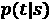建模，目标语言(例如，德语)中的字符串是源语言(例如，英语)中的字符串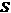的翻译。已经引入了不同的方法来建模这个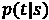概率分布，其中最流行的方法来自贝叶斯定理，并将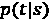建模为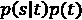。因此，在这种方法中，任务被分成两个子任务:训练语言模型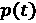和建模概率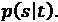更一般地，可以定义几个子任务，并且为每个子任务训练和调整几个模型。

最近，神经机器翻译在自动翻译任务中相当流行。此外，这里需要源语言和目标语言中的大量例句来训练翻译模型。经典的基于统计的模型和神经机器翻译之间的区别在于任务的定义:不是训练许多小的子组件并单独调整它们，而是以端到端的方式训练一个单一的网络。

一种可用于神经机器翻译的网络架构是编码器-解码器网络。我们来看看这是什么。

# 编码器-解码器架构

在本节中，我们将首先介绍编码器-解码器架构的一般概念。之后，我们将关注编码器如何用于神经机器翻译。在最后两节中，我们将集中讨论在培训和部署期间如何应用解码器。

用于神经机器翻译的一种可能的结构是**编码器-解码器**网络。在 [*第 5 章*](B16391_05_Final_NM_ePUB.xhtml#_idTextAnchor152) 、*欺诈检测的自编码器*中，我们介绍了由编码器和解码器组件组成的神经网络的概念。请记住，在自编码器的情况下，编码器组件的任务是提取输入的密集表示，而解码器组件的任务是根据编码器给出的密集表示重新创建输入。

在用于神经机器翻译的编码器-解码器网络的情况下，编码器的任务是将源语言中的句子(输入句子)的上下文提取为密集表示，而解码器的任务是从编码器的密集表示创建目标语言中的相应翻译。

*图 8.1* 显示了这一过程:


图 8.1–用于神经机器翻译的编码器-解码器网络的一般结构

这里，源语言是英语，目标语言是德语。目标是将句子`I am a student`从英语翻译成德语，其中一个正确的翻译可能是`Ich bin ein Student`。编码器使用`I am a student`句子，并产生句子内容的密集矢量表示作为输出。这种密集的矢量表示被输入解码器，然后输出翻译。

在这个案例研究中，网络的输入和输出是序列。因此，**循环神经网络** ( **RNN** )层通常用于编码器和解码器部分，以捕获上下文信息并处理可变长度的输入和输出序列。

一般来说，基于 RNN 的编码器-解码器架构用于各种序列间分析任务，例如问答系统。在这里，问题首先由编码器处理，编码器创建一个密集的数字表示，然后解码器生成答案。

在继续讨论解码器之前，让我们先关注神经翻译网络的编码器部分，以了解需要哪种数据准备。

## 应用编码器

编码器的目标是从输入句子中提取上下文的密集向量表示。这可以通过使用一个**长短期记忆** ( **LSTM** )层来实现，在这里编码器一个字一个字或者一个字符一个字符地读取输入的句子(英文)。

小费

在第六章[](B16391_06_Final_VK_ePUB.xhtml#_idTextAnchor181)**需求预测的循环神经网络*中，我们介绍了 LSTM 层。请记住，LSTM 图层有两个隐藏状态，一个是单元格状态，另一个是它的过滤版本。单元格状态包含所有先前输入的摘要。*

 *在经典的编码器-解码器网络架构中，LSTM 层的隐藏状态的向量用于存储密集表示。*图 8.2* 显示了基于 LSTM 的编码器如何处理输入句子:

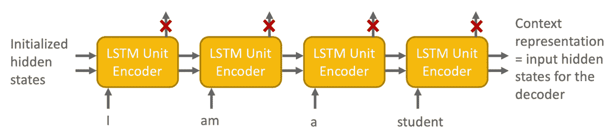

图8.2–编码器如何处理输入句子的示例

编码器从一些初始化的隐藏状态向量开始。在每一步，序列中的下一个单词被送入 LSTM 单元，隐藏状态向量被更新。在处理源语言中的整个输入序列之后，最终的隐藏状态向量包含上下文表示，并成为解码器中隐藏状态向量的输入。

不使用编码器的中间输出隐藏状态。

现在我们有了上下文的密集表示，我们可以用它来馈送给解码器。虽然编码器在训练和部署期间的工作方式保持不变，但解码器在训练和部署期间的工作方式略有不同。

我们先集中精力在训练阶段。

## 在训练期间应用解码器

解码器的任务是从密集上下文表示中生成目标序列的翻译，或者一个字一个字，或者一个字符一个字符，再次使用具有 LSTM 层的 RNN。这意味着，理论上，每个预测的单词/字符应该作为下一个输入反馈到网络中。但是在训练的时候，我们可以跳过理论，套用**老师逼**的概念。这里，实际的单词/字符被反馈到 LSTM 单元，而不是预测的单词/字符，这极大地有利于训练过程。

*图 8.3* 显示了解码器训练阶段的教师强制示例:

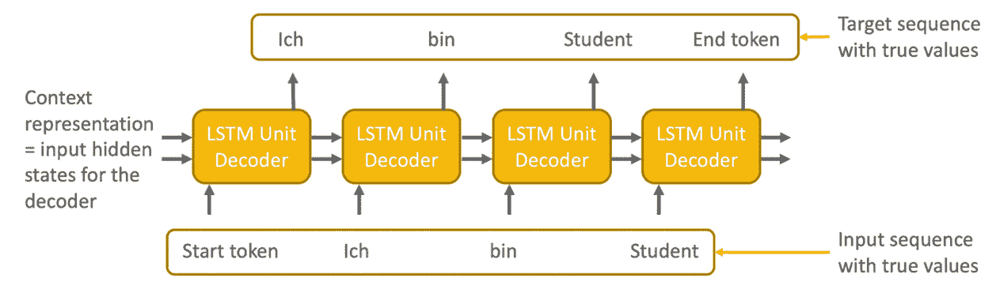

figuree 8.3–培训解码器时教师强制的示例

编码器的密集上下文表示用于初始化解码器的 LSTM 层的隐藏状态。接下来，LSTM 层使用两个序列来训练解码器:具有真实单词/字符值的输入序列，以**开始标记**开始，以及同样具有真实单词/字符值的目标序列。

重要说明

在这种情况下，目标序列是移动了一个字符的输入序列，并且在末尾有一个结束标记。

总而言之，在训练期间需要三个单词/字符序列:

*   编码器的输入序列
*   解码器的输入序列
*   解码器的输出序列

在部署期间，我们没有解码器的输入和输出序列。那么，让我们看看如何在部署期间使用经过训练的解码器。

## 部署期间应用解码器

当我们应用训练的网络时，我们不知道翻译序列的真实值。因此，我们只将来自编码器的密集上下文表示和一个开始标记输入解码器。然后，解码器多次应用 LSTM 单元，总是将最后预测的单词/字符反馈到 LSTM 单元作为下一步的输入。*图 8.4* 显示了部署期间解码器的使用情况:

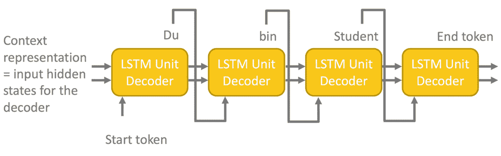

图 8.4–部署期间解码器的使用

在第一步中，来自编码器的密集上下文表示形成输入隐藏状态向量，并且**开始标记**形成解码器的输入值。基于此，预测第一个单词，并且更新隐藏状态向量。在接下来的步骤中，更新的隐藏状态向量和最后预测的字被反馈到 LSTM 单元，以预测下一个字。这意味着如果一个错误的单词被预测了一次；在这种顺序预测中，误差会累积。

在本节中，您学习了什么是编码器-解码器神经网络，以及它们如何用于神经机器翻译。

在接下来的章节中，我们将介绍训练神经机器翻译网络将句子从英语翻译成德语所需的步骤。和往常一样，第一步是数据准备。

因此，让我们首先创建使用编码器-解码器结构训练神经机器翻译网络所需的三个序列。

# 为两种语言准备数据

在 [*第七章*](B16391_07_Final_NM_ePUB.xhtml#_idTextAnchor230) 、*实现 NLP 应用*中，我们谈到了在字符和单词层面训练神经网络的优缺点。由于我们已经有了一些字符级别的经验，我们决定也训练这个网络在字符级别进行自动翻译。

为了训练神经机器翻译网络，我们需要一个包含两种语言的双语句子对的数据集。不同语言组合的数据集可以在[www.manythings.org/anki/](http://www.manythings.org/anki/)免费下载。从那里，我们可以下载一个数据集，其中包含大量日常生活中常用的英语和德语句子。数据集只包含两列:英语的原始短文本和相应的德语译文。

*图 8.5* 显示了该数据集的一个子集，用作训练集:

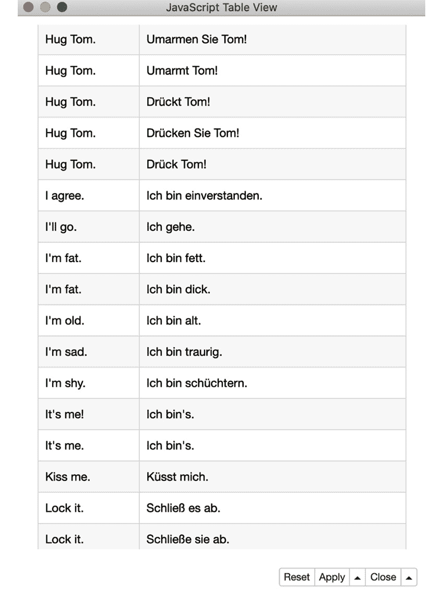

F 图 8.5–包含英语和德语句子的训练集子集

正如你所看到的，对于一些英语句子，有不止一种可能的翻译。例如，句子`Hug Tom`可以翻译成`Umarmt Tom`、`Umarmen Sie Tom`或`Drücken Sie Tom`。

记住一个网络不懂字符，只懂数值。因此，字符输入序列需要转换成数字输入序列。在前一章的第一部分，我们介绍了几种编码技术。

对于自由文本生成案例研究，我们采用了**一键编码**作为编码方案，将分两步实施。首先，产生一个**基于索引的编码**；然后，这种基于索引的编码在训练期间被转换成在 **Keras 网络学习器**节点内的一位热编码，并且当应用训练的网络时被转换成在 **Keras 网络执行器**节点内的一位热编码。

此外，还需要英语和德语字符及其索引的字典映射。在前一章中，为了生成产品名称，我们借助于 **KNIME 文本处理扩展**来为字符序列生成基于索引的编码。我们将在这里做同样的事情。

为了训练神经机器翻译，必须创建三个索引编码的字符序列:

*   输入进给编码器的顺序。这是来自源语言的索引编码的输入字符序列——在我们的例子中是英语。
*   提供给解码器的输入序列。这是目标语言的索引编码字符序列，以开始标记开始。
*   训练解码器的目标序列，它是解码器的输入序列，在过去移动了一步，并以结束标记结束。

*图 8.6* 中的工作流程读取双语句子对，提取前 10，000 个句子，分别对英语和德语句子进行索引编码，最后将数据集划分为训练集和测试集 :

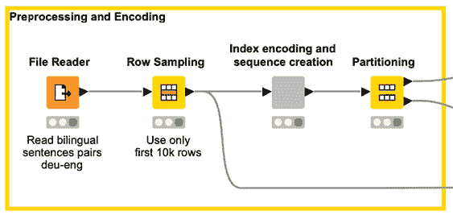

图 8.6-预处理工作流片段以准备数据来训练神经机器翻译的网络

预处理的大部分工作发生在名为**索引编码和序列创建**的组件中。*图 8.7* 显示了其内容:

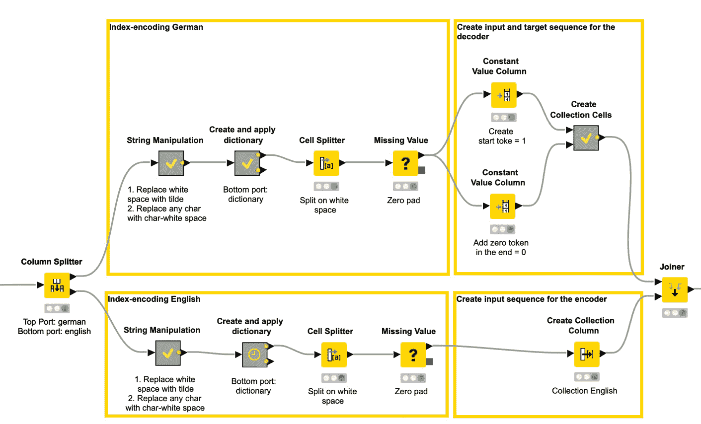

图 8.7–名为索引编码和序列创建的组件内的工作流片段

组件内部的工作流片段首先将英语文本与德语文本分开，然后为句子生成索引编码——在德语句子的上半部分和英语句子的下半部分。然后，最后，为每种语言创建、应用和保存一个字典。

在对德语句子进行索引编码之后，为解码器创建两个序列:在上面的分支中，通过在序列的开头添加开始标记，在下面的分支中，通过在序列的结尾添加结束标记。

来自德语和英语语言的所有序列然后被转换成集合单元，以便它们可以在训练之前被转换成一键编码。

# 构建和训练编码器-解码器架构

现在这三个序列都可用了，我们可以开始定义工作流中的网络结构。在本节中，您将学习如何在 KNIME Analytics 平台中定义和训练编码器-解码器结构。一旦网络被训练，你将学习如何将编码器和解码器提取到两个网络中。在最后一节中，我们将讨论如何在部署工作流中使用提取的网络将英语句子翻译成德语。

## 定义网络结构

在编码器-解码器架构中，我们希望编码器和解码器都是 LSTM 网络。编码器和解码器具有不同的输入序列。英语 one-hot-encoded 句子是编码器的输入，德语 one-hot-encoded 句子是解码器的输入。这意味着需要两个输入层:一个用于编码器，一个用于解码器。

**编码器**网络由两层组成:

*   通过 **Keras 输入层**节点实现的输入层:输入张量的形状是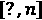，其中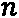是源语言的字典大小。*？输入张量形状中的*表示可变长度序列，而 *n* 表示具有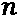分量的独热向量。在我们的例子中，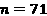为英语，而输入张量的形状是[？,71].
*   经由 **Keras LSTM 层**节点的 LSTM 层:在该节点中，我们使用 256 个单元，并启用*返回状态*复选框，以将隐藏状态传递给即将到来的解码器网络。

**解码器网络**由三层组成:

*   首先，一个 **Keras 输入层**节点定义输入形状。同样，输入形状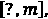是一个元组，其中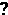表示一个可变长度，而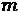表示输入序列中每个向量的大小——即目标语言(德语)的字典大小。在我们的例子中，德语的输入张量的形状是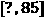。
*   一个 LSTM 层通过一个喀拉斯 **LSTM 层**节点。这一次，可选输入端口用于将隐藏状态从编码器输入解码器。这意味着编码器网络中第一 LSTM 层的输出端口连接到解码器网络中的两个可选输入端口。此外，德语输入序列的 Keras 输入层节点的输出端口连接到顶部输入端口。在其配置窗口中，选择正确的输入张量和隐藏张量是很重要的。必须激活*返回序列*和*返回状态*复选框，以返回中间输出隐藏状态，该状态用于下一个层，以提取下一个预测字符的概率分布。与 LSTM 编码器一样，使用了 256 个单元。
*   最后，通过 **Keras 密集层**节点添加 softmax 层，产生目标语言(德语)词典中字符的概率向量。在配置窗口中，softmax 激活功能被选择为具有 85 个单位，这是目标语言的字典的大小。

图 8.8 中*的工作流程定义了这个编码器-解码器网络结构:*

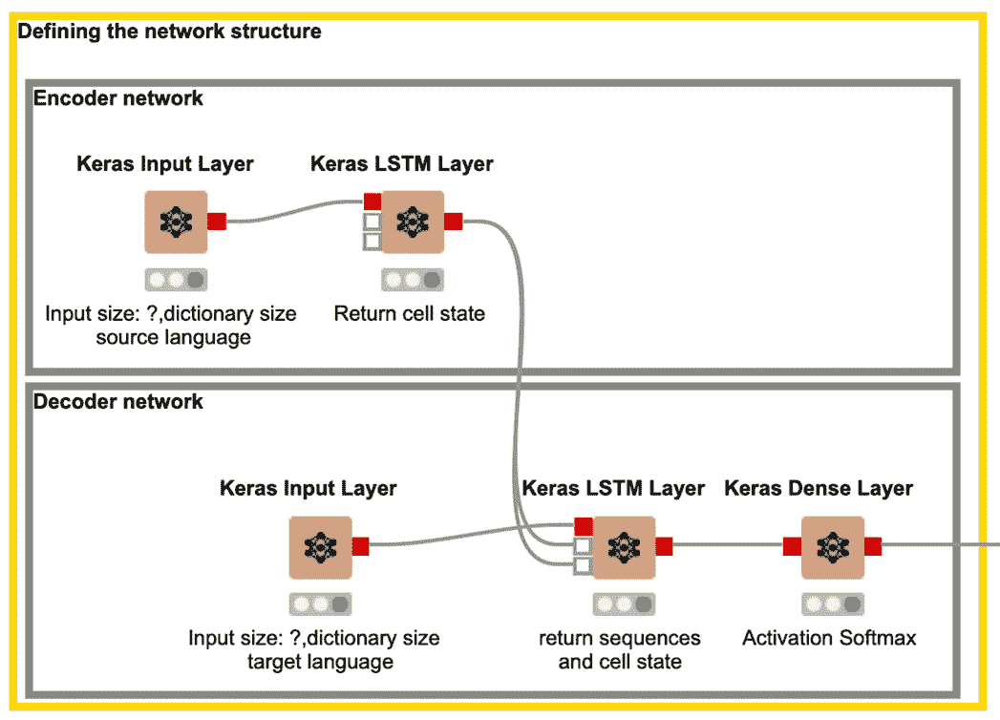

图 8.8–定义编码器-解码器网络的工作流片段

工作流程的上部用 **Keras 输入层**和 **Keras LSTM 层**节点定义编码器。在下部，解码器定义如前所述。

既然我们已经定义了编码器-解码器架构，我们可以训练网络。

## 训练网络

正如本书中所有其他示例一样， **Keras 网络学习器**节点用于训练网络。

在名为**输入数据**的配置窗口的第一个选项卡中，选择了两个输入层的输入列:上半部分为源语言，表示编码器的输入，下半部分为目标语言，表示解码器的输入。为了将索引编码的序列转换为单热编码的序列，从数字集合(整数)到单热张量的转换类型**被用于两个列。**

在配置窗口的下一个名为**目标数据**的选项卡中，带有解码器目标序列的列被选中，从数字集合(整数)到一键张量转换类型的**被再次启用。在多类分类问题中，字符再次被视为类；因此，分类交叉熵损失函数被用于训练过程。**

在第三个选项卡**选项**中，训练阶段被设置为最多运行 120 个时期，批量大小为 128 个数据行，在每个时期之前混排数据，并使用 Adam 作为默认设置的优化器算法。

在训练期间，我们使用 Keras 网络学习者节点的**学习者监视器**视图来监视性能，并在达到 94%的准确率时决定停止学习过程。

## 提取训练好的编码器和解码器

为了应用训练的模型来翻译新句子，我们需要将编码器和解码器分开。为此，使用DL Python 网络编辑器节点中的几行 Python 代码从完整的网络中提取每个部分。该节点允许我们直接使用 **Python 库**编辑和修改网络结构。

记住，解码器的输出是目标语言中所有字符的概率分布。在 [*第 7 章*](B16391_07_Final_NM_ePUB.xhtml#_idTextAnchor230) 、*实现 NLP 应用*中，我们介绍了两种基于输出概率分布预测下一个字符的方法。选项一选择概率最高的字符作为下一个字符。选项二根据给定的概率分布随机选取下一个字符。

在本案例研究中，我们使用选项一，并通过额外的**λ层**直接在解码器中实现。总而言之，在进行后处理时，我们需要执行以下步骤:

*   分离网络的编码器和解码器部分。
*   Introduce a lambda layer with an argmax function that selects the character with the highest probability in the softmax layer.

    重要说明

    Lamba 层允许您在使用 TensorFlow 作为后端构建顺序和功能 API 模型时使用任意 TensorFlow 函数。Lambda 层最适合简单操作或快速实验。

让我们从提取编码器开始。

### 取出编码器

在下面的代码中，你可以看到用于提取编码器的 Python 代码:

1.  加载包:

    ```
    from keras.models import Model from keras.layers import Input
    ```

2.  定义输入:

    ```
    new_input = Input((None,70))
    ```

3.  提取训练好的编码器 LSTM 并定义模型:

    ```
    encoder = input_network.layers[-3] output = encoder(new_input) output_network = Model(inputs=new_input, outputs=output)
    ```

首先定义输入，将其输入编码器的 LSTM 层，然后定义输出。

更详细地说，在前两行中，加载了所需的包。接下来，定义输入层；然后，提取`-3`层——编码器的训练 LSTM 层。最后，网络输出被定义为经过训练的编码器 LSTM 层的输出

现在我们已经提取了编码器，让我们看看如何提取解码器。

### 提取解码器并添加λ层

在下面的代码片段中，你可以看到中使用的代码 **DL Python 网络编辑器**节点来提取解码器部分并添加 lambda 层到其中:

1.  加载软件包:

    ```
    from keras.models import Model from keras.layers import Input, Lambda from keras import backend as K
    ```

2.  定义输入:

    ```
    state1 = Input((256,)) state2 = Input((256,)) new_input = Input((1,85))
    ```

3.  提取训练好的解码器 LSTM 层和 softmax 层:

    ```
    decoder_lstm = input_network.layers[-2] decoder_dense = input_network.layers[-1]
    ```

4.  应用LSTM 和密集层:

    ```
    x, out_h, out_c = decoder_lstm(new_input, initial_state=[state1, state2]) probability_output = decoder_dense(x)
    ```

5.  添加 lambda 层并定义输出:

    ```
    argmax_output = Lambda(lambda x: K.argmax(x, axis=-1))(probability_output) output_network = Model(inputs=[new_input, state1, state2], outputs=[probability_output, argmax_output, out_h, out_c])
    ```

代码再次首先加载必要的包，然后定义三个输入——两个用于输入隐藏状态，一个用于一键编码的字符向量。接下来，它在解码器中提取训练的 LSTM 层和 softmax 层。最后，它用`argmax`函数引入 lambda 层并定义输出。

为了在部署期间更快地执行，使用 **Keras 到 TensorFlow 网络转换器**节点将编码器和解码器转换为 TensorFlow 网络。

现在我们已经训练了神经机器翻译网络，并且我们已经分离了编码器和解码器，我们希望将它们应用于测试集中的句子。

完整的培训工作流程可在 KNIME Hub:[https://Hub . KNIME . com/kathrin/spaces/Codeless % 20 deep % 20 learning % 20 with % 20 KNIME/latest/Chapter % 208/。](https://hub.knime.com/kathrin/spaces/Codeless%20Deep%20Learning%20with%20KNIME/latest/Chapter%208/.)

## 将训练好的网络用于神经机器翻译

为了将编码器和解码器网络应用于测试数据，我们需要一个工作流程，首先将编码器应用于索引编码的英语句子以提取上下文信息，然后应用解码器产生翻译。

解码器应该用来自编码器的第一个隐藏状态和来自输入序列的开始标记来初始化，以在递归循环中逐字符地触发翻译。*图 8.9* 与显示了流程:

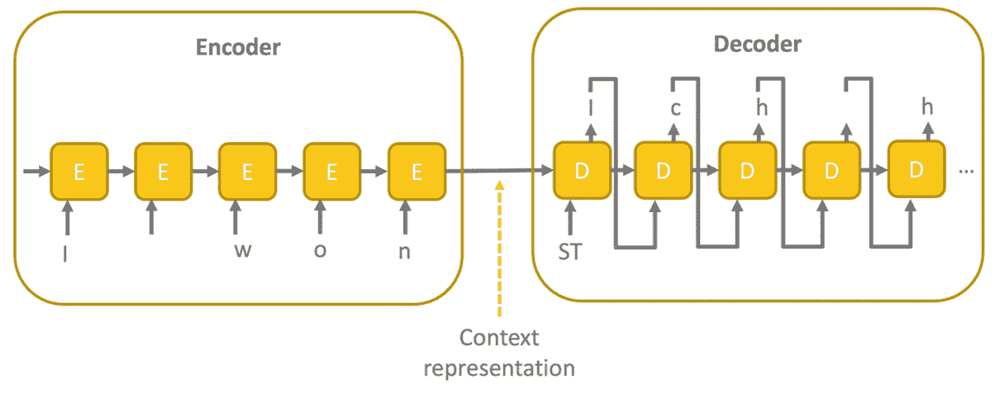

图 8.9–在部署期间应用编码器和解码器模型的想法

图 8.10 中的工作流片段执行这些步骤:

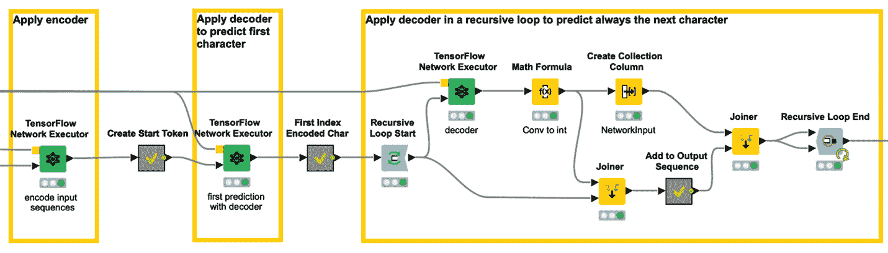

图 8.10–该工作流片段应用经过训练的编码器-解码器神经架构将英语句子翻译成德语句子

它从一个 **TensorFlow 网络执行器**节点开始(图 8.10 中*左边第一个)。这个节点将编码器和索引编码的英语句子作为输入。在其配置窗口中，根据 LSTM 隐藏状态定义了两个输出。*

接下来，我们创建一个开始标记，并将其转换成一个集合单元格。对于这个开始令牌，我们使用另一个 **TensorFlow 网络执行器**节点(左起第二个)应用解码器网络。在配置窗口中，我们确保来自先前**张量流网络执行器**节点中产生的编码器的隐藏状态被用作输入。作为输出，我们再次设置隐藏状态，以及下一个预测字符——即翻译句子的第一个字符。

现在，我们进入递归循环，在这里这个过程使用来自最后一次迭代的更新的隐藏状态和最后一个预测的字符作为输入被重复多次。

最后，将德语词典应用于索引编码的预测字符，并获得最终翻译。以下是翻译结果摘录:

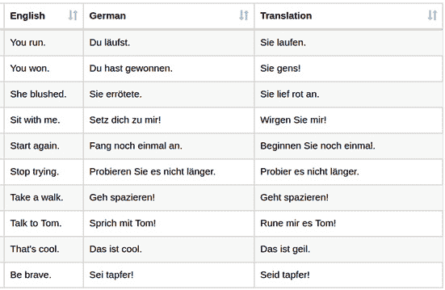

图 8.11–新英语句子翻译网络的最终结果

第一栏是新的英语句子，第二栏是正确的翻译，最后一栏是网络生成的翻译。这些翻译中的大多数实际上是正确的，尽管它们与第二列中的句子不匹配，因为同一个句子可以有不同的翻译。另一方面，`Talk to Tom`句子的翻译不正确，因为`rune`不是德语单词。

KNIME Hub 上提供了所描述的部署工作流:[https://Hub . KNIME . com/kath rin/spaces/Codeless % 20 deep % 20 learning % 20 with % 20 KNIME/latest/Chapter % 208/](https://hub.knime.com/kathrin/spaces/Codeless%20Deep%20Learning%20with%20KNIME/latest/Chapter%208/)。

在本节中，您已经学习了如何基于字符级神经机器翻译的示例来定义、训练和应用编码器-解码器架构。

# 总结

在这一章中，我们探讨了神经机器翻译的主题，并训练了一个网络来产生英语到德语的翻译。

我们从介绍自动机器翻译开始，涵盖了从基于规则的机器翻译到神经机器翻译的历史。接下来，我们介绍了基于 RNN 的编码器-解码器架构的概念，它可用于神经机器翻译。一般而言，编码器-解码器架构可用于序列间预测任务或问答系统。

之后，我们介绍了在字符级别训练和应用神经机器翻译模型所需的所有步骤，使用了一个简单的网络结构，编码器和解码器都只有一个 LSTM 单元。使用**教师强制**范例来训练来自编码器和解码器的组合的联合网络。

在训练阶段结束时和部署之前，在解码器部分插入一个**λ层**，以预测概率最高的字符。为了做到这一点，在训练过程之后，在 DL Python 网络编辑器节点中用几行 Python 代码修改了已训练网络的结构。Python 代码将解码器和编码器网络分开，并添加了 lambda 层。这是唯一包含一小段简单的 Python 代码的部分。

当然，这个网络可以在许多方面得到进一步改善——例如，通过堆叠多个 LSTM 层，或者通过使用额外的嵌入在单词级别训练模型。

这是关于 RNNs 的最后一章。在下一章中，我们想继续讨论另一类神经网络，**卷积神经网络**(**CNN**)，它已经被证明在图像处理方面非常成功。

# 问题和练习

1.  An encoder-decoder model is a:

    a.)多对一架构

    b.)多对多架构

    c.)一对多架构

    d.)CNN 架构

2.  What is the task of the encoder in neural machine translation?

    a.)对字符进行编码

    b.)来生成翻译

    c.)来提取目标语言内容的密集表示

    d.)来提取源语言内容的密集表示

3.  What is another application for encoder-decoder LSTM networks?

    a.)文本分类

    b.)问答系统

    c.)语言检测

    d.)异常检测*