<title>B16391_09_Final_NM_ePUB</title>

# *第九章:*卷积神经网络用于图像分类

在前几章中，我们谈到了**递归神经网络** ( **RNNs** )以及它们如何应用于不同类型的顺序数据和用例。在这一章中，我们要讲另一个神经网络家族，叫做**卷积神经网络**(**CNN**)。当用于具有网格状拓扑和空间依赖性的数据(如图像或视频)时，CNN 尤其强大。

我们将从 CNN 的一般介绍开始，解释卷积层背后的基本思想，并介绍一些相关的术语，如填充、池化、滤波器和步长。

之后，我们将从头开始构建和训练一个用于图像分类的 CNN。我们将涵盖所有需要的步骤:从图像的读取和预处理到 CNN 的定义、训练和应用。

为了从头开始训练神经网络，通常需要大量的标记数据。对于一些特定的领域，如图像或视频，可能无法获得如此大量的数据，网络的训练可能变得不可能。迁移学习是解决这一问题的一种方法。迁移学习背后的想法包括使用为任务 A 训练的最先进的神经网络作为另一个相关任务 b 的起点。

在本章中，我们将讨论以下主题:

*   CNN 简介
*   用 CNN 对图像进行分类
*   迁移学习简介
*   应用迁移学习进行癌症类型预测

# CNN 简介

CNN 通常用于图像处理，并且是几个图像处理竞赛中的获奖模型。例如，它们经常用于图像分类、对象检测和语义分割。

有时，CNN 也用于与图像无关的任务，如推荐系统、视频或时间序列分析。事实上，CNN 不仅应用于具有网格结构的二维数据，而且当应用于一维或三维数据时也可以工作。然而，在这一章中，我们关注最常见的 CNN 应用领域:**图像处理**。

CNN 是具有至少一个**卷积层**的神经网络。顾名思义，卷积图层对输入数据执行卷积数学变换。通过这样的数学变换，卷积层获得了从图像中检测和提取一些特征的能力，例如边缘、角和形状。这种提取的特征的组合用于分类图像或检测图像中的特定对象。

卷积层通常与和**合并层**一起出现，也常用于图像处理的特征提取部分。

因此，本节的目标是解释卷积层和池层如何单独和一起工作，并详细说明这两个层的不同设置选项。

如前所述，在这一章中，我们将重点介绍用于图像分析的细胞神经网络。因此，在我们深入 CNN 的细节之前，让我们快速回顾一下图像是如何存储的。

## 图像是如何存储的？

灰度图像可以存储为矩阵，其中每个单元代表图像的一个像素，单元值代表该像素的灰度级。例如，大小为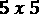像素的黑白图像可以表示为尺寸为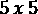的矩阵，其中矩阵的每个值在和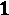之间。是黑色像素，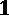是白色像素，两者之间的值对应于灰度中的灰度级。

*图 9.1* 描述了一个例子:

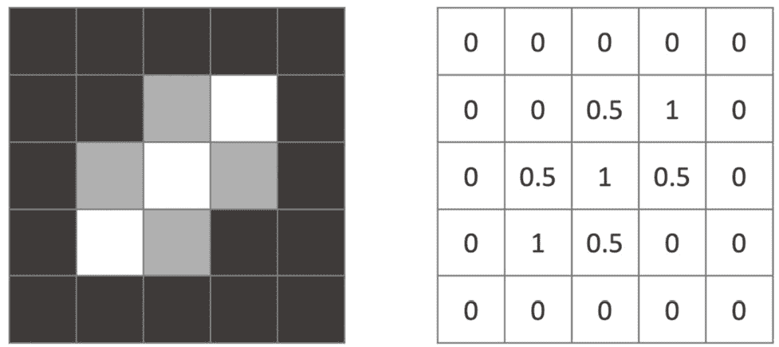

图9.1–灰度 5 x 5 图像的矩阵表示

由于每个像素仅由一个灰度值表示，一个**通道**(矩阵)足以表示该图像。另一方面，对于彩色图像，需要不止一个值来定义每个像素的颜色。一种选择是使用指定红色、绿色和蓝色强度的三个值来定义像素颜色。在下面的截图中，为了表示彩色图像，使用了三个通道而不是一个:(*图 9.2* ):

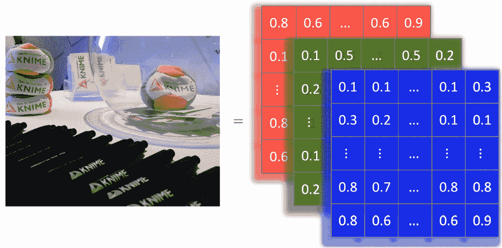

图9.2–使用三个 RGB 通道呈现 28 x 28 的彩色图像

从灰度图像转移到一个**红、绿、蓝** ( **RGB** )图像，更一般的概念**张量**——而不是简单矩阵的——变得必要。这样，灰度图像可以描述为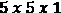的张量，而具有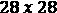像素的彩色图像可以用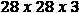张量表示。

通常，表示具有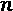像素高度、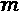像素宽度和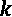通道的图像的张量具有维度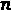 x 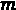 x 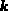。

但是为什么我们需要特殊的网络来分析图像呢？难道我们不能仅仅**展平**图像，将每个图像表示为一个长向量，并训练一个标准的全连接前馈神经网络吗？

重要说明

将图像的矩阵表示转换为矢量的过程称为**展平**。

## 我们为什么需要 CNN？

对于基本的二进制图像，展平和完全连接的前馈网络可能会产生可接受的性能。然而，对于更复杂的图像，由于整个图像具有很强的像素依赖性，平坦化和前馈神经网络的组合通常会失败。

事实上，当图像被展平成矢量时，空间依赖性就丧失了。因此，全连接前馈网络不是平移不变的。这意味着它们对同一图像的移位版本产生不同的结果。例如，网络可能学会识别图像左上角的猫，但同一网络无法检测同一图像右下角的猫。

此外，图像的展平产生非常长的向量，因此它需要具有许多权重的非常大的全连接前馈网络。例如，对于具有三个通道的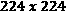像素图像，网络需要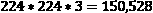输入。如果下一层有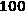神经元，我们只需要在第一层训练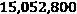权重。你会看到重量的数量会很快变得难以控制，很可能导致训练中的过度适应。

卷积层是 CNN 的主要组成部分，它允许我们通过利用图像的空间属性来解决这个问题。那么，让我们来看看卷积层是如何工作的。

## 卷积层是如何工作的？

CNN 的想法是使用过滤器来检测图像不同部分的图案，也称为特征，如角落、垂直边缘和水平边缘。

对于具有一个通道的图像，一个**过滤器**是一个小矩阵，通常大小为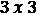或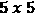，称为**内核**。不同的内核——即具有不同值的矩阵——过滤不同的模式。内核在图像上移动并执行卷积运算。该卷积运算为该层命名。这种卷积的输出是被称为**特征图**的。

重要说明

对于具有三个通道的输入图像(例如，具有形状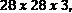的输入张量)，具有核大小 2 的核具有形状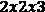。这意味着内核可以包含来自所有通道的信息，但只能包含在输入图像的一个小区域(在本例中为 2×2)内。

*图 9.3* 此处显示了一个如何为尺寸为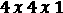的图像和尺寸为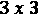的内核计算卷积的示例:

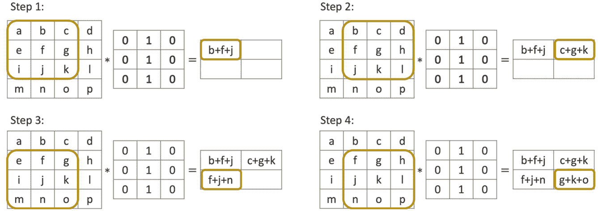

图 9.3–通过将 3 x 3 内核应用于 4 x 4 图像获得的卷积示例

在这个例子中，我们从将内核应用到图像的左上角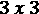区域开始。图像值按元素与内核值相乘，然后求和，如下所示:

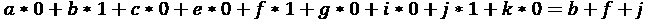

此逐元素乘法和求和的结果是输出要素地图左上角的第一个值。然后，核在整个图像上移动，以计算输出特征图的所有其他值。

重要说明

卷积运算用*表示，不同于矩阵乘法。即使该层被称为卷积，但大多数神经网络库实际上都实现了一个相关函数，称为**互相关**。为了执行正确的卷积，根据其数学定义，内核还必须翻转。对于 CNN 来说，这并没有什么不同，因为权重是学习来的。

在卷积层中，大量过滤器(内核)在输入数据集上并行训练，用于所需任务。也就是说，内核中的权重不是手动设置的，而是在网络训练过程中作为权重自动调整的。在执行过程中，所有经过训练的内核都被用于计算特征图。

特征图的维度是一个大小为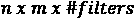的张量。在*图 9.3* 的例子中，我们只应用了一个内核，特征图的维数是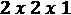。

历史上，内核是为选定的任务手工设计的。例如*图 9.3* 中的内核检测垂直线。*图 9.4* 这里向您展示了一些其他手工制作的内核的影响:

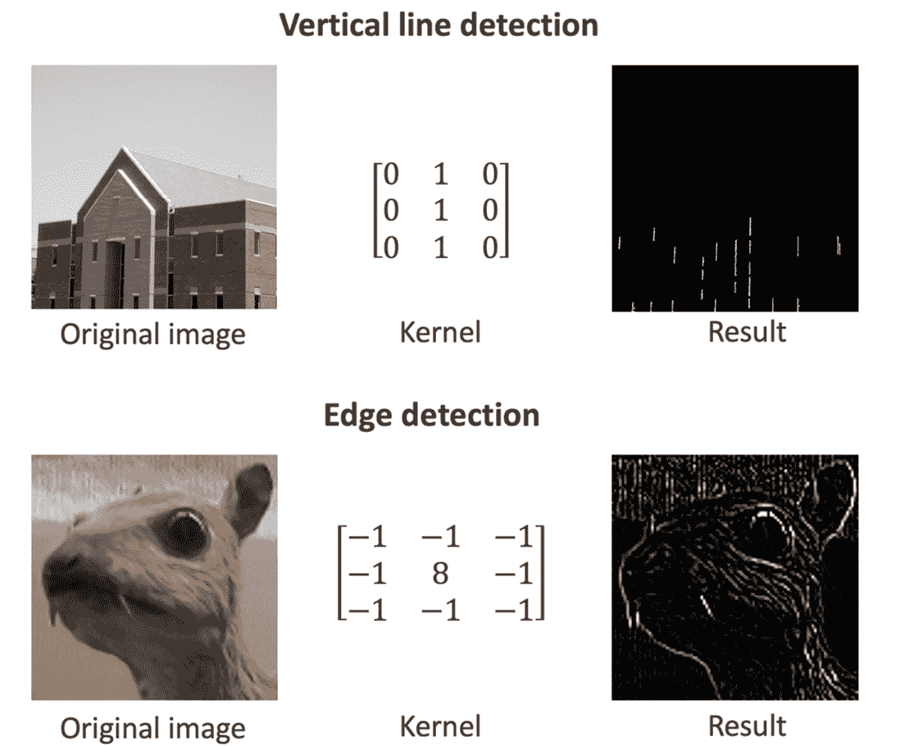

图 9.4–一些手工制作的内核对原始图像的影响

卷积操作只是卷积层的一部分。此后，将偏置和非线性激活函数应用于特征图中的每个条目。例如，我们可以为特征图中的每个值添加一个偏差值，然后应用**整流线性单元** ( **ReLU** )作为激活函数，将所有低于偏差值的值设置为 0。

重要说明

在 [*第三章*](B16391_03_Final_PG_ePUB.xhtml#_idTextAnchor073) 、*神经网络入门*中，我们介绍了密集层。在密集层中，首先计算输入的加权和；然后，将偏差值加到总和上，并应用激活函数。在卷积层中，密集层的加权和被卷积代替。

一个卷积层有多个设置选项。我们已经介绍了其中的三种，如下所示:

*   内核大小，通常是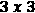
*   过滤器的数量
*   激活函数，其中 ReLU 是最常用的函数

还有三个设置选项:填充、步幅和扩张率。让我们继续填充。

## 引入填充

当我们在*图 9.3* 的示例中应用过滤器时，特征图的尺寸与输入图像的尺寸相比缩小了。输入图像的尺寸为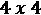，特征图的尺寸为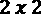。

此外，通过查看特征图，我们可以看到输入图像内部的像素(值为 f、g、j 和 k 的像元)比拐角和边界处的像素更常被考虑在卷积中。这意味着内在价值将在进一步的分析中获得更高的权重。为了解决这个问题，可以通过在额外的外部单元格中添加零来对图像进行零填充(*图 9.5* )。这是一个叫做**填充**的过程。

*图 9.5* 显示了一个零填充输入的例子:

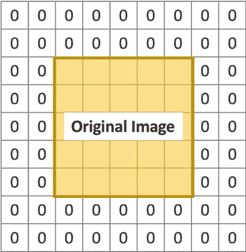

图 9.5–零填充 ima ge 示例

这里，在原始图像周围的每一行和每一列都添加了两个零值单元格。如果大小为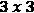的核现在被应用于该填充图像，则特征图的输出尺寸将与原始图像的尺寸相同。用于零填充的像元数是卷积层中的另一个可用设置。

如果不使用填充，影响输出大小的另外两个设置称为**步幅**和**扩张率**。

## 介绍步幅和扩张率

在*图 9.3* 的例子中，我们将滤镜应用于每个像素。对于大尺寸的图像，并不总是需要对每个像素执行卷积。我们可以将内核移动不止一个水平或垂直像素，而不是总是移动一个像素。

用于内核移位的像素数为称为**步距**。步幅通常由元组定义，指定水平和垂直方向上移动的单元数。没有填充的较高步幅值会导致输入图像的下采样。

*图 9.6* 的顶部显示了大小为 3 x 3 的内核如何以步幅 2，2 在图像上移动。

卷积层的另一个设置选项是**膨胀率**。膨胀率表示输入图像中的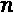个连续单元中只有一个单元用于卷积运算。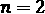的放大率仅使用输入图像中每两个像素中的一个进行卷积。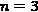的放大率使用三个连续像素中的一个。至于步幅，膨胀率是水平和垂直方向的一组值。当使用高于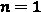的膨胀率时，内核在原始图像上被膨胀到更大的视野。因此，具有膨胀率的 3×3 内核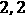在输入图像中探索大小为 5×5 的视场，同时仅使用 9 个卷积参数。

对于一个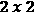内核和一个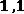的膨胀率，内核仅使用其角值扫描输入图像上的一个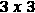区域(见*图 9.6* 的下部)。这意味着对于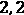的膨胀率，我们有一个大小为 1 的间隙。对于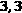的膨胀率，我们的间隙大小为 2，依此类推:

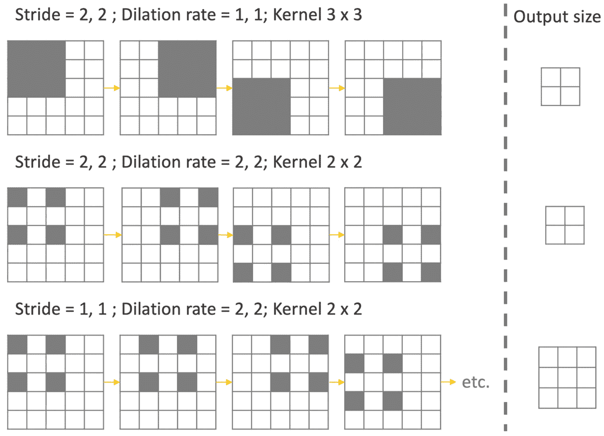

图 9.6-不同步幅和扩张率值对输出特征图的影响

CNN 中另一个常用的层是池层。

## 引入池化

**汇集**的想法是用汇总统计数据替换特征图的一个区域。例如，pooling 可以用它的最大值，称为**最大池**，或它的平均值，称为**平均池** ( *图 9.7* ):

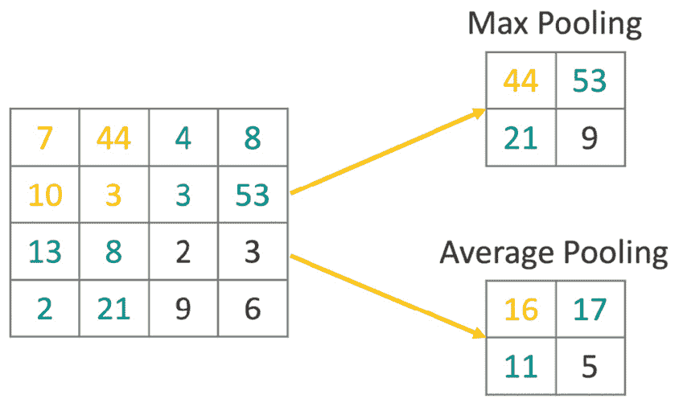

图 9.7–最大和平均池的结果

合并图层以更有效的方式降低了输入影像的维度，并允许提取主要的、旋转的和位置不变的特征。

与过滤器一样，在池化中，我们需要定义要计算汇总统计数据的浏览区域的大小。一个常用的设置是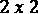像素的池大小和每个方向两个像素的步幅。此设置将图像尺寸减半。

重要说明

池化图层没有任何权重，所有设置都是在图层配置期间定义的。它们是静态层，并且它们的参数不像网络中的其他权重那样被训练。

汇集层通常在一个卷积层或多个叠加卷积层之后使用。

卷积图层可应用于输入影像和要素地图。事实上，在 CNN 中，多个卷积层经常一个叠一个地堆叠在一起。在这样的层级中，第一卷积层可以提取低级特征，例如边缘。下一层中的过滤器然后在提取的特征之上工作，并且可以学习检测形状，等等。

最终提取的特征然后可以用于不同的任务。在图像分类的情况下，由多个卷积层叠加而成的特征图被展平，并在其上应用分类器网络。

总而言之，用于图像分类的标准 CNN 首先使用一系列卷积和池化层，然后是平坦层，然后是一系列密集层，用于最终分类。

现在我们已经熟悉了卷积层和池层，让我们看看如何将它们引入网络内部进行图像分类。

# 用 CNN 对图像进行分类

在这一部分，我们将看到如何从零开始构建和训练一个用于图像分类的 CNN。

目标是用来自 **MNIST 数据库**的数据对 0 到 9 之间的手写数字进行分类，这是一个大型手写数字数据库，通常用于训练各种图像处理应用。http://yann.lecun.com/exdb/mnist/的 MNIST 数据库包含 60，000 幅训练图像和 10，000 幅手写数字测试图像，可以从这个网站下载。

为了读取和预处理图像，KNIME 分析平台提供了一组专用的节点和组件，在安装了 **KNIME 图像处理扩展**后即可使用。

小费

KNIME Image 处理扩展([https://www.knime.com/community/image-processing](https://www.knime.com/community/image-processing))允许你读入超过 140 种不同格式类型的图像(感谢 Bio-Formats **应用处理接口** ( **API** ))。此外，它还可以利用 KNIME Analytics 平台中的图形用户界面，应用众所周知的图像处理技术，如分割、特征提取、跟踪和分类。

一般来说，节点通过内部库`ImgLib2-API`对多维图像数据(例如，视频、3D 图像、多通道图像，甚至这些图像的组合)进行操作。几个节点计算分割图像(例如，单个细胞)的图像特征(例如，Zernike、纹理或直方图特征)。机器学习算法应用于最终分类的结果特征向量。

为了在图像上应用和训练神经网络，我们需要一个进一步的扩展:KNIME 图像处理-深度学习扩展。这个扩展引入了许多有用的图像操作——例如，图像数据需要进行一些转换，才能输入到 **Keras 网络学习器**节点。

重要说明

要在图像上训练和应用神经网络，需要安装以下扩展:

KNIME 图像处理([https://www.knime.com/community/image-processing](https://www.knime.com/community/image-processing))

KNIME 图像处理-深度学习扩展([https://hub . KNIME . com/bioml-Konstanz/extensions/org . KNIME . knip . dl . feature/latest](https://hub.knime.com/bioml-konstanz/extensions/org.knime.knip.dl.feature/latest))

让我们从阅读和预处理手写数字开始。

## 读取和预处理图像

对于这个案例研究，我们使用了 MNIST 数据集的一个子集:10，000 个图像样本用于训练，1，500 个用于测试。每个图像有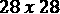个像素，只有一个通道。训练图像和测试图像保存在两个不同的文件夹中，文件名以数字表示。此外，我们有一个带有图像标签的表格，按照图像文件名的顺序排序。

读取和预处理工作流的目标是读取图像并将其与标签进行匹配。因此，执行以下步骤(如图*图 9.8* 所示):

1.  阅读并整理训练图像。
2.  导入训练图像的数字标签。
3.  将标签与图片配对。
4.  将像素类型从无符号字节转换为浮点。
5.  将标签转换为集合单元格。

这些步骤由以下屏幕截图中所示的工作流执行:

图 9.8-此工作流读取 MNIST 数据集的子集，添加相应的标签，并将像素类型从无符号字节转换为浮点型

为了读取图像，我们使用**图像读取器(表)**节点。该节点需要一个带有图像文件的**统一资源定位符** ( **URL** )路径的输入列。为了创建 URL 的排序列表，**列表文件**节点首先获取 training 文件夹中图像文件的所有路径。然后，使用**排序图像**元节点。*图 9.9* 这里向您展示了元节点的内部:

图 9.9–排序图像元节点内部

元节点用一个**字符串操作**节点从文件名中提取图像编号，并用一个**排序器**节点对它们进行排序。然后**图像阅读器(表格)**节点读取图像。

**文件读取器**节点位于下分支，读取带有图像标签的表格。

在下一步中，**列附加器**节点将正确的标签附加到每个图像上。由于图像已经被分类以匹配它们相应的标签，简单的附加操作就足够了。*图 9.10* 显示了**列追加器** no de 的输出子集:

图 9.10–列附加器节点的输出，带有数字图像和相应的标签

接下来，**图像计算器**节点通过将每个像素值除以 255，将像素类型从*无符号字节*改变为*浮点*。

最后，**创建集合列**节点为每个标签创建一个集合单元。需要使用集合单元来创建单热向量编码类，以便在训练期间使用。

既然我们已经读取并预处理了训练图像，我们就可以设计网络结构了。

## 设计网络

在本节中，你将学习如何定义一个经典的 CNN 用于图像分类。

用于图像分类的经典 CNN 由两部分组成，它们以端到端的方式一起训练，如下所示:

*   **特征提取**:第一部分通过训练多个滤波器，对图像进行特征提取。
*   **分类**:第二部分在提取的特征上训练一个分类网络，可从特征提取部分产生的展平特征图中获得。

我们从只有一个卷积层的简单网络结构开始，然后是用于特征提取部分的汇集层。然后将得到的特征图展平，并在其上训练一个简单的分类器网络，该网络只有一个具有 ReLU 激活功能的隐藏层。

图 9.11 中的工作流程显示了这个网络结构:

图 9.11–该工作流片段为 MNIST 数据集的分类构建了一个简单的 CNN

工作流程从 **Keras 输入层**节点开始，到定义输入形状。MNIST 数据集的图像有个像素，只有一个通道，因为它们是灰度图像。因此，输入是形状为的张量，因此输入形状被设置为。

接下来，利用 **Keras 卷积 2D 层**节点实现卷积层。*图 9.12* 这里显示的是 no de 的配置窗口:

图 9.12–Keras 卷积 2D 图层节点及其配置窗口

名为**滤镜**的设置设置要应用的滤镜数量。这将是特征图的最后一个维度。在这个例子中，我们决定训练 *32* 过滤器。

接下来，您可以以像素为单位设置**内核大小**选项——即定义每个内核高度和宽度的整数元组。对于 MNIST 数据集，我们使用的核大小为。这意味着设置为 .50。

接下来，您可以将`dilation_rate`设置为大于 1。

接下来，您可以选择是否要使用零填充。**填充**选项允许您在**有效**和**相同**之间进行选择。**有效**表示不执行填充。 **Same** 表示执行零填充，使得特征映射的输出维度与输入维度相同。由于图像边界上主要是黑色像素，我们决定不对图像进行零填充，并选择了有效的。

接下来，你可以选择**膨胀率**选项，作为一个整数元组。目前，指定任何大于 1 的扩张率值都与指定任何大于 1 的步幅值不兼容。的膨胀率意味着没有像素被跳过。的膨胀率意味着每隔一秒钟就要用到一个像素。这意味着间隙大小为 1。我们用来表示膨胀率。52。

最后，必须选择**激活功能**选项。在本案例研究中，我们选择了卷积层最常用的激活函数: **ReLU** 。

卷积层的输出张量(即我们的特征图)具有维度，因为我们有滤波器，并且我们不使用填充。

接下来，使用一个 **Keras Max Pooling 2D 层**节点在两个维度上应用 Max Pooling。

*图 9.13* 这里显示了节点的配置窗口:

figuree 9.13–Keras Max 池化 2D 图层节点及其配置窗口

在 **Keras Max Pooling 2D 层**节点的配置窗口中，可以定义**池大小**。同样，这是一个定义池窗口的整数元组。请记住，最大池的概念是用该区域中的最大值来表示池窗口大小的每个区域。

**步距**也是一个整数元组，设置步长来移动池窗口。

最后，您可以通过选择**有效**来选择是否应用零填充，选择**相同**来应用填充。

对于这个 MNIST 示例，我们将**池大小**设置为，将**步距**设置为，并且不应用填充。因此，汇集层的输出尺寸为。

接下来，使用一个 **Keras 展平层**节点将特征图转换成一个矢量，尺寸为。

在 **Keras 展平层**节点之后，我们建立一个简单的分类网络，有一个隐藏层和一个输出层。具有 ReLU 激活功能和 100 个单元的隐藏层由*图 9.11* 中的第一个 **Keras 密集层**节点实现，而输出层由*图 9.11* 中的第二个(也是最后一个) **Keras 密集层**节点实现。由于这是一个具有 10 个不同类别的多类别分类问题，这里使用了具有 10 个单位的 softmax 激活函数。此外，使用**名称前缀** *输出*，以便我们在将网络应用于新数据时可以更容易地识别输出层。

现在我们已经定义了网络结构，我们可以继续训练 CNN。

## 培训和应用网络

为了训练前一部分构建的 CNN，我们再次使用 **Keras 网络学习器**节点。在前面的章节中，我们已经看到这个节点为输入和目标数据提供了许多转换类型(例如，从数字(整数)集合到单键张量选项的**)。安装 **KNIME 图像处理-深度学习扩展**增加了一个转换选项:**从图像(自动映射)**。这个新的转换选项允许我们从输入表中选择一个图像列，并自动创建张量输入网络。**

*图 9.14* 显示了 **Keras 网络学习器**节点配置窗口的**输入数据**选项卡，包括该附加转换选项:

图 9.14–带有附加转换选项的 Keras 网络学习器节点配置窗口的输入数据选项卡，来自图像(自动映射)

在**目标数据**页签中，图像标签的集合单元格所在的列选择**从数字(整数)集合到单热张量**的转换选项。

在底部的上，选择*分类交叉熵*激活函数，因为该问题是多类分类问题。

在**选项**选项卡中，设置了以下训练参数:

*   `10`
*   `200`
*   `Adadelta with the default settings`

*图 9.15* 显示了节点执行后 **Keras 网络学习者**节点的**学习监视器**视图中培训程序的进度:

图 9。15–学习监控视图显示网络的训练进度

**学习监视器**视图显示了网络在多个训练批次中的进度。在右侧，您可以看到最近几批的精确度。**当前值**显示上一批次的精度，在本例中为 **0.995** 。

既然我们已经有了一个在训练集上表现令人满意的经过训练的 CNN，我们可以把它应用到测试集上。这里，与训练集相同的读取和预处理步骤也必须应用于测试集。

**Keras 网络执行器**节点将训练好的网络应用于测试集中的图像。在配置窗口中，产生不同数字的概率分布的最后一层被选择作为输出。

此时，为了从网络输出中提取最终预测，需要位的后处理。

## 预测提取和模型评估

**Keras 网络执行器**节点的输出是一个 12 列的表格，包括以下内容:

*   图像列
*   真实类值，命名为**实际值**
*   10 列，具有图像类别的概率值，具有列标题:`output/Softmax:0_x`，其中`x`是编码类别的 0 到 9 之间的数字

后处理的目标是提取具有最高概率的类，然后评估网络性能。这由图 9.16 中*所示的工作流片段实现:*

图 9.16–该工作流片段提取概率最高的数字类，并在测试集上评估网络性能

**多对一**节点提取每行中概率最高的列的列标题。

然后，**列表达式**节点从列标题中提取类。

小费

**列表达式**节点是一个非常强大的节点。它提供了使用表达式追加任意数量的新列或修改现有列的可能性。

对于要追加或修改的每一列，可以定义一个单独的表达式。这些表达式可以使用预定义的函数简单创建，类似于`=`。

输入表中可用的流变量和列可以通过提供的访问函数变量(“`variableName`”)和列(“`columnName`”)来访问。

*图 9.17* 此处显示的是**列表达式**节点的配置窗口，用*图 9.16* 中工作流片段中使用的表达式提取类信息。在这种情况下，表达式从名为**的列中的字符串中提取最后一个字符，检测到的数字** :

图 9.17–列表达式节点及其配置窗口

接下来，预测类的数据类型通过**字符串从`String`转换为`Integer`到编号**节点，并通过**计分器**节点在测试集上评估网络性能。

*图 9.18* 所示为**划线器**点头 e 产生的视图；

图 9.18-Scorer 节点视图，显示了网络在测试集上的性能

正如你所看到的，这个简单的 CNN 已经在测试集上达到了 94%的准确率和 0.934 的 Cohen's kappa。完整的工作流程可以在 KNIME Hub 上找到:[https://Hub . KNIME . com/kathrin/spaces/Codeless % 20 deep % 20 learning % 20 with % 20 KNIME/latest/Chapter % 209/](https://hub.knime.com/kathrin/spaces/Codeless%20Deep%20Learning%20with%20KNIME/latest/Chapter%209/)。

在本节中，我们从头开始构建和训练了一个简单的 CNN，对于这个相当简单的图像分类任务，达到了可接受的性能。当然，我们可以尝试通过以下方法来进一步提高该网络的性能:

*   增加训练时期的数量
*   添加第二卷积层和汇集层
*   使用批量标准化进行训练
*   使用增强
*   使用辍学

我们把这个留给你，继续用另一种网络学习方式，叫做迁移学习。

# 迁移学习简介

**迁移学习**的总体思路是将一个为任务 **A** 训练的网络所获得的知识在另一个相关任务 **B** 上重用。例如，如果我们训练一个网络来识别帆船(任务 A)，我们可以使用这个网络作为起点来训练一个新的模型来识别摩托艇(任务 B)。在这种情况下，任务 A 被称为*源任务*，任务 B 被称为*目标任务*。

重用已训练的网络作为训练新网络的起点不同于训练网络的传统方式，在传统方式中，神经网络是针对特定数据集上的特定任务自行训练的。*图 9.19* 显示了传统的网络训练方式，即针对不同的任务和领域训练不同的系统 ins:

图 9.19–训练机器学习模型和神经网络的传统方式

但是为什么要用迁移学习来代替传统的、孤立的训练模式呢？

## 为什么要使用迁移学习？

当前最先进的神经网络在处理特定的复杂任务时表现出惊人的性能。有时，这些模型甚至比人类更好，在棋盘游戏或检测图像中的物体方面击败了世界冠军。为了训练这些成功的网络，通常需要大量的标记数据，以及大量的计算资源和时间。

要为一个新的领域获得一个全面的标记数据集，以便能够训练一个网络达到最先进的性能，可能是困难的，甚至是不可能的。例如，经常使用的 **ImageNet 数据库**，用于训练最先进的模型，已经开发了多年。为新的图像域创建类似的新数据集需要时间。然而，当这些最先进的模型被应用到其他相关领域时，它们的性能通常会遭受相当大的损失，甚至更糟的是，它们会崩溃。这是因为模型偏向于训练数据和领域。

迁移学习允许我们使用在任务和领域的训练中获得的知识作为起点，在没有足够的标记数据可用的领域中训练新模型。这种方法已经在许多计算机视觉和自然语言处理任务中显示出巨大的成果。

*图 9.20* 这里形象地展示了迁移学习背后的思想:

F 图 9.20–迁移学习背后的理念

在我们讨论如何在训练神经网络时应用迁移学习之前，让我们快速看一下迁移学习的正式定义以及它可以应用的许多场景。

## 迁移学习的正式定义

迁移学习和相关场景的正式定义可参见 Sinno Jialin Pan 和 Qiang Yang 的论文*迁移学习调查*，IEEE 知识与数据工程汇刊，2009 ( [和](https://ieeexplore.ieee.org/abstract/document/5288526))。

该定义涉及一个**域**和一个**任务**的概念。

在论文中，引入了一个**域** 作为元组{ ，其中是特征空间，是的边际概率分布。

对于给定的域，任务也由以下两部分组成:

*   一个标签空间
*   预测功能

这里，预测函数可以是条件概率分布，一般来说，预测函数是在带标签的训练数据上训练的函数，用于预测特征空间中任何样本的标签。

使用这个术语，**迁移学习**由 Sinno Jialin Pan 和 Qiang Yang 定义如下:

*给出一个源域*  *和学习任务*  *，一个目标域*  *和学习任务*  *，迁移学习旨在帮助提高学习目标预测函数**中的***，其中* *

 *Sebastian Ruder 在他的文章*迁移学习-机器学习的下一个前沿*，*2017*([https://ruder.io/transfer-learning/](https://ruder.io/transfer-learning/))中使用了这个定义来描述下面*四种可以使用迁移学习的场景*:

1.  Different feature spaces: 

    论文中的一个例子是跨语言改编，我们有不同语言的文档。

2.  Different marginal probabilities: 

    讨论不同主题的文档就是一个例子。这个场景被称为*域适配*。

3.  Different label spaces: 

    (例如，如果我们有不同标签的文档)。

4.  不同的条件概率这通常与场景 3 一起出现。

现在我们对迁移学习有了基本的了解，接下来让我们来看看迁移学习是如何应用到深度学习领域的。

## 应用迁移学习

在神经网络中，训练期间获得的知识存储在层的权重中。例如，在 CNN 的情况下，许多过滤器被训练以提取许多特征。因此，如何从图像中提取这些特征的知识被存储在所实现的滤波器的核的权重中。

在用于图像分类的堆叠 CNN 中，初始卷积层负责提取边缘等低级特征，而接下来的卷积层提取身体部位、动物或人脸等高级特征。基于提取的特征，训练最后的层来对图像进行分类。

因此，如果我们想要训练 CNN 用于不同的图像分类任务，在不同的图像上和用不同的标签，我们一定不能从头开始训练新的过滤器，但是我们可以使用先前在最先进的网络中训练的卷积层作为起点。希望新的训练程序会更快，需要的数据更少。

为了使用来自另一个网络的训练层作为训练起点，我们需要从原始网络中提取卷积层，然后在其上构建一些新层。为此，我们有以下两种选择:

*   我们冻结已训练层的权重，并且仅基于冻结层的输出来训练添加的层。这种方法通常用于 NLP 应用程序，在这些应用程序中，经过训练的嵌入被重用。
*   我们使用训练的权重来初始化网络中的新卷积层，然后在训练添加的层时对它们进行微调。在这种情况下，小的训练率用于不忘记从源任务学到的知识。

对于本书的最后一个案例研究，我们希望训练一个神经网络来从组织病理学幻灯片图像中预测癌症类型。为了加快学习过程并考虑到我们拥有的相对较小的数据集，我们将从这里用作源网络的流行 VGG16 网络中的卷积层开始应用迁移学习。

# 应用迁移学习进行癌症类型预测

我们将在这里介绍一个新的(也是最后的)案例研究。我们将从最先进的 VGG16 网络作为源网络开始，在描述淋巴瘤三种不同亚型的图像的数据集上训练新的目标网络，这些淋巴瘤是**慢性淋巴细胞白血病** ( **CLL** )、**滤泡性淋巴瘤** ( **FL** )和**套细胞淋巴瘤** ( **MCL** )。

医院病理学家的典型任务是查看组织病理学切片图像，并对淋巴瘤的类型做出决定。即使对于有经验的病理学家来说，这也是一项困难的任务，并且在许多情况下，需要后续测试来确认诊断。能够指导病理学家并加快他们工作速度的辅助技术将具有巨大的价值。

VGG16 是 2014 年 ImageNet 挑战赛的冠军车型之一。这是一个堆叠的 CNN 网络，使用大小为的内核，深度不断增加——也就是说，过滤器数量不断增加。最初的网络是在 ImageNet 数据集上训练的，包含图像，涉及 1000 多个类。

*图 9.21* 显示了 VGG16 模型的网络结构。

它从两个卷积层开始，每个卷积层有 64 个滤波器。在最大池层之后，再次使用两个卷积层，这次每个卷积层有 128 个过滤器。然后，另一个最大池层后面是三个卷积层，每个卷积层有 256 个过滤器。在又一个最大汇集层之后，再次有三个卷积层，每个具有 512 个过滤器，接着是另一个汇集层和三个卷积层，每个具有 512 个过滤器。在最后一个汇集层之后，使用三个致密层:

图 9.21–vgg 16 model 的网络结构

在本案例研究中，我们希望重用 VGG16 模型的训练卷积层，并在癌细胞分类任务的顶部添加一些层。在训练过程中，卷积层将被冻结，仅训练添加的层。

为此，我们构建了三个独立的子工作流:一个工作流下载数据，一个工作流预处理图像，第三个工作流使用迁移学习来训练神经网络。您可以从 KNIME Hub 下载包含三个子工作流的工作流:[https://Hub . KNIME . com/kathrin/spaces/Codeless % 20 deep % 20 learning % 20 with % 20 KNIME/latest/Chapter % 209/](https://hub.knime.com/kathrin/spaces/Codeless%20Deep%20Learning%20with%20KNIME/latest/Chapter%209/)。让我们从下载数据的工作流程开始。

## 下载数据集

包含癌细胞图像的完整数据集可作为包含 374 张图像的单个`tar.gz`文件获得:[https://ome.grc.nia.nih.gov/iicbu2008/lymphoma/index.html](https://ome.grc.nia.nih.gov/iicbu2008/lymphoma/index.html)。图 9.22 中的*所示的工作流程下载文件，并为每个图像创建一个包含文件路径和类别信息的表格:*

图 9.22–该工作流程下载完整的标记的癌细胞图像数据集

因此，工作流程首先使用`tar.gz`文件将下载的数据定义到创建的目录中。`.table`文件。

下一步是预处理图像。

## 读取并预处理图像

在下一个步骤中，读取由*图 9.22* 中的工作流程创建的表格，并对图像进行预处理。每个图像的尺寸为 1388 像素、1040 像素和三色通道；这意味着。为了降低计算的空间复杂度，我们使用了与论文*使用监督分类和多模态融合的组织学图像分类*([https://ieeexplore.ieee.org/document/5693834](https://ieeexplore.ieee.org/document/5693834))中采用的方法类似的方法，其中每个图像被分割成 25 个块。对于这个用例，我们决定将每个图像分割成大小为的块。

加载和预处理步骤由*图 9.23* 所示的工作流程执行:

图 9.23–该工作流程加载并预处理图像

第二个工作流从读取第一个工作流中创建的表格开始，包括图像路径和类别信息。接下来，在使用**分区**节点将数据集分成训练集和测试集之前，**类别到编号**节点用索引对不同的名义类值(FL、MCL 和 CLL)进行编码。对于本案例研究，我们决定使用 60%的数据进行培训，40%的数据进行测试，对**类**列进行分层抽样。

在**加载并预处理图像(本地文件)**组件中，图像被上传并预处理。

*图 9.24* 显示了该组件的内部:

图 9.24–加载和预处理访问图像(本地文件)组件内部

组件使用一个循环一个接一个地加载和预处理图像。**块循环开始**节点，其中每个块一行，开始循环，而块循环结束节点，连接循环迭代的结果行，结束循环。

在循环体中，一个图像总是加载有**图像读取器(表)**节点。然后使用**图像计算器**节点将图像归一化，将每个像素值除以 255。

接下来，**图像裁剪器**节点用于将图像裁剪至可除以 64 的尺寸。由于图像的原始大小为 1388px 1040px，因此每个图像左侧的前 44 个像素和顶部的 16 个像素将被裁剪。

*图 9.25* 这里显示了节点的配置窗口:

图 9.25–图像裁剪器节点及其配置窗口

接下来，**分割器**节点将每个图像分割成 336 个大小为 64×64 像素的图像，将每个新的子图像存储在一个新列中，总共约 75，000 个补丁。*图 9.26* 显示了**分割器**节点配置窗口的**高级**选项卡，其中已经设置了结果图像每个维度的最大尺寸:

图 9.26–拆分器节点和 i ts 配置窗口

接下来，在使用**交叉连接器**节点将类别信息添加到每个图像之前，将表格转置为一列并重命名。

现在我们有了准备好的图像，我们可以继续最后的工作流程。

## 训练网络

训练工作流程的第一步是使用 *VGG16 的卷积层*作为起点来定义网络结构。

VGG16 模型最初被定型为预测 ImageNet 数据集中的类。尽管数据集中有 1000 个类，但没有一个与这项研究的三种癌症类型相匹配。因此，我们只回收 VGG16 网络的训练卷积层。然后，我们将在分类任务的基础上添加一些新的神经层，最后根据我们的任务对结果网络进行微调。

为了训练最终的网络，我们将使用 **Keras 网络学习器**节点和从训练集图像创建的大约 75，000 个补丁。这些步骤由*图 9.27* 所示的工作流程执行:

图 9.27–训练工作流程来训练新网络对癌细胞图像进行分类

工作流程首先读取具有完整网络结构和权重的`.h5`文件的 VGG16 网络，或者网络保存在仅具有网络结构的`.json`或`.yaml`文件中。

在这种情况下，我们读取经过训练的 VGG16 网络的`.h5`文件，因为我们的目标是使用嵌入网络内部的所有知识。

VGG16 网络的输出张量具有维度，这是最后一个 max pooling 层的输出的大小。在我们可以为分类任务添加一些密集层之前，我们使用 **Keras 展平层**节点展平输出。

现在，使用 **Keras 密集层**节点添加了一个具有 **ReLU** 激活和 64 个神经元的密集层。接下来，引入一个**漏失层**节点，漏失率为最后，最后一个 **Keras 密集层**节点定义了网络的输出。由于我们正在处理具有三个不同类别的分类问题，因此采用了具有三个单元的 **softmax** 激活函数。

如果我们将最后一个 **Keras 密集层**节点的输出连接到一个 **Keras 网络学习器**节点，我们将微调所有层，包括来自 VGG16 模型的训练卷积层。我们不想失去所有的知识！因此，我们决定不对 VGG16 模型的层进行微调，而是只训练新添加的层。因此，VGG16 模型的图层必须冻结。

为了冻结网络的层，我们使用**Keras 冻结层**节点。*图 9.28* 显示了该节点的配置窗口:

图 9.28–Keras 冻结层节点及其配置窗口

在配置窗口中，您可以选择要冻结的层。稍后，在训练网络时，所选层的权重将不会更新。所有其他层将被训练。我们冻结了每一层，除了我们在 VGG16 网络末端添加的层。

在工作流的较低分支中，我们使用**表读取器**节点读取训练数据，并使用**一对多**节点对类进行一次性编码。

现在我们有了训练数据和网络结构，我们可以用 **Keras 网络学习器**节点对其进行微调。

与本书中的所有其他案例研究一样，输入数据和目标数据的列在 **Keras 网络学习器**节点的配置窗口中选择，以及所需的转换类型。在这种情况下，输入列的 **From Image** 转换和目标列的 from Number (double)已被选择。因为这是一个多类分类任务，所以采用了**分类交叉熵**损失函数。为了微调该网络，使用 64 的训练批次大小和 RMSProp 以及作为优化器的默认设置对其进行了 5 个时期的训练。

一旦网络被微调，我们就在测试图像上评估它的性能。预处理后的测试图像作为 64 x 64 像素的小块，用**读表器**节点读取。为了预测图像的类别，我们使用 **Keras 网络执行器**节点为每个 64 x 64px 的面片生成预测。然后，使用简单多数投票方案组合所有预测，在**提取预测**元节点中实现。

最后，使用**计分器**节点评估网络。分类器已经达到了 96%的准确率(再微调几个历元就能把准确率推到 98%)。

小费

在这个用例中，VGG16 模型仅用于特征提取。因此，另一种方法是应用 VGG16 模型的卷积层来预先提取特征，并将它们作为输入馈送到经典前馈神经网络。这样做的好处是，每个映像只需向前传递 VGG16 一次，而不是在每次批量更新时都这样做。

例如，我们现在可以保存网络并部署它，以允许病理学家通过网络浏览器访问这些预测。如何使用 KNIME 分析平台和 KNIME 服务器来实现这一点将在下一章中介绍。

# 总结

在本章中，我们探讨了 CNN，重点是图像数据。

我们从卷积层的介绍开始，这是这个新的神经网络家族的名字的由来。在本简介中，我们解释了为什么 CNN 如此常用于图像数据，卷积网络如何工作，以及许多设置选项的影响。接下来，我们讨论了合并层，它通常在 CNN 中用于有效地缩减数据采样。

最后，我们将所有这些知识付诸实践，从零开始构建和训练一个 CNN，对 MNIST 数据集中 0 到 9 之间的数字图像进行分类。之后，我们讨论了迁移学习的概念，介绍了四种可以应用迁移学习的场景，并展示了如何在神经网络领域使用迁移学习。

在最后一节中，我们应用迁移学习训练一个 CNN 来分类组织病理学幻灯片图像。这一次，我们没有从头开始训练它，而是重新使用经过训练的 VGG16 模型的卷积层来提取图像的特征。

既然我们已经介绍了许多不同的用例，我们将继续下一步，即部署经过训练的神经网络。在下一章中，您将了解 KNIME 软件的不同部署选项。

# 问题和练习

1.  What is the kernel size in a convolutional layer?

    a)由统计值汇总的面积

    b)在图像上移动的矩阵的大小

    c)移动矩阵的像素数

    d)层所用区域的大小

2.  What is a pooling layer?

    A)池层是 RNNs 中常用的层

    b)汇集层汇总具有统计值的区域

    c)池层是前馈网络中常用的层

    d)池层可用于对图像进行上采样

3.  When is transfer learning helpful?

    a)将数据传输到另一个系统

    b)如果没有可用的模型

    c)如果没有足够的标记数据可用

    d)比较不同的模型*