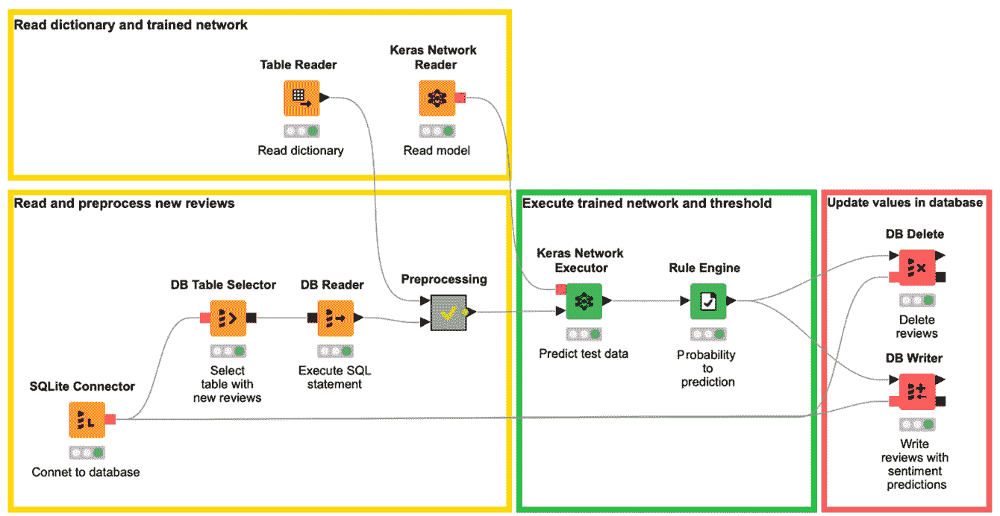
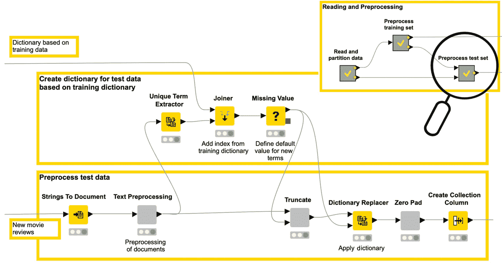
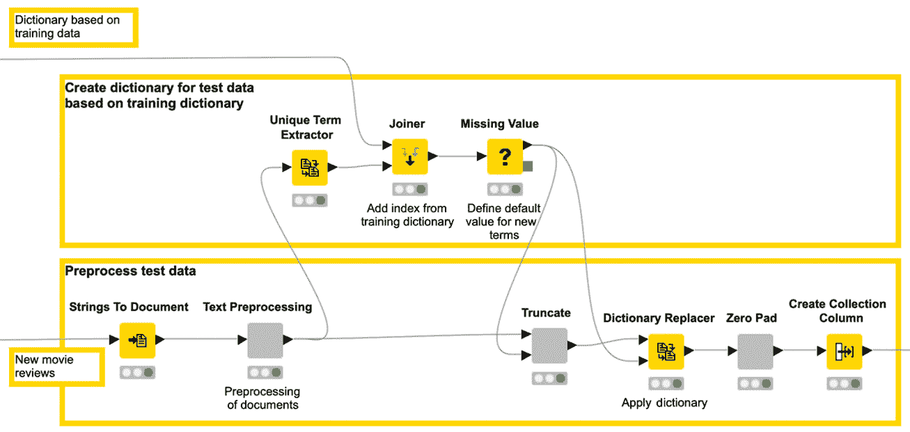
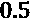
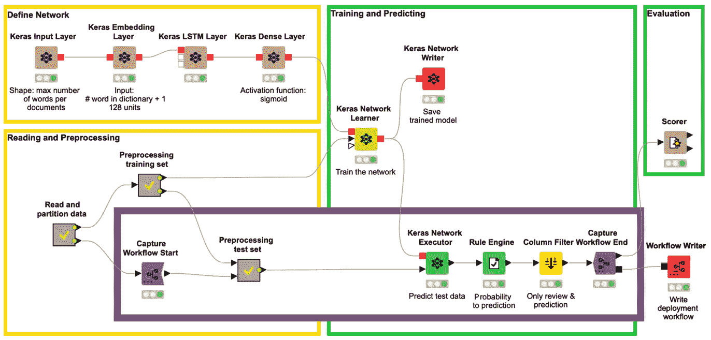
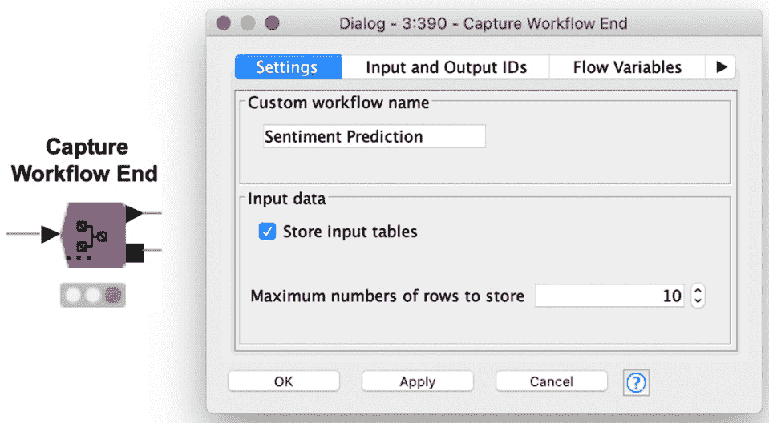
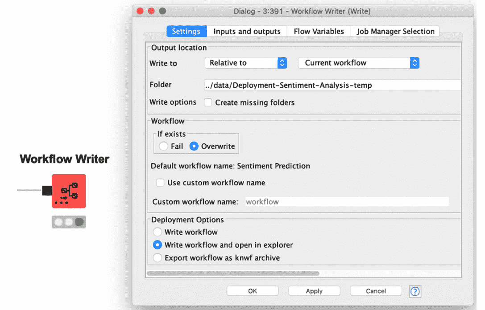
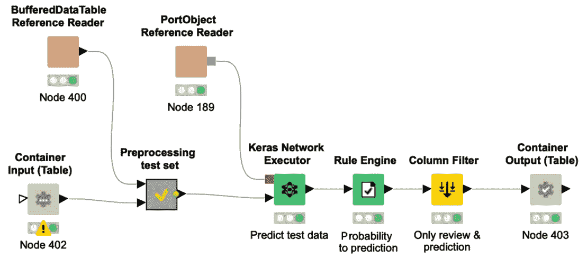
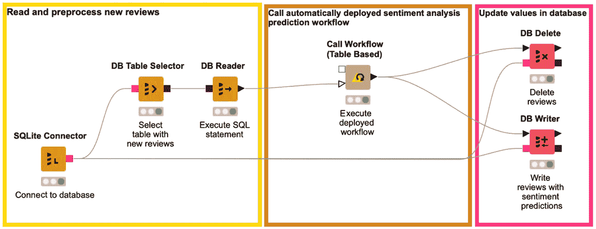

<title>B16391_10_Final_VK_ePUB</title>

*第十章:*部署深度学习网络

# 在本书的前几节中，我们讨论了针对许多不同用例的深度神经网络的训练，从用于欺诈检测的自动编码器开始，通过用于能耗预测和自由文本生成的**长短期记忆** ( **LSTM** )网络，一直到癌细胞分类。但是训练网络并不是项目的唯一部分。一旦训练了深度学习网络，下一步就是部署它。

在探索一些用例的过程中，已经引入了第二个工作流，以部署网络来处理真实世界的数据。因此，您已经看到了一些部署示例。然而，在本书的最后一部分，我们将重点放在机器学习模型的许多部署选项上，特别是经过训练的深度学习网络。

通常，会构建第二个工作流，专门用于部署。该工作流读取经过训练的模型和新的真实世界数据，它以与训练数据完全相同的方式预处理这些数据，然后将经过训练的深度学习网络应用于经过转换的数据，并根据项目的要求产生结果。

本章重点介绍部署工作流中数据的读取、写入和预处理。

本章首先回顾了保存、读取和转换训练好的网络的特性。接下来是两个例子，说明我们的情感分析用例的预处理也可以在部署工作流中实现。最后，本章展示了如何通过启用 GPU 支持来提高执行速度。

本章由以下几节组成:

网络结构的转换

构建简单的部署工作流

提高可扩展性–GPU 执行

网络结构的转换

# 部署工作流的目标是将一个训练有素的网络应用于新的真实世界数据。因此，训练工作流的最后一步必须是保存训练好的网络。

拯救训练有素的网络

## 本书中描述的所有网络都是使用 Keras 库训练的，依靠 TensorFlow 作为后端。因此，保存网络最自然的方法是继续使用 Keras 库，因此使用`.h5`文件。

然而，Keras 格式的网络只能通过 Keras 库来解释和执行。这已经是 TensorFlow 库之上的一个级别了。直接在 TensorFlow Java API 上执行网络应用程序，而不是通过 Keras Python API 在 Python 内核上执行，这使得执行速度更快。好消息是，除了基于 Keras 库的节点之外，KNIME 分析平台还有用于 TensorFlow 执行的节点。

因此，如果需要更快的执行，Keras 网络应该使用压缩的`zip`文件`SavedModel`转换成张量流网络。一个`SavedModel`文件包含一个完整的 TensorFlow 程序，包括权重和计算。它不需要运行原始的模型构建代码，这使得它对于共享或部署非常有用。

部署网络的第一步是读取经过训练的网络。

阅读训练有素的网络

## KNIME Analytics 平台提供了许多用于读取经过训练的神经网络的节点，如下:

Keras 网络阅读器

*   TensorFlow 网络阅读器(和 TensorFlow 2 网络阅读器)
*   DL Python 网络创建器
*   ONNX 网络阅读器
*   该`.h5`文件)或者只是一个没有权重的网络架构定义(一个`.json`或`.yaml`文件)。您可以使用该节点读取通过 KNIME Analytics 平台训练的网络或直接通过 Keras 训练的网络，如预训练的 Keras 网络。

`zip`文件。如果从一个目录读取，它必须是一个有效的`SavedModel`文件夹。如果从一个`zip`文件中读取，它必须包含一个有效的`SavedModel`文件夹。

小费

TensorFlow 网络阅读器节点允许我们在其配置窗口中选择标签和签名。标签用于标识要加载的元图定义。签名`SavedModel`可以有多个标签以及每个标签多个签名。用 KNIME Analytics Platform 保存的网络只有一个标签和一个签名。在配置窗口的**高级**选项卡中，您可以通过定义模型的输入和输出来定义您自己的签名，例如，通过选择一个隐藏层作为输出。

另一个节点是 **ONNX 网络阅读器**节点，它允许你不用写一行代码就能读取预训练的网络。 **ONNX** 代表**开放式神经网络交换**，是由微软和脸书开发的神经网络标准格式。因为它是一种标准格式，所以它可以跨机器学习框架移植，如 PyTorch、Caffe2、TensorFlow 等。您可以从 ONNX Model Zoo([https://github.com/onnx/models#vision](https://github.com/onnx/models#vision))下载预训练的网络，并使用 ONNX 网络读取器节点读取它们。ONNX 网络也可以使用 **ONNX 到 TensorFlow 网络转换器**节点转换为 TensorFlow 网络，然后使用 TensorFlow 网络执行器节点执行。

小费

要使用 ONNX 节点，您需要安装 **KNIME 深度学习–ONNX 集成**扩展。

使用 Python 代码读取网络的另一个选项是 **DL Python Network Creator** 节点，它可以用于使用几行 Python 代码读取预训练的神经网络。

小费

DL Python Network Creator 节点也可用于培训工作流，以使用 Python 代码而非图层节点来定义网络架构。

到目前为止，我们使用基于 Keras 的节点，TensorFlow 1 作为后端。也有使用 TensorFlow 2 作为后端实现类似操作的节点。

使用张量流 2

## 对于本书中的所有示例，我们都使用了基于 Keras 的节点，这些节点运行 TensorFlow 1 作为后端。自 KNIME Analytics Platform 4.2 发布以来，TensorFlow 2 也受到支持。在 KNIME Hub 上，可以找到很多如何使用 TensorFlow 2 集成的例子。

TensorFlow 2 集成带有三个节点:

**tensor flow 2 网络执行器**节点

*   **tensor flow 2 网络阅读器**节点
*   **tensor flow 2 网络作家**节点
*   要使用 TensorFlow 2 训练深度学习模型，您可以使用 **DL Python 网络学习器**节点。

既然我们已经查看了保存和读取神经网络的许多选项，那么让我们将重点放在构建一个简单的部署工作流上。

构建简单的部署工作流程

# 到目前为止，在我们探索的所有案例研究中，我们总是对输入数据执行某种预处理，例如对分类特征编码、对文本编码或对数据进行规范化，这只是所采用的一些预处理步骤。在部署过程中，新输入的数据必须经过与训练数据完全相同的预处理，以便与任务和网络预期的输入保持一致。

在本节中，我们使用第七章 、*实现 NLP 应用*中所示的情感分析案例研究作为示例，并为其构建两个部署工作流。这两个工作流的目标都是从数据库中读取新的电影评论，预测情感，并将预测写入数据库。

在第一个示例中，预处理步骤是在部署工作流中手工实现的。在第二个例子中，使用了**集成部署**特性。

手动构建部署工作流，没有集成部署

## 部署工作流应该从数据库的一个表中访问新的评论，应用训练好的网络，将带有相应预测的评论写入数据库的另一个表中，并从第一个表中删除评论。

这些步骤由*图 10.1* 中的工作流执行，您可以从 KNIME Hub 下载，网址为[https://Hub . KNIME . com/kathrin/spaces/Codeless % 20 deep % 20 learning % 20 with % 20 KNIME/latest/Chapter _ 10/](https://hub.knime.com/kathrin/spaces/Codeless%20Deep%20Learning%20with%20KNIME/latest/Chapter_10/):

图 10.1–第 7 章 中 [*情感分析案例研究的部署工作流程，实现 NLP 应用*](B16391_07_Final_NM_ePUB.xhtml#_idTextAnchor230)

工作流首先连接到一个 SQLite 数据库，在那里使用 **SQLite 连接器**节点存储新的电影评论。

接下来，从名为 **new_reviews** 的表中读取新评论的 **SELECT** SQL 语句由 **DB 表选择器**节点实现。

然后，SQL 语句通过 **DB 阅读器**节点执行。结果，我们在节点输出端口的数据表中有了新的评论。

小费

在 [*第二章*](B16391_02_Final_SK_ePUB.xhtml#_idTextAnchor051) 、*用 KNIME Analytics 平台进行数据访问和预处理*中，详细介绍了数据库扩展。请记住，数据库节点在其棕色方形输出端口创建一个 SQL 语句。

在将网络应用到这些新的评审之前，我们需要执行与培训工作流中相同的转换。在 [*第 7 章*](B16391_07_Final_NM_ePUB.xhtml#_idTextAnchor230) 、*实现 NLP 应用*中报告的训练工作流中，有一个名为**预处理测试集**的元节点，所有需要的预处理步骤都应用于测试数据。我们使用这个元节点作为基础，为部署工作流中的传入数据创建预处理步骤。

*图 10.2* 显示了这个元节点的内容，它专用于测试集的预处理:

图 10.2–第 7 章 中 [*情感分析案例研究的训练工作流程中测试数据的预处理，实现 NLP 应用*](B16391_07_Final_NM_ePUB.xhtml#_idTextAnchor230)

在*图 10.1* 的部署工作流程中，首先读取训练时创建的字典；然后在**预处理**元节点中实现预处理步骤。

*图 10.3* 显示了该元节点端的工作流片段:

图 10.3–部署工作流的预处理元节点中的工作流片段

如果我们比较*图 10.2* 和*图 10.3* 中的工作流片段，您可以看到它们包含相同的预处理步骤，正如我们所料。

既然与训练数据相同的预处理已经应用于部署数据，训练好的网络可以通过 **Keras 网络阅读器**节点*图 10.1* 引入。

接下来，训练好的网络使用 **Keras 网络执行器**节点在预处理的部署评审上运行。网络的输出是情绪等于 1 的概率，其中 1 编码一个积极的电影评论。通过**规则引擎**节点，这里也应用了与训练期间相同的阈值:阈值。

最后一步，更新数据库中的表。首先， **DB Delete** 节点从 **new_reviews** 表中删除我们刚刚分析的评论。然后， **DB Writer** 节点将新的电影评论及其预测附加到数据库中的另一个表，名为**带感情评论**。

这是第一个使用 KNIME 分析平台部署神经网络的例子。应该定期执行此工作流，以预测所有新电影评论的情绪。

小费

KNIME Server 可以调度工作流的执行，因此您可以定期自动触发它们的执行。

这种方法有一个缺点。如果根据更多数据或不同设置重新训练模型(例如，如果在训练期间考虑更多或更少的术语，或者规则引擎节点的阈值发生变化)，我们需要记住还要更新部署工作流中的预处理步骤。由于我们是健忘的人，我们可能会忘记或犯错误。

克服这个问题的一个解决方案是**集成部署**的概念。

通过集成部署自动构建部署工作流

## 在 KNIME Analytics Platform 4.2 以及其他工具之前，常见的方法是在部署工作流中手动实现数据混合、数据转换和网络执行。这意味着您需要将不同的预处理片段、参数和网络执行器节点从培训工作流复制到部署工作流，确保所有设置保持不变。

这种手动步骤会降低流程速度，并且很容易导致错误。自动化部分部署工作流的构造可能是一个更安全的选择，特别是如果模型经常改变，例如，每天甚至每小时。

重要说明

培训过程的其他常见名称是数据科学创建或建模工作流。

集成部署扩展中的节点缩小了创建和部署数据科学之间的差距。

集成部署扩展

### 集成部署扩展允许数据科学家将模型培训和部署合并到一个工作流中。其思想是捕获部分培训工作流，并在培训工作流的执行过程中自动将它们写入部署工作流。

取代手动复制预处理部分，来自训练工作流的所需部分被在**捕获工作流开始**和**捕获工作流结束**节点之间捕获。中间被捕获的工作流部分可以被写入到一个新的工作流中，并带有一个**工作流编写器**节点。

在培训工作流中使用集成部署扩展

### 让我们再次考虑在 [*第 7 章*](B16391_07_Final_NM_ePUB.xhtml#_idTextAnchor230) 、*实现 NLP 应用*中描述的情感分析案例研究的部署工作流。在培训工作流中，我们引入了**捕获工作流开始**节点和**捕获工作流结束**节点，以隔离我们希望在部署工作流中准确再现的工作流片段。

这包括以下内容:

名为**的元节点预处理测试集**，包括所有需要的预处理步骤

*   **Keras 网络执行器**节点将训练好的网络应用于部署转换后的数据
*   **规则引擎**节点，其基于应用于输出类别概率的阈值来决定肯定或否定类别
*   图 10.4 中的工作流程向您展示了这个基于情感分析案例研究的示例。您可以从 KNIME Hub 的[https://Hub . KNIME . com/kathrin/spaces/Codeless % 20 deep % 20 learning % 20 with % 20 KNIME/latest/Chapter _ 10/](https://hub.knime.com/kathrin/spaces/Codeless%20Deep%20Learning%20with%20KNIME/latest/Chapter_10/)下载工作流程:

图 10.4–使用集成部署自动创建部署工作流的培训工作流

粗框中的部分是捕获的工作流片段。**捕获工作流开始**节点定义开始，而**捕获工作流结束**节点定义要捕获的工作流片段的结束。

开始节点不需要任何配置。*图 10.5* 显示了第 e **采集工作流结束**节点的配置窗口:

图 10.5–捕获工作流结束节点的配置窗口

在配置窗口中，您可以设置捕获的工作流片段的名称。您还可以设置捕获的代码片段是否应该与数据一起存储，如果是，还可以设置要包含的最大数据行数。我们将很快看到为什么在捕获的工作流片段中存储一些数据是有帮助的。

然后通过**捕获工作流结束**节点的输出端口(黑色方块)导出捕获的工作流片段，无论有无数据。在*图 10.4* 中的工作流中，工作流片段随后由的**工作流编写器**节点收集，并写入部署工作流中，不改变设置和配置。

*图 10.6* 显示了**工作流编写器**节点的配置窗口:

图 10.6–工作流编写器节点及其配置窗口

在顶部，您可以设置目标工作流程的文件夹位置(**输出位置**)。

接下来，您需要设置目标工作流的名称。节点会自动建议一个默认名称，您可以通过**使用自定义工作流名称**选项进行自定义。如果您选择的名称引用了已经存在的工作流，您可以让 writer 节点失败或覆盖。

在底部，您可以为目标工作流选择部署选项:只需创建它，创建它并打开它，或者将其保存为一个`.knwf`文件以便导出。

下图*图 10.7* ，展示了由**工作流编写器**节点自动生成的部署工作流:

图 10.7–从通过集成部署捕获的工作流片段中自动创建的部署工作流

在捕获的工作流中，您可以看到**预处理测试集**元节点，以及 **Keras 网络执行器**、**规则引擎**和**列过滤器**节点。此外，整个集成部署流程增加了以下内容:

两个**参考阅读器**节点。它们是一般的读取器节点，加载在捕获的工作流片段中找不到的静态参数的连接信息。

*   一个**容器输入(表)**和一个**容器输出(表)**节点，以便接受输入数据和分别从和向其他应用发送输出数据。
*   此部署工作流的执行可以由使用**调用工作流(表)**节点的另一个工作流触发，或者如果工作流已经部署在 KNIMEs 服务器上，则通过 REST 服务触发。在下一章中，我们将详细讨论 REST 调用和 REST 服务。

在*图 10.7* 中，示例部署工作流使用两个内部没有图标的阅读器节点读取工作流顶部的两个实体。左边的提供基于训练数据的字典表，右边的提供训练好的神经网络。

此外，还可以看到两个新节点，分别是**容器输入(表)**和**容器输出(表)**节点。

**容器输入(表格)**节点从外部调用方(即**调用工作流(基于表格)**节点)接收数据表，并使其在输出端口可用。配置参数使外部调用程序能够向**容器输入(表)**节点发送数据表。

**容器输入(表)**节点也有一个可选的输入端口(由未填充的输入端口表示)。如果一个数据表连接到可选输入，节点将简单地把这个表转发到下一个节点；如果一个表是通过 REST API 提供的，那么提供的表将在输出端口上可用。

如果没有输入，节点的输出将提供一个默认的模板表。这里，来自**捕获工作流结束**节点的**存储输入表**设置开始生效。如果选择存储一些数据行，它们将用于定义此默认模板表。

**容器输出(表格)**节点向外部调用者发送一个 KNIME 数据表。

现在，让我们看看如何使用自动创建的工作流来预测部署期间新评论的情绪。

使用自动创建的工作流

### 现在让我们看看如何使用部署工作流。

*图 10.8* 向您展示了如何使用自动创建的部署工作流来对新电影评论的情感进行分类，您可以从 KNIME Hub 下载并试用它，网址为[https://Hub . KNIME . com/kathrin/spaces/Codeless % 20 deep % 20 learning % 20 with % 20 KNIME/latest/Chapter _ 10/](https://hub.knime.com/kathrin/spaces/Codeless%20Deep%20Learning%20with%20KNIME/latest/Chapter_10/):

:图 10.8-调用自动创建的部署工作流的工作流

工作流连接到数据库并读取传入的新电影评论。

然后，**调用工作流(基于表格)**节点调用自动构建的部署工作流(*图 10.7* )。**调用工作流(基于表格)**节点实际上调用了驻留在您的本地工作区或已挂载的 KNIME 服务器上的其他工作流。被调用的工作流必须包含至少一个容器输入节点和一个容器输出节点，以定义两个工作流之间的接口:被调用的工作流和调用方工作流。

通过**调用工作流(基于表格)**节点，我们将新的电影评论发送到部署工作流，以提供给**容器输入(表格)**节点。然后执行部署工作流，并将预测发送回调用方工作流，并通过**调用工作流(基于表)**节点的输出端口提供。

这种策略的一大优点是确保了培训工作流中的数据操作和部署工作流中的数据操作之间的一致性。如果我们现在更改培训工作流中数据操作的任何设置，例如，**规则引擎**节点中阈值的值(*图 10.4* )，并且我们重新执行培训工作流，这些更改将自动导入到部署工作流的新版本(*图 10.7* )中，并由依赖它的任何工作流使用(*图 10.8* )。

小费

**集成部署**扩展的另一个伟大节点是**工作流组合器**节点，它允许我们组合来自不同原始工作流的工作流片段。

我们已经到了本章的最后一节，关于可扩展性和 GPU 执行。

提高可扩展性——GPU 执行

# 对于本书中描述的案例研究，我们使用了相对较小的数据集和小型网络。这使我们能够在几个小时内仅使用基于 CPU 的执行来训练网络。然而，在小数据集上需要几分钟或几小时的训练任务在大数据集上很容易需要几天或几周；小型网络架构的规模会快速增长，执行时间也会变得令人望而却步。一般来说，当使用深度神经网络时，训练阶段是资源最密集的任务。

GPU 被设计用来同时处理多个计算。这种范式适合训练深度学习网络所需的密集计算。因此，GPU 是在大型数据集上高效和有效地训练大型深度学习网络的替代选择。

一些 Keras 库可以通过 TensorFlow 范例利用兼容 NVIDIA 的 GPU 的计算能力。因此， **KNIME Keras integration** 也可以利用 GPU 的计算能力更快地训练深度学习网络。

在 [*第一章*](B16391_01_Final_NM_ePUB.xhtml#_idTextAnchor016) 、【KNIME Analytics 平台深度学习介绍中，我们介绍了如何设置 Python 进行 KNIME Keras 集成和 KNIME TensorFlow 集成。为了在 GPU 上而不是在 CPU 上运行 KNIME Keras 集成，您不需要采取很多额外的步骤。

当然，你需要一台支持 GPU 的电脑。TensorFlow 1.12 需要 CUDA 计算能力为 3.5 或更高的 NVIDIA GPU 卡。

除此之外，大部分需要的依赖项(即 CUDA 和 cuDNN)都会在安装 conda `tensorflow=1.12`和`keras-gpu=2.2.4`的时候被 Anaconda 自动安装。包装

安装时唯一的额外步骤是手动安装最新版本的 NVIDIA GPU 驱动程序。

在安装时，通过选择`keras-gpu=2.2.4`创建。

使用 TensorFlow 集成时，还可以在 GPU 上执行来读取和执行 TensorFlow 的 SavedModel。

重要说明

对 **KNIME TensorFlow 集成**(使用 TensorFlow Java API)的 GPU 支持通常独立于对 **KNIME Keras 集成**(使用 Python)的 GPU 支持。因此，必须单独设置两个 GPU 支持。由于 TensorFlow 的限制，GPU 对 KNIME TensorFlow 集成的支持只能在 Windows 和 Linux 上运行，而不能在 Mac 上运行。

在撰写本文时，KNIME 推荐了以下 GPU 配置。

KNIME TensorFlow 集成使用 TensorFlow 版本 1.13.1，这需要在您的系统上安装以下 NVIDIA 软件:

NVIDIA GPU 驱动:CUDA 10.0 要求 410.x 以上。

*   CUDA 工具包:TensorFlow (≥ 1.13.0)支持 CUDA 10.0。
*   cuDNN(版本≥7 . 4 . 1):CUDA 10.0 选择 cud nn v 7 . 6 . 0(2019 . 5 . 20)。
*   详细说明和最新更新请查看 KNIME 文档([https://docs . KNIME . com/2019-06/deep _ learning _ installation _ guide/index . html # tensor flow-integration](https://docs.knime.com/2019-06/deep_learning_installation_guide/index.html#tensorflow-integration))。

总结

# 在这一章中，我们讨论了三个不同的主题。我们首先总结了读取、转换和编写神经网络的许多选项。

然后，我们使用第七章 、*实现 NLP 应用*中的情感分析案例研究，继续讨论神经网络的部署。这里的目标是建立一个工作流，该工作流使用经过训练的神经网络来预测存储在数据库中的新评论的情绪。我们已经展示了一个部署工作流可以通过两种方式进行组装:手动或通过集成部署自动组装。

本章的最后一节讨论了网络培训和执行的可扩展性。特别是，它展示了如何在训练神经网络时利用 GPU 的计算能力。

在本书的下一章也是最后一章中，我们将探讨在使用深度学习时的进一步部署选项和最佳实践。

问题和练习

# a) Keras 到张量流网络转换

1.  Which network conversions are available in KNIME Analytics Platform?

    b) TensorFlow 到 Keras 网络转换

    c) ONNX 到 Keras 网络转换

    d) Keras 到 ONNX 网络转换

    a)集成部署允许我们在执行过程中重新训练模型。

2.  Which statements regarding Integrated Deployment are true (two statements are correct)?

    b)自动生成的工作流的执行可以由另一个工作流触发。

    c)培训工作流的执行由部署工作流触发。

    d)综合部署缩小了培训和部署之间的差距。

    d) Integrated Deployment closes the gap between training and deployment.