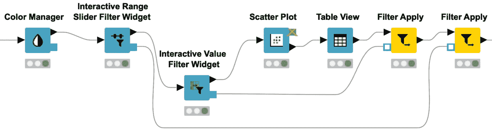
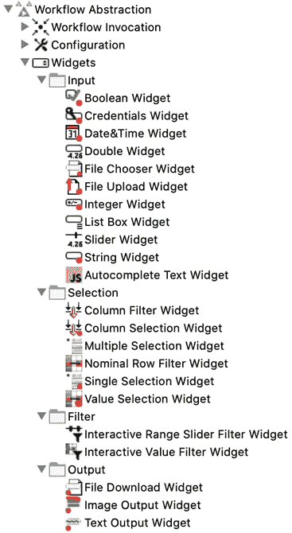
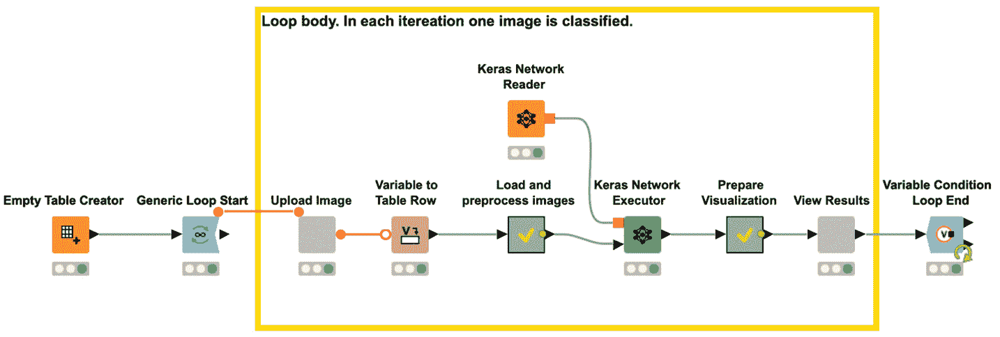
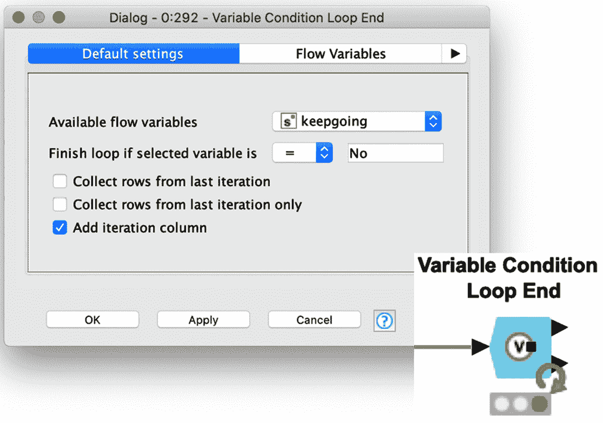
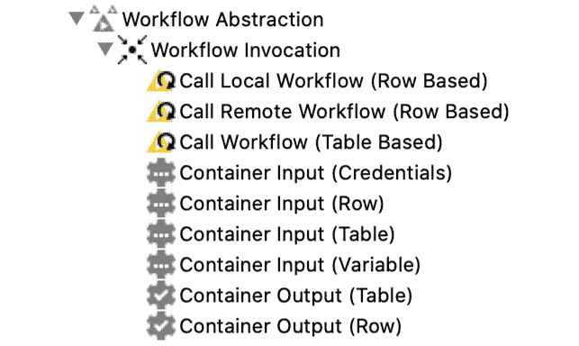
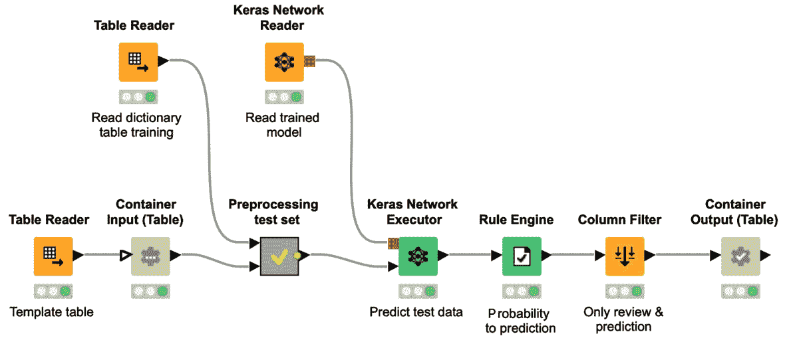

<title>B16391_11_Final_NM_ePUB</title>

# *第十一章:*最佳实践和其他部署选项

在 [*第 10 章*](B16391_10_Final_VK_ePUB.xhtml#_idTextAnchor367) 、*部署深度学习网络*中，我们介绍了部署的概念，并展示了如何构建工作流来将网络应用于新数据。在本章中，我们将关注使用 KNIME 软件的另外两个部署选项。

在本章的第一部分，您将学习如何将深度学习模型部署为 web 应用程序，以便最终用户可以通过 web 浏览器执行、交互和控制该应用程序。为了实现一个 web 应用程序，我们需要介绍 KNIME WebPortal，KNIME Server 的一个特性。组件在 web 应用程序的开发中起着核心作用，因为根据 KNIME 软件的**导向分析**特性，它们被用来实现交互点。在本章中，您还将了解更多关于组件的知识。

消费深度学习模型的另一个部署选项是 web 服务，通过 REST 接口。Web 服务最近变得非常流行，因为它们允许您在同一个生态系统中无缝、轻松地集成和编排许多应用程序。在本章的第二部分，您将学习如何使用 KNIME 软件构建、部署和调用工作流作为 REST 服务。

我们将用一些关于神经网络和 KNIME 分析平台的最佳实践建议和技巧来结束这一章。这些最佳实践和技巧来自于我们自己多年从事深度学习项目的经验，其中一些已经在本书中进行了描述。

本章分为以下几个主题:

*   构建 Web 应用程序
*   使用 REST 接口构建 Web 服务
*   KNIME 提示和技巧

# 构建 Web 应用程序

在本节的中，我们将向您展示使用 KNIME 软件构建一个 **web 应用程序**所需的几个步骤。

在简要介绍了**KNIME****web portal**之后，我们将展示如何创建复合视图，如何包含它们以创建交互点，以及如何按照**导向分析**原则将应用程序组织成一系列网页作为交互点。

作为一个例子，我们将围绕 [*第 9 章*](B16391_09_Final_NM_ePUB.xhtml#_idTextAnchor316) 、*图像分类卷积神经网络*中描述的癌细胞分类案例研究的部署工作流程，应用我们所学的知识构建一个 web 应用程序。

## KNIME 网络门户简介

构建 web 应用程序的第一步是设计和实现工作流中基于 web 的交互点序列。在一个关于癌细胞分类的案例研究中，我们的数据科学家可以构建一个具有两个交互点的部署工作流:一个允许最终用户上传组织病理学幻灯片图像，另一个在最终的网页上显示结果。在这两个交互点之间，工作流接收新图像并执行训练好的模型对其进行分类。

一旦工作流准备就绪，它将被转移到生产 **KNIME 服务器**上。从现在开始，可以通过任何网络浏览器，通过 **KNIME WebPortal** 按需访问工作流程。这种基于网络的交互允许病理学家在不熟悉 KNIME 分析平台或深度学习算法的情况下控制过程。*图 11.1* 向您展示了这个基于 web 的应用程序可能的样子:

图 11.1-一个由 KNIME 工作流实现的 web 应用程序，运行在 KNIME 服务器上，通过 KNIME WebPortal 从任何 web 浏览器调用

在这个例子中， web 应用程序是一个非常简单的应用程序。它只有两个交互点——也就是两个网页:第一个用于图片上传，第二个用于检查结果。

使用 KNIME Analytics Platform、KNIME Server 和 KNIME WebPortal 的组合，可以开发更复杂的 web 应用程序。从 KNIME Hub([https://hub.knime.com](https://hub.knime.com))可以下载一些非常复杂且设计非常精美的 web 应用程序的例子，比如可视化引导、标签引导和自动化引导。

与 KNIME 分析平台相反，KNIME 服务器不包含数据操作或模型训练算法。但是，它包含了整个 it 基础设施，允许团队成员之间的协作、应用程序的按需和计划执行、每个注册用户或用户组的访问权限定义、模型管理、审计功能，当然还有部署选项，我们将在本章中看到。此外，与 KNIME 分析平台相反，KNIME 服务器不是开源的，而是需要一个年度许可证。*图 11.2* 显示了 KNIME WebPortal 的登录页面:

图 11.2-KNIME 网络门户的登录页面

在 KNIME Server 提供的众多 IT 特性中，KNIME WebPortal 允许您从任何 web 浏览器查看和管理工作流。这似乎是一个简单的功能，但它可能是数据科学家和最终用户之间缺失的一环。

重要说明

最终用户是他们领域的专家，通常既没有时间也没有兴趣打开 KNIME 分析平台并调查工作流和节点。最终用户需要的只是一个舒适的基于 web 的应用程序，它运行在 web 浏览器上，只显示他们需要看到的信息；至少，用于数据上传的页面和总结结果的最终页面。

WebPortal 不需要任何特殊安装。它已经预打包在 KNIME Server 的安装中。然而，它的外观可以通过专用的 *CSS 样式表*轻松定制。KNIME WebPortal 只接受注册用户，需要登录(*图 11.2* )。

成功登录后，起始页出现，显示您有权访问的文件夹。导航至您想要启动的工作流程，然后按下**运行** ( *图 11.3* ):

图 11.3-KNIME web portal 上所选工作流的起始页

重要说明

KNIME 服务器是 KNIME 分析平台的补充工具。虽然 KNIME Analytics Platform 拥有所有的算法和数据操作，但是 KNIME Server 为基于团队的协作、应用程序自动化、模型管理和部署选项提供了 IT 基础设施。

让我们看看如何构建一个工作流，以便在 KNIME WebPortal 上创建一系列带有已定义交互选项的页面。

## 创建在 KNIME 网络门户上运行的工作流程

KNIME WebPortal 上工作流的执行从一个网页移动到下一个网页。这些页面也称为向导步骤，为最终用户提供了可视化引导操作的可能性，以移动流程并与之交互。

现在，如果我们必须从头开始构建所有这些页面/步骤，那将是漫长而复杂的。幸运的是，有**组件**。每个页面/步骤只是可视化底层工作流中组件的**复合视图**的内容。因此，为 WebPortal 实现一系列网页实际上相当于用所需的复合视图实现一系列组件。

*图 11.4* 的上半部分显示了在 KNIME WebPortal 上运行的应用程序的三个网页:从数据库导入客户的表单；相互连接的散点图和表格，用于选择一些客户；最后是显示所选客户信息的页面。*图 11.4* 的下半部分显示了具有相应三个组件的底层工作流。在 KNIME WebPortal 上执行工作流的过程中，每个组件的复合视图产生一个页面:

图 11.4–顶部:KNIME WebPortal 上应用程序的分步执行。底部:为步骤执行生成网页的相应工作流

*图 11.4* 中的工作流用作从网络浏览器执行工作流的步骤的示例，并引用客户数据集。在本节中，我们将只使用这个数据集，因为它允许我们展示组件构造中使用的许多不同的特性。该 web 应用程序旨在允许最终用户检查客户数据，并选择团队成员联系的高流失风险客户。

第一个组件**从数据库**中获取客户，在左侧创建第一个页面。在这里，最终用户必须提供他们的用户名和密码来连接到数据库。

点击右下角的**下一个**按钮后，执行工作流，直到到达下一个组件**选择要联系的客户**，并创建相应的网页。在该页面上，最终用户通过散点图和表格获得客户数据的概述，并选择要联系的客户。对于选择，视图提供了两个交互选项:通过左上角的单选按钮选择一个产品，或者使用左下角的范围滑块更改客户流失率。散点图和表格会根据新的选择参数自动更新。一旦最终用户对选择感到满意，他们再次点击**下一步**到达网络应用的最后一页。

最终页面由**浏览和下载客户列表**组件创建。在这里，每个选定客户的数据都以平铺视图的形式报告，并且可以导出到 Excel 文件中。工作流程可在 KNIME Hub 上获得:[https://Hub . KNIME . com/kath rin/spaces/Codeless % 20 deep % 20 learning % 20 with % 20 KNIME/latest/Chapter _ 11/](https://hub.knime.com/kathrin/spaces/Codeless%20Deep%20Learning%20with%20KNIME/latest/Chapter_11/)。

小费

要打开一个已经在 KNIME Analytics 平台中的组件的交互视图，在执行后，右键单击该组件并选择**交互视图:<组件名称>** 。

总而言之，这些页面中的每一个都是由工作流中的一个组件创建的，并显示其交互式视图。组件及其复合视图是构建 web 应用程序工作流的关键元素。

现在让我们看看如何创建和定制一个复合视图。

## 创建复合视图

一个组件的复合视图从其内部包含的**视图**和**小部件**节点收集所有交互视图。

小费

要创建一个新组件，您必须选择要包含在组件中的节点，然后右击并选择**创建组件...**选项。

在深入查看**视图**和**小部件**节点之前，让我们先看看**选择客户联系**组件的内部(*图 11)。 5* ):

图 11.5-选择要联系的客户组件的内容

在相应页面的左下方部分，最终用户可以选择通过滑块定义流失分数的阈值。这个交互式滑块是由**交互式范围滑块过滤器部件**节点创建的。

在左上角，选择产品的选项是由**交互值过滤器小部件**节点创建的。

此外，该页面还显示了交互式散点图和交互式表格。这两个视图分别是由**散点图**节点和**表格视图**节点创建的。

正如您所看到的，每个小部件/视图节点都向最终的复合视图添加了一部分，因此也向 WebPortal 中的相应页面添加了一部分。

小费

在 KNIME Analytics 平台中，右键点击节点，选择**交互视图:<节点名称>** ，可以看到每个 widget/view 节点的视图。

可以向复合视图提供片段的节点可以分为三组:

*   **Widget 节点**
*   **查看节点**
*   **互动小工具节点**

让我们详细看一下每一个类别。

### 小部件节点

小部件节点产生一个带有交互表单的视图，用于设置参数。然后，新设置的参数作为**流变量**导出，并可由工作流中的其他节点使用。

小费

在 [*第 2 章*](B16391_02_Final_SK_ePUB.xhtml#_idTextAnchor051) 、*使用 KNIME Analytics Platform* 进行数据访问和预处理中，我们介绍了流变量的概念以及如何使用它们来覆盖设置选项。

每个小部件节点专门用于产生一种特定的输入或交互形式，比如字符串输入、整数输入、从列表中选择一个或多个值等等。您可以在**工作流抽象** | **Widgets** 下的节点库中找到所有可用的 widget 节点，如图*图图 11.6* 所示:

图 11.6–节点存储库中可用的小部件节点

小部件节点本身可以分为三个子组:

*   **输入小部件节点**:*输入*类别中的小部件节点在网页上生成一个输入表单，它允许您向工作流中输入不同类型的值——整数、字符串、布尔值、双精度值或列表——以及其他格式的数据，如日期&时间或凭证。
*   **选择小部件节点**:*选择*类别中的小部件节点生成 web 表单来从列表中选择值，例如从数据表中选择特定的列，从数据集中包含/排除多个列，或者从表中选择一个或多个值来过滤数据。
*   **输出小部件节点**:这些小部件节点向复合视图添加定制文本、链接或图像。

例如，*图 11.7* 显示了**单选控件**节点及其配置比例窗口:

图 11.7–单一选择小部件节点及其配置窗口

大多数小部件节点共享一些重要设置，如**标签**、**描述**、**变量名**:

*   **Label** :这将在 widget 节点创建的表单上创建一个标签。
*   **描述**:该值在 widget 表单上显示为工具提示。
*   **变量名**:给出节点创建的流变量的名称。

让我们看看**单选小工具**节点的附加配置设置(*图 11.7* ):

*   **选择类型**:定义用于选择的对象:下拉菜单、垂直或水平单选按钮或列表
*   **可能的选择**:定义可供选择的值列表
*   **默认值**:给选择操作分配一个初始默认值

标准小部件节点产生一些流变量或一个表作为输出，可以在工作流的下游节点中使用。一组特殊的小部件节点是交互式小部件节点。

### 查看节点

视图节点通过交互式图表、绘图和表格可视化数据。

*图 11.8* 显示了 N ode 资源库中可用视图节点的概述:

图 11.8–节点存储库中可用的视图节点

如果多个视图节点出现在一个组件中，它们的视图在结果组件视图中相互作用；例如，通过选择，在一个节点的视图中选择的数据点可以在另一个节点的视图中被选择或者甚至被隔离。

小费

**Plotly** 节点和 **JavaScript** 节点在**实验室**类别中提供了更多的交互式选项，以在复合视图中可视化您的数据。来自**本地(Swing)** 类别中的(本地)节点的视图不能集成到组件的复合视图中。

### 交互式小部件节点

**交互控件**节点是特殊控件节点。它们实现过滤器事件和提要视图节点。在执行期间，交互式小部件节点中的更改会立即反映在后续视图节点的视图中。

在撰写本文时，KNIME Analytics 平台提供了两个交互式小部件节点:**交互式范围滑块过滤器小部件**节点和**交互式值过滤器小部件**节点。

这些节点可用于触发复合视图中的更新。在下游视图节点的配置窗口中，我们可以设置该节点是否应该侦听来自以前的交互式小部件节点的过滤器事件。如果是，那么当先前的交互式小部件节点的过滤器事件中的设置改变时，由视图节点产生的视图立即被更新。

与标准小部件节点相比，这两个节点在打开的复合视图或网页中触发直接过滤器事件。由标准小部件节点创建的流变量可以由后续节点使用，但不会触发打开的页面或复合视图中的直接更改。

现在我们已经有了构建复合视图可用的节点的概述，让我们通过一些布局选项来定制组件的复合视图。

### 定义复合视图的布局

您可以为包含至少一个小部件或视图节点的每个组件的复合视图定义一个布局。

小费

要在工作流编辑器的新标签页中打开一个组件，必须按下 *Ctrl* +双击该组件或者右键单击该组件并选择**组件** | **打开**。

复合视图中的布局通过组件内部的**布局编辑器**设置。在工作流编辑器的新标签页中打开组件的内容后，点击顶部工具栏最右侧的布局编辑器按钮，如*图 11.9* 所示:

图 11.9-最右侧带有布局编辑器按钮的工具栏

点击布局编辑器按钮后，可视布局编辑器( *Fi 图 11.10* )打开:

图 11.10–可视化布局编辑器

布局编辑器使用具有行和列的网格结构。

左侧是具有不同列数的行模板，以及所有尚未放置的视图的列表。右边是布局编辑器本身。

您可以通过从左侧的模板列表拖放到右侧的布局编辑器来添加新的行模板，从而更改布局。要添加新的空列，单击布局编辑器中的 **+** 按钮。行内的列可以手动调整大小。

布局编辑器中的空单元可以通过将视图从未使用的视图列表中拖放到布局编辑器的单元中来填充。

默认布局只包含一列，小部件和视图节点的所有视图都从上到下放置在其中。要从空白画布开始，点击布局编辑器左上角的**清除布局**按钮。此清除操作会将所有视图添加到左侧列表中。

小费

布局编辑器中使用节点标签(节点下的文本)来标识视图。最佳实践是将节点标签更改为有意义的描述，以便在布局编辑器中轻松识别视图。

如果您想从复合视图中排除一个节点的视图，您可以转到布局编辑器的第一个选项卡，名为**节点用法**，并禁用 web portal/复合视图的节点视图。

也可能有嵌套组件，即组件中的组件。如果嵌套组件有一个视图，它在布局编辑器中显示为节点视图。因此，您可以像处理任何其他节点一样，将嵌套组件的视图集成到布局中。

一个复合视图可以很容易地被美化——例如，通过添加一个标题或一个侧边栏，并对文本体进行样式化。您很幸运，因为在 KNIME Hub 上有共享的组件可以做到这一点。

*图 11.11* 显示了使用一些可用的共享组件引入一些样式元素前后的网页:

图 11.11–没有(左)和有(右)标题、侧边栏和附加信息的网页

当我们构建癌细胞分类示例时，您将在本节末尾看到一些共享组件的运行。

让我们首先了解更多关于共享组件的信息。

## 共享组件

在上一节*创建复合视图*中，我们讨论了如何使用组件来为 WebPortal 应用程序创建复合视图和页面。组件还可以通过 KNIME Hub 和 KNIME Server 捆绑可以重用和共享的功能。这些功能从简单的重复性任务(如将凭证输入数据库)到更复杂的任务(如优化参数)不等。

与元节点相比，组件有自己的配置窗口。它们可以在不接触内部单个节点的情况下进行配置，这提供了一种隐藏配置复杂性的简便方法。当然，如果需要，您仍然可以打开组件，深入细节，并根据您的用例进行任何调整。

要在组件的配置窗口中添加设置，可以使用**配置节点**。它们的工作方式类似于小部件节点，但是是在配置窗口级别，而不是在复合视图级别。你可以在**工作流抽象** | **配置**下的节点库中找到它们。像任何 KNIME 节点一样，组件可以在**描述**面板中有一个描述。在组件内部，您可以通过点击 KNIME Analytics Platform 中**描述**面板左上角的笔来编辑描述。

为了让组件变得像所有其他 KNIME 节点一样，它们必须被共享。

要共享一个组件，右击它并选择**组件** | **共享…** 。

然后，决定保存模板的位置:本地工作区、KNIME Hub 或 KNIME 服务器。

接下来，您可以选择链接类型，将组件实例链接到组件模板。链接类型定义了检查更新时组件模板的位置。选择组件模板的目标后，会打开一个对话框，询问您链接类型:

*   **创建绝对链接**:工作流在寻找组件模板时使用绝对路径。
*   **创建挂载点相对链接**:工作流在查找组件模板时使用从所选挂载点开始的相对路径。
*   **创建工作流相对链接**:工作流在查找组件模板时，使用从当前工作流文件夹开始的相对路径。
*   **Don't create link with shared instance**: A component template is created but is not linked to the current instance.

    小费

    当您将工作流部署到 KNIME Server 时，请确保组件实例上的所有链接类型在服务器上也能工作。

要创建共享组件的实例，只需将组件模板从 KNIME Hub 或 KNIME Explorer 拖放到工作流编辑器中。新创建的实例是只读的，并链接到相应的共享组件。

每次启动工作流时，KNIME Analytics Platform 都会搜索组件模板的可能更新，如果有，就会建议更新实例。这样做的好处是，如果组件模板发生了变化，这些变化会自动反映在实例中。

小费

由于是只读的，新实例无法编辑。您需要首先断开实例与模板的连接，以便更改其内容。为此，您需要右键单击组件实例并选择**组件** | **断开链接**。

EXAMPLES 服务器或 KNIME Hub 上有许多公共的共享组件。在 KNIME Hub 上，您还可以在本章的工作流组中找到一些共享组件。

现在您已经熟悉了共享组件和 WebPortal，让我们看看癌细胞分类的部署示例。

## 构建用于癌细胞分类的门户网站应用程序

让我们回到 [*第九章*](B16391_09_Final_NM_ePUB.xhtml#_idTextAnchor316) 、*卷积神经网络用于图像分类*中描述的癌症数据和癌细胞分类的工作流程。在本节中，我们将展示如何使用 KNIME WebPortal 将经过训练的深度学习模型部署为 web 应用程序。

这里的目标是为不熟悉 KNIME 分析平台和数据科学的病理学家开发一个 web 应用程序。通过在组织病理学图像分析期间建议癌症分类，这将有助于他们的日常工作。一个额外的要求是不需要重启应用程序就可以按顺序上传多个图像。*图 11.12* 显示了实现应用程序的工作流程。可以从 KNIME Hub 下载工作流程:[https://Hub . KNIME . com/kath rin/spaces/Codeless % 20 deep % 20 learning % 20 with % 20 KNIME/latest/Chapter _ 11/](https://hub.knime.com/kathrin/spaces/Codeless%20Deep%20Learning%20with%20KNIME/latest/Chapter_11/)。

让我们首先关注工作流的中间部分:注释框中的循环体:

图 11.12–通过网络浏览器对新的组织病理学图像进行评分的部署工作流程

在每次迭代中，上传一个图像，产生分类，并向病理学家呈现两个网页。循环负责迭代和循环体中的两个组件——网页的**上传图像**组件和**查看结果**组件:

图 11.13–上传图像组件内部的工作流程及其创建的网页

循环体从**上传图像**组件开始，它创建 web 应用程序的第一个网页。您可以在*图 11.13* 中看到创建的页面以及组件的内部。

带有 KNIME 徽标和导航路径的 web 页面的标题是由名为 **WebPortal Header** 的共享组件创建的。对于包含许多步骤的 WebPortal 应用程序，像这样的标题有助于最终用户了解当前步骤(框架中)、已经完成的步骤(黄色框或浅灰色框)以及即将完成的步骤(灰色框)。

在 **WebPortal Header** 组件左下角的绿色小箭头表示这个组件实例链接到一个共享组件模板。 **WebPortal Header** 组件带有一个配置窗口(*图 11.14* )，由其中的配置节点产生。在该配置窗口中，您可以定义步骤标签，以及是否用黄色框显示当前 st ep:

图 11.14–web portal Header 组件的配置窗口

用于**上传图像**步骤的网页仅包括一个用于上传下一幅图像的项目。通过点击**选择文件**按钮，病理学家将带有组织病理学切片图像的文件上传至临时本地文件夹。此项是由**文件上传小工具**节点创建的。节点的输出变量包含临时文件夹中所选图像的文件路径。

在*图 11.12 的工作流中，*使用**变量到表行**节点将流量变量写入表中。**加载并预处理图像**元节点执行与训练相同的预处理步骤，如 [*第 9 章*](B16391_09_Final_NM_ePUB.xhtml#_idTextAnchor316) 、*用于图像分类的卷积神经网络*中所述。也就是说，它加载图像，对其进行归一化，将其分割为 64 x 64 像素的小块，并交换一些维度以适合用作迁移学习方法起点的 VGG16 模型。

接下来，工作流使用 **Keras 网络读取器**节点读取经过训练的深度学习网络，并使用 **Keras 网络执行器**节点将其应用于图像补丁。

在**准备可视化**元节点中，根据属于三种癌症类别之一的概率，图像补片被分配一种颜色。

最后，使用最后一个组件可视化结果，名为**查看结果**。*图 11.15* 显示了组件内部的工作流以及在 web 浏览器中执行 wo rkflow 时获得的相应网页:

图 11.15–查看结果组件内部的工作流片段以及由它创建的网页

在**查看结果**组件中，我们再次找到共享的 **WebPortal Header** 组件，以创建页面标题，这次用黄色的**上传图像**框(过去的步骤)和黄色框架的**结果**框(当前步骤)。

**表格到图像**节点将所选列第一行中包含的图像转换为图像对象。这个图像对象然后被输入到**图像输出小部件**节点中，以在复合视图中显示它。

最后，病理学家必须决定是否上传另一幅图像。该选择部分通过单选按钮在 web 页面中实现，通过**单选小部件**节点在工作流中实现。

该节点通过所选选项在其输出 po rt 产生一个流量变量:

图 11.16–可变条件循环结束节点的配置窗口

从**上传图像**到**查看结果**的整个片段被包裹在一个循环中，以满足额外的要求，让病理学家可以选择上传多个图像。最后一个单选按钮选择用作循环停止标准。

小费

记住一个循环总是需要一个循环开始和一个循环结束节点。在这两个节点之间是循环体，它在每次循环迭代中执行。

有许多不同的循环开始和循环结束节点可用。例如，有些只在每次迭代中使用行的子集(**组循环开始**和**块循环开始**)，有些只使用列的子集(**列列表循环开始**)。

*图 11.12* 中的工作流使用由`No`创建的`keepgoing`。由于**通用循环开始**节点总是需要一个输入表，所以用空表创建者**节点创建一个空表来填充该节点。**

将此工作流程部署到 KNIME 服务器并在 KNIME 门户网站上运行后，病理学家可以轻松上传新图像并从自动分类中获得结果。

在本节中，您已经学习了如何使用 KNIME 软件构建 web 应用程序，以及如何将深度学习网络部署为 web 应用程序。

现在让我们来看看深度学习网络如何部署为 REST 服务。

# 使用 REST 接口构建 Web 服务

在本节中，您将学习如何使用 KNIME 软件构建 **REST** 服务。作为一个实际的例子，我们将走过第七章**实现 NLP 应用*的情感分析例子的部署工作流程。*

 *KNIME Server REST API 为非 KNIME 应用程序通过简单的 HTTP 请求与 KNIME 服务器通信提供了一个接口。RESTful web 服务的主要好处是易于将应用程序集成到公司的 it 环境中。独立的应用程序可以通过 REST 接口相互调用和交换数据。通过这种方式，向生态系统添加新应用变得更加容易。

任何上传到 KNIME 服务器上的工作流都可以通过 REST API 自动获得。这允许您通过 REST API 无缝地将 KNIME 工作流部署为 web 服务，并将它们集成到您的数据科学实验室的基础设施中。

在情感分析示例中，我们希望将深度学习网络部署为 **REST 服务**。通过这种方式，外部应用程序——比如网站或移动应用程序——可以向 REST 服务发送一些文本，并获得预测的情绪。

让我们快速看一下在 KNIME Analytics Platform 中将部署工作流构建为 REST 服务所需的步骤。

## 构建 REST 服务工作流程

在情感预测的例子中，目标是构建一个 REST 服务，输入是新的电影评论，输出是情感预测。

当构建一个有输入和输出的 REST 服务时，我们需要定义输入和输出的结构。在 KNIME Analytics 平台中，这可以通过**容器**输入和输出节点来完成。

重要说明

不是每个 REST 服务都有输入和输出。例如，连接到数据库以获取最新数据的 REST 服务只有输出。通过将结果写入数据库来结束流程的 REST 服务不需要输出任何结果。

KNIME Analytics 平台有各种输入节点，可以用来定义 REST API 的输入结构。你可以在**工作流抽象** | **工作流调用** ( *图 11.17* )下的节点库中找到这些节点:

图 11.17–定义 REST API 的可用容器节点

正如您在*图 11.17* 中看到的，有四个**容器输入**节点——用于凭证、仅用于一个数据行、用于数据表或用于流变量。表输入允许您向 web 服务发送单个数据行或多个数据行。另一方面，行输入只发送一个数据行。

**容器输入(行)**和**容器输入(表)**节点有一个可选的输入端口。这个端口接收一个模板数据表，并基于该表定义输入结构。这个模板有两个目的:首先，如果在通过 REST API 调用工作流时没有提供输入表，那么模板中的值将被用作执行工作流的默认输入。其次，该表用于定义 web 服务期望的输入结构。如果当前输入的结构与模板不同，web 服务将产生一条错误消息。这种模板技术的优点是输入被自动解析并转换成指定的类型。

类似地，要定义 REST 服务的输出，您可以使用**容器输出**节点之一:或者是**容器输出(行)**或者是容器输出(表)节点。

对于我们的部署工作流，为了一次对一个电影评论进行分类，我们使用一个**容器输入(行)**节点来定义输入结构，使用一个**容器输出(行)**节点来定义 REST 服务的输出结构。为了一次对一个或多个电影评论进行分类，可以使用**容器输入(表)**节点和**容器输出(表)**节点。

有两种方法可以创建可以作为 REST 服务部署的工作流:

*   使用**集成部署**功能自动完成
*   通过从头开始手动构建工作流

在 [*第 10 章*](B16391_10_Final_VK_ePUB.xhtml#_idTextAnchor367)*部署深度学习网络*中，我们介绍了 KNIME Analytics Platform 的**集成部署**扩展，它允许您捕获部分培训工作流并自动部署它们。即使在那里，作为一个例子，我们使用了情绪分析案例研究。在*图 11.18* 中，您可以看到通过**集成部署**自动创建的工作流，带有一个**容器输入(表格)**节点和一个**容器输出(表格)**节点，用于定义输入和输出数据结构:

图 11.18–从第 10 章 的 [*自动创建部署工作流，部署深度学习网络*](B16391_10_Final_VK_ePUB.xhtml#_idTextAnchor367)

在 [*第 10 章*](B16391_10_Final_VK_ePUB.xhtml#_idTextAnchor367)*部署深度学习网络*中，我们将这个自动创建的工作流保存在本地，并通过**调用工作流(基于表格)**节点来触发其执行。我们可以将工作流部署在 KNIME 服务器上，而不是本地保存。

另一种选择是从头开始手工构建 REST 服务。在这种情况下，我们必须提供字典 ry 和训练模型(*图 11.19* ):

图 11.19–手动构建的 REST 服务部署工作流

正如你所看到的，它看起来与*图 11.18* 中之前的工作流非常相似，唯一的区别是它使用了一个**表读取器**节点和一个 **Keras 网络读取器**节点来读取字典和训练好的模型。此外，还插入了一个模板表来定义 REST API 的输入数据结构。

我们有休息服务。让我们看看如何称呼它。

### 呼叫休息服务

要从外部应用程序调用部署的工作流作为 REST 服务，您需要知道 REST 服务的路径和预期的输入数据结构。KNIME Server 可以在浏览器中显示 API 定义。只需右键单击服务器上已部署的工作流，并选择**显示 API 定义**。一个浏览器窗口打开，显示该特定工作流的 REST API 定义(图 11.20)。

图 11.20–使用 Swagger 的 REST API 文档

这个网页是使用名为 **Swagger** 的开源框架创建的。Swagger 已经被集成到 KNIME Server 中，用来记录 REST API，轻松地探索不同的 HTTP 请求并测试它们。

例如，您可以测试如何用一个 **POST** 请求来触发 REST 服务的执行。通过选择 POST 请求，Swagger 向您展示了可能的参数、输入数据的模式和要调用的 URL 的概述。您也可以点击**试用**按钮进行试用。

您还可以使用**调用工作流(基于表格)**节点从另一个工作流中触发 REST 服务的执行。该节点调用本地或远程工作流，发送提供的输入表并输出 REST 服务响应。

图 11.21 中的工作流程显示了如何在 KNIME 服务器上触发 REST 服务的执行:

图 11.21–该工作流触发了 KNIME 服务器上 REST 服务的执行

如果你想在 KNIME 服务器上运行一个工作流，你必须确保**调用工作流**节点连接到服务器。要连接到一个 KNIME 服务器，您可以使用 **KNIME 服务器连接**节点。在其配置窗口中，您需要向服务器提供地址，方法是手动键入地址，或者选择一个挂载点并输入凭据。

在**调用工作流(基于表格)**节点的配置窗口中，您可以通过点击**浏览工作流**按钮获得部署在 KNIME 服务器上的所有工作流的列表。选择工作流后，在高级设置中，您可以将输入表分配给被调用工作流的输入，将输出表分配给被调用工作流的输出。当部署的工作流有许多输入节点时，这个特性非常方便。

在本节中，您已经学习了如何在 KNIME Server 上将工作流部署为 REST 服务。现在让我们根据自己的经验总结一些技巧和诀窍。

# KNIME 提示和技巧

在本书中，我们涵盖了许多使用 KNIME 分析平台实现的案例研究。在本书的 KNIME Hub 空间中，你可以找到这些工作流，你可以将它们作为你深度学习项目的起点:[https://Hub . KNIME . com/kath rin/spaces/Codeless % 20 deep % 20 learning % 20 with % 20k nime/latest/](https://hub.knime.com/kathrin/spaces/Codeless%20Deep%20Learning%20with%20KNIME/latest/)。在最后一部分，我们想分享一些在 KNIME Analytics 平台中使用深度学习的技巧和诀窍。

让我们从训练的数据洗牌开始。

## 在训练期间混洗数据

当训练神经网络时，为了更快地收敛训练过程并避免过度拟合，建议在每个时期之前混洗训练数据。

为此，请确保您在 **Keras 网络学习者**节点的配置窗口中的**高级**选项卡中激活了**在每个时期之前混洗训练数据**复选框。

## 使用批量归一化

批次标准化是一种标准化每批数据的技术。这具有稳定学习过程和显著减少训练深度网络所需的训练时期的效果。

要将批处理规范化添加到网络中，您可以使用 **Keras 批处理规范化层**节点。

## 保持你的工作流程整洁有序

为了使您的工作流程易于维护，将它们记录和组织成逻辑的、易于理解的块是很重要的:

*   **使用元节点和组件**:为了保持大型工作流的整洁，建议将实现细节和一些复杂性隐藏在元节点或组件中。实际上，为了使工作流一眼就能看懂，您可以为项目中的每个步骤创建一个元节点或组件，比如数据访问、数据预处理、模型训练和模型评估。在每个元节点/组件中，可以有更多的元节点和组件用于不同的子步骤，例如不同的预处理步骤或网络层。
*   **Documenting a workflow**: KNIME Analytics Platform offers you three ways to document a workflow:

    **a)节点标签**

    **b)注释框**

    **c)工作流程描述**

节点标签和批注框有助于您和其他用户轻松了解工作流的任务和子任务。

也可以通过**描述**面板向您的工作流程添加元信息。为此，请单击工作流编辑器中的任意位置(不是在节点上)。**描述**视图用关于工作流的元信息改变工作流描述:标题、描述以及相关的链接和标签。

## 使用分组节点和旋转节点避免循环

循环的执行可能会很慢，因为节点必须在每次迭代中执行。然而，毫无疑问，由于我们的编程背景，我们经常过度使用循环，甚至在有更有效的替代方法时也使用它们。

例如，一些循环可以通过简单地使用以下聚合节点来避免: **GroupBy** 、 **Pivoting** 、 **Ungroup** 和 **Unpivoting** 。**聚合**节点通常执行与循环相同的任务，在执行速度方面效率更高。

## 指定执行顺序

当工作流中有并行分支时，定义执行顺序有时很重要。*图 11.22* 显示了一个非常简单的例子，其中将表格写入 Excel 表格的顺序被强制执行:

图 11.22–在此工作流中，通过使用流变量连接来强制执行顺序

当然， **Excel 表追加器(XLS)** 节点应该在 **Excel 表编写器(XLS)** 节点之后执行。通过使用从 **Excel Writer (XLS)** 节点的流量变量输出端口到 **Excel 工作表 Appender (XLS)** 节点的流量变量输入端口的流量变量连接，我们强制 **Excel 工作表 Appender (XLS)** 节点的执行仅在 **Excel Writer (XLS)** 节点的执行完成后开始。

# 总结

在这一章中，你学习了另外两个选项来部署你训练过的深度学习网络:web 应用和 REST 服务。我们完成了这一章和这本书，提供了一些在 KNIME Analytics 平台中成功使用深度学习的技巧和诀窍。

在本章的第一节中，您学习了如何使用 KNIME Server 的 KNIME WebPortal 构建 web 应用程序，以便最终用户可以执行他们的工作流，并从 web 浏览器轻松地与 web 页面进行交互。

接下来，您学习了如何使用 KNIME Server 构建、部署和调用 REST 服务，以将您的深度学习网络集成到公司的 IT 基础设施中。您了解了定义 REST 服务的输入和输出数据结构的许多选项，如何使用开源的 Swagger 工具检查 REST API，以及如何在 KNIME Analytics 平台内触发 REST 服务的执行。

在上一节中，我们从自己的经验中整理了一些提示和技巧，这些提示和技巧可能会在 KNIME Analytics 平台中使用深度学习时有所帮助。

在这一点上，我们认为您已经准备好开始构建和部署您自己的工作流，以通过 KNIME 软件培训和使用适合您自己的业务案例和数据的深度学习网络。

# 问题和练习

1.  Which kind of nodes can you use to add input fields to a composite view?

    a)配置节点

    b)小部件节点

    c)查看节点

    d)容器输入节点

2.  How can you create a composite view?

    a)选择一些节点，点击右键，选择**创建元节点**

    b)通过选择一些视图或小部件节点，右键单击，并选择**创建元节点**

    c)通过选择一些视图或小部件节点，右键单击，并选择**创建组件**

    d)右击工作流程中的任意位置，并选择**创建组件**

3.  How can you define the layout of a composite view?

    a)右击一个组件并选择**组件** | **布局**。

    b)双击一个组件并转到配置窗口中的**布局**选项卡。

    c)进入组件内部，点击工具栏中的**布局**按钮。

    d)右击一个组件并选择**布局**。

4.  Which node can be used to define the input and output of a REST service?

    a)配置节点

    b)小部件节点

    c)查看节点

    d)容器节点*