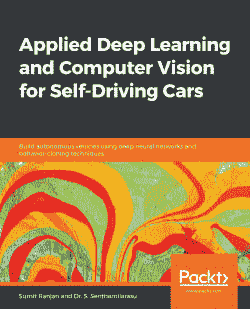

# 你可能喜欢的其他书籍

如果您喜欢这本书，您可能会对 Packt 的其他书籍感兴趣:

**深度学习的动手数学**

杰伊·达瓦尼

国际标准书号:978-1-83864-729-2

*   理解构建神经网络模型的关键数学概念
*   发现核心多变量微积分概念
*   使用优化技术提高深度学习模型的性能
*   覆盖优化算法，从基本的随机梯度下降(SGD)到高级的 Adam 优化器
*   理解计算图及其在 DL 中的重要性

**为自动驾驶汽车应用深度学习和计算机视觉**

森塔米拉苏博士苏米特·兰詹

国际标准书号:978-1-83864-630-1

*   使用 Keras 库从头开始实现深度神经网络
*   理解深度学习在自动驾驶汽车中的重要性
*   使用 OpenCV 库掌握图像处理中的特征提取技术
*   设计一个检测视频中车道线的软件管道
*   为交通信号标志实现卷积神经网络(CNN)图像分类器
*   通过在虚拟模拟器中驾驶汽车来训练和测试用于行为克隆的神经网络
*   发现各种最先进的语义分割和对象检测架构

# 留下评论——让其他读者知道你的想法

请在你购买这本书的网站上留下评论，与他人分享你对这本书的想法。如果你从亚马逊购买了这本书，请在这本书的亚马逊页面给我们留下一个诚实的评论。这一点至关重要，这样其他潜在读者就可以看到并使用您的公正意见来做出购买决定，我们可以了解我们的客户对我们产品的看法，我们的作者也可以看到您对他们与 Packt 合作创作的书名的反馈。这只需要您几分钟的时间，但对其他潜在客户、我们的作者和 Packt 来说是有价值的。谢谢大家！