<title>Chapter_3_SMP_ePub</title>

# 3。神经网络

上一章我们学习了感知机，有好消息也有坏消息。好消息是，感知器很可能代表复杂的功能。例如，感知器可以(理论上)表示由计算机执行的复杂过程，如前一章所述。坏消息是，为了满足预期的输入和输出，在确定适当的权重之前，必须首先手动定义权重。在前一章中，我们使用了带有 AND 和 OR 门的真值表来手动确定适当的权重。

神经网络的存在是为了解决坏消息。更具体地说，神经网络的一个重要特性是它可以从数据中自动学习适当的权重参数。这一章提供了神经网络的概述，并重点介绍了它们的区别。下一章将描述它如何从数据中学习权重参数。

## 从感知机到神经网络

神经网络在许多方面与前一章描述的感知器相似。神经网络如何工作，以及它如何不同于感知器，将在这一节中描述。

### 神经网络示例

*图 3.1* 显示了一个神经网络示例。这里，左列称为**输入层**，右列称为**输出层**，中间列称为**中间层**。中间层也称为隐藏层。“隐藏”是指隐藏层中的神经元是不可见的(不像输入和输出层中的神经元)。在本书中，我们将从输入层到输出层将这些层称为第 0 层、第 1 层和第 2 层(层编号从第 0 层开始，因为当这些层稍后在 Python 中实现时这样做很方便)。在*图 3.1* 中，0 层是输入层，1 层是中间层，2 层是输出层:


###### 图 3.1:神经网络示例

#### 注意

虽然*图 3.1* 中的网络由三层组成，但我们称之为“两层网络”，因为它有两层带权。有些书根据构成网络的层数将其称为“三层网络”，但在本书中，网络名称是根据具有权重的层数(即输入层、隐藏层和输出层的总数减 1)。

*图 3.1* 中的神经网络在形状上与上一章的感知器相似。其实就神经元如何连接而言，和我们上一章看到的感知器没什么区别。那么，信号是如何在神经网络中传递的呢？

### 回顾感知器

要回答这个问题，我们首先需要回顾一下感知器。考虑一个具有以下结构的网络:


###### 图 3.2:检查感知器

*图 3.2* 显示了接收两个输入信号(x1 和 x2)并输出 y 的感知器。如前所述，*图 3.2* 中的感知器由等式(3.1)表示:

|  | (3.1) |

这里，b 是一个称为“偏差”的参数，它控制着神经元放电的难易程度。同时，w1 和 w2 是指示各个信号的“权重”以控制其重要性的参数。

你可能注意到了*图 3.2* 中的网络是没有偏置的，b .我们可以指明*图 3.3* 中所示的偏置，如果我们愿意的话。在*图 3.3* 中增加了重量 b 和输入 1 的信号。这个感知器接收三个信号(x1、x2 和 1)作为神经元的输入，并在将信号传输到下一个神经元之前，将信号乘以每个权重。下一个神经元对加权信号求和，如果和超过 0，则输出 1。如果没有，它输出 0。下图中的神经元以纯灰色显示，以区别于其他神经元。这是因为偏置的输入信号总是 1:


###### 图 3.3:明确显示偏差

现在，我们想简化方程(3.1)。为此，我们使用单个函数来表示条件，其中如果总和超过 0，则`1`是输出，如果总和不超过 0，则 0 是输出。这里，我们将引入一个新函数， *h* ( *x* )，并将方程式(3.1)改写为方程式(3.2)和(3.3)，如下所示:

|  | (3.2) |
| T44 | (3.3) |

等式(3.2)表示 *h* ( *x* )函数将输入信号之和转换为输出 y。等式(3.3)表示的 *h* ( *x* )函数如果输入超过 0 则返回 1，否则返回 0。因此，等式(3.2)和(3.3)的运算方式与等式(3.1)相同。

### 引入激活功能

这里出现的 *h* ( *x* )函数一般称为**激活函数**。它将输入信号的总和转换成输出信号。顾名思义，激活函数决定了输入信号的和如何激活(即如何触发)。

现在，我们可以再次重写等式(3.2)。等式(3.2)执行两个过程:加权的输入信号被求和，并且该和被激活函数转换。因此，可以将方程(3.2)分成以下两个方程:

| 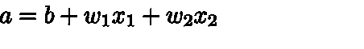 | (3.4) |
|  | (3.5) |

在等式(3.4)中，加权输入信号和偏置之和成为 a，在等式(3.5)中，a 由 *h()* 转换，输出 *y* 。

到目前为止，一个神经元显示为一个圆圈。图 3.4 明确显示了方程式(3.4)和(3.5):


###### 图 3.4:显示了激活函数执行的过程

*图 3.4* 明确显示了神经元循环中激活功能所执行的过程。我们可以清楚地看到，加权信号之和成为节点 *a* ，并通过激活函数 *h* ()转换为节点 *y* 。在本书中，术语“神经元”和“结”可以互换使用。在这里，圆 *a* 和 *y* 被称为“节点”，其用法与之前使用的“神经元”相同。

我们将继续把一个神经元显示为一个圆圈，如*图 3.5* 左侧所示。在本书中，我们还将展示激活过程(在*图 3.5* 的右边)，如果神经网络的行为可以被阐明的话:


###### 图 3.5:左边的图像是显示一个神经元的普通图像，而右边的图像明确地显示了一个神经元中激活的过程(a 是输入信号的总和，h()是激活函数，y 是输出)

现在，让我们关注激活函数，它是从感知器到神经网络的桥梁。

#### 注意

在本书中，“感知器”这个词所表示的算法并没有严格定义。通常，“简单感知器”是单层网络，其中在阈值处改变输出值的阶跃函数被用作激活函数。“多层感知器”通常是指包含多层并使用平滑激活函数(如 sigmoid 函数)的神经网络。

## 激活功能

由等式(3.3)表示的激活函数在阈值处改变输出值，并且被称为“阶梯函数”或“阶梯函数”因此，我们可以说，“一个感知器使用一个阶跃函数作为激活函数。”换句话说，感知器从许多候选函数中选择一个“阶跃函数”作为激活函数。当感知器使用阶跃函数作为激活函数时，如果使用阶跃函数以外的函数作为激活函数会发生什么？嗯，通过将激活函数从阶跃函数改为另一个函数，我们可以进入神经网络的世界。下一节将介绍神经网络的激活函数。

### 乙状结肠功能

神经网络中常用的激活函数之一是 **sigmoid 函数**，由等式(3.6)表示:

| T52 | (3.6) |

方程式(3.6)中的 exp(- *x* )表示 *e* -x，实数 *e* 是纳皮尔数，2.7182...等式(3.6)表示的 sigmoid 函数看似复杂，但它只是一个“函数”函数是在提供输入时返回输出的转换器。例如，当向 sigmoid 函数提供 1.0 和 2.0 等值时，将返回 *h* (1.0) = 0.731…和 *h* (2.0) = 0.880…等值。

在神经网络中，通常使用 sigmoid 函数作为激活函数来转换信号，并将转换后的信号传递给下一个神经元。事实上，上一章描述的感知器和这里描述的神经网络的主要区别在于激活函数。其他方面，比如神经元多层连接的结构，信号是如何传递的，基本上和感知机一样。现在，让我们通过将 sigmoid 函数(用作激活函数)与阶跃函数进行比较来更仔细地观察它。

### 实现步进功能

这里，我们将使用 Python 来展示一个阶跃函数的图形。如等式(3.3)所示，当输入超过 0 时，阶跃函数输出 1，否则输出 0。下面显示了 step 函数的一个简单实现:

```
    def step_function(x):
        if x > 0:
            return 1
        else:
            return 0
```

这个实现简单易懂，但是它只接受一个实数(浮点数)作为参数`x`。因此，`step_function(3.0)`是允许的。但是，该函数不能将 NumPy 数组作为参数。由此可见，`step_function(np.array([1.0, 2.0]))`是不允许的。在这里，我们希望更改未来的实现，以便它可以接受 NumPy 数组。为此，我们可以编写如下实现:

```
    def step_function(x):
        y = x > 0
        return y.astype(np.int)
```

虽然前面的函数只包含两行，但理解起来可能有点困难，因为它使用了 NumPy 的一个有用的“技巧”。在这里，来自 Python 解释器的以下示例用于描述使用了哪种技巧。在这个例子中，提供了 NumPy `x`数组。对于 NumPy 数组，执行比较运算符:

```
>>> import numpy as np
>>> x = np.array([-1.0, 1.0, 2.0])
>>> x
array([-1., 1., 2.])
>>> y = x > 0
>>> y
array([False, True, True], dtype=bool)
```

当对 NumPy 数组进行*大于*比较时，比较数组中的每个元素，生成一个布尔数组。这里，`x`数组中的每个元素在超过 0 时被转换成`True`，否则被转换成`False`。然后，生成新数组`y`。

`y`数组为布尔型，所需的阶跃函数必须返回`int`类型的`0`或`1`。因此，我们将数组`y`的元素类型从布尔值转换为`int`:

```
>>> y = y.astype(np.int)
>>> y
array([0, 1, 1])
```

如此处所示，`astype()`方法用于转换 NumPy 数组的类型。`astype()`方法将所需的类型(在本例中为`np.int`)作为参数。在 Python 中，`True`转换为`1`，通过将 Boolean 类型转换为 int 类型将`False`转换为`0`。前面的代码解释了 NumPy 在实现 step 函数时使用的“技巧”。

### 阶跃函数图

现在，让我们画出之前定义的阶跃函数的图形。为此，我们需要使用 Matplotlib 库:

```
import numpy as np
import matplotlib.pylab as plt
def step_function(x):
    return np.array(x > 0, dtype=np.int)
x = np.arange(-5.0, 5.0, 0.1)
y = step_function(x)
plt.plot(x, y)
plt.ylim(-0.1, 1.1) # Specify the range of the y-axis
plt.show()
```

`np.arange(-5.0, 5.0, 0.1)`生成一个 NumPy 数组，包含`-5.0`到`5.0`的值在`0.1`步骤中，`([-5.0, -4.9, …, 4.9]). step_function()`将 NumPy 数组作为自变量。它对数组中的每个元素执行 step 函数，并返回一个数组作为结果。绘制这些`x`和`y`数组时，显示图*图 3.6* 所示的图形:


###### 图 3.6:阶跃函数图

如图*图 3.6* 所示，阶跃函数的输出在阈值 0 处从 0 变为 1(或 1 变为 0)。阶跃函数有时被称为“阶梯函数”，因为输出代表阶梯的步数，如图*图 3.6* 所示。

### 实现一个 Sigmoid 函数

现在，让我们实现一个 sigmoid 函数。我们可以用 Python 编写等式(3.6)的 sigmoid 函数如下:

```
def sigmoid(x):
    return 1 / (1 + np.exp(-x))
```

这里，`np.exp(-x)`对应于等式中的`exp(−x)`。这个实现不是很难。即使 NumPy 数组作为`x`参数提供，也会返回正确的结果。当此 sigmoid 函数接收 NumPy 数组时，它会正确计算，如下所示:

```
>>> x = np.array([-1.0, 1.0, 2.0])
>>> sigmoid(x)
array([0.26894142,  0.73105858,  0.88079708])
```

由于 NumPy 的广播，sigmoid 函数的实现支持 NumPy 数组(详见*第一章*、*Python 简介*中的*广播*部分)。当对标量和 NumPy 数组执行操作时，由于广播，操作在标量和 NumPy 数组的每个元素之间执行。

```
>>> t = np.array([1.0, 2.0, 3.0])
>>> 1.0 + t
array([2., 3., 4.])
>>> 1.0 / t
array([1\.  ,  0.5  ,   0.33333333])
```

在前面的例子中，在标量值(这里是 1.0)和 NumPy 数组之间执行算术运算(比如`+`和`/`)。因此，标量值和 NumPy 数组的每个元素都用于运算，结果作为 NumPy 数组输出。在 sigmoid 函数的这个实现中，因为`np.exp(-x)`生成一个 NumPy 数组，`1 / (1 + np.exp(-x))`也使用 NumPy 数组的每个元素进行运算。

现在，让我们画出 sigmoid 函数的图形。绘图的代码与 step 函数的代码几乎相同。唯一不同的是输出`y`的函数改为 sigmoid 函数:

```
x = np.arange(-5.0, 5.0, 0.1)
y = sigmoid(x)
plt.plot(x, y)
plt.ylim(-0.1, 1.1) # Specify the range of the y-axis
plt.show()
```

执行上述代码时，会创建如图 3.7 所示的图表:


###### 图 3.7:sigmoid 函数的图形

### 比较 Sigmoid 函数和阶跃函数

我们来比较一下 sigmoid 函数和 step 函数。*图 3.8* 显示了 s 形函数和阶跃函数。这两种功能在哪些方面有所不同？他们在哪些方面相似？我们可以考虑*图 3.8* 并思考一下这个问题。

当您查看*图 3.8* 时，您可能会注意到平滑度的差异。sigmoid 函数是一条平滑曲线，其中输出基于输入连续变化。另一方面，阶跃函数的输出在`0`处突然改变。sigmoid 函数的这种光滑性在训练神经网络时具有重要意义:


###### 图 3.8:阶跃函数和 sigmoid 函数(虚线显示阶跃函数)

就前面提到的平滑度而言，它们是不同的，因为 step 函数只返回 0 或 1，而 sigmoid 函数返回实数，如 0.731...和 0.880...也就是说，0 和 1 的二进制信号在感知器的神经元之间流动，而连续实数的信号在神经网络中流动。

当我们用“水”来描述这两个函数的行为时，step 函数可以比作“shishi-odoshi”(水从管子中流出后，竹筒在石头上发出噼啪声)，而 sigmoid 函数可以比作“水车”。step 函数执行两个操作:它排出或储存水(0 或 1)，而 sigmoid 函数根据到达它的水量像“水车”一样控制水的流动。

现在，考虑阶跃函数和 sigmoid 函数的相似之处。它们在“平滑度”上有所不同，但是当你从更广阔的视角看*图 3.8* 时，你可能会注意到它们在形状上是相似的。实际上，当输入很小时，两者都输出接近/0 的值，随着输入变大，输出接近/达到 1。当输入信号包含重要信息时，阶跃函数和 sigmoid 函数输出大值，当不包含重要信息时，输出小值。它们的相似之处还在于，无论输入信号的值有多大，它们都输出 0 到 1 之间的值。

### 非线性函数

阶跃函数和 sigmoid 函数在另一方面是相似的。一个重要的相似之处是，它们都是非线性函数。sigmoid 函数用曲线表示，而 step 函数用看起来像楼梯的直线表示。它们都被归类为非线性函数。

#### 注意

当使用激活函数时，术语“非线性函数”和“线性函数”经常出现。函数是一个“转换器”，当提供一个值时，它返回一个值。输出输入值乘以常数的函数称为线性函数(用方程*h*(*x*)=*CX*，其中 *c* 为常数)。因此，线性函数的图形是一条直线。同时，顾名思义，非线性函数的图形不是一条简单的直线。

在神经网络中，必须使用非线性函数作为激活函数。换句话说，线性函数不能用作激活函数。为什么不能使用线性函数？原因是，如果使用线性函数，增加神经网络的层数将变得毫无用处。

线性函数的问题是由这样一个事实引起的，即无论增加多少层，执行相同任务的“没有隐藏层的网络”总是存在的。为了更具体地(也更直观地)理解这一点，让我们考虑一个简单的例子。这里，线性函数 *h* ( *x* ) = *cx* )被用作激活函数，并且*y*(*x*)=*h*(*h*(*h*(*x*))的计算如在三层网络中一样被执行。它包含 y(x) = c×c×c×x 的乘法运算，同样的运算可以用*y*(*x*)=*ax*(其中 *a* = *c* 3)的一次乘法来表示。因此，它可以用没有隐藏层的网络来表示。如本例所示，使用线性函数抵消了多层的优势。因此，为了利用多层，必须使用非线性函数作为激活函数。

### ReLU 功能

到目前为止，我们已经了解了作为激活函数的阶跃函数和 sigmoid 函数。虽然 sigmoid 函数在神经网络的历史上已经使用了很长时间，但目前主要使用一种称为**整流线性单元** ( **ReLU** )的函数。

如果输入超过 0，ReLU 函数将原样输出输入。如果输入等于或小于 0，则输出 0(参见*图 3.9* ):


###### 图 3.9: ReLU 函数

等式(3.7)表示 ReLU 函数:

|  | (3.7) |

如图和等式所示，ReLU 函数非常简单。因此，我们也可以轻松地实现它，如下所示:

```
def relu(x):
    return np.maximum(0, x)
```

这里使用了 NumPy 的最大值函数。它输出较大的输入值。

虽然 sigmoid 函数将在本章后面用作激活函数，但 ReLU 函数主要在本书的后半部分使用。

## 计算多维数组

如果您学习如何使用 NumPy 计算多维数组，您将能够高效地实现神经网络。首先，我们将看看如何使用 NumPy 来计算多维数组。然后，我们将实现一个神经网络。

### 多维数组

简单来说，多维数组就是排列成一行、一个矩形、三维或者(更一般的)N 维的“一组数”，称为多维数组。让我们使用 NumPy 创建一个多维数组。首先，我们将创建一个一维数组，如上所述:

```
>>> import numpy as np
>>> A = np.array([1, 2, 3, 4])
>>> print(A)
[1 2 3 4]
>>> np.ndim(A)
1
>>> A.shape
(4,)
>>> A.shape[0]
4
```

如此处所示，您可以使用`np.ndim()`函数来获取数组的维数。您还可以使用实例变量`shape`来获得数组的形状。前面的例子显示了`A`是一个由四个元素组成的一维数组。请注意，`A.shape`的结果是一个元组。这是因为一维数组和多维数组的结果以相同的格式返回。例如，二维数组返回(4，3)元组，三维数组返回(4，3，2)元组。因此，对于一维数组，也会返回一个元组。现在，让我们创建一个二维数组:

```
>>> B = np.array([[1,2], [3,4], [5,6]])
>>> print(B)
[[1 2]
[3 4]
[5 6]]
>>> np.ndim(B)
2
>>> B.shape
(3, 2)
```

这里创建了一个 3x2 的数组 B。一个 3x2 的数组意味着它在第一维有三个元素，在下一维有两个元素。第一个维度是维度 0，下一个维度是维度 Python 中一个索引从 0 开始)。二维数组称为矩阵。如图*图 3.10* 所示，一个数组中的水平序列称为**行**，垂直序列称为**列**:


###### 图 3.10:水平序列称为“行”，垂直序列称为“列”

### 矩阵乘法

现在，考虑矩阵的乘积(二维数组)。对于 2x2 矩阵，矩阵乘法的计算如*图 3.11* 所示(定义为本程序中的计算):


###### 图 3.11:计算矩阵乘法

如该示例所示，矩阵乘法是通过将左矩阵的(水平)行和右矩阵的(垂直)列之间的元素相乘并将结果相加来计算的。计算结果存储为一个新的多维数组的元素。例如，A 的第一行和 B 的第一列之间的结果成为第一行中的第一个元素，而 A 的第二行和 B 的第一列之间的结果成为第二行中的第一个元素。在本书中，方程中的矩阵用粗体显示。例如，矩阵显示为`A`以区别于具有一个元素的标量值(例如，a 或 b)。该计算在 Python 中实现如下:

```
>>> A = np.array([[1,2], [3,4]])
>>> A.shape
(2, 2)
>>> B = np.array([[5,6], [7,8]])
>>> B.shape
(2, 2)
>>> np.dot(A, B)
array([[19, 22],
    [43, 50]])
```

a 和 B 是 2x2 矩阵。NumPy 的`np.dot()`函数用于计算矩阵 A 和 B 的乘积(这里的“点”表示点积)。`np.dot (dot product)`计算一维数组的向量内积和二维数组的矩阵乘法。你应该注意到`np.dot(A, B)`和`np.dot(B, A)`可以返回不同的值。与正则运算(+、*等)不同，当操作数(A 和 B)的顺序不同时，矩阵的乘积也变得不同。

前面的示例显示了 2x2 矩阵的乘积。你也可以计算不同形状的矩阵的乘积。例如，2×3 和 3×2 矩阵的乘积可以用 Python 实现，如下所示:

```
>>> A = np.array([[1,2,3], [4,5,6]])
>>> A.shape
(2, 3)
>>> B = np.array([[1,2], [3,4], [5,6]])
>>> B.shape
(3, 2)
>>> np.dot(A, B)
array([[22, 28],
    [49, 64]])
```

前面的代码显示了如何实现 2×3 矩阵 A 和 3×2 矩阵 B 的乘积。在这里，你必须小心“矩阵的形状”具体来说，矩阵 A 的维度 1 中的元素数(列数)必须与矩阵 B 的维度 0 中的元素数(行数)相同。实际上，在前面的示例中，矩阵 A 是 2×3，矩阵 B 是 3×2。矩阵 A (3)的维度 1 中的元素数量与矩阵 B (3)的维度 0 中的元素数量相同。如果它们不同，就不能计算矩阵的乘积。因此，如果您尝试在 Python 中计算 2×3 矩阵 A 和 2×2 矩阵 C 的乘积，就会出现以下错误:

```
>>> C = np.array([[1,2],  [3,4]])
>>> C.shape
(2, 2)
>>> A.shape
(2, 3)
>>> np.dot(A, C)
```

回溯(最近一次呼叫):

```
    File "<stdin>", line 1, in <module>
ValueError: shapes (2,3) and (2,2) not aligned: 3 (dim 1) != 2 (dim 0)
```

这个错误说的是矩阵 A 的维度 1 和矩阵 C 的维度 0 在元素个数上是不一样的(一个维度的索引从零开始)。换句话说，要计算多维数组的乘积，两个矩阵对应维中的元素个数必须相同。因为这是很重要的一点，所以让我们在*图 3.12* 中再检查一遍:


###### 图 3.12:矩阵乘法中相应维度的元素数量必须相同

*图 3.12* 给出了一个 3x2 矩阵 A 和 2x4 矩阵 B 的乘积的例子，得到了 3x4 矩阵 c，我们可以看到，矩阵 A 和 B 的对应维数中的元素个数必须相同。得到的矩阵 C 由与矩阵 A 一样多的行和与矩阵 b 一样多的列组成，这也很重要。

即使当 A 是一个二维矩阵，B 是一个一维数组时，同样的原理(对应维中的元素个数必须相同)也适用，如图*图 3.13* 所示:


###### 图 3.13:对应维度中的元素数量必须相同，即使 A 是二维矩阵，B 是一维数组

*图 3.13* 中的示例可以用 Python 实现如下:

```
>>> A = np.array([[1,2], [3, 4], [5,6]])
>>> A.shape
(3, 2)
>>> B = np.array([7,8])
>>> B.shape
(2,)
>>> np.dot(A,  B)
array([23, 53, 83])
```

### 神经网络中的矩阵乘法

现在，让我们使用 NumPy 矩阵来实现一个神经网络，如图*图 3.14* 所示。我们假设神经网络只有权值。已经省略了偏置和激活功能。


###### 图 3.14:使用矩阵乘法计算神经网络

在这个实现中，我们必须小心`X`、`W`和`Y`的形状。重要的是`X`和`W`的相应尺寸中的元件数量相同:

```
>>> X = np.array([1, 2])
>>> X.shape
(2,)
>>> W = np.array([[1, 3, 5], [2, 4, 6]])
>>> print(W)
[[1 3 5]
[2 4 6]]
>>> W.shape
(2, 3)
>>> Y = np.dot(X, W)
>>> print(Y)
[ 5  11  17]
```

如此处所示，您可以使用`np.dot`(多维矩阵的点积)一次性计算结果`Y`。这意味着，即使`Y`的元素个数是 100 个或者 1000 个，也可以一次性全部计算出来。没有`np.dot`，就必须把`Y`的每个元素都拿出来(并且用一个`for`语句)进行计算，很累人。因此，我们可以说，利用矩阵乘法计算多维矩阵乘积的技巧是非常重要的。

## 实现三层神经网络

现在，让我们实现一个“实用的”神经网络。这里我们将在*图 3.15* 所示的三层神经网络中实现从其输入到其输出的过程(一个正向的过程)。我们将使用 NumPy 的多维数组(如前一节所述)来实现。通过充分利用 NumPy 数组，您可以为神经网络中的正向过程编写一些简短的代码。

### 检查符号

这里，我们将使用诸如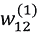和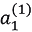的符号来解释神经网络中执行的过程。它们可能看起来有点复杂。您可以浏览这一部分，因为这些符号只在这里使用:


###### 图 3.15:一个三层神经网络，由输入层(第 0 层)的两个神经元、第一隐层(第 1 层)的三个神经元、第二隐层(第 2 层)的两个神经元和输出层(第 3 层)的两个神经元组成

#### 注意

在本节中重要的是，计算神经网络可以作为矩阵计算来共同进行。计算神经网络中的每一层可以使用矩阵乘法集体进行(这可以从更大的角度来考虑)。所以，即使你忘记了与这些符号相关的详细规则，理解随后的解释也没有问题。

让我们从定义符号开始。看*图 3.16* 。该图说明了从输入层 x2 到下一层中的神经元*a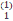的权重。*

如图*图 3.16* 所示，“(1)”放在一个权值或隐含层神经元的右上方。这个数字表示第 1 层的权重或神经元。一个权重右下角有两个数字，分别是上下一层神经元的索引号。例如， *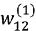* 表示它是从上一层第二个神经元( *x* 2)到下一层第一个神经元( *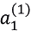* )的权重。权重右下角的索引号必须按照“下一层的编号和上一层的编号”的顺序排列:


###### 图 3.16:重量符号

### 在各层实现信号传输

现在，让我们来看看将信号从输入层传输到“第一层的第一个神经元”*图 3.17* 以图形方式显示了这一点:


###### 图 3.17:将信号从输入层传输到第 1 层

如图*图 3.17* 所示，①被添加为一个偏向神经元。请注意，在偏差的右下方只有一个指数。这是因为前一层只存在一个偏置神经元(①神经元)。现在，让我们把 *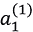* 表示成一个方程，来复习一下到目前为止我们所学的内容。 *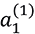* 是加权信号和偏差之和，计算如下:

| T33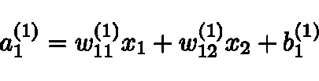 | (3.8) |

通过使用矩阵乘法，您可以将第 1 层的“加权和”统一表示如下:

| T38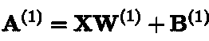T40 | (3.9) |

这里，A(1)、X、B(1)和 W(1)如下:

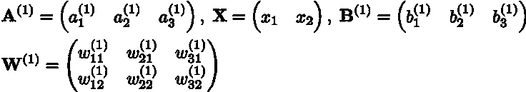

现在，让我们使用 NumPy 的多维数组来实现等式(3.9)。在此为输入信号、权重和偏差设置任意值:

```
X = np.array([1.0, 0.5])
W1 = np.array([[0.1, 0.3, 0.5], [0.2, 0.4, 0.6]])
B1 = np.array([0.1, 0.2, 0.3])
print(W1.shape) # (2, 3)
print(X.shape)  # (2,)
print(B1.shape) # (3,)
A1 = np.dot(X, W1) + B1
```

该计算与上一节中的计算相同。W1 是一个 2×3 的数组，X 是一个包含两个元素的一维数组。此外，在这种情况下，W1 和 X 的对应维度中的元素数量相同。

现在，考虑由第 1 层中的激活功能执行的过程。*图 3.18* 以图形方式显示了这些过程。

如图*图 3.18* 所示，一个隐层中的加权和(加权信号和偏差的总和)表示为*a’*s，用激活函数转换后的信号表示为*z*s，这里激活函数表示为 *h* ()使用一个 sigmoid 函数:


###### 图 3.18:将信号从输入层传输到第 1 层

这个过程在 Python 中实现如下:

```
Z1 = sigmoid(A1)
print(A1) # [0.3, 0.7, 1.1]
print(Z1) # [0.57444252, 0.66818777, 0.75026011]
```

这个`sigmoid()`函数是我们之前定义的函数。它接受一个 NumPy 数组，并返回一个包含相同数量元素的 NumPy 数组。

现在让我们继续从第 1 层到第 2 层的实现(*图 3.19* ):


###### 图 3.19:将信号从第 1 层传输到第 2 层

除了第 1 层(Z1)的输出是第 2 层的输入之外，该实现与前一实现相同。如您所见，您可以使用 NumPy 数组轻松编写信号从一层到另一层的传输:

```
W2 = np.array([[0.1, 0.4], [0.2, 0.5], [0.3, 0.6]])
B2 = np.array([0.1, 0.2])
print(Z1.shape) # (3,)
print(W2.shape) # (3, 2)
print(B2.shape) # (2,)
A2 = np.dot(Z1, W2) + B2
Z2 = sigmoid(A2)
```

最后，我们来实现信号从第二层到输出层的传输(*图 3.20* )。您可以用与我们到目前为止看到的其他实现几乎相同的方式来实现输出层。只有最后一个激活函数不同于我们到目前为止看到的隐藏层的激活函数:

```
def identity_function(x): 
    return x
W3 = np.array([[0.1, 0.3], [0.2, 0.4]])
B3 = np.array([0.1, 0.2])
A3 = np.dot(Z2, W3) + B3
Y = identity_function(A3) # or Y = A3
```

这里，我们将定义一个名为`identity_function()`的函数，并将其用作输出层的激活函数。恒等函数按原样输出输入。尽管在这个例子中您不需要定义`identity_function()`，但是使用这个实现是为了与前面的实现保持一致。在*图 3.20* 中，输出层的激活函数显示为`σ()`，以表示它不同于隐藏层的激活函数*h*()(`σ`称为**∑**):


###### 图 3.20:将信号从第 2 层传输到输出层

您可以选择输出层中使用的激活函数，这取决于您希望解决的问题类型。通常，一个恒等式函数用于回归问题，一个 sigmoid 函数用于两类分类问题，一个 softmax 函数用于多类分类问题。下一节将详细解释输出层的激活功能。

### 实施总结

这就完成了我们对三层神经网络的研究。下面总结了到目前为止我们已经执行的实现。按照神经网络实现中的惯例，只有权重以大写形式书写(例如 W1)，而其他项(例如偏差和中间结果)以小写形式书写:

```
def init_network(): 
    network = {}
    network['W1'] = np.array([[0.1,  0.3,  0.5],  [0.2,  0.4,  0.6]])
    network['b1'] = np.array([0.1,  0.2,  0.3])
    network['W2'] = np.array([[0.1,  0.4],  [0.2,  0.5],  [0.3,  0.6]])
    network['b2'] = np.array([0.1,  0.2])
    network['W3'] = np.array([[0.1,  0.3],  [0.2,  0.4]]) 
    network['b3'] = np.array([0.1,  0.2])
    return network
def forward(network, x):
    W1, W2, W3 = network['W1'], network['W2'], network['W3']
    b1, b2, b3 = network['b1'], network['b2'], network['b3']
    a1 = np.dot(x, W1) + b1
    z1 = sigmoid(a1)
    a2 = np.dot(z1, W2)  +  b2 
    z2 = sigmoid(a2)
    a3 = np.dot(z2,  W3)  +  b3
    y = identity_function(a3)
    return y
network = init_network() 
x =  np.array([1.0,  0.5]) 
y = forward(network, x)
print(y) # [ 0.31682708 0.69627909]
```

这里定义了`init_network()`和`forward()`功能。`init_network()`函数初始化权重和偏差，并将其存储在一个字典类型变量`network`中，该变量存储各个层、权重和偏差所需的参数。`forward()`功能共同实现将输入信号转换为输出信号的过程。

这里的“转发”一词表示从输入到输出的传输过程。稍后，当我们训练一个神经网络时，我们将从向后的方向(从输出到输入)来看这个过程。

这就完成了正向三层神经网络的实现。通过使用 NumPy 的多维数组，我们能够高效地实现神经网络。

## 设计输出层

您可以将神经网络用于分类问题和回归问题。但是，您必须更改输出层的激活函数，这取决于您使用神经网络解决的问题。通常，身份函数用于回归问题，而 softmax 函数用于分类问题。

#### 注意

机器学习问题可以大致分为“分类问题”和“回归问题”。分类问题是识别数据属于哪一类的问题，例如，将图像中的人分类为男人或女人，而回归问题是从某些输入数据预测(连续)数的问题，例如，预测图像中的人的体重。

## 身份函数和 Softmax 函数

恒等函数按原样输出输入。不做任何事情就输出输入内容的函数是恒等函数。因此，当对输出层使用恒等函数时，输入信号将按原样返回。使用我们到目前为止使用的神经网络图，您可以通过一个标识函数来表示该过程，如图*图 3.21* 所示。通过身份函数的转换过程可以用一个箭头来表示，以与我们到目前为止看到的激活函数相同的方式:


###### 图 3.21:身份功能

用于分类问题的 softmax 函数由以下等式表示:

|  | (3.10) |

`exp(x)`是表示 ex 的指数函数(e 是纳皮尔常数，2.7182…)。假设输出层的总数为 n，等式提供第 k 个输出 yk。如式(3.10)所示，softmax 函数的分子是输入信号的指数函数， *a* k，分母是所有输入信号的指数函数之和。

*图 3.22* 以图形方式显示了 softmax 功能。如您所见，softmax 函数的输出通过箭头与所有输入信号相连。如等式(3.10)的分母所示，输出的每个神经元受所有输入信号的影响:


###### 图 3.22: Softmax 函数

现在，让我们实现 softmax 函数，使用 Python 解释器逐个检查结果:

```
>>> a = np.array([0.3, 2.9, 4.0])
>>>
>>> exp_a = np.exp(a) # Exponential function
>>> print(exp_a)
[ 1.34985881 18.17414537 54.59815003]
>>>
>>> sum_exp_a = np.sum(exp_a) # Sum of exponential functions
>>> print(sum_exp_a)
74.1221542102
>>>
>>> y = exp_a / sum_exp_a
>>> print(y)
[ 0.01821127 0.24519181 0.73659691]
```

该实现用 Python 表示等式(3.10)的 softmax 函数。因此，不需要特别的描述。当稍后考虑使用 softmax 函数时，我们将把它定义为 Python 函数，如下所示:

```
def softmax(a):
    exp_a = np.exp(a) 
    sum_exp_a = np.sum(exp_a)
    y = exp_a / sum_exp_a
    return y
```

### 执行 Softmax 功能时的问题

softmax 函数的上述实现正确地表示了等式(3.10)，但是它对于计算机计算是有缺陷的。这个缺陷是一个溢出问题。实现 softmax 函数需要计算指数函数，而指数函数的值可能非常大。例如， *e* 10 大于 20，000， *e* 100 是超过 40 位的大值。 *e* 1000 的结果返回`inf`，表示一个无穷大的值。将这些大值相除会返回一个“不稳定”的结果。

#### 注意

当计算机处理一个“数”时，它是以有限的数据宽度存储的，比如四个或八个字节。这意味着一个数有许多有效数字。可以表示的数的范围是有限的。因此，存在不能表达非常大的值的问题。这就是所谓的溢出，所以我们在使用计算机进行计算时一定要小心。

softmax 函数的改进实现可通过下式获得:

| 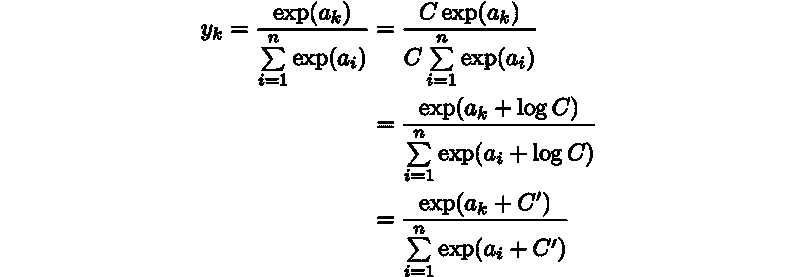 | (3.11) |

首先，通过将分子和分母都乘以任意常数 *C* 来变换等式(3.11)(因为分子和分母都乘以相同的常数，所以执行相同的计算)。然后，将 C 移入指数函数(exp)作为 log *C* 。最后，log *C* 被替换为另一个符号*C’*。

等式(3.11)表示，当计算 softmax 函数中的指数函数时，增加或减去某个常数不会改变结果。虽然在这里可以使用任何数字作为*C’*，但输入信号的最大值通常用于防止溢出。考虑下面的例子:

```
>>> a = np.array([1010, 1000, 990])
>>> np.exp(a) / np.sum(np.exp(a)) # Calculating the softmax function
array([  nan,   nan,   nan]) # Not calculated correctly
>>>
>>> c = np.max(a) # 1010
>>> a - c
array([ 0, -10, -20])
>>>
>>> np.exp(a - c) / np.sum(np.exp(a - c))
array([   9.99954600e-01,	4.53978686e-05,	2.06106005e-09])
```

如该示例所示，当减去输入信号的最大值( *c* ，此处)时，可以正确计算该函数。否则，返回 nan(不是数字:不稳定)值。基于此描述，我们可以如下实现 softmax 函数:

```
def softmax(a):
    c = np.max(a)
    exp_a = np.exp(a - c) # Prevent an overflow
    sum_exp_a = np.sum(exp_a)
    y = exp_a / sum_exp_a 
    return y
```

### soft max 功能的特征

您可以使用`softmax()`函数来计算神经网络的输出，如下所示:

```
>>> a = np.array([0.3, 2.9, 4.0])
>>> y = softmax(a)
>>> print(y)
[ 0.01821127 0.24519181 0.73659691]
>>> np.sum(y)
1.0
```

softmax 函数输出一个介于 0 和 1.0 之间的实数。softmax 函数的总输出为 1。总和为 1 的事实是 softmax 函数的一个重要特征，因为这意味着我们可以将 softmax 函数的输出解释为“概率”

例如，在前面的例子中，我们可以将`y[0]`的概率解释为`0.018` (1.8%)，将`y[1]`的概率解释为`0.245` (24.5%)，将`y[2]`的概率解释为`0.737` (73.7%)。从这些概率，我们可以说，“因为第二个元素是最有可能的，所以答案是第二类。”我们甚至可以用概率来回答:“答案是第二类概率为 74%，第一类概率为 25%，第零类概率为 1%。”因此，您可以使用 softmax 函数从概率上(统计上)处理问题。

我们应该注意，应用 softmax 函数不会改变元素的顺序。这是因为指数函数 *(y = exp(x))* 单调增加。实际上，在前面的例子中，`a`中元素的顺序与`y`中元素的顺序相同。`a`中的最大值是二次元，`y`中的最大值也是二次元。

通常，由神经网络进行的类别分类仅识别对应于具有最大输出的神经元的类别。使用 softmax 功能不会改变最大输出神经元的位置。因此，您可以从神经网络分类中省略输出图层的 softmax 函数。实际上，输出图层的 softmax 函数通常被省略，因为指数函数需要一些计算。

#### 注意

解决机器学习问题的过程包括两个阶段:“训练”和“预测”首先，在训练阶段训练一个模型，然后在推理阶段使用训练好的模型预测(分类)未知数据。如前所述，输出层的 softmax 函数通常在推断阶段被省略。我们对输出层使用 softmax 函数的原因将与神经网络训练相关(有关更多详细信息，请参考下一章)。

### 输出层中神经元的数量

您必须根据要解决的问题，适当地确定输出层中神经元的数量。对于分类问题，通常用要分类的类别数作为输出层的神经元数。例如，从一幅输入图像(10 级分类)预测一个从`0`到`9`的数，在输出层放置 10 个神经元，如图*图 3.23* 所示:


###### 图 3.23:输出层的神经元对应每个数字

如图*图 3.23* 所示，输出层的神经元对应数字 0，1，...，从上面数第 9 个。这里，各种灰色阴影代表输出层中神经元的值。在这个例子中， *y* 2 的颜色是最暗的，因为 *y* 2 神经元输出最大值。说明这个神经网络预测输入属于对应于 *y* 2 的类；也就是“2。”

## 手写数字识别

既然我们已经讨论了神经网络的机制，让我们考虑一个实际问题。我们将对一些手写数字图像进行分类。假设训练已经完成，我们将使用训练好的参数在神经网络中实现“推理”。这种推断也称为神经网络中的前向传播。

#### 注意

与解决机器学习问题的过程(包括两个阶段，“训练”和“推理”)相同，为了使用神经网络解决问题，我们将使用训练数据来训练权重参数，然后在预测的同时使用训练的参数来对输入数据进行分类。

### MNIST 数据集

这里，我们将使用一组称为 MNIST 的手写数字图像。MNIST 是机器学习领域最著名的数据集之一，从简单的实验到研究，它的用途非常广泛。当你阅读关于图像识别或机器学习的研究论文时，你会经常注意到 MNIST 数据集被用作实验数据。

MNIST 数据集由数字从 0 到 9 的图像组成(*图 3。24* )。它包含 60，000 幅训练图像和 10，000 幅测试图像，它们用于训练和推理。当我们使用 MNIST 数据集时，我们通常使用训练图像进行训练，并测量训练后的模型对测试图像进行分类的正确程度:


###### 图 3.24:来自 MNIST 影像数据集的示例

MNIST 的图像数据是 28x28 灰度图像(一个通道)，每个像素具有从 0 到 255 的值。每个图像数据都有标签，如“7”、“2”和“1”

这本书提供了一个方便的 Python 脚本`mnist.py`，它位于`dataset`目录下。它支持下载 MNIST 数据集并将影像数据转换为 NumPy 数组。要使用`mnist.py`脚本，当前目录必须是`ch01`、`ch02`、`ch03`、...，或`ch08`目录。通过使用`mnist.py`中的`load_mnist()`功能，您可以轻松加载 MNIST 数据，如下所示:

```
import sys, os
sys.path.append(os.pardir) # Configure to import the files in the parent directory
from dataset.mnist import load_mnist
# Waits for a few minutes for the first call ... 
(x_train, t_train), (x_test, t_test) = ∖
    load_mnist(flatten=True, normalize=False)
# Output the shape of each data
print(x_train.shape) # (60000, 784)
print(t_train.shape) # (60000,)
print(x_test.shape) # (10000, 784)
print(t_test.shape) # (10000,)
```

首先，配置在父目录中导入文件的详细信息。然后，从`dataset` / `mnist.py`中导入`load_mnist`函数。最后，使用导入的`load_mnist`函数加载 MNIST 数据集。当你第一次给`load_mnist`打电话时，需要互联网连接来下载 MNIST 的数据。后续调用会立即完成，因为它只加载本地保存的文件(pickle 文件)。

#### 注意

用于加载 MNIST 图像的文件存在于本书提供的源代码的数据集目录中。假设仅从`ch01`、`ch02`、`ch03`使用该 MNIST 数据集，...，或`ch08`目录。因此，要使用数据集，需要使用`sys.path.append(os.pardir)`语句。这是因为必须导入父目录(数据集目录)中的文件。

`load_mnist`函数以`(training image, training label), (test image, test label)`的格式返回加载的 MNIST 数据。它可以带三个参数:`load_mnist(normalize=True, flatten=True, one_hot_label=False)`。第一个参数`normalize`指定是否在 0.0 和 1.0 之间归一化输入图像。如果`False`被设置，输入图像的像素保持在 0 和 255 之间。第二个参数`flatten`指定是否展平输入图像(将其转换为一维数组)。如果`False`置位，输入图像存储为三维数组(1 × 28 × 28)。如果`True`被设置，它被存储为一个有 784 个元素的一维数组。第三个参数`one_hot_label`指定是否使用独热编码来存储标签。在独热编码数组中，只有正确标签的元素为 1，其他元素为 0，例如在[0，0，1，0，0，0，0，0，0，0]中。当`one_hot_label`为`False`时，只存储正确的标签，如 7 或 2。如果`one_hot_label`是`True`，标签被存储为一个独热编码数组。

#### 注意

Python 有一个方便的特性叫做 pickle，它可以在程序执行时将对象保存为文件。通过加载保存的 pickle 文件，您可以立即恢复程序执行期间使用的对象。加载 MNIST 数据集的`load_mnist()`函数也使用 pickle(用于第二或后续加载阶段)。通过使用 pickle 的功能，您可以快速准备 MNIST 数据。

现在，让我们显示 MNIST 图像来检查数据。我们将使用`ch03/mnist_show.py`):

```
import sys, os
sys.path.append(os.pardir)
import numpy as np
from dataset.mnist import load_mnist
from PIL import Image
def img_show(img):
    pil_img = Image.fromarray(np.uint8(img)) 
    pil_img.show()
(x_train, t_train), (x_test, t_test) = /
    load_mnist(flatten=True, normalize=False)
    img = x_train[0] 
    label = t_train[0] 
    print(label) # 5
    print(img.shape)	# (784,)
    img = img.reshape(28, 28) # Reshape the image based on the original size
    print(img.shape)	# (28, 28) 
    img_show(img)
```

这会产生以下输出:


###### 图 3.25:显示 MNIST 图像

请注意，当`flatten=True`时，加载的图像存储为一行中的 NumPy 数组(一维)。因此，要显示图像，您必须将其调整为原来的 28x28 大小。您可以使用`reshape()`方法，通过用一个参数指定所需的形状来改变 NumPy 数组的形状。您还必须将存储为 NumPy 数组的图像数据转换为 PIL 的数据对象。您可以使用`Image.fromarray()`进行此转换。

### 用于神经网络的推理

现在，让我们实现一个神经网络来预测这个 MNIST 数据集。该网络由包含 784 个神经元的输入层和包含 10 个神经元的输出层组成。输入图层的数字 784 来自图像大小(28 x 28 = 784)，而输出图层的数字 10 来自 10 级分类(数字 0 到 9 的 10 级)。有两个隐藏层:第一层有 50 个神经元，第二层有 100 个神经元。你可以随意改变数字 50 和 100。首先，让我们定义三个函数，`get_data()`、`init_network()`和`predict()`(下面的源代码位于`ch03/neuralnet_mnist.py`):

```
def get_data():
    (x_train, t_train), (x_test, t_test) = /
        load_mnist(normalize=True, flatten=True, one_hot_label=False)
    return x_test, t_test
def init_network():
    with open("sample_weight.pkl", 'rb') as f: 
        network = pickle.load(f)
    return network
def predict(network, x):
    W1, W2, W3 = network['W1'], network['W2'], network['W3']
    b1, b2, b3 = network['b1'], network['b2'], network['b3']
    a1 = np.dot(x, W1) + b1
    z1 = sigmoid(a1)
    a2 = np.dot(z1, W2) + b2
    z2 = sigmoid(a2)
    a3 = np.dot(z2, W3) + b3
    y = softmax(a3)
    return y
```

`init_network()`功能加载存储在 pickle 文件`sample_weight.pkl`中的训练重量参数。该文件包含作为字典类型变量的权重和偏差参数。剩下的两个函数与目前为止描述的实现几乎相同，因此不需要描述它们。现在，我们将使用这三个函数通过神经网络进行预测。我们想要评估识别精度，也就是说，它的分类正确程度:

```
x, t = get_data() 
network = init_network()
accuracy_cnt = 0
for i in range(len(x)):
    y = predict(network, x[i])
    p = np.argmax(y) # Obtain the index of the most probable element
    if p == t[i]:
        accuracy_cnt += 1
print("Accuracy:" + str(float(accuracy_cnt) / len(x)))
```

这里，我们将获取 MNIST 数据集并构建一个网络，然后使用一个`for`语句获取存储在`x`中的每个图像数据，并使用`predict()`函数对其进行分类。`predict()`函数返回一个包含每个标签概率的 NumPy 数组。例如，返回[0.1，0.3，0.2，…，0.04]这样的数组，表示“0”的概率是 0.1，“1”的概率是 0.3，以此类推。获得该概率列表中具有最大值的索引作为预测结果，该索引指示最可能的元素。您可以使用`np.argmax(x)`来获取数组中最大元素的索引。它返回由`x`参数指定的数组中最大元素的索引。最后，将神经网络预测的答案与正确的标签进行比较，并将正确预测的比率显示为识别精度(准确度)。

执行上述代码时，显示`Accuracy:0.9352`。这表明 93.52%的分类是正确的。我们不会在这里讨论识别精度，因为我们的目标是运行一个经过训练的神经网络，但在本书的后面，我们将改进神经网络的结构和训练方法，以获得更高的识别精度。实际上准确率会超过 99%。

在本例中，`load_mnist`函数的参数`normalize`被设置为`True`。当`normalize`为`True`时，该函数将图像中每个像素的值除以 255，使数据值介于 0.0 和 1.0 之间。转换数据使其适合某一范围称为**归一化**，而以定义的方式转换神经网络的输入数据称为**预处理**。这里，输入图像数据被归一化作为预处理。

#### 注意

在实际使用中，预处理通常用于神经网络(深度学习)。预处理的有效性，如在提高辨别能力和更快的学习中，已经通过实验得到了证明。在前面的示例中，通过使用预处理将每个像素的值除以 255 来进行简单的归一化。实际上，通常在考虑整个数据的分布时进行预处理。通过使用整个数据的平均值和标准偏差来进行标准化，以便所有数据都分布在 0 附近或符合某个范围。此外，还进行了**白化**，使所有数据分布更加均匀。

### 批量处理

这个过程就是使用 MNIST 数据集实现一个神经网络。这里，我们将重新检查前面的实现，同时注意输入数据和权重参数的“形状”。

让我们使用 Python 解释器来输出前面神经网络中每一层的权重形状:

```
>>> x, _ = get_data( )
>>> network = init_network( )
>>> W1, W2, W3 = network['W1'], network['W2'], network['W3']
>>>
>>> x.shape
(10000, 784)
>>> x[0].shape
(784,)
>>> W1.shape
(784, 50)
>>> W2.shape
(50, 100)
>>> W3.shape
(100, 10)
```

让我们检查多维数组的相应维度中的元素数量是否与前面的结果相同(偏差被忽略)。图 3.26 用图形显示了这一点。这里，多维数组的相应维度中的元素数量是相同的。验证具有 10 个元素的一维数组 y 是否作为最终结果返回:


###### 图 3.26:数组形状的转换

*图 3.26* 给出一个有 784 个元素的一维数组(原来是一个二维的 28x28 数组)，返回一个有 10 个元素的一维数组的流程。这是输入单个图像时的过程。

现在，让我们考虑一下一次输入多个图像的过程。例如，让我们假设您想使用`predict()`功能一次处理 100 张图像。为此，您可以将`x`的形状改为`100×784`，这样您就可以将 100 幅图像作为输入数据一起输入。*图 3.27* 以图形方式显示了这一点:


###### 图 3.27:批处理中阵列形状的转换

如图*图 3.27* 所示，输入数据的形状为 100x784，输出数据的形状为 100x10。这表示一次返回 100 个图像的输入数据的结果。例如，`x[0]`和`y[0]`存储图像并预测第 0 幅图像的结果，`x[1],`和`y[1]`存储图像并预测第一幅图像的结果，以此类推。

如此处所述，一组有组织的输入数据被称为**批次**。一批是一堆图像，如一叠钞票。

#### 注意

批处理在计算机计算中有很大的优势。它可以大大减少每个图像的处理时间，因为许多处理数值计算的库都经过了高度优化，因此可以高效地计算大型数组。当数据传输导致神经网络计算出现瓶颈时，批处理可以减少总线带宽上的负载(即:可以增加操作与数据加载的比率)。虽然批处理需要计算一个大数组，但是一次性计算一个大数组比一点一点分割小数组计算要快。

现在，让我们在实现中使用批处理。这里，与前面代码的不同之处以粗体显示:

```
x, t = get_data( ) 
network = init_network( )
batch_size = 100 # Number of batches
accuracy_cnt = 0
for i in range(0, len(x), batch_size):
 x_batch = x[i:i+batch_size]
 y_batch = predict(network, x_batch)
 p = np.argmax(y_batch, axis=1)
 accuracy_cnt += np.sum(p == t[i:i+batch_size])
print("Accuracy:" + str(float(accuracy_cnt) / len(x)))
```

现在，我们将描述以粗体显示的每个部分。首先，我们来看一下`range()`函数。可以使用`range()`函数，比如`range(start, end)`，生成一个从`start`到`end-1`的整数列表。通过指定三个整数，如在`range(start, end, step)`中，您可以生成一个整数列表，其中的值按`step`指定的值递增，如下例所示:

```
>>> list( range(0, 10) )
[0, 1, 2, 3, 4, 5, 6, 7, 8, 9]
>>> list( range(0, 10, 3) )
[0, 3, 6, 9]
```

根据`range()`函数返回的列表，`x[i:i+batch_size]`用于从输入数据中提取一个批次。`x[i:i+batch_n]`获取输入数据中第`i-`到第`i+batch_n-`个数据。在这个例子中，从开始获得 100 项数据，例如 x[0:100]，x[100:200]，…

然后，`argmax()`获得最大值的指标。请注意，这里指定了一个参数`axis=1`。表示在一个 100x10 的数组中，最大值的索引是在维度 1 的元素中找到的(轴几乎与维度相同)，如下所示:

```
>>> x = np.array([[0.1, 0.8, 0.1], [0.3, 0.1, 0.6],
... [0.2, 0.5, 0.3], [0.8, 0.1, 0.1]])
>>> y = np.argmax(x, axis=1)
>>> print(y)
[1 2 1 0]
```

最后，将每一批的分类结果与实际答案进行比较。为此，使用比较运算符(`==`)来比较 NumPy 数组。返回一个布尔数组`True` / `False`，并计算 Trues 的数量，如下所示:

```
>>> y = np.array([1, 2, 1, 0])
>>> t = np.array([1, 2, 0, 0])
>>> print(y==t)
[True True False True]
>>> np.sum(y==t)
3
```

这就是使用批处理的实现。批处理实现了快速高效的处理。当我们在下一章学习神经网络时，成批的图像数据将用于训练。在那里，我们还将构建批处理的实现，就像我们在本章中所做的那样。

## 摘要

本章描述了神经网络中的前向传播。我们在本章中解释的神经网络与前一章中的感知器是一样的，因为神经元的信号是分级传输的。然而，当信号传递到下一个神经元时，改变信号的激活功能存在很大的差异。作为激活函数，神经网络使用 sigmoid 函数，它平滑地改变信号，而感知器使用阶跃函数，它急剧地改变信号。这种差异在神经网络训练中很重要，将在下一章中描述。本章包括以下几点:

*   神经网络使用平滑变化的函数(如 sigmoid 函数或 ReLU 函数)作为激活函数。
*   通过使用 NumPy 的多维数组，您可以高效地实现神经网络。
*   机器学习问题可以大致分为分类问题和回归问题。
*   对输出图层使用激活函数时，身份函数通常用于回归问题，而 softmax 函数用于分类问题。
*   对于分类问题，要分类的类的数量被用作输出层中神经元的数量。
*   一组输入数据称为一批。每批预测加快了计算过程。