<title>Chapter_4_SMP_ePub</title>

# 4。神经网络训练

本章描述神经网络训练。当我们在本文中谈到“训练”时，我们指的是从训练数据中自动获得最佳权重参数。在这一章中，我们将介绍一个叫做损失函数的准则；这使得神经网络能够学习。训练的目的是发现导致损失函数值最小的权重参数。在本章中，我们将介绍利用函数的梯度的方法，称为梯度法，以发现最小损失函数值。

## 从数据中学习

神经网络的本质特征是它从数据中学习的能力。根据数据进行训练意味着可以自动确定权重参数值。如果您必须手动确定所有参数，这是一项相当艰巨的工作。例如，对于一个样本感知器，如*第二章*、*感知器*所示，我们在查看真值表时手动确定参数值。只有三个参数。然而，在实际的神经网络中，参数的数量可以在数千到数万之间。对于更多层的深度学习，参数数量可能达到上亿。人工确定它们几乎是不可能的。本章描述了神经网络训练，或如何从数据中确定参数值，并使用 Python 实现了一个从 MNIST 数据集中学习手写数字的模型。

#### 注意

对于线性可分问题，感知器可以从数据中自动学习。当完成有限次时，这种训练可以解决线性可分问题，这就是所谓的“感知器收敛定理”另一方面，非线性分离问题不能(自动)解决。

### 数据驱动

数据在机器学习中至关重要。机器学习在数据中寻找答案，在数据中找到模式，并基于此讲述一个故事。没有数据它什么也做不了。所以，“数据”存在于机器学习的中心。我们可以说，这种数据驱动的方法偏离了以“人”为中心的方法。

通常，当我们解决一个问题时——特别是当我们需要找到一个模式时——我们必须考虑各种事情来找到答案。“这个问题好像有这个模式。”“不，其他地方可能有原因。”基于我们的经验和直觉，我们通过反复试验来推进这项任务。机器学习尽可能避免人工干预。它试图从收集的数据中找到答案(模式)。此外，神经网络和深度学习有一个重要的共同特征，即它们比传统的机器学习更能避免人工干预。

这里我们来看一个具体的问题。例如，假设我们想要实现一个识别数字“5”的程序。让我们假设我们的目标是实现确定手写图像是否为“5”的程序，如图*图 4.1* 所示。这个问题看起来比较简单。可以用什么算法？


###### 图 4.1:手写数字样本——“5”的写法因人而异

当你试图设计一个能正确分类“5”的程序时，你会发现这是一个比想象中更难的问题。我们可以很容易地识别“5”，但很难阐明将一个图像识别为“5”的规则。如图*图 4.1* ，怎么写因人而异。这告诉我们，找到识别“5”的规则将是一项艰巨的工作，而且可能要花很多时间。

现在，我们不是从零开始“研究”识别“5”的算法，而是希望有效地使用数据来解决问题。我们可以使用的方法之一是从图像中提取特征，并使用机器学习技术来学习特征的模式。特征表示被设计为从输入数据(输入图像)中准确提取必要数据(重要数据)的转换器。图像的特征通常被描述为向量。计算机视觉领域的著名特征包括 SIFT、SURF 和 HOG。您可以使用这些功能将图像数据转换为矢量，并使用机器学习中的分类器(如 SVM 和 KNN)来学习转换后的矢量。

在这种机器学习方法中，“机器”从收集的数据中发现模式。与我们从零开始发明算法相比，这可以更有效地解决问题，并减少“人”的负担。然而，我们必须注意，当图像被转换成矢量时所使用的特征是由“人”设计的这是因为不使用适合问题的特征(或者不设计特征)就不能获得好的结果。例如，为了识别狗的脸，人可能需要选择与识别“5”不同的特征。毕竟，即使是使用特征和机器学习的方法也可能需要由“人”根据问题选择合适的特征。

到目前为止，我们已经讨论了机器学习问题的两种方法。这两种方法在*图 4.2* 的上排显示。同时，使用神经网络(深度学习)的方法显示在*图 4.2* 的下一行。它由没有人干预的块来表示。

如图*图 4.2* 所示，神经网络“按原样”学习图像在第二种方法中，使用了一个使用特征和机器学习的例子，称为人类设计的特征，而在神经网络中，“机器”从图像中学习重要的特征:


###### 图 4.2:从人为规则到“机器”从数据中学习的范式转变——没有人工干预的方块以灰色显示

#### 注意

深度学习有时被称为“端到端机器学习”。**端到端**的意思是“从一端到另一端”，即从原始数据(输入)中获取想要的结果(输出)。

一个神经网络的优点是可以解决同一个流程中的所有问题；例如，无论是试图识别“5”、狗还是人脸，神经网络都会耐心地学习提供的数据，试图在给定的问题中发现一种模式。神经网络可以学习数据，因为它是“端到端的”，不管要解决的问题是什么。

### 训练数据和测试数据

在这一章中，我们将讨论神经网络训练，从在机器学习中处理数据的一些最佳实践开始。

在机器学习问题中，我们通常根据目的使用**训练数据**和**测试数据**。首先，我们仅使用训练数据来寻找最佳参数。然后，我们使用测试数据来评估训练好的模型的能力。为什么要分训练数据和测试数据？因为我们需要模型的泛化能力。我们必须分离训练数据和测试数据，因为我们想要正确地评估这个**一般化**。

泛化是指对未知数据(训练数据中不包含的数据)的能力，机器学习的最终目的是获得这种泛化。例如，手写数字识别可以用于自动读取明信片上的邮政编码的系统中。在这种情况下，手写数字识别必须能够识别“某人”书写的字符那个“某人”不是“特定人写的特定人物”，而是“任意人物写的任意人物。”即使模型只能很好地区分你的训练数据，它也可能只学习了数据中包含的人的笔迹的特定字符。

因此，如果仅使用一个数据集来学习参数并对其进行评估，将不会提供正确的评估。这导致模型可以很好地处理某个数据集，但不能处理另一个数据集。当一个模型过于适应一个数据集时，就会出现**过度拟合**。避免过拟合是机器学习中的一个重要挑战。

## 损失函数

当别人问你“你现在有多幸福”时，你怎么回答？。我们通常可能会含糊地回答:“我中等幸福”或“我不太幸福。”如果有人回答“我目前的幸福指数是 10.23”，你可能会感到惊讶，因为这个人只能用一个分数来量化他们的幸福。如果这样的人存在，那么这个人的生活可能仅仅基于他们的“幸福指数”

这个“幸福分数”是一个寓言，用来说明神经网络训练中发生的一些类似的事情。在神经网络训练中，用一个“分数”来表示当前状态。基于该分数，搜索最佳权重参数。当这个人基于“幸福分数”寻找“最佳生活”时，神经网络使用“一分”作为指导来搜索最佳参数。用于神经网络训练的分数被称为**损失函数**。尽管任何函数都可以用作损失函数，但通常使用误差平方和或交叉熵误差。

#### 注意

损失函数是指示神经网络能力“差”的指标。它表明了当前神经网络对于标记数据的不适合程度，以及它与标记数据的偏离程度。你可能觉得把“能力差”作为分数很不自然，但你可以把损失函数乘以一个负值解读为“能力有多差”的对立面的分数(即“能力有多好”的分数)。“最小化能力的差”和“最大化能力的好”是一样的。因此，能力“差”的指标与能力“好”的指标本质上是一样的。

### 误差平方和

有几个函数被用作损失函数。可能最著名的就是**误差平方和**。它由以下等式表示:

|  | (4.1) |

这里， *y* k 是神经网络的输出， *t* k 是标记数据， *k* 是数据的维数。例如，在该部分中，*第三章*的*手写数字识别*、*神经网络*、 *y* k、 *t* k 是由 10 个元素组成的数据项:

```
>>> y = [0.1, 0.05, 0.6, 0.0, 0.05, 0.1, 0.0, 0.1, 0.0, 0.0]
>>> t = [0, 0, 1, 0, 0, 0, 0, 0, 0, 0]
```

这些数组的元素对应于数字“0”、“1”、“2”...从第一个索引开始按顺序排列。这里，神经网络的输出 y 是 softmax 函数的输出。softmax 函数的输出可以解释为概率。在这个例子中，“0”的概率是 0.1，“1”的概率是 0.05，“2”的概率是 0.6，以此类推。同时，t 被标记为数据。在带标签的数据中，正确的标签是 1，其他标签是 0。这里，标签“2”是 1，表示正确答案是“2”将正确的标签设置为 1，将其他标签设置为 0 称为**一键显示**。

如等式(4.1)所示，误差平方和是神经网络的输出和正确教师数据的相应元素之间的差的平方和。现在，让我们用 Python 实现误差平方和。您可以按如下方式实现它:

```
def sum_squared_error(y,  t):
    return 0.5 * np.sum((y-t)**2)
```

这里，`y`和`t`参数是 NumPy 数组。因为这只是简单的实现了等式(4.1)，这里就不解释了。现在，我们将使用此函数来执行计算:

```
>>> # Assume that "2" is correct
>>> t = [0, 0, 1, 0, 0, 0, 0, 0, 0, 0]
>>>
>>>  #  Example 1: "2" is the most probable (0.6)
>>> y = [0.1, 0.05, 0.6, 0.0, 0.05, 0.1, 0.0, 0.1, 0.0, 0.0]
>>> sum_squared_error(np.array(y), np.array(t))
0.097500000000000031
>>>
>>>  #  Example 2: "7" is the most probable (0.6)
>>> y = [0.1, 0.05, 0.1, 0.0, 0.05, 0.1, 0.0, 0.6, 0.0, 0.0]
>>> sum_squared_error(np.array(y), np.array(t))
0.59750000000000003
```

这里有两个例子。在第一个问题中，正确答案是“2”，神经网络的输出在“2”处最大同时，在第二个问题中，正确答案是“2”，但神经网络的输出在“7”时最大如该实验的结果所示，第一示例的损失函数较小，这表明标记数据中的差异较小。换句话说，误差平方和表明第一个示例中的输出更符合标记的数据。

### 交叉熵误差

除了误差平方和之外，**交叉熵误差**也经常被用作损失函数。它由以下等式表示:

|  | (4.2) |

这里 log 表示自然对数，即以 *e 为底的对数(log* e *)* 。yk 是神经网络的输出，tk 是正确的标签。在 tk 中，只有正确标签的索引是 1；其他指数为 0(一位热码表示)。因此，等式(4.2)仅计算对应于正确标签 1 的输出的对数。例如，如果“2”是正确标签的索引，并且来自神经网络的相应输出是 0.6，则交叉熵误差是`-log 0.6 = 0.51`。如果“2”的输出为 0.1，则错误为`-log 0.1 = 2.30`。交叉熵误差取决于正确标签的输出结果。*图 4.3* 显示了该自然对数的图形:


###### 图 4.3:自然对数 y = log x 的图表

如*图 4.3* 所示，当 *x* 为 1 时 *y* 为 0，随着 *x* 接近 0， *y* 的值变小。因此，由于对应于正确标签的输出较大，等式(4.2)接近 0。当输出为 1 时，交叉熵误差变为 0。当对应于正确标签的输出越小时，等式(4.2)的值越大。

现在，让我们实现一个交叉熵误差:

```
def cross_entropy_error(y, t):
    delta = 1e-7
    return -np.sum(t * np.log(y + delta))
```

这里，y 和 t 参数是 NumPy 数组。计算`np.log`时，会加上一个很小的值，delta。如果计算了`np.log(0)`，则返回表示负无穷大的`-inf`。此时，计算无法进一步进行。为了避免这种情况，增加了一个非常小的值，这样就不会出现负无穷大。现在，为了便于计算，我们使用`cross_entropy_error(y, t)`:

```
>>> t = [0, 0, 1, 0, 0, 0, 0, 0, 0, 0]
>>> y = [0.1, 0.05, 0.6, 0.0, 0.05, 0.1, 0.0, 0.1, 0.0, 0.0]
>>> cross_entropy_error(np.array(y), np.array(t))
0.51082545709933802
>>>
>>> y = [0.1, 0.05, 0.1, 0.0, 0.05, 0.1, 0.0, 0.6, 0.0, 0.0]
>>> cross_entropy_error(np.array(y), np.array(t))
2.3025840929945458
```

在第一个例子中，正确标签的输出是 0.6，交叉熵误差是 0.51。在下一个例子中，正确标签的输出小至 0.1，交叉熵误差为 2.3。这些结果与我们到目前为止所讨论的一致。

### 小批量学习

对于一个机器学习问题，使用训练数据进行训练。准确地说，这意味着找到训练数据的损失函数，并找到使该值尽可能小的参数。因此，必须使用所有的训练数据来获得损失函数。如果有 100 个训练数据，必须用它们的 100 个损失函数之和作为指标。

在我们之前描述的损失函数的例子中，使用了一条数据的损失函数。对于交叉熵误差，等式(4.3)可以计算所有训练数据的损失函数之和:

|  | (4.3) |

假设数据元素个数为 n，tnk 表示第 n 个数据的第 k 个值(ynk 为神经网络的输出，tnk 为标注数据)。虽然这个方程看起来有点复杂，但它只是方程(4.2)的扩展，它表达了 N 项数据对一项数据的损失函数。最后，它被`N`划分为正常化。除以 N 计算每个数据的“平均损失函数”。无论训练数据量有多少，平均值都可以用作一致的指标。例如，即使训练数据元素的数量为 1，000 或 10，000，也可以计算每个数据元素的平均损失函数。

MNIST 数据集包含 60，000 项训练数据。计算所有这些数据的损失函数的总和需要一段时间。大数据有时包含数百万或数千万条数据。在这种情况下，计算所有数据的损失函数是不实际的。因此，提取一些数据来近似所有数据。还有，在神经网络训练中，选取一些训练数据，对每组数据进行训练，称为 mini-batch(小集合)。例如，从 60，000 条训练数据中随机选择 100 条数据用于训练。这种训练方法叫做**小批量训练**。

现在，让我们编写一些代码，从训练数据中随机选择指定数量的数据进行小批量训练。在此之前，以下是加载 MNIST 数据集的代码:

```
import sys, os
sys.path.append(os.pardir)
import numpy as np
from dataset.mnist import load_mnist
(x_train,  t_train),  (x_test,  t_test)  =  /
    load_mnist(normalize=True, one_hot_label=True)
print(x_train.shape) # (60000, 784)
print(t_train.shape) # (60000, 10)
```

如*第 3 章*、*神经网络*所述，`load_mnist`函数加载 MNIST 数据集。它位于本书提供的`dataset/mnist.py`文件中。该函数加载训练和测试数据。通过指定`one_hot_label=True`参数，您可以使用独热表示法，其中正确的标签是 1，其他标签是 0。

当您加载前面的 MNIST 数据时，您会发现训练数据的数量是 60，000，并且输入数据包含 784 行图像数据(最初是 28x28)。标记数据是有 10 行的数据。所以`x_train`和`t_train`的形状分别是(60000，784)和(60000，10)。

现在，如何从训练数据中随机抽取 10 条数据呢？我们可以通过使用 NumPy 的`np.random.choice()`函数编写以下代码:

```
train_size = x_train.shape[0]
batch_size = 10
batch_mask = np.random.choice(train_size, batch_size) 
x_batch = x_train[batch_mask]
t_batch = t_train[batch_mask]
```

通过使用`np.random.choice()`，您可以从指定的数字中随机选择所需的数字个数。例如，`np.random.choice(60000, 10)`从 0 到小于 60000 的数字中随机选取 10 个数字。在实际代码中，如下所示，您可以获取索引作为选择小批量的数组:

```
>>> np.random.choice(60000, 10)
array([ 8013, 14666, 58210, 23832, 52091, 10153, 8107, 19410, 27260,
21411])
```

现在，您可以指定随机选择的索引来提取小批量。我们将使用这些小批量来计算损失函数。

#### 注意

为了测量电视收视率，并不是所有的家庭，而是一些选定的家庭都是调查对象。例如，通过测量从东京随机选择的 1，000 个家庭的收视率，您可以估计整个东京的收视率。这 1000 户中的收视率与整体收视率不完全相同，但可以作为一个近似值。像这里描述的观众，小批量的损失函数是通过使用样本数据来近似整个数据来测量的。简而言之，使用一小组随机选择的数据(小批量)作为整个训练数据的近似值。

### 实现交叉熵误差(使用批处理)

我们如何使用小批量等批量数据来实现交叉熵误差？通过改进我们之前实现的交叉熵错误(它只针对一段数据)，我们可以轻松地实现它。这里，我们将支持单个数据的输入和批量数据的输入:

```
def cross_entropy_error(y, t):
    if y.ndim == 1:
        t = t.reshape(1, t.size)
        y = y.reshape(1, y.size)
    batch_size = y.shape[0]
    return -np.sum(t * np.log(y + 1e-7)) / batch_size
```

这里，`y`是神经网络的输出，`t`是标记数据。如果`y`是一维的(就是计算一段数据的交叉熵误差)，数据的形状就改变了。每个数据的平均交叉熵误差通过基于一批数据量的归一化来计算。

如果标记数据作为标签提供(不是以独热表示格式，而是作为诸如“2”和“7”的标签)，我们可以实现如下交叉熵误差:

```
def cross_entropy_error(y, t): 
    if y.ndim == 1:
        t = t.reshape(1, t.size)
        y = y.reshape(1, y.size)
    batch_size = y.shape[0]
    return -np.sum(np.log(y[np.arange(batch_size), t] + 1e-7)) / batch_size
```

请注意，如果一个元素的`t`在一热表示中为 0，那么它的交叉熵误差也是`0`，可以忽略这个计算。换句话说，如果您可以获得正确标签的神经网络输出，您就可以计算交叉熵误差。因此，对于作为一位热码表示的`t`，使用`t * np.log(y)`，而对于作为标签的`t`，使用`np.log( y[np.arange(batch_size), t] )`进行相同的处理(这里，为了可见性，省略了对“非常小的值，`1e-7`”的描述)。

作为参考，我们可以简单覆盖一下`np.log( y[np.arange(batch_size), t] )`。`np.arange(batch_size)`生成一个从 0 到`batch_size-1`的数组。当`batch_size`为 5 时，`np.arange(batch_size)`生成一个 NumPy 数组，[0，1，2，3，4]。`t`包含标签，如[2，7，0，9，4]中所示，并且`y[np.arange(batch_size), t]`提取对应于每条数据的正确标签的神经网络的输出(在该示例中，`y[np.arange(batch_size), t]`生成 NumPy 数组，`[y[0,2], y[1,7], y[2,0], y[3,9], y[4,4]]`)。

### 我们为什么要配置损失函数？

有些人可能想知道为什么我们要引入损失函数。例如，在数字识别的情况下，我们想要参数来提高识别精度。引入损失函数不是额外的工作吗？我们的目标是实现一个最大化识别准确性的神经网络。那么，我们当然应该用“识别准确率”作为评分标准了？

你可以通过关注神经网络训练中“导数”的作用来找到这个问题的答案。这将在下一节详细解释。神经网络训练寻找最佳参数(权重和偏差),使得损失函数值最小。为了寻找最小损失函数的位置，计算参数的导数(准确地说是梯度),并且基于导数的值逐渐更新参数值。

例如，假设这里存在一个虚拟神经网络。我们将关注神经网络中的一个权重参数。这里，权重参数的损失函数的导数表示当权重参数的值稍微改变时，损失函数如何变化。如果导数变成负值，可以通过正向改变权重参数来减小损失函数。另一方面，如果导数是正值，可以通过向负方向改变权重参数来减小损失函数。然而，当导数的值变为 0 时，损失函数的值不变，无论权重参数如何移动。权重参数的更新到此为止。

我们不能使用识别准确度作为分数，因为导数在几乎所有位置都变成 0，阻止了参数的更新。现在，让我们简洁地总结一下。

#### 注意

在训练一个神经网络的时候，我们不应该用识别准确率作为评分。原因是如果以识别准确率作为评分，参数的导数在大部分地方会为零。

那么为什么识别准确率作为分数导致参数的导数在几乎所有位置都为 0 呢？为了解释这一点，让我们考虑另一个例子。假设一个神经网络可以识别 100 项训练数据中的 32 项。这意味着识别准确率为 32%。如果我们使用识别准确度作为分数，稍微改变权重参数将使其保持在 32%并且不会引起变化。稍微调整参数并不能提高识别精度。即使提高了识别准确率，变化也不会是连续的，比如 32.0123…%，而是不连续的，比如 33%、34%。另一方面，如果用损失函数作为得分，损失函数的当前值表示为一个值，如 0.92543…稍微改变参数值也连续改变损失函数，如 0.93432…

稍微调整一下参数，只是对识别精度有一点改变，任何改变都是不连续的、突然的。激活函数的“阶跃函数”也是如此。如果您使用阶跃函数作为激活函数，神经网络也无法正确学习，原因相同。其原因是阶跃函数的导数几乎在任何地方都是 0(0 以外的位置)，如图*图 4.4* 所示。当您使用阶跃函数时，参数的微小变化会被阶跃函数消除，损失函数的值不会显示任何变化，即使您将它用作乐谱。

步函数只在某些时刻改变，就像石狮-奥多希或稻草人。另一方面，对于一个 sigmoid 函数的导数(正切)，输出(纵轴的值)连续变化，曲线的斜率也连续变化，如图*图 4.4* 。简而言之，sigmoid 函数的导数在任何位置都不为 0。这对神经网络中的“训练”很重要。因为梯度从不为 0，所以神经网络可以正确地学习:


###### 图 4.4:阶跃函数和 sigmoid 函数–阶跃函数的梯度几乎在所有位置都为 0，而 sigmoid 函数(正切)的梯度从不为 0

## 数值微分

梯度方法使用来自梯度的信息来确定跟随哪个方向。本节从“导数”开始，介绍什么是梯度及其特征

### 导数

举个例子，假设你从一场全程马拉松开始，10 分钟跑了 2 公里。你可以把速度算成 *2 / 10 = 0.2* 【公里/分钟】。你以每分钟 0.2 公里的速度奔跑。

在这个例子中，我们计算了“跑步距离”随着“时间”的变化严格来说，这个计算表示的是 10 分钟的“平均速度”，因为你在 10 分钟内跑了 2 公里。导数表示“某一时刻”的变化量因此，通过最小化 10 分钟的时间(最后 1 分钟的距离，最后 1 秒的距离，最后 0.1 秒的距离，以此类推)，就可以获得某一时刻的变化量(瞬时速度)。

因此，导数表示某一时刻的变化量。这由以下等式定义:

|  | (4.4) |

方程式(4.4)表示函数的导数。左侧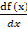表示 *f(x)* 相对于 *x* 的导数——f(x)相对于 *x* 的变化程度。等式(4.4)表示的导数表示函数值 *f(x)* 如何因 *x* 的“微小变化”而变化。这里，微小的变化 *h* 无限接近 0，表示为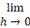。

让我们写一个程序，根据方程(4.4)求出函数的导数。为了直接实现等式(4.4)，可以为 h 指定一个小值用于计算:

```
# Bad implementation sample
def numerical_diff(f,  x): 
    h = 10e-50
    return (f(x+h) - f(x)) / h
```

该功能命名为`numerical_diff(f, x)`，以**数值微分**命名。它有两个参数:函数 f 和函数 f 的参数 x。这个实现看起来是正确的，但是可以做两个改进。

前面的实现使用了一个小值`10e-50`(“0.00...1”包含 50 个 0)作为 h，因为我们希望使用尽可能小的值作为 h(如果可能的话，我们希望使 h 无限接近 0)。但是这里出现了一个**舍入误差**的问题。由于省略了小数小范围内的数值(例如，省略了八位或更多位小数)，最终计算结果中会出现舍入误差。以下示例显示了 Python 中的舍入错误:

```
>>> np.float32(1e-50)
0.0
```

当您在 float32 类型(32 位浮点数)中表示`1e-50`时，该值变为 0.0。你不能正确地表达它。使用太小的值会给计算机计算带来问题。现在，这是第一个改进。您可以使用 104 作为较小的值 h，众所周知，104 左右的值会产生较好的结果。

第二个改进是在函数 f 的差值方面。前面的实现计算 x + h 和 x 之间的函数 f 的差值。您应该注意到，这种计算首先会导致错误。如图*图 4.5* 所示，“真导数”对应的是函数在 *x* 位置的梯度(称为切线)，而本实现中的导数对应的是( *x* + *h* )与 x 之间的梯度，因此，真导数(真切线)与本实现的值并不严格相同。出现这种差异是因为您无法使 *h* 无限接近 0:


###### 图 4.5:真导数(真正切)和数值微分(近似正切)的值不同

如*图 4.5* 所示，数值微分包含误差。为了减少这个误差，可以计算( *x + h* )和( *x - h* )之间的函数的差，( *f* )。这个差被称为**中心差**，因为它是围绕 *x* 计算的(另一方面，( *x + h* )和 *x* 之间的差被称为**前向差**)。现在，让我们基于这两个改进实现一个数值微分(数值梯度):

```
def numerical_diff(f,  x): 
    h = 1e-4 # 0.0001
    return (f(x+h) - f(x-h)) / (2*h)
```

#### 注意

如前面的代码所示，使用非常小的值差计算导数称为**数值微分**。另一方面，通过展开获得导数被称为“解析解”或“解析地获得导数”，例如，通过使用“解析的”一词可以解析得到 *y* = *x* 2 的导数为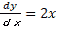。因此，你可以计算出 *y* 的导数为 *x* = 2，这就是 4。解析导数是没有错误的“真实导数”。

### 数值微分的例子

让我们用数值微分法来求一个简单函数的微分。第一个例子是由以下等式表示的二次函数:

|  | (4.5) |

用 Python 实现等式(4.5)，如下所示:

```
def function_1(x):
    return 0.01*x**2 + 0.1*x
```

画出这个函数的图形。下面显示了绘制图形的代码和结果图形(*图 4.6* ):

```
import numpy as np
import  matplotlib.pylab  as  plt
x = np.arange(0.0, 20.0, 0.1) # The array x containing 0 to 20 in increments of 0.1
y = function_1(x)
plt.xlabel("x")
plt.ylabel("f(x)")
plt.plot(x, y)
plt.show()
```

现在计算 x=5 和 x=10 时函数的微分:

```
>>> numerical_diff(function_1, 5)
0.1999999999990898
>>> numerical_diff(function_1, 10)
0.2999999999986347
```

这里计算的微分是 *f(x)* 对于 *x* 的变化量，对应的是函数的梯度。对了，*f(x)= 0.01 x*2*+0.1x*的解析解是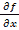 *= 0.02x + 0.1* 。 *x=5* 和 10 时的真导数分别为 0.2 和 0.3。它们与数值微分的结果并不完全相同，但误差很小。实际上，误差如此之小，以至于它们可以被视为几乎相同的值:


###### 图 4.6:图表*f*(*x*)= 0.01*x*2+0.1*x*

我们将使用前面的数值微分结果来绘制梯度为数值微分值的线图。结果如*图 4.7* 所示。这里可以看到导数对应的是函数的切线(源代码位于`ch04/gradient_1d.py`):

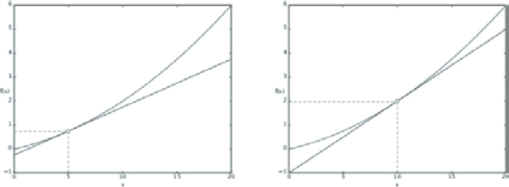

###### 图 4.7:当 *x* = 5 和 *x* = 10 时的切线–使用数值微分的值作为线的梯度

### 偏导数

接下来，我们来看看方程(4.6)表示的函数。这个简单的等式计算自变量的平方和。请注意，它有两个变量，与前面的示例不同:

| 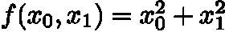 | (4.6) |

您可以用 Python 实现它，如下所示:

```
def function_2(x):
    return x[0]**2 + x[1]**2
    # or return np.sum(x**2)
```

这里，假设 NumPy 数组作为参数传递。该函数简单地对 NumPy 数组中的每个元素求平方并求和(`np.sum(x**2)`可以实现相同的处理)。现在，让我们画出这个函数的图形。这个三维图形如下所示:


###### 图 4.8: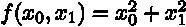的图形

现在，我们要计算方程(4.6)的导数。这里，请注意方程(4.6)有两个变量。因此，您必须指定为两个变量 *x* 0 和 *x* 1 中的哪一个计算微分。由多个变量组成的函数的导数称为**偏导数**。它们表示为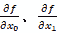。

为了说明这一点，考虑以下两个偏导数问题及其解决方案:

`x0`当`x0 = 3`和`x1 = 4`:

```
>>> def function_tmp1(x0):
...	return x0*x0 + 4.0**2.0
...
>>> numerical_diff(function_tmp1, 3.0)
6.00000000000378
```

`x1`当`x0 = 3`和`x1 = 4`时:

```
>>> def function_tmp2(x1):
...	return 3.0**2.0 + x1*x1
...
>>> numerical_diff(function_tmp2, 4.0)
7.999999999999119
```

为了解决这些问题，定义了一个一元函数，并计算该函数的导数。例如，in `x1=4`被定义，只有一个变量`x0`的函数被传递给该函数以计算数值微分。基于结果，对`6.00000000000378`的回答，和对`7.999999999999119`的回答。它们大多与解析微分法的解相同。

这样，偏导数就计算出了某个位置的梯度，比如对一个变量的求导。但是对于偏导数，是针对其中一个变量，其他变量固定在某个值。在前面的实现中，定义了一个新函数来将其他变量保持在特定值。新定义的函数被传递给先前的数值微分函数以计算偏导数。

## 渐变

在前面的例子中，为每个变量计算了 *x* 0 和 *x* 1 的偏导数。现在我们要一起计算 *x* 0 和 *x* 1 的偏导数。例如，我们来计算当`x0 = 3`和`x1 = 4`为(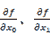 ) 时( *x* 0， *x* 1)的偏导数，集合表示所有变量偏导数的向量，如(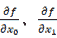)称为**梯度**。您可以按如下方式实现渐变:

```
def numerical_gradient(f,   x): 
    h = 1e-4 # 0.0001
    grad = np.zeros_like(x) # Generate an array with the same shape as x
    for idx in range(x.size):
        tmp_val = x[idx]
        # Calculate f(x+h)
        x[idx] = tmp_val + h
        fxh1 = f(x)
        # Calculate f(x-h)
        x[idx] = tmp_val - h
        fxh2 = f(x)
        grad[idx] = (fxh1 - fxh2) / (2*h)
        x[idx] = tmp_val # Restore the original value
    return grad
```

实现`numerical_gradient(f, x)`功能看起来有点复杂，但过程几乎与一个变量的数值微分相同。请注意，`np.zeros_like(x)`生成了一个与`x`形状相同的数组，其元素都是零。

`numerical_gradient(f, x)`函数接受`f (function)`和`x (NumPy array)`参数，并获得 NumPy 数组`x`中每个元素的数值微分。现在，让我们用这个函数来计算一个梯度。这里，我们将获得点(3，4)、(0，2)和(3，0)处的梯度:

```
>>> numerical_gradient(function_2, np.array([3.0, 4.0]))
array([ 6., 8.])
>>> numerical_gradient(function_2, np.array([0.0, 2.0]))
array([ 0., 4.])
>>> numerical_gradient(function_2, np.array([3.0, 0.0]))
array([  6.,    0.])
```

#### 注意

实际结果是[6.000000000037801，7.99999999991189]，但是[6。, 8.]被返回。这是因为返回的 NumPy 数组被格式化以增强值的可见性。

这样，我们就可以计算出( *x* 0， *x* 1)各点的梯度。前面的示例显示点(3，4)的渐变为(6，8)，点(0，2)的渐变为(0，4)，点(3，0)的渐变为(6，0)。这些渐变是什么意思？为了理解这一点，我们来看看的渐变。在这里，我们将使梯度为负，并绘制矢量(源代码位于`ch04/gradient_2d.py`)。

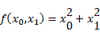的梯度显示为指向最低点的向量(箭头),如图 4*所示。9* 。在*图 4.9* 中，梯度似乎指向函数的“最低位置(最小值)， *f* ( * x * 0， *x* 1)。就像指南针一样，箭头指向一个点。它们离“最低位置”越远，箭头的尺寸越大:


###### 图 4.9: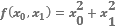的渐变

在图 4.9 的*所示的例子中，梯度指向最低位置，但情况并非总是如此。实际上，梯度在每个位置都指向更低的方向。更准确地说，梯度的方向是**在每个位置**减少函数值最多的方向。这是重要的一点，所以请记住这一点。*

### 梯度法

很多机器学习问题都是在训练过程中寻找最优参数。神经网络还需要在训练期间找到最佳参数(权重和偏差)。这里的最优参数是损失函数取最小值时的参数值。然而，损失函数可能是复杂的。参数空间很大，我们无法猜测它在哪里取最小值。梯度法充分利用梯度来寻找函数的最小值(或最小可能值)。

梯度表示在每个位置上函数值减少最多的方向。因此，一个梯度指向的位置是否真的是函数的最小值，换句话说，方向是否真的是要取的方向，是无法保证的。实际上，在一个复杂的函数中，梯度指向的方向在大多数情况下并不是最小值。

#### 注意

梯度在局部极小值，极小值，以及在一个叫做函数鞍点的点上为 0。局部最小值是局部最小值，是有限范围内的最小值。鞍点是一个方向上的局部最大值和另一个方向上的局部最小值的位置。梯度方法寻找梯度为 0 的位置，但是该位置不总是全局最小值(它可以是局部最小值或鞍点)。当一个函数具有复杂和扭曲的形状时，学习进入了一个(几乎)平坦的地带，可能会出现一个被称为“平台”的停滞期，导致训练停滞。

即使梯度的方向不总是指向全局最小值，向该方向移动也可以最大程度地降低函数值。因此，为了寻找最小值的位置或者寻找函数具有最小可能值的位置，您应该基于关于梯度的信息来确定移动的方向。

现在，让我们看看梯度法。在渐变方法中，从当前位置沿渐变方向移动一个固定的距离。通过这样做，您可以在新位置获得一个梯度，并再次沿梯度方向移动。因此，你在梯度方向上重复移动。通过重复沿梯度方向逐渐减小函数值被称为**梯度法**。这种方法常用于机器学习的优化问题。它通常在训练神经网络时使用。

#### 注意

如果梯度方法寻找最小值或最大值，它被称为另一个名称。准确地说，求最小值的方法叫做**梯度下降法**，求最大值的方法叫做**梯度上升法**。然而，反转损失函数的符号可以将最小值问题变成最大值问题。所以,“下降”和“上升”的区别并不特别重要。通常，在神经网络(深度学习)中经常使用“梯度下降”方法。

现在，让我们用一个方程来表达一个梯度法。方程式(4.7)显示了一种梯度法:

| 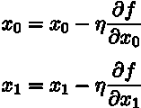 | (4.7) |

在等式(4.7)中，η调整要更新的量。这在神经网络中被称为一个**学习率**。学习率决定了需要学习多少和更新多少参数。

等式(4.7)示出了一个训练实例的更新等式，并且重复该步骤。每一步更新变量值，如等式(4.7)所示，并且该步骤重复几次以逐渐减小函数值。这个例子有两个变量，但是即使变量的数量增加了，一个类似的等式——每个变量的偏微分值——也被用于更新。

您必须事先指定学习率的值，如 0.01 和 0.001。一般来说，如果这个值太大或太小，您就无法到达“好地方”在神经网络训练中，我们通常通过改变学习率的值来检查训练是否成功。

现在，让我们用 Python 实现一个梯度下降方法。这可以通过以下方式完成:

```
def gradient_descent(f,  init_x,  lr=0.01,  step_num=100): 
    x = init_x
    for i in range(step_num):
        grad = numerical_gradient(f, x)
        x -= lr * grad
    return x
```

`f`参数是要优化的函数，`init_x`参数是初始值，`lr`参数是学习速率，`step_num`参数是梯度方法中的重复次数。函数的梯度通过`numerical_gradient(f, x)`获得，梯度通过乘以学习率更新，重复`step_num`指定的次数。

你可以用这个函数获得函数的局部最小值，运气好的话甚至可以获得最小值。现在，让我们试着解决一个问题。

**问题**:用梯度法求 的最小值；

```
>>> def function_2(x):
...    return x[0]**2 + x[1]**2
...
>>> init_x = np.array([-3.0, 4.0])
>>> gradient_descent(function_2, init_x=init_x, lr=0.1, step_num=100)
array([ -6.11110793e-10, 8.14814391e-10])
```

这里，指定(-3.0，4.0)作为初始值，并通过使用梯度方法开始寻找最小值。最终结果是(-6.1e-10，8.1e-10)，几乎接近(0，0)。实际上，真正的最小值是(0，0)。通过使用梯度法，您成功地获得了几乎正确的结果。*图 4.10* 显示了用梯度法更新的过程。原点是最低的位置，你可以看到结果正在逐渐向它靠近。画这个图的源码位于`ch04/gradient_method.py` ( `ch04/gradient_method.py`不显示虚线，显示的是图中的等高线):


###### 图 4.10:用梯度法更新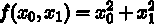-虚线显示函数的轮廓线

如前所述，过大或过小的学习率都达不到好的效果。让我们针对这两种情况做一些实验:

```
# When the learning rate is too large: lr=10.0
>>> init_x = np.array([-3.0, 4.0])
>>>  gradient_descent(function_2,  init_x=init_x,  lr=10.0,  step_num=100)
array([ -2.58983747e+13, -1.29524862e+12])
# When the learning rate is too small: lr=1e-10
>>> init_x = np.array([-3.0, 4.0])
>>> gradient_descent(function_2, init_x=init_x, lr=1e-10, step_num=100)
array([-2.99999994, 3.99999992])
```

如这个实验所示，如果学习率太大，结果会偏向一个大值。另一方面，如果学习率太小，几乎不会发生更新。设定一个合适的学习速度很重要。

#### 注意

学习率等参数被称为**超参数**。就其特征而言，它不同于神经网络的参数(权重和偏差)。神经网络中的权重参数可以通过训练数据和训练算法自动获得，而超参数必须手动指定。通常，您必须将此超参数更改为各种值，以找到能够实现良好训练的值。

### 神经网络的梯度

你还必须在神经网络训练中计算梯度。这里的梯度是权重参数的损失函数的梯度。比如我们假设一个神经网络只有权重 W(2×3 数组)，损失函数为 l，这种情况下我们可以把梯度表示为。下面的等式说明了这一点:

| 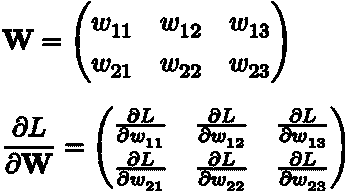 | (4.8) |

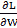的每个元素都是每个元素的偏导数。例如，第一行和第一列的元素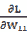表示 w11 的微小变化如何改变损失函数 l，这里重要的是的形状与 W 的形状相同，实际上，在等式(4.8)中，W 和的形状都相同(2×3)。

现在，让我们以一个简单的神经网络为例，实现一个计算梯度的程序。为此，我们将实现一个名为`simpleNet`的类(源代码位于`ch04/gradient_simplenet.py`):

```
import sys, os
sys.path.append(os.pardir)
import numpy as np
from common.functions import softmax, cross_entropy_error
from common.gradient import numerical_gradient
class simpleNet:
    def __ init __ (self):
        self.W = np.random.randn(2,3) # Initialize with a Gaussian distribution
    def predict(self, x):
        return np.dot(x, self.W)
    def loss(self, x, t):
        z = self.predict(x) 
        y = softmax(z)
        loss = cross_entropy_error(y, t)
        return  loss
```

这里使用了`common/functions.py`中的`softmax`和`cross_entropy_error`方法。`common/gradient.py`的`numerical_gradient`方法也在使用。`simpleNet`类只有一个实例变量，就是形状为 2x3 的权重参数。它有两种方法:一种是`predict(x)`进行预测，另一种是`loss(x, t)`获得损失函数值。这里，`x`参数是输入数据，`t`参数是正确的标签。现在，让我们尝试使用`simpleNet`:

```
>>> net = simpleNet()
>>> print(net.W) # Weight parameters
[[ 0.47355232 0.9977393 0.84668094]
[ 0.85557411 0.03563661 0.69422093]]
>>>
>>> x = np.array([0.6, 0.9])
>>> p = net.predict(x)
>>> print(p)
[ 1.05414809 0.63071653 1.1328074]
>>> np.argmax(p) # Index for the maximum value
2
>>>
>>> t = np.array([0, 0, 1]) # Correct label
>>> net.loss(x, t)
0.92806853663411326
```

接下来，让我们使用`numerical_gradient(f, x)`获得梯度。这里定义的`f(W)`函数采用一个伪参数`W`。因为`f(x)`功能是在`numerical_gradient(f, x)`内部执行的，所以为了一致性定义了`f(W)`:

```
>>> def f(W):
...    return net.loss(x, t)
...
>>> dW = numerical_gradient(f, net.W)
>>> print(dW)
[[ 0.21924763 0.14356247 -0.36281009]
 [ 0.32887144 0.2153437 -0.54421514]]
```

`numerical_gradient(f, x)`的`f`参数是一个函数，`x`参数是函数`f`的参数。因此，这里定义了一个新的函数`f`。它以`net.W`为自变量，计算损失函数。新定义的功能被传递给`numerical_gradient(f, x)`。

`numerical_gradient(f, net.W)`返回`dW`，是一个二维的 2x3 数组。`dW`表示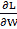的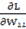在`0.2`左右，例如。这说明当 w11 增加 h 时，损失函数的值增加 0.2h. 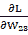约为`-0.5`，这说明当 w23 增加 h 时，损失函数的值减少 0.5h，所以，要减少损失函数，你应该正向更新 w23，负向更新 w11。您还可以看到，更新 w23 比更新 w11 对减少的贡献更大。

在前面的实现中，新函数用 Python 写成了`def f(x):…`，您可以使用`lambda`符号来编写和实现一个简单的函数，如下所示:

```
>>> f = lambda w: net.loss(x, t)
>>> dW = numerical_gradient(f, net.W)
```

在获得神经网络的梯度后，您所要做的就是使用梯度方法来更新权重参数。在下一节中，我们将为一个两层神经网络实现所有这些训练过程。

#### 注意

我们在这里使用的`numerical_gradient()`函数与之前处理多维数组的实现略有不同，比如权重参数`W`。然而，这些变化很简单，并且仅用于处理多维数组。更多详情，请参考源代码(`common/gradient.py`)。

## 实现训练算法

到目前为止，我们已经了解了神经网络训练的基本知识。“损失函数”、“小批量”、“梯度”、“梯度下降法”等重要关键词相继出现。在这里，我们将着眼于神经网络训练的程序，以供审查。让我们回顾一下神经网络训练程序。

假定

神经网络具有可适应的权重和偏差。调整它们以适应训练数据称为“训练”神经网络训练包括四个步骤。

第一步(小批量)

从训练数据中随机选取一些数据。选定的数据称为小批量。这里的目的是减少小批量的损失函数值。

步骤 2(计算梯度)

为了减少小批量的损失函数，计算每个重量参数的梯度。梯度显示了最大程度地降低损失函数值的方向。

步骤 3(更新参数)

在渐变方向稍微更新权重参数。

第四步(重复)

重复*步骤* *1* 、 *2* 和 *3* 。

前面的四个步骤用于神经网络训练。该方法使用梯度下降法来更新参数。因为这里使用的数据是作为小批量随机选择的，所以称为**随机梯度下降**。“随机”意味着“随机地选择数据”因此，随机梯度下降意味着“随机选择数据的梯度下降方法。”在许多深度学习框架中，随机梯度下降通常被实现为 **SGD** 函数，该函数以其首字母命名。

现在，让我们实现实际学习手写数字的神经网络。这里，两层神经网络(具有一个隐藏层)将使用 MNIST 数据集进行训练。

### 一类两层神经网络

首先，让我们实现一个两层神经网络作为一个类。这个类被命名为`TwoLayerNet`，实现如下(实现`TwoLayerNet`基于 CS231n 提供的 Python 源代码(*视觉识别的卷积神经网络*([http://cs231n.github.io/](http://cs231n.github.io/))斯坦福大学的课程)。源代码位于`ch04/two_layer_net.py`:

```
import sys, os
sys.path.append(os.pardir)
from common.functions import *
from common.gradient import numerical_gradient
class TwoLayerNet:
    def __ init __ (self, input_size, hidden_size, output_size,
                          weight_init_std=0.01):
        # Initialize weights
        self.params = {}
        self.params['W1'] = weight_init_std * /
                            np.random.randn(input_size, hidden_size)
        self.params['b1'] = np.zeros(hidden_size) 
        self.params['W2'] = weight_init_std * /
                            np.random.randn(hidden_size, output_size)
        self.params['b2'] = np.zeros(output_size)
    def predict(self, x):
        W1, W2 = self.params['W1'], self.params['W2']
        b1, b2 = self.params['b1'], self.params['b2']
        a1 = np.dot(x, W1) + b1
        z1 = sigmoid(a1)
        a2 =  np.dot(z1, W2) + b2
        y = softmax(a2)
        return y
    # x: input data, t: label data
    def loss(self, x, t):
        y = self.predict(x)
        return cross_entropy_error(y, t)
    def accuracy(self, x, t):
        y = self.predict(x)
        y = np.argmax(y, axis=1)
        t = np.argmax(t, axis=1)
        accuracy = np.sum(y == t) / float(x.shape[0])
        return accuracy
    # x: input data, t: teacher data
    def numerical_gradient(self, x, t):
        loss_W = lambda  W:  self.loss(x,  t)
        grads = {}
        grads['W1'] = numerical_gradient(loss_W, self.params['W1']) 
        grads['b1'] = numerical_gradient(loss_W, self.params['b1'])
        grads['W2'] = numerical_gradient(loss_W, self.params['W2']) 
        grads['b2'] = numerical_gradient(loss_W, self.params['b2'])
        return grads
```

这个类的实现有点长，但是没有什么新的东西出现。它与前一章中介绍的神经网络前向处理的实现有许多共同之处。首先，让我们看看在这个类中使用的变量和方法。*表 4.1* 显示了重要变量，而*表 4.2* 显示了所有方法:


###### 表 4。TwoLayerNet 类中使用的变量


###### 表 4.2:two layer net 类中使用的方法

`TwoLayerNet`类有两个字典变量，`params`和`grads`，作为实例变量。`params`变量包含重量参数。例如，层 1 的权重参数作为 NumPy 数组存储在`params['W1']`中。您可以使用`params['b1']`访问第 1 层的偏置。这里有一个例子:

```
net = TwoLayerNet(input_size=784, hidden_size=100, output_size=10)
net.params['W1'].shape # (784, 100)
net.params['b1'].shape # (100,)
net.params['W2'].shape # (100, 10)
net.params['b2'].shape # (10,)
```

如此处所示，`params`变量包含该网络所需的所有参数。包含在`params`变量中的权重参数用于预测(正向处理)。您可以做出如下预测:

```
x = np.random.rand(100, 784) # Dummy input data (for 100 images)
y = net.predict(x)
```

`grads`变量包含每个参数的梯度，因此它对应于`params`变量。当使用`numerical_gradient()`方法计算梯度时，梯度信息存储在`grads`变量中，如下所示:

```
x = p.random.rand(100, 784) # Dummy input data (for 100 images)
t = np.random.rand(100, 10) # Dummy correct label (for 100 images)
grads = net.numerical_gradient(x, t) # Calculate gradients
grads['W1'].shape # (784, 100)
grads['b1'].shape # (100,)
grads['W2'].shape # (100, 10)
grads['b2'].shape # (10,)
```

现在，让我们看看`TwoLayerNet`中方法的实现。`__init__` ( `self`，`input_size`，`hidden_size`，`output_size`)方法是类的初始化方法(在`TwoLayerNet`生成时调用)。参数是输入层、隐藏层和输出层中神经元的数量，从左到右依次排列。对于手写数字识别，总共提供 784 个大小为 28×28 的输入图像，并返回 10 个类别。因此，我们指定了`input_size=784`和`output_size=10`参数，并为`hidden_size`设置了一个合适的值作为隐藏层数。

这个初始化方法也初始化权重参数。确定将什么值设置为初始权重参数对于成功的神经网络训练是重要的。我们将在后面详细讨论权重参数的初始化。这里，通过使用基于高斯分布的随机数来初始化权重，并且将偏差初始化为 0。`predict(self, x)`和`accuracy(self, x, t)`几乎与我们在前一章中看到的与神经网络相关的预测的实现相同。如果你有任何问题，请参考上一章。`loss(self, x, t)`方法计算损失函数的值。它基于`predict()`的结果和正确的标签获得交叉熵误差。

剩下的`numerical_gradient(self, x, t)`方法计算每个参数的梯度。它使用数值微分来计算每个参数的损失函数的梯度。`gradient(self, x, t)`方法将在下一章实现。

#### 注意

`numerical_gradient(self, x, t)`使用数值微分来计算参数的梯度。在下一章，我们将看看如何使用反向传播快速计算梯度，它返回的结果几乎与使用数值微分相同，但处理速度更快。通过反向传播获得梯度的方法将在下一章的`gradient(self, x, t)`中实现。如果想节省时间，可以用`gradient(self, x, t)`代替`numerical_gradient(self, x, t)`，因为神经网络训练需要时间。

### 实施小批量培训

这里，我们将使用小批量训练来实现神经网络训练。在小批量训练中，我们从训练数据(称为小批量)中随机提取一些数据，并使用它通过梯度方法更新参数。让我们使用 MNIST 数据集(源代码位于`ch04/train_neuralnet.py`)对`TwoLayerNet`类进行训练:

```
import numpy as np
from dataset.mnist import load_mnist
from two_layer_net import TwoLayerNet
(x_train, t_train), (x_test, t_test) = \
    load_mnist(normalize=True, one_hot_label=True)
train_loss_list = []
# Hyper-parameters
iters_num = 10000
train_size = x_train.shape[0]
batch_size = 100
learning_rate = 0.1
network = TwoLayerNet(input_size=784, hidden_size=50, output_size=10)
for i in range(iters_num):
    # Obtain a mini-batch
    batch_mask = np.random.choice(train_size, batch_size)
    x_batch = x_train[batch_mask]
    t_batch = t_train[batch_mask]
    # Calculate a gradient
    grad = network.numerical_gradient(x_batch, t_batch)
    # grad = network.gradient(x_batch, t_batch) # fast version!
    # Update the parameters
    for key in ('W1', 'b1', 'W2', 'b2'): 
        network.params[key] -= learning_rate * grad[key]
    # Record learning progress
    loss = network.loss(x_batch, t_batch)
    train_loss_list.append(loss)
```

这里，小批量的大小是 100。每次从 60，000 条训练数据中随机提取 100 条数据(图像数据和正确标签数据)。然后，获得小批量的梯度，并使用**随机梯度下降** ( **SGD** )更新参数。这里，用梯度法更新的次数；即迭代次数为 10000 次。每次更新时，都会计算训练数据的损失函数，并将值添加到数组中。*图 4.11* 显示了该损失函数值如何变化的图表。

*图 4.11* 显示，随着训练次数的增加，损失函数值减小。这表明训练是成功的。神经网络的权参数逐渐适应数据。神经网络确实在学习。通过反复接触数据，它正在接近最佳重量参数:


###### 图 4.11:损失函数的转变–左边的图像显示了高达 10，000 次迭代的转变，而右边的图像显示了高达 1，000 次迭代的转变

### 使用测试数据进行评估

*图 4.11* 的结果显示，重复训练数据会逐渐降低损失函数值。然而，损失函数的值是“小批量训练数据的损失函数”的值训练数据的损失函数值的减少表明神经网络学习良好。但是，这个结果并不能证明它可以像处理这个数据集一样处理不同的数据集。

在神经网络训练中，我们必须检查训练数据以外的数据是否能被正确识别。我们必须检查“过拟合”是否没有发生。例如，过拟合意味着只有包含在训练数据中的图像数量能够被正确识别，而那些不包含在训练数据中的图像不能被识别。

神经网络训练的目标是获得泛化能力。为此，我们必须使用不包含在训练数据中的数据来评估神经网络的泛化能力。在下一个实现中，我们将在训练期间定期记录测试数据和训练数据的识别精度。我们将记录每个时期的测试数据和训练数据的识别准确度。

#### 注意

一个纪元是一个单位。一个时期表示所有训练数据都用于训练时的迭代次数。例如，我们假设使用 100 个小批量来学习 10，000 条训练数据。在随机梯度下降方法被重复 100 次之后，所有的训练数据都被看到。在这种情况下，`100 iterations = 1 epoch`。

现在，我们将稍微更改前面的实现，以获得正确的评估。这里，与之前实现的不同之处以粗体显示:

```
import numpy as np
from dataset.mnist import load_mnist
from two_layer_net import TwoLayerNet
(x_train, t_train), (x_test, t_test) = \
    load_mnist(normalize=True, one_hot_label=True)
train_loss_list = []
train_acc_list = []
test_acc_list = []
# Number of iterations per epoch
iter_per_epoch = max(train_size / batch_size, 1)
# Hyper-parameters
iters_num = 10000
batch_size = 100
learning_rate = 0.1
network = TwoLayerNet(input_size=784, hidden_size=50, 
output_size=10)
for i in range(iters_num):
    # Obtain a mini-batch
    batch_mask = np.random.choice(train_size, batch_size) 
    x_batch = x_train[batch_mask]
    t_batch = t_train[batch_mask]
    # Calculate a gradient
    grad = network.numerical_gradient(x_batch, t_batch) 
    # grad = network.gradient(x_batch, t_batch) # Quick version!
    # Update the parameters
    for key in ('W1', 'b1', 'W2', 'b2'): 
        network.params[key] -= learning_rate * grad[key]
    loss = network.loss(x_batch, t_batch)
    train_loss_list.append(loss)
 # Calculate recognition accuracy for each epoch
 if i % iter_per_epoch == 0:
 train_acc = network.accuracy(x_train, t_train)
 test_acc = network.accuracy(x_test, t_test)
 train_acc_list.append(train_acc)
test_acc_list.append(test_acc)
 print("train acc, test acc | " + str(train_acc) + " , " + str(test_acc))
```

在前面的例子中，为所有训练和测试数据计算识别准确度，并记录每个时期的结果。由于在`for`语句中重复计算识别精度会花费时间，因此会针对每个时期计算识别精度。同样，我们不需要频繁记录识别准确度(我们所需要的只是识别准确度的近似转换)。因此，为训练数据的每个时期记录识别精度的转变。

现在，让我们以图表形式显示前面代码的结果:


###### 图 4.12:训练数据和测试数据识别精度的转变。水平轴显示时代

在*图 4.12* 中，实线表示训练数据的识别精度，虚线表示测试数据的识别精度。如您所见，随着历元数的增加(训练的进步)，训练数据和测试数据的识别精度都有所提高。这里，我们可以看到两个识别精度几乎相同，因为两条线大部分重叠。这表明这里没有发生过拟合。

## 总结

本章描述了神经网络训练。首先，我们引入了一个叫做损失函数的`score`，以便神经网络能够学习。神经网络训练的目标是发现导致损失函数值最小的权重参数。然后，我们学习了如何使用函数的梯度，称为梯度法，以发现最小的损失函数值。本章包括以下几点:

*   在机器学习中，我们使用训练数据和测试数据。
*   训练数据用于训练，测试数据用于评估训练好的模型的泛化能力。
*   损失函数被用作神经网络训练中的得分。权重参数被更新，使得损失函数值将减小。
*   为了更新权重参数，它们的梯度被用于重复地在梯度方向上更新它们的值。
*   当提供非常小的值时，基于差值计算导数称为数值微分。
*   您可以使用数值微分来获得权重参数的梯度。
*   数值微分需要时间来计算，但它的实现很容易。另一方面，反向传播，将在下一章描述，稍微复杂，但它可以快速计算梯度。