# 5。反向传播

前一章描述了神经网络训练。其中，通过使用数值微分获得神经网络中权重参数的梯度(即，权重参数的损失函数的梯度)。数值微分简单，实现容易，但缺点是计算耗时。本章介绍反向传播，这是一种计算权重参数梯度的更有效的方法。

有两种方法可以正确理解反向传播。其中一个使用“方程式”，而另一个使用**计算图**。前者是一种常见的方式，许多关于机器学习的书籍都通过关注公式对此进行了扩展。这很好，因为它既严格又简单，但它可能隐藏了必要的细节，或者以一个无意义的等式列表结束。

因此，本章将使用计算图形，以便你可以“直观地”理解反向传播写代码会进一步加深你的理解，让你相信这一点。用计算图来解释反向传播的想法是基于安德烈·卡帕西的博客(*黑客的神经网络指南*、([http://karpathy.github.io/neuralnets/](http://karpathy.github.io/neuralnets/)))和他与斯坦福大学费-李非教授提供的深度学习课程( *CS231n:* *视觉识别卷积神经网络*([http://cs231n.github.io/](http://cs231n.github.io/)))。

## 计算图表

计算图显示了计算过程。这个图作为数据结构的图，用多个节点和边(意思是连接节点的直线)来表示。在这一节中，我们将解决一些简单的问题，以便在逐步进入更复杂的反向传播之前熟悉计算图。

### 利用计算图解决问题

本节中的问题很简单，你可以用心算来解决，但这里的目的是熟悉计算图形。学习使用计算图将有助于我们后面将涉及的复杂计算，因此首先掌握如何在这里使用它们是很重要的。

**问题 1** :太郎买了两个苹果，每个 100 日元。如果征收 10%的消费税，计算他支付的金额。

计算图用节点和箭头显示了计算过程。一个节点用一个圆表示，一个操作在其中描述。箭头上方的中间计算结果显示了从左向右流动的每个节点的结果。下图显示了解决问题 1 的计算图:


###### 图 5.1:使用计算图回答问题 1

如上图所示，流向“x2”节点的苹果的 100 日元变成了 200 日元，并被传递到下一个节点。然后，200 日元传到“× 1.1”节点，变成 220 日元。这个计算图的结果显示答案是 220 日元。

在上图中，每个圆包含“× 2”或“× 1.1”作为一个操作。您也可以仅在圆圈中放置“x”来显示操作。在这种情况下，如下图所示，您可以将“ *2* ”和“ *1.1* ”放置在圆圈外，作为“苹果数量”和“消费税”变量。

这个问题的解决方案可以在下图中看到:


###### 图 5.2:使用计算图表回答问题 1:“苹果数量”和“消费税”变量被置于圆圈之外

**问题 2** :太郎买了 2 个苹果和 3 个橘子。一个苹果 100 日元，橘子 150 日元。征收了 10%的消费税。计算他付的钱数。

和问题 1 一样，我们将使用计算图来解决问题 2。下图显示了这方面的计算图表:


###### 图 5.3:使用计算图回答问题 2

在这个问题中，添加了一个加法节点“+”来对苹果和橘子的数量求和。创建计算图形后，我们从左向右推进计算。计算结果从左向右移动，就像电流在电路中流动一样，当结果到达最右侧时，计算结束。上图显示答案是 715 日元。

要使用计算图解决问题，您必须执行以下操作:

1.  创建一个计算图。
2.  在计算图上从左向右推进计算。

步骤 2 被称为正向传播或**正向传播**。在正向传播中，计算在计算图中从开始传播到结束。如果存在正向传播，我们也可以考虑反向传播——从右到左。这被称为**反向** **传播**，被称为反向传播。在我们后面计算导数的时候会起到很重要的作用。

### 局部计算

计算图的主要特点是可以通过传播“局部计算”来获得最终结果。单词“局部”意味着“与节点相关的小范围”局部计算可以从与节点相关的信息中返回下一个结果(后续结果)，而不管整体上发生了什么。

我们可以用一个具体的例子来分解局部计算。例如，让我们假设我们在超市买了两个苹果和许多其他东西。为了形象化这一点，您可以创建一个计算图，如下所示:


###### 图 5.4:买两个苹果和许多其他东西的例子

假设我们买了很多东西，总额是 4000 日元(经过复杂的计算)，如前面的计算图所示。这里重要的是，每个节点中的计算都是局部计算。要合计苹果和其他购买的金额(4000+200-> 4200)，您可以将这两个数字相加，而不用考虑 4000 是如何得到的。换句话说，每个节点中要计算的只是与该节点相关的计算—在本例中，是所提供的两个数的相加。我们不需要考虑整个图表。

因此，您可以在计算图中关注局部计算。无论整个计算有多复杂，每一步所做的都是对目标节点的“局部计算”。通过传递简单局部计算的结果，您可以获得构成整个图形的复杂计算的结果。

#### 注意

例如，组装一辆汽车是复杂的，但它通常是根据“装配线”上的分工进行的每个工人(机器)进行简单的工作。工作流程的结果传递给下一个工人，最后，汽车就制造出来了。计算图还将复杂的计算划分为“简单的和局部的计算”,并将计算结果传递给下一个节点，就像汽车在装配线上被传递一样。就像汽车的组装一样，复杂的计算可以分成简单的计算。

### 我们为什么要使用计算图？

我们已经通过使用计算图解决了两个问题，现在可以考虑优点了。其中之一是“本地计算”，如前所述。无论整个计算有多复杂，局部计算可以使你专注于每个节点的简单计算，从而简化整个问题。

还有一个好处就是你可以把中间计算的所有结果保存在一个计算图中(比如 2 个苹果算完 200 日元，加消费税前 650 日元)。然而，使用计算图的最大原因是，您可以通过反向传播来高效地计算“导数”。

为了描述计算图中的反向传播，再次考虑问题 1。在这个问题中，您计算了两个苹果的最终支付金额和消费税。现在假设你需要知道当一个苹果的价格上涨时，最终支付的金额会受到怎样的影响。这相当于获得“支付金额相对于苹果价格的导数”当苹果的价格为 x，支付的金额为 l 时，它对应于获得。这个导数的值表示当苹果的价格“略微”上涨时，支付的金额增加了多少

正如我们前面提到的，您可以在计算图中使用反向传播来获得一个值，例如“支付金额相对于苹果价格的导数”首先，我们只看结果。如下图所示，您可以通过在计算图形中使用反向传播来获得导数:


###### 图 5.5:使用反向传播传播差值

如上图所示，反向传播以图形方式用箭头(粗线)表示，箭头方向与正向传播方向相反。向后传播通过“局部微分”，并且值被放置在箭头下面。在本例中，导数值从右向左传递，如 1 -> 1.1 -> 2.2。结果显示“支付金额相对于苹果价格的导数”的值为 2.2。

这表明，当苹果价格上涨 1 日元时，最终支付的金额将增加 2.2 日元。这意味着，当一个苹果的价格小幅上涨时，最终金额会增加 2.2 倍。这里，只获得了关于苹果价格的导数，但是你也可以通过使用类似的步骤获得“关于消费税支付的金额的导数”和“关于苹果数量支付的金额的导数”。

在这些步骤中，您可以共享导数的中间结果(中途传递的导数)，以便您可以高效地计算多个导数。因此，计算图的优势在于向前和向后传播使您能够有效地获得每个变量的导数值。

## 链式法则

计算图形中的向前传播从左向右向前传播计算结果。这些计算看起来很自然，因为它们通常是被执行的。另一方面，在反向传播中,“局部导数”从右向左反向传播。传播“局部导数”的原理基于**链式法则**。让我们看看链规则，并阐明它如何对应于计算图中的向后传播。

### 计算图中的反向传播

我们现在将使用计算图来查看反向传播的示例。让我们假设一个计算 *y = f (x)* 存在。下图显示了此计算的向后传播:


###### 图 5.6:计算图中的向后传播——局部导数在向后方向上相乘

如上图所示，反向传播将信号 E 乘以节点的局部导数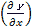，并将其传播到下一个节点。这里的局部导数意味着在前向传播中获得计算的导数 y = f (x ),并且表示获得相对于 x 的导数`y`；比如 y = f (x) = x2，。局部导数乘以从上游传播的值(在本例中为 E ),并传递给前一个节点。

这是反向传播的过程。它可以有效地获得目标导数值。这种可能性的原因可以用下一节定义的链式法则来解释。

### 什么是链式法则？

在解释链式法则之前，我们需要讲一下`z = (x + y)` 2 由两个方程组成，如方程(5.1)所示:

|  | (5.1) |

链式法则是与复合函数的导数相关的特征，定义如下。

当函数用复合函数表示时，复合函数的导数可以用构成复合函数的每个函数的导数的乘积来表示。

这就是所谓的链式法则。虽然看起来很难，但实际上很简单。在等式(5.1)给出的例子中，(z 关于 x 的导数)是(z*关于 *t* 的导数)和(t*关于 x 的导数)的乘积。你可以用下面的等式(5.2)来表示:

|  | (5.2) |

你可以很容易地记住方程(5.2)，因为∂t's 相互抵消，如下所示:

现在，让我们用链式法则来获得方程(5.2)的导数，。首先，获得方程(5.1)的局部微分(偏微分):

| 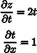 | (5.3) |

如式(5.3)所示，为 2t，为 1。这个结果是从微分公式中分析得到的。最终结果可以通过等式(5.3)中获得的导数的乘积来计算:

|  | (5.4) |

### 链式法则和计算图

现在，让我们用一个计算图来表示方程(5.4)中链式法则的计算。当我们用一个节点“**2”表示一个正方形时，我们可以为它画一个图，如下所示:


###### 图 5.7:方程式(5.4)的计算图——局部导数相乘并向后传递

如上图所示，计算图形中的反向传播从右向左传播信号。反向传播将提供给一个节点的信号乘以该节点的局部导数(偏导数),并将其传递给下一个节点。例如，反向传播中“**2”的输入是。它乘以局部导数(在正向传播中，输入是 t，输出是 z，所以在这个节点的(局部)导数是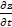)然后相乘，传递到下一个节点。在上图中，反向传播的第一个信号没有出现在前面的等式中。这里省略了它，因为 = 1。

从上图中我们应该注意到的是最左边位置向后传播的结果。它对应于“z 相对于 x 的导数”，因为由于链式法则。反向传播执行的是基于链式法则的原理。

如上图所示，当您指定方程式(5.3)的结果时，结果如下。这样，就是 2(x + y):


###### 图 5.8:基于计算图中向后传播的结果，is 2(x + y)

## 反向传播

上一节描述了计算图中的反向传播是如何基于链规则的。我们现在将以“+”和“x”等操作为例，介绍反向传播是如何工作的。

### 加法节点中的反向传播

首先，让我们考虑一个附加节点中的反向传播。这里，我们将着眼于方程 *z = x + y* 的反向传播。我们可以得到 *z = x + y* 的导数(解析地)如下:

|  | (5.5) |

如等式(5.5)所示，和均为 1。因此，我们可以用计算图来表示它们，如下图所示。在反向传播中，来自上游的导数(在本例中为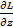)乘以 1，并向下游传递。简而言之，加法节点中的反向传播乘以 1，因此它只将输入值传递给下一个节点。

在这个例子中，来自上游的微分值被表示为。这是因为我们假设了一个最终输出 L 的大型计算图，如图*图 5.10* 所示。计算， *z = x + y* ，存在于大型计算图中的某个地方，的值是从上游传过来的。和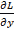的值向下游传播:


###### 图 5.9:添加节点中的反向传播–左侧为正向传播，右侧为反向传播。

如右图所示，加法节点中的反向传播将一个值从上游传递到下游，而不对其进行更改。


###### 图 5.10:这个加法节点存在于最终输出计算的某个地方。

在反向传播中，从最右边的输出开始，局部导数反向从一个节点传播到另一个节点

现在，让我们看一个反向传播的例子。例如，假设存在计算“10 + 5 = 15”，并且值 1.3 从上游反向传播。下图以计算图表的形式显示了这一点:


###### 图 5.11:添加节点中反向传播的示例

因为加法节点中的反向传播只将输入信号输出到下一个节点，所以它将 1.3 传递到下一个节点。

### 倍增节点中的反向传播

以等式 *z = xy* 为例，我们来看看乘法节点中的反向传播。这个方程的微分由下面的方程(5.6)表示:

|  | (5.6) |

基于前面的方程(5.6)，你可以写一个计算图如下。

对于乘法的后向传播，上游值乘以前向传播的输入信号的“反转值”后被传递到下游。反向值意味着如果信号在正向传播中是 x，则在反向传播中要相乘的值是 y；如果信号在正向传播中是 y，则在反向传播中要相乘的值是 x，如下图所示。

让我们看一个例子。假设存在 10×5 = 50 的计算，并且值 1.3 从上游反向传播。*图 5.13* 以计算图的形式显示了这一点。

在乘法的反向传播中，反转的输入信号被相乘，因此得到 1.3×5 = 6.5 和 1.3×10 = 13。在加法的向后传播中，上游值只传递给下游。因此，不需要正向传播中的输入信号值。另一方面，对于乘法的反向传播，需要正向传播中的输入信号的值。因此，为了实现乘法节点，前向传播的输入信号被保留:


###### 图 5.12:乘法节点中的反向传播–左侧为正向传播，右侧为反向传播


###### 图 5.13:乘法节点中反向传播的示例

### 苹果示例

我们再来思考一下本章开头的买苹果的例子——两个苹果和消费税。这里要解决的问题是三个变量(苹果的价格、苹果的数量和消费税)中的每一个如何影响最终支付的金额。这相当于获得“支付金额相对于苹果价格的导数”、“支付金额相对于苹果数量的导数”和“支付金额相对于消费税的导数”。我们可以通过在计算图中使用反向传播来解决这个问题，如下图所示:


###### 图 5.14:购买苹果的反向传播示例

如前所述，在乘法节点的反向传播中，输入信号被反转并向下游传递。根据上图所示的结果，一个苹果的价格差为 2.2，有 110 个苹果，消费税为 200。他们指出，当消费税和苹果的价格增加相同的数量时，消费税会影响 200 的最终支付金额，而苹果的价格会影响 2.2 的最终支付金额。然而，产生这个结果是因为消费税和这个例子中苹果的价格在单位上是不同的(1 表示消费税是 100%，而 1 表示苹果的价格是 1 日元)。

最后，让我们把解决“买苹果和橘子”的反向传播作为一个练习。请获得单个变量的导数，并将数字填入下图中提供的方格中(您可以在下一部分找到答案):


###### 图 5.15:购买苹果和橘子的反向传播示例——通过在方块中填入数字来完成计算

## 实现一个简单层

在本节中，我们将使用计算图中的乘法节点作为**乘法层** ( **MulLayer** )和加法节点作为**加法层** ( **AddLayer** )来实现我们用 Python 描述的苹果示例。

#### 注意

在下一节中，我们将在一个类中实现构成神经网络的“层”。这里的“层”是神经网络中的一个功能单元，即 sigmoid 函数的 Sigmoid 层和矩阵乘法的仿射层。因此，我们也将在“层”的基础上实现乘法和加法节点。

### 实现倍增层

我们将实现一个层，使它有两个公共方法(接口):`forward()`和`backward()`，分别对应正向传播和反向传播。现在，您可以将一个乘法层实现为一个名为`MulLayer`的类，如下所示(源代码位于`ch05/layer_naive.py`):

```
class MulLayer:
   def __init__ (self): 
      self.x = None
      self.y = None
    def forward(self, x, y):
       self.x = x
       self.y =y
       out = x * y
       return out
    def backward(self, dout):
       dx = dout * self.y # Reverse x and y
       dy = dout * self.x
       return dx, dy
```

`__init__()`初始化实例变量`x,`和`y`，这些变量用于在前向传播中保留输入值。`forward()`取两个变量`x`和`y`，相乘并输出它们的乘积。另一方面，`backward()`将上游的导数(`dout`)乘以正向传播的“反向值”，并将结果传递到下游。

现在，使用`MulLayer`实现“购买苹果”——两个苹果和消费税。在上一节中，我们在计算图中使用了前向和后向传播进行计算，如下图所示:


###### 图 5.16:购买两个苹果

通过使用乘法层，我们可以实现如下的正向传播(源代码位于`ch05/buy_apple.py`):

```
apple = 100
apple_num = 2
tax = 1.1
# layer
mul_apple_layer = MulLayer()
mul_tax_layer = MulLayer()
# forward
apple_price = mul_apple_layer.forward(apple, apple_num)
price = mul_tax_layer.forward(apple_price, tax)
print(price) # 220
```

你可以用`backward()`获得每个变量的微分。

```
# backward
dprice = 1
dapple_price, dtax = mul_tax_layer.backward(dprice)
dapple, dapple_num = mul_apple_layer.backward(dapple_price)
print(dapple, dapple_num, dtax) # 2.2 110 200
```

这里，调用`backward()`的顺序与调用`forward()`的顺序相反。注意`backward()`的自变量是“关于正向传播中输出变量的导数”例如，乘法层`mul_apple_layer`在正向传播中返回`apple_price`，而在反向传播中它将`apple_price (dapple_price)`的导数值作为参数。该程序的执行结果与上图所示的结果相匹配。

### 实现附加层

现在，我们将实现一个附加层，它是一个附加节点，如下所示:

```
class AddLayer:
   def __init__ (self):
      pass
   def forward(self, x, y):
      out = x + y
      return out
   def backward(self, dout): 
      dx = dout * 1
      dy = dout * 1
      return dx, dy
```

一个添加层不需要初始化，所以`__init__ ()`什么都不做(pass 语句是“什么都不做”)。加法层中的`forward()`接受两个参数`x`和`y`，并将它们相加输出。`backward()`将差压(`dout`)从上游传递到下游。

现在，让我们使用加法和乘法层来实现购买两个苹果和三个橙子，如下图所示。


###### 图 5.17:购买两个苹果和三个橘子

你可以用 Python 实现这个计算图如下(源代码位于`ch05/buy_apple_orange.py`):

```
apple = 100
apple_num = 2
orange = 150
orange_num = 3
tax = 1.1
# layer
mul_apple_layer = MulLayer()
mul_orange_layer = MulLayer()
add_apple_orange_layer = AddLayer()
mul_tax_layer = MulLayer()
# forward
apple_price = mul_apple_layer.forward(apple, apple_num) #(1)
orange_price = mul_orange_layer.forward(orange, orange_num) #(2)
all_price = add_apple_orange_layer.forward(apple_price, orange_price) #(3)
price = mul_tax_layer.forward(all_price, tax) #(4)
# backward
dprice = 1
dall_price, dtax = mul_tax_layer.backward(dprice) #(4)
dapple_price, dorange_price = add_apple_orange_layer.backward(dall_price) #(3)
dorange, dorange_num = mul_orange_layer.backward(dorange_price) #(2)
dapple, dapple_num = mul_apple_layer.backward(dapple_price) #(1)
print(price) # 715
print(dapple_num, dapple, dorange, dorange_num, dtax) # 110 2.2 3.3 165 650
```

这个实现有点长，但是每个语句都很简单。创建所需的层，并以适当的顺序调用正向传播方法`forward()`。然后，反向传播方法`backward()`以与正向传播相反的顺序被调用，以获得期望的导数。

这样，在计算图中实现层(这里是加法和乘法层)就很容易了，你可以用它们来获得复杂的导数。接下来，我们将实现神经网络中使用的层。

## 实现激活功能层

现在，我们将把计算图的思想应用于神经网络。这里，我们将使用 ReLU 和 Sigmoid 层在一个类中实现构成神经网络的“层”,它们是激活函数。

### 热卢层

一个**整流线性单元** ( **ReLU** )被用作激活函数，并由下式(5.7)表示:

|  | (5.7) |

从前面的等式(5.7)中，你可以用等式(5.8)获得 y 相对于 x 的导数:

| 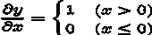 | (5.8) |

如等式(5.8)所示，如果正向传播中的输入 x 大于 0，反向传播将上游值传递到下游，而不改变它。同时，如果 x 在前向传播中为 0 或更小，则信号在后向传播中停止。您可以在计算图形中表达这一点，如下图所示:


###### 图 5.18:ReLU 层的计算图

接下来，让我们实现 ReLU 层。当在神经网络中实现一个层时，我们假设`forward()`和`backward()`将 NumPy 数组作为参数。ReLU 层的实现位于`common/layers.py`:

```
class Relu:
   def __init__ (self): 
      self.mask = None
   def forward(self, x):
      self.mask = (x <= 0)
      out = x.copy()
      out[self.mask] = 0
      return out
   def backward(self, dout):
      dout[self.mask] = 0
      dx = dout
      return dx
```

`Relu`类有一个实例变量`mask`。`mask`变量是一个由`True` / `False`值组成的 NumPy 数组。如果正向传播中的输入元素`x`为`0`或更小，则屏蔽的对应元素为`True`。否则(如果大于 0)，元素为`False`。例如，`mask`变量包含一个由`True`和`False`组成的 NumPy 数组，如下面的代码所示:

```
>>> x = np.array( [[1.0, -0.5], [-2.0, 3.0]] )
>>> print(x)
[[  1\.    -0.5]
[-2\.    3\. ]]
>>> mask = (x <= 0)
>>> print(mask)
[[False True]
[ True False]] 
```

如上图所示，当正向传播中的输入值为 0 或更小时，反向传播的值为 0。因此，在反向传播中，存储在正向传播中的掩码变量用于从上游设置`dout`。如果屏蔽的一个元素是`True`，则`dout`中相应的元素被设置为 0。

#### 注意

ReLU 层在电路中起到“开关”的作用。在正向传播中，如果有电流流过，它会打开开关，如果没有电流流过，它会关闭开关。在反向传播中，如果开关接通，电流继续流动，如果开关断开，电流不再流动。

### 乙状结肠层

接下来，让我们实现一个 sigmoid 函数。这由等式(5.9)表示:

| T45 | (5.9) |

下图显示了表示方程式(5.9)的计算图:


###### 图 5.19:乙状结肠层的计算图(仅向前传播)

这里，除了 *X* 和 *+* 节点之外，还出现了 *exp* 和 */* 节点。 *exp* 节点计算 *y = exp(x)* ，而 */* 节点计算。

方程式(5.9)的计算包括局部计算的传播。接下来，让我们考虑前面的计算图中所示的反向传播，一步一步地查看反向传播的流程，以总结我们到目前为止所描述的内容。

第一步:

*/* 节点代表。它的导数由下式解析表示:

| `` | (5.10) |

基于等式(5.10)，在反向传播中，节点将上游值乘以*y*2(正向传播中输出平方的加性倒数)，并将该值传递给下游。下面的计算图显示了这一点:


###### 图 5.20:Sigmoid 层的计算图(加上平方的倒数)

**第二步:**

*+* 节点只将上游值传递给下游。下面的计算图显示了这一点:


###### 图 5.21:s 形层的计算图(通过上游值)

**第三步:**

“exp”节点表示 *y = exp(x)* ，其导数由下式表示:

|  | (5.11) |

在下面的计算图中，节点将上游值乘以正向传播中的输出(在本例中为 *exp(-x)* )，并将该值传递给下游:


###### 图 5.22:乙状结肠层的计算图

**第四步:**

*X* 节点反转前向传播中的值以进行乘法运算。因此，*1*在此处相乘:


###### 图 5.23:乙状结肠层的计算图(反向值)

因此，我们可以在上图所示的计算图中显示 Sigmoid 层的向后传播。根据前面的计算图的结果，反向传播的输出是，并且它被传播到下游节点。这里注意到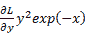可以根据正向传播的输入 *x* 和输出 *y* 来计算。因此，我们可以将上图所示的计算图形绘制为一个分组的“sigmoid”节点，如下所示:


###### 图 5.24:乙状结肠层的计算图(简单版)

*图 5.23* 中的计算图和*图 5.24* 中的简化计算图提供了相同的计算结果。简单版本更有效，因为它可以省略反向传播中的中间计算。还需要注意的是，通过对节点进行分组，您可以只关注输入和输出，而不用关心 Sigmoid 层的细节。

您也可以组织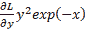如下:

| 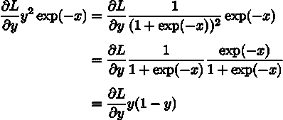 | (5.12) |

因此，您只能根据正向传播的输出来计算上图所示的 Sigmoid 层中的反向传播:


###### 图 5.25:Sigmoid 层的计算图–你可以使用正向传播的输出 y 来计算反向传播

现在，让我们用 Python 实现 Sigmoid 层。基于上图，您可以如下实现它(该实现位于`common/layers.py`):

```
class Sigmoid:
   def __init__ (self): 
      self.out = None
   def forward(self, x):
      out = 1 / (1 + np.exp(-x)) 
      self.out = out
   return out
def backward(self, dout):
   dx = dout * (1.0 - self.out) * self.out
   return dx
```

这个实现将前向传播的输出保留在`out`实例变量中，然后在后向传播中使用`out`变量进行计算。

## 实现仿射和 Softmax 层

### 仿射图层

在神经网络的前向传播中，矩阵的乘积(`np.dot()`，在 NumPy 中)被用来对加权信号求和(详情请参考*第 3 章*、*神经网络*中的*计算多维数组*部分)。比如你还记得下面这个 Python 中的实现吗？

```
>>> X = np.random.rand(2) # Input values
>>> W = np.random.rand(2,3) # Weights
>>> B = np.random.rand(3) # Biases
>>>
>>> X.shape # (2,)
>>> W.shape # (2, 3)
>>> B.shape # (3,)
>>>
>>> Y = np.dot(X, W) + B
```

这里，假设`X`、`W`和`B`分别是形状为`(2,)`、`(2, 3)`和`(3,)`的多维数组。这样就可以计算出神经元的加权和为`Y = np.dot(X, W) + B`。`Y`被激活函数转换，传播到下一层，这是一个神经网络中正向传播的流程。请注意，对于矩阵乘法，相应维度中的元素数量必须相同。这意味着在`X`和`W`的乘积中，对应维度的元素个数必须相同，如下图所示。这里，矩阵的形状用括号表示为 *(2，3)* (这是为了与 NumPy 的形状输出保持一致):


###### 图 5.26:对于矩阵乘法，相应维度中的元素数量必须相同

#### 注意

神经网络中前向传播的矩阵乘积在几何领域中称为“仿射变换”。因此，我们将执行仿射变换的过程实现为“仿射层”

现在，让我们看看计算图中的计算——矩阵和偏差之和的乘积。当我们将计算矩阵乘积的节点表示为“点”时，下面的计算图可以显示计算结果`np.dot(X, W) + B`。在每个变量的上方，标明了变量的形状(例如， *X* 的形状为 *(2，)*，而*X–W*的形状为 *(3，)*如下所示):


###### 图 5.27:仿射层的计算图。请注意，变量是矩阵。在每个变量的上方，显示了变量的形状

前面是一个相对简单的计算图。但是注意， *X* 、 *W* 、 *B* 是多维数组。在我们到目前为止看到的计算图中，“标量值”在节点之间流动，而在本例中，“多维数组”在节点之间传播。

让我们考虑一下前面的计算图的向后传播。要获得多维数组的向后传播，您可以使用与前面用于标量值的计算图形相同的过程，即写入多维数组的每个元素。这样做，我们可以得到下面的方程(如何得到方程(5.13)在这里省略):

| 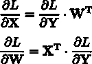 | (5.13) |

在方程(5.13)中，WT 中的 T 表示转置。Transpose 将 W 的(I，j)元素切换到(j，I)元素，如下式所示:

|  | (5.14) |

如等式(5.14)所示，当 W 的形状为(2，3)时，WT 的形状变为(3，2)。

基于等式(5.13)，让我们在计算图中写出反向传播。下图显示了结果:


###### 图 5.28:仿射层的反向传播。请注意，变量是矩阵。在每个变量下面，显示了变量的形状

让我们仔细考虑每个变量的形状。请注意，X 和是相同的形状，并且 W 和在形状上是相同的，因为下面的等式:

| 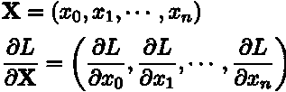 | (5.15) |

我们注意矩阵的形状，因为对于矩阵乘法来说，相应维度中的元素数量必须相同，并且检查它们是否相同可以得到等式(5.13)。例如，考虑和 W 的乘积使得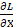的形状变成(2)，当的形状是(3)，W 的形状是(2，3)。然后，方程式(5.13)如下。这可以从下图中看出:


###### 图 5.29:矩阵的乘积(您可以通过配置一个乘积来创建“点”节点的反向传播，从而使矩阵中相应维度的元素数量相同)

### 基于批处理的仿射层

仿射层以一条数据作为输入，x，在这一节中，我们将考虑一个基于批处理的仿射层，它共同传播 N 条数据(一组数据称为一个“批处理”)。我们先来看看基于批的仿射层的计算图(*图 5.30* )。

与前面解释的唯一区别是输入 X 的形状现在是(N，2)。我们所要做的就是用和以前一样的方法计算计算图中的矩阵。对于反向传播，我们必须注意矩阵的形状。只有在那之后，我们才能以同样的方式获得和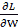。

添加偏差时必须小心。当前向传播中添加偏差时，偏差被添加到 X W 的每条数据。例如，当 N = 2(两条数据)时，偏差被添加到两条数据中的每一条(每个计算结果)。下图显示了这种情况的一个具体示例:


###### 图 5.30:基于批处理的仿射层的计算图

```
>>> X_dot_W = np.array([[0, 0, 0], [10, 10, 10]])
>>> B = np.array([1, 2, 3])
>>>
>>> X_dot_W
array([[  0,    0,    0],
    [ 10,  10, 10]])
>>> X_dot_W + B
array([[  1,    2,    3],
    [11,  12, 13]])
```

在前向传播中，偏差被添加到每条数据中(第一条、第二条等等)。因此，在反向传播中，反向传播中的每条数据的值必须被整合到偏差的元素中。以下代码说明了这一点:

```
>>> dY = np.array([[1, 2, 3,], [4, 5, 6]])
>>> dY
array([[1,  2,  3],
[4,  5,  6]])
>>>
>>> dB = np.sum(dY, axis=0)
>>> dB
array([5,  7,  9])
```

在这个例子中，我们假设有两条数据(N = 2)。在偏差的反向传播中，对于每条数据，对两条数据的导数求和。为此，`np.sum()`对 0 轴的元素求和。

因此，仿射层的实现如下。`common/layers.py`中的仿射实现与这里描述的实现略有不同，因为它考虑了输入数据是张量(四维数组)的情况:

```
class Affine:
    def __init__ (self, W, b): 
       self.W = W
       self.b = b
       self.x = None
       self.dW = None
       self.db = None
    def forward(self, x): 
       self.x = x
       out = np.dot(x, self.W) + self.b
       return out
    def backward(self, dout):
        dx = np.dot(dout, self.W.T)
       self.dW = np.dot(self.x.T, dout)
       self.db = np.sum(dout, axis=0)
       return dx
```

### 最大损失层

最后要考虑一个 softmax 函数，就是输出层。softmax 函数将输入的值归一化并输出(如前所述)。例如，下图显示了用于手写数字识别的 Softmax 图层的输出。

正如我们所看到的，Softmax 层对输入的值进行归一化处理(这意味着它会对它们进行转换，以便输出值的总和为 1)并输出它们。Softmax 层有 10 个输入，因为手写数字识别将数据分为 10 类。

#### 注意

神经网络处理包括两个阶段:**推理**和**训练**。通常，神经网络中的推理不使用 Softmax 层。例如，对于下图所示的网络中的推理，最终仿射层的输出被用作推理结果。神经网络的非标准化输出结果(下图中 Softmax 层之前的仿射层的输出)有时称为“得分”在神经网络推理中只获得一个答案，只需要计算最大得分，所以不需要 Softmax 层。但是，在神经网络训练中，您确实需要一个 Softmax 层。


###### 图 5.31:图像由仿射和 ReLU 层转换，10 个输入值由 Softmax 层归一化

在此示例中,“0”的分数为 5.3，由 Softmax 层转换为 0.008 (0.8%)。“2”的得分为 10.1，换算成 0.991 (99.1%)。

现在，我们将实现“Softmax-with-Loss layer”，它也包含交叉熵误差，这是一个损失函数。下图显示了 Softmax-with-Loss 图层的计算图(Softmax 函数和交叉熵误差):


###### 图 5.32:soft max-with-Loss 层的计算图

正如你所看到的，Softmax-with-Loss 图层有点复杂。这里只显示结果。如果您对如何创建 Softmax-with-Loss 层感兴趣，请参考附录*中*soft max-with-Loss 层部分的*计算图。*

我们可以将上图所示的计算图简化如下:


###### 图 5.33:soft max-with-Loss 层的“简化”计算图

在前面的计算图中，Softmax 层表示 Softmax 函数，而交叉熵误差层表示交叉熵误差。这里，我们假设数据被分为三类和三个输入(分数)，这些数据是从前一层接收的。正如我们所见，Softmax 层将输入(a1、a2、a3)和输出(y1、y2 和 y3)归一化。交叉熵误差层接收来自 Softmax 的输出(y1，y2，y3)和标签(t1，t2，t3)，并基于该数据输出损失 L。

从 Softmax 层向后传播返回(y1 t1，y2 t2，y3 t3)，这是一个“干净”的结果。因为(y1，y2，y3)是 Softmax 图层的输出，而(t1，t2，t3)是标注，所以(y1 t1，y2 T2，y3 T3)是 Softmax 图层的输出和标注之间的差值。当反向传播神经网络时，误差(即差值)被传递到前一层。这个特性在训练神经网络时非常重要。

注意，神经网络训练的目的是调整权重参数，使得神经网络的输出(Softmax 的输出)接近标签。为此，我们需要以有效的方式将神经网络的输出和标签之间的误差传递给前一层。之前的结果(y1 t1，y2 T2，y3 T3)正是 Softmax 层的输出与标注之间的差异，并清楚地显示了神经网络的输出与标注之间的当前误差。

当我们使用“交叉熵误差”作为“softmax 函数”的损失函数时，反向传播会返回一个“漂亮”的结果(y1 t1，y2 T2，y3 T3)。这个“漂亮”的结果不是偶然的。一个调用交叉熵误差的函数就是为此而设计的。在回归问题中，输出层使用“恒等函数”，损失函数使用“误差平方和”(参见*第三章*、*神经网络*的*设计输出层*部分)。当我们使用误差平方和作为“恒等函数”的损失函数时，反向传播会产生“漂亮”的结果(y1 t1，y2 T2，y3 T3)。

让我们考虑一个具体的例子。假设，对于一条数据，标签为(0，1，0)，Softmax 层的输出为(0.3，0.2，0.5)。此时，神经网络不能正确识别它，因为它是正确标签的概率是 0.2 (20%)。这里，从 Softmax 层向后传播会传播较大的误差，(0.3、0.8、0.5)。因为这个大误差会传播到前面的层，所以 Softmax 层之前的层会从这个大误差中学到很多。

再举个例子，我们假设，对于一条数据，标签是(0，1，0)，Softmax 层的输出是(0.01，0.99，0)(这个神经网络识别的相当准确)。这种情况下，从 Softmax 层向后传播会传播一个小误差(0.01，0.01，0)。这个小误差会传播到前面的层。Softmax 层之前的层只学习小块信息，因为误差很小。

现在，让我们实现 Softmax-with-Loss 层。您可以按如下方式实现 Softmax-with-Loss 层:

```
class SoftmaxWithLoss:
    def __init__ (self):
        self.loss = None # Loss
        self.y = None	# Output of softmax
        self.t = None	# Label data (one-hot vector)
    def forward(self, x, t):
        self.t = t
        self.y = softmax(x)
        self.loss = cross_entropy_error(self.y, self.t)
        return self.loss
    def backward(self, dout=1): 
        batch_size = self.t.shape[0]
        dx = (self.y - self.t) / batch_size
        return dx
```

这个实现使用了`softmax()`和`cross_entropy_error()`函数。分别在*第三章**神经网络*的*实现 Softmax 函数*时的问题小节和*第四章**神经网络训练*的*实现交叉熵误差(使用批处理)*小节中实现。因此，这里的实现非常容易。注意，每个数据的误差在反向传播中传播到前面的层，因为传播的值除以批次的数量(`batch_size`)。

## 实现反向传播

您可以像组装乐高积木一样，通过组合前面几节中实现的层来构建神经网络。在这里，我们将通过组合目前为止已经实现的层来构建一个神经网络。

### 神经网络训练的整体视图

因为我的描述有点长，所以让我们在继续它的实现之前再次检查神经网络训练的整体视图。现在我们来看看神经网络训练的程序。

### 预设

神经网络具有可适应的权重和偏差。调整它们以适应训练数据称为“训练”神经网络训练包括以下四个步骤:

**第一步(小批量):**

从训练数据中随机选取一些数据。

**第二步(计算梯度):**

获得每个权重参数的损失函数的梯度。

**步骤 3(更新参数):**

在渐变的方向上稍微更新参数。

**步骤 4(重复):**

重复步骤 1、2 和 3。

反向传播发生在*步骤 2，* *计算梯度*。在前一章中，我们使用数值微分来获得梯度。数值微分容易实现，但计算需要大量时间。如果我们使用反向传播，我们可以更快更有效地获得梯度。

### 实现支持反向传播的神经网络

在本节中，我们将实现一个名为`TwoLayerNet`的两层神经网络。首先，我们将在*表 5.1* 和 *5.2* 中查看该类的实例变量和方法。

该类的实现有点长，但与第四章、*神经网络训练*的*实现训练算法*部分中的实现有许多共同之处。与前一章的一个大的变化是这里使用了层。如果使用层，可以通过在层之间传播来获得识别结果(`predict( )`)和渐变(`gradient( )`):


###### 表 5.1:two layer net 类中的实例变量


###### 表 5.2:two layer net 类中的方法

现在，让我们实施`TwoLayerNet`:

```
import sys, os
sys.path.append(os.pardir)
import numpy as np
from common.layers import *
from common.gradient import numerical_gradient
from collections import OrderedDict
class TwoLayerNet:
    def __init__ (self, input_size, hidden_size, output_size,
            weight_init_std=0.01):
    # Initialize weights
    self.params = {}
    self.params['W1'] = weight_init_std * \
                    np.random.randn(input_size, hidden_size)
    self.params['b1'] = np.zeros(hidden_size)
    self.params['W2'] = weight_init_std * \
                    np.random.randn(hidden_size, output_size)
    self.params['b2'] = p.zeros(output_size)
    # Create layers
self.layers = OrderedDict( )
 self.layers['Affine1'] = \
 Affine(self.params['W1'], self.params['b1'])
 self.layers['Relu1'] = Relu( ) 
 self.layers['Affine2'] = \
 Affine(self.params['W2'], self.params['b2'])
 self.lastLayer = SoftmaxWithLoss( )
    def predict(self, x):
 for layer in self.layers.values( ):
x = layer.forward(x)
        return x
    # x: input data, t: label data
    def loss(self, x, t):
        y = self.predict(x)
        return self.lastLayer.forward(y, t)
    def accuracy (self, x, t): 
        y = self.predict(x)
        y = np.argmax(y, axis=1)
        if t.ndim != 1 : t = np.argmax(t, axis=1)
        accuracy = np.sum(y == t) / float(x.shape[0])
        return accuracy
    # x: input data, t: teacher data
    def numerical_gradient(self, x, t):
        loss_W = lambda W: self.loss(x, t)
        grads = {}
        grads['W1'] = numerical_gradient(loss_W, self.params['W1'])
        grads['b1'] = numerical_gradient(loss_W, self.params['b1'])
        grads['W2'] = numerical_gradient(loss_W, self.params['W2'])
        grads['b2'] = numerical_gradient(loss_W, self.params['b2'])
        return grads
    def gradient(self, x, t): 
 # forward
 self.loss(x, t)
 # backward
 dout = 1
 dout = self.lastLayer.backward(dout)
 layers = list(self.layers.values( ))
 layers.reverse( )
for layer in layers:
 dout = layer.backward(dout)
        # Settings
        grads = {}
        grads['W1'] = self.layers['Affine1'].dW
        grads['b1'] = self.layers['Affine1'].db
        grads['W2'] = self.layers['Affine2'].dW
        grads['b2'] = self.layers['Affine2'].db
        return grads
```

注意这里用粗体显示的代码。保留一个神经网络层作为`OrderedDict`(即一个有序字典)尤其重要，因为这意味着字典可以记住添加到它的元素的顺序。因此，在神经网络中的前向传播中，可以通过按照加法的顺序调用该层的`forward()`方法来完成处理。在反向传播中，您只需以相反的顺序调用这些层。仿射和 ReLU 层在内部适当地处理向前传播和向后传播。所以，你要做的就是把这些层按照正确的顺序组合起来，然后按顺序(或者反顺序)调用它们。

因此，通过将神经网络的组件实现为“层”，您可以轻松地构建神经网络。使用“层”的模块化实现的优势是巨大的。如果要创建一个包含 5 层、10 层或 20 层的大型网络，可以通过添加所需的层来创建(就像在组装乐高积木一样)。这样，识别和学习所需的梯度通过在每一层中实现的正向传播和反向传播来适当地获得。

### 梯度检查

到目前为止，我们已经看到了两种计算梯度的方法。其中一个使用数值微分，而另一个解析解方程。后一种方法通过使用反向传播实现了高效计算，即使存在许多参数。因此，从现在开始，我们将使用反向传播代替缓慢的数值微分来计算梯度。

数值微分需要时间计算。如果反向传播的正确实现存在，我们不需要数值微分的实现。那么，数值微分有什么用呢？事实是需要数值微分来检查反向传播的实现是否正确。

数值微分的优点是易于实现，与复杂得多的反向传播相比，很少出错。因此，经常将数值微分的结果与反向传播的结果进行比较，以检查反向传播的实现是否正确。这个验证的过程称为`ch05/gradient_check.py`):

```
import sys, os
sys.path.append(os.pardir)
import numpy as np
from dataset.mnist import load_mnist
from two_layer_net import TwoLayerNet
# Load data
(x_train, t_train), (x_test, t_test) = \
   load_mnist(normalize=True, one_hot_label=True)
network = TwoLayerNet(input_size=784, hidden_size=50, output_size=10)
x_batch = x_train[:3]
t_batch = t_train[:3]
grad_numerical = network.numerical_gradient(x_batch, t_batch) 
grad_backprop = network.gradient(x_batch, t_batch)
# Calculate the average of the absolute errors of individual weights
for key in grad_numerical.keys( ):
   diff = np.average( np.abs(grad_backprop[key] - grad_numerical[key]) )
   print(key + ":" + str(diff))
```

这里，MNIST 数据集照常加载。接下来，使用部分训练数据来检查通过数值微分的梯度和反向传播的梯度之间的误差。作为误差，对各个权重参数中的元素之间的差的绝对值进行平均。当执行上述代码时，将返回以下结果:

```
b1:9.70418809871e-13
W2:8.41139039497e-13
b2:1.1945999745e-10
W1:2.2232446644e-13
```

结果表明，数值微分法得到的梯度与反向传播法得到的梯度相差很小。在适当的情况下，层 1 的偏差误差是`9.7e-13 (0.00000000000097)`。这表明通过反向传播的梯度也是正确的，并提高了其准确性的可靠性。

数值微分的计算结果和反向传播的计算结果之间的误差很少变成 0。这是因为计算机执行的计算的精度是有限的(例如，使用 32 位浮点数)。由于数值精度有限，误差通常不为 0。然而，如果实现是正确的，误差预计是接近 0 的小值。如果该值很大，则反向传播的实现是不正确的。

### 使用反向传播进行训练

最后，我们将看到如何使用反向传播实现神经网络训练。唯一的区别是梯度是通过反向传播计算的。我们将只看到代码，省略描述(源代码位于`ch05/train_neuralnet.py`):

```
import sys, os
sys.path.append(os.pardir)
import numpy as np
from dataset.mnist import load_mnist
from two_layer_net import TwoLayerNet
# Load data
(x_train, t_train), (x_test, t_test) = \
    load_mnist(normalize=True, one_hot_label=True)
network = TwoLayerNet(input_size=784, hidden_size=50, output_size=10)
iters_num = 10000
train_size = x_train.shape[0]
batch_size = 100
learning_rate = 0.1
train_loss_list = [ ]
train_acc_list = [ ]
test_acc_list = [ ]
iter_per_epoch = max(train_size / batch_size, 1)
for i in range(iters_num):
   batch_mask = np.random.choice(train_size, batch_size)
   x_batch = x_train[batch_mask]
   t_batch = t_train[batch_mask]
 # Use backpropagation to obtain a gradient
 grad = network.gradient(x_batch, t_batch)
   # Update
   for key in ('W1', 'b1', 'W2', 'b2'): 
      network.params[key] -= learning_rate * grad[key]
   loss = network.loss(x_batch, t_batch)
   train_loss_list.append(loss)
if i % iter_per_epoch == 0:
   train_acc = network.accuracy(x_train, t_train)
   test_acc = network.accuracy(x_test, t_test)
   train_acc_list.append(train_acc)
   test_acc_list.append(test_acc)
   print(train_acc, test_acc)
```

## 总结

在这一章中，我们学习了计算图，它直观地显示了计算过程。我们查看了一个计算图，该图描述了神经网络中的反向传播，并在具有层的神经网络中实现了处理，包括 ReLU 层、Softmax-with-Loss 层、仿射层和 Softmax 层。这些层具有向前和向后方法，并且可以通过在方向上向前和向后传播数据来有效地计算权重参数的梯度。通过使用层作为模块，您可以在神经网络中自由地组合它们，以便您可以轻松地构建所需的网络。本章包括以下几点:

*   我们可以使用计算图来直观地显示计算过程。
*   计算图中的节点由局部计算组成。局部计算构成整体计算。
*   在计算图中执行前向传播会导致常规计算。同时，在计算图中执行反向传播可以计算每个节点的微分。
*   通过将神经网络中的组件实现为层，可以有效地计算梯度(反向传播)。
*   通过比较数值微分和反向传播的结果，可以检查反向传播的实现是否正确(梯度检查)。