# 6。训练技巧

本章描述了神经网络训练中的重要思想，包括用于搜索最佳权重参数的优化技术、权重参数的初始值以及设置超参数的方法，所有这些都是神经网络训练的重要主题。我们将着眼于正则化方法，如权重衰减和丢弃，以防止过度拟合，并实施它们。最后，我们将看看批处理规范化，这是近年来在许多研究中使用的。通过使用本章中描述的方法，您将能够有效地促进神经网络训练，以提高识别精度。

## 更新参数

神经网络训练的目的是找到使损失函数值最小的参数。问题是找到最佳的参数——这个过程叫做优化。遗憾的是，优化很难，因为参数空间非常复杂，最优解很难找到。你不能通过解一个方程来立即获得最小值。在深度网络中，由于参数数量巨大，因此难度更大。

到目前为止，我们依靠参数的梯度(导数)来寻找最佳参数。通过重复使用参数的梯度来更新梯度方向上的参数，我们逐渐接近最优参数。这是一个简单的方法，叫做**随机梯度下降** ( **SGD** )，但这是一个比随机搜索参数空间“更聪明”的方法。然而，SGD 是一种简单的方法，而且(对于某些问题)有一些方法效果更好。所以，我们先考虑 SGD 的缺点，介绍其他优化技术。

### 一个冒险家的故事

在进入主题之前，我们可以考虑一个寓言来描述我们在优化方面的情况。

#### 注意

有一个奇怪的冒险家。他每天穿越广阔的干旱地区寻找深深的谷底。他的目标是到达最深的谷底，他称之为“深处”。这是他旅行的原因。此外，他还给自己定下了两个严格的“限制”。其中一个是不用地图，另一个是遮住眼睛。所以，他不知道最深的谷底在广袤的大地上存在于何处，他什么也看不见。在这些严格的条件下，这位冒险家怎么去寻找“深处”呢？他怎样移动才能高效的找到“深处”？

在寻找最佳参数时，我们所处的情况就像这位冒险家一样，是一个黑暗的世界。我们必须在广阔而复杂的景观中，蒙上眼睛，不带地图，寻找“深处”

在这种困难的情况下，重要的是地面的“倾斜度”。冒险者看不到他周围的情况，但是他知道由于他所站的地方地面的倾斜度(他的脚可以感觉到)。因此，向倾斜度最大的方向移动是 SGD 的策略。这位勇敢的冒险家想:“通过重复这些，我也许有一天能到达‘深处’。”。

### 新加坡元

既然了解了这个优化问题的难度，那就从复习 SGD 开始吧。等式 6.1 表示 SGD 如下:

|  | (6.1) |

这里，要更新的权重参数是 W，W 的损失函数的梯度是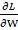。η是学习率。我们需要将其预定义为一个值，比如 0.01 或 0.001。等式中的`<-`表示右侧的值用于更新左侧的值。如等式 6.1 所示，SGD 是一种简单的方法，它在梯度方向上移动一定的距离。现在，我们将把`SGD`实现为 Python 中的一个类:

```
class SGD:
    def __init__ (self, lr=0.01):
        self.lr = lr
    def update(self, params, grads): 
        for key in params.keys():
            params[key] -= self.lr * grads[key]
```

这里，初始化时的参数`lr`是学习率。学习率作为实例变量保留。我们还将定义`update(params, grads)`方法，它在 SGD 中被反复调用。参数`params`和`grads`是字典变量(如目前为止神经网络的实现)。像`params['W1']`和`grads['W1']`一样，每个元素存储一个权重参数或者一个渐变。通过使用`SGD`类，您可以如下更新神经网络中的参数(以下代码是不运行的伪代码):

```
network = TwoLayerNet(...)
optimizer = SGD()
for i in range(10000):
    ...
    x_batch, t_batch = get_mini_batch(...)  # Mini-batch
    grads = network.gradient(x_batch, t_batch)
    params = network.params
    optimizer.update(params, grads)
    ...
```

这里出现的变量名`optimizer`，意思是“优化的人”在这里，SGD 扮演这个角色。`optimizer`变量负责更新参数。这里我们需要做的就是将关于参数和梯度的信息传递给优化器。

因此，单独实现优化的类有助于功能的模块化。例如，我们将很快实现另一种叫做`update(params, grads)`的优化技术。然后，我们可以通过将`optimizer = SGD()`语句改为`optimizer = Momentum()`来从 SGD 切换到 Momentum。

#### 注意

在许多深度学习框架中，实现了各种优化技术，并提供了一种机制，以便我们可以轻松地在它们之间切换。例如，在一个名为 Lasagne 的深度学习框架中，优化技术被实现为`updates.py`文件中的函数([http://github . com/Lasagne/Lasagne/blob/master/Lasagne/updates . py](http://github.com/Lasagne/Lasagne/blob/master/lasagne/updates.py))。用户可以从中选择所需的优化技术。

### SGD 的缺点

虽然 SGD 简单易行，但对于某些问题可能效率不高。为了讨论 SGD 的缺点，让我们考虑一个计算下列函数的最小值的问题:

|  | (6.2) |

等式 6.2 表示的函数形状看起来像一个在 x 轴方向拉伸的“碗”，如下图所示。实际上，方程 6.2 的轮廓线看起来像在 x 轴方向延伸的椭圆。

现在，让我们看看方程 6.2 所表示的函数的梯度。*图 6.2* 显示了梯度。这些梯度在 y 轴方向大，在 x 轴方向小。换句话说，y 轴方向的倾斜是陡峭的，而 x 轴方向的倾斜是平缓的。注意等式 6.2 的最小值的位置是`(x, y) = (0, 0)`，但是*图 6.2* 中的梯度在许多地方并不指向(0，0)方向。

让我们将 SGD 应用于具有下图所示形状的函数。它从(x，y)=(7.0，2.0)(初始值)开始搜索。*图 6.3* 显示了结果:


###### 图 6.1:图中的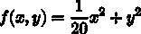(左)及其轮廓线(右)


###### 图 6.2: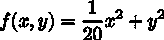的渐变

SGD 呈之字形移动，如下图所示。SGD 的缺点是，如果函数的形状不是各向同性的，也就是说，如果它被拉长，它的搜索路径就会变得低效。所以，我们需要一个比只在梯度方向移动的 SGD 更聪明的方法。SGD 搜索路径效率低下的根本原因是梯度没有指向正确的最小值:


###### 图 6.3:SGD 优化的更新路径-效率低，因为它以之字形移动到最小值(0，0)

为了改善 SGD 的缺点，我们将介绍三种可供选择的方法:Momentum、AdaGrad 和 Adam。我们将简要描述它们，并展示它们的等式和 Python 实现。

### 气势

动量与物理有关；它的意思是“运动量”动量技术由以下等式表示:

| 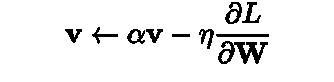 | (6.3) |
| T34 | (6.4) |

就像 SGD 一样，W 是要更新的权重参数，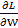是 W 的损失函数的梯度，η是学习速率。这里出现的一个新变量，v，就是物理学中的“速度”。方程 6.3 表示一个物理定律，说明一个物体在梯度方向上受到一个力，并被这个力加速。在 Momentum 中，更新函数的使用就像一个球在地上滚动一样，如下图所示:


###### 图 6.4:动量图像——一个球在地面的斜坡上滚动

方程 6.3 中的αv 项使物体在没有受到力的情况下逐渐减速(α值为 0.9)。这是地面或空气阻力产生的摩擦力。下面的代码展示了 Momentum 的实现(源代码位于`common/optimizer.py`):

```
class Momentum:
    def __ init __ (self,  lr=0.01,  momentum=0.9):
        self.lr = lr
        self.momentum = momentum 
        self.v = None
    def update(self, params, grads): 
        if self.v is None:
        self.v = {}
        for key, val in params.items(): 
            self.v[key] = np.zeros_like(val)
        for key in params.keys():
 self.v[key] = self.momentum*self.v[key] - self.lr*grads[key]
 params[key] += self.v[key]
```

实例变量`v`保留对象的速度。初始化时，`v`不保留任何内容。当调用`update()`时，它保留与字典变量相同结构的数据。剩下的实现很简单:它只实现等式 6.3 和 6.4。

现在，让我们用动量来解决方程 6.2 的优化问题。下图显示了结果。

如下图所示，更新路径就像一个球在碗中滚动一样。您可以看到，与 SGD 相比,“曲折度”有所降低。x 轴方向的力很小，但是物体总是受到同一个方向的力，并且不断地向同一个方向加速。另一方面，y 轴方向的力较大，但物体交替受到正负方向的力。它们互相抵消，所以 y 轴方向的速度不稳定。与 SGD 相比，这可以加速 x 轴方向上的运动，并减少锯齿形运动:


###### 图 6.5:通过动量优化的更新路径

### 阿达格勒

在神经网络训练中，`equation--`中学习`rate--η`的值很重要。如果太小，训练时间太长。如果过大，就会出现发散，无法实现正确的训练。

有一种学习率的有效技术叫做**学习率衰减**。随着训练的进行，它使用较低的学习速率。这种方法常用于神经网络训练。一个神经网络先学习“多”，逐渐学习“少”。

逐渐降低学习率等同于集体降低所有参数的学习率值。AdaGrad ( *John Duchi，Elad Hazan 和 Yoram Singer (2011):在线学习和随机优化的自适应次梯度方法。机器学习研究杂志 12，2011 年 7 月，2121–2159。*)是这种方法的高级版本。AdaGrad 为每个参数创建一个定制值。

AdaGrad 为训练自适应地调整参数的每个元素的学习率(AdaGrad 中的“Ada”来自“Adaptive”)。现在，我们将通过等式展示 AdaGrad 的更新方法:

|  | (6.5) |
|  | (6.6) |

就像 SGD 一样，W 是要更新的权重参数，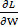是 W 的损失函数的梯度，η是学习速率。这里，出现了一个新变量 h。h 变量存储到目前为止的平方梯度值的和，如等式 6.5 所示(等式 6.5 中的≥表示数组元素之间的乘法)。在更新参数时，AdaGrad 通过乘以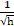来调整学习的规模。对于显著移动(即大量更新)的参数元素，学习率变得更小。因此，您可以通过逐渐降低显著移动的参数的学习率来降低每个参数元素的学习率。

#### 注意

AdaGrad 将所有过去的梯度记录为平方和。所以随着学习的推进，更新的程度变小。当无限地进行学习时，更新的程度变成 0，导致没有更新。RMSProp ( *Tieleman，t .，& Hinton，G. (2012):第 6.5 讲—RMSProp:将梯度除以其最近震级的移动平均值。COURSERA:用于机器学习的神经网络*方法解决了这个问题。它不会平均添加所有过去的渐变。它逐渐忘记过去的梯度并进行相加，以便清楚地反映关于新梯度的信息。这以指数方式减小了过去梯度的规模，这被称为“指数移动平均”

现在，让我们实现 AdaGrad。你可以如下实现 AdaGrad(源代码位于`common/optimizer.py`):

```
class AdaGrad:
    def __init__ (self, lr=0.01): 
        self.lr = lr
        self.h = None
    def update(self, params, grads): 
        if self.h is None:
        self.h = {}
        for key, val in params.items(): 
            self.h[key] = np.zeros_like(val)
for key in params.keys():
 self.h[key] += grads[key] * grads[key]
 params[key] -= self.lr * grads[key] / (np.sqrt(self.h[key]) + 1e-7)
```

注意最后一行加了一个小值`1e-7`。当`self.h[key]`包含`0`时，这可以防止被`0`除。在很多深度学习框架中，你可以把这个小值配置成一个参数，但是这里，用的是一个固定值`1e-7`。

现在，让我们用 AdaGrad 来解决方程 6.2 的优化问题。下图显示了结果:


###### 图 6.6:AdaGrad 优化的更新路径

上图中显示的结果表明，参数正在有效地向最小值移动。由于 y 轴方向的梯度较大，参数一开始会移动很多。与大运动成比例地进行调整，使得更新步长变小。因此，y 轴方向上的更新程度减弱，减少了锯齿形运动。

### 亚当

在动量中，参数根据物理定律移动，例如球在碗中滚动。AdaGrad 自适应地调整每个参数元素的更新步长。那么，当 Momentum 和 AdaGrad 这两种技术结合在一起时会发生什么呢？这是称为 Adam 的技术的基本思想(对 Adam 的这种解释是直观的，缺乏一些更好的技术细节。有关更详细的定义，请参见原文)。

Adam 是 2015 年提出的一项新技术。这个理论有点复杂。直观上，它就像是动量和阿达格拉德的结合体。通过结合这两种技术的优点，我们可以有效地搜索参数空间。超参数的“偏差修正”也是 Adam 的一个特点。更多详情请见原文( *Diederik Kingma 和 Jimmy Ba。(2014):亚当:一种随机优化的方法。arXiv:1412.6980[cs](2014 年 12 月)*。它在 Python 中实现为`common/optimizer.py`中的`Adam`类。

现在，让我们用 Adam 来解决方程 6.2 的优化问题。下图显示了结果。


###### 图 6.7:Adam 优化的更新路径

如图*图 6.7* 所示，Adam 的更新路径就像一个球在碗里滚动一样。运动类似于动量中的运动，但球的左右运动较小。这种优势是由学习率的自适应调整引起的。

#### 注意

亚当有三个超参数。首先是学习率(在文中以α出现)。其他的是主弯矩系数β1 和次弯矩系数β2。文章陈述了β1 的标准值为 0.9，β2 的标准值为 0.999，在很多情况下都是有效的。

### 我们应该使用哪种更新技术？

到目前为止，我们已经考虑了四参数更新技术。在这里，我们将比较他们的结果(源代码位于`ch06/optimizer_compare_naive.py`)。

如图*图 6.8* 所示，不同的技术使用不同的路径来更新参数。这张图片似乎显示 AdaGrad 是最好的，但请注意，结果因所解决的问题而异。自然地，结果也根据超参数的值(例如学习率)而变化:


###### 图 6.8:优化技术对比——SGD、Momentum、AdaGrad 和 Adam

到目前为止，我们已经研究了四种技术:SGD、Momentum、AdaGrad 和 Adam。但是我们应该使用哪个呢？不幸的是，目前还没有一种技术能够解决所有问题。每一个都有自己独特的特点和优势，这使得它比其他的更适合某些问题。因此，在特定的环境下，知道哪种技术最有效非常重要。

SGD 仍然在很多研究中使用。动量和阿达格拉德也值得一试。最近，许多研究人员和工程师似乎更喜欢亚当。这本书主要用 SGD 和 Adam。你可以尝试其他你喜欢的技术。

### 使用 MNIST 数据集比较更新技术

对于手写数字识别，我们将比较到目前为止我们描述的四种技术:SGD、Momentum、AdaGrad 和 Adam。让我们来探讨一下每种技术在训练过程中是如何发挥作用的。*图 6.9* 显示了结果(源代码位于`h06/optimizer_compare_mnist.py`):


###### 图 6.9:使用 MNIST 数据集比较四种更新技术——横轴表示学习的迭代次数，纵轴表示损失函数值

这个实验使用了一个五层的神经网络，每层有 100 个神经元。ReLU 被用作激活函数。

*图 6.9* 的结果显示其他技术比 SGD 学得快。似乎剩下的三种技术学得都差不多快。当我们仔细观察时，似乎阿达格拉德学得更快一些。在这个实验中，注意，根据学习速率的超参数和神经网络的结构(层数)，结果是不同的。然而，一般来说，其他三种技术可以比 SGD 学习得更快，有时可以获得更好的最终识别性能。

## 初始重量值

初始权重值在神经网络训练中尤其重要。设置什么值作为初始权值，往往决定了神经网络训练的成败。在本节中，我们将解释推荐的初始权重值，然后进行一个实验来检查它们是否能加速神经网络学习。

### 将初始权重值设置为 0 怎么样？

稍后，我们将研究一种称为权重衰减的技术，它可以减少过拟合并提高泛化性能。简而言之，权重衰减是一种减少权重参数值以防止过度拟合的技术。

如果我们希望权重较小，从尽可能小的初始值开始可能是一个好方法。这里，我们使用一个初始权重值，如`0.01 * np.random.randn(10, 100)`。这个小值是高斯分布乘以 0.01 生成的值，这是一个标准差为 0.01 的高斯分布。

如果我们希望权重值很小，那么将所有初始权重值设置为 0 怎么样？这是一个坏主意，因为它阻止我们正确地训练。

为什么初始权重值不应为 0？或者换句话说，为什么权重不应该是统一的值？嗯，因为所有的权重值在反向传播中都是统一更新的(以同样的方式)。因此，假设在两层神经网络中，第 1 层和第 2 层的权重为 0。然后，在前向传播中，相同的值被传播到第 2 层中的所有神经元，因为输入层的权重是 0。当对第 2 层中的所有神经元输入相同的值时，第 2 层中的所有权重在反向传播中被类似地更新(请记住“乘法节点中的反向传播”)。因此，权重被更新为相同的值，并变成对称值(重复值)。正因为如此，拥有许多权重是没有意义的。为了防止权重不一致或破坏其对称结构，需要随机初始值。

### 隐藏层中激活的分布

观察隐藏层中的激活分布(这里指的是激活函数之后的输出数据，尽管一些文献将层间流动的数据称为“激活”)提供了大量信息。这里，我们将进行一个简单的实验，看看初始权重值如何改变隐藏层的激活。我们将一些随机生成的数据输入到一个五层神经网络中(使用 sigmoid 函数作为激活函数),并在直方图中显示每层中激活的数据分布。这个实验是基于斯坦福大学的 CS231n ( *CS231n:用于视觉识别的卷积神经网络*([http://cs231n.github.io/](http://cs231n.github.io/)))课程。

实验的源代码位于`ch06/weight_init_activation_histogram.py`。以下是该代码的一部分:

```
import numpy as np
import matplotlib.pyplot as plt
def sigmoid(x):
    return 1 / (1 + np.exp(-x))
x = np.random.randn(1000, 100) # 1000 data
node_num = 100 # Number of nodes (neurons) in each hidden layer
hidden_layer_size = 5 # Five hidden layers exist
activations = {}	# The results of activations are stored here
for i in range(hidden_layer_size):
    if i != 0:
        x = activations[i-1]
 w = np.random.randn(node_num, node_num) * 1
    z = np.dot(x, w)
    a = sigmoid(z) # Sigmoid function!
    activations[i] = a
```

这里有五层，每层有 100 个神经元。作为输入数据，随机产生 1000 个具有高斯分布的数据，并提供给五层神经网络。一个 sigmoid 函数被用作激活函数，每一层的激活结果被存储在`activations`变量中。请注意体重计。这里使用的是标准差为 1 的高斯分布。这个实验的目的是通过改变这个尺度(标准差)来观察`activations`的分布是如何变化的。现在，让我们用柱状图展示存储在`activations`中的每一层的数据:

```
# Draw histograms
for i, a in activations.items( ): 
    plt.subplot(1, len(activations), i+1)
    plt.title(str(i+1) + "-layer")
    plt.hist(a.flatten(), 30, range=(0,1))
plt.show()
```

执行此代码将创建下图所示的直方图。

该图像显示每层的激活主要是 0 和 1。这里使用的 sigmoid 函数是一个 S 曲线函数。当 sigmoid 函数的输出接近 0(或 1)时，微分值接近 0。因此，当数据主要是 0 和 1 时，反向传播中的梯度值变小，直到它们消失。这是一个叫做**渐变消失**的问题。在深度学习中，有大量的层，梯度消失可能是一个更严重的问题。

接下来，让我们进行同样的实验，但这次砝码的标准偏差为 0.01。要设置初始权重值，您需要修改前面的代码，如下所示:

```
# w = np.random.randn(node_num, node_num) * 1
w = np.random.randn(node_num, node_num) * 0.01
```


###### 图 6.10:当标准差为 1 的高斯分布用于初始权重值时，每层的激活分布

观察结果。下图显示了使用标准差为 0.01 的高斯分布时各层的激活分布:


###### 图 6.11:当标准偏差为 0.01 的高斯分布用于初始权重值时，每层激活的分布

现在，激活集中在 0.5 左右。与前面的例子不同，它们不会偏向 0 和 1。不会出现梯度消失的问题。然而，当激活有偏差时，就其表示而言，它会导致一个大问题。如果多个神经元输出几乎相同的值，那么多个神经元的存在就没有任何意义。例如，当 100 个神经元输出几乎相同的值时，一个神经元可以代表几乎相同的东西。因此，有偏差的激活会引起问题，因为表示是有限的。

#### 注意

每一层中激活的分布需要适当分布。这是因为，当适度多样化的数据在每一层流动时，神经网络可以有效地学习。另一方面，当有偏差的数据流时，由于梯度消失和“有限的表示”，训练可能不会进行得很好

接下来，我们将使用 Xavier Glorot 等人(*Xavier GLO rot and yo shua Ben gio(2010):了解训练深度前馈神经网络的难度)的论文中推荐的初始权重值。《人工智能与统计国际会议论文集》(AISTATS2010)。人工智能和统计学会*。这被称为“Xavier 初始化”目前，Xavier 初始化器通常用于普通的深度学习框架中。例如，在 Caffe 框架中，您可以为初始权重设置指定`xavier`参数，以使用 Xavier 初始化器。

Xavier 的论文获得了适当的权重比例，以便各层的激活以相似的方式传播。得出的结论是，当前一层中的节点数为 n 时，应使用标准偏差为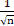d 的分布(Xavier 的论文建议设置的值应同时考虑前一层中输入节点的数量和下一层中输出节点的数量。但是，在 Caffe 之类的框架实现中，为了简化，只根据上一层的输入节点来计算值，如下所述)。这可以从下图中看出:


###### 图 6.12: Xavier 初始化器–当前一层中的 n 个节点被连接时，具有标准偏差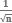的分布被用于初始值

当使用 Xavier 初始化器时，由于前一层中的节点数量较大，所以为目标节点的初始值设置的权重较小。现在，让我们使用 Xavier 初始化器来完成一些实验。您只需修改初始权重值，如下所示(此处简化了实现，因为所有层中的节点数都是 100):

```
node_num = 100 # Number of nodes in the previous layer
w = np.random.randn(node_num, node_num) / np.sqrt(node_num)
```


###### 图 6.13:当 Xavier 初始化器被用作初始权重值时，每一层的激活分布

上图显示了使用 Xavier 初始化器时的结果。它显示分布分布更广，尽管更高层具有更扭曲的形状。我们可以期望训练被有效地进行，因为在每一层中流动的数据被适当地展开，并且 sigmoid 函数的表示不受限制。

#### 注意

此外，上层的分布在形状上略有失真。当使用`tanh`函数(双曲线函数)代替`sigmoid`函数时，扭曲的形状得到改善。实际上，当使用`tanh`函数时，分布将呈钟形。`tanh`函数是一个 S 曲线函数，类似于`sigmoid`函数。`tanh`函数关于原点(0，0)对称，而`sigmoid`函数关于`(x, y) = (0, 0.5)`对称。最好使用`tanh`功能，使激活功能关于原点对称。

### ReLU 的初始重量值

Xavier 初始化器基于激活函数是线性的假设。Xavier 初始化器是合适的，因为`sigmoid`和`tanh`函数是对称的，可以看作是围绕它们中心的线性函数。同时，对于 ReLU，建议使用初始值。这就是众所周知的 he 初始化式，是由 He 和 et 推荐的。艾尔。*(何，，，任，(2015):深入研究整流器:在 ImageNet 分类上超越人类水平的表现。在 1026–1034 年*)。当前一层中的节点数量为 n 时，he 初始化器使用标准偏差为的高斯分布。当我们考虑 Xavier 初始化器为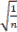时，我们可以(直观地)假设系数必须加倍以提供更大的分布，因为对于 ReLU，负面积为 0。

让我们看看当 ReLU 被用作激活函数时激活的分布。我们将考虑使用标准差为 0.01 的高斯分布(即`std=0.01`)、Xavier 初始值设定项、he 初始值设定项(专门用于 ReLU ( *图 6.14* )后的三个实验结果。

结果表明`std=0.01`每一层的激活都很小(平均分布如下:第 1 层:0.0396，第 2 层:0.00290，第 3 层:0.000197，第 4 层:1.32e-5，第 5 层:9.46e-7)。当小数据流经神经网络时，反向传播中的权重梯度也很小。这是一个严重的问题，因为培训将很难推进。

接下来，让我们看看使用 Xavier 初始化器的结果。这表明随着层变得更深，偏差逐渐变大——激活也是如此。渐变消失在训练的时候会是个问题。另一方面，对于 he 初始化器，高斯分布在各层中的分布是相似的。即使图层更深，数据的分布也是相似的。因此，我们可以预期适当的值也会流向反向传播。

综上所述，使用 ReLU 作为激活函数时，使用 he 初始化器，对于`sigmoid`、`tanh`等 S 曲线函数，使用 Xavier 初始化器。截至撰写本文时，这是最佳实践。

### 使用 MNIST 数据集比较权重初始化器

让我们用实际数据来看看不同权重初始化器对神经网络学习的影响。我们将在实验中使用`std=0.01`、Xavier 初始化器和 he 初始化器(源代码位于`ch06/weight_init_compare.py`)。下图显示了结果:


###### 图 6.14:当 ReLU 被用作激活函数时，权重初始化器对激活分布的改变

本实验采用五层神经网络(每层 100 个神经元)，以 ReLU 为激活函数。下图中显示的结果表明没有对`std=0.01`进行学习。这是因为小值(接近 0 的数据)向前传播，正如我们在前面的激活分布中观察到的。因此，要获得的梯度在反向传播中也很小，导致对权重的更新很少。另一方面，对于 Xavier 和 he 初始化器，训练被平滑地执行。下图还显示了 he 初始化器的训练进展很快:


###### 图 6.15:使用 MNIST 数据集比较权重初始值——横轴表示训练的迭代次数，纵轴表示损失函数值

正如我们所见，初始权重值在神经网络训练中非常重要。他们往往决定了自己的成败。尽管初始权重值的重要性有时会被忽略，但起始(初始)值对任何事情都很重要。

### 批量归一化

在上一节中，我们观察了每一层中激活的分布。我们了解到，适当的初始权重值为每一层的激活分布提供了适当的分布，从而实现了平滑的训练。那么，如何“强有力地”调整激活的分布，以便在每一层都有一个适当的传播呢？

这种技术基于批量归一化的思想( *Sergey Ioffe 和 Christian Szegedy (2015):批量归一化:通过减少内部协变量移位来加速深度网络训练。arXiv:1502.03167[cs](2015 年 2 月)*。

### 批量归一化算法

批次正常化(也称为批次规范)最早是在 2015 年提出的。虽然批处理规范是一项新技术，但它已被许多研究人员和工程师广泛使用。事实上，在围绕机器学习的竞赛中，batch norm 经常取得优异的成绩。

批量定额由于以下优点而吸引了很多关注:

*   可以加速学习(可以提高学习率)。
*   它不依赖于初始权重值(您不需要对初始值保持谨慎)。
*   它减少了过度拟合(它减少了辍学的必要性)。

第一个优势特别吸引人，因为深度学习需要大量时间。使用 batch norm，不需要担心初始权重值，由于它减少了过度拟合，它从深度学习中消除了这种焦虑的原因。

正如我们之前所描述的，批处理规范的目的是调整每一层中激活的分布，以便它有一个适当的分布。为此，将对数据分布进行规范化的层作为批处理规范化层(也称为批处理规范层)插入到神经网络中，如下图所示:


###### 图 6.16:使用批处理规范化的神经网络示例(批处理规范层以灰色显示)

顾名思义，batch norm 将用于训练的每个小批量标准化。具体来说，它对数据进行标准化，使平均值为 0，方差为 1。下面的等式说明了这一点:

| 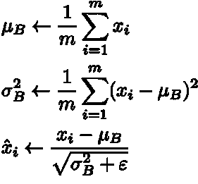 | (6.7) |

这里，一组 m 个输入数据 b 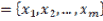被视为小批量，并计算其平均值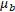和方差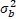。对输入数据进行归一化处理，使其平均值为 0，对于适当的分布，其方差为 1。在方程 6.7 中，ε是一个小值(如 10e-7)。这可以防止被 0 除。

等式 6.7 简单地将小批量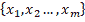的输入数据转换为平均值为 0、方差为 1 的数据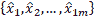。通过在激活函数之前(或之后)插入这个过程(参见( *Sergey Ioffe 和 Christian Szegedy (2015):批量归一化:通过减少内部协变量移位来加速深度网络训练)。arXiv:1502.03167[cs](2015 年 2 月)*)和( *Dmytro Mishkin 和 Jiri Matas (2015):你需要的只是一个好的 init。arXiv:1511.06422[cs](2015 年 11 月)*)对于批量归一化应该插在激活函数之前还是之后的讨论(和实验)，可以减少数据的分布偏倚。

此外，批处理规范层使用特殊的比例和偏移来转换规范化数据。下面的等式显示了这种转换:

|  | (6.8) |

这里，γ和β是参数。它们从γ = 1 和β = 0 开始，并将通过训练调整到适当的值。

这就是批量定额的算法。该算法在神经网络中提供前向传播。通过使用计算图，如*第 5 章*、*反向传播*所述，我们可以如下表示批量定额。

关于批范数如何推导反向传播，这里就不赘述了，因为有点复杂。当您使用计算图形(如下图所示)时，您可以相对容易地导出批次范数的反向传播。弗雷德里克·克拉泽特(Frederik Kratzert)的博客*了解通过批处理规范化层的反向传递*([https://krat zert . github . io/2016/02/12/Understanding-the-gradient-flow-through-the-Batch-Normalization-Layer . html](https://kratzert.github.io/2016/02/12/understanding-the-gradient-flow-through-the-batch-normalization-layer.html))对此进行了详细的描述。有兴趣的可以参考一下:


###### 图 6.17:批量标准化的计算图

#### 注意

*图 6.17* 引自参考文献， *Frederik Kratzert 的博客《了解反向通过批处理规范化层》*([https://krat zert . github . io/2016/02/12/Understanding-the-gradient-flow-through-the-Batch-Normalization-Layer . html](https://kratzert.github.io/2016/02/12/understanding-the-gradient-flow-through-the-batch-normalization-layer.html))。

### 评估批量标准化

现在，让我们使用批处理规范层进行一些实验。首先，我们将使用 MNIST 数据集来查看在有和没有批处理范数层的情况下学习的进度如何变化(源代码可以在`ch06/batch_norm_test.py`找到)。*图 6.18* 显示了结果。

*图 6.18* 显示批量定额加速训练。接下来，让我们看看当使用初始值的各种标度时，训练的进度如何变化。*图 6.19* 包含显示初始权重值的标准偏差改变时训练进度的图表。

这表明批处理规范在几乎所有情况下都加速了训练。事实上，当不使用批范数时，如果没有一个好的初始值尺度，训练根本不会前进。

正如我们所看到的，使用批处理范数可以加速训练，并为初始权重值提供鲁棒性(“对初始值的鲁棒性”意味着对它们有一点依赖)。批处理规范具有如此奇妙的特性，在很多情况下都会发挥积极的作用。

## 正规化

**过拟合**往往给机器学习问题制造困难。在过度拟合中，模型与训练数据拟合得太好，无法正确处理训练数据中不包含的其他数据。机器学习旨在概括性能。期望模型正确地识别不包含在训练数据中的未知数据。虽然您可以通过这种方式创建复杂且有代表性的模型，但减少过度拟合也很重要:


###### 图 6.18:批量定额的效果——批量定额加速学习

### 过度拟合

过度拟合的两个主要原因如下:

*   该模型参数多，具有代表性。
*   训练数据不足。

这里，我们将通过提供这两个原因来生成过度拟合。在 MNIST 数据集中的 60，000 条训练数据中，只提供了 300 条，并且使用了七层网络来增加网络的复杂性。它每层有 100 个神经元。ReLU 用作激活功能:


###### 图 6.19:实线显示使用批次标准的结果，而虚线显示不使用批次标准的结果-每个图表的标题都表示初始重量值的标准偏差

下面是这个实验的部分代码(源文件在`ch06/overfit_weight_decay.py`)。首先，代码加载数据:

```
(x_train, t_train), (x_test, t_test) = load_mnist(normalize=True)
# Reduce learning data to reproduce overfitting
x_train = x_train[:300] 
t_train = t_train[:300]
```

下面的代码进行训练。这里，为所有训练数据和所有测试数据的每个时期计算识别准确度:

```
network = MultiLayerNet(input_size=784, hidden_size_list=[100, 100, 100, 100, 100, 100], output_size=10)
optimizer = SGD(lr=0.01) # Use SGD with the learning rate of 0.01 to update the parameters
max_epochs = 201
train_size = x_train.shape[0]
batch_size = 100
train_loss_list = []
train_acc_list = []
test_acc_list = []
iter_per_epoch = max(train_size / batch_size, 1
epoch_cnt = 0
for i in range(1000000000):
    batch_mask = np.random.choice(train_size, batch_size)
    x_batch = x_train[batch_mask]
    t_batch = t_train[batch_mask]
    grads = network.gradient(x_batch, t_batch)
    optimizer.update(network.params, grads)
    if i % iter_per_epoch == 0:
        train_acc = network.accuracy(x_train, t_train)
        test_acc = network.accuracy(x_test, t_test)
        train_acc_list.append(train_acc)
        test_acc_list.append(test_acc)
        epoch_cnt += 1
        if epoch_cnt >= max_epochs:
            break
```

`train_acc_list`和`test_acc_list`列表存储每个时期的识别精度。一个时期表示所有的训练数据都已被使用。让我们根据这些列表来画图表(`train_acc_list`和`test_acc_list`)。下图显示了结果。

使用训练数据测量的识别准确度在 100 个时期后几乎达到 100%，但是在测试数据上的识别准确度远低于 100%。这些巨大的差异是由过度拟合训练数据造成的。此图显示模型无法处理未在培训中正确使用的一般数据(测试数据):


###### 图 6.20:训练数据(train)和测试数据(test)的识别精度的转变

### 体重衰减

**重量衰减**技术通常用于减少过度拟合。它通过在训练期间对大重量施加惩罚来避免过度适应。当权重参数取大值时，通常会发生过度拟合。

如前所述，神经网络训练的目的是降低损失函数值。例如，您可以将权重的平方范数(L2 范数)添加到损失函数中。然后，你可以防止重量过大。当权重为 W 时，权重衰减的 L2 范数为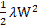。这个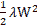被添加到损失函数中。这里，λ是控制正则化强度的超参数。如果将λ设置为较大的值，则可以对较大的权重施加更强的惩罚。开头的为调节常数，使的微分为λW。

权重衰减将添加到所有权重的损失函数中。因此，当计算权重的梯度时，正则化项的微分λW 被添加到反向传播的结果中。

L2 范数是每个元素的平方和。除了 L2 范数，还存在 L1 和 L ∞范数。L1 范数是绝对值的和，即|w1| + |w2| +...+ |wn|。L ∞范数也称为最大范数。它是所有元素中绝对值最大的。你可以使用这些规范中的任何一个作为正则项。每一种都有自己的特点，但是我们在这里只实现 L2 规范，因为它是最常用的。

现在，让我们做一个实验。我们将把λ= 0.1 的重量衰减应用于前面的实验。下图显示了结果(支持重量衰减的网络位于`common/multi_layer_net.py`，实验的代码位于`ch06/overfit_weight_decay.py`):


###### 图 6.21:当使用权重衰减时，训练数据(train)和测试数据(test)的识别准确度的转变

上图显示了训练数据和测试数据的识别精度不同，但这种差异小于图 6.20 中*所示的差异，图中未使用权重衰减。这表明过度拟合减少了。注意，训练数据的识别准确度没有达到 100% (1.0)。*

### 辍学

上一节描述了重量衰减技术。它将权重的 L2 范数添加到损失函数中，以减少过拟合。权重衰减易于实现，可以在一定程度上减少过拟合。然而，随着神经网络模型变得更加复杂，权重衰减通常是不够的。这就是当退出技术( *N. Srivastava，G. Hinton，A. Krizhevsky，I. Sutskever，R. Salakhutdinov (2014):退出:防止神经网络过拟合的简单方法。《机器学习研究杂志》，第 1929–1958 页，2014 年*)经常使用。

辍学在训练过程中随机擦除神经元。在训练过程中，它随机选择隐藏层中的神经元来删除它们。如下图所示，被擦除的神经元不传输信号。在训练期间，每次数据流动时，随机选择要擦除的神经元。在测试期间，所有神经元的信号被传播。每个神经元的输出乘以训练期间被擦除的神经元的比率:


###### 图 6.22:辍学的概念

#### 注意

*图 6.22* 引自参考文献， *N. Srivastava，G. Hinton，A. Krizhevsky，I. Sutskever，R. Salakhutdinov (2014):辍学:防止神经网络过拟合的简单方法。《机器学习研究杂志》第 1929–1958 页，2014 年*。

左图显示了一个普通的神经网络，而右图显示了一个应用了 dropout 的网络。Dropout 随机选择神经元，并将其擦除，以停止后续信号的传输。

现在，让我们实现辍学。这里强调实现的简单性。如果在训练期间进行了适当的计算，我们只需要通过正向传播来传输数据(而不增加被擦除神经元的速率)。这种实现在深度学习框架中进行。例如，为了有效实现，在 Chainer 框架中实现的 dropout 可能是有用的:

```
class Dropout:
    def __init__ (self, dropout_ratio=0.5):
        self.dropout_ratio = dropout_ratio
        self.mask = None
    def forward(self, x, train_flg=True): 
        if  train_flg:
            self.mask = np.random.rand(*x.shape) > self.dropout_ratio
            return x * self.mask
        else:
            return x * (1.0 - self.dropout_ratio)
    def backward(self, dout):
        return dout * self.mask
```

请注意，在每次正向传播中，要删除的神经元作为`False`存储在`self.mask`中。`self.mask`随机生成一个与`x`形状相同的数组，当元素的值大于`dropout_ratio`时，将元素设置为`True`。反向传播中的行为与 ReLU 中的行为相同。如果一个神经元在正向传播中被传递一个信号，它在反向传播中传递接收到的信号而不改变它。如果神经元在正向传播中没有传递信号，它会在反向传播中停止接收信号。

我们将使用 MNIST 数据集来验证辍学的影响。源代码可以在`ch06/overfit_dropout.py`中找到。它使用`Trainer`类来简化实现。

`Trainer`类在`common/trainer.py`中实现。它进行本章中迄今为止已经进行过的网络培训。详情请参见`common/trainer.py`和`ch06/overfit_dropout.py`。

为了对 dropout 进行实验，我们将使用一个七层网络(其中每层有 100 个神经元，ReLU 用作激活函数)，与前面的实验一样。其中一个实验会用到 dropout，而另一个不会。下图显示了结果。

正如我们所看到的，使用 dropout 减少了训练数据和测试数据的识别精度之间的差异。也表明训练数据的识别准确率没有达到 100%。因此，即使在典型网络中，也可以使用压差来减少过拟合:


###### 图 6.23:左边的图像显示了没有辍学的实验，而右边的图像显示了辍学的实验(dropout_rate=0.15)

#### 注意

在机器学习中，通常使用集成学习，其中多个模型分别学习，并通过预测对其多个输出进行平均。例如，当我们在神经网络中使用它时，我们准备五个结构相同(或相似)的网络，并对每个网络进行训练。然后，我们对测试期间的五个输出进行平均，以获得结果。实验表明，集成学习将神经网络的识别精度提高了几个百分点。

集成学习接近于辍学。在 dropout 中训练时随机擦除神经元可以被解释为每次都提供不同的模型来学习数据。在预测时，神经元的输出乘以擦除率(例如 0.5)来对模型进行平均。因此，我们可以说，辍学模拟一个网络中的集成学习。

## 验证超参数

神经网络使用许多超参数，以及权重和偏差等参数。这里的超参数包括每层神经元的数量、批量大小、更新参数的学习速率和权重衰减。将超参数设置为不适当的值会降低模型的性能。这些超参数的值非常重要，但是确定它们通常需要大量的反复试验。本节介绍如何尽可能有效地搜索超参数值。

### 验证数据

在我们目前使用的数据集中，训练数据和测试数据是分开的。训练数据用于训练网络，而测试数据用于评估泛化性能。因此，您可以确定网络是否仅符合训练数据(即是否出现过拟合)以及泛化性能有多大。

我们将使用各种超参数设置进行验证。请注意，您不得使用测试数据来评估超参数的性能。这非常重要，但经常被忽视。

那么，为什么不能用测试数据来评价超参数的性能呢？嗯，如果我们用测试数据来调整超参数，超参数值会过度拟合测试数据。换句话说，它使用测试数据来检查超参数值是“好的”，因此调整超参数值，使它们只适合测试数据。这里，模型可能提供较低的泛化性能，并且不能拟合其他数据。

因此，我们需要使用验证数据(称为**验证数据**)来调整它们。该验证数据用于评估我们的超参数的质量。

训练数据用于学习参数(权重和偏差)。验证数据用于评估超参数的性能。在训练结束时使用测试数据(理想情况下一次)来检查泛化性能。

一些数据集分别提供训练数据、验证数据和测试数据。有些只提供训练数据和测试数据，有些只提供一种类型的数据。在这种情况下，您必须手动分离数据。对于 MNIST 数据集，获取验证数据的最简单方法是预先分离 20%的训练数据，并将其用作验证数据。以下代码说明了这一点:

```
(x_train, t_train), (x_test, t_test) = load_mnist()
# Shuffle training data
x_train, t_train = shuffle_dataset(x_train,  t_train)
# Separate validation data
validation_rate = 0.20
validation_num = int(x_train.shape[0] * validation_rate)
x_val = x_train[:validation_num]
t_val = t_train[:validation_num]
x_train = x_train[validation_num:]
t_train = t_train[validation_num:]
```

这里，在分离训练数据之前，输入数据和标记数据被混洗。这是因为某些数据集可能包含有偏差的数据(例如，数字“0”到“10”按此顺序排列)。`shuffle_dataset`函数使用`np.random.shuffle`并包含在`common/util.py`中。

接下来，让我们使用验证数据来看看用于优化超参数的技术。

### 优化超参数

优化超参数时，重要的是逐渐缩小“好”超参数值的范围。为此，我们将初始设置一个较宽的范围，从该范围中随机选择超参数(采样)，并使用采样值来评估识别精度。接下来，我们将重复这些步骤几次，并观察识别准确度的结果。根据结果，我们将缩小“好的”超参数值的范围。通过重复这个过程，我们可以逐渐限制适当的超参数的范围。

据报道，搜索前的随机采样比系统搜索(如网格搜索)提供更好的结果，以优化神经网络中的超参数(*James Berg stra and yo shua beng io(2012):超参数优化的随机搜索)。《机器学习研究杂志》第 13 期，2012 年 2 月，第 281–305 页*。这是因为不同的超参数对最终识别精度的影响程度不同。

指定“广泛的”超参数范围是有效的。我们将以“10 的幂”指定范围，例如从 0.001(103)到 1，000 (103)(这也称为“以对数标度指定”)。

请注意，优化超参数时，深度学习需要花费大量时间(甚至几天或几周)。所以，任何看起来不合适的超参数，在寻找的时候都必须抛弃。当优化超参数时，减小用于训练的历元的大小以缩短一次评估所花费的时间是有效的。我们之前讨论过超参数的优化。下面总结了这次讨论:

**第 0 步**

指定超参数的范围。

**第一步**

从范围内随机抽取超参数样本。

**第二步**

使用在*步骤 1* 中采样的超参数值进行训练，并使用验证数据来评估识别准确度(设置小时期)。

**第三步**

重复*步骤 1* 和 *2* 一定次数(如 100 次)并根据识别精度的结果缩小超参数的范围。当范围缩小到一定程度时，从中选择一个超参数值。这是一种优化超参数的实用方法。

#### 注意

但是，你可能会觉得这种做法是工程师的“智慧”而不是科学。如果你需要更精确的技术来优化超参数，你可以使用**贝叶斯优化**。它很好地利用了数学理论，如贝叶斯定理，以提供更严格和更有效的优化。详见论文*机器学习算法的实用贝叶斯优化* ( *Jasper Snoek，Hugo Larochelle，和 Ryan P. Adams (2012):机器学习算法的实用贝叶斯优化。在 f .佩雷拉，C. J. C .布尔吉斯，l .博图，& K. Q .温伯格编辑。神经信息处理系统进展。柯伦联合公司，2951–2959 年*。

### 实施超参数优化

现在，让我们使用 MNIST 数据集来优化一些超参数。我们将寻找两个超参数:学习率和重量衰减率。重量衰减率控制重量衰减的强度。这个问题和解决方案是基于斯坦福大学的 *CS231n* ( *CS231n:用于视觉识别的卷积神经网络*([http://cs231n.github.io/](http://cs231n.github.io/)))课程。

如前所述，超参数通过从对数标度的范围内随机采样来验证，例如从 0.001(103)到 1，000 (103)。我们可以用 Python 把这个写成`10 ** np.random.uniform(-3, 3)`。本实验将从 108 到 104 的重量衰减率范围和 106 到 102 的学习率范围开始。在这种情况下，我们可以将超参数的随机采样写为:

```
weight_decay = 10 ** np.random.uniform(-8, -4)
lr = 10 ** np.random.uniform(-6, -2)
```

这里，超参数是随机采样的，采样值用于训练。然后，通过使用各种超参数值重复训练几次，以找到合适的超参数存在的位置。这里，省略了实现的细节，仅示出了结果。优化超参数的源代码位于`ch06/hyperparameter_optimization.py`。

当重量衰减率的范围为 108 至 104，学习率的范围为 106 至 102 时，我们得到以下结果。在这里，我们可以看到学习验证数据的转变，按照高识别准确率的降序排列:


###### 图 6.24:实线表示验证数据的识别精度，而虚线表示训练数据的识别精度

这标志着培训从`Best-1`顺利推进到`Best-5`。我们来检查一下`Best-1`到`Best-5`的超参数值(即学习率和重量衰减率)。这些是结果:

```
Best-1 (val acc:0.83) | lr:0.0092, weight decay:3.86e-07
Best-2 (val acc:0.78) | lr:0.00956, weight decay:6.04e-07
Best-3 (val acc:0.77) | lr:0.00571, weight decay:1.27e-06
Best-4 (val acc:0.74) | lr:0.00626, weight decay:1.43e-05
Best-5 (val acc:0.73) | lr:0.0052, weight decay:8.97e-06
```

这里，我们可以看到，当学习率为 0.001 至 0.01，重量衰减率为 108 至 106 时，学习进展良好。因此，观察到训练可能成功的超参数的范围缩小了值的范围。您可以在缩小的范围内重复相同的步骤。因此，您可以缩小存在适当超参数的范围，并在某个阶段选择每个最终超参数。

## 总结

本章描述了用于神经网络训练的一些重要技术。如何更新参数、如何指定初始权重值、批量标准化和删除都是现代神经网络中使用的基本技术。这里描述的技术经常用于最先进的深度学习。在本章中，我们了解了以下内容:

*   四种著名的参数更新方法:Momentum、AdaGrad、Adam 和 SGD。
*   如何指定初始权重值，如果我们希望正确训练，这是非常重要的。
*   Xavier 初始值设定项和 he 初始值设定项，作为初始权重值有效。
*   批量标准化加速了训练，并为初始权重值提供了鲁棒性。
*   权重衰减和丢失是用于减少过拟合的正则化技术。
*   为了寻找好的超参数，逐渐缩小合适值的范围是一种有效的方法。