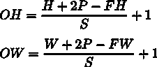
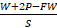
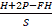

<title>Chapter_7_SMP_ePub</title>

# 7。卷积神经网络

本章介绍**卷积神经网络**(**CNN**)。CNN 在 AI 中无处不在，包括图像识别和语音识别。本章将详细介绍 CNN 的机制以及如何用 Python 实现它们。

## 整体架构

首先，我们来看看 CNN 的网络架构。你可以通过组合不同的层来创建一个 CNN，就像我们目前看到的神经网络一样。然而，CNN 也有其他层:卷积层和池层。我们将在下面的章节中详细介绍卷积层和池层。本节描述了如何组合各层来创建 CNN。

在我们目前看到的神经网络中，相邻层的神经元都是相连的。这些层被称为**全连接**层，我们将它们实现为仿射层。例如，您可以使用仿射层创建一个由五个完全连接的层组成的神经网络，如图*图 7.1* 所示。

如*图 7.1* 所示，激活函数的 ReLU 层(或 Sigmoid 层)遵循全连接神经网络中的仿射层。这里，在四对**仿射–ReLU**层之后，是仿射层，这是第五层。最后，Softmax 层输出最终结果(概率):


###### 图 7.1:由完全连接的层(仿射层)组成的样本网络

那么，CNN 有什么样的架构呢？*图 7.2* 显示了一个 CNN 示例:


###### 图 7.2:示例 CNN–添加卷积和池层(它们显示为灰色矩形)

如图*图 7.2* 所示，CNN 有额外的卷积和池层。在 CNN 中，层按照**卷积 ReLU(池化)**的顺序连接(池化层有时会被省略)。我们可以把之前的**仿射-ReLU**联系，看成是用“卷积-ReLU-(池化)”代替

在*图 7.2* 的 CNN 中，注意靠近输出的层是之前的“Affine–ReLU”对，而最后输出的层是之前的“Affine–soft max”对。这是一个普通 CNN 经常看到的结构。

## 卷积层

有一些 CNN 特有的术语，比如 padding 和 stride。与以前的全连接网络不同，流经 CNN 中每一层的数据都是有形状的数据(如三维数据)。所以，第一次了解 CNN，你可能会觉得很难。这里，我们将研究 CNN 中使用的卷积层的机制。

### 全连接层的问题

到目前为止我们看到的全连接神经网络使用的都是全连接层(仿射层)。在全连接层中，相邻层的所有神经元都是连接的，输出的数目可以任意确定。

然而，全连接层的问题是数据的形状被*忽略了*。例如，当输入数据是图像时，它通常具有三维形状，由高度、宽度和通道尺寸确定。但是，当三维数据被提供给完全连接的层时，它必须被转换成一维平面数据。在之前用于 MNIST 数据集的示例中，输入图像的形状为 1、28、28 (1 个通道，28 个像素高，28 个像素宽)，但元素排列成一行，生成的 784 条数据提供给第一个仿射图层。

假设图像具有三维形状，并且该形状包含重要的空间信息。识别这些信息的基本模式可能隐藏在三维形状中。空间上靠近的像素具有相似的值，RBG 通道彼此紧密相关，而远处的像素不相关。但是，完全连接的层会忽略形状，并将所有输入数据视为等效神经元(具有相同维数的神经元)，因此它不能使用关于形状的信息。

另一方面，卷积层保持形状。对于图像，它将输入数据作为三维数据接收，并将三维数据输出到下一层。因此，CNN 可以正确理解具有形状的数据，例如图像。

在 CNN 中，卷积层的输入/输出数据有时被称为**特征图**。卷积层的输入数据称为**输入特征图**，而卷积层的输出数据称为**输出特征图**。在本书中，*输入/输出数据*和*特征图*将互换使用。

### 卷积运算

在卷积层中执行的处理被称为“卷积运算”,相当于图像处理中的“滤波运算”。让我们看一个例子(*图 7.3* )来理解卷积运算:


###### 图 7.3:卷积运算–⊛符号表示卷积运算

如图*图 7.3* 所示，卷积运算对输入数据进行过滤。在此示例中，输入数据的形状具有高度和宽度，过滤器的形状也是如此。在本例中，当我们将数据和过滤器的形状指定为(高度，宽度)时，输入大小为(4，4)，过滤器大小为(3，3)，输出大小为(2，2)。一些文献使用“内核”一词来表示“过滤器”

现在，让我们分解在*图 7.3* 中所示的卷积运算中执行的计算。*图 7.4* 显示了卷积运算的计算过程。

当滤波器窗口以固定间隔移动时，卷积运算被应用于输入数据。这里的窗口表示图 7.4 中*所示的灰色 3x3 截面。如图*图 7.4* 所示，滤波器的元素和输入的相应元素在每个位置相乘并求和(这种计算有时被称为**乘累加运算**)。结果存储在输出的相应位置。卷积运算的输出可以通过在所有位置执行该过程来获得。*

完全连接的神经网络具有偏差和权重参数。在 CNN 中，过滤器参数对应于先前的“权重”它也有偏见。*的卷积运算图 7.3* 显示了应用滤波器的阶段。*图 7.5* 显示了卷积运算的处理流程，包括偏差:


###### 图 7.4:卷积运算的计算过程


###### 图 7.5:卷积运算中的偏差–应用过滤器后，固定值(偏差)被添加到元素中

如图*图 7.5* 所示，应用滤波器后，数据中会增加一个偏置项。这里，偏差总是只有一个(1x1 ),其中在应用滤波器之后，对于四个数据片段存在一个偏差。在应用过滤器后，这个值被添加到所有元素中。

### 填充

在处理卷积图层之前，输入数据周围有时会填充固定数据(如 0)。这称为**填充**，常用于卷积运算。例如，在*图 7.6* 中，填充 1 应用于(4，4)输入数据。填充 1 表示用宽度为一个像素的零填充圆周:


###### 图 7.6:卷积运算中的填充–在输入数据周围添加零(填充在这里用虚线表示，零被省略)

如图*图 7.6* 所示，填充将(4，4)输入数据转换为(6，6)数据。在应用(3，3)滤波器之后，产生(4，4)输出数据。在这个例子中，使用了填充 1。您可以将任何整数(如 2 或 3)设置为填充值。如果填充值为 2，则输入数据的大小为(8，8)。如果填充为 3，则大小为(10，10)。

#### 注意

填充主要用于调整输出大小。例如，当(3，3)滤波器应用于(4，4)输入数据时，输出大小为(2，2)。输出大小比输入大小小两个元素。这在深度网络中引起了问题，在深度网络中卷积运算被重复多次。如果每个卷积运算在空间上减小尺寸，则输出尺寸将在某个时间达到 1，并且不再有卷积运算可用。为了避免这种情况，可以使用填充。在前面的示例中，当填充宽度为 1 时，输出大小(4，4)与输入大小(4，4)保持相同。因此，在执行卷积运算后，可以将相同空间大小的数据传递给下一个图层。

### 大步流星

应用过滤器的位置间隔被称为**步距**。在所有前面的例子中，步幅是 1。例如，当步幅为 2 时，应用过滤器的窗口的间隔将是两个元素，如图*图 7.7* 所示。

在*图 7.7* 中，滤波器被应用于(7，7)输入数据，步长为 2。当步幅为 2 时，输出大小变为(3，3)。因此，步幅指定了应用过滤器的间隔。


###### 图 7.7:步长为 2 的卷积运算示例

正如我们到目前为止所看到的，步幅越大，输出大小越小，填充越大，输出大小越大。怎样才能用方程表示这样的关系呢？让我们看看如何根据填充和步幅计算输出大小。

这里输入大小为( *H* ， *W* )，滤波器大小为( *FH* ， *FW* )，输出大小为( *OH* ， *OW* )，填充为 *P* ，步距为 *S* 。在这种情况下，您可以使用下面的公式计算输出大小，即公式(7.1):

|  | (7.1) |

现在，让我们用这个等式来做一些计算:

1.  **Example 1: Example is shown in Figure 7.6**

    输入大小:(4，4)，填充:1，步幅:1，过滤器大小:(3，3):

    
2.  **Example 2: Example is shown in Figure 7.7**

    输入大小:(7，7)，填充:0，步幅:2，过滤器大小:(3，3):

    
3.  **Example 3**

    输入大小:(28，31)，填充:2，步幅:3，过滤器大小:(5，5):

    

如这些例子所示，你可以通过给方程(7.1)赋值来计算输出大小。只能通过赋值得到输出大小，但注意必须赋值，使方程(7.1)中的和可整除。如果输出大小是不可分的(即结果是小数)，您必须通过生成一个错误来处理它。一些深度学习框架在不产生错误的情况下推进了这个过程；例如，当值不能被整除时，它们将该值四舍五入到最接近的整数。

### 对三维数据执行卷积运算

到目前为止，我们所看到的例子针对的是具有高度和宽度的二维形状。对于图像，我们必须处理具有通道维度以及高度和宽度的三维数据。这里，我们将查看一个对三维数据进行卷积运算的示例，使用的技术与我们在前面的示例中使用的技术相同。

*图 7.8* 显示了卷积运算的例子，而*图 7.9* 显示了计算过程。这里，我们可以看到对三维数据执行卷积运算的结果。您可以看到，与二维数据相比，特征图的深度(通道尺寸)有所增加(图 7.3 中的示例)。如果在通道维度中有多个特征映射，则对每个通道执行使用输入数据和滤波器的卷积运算，并将结果相加以获得一个输出:


###### 图 7.8:三维数据的卷积运算


###### 图 7.9:三维数据卷积运算的计算过程

#### 注意

在三维卷积运算中，如本例所示，输入数据和过滤器在通道数量方面必须相同。在这个例子中，输入数据和滤波器中的通道数是相同的；有三个。另一方面，您可以根据自己的喜好设置过滤器的大小。在本例中，过滤器大小为(3，3)。您可以将其设置为任意大小，例如(2，2)、(1，1)或(5，5)。但是，如前所述，通道的数量必须与输入数据的数量相同。在本例中，必须有三个。

### 用积木思考

在三维卷积运算中，您可以将数据和过滤器视为矩形块。这里的一块是立体的长方体，如图*图 7.10* 所示。我们将按照通道、高度、宽度的顺序将三维数据表示为多维数组。所以，当形状的通道数为 C，高度为 H，宽度为 W 时，表示为(C，H，W)。我们将以同样的顺序表示一个滤波器，这样当通道数为 C 时，高度为 **FH** ( **滤波器高度**)，宽度为 **FW** ( **滤波器宽度**)对于一个滤波器，表示为(C，FH，FW):


###### 图 7.10:使用块来考虑卷积运算

在本例中，数据的输出是一个要素地图。一个特征映射意味着输出通道的大小为一。那么，如何在信道维度上提供卷积运算的多种输出呢？为此，我们使用多个过滤器(权重)。*图 7.11* 以图形方式显示了这一点:


###### 图 7.11:多个滤波器的卷积运算示例

如图*图 7.11* 所示，当应用的滤波器数为 FN 时，生成的输出图数也为 FN。通过组合 FN 贴图，您可以创建一个形状块(FN，OH，OW)。将这个完成的块传递给下一层是 CNN 的过程。

您还必须考虑卷积运算中过滤器的数量。为此，我们将把过滤器权重数据写成四维数据(output_channel，input_channel，height，width)。例如，当有 20 个大小为 5×5 的具有三个通道的滤波器时，它被表示为(20，3，5，5)。

卷积运算有偏差(就像完全连接的层)。*图 7.12* 显示了添加偏差时*图 7.11* 中提供的示例。

我们可以看到，每个通道只有一个偏置数据。这里，偏置的形状是(FN，1，1)，而滤波器输出的形状是(FN，OH，OW)。将这两个模块相加，会将相同的偏置值添加到滤波器输出结果中的每个通道(FN，OH，OW)。NumPy 的广播方便不同形状的块(请参考*第一章*、*Python 介绍*中的*广播*部分):


###### 图 7.12:卷积运算的处理流程(也添加了偏差项)

### 批量处理

在神经网络处理中，输入数据是成批处理的。到目前为止，我们看到的全连接神经网络的实现支持批处理，这使得处理更加有效，并支持训练过程中的小批量。

我们还可以通过将流经每一层的数据存储为四维数据来支持卷积运算中的批处理。具体来说，数据按顺序存储(batch_num，channel，height，width)。例如，批量对 N 个数据进行图 7.12*所示的处理时，数据的形状如下。*

在此处显示的批处理数据流中，批处理的维度被添加到每条数据的开头。因此，数据作为四维数据通过每一层。请注意，在网络中流动的四维数据表示对 N 个数据执行卷积运算；也就是说，一次进行 N 个过程:


###### 图 7.13:卷积运算的处理流程(批处理)

## 汇集层

汇集操作使高度和宽度的空间变小。如*图 7.14 所示，*它将一个 2 x 2 的区域转换成一个元素，以减少空间的大小:


###### 图 7.14:最大池化过程

此示例显示了在步长为 2 的情况下执行 2 x 2 最大池时的过程。“最大池”取一个区域的最大值，而“2 x 2”表示目标区域的大小。正如我们所看到的，它在一个 2 x 2 的区域中取最大元素。在本例中，跨距为 2，因此 2 x 2 窗口一次移动两个元素。通常，池窗口大小和跨度使用相同的值。例如，对于 3×3 的窗口，步距是 3，对于 4×4 的窗口，步距是 4。

#### 注意

除了最大池，平均池也可以使用。最大池取目标区域中的最大值，而平均池取目标区域中的平均值。在图像识别中，主要使用 max pooling。因此，本书中的“池层”表示最大池化。

### 一个汇集层的特征

池层具有各种特征，如下所述。

**没有需要学习的参数**

与卷积层不同，池层不需要学习任何参数。Pooling 没有需要学习的参数，因为它只取目标区域中的最大值(或平均值)。

**通道数量不变**

在池中，输出数据中的通道数与输入数据中的通道数相同。如*图 7.15* 所示，该计算对每个通道独立进行:


###### 图 7.15:池化不会改变通道的数量

**对微小的位置变化具有鲁棒性**

即使输入数据略有变化，池化也会返回相同的结果。因此，它对输入数据的微小变化具有鲁棒性。例如，在 3×3 池化中，池化吸收了输入数据的移位，如图*图 7.16* 所示:


###### 图 7.16:即使输入数据在宽度上移动了一个元素，输出也是一样的(可能不一样，这取决于数据)

## 实施卷积和池层

到目前为止，我们已经看到了卷积和池层的细节。在本节中，我们将使用 Python 实现这两个层。如*第五章*、*反向传播*所述，这里将要实现的类也提供了向前和向后的方法，这样它就可以作为一个模块使用。

您可能会觉得实现卷积和池化层很复杂，但如果您使用某种“技巧”，您可以轻松实现它们本节描述了这个技巧，并使手头的任务变得容易。然后，我们将实现一个卷积层。

### 四维阵列

如前所述，四维数据在 CNN 的每一层中流动。例如，当数据的形状是(10，1，28，28)时，它表示存在高度为 28、宽度为 28、通道为 1 的十条数据。您可以用 Python 实现这一点，如下所示:

```
>>> x = np.random.rand(10, 1, 28, 28) # Generate data randomly
>>> x.shape
(10, 1, 28, 28)
```

要访问第一段数据，可以写`x[0]`(在 Python 中索引从 0 开始)。类似地，您可以编写`x[1]`来访问第二段数据:

```
>>> x[0].shape # (1, 28, 28)
>>> x[1].shape # (1, 28, 28)
```

要访问第一条数据的第一个通道中的空间数据，可以编写以下代码:

```
>>> x[0, 0] # or x[0][0]
```

你可以在 CNN 中以这种方式处理四维数据。因此，实现卷积运算可能是复杂的。然而，一个叫做`im2col`的“窍门”让这个任务变得简单了。

### 用异丙醇膨胀

要实现卷积运算，通常需要多次嵌套`for`语句。这样的实现有点麻烦，而且 NumPy 中的`for`语句会降低处理速度(在 NumPy 中，最好不要使用任何`for`语句来访问元素)。这里，我们将不使用任何`for`语句。相反，我们将使用一个简单的函数`im2col`进行简单的实现。

`im2col`功能为过滤器(重量)方便地扩展输入数据。如图*图 7.17* 所示，`im2col`将三维输入数据转换为二维矩阵(确切的说是将包括批次号在内的四维数据转换为二维数据)。

`im2col`为过滤器(重量)方便地扩展输入数据。具体来说，它将输入数据(一个三维块)中将要应用过滤器的区域扩展成一行，如图*图 7.18* 所示。`im2col`扩展所有要应用过滤器的位置。

在图 7.18 的*中，*使用了一个大的步幅，这样过滤区域就不会重叠。这样做是出于可见性的原因。在实际卷积运算中，大多数情况下滤波区域会重叠，在这种情况下，`im2col`扩展后的元素数量会比原始块中的元素数量多。因此，使用`im2col`的实现具有比通常消耗更多内存的缺点。然而，将数据放入大型矩阵有利于用计算机进行计算。比如矩阵计算库(线性代数库)高度优化矩阵计算，使其可以快速乘法大型矩阵。因此，您可以通过将输入数据转换为矩阵来有效地使用线性代数库:


###### 图 7.17:im2 col 概述


###### 图 7.18:从一行的开始处扩展过滤器目标区域

#### 注意

名称`im2col`是“图像到列”的缩写，意思是将图像转换成矩阵。Caffe 和 Chainer 等深度学习框架提供了`im2col`函数，用于实现一个卷积层。

使用`im2col`扩展输入数据后，你所要做的就是将卷积层的滤波器(权重)扩展成一行，并将两个矩阵相乘(见*图 7.19* )。此过程与完全连接的仿射层几乎相同:


###### 图 7.19:卷积运算中过滤的细节–将过滤器展开为一列，并将矩阵乘以由 im2col 展开的数据。最后，调整输出数据大小的结果。

如图*图 7.19* 所示，使用`im2col`函数的输出是一个二维矩阵。您必须将二维输出数据转换成适当的形状，因为 CNN 将数据存储为四维数组。下一节将介绍卷积层的实现流程。

### 实现卷积层

这本书用的是`im2col`函数，我们就当黑盒用，不考虑它的实现。`im2col`实施地点位于`common/util.py`。这是一个长度大约为 10 行的简单函数。有兴趣可以参考一下。

该`im2col`功能有如下界面:

```
im2col (input_data, filter_h, filter_w, stride=1, pad=0)
```

*   `input_data`:输入由四维数组组成的数据(数据量、通道、高度、宽度)
*   `filter_h`:过滤器的高度
*   `filter_w`:滤镜宽度
*   `stride`:跨步
*   `pad`:填充

`im2col`函数考虑“过滤器大小”、“步幅”和“填充”，将输入数据扩展为二维数组，如下所示:

```
import sys, os
sys.path.append(os.pardir)
from common.util import im2col
x1 = np.random.rand(1, 3, 7, 7)
col1 = im2col(x1, 5, 5, stride=1, pad=0)
print(col1.shape) # (9, 75)
x2 = np.random.rand(10, 3, 7, 7)
col2 = im2col(x2, 5, 5, stride=1, pad=0)
print(col2.shape) # (90, 75)
```

前面的代码显示了两个示例。第一个使用 7x7 数据，批量大小为 1，其中通道数为 3。第二个使用相同形状的数据，批量大小为 10。当我们使用`im2col`函数时，两种情况下第二维中的元素数量都是 75。这是过滤器中元素的总数(3 个通道，大小 5x5)。当批量大小为 1 时，`im2col`的结果大小为(9，75)。另一方面，在第二个例子中它是(90，75 ),因为批量大小是 10。它可以存储 10 倍的数据。

现在，我们将使用`im2col`实现一个卷积层，作为一个名为`Convolution`的类:

```
class Convolution:
    def __init__(self, W, b, stride=1, pad=0):
        self.W = W
        self.b = b
        self.stride = stride
        self.pad = pad
    def forward(self, x):
        FN, C, FH, FW = self.W.shape
        N, C, H, W = x.shape
        out_h = int(1 + (H + 2*self.pad - FH) / self.stride)
        out_w = int(1 + (W + 2*self.pad - FW) / self.stride)
 col = im2col(x, FH, FW, self.stride, self.pad)
 col_W = self.W.reshape(FN, -1).T # Expand the filter
 out = np.dot(col, col_W) + self.b
        out = out.reshape(N, out_h, out_w, -1).transpose(0, 3, 1, 2)
        return out
```

卷积层的初始化方法将过滤器(权重)、偏移、步幅和填充作为参数。过滤器是四维的，(`FN`、`C`、`FH`和`FW`)。`FN`代表滤片数(滤片数)`C`代表通道，`FH`代表滤片高度，`FW`代表滤片宽度。

在卷积层的实现中，重要部分以粗体显示。这里，`im2col`用于扩展输入数据，而`reshape`用于将滤波器扩展成二维数组。将扩展的矩阵相乘。

扩展过滤器的代码部分(前面代码中的粗体部分)将每个过滤器的块扩展成一行，如图*图 7.19* 所示。这里将`-1`指定为`reshape (FN, -1)`，这是`reshape`的便捷特性之一。当`reshape`被指定为`-1`时，元素的数量被调整，以使其与多维数组中的元素数量相匹配。例如，形状为(10，3，5，5)的数组总共有 750 个元素。当在这里指定`reshape(10, -1)`时，它被整形为(10，75)形状的数组。

`forward`功能在结束时适当调整输出尺寸。那里用的是 NumPy 的`transpose`函数。`transpose`函数改变多维数组中轴的顺序。如图*图 7.20* 所示，您可以指定从 0 开始的索引(数字)顺序来改变轴的顺序。

因此，您可以通过使用`im2col`进行扩展，以几乎与全连接仿射层相同的方式实现卷积层的正向过程(参见*第 5 章*、*反向传播*中的*实现仿射和 Softmax 层*部分)。接下来，我们将在卷积层实现反向传播。请注意，卷积层中的反向传播必须与`im2col`相反。这由本书中提供的 col2im 函数来处理(位于`common/util.py`)。除了使用 col2im 时，您可以在卷积层中以与仿射层相同的方式实现向后传播。卷积层中反向传播的实现位于`common/layer.py`。


###### 图 7.20:使用 NumPy 的转置来改变轴的顺序——指定索引(数字)来改变轴的顺序

### 实现一个池层

实施汇集层时，可使用`im2col`扩展输入数据，如卷积层的情况。不同的是，与卷积层不同，池与通道维度无关。如图*图 7.21* 所示，每个渠道独立扩展目标汇集区域。

展开后，你只需取展开矩阵每一行的最大值，并将结果转换成合适的形状(*图 7.22* )。

这就是池层中转发过程的实现方式。下面显示了 Python 中的一个示例实现:

```
class Pooling:
    def __init__(self, pool_h, pool_w, stride=1, pad=0):
        self.pool_h = pool_h
        self.pool_w = pool_w
        self.stride = stride
        self.pad = pad
    def forward(self, x):
        N, C, H, W = x.shape
        out_h = int(1 + (H - self.pool_h) / self.stride)
        out_w = int(1 + (W - self.pool_w) / self.stride)
        # Expansion (1)
        col = im2col(x, self.pool_h, self.pool_w, self.stride, self.pad)
        col = col.reshape(-1, self.pool_h*self.pool_w)
        # Maximum value (2)
 out = np.max(col, axis=1)
        # Reshape (3)
        out = out.reshape(N, out_h, out_w, C).transpose(0, 3, 1, 2)
            return out
```


###### 图 7.21:扩展输入数据的目标池区域(2x2 的池)

如图*图 7.22* 所示，实现一个池层有三个步骤:

1.  展开输入数据。
2.  取每行的最大值。
3.  适当地改变输出的形状。

每一步的实现都很简单，只有一两行:


###### 图 7.22:池化层的实现流程——池化区域中的最大元素以灰色显示

#### 注意

可以使用 NumPy 的`np.max`方法取最大值。通过在 np.max 中指定 axis 参数，可以沿着指定的轴取最大值。例如，`np.max(x, axis=1)`返回第一维度的每个轴上`x`的最大值。

这就是池层中的转发过程。如此处所示，在将输入数据扩展成适合池化的形状之后，它的后续实现就非常简单了。

对于池层中的反向过程，`max`的反向传播(用于*第 5 章*、*反向传播*中 *ReLU 层*小节中 ReLU 层的实现)提供了这方面的更多信息。池层的实现位于`common/layer.py`。

## 实现有线电视新闻网

到目前为止，我们已经实现了卷积和池层。现在，我们将这些层组合起来，创建一个识别手写数字的 CNN 并实现，如图*图 7.23* 所示。

如图*图 7.23* 所示，网络由“卷积-ReLU-池化-仿射-ReLU-仿射 Softmax”层组成。我们将把它实现为一个名为`SimpleConvNet`的类:


###### 图 7.23:简单 CNN 的网络配置

现在，我们来看看`SimpleConvNet (__init__)`的初始化。它采用以下参数:

*   `input_dim`:输入数据的尺寸(**通道**、**高度**、**宽度**)。
*   `conv_param`:卷积层的超参数(字典)。以下是字典关键字:
*   `filter_num`:过滤器数量
*   `filter_size`:过滤器的尺寸
*   `stride`:步幅
*   `pad`:填充
*   `hidden_size`:隐藏层神经元数量(全连接)
*   `output_size`:输出层神经元数量(全连接)
*   `weight_init_std`:初始化时重量的标准偏差

这里，卷积层的超参数作为名为`conv_param`的字典提供。我们假设使用`{'filter_num':30, 'filter_size':5, 'pad':0, 'stride':1}`存储所需的超参数值。

`SimpleConvNet`初始化的实现有点长，所以这里分成三个部分以便于理解。以下代码显示了初始化过程的第一部分:

```
class SimpleConvNet:
    def __init__(self, input_dim=(1, 28, 28),
                conv_param={'filter_num':30, 'filter_size':5,
                    'pad':0, 'stride':1},
                hidden_size=100, output_size=10, weight_init_std=0.01):
        filter_num = conv_param['filter_num']
        filter_size = conv_param['filter_size']
        filter_pad = conv_param['pad']
        filter_stride = conv_param['stride']
        input_size = input_dim[1]
        conv_output_size = (input_size - filter_size + 2*filter_pad) / \
                        filter_stride + 1
        pool_output_size = int(filter_num * (conv_output_size/2) *(conv_output_size/2))
```

这里，由初始化参数提供的卷积层的超参数从字典中取出(以便我们稍后可以使用它们)。然后，计算卷积层的输出大小。以下代码初始化权重参数:

```
    self.params = {}
    self.params['W1'] = weight_init_std * \
    np.random.randn(filter_num, input_dim[0],
    filter_size, filter_size)
    self.params['b1'] = np.zeros(filter_num)
    self.params['W2'] = weight_init_std * \
    np.random.randn(pool_output_size,hidden_size)
    self.params['b2'] = np.zeros(hidden_size)
    self.params['W3'] = weight_init_std * \
    np.random.randn(hidden_size, output_size)
    self.params['b3'] = np.zeros(output_size)
```

训练所需的参数是第一(卷积)层和其余两个完全连接层的权重和偏差。参数存储在实例字典变量`params`中。`W1`键用于权重，而`b1`键用于第一(卷积)层的偏差。同样，`W2`和`b2`键用于第二层(完全连接)的权重和偏置，`W3`和`b3`键分别用于第三层(完全连接)的权重和偏置。最后，生成所需的层，如下所示:

```
    self.layers = OrderedDict( )
    self.layers['Conv1'] = Convolution(self.params['W1'],
                                self.params['b1'],
                                conv_param['stride'],
                                conv_param['pad'])
    self.layers['Relu1'] = Relu( )
    self.layers['Pool1'] = Pooling(pool_h=2, pool_w=2, stride=2)
    self.layers['Affine1'] = Affine(self.params['W2'],
                                self.params['b2'])
    self.layers['Relu2'] = Relu( )
    self.layers['Affine2'] = Affine(self.params['W3'],
                                self.params['b3'])
    self.last_layer = SoftmaxWithLoss( )
```

以适当的顺序将层添加到有序字典(`OrderedDict`)中。只有最后一层`SoftmaxWithLoss`被添加到另一个变量`last-layer`中。

这是`SimpleConvNet`的初始化。初始化后，您可以执行`predict`预测方法和`loss`计算损失函数值的方法，如下所示:

```
def predict(self, x):
    for layer in self.layers.values( ):
        x = layer.forward(x)
    return x
def loss(self, x, t):
    y = self.predict(x)
return self.lastLayer.forward(y, t)
```

这里，`x`参数是输入数据，`t`参数是标签。`predict`方法只从顶层开始依次调用添加的层，并将结果传递给下一层。除了在`predict`方法中的正向处理外，`loss`方法执行正向处理直到最后一层`SoftmaxWithLoss`。

以下实现通过反向传播获得梯度，如下所示:

```
def gradient(self, x, t):
    # forward
    self.loss(x, t)
    # backward
    dout = 1
    dout = self.lastLayer.backward(dout)
    layers = list(self.layers.values( ))
    layers.reverse( )
    for layer in layers:
        dout = layer.backward(dout)
    # Settings
    grads = {}
    grads['W1'] = self.layers['Conv1'].dW
    grads['b1'] = self.layers['Conv1'].db
    grads['W2'] = self.layers['Affine1'].dW
    grads['b2'] = self.layers['Affine1'].db
    grads['W3'] = self.layers['Affine2'].dW
    grads['b3'] = self.layers['Affine2'].db
    return grads
```

反向传播用于获得参数的梯度。为此，前向传播和后向传播一个接一个地进行。因为前向和后向传播在每一层中都正确地实现了，所以在这里我们只需要以适当的顺序调用它们。最后，每个权重参数的梯度存储在`grads`字典中。因此，您可以实现`SimpleConvNet`。

现在，让我们使用 MNIST 数据集训练`SimpleConvNet`类。训练的代码与*第 4 章*、*神经网络训练*中*实现训练算法*部分描述的几乎相同。所以这里就不展示代码了(源代码位于`ch07/train_convnet.py`)。

当使用`SimpleConvNet`对 MNIST 数据集进行训练时，训练数据的识别准确率为 99.82%，而测试数据的识别准确率为 98.96%(不同训练的识别准确率略有不同)。对于相对较小的网络的测试数据，99%是非常高的识别准确率。在下一章中，我们将添加层来创建一个网络，其中测试数据的识别准确率超过 99%。

正如我们在这里看到的，卷积和池层是图像识别中不可或缺的模块。CNN 可以读取图像的空间特征，并在手写数字识别中实现高精度。

## 可视化 CNN

CNN 中使用的卷积层“看到”了什么？在这里，我们将可视化一个卷积层，以探索 CNN 中发生的事情。

### 可视化第一层的权重

早些时候，我们对 MNIST 数据集进行了简单的 CNN 训练。第一(卷积)层的权重形状是(30，1，5，5)。它的大小是 5x5，有一个通道和 30 个过滤器。当滤镜的大小为 5x5 并且具有 1 个通道时，它可以被可视化为 1 个通道的灰度图像。现在，让我们将卷积层(第一层)的滤镜显示为图像。在这里，我们将比较训练前后的重量。*图 7.24* 显示了结果(源代码位于`ch07/visualize_filter.py`):


###### 图 7.24:训练前后第一(卷积)层的权重。权重的元素是实数，但它们在 0 和 255 之间被归一化以显示图像，因此最小值是黑色(0)，最大值是白色(255)

如图*图 7.24* 所示，训练前的滤波器是随机初始化的。黑白色调没有图案。另一方面，训练后的滤波器是具有图案的图像。一些过滤器具有从白色到黑色的渐变，而一些过滤器具有小的颜色区域(称为“斑点”)，这表明训练为过滤器提供了模式。

在*图 7.24* 右侧带有图案的滤镜“查看”边缘(颜色的边界)和斑点。例如，当一个滤镜在左半部分为白色，在右半部分为黑色时，它会对垂直边缘做出反应，如图*图 7.25* 所示。

*图 7.25* 显示了选择两个学习过的滤波器，对输入图像进行卷积处理的结果。您可以看到“过滤器 1”对垂直边缘做出反应，而“过滤器 2”对水平边缘做出反应:


###### 图 7.25:过滤器对水平和垂直边缘的反应。白色像素出现在输出图像 1 的垂直边缘。同时，许多白色像素出现在输出图像 2 的水平边缘。

因此，您可以看到卷积层中的过滤器提取了基本信息，如边缘和斑点。早先实现的 CNN 将这种原始信息传递给随后的层。

### 利用层次结构提取信息

前面的结果来自第一(卷积)层。它提取边缘和斑点等低级信息。那么，多层 CNN 中的每一层都提取了什么类型的信息呢？深度学习中的可视化研究[( *马修·d·泽勒和罗布·弗格斯(2014):可视化和理解卷积网络。在大卫·弗利特，托马斯·帕德拉，伯恩特·席勒，&廷恩·图特拉尔，编辑。计算机视觉-ECCV 2014。计算机科学讲义。施普林格国际出版公司，818–833*)和( *A. Mahendran 和 A. Vedaldi (2015):通过倒置理解深层图像表征。2015 年 IEEE 计算机视觉和模式识别会议(CVPR)。5188 – 5196.DOI:*([http://dx.doi.org/10.1109/CVPR.2015.7299155](http://dx.doi.org/10.1109/CVPR.2015.7299155))】曾陈述过，越深入一层，提取的信息越抽象(准确的说是反应强烈的神经元)。

## 典型的 CNN

迄今为止，已经提出了各种架构的 CNN。在本节中，我们将了解两个重要的网络。一个是 LeNet ( *Y. Lecun，L. Bottou，Y. Bengio 和 P. Haffner (1998):基于梯度的学习应用于文档识别。IEEE 86，11(1998 年 11 月)，2278–2324 会议录。土井*:([http://dx.doi.org/10.1109/5.726791](http://dx.doi.org/10.1109/5.726791)))。它是最早的 CNN 之一，于 1998 年首次提出。另一个是 AlexNet ( *Alex Krizhevsky，Ilya Sutskever，Geoffrey E. Hinton (2012):深度卷积神经网络的 ImageNet 分类。在 f .佩雷拉、C. J. C. Burges、L. Bottou、& K. Q. Weinberger 编辑的。神经信息处理系统进展。柯伦联合公司，1097–1105*。它是在 2012 年提出的，引起了人们对深度学习的关注。

### LeNet

LeNet 是 1998 年提出的用于手写数字识别的网络。在网络中，卷积层和汇集层(即，仅“稀释元素”的子采样层)被重复，最后，全连接层输出结果。

LeNet 和“当前 CNN”有一些不同一是有一个激活功能。LeNet 用的是 sigmoid 函数，现在主要用 ReLU。在原始 LeNet 中使用子采样来减少中间数据的大小，而现在主要使用最大池:

在这方面，LeNet 和“当前的 CNN”之间有一些差异，但这些差异并不显著。当我们考虑到 LeNet 是近 20 年前提出的“第一个 CNN”时，这是令人惊讶的。

### AlexNet

AlexNet 是在 LeNet 提出近 20 年后出版的。虽然 AlexNet 在深度学习方面创造了一个繁荣，但其网络架构与 LeNet 相比并没有太大变化:

AlexNet 堆叠了一个卷积层和一个池层，并通过一个全连接层输出结果。它的架构与 LeNet 没有太大的不同，但也有一些不同，如下所示:

*   ReLU 用作激活功能
*   使用称为**局部响应标准化** ( **LRN** )的局部标准化层
*   使用辍学(参见第 6 章、*培训技巧*中*辍学*小节)

LeNet 和 AlexNet 在网络架构方面没有太大的不同。然而，周围的环境和计算机技术已经有了很大的进步。现在，每个人都可以获得大量的数据，而擅长大型并行计算的广泛存在的 GPU 使高速的海量运算成为可能。大数据和 GPU 极大地推动了深度学习的发展。

#### 注意

深度学习(有很多层的网络)中往往存在很多参数。训练需要很多计算，需要大量数据来“满足”这些参数。我们可以说，GPU 和大数据揭示了这些挑战。

## 总结

在这一章中，我们学习了 CNN。具体来说，我们详细讨论了卷积层和池层(构成 CNN 的基本模块),以便在实现级别理解它们。CNN 主要用于查看有关图像的数据。请确保在继续之前理解本章的内容。

在本章中，我们了解了以下内容:

*   在 CNN 中，卷积层和池层被添加到先前的网络，该网络由完全连接的层组成。
*   可以使用`im2col`(一个将图像展开成数组的函数)简单高效地实现卷积和合并图层。
*   可视化 CNN 使您能够看到随着层变得更深，高级信息是如何被提取的。
*   典型的 CNN 包括 LeNet 和 AlexNet。
*   大数据和 GPU 对深度学习的发展贡献巨大。