<title>Appendix_SMP1_ePub</title>

# 附录 A

## 关于

本节旨在帮助学生完成书中介绍的活动。它包括学生要完成和实现活动目标的详细步骤。

## soft max-with-Loss 图层的计算图

下图是 Softmax-with-Loss 层的计算图，并获得了反向传播。我们将把 softmax 函数称为 Softmax 层，把交叉熵误差称为**交叉熵误差**层，把这两个层结合起来称为 Softmax-with-Loss 层。您可以使用*图 A.1* 中提供的计算图来表示 Softmax-with-Loss 层:熵:

###### 图 a . 1:soft max-with-Loss 层的计算图

*图 A.1* 所示的计算图，假设有一个神经网络对三类进行分类。来自前一层的输入为(a1，a2，a3)，Softmax 层输出为(y1，y2，y3)。标签是(t1，t2，t3)并且交叉熵误差层输出损失 l。

本附录显示，Softmax-with-Loss 层的反向传播结果将为(y1 t1，y2 T2，y3 T3)，如图*图 A.1* 所示。

### 正向传播

*图 A.1* 所示的计算图没有显示 Softmax 层和交叉熵误差层的细节。这里，我们将从描述两层的细节开始。

首先，我们来看看 Softmax 层。我们可以用下面的等式来表示 softmax 函数:

|  | (建议 1) |

因此，我们可以用*图 A.2* 中提供的计算图显示 Softmax 层。这里，S 代表指数的和，也就是等式(A.1)中的分母。最终输出为(y1，y2，y3)。

###### 图 a . 2:soft max 层的计算图(仅向前传播)

接下来，我们来看看交叉熵误差层。下面的等式显示了交叉熵误差:

|  | (建议 2) |

基于等式(A.2)，我们可以绘制交叉熵误差层的计算图，如图*图 A.3* 所示。

*图 A.3* 所示的计算图只是将方程(A. 2)作为计算图。因此，我认为这没有什么特别难的。

###### 图 A.3:交叉熵误差层的计算图(仅向前传播)

现在，让我们看看反向传播:

### 反向传播

首先，让我们看看交叉熵误差层的反向传播。我们可以画出交叉熵误差层的反向传播如下:

###### 图 A.4:交叉熵误差层的反向传播

请注意以下事项，以获得此计算图的向后传播:

*   反向传播的初始值(*图 A.4* 中反向传播最右边的值)为 1(因为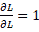)。
*   对于“x”节点的后向传播，前向传播的输入信号的“反转值”乘以来自上游的导数，被传递到下游。
*   对于“+”节点，来自上游的导数被传递而不改变它。
*   “log”节点的反向传播遵循以下等式:

基于此，我们可以很容易地获得交叉熵误差层的反向传播。结果，值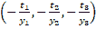将是 Softmax 层的向后传播的输入。

接下来，让我们看看 Softmax 层的反向传播。因为 Softmax 层有点复杂，所以我想一步一步地检查它的反向传播:

**第一步:**

###### 图 A.5:步骤 1

反向传播的值来自前一层(交叉熵误差层)。

**第二步:**

###### 图 A.6:步骤 2

“x”节点“反转”乘法的正向传播值。这里，执行以下计算:

|  | (建议 3) |

**第三步:**

###### 图 A.7:步骤 3

如果流在前向传播中分支为多个值，则在后向传播中会将分离的值相加。因此，这里增加了三个单独的反向传播值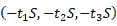。对附加值进行 */* 的反向传播，得到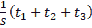。这里，( *t* 1， *t* 2， *t* 3)是标签，也是一个“独热向量”一个热向量意味着( *t* 1， *t* 2， *t* 3)中的一个为 1，其他的都为 0。因此，( *t* 1， *t* 2， *t* 3)之和为 1。

**第四步:**

###### 图 A.8:步骤 4

“+”节点只传递值而不改变它。

**第五步:**

###### 图 A.9:步骤 5

“x”节点“反转”乘法的值。这里，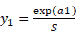用于转换方程。

**第六步:**

###### 图 A.10:步骤 6

在“exp”节点中，以下等式成立:

| 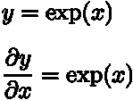 | (建议 4) |

因此，乘以 exp(a1)的两个独立输入之和就是要获得的反向传播。我们可以把这个写成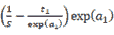，变换后得到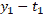。因此，在正向传播的输入为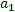的节点中，反向传播为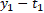。对于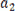和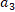，我们可以使用相同的程序(结果分别为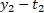和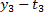)。有了这个，很容易说明，即使我们想分类 n 个类而不是三个类，我们也能达到同样的结果。

## 总结

这里，详细示出了 Softmax-with-Loss 层的计算图，并获得了它的反向传播。*图 A.11* 显示了 Softmax-with-Loss 层的完整计算图:

###### 图 a . 11:soft max-with-Loss 层的计算图

*图 A.11* 所示的计算图看起来很复杂。然而，如果你使用计算图一步一步地前进，获得导数(反向传播的过程)将会少得多。当您遇到看起来复杂的图层(如批处理规范化图层)，而不是此处描述的 Softmax-with-Loss 图层时，您可以使用此过程。这在实践中会比只看方程更容易理解。