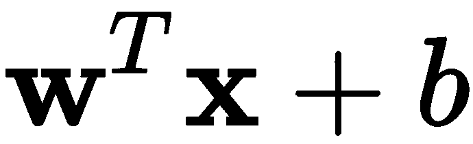
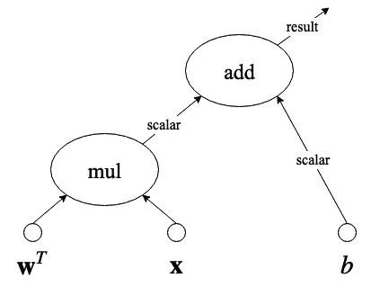
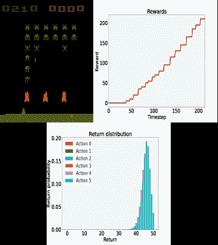

至此，你现在已经熟悉了**机器学习** ( **ML** )和**深度学习**(**DL**)——这太棒了！你应该准备好开始编写和运行你自己的程序了。本章在设置 TensorFlow 和 Keras 的过程中为您提供帮助，并介绍它们在深度学习中的用途和目的。多巴胺是作为新的强化学习框架提出的，我们稍后会用到。本章还简要介绍了其他重要的深度学习库。

本章将涉及的主题如下:

*   合作实验室简介
*   TensorFlow的介绍和设置
*   Keras 的介绍和设置
*   PyTorch 简介
*   多巴胺简介
*   其他深度学习库

# 合作实验室简介

什么是协同实验室？Colaboratory 是一个基于网络的研究工具，用于进行机器学习和深度学习。它本质上就像 Jupyter 笔记本。如今，合作实验室变得非常流行，因为它不需要设置。

在本书中，我们将使用运行在协作实验室上的 Python 3，它已经安装了我们可能需要的所有库。

Colaboratory 可以免费使用，并且兼容大多数主流浏览器。负责协作工具开发的公司是 Google^(。与 Jupyter 笔记本不同，在 Colaboratory 中，你可以在云上运行所有东西，而不是在你自己的电脑上。这里有一个问题:你需要一个谷歌账户，因为所有的合作笔记本都保存在你的个人谷歌硬盘空间里。然而，如果你没有谷歌帐户，你仍然可以继续阅读，看看如何安装你需要的每一个 Python 库来运行你自己的东西。尽管如此，我还是强烈建议你创建一个谷歌账户，哪怕只是为了使用这本书的合作笔记本来学习深度学习。)

当您在 Colaboratory 上运行代码时，它运行在专用的虚拟机上，有趣的是:您可以分配一个 GPU 来使用！或者你也可以使用 CPU。每当你不运行某个东西的时候，Colaboratory 就会释放资源(你知道，因为我们都想工作)，但是你可以在任何时候重新连接它们。

如果你准备好了，继续前进并导航到这个链接:[https://colab.research.google.com/](https://colab.research.google.com/)

如果您有兴趣了解更多信息以及对联合实验室的进一步介绍，请搜索*欢迎来到联合实验室！*。现在您已经访问了前面的链接，让我们开始使用 TensorFlow。

从现在开始，我们将**协同实验室**简称为**协同实验室**。人们实际上是这样称呼它的。

# TensorFlow的介绍和设置

**Tensor flow**(**TF**)名字中有*张量*这个词，是 vector 的同义词。因此，TF 是一个 Python 框架，它被设计成擅长与神经网络建模相关的矢量操作。它是最受欢迎的机器学习库。

作为数据科学家，我们偏爱 TF，因为它是免费的、开源的，拥有强大的用户基础，并且它使用了关于张量运算的基于图形执行的最先进的研究。

## 设置

现在，让我们从设置或验证您的设置是否正确的说明开始:

1.  若要开始安装 TF，请在您的合作实验室中运行以下命令:

```
%tensorflow_version 2.x
!pip install tensorflow
```

这将安装运行 TF 所需的大约 20 个库，例如包括`numpy`。

注意感叹号(！)命令的开头？这是您在 Colaboratory 上运行 shell 命令的方式。例如，假设您想要删除一个名为`model.h5`的文件，那么您可以发出命令`!rm model.h5`。

2.  如果安装运行正常，您将能够运行以下命令，该命令将打印您的合作实验室中安装的 TF 版本:

```
import tensorflow as tf
print(tf.__version__)
```

这将产生以下输出:

```
2.1.0
```

3.  这个版本的 TF 是在写这本书的时候 TF 的当前版本。然而，我们都知道 TF 版本经常变化，当你正在阅读这本书时，很可能会有一个新版本的 TF。如果是这种情况，您可以安装特定版本的 TF，如下所示:

```
!pip install tensorflow==2.1.0
```

我们假设您熟悉 Python，因此，我们将委托您负责将适当的库与我们在本书中使用的版本相匹配。这并不困难，可以很容易地做到，如前所示，例如，使用`==`符号来指定版本。我们将继续展示所使用的版本。

### 支持 GPU 的 TensorFlow

默认情况下，协同实验室为 TensorFlow 自动启用了 GPU 支持。但是，如果您可以通过 GPU 访问自己的系统，并希望通过 GPU 支持来设置 TensorFlow，安装非常简单。只需在您的个人系统上键入以下命令:

```
$ pip install tensorflow-gpu
```

但是，请注意，这是假设您已经为系统设置了所有必要的驱动程序来访问 GPU。然而，不用担心，在互联网上可以搜索到大量关于这个过程的文档，例如，[https://www.tensorflow.org/install/gpu](https://www.tensorflow.org/install/gpu)。如果你遇到任何问题，你需要继续前进，我强烈建议你回来，在合作实验室工作，因为这是最简单的学习方法。

现在让我们来说明 TensorFlow 是如何工作的，以及它的图形范例是如何使它变得非常健壮的。

## TensorFlow背后的原理

这本书是给深度学习的绝对初学者看的。因此，这里是我们想让你知道的关于 TF 是如何工作的。TF 创建了一个图，其中包含了从输入张量到操作的最高抽象级别的执行。

例如，假设我们有已知输入向量的张量 ***x*** 和 ***w*** ，并且我们有一个已知常数 *b* ，并假设您要执行此操作:



如果我们通过声明和分配张量来创建这个操作，图形将类似于图 2.1 中的图形:



图 2.1 -张量乘法和加法运算的例子

在这个图中，有一个张量乘法运算， *mul* ，其结果是一个标量，需要与另一个标量 *b* 相加， *add* 。请注意，这可能是一个中间结果，在实际的计算图中，这个结果在执行树中的位置更高。有关 TF 如何使用图的更多详细信息，请参考本文(Abadi，m .，et.al .，2016)。

简而言之，TF 找到了执行张量运算的最佳方式，将特定部分委托给 GPU(如果可用),或者在 CPU 内核上并行化运算(如果可用)。它是开源的，在世界范围内拥有越来越多的用户。大多数深度学习专业人士都知道 TF。

现在让我们讨论如何设置 Keras 以及它如何抽象 TensorFlow 功能。

# Keras 的介绍和设置

如果你在网上搜索示例 TensorFlow 代码，你会发现它可能不太容易理解或理解。你可以找到初学者的教程，但实际上，事情很容易变得复杂，编辑别人的代码可能非常困难。Keras 是一个 API 解决方案，可以相对轻松地开发深度学习 Tensorflow 模型原型。事实上，Keras 不仅支持在 TensorFlow 之上运行，还支持在 CNTK 和 Theano 之上运行。

我们可以把 Keras 看作是对实际TensorFlow模型和方法的抽象。这种共生关系变得如此受欢迎，以至于 TensorFlow 现在非正式地鼓励那些开始使用 TensorFlow 的人使用它。Keras 非常用户友好，用 Python 很容易上手，一般意义上也很好学。

## 设置

要在 Colab 上设置 Keras，请执行以下操作:

1.  运行以下命令:

```
!pip install keras
```

2.  系统将继续安装必要的库和依赖项。完成后，键入并运行以下代码片段:

```
import keras
print(keras.__version__)
```

这将输出一条确认消息，表明它使用 TensorFlow 作为后端，以及 Keras 的最新版本，在撰写本书时是 2.2.4。因此，输出如下所示:

```
Using TensorFlow backend.
2.2.4
```

## Keras 背后的原则

Keras 向用户提供功能的主要方式有两种:顺序模型和功能 API。

这些可以总结如下:

*   **顺序模型**:这是一种使用 Keras 的方法，允许你线性(或顺序)堆叠层实例。在这种情况下，层实例的含义与我们之前在[第 1 章](e3181710-1bb7-4069-825a-a235355bc116.xhtml)、*机器学习介绍*中讨论的含义相同。也就是说，层具有某种类型的输入、某种类型的行为或主模型操作，以及某种类型的输出。
*   **Functional API** :这是更深入定义更复杂模型的最佳方式，比如合并模型、具有多个输出的模型、具有多个共享层的模型，以及许多其他可能性。不要担心，这些都是高级主题，将在后续章节中变得清晰。函数式 API 范例给了编码者更多的自由去做不同的创新事情。

我们可以将顺序模型视为从 Keras 开始的一种简单方法，而将函数式 API 视为解决更复杂问题的方法。

还记得[第一章](https://cdp.packtpub.com/deep_learning_for_beginners/wp-admin/post.php?post=25&action=edit#post_24)、*机器学习入门*的浅层神经网络吗？这就是你在 Keras 中使用顺序模型范例进行建模的方式:

```
from keras.models import Sequential
from keras.layers import Dense, Activation

model = Sequential([
    Dense(10, input_shape=(10,)),
    Activation('relu'),
    Dense(8),
    Activation('relu'),
    Dense(4),
    Activation('softmax'),
])
```

前两行代码分别导入了`Sequential`模型以及`Dense`和`Activation`层。一个`Dense`层是一个完全连接的神经网络，而一个`Activation`层是调用一组丰富的激活函数的一种非常特殊的方式，比如 ReLU 和 SoftMax，就像前面的例子一样(这些将在后面详细解释)。

或者，你可以做同样的模型，但是使用`add()`方法:

```
from keras.models import Sequential
from keras.layers import Dense, Activation

model = Sequential()
model.add(Dense(10, input_dim=10))
model.add(Activation('relu'))
model.add(Dense(8))
model.add(Activation('relu'))
model.add(Dense(4))
model.add(Activation('softmax'))
```

为神经模型编写代码的第二种方式看起来更加线性，而第一种方式看起来更像是用 Pythonic 的方式来处理一系列项目。这其实是一回事，你可能会对这种或那种方式产生偏好。但是，请记住，前面的两个例子都使用了 Keras 顺序模型。

现在，仅出于比较目的，这是您如何编码完全相同的神经网络架构，但是使用 Keras Functional API 范例:

```
from keras.layers import Input, Dense
from keras.models import Model

inputs = Input(shape=(10,))

x = Dense(10, activation='relu')(inputs)
x = Dense(8, activation='relu')(x)
y = Dense(4, activation='softmax')(x)

model = Model(inputs=inputs, outputs=y)
```

如果你是一个有经验的程序员，你会注意到函数式 API 风格允许更多的灵活性。它允许您定义输入张量，以便在需要时将它们用作模型不同部分的输入。然而，使用函数式 API 确实假设您熟悉顺序模型。因此，在本书中，我们将从顺序模型开始，随着我们向更复杂的神经模型发展，我们将继续使用函数式 API 范式。

就像 Keras 一样，也有其他 Python 库和框架允许我们以相对较低的难度进行机器学习。在写这本书的时候，最流行的是 Keras，第二流行的是 PyTorch。

# PyTorch 简介

在写这本书的时候，PyTorch 是第三受欢迎的整体深度学习框架。尽管与 TensorFlow 相比，它在世界上相对较新，但它的受欢迎程度一直在增加。PyTorch 的一个有趣之处是它允许一些 TensorFlow 不允许的定制。此外，PyTorch 还得到了脸书的支持。

虽然这本书涵盖了 TensorFlow 和 Keras，但我认为我们所有人都应该记住 PyTorch 是一个很好的替代选择，它看起来非常类似于 Keras。仅供参考，下面是我们之前展示的完全相同的浅层神经网络如果用 PyTorch 编码将会是什么样子:

```
import torch

device = torch.device('cpu')

model = torch.nn.Sequential(
          torch.nn.Linear(10, 10),
          torch.nn.ReLU(),
          torch.nn.Linear(10, 8),
          torch.nn.ReLU(),
          torch.nn.Linear(8, 2),
          torch.nn.Softmax(2)
        ).to(device)
```

相似之处很多。此外，从 Keras 到 PyTorch 的过渡对于有积极性的读者来说应该不会太难，而且这可能是将来需要的一项不错的技能。然而，就目前而言，社区的大部分兴趣都在 TensorFlow 及其所有衍生品上，尤其是 Keras。如果你想更多地了解 PyTorch 的起源和基本原理，你可能会发现这篇阅读很有用(Paszke，a .，et.al .，2017)。

# 多巴胺简介

深度强化学习领域一个有趣的最新进展是多巴胺。多巴胺是深度强化学习算法快速原型化的框架。这本书将非常简要地介绍强化学习，但是你需要知道如何安装它。

众所周知，在强化学习领域，多巴胺对新用户来说很容易使用。还有，虽然它不是谷歌的官方产品，但是它的大部分开发者都是谷歌人。在目前的状态下，在写这本书的时候，这个框架非常紧凑，并且提供了现成的算法。

要安装 Dopamine，您可以运行以下命令:

```
!pip install dopamine-rl
```

您可以通过简单地执行以下命令来测试多巴胺的安装是否正确:

```
import dopamine
```

除非有错误，否则不会提供任何输出。通常，多巴胺会利用它之外的许多库来做更多有趣的事情。现在，人们可以用强化学习做的一些最有趣的事情是用奖励政策训练代理人，这在游戏中有直接的应用。

例如，参见*图 2.2* ，它显示了一个视频游戏在学习过程中的时间快照，使用策略根据代理采取的行动来强化期望的行为:



图 2.2 -游戏中强化学习问题中多巴胺代理的可视化示例

强化学习中的主体是决定下一步采取什么行动的部分。代理通过观察世界和世界的规则来完成这个任务。规则定义得越多，结果就越受约束。如果规则太宽松，代理人可能无法对采取什么行动做出好的决定。

虽然这本书没有深入到强化学习中，但我们将在本书的最后一章介绍一个有趣的游戏应用。目前，你可以阅读以下白皮书了解更多关于多巴胺的信息(Castro，P. S .等人，2018)。

# 其他深度学习库

除了两大巨头 TensorFlow 和 Keras，还有其他竞争对手正在深度学习领域取得进展。我们已经讨论过 PyTorch，但还有更多。这里我们简单说一下。

## 咖啡

Caffe 也是加州大学伯克利分校开发的一个流行框架(贾等，2014)。在 2015-2016 年变得非常流行。一些雇主仍然需要这种技能，学术文章仍然提到它的用法。然而，部分由于 TF 的巨大成功和 Keras 的普及，它的使用正在衰退。

更多关于 Caffe 的信息，请访问:[https://caffe.berkeleyvision.org](https://caffe.berkeleyvision.org)。

还要注意 Caffe2 的存在，它是由脸书开发的，并且是开源的。它是基于咖啡建造的，但现在脸书有了新的冠军——py torch。

## Theano

Theano 是由 Yoshua Bengio 的团队于 2007 年在蒙特利尔大学开发的(Al-Rfou，r .，*et Al .*2016)。Theano 的用户群相对较老，可能见证了 TF 的崛起。最新的主要版本是在 2017 年底发布的，尽管没有新的主要版本的明确计划，但社区仍在进行更新。

更多关于 Theano 的信息，请访问:
[http://deeplearning.net/software/theano/](http://deeplearning.net/software/theano/)

## 荣誉奖

出于各种原因，还有其他可能不那么受欢迎的替代方案，但在这里值得一提，以防它们的未来发生变化。这些措施如下:

| **名称** | **由**开发 | **更多信息** |
| MXNET | 街头流氓 | [https://mxnet.apache.org/](https://mxnet.apache.org/) |
| CNTK | 微软 | [https://cntk.ai](https://cntk.ai) |
| 深度学习 4J | Skymind | [https://deeplearning4j.org/](https://deeplearning4j.org/) |
| 链条机 | 首选网络 | [https://chainer.org/](https://chainer.org/) |
| 法斯泰 | 杰瑞米·霍华德 | [https://www.fast.ai/](https://www.fast.ai/) |

# 摘要

本章介绍了如何建立必要的库来运行 TensorFlow、Keras 和 Dopamine。希望你能使用 Colabs 来使你的学习变得更容易。您还了解了这些框架背后的基本思维模式和设计概念。尽管在撰写本书时这种框架是最流行的，但是还有其他竞争者，我们也简单介绍了一下。

在这一点上，你已经准备好开始掌握深度学习的旅程。我们的第一个里程碑是知道如何为深度学习应用准备数据。这一项对于模型的成功至关重要。无论模型有多好，有多深，如果数据没有得到正确的格式化或处理，都可能导致灾难性的性能结果。因此，我们现在将转到第 3 章[、](8300fba9-620e-4bc3-8d81-3b02c5043a0d.xhtml)、*准备数据。在那一章中，你将学习如何获取数据集，并为你试图用特定类型的深度学习模型解决的特定任务做准备。然而，在你去那里之前，请试着用下面的问题来测验你自己。*

# 问题和答案

1.  Colab 可以在我的个人电脑上运行吗？

不，它运行在云中，但是通过一些技巧和设置，你可以将它连接到你自己的个人云中。

2.  【Keras 用 GPU 吗？

是的。由于 Keras 运行在 TensorFlow 上(在本书的设置中)，而 TensorFlow 使用 GPU，那么 Keras 也是如此。

3.  **Keras 中的两种主要编码范式是什么？**

顺序模型；(B)功能 API。

4.  **我们为什么关心多巴胺？**

因为你能信任的强化学习框架很少，多巴胺就是其中之一。

# 参考

*   Abadi，m .、Barham，p .、Chen，j .、Chen，z .、Davis，a .、Dean，j .、Devin，m .、Ghemawat，s .、Irving，g .、Isard，m .和 Kudlur，M. (2016)。 *Tensorflow:大规模机器学习的系统。*在*第十二届{USENIX}操作系统设计与实现研讨会上* ({OSDI} 16)(第 265-283 页)。
*   Paszke，a .，Gross，s .，Chintala，s .，Chanan，g .，Yang，e .，DeVito，z .，Lin，z .，Desmaison，a .，Antiga，l .和 Lerer，A. (2017)。*py torch 中的自动微分。*
*   卡斯特罗、莫伊特拉、盖拉达、库马尔和贝勒马尔(2018 年)。*多巴胺:深度强化学习的研究框架*。arXiv 预印本 arXiv:1812.06110。
*   贾、谢尔哈默、多纳休、卡拉耶夫、龙、吉希克、和达雷尔(2014 年 11 月)。Caffe:用于快速特征嵌入的卷积架构。在*举行的第 22 届 ACM* *国际多媒体会议*(第 675-678 页)。 *ACM* 。
*   Al-Rfou，r .，Alain，g .，Almahairi，a .，Angermueller，c .，Bahdanau，d .，Ballas，n .，Bastien，f .，Bayer，j .，Belikov，a .，Belopolsky，a .，Bengio，Y. (2016 年)。 *Theano:快速计算* *数学表达式*的 Python 框架。arXiv 预印本 arXiv:1605.02688。