现在，您已经成功地准备了您的系统来学习深度学习，请参见[第 2 章](0b6e1f9c-280c-4107-aa1b-862b99f991c8.xhtml)、*深度学习框架的设置和介绍*，我们将继续为您提供关于您在实践深度学习时可能会经常遇到的数据的重要指南。当谈到学习深度学习时，拥有准备充分的数据集将有助于您更加专注于设计模型，而不是准备数据。然而，每个人都知道这不是一个现实的期望，如果你就此询问任何数据科学家或机器学习专家，他们会告诉你建模的一个重要方面是知道如何准备数据。了解如何处理数据以及如何准备数据将为您节省许多时间来微调您的模型。任何花费在准备数据上的时间都是值得的。

本章将向您介绍数据处理背后的主要概念，使其在深度学习中有用。它将涵盖格式化分类或实值的输出和输入的基本概念，以及增加数据或减少数据维数的技术。在本章结束时，你应该能够处理最常见的数据操作技术，这些技术可以导致成功选择深度学习方法。

具体来说，本章讨论以下内容:

*   二元数据和二元分类
*   分类数据和多个类
*   实值数据和单变量回归
*   改变数据的分布
*   数据扩充
*   数据降维
*   操纵数据的伦理含义

# 二元数据和二元分类

在本节中，我们将把所有精力集中在用二进制输入或目标准备数据的**上。当然，我们所说的二进制是指可以用 0 或 1 表示的值。请注意对表示为的单词*的强调。原因是列可能包含不一定是 0 或 1 的数据，但可以被解释为 0 或 1 或由 0 或 1 表示。***

考虑数据集的以下片段:

| *x*1 | *x*2 | ... | *y* |
| 0 | 5 | ... | a |
| 一 | 七 | ... | a |
| 一 | 5 | ... | b |
| 0 | 七 | ... | b |

在这个只有四行的简短数据集示例中，列*x* [1] 的值明显是二进制的，或者是 *0* 或者是 *1* 。然而， *x* [2] ，乍一看可能不会被感知为二进制，但如果你仔细观察，那一列中唯一的值要么是 *5* 要么是 *7* 。这意味着数据可以正确且唯一地映射到一组两个值。因此，我们可以将 *5* 映射到 *0* ，将 *7* 映射到 *1* ，反之亦然；这并不重要。

A similar phenomenon is observed in the target output value, *y*, which also contains unique values that can be mapped to a set of size two. And we can do such mapping by assigning, say, *b* to *0*, and *a* to ***1***.

If you are going to map from strings to binary, always make sure to check what type of data your specific models can handle. For example, in some Support Vector Machine implementations, the preferred values for targets are -1 and 1\. This is still binary but in a different set. Always double-check before deciding what mapping you will use.

In the next sub-section, we will deal specifically with binary targets using a dataset as a case study.

## Binary targets on the Cleveland Heart Disease dataset

The *Cleveland Heart Disease* (Cleveland 1988) dataset contains patient data for 303 subjects. Some of the columns in the dataset have missing values; we will deal with this, too. The dataset contains 13 columns that include cholesterol and age.

The target is to detect whether a subject has heart disease or not, thus, is binary. The problem we will deal with is that the data is encoded with values from 0 to 4, where 0 indicates the absence of heart disease and the range 1 to 4 indicates some type of heart disease.

We will use the portion of the dataset identified as `Cleveland`, which can be downloaded from this link: [https://archive.ics.uci.edu/ml/machine-learning-databases/heart-disease/processed.cleveland.data](https://archive.ics.uci.edu/ml/machine-learning-databases/heart-disease/processed.cleveland.data)

The attributes of the dataset are as follows:

| **Column** | **Description** |
| *x*[1] | Age |
| *x*[2] | Sex |
| *x*[3] | Chest pain type:1: typical angina2: atypical angina3: non-anginal pain4: asymptomatic |
| *x[4]* | Resting blood pressure (in mm Hg on admission to the hospital) |
| *x*[5] | Serum cholesterol in mg/dl |
| *x[6]* | Fasting blood sugar > 120 mg/dl:1 = true0 = false |
| *x[7]* | Resting electrocardiographic results:0: normal1:ST-T 波异常2:显示可能或明确的左心室肥大 |
| *x[8]* | 达到最大心率 |
| *x[9]* | 运动诱发的心绞痛:
1 =是
0 =否 |
| *x[10]* | 运动相对于休息诱发的 ST 段压低
 |
| *x[11]* | 运动 ST 段峰值的斜率:
1:上坡
2:扁平
3:下坡
 |
| *x[12]* | 透视着色的主要血管数量(0-3)
 |
| *x[13]* | Thal:
3 =正常
6 =固定缺陷
7 =可逆缺陷
 |
| *y* | 心脏病的诊断(血管造影疾病状态):
0: <直径缩小 50%
1:>直径缩小 50% |

让我们按照下面的步骤将数据集读入 pandas 数据帧并清理它:

1.  在我们的 Google Colab 中，我们将首先使用`wget`命令下载数据，如下所示:

```
!wget https://archive.ics.uci.edu/ml/machine-learning-databases/heart-disease/processed.cleveland.data
```

这又将文件`processed.cleveland.data`下载到 Colab 的默认目录中。这可以通过检查 Colab 左侧的文件选项卡来验证。请注意，前面的指令只有一行，不幸的是，它很长。

2.  接下来，我们使用 pandas 加载数据集，以验证数据集是可读和可访问的。

Pandas 是一个 Python 库，非常受数据科学家和机器学习科学家的欢迎。它使加载和保存数据集、替换丢失的值、检索数据的基本统计属性，甚至执行转换变得容易。熊猫是救星，现在大多数其他机器学习库都接受熊猫作为有效的输入格式。

在 Colab 中运行以下命令来加载和显示一些数据:

```
import pandas as pd
df = pd.read_csv('processed.cleveland.data', header=None)
print(df.head())
```

`read_csv()`函数加载一个格式为**c**omma 分隔值 ( **CSV** )的文件。我们使用参数`header=None`告诉 pandas 数据没有任何实际的头；如果省略，pandas 将使用数据的第一行作为每一列的名称，但是在这种情况下我们不希望这样。

加载的数据存储在一个名为`df`的变量中，这个变量可以是任何名字，但我认为它很容易记住，因为 pandas 将数据存储在 DataFrame 对象中。因此，`df`似乎是一个合适的、简短的、易于记忆的数据名称。然而，如果我们处理多个数据帧，那么用一个描述它们包含的数据的名称来不同地命名它们会更方便。

对数据帧进行操作的`head()`方法类似于检索文件前几行的`unix`命令。在 DataFrame 上，`head()`方法返回前五行数据。如果希望检索更多或更少的数据行，可以指定一个整数作为方法的参数。例如，假设您想要检索前三行，那么您应该执行`df.head(3)`。

运行上述代码的结果如下:

```
    0   1   2     3     4   5   6     7   8    9   10  11  12  13
0  63\.  1\.  1\.  145\.  233\.  1\.  2\.  150\.  0\.  2.3  3\.  0\.  6\.   0
1  67\.  1\.  4\.  160\.  286\.  0\.  2\.  108\.  1\.  1.5  2\.  3\.  3\.   2
2  67\.  1\.  4\.  120\.  229\.  0\.  2\.  129\.  1\.  2.6  2\.  2\.  7\.   1
3  37\.  1\.  3\.  130\.  250\.  0\.  0\.  187\.  0\.  3.5  3\.  0\.  3\.   0
4  41\.  0\.  2\.  130\.  204\.  0\.  2\.  172\.  0\.  1.4  1\.  0\.  3\.   0
```

以下是一些需要观察和记住的事情，以供将来参考:

*   在左侧，有一个未命名的列，该列包含具有连续数字 0、1、..., 4.这些是 pandas 分配给数据集中每一行的索引。这些是唯一的数字。一些数据集具有唯一的标识符，例如图像的文件名。
*   在顶部，有一行从 0，1，..., 13.这些是列标识符。这些也是独一无二的，给我们就可以设定。
*   在每一行和每一列的交叉点，我们有浮点小数或整数的值。整个数据集包含十进制数，除了第 13 列，这是我们的目标，包含整数。

3.  因为我们将使用这个数据集作为二进制分类问题，所以我们现在需要将最后一列改为只包含二进制值:0 和 1。我们将保留 0 的本义，即无心脏病，任何大于等于 1 的都将映射为 1，表示诊断某种类型的心脏病。我们将运行以下指令:

```
print(set(df[13]))
```

指令`df[13]`查看数据帧并检索索引为`13`的列的所有行。然后，对第 13 列所有行的`set()`方法将创建该列中所有唯一元素的集合。这样就可以知道有多少不同的值，以便替换。输出如下所示:

```
{0, 1, 2, 3, 4}
```

由此可知，0 表示无心脏病，1 表示有心脏病。然而，2、3 和 4 需要映射到 1，因为它们也暗示阳性心脏病。我们可以通过执行以下命令进行更改:

```
df[13].replace(to_replace=[2,3,4], value=1, inplace=True)
print(df.head())
print(set(df[13]))
```

这里，`replace()`函数作用于数据帧来替换特定的值。在我们的例子中，需要三个参数:

*   `to_replace=[2,3,4]`表示要搜索的项目列表，以便替换它们。
*   `value=1`表示将替换每个匹配条目的值。
*   `inplace=True`向熊猫表示我们要对列进行更改。

在某些情况下，熊猫数据帧的行为就像一个不可变的对象，在这种情况下，有必要使用`inplace=True`参数。如果我们不使用这个论点，我们将不得不这样做。
`df[13] = df[13].replace(to_replace=[2,3,4], value=1)`，这对于有经验的熊猫用户来说不是问题。这意味着无论如何你都应该感到舒服。开始使用 pandas 的人面临的主要问题是，它并不总是表现得像一个不可变的对象。因此，你应该把所有关于熊猫的文件放在身边:[https://pandas.pydata.org/pandas-docs/stable/index.html](https://pandas.pydata.org/pandas-docs/stable/index.html)

上述命令的输出如下:

```
    0   1   2     3     4   5   6     7   8    9   10  11  12  13
0  63\.  1\.  1\.  145\.  233\.  1\.  2\.  150\.  0\.  2.3  3\.  0\.  6\.   0
1  67\.  1\.  4\.  160\.  286\.  0\.  2\.  108\.  1\.  1.5  2\.  3\.  3\.   1
2  67\.  1\.  4\.  120\.  229\.  0\.  2\.  129\.  1\.  2.6  2\.  2\.  7\.   1
3  37\.  1\.  3\.  130\.  250\.  0\.  0\.  187\.  0\.  3.5  3\.  0\.  3\.   0
4  41\.  0\.  2\.  130\.  204\.  0\.  2\.  172\.  0\.  1.4  1\.  0\.  3\.   0

{0, 1}
```

首先，请注意，当我们打印前五行时，第十三列现在只具有值 0 或 1。您可以将其与原始数据进行比较，以验证粗体显示的数字是否确实发生了变化。我们还使用`set(df[13])`验证了该列的所有唯一值的集合现在只有`{0, 1}`，这是期望的目标。

通过这些变化，我们可以使用数据集来训练深度学习模型，或许可以改善现有的记录性能[德特拉诺，r .，*等人* (1989)]。

同样的方法可以应用于使任何其他列在我们需要的集合中具有二进制值。作为练习，让我们用著名的`MNIST`数据集做另一个例子。

## 二值化 MNIST 数据集

MNIST 数据集在深度学习社区中是众所周知的(Deng，L. (2012))。它由成千上万张手写数字的图像组成。图 3.1 显示了 MNIST 数据集的八个样本:

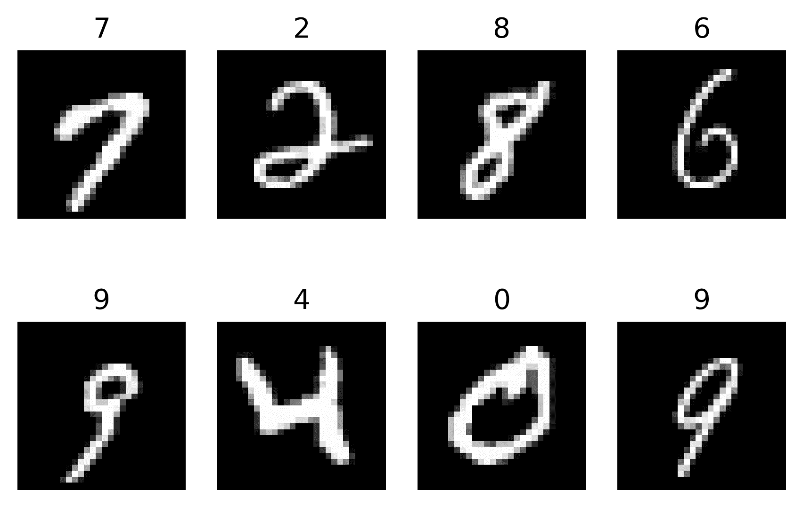
Figure 3.1 – Eight samples of the MNIST dataset. The number on top of each image corresponds to the target class

如你所见，这个数据集中的样本是杂乱的，但却非常真实。每个图像的大小为 28 x 28 像素。只有 10 个目标类，每个数字一个，0，1，2，..., 9.这里的复杂性通常是一些数字可能看起来与其他数字相似；例如，1 和 7，或者 0 和 6。然而，大多数深度学习算法已经成功地解决了分类问题，并且准确率很高。

从*图 3.1* 仔细观察会发现，数值并不完全是零和一，也就是二进制。事实上，这些图像是 8 位灰度，范围为[0-255]。如前所述，对于大多数先进的深度学习算法来说，这已经不是问题。然而，对于一些算法，如**受限玻尔兹曼机器** ( **RMBs** )，输入数据需要二进制格式[0，1]，因为这是算法的传统工作方式。

因此，我们将做两件事:

*   将图像二进制化，以便具有二进制输入
*   将目标二值化，使其成为二值分类问题

对于这个例子，我们将任意选择两个数字 7 和 8 作为我们的目标类。

### 二值化图像

二值化过程是图像处理中常见的步骤。它的正式名称是图像阈值，因为我们需要一个阈值来决定哪些值变成 0 和 1。关于这一主题的全面调查，请查阅(Sezgin，m .和 Sankur，B. (2004))。这就是说，选择最佳阈值是有科学依据的，它可以将范围转换误差从[0，255]降至[0，1]。

但是，由于这不是一本关于图像处理的书，所以我们将任意设置一个 128 的阈值。因此，任何低于 128 的值都将变成零，任何大于或等于 128 的值都将变成一。

这一步可以通过使用 Python 中的索引很容易地完成。接下来，我们将显示数据集的一小部分，以确保数据被正确转换。在接下来的步骤中，我们将通过执行以下命令来实现这一点:

1.  要加载数据集并验证其维度(形状)，请运行以下命令:

```
from sklearn.datasets import fetch_openml
mnist = fetch_openml('mnist_784')
print(mnist.data.shape)
print(mnist.target.shape)
```

以下是输出:

```
(70000, 784)
(70000,)
```

首先要注意的是，我们使用的是一个机器学习库，在 Python 中称为`scikit learn`或`sklearn`。它是通用机器学习中使用最多的库之一。使用`fetch_openml()`方法加载`MNIST`数据集，这需要一个带有要加载的数据集标识符的参数，在本例中是`'mnist_784'`。数字`784`来自于`MNIST`图像的大小，它是 28 x 28 像素，可以解释为 784 个元素的向量，而不是 28 列 28 行的矩阵。通过验证`shape`属性，我们可以看到数据集有 70，000 个图像，表示为大小为 784 的向量，目标的比例相同。

这里请注意，与上一节我们使用加载到 pandas 中的数据集不同，在本例中，我们直接使用数据作为列表或列表数组。你应该对操作熊猫和原始数据集感到舒适。

2.  要通过验证前后的数据来实际执行二进制化，请运行以下命令:

```
print(mnist.data[0].reshape(28, 28)[10:18,10:18])
mnist.data[mnist.data < 128] = 0
mnist.data[mnist.data >=128] = 1
print(mnist.data[0].reshape(28, 28)[10:18,10:18])
```

这将输出以下内容:

```
[[ 1\. 154\. 253\.  90\.   0\.   0\.   0\.   0.]
 [ 0\. 139\. 253\. 190\.   2\.   0\.   0\.   0.]
 [ 0\.  11\. 190\. 253\.  70\.   0\.   0\.   0.]
 [ 0\.   0\.  35\. 241\. 225\. 160\. 108\.   1.]
 [ 0\.   0\.   0\.  81\. 240\. 253\. 253\. 119.]
 [ 0\.   0\.   0\.   0\.  45\. 186\. 253\. 253.]
 [ 0\.   0\.   0\.   0\.   0\.  16\.  93\. 252.]
 [ 0\.   0\.   0\.   0\.   0\.   0\.   0\. 249.]]

[[ 0\. 1\. 1\. 0\. 0\. 0\. 0\. 0.]
 [ 0\. 1\. 1\. 1\. 0\. 0\. 0\. 0.]
 [ 0\. 0\. 1\. 1\. 0\. 0\. 0\. 0.]
 [ 0\. 0\. 0\. 1\. 1\. 1\. 0\. 0.]
 [ 0\. 0\. 0\. 0\. 1\. 1\. 1\. 0.]
 [ 0\. 0\. 0\. 0\. 0\. 1\. 1\. 1.]
 [ 0\. 0\. 0\. 0\. 0\. 0\. 0\. 1.]
 [ 0\. 0\. 0\. 0\. 0\. 0\. 0\. 1.]]
```

指令`data[0].reshape(28, 28)[10:18,10:18]`做三件事:

1.  `data[0]`以大小为(1，784)的数组形式返回第一幅图像。
2.  `reshape(28, 28)`将(1，784)数组的大小调整为(28，28)矩阵，这是实际的图像；这对于显示实际数据很有用，例如，生成*图 3.1* 。
3.  `[10:18,10:18]`只取(28，28)矩阵在位置 10 到 18 的子集，用于列和行；这或多或少与图像的中心区域相对应，是观察变化的好地方。

前面的代码仅用于查看数据，但实际的更改将在接下来的几行中完成。行`mnist.data[mnist.data < 128] = 0`使用 Python 索引。指令`mnist.data < 128`返回一个布尔值的多维数组，`mnist.data[ ]`将该数组用作将值设置为零的索引。关键是对所有严格小于 128 的值都这样做。下一行也是如此，但是值大于或等于 128。

通过检查输出，我们可以确认数据已经成功更改，并且已经阈值化或二进制化。

### 将目标二值化

我们将通过以下两个步骤对目标进行二进制化:

1.  首先，我们将丢弃其他数字的图像数据，只保留 7 和 8。然后，我们将映射 7 到 0 和 8 到 1。这些命令将创建新的变量`X`和`y`，它们将只保存数字 7 和 8:

```
X = mnist.data[(mnist.target == '7') | (mnist.target == '8')]
y = mnist.target[(mnist.target == '7') | (mnist.target == '8')]
print(X.shape)
print(y.shape)
```

这将输出以下内容:

```
(14118, 784)
(14118)
```

注意使用了`OR`操作符`|`，以逻辑方式获取两组布尔索引，并用`OR`操作符生成一组。这些指数用于产生新的数据集。新数据集的形状包含 14，000 多幅图像。

2.  要将 7 映射到 0 和 8 映射到 1，我们可以运行以下命令:

```
print(y[:10])
y = [0 if v=='7' else 1 for v in y]
print(y[:10])
```

这将输出以下内容:

```
['7' '8' '7' '8' '7' '8' '7' '8' '7' '8']
[0, 1, 0, 1, 0, 1, 0, 1, 0, 1]
```

指令`[0 if v=='7' else 1 for v in y]`检查`y`中的每个元素，如果一个元素是`'7'`，则返回一个`0`，否则(例如当它是`'8'`时)返回一个`1`。如输出所示，选择前 10 个元素，数据被二进制化到集合{ `0`，`1` }。

请记住，`y`中的目标数据已经是二进制的，因为它只有两组唯一的可能数字{ `7`、`8` }。但是我们把它变成了集合{ `0`，`1` }的二进制，因为当我们使用不同的深度学习算法来计算非常特定类型的损失函数时，这通常会更好。

这样，数据集就可以用于二元和一般分类器了。但是，如果我们实际上想要有多个类，例如，检测数据集的所有 10 个数字，而不仅仅是 2 个数字，该怎么办呢？或者，如果我们有非数字但分类的特性、列或输入，那该怎么办？下一节将帮助您准备这些情况下的数据。

# 分类数据和多个类

现在，您已经知道了如何针对不同的目的对数据进行二进制化，我们可以研究其他类型的数据，比如分类数据或多标签数据，以及如何将它们转换成数字。大多数先进的深度学习算法，实际上只接受数值数据。这仅仅是一个设计问题，以后可以很容易地解决，这没什么大不了的，因为您将了解到有一些简单的方法来获取分类数据并将其转换成有意义的数字表示。

**Categorical data** has information embedded as distinct categories. These categories can be represented as numbers or as strings. For example, a dataset that has a column named `country` with items such as "India", "Mexico", "France", and "U.S". Or, a dataset with zip codes such as 12601, 85621, and 73315\. The former is **non-numeric** categorical data, and the latter is **numeric** categorical data. Country names would need to be converted to a number to be usable at all, but zip codes are already numbers that are meaningless as mere numbers. Zip codes would be more meaningful, from a machine learning perspective, if we converted them to latitude and longitude coordinates; this would better capture places that are closer to each other than using plain numbers.

首先，我们将解决将字符串类别转换成普通数字的问题，然后我们将以一种叫做**一键编码**的格式将它们转换成数字。

## 将字符串标签转换为数字

我们将再次获取`MNIST`数据集，并使用其字符串标签， *0* ， *1* ，...、 *9* ，并转换成数字。我们可以通过许多不同的方式实现这一目标:

*   我们可以简单地用一个简单的命令`y = list(map(int, mnist.target))`将所有的字符串映射成整数，然后就完成了。变量`y`现在只包含一个整数列表，比如`[8, 7, 1, 2, ... ]`。但这只能解决这个特殊情况下的问题；你需要学习一些适用于所有情况的东西。所以，我们不要这样。
*   我们可以通过迭代 10 次数据来做一些艰苦的工作—`mnist.target = [0 if v=='0' else v for v in mnist.target]`—对每个数字都这样做。但是，这(和其他类似的事情)将只适用于这种情况。我们不要这样。
*   我们可以使用 scikit-learn 的`LabelEncoder()`方法，该方法将获取任何标签列表并将它们映射到一个数字。这将适用于所有情况。

让我们按照以下步骤使用`scikit`方法:

1.  运行以下代码:

```
from sklearn import preprocessing
le = preprocessing.LabelEncoder()
print(sorted(list(set(mnist.target))))

le.fit(sorted(list(set(mnist.target))))
```

这会产生以下输出:

```
['0', '1', '2', '3', '4', '5', '6', '7', '8', '9']

LabelEncoder()
```

`sorted(list(set(mnist.target)))`命令做三件事:

*   `set(mnist.target)`检索数据中的一组唯一值，例如`{'8', '2', ..., '9'}`。
*   `list(set(mnist.target))`简单地将集合转换成一个列表，因为我们需要一个列表或数组用于`LabelEncoder()`方法。
*   `sorted(list(set(mnist.target)))`在这里很重要，这样 *0* 映射到 0，而 *8* 不映射到 0，依此类推。它对列表进行排序，结果看起来是这样的- `['0', '1', ..., '9']`。

`le.fit()`方法获取一个列表(或者一个数组)并生成一个映射(一个字典),用于向前(或者向后，如果需要的话)将标签或者字符串编码成数字。它将它存储在一个`LabelEncoder`对象中。

2.  接下来，我们可以如下测试编码:

```
print(le.transform(["9", "3", "7"]) )

list(le.inverse_transform([2, 2, 1]))
```

这将输出以下内容:

```
[9 3 7]

['2', '2', '1']
```

`transform()`方法将基于字符串的标签转换成数字，而`inverse_transform()`方法接受数字并返回相应的字符串标签或类别。

任何与看不见的类别或数字进行映射的尝试都会导致`LabelEncoder`对象产生错误。请尽力提供所有可能类别的列表。

3.  一旦`LabelEncoder`对象被安装和测试，我们可以简单地运行以下指令来编码数据:

```
print("Before ", mnist.target[:3])
y = le.transform(mnist.target)
print("After ", y[:3])
```

这将输出以下内容:

```
Before ['5' '0' '4']
After [5 0 4]
```

新的编码标签现在在`y`中，可以使用了。

这种将标签编码为整数的方法也称为**顺序编码。**

这种方法应该适用于所有编码为字符串的标签，对于这些标签，您可以简单地映射到数字而不会丢失上下文。在`MNIST`数据集的情况下，我们可以将 *0* 映射到 0，将 *7* 映射到 7，而不会丢失上下文。您可以这样做的其他示例包括:

*   **年龄组** : ['18-21 '，' 22-35 '，' 36+']到[0，1，2]
*   **性别** : ['男性'，'女性']到[0，1]
*   **颜色** : ['红色'，'黑色'，'蓝色'，...]到[0，1，2，...]
*   **学习** : ['小学'，'中学'，'高中'，'大学']到[0，1，2，3]

然而，我们在这里做了一个大的假设:标签本身没有特殊的含义。正如我们前面提到的，邮政编码可以简单地编码成较小的数字；然而，它们具有地理意义，这样做可能会对我们的深度学习算法的性能产生负面影响。同样，在前面的列表中，如果研究需要一个特殊的含义来表明一个*大学*学位比一个*小学*学位更高或更重要，那么也许我们应该考虑不同的数字映射。或者，也许我们希望我们的学习算法能够自己学习这些复杂的东西！在这种情况下，我们应该使用众所周知的一键编码策略。

## 将类别转换为一键编码

在大多数情况下，如果类别或标签彼此之间可能有特殊的含义，那么将类别转换为一键编码会更好。在这种情况下，据报道它优于序数编码[Potdar，k .，*等* (2017)]。

想法是将每个标签表示为具有独立列的布尔状态。例如，以包含以下数据的列为例:

| **性别** |
| '女性' |
| '男性' |
| '男性' |
| '女性' |
| '女性' |

这可以使用一键编码唯一地转换成以下新数据:

| **性别 _ 女** | **性别 _ 男性** |
| 一 | 0 |
| 0 | 一 |
| 0 | 一 |
| 一 | 0 |
| 一 | 0 |

如您所见，只有当标签对应于特定行时，二进制位才是 *hot* (为 1)，否则为 0。还要注意，我们重命名了列，以跟踪哪个标签对应于哪个列；然而，这仅仅是推荐的格式，而不是正式的规则。

在 Python 中有很多方法可以做到这一点。如果您的数据在 pandas DataFrame 中，那么您可以简单地执行`pd.get_dummies(df, prefix=['Gender'])`，假设您的列在`df`中，并且您想要使用`Gender`作为前缀。

要重现上表中讨论的准确结果，请按照下列步骤操作:

1.  运行以下命令:

```
import pandas as pd
df=pd.DataFrame({'Gender': ['female','male','male',
                            'female','female']})
print(df)
```

这将输出以下内容:

```
  Gender
0 female
1 male
2 male
3 female
4 female
```

2.  现在，只需通过运行以下命令进行编码:

```
pd.get_dummies(df, prefix=['Gender'])
```

这是这样产生的:

```
  Gender_female  Gender_male
0             1            0
1             0            1
2             0            1
3             1            0
4             1            0
```

这种编码的一个有趣的，也可能是显而易见的特性是，沿着所有编码列的行的`OR`和`XOR`操作将总是 1，而`AND`操作将产生 0。

对于数据不是熊猫数据框架的情况，例如，MNIST 目标，我们可以使用 scikit-learn 的`OneHotEncoder.transform()`方法。

一个`OneHotEncoder`对象有一个构造器，它会自动将所有东西初始化为合理的假设，并使用`fit()`方法确定它的大部分参数。它确定数据的大小，数据中存在的不同标签，然后创建一个我们可以使用`transform()`方法的动态映射。

要对`MNIST`目标进行一次性编码，我们可以这样做:

```
from sklearn.preprocessing import OneHotEncoder
enc = OneHotEncoder()
y = [list(v) for v in mnist.target] # reformat for sklearn
enc.fit(y)

print('Before: ', y[0])
y = enc.transform(y).toarray()
print('After: ', y[0])
print(enc.get_feature_names())
```

这将输出以下内容:

```
Before: ['5']
After: [0\. 0\. 0\. 0\. 0\. 1\. 0\. 0\. 0\. 0.]
['x0_0' 'x0_1' 'x0_2' 'x0_3' 'x0_4' 'x0_5' 'x0_6' 'x0_7' 'x0_8' 'x0_9']
```

这段代码包含了我们经典的健全性检查，其中我们验证了标签`'5'`实际上被转换成了一个有 10 列的行向量，其中的数字`6`是 *hot* 。正如预期的那样，它起作用了。`y`的新维度是 *n* 行 10 列。

这是在 MNIST 上使用深度学习方法的目标的首选格式。对于每类只有一个神经元的神经网络来说，一键编码目标是非常好的。在这种情况下，每个数字代表一个神经元。每一个神经元都需要学会预测独热编码的行为，也就是说，只有一个神经元应该被激活(“热”)，而其他的应该被抑制。

只要其他列包含分类数据，就可以完全重复前面的过程，将它们转换为一键编码。

当我们想要将输入数据分类到那些类别、标签或映射中时，类别、标签和到整数或位的特定映射非常有用。但是，如果我们想让输入数据映射到连续数据呢？例如，通过观察一个人的反应来预测其智商的数据；或者根据关于天气和季节的输入数据预测电价。这被称为**回归**的数据，我们将在接下来讨论。

# 实值数据和单变量回归

在使用基于深度学习的分类模型时，知道如何处理分类数据非常重要；然而，知道如何为回归准备数据也同样重要。包含类似连续的真实值的数据，如温度、价格、重量、速度等，适合回归；也就是说，如果我们有一个包含不同类型值的列的数据集，并且其中一个是实值数据，我们可以对该列执行回归。这意味着我们可以使用数据集的所有其余部分来预测该列上的值。这被称为**单变量回归**，或单变量回归。

如果回归的数据是**标准化的**，大多数机器学习方法会工作得更好。我们的意思是，数据将具有特殊的统计属性，这将使计算更加稳定。这对于许多遭受消失或爆炸梯度的深度学习算法来说至关重要(哈宁，B. (2018))。例如，在计算神经网络中的梯度时，误差需要从输出层向后传播到输入层；但是，如果输出层具有较大的误差，并且值的范围(即它们的**分布**)也很大，那么向后的乘法会导致变量溢出，这会破坏训练过程。

为了克服这些困难，需要对可用于回归的变量或实值变量的分布进行归一化。标准化过程有许多变体，但我们将把我们的讨论限制在两种主要方法上，一种方法设置数据的特定统计属性，另一种方法设置数据的特定范围。

## 缩放到特定范围的值

让我们回到本章前面讨论的心脏病数据集。如果你注意的话，这些变量中有许多是实值的，非常适合回归分析；比如*x*5 和*x*10。

所有变量都适合回归。这意味着，从技术上讲，我们可以预测任何数字数据。一些值是实值的事实使得它们对回归更有吸引力，原因有很多。例如，该列中的值具有超出整数和自然数范围的含义。

下面重点介绍一下 *x* [5] 和 *x* [10] ，这两个变量分别是衡量运动相对于休息诱发的胆固醇水平和 ST 段压低的变量。如果我们想改变医生最初的研究问题，即根据不同的因素研究心脏病，该怎么办？如果现在我们想使用所有的因素，包括知道患者是否患有心脏病，来确定或预测他们的胆固醇水平，会怎么样？我们可以在*x*5 上进行回归。

因此，为了准备关于*x*5 和*x*10 的数据，我们将继续缩放数据。出于验证目的，我们将检索数据缩放前后的描述性统计数据。

要重新加载数据集并显示描述性统计数据，我们可以执行以下操作:

```
df = pd.read_csv('processed.cleveland.data', header=None)
df[[4,9]].describe()
```

在这种情况下，index、`4`和`9`对应于*x*5 和*x*10，`describe()`方法输出以下信息:

```
                 4            9
count   303.000000   303.000000
mean    246.693069     1.039604
std      51.776918     1.161075
min     126.000000     0.000000
25%     211.000000     0.000000
50%     241.000000     0.800000
75%     275.000000     1.600000
max     564.000000     6.200000
```

最值得注意的属性是该列中包含的平均值和最大/最小值。一旦我们将数据缩放到不同的范围，这些将会改变。如果我们将数据可视化为带有各自直方图的散点图，它看起来像*图 3.2* :

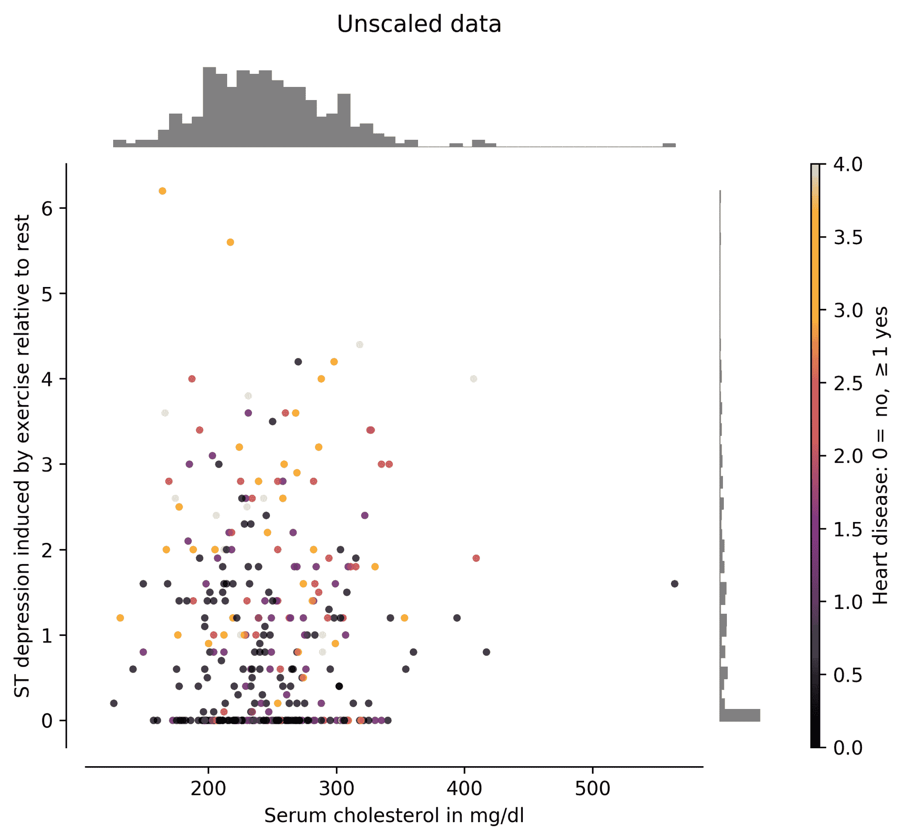

图 3.2–两列*x*5 和*x*10 的散点图及其对应的直方图

从*图 3.2* 可以看出，范围差别很大，数据的分布也不同。这里新的期望范围最小为 0，最大为 1。当我们缩放数据时，这个范围是典型的。这可以通过使用 scikit-learn 的`MinMaxScaler`对象来实现，如下所示:

```
from sklearn.preprocessing import MinMaxScaler
scaler = MinMaxScaler()
scaler.fit(df[[4,9]])
df[[4,9]] = scaler.transform(df[[4,9]])
df[[4,9]].describe()
```

这将输出以下内容:

```
                4            9
count  303.000000   303.000000
mean     0.275555     0.167678
std      0.118212     0.187270
min      0.000000     0.000000
25%      0.194064     0.000000
50%      0.262557     0.129032
75%      0.340183     0.258065
max      1.000000     1.000000
```

`fit()`方法在内部做的是确定数据的当前最小值和最大值。然后，`transform()`方法使用该信息移除最小值并除以最大值，以获得所需的范围。可以看出，新的描述性统计数据发生了变化，这可以通过查看*图 3.3* 的轴中的范围来确认:

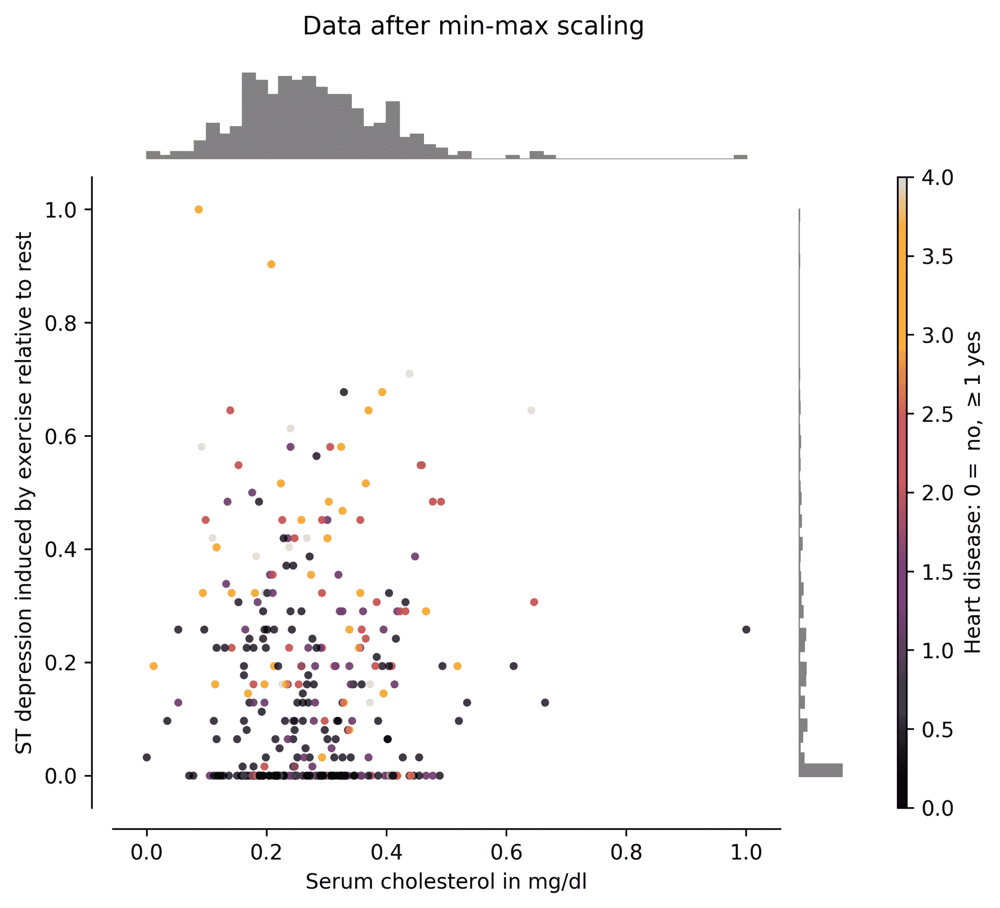

图 3.3–新缩放的列*x*5 和*x*10 的散点图及其相应的直方图

但是，请注意，如果您仔细观察，会发现数据的分布并没有改变。即*图 3.2* 和*图 3.3* 中数据的直方图仍然相同。这是一个非常重要的事实，因为通常你不想改变数据的分布。

## 标准化为零均值和单位方差

预处理实值数据的另一种方法是使其均值和单位方差为零。这个过程有许多名称，如标准化、z 计分、居中或标准化。

假设说***x***=[*x*[5]， *x* [10] ]，从我们上面的特征，那么我们可以标准化 ***x*** 如下:

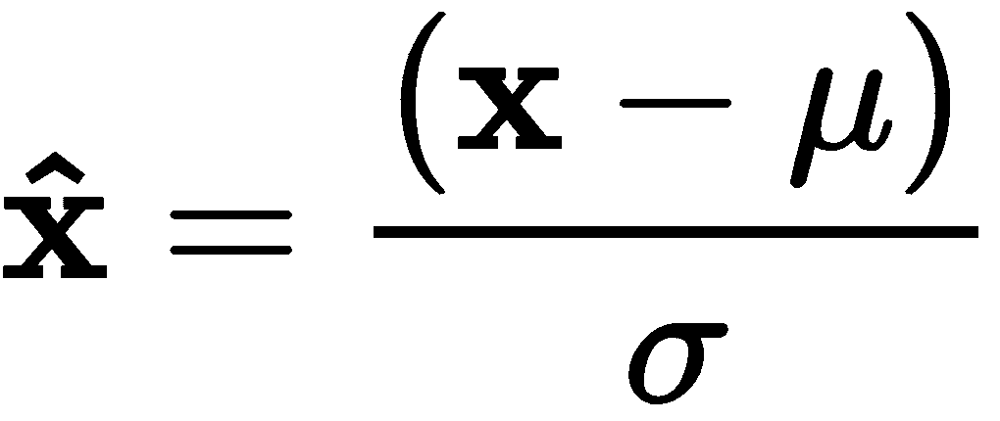

这里，是 ***x*** 上各列均值对应的向量， *σ* 是 ***x*** 中各列标准差的向量。

***x*** 标准化后，如果我们重新计算均值和标准差，应该会得到均值为零，标准差为一。在 Python 中，我们执行以下操作:

```
df[[4,9]] = (df[[4,9]]-df[[4,9]].mean())/df[[4,9]].std()
df[[4,9]].describe()
```

这将输出以下内容:

```
                   4                9
count   3.030000e+02     3.030000e+02
mean    1.700144e-16    -1.003964e-16
std     1.000000e+00     1.000000e+00
min    -2.331021e+00    -8.953805e-01
25%    -6.893626e-01    -8.953805e-01
50%    -1.099538e-01    -2.063639e-01
75%     5.467095e-01     4.826527e-01
max     6.128347e+00     4.444498e+00
```

请注意，在标准化之后，就数值而言，平均值为零。标准差是 1。当然，使用 scikit-learn `StandardScaler`对象也可以做同样的事情，如下所示:

```
from sklearn.preprocessing import StandardScaler
scaler = StandardScaler()
scaler.fit(df[[4,9]])
df[[4,9]] = scaler.transform(df[[4,9]])
```

这将产生相同的结果，数值差异可以忽略不计。实际上，这两种方法可以达到同样的效果。

尽管这两种规范化方法都是合适的，直接在数据框架中或者使用一个`StandardScaler`对象，但是如果你正在生产应用程序中工作，你应该更喜欢使用`StandardScaler`对象。一旦`StandardScaler`对象使用了`fit()`方法，通过重新调用`transform()`方法，它可以很容易地用于新的、看不见的数据；然而，如果我们直接在 pandas 数据框架上做，我们将不得不手动存储均值和标准差，并在每次需要标准化新数据时重新加载。

现在，为了便于比较，*图 3.4* 描绘了数据标准化后的新范围。如果你仔细观察坐标轴，你会注意到零值的位置是大部分数据所在的位置，也就是平均值所在的位置。因此，数据的聚类以平均值 0 为中心:

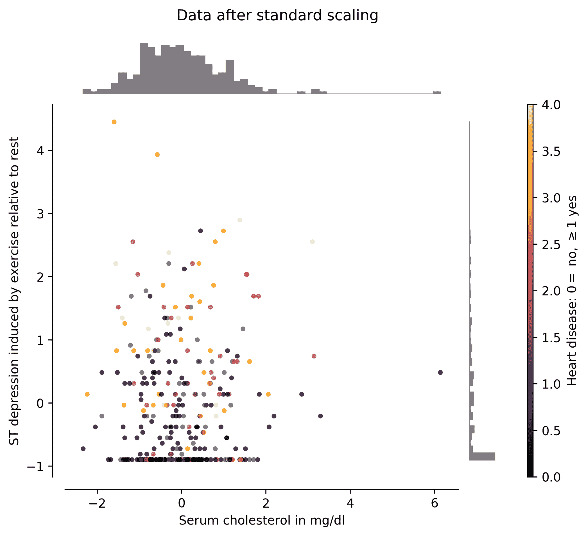

图 3.4-标准化列*x*5 和*x*10 的散点图及其相应的直方图

再次注意，在*图 3.4* 中，应用标准化过程后，数据的分布仍然没有改变。但是如果你真的想改变数据的分布呢？继续读下一节。

# 改变数据的分布

已经证明，改变目标的分布，特别是在回归的情况下，对学习算法的性能有积极的好处(Andrews，D. F .等人(1971))。

这里，我们将讨论一种特别有用的转换，称为**分位数转换**。这种方法旨在观察数据并对其进行处理，使其直方图遵循**正态**分布或**均匀**分布。它通过观察分位数的估计值来实现这一点。

我们可以使用以下命令来转换与上一节中相同的数据:

```
from sklearn.preprocessing import QuantileTransformer
transformer = QuantileTransformer(output_distribution='normal')
df[[4,9]] = transformer.fit_transform(df[[4,9]])
```

这将有效地将数据映射到新的分布，即正态分布。

这里所说的**正态分布**是指一个类高斯的**概率密度函数** ( **PDF** )。这是任何统计学教科书中都能找到的经典分布。在绘图时，通常通过其钟形来识别。

注意，我们还使用了`fit_transform()`方法，它同时执行`fit()`和`transform()`，这很方便。

从*图 3.5* 中可以看出，与胆固醇数据相关的变量*x*5 很容易转换成一个钟形的正态分布。然而，对于*x*10，特定区域中的大量数据会导致分布呈钟形，但具有长尾，这并不理想:

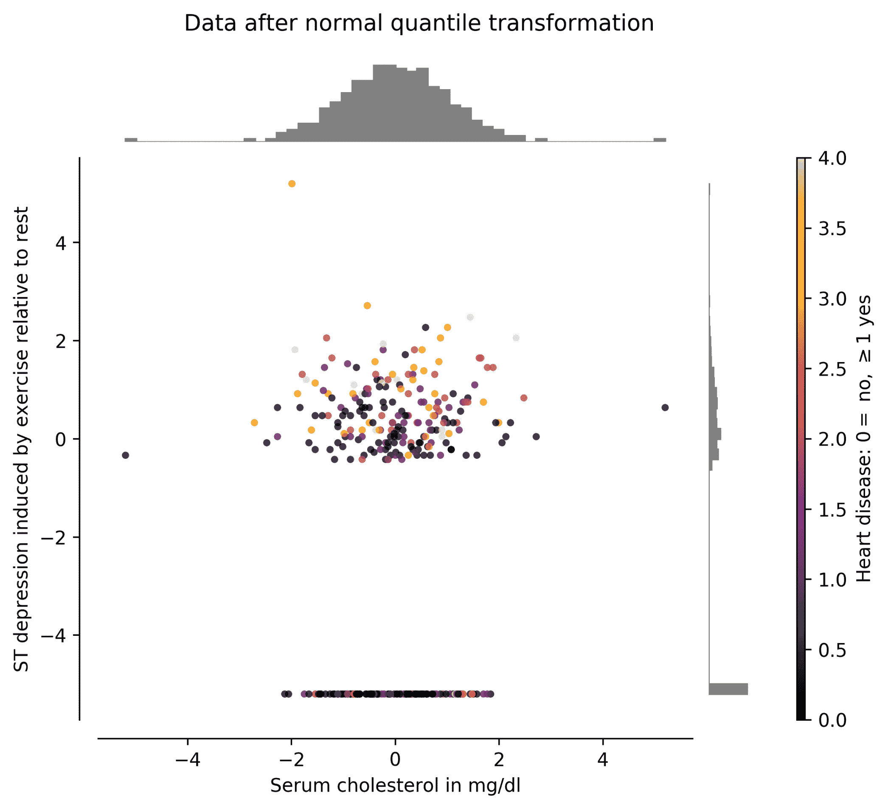

图 3.5–正态变换列*x*5 和*x*10 的散点图及其相应的类高斯直方图

将数据转换为均匀分布的过程非常相似。我们只需要在一行中对`QuantileTransformer()`构造函数做一点小小的修改，如下所示:

```
transformer = QuantileTransformer(output_distribution='uniform')
```

现在，数据被转换成均匀分布，如图*图 3.6* 所示:

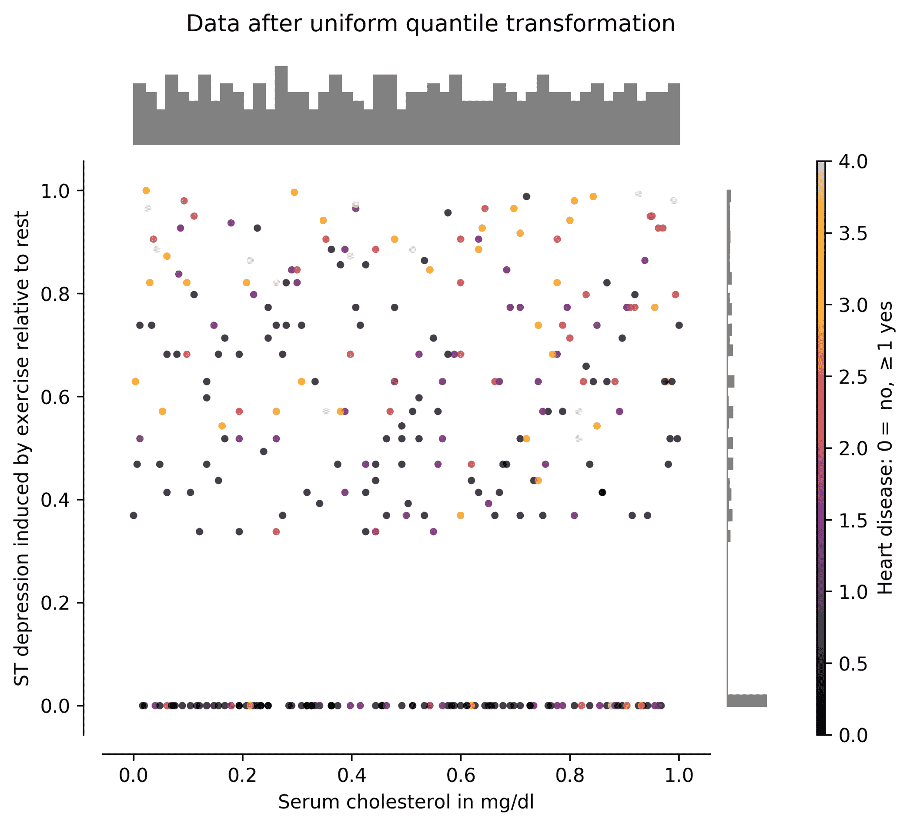

图 3.6–均匀变换列*x*5 和*x*10 的散点图及其对应的均匀直方图

从图中，我们可以看到数据已经均匀地分布在每个变量上。同样，特定区域中的数据聚类会导致值大量集中在同一空间中，这是不理想的。这个工件还在数据的分布中产生了一个通常难以处理的缺口，除非我们使用技术来扩充数据，这将在接下来讨论。

# 数据扩充

既然您已经了解了如何处理数据以获得特定的分布，那么了解数据扩充就很重要，这通常与缺失数据或高维数据有关。传统的机器学习算法在处理维数超过可用样本数的数据时可能会有问题。这个问题并不是所有深度学习算法所特有的，但一些算法在学习建模一个问题时要困难得多，这个问题要解决的变量比要处理的样本还要多。我们有几个选择来纠正这一点:要么我们减少维度或变量(见下一节)，要么我们增加数据集中的样本(本节)。

增加更多数据的工具之一被称为**数据扩充** (Van Dyk，D. A .和 Meng，X. L. (2001))。在这一节中，我们将使用`MNIST`数据集来举例说明一些特定于图像的数据扩充技术，但可以从概念上扩展到其他类型的数据。

我们将涵盖基础知识:添加噪声，旋转和缩放。也就是说，从一个原始的例子，我们将产生三个新的，不同的数字图像。我们将使用名为`scikit image`的图像处理库。

## 改比例

我们像以前一样，从重新加载`MNIST`数据集开始:

```
from sklearn.datasets import fetch_openml
mnist = fetch_openml('mnist_784')
```

然后我们可以简单地调用`rescale()`方法来创建一个重新缩放的图像。调整图像大小的全部目的是将图像重新缩放回其原始大小，因为这使图像看起来像原始图像的小分辨率图像。它在这个过程中失去了一些特征，但它实际上可以做出一个更健壮的深度学习模型。也就是说，该模型对目标的比例，或者在这种情况下，对数字的比例具有鲁棒性:

```
from skimage.transform import rescale
x = mnist.data[0].reshape(28,28)
```

一旦我们有了`x`作为我们将要增强的原始图像，我们就可以按如下方式进行缩放:

```
s = rescale(x, 0.5, multichannel=False)
x_= rescale(s, 2.0, multichannel=False)
```

这里，增强图像(重新缩放)在`x_` *中。*注意，在这种情况下，图像先缩小两倍(50%)，然后再放大两倍(200%)。`multichannel`参数设置为`false`，因为图像只有一个单通道，这意味着它们是灰度的。

重定比例时，小心不要按给你精确除法的因子重定比例。例如，一个 28 x 28 的图像缩小了 0.5 倍，缩小到 14 x 14 这很好。但是如果我们缩小 0.3 倍，它将下降到 8.4×8.4，这将上升到 9×9；这并不好，因为它会增加不必要的复杂性。保持简单。

除了重新缩放，我们还可以稍微修改现有数据，以便在不偏离原始数据太多的情况下对现有数据进行修改，我们将在接下来讨论。

## 添加噪声

同样，我们也可以用加性高斯噪声污染原始图像。这会在整个图像上创建随机图案，以模拟相机问题或噪声采集。在这里，我们还使用它来扩大我们的数据集，并最终产生一个对噪声具有鲁棒性的深度学习模型。

为此，我们使用如下的`random_noise()`方法:

```
from skimage.util import random_noise
x_ = random_noise(x)
```

再一次，增强图像(有噪声)在`x_`中。

除了噪声，我们还可以稍微改变图像的视角，以便在不同的角度保持原始形状，我们将在接下来讨论。

## 轮流

我们可以在图像上使用简单的旋转效果来获得更多的数据。图像的旋转是从图像中学习良好特征的关键部分。较大的数据集自然包含许多稍微旋转或完全旋转的图像版本。如果我们的数据集中没有这样的图像，我们可以手动旋转它们并扩充我们的数据。

为此，我们这样使用`rotate()`法:

```
from skimage.transform import rotate
x_ = rotate(x, 22)
```

在本例中，数字`22`指定了旋转角度:

扩充数据集时，可能需要考虑以随机角度进行多次旋转。

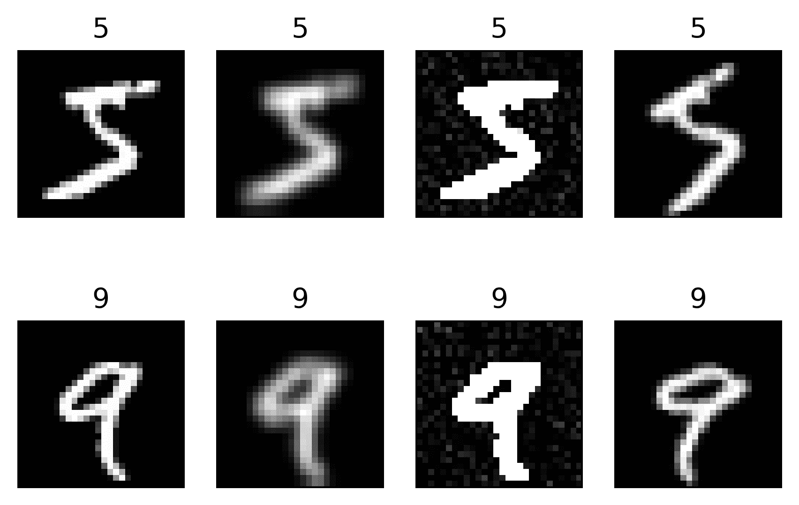

图 3.7–使用前述数据增强技术生成的图像示例

第一列是 MNIST 数据集的原始数字。第二列显示了重新调整的效果。第三列显示原始加性高斯噪声。最后一列显示旋转 20 度(上)和-20 度(下)。

## 其他增强技术

对于影像数据集，还有其他增加数据的方法，包括:

*   改变图像的投影
*   添加压缩噪声(量化图像)
*   除高斯噪声之外的其他类型的噪声，如椒盐噪声或乘法噪声
*   图像随机平移不同的距离

但是最强大的增强将是所有这些的组合！

图像很有趣，因为它们在局部区域高度相关。但是对于一般的非图像数据集，如心脏病数据集，我们可以用其他方法增加数据，例如:

*   添加低方差高斯噪声
*   添加压缩噪声(量化)
*   从数据上计算的概率密度函数中绘制新点

对于其他特殊数据集，如基于文本的数据，我们还可以执行以下操作:

*   用同义词替换一些单词
*   删除一些单词
*   添加包含错误的单词
*   去掉标点符号(只有当你不关心正确的语言结构时)

有关这种和许多其他增强技术的更多信息，请参考与您的特定数据类型相关的最新进展的在线资源。

现在让我们深入探讨一些降维技术，这些技术可以用来缓解高维和高度相关的数据集的问题。

# 数据降维

如前所述，如果我们的数据中存在维度(或变量)多于样本的问题，我们可以增加数据或减少数据的维度。现在，我们将解决后者的基本问题。

我们将研究在监督和非监督的情况下，对大小数据集进行降维。

## 监督算法

监督降维算法之所以被称为监督降维算法，是因为它们将数据的标签考虑在内，以找到更好的表示。这种方法通常会产生良好的效果。也许最流行的一种叫做**线性判别分析** ( **LDA** )，我们接下来会讨论。

### 线性判别分析

Scikit learn 有一个`LinearDiscriminantAnalysis`类，可以很容易地对所需数量的组件进行降维。

通过**组件数量**，了解所需的尺寸数量。名字来源于**主成分分析** ( **PCA** )，这是一种确定数据集的中心协方差矩阵的特征向量和特征值的统计方法；然后，已知与特定特征向量相关联的最大特征值是最重要的*主*分量。当我们使用 PCA 来减少特定数量的分量时，我们说我们希望将那些最重要的分量保留在由数据的协方差矩阵的特征值和特征向量所诱导的空间中。

LDA 和其他降维技术也具有类似的原理，其中它们的目标是找到低维空间(基于期望的组件数量),该低维空间可以基于数据的其他属性更好地表示数据。

如果我们使用心脏病数据集作为例子，我们可以执行 LDA 以将整个数据集从 13 维减少到 2 维，同时使用标签[0，1，2，3，4]通知 LDA 算法如何更好地分离由这些标签表示的组。

为此，我们可以遵循以下步骤:

1.  首先，我们重新加载数据并删除丢失的值:

```
from sklearn.discriminant_analysis import LinearDiscriminantAnalysis
df = pd.read_csv('processed.cleveland.data', header=None)
df = df.apply(pd.to_numeric, errors='coerce').dropna()
```

请注意，我们以前不必处理心脏病数据集上的缺失值，因为 pandas 会自动忽略缺失值。但是在这里，因为我们严格地将数据转换为数字，所以缺失的值将被转换为`NaN`，因为我们指定了`errors='coerce'`，这使得转换中的任何错误都变成了`NaN`。因此，使用`dropna()`，我们忽略数据集中具有这些值的行，因为它们会导致 LDA 失败。

2.  接下来，我们准备`X`和`y`变量来分别包含数据和目标，我们执行 LDA 如下:

```
X = df[[0,1,2,3,4,5,6,7,8,9,10,11,12]].values
y = df[13].values

dr = LinearDiscriminantAnalysis(n_components=2)
X_ = dr.fit_transform(X, y)
```

在这个例子中，`X_`包含用二维表示的整个数据集，如`n_components=2`所示。选择两个组件只是为了以图形方式展示数据的外观。但是您可以根据需要将它更改为任意数量的组件。

*图 3.8* 描绘了 13 维数据集压缩或缩减为二维后的样子:

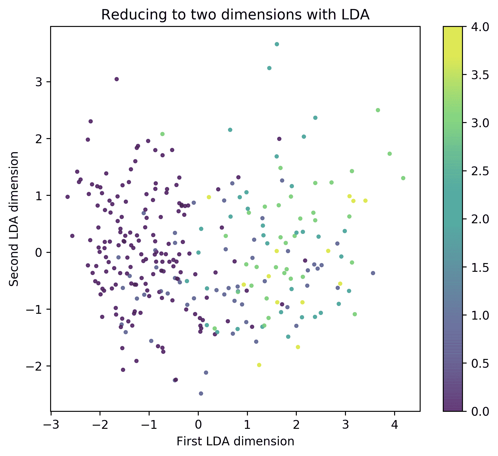

图 3.8–使用 LDA 将维度从 13 减少到 2

请注意，0 值(无心脏病)大多集中在左侧，而其余值(即 1、2、3 和 4，表示心脏病)似乎集中在右侧。这是一个很好的特性，当我们从 13 列中挑选出两列时，在图**3.2*到 *3.6* 中没有观察到。*

 *从技术上讲，13 维的相关信息仍然包含在 LDA 导出的 2 维中。如果数据在这些低维表示中似乎是可分离的，深度学习算法可能有很好的机会学习表示，以对数据进行高性能的分类或回归。

虽然 LDA 可以提供一种非常好的方法来执行由数据中的标签所通知的维度减少，但是我们可能并不总是有标签数据，或者我们可能不想使用我们已经有的标签。在这种情况下，我们可以也应该探索其他不需要标签信息的可靠方法，例如无监督技术，我们将在接下来讨论。

## 无人监督的技术

无监督技术是最流行的方法，因为它们不需要关于标签的先验信息。我们从 PCA 的内核化版本开始，然后我们继续讨论在更大的数据集上操作的方法。

### 核主成分分析

主成分分析的这种变体使用核方法来估计距离、方差和其他参数，以确定数据的主要成分(schlkopf，b .等人(1997 年))。与常规的 PCA 相比，它可能需要更多的时间来生成一个解决方案，但是与传统的 PCA 相比，它是非常值得使用的。

scikit-learn 的`KernelPCA`类可按如下方式使用:

```
from sklearn.decomposition import KernelPCA

dr = KernelPCA(n_components=2, kernel='linear')
X_ = dr.fit_transform(X)
```

同样，我们使用二维空间作为新空间，并且我们使用一个`'linear'`内核。内核的其他流行选择包括:

*   `'rbf'`对于径向基函数核
*   `'poly'`对于多项式核

就个人而言，我总体上喜欢`'rbf'`内核，因为它更强大、更健壮。但通常，你会花费宝贵的时间来确定参数 *γ* 的最佳值，这就是径向基函数的钟形宽度。如果您有时间，尝试`'rbf'`并试验参数`gamma`。

使用内核 PCA 的结果如图*图 3.9* 所示。该图再次示出了朝向 KPCA 诱发空间左下方的阴性类别(没有心脏病，值为 0)的聚类排列。阳性类别(心脏病，数值≥ 1)倾向于向上聚集:

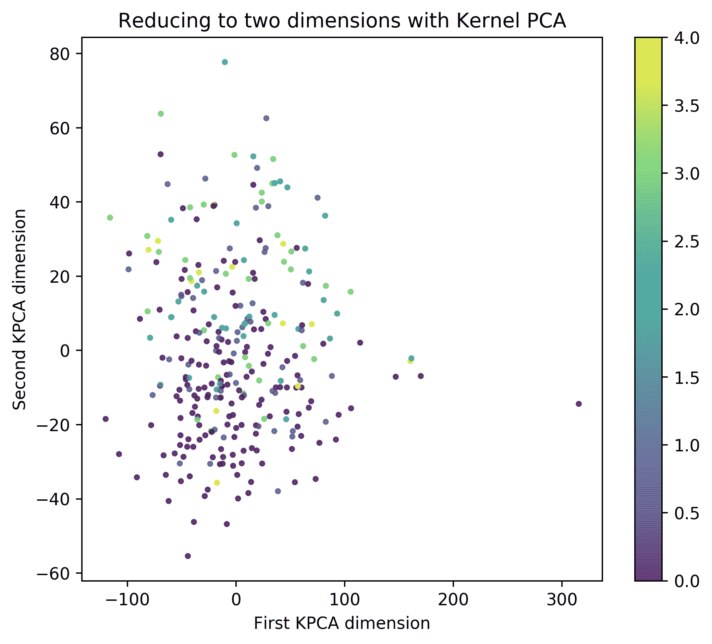

图 3.9–使用内核 PCA 将维数从 13 降低到 2

与*图 3.8* 相比，LDA 产生了一个稍微好一点的空间，可以在那里将各组分开。然而，KPCA 做得很好，尽管现在知道实际的目标阶层。现在，LDA 和 KPCA 可能不会花时间在小数据集上，但是如果我们有很多数据呢？接下来我们将讨论一些选项。

### 大型数据集

前面的例子适用于中等规模的数据集。然而，当处理非常大的数据集时，即具有许多维度或许多样本时，一些算法可能无法发挥其最佳功能。在最坏的情况下，他们将无法拿出一个解决方案。接下来的两个无监督算法被设计为通过使用一种叫做**批量训练**的技术来很好地处理大型数据集。这种技术是众所周知的，并已成功应用于机器学习(Hinton，G. E. (2012))。

主要想法是将数据集分成小(迷你)批，并朝着找到手头问题的全局解决方案的方向取得部分进展。

#### 稀疏主成分分析

我们将首先研究 scikit 中提供的 PCA 的稀疏编码版本——学名为`MiniBatchSparsePCA`。该算法将确定到满足稀疏性约束的子空间的最佳变换。

**Sparsity** is a property of matrices (or vectors) in which most of the elements are zeros. The opposite of sparsity is density. We like sparsity in deep learning because we do a lot of tensor (vector) multiplications, and if some of the elements are zeros, we do not have to perform those multiplications, thus saving time and optimizing for speed.

按照下面的步骤使用`MNIST`数据集并减少其维数，因为它有 784 个维数和 70，000 个样本。它足够大，但也可以使用更大的数据集:

1.  我们首先重新加载数据，并为稀疏 PCA 编码做准备:

```
from sklearn.datasets import fetch_openml
mnist = fetch_openml('mnist_784')

X = mnist.data
```

2.  然后，我们按如下方式进行降维:

```
from sklearn.decomposition import MiniBatchSparsePCA

dr = MiniBatchSparsePCA(n_components=2, batch_size=50, 
                        normalize_components=True)
X_ = dr.fit_transform(X)
```

这里，`MiniBatchSparsePCA()`构造函数有三个参数:

*   `n_components`，出于可视化的目的，我们将其设置为 2。
*   `batch_size`决定算法一次使用多少样本。我们将其设置为`50`，但是较大的数字可能会导致算法变慢。
*   `normalize_components`是指通过*对数据进行居中*的预处理，即使其具有零均值和单位方差；我们建议每次都这样做，尤其是如果您有高度相关的数据，比如图像。

使用稀疏 PCA 转换的`MNIST`数据集看起来如*图 3.10* 所示:

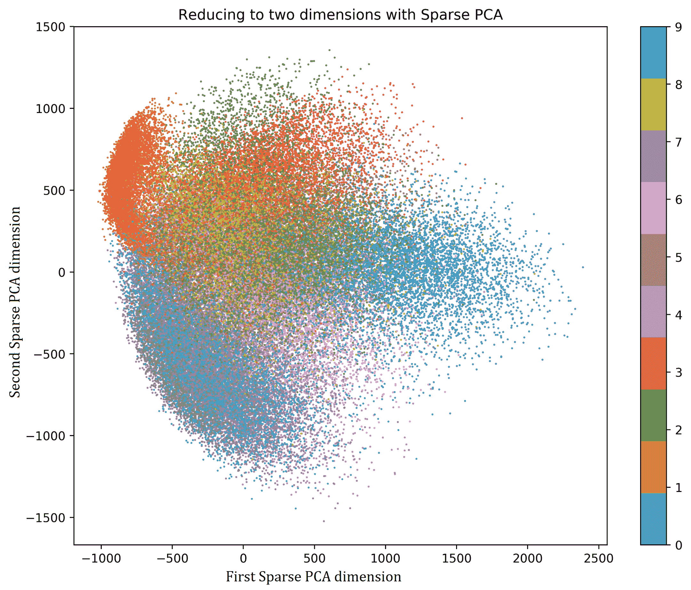

图 3.10–使用稀疏主成分分析将 MNIST 数据集缩减为二维

正如你所看到的，类之间的分离并不完全清楚。有一些确定的数字簇，但是由于组之间的重叠，这似乎不是一个简单的任务。这部分是由于许多数字可能看起来很相似。将数字 1 和 7 聚集在一起(左边上下)，或者 3 和 8(中间上下)是有意义的。

但是，让我们也使用另一种流行而有用的算法，称为字典学习。

#### 词典学习

字典学习是学习转换基础的过程，称为**字典**，通过使用一个可以轻松扩展到非常大的数据集的过程(Mairal，j .，et al. (2009))。

这对于基于 PCA 的算法来说是不可能的，但这项技术仍然非常强大，最近在世界上一个主要会议上获得了*时间考验*奖，即 *2019* *实习生* *国家机器学习会议。*

该算法可通过`MiniBatchDictionaryLearning`类在 scikit-learn 中获得。我们可以如下使用它:

```
from sklearn.decomposition import MiniBatchDictionaryLearning

dr = MiniBatchDictionaryLearning(n_components=2, batch_size=50)
X_ = dr.fit_transform(X)
```

构造函数`MiniBatchDictionaryLearning()`采用与`MiniBatchSparsePCA()`相似的参数，具有相同的含义。学习空间的结果如*图 3.11* 所示:

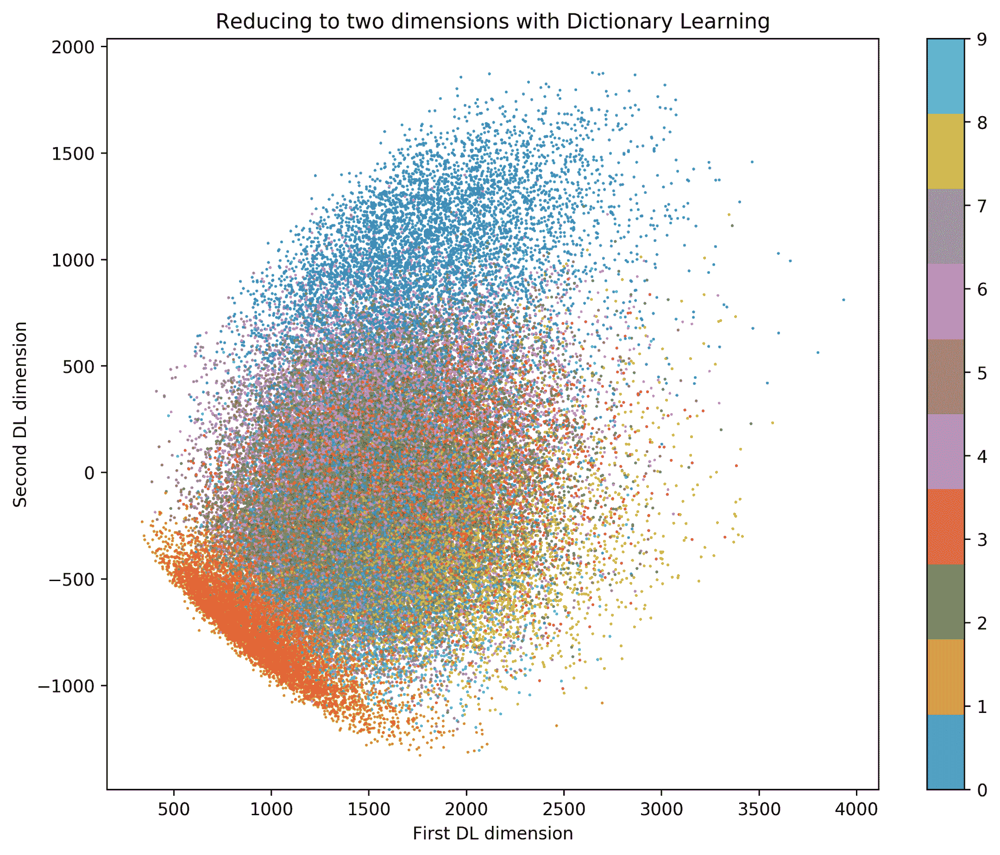

图 3.11–使用字典学习将 MNIST 数据降维至二维

可以看出，即使有明确定义的聚类，在类之间也有显著的重叠。如果该数据(二维数据)被用作训练分类器的输入，这可能导致较差的性能结果。这并不意味着算法一定不好。这可能意味着，也许二维并不是最终维度的最佳选择。请继续阅读，了解更多相关信息。

## 关于维度的数量

减小尺寸并不总是必要的步骤。但是对于高度相关的数据，例如图像，强烈推荐使用这种方法。

所有讨论过的降维技术实际上都是努力去除数据中的冗余信息，保留重要内容。如果我们要求一个算法将非相关、非冗余数据集的维度从 13 维减少到 2 维，这听起来有点冒险；也许 8 或 9 会是一个更好的选择。

没有一个认真的机器学习者会试图将一个 784 维的不相关、不冗余的数据集减少到只有 2 维。即使数据是高度相关和冗余的，如`MNIST`数据集，要求从 784 减少到 2 也是一个很大的挑战。这是一个非常冒险的决定，可能会去掉重要的、判别性的、相关的信息；也许 50 或 100 会是一个更好的选择。

没有一个通用的方法来确定哪一个维度是好的。这是一个需要实验的过程。如果你想在这方面变得优秀，你必须尽职尽责，至少尝试两个或更多不同维度的实验。

# 操纵数据的伦理含义

在处理数据时，你需要知道许多道德含义和风险。我们生活在一个大多数深度学习算法都必须通过重新训练来纠正的世界，因为人们发现它们有偏见或不公平。这是非常不幸的；你想成为一个行使负责任的人工智能和生产深思熟虑的模型的人。

当操作数据时，要小心移除数据中的异常值，因为您认为它们会降低模型的性能。有时，离群值代表关于受保护群体或少数群体的信息，删除这些信息会使不公平永久化，并引入对多数群体的偏见。避免删除异常值，除非您绝对确定它们是由传感器故障或人为错误导致的错误。

请注意转换数据分布的方式。在大多数情况下，改变分布是好的，但是如果您正在处理人口统计数据，您需要密切关注您正在转换的内容。

当处理性别等人口统计信息时，如果我们考虑比例，将女性和男性编码为 0 和 1 可能会有风险；我们需要小心，不要促进不反映将使用您的模型的社区的现实的平等(或不平等)。例外是当我们当前的现实显示出非法的歧视、排斥和偏见。那么，我们的模型(基于我们的数据)不应该反映这个现实，而是我们的社区想要的合法现实。也就是说，我们将准备好良好的数据来创建模型，而不是使社会问题永久化，而是反映我们想要成为的社会的模型。

# 摘要

在这一章中，我们讨论了许多数据操作技术，我们会一直用到它们。现在花时间做这件事比以后做好。这将使我们对深度学习架构的建模变得更加容易。

阅读本章后，您现在能够操作和生成用于分类或要素表示的二进制数据。您还知道如何处理分类数据和标签，并为分类或回归做准备。当您拥有实值数据时，您现在知道了如何识别统计属性以及如何对这些数据进行规范化。如果您曾经遇到过非正态或非均匀分布的数据问题，现在您知道如何解决这个问题了。如果你遇到没有足够数据的问题，你可以学习一些数据扩充技术。在本章的末尾，你学习了一些最流行的降维技术。在这个过程中，你会学到更多，例如，当我们谈到自编码器时，它也可以用于降维。但是耐心等待，我们会及时到达那里。

现在，我们将继续我们关于基础机器学习的下一个介绍性主题的旅程。[第四章](7f55e68e-2e9f-486f-9337-5b2ea7bdb504.xhtml)、*、*从数据中学习，介绍了围绕深度学习理论的最基本概念，包括测量回归和分类的性能，以及过度拟合的识别。然而，在我们去那里之前，请试着用下面的问题来测验你自己。

# 问题和答案

1.  **心脏数据集的哪些变量适合回归？**

实际上，全部都是。但是理想的是那些真正有价值的。

2.  **数据的缩放会改变数据的分布吗？**

不，分布是一样的。均值和方差等统计指标可能会改变，但分布保持不变。

3.  **有监督和无监督降维方法的主要区别是什么？**

监督算法使用目标标签，而非监督算法不需要该信息。

4.  **什么时候使用基于批量的降维比较好？**

当你有非常大的数据集时。

# 参考

*   克利夫兰心脏病数据集(1988 年)。主要研究者:
    a .匈牙利心脏病研究所。布达佩斯:安朵斯·雅诺西，医学博士
    b .瑞士苏黎士大学医院:威廉·斯坦布伦，医学博士
    c .瑞士巴塞尔大学医院:马蒂亚斯·普菲斯特勒，医学博士
    d. V.A .医学中心，长滩和克利夫兰诊所基金会:罗伯特·德特拉诺，医学博士
*   Detrano，r .，Janosi，a .，Steinbrunn，w .，Pfisterer，m .，Schmid，J.J .，桑德胡，s .，Guppy，K.H .，Lee，s .和 Froelicher，v .(1989 年)。诊断冠状动脉疾病的新概率算法的国际应用。*美国心脏病学杂志*，64 卷 5 期，304-310 页。
*   邓(2012)。用于机器学习研究的 MNIST 手写数字图像数据库。 *IEEE 信号处理杂志*，29(6)，141-142。
*   塞兹金博士和桑库尔博士(2004 年)。图像阈值技术及量化性能评价综述。*电子成像杂志*，13(1)，146-166。

*   Potdar，k .，Pardawala，T. S .，和 Pai，C. D. (2017)。神经网络分类器分类变量编码技术的比较研究。*国际计算机应用杂志*，175(4)，7-9。
*   哈宁大学(2018 年)。哪些神经网络架构会导致爆炸和消失梯度？。在*神经信息处理系统的进展*(第 591—582 页)。
*   安德鲁斯，D. F .，Gnanadesikan，r .和华纳，J. L. (1971)。多元数据的转换。*生物统计学*，825-840。
*   范代克，孟晓林(2001)。数据扩充的艺术。*计算与图形统计杂志*，10 卷 1 期，1-50 页。
*   schlkopf，b .，Smola，a .，和 Müller，K. R. (1997 年，10 月)。核主成分分析。在*人工神经网络国际会议*(第 583-588 页)。斯普林格，柏林，海德堡。
*   辛顿通用电气公司(2012 年)。训练受限玻尔兹曼机器的实用指南。在*神经网络:交易技巧*(第 599-619 页)。斯普林格，柏林，海德堡。
*   Mairal，j .，Bach，f .，Ponce，j .，和 Sapiro，g .(2009 年 6 月)。稀疏编码的在线字典学习。在*第 26 届机器学习国际年会论文集*(第 689-696 页)。ACM。*