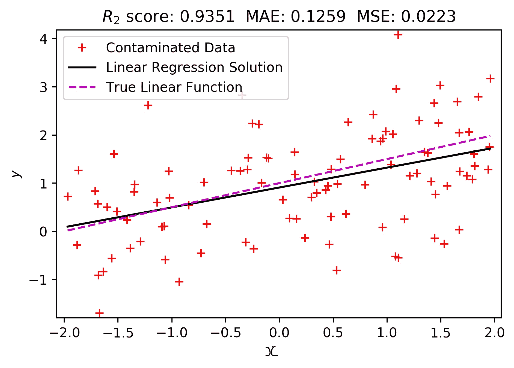
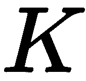

# 四、从数据中学习

正如我们在前一章所看到的，对于复杂的数据集，数据准备需要大量的时间。然而，花在数据准备上的时间是值得的...这一点我可以保证！同样，投资时间来理解从数据中学习的基本理论对于任何想要加入深度学习领域的人来说都是超级重要的。每当你阅读新的算法或评估你自己的模型时，理解学习理论的基础将会有所收获。当你读到本书后面的章节时，它也会让你的生活变得容易得多。

更具体地说，本章介绍了围绕深度学习理论的最基本的概念，包括测量回归和分类的性能，以及过度拟合的识别。它还对模型超参数的敏感性和优化的必要性提出了一些警告。

本章的大纲如下:

*   有目的的学习
*   衡量成功和错误
*   识别过度拟合和泛化
*   学习背后的艺术
*   训练深度学习算法的伦理含义

# 有目的的学习

在[第三章](https://cdp.packtpub.com/deep_learning_for_beginners/wp-admin/post.php?post=26&action=edit)、*准备数据*中，我们讨论了两大类问题如何准备数据:**回归**和**分类**。在这一节中，我们将更详细地讨论分类和回归之间的技术差异。这些差异很重要，因为它们将限制您可以用来解决问题的机器学习算法的类型。

## 分类

你怎么知道你的问题是不是分类？答案取决于两个主要因素:你试图解决的**问题**和你必须解决的**数据**。当然，可能还有其他因素，但这两个因素是最重要的。

如果你的目的是建立一个模型，在给定一些输入的情况下，确定模型的响应或输出是区分两个或更多不同的类别，那么你就有一个分类问题。以下是分类问题示例的非详尽列表:

*   给定一幅图像，指出它包含什么数字(区分 10 个类别:0-9 位数)。
*   给定一幅图像，指出它是否包含一只猫(区分两类:是或否)。
*   给出一系列关于温度的读数，确定季节(区分四个类别:四季)。
*   给定一条推文的文本，确定情绪(区分两类:积极或消极)。
*   给定一个人的形象，确定年龄组(区分五类:<18, 18-25, 26-35, 35-50, > 50)。
*   给定一只狗的图像，确定它的品种(区分 120 个类别:那些国际公认的品种)。
*   给定整个文档，确定它是否被篡改(区分类别:真实的或被篡改的)。
*   给定光谱辐射计的卫星读数，确定地理位置是否与植被的光谱特征匹配(区分两类:是或否)。

从列表中的例子可以看出，不同类型的问题有不同类型的数据。我们在这些例子中看到的数据被称为**标签数据**。

未标记的数据非常常见，但很少用于分类问题，除非进行某种处理，使数据样本与类别相匹配。例如，可以对未标记的数据使用无监督聚类，以将数据分配到特定的聚类(如组或类别)；此时，数据在技术上变成了“标记数据”

列表中需要注意的另一件重要事情是，我们可以将分类问题分为两大类:

*   **二元分类**:仅用于任意两类之间的分类
*   **多级分类**:用于两级以上的分类

这种区分似乎是武断的，但事实并非如此；事实上，分类的类型将限制您可以使用的学习算法的类型和您可以预期的性能。为了更好地理解这一点，让我们分别讨论每个分类。

### 二元分类

这种类型的分类通常被认为是一个比多类简单得多的问题。事实上，如果我们能够解决二进制分类问题，从技术上来说，我们可以通过决定将问题分解为几个二进制分类问题的策略来解决多类问题( *Lorena，A. C.* 等人， *2008* )。

这被认为是一个简单问题的原因之一是因为二进制分类学习算法背后的算法和数学基础。假设我们有一个二元分类问题，比如[第三章](https://cdp.packtpub.com/deep_learning_for_beginners/wp-admin/post.php?post=26&action=edit)、*准备数据*中解释的 Cleveland 数据集。这个数据集由每个病人的 13 个医学观察组成——我们可以称之为。对于这些患者记录中的每一个，都有一个相关的标签，表明该患者是否患有某种类型的心脏病(+1)或(-1)——我们将称之为。因此，具有 *N* 个样本的整个数据集可以定义为一组数据和标签:


然后，正如在[第 1 章](https://cdp.packtpub.com/deep_learning_for_beginners/wp-admin/post.php?post=24&action=edit)、*机器学习简介*中所讨论的，学习的全部要点是使用一种算法，该算法将找到映射输入数据 **x** 的方法，为 [] 中的所有样本正确地标记 *y* ，并且能够进一步为已知数据集之外的样本这样做(希望如此)。使用一个感知器和一个对应的**感知器学习算法** ( **PLA** )，我们要的是找到能够满足以下的参数 [] :


对于所有样本， *i* = 1，2，...、 *N.* 然而，正如我们在[第一章](https://cdp.packtpub.com/deep_learning_for_beginners/wp-admin/post.php?post=24&action=edit)、*机器学习简介*中所讨论的，如果数据是非线性可分的，则方程不能满足。在这种情况下，我们可以得到一个近似值，或一个预测，这不一定是想要的结果；我们将这样的预测称为。

于是，学习算法的全部意义就变成了减少期望目标标签和预测之间的差异。在一个理想的世界中，我们希望适用于 *i* = 1，2，...、 *N.* 在 *i* where 的情况下，学习算法必须通过寻找有希望更好的新参数来做出调整(即训练自己)以避免将来犯这样的错误。

这些算法背后的科学原理因型号而异，但最终目标通常是相同的:

*   减少每次学习迭代中的错误数量。
*   在尽可能少的迭代(步骤)中学习模型参数。
*   尽快学习模型参数。

由于大多数数据集处理不可分离的问题，PLA 被忽略，以利于其他算法收敛更快，迭代次数更少。许多像这样的学习算法通过采取特定步骤来调整参数以减少误差，基于关于误差可变性的导数和参数的选择。因此，最成功的算法(至少在深度学习中)是基于某种梯度下降策略的算法(Hochreiter，s .等人，2001)。

现在，让我们回顾一下最基本的迭代梯度策略。假设我们想要学习给定数据集的参数。我们将不得不对问题的表述做一个小小的调整，使事情变得简单一点。我们想要的是被隐含在这个表达中。唯一可行的方法是我们设置和。

通过这种简化，我们可以简单地搜索 **w** ，这也意味着搜索 **b** 。具有固定*学习率*的梯度下降如下:

1.  将权重初始化为零()并将迭代计数器初始化为零()。
2.  当时，执行以下操作:

1.  计算相对于的梯度，并存储在中。
2.  更新，使其看起来像这样:。
3.  增加迭代计数器并重复。

这里有几件事需要解释一下:

*   梯度计算并不简单。对于一些特定的机器学习模型，可以解析确定；但在大多数情况下，它必须通过使用一些最新的算法进行数值确定。
*   我们仍然需要定义如何计算误差；但这将在本章的下一节讨论。
*   学习率也需要被指定，这本身就是一个问题。

看待最后一个问题的一种方式是，为了找到使误差最小化的参数，我们需要参数。现在，当应用梯度下降时，我们可以考虑寻找参数，但我们将陷入无限循环。我们不会更详细地讨论梯度下降及其学习率，因为现在梯度下降的算法通常包括自动计算梯度下降或调整梯度下降的自适应方法(Ruder，S. 2016)。

### 多类分类

分类成多个类别对学习算法的性能有重要影响。一般来说，模型的性能会随着需要识别的类的数量而降低。例外情况是，如果你有大量的数据和大量的计算能力，因为如果你这样做，你可以克服存在类不平衡问题的差数据集的限制，你可以估计大规模梯度，并对模型进行大量计算和更新。计算能力在未来可能不是一个限制，但目前是。

多类问题可以通过使用**一对一**或**一对一**等策略来解决。

在“一个对所有”模式中，您实际上拥有一个专家二元分类器，能够很好地从所有其他模式中识别出一个模式，并且实现策略通常是级联的。这里显示了一个示例:

```
if classifierSummer says is Summer: you are done
else:
 if classifierFall says is Fall: you are done
 else:
   if classifierWinter says is Winter: you are done
   else:
     it must be Spring and, thus, you are done
```

下面是这种策略的图解说明。假设我们有二维数据，它告诉我们一年中四季的一些情况，如下所示:


图 4.1 -随机化的二维数据可以告诉我们一年中四季的一些情况

在这个随机二维数据的例子中，我们有四个类别对应于一年中的四个季节。二元分类不会直接起作用。然而，我们可以训练专业的二元分类器，专门处理*一个*特定的类别*和所有其他的*。如果我们使用简单的感知器训练一个二元分类器来确定数据点是否属于 Summer 类别，我们可以得到如下所示的分离超平面:


图 4.2:一个擅长区分夏季数据和其他季节数据的计划

同样，我们可以训练其余的专家，直到我们有足够的证据来检验我们的整个假设；也就是说，直到我们能够区分所有的类。

另一种选择是使用能够处理多个输出的分类器；例如，决策树或集成方法。但在深度学习和神经网络的情况下，这是指在输出层可以有多个神经元的网络，比如在[第一章](https://cdp.packtpub.com/deep_learning_for_beginners/wp-admin/post.php?post=24&action=edit)、*机器学习简介*中的*图 1.6* 和*图 1.9* 中描绘的网络。

多输出神经网络的数学公式与单输出神经网络仅略有不同，因为输出不再是二进制值集，如，而是一个独热编码值的向量，如。在这种情况下，| * C * |表示集合 *C* 的大小，它包含所有不同的类标签。对于前面的例子， *C* 将包含以下内容: *C* = {' *夏季*'，'*秋季*'，'*冬季*'，'*春季* '}。以下是每种热编码的样子:

*   **夏天** : 
*   **摔倒** : 
*   **冬季** : 
*   **弹簧** : 

目标向量中的每个元素将对应于四个神经元的期望输出。我们还应该指出，数据集定义现在应该反映样本输入数据和标签都是向量:


处理多类分类问题的另一种方法是使用**回归**。

## 回归

以前，我们指定对于二进制分类，目标变量可以采用一组二进制值；比如。我们还说过，对于多重分类，我们可以将目标变量修改为一个向量，其大小取决于类别的数量。嗯，回归问题处理的是目标变量是任意实值的情况，。

这里的含义非常有趣，因为利用回归模型和算法，我们可以从技术上*进行二进制分类，因为实数集包含任何二进制数集:*

。

此外，如果我们将 *C* = {' *夏季*'、*秋季*'、*冬季*'、*春季* '}改为数值表示，例如 C = {0，1，2，3}，则*技术上为*，由于相同的性质，我们将再次使用回归:

。

虽然回归模型可以解决分类问题，但建议您使用专门用于分类的模型，并将回归模型仅用于回归任务。

即使回归模型可用于分类(Tan，x .，et.al. 2012)，它们也是目标变量为实数时的理想选择。以下是回归问题的示例列表:

*   当给定一幅图像时，指出图像中有多少人(输出可以是> =0 的任何整数)。
*   当给定一幅图像时，指出它包含一只猫的概率(输出可以是 0 到 1 之间的任何实数)。
*   当给出一系列温度读数时，确定温度的实际感觉(输出可以是任何整数，其范围取决于单位)。
*   当给定一条推文的文本时，确定它具有攻击性的概率(输出可以是 0 到 1 之间的任何实数)。
*   当给定一个人的图像时，确定他们的年龄(输出可以是任何正整数，通常小于 100)。
*   给定整个文档时，确定可能的压缩率(输出可以是 0 到 1 之间的任何实数)。
*   当给定光谱辐射计的卫星读数时，确定相应的红外值(输出可以是任何实数)。
*   当给定一些主要报纸的标题时，确定石油的价格(输出可以是> =0 的任意实数)。

正如您从该列表中看到的，由于实数的范围包含所有整数和所有正数和负数，因此存在许多可能性，即使该范围对于特定应用来说太宽，回归模型也可以放大或缩小以满足范围规格。

为了解释回归模型的潜力，让我们从一个基本的**线性回归**模型开始，在后面的章节中，我们将涵盖基于深度学习的更复杂的回归模型。

线性回归模型试图解决以下问题:


对于 *i* = 1，2，...然而，我们可以使用与之前相同的技巧，将 *b* 的计算包含在同一个等式中。所以，我们可以说，我们正在努力解决以下问题:


再一次，我们试图学习参数，该参数对于 *i.* 的所有情况产生。在线性回归的情况下，如果输入数据以某种方式描述了一条完美的直线，则预测应该理想地等于真实目标值。但是因为这是非常不可能的，必须有一种学习参数的方法，，即使。为了实现这一点，线性回归学习算法首先描述了对小错误的低惩罚和对大错误的较大惩罚。这确实有道理，对吧？非常直观。

按照错误大小的比例来惩罚错误的一种自然方法是计算预测值和目标值之间的差值的平方。下面是一个差异很小的例子:


以下是差异较大时的一个示例:


在这两个例子中，期望的目标值是`1`。在第一种情况下，`0.98`的预测值非常接近目标值，并且平方差为`0.0004`，这与第二种情况相比很小。第二个预测被`14.8`关闭，这产生了`219.4`的平方差。对于构建学习算法来说，这似乎是合理和直观的；也就是说，根据错误的大小进行相应的惩罚。

我们可以正式地将选择参数 **w** 的函数中的总平均误差定义为所有平方误差的平均和，也称为**均方误差(MSE)** :

。

如果我们根据的当前选择将预测定义为，那么我们可以将误差函数重写如下:

。

这可以根据-范数(也称为欧几里德范数，)进行简化，首先定义一个数据矩阵，其元素是数据向量和相应目标的向量，如下所示:

。

误差的简化如下:


这可以扩展成以下重要等式:

。

这一点很重要，因为它有助于计算误差的导数，这是在导数方向上与误差成比例地调整参数所必需的。现在，根据线性代数的基本性质，我们可以说误差的导数(称为梯度，因为它产生一个矩阵)如下:

。

因为我们想要找到产生最小误差的参数，所以我们可以将梯度设置为`0`并求解。通过将梯度设置为`0`并忽略常量值，我们得到如下结果:


。

这些被称为**正规** **方程** (Krejn，S. G. E. 1982)。然后，如果我们简单地使用术语，我们得到一个**伪逆**的定义(g . Golub 和 w . Kahan，1965)。其美妙之处在于，我们不需要迭代计算梯度来选择最佳参数。事实上，由于梯度是解析的和直接的，我们可以一次性计算出 ，如这个线性回归算法所解释的:

1.  从开始，构建对，。
2.  估计伪逆。
3.  计算并返回。

为了形象地说明这一点，假设我们有一个系统，它发送一个遵循线性函数的信号；然而，信号在传输时被带有`0`均值和单位方差的正常噪声污染，我们只能观察到噪声数据，如图所示:


图 4.3 -被随机噪声污染的数据读数

比方说，如果黑客读取这些数据并运行线性回归来尝试确定在数据被污染之前产生这些数据的真实函数，那么数据黑客将获得如下所示的解决方案:


图 4.4 -给定噪声数据读数，找到真实函数问题的线性回归解决方案

显然，如上图所示，线性回归解非常接近真实的原始线性函数。在这个特定的例子中，可以观察到高度的接近，因为数据被遵循**白噪声**模式的噪声污染；然而，对于不同类型的噪声，该模型的表现可能不如本例中的好。再者，大多数回归问题根本不是线性的；事实上，最有趣的回归问题是高度非线性的。尽管如此，基本的学习原则是相同的:

*   减少每次学习迭代中的错误数量(或者直接一次完成，比如线性回归)。
*   在尽可能少的迭代(步骤)中学习模型参数。
*   尽快学习模型参数。

指导学习过程的另一个主要部分是关于参数选择的成功或错误的计算方式。就解放军而言，它只是发现了一个错误，并就此进行了调整。对于多个类别，这是通过某种误差度量的梯度下降过程，而在线性回归中，这是通过使用 MSE 的直接梯度计算。但是现在，让我们更深入地研究其他类型的错误度量和成功，它们可以是定量的和定性的。

# 衡量成功和错误

人们在深度学习模型中使用的性能指标有很多种，如准确性、平衡错误率、均方误差等。为了让事情有条理，我们将它们分成三组:用于二进制分类、用于多类和用于回归。

## 二元分类

在分析和衡量我们模型的成功时，有一个必不可少的工具。它被称为**c**融合矩阵。混淆矩阵不仅有助于直观地显示模型如何做出预测，而且我们还可以从中检索其他有趣的信息。下图显示了混淆矩阵的模板:


图 4.5 -一个混淆矩阵和从它得到的性能度量

混淆矩阵和从它得到的所有度量是传达你的模型有多好的一个非常重要的方式。你应该把这一页加入书签，需要的时候再回来看。

在前面的混淆矩阵中，您会注意到它在纵轴上有两列表示真实目标值，而在横轴上则表示预测值。行和列的交叉点表示应该预测的内容与实际预测的内容之间的关系。矩阵中的每一项都有特殊的含义，并且可以产生其他有意义的综合绩效指标。

以下是指标列表及其含义:

| **缩写** | **描述** | **释义** |
| 东帝汶的网络域名代号 | *真阳性* | 这是当数据点属于正类并且被正确预测为正类时。 |
| 长吨 | *真否定* | 这是当数据点属于负类并且被正确预测为负类时。 |
| 冰点 | *假阳性* | 这是当数据点属于负类并且被错误地预测为正类时。 |
| 【数学】函数 | *假阴性* | 这是当数据点属于正类并且被错误地预测为负类时。 |
| 收视费 | *阳性预测值*或*精度* | 这是预测正确的正值在所有预测为正值的值中所占的比例。 |
| 净现值 | *阴性预测值* | 这是预测正确的负值在所有预测为负值的值中所占的比例。 |
| FranklinDelanoRoosevelt 富兰克林.德兰诺.罗斯福（美国第三十二任总统） | *误发现率* | 这是在所有预测为正的值中，错误预测为假阳性的比例。 |
| 为 | *假漏检率* | 这是所有预测为负的值中，错误预测为假阴性的比例。 |
| pulse | *真阳性率，*灵敏度，*召回率*，*命中率* | 这是所有应该是阳性的预测阳性中实际上是阳性的比例。 |
| 定期用量法(Fixed Period Requirements) | *假阳性率*或*脱落* | 这是所有应该是负面的预测中实际上是负面的比例。 |
| TNR | **真阴性率** ，*特异性，*或*选择性* | 这是所有应该是负面的预测中，实际上是负面的比例。 |
| FNR | **假阴性率** 或*漏检率* | 这是所有应该是正面的预测负面中实际上是正面的比例。 |

其中一些可能有点难以理解；然而，你不必现在就背下来，你可以随时回到这张桌子。

还有其他一些计算起来有点复杂的指标，例如:

| **缩写** | **描述** | **释义** |
| (美)空中管制中心(Air Control Center) | *精度* | 这是所有样本中正确预测阳性和阴性的比率。 |
| *F*1 | *F*1得分 | 这是精度*和灵敏度*的平均值。 |
| 玛丽勒本板球俱乐部 | *马修斯相关系数* | 这是期望类和预测类之间的相关性。 |
| 比特误差率(bit erro rate) | *均衡错误率* | 这是存在类别不平衡的情况下的平均错误率。 |

在这个*复杂的* 计算列表中，我加入了一些首字母缩写词，如 **ACC** 和 **BER** ，这些首字母缩写词有着非常直观的含义。然而，主要的问题是，当我们有多个类时，这些将会变化。因此，在多个类中，它们的计算会略有不同。其余的度量仍然是二元分类所独有的(如所定义的那样)。

在我们讨论多个类的指标之前，下面是计算前面指标的公式:


一般来说，你希望 **ACC** 、 **F [1]** 、 **MCC** 为高， **BER** 为低。

## 多个类别

当我们超越简单的二元分类时，往往会处理多个类，比如 *C* = {' *夏*'，'*秋*'，'*冬*'，'*春* '}或者 *C* = {0，1，2，3}。这在一定程度上限制了我们衡量错误或成功的方式。

考虑这里显示的多个类的混淆矩阵:


图 4.6 -多个类别的混淆矩阵

从下图中可以明显看出，真正的正或负的概念已经消失，因为我们不再只有正类和负类，还有有限类的集合:


单个类，，可以是字符串，也可以是数字，只要遵循集合的规则。也就是说，类的集合必须是有限且唯一的。

为了在这里测量 ACC，我们将计算混淆矩阵主对角线中的所有元素，并将其除以样本总数:


在该等式中，表示混淆矩阵，表示跟踪操作；即一个方阵的主对角线上的元素之和。因此，总误差为`1-ACC`，但在类别不平衡的情况下，误差度量或简单的精度可能具有欺骗性。为此，我们必须使用 BER 度量，对于多个类别，它可以定义如下:


在这个新的 BER 公式中，是指混淆矩阵的第 *j* 行第 *i* 列的元素。

一些机器学习学派使用混淆矩阵的行来表示真实标签，使用列来表示预测标签。分析背后的理论是一样的，解释也是一样的。不要担心`sklearn`使用翻转方法；这是不相关的，你不应该有任何问题，以下任何关于这一点的讨论。

例如，考虑之前在*图 4.1* 中显示的数据集。如果我们运行一个五层神经网络分类器，我们可以获得如下决策边界:


图 4.7 -具有五层神经网络的二维样本数据集的分类区域

显然，数据集不能被非线性超平面完全分离；每个类别都有一些跨越界限的数据点。在上图中，我们可以看到只有 *Summer* 类没有基于分类边界被错误分类的点。

然而，如果我们实际计算并显示混淆矩阵，这一点会更加明显，如下所示:


图 4.8 -从样本二维数据集的训练误差中获得的混淆矩阵

在这种情况下，精度可以计算为 ACC=(25+23+22+24)/100，得出 ACC 为 0.94，看起来不错，错误率为 1-ACC = 0.06。这个特殊的例子有轻微的阶级不平衡。以下是每个类别的示例:

*   夏季:25
*   秋季:25
*   冬季:24
*   春天:26

冬季组的例子比其他组少，春季组的例子比其他组多。虽然这是一个非常小的类不平衡，但它足以产生一个令人迷惑的低错误率。我们现在必须计算平衡误码率 BER。

BER 可以计算如下:


这里，误码率和 BER 之间的差异是 0.01%的误差低估。然而，对于高度不平衡的类别，差距可能会更大，我们有责任仔细测量并报告适当的误差度量 BER。

关于 BER 的另一个有趣的事实是，它直观上是平衡精度的对应物；这意味着，如果我们移除 BER 等式中的`1–`项，我们将获得平衡的精度。此外，如果我们检查分子中的项，我们可以看到它上面的分数导致特定于类的精度；例如，第一个类“夏季”的准确率为 100%，第二个类“秋季”的准确率为 92%，依此类推。

在 Python 中，`sklearn`库有一个类，可以在给定真实和预测标签的情况下，自动确定混淆矩阵。这个类叫做`confusion_matrix`，它属于`metrics`超类，我们可以如下使用它:

```
from sklearn.metrics import confusion_matrix
cm = confusion_matrix(y, y_pred)
print(cm)
```

如果`y`包含真实标签，而`y_pred`包含预测标签，那么前面的指令将输出如下内容:

```
[[25 0 0 0]
 [ 0 23 1 1]
 [ 1 0 22 1]
 [ 0 1 1 24]]
```

我们可以通过简单地这样做来计算 BER:

```
BER = []
for i in range(len(cm)):
 BER.append(cm[i,i]/sum(cm[i,:]))
print('BER:', 1 - sum(BER)/len(BER))
```

这将输出以下内容:

```
BER: 0.06006410256410266
```

或者，`sklearn`有一个内置函数来计算与混淆矩阵在同一个超类中的平衡准确度分数。该类被称为`balanced_accuracy_score`，我们可以通过执行以下操作来生成 BER:

```
from sklearn.metrics import balanced_accuracy_score
print('BER', 1- balanced_accuracy_score(y, y_pred))
```

我们得到以下输出:

```
BER: 0.06006410256410266
```

现在让我们讨论回归的度量标准。

## 回归

最流行的度量是 **MSE** ，我们在本章前面解释线性回归如何工作时讨论过它。然而，我们将其解释为超参数选择的函数。这里，我们将在一般意义上对其重新定义如下:


另一个与 MSE 非常相似的度量是**平均绝对误差** ( **MAE** )。虽然 MSE 对大错误的惩罚更多(二次)，对小错误的惩罚更少，但 MAE 对所有错误的惩罚都与应该和预测之间的绝对差异成正比。这是 MAE 的正式定义:


最后，在回归的其他度量中，深度学习中流行的选择是 ***R* ² 得分**，也称为**决定系数**。此度量表示方差的比例，由模型中的独立变量来解释。它衡量模型在与训练数据遵循相同统计分布的不可见数据上表现良好的可能性。这是它的定义:


样本均值定义如下:


Scikit-learn 为这些指标中的每一个都提供了类别，如下表所示:

| **回归指标** | **Scikit-learn 类** |
| *R*2 得分 | `sklearn.metrics.r2_score` |
| 平均绝对误差 | `sklearn.metrics.mean_absolute_error` |
| 均方误差(mean square error) | `sklearn.metrics.mean_squared_error` |

所有这些类都将真实标签和预测标签作为输入参数。

例如，如果我们将图 4.3 和图 4.4 所示的数据和线性回归模型作为输入，我们可以确定三个误差度量，如下所示:

```
from sklearn.metrics import mean_absolute_error
from sklearn.metrics import mean_squared_error
from sklearn.metrics import r2_score

r2 = r2_score(y,y_pred)
mae = mean_absolute_error(y,y_pred)
mse = mean_squared_error(y,y_pred)

print('R_2 score:', r2)
print('MAE:', mae)
print('MSE:', mse)
```

上述代码的输出如下:

```
R_2 score: 0.9350586211501963
MAE: 0.1259473720654865
MSE: 0.022262066145814736
```

下图显示了使用的样本数据以及获得的性能。显然，使用三个性能指标的性能是好的:



图 4.9 -受白噪声污染的数据的线性回归模型的误差度量

一般来说，您总是希望有一个尽可能接近`1`的决定系数，并且您的所有误差(MSE 和 MAE)尽可能接近`0`。但是，尽管所有这些都是报告我们模型的好指标，我们需要小心地在**看不见的验证**或**测试数据**上报告这些指标。这是为了让我们准确地测量模型的泛化能力，并在过度拟合成为灾难性错误之前识别出模型中的过度拟合。

# 识别过度拟合和泛化

通常，当我们处于受控的机器学习环境中时，我们会得到一个可以用于训练的数据集和一个可以用于测试的不同数据集。这个想法是，你只在**训练**数据上运行学习算法，但是当涉及到看你的模型有多好的时候，你把**测试**数据馈送给你的模型并观察输出。比赛和黑客马拉松通常会给出测试数据，但保留与之相关的标签，因为获胜者将根据模型在测试数据上的表现来选择，您不希望他们通过查看测试数据的标签并进行调整来作弊。如果是这种情况，我们可以使用一个**验证**数据集，我们可以通过分离一部分训练数据作为验证数据来自己创建这个数据集。

拥有单独的数据集(即验证或测试数据集)的全部意义在于衡量这些数据的性能，因为我们知道我们的模型不是用这些数据训练的。一个模型在看不见的验证或测试数据上表现同样好或接近同样好的能力被称为**泛化。**

泛化是大多数学习算法的终极目标；我们所有的专业人员和深度学习的实践者都梦想在我们所有的模型中实现伟大的通用化。同样，我们最大的噩梦就是**过拟合**。

过度拟合是泛化的反义词。当我们的模型在训练数据上表现得非常好，但在验证或测试数据面前，性能显著下降时，就会出现这种情况。这表明，我们的模型几乎记住了训练数据的复杂性，而错过了导致良好模型的样本空间的总体情况。

在本章和后续章节中，我们将遵循以下关于数据拆分的规则:

*   如果给我们测试数据(带标签)，我们将在训练集上训练，并根据测试集报告性能。
*   如果我们没有测试数据(或者如果我们有没有标签的测试数据)，我们将分割训练集，创建一个验证集，我们可以使用交叉验证策略来报告性能。

让我们分别讨论每个场景。

## 如果我们有测试数据

为了开始这个讨论，假设我们有一个深度学习模型，它有一组超参数，，这些参数可以是模型的权重、神经元的数量、层数、学习率、辍学率等等。然后，我们可以说，用训练数据训练的模型(具有参数)可以具有如下训练精度:


这是已训练模型对训练数据的训练精度。因此，如果给我们带标签的测试数据和 *M 个*数据点，我们可以通过计算如下简单地估计**测试精度**:


报告测试精度时的一个重要属性通常适用于大多数情况——所有测试精度通常小于训练精度加上参数选择不当导致的一些噪声:


这通常意味着，如果您的测试精度明显大于您的训练精度，那么可能是训练好的模型有问题。此外，我们可以考虑这样一种可能性，即测试数据在其统计分布和描述它的多维流形方面与训练数据完全不同。

总之，如果我们有正确选择的测试数据，报告测试集的性能是非常重要的。尽管如此，表现不如训练时是完全正常的。然而，如果它明显较低，可能存在过度拟合的问题，如果它明显较高，则可能存在代码、模型甚至测试数据选择的问题。过拟合问题可以通过选择更好的参数或选择不同的模型来解决，这将在下一节讨论。

现在，让我们简单讨论一个没有测试数据或者有没有标签的测试数据的情况。

## 没有测试数据？没问题-交叉验证

交叉验证是一种技术，它允许我们将训练数据分成更小的组，用于训练目的。需要记住的最重要的一点是，理想情况下，拆分是由相同数量的样本组成的，我们希望轮换训练和验证集的组选择。

让我们讨论一下著名的交叉验证策略，称为***k*——折叠交叉验证** (Kohavi，R. 1995)。这里的想法是将训练数据分成 *k* 组，这些组(理想情况下)一样大，然后选择 *k* -1 组来训练模型，并测量被遗漏的组的性能。然后，每次都要改变组，直到所有的组都被选中进行测试。

在前面的章节中，我们讨论了使用标准精度 ACC 来测量性能，但是我们可以使用任何性能指标。为了说明这一点，我们现在将计算 MSE。这就是 *k* 折叠交叉验证算法的样子:

1.  输入数据集、、模型、、参数、和褶皱数、。
2.  将索引集分成组(理想情况下大小相等)，这样。
3.  对于的每种情况，执行以下操作:

*   选择训练的指标为 [] ，形成训练集 [] 。
*   选择验证的指标为，形成验证集。
*   通过训练集选择参数来训练模型:。
*   计算模型的误差， [] ，在验证集上: []

4.  对于的所有情况，返回。

据此，我们可以通过下式计算交叉验证误差(MSE ):


我们还可以计算其相应的标准差:

。

不管选择什么，查看我们的性能指标的标准偏差通常是一个好主意，因为它给出了我们在验证集上的性能有多一致的想法。理想情况下，我们希望交叉验证的 MSE 为`0`、，标准差为`1`、。

为了说明这一点，我们可以用被白噪声污染的样本数据的回归例子，如图*图 4.3* 和*图 4.4* 所示。为了使这个例子简单，我们将使用总共 100 个样本， *N* =100，我们将使用 3 个折叠。我们将在`model_selection`超类中使用 scikit-learn 的`KFold`类，我们将获得交叉验证的 MSE 及其标准偏差。

要做到这一点，我们可以使用以下代码，并包括其他指标:

```
import numpy as np
from sklearn.metrics import mean_absolute_error
from sklearn.metrics import mean_squared_error
from sklearn.metrics import r2_score
from sklearn.model_selection import KFold

# These will be used to save the performance at each split
cv_r2 = []
cv_mae = []
cv_mse = []

# Change this for more splits
kf = KFold(n_splits=3)
k = 0

# Assuming we have pre-loaded training data X and targets y
for S_D, S_V in kf.split(X):
  X_train, X_test = X[S_D], X[S_V]
  y_train, y_test = y[S_D], y[S_V]

  # Train your model here with X_train and y_train and...
  # ... test your model on X_test saving the output on y_pred

  r2 = r2_score(y_test,y_pred)
  mae = mean_absolute_error(y_test,y_pred)
  mse = mean_squared_error(y_test,y_pred)

  cv_r2.append(r2)
  cv_mae.append(mae)
  cv_mse.append(mse)

print("R_2: {0:.6}  Std: {1:0.5}".format(np.mean(cv_r2),np.std(cv_r2)))
print("MAE: {0:.6}  Std: {1:0.5}".format(np.mean(cv_mae),np.std(cv_mae)))
print("MSE: {0:.6}  Std: {1:0.5}".format(np.mean(cv_mse),np.std(cv_mse)))
```

这段代码的结果将返回如下内容:

```
R_2: 0.935006  Std: 0.054835
MAE: 0.106212  Std: 0.042851
MSE: 0.0184534  Std: 0.014333
```

这些结果是交叉验证的，并给出了模型的泛化能力更清晰的图片。为了便于比较，请参见图 4.9 中显示的结果。您将会注意到，在使用图 4.9 中的整个数据集之前测量的性能与现在仅使用大约 66%的数据(因为我们将其分成三组)进行训练和大约 33%的数据进行测试之间的结果非常一致，如图所示:


图 4.10 -交叉验证的性能指标，标准偏差在括号中

上图显示了每次数据分割的线性回归解以及真实的原始函数；您可以看到找到的解决方案相当接近真实模型，产生了良好的性能，如通过 ***R* ²** 、 **MAE** 和 **MSE** 所测量的。

**Exercise**
Go ahead and change the number of folds, progressively increasing it, and document your observations. What happens to the cross-validated performances? Do they stay the same, increase, or decrease? What happens to the standard deviations of the cross-validated performances? Do they stay the same, increase, or decrease? What do you think this means?

通常，交叉验证用于数据集，模型，参数。然而，学习算法的最大挑战之一是找到能够产生最佳(测试或交叉验证)性能的最佳参数集。许多机器学习科学家认为，选择一组参数可以通过一些算法自动完成，其他人认为这是一门艺术。

# 学习背后的艺术

对于我们这些花了几十年时间研究机器学习的人来说，经验决定了我们为学习算法选择参数的方式。但对于那些新手来说，这是一项需要发展的技能，这项技能是在学习算法如何工作之后产生的。一旦你读完这本书，我相信你会有足够的知识来明智地选择你的参数。同时，我们可以在这里讨论一些使用标准和新颖算法自动寻找参数的想法。

在我们进一步讨论之前，我们需要在这一点上做出区分，并定义两组在学习算法中很重要的参数。这些措施如下:

*   **模型参数:**这些是表示模型所表示的解的参数。例如，在感知器和线性回归中，这将是向量 和标量，而对于深度神经网络，这将是权重矩阵和偏差向量。对于卷积网络，这将是滤波器组。
*   **超参数:**这些是模型所需要的参数，用来指导学习过程寻找解(模型参数)，通常表示为。例如，在 PLA 中，超参数是迭代的最大次数；在深度神经网络中，它是层的数量、神经元的数量、神经元的激活函数和学习速率；对于一个**卷积神经网络** ( **CNN** )，它将是过滤器的数量、过滤器的大小、步幅、池大小等等。

换句话说，模型参数部分由超参数的选择决定。通常，除非存在数值异常，否则所有的学习算法都会一致地找到同一组超参数的解(模型参数)。因此，学习时的主要任务之一是找到最佳超参数集，这将为我们提供最佳解决方案。

为了观察改变模型的超参数的影响，让我们再次考虑季节的四级分类问题，如前面的*图 4.7* 所示。我们将假设我们使用的是全连接网络，比如第一章[](e3181710-1bb7-4069-825a-a235355bc116.xhtml)*、*机器学习简介*中描述的网络，我们要确定的超参数是最佳层数。出于教学目的，假设每一层中的神经元数量将在每一层中呈指数增长，如下所示:*

 *| **层** | **每层神经元** |
| 一 | (8) |
| 2 | (16, 8) |
| 3 | (32, 16, 8) |
| 四 | (64, 32, 16, 8) |
| 5 | (128, 64, 32, 16, 8) |
| 6 | (256, 128, 64, 32, 16, 8) |
| 七 | (512, 256, 128, 64, 32, 16, 8) |

在前面的配置中，括号中的第一个数字对应于最靠近输入层的神经元的数量，而括号中的最后一个数字对应于最靠近输出层的神经元的数量(由 4 个神经元组成，每类一个)。

所以，在这个例子中，层数代表。如果我们遍历每个配置并确定交叉验证的 BER，我们就可以确定哪种架构产生最佳性能；也就是说，我们正在优化的性能。获得的结果将如下所示:

| **图层—[]** | **1** | **2** | **3** | **4** | **5** | **6** | **7** |
| **BER** | 0.275 | 0.104 | 0.100 | 0.096 | 0.067 | 0.079 | 0.088 |
| **标准偏差** | 0.22 | 0.10 | 0.08 | 0.10 | 0.05 | 0.04 | 0.08 |

从结果中，我们可以很容易地确定最佳架构是五层架构，因为它具有最低的 BER 和第二小的标准偏差。事实上，我们可以收集每种配置在每次分割时的所有数据，并生成如下所示的箱线图:


图 4.11 -优化层数的交叉验证数据的箱线图

这个方框图说明了几个要点。首先，当层数增加到`5`时，模型具有降低 BER 的明显趋势，然后增加。这在机器学习中非常常见，它被称为**过拟合曲线**，通常是一个 *u* 形状(或 *n* 形状，对于更高值上更好的性能指标)。在这种情况下，最低点将指示最佳超参数集(在`5`)；左边的任何东西代表**欠配合**，右边的任何东西代表**过配合**。箱线图显示的第二件事是，即使几个模型具有相似的 BER，我们也会选择可变性更小、一致性最强的模型。

为了说明欠拟合、良好拟合和过拟合之间的区别，我们将展示由最差欠拟合、最佳拟合和最差过拟合产生的决策边界。在这种情况下，最差的欠拟合是一层，最佳拟合是五层，最差的过拟合是七层。它们各自的决策边界分别如图*图 4.12* 、*图 4.13* 和*图 4.14* 所示:


图 4.12 -欠拟合的单隐层网络的分类边界

在上图中，我们可以看到，由于存在阻止许多数据点被正确分类的决策边界，因此下拟合是明显的:


图 4.13 -具有相对较好拟合的五隐层网络的分类边界

类似地，上图显示了决策边界，但与*图 4.12* 相比，这些边界似乎为不同组提供了更好的数据点分离——非常合适:


图 4.14 -过度拟合的七隐层网络的分类边界

如果你仔细观察，*图 4.12* 显示一些区域被指定得很差，而在*图 4.14* 中，网络架构试图*过于努力*来完美地对所有示例进行分类，以至于 *Fall* 类中的异常值(黄色点)进入 *Winter* 类的区域(蓝色点)中，有其自己的小区域，这可能会产生负面影响在大多数情况下，图 4.13 中的类对于一些异常值似乎是健壮的，并且具有定义良好的区域。

随着本书的进展，我们将处理更复杂的超参数集。这里我们只处理了一个，但是理论是一样的。这种寻找最佳超参数集的方法被称为穷举搜索。然而，还有其他查看参数的方法，例如执行**网格搜索。**

假设你没有固定的方法知道每一层中神经元的数量(与前面的例子相反)；你只知道你希望在`4`和`1024`神经元之间有一些东西，在`1`和`100`层之间有一些东西，以允许深度或浅度模型。在这种情况下，您无法进行彻底的搜索；那会花太多时间！在这里，网格搜索被用作一种解决方案，它将在通常等间距的区域中对搜索空间进行采样。

例如，网格搜索可以在 10 个等距值上查看`[4, 1024]`范围内的多个神经元— `4`、`117`、`230`、`344`、`457`、`570`、`684`、`797`、`910`和`1024`—以及在 10 个等距值上查看`[1,100]`范围内的层数— `1`、`12`、`23`、`34`、`45`、`56`、`56`它不是查看 1020*100=102，000 个搜索，而是查看 10*10=100 个搜索。

在`sklearn`中，有一个类`GridSearchCV`，可以返回交叉验证中的最佳模型和超参数；它是`model_selection`超类的一部分。同一个类组还有另一个类，叫做`RandomizedSearchCV`，包含了一个基于随机搜索空间的方法论。这叫做**随机搜索。**

在**随机搜索**中，前提是它将分别在`[4, 1024]`范围和`[1,100]`范围内寻找神经元和层，通过均匀随机抽取数字，直到达到总迭代次数的最大限度。

通常，如果你知道参数搜索空间的范围和分布，在你认为可能有更好的交叉验证性能的空间上尝试**网格搜索**方法。然而，如果你对参数搜索空间知之甚少或一无所知，使用**随机搜索**方法。实际上，这两种方法都很有效。

还有其他更复杂的方法也能很好地工作，但是它们在 Python 中的实现还不是标准的，所以我们在这里不详细讨论它们。但是，你应该了解他们:

*   贝叶斯超参数优化(福雷尔等人，2015 年)
*   基于进化论的超参数优化(Loshchilov 等人，2016 年)
*   基于梯度的超参数优化(Maclaurin，d .等人，2015 年)
*   基于最小二乘法的超参数优化(Rivas-Perea，p .等人，2014 年)

# 训练深度学习算法的伦理含义

关于训练深度学习模型的伦理含义，有几件事可以说。每当你处理代表人类感知的数据时，都有潜在的危害。此外，在创建一个基于这些数据进行归纳的模型之前，必须严格保护和仔细检查关于人类和人类互动的数据。这些想法被组织在下面的章节中。

## 使用适当的绩效指标进行报告

通过选择一个让你的模型看起来不错的性能指标来避免假装良好的性能。阅读多类分类模型的文章和报告并不罕见，这些模型是在清晰的、类不平衡的数据集上训练的，但报告了标准的准确性。最有可能的是，这些模型将报告高标准的准确性，因为模型将偏向于过采样类，而不是欠采样组。因此，这些类型的模型必须报告平衡的精度或平衡的误差率。

类似地，对于其他类型的分类和回归问题，您必须报告适当的性能指标。如果有疑问，尽可能多地报告绩效指标。没有人抱怨过有人使用太多的指标来报告模型性能。

不报告适当的度量标准的后果包括:有偏见的模型未被发现，并被部署到生产系统中，带来灾难性的后果；有误导性的信息，可能不利于我们对特定问题以及模型如何执行的理解。我们必须记住，我们的所作所为可能会影响他人，我们需要保持警惕。

## 小心离群值并验证它们

在学习过程中，离群值通常被认为是不好的事情，我同意这一点。模型应该对异常值具有鲁棒性，除非它们不是真正的异常值。如果我们有一些数据，但我们对此一无所知，将异常值解释为异常值是一个安全的假设。

然而，如果我们知道关于数据的任何事情(因为我们收集了它，得到了关于它的所有信息，或者知道产生它的传感器)，那么我们可以验证异常值确实是异常值。我们必须验证它们是输入数据时人为错误的产物，还是由有故障的传感器、数据转换错误或一些其他人为因素产生的，因为如果异常值不是这些原因的产物，我们就没有合理的基础来假设它是异常值。事实上，像这样的数据为我们提供了关于可能不会经常发生但最终会再次发生的情况的重要信息，模型需要做出正确的响应。

考虑下图中显示的数据。如果我们在没有验证的情况下武断地决定忽略异常值(例如在上面的图中)，可能它们实际上并不是真正的异常值，模型将创建一个忽略异常值的狭窄决策空间。在本例中，结果是一个点将被错误地分类为属于另一个组，而另一个点可能会被排除在多数组之外:


图 4.15 -我的模型的学习空间的差异。上图显示了忽略异常值的结果。下图显示了包含异常值的结果

但是，如果我们验证数据并发现异常值是完全有效的输入，模型可能会学习到一个可能包含异常值的更好的决策空间。尽管如此，这可能产生第二个问题，即一个点被分类为属于两个具有不同隶属度的不同组。虽然这是一个问题，但这比错误分类要小得多。比如说，一个点最好有 60%的把握属于一个类，40%的把握属于另一个类，而不是 100%的把握错误地分类。

如果你想一想，通过忽略异常值而构建的模型，然后部署到政府系统中，可能会导致歧视问题。他们可能对少数群体或受保护的人口群体有偏见。如果部署到新入学的学生选拔中，它可能会导致优秀学生被拒绝。如果部署到 DNA 分类系统中，它可能会错误地忽略两个非常接近的 DNA 组的相似性。因此，如果可以的话，总是要验证异常值。

## 具有欠采样组的权重类

如果你有一个类不平衡，如图 4.15 中的*，我建议你通过获取更多的数据而不是减少数据来平衡类。如果这不是一个选项，研究允许你不同地加权一些类的算法，以便平衡不平衡。以下是一些最常见的技术:*

 **   在小数据集上，使用`sklearn`和`class_weight`选项。当训练一个模型时，它根据为该类提供的权重惩罚错误。有几个你可以研究的自动替代品也会有帮助，比如`class_weight="auto"`和`class_weight="balanced"`。
*   在使用批量训练的大型数据集上，使用 Keras 和`BalancedBatchGenerator`类。这将准备每次都一致平衡的样本(批次)的选择，从而指导学习算法平等地考虑所有组。该类是`imblearn.keras`的一部分。

每当你想拥有一个不偏向多数群体的模型时，你都应该尝试使用这些策略。这一点的伦理含义类似于前面已经提到的要点。但最重要的是，我们必须保护生命，尊重他人；所有人都有平等的、无限的价值。

# 摘要

在这基础的一章中，我们讨论了学习算法的基础和它们的目的。然后，我们研究了通过使用精确度、误差和其他统计设备的性能分析来衡量成功和失败的最基本的方法。我们还研究了过度拟合的问题以及与之相对应的泛化的超级重要的概念。然后，我们讨论了正确选择超参数和自动搜索策略背后的艺术。

阅读本章后，您现在能够解释分类和回归之间的技术差异，以及如何根据不同的任务计算不同的性能指标，如 ACC、BER、MSE 等。现在，您可以通过使用交叉验证策略下的训练、验证和测试数据集来检测过度拟合，您可以试验并观察改变学习模型的超参数的效果。你也准备好批判性地思考防止深度学习算法对人类造成伤害所必需的预防措施和设备。

接下来的章节是 [*第五章*](4e4b45a6-1924-4918-b2cd-81f0448fb213.xhtml) ，*训练单个神经元，*对神经元的概念进行了修正和扩展，在 [*第一章*](e3181710-1bb7-4069-825a-a235355bc116.xhtml) ，*机器学习简介*中有介绍，并展示了其在 Python 中的实现，使用不同的数据集来分析不同数据的潜在影响；即线性和非线性可分离数据。然而，在我们去那里之前，请试着用下面的问题来测验你自己。

# 问题和答案

1.  当你做交叉验证练习时，标准差发生了什么变化，这意味着什么？

标准偏差在更多的折叠中稳定并减少。这意味着性能测量更加可靠；它是泛化或过度拟合的精确度量。

2.  **超参数和模型参数有什么区别？**

模型参数是学习算法的数值解；超参数是模型需要知道的，以便有效地找到解决方案。

3.  **网格搜索比随机搜索超参数快吗？**

看情况。如果超参数的选择影响了学习算法的计算复杂度，那么两者可能表现不同。然而，在相似的搜索空间和分摊的情况下，两者应该在大约相同的时间结束。

4.  对于分类问题，我可以使用基于回归的学习算法吗？

可以，只要标签、类别或组被映射到实数集合中的一个数字。

5.  我可以对回归问题使用基于分类的学习算法吗？

号码

6.  **损失函数的概念与误差指标相同吗？**

是和不是。是的，在某种意义上，损失函数将衡量性能；然而，性能不一定与分类或回归数据的准确性有关；它可能与其他东西有关，例如信息理论空间中的群体质量或距离。例如，线性回归基于 MSE 算法作为最小化的损失函数，而 K-means 算法的损失函数是数据到其均值的平方距离之和，其目的是最小化，但这并不一定意味着它是错误的。在后一种情况下，它被认为是一种集群质量度量。

# 参考

*   Lorena，A. C .，De Carvalho，A. C .，& Gama，J. M. (2008)，多类问题中二元分类器的组合综述，*人工智能评论*，30(1-4)，19
*   Hochreiter，s .，Younger，A. S .，& Conwell，P. R. (2001 年 8 月)，使用梯度下降学习，载于*人工神经网络国际会议*(第 87-94 页)，施普林格:柏林，海德堡
*   Ruder，S. (2016)，梯度下降优化算法综述， *arXiv* *预印本* arXiv:1609.04747
*   谭，陈，张，杨，唐，邵，吴，庄，杨(2012，10)，Logistic 张量回归分类，载于*智能科学与智能数据工程国际会议*(第 573-581 页)，施普林格:柏林，海德堡
*   Krejn，S. G. E. (1982)，*Banach 空间中的线性方程，*birkhuser:Boston
*   Golub，g .，& Kahan，W. (1965)，计算矩阵的奇异值和伪逆，*工业和应用数学学会杂志*，系列 B:数值分析，2(2)，(第 205-224 页)
*   Kohavi，R. (1995 年 8 月)，精确度估计和模型选择的交叉验证和引导研究，载于 *IJCAI* ，14(2)，(第 1137-1145 页)
*   Bergstra，J. S .，Bardenet，r .，Bengio，y .，& Kégl，B. (2011)，超参数优化算法，载于*神经信息处理系统进展，*(第 2546-2554 页)
*   福雷尔，m .，斯普林根伯格，J. T .，，胡特，F. (2015 年 2 月)，通过元学习初始化贝叶斯超参数优化，在*第二十九届 AAAI 人工智能会议*

*   Loshchilov，I .，& Hutter，F. (2016)，深度神经网络超参数优化的 CMA-ES， *arXiv 预印本* arXiv:1604.07269
*   Maclaurin，d .、Duvenaud .和 Adams，R. (2015 年 6 月)，通过可逆学习进行基于梯度的超参数优化，载于*机器学习国际会议*(第 2113-2122 页)
*   Rivas-Perea，p .，Cota-Ruiz，j .，& Rosiles，J. G. (2014)，LP-SVR 超参数选择的非线性最小二乘拟牛顿策略，*国际机器学习和控制论杂志*，5(4)，(第 579-597 页)**