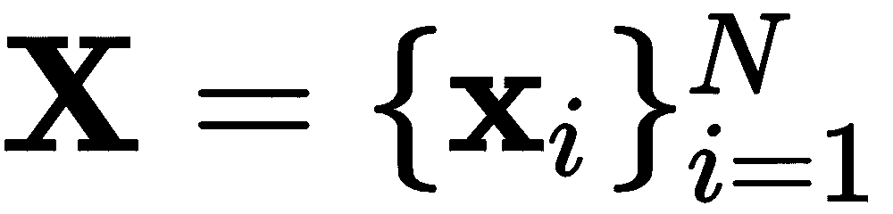

# 六、训练多层神经元

之前，在[第 6 章](4e4b45a6-1924-4918-b2cd-81f0448fb213.xhtml)、*训练单个神经元*中，我们探讨了一个涉及单个神经元的模型和感知器的概念。感知器模型的局限性在于，它最多只能在多维超平面上产生线性解。然而，这种限制可以通过使用多个神经元和多层神经元来容易地解决，以便为可分离和不可分离问题产生高度复杂的非线性解决方案。本章向您介绍了使用**多层感知器** ( **MLP** )算法进行深度学习的第一个挑战，例如用于误差最小化的梯度下降技术，然后是超参数优化实验，以确定值得信赖的准确性。

本章将涵盖以下主题:

*   MLP 模式
*   最小化误差
*   寻找最佳超参数

# MLP 模式

我们之前在[第五章](4e4b45a6-1924-4918-b2cd-81f0448fb213.xhtml)、*训练单个神经元*中已经看到，罗森布拉特的感知器模型对于某些问题来说是简单而强大的(罗森布拉特，F. 1958)。然而，对于更复杂和高度非线性的问题，Rosenblatt 没有对他在不同架构中连接更多神经元的模型给予足够的重视，包括更深层次的模型(Tappert，C. 2019)。

多年后，在 20 世纪 90 年代，2019 年图灵奖获得者杰弗里·辛顿教授继续致力于将更多的神经元连接在一起，因为这比简单的神经元更像大脑(辛顿，G. 1990)。今天大多数人都知道这种类型的方法叫做*连接主义者*。主要想法是以不同的方式连接神经元，这将类似于大脑连接。第一个成功的模型之一是 MLP，它使用一种基于监督梯度下降的学习算法，该算法使用标记数据来学习逼近函数。

*图 6.1* 描绘了具有一层多个神经元的 MLP，其指示输入如何通过权重连接到所有神经元，这刺激神经元产生大的(非零)数值响应，这取决于需要*学习的可变权重*:


图 6.1–一个隐藏层中的多个感知器

为了完整起见，*图 6.2* 描绘了相同的架构，但是是垂直的；它还以浅灰色显示正权重，以深灰色显示负权重。*图 6.2* 旨在显示某些特征可能会比其他特征更能刺激某些神经元:


图 6.2–权重采用灰度编码的 MLP:浅灰色表示正权重，深灰色表示负权重

基于*图 6.2* ，顶部的神经元层被称为**输入层**。这些特征被连接到被称为**隐藏层**的层中的不同神经元。这一层通常由至少一层神经元组成，但在深度学习中，它可能包含更多。

**On the interpretation of the weights close to the input layer**:One of the key differences between the MLP and the perceptron is that the interpretation of the weights in the input layer is lost in the MLP unless the hidden layer contains only one neuron. Usually, in a perceptron, you can argue that the importance of certain features is directly correlated to the value (weight) directly associated with those features. For example, the feature associated with the most negative weight is said to negatively influence the outcome, and the feature associated with the most positive weight is also influencing the outcome in a significant manner. Therefore, looking into the absolute value of the weights in a perceptron (and in linear regression) can inform us about feature importance. Not so much in the MLP; the more neurons are involved and the more layers are involved, the chances of interpreting weights and feature importance is reduced significantly. You must not rely heavily on the first-layer weights to deduce feature importance. Be careful.

从*图 6.1* 中，我们可以看到，神经元被简化以暗示在标量上存在一些非线性激活函数 [] ，这是通过将特征和与那些特征和那个神经元相关联的权重的乘积相加而得到的。在更深的 MLP 层中，输入不再是来自输入层的数据，而是来自先前层的输出。我们将在下一节中对符号进行一些修改，以便更正式地描述这个过程。

现在，你需要知道的是，MLP 比感知器好得多，因为它有能力学习高度复杂的非线性模型。感知器只能提供线性模型。但是伴随着这种力量而来的是巨大的责任。MLP 具有非凸且非光滑的损失函数，其限制了学习过程是如何实现的，尽管已经有了很大的进步，但是它们的问题仍然存在。另一个缺点是，学习算法可能需要其他超参数来确保算法的成功(收敛)。最后，值得注意的是，MLP 需要对输入特征进行预处理(归一化)，以减轻神经元对特定特征的过度拟合。

现在，让我们检查学习过程实际上是如何发生的。

# 最小化误差

使用 MLP 从数据中学习是自其提出以来的主要问题之一。正如我们之前指出的，神经网络的一个主要问题是更深层次模型的可计算性，另一个问题是稳定的学习算法，该算法将收敛到合理的最小值。机器学习的重大突破之一，也是为深度学习铺平道路的，是基于反向传播的学习算法的开发。20 世纪 60 年代，许多科学家独立地推导并应用了反向传播的形式；然而，这主要归功于 G. E. Hinton 教授和他的小组(Rumelhart，D. E .等人，1986 年)。在接下来的几个段落中，我们将回顾这个算法，它的唯一目的是**最小化由训练期间做出的不正确预测引起的误差**。

首先，我们将描述数据集，它被称为**螺旋** *。*这是一个广为人知的基准数据集，它有两个可分离的类，但是高度非线性。正类和负类在二维空间的相对两侧彼此环绕，从中心向外增长，如图*图 6.3* 所示:


图 6.3–来自双螺旋基准的样本数据

可以使用 Python 中的以下函数生成数据集:

```py
def twoSpirals(N):
  np.random.seed(1)
  n = np.sqrt(np.random.rand(N,1)) * 780 * (2*np.pi)/360
  x = -np.cos(n)*n
  y = np.sin(n)*n
  return (np.vstack((np.hstack((x,y)),np.hstack((-x,-y)))), 
          np.hstack((np.ones(N)*-1,np.ones(N))))

X, y = twoSpirals(300)  #Produce 300 samples
```

在这个代码片段中，我们将在`X`中接收一个两列矩阵，其行是螺旋数据集的样本，`y`包含了集中相应的目标类。*图 6.3* 是基于前面的代码片段生成的，包含 300 个样本。

我们还将使用一个非常简单的 MLP 架构，在一个隐藏层中只有三个神经元；这只是为了尽可能清楚地解释*反向传播*。建议的 MLP 如图*图 6.4* 所示:

反向传播在今天的专业人士中被称为**反向传播** *。如果你阅读最近网上关于它的讨论，它很可能被简称为 backprop。*


图 6.4 -螺旋数据集上基于反向传播学习的简单 MLP 架构

*图 6.4* 所示的网络架构假设有一个明确定义的输入向量，包含多个向量(一个矩阵)，表示为，多个单独的目标表示为一个向量。此外，每一层都有一个权重矩阵，这与第一层的情况相同。例如，根据*图 6.4* ，权重矩阵如下:


。

这些矩阵具有随机初始化的实值。隐藏层，由三个神经元组成。每个神经元接收作为输入的观察值的加权和，该观察值包括导致第 *i* 个神经元的特征和权重的内积；例如，对于第一个神经元，它将如下:


这里，表示第一层中第一神经元的激活函数的输出，在这种情况下，第一层将是 s 形。

乙状结肠激活功能表示为。这个函数很有趣，因为它压缩作为输入接收的任何值，并将其映射到 0 和 1 之间的值。这也是一个很好的函数用于梯度计算，因为它的导数是众所周知的，易于计算:。

在 Python 中，我们可以轻松地将 sigmoid 编码如下:

```py
def sigmoid(z, grad=False):
  if grad:
    return z * (1\. - z)
  return 1\. / (1\. + np.exp(-z))
```

最后，输出层由两个神经元组成，在这种情况下，我们将使用这两个神经元来建模每个目标类，即正螺旋和负螺旋。

考虑到这一点，我们可以基于梯度的方向进行反向投影以校正权重，从而使给定的一组标记样本的误差最小化；更多细节请参考本教程(Florez，O. U. 2017)。我们将遵循以下章节中概述的步骤。

## 第一步-**I**初始化

我们将执行初始步骤，其中我们*随机初始化*网络权重。在我们的示例中，我们将使用以下值:


在 Python 中，我们可以通过使用以下内容来生成`-1`和`1`之间的这些权重:

```py
w1 = 2.0*np.random.random((2, 3))-1.0
w2 = 2.0*np.random.random((3, 2))-1.0
```

## 第二步–向前传球

下一步是**向前传球**。在此步骤中，输入出现在输入层，并向前传播到网络中，直到我们在输出层中观察到结果向量。在我们的小例子中，向前传递如下。我们首先从单个样本的线性变换开始，在第一层中使用权重:


因此，对于某些 [] 的情况，我们计算如下:


这将导致以下结果:


然后我们通过 sigmoid 函数传递，得到，这是第一个隐层的三个神经元的输出。这将导致以下结果:


这可以通过以下方式实现:

```py
o1 = sigmoid(np.matmul(X, w1))
```

一种有趣的方式来看我们迄今为止在第一层中所完成的工作，那就是我们已经将二维的输入数据映射到三维，现在将对其进行处理以观察二维的输出。

对隐藏层组中的任何后续层重复相同的过程。在我们的例子中，我们将只对输出层再做一次。我们计算如下:


这导致以下计算:


这导致了以下情况:


再次，我们通过 sigmoid 函数传递，得到，这是输出层两个神经元的输出。这将导致以下结果:


我们的实现如下:

```py
o2 = sigmoid(np.matmul(o1, w2))
```

此时，我们需要给这个输出赋予一些意义，以便我们可以确定下一步。我们想要在这最后两个神经元中建模的是输入数据在中属于正类的概率，以及它在中属于负类的概率。下一步是建立一个误差指标，以便学习。

误差度量或误差函数也称为**损失**函数。

## 第 3 步–计算损失

下一步是定义和**计算总损耗**。在[第 4 章](7f55e68e-2e9f-486f-9337-5b2ea7bdb504.xhtml)、*从数据*中学习，我们讨论了一些误差度量(或损失)，例如**均方误差** ( **MSE** ):


从导数的角度考虑这种损失是很重要的，因为我们希望根据这种损失函数给出的梯度来调整网络的权重。因此，我们可以做一些小的改变，这些改变根本不会影响学习过程的整体结果，但是可以产生很好的导数。例如，如果我们对求导，平方将意味着乘以因子 2，但我们可以通过稍微修改 MSE，引入除以 2 来消除其影响，如下所示:


因此，这种损失可用于确定预测与实际目标结果的“错误”程度。在前面的示例中，期望的结果如下:


预计的反应如下:


这是正常的，因为权重是随机初始化的；因此，从模型来看，预期表现不佳。该网络可以通过使用现代方法进一步改进，该方法惩罚权重取非常大的值。在神经网络中，总是存在*爆炸*或*消失*梯度的风险，减少大梯度影响的一个简单技术是对权重可以采用的数字规模进行限制。这就是广为人知的**正规化** *。*它导致了其他好的属性，比如*稀疏*模型。我们可以通过如下修改损失来实现这种正则化:


这种损失可以通过以下方式实现:

```py
L = np.square(y-o2).sum()/(2*N) + lambda*(np.square(w1).sum()+np.square(w2).sum())/(2*N)
```

添加的正则项将每层中的所有权重相加，大的权重根据 [] 参数进行惩罚。这是一个需要我们自己微调的超参数。较大的 [] 值对任何较大的权重惩罚较重，而较小的 [] 值忽略学习过程中权重的任何影响。这是我们将在这个模型中使用的损失函数，注意正则化项也很容易微分。

## 第四步——向后传球

下一步是执行**反向通过**。目标是调整权重，使其与损失成比例，并朝着减少损失的方向。我们首先计算相对于输出层中的权重的偏导数，然后计算相对于第一层的偏导数。

让我们通过求解一阶偏导数来开始*反向传递*。我们可以通过使用众所周知的链式法则来做到这一点，链式法则允许我们将主导数分解成代表相同过程的片段；我们的做法如下:


在这里，为的所有情况。如果我们独立地定义这些偏导数的每一部分，我们得到如下结果:


这三个偏导数每次都有精确解。在我们的示例中，它们的值如下:


现在，由于我们需要更新权重，，我们需要一个 3 x 2 矩阵，因此，我们可以通过将偏导数的向量相乘来获得此更新，如下所示:


为了得到这个结果，我们首先需要对右边的两个小向量执行按元素的乘法，然后对左边的转置向量执行普通的乘法。在 Python 中，我们可以这样做:

```py
dL_do2 = -(y - o2)
do2_dz2 = sigmoid(o2, grad=True)
dz2_dw2 = o1
dL_dw2 = dz2_dw2.T.dot(dL_do2*do2_dz2) + lambda*np.square(w2).sum()
```

现在我们已经计算了导数，我们可以使用梯度上的传统比例因子(称为**学习率**)来更新权重。我们计算新的值，如下所示:


**学习率**是我们在机器学习中使用的一种机制，用于限制更新过程中导数的影响。请记住，导数被解释为给定一些输入数据时权重的变化率。一个*大的*学习率太看重导数的方向和大小，有跳过一个好的局部最小值的风险。小的学习率只是部分地考虑了导数的信息，冒着朝着局部最小值缓慢前进的风险。学习率是另一个需要调整的超参数。

现在，我们开始计算下一个导数，这将允许我们计算的更新。我们首先定义偏导数，并试图简化其计算，如下所示:


如果我们密切关注一阶偏导数，我们可以注意到它的导数定义如下:


但是下划线项之前已经计算过了！请注意，带下划线的项等同于前面定义的等式中带下划线的项:


这是一个很好的性质，由于微分中的链式法则，这是可能的，并且允许我们*回收*计算，并且有一个更有效的学习算法。这个很好的属性还告诉我们，我们确实将更深层的信息合并到了更接近输入的层中。现在让我们继续计算每个偏导数，知道我们已经做了一些工作。

由于，那么第一项可以表示如下:


在我们的示例中，这会导致以下结果:


现在，偏导数中的第二项可以计算如下:


这导致了下面的向量:


在此之后，我们现在能够计算最后一项，它可以直接计算如下:


最后，我们可以把个别偏导数的结果代入链式法则的乘积:


这是通过重新排列向量以获得与权重矩阵维度一致的结果矩阵来获得的。乘法运算会导致以下结果:


在 Python 中，我们这样做:

```py
dL_dz2 = dL_do2 * do2_dz2
dz2_do1 = w2
dL_do1 = dL_dz2.dot(dz2_do1.T)
do1_dz1 = sigmoid(o1, grad=True)
dz1_dw1 = X
dL_dw1 = dz1_dw1.T.dot(dL_do1*do1_dz1) + lambda*np.square(w1).sum()
```

最后，相应的更新计算如下:


这通过在迭代(或*时期*)分配 [] 来结束反向投影算法，我们实现如下:

```py
w1 += -alpha*dL_dw1
w2 += -alpha*dL_dw2
```

这个过程会重复我们希望的次数。我们可以让算法用以下参数运行:


然后，生成的分离超平面将如下图所示:


图 6.5 -分离样本三神经元 MLP 的超平面

该图显示有许多样本被错误分类，这些样本被描述为黑点。总准确率为 62%。显然，三个神经元足以产生比随机机会更好的分类器；然而，这并不是最好的结果。我们现在必须做的是通过改变超参数和神经元或层的数量来调整分类器。这是我们接下来要讨论的。

# 寻找最佳超参数

使用 Keras 有一种更简单的方法来编码我们在上一节中编码的内容。我们可以相信这样的事实，即反向传播编码正确，稳定性得到改善，并且有一组更丰富的其他功能和算法可以改善学习过程。在开始优化 MLP 的超参数集之前，我们应该指出使用 Keras 的等效实现。以下代码应再现相同的模型、几乎相同的损失函数和几乎相同的反向投影方法:

```py
from tensorflow.keras.models import Sequential
from tensorflow.keras.layers import Dense

mlp = Sequential()
mlp.add(Dense(3, input_dim=2, activation='sigmoid'))
mlp.add(Dense(2, activation='sigmoid'))

mlp.compile(loss='mean_squared_error',
            optimizer='sgd',
            metrics=['accuracy'])

# This assumes that you still have X, y from earlier
# when we called X, y = twoSpirals(300)
mlp.fit(X, y, epochs=1000, batch_size=60)
```

这将产生 62.3%的误差和如图*图 6.7* 所示的决策边界:


图 6.6–与*图 6.5* 中相同型号的基于 Keras 的 MLP

该图与*图 6.6* 非常相似，这是意料之中的，因为它们是同一型号。但是让我们简单回顾一下代码中描述的模型的含义。

如前所述，`from tensorflow.keras.models import Sequential`导入了序列库，这允许我们创建一个*序列*模型，而不是用*功能*方法创建模型，`mlp = Sequential()`，它还允许我们向模型添加元素，`mlp.add()`，比如多层神经元(密集层):`Dense(...)`。

顺序模型的第一层必须指定输入的维度(输入层大小)，在本例中是`2`，以及激活函数，它是一个 sigmoid: `mlp.add(Dense(3, input_dim=2, activation='sigmoid'))`。在这种情况下，数字`3`表示这个模型在第一个隐藏层中将有多少个神经元。

第二层(也是最后一层)类似，但表示输出层中的两个神经元:`mlp.add(Dense(2, activation='sigmoid'))`。

一旦指定了序列模型，我们必须编译它，`mlp.compile(...)`，定义要最小化的损失，`loss='mean_squared_error'`，要使用的优化(反向传播)算法，`optimizer='sgd'`，以及在每个训练时期之后要报告的度量的列表，`metrics=['accuracy']`。这里定义的均方损失不包括之前描述的正则化项，但这在这里应该不会有更大的影响；因此，这种损失是我们以前见过的:


`sgd`优化器定义了一种称为**随机梯度下降**的算法。这是一种计算梯度并相应更新权重的稳健方法，自 20 世纪 50 年代以来一直存在[Amari，S. I. 1993]。在 Keras 中，它有一个默认的*学习率*的；但是，这个速率有一个衰减策略，允许学习速率适应学习过程。

考虑到这一点，我们要做的是改变以下超参数:

*   学习率是自适应的。
*   层数，介于 2、3 和 4 之间，每层 16 个神经元(输出层除外)。
*   激活函数，ReLU 或 sigmoid。

这可以通过运行几个交叉验证的实验来实现，如之前在[第 4 章](7f55e68e-2e9f-486f-9337-5b2ea7bdb504.xhtml)、*从数据中学习*中所述。下表显示了在五重交叉验证下进行的实验和相应结果的综合列表:

| 实验。 | **超参数** | **平均精度** | **标准。** |
| `a` | (16 个乙状结肠，2 个乙状结肠) | 0.6088 | 0.004 |
| `b` | (16-ReLU，2-乙状结肠) | 0.7125 | 0.038 |
| `c` | (16 个乙状结肠，16 个乙状结肠，2 个乙状结肠) | 0.6128 | 0.010 |
| `d` | (16-ReLU，16-乙状结肠，2-乙状结肠) | 0.7040 | 0.067 |
| `e` | (16 个乙状结肠，16 个乙状结肠，16 个乙状结肠，2 个乙状结肠) | 0.6188 | 0.010 |
| `f` | (16-ReLU，16-乙状结肠，16-ReLU，2-乙状结肠) | 0.7895 | 0.113 |
| `g` | (16-ReLU，16-ReLU，16-乙状结肠，2-乙状结肠) | **0.9175** | 0.143 |
| `h` | (16-ReLU，16-ReLU，16-ReLU，2-乙状结肠) | 0.9050 | 0.094 |
| `i` | (16-ReLU，16-乙状结肠，16-乙状结肠，2-乙状结肠) | 0.6608 | 0.073 |

请注意，其他实验是使用额外的第五层进行的，但结果在平均性能和可变性方面并没有好到哪里去。看起来每层只有 16 个神经元的四层(除了输出层，有 2 个)足以产生足够的类别分离。*图 6.8* 显示了来自实验`g`的一个样本运行，它以 99%的准确度实现了最高性能:


图 6.7–使用四层(16，16，16，2)神经网络的双螺旋数据集的分类边界。对应于表 1 中的实验 g

对图 6.8 中的*进行目视检查发现，最大的混淆范围在螺旋起源的中心区域，并且彼此非常接近。还要注意，分离超平面在某些区域似乎是不光滑的，这是 MLP 的典型特征。有人提出，这种现象是由于输入层的神经元在用一个线性函数逼近一个函数，更深的层是线性函数的混合，在这种线性函数的基础上产生非线性函数。当然，它比那要复杂得多，但是在这里值得注意。*

在我们结束本章之前，请注意，我们还可以根据经验优化其他超参数。我们可以选择不同的优化器，比如`adam`或者`rmsprop`；我们可以尝试其他激活功能，如`tanh`，或`softmax`；我们本可以尝试更多层；或者我们可以尝试更多(或更少)和不同数量的神经元，以增加、减少或混合的顺序。然而，就目前而言，这些实验足以表明，对不同事物的实验是找到在我们的特定应用或我们试图解决的问题中最适合我们的关键。

这结束了我们的介绍性章节，接下来的章节将着眼于具有特定目的的特定类型的架构，而不是通常被认为是多用途的基本神经网络的 MLP。我们的下一章将讨论自编码器；它们可以被视为一种特殊类型的神经网络，旨在将输入数据编码到一个更小的维度空间，然后将其重建回原始输入空间，从而最大限度地减少重建数据中的信息损失。自编码器允许我们压缩数据，并在没有标签的情况下从数据中学习。后者使 autoencoder 成为一种特殊的神经网络，它使用被归类为**的无监督学习** *进行学习。*

摘要

# 本章介绍了 MLP 的设计以及围绕其功能的范例。我们讨论了其元素背后的理论框架，并对广为人知的反向传播机制进行了充分的讨论和处理，以对损失函数执行梯度下降。理解反向投影算法是后面章节的关键，因为有些模型是专门为克服反向投影的一些潜在困难而设计的。你应该有信心，你所学到的关于 backprop 的知识将会很好地帮助你了解深度学习是怎么回事。这种反向传播算法，以及其他一些东西，使得深度学习成为一个令人兴奋的领域。现在，你应该能够理解和设计你自己的不同层次和不同神经元的 MLP。此外，您应该对更改它的一些参数充满信心，尽管我们将在后续阅读中涉及更多。

[第 7 章](480521d9-845c-4c0a-b82b-be5f15da0171.xhtml)、*自编码器、*将继续使用一种非常类似于 MLP 的架构，这种架构目前被广泛用于许多与学习数据表示相关的不同学习任务。这一章开始了一个新的部分，致力于基于学习类型的*无监督* *学习*算法和模型，即使数据没有被标记，你也可以从数据中学习。

[Chapter 7](480521d9-845c-4c0a-b82b-be5f15da0171.xhtml), *Autoencoders,* will continue with an architecture very similar to the MLP that is widely used today for many different learning tasks associated with learning representations of data. This chapter begins a new part that is dedicated to *unsupervised* *learning* algorithms and models based on the type of learning where you can learn from data even if it is not labeled.

问题和答案

# **为什么 MLP 比感知器模型好？**

1.  神经元的数量和层数越多，MLP 在模拟非线性问题和解决更复杂的模式识别问题方面就越优于感知器。

为什么了解反向传播如此重要？

2.  因为它是让神经网络在大数据时代学习的东西。

MLP 总是收敛吗？

3.  是也不是。它总是收敛到损失函数的一个局部最小值；然而，它不能保证收敛到全局最小值，因为通常，大多数损失函数是非凸和非光滑的。

**为什么我们要优化模型的超参数？**

4.  因为任何人都可以训练一个简单的神经网络；然而，并不是每个人都知道要改变什么才能让它变得更好。你的模型的成功很大程度上取决于你尝试不同的事情，并向你自己(和其他人)证明你的模型是最好的。这将使你成为更好的学习者和更好的深度学习专家。

参考

# 罗森布拉特，F. (1958)。感知器:大脑中信息存储和组织的概率模型。*心理评论*，65 卷 6 期，386 页。

*   Tappert，C. C. (2019)。深度学习之父是谁？人工智能研讨会。
*   辛顿，通用电气公司(1990 年)。连接主义学习程序。*机器学习*。摩根·考夫曼，555-610。
*   鲁梅尔哈特，丁顿，通用电气公司和威廉姆斯，R. J. (1986)。通过反向传播误差学习表示。*性质*，323(6088)，533-536。
*   弗洛雷斯大学(2017 年)。一次一个乐高:解释神经网络如何学习的数学。*上线*:[https://omar-florez.github.io/scratch_mlp/](https://omar-florez.github.io/scratch_mlp/)。
*   阿马里，S. I. (1993 年)。反向传播和随机梯度下降法。*神经计算*，5(4-5)，185-196。
*   Amari, S. I. (1993). Backpropagation and stochastic gradient descent method. *Neurocomputing*, 5(4-5), 185-196.