<title>Autoencoders</title>  Autoencoders

本章通过解释编码层和解码层之间的关系来介绍自动编码器模型。我们将展示一个属于无监督学习家族的模型。本章还介绍了通常与自动编码器模型相关的损失函数，并将其应用于 MNIST 数据的降维及其在自动编码器诱导的潜在空间中的可视化。

本章将涵盖以下主题:

*   无监督学习简介
*   编码和解码层
*   在降维和可视化中的应用
*   无监督学习的伦理含义

# 无监督学习简介

随着机器学习在过去几年的发展，我遇到了许多方法来对不同类型的学习进行分类。最近，在加拿大蒙特利尔举行的 NeurIPS 2018 大会上，Alex Graves 博士分享了关于不同类型学习的信息，如图*图 7.1* 所示:

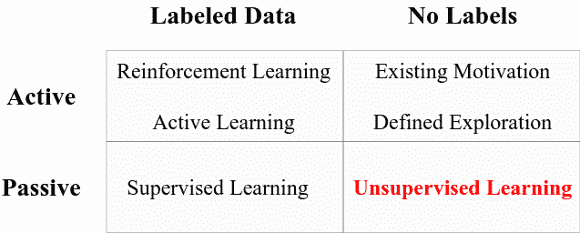

图 7.1-不同类型的学习

当有许多学习算法正在被研究和改进时，这种分类的努力在今天是非常有用的。第一行描绘了*主动的*学习，这意味着在学习算法和数据之间有一种交互的感觉。例如，在对*标记的数据*进行操作的强化学习和主动学习中，奖励策略可以通知模型将在接下来的迭代中读取什么类型的数据。然而，我们到目前为止所研究的传统监督学习不涉及与数据源的交互，而是假设数据集是固定的，其维度和形状不会改变；这些非交互式方法被称为*被动*学习。

*图 7.1* 中表格的第二列代表一种特殊的学习算法，它要求*无标签*从数据中学习。其他算法要求您拥有一个包含与标签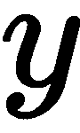相关联的数据的数据集；也就是: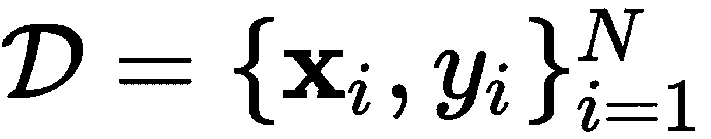。然而，无监督算法不需要标签来与数据“做事情”。

你可以把标签想象成一个**老师**。教师告诉学习者 **x** 对应于 [] ，学习者试图通过反复试验来学习 [] 和 [] 之间的关系，调整其*信念*(参数)，直到它正确为止。然而，如果没有老师，学习者对标签一无所知，因此会自己学习*关于的一些东西*，提供一些界限，并且在从未了解过的情况下形成自己对的信念。

在接下来的章节中，我们将学习**无监督学习**，这是一种假设我们拥有的数据在形状或形式上不会改变，并且在学习过程和部署过程中保持一致的学习类型。这些算法是由标签以外的东西引导的，例如，用于数据压缩的唯一损失函数。另一方面，还有其他算法具有探索机制或特定动机，以交互方式从数据中学习，这些算法是**主动学习**算法。我们不会在这本书里讨论这些算法，因为这本书是为初学者准备的入门书籍。然而，我们将详细讨论一些最健壮的*无监督的*深度学习模型。

我们将从学习**自动编码器**开始。自动编码器的唯一目的是将输入数据输入由两部分组成的神经网络:一个**编码器**和一个**解码器**。编码器部分的任务是通常将输入数据编码到低维空间中，从而压缩或编码输入数据。模型的解码器部分负责获取输入数据的编码(或压缩)潜在表示，然后在不丢失任何数据的情况下将其重建回其原始形状和原始值。也就是说，在理想的自动编码器中，输入等于输出。让我们在接下来的部分中更详细地讨论这一点。

# 编码和解码层

自动编码器可以分为两个主要组件，在无监督学习过程中用于特定目的。*图 7.2* 的左侧显示了使用全连接(密集)层实现的自动编码器。它接收某个向量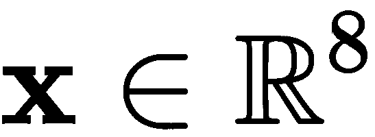作为输入，然后进入六个隐藏层；前三个分别具有 6、4 和 2 个神经元，意在将输入数据压缩到二维，因为两个神经元的输出是两个标量值。这第一组层被称为**编码器**:

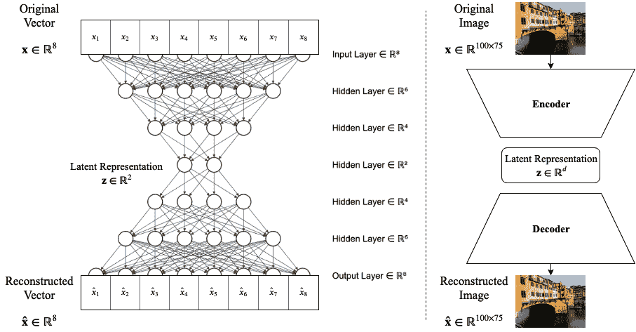

图 7.2–自动编码器的两种表示。左图:完整的描述性模型。右图:紧凑和抽象的模型表示

第二组神经元旨在使用分别具有 4、6 和 8 个神经元的三层将输入数据重建回其原始维度和值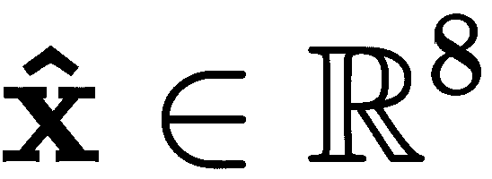;这组层被称为**解码器**。

注意，自动编码器的最后一层*必须有*与输入向量维数相同的神经元。否则，重建将与输入数据不匹配。

在这种情况下，图 7.2 左侧*所示的自动编码器充当压缩网络，在训练模型以实现良好重建后，如果我们断开解码器，我们最终会得到一个将输入数据编码为二维(或我们选择的任何维度)的神经网络。这提供了优于监督模型的独特优势:在监督模型中，我们教导网络寻找允许与给定目标标签关联的模式；然而，在无监督学习中(或者例如在该自动编码器中)，网络不寻找特定的模式，而是学习以任何方式使用输入空间，以保留输入数据的最有代表性和最重要的信息，从而允许在解码器中进行良好的重建。*

想象一个神经网络和一个自动编码器，它获取猫和狗的输入图像；传统的神经网络可以被训练来区分狗和猫，它的任务是在狗和猫的图像中找到重要的模式，以便区分它们之间的差异；然而，自动编码器将训练学习最重要的模式，所有模式中最具代表性的模式，以便保存该信息并允许良好的重建，而不管标签如何。在某种程度上，传统的监督神经网络偏向于用猫和狗来看世界，而 autoencoder 不管猫还是狗都可以自由地从世界中学习。

*图 7.2* 右侧的图表描述了更抽象、更紧凑的自动编码器的替代表示。当描述一个相对较深的自动编码器时，这种类型的表示是有用的，当层数大到难以一个接一个地表示所有的神经元和所有的层时(如在图 7.2 的左侧)。我们将使用这些梯形来表示有一个编码器/解码器；我们还注意到，这种抽象将允许我们自由地使用其他类型的层，而不仅仅是密集(完全连接的)层。*图 7.2 的右图*描绘了一个自动编码器，它将一幅图像作为输入，然后将输入编码到一个 *d-* 维空间，然后将*潜在*向量重构回输入(图像)空间。

**潜在空间**是映射学习到的低维模式的空间。它也被称为*学习表示空间*。理想情况下，该潜在空间富含关于输入数据的重要信息，并且比输入数据具有更少的维度，而没有任何信息损失。

现在，让我们根据*图 7.2* 左侧的简单模型来实现每个自动编码器部分。

## 编码层

我们将使用的 TensorFlow 和 Keras 库是来自`tensorflow.keras.layers`的`Input`和`Dense`以及来自`tensorflow.keras.models`的`Model`。我们将使用`keras`功能方法，而不是*顺序*建模。导入以下内容:

```
from tensorflow.keras.layers import Input, Dense
from tensorflow.keras.models import Model
```

`Input`层将用于描述输入向量的维度，在我们的例子中是`8`:

```
inpt_dim = 8
ltnt_dim = 2 

inpt_vec = Input(shape=(inpt_dim,))
```

然后，考虑我们所有的激活函数为`sigmoid`，仅仅为了这个例子，我们可以如下定义编码器层的流水线:

```
elayer1 = Dense(6, activation='sigmoid')(inpt_vec)
elayer2 = Dense(4, activation='sigmoid') (elayer1)
encoder = Dense(ltnt_dim, activation='sigmoid') (elayer2)
```

`Dense`类构造器接收神经元的数量和激活函数作为参数，在定义的末尾(在右侧)，我们必须包括层的输入是什么，这在左侧被分配了一个名称。因此，在第`elayer1 = Dense(6, activation='sigmoid')(inpt_vec)`行中，分配给该层的名称是`elayer1`，那么`6`是神经元的数量，`activation='sigmoid'`给密集层分配一个`sigmoid`激活函数，`inpt_vec`是流水线中该层的输入。

在前面的三行代码中，我们已经定义了编码器的层，如果我们将它做成一个模型并对其调用`predict()`,`encoder`变量指向可以输出潜在变量的对象:

```
latent_ncdr = Model(inpt_vec, encoder)
```

在这一行代码中，`latent_ncdr`包含的模型一旦被训练，就可以将输入数据映射到潜在空间。但在此之前，我们先以类似的方式定义解码器的各层。

## 解码层

我们可以将解码器层定义如下:

```
dlayer1 = Dense(4, activation='sigmoid')(encoder)
dlayer2 = Dense(6, activation='sigmoid') (dlayer1)
decoder = Dense(inpt_dim, activation='sigmoid') (dlayer2)
```

请注意，在前面的代码中，神经元的数量通常以递增的顺序排列，直到最后一层与输入维度匹配。在这种情况下，4、6 和 8 被定义为`inpt_dim`。类似地，`decoder`变量指向可以输出重构输入的对象，如果我们把它做成一个模型并在其上调用`predict()`。

我们在这里有意将编码器和解码器分开，只是为了表明，如果我们选择这样做，我们可以有能力访问网络的不同组件。然而，我们可能也应该定义自动编码器作为一个整体，从输入到输出，通过使用如下的`Model`类:

```
autoencoder = Model(inpt_vec, decoder)
```

这正是我们之前所说的“如果我们把它做成一个模型，并在其上调用`predict()`”的意思该声明创建了一个模型，该模型将在`inpt_vec`中定义的输入向量作为输入，并从`decoder`层检索输出。然后，我们可以使用它作为一个模型对象，Keras 中有一些很好的函数，允许我们传递输入、读取输出、训练和做其他事情，我们将在接下来的部分中讨论。现在，既然我们已经定义了我们的模型，在我们可以训练它之前，我们应该定义训练的目标是什么，即*，*我们的损失函数将是什么。

## 损失函数

我们的损失函数必须符合自动编码器的目标。这个目标是完美地重建输入。这意味着在理想的自动编码器中，我们的输入和重构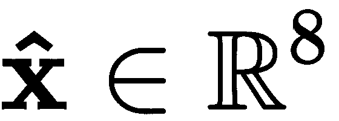必须相同。这意味着绝对差值必须为零:

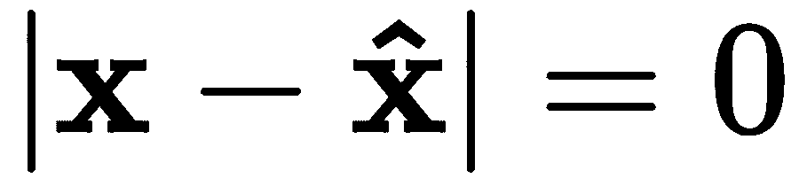

然而，这可能是不现实的，并且它不是在一个我们可以容易地区分的功能方面。为此，我们可以回到经典的均方误差函数，其定义如下:

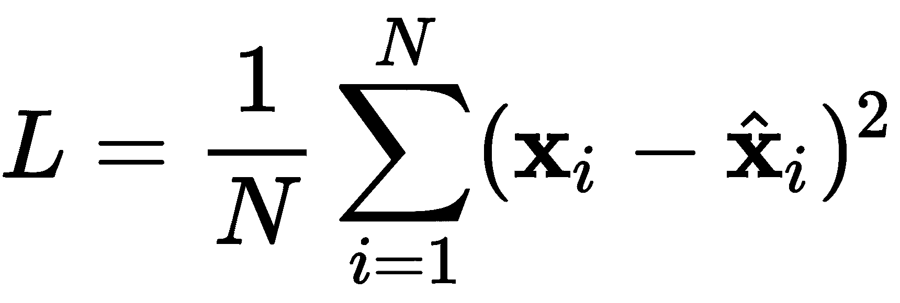

我们想让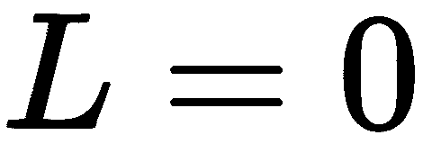，理想状态下，或者充其量是尽可能的最小化。我们将该损失函数解释为最小化输入与其重构之间的平方差的平均值。如果我们使用标准的反向投影策略，比如说某种类型的标准梯度下降技术，我们可以编译该模型，并为训练做如下准备:

```
autoencoder.compile(loss='mean_squared_error', optimizer='sgd')
```

`compile()`方法为训练准备模型。前面定义的损失函数作为参数`loss='mean_squared_error'`给出，这里选择的优化技术称为**随机梯度下降** ( **SGD** ) *，* `optimizer='sgd'`。有关 SGD 的更多信息，请参见 Amari，S. I. (1993)。

## 学习和测试

由于这是一个简单的自动编码器的介绍性示例，我们将只使用一个数据点进行训练，并开始学习过程。我们还想显示编码版本和重构版本。

我们将二进制中的数字 39 作为八位数，对应 00100111。我们将它声明为我们的输入向量，如下所示:

```
import numpy as np
x = np.array([[0., 0., 1., 0., 0., 1., 1., 1.]])
```

然后，我们可以按如下方式进行培训:

```
hist = autoencoder.fit(x, x, epochs=10000, verbose=0)

encdd = latent_ncdr.predict(x)
x_hat = autoencoder.predict(x)
```

`fit()`方法执行训练。它的前两个参数是输入数据和期望的目标输出；对于自动编码器，它们都是`x`。时期的数量被指定为`epochs=10000`，因为模型在这一点上可以产生一个不错的输出，我们将详细度设置为零，因为我们不需要使用`verbose=0`来可视化每个时期。

在 Google Colab 或 Jupyter Notebook 中，一次在屏幕上可视化 1000 多个纪元并不是一个好主意。web 浏览器可能对负责显示所有这些时期的 JavaScript 代码没有反应。当心。

潜在编码器模型`latent_ncdr`和`autoencoder`中的`predict()`方法在指定层产生输出。如果我们检索`encdd`，我们可以看到输入的潜在表示，如果我们检索`x_hat`，我们可以看到重建。我们甚至可以手动计算均方差，如下所示:

```
print(encdd)
print(x_hat)
print(np.mean(np.square(x-x_hat)))  # MSE
```

这会产生以下输出:

```
[[0.54846555 0.4299447 ]]
[[0.07678119 0.07935049 0.91219556 0.07693048 0.07255505 0.9112366 0.9168126 0.9168152 ]]
0.0066003498745448655
```

由于学习算法的无监督性质，这里的数字会有所不同。第一个输出向量可以是任何实数。第二个输出向量可能具有接近 0 和接近 1 的实数，类似于原始的二进制向量，但是确切的值每次都会变化。

两个元素的第一个向量是潜在表示，[0.55，0.43]；在这一点上，这可能对我们来说意义不大，但在数据压缩方面，这将是非常重要的。这意味着我们能够用两位数来表示八位数。

虽然这是一个玩具示例，用两位数表示二进制数并不令人兴奋，但其背后的理论是，我们可以在[0，1]范围内取任意八个浮点数字，并将其压缩为同一范围内的两位数。

显示的第二个向量显示了良好重建的证据:应该是 0 的东西是 0.08，应该是 1 的东西是 0.91。手动计算的**均方误差** ( **MSE** )为 0.007，虽然不为零，但也足够小。

我们可以使用存储在调用`fit()`期间定义的`hist`对象中的信息来可视化整个训练阶段中 MSE 的衰减。该对象包含跨时期的损失函数值的信息，并允许我们使用以下代码来可视化该过程:

```
import matplotlib.pyplot as plt

plt.plot(hist.history['loss'])
plt.title('Model reconstruction loss')
plt.ylabel('MSE')
plt.xlabel('Epoch')
plt.show()
```

这将产生您在图 7.3 中看到的内容:

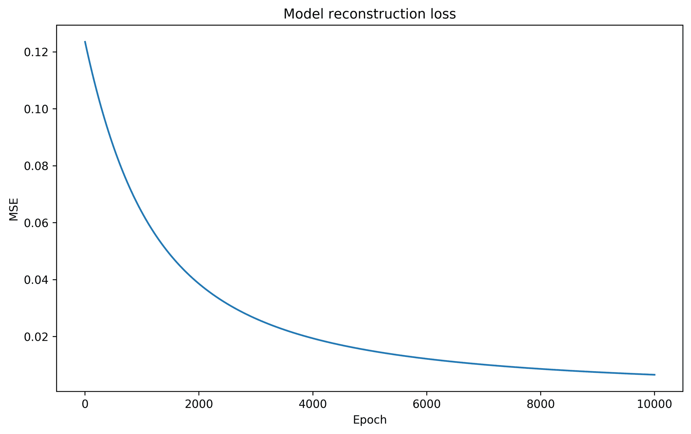

图 7.3–根据 MSE 描述的自动编码器训练各时期的重建损失

好的，再一次，这是一个只有一个数据点的玩具例子。在现实生活中，我们永远不会这样做。为了显示这是一个多么糟糕的想法，我们可以使用我们用来训练模型的二进制字符串，并反转每一位，从而得到 11011000(或十进制的 216)。如果我们把这个交给自动编码器，我们会期待一个好的重建，但是让我们看看如果我们尝试这样做会发生什么:

```
x = np.array([[1., 1., 0., 1., 1., 0., 0., 0.]])  #216

encdd = latent_ncdr.predict(x)
x_hat = autoencoder.predict(x)

print(encdd)
print(x_hat)
print(np.mean(np.square(x-x_hat)))
```

我们得到以下输出:

```
[[0.51493704 0.43615338]]
[[0.07677279 0.07933337 0.9122421 0.07690183 0.07254466 0.9112378 0.9167745 0.91684484]]
0.8444848864148122
```

同样，由于学习算法的无监督性质，这里的数字会有所不同。如果你的结果和你在这里看到的不一样(我肯定是)，那不是问题。

如果您将这些结果与之前的结果进行比较，您会注意到潜在的表示并没有太大的不同，并且重构的输出与给定的输入完全不匹配。很明显，模型**记住了它被训练的输入。当我们计算 MSE 时，这是很明显的，我们得到的值是 0.84，与之前得到的值相比是很大的。**

当然，解决这个问题的方法是添加更多的数据。但是构建自动编码器的玩具示例到此结束。这之后真正改变的是数据的类型和数量，图层的数量，图层的类型。在下一节中，我们将看看一个简单的自动编码器在降维问题中的应用。

# 在降维和可视化中的应用

自动编码器最有趣的应用之一是降维[Wang，y .，et al. (2016)]。鉴于我们生活在一个数据存储容易访问且负担得起的时代，大量数据目前存储在任何地方。然而，并非所有信息都是相关信息。例如，考虑一个总是面向一个方向的家庭安全摄像机的视频记录数据库。很可能在每个视频帧或图像中都有大量重复的数据，而收集到的数据中很少是有用的。我们需要一种策略来观察这些图像中真正重要的东西。图像本质上具有大量冗余信息，并且图像区域之间通常存在相关性，这使得自动编码器在压缩图像中的信息时非常有用(Petscharnig，s .，et al. (2017))。

为了证明自动编码器在图像降维中的适用性，我们将使用众所周知的 MNIST 数据集。

## MNIST 数据准备

有关 MNIST 的详细信息，请参见第 3 章、*准备数据*。这里我们将只提到 MNIST 数据将被缩放到范围[0，1]。我们还需要通过将 28×28 位的图像整形为 784 维的向量来将所有的图像转换为向量。这可以通过以下方式实现:

```
from tensorflow.keras.datasets import mnist

(x_train, y_train), (x_test, y_test) = mnist.load_data()

x_train = x_train.astype('float32') / 255.
x_test = x_test.astype('float32') / 255.

x_train = x_train.reshape((len(x_train), 28*28))
x_test = x_test.reshape((len(x_test), 28*28))
```

我们将使用`x_train`来训练自动编码器，使用`x_test`来测试自动编码器编码和解码 MNIST 数字的泛化能力。出于可视化的目的，我们将需要`y_test`，但是`y_train`可以忽略，因为在无监督的机器学习中我们不需要标签。

*图 7.4* 描绘了`x_test`中的前八个样本。这些样本将在一些实验中使用，以展示不同自动编码器模型的功能:


图 7.4–用于比较的测试 MNIST 数字

## MNIST 自动编码器

我们可以设计几个不同层数的实验，看看自动编码器如何为 MNIST 改变其性能。我们可以从一个具有四层的自动编码器开始，总是使用两个潜在维度。这样做是为了便于在由自动编码器引起的二维空间中可视化 MNIST 数字。

基于前面定义的自动编码器，我们可以提出以下四层基本自动编码器:

```
inpt_dim = 28*28
ltnt_dim = 2

inpt_vec = Input(shape=(inpt_dim,))

elayer1 = Dense(392, activation='sigmoid')(inpt_vec)
elayer2 = Dense(28, activation='sigmoid') (elayer1)
elayer3 = Dense(10, activation='sigmoid') (elayer2)
encoder = Dense(ltnt_dim, activation='tanh')(elayer3)

dlayer1 = Dense(10, activation='sigmoid')(encoder)
dlayer2 = Dense(28, activation='sigmoid')(dlayer1)
dlayer3 = Dense(392, activation='sigmoid')(dlayer2)
decoder = Dense(inpt_dim, activation='sigmoid')(dlayer3)

latent_ncdr = Model(inpt_vec, encoder)
autoencoder = Model(inpt_vec, decoder)

autoencoder.compile(loss='binary_crossentropy', optimizer='adam')

hist = autoencoder.fit(x_train, x_train, epochs=100, batch_size=256, 
                       shuffle=True, validation_data=(x_test, x_test))
```

这将是后续模型的基础。有几个突出显示的内容是新的，需要正确介绍。第一个重要的东西是一个新的激活函数，叫做**双曲正切**。该激活功能定义如下:

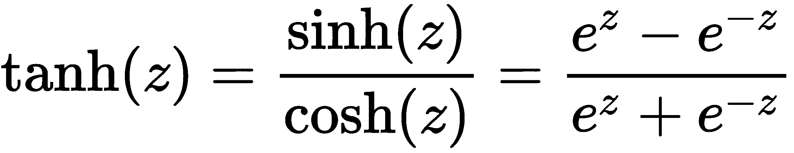

相应的一阶导数相对简单:

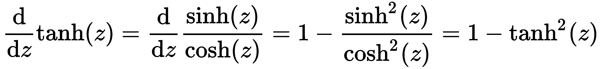

除了具有良好且易于计算的导数之外，双曲正切激活函数还具有良好的输出范围[-1，1]。这允许一个中性范围，不必局限于 sigmoid 范围[0，1]。出于可视化的目的，有时在双曲正切范围内进行可视化是很有趣的，但没有必要这样做。

我们引入的另一个新元素是称为**二元交叉熵**的损失函数:

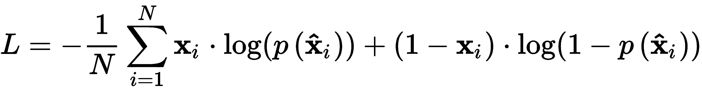

一般来说，二进制交叉熵使用信息，这些信息是计算目标数据和重建(或预测)数据之间的误差的理论思想。在某种程度上，它测量了目标和预测之间的熵值，或者说是惊奇值。例如，在理想的自动编码器中，目标等于其重建并不奇怪，损耗应该为零。然而，如果目标不等于，那将是令人惊讶的，并且会产生高损失。

关于使用交叉熵损失的自动编码器的更完整的讨论，参见(Creswell，a .艾尔。(2017)).

还引入了一个名为 **Adam** 的新优化器。艾尔。(2014)).它是一种随机优化算法，使用自适应学习速率，在一些深度学习应用中已被证明非常快。当我们处理深度学习模型和大型数据集时，速度是一个很好的属性。时间是至关重要的，亚当提供了一个很好的方法，已经成为流行。

最后，我们添加的最后一个新东西是关于`fit()`方法的。你应该注意到有两个新的参数:`shuffle=True`，允许在训练过程中进行数据的洗牌；以及`validation_data=( , )`，它指定了一个数据元组，用于使用验证数据或模型从未见过且永远不会用于训练的数据来监控损失。

这就是我们介绍的所有新内容。下一步是解释我们将在实验中尝试的自动编码器架构。请参见*图 7.5* 了解我们将要进行的实验参考:

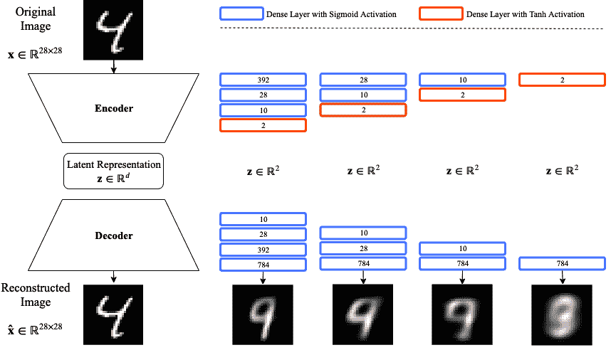

图 7.5–不同的自动编码器配置展示了潜在表示的质量差异

在图中，您会注意到我们使用了自动编码器的抽象表示，在图 7.5 的右侧是每个自动编码器架构将使用的不同层。所示的第一个体系结构对应于本节中所示的代码。也就是说，代码显示了分别具有 392、28、10 和 2 个神经元的编码层的自动编码器；而解码层分别包含 10、28、392 和 784 个神经元。右边的下一个模型包含相同的层，只是移除了对应于 392 个神经元的一对层，以此类推。

最后一个 autoencoder 模型只包含两层，一层编码(两个神经元)，一层解码(784 个神经元)。此时，您应该能够修改 Python 代码来删除必要的层，并复制图 7.5 中描述的模型。下一步是训练*图 7.5* 中的模型，并可视化输出质量。

## 培训和可视化

执行 100 个时期的`autoencoder.fit()`产生一个可行的模型，该模型可以容易地编码成指定的二维。在训练期间仔细观察损失函数，我们可以观察到它适当地收敛:

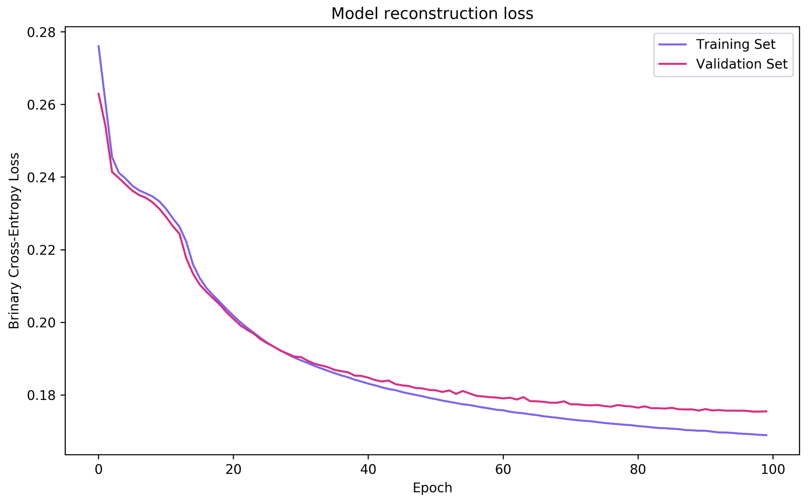

图 7.6-四层自动编码器训练期间的损失函数监控

一旦模型训练成功，我们就可以使用以下代码检索编码表示:

```
encdd = latent_ncdr.predict(x_test)
```

我们正在使用测试集`x_test`。这种编码将按照规定编码成二维，并且将按照规定产生范围[-1，1]中的潜在表示。类似地，我们总是可以获取测试集，并使用自动编码器对其进行压缩和重构，以查看输入与重构的相似程度。我们是这样做的:

```
x_hat = autoencoder.predict(x_test)
```

在我们研究从 MNIST 学到的潜在表征之前，我们可以研究重建质量，作为评估学习模型质量的一种方式。*图 7.7* 显示了使用*图 7.4* 作为提供给每个模型的输入的参考的重建结果(在`x_hat`)。该图分为四个部分，每个部分对应于*图 7.5* 中描述的模型:a)八层模型，b)六层模型，c)四层模型，d)两层模型:

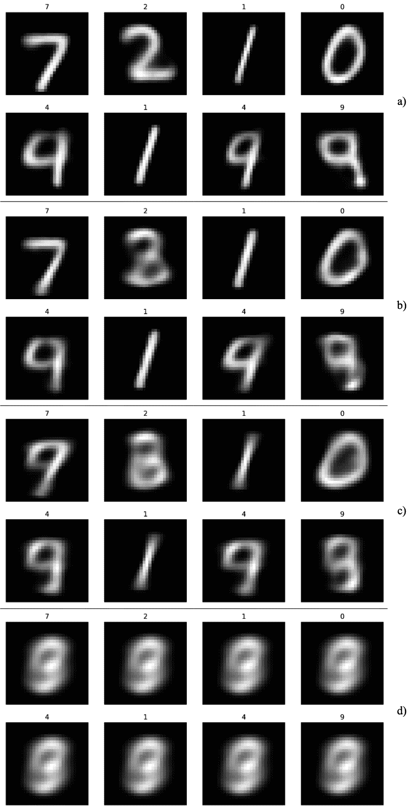

图 7.7–图 7.5 中模型的自动编码器重建:a)八层模型，b)六层模型，c)四层模型，d)两层模型

从*图 7.7.a* 中，我们可以看到具有八层(392、28、10、2、10、28、392、784)的模型能够产生除了数字 4 和 9 之外的一般良好的重建。很明显，这两个数字紧密相关(视觉上),自动编码器很难清楚地区分这两个数字。为了进一步探索这种观察，我们可以将潜在空间中的测试数据可视化(在`encdd`中)，如图*图 7.8* 所示:

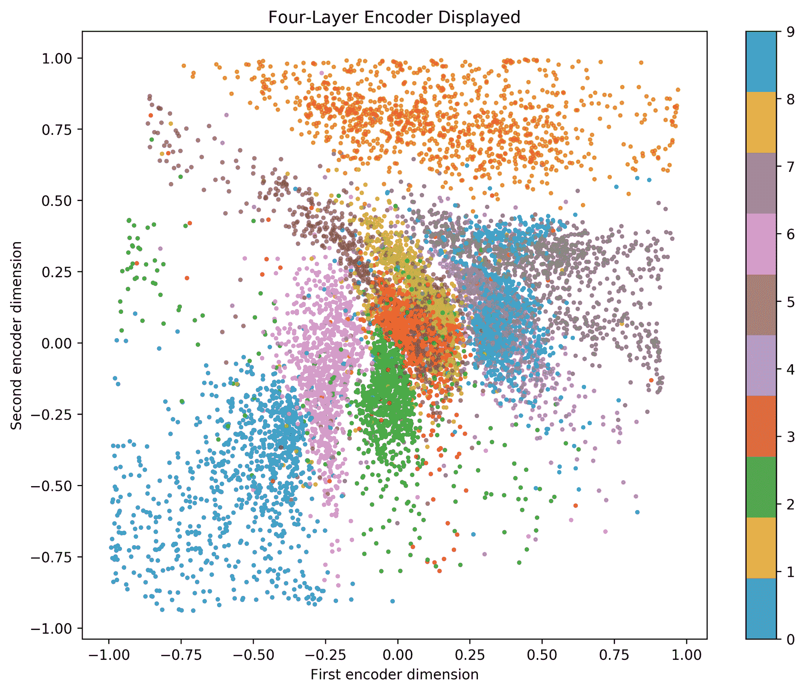

图 7.8–使用 MNIST 测试数据的四层编码器

在自动编码器产生的潜在空间中，数字 4 和 9 之间的重叠是明显的。然而，大多数其他数字组都有相对清晰的独立簇。*图 7.8* 也解释了其他看起来很像的数字的自然接近度；例如，一和七看起来很接近，零和六也是如此，三和八也是如此。然而，看起来不一样的数字位于潜在空间的相反部分——例如，0 和 1。

*图 7.9* 描述了三层自动编码器，去掉了有 392 个神经元的层，留下了 28，10，2 个神经元的架构。显然，潜在空间的质量显著降低，尽管一些主要结构是一致的。也就是零和一在相对的两边，其他看起来很像的数字靠得更近；与*图 7.8* 相比，重叠更大。这种三层自动编码器的质量一直较低，如图*图 7.7.b* 所示:

图 7.9–使用 MNIST 测试数据的三层编码器

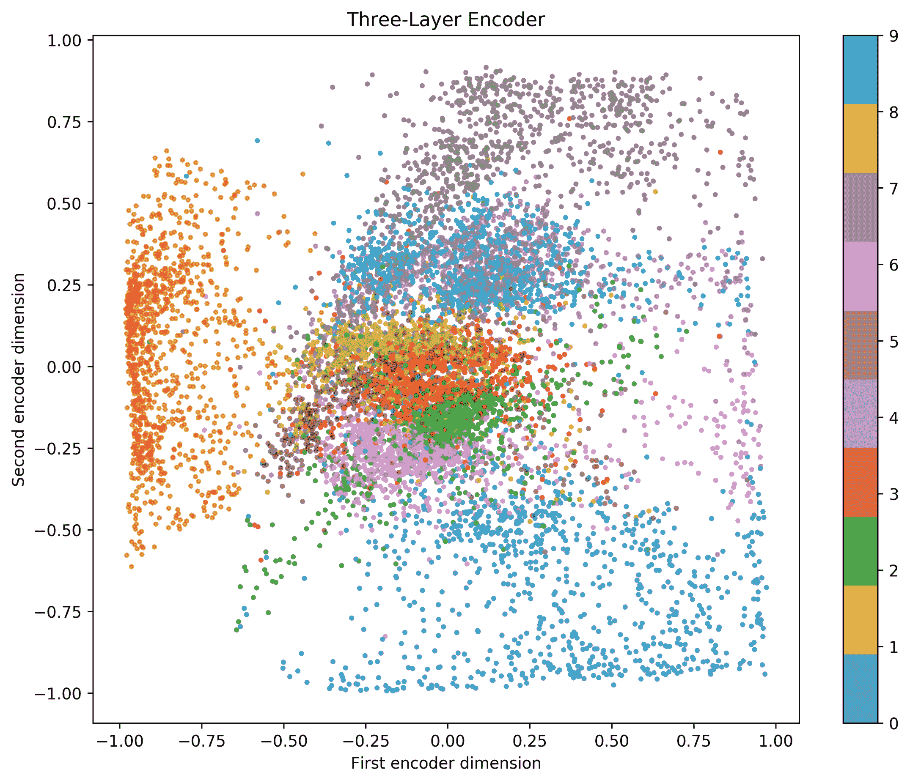

在*图 7.10* 中，我们可以观察到具有 10 个和 2 个神经元的两层自动编码器的结果，这也比之前的自动编码器有更大的数字重叠；这在*图 7.7.c* 所示的较差重建中也很明显:

图 7.10–使用 MNIST 测试数据的双层编码器

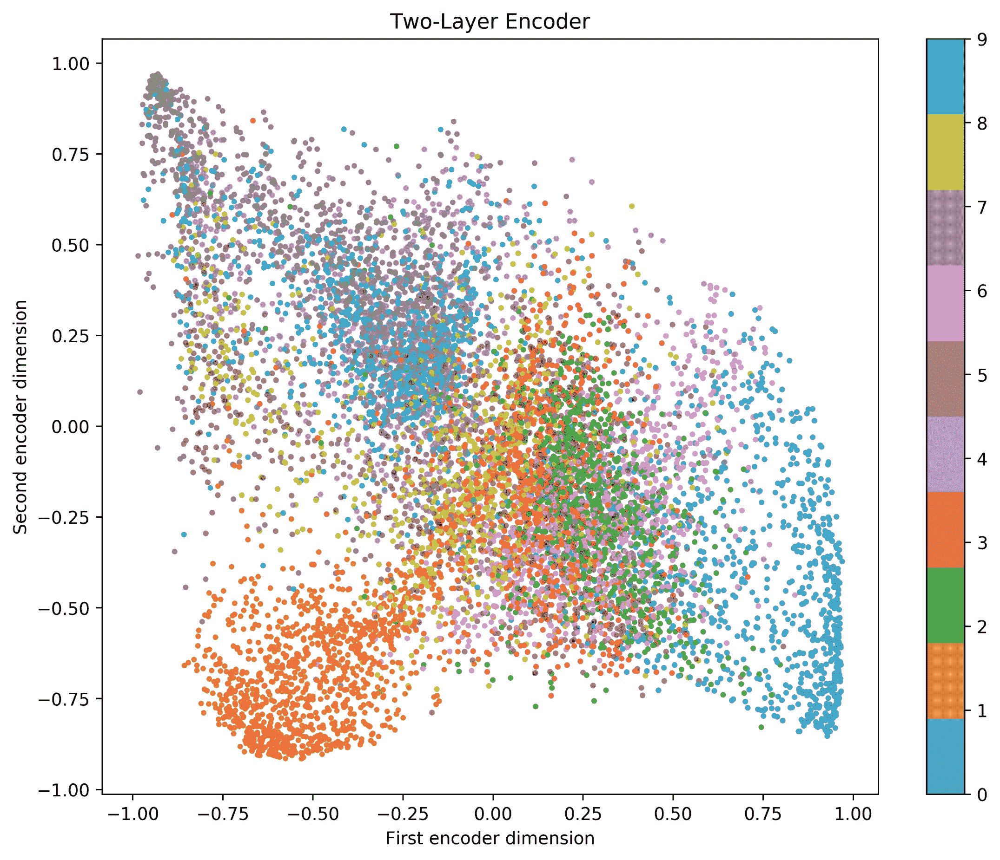

Figure 7.10 – Two-layer encoder using MNIST test data

最后，*图 7.11* 显示了一层自动编码器的潜在空间。显然，这是个糟糕的主意。请考虑我们要求自动编码器做的事情:我们只要求两个神经元找到一种方法来查看一个数字的整个图像，并找到一种方法(学习权重 [] )将所有图像映射到二维。这是不可能的。从逻辑上讲，如果我们只有一层，我们至少需要 10 个神经元来充分模拟 MNIST 的 10 个数字中的每一个:

图 7.11-使用 MNIST 测试数据的一层编码器-一个坏主意

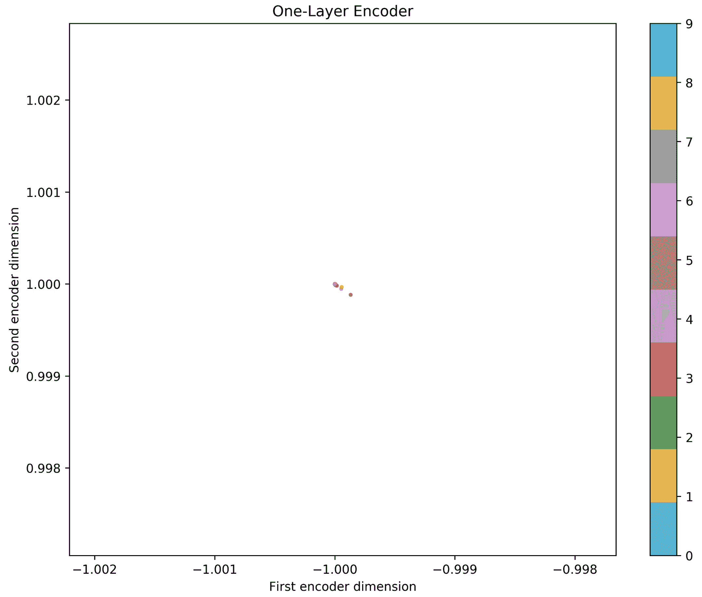

仔细观察*图 7.11* 还可以清楚地看到，轴的比例略有变化；这可以解释为编码器不能将 MNIST 的所有数字分成潜在空间的不同区域。在实践中，除非输入空间的维数已经非常低，否则请不要使用具有几层和几个神经元的自动编码器。如本实验所示，自动编码器在深度配置中可能更成功。在下一章学习更多关于深度自动编码器的知识。

Close observation of *Figure 7.11* also makes it clear that the scale of the axes varies just slightly; this can be interpreted as the encoder not being able to separate into different regions of the latent space all the digits of MNIST. In practice, please do not use autoencoders with a few layers with a few neurons, unless the dimensionality of the input space is already very low. Autoencoders might be more successful in deep configurations, as shown in this experiment. Learn more about deep autoencoders in the next chapter.

无监督学习的伦理含义

# 无监督学习，比如我们到目前为止在探索的 autoencoder 中看到的情况，并不神奇。它是公认的，有非常严格的已知和预先定义的界限。它不具备在数据限制之外学习新事物的能力。记住，无监督学习是被动的学习，如本章介绍部分所解释的。

然而，即使是最健壮的无监督学习模型也有与之相关的伦理风险。其中一个主要问题是，当处理异常值或可能包含边缘情况的数据时，它们会造成困难。例如，假设有大量 IT 招聘数据，包括多年经验、当前薪资和候选人知道的编程语言。如果数据主要包含关于具有相同编程语言经验的候选人的数据，并且只有少数人知道 Python，那么那些知道 Python 语言的候选人可能被放置到可能难以清楚地可视化的边界或区域中，因为模型已经了解到由于 Python 是不常用的语言，所以它可能在数据压缩、维数减少或数据可视化方面不相关。此外，考虑一下如果 5 年后，你使用同样的模型会发生什么，尽管有更新的编程语言在 5 年前的培训中是不知道的。对于可视化或数据压缩应用程序，模型可能会也可能不会正确映射这些信息。

您必须非常小心使用哪些数据来训练自动编码器，并且拥有各种案例对于任何模型的可靠性都非常重要。如果数据中没有足够的多样性，自动编码器将偏向于只从一个输入空间学习。想象一下，你用之前的 10 个 MNIST 数字的图像训练一个自动编码器——你不会期望自动编码器在猫的图像上正确执行；这将是一个错误，并可能产生不想要的结果。例如，当使用人的图像时，您必须确保训练数据中有足够的种类和多样性来产生适当的训练和健壮的模型，对于不被认为是训练数据一部分的人的图像，该模型不会执行错误。

摘要

# 本章说明了自动编码器是非常简单的模型，可用于编码和解码不同目的的数据，例如数据压缩、数据可视化，以及简单地查找仅保留重要特征的潜在空间。我们证明了神经元的数量和自动编码器的层数对于模型的成功是很重要的。更深(更多层)和更广(更多神经元)的特征通常是好模型的组成部分，即使这会导致训练时间变慢。

至此，你应该知道从被动学习的角度来看，有监督学习和无监督学习的区别。您还应该能够轻松实现自动编码器的两个基本组件:编码器和解码器。类似地，您应该能够修改 autoencoder 的体系结构，对其进行微调以获得更好的性能。以我们在本章中讨论的例子为例，您应该能够将自动编码器应用于降维问题或数据可视化问题。此外，当涉及到用于训练无监督学习算法的数据时，您应该考虑与无监督学习算法相关的风险和责任。

[第 8 章](6677b8b1-806c-4c39-8c1e-371e83501acf.xhtml)、*、*将继续介绍更深入、更广泛的自动编码器架构，这些架构将超越我们在本章中介绍的内容。下一章将介绍深度信念网络的概念和这种深度无监督学习的重要性。它将通过介绍深度自动编码器并将其与浅层自动编码器进行对比来解释这些概念。本章还将给出优化神经元数量和层数以最大化性能的重要建议。

问题和答案

# **过度拟合对自动编码器来说是坏事吗？**

1.  实际上，不。你想让自动编码器超负荷！也就是说，您希望它在输出中精确地复制输入数据。然而，有一个警告。与模型的大小相比，数据集必须非常大；否则，数据的记忆将阻止模型推广到看不见的数据。

为什么我们在编码器的最后一层使用了两个神经元？

2.  仅用于可视化目的。由两个神经元产生的二维潜在空间使我们能够很容易地将潜在空间中的数据可视化。在下一章中，我们将使用不一定具有二维潜在空间的其它构型。

For visualization purposes only. The two-dimensional latent space produced by the two neurons allows us to easily visualize the data in the latent space. In the next chapter, we will use other configurations that do not necessarily have a two-dimensional latent space.

**自动编码器又有什么酷的？**

3.  **What is so cool about autoencoders again?**

它们是简单的神经模型，在没有老师(无人监督)的情况下学习。他们不偏向于学习特定的标签(类)。他们通过迭代观察了解数据世界，旨在了解最具代表性和相关性的特征。它们可以用作特征提取模型，但是我们将在以后的章节中对此进行更多的讨论。

参考

# 阿马里，S. I. (1993 年)。反向传播和随机梯度下降法。*神经计算*，5(4-5)，185-196。

*   王，姚海红，赵，等(2016)。基于自动编码器的降维。*神经计算*，184，232-242。
*   Petscharnig，s .，Lux，m .，和 Chatzichristofis，S. (2017 年)。使用深度学习和自动编码器对图像特征进行降维。第 15 届基于内容的多媒体索引国际研讨会论文集*(第 23 页)。ACM。*
*   Creswell，a .，Arulkumaran，k .，和 Bharath，A. A. (2017 年)。训练成最小化二进制交叉熵的去噪自动编码器。 *arXiv 预印本* arXiv:1708.08487。
*   金马博士和巴律师(2014 年)。亚当:一种随机优化方法。arXiv 预印本 arXiv:1412.6980。
*   Kingma, D. P., & Ba, J. (2014). Adam: A method for stochastic optimization. arXiv preprint arXiv:1412.6980.