# 八、深度自编码器

本章介绍了深度信念网络的概念和这种深度无监督学习的意义。它通过引入深度自编码器以及两种有助于创建健壮模型的正则化技术来解释这些概念。这些正则化技术，批量归一化和丢弃，已知可以促进深度模型的学习，并已被广泛采用。我们将在 MNIST 和包含彩色图像的 CIFAR-10 数据集上展示深度自编码器的强大功能。

在本章结束时，通过观察建模的容易程度和它们提供的输出质量，你会体会到构建深度信念网络的好处。您将能够实现自己的深度自编码器，并向自己证明，对于大多数任务，深度模型比深度模型更好。您将熟悉用于优化模型和最大化性能的批处理规范化和剔除策略。

本章组织如下:

*   引入深度信念网络
*   制作深度自编码器
*   用深度自编码器探索潜在空间

# 引入深度信念网络

在机器学习中，有一个领域在谈到**深度学习** ( **DL** )时经常被讨论，叫做**深度信念网络** ( **DBNs** ) (Sutskever，I .和 Hinton，G. E. (2008))。一般来说，这个术语也用于一种基于图的机器学习模型，例如众所周知的**受限玻尔兹曼机器**。然而，dbn 通常被认为是 DL 家族的一部分，深度自编码器是该家族最著名的成员之一。

深度自编码器被认为是 dbn，在某种意义上说，有潜在的变量，只有在前进方向的单层可见。与只有一对层的自编码器相比，这些层的数量通常很多。一般来说，DL 和 DBNs 的一个主要原则是，在学习过程中，不同的知识在不同的层次上表现出来。这种知识表示通过*特征学习*来学习，而不会偏向特定的类别或标签。此外，已经证明这种知识似乎是分等级的。例如，考虑图像；通常，更靠近输入层的层学习低阶特征(即边缘)，而更深的层学习高阶特征，即定义明确的形状、图案或对象(Sainath，T. N .，et al .(2012))。

在 DBNs 中，如同在大多数 DL 模型中一样，特征空间的可解释性可能是困难的。通常，查看第一层的权重可以提供关于所学特征和/或特征图外观的信息；然而，由于深层的高度非线性，特征图的可解释性一直是个问题，需要仔细考虑(Wu，k .等人(2016))。然而，尽管如此，dbn 在特征学习方面表现出优异的结果。在接下来的几节中，我们将深入探讨高度复杂数据集上的自编码器版本。我们将引入一些新的图层类型来展示一个模型的深度。

# 制作深度自编码器

一个自编码器可以被称为 *deep* ，只要它有一对以上的层(编码层和解码层)。在 autoencoder 中将层堆叠在彼此之上是一种很好的策略，可以提高其在寻找独特的潜在空间方面的特征学习能力，这些潜在空间在分类或回归应用中具有很高的歧视性。然而，在[第 7 章](480521d9-845c-4c0a-b82b-be5f15da0171.xhtml)、*自编码器*中，我们介绍了如何将层堆叠到自编码器上，我们将再次这样做，但这一次我们将使用几个新类型的层，超出了我们一直使用的密集层。这些是**批正常化**和**漏失**层。

这些层中没有神经元；然而，它们在学习过程中充当具有非常具体的目的的机制，可以通过防止过度拟合或减少数值不稳定性来导致更成功的结果。让我们来讨论一下其中的每一项，然后我们将继续在几个重要的数据集上对这两项进行实验。

## 批量标准化

自 2015 年推出以来，批处理规范化一直是 DL 不可或缺的一部分(Ioffe，s .和 Szegedy，C. (2015))。它是一个重大的游戏改变者，因为它有几个很好的属性:

*   它可以防止称为**消失梯度**或**爆炸梯度**的问题，这在循环网络中非常常见(Hochreiter，S. (1998))。
*   它可以通过作为学习模型的正则化来加快训练速度(Van Laarhoven，T. (2017))。

这些属性的总结和我们用来表示批量标准化的块图像如图 8.1 所示:

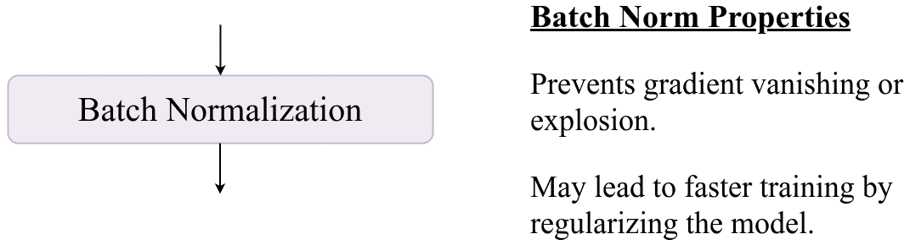

图 8.1-批量标准化层主要属性

数据科学家通常称之为 *batch norm* 的作者引入了这种简单的机制，通过为梯度的计算以及它们如何影响不同层神经元的权重更新提供稳定性，来加速训练或模型收敛。这是因为它们可以防止梯度消失或爆炸，这是基于梯度的优化在 DL 模型上操作的自然结果。也就是说，模型越深，渐变影响层的方式和更深层中的单个单元可能具有大更新或非常小更新的效果，这可能导致变量溢出或数值为零。

如*图 8.2* 顶部所示，批量标准化能够通过标准化输入数据来调整输入数据的边界，从而使输出符合正态分布。图的底部说明了应用批量标准化的位置，即在将输出发送到下一层之前的神经元内:

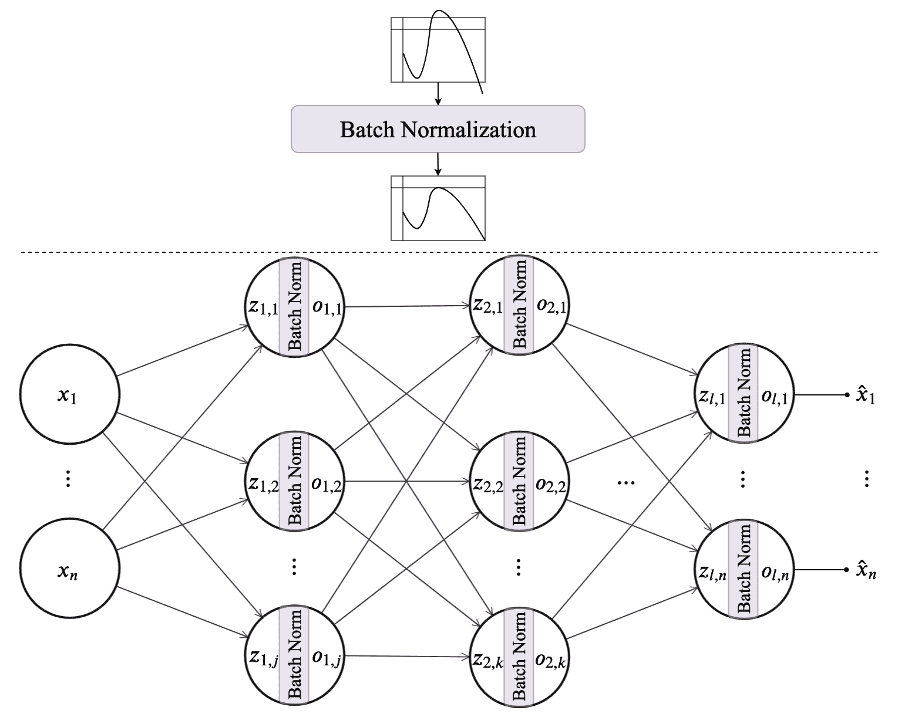

图 8.2–简单自编码器上的批量标准化

考虑有一个大小为的(小)批数据，这允许我们定义以下等式。首先，在第层，批次的平均值可计算如下:

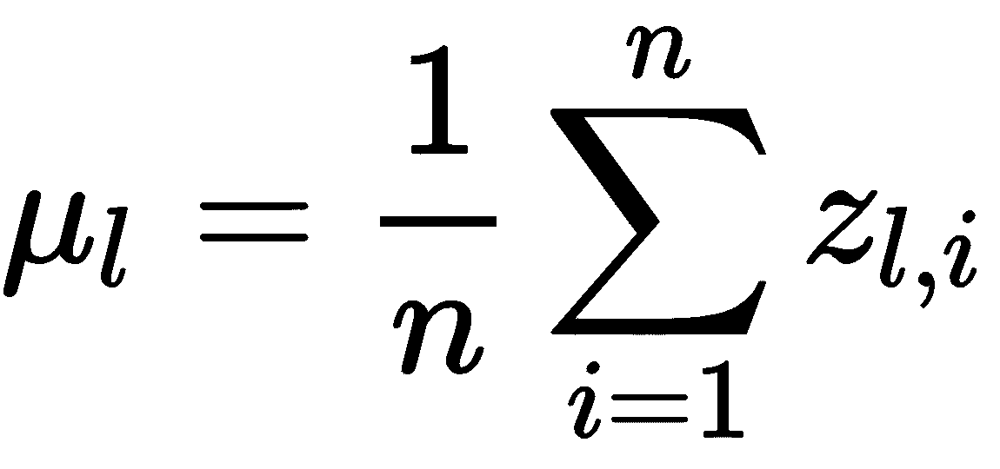

相应的标准差计算如下:

。

然后，我们可以将层中的每个单元归一化如下:

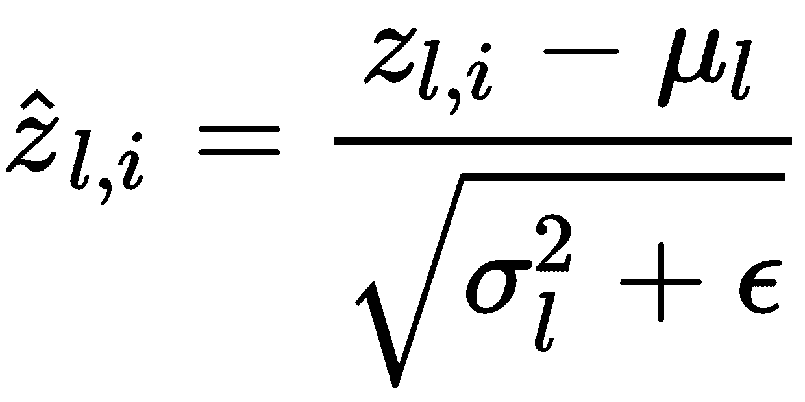

这里，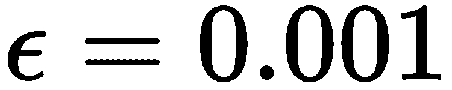是仅为数值稳定性而引入的常数，但是可以根据需要改变。最后，在进入激活函数之前，层、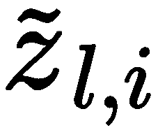中每个单元的归一化神经输出可以计算如下:

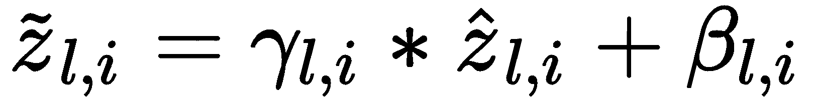

这里，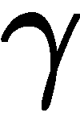和是每个神经单元需要学习的参数。在此之后，在层中的单元处的激活函数的任何选择将接收归一化的输入 [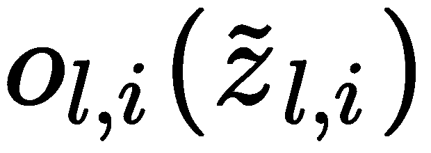] ，并产生最优归一化的输出以最小化损失函数。

查看好处的一个简单方法是想象归一化过程:虽然它发生在每个单元，但学习过程本身决定了使模型性能最大化(损失最小化)所需的最佳归一化。因此，如果对于某些特征或潜在空间来说不必要，它具有消除归一化效果的能力，或者它也可以使用归一化效果。要记住的重要一点是，当使用批量归一化时，学习算法将学习最佳地使用归一化。

我们可以使用`tensorflow.keras.layers.BatchNormalization`创建一个批量标准化层，如下所示:

```
from tensorflow.keras.layers import BatchNormalization
...
bn_layer = BatchNormalization()(prev_layer)
...
```

这显然是使用函数范式完成的。考虑以下对应于电影评论的数据集示例，称为 *IMDb* (Maas，A. L .等人(2011))，我们将在[第十三章](a6e892c5-e890-4c0a-ad92-c5442328a64a.xhtml)、*循环神经网络*中更详细地解释。在本例中，我们只是试图证明添加批处理规范化层与没有批处理规范化层相比的效果。仔细看看下面的代码片段:

```
from tensorflow.keras.models import Model
from tensorflow.keras.layers import Dense, Activation, Input
from tensorflow.keras.layers import BatchNormalization
from keras.datasets import imdb
from keras.preprocessing import sequence
import numpy as np

inpt_dim = 512    #input dimensions
ltnt_dim = 256    #latent dimensions

# -- the explanation for this will come later --
(x_train, y_train), (x_test, y_test) = imdb.load_data()
x_train = sequence.pad_sequences(x_train, maxlen=inpt_dim)
x_test = sequence.pad_sequences(x_test, maxlen=inpt_dim)
# ----------------------------------------------
```

我们继续构建模型:

```
x_train = x_train.astype('float32') 
x_test = x_test.astype('float32')

# model with batch norm
inpt_vec = Input(shape=(inpt_dim,))
el1 = Dense(ltnt_dim)(inpt_vec)        #dense layer followed by
el2 = BatchNormalization()(el1)        #batch norm
encoder = Activation('sigmoid')(el2)
decoder = Dense(inpt_dim, activation='sigmoid') (encoder)
autoencoder = Model(inpt_vec, decoder)

# compile and train model with bn
autoencoder.compile(loss='binary_crossentropy', optimizer='adam')
autoencoder.fit(x_train, x_train, epochs=20, batch_size=64, 
                shuffle=True, validation_data=(x_test, x_test))
```

在这个代码片段中，批处理规范化就放在激活层之前。因此，这将标准化激活函数的输入，在这种情况下是一个`sigmoid.`。类似地，我们可以如下构建没有批处理标准化层的相同模型:

```
# model without batch normalization
inpt_vec = Input(shape=(inpt_dim,))
el1 = Dense(ltnt_dim)(inpt_vec) #no batch norm after this
encoder = Activation('sigmoid')(el1)
latent_ncdr = Model(inpt_vec, encoder)
decoder = Dense(inpt_dim, activation='sigmoid') (encoder)
autoencoder = Model(inpt_vec, decoder)

# compile and train model with bn
autoencoder.compile(loss='binary_crossentropy', optimizer='adam')
autoencoder.fit(x_train, x_train, epochs=20, batch_size=64, 
                shuffle=True, validation_data=(x_test, x_test))
```

如果我们训练这两个模型，并在它们最小化损失函数时绘制它们的性能，我们将很快注意到批量归一化是有回报的，如图*图 8.3* 所示:

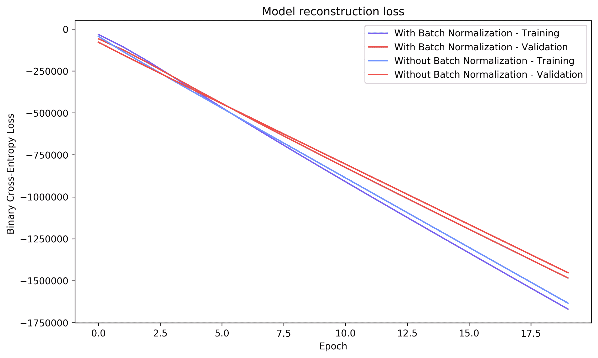

图 8.3–使用和不使用批量标准化的学习进度对比

该图表明，批量标准化具有在训练和数据验证集中减少损失函数的效果。这些结果与你可以自己尝试的许多其他实验是一致的！但是，我们之前说过，不一定保证会一直这样。这是一种相对现代的技术，迄今为止已被证明功能正常，但这并不意味着它对我们所知的一切都有效。

我们强烈建议，在您的所有模型中，您首先尝试使用没有批量标准化的模型来解决问题，然后一旦您对您拥有的性能感到满意，再回来使用批量标准化，看看您是否可以在**性能**和**训练速度**方面获得轻微提升。

假设您尝试了批处理规范化，并获得了性能和/或速度的提升，但是您现在发现您的模型一直在过度拟合。不要害怕！还有一种有趣而新颖的技术，叫做**辍学**。正如我们将在下一节中讨论的，这可以为模型提供一种减少过度拟合的替代方法。

## 拒绝传统社会的人

辍学是 2014 年发表的一项技术，该年后不久便开始流行(Srivastava，n .，Hinton，g .，et al .(2014))。它作为一种替代方法来对抗过度拟合，过度拟合是其主要特性之一，可总结如下:

*   可以减少过度拟合的几率。
*   它可以导致更好的概括。
*   可以降低支配神经元的作用。
*   可以促进神经元多样性。
*   可以促进更好的神经元协同工作。

我们将用于删除的块图像及其主要属性如*图 8.4* 所示:

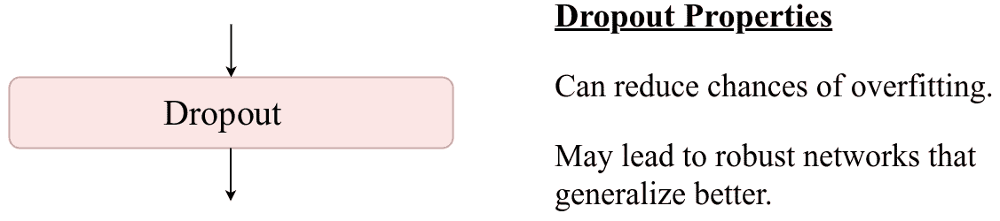

图 8.4–脱落层属性

退出策略之所以有效，是因为它使网络能够通过断开代表网络本身内某些假设(或模型)的特定数量的神经元，来搜索替代假设以解决问题。看待这一策略的一个简单方法是思考以下问题:想象一下，你有许多专家，他们的任务是判断一幅图像是包含一只猫还是一把椅子。可能有很多专家适度地相信图像中有一把椅子，但是只需要一个专家特别大声，并且完全相信有一只猫来说服决策者听这个特别大声的专家，而忽略其他人。在这个类比中，专家就是神经元。

可能有一些神经元特别确信(有时是不正确的，由于过度拟合不相关的特征)关于信息的某个事实，并且与该层中的其余神经元相比，它们的输出值特别高，以至于更深的层学会更多地倾听该特定层，从而使更深的层上的过度拟合永久化。 **Dropout** 是一种机制，它将选择一个层中的许多神经元，并将它们与该层完全断开，这样既没有输入流入这些神经元，也没有输出从这些神经元出来，如图*图 8.5* 所示:

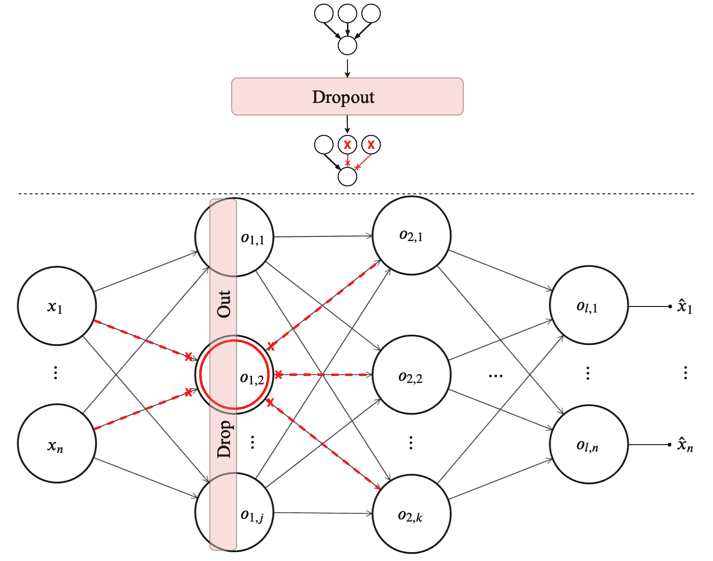

图 8.5–第一个隐藏层上的脱落机制。这里的脱落将一个神经元从层中断开

在上图中，第一个隐藏层的辍学率为三分之一。这意味着，完全随机地，三分之一的神经元将被断开。*图 8.5* 给出了第一个隐层的第二个神经元断开时的例子:输入层没有输入进去，也没有输出出来。模型完全不知道它的存在；实际上，这是一个不同的神经网络！

然而，断开的神经元仅在一个训练步骤中断开:它们的权重在一个训练步骤中保持不变，而所有其他权重都被更新。这有几个有趣的含义:

由于神经元的随机选择，那些倾向于支配(过度适应)特定特征的*麻烦制造者*必然会在某个时候被选择出来，其余的神经元将学习处理没有那些*麻烦制造者*的特征空间。这导致防止和减少过度拟合，同时促进擅长不同事物的不同神经元之间的协作。

由于神经元的不断无知/断开，网络有可能从根本上不同——这几乎就像我们在每一步中训练多个神经网络，而实际上不必制作许多不同的模型。这一切都是因为辍学。

*   通常建议在更深的网络中使用压差来改善 DL 中常见的传统过拟合问题。
*   为了显示使用 dropout 时的性能差异，我们将使用与上一节完全相同的数据集，但我们将在自编码器中添加一个额外的层，如下所示:

这段代码中，掉线率为 10%，意味着密集层`e14`中有 10%的神经元在训练过程中被随机断开多次。

解码器与之前完全相同，基线模型不包含漏失层:

```
from tensorflow.keras.layers import Dropout
...
# encoder with dropout
inpt_vec = Input(shape=(inpt_dim,))
el1 = Dense(inpt_dim/2)(inpt_vec)
```

如果我们选择`'adagrad'`，并且我们执行超过 100 个时期的训练并比较性能结果，我们可以获得如图 8.6 所示的性能:

```

el2 = Activation('relu')(el1)
el3 = Dropout(0.1)(el2)
el4 = Dense(ltnt_dim)(el3)
encoder = Activation('relu')(el4)
```

图 8.6–自编码器重建损耗对比有无丢包模型

```
# without dropout
inpt_vec = Input(shape=(inpt_dim,))
el1 = Dense(inpt_dim/2)(inpt_vec)
el2 = Activation('relu')(el1)
el3 = Dense(ltnt_dim)(el2)
encoder = Activation('relu')(el3)
```

以下是完整的代码:

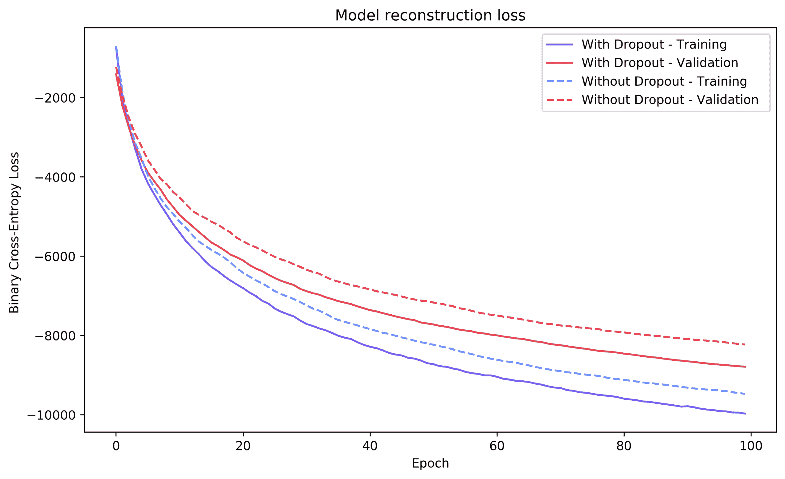

然后我们这样定义这个模型:

然后，我们编译它，训练它，存储训练历史，并清除变量以重复使用它们，如下所示:

```
from tensorflow.keras.models import Model
from tensorflow.keras.layers import Dense, Activation, Input
from tensorflow.keras.layers import Dropout
from keras.datasets import imdb
from keras.preprocessing import sequence
import numpy as np
import matplotlib.pyplot as plt

inpt_dim = 512
ltnt_dim = 128

(x_train, y_train), (x_test, y_test) = imdb.load_data()
x_train = sequence.pad_sequences(x_train, maxlen=inpt_dim)
x_test = sequence.pad_sequences(x_test, maxlen=inpt_dim)

x_train = x_train.astype('float32') 
x_test = x_test.astype('float32')
```

然后我们对一个没有辍学的模型做了同样的事情:

```
# with dropout
inpt_vec = Input(shape=(inpt_dim,))
el1 = Dense(inpt_dim/2)(inpt_vec)
el2 = Activation('relu')(el1)
el3 = Dropout(0.1)(el2)
el4 = Dense(ltnt_dim)(el3)
encoder = Activation('relu')(el4)

# model that takes input and encodes it into the latent space
latent_ncdr = Model(inpt_vec, encoder)

decoder = Dense(inpt_dim, activation='relu') (encoder)

# model that takes input, encodes it, and decodes it
autoencoder = Model(inpt_vec, decoder)
```

接下来，我们收集训练数据，并将其绘制如下:

```
autoencoder.compile(loss='binary_crossentropy', optimizer='adagrad')

hist = autoencoder.fit(x_train, x_train, epochs=100, batch_size=64, 
                       shuffle=True, validation_data=(x_test, x_test))

bn_loss = hist.history['loss']
bn_val_loss = hist.history['val_loss']

del autoencoder
del hist
```

从*图 8.6* 中我们可以看出，有 dropout 的模型性能优于没有 dropout 的模型。这表明没有辍学的训练有更高的机会过度拟合，原因是当不使用辍学时，学习曲线在验证集上更差。

```
# now without dropout
inpt_vec = Input(shape=(inpt_dim,))
el1 = Dense(inpt_dim/2)(inpt_vec)
el2 = Activation('relu')(el1)
el3 = Dense(ltnt_dim)(el2)
encoder = Activation('relu')(el3)

# model that takes input and encodes it into the latent space
latent_ncdr = Model(inpt_vec, encoder)

decoder = Dense(inpt_dim, activation='relu') (encoder)

# model that takes input, encodes it, and decodes it
autoencoder = Model(inpt_vec, decoder)

autoencoder.compile(loss='binary_crossentropy', optimizer='adagrad')

hist = autoencoder.fit(x_train, x_train, epochs=100, batch_size=64, 
                       shuffle=True, validation_data=(x_test, x_test))
```

如前所述，已经为这个特定的任务选择了`adagrad`优化器。我们做出这个决定是因为学习更多的优化器对你来说很重要，一次一个。Adagrad 是一种自适应算法；它根据特征的频率进行更新(Duchi，j .等人(2011))。如果特性频繁出现，则更新较小，而对于不寻常的特性，则进行较大的更新。

```
loss = hist.history['loss']
val_loss = hist.history['val_loss']

fig = plt.figure(figsize=(10,6))
plt.plot(bn_loss, color='#785ef0')
plt.plot(bn_val_loss, color='#dc267f')
plt.plot(loss, '--', color='#648fff')
plt.plot(val_loss, '--', color='#fe6100')
plt.title('Model reconstruction loss')
plt.ylabel('Binary Cross-Entropy Loss')
plt.xlabel('Epoch')
plt.legend(['With Drop Out - Training', 
            'With Drop Out - Validation', 
            'Without Drop Out - Training', 
            'Without Drop Out - Validation'], loc='upper right')
plt.show()
```

当**数据集稀疏**时，建议使用 Adagrad。例如，在词嵌入的情况下，如本例中的情况，频繁使用的单词将导致小的更新，而不常用的单词将需要较大的更新。

As mentioned earlier, the `adagrad` optimizer has been chosen for this particular task. We made this decision because it is important for you to learn more optimizers, one at a time. Adagrad is an adaptive algorithm; it performs updates with respect to the frequency of features (Duchi, J., et al. (2011)). If features occur frequently, the updates are small, while larger updates are done for features that are out of the ordinary.

最后，值得一提的是`Dropout(rate)`属于`tf.keras.layers.Dropout`类。作为参数的速率对应于神经元在每一个单独的训练步骤中随机断开的速率，在该训练步骤中使用了脱落。

建议您使用介于 **0.1 和 0.5** 之间的退出率来实现网络性能的显著改变。并且建议只在深度网络中使用 dropout **。然而，这些都是经验发现，你自己的实验是必要的。**

既然我们已经解释了这两个相对较新的概念，丢弃和批量标准化，我们将创建一个深度自编码器网络，该网络相对简单，但在寻找不偏向特定标签的潜在表示方面功能强大。

用深度自编码器探索潜在空间

正如我们在第七章、*自编码器*中定义的，潜在空间在 DL 中非常重要，因为它们可以导致基于假定的丰富潜在表示的强大决策系统。并且，再一次，使自编码器(和其他无监督模型)产生的潜在空间在它们的表示中丰富的是它们不偏向特定的标签。

# 在[第 7 章](480521d9-845c-4c0a-b82b-be5f15da0171.xhtml)、*自编码器*中，我们探索了 MNIST 数据集，这是 DL 中的标准数据集，并表明我们可以很容易地找到非常好的潜在表示，编码器中只有四个密集层，整个自编码器模型有八个层。在下一节中，我们将学习一个更加困难的数据集，称为 CIFAR-10，然后我们将回来探索`IMDB`数据集的潜在表示，我们已经在本章的前面几节中简要地探讨过了。

CIFAR-10

2009 年，*加拿大高级研究所(CIFAR)* 发布了一个非常大的图像集合，可以用来训练 DL 模型识别各种目标。我们将在这个例子中使用的是广为人知的 CIFAR-10，因为它只有 10 个类和总共 60，000 个图像；*图 8.7* 描绘了每个等级的样本:

## CIFAR-10

In 2009, the *Canadian Institute for Advanced Research (CIFAR)* released a very large collection of images that can be used to train DL models to recognize a variety of objects. The one we will use in this example is widely known as CIFAR-10, since it has only 10 classes and a total of 60,000 images; *Figure 8.7* depicts samples of each class:

图 8.7–来自 CIFAR-10 数据集的样本图像。为方便起见，数字表示分配给每个类别的数值

数据集中的每个图像都是 32×32 像素，使用 3 个维度来跟踪颜色细节。从图中可以看出，这些小图像包含除了那些被标记的对象之外的其他对象，例如文本、背景、结构、风景和其他部分被遮挡的对象，同时保留了前景中感兴趣的主要对象。这使得它比 MNIST 更具挑战性，在那里背景总是黑色的，图像是灰度的，并且每个图像中只有一个数字。如果你从未从事过计算机视觉应用，你可能不知道，与 MNIST 相比，处理 CIFAR-10 要复杂得多。因此，与 MNIST 的模型相比，我们的模型需要更加稳健和深入。

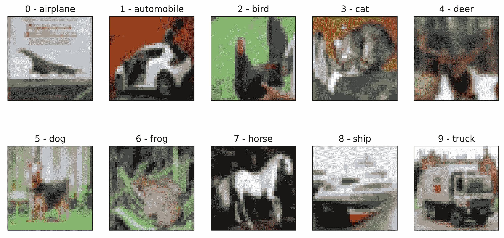

在 TensorFlow 和 Keras 中，我们可以使用以下代码轻松加载和准备数据集:

上述代码输出以下内容:

In TensorFlow and Keras, we can easily load and prepare our dataset with the following code:

```
import numpy as np
from tensorflow.keras.datasets import cifar10

(x_train, y_train), (x_test, y_test) = cifar10.load_data()
x_train = x_train.astype('float32') / 255.
x_test = x_test.astype('float32') / 255.
x_train = x_train.reshape((len(x_train), np.prod(x_train.shape[1:])))
x_test = x_test.reshape((len(x_test), np.prod(x_test.shape[1:])))

print('x_train shape is:', x_train.shape)
print('x_test shape is:', x_test.shape)
```

这意味着我们有六分之一的数据集(~16%)被分离出来用于测试目的，而其余的用于训练。3072 个维度来源于像素数和通道数: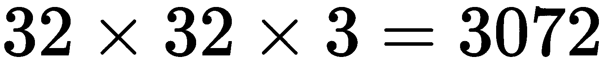。前面的代码还将范围从[0，255]到[0.0，1.0]的数据规范化为浮点数。

```
x_train shape is: (50000, 3072)
x_test shape is: (10000, 3072)
```

继续我们的例子，我们将提出一个深度自编码器，其架构如图*图 8.8* 所示，它将接受 3072 维输入，并将其编码为 64 维:

图 8.8–CIFAR-10 数据集上深度自编码器的架构

这种架构在编码器中使用 17 层，在解码器中使用 15 层。图中的密集层具有写在相应块中的神经元数量。可以看出，该模型在编码输入数据的整个过程中实现了一系列战略性批量标准化和剔除策略。在本例中，所有辍学层的辍学率均为 20%。

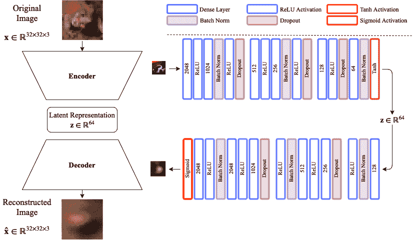

如果我们使用标准的`adam`优化器和标准的二进制交叉熵损失对模型进行 200 个时期的训练，我们可以获得如图*图 8.9* 所示的训练性能:

This architecture uses 17 layers in the encoder and 15 layers in the decoder. Dense layers in the diagram have the number of neurons written in their corresponding block. As can be seen, this model implements a series of strategic batch normalization and dropout strategies throughout the process of encoding the input data. In this example, all dropout layers have a 20% dropout rate.

If we train the model for 200 epochs using the standard `adam` optimizer and the standard binary cross-entropy loss, we could obtain the training performance shown in *Figure 8.9*:

图 8.9–CIFAR-10 上深度自编码器模型损失的重建

以下是完整的代码:

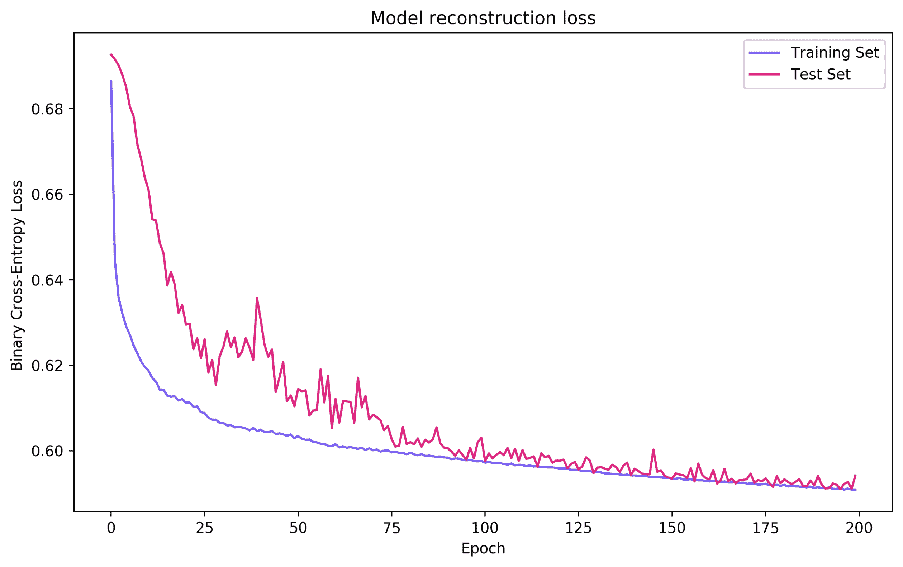

我们将模型定义如下:

接下来，我们将模型的解码器部分定义如下:

```
from tensorflow import keras
from tensorflow.keras.datasets import cifar10
from tensorflow.keras.models import Model
from tensorflow.keras.layers import Dense, Dropout, Activation, Input
from tensorflow.keras.layers import BatchNormalization import matplotlib.pyplot as plt
import numpy as np

inpt_dim = 32*32*3
ltnt_dim = 64

# The data, split between train and test sets:
(x_train, y_train), (x_test, y_test) = cifar10.load_data()
x_train = x_train.astype('float32') / 255.
x_test = x_test.astype('float32') / 255.
x_train = x_train.reshape((len(x_train), np.prod(x_train.shape[1:])))
x_test = x_test.reshape((len(x_test), np.prod(x_test.shape[1:])))
print('x_train shape:', x_train.shape)
print('x_test shape:', x_test.shape)
```

我们将它放在一个自编码器模型中，编译并训练它，如下所示:

```
inpt_vec = Input(shape=(inpt_dim,))
el1 = Dense(2048)(inpt_vec)
el2 = Activation('relu')(el1)
el3 = Dense(1024)(el2)
el4 = BatchNormalization()(el3)
el5 = Activation('relu')(el4)
el6 = Dropout(0.2)(el5)

el7 = Dense(512)(el6)
el8 = Activation('relu')(el7)
el9 = Dense(256)(el8)
el10 = BatchNormalization()(el9)
el11 = Activation('relu')(el10)
el12 = Dropout(0.2)(el11)

el13 = Dense(128)(el12)
el14 = Activation('relu')(el13)
el15 = Dropout(0.2)(el14)
el16 = Dense(ltnt_dim)(el15)
el17 = BatchNormalization()(el16)
encoder = Activation('tanh')(el17)

# model that takes input and encodes it into the latent space
latent_ncdr = Model(inpt_vec, encoder)
```

*图 8.9* 中所示的模型性能收敛良好，训练集和测试集的损失都在衰减，这意味着模型没有过度拟合，并随着时间的推移继续适当调整权重。为了可视化模型在不可见数据(测试集)上的性能，我们可以简单地从测试集中随机选取样本，例如图 8.10 中的*样本，它们产生图 8.11* 中的*输出:*

```
dl1 = Dense(128)(encoder)
dl2 = BatchNormalization()(dl1)
dl3 = Activation('relu')(dl2)

dl4 = Dropout(0.2)(dl3)
dl5 = Dense(256)(dl4)
dl6 = Activation('relu')(dl5)
dl7 = Dense(512)(dl6)
dl8 = BatchNormalization()(dl7)
dl9 = Activation('relu')(dl8)

dl10 = Dropout(0.2)(dl9)
dl11 = Dense(1024)(dl10)
dl12 = Activation('relu')(dl11)
dl13 = Dense(2048)(dl12)
dl14 = BatchNormalization()(dl13)
dl15 = Activation('relu')(dl14)
decoder = Dense(inpt_dim, activation='sigmoid') (dl15)
```

图 8.10–来自 CIFAR-10 测试集的样本输入

```
# model that takes input, encodes it, and decodes it
autoencoder = Model(inpt_vec, decoder)

# setup RMSprop optimizer
opt = keras.optimizers.RMSprop(learning_rate=0.0001, decay=1e-6, )

autoencoder.compile(loss='binary_crossentropy', optimizer=opt)

hist = autoencoder.fit(x_train, x_train, epochs=200, batch_size=10000, 
                       shuffle=True, validation_data=(x_test, x_test))

# and now se visualize the results
fig = plt.figure(figsize=(10,6))
plt.plot(hist.history['loss'], color='#785ef0')
plt.plot(hist.history['val_loss'], color='#dc267f')
plt.title('Model reconstruction loss')
plt.ylabel('Binary Cross-Entropy Loss')
plt.xlabel('Epoch')
plt.legend(['Training Set', 'Test Set'], loc='upper right')
plt.show()
```

图 8.11-图 8.10 中给出的样本的样本输出(重建)

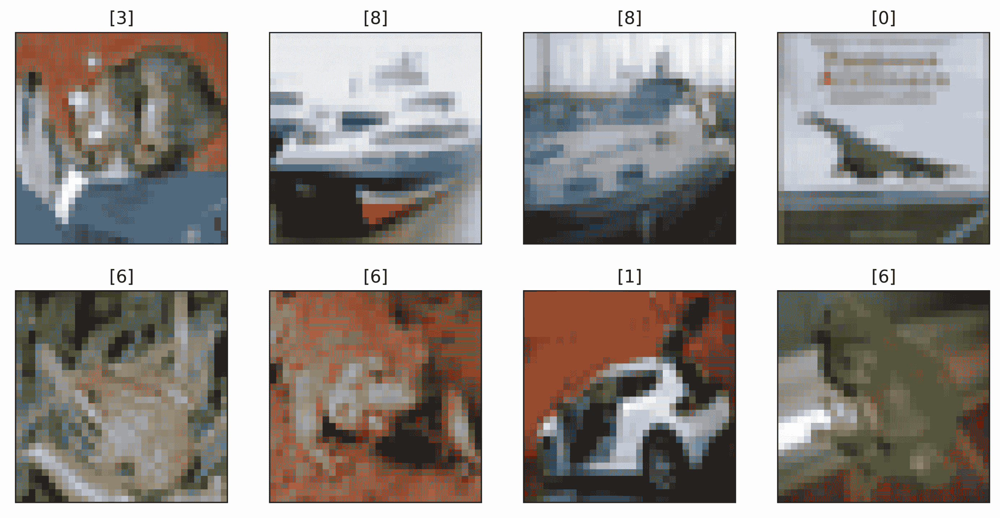

从*图 8.11* 中可以看出，重建正确地处理了输入数据的色谱。然而，很明显，就重建而言，这个问题比 MNIST 要困难得多。形状是模糊的，尽管它们看起来处于正确的空间位置。重建过程中明显缺少细节。我们可以把自编码器做得更深，或者训练得更久，但是这个问题可能不会得到很好的解决。我们可以用这样一个事实来证明这种性能，即我们故意选择寻找一个大小为 64 的潜在表示，它比一个 5 乘 5 的小图像还要小: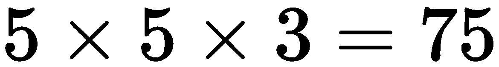。如果你仔细想想，很明显这几乎是不可能的，因为 3，072 比 64 代表 2.08%的压缩率！

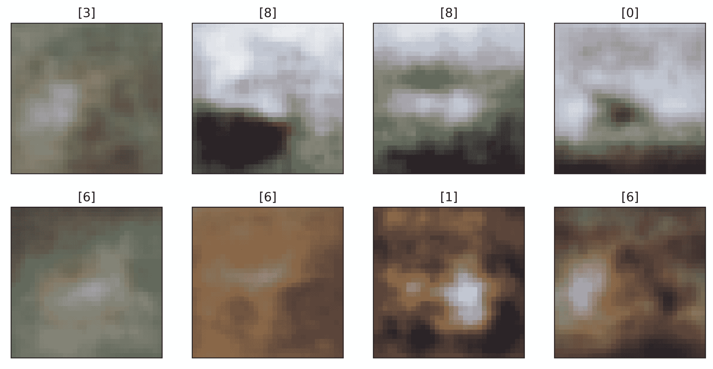

对此的解决方案不是将模型做得更大，而是承认潜在表示的大小可能不够大，不足以捕捉输入的相关细节来进行良好的重建。当前模型在降低特征空间的维度方面可能过于激进。如果我们使用 UMAP 将 64 维的潜在向量在 2 维中可视化，我们将得到如图*图 8.12* 所示的图:

You can see from *Figure 8.11* that the reconstructions correctly address the color spectrum of the input data. However, it is clear that the problem is much harder in reconstruction terms than MNIST. Shapes are blurry although they seem to be in the correct spatial position. A level of detail is evidently missing in the reconstructions. We can make the autoencoder deeper, or train for longer, but the problem might not be properly solved. We can justify this performance with the fact that we deliberately chose to find a latent representation of size 64, which is smaller than a tiny 5 by 5 image: . If you think about it and reflect on this, then it is clear that it is nearly impossible, as 3,072 to 64 represents a 2.08% compression!

图 8.12–测试集中潜在向量的 UMAP 二维表示

我们之前没有谈到 UMAP，但我们将简要说明，这是一个突破性的数据可视化工具，最近已经提出，并开始获得关注(麦金尼斯等人(2018))。在我们的例子中，我们简单地使用 UMAP 来可视化数据分布，因为我们没有使用自编码器来编码到二维。*图 8.12* 表明类别的分布没有足够清晰地定义，因此我们无法观察到分离或定义明确的集群。这证实了深度自编码器没有捕获足够的信息用于类分离；然而，在潜在空间的某些部分中仍然存在明确定义的组，例如底部中间和左侧的集群，其中一个集群与例如一组飞机图像相关联。这个**深度信念网络**已经很好地获得了关于输入空间的知识，足以辨认出输入的一些不同方面；例如，它知道飞机与青蛙非常不同，或者至少它们可能出现在不同的条件下，也就是说，青蛙将在绿色背景下出现，而飞机可能在背景中有蓝色的天空。

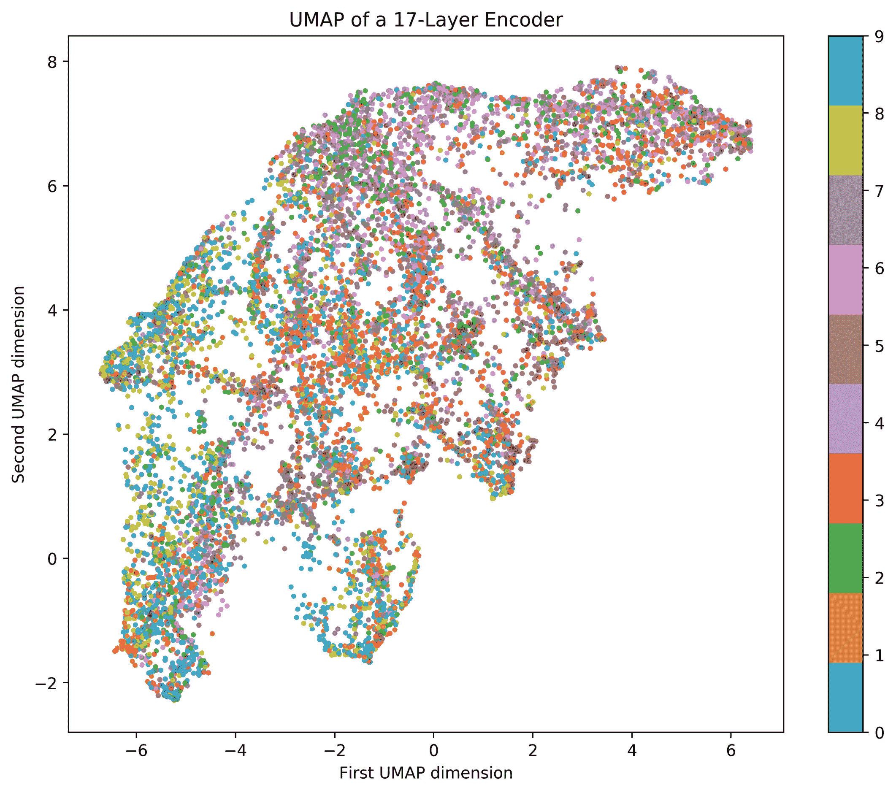

Figure 8.12 – UMAP two-dimensional representation of the latent vectors in the test set

*图 8.8* 中介绍的模型可以使用功能方法生产；编码器可以定义如下:

**Convolutional neural networks** (**CNNs**)are a much better alternative for most computer vision and image analysis problems such as this one. We will get there in due time in [Chapter 12](c36bdee9-51f3-4283-8f15-6dd603d071a1.xhtml), *Convolutional Neural Networks*. Be patient for now as we gently introduce different models one by one. You will see how we can make a convolutional autoencoder that can achieve much better performance than an autoencoder that uses fully connected layers. For now, we will continue with autoencoders for a little longer.

The model introduced in *Figure 8.8* can be produced using the functional approach; the encoder can be defined as follows:

```
from tensorflow.keras.models import Model
from tensorflow.keras.layers import Dense, Dropout, Activation, Input
from tensorflow.keras.layers import BatchNormalization, MaxPooling1D
import numpy as np

inpt_dim = 32*32*3
ltnt_dim = 64

inpt_vec = Input(shape=(inpt_dim,))
el1 = Dense(2048)(inpt_vec)
el2 = Activation('relu')(el1)
el3 = Dense(1024)(el2)
el4 = BatchNormalization()(el3)
el5 = Activation('relu')(el4)
el6 = Dropout(0.2)(el5)

el7 = Dense(512)(el6)
el8 = Activation('relu')(el7)
el9 = Dense(256)(el8)
el10 = BatchNormalization()(el9)
el11 = Activation('relu')(el10)
el12 = Dropout(0.2)(el11)

el13 = Dense(128)(el12)
el14 = Activation('relu')(el13)
el15 = Dropout(0.2)(el14)
el16 = Dense(ltnt_dim)(el15)
el17 = BatchNormalization()(el16)
encoder = Activation('tanh')(el17)

# model that takes input and encodes it into the latent space
latent_ncdr = Model(inpt_vec, encoder)
```

请注意，所有辍学层每次都有 20%的比率。这 17 层从映射一个`inpt_dim=3072`维度的输入到映射`ltnt_dim = 64`维度的输入。编码器的最后一个激活函数是双曲正切`tanh`，它提供[-1，1]范围内的输出；这种选择只是为了方便视觉化潜在空间。

接下来，解码器的定义如下:

解码器最后一层有一个`sigmoid`激活函数，映射回输入空间范围，即【0.0，1.0】。最后，我们可以使用`binary_crossentropy`损失和`adam`优化器对之前定义的`autoencoder`模型进行 200 个时期的训练，如下所示:

结果已在图 8.9 至图 8*中显示。 *11* 。然而，重新访问 MNIST 是很有趣的，但这次使用了深度自编码器，我们将在接下来讨论。*

```
dl1 = Dense(128)(encoder)
dl2 = BatchNormalization()(dl1)
dl3 = Activation('relu')(dl2)

dl4 = Dropout(0.2)(dl3)
dl5 = Dense(256)(dl4)
dl6 = Activation('relu')(dl5)
dl7 = Dense(512)(dl6)
dl8 = BatchNormalization()(dl7)
dl9 = Activation('relu')(dl8)

dl10 = Dropout(0.2)(dl9)
dl11 = Dense(1024)(dl10)
dl12 = Activation('relu')(dl11)
dl13 = Dense(2048)(dl12)
dl14 = BatchNormalization()(dl13)
dl15 = Activation('relu')(dl14)
decoder = Dense(inpt_dim, activation='sigmoid') (dl15)

# model that takes input, encodes it, and decodes it
autoencoder = Model(inpt_vec, decoder)
```

The last layer of the decoder has a `sigmoid` activation function that maps back to the input space range, that is, [0.0, 1.0]. Finally, we can train the `autoencoder` model as previously defined using the `binary_crossentropy` loss and `adam` optimizer for 200 epochs like so:

```
autoencoder.compile(loss='binary_crossentropy', optimizer='adam')

hist = autoencoder.fit(x_train, x_train, epochs=200, batch_size=5000, 
                       shuffle=True, validation_data=(x_test, x_test))
```

MNIST

`MNIST`数据集是一个没有 CIFAR-10 复杂的数据集的好例子，可以用深度自编码器来处理。之前，在[第 7 章](480521d9-845c-4c0a-b82b-be5f15da0171.xhtml)、*自编码器*中，我们讨论了浅层自编码器，并展示了添加层是有益的。在本节中，我们将进一步展示具有丢弃和批量标准化层的深度自编码器可以更好地产生丰富的潜在表示。图 8.13 显示了建议的架构:

## 图 8.13–MNIST 深度自编码器

层数和层数顺序同*图 8.8*；然而，致密层中神经元的数量和潜在表示维度发生了变化。压缩率从 784 到 2，即 0.25%:

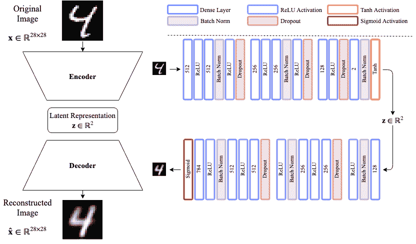

图 8.14–测试集的 MNIST 原始样本数字

然而，重建非常好，如图*图 8.14* 和*图 8.15* 所示:

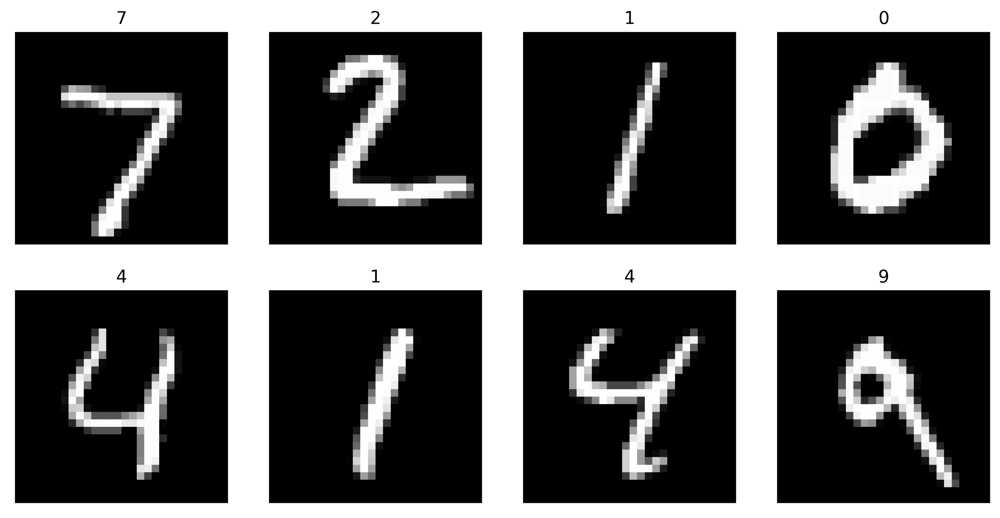

图 8.15–图 8.14 中显示的原始测试集的重构 MNIST 数字

图中显示的重建显示了非常好的细节水平，尽管边缘看起来模糊。该模型似乎很好地捕捉到了手指的大致形状。测试集的相应潜在表示如图*图 8.16* 所示:

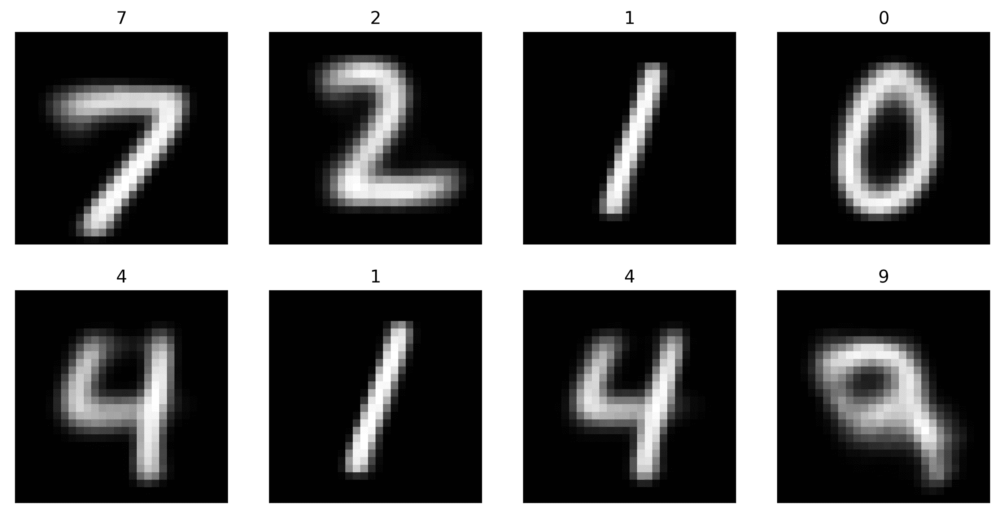

图 8.16–测试集中 MNIST 数字的潜在表示，部分显示在图 8.14 中

The reconstructions shown in the figure show a level of detail that is very good, although it seems blurry around the edges. The general shape of the digits seems to be captured well by the model. The corresponding latent representations of the test set are shown in *Figure 8.16*:

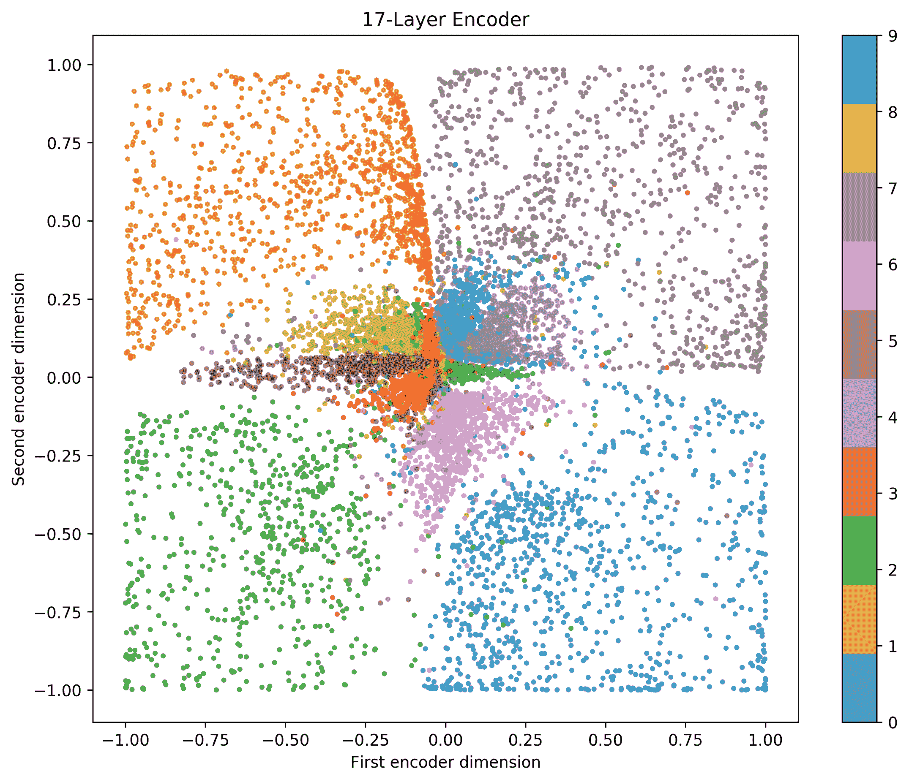

从前面的图中，我们可以看到有定义明确的集群；然而，重要的是要指出，自编码器对标签一无所知，这些聚类仅从数据中学习。这就是自编码器的最大威力。如果将编码器模型拆开并用标签重新训练，该模型可能会表现得更好。然而，现在，我们将把它留在这里，继续讨论第 9 章中的[生成型模型，接下来是*变型自编码器*。](c7b8496e-70e6-47ab-8746-d5893a10493d.xhtml)

摘要

这中间的一章展示了深度自编码器在与正则化策略(如丢弃和批量规范化)结合使用时的强大功能。我们实现了一个超过 30 层的自编码器！那就是*深*！我们看到，在困难的问题中，深度自编码器可以提供高度复杂数据的无偏潜在表示，就像大多数深度信念网络一样。我们研究了辍学如何通过在每个学习步骤中随机忽略(断开)一小部分神经元来降低过度拟合的风险。此外，我们了解到批量标准化可以通过逐渐调整一些神经元的响应来为学习算法提供稳定性，以便激活函数和其他连接的神经元不会在数字上饱和或溢出。

# 此时，您应该对在深度自编码器模型中应用批处理规范化和丢弃策略充满信心。您应该能够创建自己的深度自编码器，并将其应用于不同的任务，这些任务需要丰富的潜在表示以实现数据可视化、数据压缩或降维问题，以及需要低维表示的其他类型的数据嵌入。

[第 9 章](c7b8496e-70e6-47ab-8746-d5893a10493d.xhtml)、*变型自编码器、*将继续使用自编码器，但是从*生成* *建模*的角度。生成模型具有通过采样一个概率密度函数来生成数据的能力，这是非常有趣的。我们将具体讨论在存在噪声数据的情况下，作为深度自编码器的更好替代方案的变分自编码器模型。

At this point, you should feel confident applying batch normalization and dropout strategies in a deep autoencoder model. You should be able to create your own deep autoencoders and apply them to different tasks where a rich latent representation is required for data visualization purposes, data compression or dimensionality reduction problems, and other types of data embeddings where a low-dimensional representation is required.

问题和答案

**本章讨论的哪种正则化策略可以减轻深度模型中的过度拟合？**

# 辍学。

1.  **增加一个批量归一化层是否使得学习算法必须学习更多的参数？**

实际上，没有。对于使用 dropout 的每个层，每个神经元只会学习两个参数: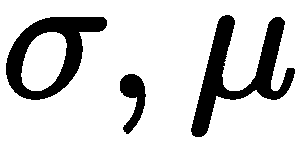。如果你计算一下，新参数的增加是相当小的。

2.  还有哪些深层的信念网络？

例如，受限玻尔兹曼机器是深度信念网络的另一个非常流行的例子。[第 10 章](https://cdp.packtpub.com/deep_learning_for_beginners/wp-admin/post.php?post=33&action=edit)、*受限玻尔兹曼机器*，将更详细地介绍这些。

3.  **为什么深度自编码器在 MNIST 上比在 CIFAR-10 上表现得更好？**

事实上，我们没有客观的方法来说深度自编码器在这些数据集上更好。我们偏向于从聚类和数据标签的角度来考虑这个问题。我们对图 8.12 和图 8.16 中的潜在表示的偏见使得我们无法考虑其他可能性。考虑一下 CIFAR-10:如果 autoencoder 正在学习根据纹理表示数据会怎么样？还是调色板？还是几何性质？回答这些问题是理解 autoencoder 内部发生了什么，以及为什么它正在学习以这种方式表示数据，但需要更高级的技能和时间的关键。综上所述，在回答这些问题之前，我们无法确定它是否表现不佳；否则，如果我们戴上我们的阶级、群体和标签的眼镜，那么它可能只是看起来那样。

4.  **How come deep autoencoders perform better on MNIST than on CIFAR-10?**

Actually, we do not have an objective way of saying that deep autoencoders are better on these datasets. We are biased in thinking about it in terms of clustering and data labels. Our bias in thinking about the latent representations in *Figure 8.12* and *Figure 8.16* in terms of labels is precluding us from thinking about other possibilities. Consider the following for CIFAR-10: what if the autoencoder is learning to represent data according to textures? Or color palettes? Or geometric properties? Answering these questions is key to understanding what is going on inside the autoencoder and why it is learning to represent the data in the way it does, but requires more advanced skills and time. In summary, we don't know for sure whether it is underperforming or not until we answer these questions; otherwise, if we put on our lenses of classes, groups, and labels, then it might just seem that way.

参考

Sutskever，I .，& Hinton，G. E. (2008 年)。深而窄的 sigmoid 信念网络是通用的近似器。*神经计算*，20(11)，2629-2636。

# 塞纳特，金斯伯里，b .，&拉马巴德兰，B. (2012 年 3 月)。使用深度信念网络的自编码器瓶颈特征。2012 年 *IEEE 声学、语音和信号处理国际会议(ICASSP)* (第 4153-4156 页)。IEEE。

*   吴，k .，，Magdon-Ismail，M. (2016)。用于可解释特征的逐节点贪婪深度学习。 *arXiv 预印本* arXiv:1602.06183。
*   约夫，s .，&塞格迪，C. (2015 年 6 月)。批量标准化:通过减少内部协变量转移加速深度网络训练。在*机器学习国际会议(ICML)* (第 448-456 页)。
*   Srivastava，h . hint on，g . Krizhevsky，a .，Sutskever，I .，& Salakhutdinov，R. (2014)。辍学:防止神经网络过度拟合的简单方法。*《机器学习研究杂志*，15 卷 1 期，1929-1958 年。
*   j .杜奇、e .哈赞和 y .辛格(2011 年)。在线学习和随机优化的自适应次梯度方法。*机器学习研究杂志*，12 期(7 月)，2121-2159。
*   麦金尼斯，l .，希利，j .，&乌玛普，J. M. (2018)。降维的一致流形逼近和投影。arXiv 预印本 arXiv:1802.03426。
*   (2011 年 6 月)。学习用于情感分析的词向量。在*计算语言学协会第 49 届年会会议录* : *人类语言技术*-第 1 卷(第 142-150 页)。计算语言学协会。
*   Hochreiter，S. (1998 年)。循环神经网络学习中的消失梯度问题及解决方案。《国际不确定性杂志》，*模糊性和基于知识的系统*，6(02)，107-116。
*   t . van Laarhoven(2017 年)。L2 正规化与批次和重量正规化。arXiv 预印本 arXiv:1706.05350。
*   Hochreiter, S. (1998). The vanishing gradient problem during learning recurrent neural nets and problem solutions. International Journal of Uncertainty, *Fuzziness and Knowledge-Based Systems*, 6(02), 107-116.
*   Van Laarhoven, T. (2017). L2 regularization versus batch and weight normalization. *arXiv preprint* arXiv:1706.05350.