自编码器在寻找丰富的潜在空间方面非常强大。他们几乎是不可思议的，对吗？如果我们告诉你**变型自编码器** ( **VAEs** )更令人印象深刻呢？嗯，他们是。他们继承了传统自编码器的所有优点，并增加了从参数分布中生成数据的能力。

在这一章中，我们将介绍无监督深度学习领域中生成模型背后的哲学以及它们在新数据产生中的重要性。我们将提出 VAE 作为深度自编码器的更好的替代方案。在这一章的结尾，你将会知道 vae 来自哪里和他们的目的是什么。你将能够看到深层和浅层 VAE 模型之间的差异，你将能够欣赏 VAEs 的生成属性。

本章组织如下:

*   引入深度生成模型
*   审视 VAE 模式
*   比较 MNIST 上的深和浅阀门
*   对生成模型伦理意蕴的思考

# 引入深度生成模型

深度学习对一般的机器学习社区有非常有趣的贡献，特别是在深度判别和生成模型方面。我们熟悉什么是辨别模型——例如，**多层感知器** ( **MLP** )就是其中之一。在判别模型中，我们的任务是在给定输入数据 ** 的情况下，猜测、预测或逼近期望的目标 [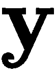] 。在统计理论术语中，我们正在对条件概率密度函数进行建模，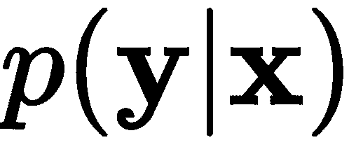。另一方面，通过生成模型，这是大多数人的意思:

*基于输入或刺激能够生成遵循特定分布的数据的模型。*

在深度学习中，我们可以建立一个神经网络，可以很好地模拟这个生成过程。在统计术语中，神经模型近似于条件概率密度函数。虽然今天有几种生成模型，但在本书中，我们将特别讨论三种。

首先，我们将讨论 VAEs，这将在下一节中讨论。第二，[第十章](6ec46669-c8d3-4003-ba28-47114f1515df.xhtml)，*受限玻尔兹曼机*，将介绍一种图解方法及其性质(Salakhutdinov，r .等人(2007))。最后一种方法将在[第 14 章](7b09fe4b-078e-4c57-8a81-dc0863eba43d.xhtml)、*生成敌对网络中讨论。*这些网络正在改变我们对模型稳健性和数据生成的看法(Goodfellow，I .， *et al.* (2014))。

# 审视 VAE 模式

VAE 是一种特殊类型的自编码器(Kingma，D. P .，& Welling，M. (2013))。它从贝叶斯方法中学习数据集的特定统计属性。先把 [] 定义为一个随机潜变量的先验概率密度函数， [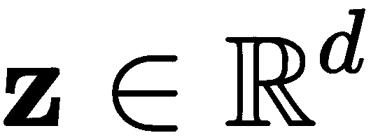] 。那么，我们可以描述一个条件概率密度函数， [] ，可以解释为一个可以产生数据的模型——比如说， [] 。因此，我们可以根据条件分布和先验分布来近似后验概率密度函数，如下所示:

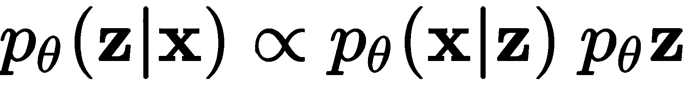

事实证明，精确的后验概率是难以处理的，但这个问题可以通过做一些假设和使用一个有趣的想法来计算梯度，从而得到近似的解决。首先，可以假设先验遵循各向同性高斯分布。我们还可以假设条件分布可以使用神经网络来参数化和建模；也就是给定一个潜在向量，我们用一个神经网络*生成* 。在这种情况下，网络的权重被表示为 [] ，并且该网络将等同于*解码器*网络。如果输出可能是二进制(或布尔)值，则参数分布的选择可以是高斯分布，其中可以采用各种各样的值，或者是伯努利分布。接下来，我们必须再次回到另一个神经网络来近似后验，使用 [] 与单独的参数， [] 。这个网络可以解释为以为输入并产生潜变量的*编码器*网络。

在这种假设下，我们可以定义一个损失函数如下:

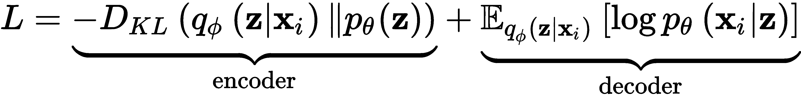

完整的推导可参见 Kingma，D. P .，& Welling，M. (2013)。然而，简而言之，我们可以说，在第一项中，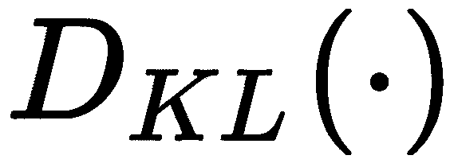是 kull back-lei bler 散度函数，旨在衡量先验的分布如何不同， [] ，相对于后验的分布， [] 。这发生在*编码器*中，我们希望确保的先验和后验是紧密匹配的。第二项与解码器网络相关，其目的是基于条件分布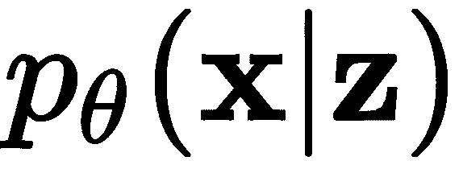的负对数似然性，相对于后验概率的期望，最小化重建损失。

让 VAE 通过梯度下降学习的最后一个技巧是使用一个叫做**重新参数化** *的想法。*这个技巧是必要的，因为不可能对一个样本进行编码，以近似具有 0 均值和一些方差的各向同性高斯，并从该分布中抽取一个样本，在那里暂停，然后继续解码并计算梯度，然后返回并进行更新。重新参数化技巧只是一种从 [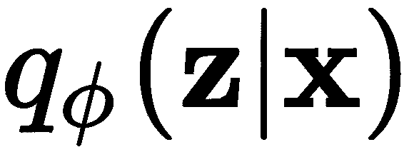] 生成样本的方法，同时，它允许梯度计算。如果我们说 [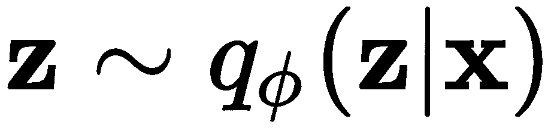] ，我们可以用一个辅助变量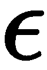来表示随机变量，用边际概率密度函数 [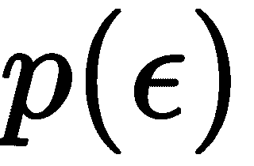] ，这样，[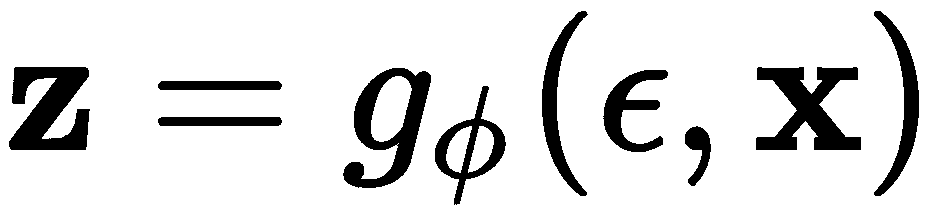][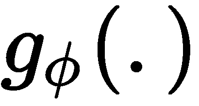]就是一个由 [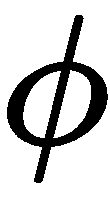] 参数化的函数，返回一个向量。这允许对参数 [] (发生器或解码器)进行梯度计算，并使用任何可用的梯度下降方法对 [] 和 [] 进行更新。

[] 等式中的*波浪号*(~)可以解释为*遵循*的分布。这样，方程可以读作遵循后验分布， [] 。

*图 9.1* 描绘了 VAE 架构，明确显示了*瓶颈*中涉及的部分，以及如何解释网络的各个部分:


图 9.1-VAE 建筑

上图显示，在理想的 VAE 中，分布的参数被精确和完美地学习，以实现精确的重建。然而，这只是一个例子，在实践中，完美的重建可能很难实现。

**Bottlenecks** are the latent representations or parameters that are found in neural networks that go from layers with large numbers of neural units to layers with a decreasing number of neural units. These bottlenecks are known to produce interesting feature spaces (Zhang, Y., *et al.* (2014)).

现在，让我们准备一点一点地制作我们的第一个 VAE。我们将从描述我们将使用的数据集开始。

## 重新审视心脏病数据集

在第 3 章、*准备数据*中，我们详细描述了一个名为**克利夫兰心脏病**数据集的属性。在*图 9.2* 中描述了该数据集中两列的屏幕截图。在这里，我们将重新访问这个数据集，目的是将数据的原始 13 维减少到只有 2 维。不仅如此，我们还将尝试从生成器(即解码器)生成新数据:


图 9.2–两列克利夫兰心脏病数据集样本

通过查看[第 3 章](8300fba9-620e-4bc3-8d81-3b02c5043a0d.xhtml)、*准备数据*中的*图 3.8* 和 *3.9* ，我们可以很容易地证明我们执行降维的尝试是正确的，并注意到数据可能被处理，以便查看神经网络是否可以使与无疾病心脏相关的数据与其他数据分开聚类。类似地，假设数据集本身只包含 303 个样本，我们可以证明新数据的生成是合理的。

要下载数据，我们只需运行以下代码:

```
#download data
!wget https://archive.ics.uci.edu/ml/machine-learning-databases/heart-disease/processed.cleveland.data
```

然后，为了将数据加载到数据框中并分离训练数据和目标，我们可以执行以下代码:

```
import pandas as pd
df = pd.read_csv('processed.cleveland.data', header=None)
# this next line deals with possible numeric errors
df = df.apply(pd.to_numeric, errors='coerce').dropna()
X = df[[0, 1, 2, 3, 4, 5, 6, 7, 8, 9, 10, 11, 12]].values
y = df[13].values
```

我们需要做的下一件事是编码重新参数化技巧，这样我们就可以在训练过程中采样随机噪声。

## 重新参数化技巧和采样

记住，重新参数化技巧旨在从 [] 而不是 [] 采样。还有，回忆一下 [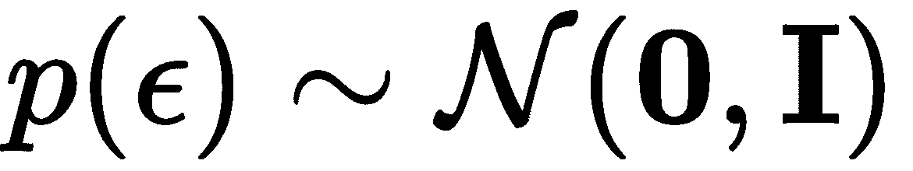] 的分布。这将允许我们让学习算法学习 [] 的参数——即[]——我们简单地从 [] 中产生一个样本。

为了实现这一点，我们可以生成以下方法:

```
from tensorflow.keras import backend as K

def sampling(z_params):
  z_mean, z_log_var = z_params
  batch = K.shape(z_mean)[0]
  dims = K.int_shape(z_mean)[1]
  epsilon = K.random_normal(shape=(batch, dims))
  return z_mean + K.exp(0.5 * z_log_var) * epsilon
```

`sampling()`方法接收的均值和对数方差(待学习)，并返回从该参数化分布中采样的向量；只是来自具有 0 均值和单位方差的高斯(`random_normal`)分布的随机噪声。为了使该方法与小批量训练完全兼容，根据小批量的大小生成样本。

## 学习编码器中的后验参数

后验分布 [] 本身是难以处理的，但是由于我们使用了重新参数化的技巧，我们实际上可以基于执行采样。我们现在将制作一个简单的编码器来学习这些参数。

为了数值稳定性，我们需要缩放输入，使其具有 0 均值和单位方差。为此，我们可以调用在[第 3 章](8300fba9-620e-4bc3-8d81-3b02c5043a0d.xhtml)、*准备数据*中学到的方法:

```
from sklearn.preprocessing import StandardScaler
scaler = StandardScaler()
scaler.fit(X)
x_train = scaler.transform(X)
original_dim = x_train.shape[1]
```

`x_train`矩阵包含缩放的训练数据。以下变量也将有助于设计 VAE 的编码器:

```
input_shape = (original_dim, )
intermediate_dim = 13 
batch_size = 18 # comes from ceil(sqrt(x_train.shape[0]))
latent_dim = 2 # useful for visualization
epochs = 500
```

这些变量很简单，除了批量是以样本数量的平方根来表示的。这是一个经验值，被认为是一个好的开始，但在较大的数据集上，它不能保证是最好的。

接下来，我们可以构建编码器部分，如下所示:

```
from tensorflow.keras.layers import Lambda, Input, Dense, Dropout, BatchNormalization
from tensorflow.keras.models import Model

inputs = Input(shape=input_shape)
bn = BatchNormalization()(inputs)
dp = Dropout(0.2)(bn)
x = Dense(intermediate_dim, activation='sigmoid')(dp)
x = Dropout(0.2)(x)
z_mean = Dense(latent_dim)(x)
z_log_var = Dense(latent_dim)(x)
z_params = [z_mean, z_log_var]
z = Lambda(sampling, output_shape=(latent_dim,))(z_params)
encoder = Model(inputs, [z_mean, z_log_var, z])
```

编码器的这种方法利用了`Lambda`类，它是`tensorflow.keras.layers`集合的一部分。这允许我们使用之前定义的`sampling()`方法(或者任何任意的表达式)作为层对象。*图 9.3* 展示了完整 VAE 的架构，包括前面代码块中描述的编码器层:

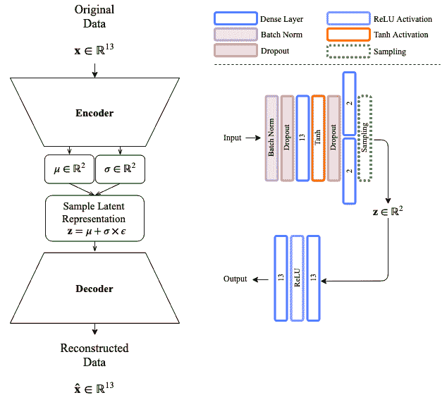

图 9.3–克里夫兰心脏病数据集的 VAE 架构

编码器使用批量标准化，接着是输入层的**丢失**，接着是具有 **Tanh 激活**和**丢失**的密集层。从**下降**开始，两个密集层负责模拟潜在变量分布的参数，并从这个参数化的分布中抽取样本。接下来讨论解码器网络。

## 解码器建模

相对于你已经知道的自编码器，VAE 的解码器部分是非常标准的。解码器采用 VAE 中由参数分布产生的潜在变量，然后它应该精确地重构输入。解码器可以指定如下:

```
latent_inputs = Input(shape=(latent_dim,))
x = Dense(intermediate_dim, activation='relu')(latent_inputs)
r_outputs = Dense(original_dim)(x)    # reconstruction outputs
decoder = Model(latent_inputs, r_outputs)
```

在前面的代码中，我们简单地连接了两个密集层——第一个包含一个 ReLU 激活，而第二个包含线性激活，以便映射回输入空间。最后，我们可以根据编码器和解码器中定义的输入和输出来定义完整的 VAE:

```
outputs = decoder(encoder(inputs)[2])   # it is index 2 since we want z
vae = Model(inputs, outputs)
```

VAE 模型如本文所述完成，如图 9.3 中的*所示。导致该模型训练的下一步包括损失函数的定义，这将在下面讨论。*

## 最小化损失

我们之前解释过，损失函数需要根据编码器和解码器；这是我们讨论过的等式:


如果我们想对这种损失进行编码，我们需要用更实际的东西来编码。应用之前对该问题所做的所有假设，包括重新参数化技巧，允许我们用更简单的术语重写损失的近似值，如下所示:

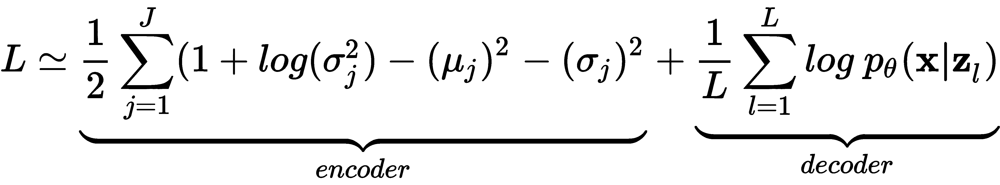

这是针对的所有样本，其中 [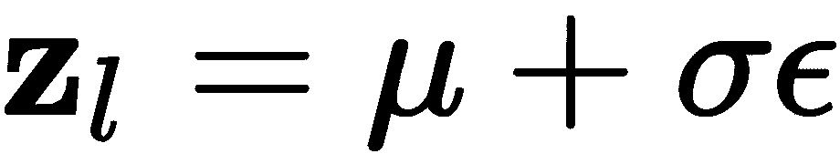] 和 [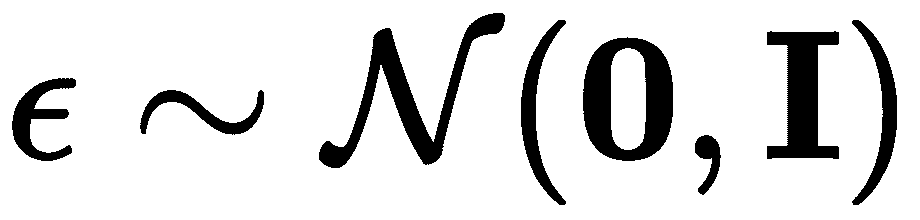] 。此外，解码器损失部分可以使用任何您喜欢的重建损失来近似计算，例如，**均方误差** ( **MSE** )损失或二进制交叉熵损失。已经证明，最小化这些损失中的任何一个也将最小化后验损失。

我们可以用 MSE 来定义重建损失，如下所示:

```
from tensorflow.keras.losses import mse
r_loss = mse(inputs, outputs)
```

或者，我们可以用二进制交叉熵损失这样做，像这样:

```
from tensorflow.keras.losses import binary_crossentropy
r_loss = binary_crossentropy(inputs, outputs)
```

我们可以做的另一件事是可选的，就是监控重建损失与 KL 发散损失(与编码器相关的术语)相比有多重要。一个典型的做法是使重建损失乘以潜在维度或输入维度。这实际上使损失增加了一倍。如果我们采取后者，我们可以惩罚重建损失，如下所示:

```
r_loss = original_dim * r_loss
```

编码器项的 KL-散度损失现在可以用均值和方差来表示，如下所示:

```
kl_loss = 1 + z_log_var - K.square(z_mean) - K.exp(z_log_var)
kl_loss = 0.5 * K.sum(kl_loss, axis=-1)
```

因此，我们可以简单地将总损失添加到模型中，结果如下:

```
vae_loss = K.mean(r_loss + kl_loss)
vae.add_loss(vae_loss)
```

有了这些，我们就可以继续编译模型并训练它了，如下所述。

## 训练 VAE

最后一步是编制 VAE 模型，这将把所有的碎片放在一起。在编译过程中，我们将选择一个优化器(梯度下降法)。在这种情况下，我们会选择*亚当*(金马，D. P .，*等人* (2014)。

有趣的事实:VAE 的创造者是不久后创造亚当的同一个人。他的名字是 Diederik P. Kingma，目前是谷歌大脑的研究科学家。

为了编译模型并选择优化器，我们执行以下操作:

```
vae.compile(optimizer='adam')
```

最后，我们使用 500 个时期的训练数据进行训练，使用 18 的批量大小，如下所示:

```
hist = vae.fit(x_train, epochs=epochs,
               batch_size=batch_size,
               validation_data=(x_train, None))
```

请注意，我们使用训练集作为验证集。在大多数情况下，不建议这样做，但在这里，这样做是可行的，因为选择相同的小批量进行训练和验证的机会非常低。此外，这样做通常会被认为是欺骗；然而，重建中使用的潜在表示并不直接来自输入；相反，它来自类似于输入数据的分布。为了证明训练和验证集产生不同的结果，我们绘制了跨时期的训练进度，如图*图 9.4* 所示:


图 9.4-跨时代的 VAE 培训绩效

上图不仅表明模型收敛很快，还表明模型不会过度拟合输入数据。通常，这是一个很好的属性。

*图 9.4* 可以用以下代码生成:

```
import matplotlib.pyplot as plt

fig = plt.figure(figsize=(10,6))
plt.plot(hist.history['loss'], color='#785ef0')
plt.plot(hist.history['val_loss'], '--', color='#dc267f')
plt.title('Model reconstruction loss')
plt.ylabel('MSE Loss')
plt.xlabel('Epoch')
plt.legend(['Training Set', 'Validation Set'], loc='upper right')
plt.show()
```

但是，请注意，由于 VAE 的无监督性质，结果可能会有所不同。

接下来，如果我们看一看通过使用在训练期间学习的参数从随机分布中采样而产生的潜在表示，我们可以看到数据看起来像什么。*图 9.5* 描绘了获得的潜在表示:

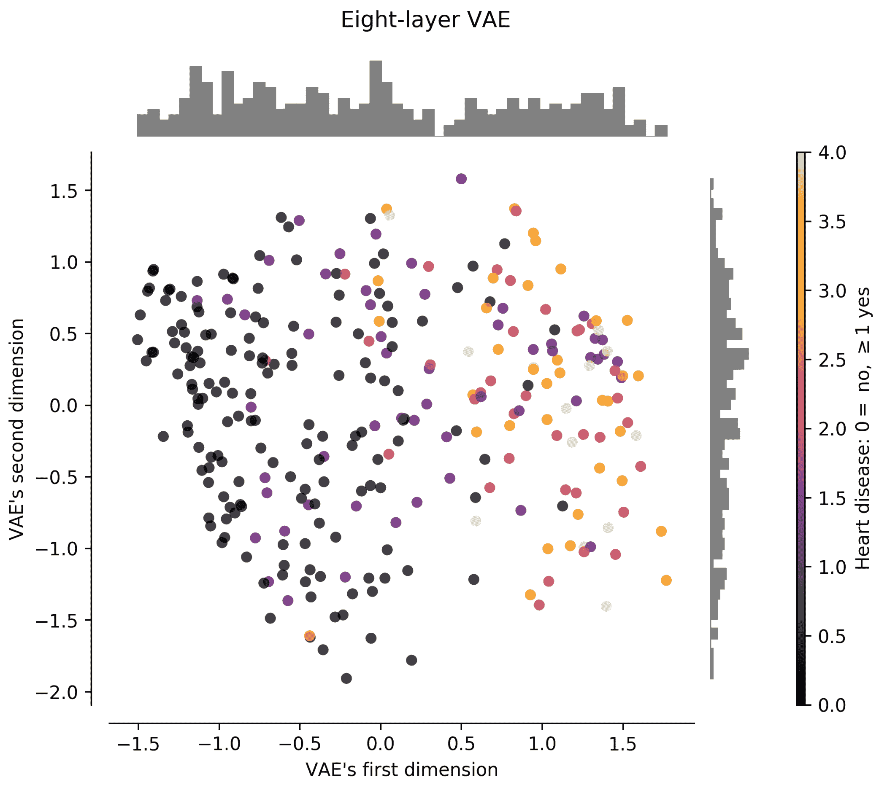

图 9.5-VAE 的二维潜在代表性样本

该图清楚地表明，对应于没有心脏病迹象的数据聚集在左象限，而对应于心脏病的样本聚集在潜在空间的右象限。图顶部显示的直方图表明存在两个定义明确的聚类。这太棒了！此外，请记住，VAE 对标签一无所知:这一点我们怎么强调都不为过！将此处的*图 9.5* 与[第三章](8300fba9-620e-4bc3-8d81-3b02c5043a0d.xhtml)、*准备数据*中的*图 3.9* 进行对比，你会发现 VAE 的性能优于 KPCA。此外，将该图与第 3 章、*准备数据、*中的*图 3.8* 进行比较，注意 VAE 的性能与**线性判别分析** ( **LDA** )相当(如果不是更好的话)，后者使用标签信息来产生低维表示。换句话说，LDA 有一点欺骗。

VAE 最有趣的特性之一是我们可以生成数据；让我们来看看这是如何做到的。

## 从 VAE 生成数据

由于 VAE 学习潜在空间上的参数分布的参数，其被采样以重建输入数据，我们可以使用这些参数来绘制更多的样本并重建它们。我们的想法是为我们想到的任何目的生成数据。

让我们从编码原始数据集开始，看看重建与原始数据集有多接近。然后，生成数据应该很简单。为了将输入数据编码到潜在空间中并对其进行解码，我们执行以下操作:

```
encdd = encoder.predict(x_train)
x_hat = decoder.predict(encdd[0])
```

回想一下`x_train`是，`x_hat`是重建，。注意，我们使用`encdd[0]`作为解码器的输入。其原因是编码器产生三个向量的列表，`[z_mean, z_log_var, z]`。因此，在列表中使用 0 元素是指对应于样本的分布的平均值。事实上，`encdd[0][10]`将产生一个二维向量，该向量对应于能够产生数据集中第 10 个^(样本(即`x_train[10]`)的分布的平均参数。仔细想想，均值可能是我们能找到的最佳潜在表示，因为它最有可能在解码器中重建输入。)

考虑到这一点，我们可以通过运行以下命令来看看重建效果如何:

```
import numpy as np
print(np.around(scaler.inverse_transform(x_train[0]), decimals=1))
print(np.around(scaler.inverse_transform(x_hat[0]), decimals=1))
```

这将产生以下输出:

```
[ 63.0  1.0  1.0  145.0  233.0  1.0  2.0  150.0  0.0  2.3  3.0  0.0  6.0 ]
[ 61.2  0.5  3.1  144.1  265.1  0.5  1.4  146.3  0.2  1.4  1.8  1.2  4.8 ]
```

如果输出显示难以阅读的科学符号，尝试暂时禁用它，如下所示:
`import numpy as np`
`np.set_printoptions(suppress=True)`
`print(np.around(scaler.inverse_transform(x_train[0]), decimals=1))`
`print(np.around(scaler.inverse_transform(x_hat[0]), decimals=1))`
`np.set_printoptions(suppress=False)`

在本例中，我们关注训练集中的第一个数据点，即顶行中的`x_train[0]`；它的重建在最下面一行。仔细研究发现，两者之间存在差异；然而，就 MSE 而言，这些差异可能相对较小。

这里要指出的另一个重要方面是，数据需要缩放回其原始输入空间，因为它在用于训练模型之前已被缩放。幸运的是，`StandardScaler()`类有一个`inverse_transform()`方法，可以帮助将任何重构映射回输入空间中每个维度的值的范围。

为了随意生成更多的数据，我们可以定义一个方法来这样做。以下方法在范围`[-2, +2]`内均匀地产生随机噪声，该噪声来自对*图 9.5* 的检查，该图显示潜在空间的范围在该范围内:

```
def generate_samples(N = 10, latent_dim = 2):
  noise = np.random.uniform(-2.0, 2.0, (N,latent_dim))
  gen = decoder.predict(noise)
  return gen
```

该函数需要根据潜在空间中的值的范围进行调整；此外，可以通过查看潜在空间中的数据分布来调整它。比如潜在空间看起来是正态分布，那么可以这样用一个正态分布:`noise = np.random.normal(0.0, 1.0, (N,latent_dim))`，假设均值和单位方差为 0。

我们可以通过执行以下操作调用该函数来生成*假*数据:

```
gen = generate_samples(10, latent_dim)
print(np.around(scaler.inverse_transform(gen), decimals=1))
```

这将产生以下输出:

回想一下，这些数据是由随机噪声产生的。你可以看到这是深度学习社区的一个重大突破。您可以使用这些数据来扩充数据集，并根据需要生成任意多的样本。我们可以查看生成的样本的质量，并自己决定质量是否足以满足我们的目的。

```
[[ 43.0  0.7  2.7  122.2  223.8  0.0  0.4  172.2  0.0  0.3  1.2  0.1  3.6]
 [ 57.4  0.9  3.9  133.1  247.6  0.1  1.2  129.0  0.8  2.1  2.0  1.2  6.4]
 [ 60.8  0.7  3.5  142.5  265.7  0.3  1.4  136.4  0.5  1.9  2.0  1.4  5.6]
 [ 59.3  0.6  3.2  137.2  261.4  0.2  1.2  146.2  0.3  1.2  1.7  0.9  4.7]
 [ 51.5  0.9  3.2  125.1  229.9  0.1  0.7  149.5  0.4  0.9  1.6  0.4  5.1]
 [ 60.5  0.5  3.2  139.9  268.4  0.3  1.3  146.1  0.3  1.2  1.7  1.0  4.7]
 [ 48.6  0.5  2.6  126.8  243.6  0.1  0.7  167.3  0.0  0.2  1.1  0.1  3.0]
 [ 43.7  0.8  2.9  121.2  219.7  0.0  0.5  163.8  0.1  0.5  1.4  0.1  4.4]
 [ 54.0  0.3  2.5  135.1  264.2  0.2  1.0  163.4  0.0  0.3  1.1  0.3  2.7]
 [ 52.5  1.0  3.6  123.3  227.8  0.0  0.8  137.7  0.7  1.6  1.8  0.6  6.2]]
```

现在，假设你和我可能不是心脏病方面的医生，我们可能没有资格确定产生的数据是有意义的；但是如果我们这样做是正确的，它通常是有意义的。为了说明这一点，下一节使用 MNIST 图像来证明生成的样本是好的，因为我们都可以对数字图像进行视觉评估。

Now, granted that since you and I may not be medical doctors specializing in heart disease, we might not be qualified to determine with certainty that the data generated makes sense; but if we did this correctly, it generally does make sense. To make this clear, the next section uses MNIST images to prove that the generated samples are good since we can all make a visual assessment of numeral images.

比较 MNIST 的深浅 VAE

# 比较浅层和深层模型是找到最佳模型的实验过程的一部分。在对 MNIST 图像的比较中，我们将实现图 9.6 中的*所示的架构作为浅层模型，而深度模型架构如图 9.7* 中的*所示:*

图 9.6-MNIST 上空的 VAE 浅层建筑

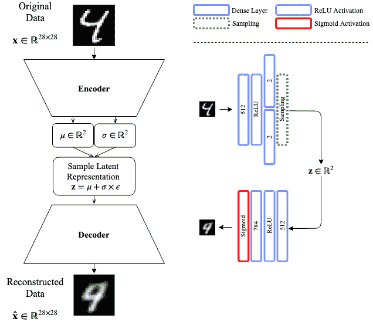

Figure 9.6 – VAE shallow architecture over MNIST

如您所知，两个模型在涉及到的层数上有很大的不同。结果，重建的质量将会不同:

图 9.7-MNIST 上空的 VAE 深层建筑

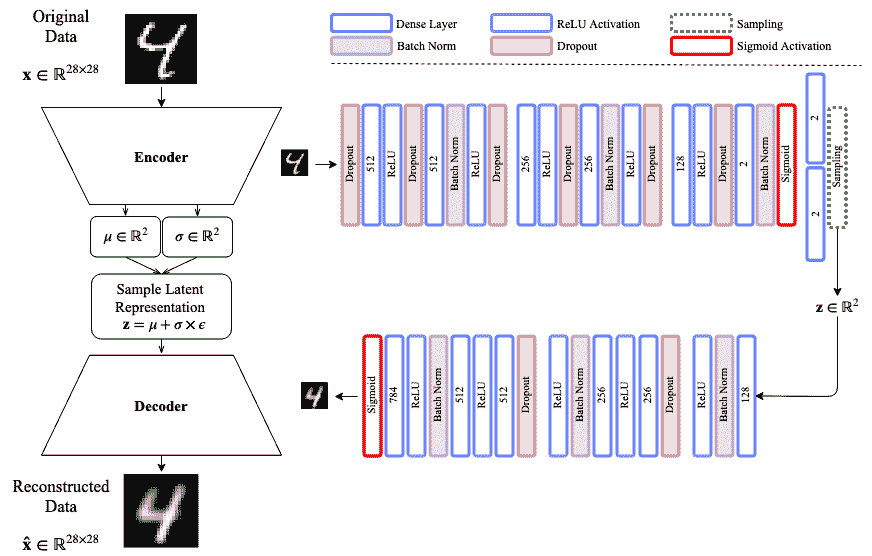

这些模型将使用浅层 VAE 的少量历元和深层模型的大量历元进行训练。

从克利夫兰心脏病数据集中使用的例子可以容易地推断出再现浅层编码器的代码；然而，深层 VAE 的代码将在接下来的章节中讨论。

浅薄的 VAE

## 我们可以用来比较 VAE 的第一件事是它的学术表现。*图 9.8* 描绘了训练集的潜在空间投影:

图 9.8–训练数据集的浅层 VAE 潜在空间投影

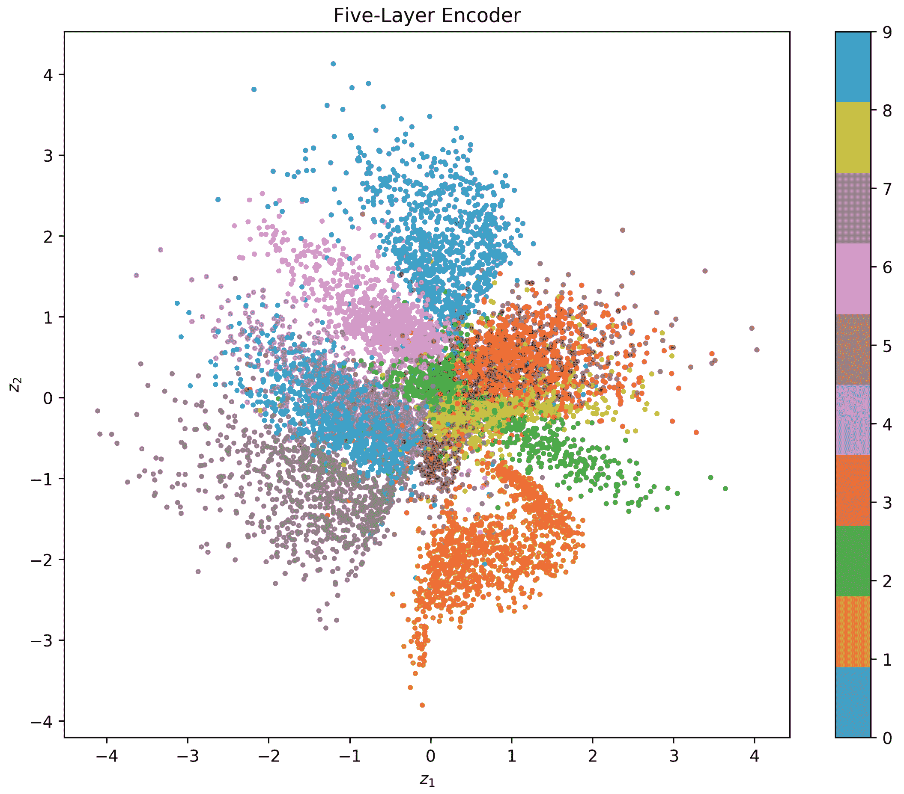

从上图中，我们可以观察到从中心坐标向外扩散的数据点集群。例如，我们希望看到的是定义明确的集群，它们被理想地分开，以便于分类。在这种情况下，我们看到某些组之间有一点重叠，特别是第 4 和第 9 组，这很有意义。

接下来要考察的是模型的重构能力。*图 9.9* 显示了输入的样本，而*图 9.10* 显示了模型训练后的相应重构:

图 9.9-VAE 的样本输入


对浅层模型的期望是以与模型大小直接相关的方式执行:

图 9.10-相对于图 9.9 中输入的浅层 VAE 重建


显然，数字 2 和数字 8 的重建似乎存在一些问题，这可以通过观察*图 9.8* 中这两个数字之间显示的大量重叠得到证实。

Clearly, there seem to be some issues with the reconstruction of the number 2 and number 8, which is confirmed by observing the great deal of overlap shown between these two numerals in *Figure 9.8*.

我们可以做的另一件事是，如果我们从潜在空间的范围中提取数字，就可以将 VAE 产生的数据可视化。*图 9.11* 显示了潜在空间在两个维度上的变化:

图 9.11–二维范围[-4，4]内的浅层 VAE 潜在空间勘探


在图 9.11 中，我们发现真正有趣的是，我们可以看到当潜在空间被遍历时，数字是如何逐渐转化为其他数字的。如果我们从上到下取中心线，我们可以看到如何从数字 0 到数字 6，然后到数字 2，然后到数字 8，再到数字 1。我们可以通过追踪对角线路径或其他方向来做同样的事情。进行这种类型的可视化还允许我们看到一些在训练数据集中没有看到的工件，如果我们不小心生成数据，这些工件可能会导致潜在的问题。

What we find really interesting in *Figure 9.11* is that we can see how numerals are transformed into others progressively as the latent space is traversed. If we take the center line going from top to bottom, we can see how we can go from the number 0 to the number 6, then to the number 2, then to the number 8, down to the number 1\. We could do the same by tracing a diagonal path, or other directions. Making this type of visualization also allows us to see some artifacts that were not seen in the training dataset that could cause potential problems if we generate data without care.

为了看看更深层次的模型是否比这更好，我们将在下一节中实现它。

深 VAE

## *图 9.7* 描绘了一种可以分部分实现的深度 VAE 架构——首先是编码器，然后是解码器。

编码器

### 编码器可以使用函数范例来实现，如下所示:

这里，`inpt_dim`对应于 28×28 的 MNIST 图像的 784 个尺寸。继续其余部分，我们有以下内容:

```
from tensorflow.keras.layers import Lambda, Input, Dense, Dropout
from tensorflow.keras.layers import Activation, BatchNormalization
from tensorflow.keras.models import Model

inpt_dim = 28*28
ltnt_dim = 2

inpt_vec = Input(shape=(inpt_dim,))
```

请注意，编码器模型使用 10%丢失率的丢失层。剩下的图层都是我们之前见过的东西，包括批量归一化。这里唯一的新东西是`Lambda`函数，它和本章前面定义的完全一样。

```
el1 = Dropout(0.1)(inpt_vec)
el2 = Dense(512)(el1)
el3 = Activation('relu')(el2)
el4 = Dropout(0.1)(el3)
el5 = Dense(512)(el4)
el6 = BatchNormalization()(el5)
el7 = Activation('relu')(el6)
el8 = Dropout(0.1)(el7)

el9 = Dense(256)(el8)
el10 = Activation('relu')(el9)
el11 = Dropout(0.1)(el10)
el12 = Dense(256)(el11)
el13 = BatchNormalization()(el12)
el14 = Activation('relu')(el13)
el15 = Dropout(0.1)(el14)

el16 = Dense(128)(el15)
el17 = Activation('relu')(el16)
el18 = Dropout(0.1)(el17)
el19 = Dense(ltnt_dim)(el18)
el20 = BatchNormalization()(el19)
el21 = Activation('sigmoid')(el20)

z_mean = Dense(ltnt_dim)(el21)
z_log_var = Dense(ltnt_dim)(el21)
z = Lambda(sampling)([z_mean, z_log_var])
encoder = Model(inpt_vec, [z_mean, z_log_var, z])
```

接下来，我们将定义解码器。

解码器

### 解码器比编码器短几层。这种层的选择只是为了表明，只要编码器和解码器中密集层的数量几乎相等，在寻找性能提升的实验中，可以省略一些其他层。

这是解码器的设计:

This is the design of the decoder:

```
ltnt_vec = Input(shape=(ltnt_dim,))
dl1 = Dense(128)(ltnt_vec)
dl2 = BatchNormalization()(dl1)
dl3 = Activation('relu')(dl2)

dl4 = Dropout(0.1)(dl3)
dl5 = Dense(256)(dl4)
dl6 = Activation('relu')(dl5)
dl7 = Dense(256)(dl6)
dl8 = BatchNormalization()(dl7)
dl9 = Activation('relu')(dl8)

dl10 = Dropout(0.1)(dl9)
dl11 = Dense(512)(dl10)
dl12 = Activation('relu')(dl11)
dl13 = Dense(512)(dl12)
dl14 = BatchNormalization()(dl13)
dl15 = Activation('relu')(dl14)
dl16 = Dense(inpt_dim, activation='sigmoid') (dl15)

decoder = Model(ltnt_vec, dl16)
```

同样，这里没有我们以前没有见过的新东西。一层又一层。然后，我们可以将所有这些放在模型中，如下所示:

就是这样！在这之后，我们可以编译模型，选择我们的优化器，并以与我们在前面章节中所做的完全相同的方式训练模型。

```
outputs = decoder(encoder(inpt_vec)[2])
vae = Model(inpt_vec, outputs)
```

如果我们想形象化深层 VAE 的潜在空间，以便与*图 9.8* 进行比较，我们可以查看*图 9.12* 中所示的空间:

图 9.12–训练数据集的深层 VAE 潜在空间投影


如你所见，潜在空间的几何形状看起来不同。这很可能是激活函数对特定流形的潜在空间范围的限制作用。观察到的最有趣的事情之一是样本组的分离，即使仍然存在一些重叠——例如，数字 9 和 4。然而，与*图 9.8* 相比，这种情况下的重叠不太严重。

*图 9.13* 显示了与*图 9.9* 中显示的相同输入的重建，但是现在使用了更深的 VAE:

图 9.13-相对于图 9.9 中输入的深层 VAE 重建。与图 9.10 相比

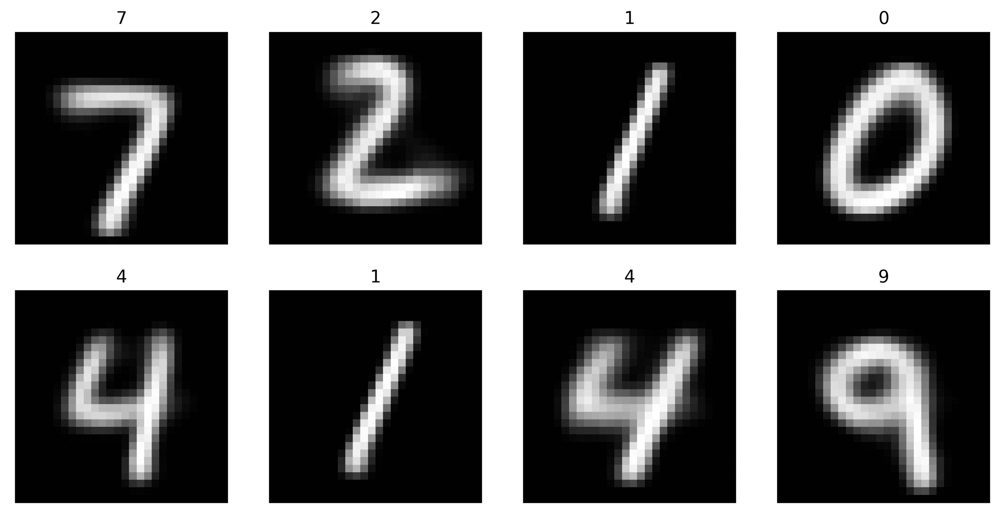

显然，与浅 VAE 相比，重建要好得多，也更健壮。为了使事情更清楚，我们还可以通过产生与潜在空间相同范围的随机噪声来遍历潜在空间，从而探索生成器。如图 9.14 中的*所示:*

图 9.14–二维范围[-4，4]内的深层 VAE 潜在空间探索。与图 9.11 相比

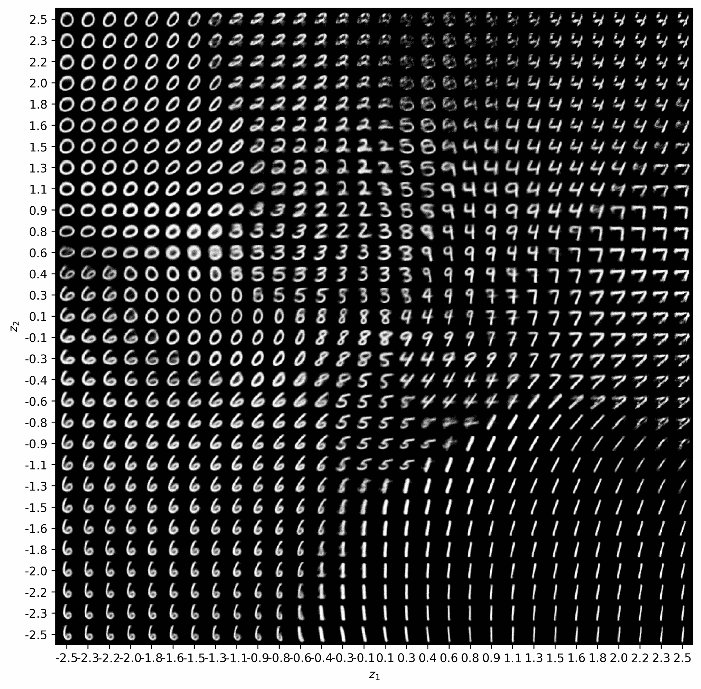

Figure 9.14 – Deep VAE latent space exploration in the range [-4,4] in both dimensions. Compare to Figure 9.11

从视觉角度来看，VAE 深处的潜在空间似乎更丰富多样，也更有趣。如果我们选择最右边的线，从下到上遍历空间，我们可以看到数字 1 如何变成 7，然后变成 4，变化越来越小。

去噪阀

## VAEs 在图像去噪应用中也很好(Im，D. I. J .，*等人* (2017))。这种特性是通过在学习过程中注入噪声来实现的。要了解更多这方面的信息，你可以在网上搜索去噪阀，你会找到关于这个特定主题的资源。我们只是想让你意识到它们，知道它们的存在，如果你需要它们的话。

对生成模型伦理意蕴的思考

# 生成模型是当今深度学习中最令人兴奋的话题之一。但是权力越大，责任越大。我们可以将生成模型的力量用于许多有益的事情，例如:

扩充您的数据集，使其更加完整

*   用看不见的数据训练模型，使其更加稳定
*   寻找对立的例子来重新训练你的模型，使它更健壮
*   创造看起来像其他事物的事物的新图像，例如艺术或车辆的图像
*   创造听起来像其他声音的新的声音序列，例如人说话或鸟唱歌
*   为数据加密生成新的安全代码
*   只要我们的想象力允许，我们就可以继续下去。我们必须始终记住的是，这些生成模型，如果建模不当，会导致许多问题，如偏见，导致模型的可信度问题。使用这些模型可以很容易地生成一个人说一些他们没有真正说过的话的假音频序列，或者生成一个人做一些他们没有真正做过的事情的面部图像，或者生成一个不属于面部的身体的图像。

一些最显著的错误包括 deepfakes。不值得我们花时间去研究实现这样一个东西的方法，但是可以说，我们的生成模型不应该被用于恶意的目的。很快就会建立国际法来惩罚那些通过恶意生成建模来犯罪的人。

但是，在制定国际法律和各国采取新政策之前，您在开发模型时必须遵循最佳实践:

测试你的模型中最常见的偏见类型:历史的，社会的，算法的，等等(Mehrabi，n .， *et al.* (2019))。

使用合理的训练集和测试集来训练您的模型。

注意数据预处理技术；详见[第 3 章](8300fba9-620e-4bc3-8d81-3b02c5043a0d.xhtml)、*准备数据*。

确保你的模型产生的输出总是尊重所有人的尊严和价值。

让您的模型体系结构得到同行的验证。

记住这一点，继续努力，用你现在拥有的这个新工具:VAEs，尽可能地负责任和有创造性。

摘要

这一高级章节向您展示了一个最有趣、最简单的模型，它能够使用自编码器的配置并通过应用导致 VAE 的变分贝叶斯原理，从学习到的分布中生成数据。我们查看了模型本身的各个部分，并根据克利夫兰数据集的输入数据对它们进行了解释。然后，我们从学习到的参数分布中生成数据，表明 VAEs 可以很容易地用于此目的。为了证明 VAEs 在浅层和深层配置上的鲁棒性，我们在 MNIST 数据集上实现了一个模型。实验证明，与浅体系结构中的模糊组相反，较深的体系结构产生明确定义的数据分布区域；然而，浅层和深层模型都特别适合学习表示的任务。

至此，您应该有信心识别 VAE 的各个部分，并能够从动机、架构和功能方面区分传统自编码器和 VAE。您应该欣赏 vae 的生成能力，并准备好实现它们。阅读完本章后，你应该能够编写基本和深度 VAE 模型的代码，并能够使用它们进行降维和数据可视化，以及在注意潜在风险的同时生成数据。最后，您现在应该熟悉了 TensorFlow 和 Keras 中一般用途的`Lambda`函数的用法。

如果到目前为止你喜欢学习无监督模型，请和我在一起，继续学习第 10 章、*、*受限玻尔兹曼机器，这将呈现一个植根于所谓图形模型的独特模型。图形模型使用混合了学习理论的图论来执行机器学习。受限玻尔兹曼机器的一个有趣方面是，算法可以在学习过程中前进和后退，以满足连接约束。敬请期待！

问题和答案

**随机噪声如何产生数据？**

由于 VAE 学习参数随机分布的参数，我们可以简单地使用这些参数从这样的分布中进行采样。由于随机噪声通常遵循具有特定参数的正态分布，我们可以说我们正在对随机噪声进行采样。好消息是解码器知道如何处理遵循特定分布的噪声。

拥有更深的 VAE 有什么好处？

在没有数据或不了解应用程序的情况下，很难说有什么优势(如果有的话)。例如，对于克里夫兰心脏病数据集，更深的 VAE 可能是不必要的；而对于 MNIST 或国际林业研究中心来说，一个适度大的模型可能是有益的。看情况。

**有办法对损失函数进行修改吗？**

当然，你可以改变损失函数，但是要注意保持它的构建原则。假设一年后，我们找到了一种更简单的方法来最小化负对数似然函数，那么我们可以(也应该)回来编辑损失以采用新的想法。

*   Test your models for the most common types of bias: historical, societal, algorithmic, and so on (Mehrabi, N., *et al.* (2019)).
*   Train your models using reasonable training and test sets.
*   参考
*   金马博士和韦林博士(2013 年)。自编码变分贝叶斯。 *arXiv 预印本* arXiv:1312.6114。
*   (2007 年 6 月)。用于协同过滤的受限玻尔兹曼机器。在*第 24 届机器学习国际会议论文集*(第 791-798 页)。

Goodfellow，I .、Pouget-Abadie，j .、Mirza，m .、Xu，b .、Warde-Farley，d .、Ozair，s .、a .和 Bengio，Y. (2014 年)。生成对抗网络。在*神经信息处理系统的进展*(第 2672-2680 页)。

# 张，杨，张，张和格拉斯(2014 年 5 月)。利用低秩矩阵分解提取深度神经网络瓶颈特征。在 *2014 IEEE 国际声学、语音和信号处理会议(ICASSP)* (第 185-189 页)。IEEE。

金马博士和巴律师(2014 年)。亚当:一种随机优化方法。arXiv 预印本 arXiv:1412.6980。

Mehrabi，f . mor statter，n . sa xena，Lerman，k .，& Galstyan，A. (2019 年)。机器学习中的偏见和公平问题综述。arXiv 预印本 arXiv:1908.09635

Im，D. I. J .，Ahn，s .，Memisevic，r .，& Bengio，Y. (2017 年 2 月)。变分自编码框架的去噪准则。在第三十一届 AAAI 人工智能会议上。

By this point, you should feel confident in identifying the pieces of a VAE and being able to tell the main differences between a traditional autoencoder and a VAE in terms of its motivation, architecture, and capabilities. You should appreciate the generative power of VAEs and feel ready to implement them. After reading this chapter, you should be able to code both basic and deep VAE models and be able to use them for dimensionality reduction and data visualization, as well as to generate data while being mindful of the potential risks. Finally, you should now be familiarized with the usage of the `Lambda` functions for general-purpose use in TensorFlow and Keras.

If you have liked learning about unsupervised models so far, stay with me and continue to [Chapter 10](6ec46669-c8d3-4003-ba28-47114f1515df.xhtml), *Restricted Boltzmann Machines,* which will present a unique model that is rooted in what is known as graphical models. Graphical models use graph theory mixed with learning theory to perform machine learning. An interesting aspect of restricted Boltzmann machines is that the algorithm can go forward and backward during learning to satisfy connection constraints. Stay tuned!

# Questions and answers

1.  **How is data generation possible from random noise?**

Since the VAE learns the parameters of a parametric random distribution, we can simply use those parameters to sample from such a distribution. Since random noise usually follows a normal distribution with certain parameters, we can say that we are sampling random noise. The nice thing is that the decoder knows what to do with the noise that follows a particular distribution.

2.  **What is the advantage of having a deeper VAE?**

It is hard to say what the advantage is (if there is any) without having the data or knowing the application. For the Cleveland Heart Disease dataset, for example, a deeper VAE might not be necessary; while for MNIST or CIFAR, a moderately large model might be beneficial. It depends.

3.  **Is there a way to make changes to the loss function?**

Of course, you can change the loss function, but be careful to preserve the principles on which it is constructed. Let's say that a year from now we found a simpler way of minimizing the negative log likelihood function, then we could (and should) come back and edit the loss to adopt the new ideas.

# References

*   Kingma, D. P., & Welling, M. (2013). Auto-encoding variational Bayes. *arXiv preprint* arXiv:1312.6114.
*   Salakhutdinov, R., Mnih, A., & Hinton, G. (2007, June). Restricted Boltzmann machines for collaborative filtering. In *Proceedings of the 24th International Conference on Machine Learning* (pp. 791-798).
*   Goodfellow, I., Pouget-Abadie, J., Mirza, M., Xu, B., Warde-Farley, D., Ozair, S., Courville, A. and Bengio, Y. (2014). Generative adversarial nets. In *Advances in Neural Information Processing Systems* (pp. 2672-2680).
*   Zhang, Y., Chuangsuwanich, E., & Glass, J. (2014, May). Extracting deep neural network bottleneck features using low-rank matrix factorization. In *2014 IEEE International Conference on Acoustics, Speech and Signal Processing (ICASSP)* (pp. 185-189). IEEE.
*   Kingma, D. P., & Ba, J. (2014). Adam: A method for stochastic optimization. *arXiv preprint* arXiv:1412.6980.
*   Mehrabi, N., Morstatter, F., Saxena, N., Lerman, K., & Galstyan, A. (2019). A survey on bias and fairness in machine learning. *arXiv preprint* arXiv:1908.09635.
*   Im, D. I. J., Ahn, S., Memisevic, R., & Bengio, Y. (2017, February). Denoising criterion for variational auto-encoding framework. In *Thirty-First AAAI Conference on Artificial Intelligence*.