<title>Restricted Boltzmann Machines</title>  Restricted Boltzmann Machines

我们一起看到了无监督学习的力量，并希望说服自己，它可以应用于不同的问题。我们将用一种令人兴奋的方法来结束无监督学习的话题，这种方法被称为**受限玻尔兹曼机器** ( **RBMs** )。当我们不在乎拥有大量的层时，我们可以使用 RBM 从数据中学习，并找到满足能量函数的方法，该能量函数将产生在表示输入数据方面稳健的模型。

本章补充了[第 8 章](6677b8b1-806c-4c39-8c1e-371e83501acf.xhtml)、*深度自动编码器*，介绍了 RBM 的后向-前向性质，同时将其与**自动编码器** ( **AEs** )的仅前向性质进行了对比。本章以 MNIST 为例，比较了 RBMs 和 AEs 在降维问题上的异同。学完本章后，您应该能够使用 scikit 来使用 RBM——学习并实现一个使用伯努利 RBM 的解决方案。你将能够对 RBM 和 AE 的潜在空间进行视觉比较，也能直观地了解 RBM 和 AE 内部工作原理的重量。

本章组织如下:

*   成果管理制简介
*   用 RBMs 学习数据表示
*   比较 RBM 和 AEs

# 成果管理制简介

RBM 是无监督模型，可用于需要丰富潜在表示的不同应用中。它们通常用于具有分类模型的管道中，目的是从数据中提取特征。它们是基于**玻尔兹曼机器** ( **BMs** )，我们接下来会讨论(Hinton，G. E .和 Sejnowski，T. J. (1983))。

## 电池管理系统

BM 可以被认为是一个无向稠密图，如图*图 10.1* 所示:

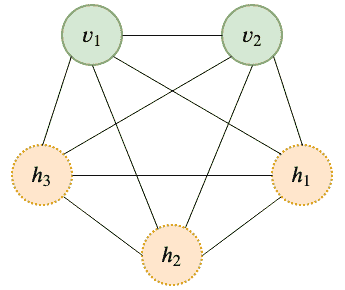

图 10.1–一个 BM 模型

这个无向图有一些被建模为**可见**、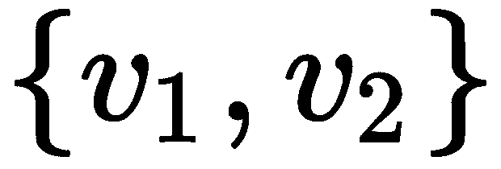的神经单元，以及一组被**隐藏**、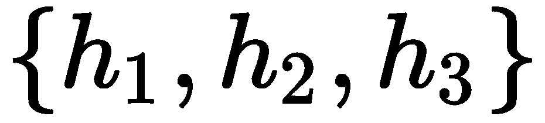的神经单元。当然，可能不止这些。但是这个模型的要点是所有的神经元都是互相连接的:它们都互相交流。这里不讨论该模型的训练，但本质上它是一个迭代过程，其中输入呈现在可见层中，每个神经元(一次一个)调整其与其他神经元的连接，以满足损失函数(通常基于能量函数)，并且该过程重复，直到学习过程被认为是令人满意的。

虽然 RB 模型非常有趣和强大，但它花了很长时间来训练！考虑到这是在 20 世纪 80 年代早期，在比这更大的图形上和使用更大的数据集执行计算可能会对训练时间产生重大影响。然而，在 1983 年，G. E. Hinton 和他的合作者通过限制神经元之间的通讯提出了一个简化的 BM 模型，我们将在下面讨论。

## RBMs

传统 BMs 的*限制*在于神经元之间的通信；即可见神经元只能与隐藏神经元对话，隐藏神经元只能与可见神经元对话，如图*图 10.2* 所示:

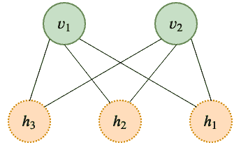

图 10.2-RBM 模型。与图 10.1 中的 BM 模型相比

*图 10.2* 所示的图称为**稠密二部图**。也许你在想，它看起来很像我们迄今为止一直使用的典型的密集神经网络；但是，又不太一样。主要区别在于，我们使用的所有神经网络都只能从输入层(可见层)到隐藏层传递信息，而 RBM 可以双向传递信息！其余的元素都很熟悉:我们有需要学习的权重和偏差。

如果我们坚持图 10.2 所示的简单模型，我们可以用更简单的术语解释 RBM 背后的学习理论。

让我们将每一个神经单元解释为一个随机变量，其当前状态取决于其他神经单元的状态。

这种解释允许我们使用与**马尔可夫链蒙特卡罗** ( **MCMC** ) (Brooks，s .，et al. (2011))相关的采样技术；然而，我们不会在本书中深入讨论这些细节。

使用这种解释，我们可以如下定义模型的能量函数:

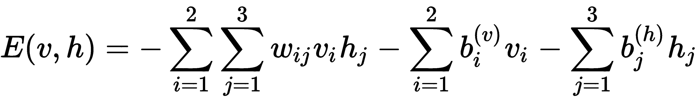

其中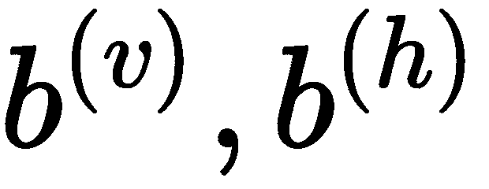分别表示可见神经单元和隐藏神经单元上的偏差。结果，我们也可以将神经和隐藏单元的联合概率密度函数表示如下:

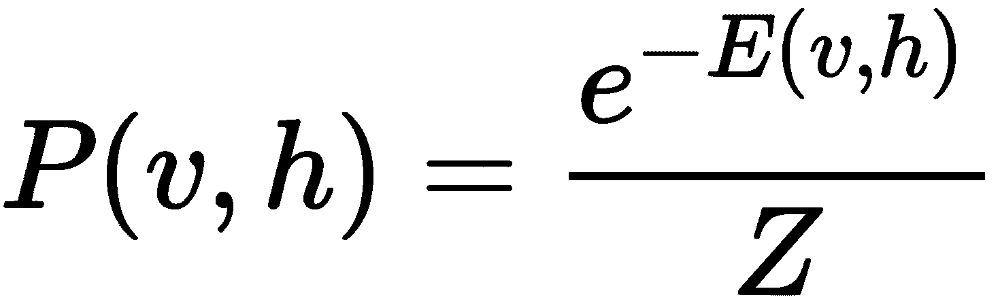

有一个简单的边际分布:

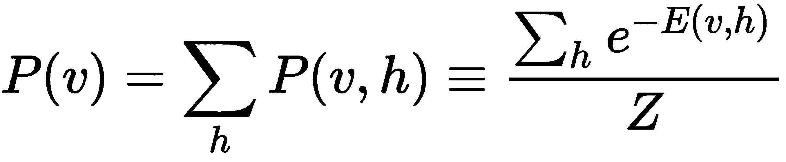

条件和边际中的分母称为归一化因子，它的作用只是确保概率值加起来等于 1，可以定义如下:

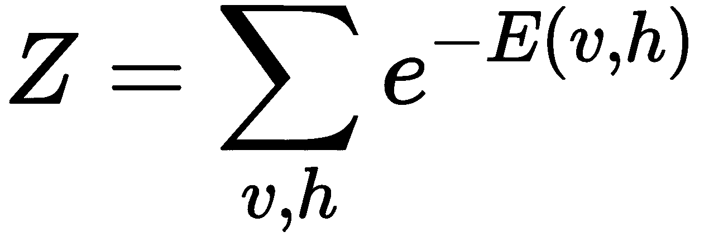

这些公式允许我们快速找到用于训练的 MCMC 技术；最值得注意的是，你会在文献中发现涉及吉布斯抽样的对比发散是最常见的方法(Tieleman，T. (2008))。

只有少数已实施的成果管理制可供学习者随时开始使用；其中之一是在 scikit-learn 中提供的伯努利 RBM，我们接下来将讨论它。

## 伯努利 RBMs

虽然广义 RBM 模型不会对其使用的数据做出任何假设，但伯努利 RBM 模型会假设输入数据表示可解释为概率值的范围[0，1]内的值。在理想情况下，值在集合{0，1}中，这与伯努利试验密切相关。如果您感兴趣，还有其他方法假设输入遵循高斯分布。你可以通过阅读 Yamashita，t .等人(2014)的文章了解更多。

只有少数数据集可用于这种类型的 RBM；MNIST 就是一个例子，它可以被解释为二进制输入，当没有数字轨迹时，数据为 0，而当有数字信息时，数据为 1。在 scikit-learn 中，`BernoulliRBM`模型可以在神经网络集合中找到:`sklearn.neural_network`。

在类似伯努利的输入分布的假设下，这个 RBM 模型*使用一种叫做**持续对比散度** ( **PCD** ) (Tieleman，t .和 Hinton，G. (2009))的方法近似地*优化对数似然。事实证明，PCD 比当时任何其他算法都快得多，并引发了讨论和兴奋，但与密集网络相比，**反向传播**的普及很快掩盖了这种兴奋。

在下一节中，我们将在 MNIST 上实现伯努利 RBM，目的是学习数据集的表示。

# 用 RBMs 学习数据表示

现在你已经知道了 RBMs 背后的基本思想，我们将使用`BernoulliRBM`模型以一种无监督的方式学习数据表示。和以前一样，我们将使用 MNIST 数据集来进行比较。

对于一些人来说，**学习表示法**的任务可以被认为是**特征工程**。后者对这个术语有一个可解释的成分，而前者并不一定要求我们给习得的表征规定意义。

在 scikit-learn 中，我们可以通过调用以下指令来创建 RBM 的实例:

```
from sklearn.neural_network import BernoulliRBM
rbm = BernoulliRBM()
```

RBM 的构造函数中的默认参数如下:

*   `n_components=256`，是隐藏单元的数量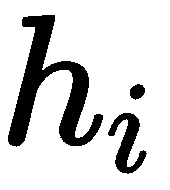，而可见单元的数量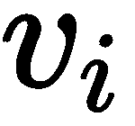，是从输入的维度中推断出来的。
*   `learning_rate=0.1`控制学习算法相对于更新的强度，建议使用集合{ *1，0.1，0.01，0.001* }中的值进行探索。
*   `batch_size=10`控制在批量学习算法中使用多少样本。
*   `n_iter=10`控制在我们停止学习算法之前运行的迭代次数。算法的本质允许它按照我们想要的那样继续下去；然而，该算法通常在几次迭代中找到好的解决方案。

我们将只更改组件的默认数量，使其为 100。由于 MNIST 数据集中的原始维数是 784(因为它由 28 x 28 的图像组成)，因此拥有 100 维似乎不是一个坏主意。

要用加载到`x_train`中的 100 个 MNIST 训练数据来训练 RBM，我们可以做如下操作:

```
from sklearn.neural_network import BernoulliRBM
from tensorflow.keras.datasets import mnist
import numpy as np

(x_train, y_train), (x_test, y_test) = mnist.load_data()

image_size = x_train.shape[1]
original_dim = image_size * image_size
x_train = np.reshape(x_train, [-1, original_dim])
x_test = np.reshape(x_test, [-1, original_dim])
x_train = x_train.astype('float32') / 255
x_test = x_test.astype('float32') / 255

rbm = BernoulliRBM(verbose=True)

rbm.n_components = 100
rbm.fit(x_train)
```

培训期间的输出可能如下所示:

```
[BernoulliRBM] Iteration 1, pseudo-likelihood = -104.67, time = 12.84s
[BernoulliRBM] Iteration 2, pseudo-likelihood = -102.20, time = 13.70s
[BernoulliRBM] Iteration 3, pseudo-likelihood = -97.95, time = 13.99s
[BernoulliRBM] Iteration 4, pseudo-likelihood = -99.79, time = 13.86s
[BernoulliRBM] Iteration 5, pseudo-likelihood = -96.06, time = 14.03s
[BernoulliRBM] Iteration 6, pseudo-likelihood = -97.08, time = 14.06s
[BernoulliRBM] Iteration 7, pseudo-likelihood = -95.78, time = 14.02s
[BernoulliRBM] Iteration 8, pseudo-likelihood = -99.94, time = 13.92s
[BernoulliRBM] Iteration 9, pseudo-likelihood = -93.65, time = 14.10s
[BernoulliRBM] Iteration 10, pseudo-likelihood = -96.97, time = 14.02s
```

我们可以通过调用 MNIST 测试数据`x_test`上的`transform()`方法来研究学习到的表示，如下所示:

```
r = rbm.transform(x_test)
```

在这种情况下，有 784 个输入维度，但是`r`变量将有 100 个维度。为了可视化 RBM 诱发的潜在空间中的测试集，我们可以像之前一样使用 UMAPs，这将产生如图*图 10.3* 所示的二维图:

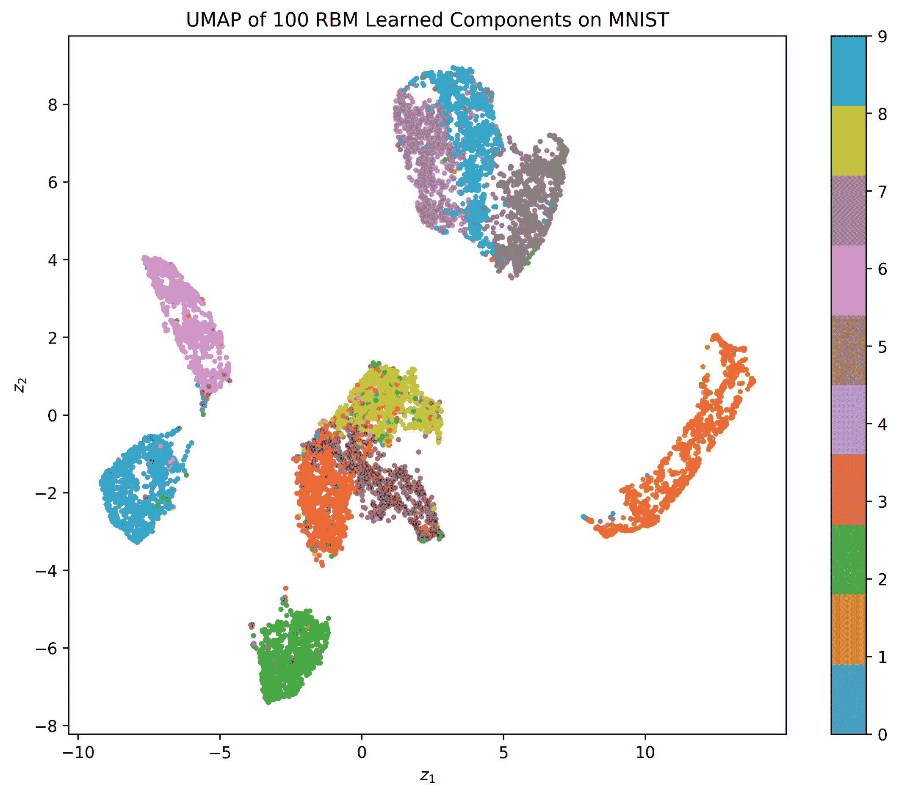

图 10.3-RBM 对 MNIST 试验数据的学习表示的 UMAP 表示

使用 UMAP 从 RBM 特征空间生成该图的完整代码如下:

```
import matplotlib.pyplot as plt
import umap

y_ = list(map(int, y_test))
X_ = rbm.transform(x_test)

X_ = umap.UMAP().fit_transform(X_)

plt.figure(figsize=(10,8))
plt.title('UMAP of 100 RBM Learned Components on MNIST')
plt.scatter(X_[:,0], X_[:,1], s=5.0, c=y_, alpha=0.75, cmap='tab10')
plt.xlabel('$z_1$')
plt.ylabel('$z_2$')
plt.colorbar()
```

将*图 10.3* 与前几章所示的图示进行比较。从图中我们可以看出，存在明显的类分离和聚类，同时类之间存在轻微的重叠。例如，数字 3 和 8 之间有一些重叠，这是可以预料的，因为这些数字看起来很像。该图还显示，由于图 10.3*中的数据来自模型看不到的数据，因此 RBM 概括得非常好。*

我们可以进一步检查 RBM 学习到的重量(或*组件*);也就是说，我们可以检索与可见层相关联的权重，如下所示:

```
v = rbm.components_
```

在这种情况下，`v`变量将是一个 784 x 100 的矩阵，用于描述学习到的权重。我们可以可视化每一个神经元，并重建与这些神经元相关联的权重，这将看起来像*图 10.4* 中的组件:

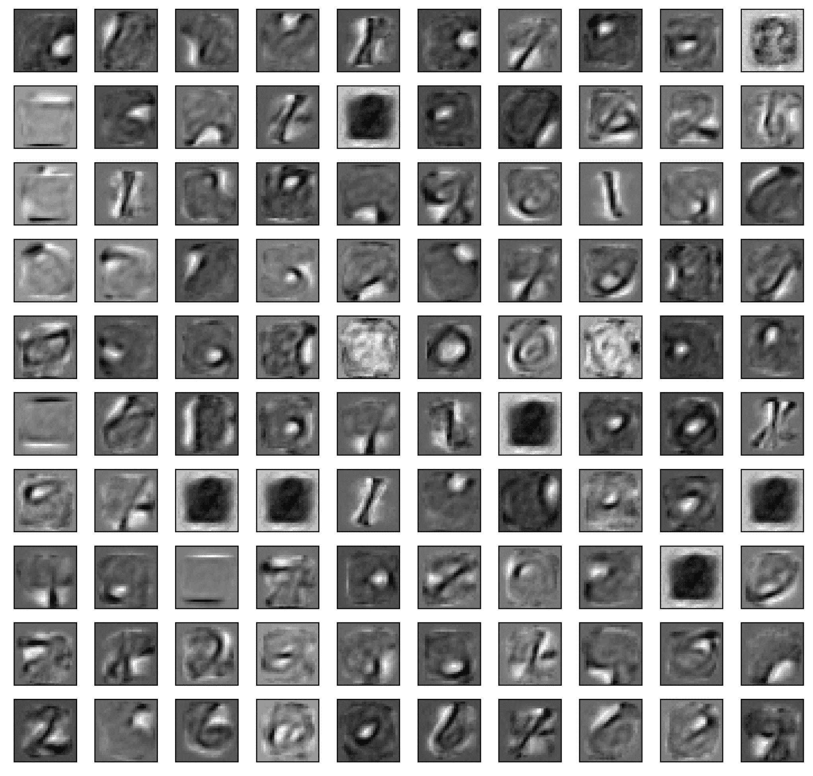

图 10.4-RBM 的已知重量

对*图 10.4* 的仔细研究告诉我们，有一些权重关注对角线特征，或圆形特征，或通常非常具体到特定数字和边缘的特征。例如，底部一行的特征似乎与数字 2 和 6 相关联。

图 10.4 中的*所示的权重可用于将输入空间转换为更丰富的表示形式，这些表示形式稍后可用于支持该任务的管道中的分类。*

为了满足我们学习的好奇心，我们还可以通过使用`gibbs()`方法对网络进行采样来研究 RBM 及其各州。这意味着，我们可以想象当我们向可见层提供输入时会发生什么，然后从隐藏层得到什么样的响应，然后再次使用它作为输入，并重复查看模型的刺激如何变化。例如，运行以下代码:

```
import matplotlib.pyplot as plt
plt.figure()
cnt = 1
for i in range(10):    #we look into the first ten digits of test set
  x = x_test[i]
  for j in range(10):  #we project and reuse as input ten times
    plt.subplot(10, 10, cnt)
    plt.imshow(x.reshape((28, 28)), cmap='gray')
    x = rbm.gibbs(x) #here use current as input and use as input again
    cnt += 1
plt.show()
```

这将有效地产生如图*图 5* 所示的图:

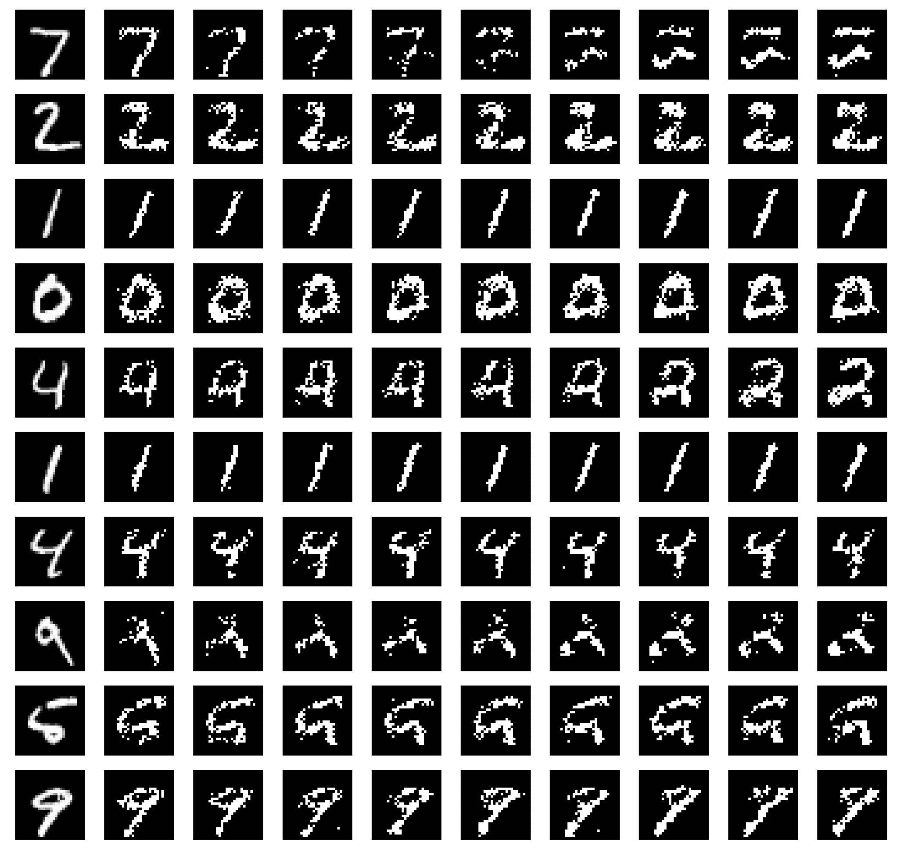

图 10.5-MNIST RBM 的 Gibbs 抽样

*图 10.5* 第一列显示输入，其余 10 列是连续的采样调用。显然，当输入在 RBM 内来回传播时，它会遭受一些轻微的变形。取第五行，对应数字 4；我们可以看到输入是如何变形的，直到它看起来像一个数字 2。除非在第一次采样调用时观察到强烈的变形，否则该信息对学习的特征没有直接影响。

在下一节中，我们将使用 AE 与 RBM 进行比较。

# 比较 RBM 和 AEs

既然我们已经看到了 RBM 的表现，就应该和 AEs 做一个比较。为了使这种比较公平，我们可以提出一个 AE 可以具有的最接近 RBM 的配置；也就是说，我们将拥有相同数量的隐藏单元(编码器层中的神经元)和相同数量的可见层(解码器层)中的神经元，如图*图 10.6* 所示:

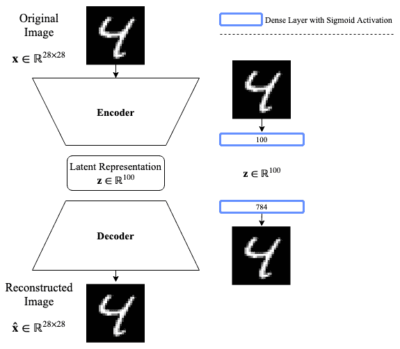

图 10.6–与 RBM 相当的 AE 配置

我们可以使用[第 7 章](480521d9-845c-4c0a-b82b-be5f15da0171.xhtml)、*自动编码器*中介绍的工具对我们的 AE 进行建模和训练，如下所示:

```
from tensorflow.keras.layers import Input, Dense
from tensorflow.keras.models import Model

inpt_dim = 28*28    # 784 dimensions
ltnt_dim = 100      # 100 components

inpt_vec = Input(shape=(inpt_dim,))
encoder = Dense(ltnt_dim, activation='sigmoid') (inpt_vec)
latent_ncdr = Model(inpt_vec, encoder)
decoder = Dense(inpt_dim, activation='sigmoid') (encoder)
autoencoder = Model(inpt_vec, decoder)

autoencoder.compile(loss='binary_crossentropy', optimizer='adam')
autoencoder.fit(x_train, x_train, epochs=200, batch_size=1000)
```

这里没有什么新的东西，除了我们只使用两个足够大的密集层来提供良好的表示。*图 10.7* 描绘了测试集上学习表征的 UMAP 可视化:

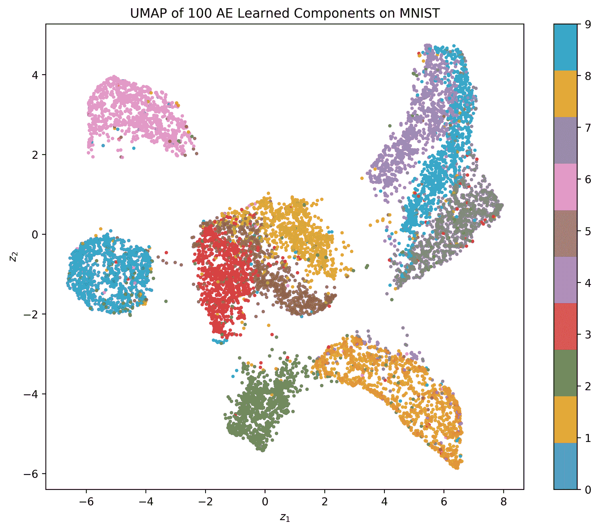

图 10.7–使用 UMAP 显像的 AE 诱发表现

上图是使用以下代码生成的:

```
import matplotlib.pyplot as plt
import umap

y_ = list(map(int, y_test))
X_ = latent_ncdr.predict(x_test)

X_ = umap.UMAP().fit_transform(X_)

plt.figure(figsize=(10,8))
plt.title('UMAP of 100 AE Learned Components on MNIST')
plt.scatter(X_[:,0], X_[:,1], s=5.0, c=y_, alpha=0.75, cmap='tab10')
plt.xlabel('$z_1$')
plt.ylabel('$z_2$')
plt.colorbar()
```

从*图 10.7* 中，您可以看到数据被很好地聚类；虽然聚类比*图 10.3* 中的聚类靠得更近，但聚类内的分离似乎更好。类似于 RBM，我们可以将学习到的权重可视化。

`tensorflow.keras`中的每个`Model`对象都有一个名为`get_weights()`的方法，可以检索每一层的所有权重列表。让我们运行这个:

```
latent_ncdr.get_weights()[0]
```

它使我们能够访问第一层的权重，并允许我们以与 RBM 权重相同的方式可视化它们。*图 10.8* 显示了学习到的权重:

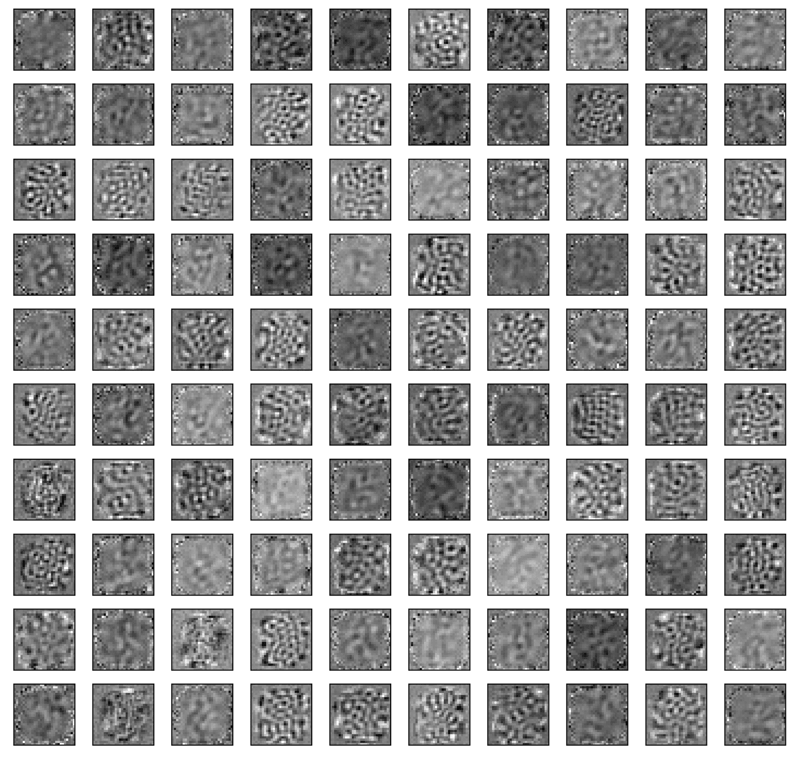

图 10.8–AE 权重

图 10.8 中*所示的重量与图 10.4* 中*RBM 的重量相比，没有明显的数字特征。这些特征似乎面向非常独特的区域中的纹理和边缘。这非常有趣，因为它表明，根本不同的模型将产生根本不同的潜在空间。*

如果 RBM 和 AEs 都产生有趣的潜在空间，想象一下如果我们在深度学习项目中使用它们，我们会取得什么样的成就！试试看！

最后，为了证明 AE 实现了建模的高质量重建，我们可以查看*图 10.9* :

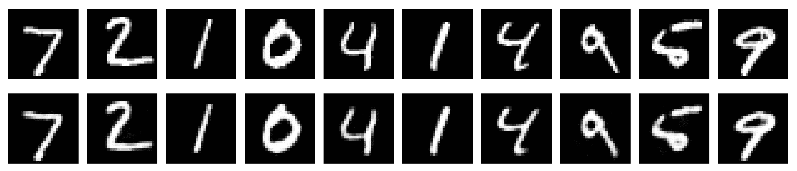

图 10.9–AE 输入(顶行)和重建(底行)

使用 100 个组件的重建看起来质量很高，如图*图 10.9* 所示。然而，这对于 RBM 来说是不可能的，因为正如我们在本章中解释的那样，它们的目的不一定是重构数据。

# 摘要

这一中级章节向您展示了 RBM 工作原理及其应用背后的基本理论。我们特别关注伯努利 RBM，它对可能遵循类似伯努利分布的输入数据进行操作，以实现快速学习和高效计算。我们使用 MNIST 数据集来展示 RBM 的学习表示是多么有趣，我们还可视化了学习的权重。我们通过比较 RBM 和一个非常简单的 AE 得出结论，并表明两者都学习高质量的潜在空间，同时是根本不同的模型。

此时，您应该能够实现自己的 RBM 模型，可视化其学习到的组件，并通过投影(转换)输入数据和查看隐藏层投影来查看学习到的潜在空间。您应该对在大型数据集(如 MNIST)上使用 RBM 充满信心，甚至可以与 AE 进行比较。

下一章是关于监督深度学习的一组新章节的开始。[第 11 章](03e9a734-fb56-485d-ae90-66fb98ecd4d1.xhtml)，*深度和广度神经网络*，将让我们开始一系列围绕监督深度学习的令人兴奋的新主题。本章将解释在监督环境下深度神经网络和广度神经网络的性能差异和复杂性。它将根据神经元之间的连接引入密集网络和稀疏网络的概念。你不能错过它！

# 问题和答案

1.  **为什么我们不能使用 RBM 执行数据重建？**

成果管理制从根本上不同于工程设计。RBM 旨在优化能量函数，而 AE 旨在优化数据重建函数。因此，我们不能用 RBM 进行重建。然而，这种根本的区别允许新的潜在空间是有趣和强大的。

2.  我们能给 RBM 增加更多的层吗？

不，在目前的模型中没有。神经元堆叠层的概念更符合深度 AEs 的概念。

3.  **那么 RBMs 有什么酷的呢？**

它们很简单。他们速度很快。它们提供了丰富的潜在空间。在这一点上他们没有对手。最接近的竞争对手是 AEs。

# 参考

*   辛顿和塞伊诺夫斯基(1983 年 6 月)。最优感知推理。在 *IEEE 计算机视觉和模式识别会议*的会议记录中(第 448 卷)。IEEE 纽约。
*   布鲁克斯，盖尔曼，琼斯和孟。).(2011).*马尔可夫链蒙特卡罗手册*。CRC 出版社。
*   t .蒂勒曼(2008 年 7 月)。使用似然梯度的近似值训练受限玻尔兹曼机。《第 25 届*机器学习国际会议论文集*(第 1064-1071 页)。
*   Yamashita、m . Tanaka、e . Yoshida、y . yama uchi 和 h . Fujiyoshii(2014 年 8 月)。对于受限玻尔兹曼机是伯努利还是高斯。2014 年第 22 届*国际模式识别会议*(第 1520-1525 页)。IEEE。
*   t .蒂勒曼和 g .辛顿(2009 年 6 月)。使用快速权重改善持续的对比差异。《第 26 届年度*机器学习国际会议论文集*(第 1033-1040 页)。