本章介绍了卷积神经网络，从卷积运算开始，向前移动到卷积运算的集合层，目的是学习对数据集进行操作的过滤器。然后引入池化策略来展示这种变化如何能够改进模型的训练和性能。本章最后展示了如何可视化学习到的过滤器。

到本章结束时，你将熟悉卷积神经网络背后的动机，并将知道卷积运算在一维和二维中是如何工作的。当你读完这一章，你将知道如何在层中实现卷积，以便通过梯度下降学习过滤器。最后，您将有机会使用您之前学习的许多工具，包括 dropout 和 batch normalization，但是现在您将知道如何使用 pooling 作为一种替代方法来减少问题的维度并创建信息抽象级别。

本章组织如下:

*   卷积神经网络简介
*   *n* 中的卷积-尺寸
*   卷积层
*   集中策略
*   过滤器的可视化

# 卷积神经网络简介

之前，在《T2》第 11 章、*深度和广度神经网络*中，我们使用了一个对通用网络来说非常具有挑战性的数据集。然而，**卷积神经网络**(**CNN**)将被证明是更有效的，正如你将看到的。CNN 从 80 年代后期就已经存在了(LeCun，y .等人(1989))。他们改变了计算机视觉和音频处理的世界(李，Y. D .等人(2016))。如果你的智能手机有某种基于人工智能的目标识别功能，它很可能使用某种 CNN 架构；例如:

*   图像中目标的识别
*   数字指纹的识别
*   语音命令的识别

CNN 很有趣，因为它们解决了计算机视觉中一些最具挑战性的问题，包括在一个名为 ImageNet 的图像识别问题上击败人类(Krizhevsky，a .，et al. (2012) *)* 。如果你能想到最复杂的目标识别任务，CNN 应该是你实验的首选:它们永远不会让人失望！

CNN 成功的关键在于它们独特的编码空间关系的能力。如果我们对比两个不同的数据集，一个关于学生学校记录，包括当前和过去的成绩、出勤、在线活动等，另一个关于猫和狗的图像，如果我们的目标是对学生或猫和狗进行分类，数据是不同的。其中一个是没有空间关系的学生特征。

举个例子，如果等级是第一特征，考勤不一定要挨着，所以两者的位置可以互换，分类表现应该不受影响吧？然而，对于猫和狗的图像，眼睛的特征(像素)必须靠近鼻子或耳朵；当您更改空间特征并观察两只眼睛中间的一只耳朵(奇怪)时，分类器的性能应该会受到影响，因为通常没有猫或狗的耳朵在两只眼睛之间。这是 CNN 擅长编码的空间关系类型。你也可以想到音频或语音处理。你知道，在某些单词中，有些音必须跟在其他音之后。如果数据集允许空间关系，CNN 有潜力表现良好。

# n 维卷积

CNN 的名字来源于它们的招牌运算:**卷积**。该运算是信号处理领域中非常常见的数学运算。让我们继续讨论卷积运算。

## 一维

让我们从一维的离散时间卷积函数开始。假设我们有输入数据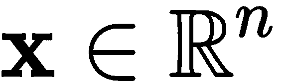和一些权重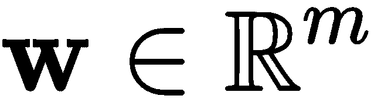，我们可以定义两者之间的离散时间卷积运算如下:

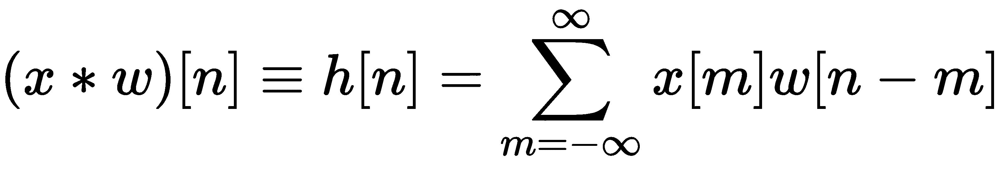。

在该等式中，卷积运算由符号 ***** 表示。不用把事情弄得太复杂，我们可以说反过来，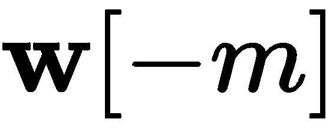，再移位，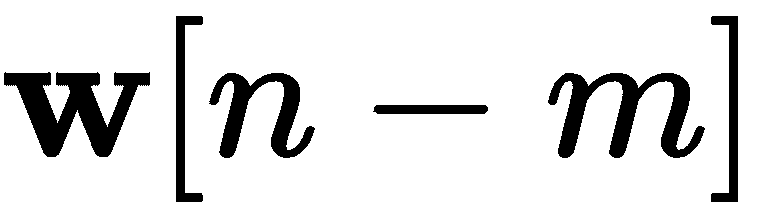。产生的向量是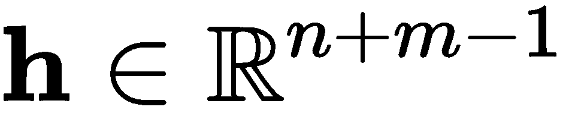，当应用过滤器时，它可以被解释为输入的*过滤的*版本。

如果我们如下定义两个向量，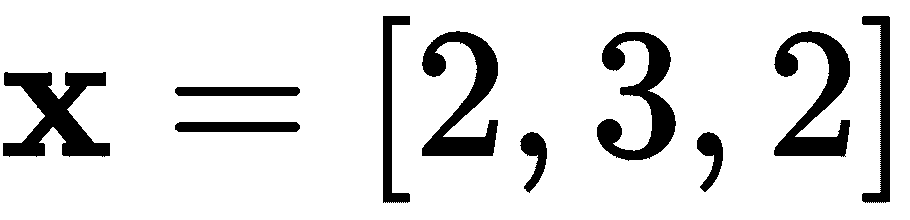和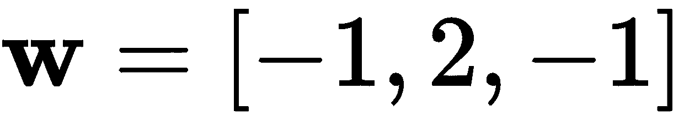，那么卷积运算产生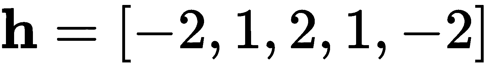。

*图 12.1* 显示了通过反转和移位滤波器并乘以输入数据来获得该结果的每个步骤:

图 12.1 -涉及两个向量的卷积运算示例

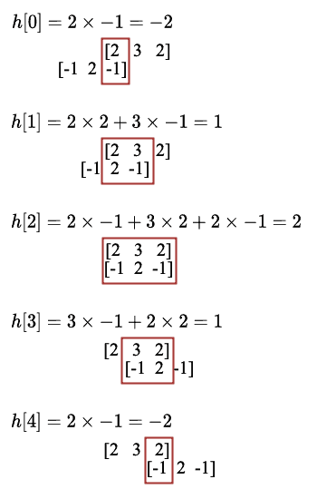

在 NumPy 中，我们可以通过使用如下的`convolve()`方法来实现这一点:

这将输出以下内容:

```
import numpy as np
h = np.convolve([2, 3, 2], [-1, 2, -1])
print(h)
```

现在，如果你想一想，最“完整”的信息是当过滤器与输入数据完全重叠时，那是为了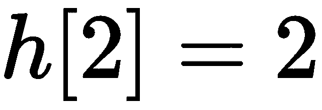。在 Python 中，您可以通过使用如下的`'valid'`参数来获得:

```
[-2, 1, 2, 1, -2]
```

这简单地给出了以下内容:

```
import numpy as np
h = np.convolve([2, 3, 2], [-1, 2, -1], 'valid')
print(h)
```

同样，这只是为了最大化与*相关的*信息，因为卷积运算在矢量的边缘周围*更不确定*，也就是说，在矢量不完全重叠的开始和结束处。此外，为了方便起见，我们可以通过使用`'same'`参数获得一个与输入大小相同的输出向量，如下所示:

```
2
```

这会打印以下内容:

```
import numpy as np
h = np.convolve([2, 3, 2], [-1, 2, -1], 'same')
print(h)
```

以下是使用卷积的三种方式的一些实际原因:

```
[1 2 1]
```

当您需要所有的*良好的*信息，而没有任何由滤波器部分重叠引起的噪声时，请使用`'valid'`。

*   当你想让计算变得更容易时，使用`'same'`。这将使它变得容易，因为你将在输入和输出中有相同的维度。
*   否则，不要使用任何东西来获得卷积运算的完整解析解。
*   随着专门从事快速乘法和加法运算的微处理器的激增，以及快速傅立叶变换算法的发展，卷积变得非常流行。FFT 利用了离散时域中的卷积等价于傅立叶域中的乘法的数学特性，反之亦然。

现在，让我们进入下一个维度。

二维

## 二维卷积与一维卷积非常相似。然而，我们将有一个矩阵，而不是一个向量，这就是为什么图像在这里是直接适用的。

A two-dimensional convolution is very similar to the one-dimensional convolution. However, rather than having a vector, we will have a matrix, and that's why images are directly applicable here.

假设我们有两个矩阵:一个表示一些输入数据，另一个是过滤器，如下所示:

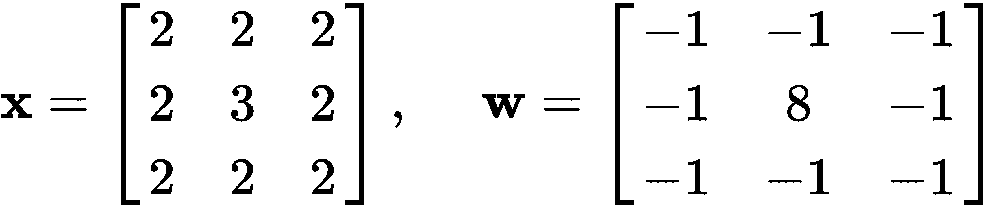。

我们可以通过反转(在两个维度上)和移位(也在两个维度上)滤波器来计算二维离散卷积。方程式如下:

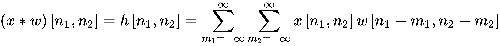

这和一维版本很像。下图说明了前两个步骤和最后一个步骤，以节省空间并避免重复:

图 12.2 -二维离散卷积示例

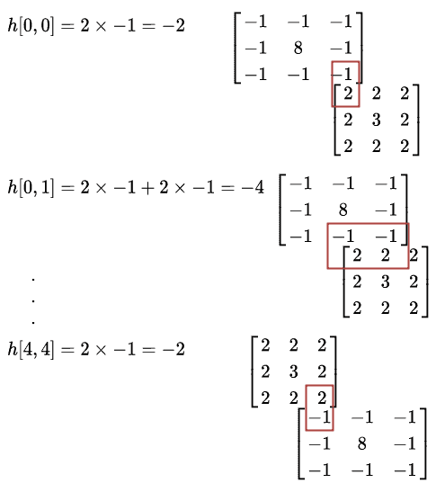

在 Python 中，我们可以使用 SciPy 的`convolve2d`方法计算二维卷积，如下所示:

这将输出以下内容:

```
import numpy as np
from scipy.signal import convolve2d
x = np.array([[2,2,2],[2,3,2],[2,2,2]])
w = np.array([[-1,-1,-1],[-1,8,-1],[-1,-1,-1]])
h = convolve2d(x,w)
print(h)
```

此处显示的结果是完整的分析结果。然而，与一维实现类似，如果您只想要完全重叠的结果，您可以调用一个`'valid'`结果，或者如果您想要与输入大小相同的结果，您可以调用如下的`'same'`替代:

```
[[-2 -4 -6 -4 -2]
 [-4  9  5  9 -4]
 [-6  5  8  5 -6]
 [-4  9  5  9 -4]
 [-2 -4 -6 -4 -2]]
```

这将产生以下结果:

```
import numpy as np
from scipy.signal import convolve2d
x = np.array([[2,2,2],[2,3,2],[2,2,2]])
w = np.array([[-1,-1,-1],[-1,8,-1],[-1,-1,-1]])
h = convolve2d(x,w,mode='valid')
print(h)
h = convolve2d(x,w,mode='same')
print(h)
```

现在，让我们继续讨论 n 维卷积。

```
[[8]]

[[9 5 9]
 [5 8 5]
 [9 5 9]]
```

Now, let's move on to n-dimensional convolutions.

n 维

## 一旦你理解了一维和二维的卷积，你就理解了它背后的基本概念。但是，您可能仍然需要在更大的维度上执行卷积，例如，在多光谱数据集中。为此，我们可以简单地准备任意维数的 NumPy 数组，然后使用 SciPy 的`convolve()`功能。考虑下面的例子:

这里，向量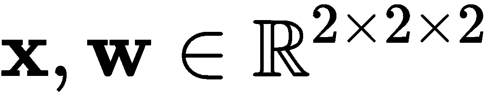是三维数组，可以成功卷积，产生以下输出:

```
import numpy as np
from scipy.signal import convolve
x = np.array([[[1,1],[1,1]],[[2,2],[2,2]]])
w = np.array([[[1,-1],[1,-1]],[[1,-1],[1,-1]]])
h = convolve(x,w)
print(h)
```

关于 n 维卷积，唯一困难的部分可能是将它们可视化，或者在你的头脑中想象它们。我们人类可以很容易地理解一维、二维和三维，但更高维度的空间很难解释。但是请记住，如果你理解卷积在一维和二维中的工作原理，你可以相信数学和算法在任何维度中都是有效的。

```
[[[ 1 0 -1]
  [ 2 0 -2]
  [ 1 0 -1]]

 [[ 3 0 -3]
  [ 6 0 -6]
  [ 3 0 -3]]

 [[ 2 0 -2]
  [ 4 0 -4]
  [ 2 0 -2]]]
```

接下来，让我们看看如何*通过定义 Keras 层并将其添加到模型中来学习*这样的卷积滤波器。

卷积层

# 卷积具有许多在深度学习领域非常有趣的性质:

它可以成功地编码和解码数据的空间属性。

*   可以用最新的动态相对快速的计算出来。
*   它可以用来解决几个计算机视觉问题。
*   它可以与其他类型的层结合使用，以获得最佳性能。
*   Keras 为 TensorFlow 提供了包装器函数，这些函数涉及最流行的维度，即一维、二维和三维:`Conv1D`、`Conv2D`和`Conv3D`。在这一章中，我们将继续关注二维卷积，但请确保如果你已经理解了这个概念，你可以很容易地继续使用其他的。

Conv2D

## 二维卷积法有如下签名:`tensorflow.keras.layers.Conv2D`。卷积层中最常用的参数如下:

`filters`指在该特定层中要学习的滤波器数量，并影响该层输出的维度。

*   `kernel_size`指过滤器的尺寸；例如，在*图 12.2* 的情况下，它将是 size (3，3)。
*   对我们来说是新的。步幅定义为滤波器滑过输入时的步长。到目前为止，我们展示的所有示例都假设我们遵循卷积的原始定义，并采取单位步长。然而，在卷积层中，您可以采取更大的步长，这将导致更小的输出，但也会丢失信息。
*   `padding='valid'`指处理卷积结果边缘信息的方式。请注意，这里的选项只有`'valid'`或`'same'`，无法获得完整的分析结果。意思和我们之前在本章看到的一样。
*   `activation=None`如果需要，提供在层中包含激活功能的选项；比如`activation='relu'`。
*   为了举例说明这一点，考虑如下图所示的卷积层，其中第一层是卷积层(在 2D ),具有 64 个大小为 9x9 的滤波器，跨距为 2，2(即每个方向两个)。我们将在下图中继续解释模型的其余部分:

图 12.3-CIFAR 10 的卷积神经网络架构

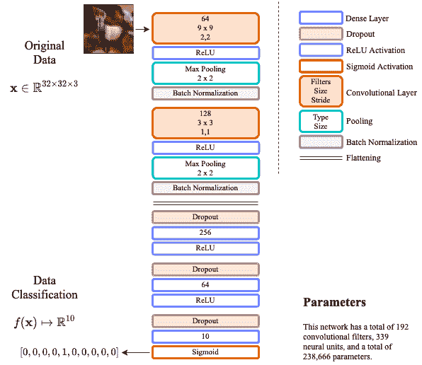

图中的第一个卷积层可以定义如下:

这实际上将创建一个具有给定规格的卷积层。打印语句将有效地产生以下内容:

```
import tensorflow as tf
from tensorflow.keras.layers import Conv2D
input_shape = (1, 32, 32, 3)
x = tf.random.normal(input_shape)
l = Conv2D(64, (9,9), strides=(2,2), activation='relu', 
           input_shape=input_shape)(l)
print(l.shape)
```

如果您计算一下，64 个滤波器中的每一个都会产生 23x23 `'valid'`输出，但由于使用了(2，2)步距，因此应该会获得 11.5x11.5 的输出。然而，由于我们不能有分数，TensorFlow 将四舍五入到 12x12。因此，我们最终以前面的形状作为输出。

```
(1, 12, 12, 64)
```

层+激活组合

## 如前所述，`Conv2D`类能够包含您选择的激活函数。这是非常值得赞赏的，因为它将为所有想要学习高效编码的人节省一些代码行。然而，我们必须小心不要忘记在某处记录所使用的激活类型。

*图 12.3* 显示了独立模块中的激活。这是一个很好的想法来跟踪什么激活被使用。卷积层最常见的激活函数是 ReLU，或者 ReLU 系列的任何激活函数，例如泄漏 ReLU 和 eLU。下一个*新的*元素是一个池层。我们来谈谈这个。

集中策略

# 您通常会发现伴随卷积层的池。池化是一种通过降低问题的维度来减少计算量的思想。在 Keras，我们有一些可用的池策略，但最重要和最受欢迎的是以下两个:

平均池 2D

*   MaxPooling2D
*   这些也存在于其他维度，如 1D。但是，为了理解池，我们可以简单地看一下下图中的例子:

图 12.4-2D 的最大池示例

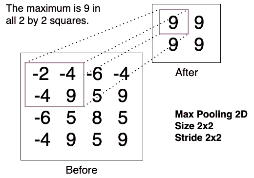

在图中，您可以观察到 max pooling 如何看待单个 2x2 方块一次移动两个空格，从而导致 2x2 结果。汇集的全部目的是**找到有问题的数据**的一个更小的摘要。当谈到神经网络时，我们通常会看到最受*激发*的神经元，因此将最大值视为较大部分数据的良好代表是有意义的。但是，记住你也可以看数据的平均值(`AveragePooling2D`)，从各种意义上来说也是好的。

支持最大池的时间性能略有差异，但这种差异非常小。

在 Keras 中，我们可以非常容易地实现池。例如，在 2D 的 max pooling 案例中，我们可以简单地执行以下操作:

In Keras, we can implement pooling very easily. In the case of max pooling in 2D, for example, we can simply do the following:

```
import tensorflow as tf
from tensorflow.keras.layers import MaxPooling2D
x = tf.constant([[-2, -4, -6, -4],
                 [-4, 9, 5, 9],
                 [-6, 5, 8, 5],
                 [-4, 9, 5, 9]])
x = tf.reshape(x, [1, 4, 4, 1])
y = MaxPooling2D(pool_size=(2, 2), strides=(2, 2), padding='valid')
print(tf.reshape(y(x), [2, 2]))
```

这产生了与图 12.4 中*相同的输出:*

我们也可以对平均池进行同样的操作，如下所示:

```
tf.Tensor(
[[9 9]
 [9 9]], shape=(2, 2), dtype=int32)
```

这将产生以下输出:

```
import tensorflow as tf
from tensorflow.keras.layers import AveragePooling2D
x = tf.constant([[-2., -4., -6., -4],
                 [-4., 9., 5., 9.],
                 [-6., 5., 8., 5.],
                 [-4., 9., 5., 9.]])
x = tf.reshape(x, [1, 4, 4, 1])
y = AveragePooling2D(pool_size=(2, 2), strides=(2, 2), padding='valid')
print(tf.reshape(y(x), [2, 2]))
```

在汇总数据方面，这两种池策略都非常好。你选择任何一个都是安全的。

```
tf.Tensor(
[[-0.25 1\. ]
 [ 1\. 6.75]], shape=(2, 2), dtype=float32)
```

现在是大揭秘。接下来，我们将把所有这些放入 CNN。

CIFAR-10 的卷积神经网络

# 在查看了各个部分之后，我们已经可以实际实现一个功能完整的 CNN 了:理解卷积运算，理解池化，以及理解如何实现卷积层和池化。现在，我们将实现图 12.3 所示的 CNN 架构。

履行

## 我们将逐步实现图 12.3 中的网络，并将其分解为子部分。

加载数据

### 让我们按如下方式加载 CIFAR-10 数据集:

这将有效地加载数据集并打印其形状，如下所示:

```
from tensorflow.keras.datasets import cifar10
from tensorflow.keras.utils import to_categorical
import numpy as np

# The data, split between train and test sets:
(x_train, y_train), (x_test, y_test) = cifar10.load_data()
x_train = x_train.astype('float32') / 255.
x_test = x_test.astype('float32') / 255.

y_train = to_categorical(y_train, 10)
y_test = to_categorical(y_test, 10)
print('x_train shape:', x_train.shape)
print('x_test shape:', x_test.shape)
```

这非常简单，但是我们可以更进一步，通过加载和绘制`x_train`集合中每个类的第一个图像来验证数据是否被正确加载，如下所示:

```
x_train shape: (50000, 32, 32, 3)
x_test shape: (10000, 32, 32, 3)
```

这将产生如下屏幕截图所示的输出:

```
import matplotlib.pyplot as plt
import numpy as np

(_, _), (_, labels) = cifar10.load_data()
idx = [3, 6, 25, 46, 58, 85, 93, 99, 108, 133]

clsmap = {0: 'airplane',
          1: 'automobile', 
          2: 'bird', 
          3: 'cat', 
          4: 'deer',
          5: 'dog',
          6: 'frog',
          7: 'horse',
          8: 'ship',
          9: 'truck'}

plt.figure(figsize=(10,4))
for i, (img, y) in enumerate(zip(x_test[idx].reshape(10, 32, 32, 3), labels[idx])):
  plt.subplot(2, 5, i+1)
  plt.imshow(img, cmap='gray')
  plt.xticks([])
  plt.yticks([])
  plt.title(str(y[0]) + ": " + clsmap[y[0]])
plt.show()
```

图 12.5-CIFAR-10 样本

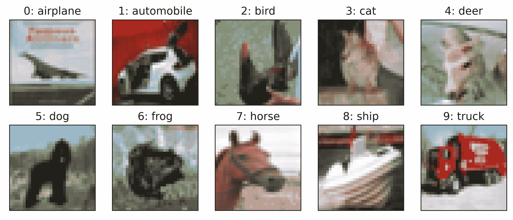

接下来，我们将实现网络的各个层。

编译模型

### 再次回忆一下图 12.3 中的模型，以及我们如何实现它。您将要看到的一切都是我们在本章和前几章中已经看过的:

我们继续添加更多的卷积层，如下所示:

```
# Importing the Keras libraries and packages
from tensorflow.keras.layers import Conv2D, MaxPooling2D, Flatten
from tensorflow.keras.layers import Input, Dense, Dropout, BatchNormalization
from tensorflow.keras.models import Model
from tensorflow.keras.optimizers import RMSprop

# dimensionality of input and latent encoded representations
inpt_dim = (32, 32, 3)

inpt_img = Input(shape=inpt_dim)

# Convolutional layer
cl1 = Conv2D(64, (9, 9), strides=(2, 2), input_shape = inpt_dim, 
             activation = 'relu')(inpt_img)

# Pooling and BatchNorm
pl2 = MaxPooling2D(pool_size = (2, 2))(cl1)
bnl3 = BatchNormalization()(pl2)
```

然后，我们可以编译模型并打印如下摘要:

```
# Add a second convolutional layer
cl4 = Conv2D(128, (3, 3), strides=(1, 1), activation = 'relu')(bnl3)
pl5 = MaxPooling2D(pool_size = (2, 2))(cl4)
bnl6 = BatchNormalization()(pl5)

# Flattening for compatibility
fl7 = Flatten()(bnl6)

# Dense layers + Dropout
dol8 = Dropout(0.5)(fl7)
dl9 = Dense(units = 256, activation = 'relu')(dol8)
dol10 = Dropout(0.2)(dl9)
dl11 = Dense(units = 64, activation = 'relu')(dol10)
dol12 = Dropout(0.1)(dl11)
output = Dense(units = 10, activation = 'sigmoid')(dol12)

classifier = Model(inpt_img, output)
```

这将输出如下所示的网络总结:

```
# Compiling the CNN with RMSprop optimizer
opt = RMSprop(learning_rate=0.001)

classifier.compile(optimizer = opt, loss = 'binary_crossentropy', 
                   metrics = ['accuracy'])

print(classifier.summary())
```

在这一点上，有一点对你来说一定非常明显，那就是这个网络的参数数量。如果你回忆一下上一章，你会惊讶地发现这个网络有将近 25 万个参数，而宽或深的网络有几百万个参数。此外，你很快就会看到，这个相对较小的网络，虽然仍然*过度参数化*，将会比前一章中有更多参数的网络表现得更好。

```
Model: "model"
_________________________________________________________________
Layer (type)                 Output Shape          Param # 
=================================================================
input_1 (InputLayer)         [(None, 32, 32, 3)]   0 
_________________________________________________________________
conv2d (Conv2D)              (None, 12, 12, 64)    15616 
_________________________________________________________________
max_pooling2d_4 (MaxPooling2 (None, 6, 6, 64)      0 
_________________________________________________________________
batch_normalization (BatchNo (None, 6, 6, 64)      256 
_________________________________________________________________
.
.
.
_________________________________________________________________
dropout_2 (Dropout)          (None, 64)            0 
_________________________________________________________________
dense_2 (Dense)              (None, 10)            650 
=================================================================
Total params: 238,666
Trainable params: 238,282
Non-trainable params: 384
```

接下来，我们来训练网络。

训练 CNN

### 我们可以使用我们在[第 11 章](03e9a734-fb56-485d-ae90-66fb98ecd4d1.xhtml)、*深度和广度神经网络*中学习的*回调*来训练 CNN，如果没有进展，则提前停止网络，如果达到*平稳期*，则降低学习速率以集中梯度下降算法的努力。

我们将对其进行如下培训:

We will train it as follows:

```
# Fitting the CNN to the images
from tensorflow.keras.callbacks import ReduceLROnPlateau, EarlyStopping

reduce_lr = ReduceLROnPlateau(monitor='val_loss', factor=0.5, patience=10, 
                              min_delta=1e-4, mode='min', verbose=1)

stop_alg = EarlyStopping(monitor='val_loss', patience=35, 
                         restore_best_weights=True, verbose=1)

hist = classifier.fit(x_train, y_train, batch_size=100, epochs=1000, 
                   callbacks=[stop_alg, reduce_lr], shuffle=True, 
                   validation_data=(x_test, y_test))

classifier.save_weights("cnn.hdf5")
```

这样做的结果会因计算机而异。例如，它可能需要更少或更多的历元，或者如果小批量(随机选择)包含几个边缘情况，梯度可能采取不同的方向。但是，在大多数情况下，您应该会得到与此类似的结果:

此时，当训练结束后，你可以得到一个 83.15%准确率的估计。小心，这不是一个**平衡的**精度。为此，我们将在下一节中查看**平衡错误率** ( **BER** )指标。但在此之前，我们可以看看训练曲线，看看损失是如何最小化的。

```
Epoch 1/1000
500/500 [==============================] - 3s 5ms/step - loss: 0.2733 - accuracy: 0.3613 - val_loss: 0.2494 - val_accuracy: 0.4078 - lr: 0.0010
Epoch 2/1000
500/500 [==============================] - 2s 5ms/step - loss: 0.2263 - accuracy: 0.4814 - val_loss: 0.2703 - val_accuracy: 0.4037 - lr: 0.0010
.
.
.
Epoch 151/1000
492/500 [============================>.] - ETA: 0s - loss: 0.0866 - accuracy: 0.8278
Epoch 00151: ReduceLROnPlateau reducing learning rate to 3.906250185536919e-06.
500/500 [==============================] - 2s 4ms/step - loss: 0.0866 - accuracy: 0.8275 - val_loss: 0.1153 - val_accuracy: 0.7714 - lr: 7.8125e-06
Epoch 152/1000
500/500 [==============================] - 2s 4ms/step - loss: 0.0864 - accuracy: 0.8285 - val_loss: 0.1154 - val_accuracy: 0.7707 - lr: 3.9063e-06
Epoch 153/1000
500/500 [==============================] - 2s 4ms/step - loss: 0.0861 - accuracy: 0.8305 - val_loss: 0.1153 - val_accuracy: 0.7709 - lr: 3.9063e-06
Epoch 154/1000
500/500 [==============================] - 2s 4ms/step - loss: 0.0860 - accuracy: 0.8306 - val_loss: 0.1153 - val_accuracy: 0.7709 - lr: 3.9063e-06
Epoch 155/1000
500/500 [==============================] - 2s 4ms/step - loss: 0.0866 - accuracy: 0.8295 - val_loss: 0.1153 - val_accuracy: 0.7715 - lr: 3.9063e-06
Epoch 156/1000
496/500 [============================>.] - ETA: 0s - loss: 0.0857 - accuracy: 0.8315Restoring model weights from the end of the best epoch.
500/500 [==============================] - 2s 4ms/step - loss: 0.0857 - accuracy: 0.8315 - val_loss: 0.1153 - val_accuracy: 0.7713 - lr: 3.9063e-06
Epoch 00156: early stopping
```

At this point, when the training is finished, you can get an estimate of the accuracy of 83.15%. Be careful, this is not a **balanced** accuracy. For that, we will take a look at the **Balanced Error Rate** (**BER**) metric in the next section. But before we do that, we can look at the training curve to see how the loss was minimized.

下面的代码将产生我们想要的结果:

这给出了*图 12.6* 中所示的曲线图:

```
import matplotlib.pyplot as plt

fig = plt.figure(figsize=(10,6))
plt.plot(hist.history['loss'], color='#785ef0')
plt.plot(hist.history['val_loss'], color='#dc267f')
plt.title('Model Loss Progress')
plt.ylabel('Brinary Cross-Entropy Loss')
plt.xlabel('Epoch')
plt.legend(['Training Set', 'Test Set'], loc='upper right')
plt.show()
```

This gives the plot shown in *Figure 12.6*:

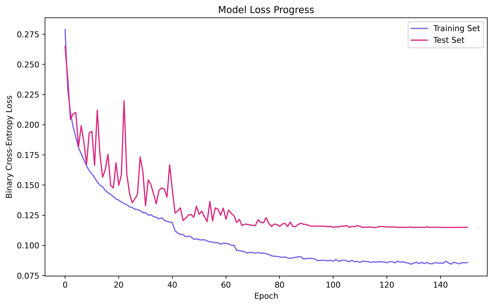

图 12.6-CIFAR-10 上 CNN 的损耗最小化

从该图中，您可以了解学习曲线的起伏，尤其是在训练集曲线上可见的起伏，这是由于通过回调函数`ReduceLROnPlateau`降低了学习速率。由于`EarlyStopping`回调，在测试集上损失不再改善后，训练停止。

From this diagram, you can appreciate the bumps that the learning curve has, particularly visible on the training set curve, which are due to the reduction in the learning rate through the callback function, `ReduceLROnPlateau`. The training stops after the loss no longer improves on the test set, thanks to the `EarlyStopping` callback.

结果

## 现在，让我们看看客观的数字结果:

这将给出以下数值结果，我们可以将这些结果与上一章的结果进行比较:

```
from sklearn.metrics import classification_report
from sklearn.metrics import confusion_matrix
from sklearn.metrics import balanced_accuracy_score
import matplotlib.pyplot as plt
import numpy as np

(_, _), (_, labels) = cifar10.load_data()

y_ = labels
y_hat = classifier.predict(x_test)
y_pred = np.argmax(y_hat, axis=1)

print(classification_report(np.argmax(y_test, axis=1), 
                            np.argmax(y_hat, axis=1), 
                            labels=[0, 1, 2, 3, 4, 5, 6, 7, 8, 9]))
cm = confusion_matrix(np.argmax(y_test, axis=1), 
                      np.argmax(y_hat, axis=1), 
                      labels=[0, 1, 2, 3, 4, 5, 6, 7, 8, 9])
print(cm)
ber = 1- balanced_accuracy_score(np.argmax(y_test, axis=1), 
                                 np.argmax(y_hat, axis=1))
print('BER', ber)
```

特定类别的准确率可高达 87%，而最低准确率为 66%。这比上一章的前几款要好得多。BER 为 0.2288，这都可以解释为 77.12%的平衡精度。这与训练期间测试集中报告的准确度相匹配，这表明模型被正确训练。为了便于比较，下图显示了混淆矩阵的直观表示:

```
  precision  recall  f1-score  support

0      0.80    0.82      0.81     1000
1      0.89    0.86      0.87     1000
2      0.73    0.66      0.69     1000
3      0.57    0.63      0.60     1000
4      0.74    0.74      0.74     1000
5      0.67    0.66      0.66     1000
6      0.84    0.82      0.83     1000
7      0.82    0.81      0.81     1000
8      0.86    0.88      0.87     1000
9      0.81    0.85      0.83     1000

               accuracy  0.77     10000

[[821  12  36  18  12   8   4   4  51  34]
 [ 17 860   3   7   2   6   8   1  22  74]
 [ 61   2 656  67  72  53  43  24  11  11]
 [ 11   7  47 631  55 148  38  36  10  17]
 [ 21   2  48  63 736  28  31  54  12   5]
 [ 12   3  35 179  39 658  16  41   4  13]
 [  2   4  32  67  34  20 820   8   8   5]
 [ 12   3  18  41  42  52   5 809   3  15]
 [ 43  22  12  12   2   5   3   0 875  26]
 [ 29  51  10  19   2   3   5   9  26 846]]

BER 0.2288
```

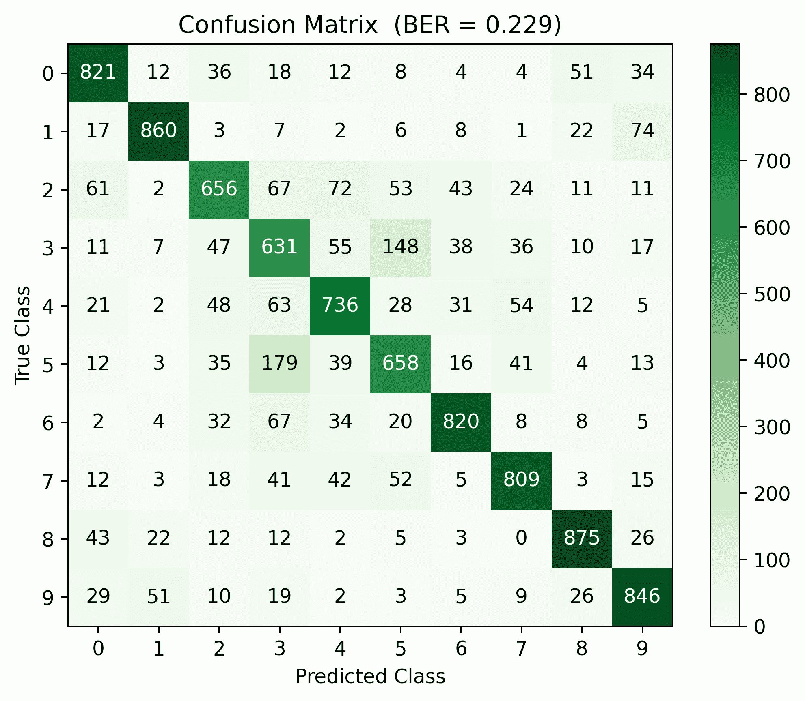

图 12.7 -通过 CIFAR-10 训练的 CNN 的混淆矩阵

从视觉混淆矩阵中可以更清楚地看出，类 3 和类 5 比其他类更容易混淆。3 类和 5 类分别对应猫和狗。

It might be a bit clearer from the visual confusion matrix that classes 3 and 5 can be confused between themselves more than other classes. Classes 3 and 5 correspond to cats and dogs, respectively.

就是这样。正如你所看到的，这已经是一个很好的结果了，但是你可以自己进行更多的实验。您可以编辑和添加更多的卷积层到您的模型，使它变得更好。如果你好奇的话，还有其他更大的 CNN 也非常成功。这里有两个最著名的例子:

VGG-19:它包含 12 个卷积层和 3 个密集层(Simonyan，k .等人(2014))。

*   ResNet:这包含 110 个卷积层和 1 个密集层(He，k .，et al. (2016))。这种特殊的配置在 CIFAR-10 上可以实现低至 6.61% ( 0.16%)的错误率。
*   接下来让我们讨论如何可视化学习到的过滤器。

过滤器的可视化

## 这一章的最后一部分处理学习过的过滤器的可视化。如果你想研究网络在学习什么，这可能对你有用。这可能有助于网络的可解释性。然而，请注意，网络越深，理解它就越复杂。

以下代码将帮助您可视化网络第一个卷积层的滤波器:

The following code will help you visualize the filters of the first convolutional layer of the network:

```
from sklearn.preprocessing import MinMaxScaler

cnnl1 = classifier.layers[1].name   # get the name of the first conv layer
W = classifier.get_layer(name=cnnl1).get_weights()[0]   #get the filters
wshape = W.shape  #save the original shape

# this part will scale to [0, 1] for visualization purposes
scaler = MinMaxScaler()
scaler.fit(W.reshape(-1,1))
W = scaler.transform(W.reshape(-1,1))
W = W.reshape(wshape)

# since there are 64 filters, we will display them 8x8
fig, axs = plt.subplots(8,8, figsize=(24,24))
fig.subplots_adjust(hspace = .25, wspace=.001)
axs = axs.ravel()
for i in range(W.shape[-1]):
  # we reshape to a 3D (RGB) image shape and display
  h = np.reshape(W[:,:,:,i], (9,9,3))
  axs[i].imshow(h)
  axs[i].set_title('Filter ' + str(i))
```

该代码在很大程度上依赖于了解您想要可视化的图层、想要可视化的滤镜数量以及滤镜本身的大小。在这种情况下，我们希望将第一个卷积层可视化。它有 64 个过滤器(显示在 8×8 的网格中)，每个过滤器是 9x9x3，因为输入是彩色图像。*图 12.8* 显示了前面代码的结果图:

图 12.8 -在第一个卷积层中学习的过滤器

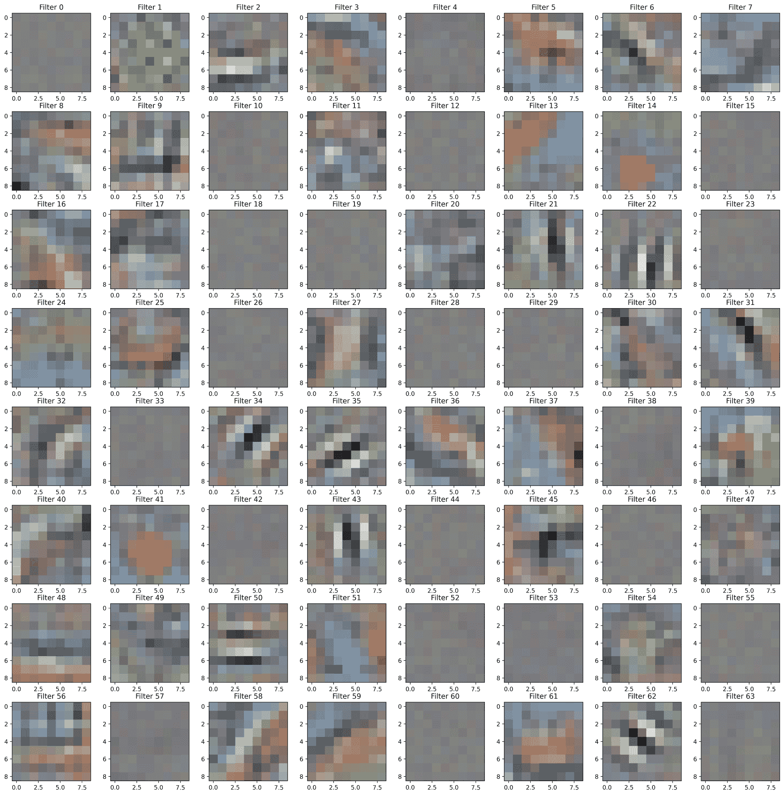

如果您是图像处理专家，您可能会认出其中一些模式，因为它们类似于 Gabor 滤波器(Jain，A. K .等人(1991))。这些过滤器中的一些被设计成寻找边缘、纹理或特定形状。文献表明，在卷积网络中，较深的层通常编码高度复杂的信息，而第一层用于检测边缘等特征。

请随意继续，并通过进行必要的修改来尝试显示另一个层。

摘要

# 这中间的一章展示了如何创建 CNN。你学习了卷积运算，这是它们背后的基本概念。您还了解了如何创建卷积层和聚合池策略。您设计了一个网络来学习过滤器，以基于 CIFAR-10 识别对象，并学习了如何显示学习到的过滤器。

在这一点上，你应该有信心解释根植于计算机视觉和信号处理的卷积神经网络背后的动机。使用 NumPy、SciPy 和 Keras/TensorFlow 对一维和二维卷积运算进行编码，您应该会感觉很舒服。此外，你应该有信心在层中实现卷积运算，并通过梯度下降技术学习过滤器。如果要求您展示网络已经学习了什么，您应该准备好实现一个简单的可视化方法来显示学习到的过滤器。

CNN 擅长编码高度相关的空间信息，如图像、音频或文本。然而，有一种有趣的网络是用来对本质上是连续的信息进行编码的。[第十三章](a6e892c5-e890-4c0a-ad92-c5442328a64a.xhtml)、*循环神经网络*，将呈现循环网络最基本的概念，从而引出长短期记忆模型。我们将探索序列模型的多种变体及其在图像分类和自然语言处理中的应用。

CNNs are great at encoding highly correlated spatial information, such as images, audio, or text. However, there is an interesting type of network that is meant to encode information that is sequential in nature. [Chapter 13](a6e892c5-e890-4c0a-ad92-c5442328a64a.xhtml), *Recurrent Neural Networks*, will present the most fundamental concepts of recurrent networks, leading to long short-term memory models. We will explore multiple variants of sequential models with applications in image classification and natural language processing.

问题和答案

# **本章讨论的什么数据汇总策略可以降低卷积模型的维数？**

1.  共用。

**增加更多的卷积层数会让网络变得更好吗？**

2.  不总是。已经表明，更多的层对网络有积极的影响，但是在某些情况下没有增益。你应该通过实验来确定层数、过滤器尺寸和汇集。

**CNN 还有哪些应用？**

3.  音频处理和分类；图像去噪；图像超分辨率；文本摘要和其他文本处理和分类任务；数据的加密。

参考

# LeCun，y .，Boser，b .，Denker，J. S .，Henderson，d .，Howard，R. E .，Hubbard，w .，Jackel，L. D. (1989)。*应用于手写邮政编码识别的反向传播*。*神经计算*，1(4)，541-551。

*   李耀德，郝志斌，雷，h(2016)。*卷积神经网络综述*。*计算机应用杂志*，36(9)，2508-2515。
*   Krizhevsky，a .，Sutskever，I .，和 Hinton，G. E. (2012 年)。*深度卷积神经网络的 Imagenet 分类*。在*神经信息处理系统的进展*(第 1097-1105 页)。
*   Simonyan，k .和 Zisserman，A. (2014 年)。*用于大规模图像识别的极深度卷积网络*。arXiv 预印本 arXiv:1409.1556。
*   贺，张，谢，任，孙(2016)。*用于图像识别的深度残差学习*。IEEE 计算机视觉和模式识别会议论文集(第 770-778 页)。
*   贾恩和法罗克尼亚(1991 年)。*使用 Gabor 滤波器的无监督纹理分割*。*模式识别*，24(12)，1167-1186。
*   Jain, A. K., and Farrokhnia, F. (1991). *Unsupervised texture segmentation using Gabor filters*. *Pattern recognition*, 24(12), 1167-1186.