# 十三、循环神经网络

本章介绍了循环神经网络，从基本模型开始，然后进入*更新的*递归层，这些递归层能够处理内部记忆学习，以记住或忘记数据集中的某些模式。我们将首先展示循环网络在推断时间或顺序模式的情况下是强大的，然后我们将介绍对具有内部记忆的模型的传统范式的改进，该模型可以在时间空间的两个方向上应用。

我们将通过将情感分析问题视为序列到向量的应用来处理学习任务，然后我们将同时关注作为向量到序列和序列到序列模型的自编码器。本章结束时，你将能够解释为什么长短期记忆模型比传统的密集方法更好。你将能够描述双向长短期记忆模型如何比单向方法更有优势。你将能够实现自己的循环网络，并将其应用于 NLP 问题或图像相关的应用，包括序列到向量、向量到序列和序列到序列的建模。

本章组织如下:

*   循环神经网络导论
*   长短期记忆模型
*   序列到向量模型
*   向量到序列模型
*   序列间模型
*   伦理含义

# 循环神经网络导论

**循环神经网络** ( **RNNs** )基于鲁梅尔哈特(Rumelhart，D. E .等人(1986))的早期工作，鲁梅尔哈特是一位心理学家，他与辛顿密切合作，我们已经在这里提到过他几次。这个概念很简单，但在使用数据序列的模式识别领域是革命性的。

**数据序列**是在时间或空间上具有高度相关性的任何数据。例子包括音频序列和图像。

RNNs 中的递归概念可以如下图所示进行说明。如果你想到一个密集的神经单元层，这些可以在不同的时间步长使用一些输入来刺激。*图 13.1 (b)* 和 *(c)* 显示了具有五个时间步长的 RNN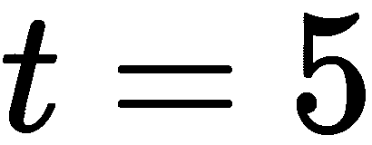。我们可以在图 13.1 (b) 和 *(c)* 中看到不同时间步长的输入，但更重要的是，神经单元的输出也可用于下一层神经元:

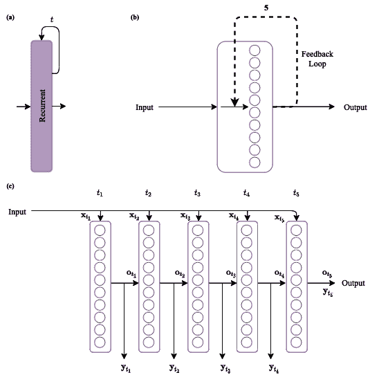

图 13.1。循环层的不同表示:(a)将是本书的首选用法；(b)描述了神经单元和反馈回路；(c)是(b)的扩展版本，显示了在训练过程中实际发生的情况

RNN 能够看到前一层神经元是如何被刺激的，这有助于网络比没有额外信息的情况下更好地解释序列。然而，这是有代价的:由于存在与输入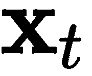和先前输出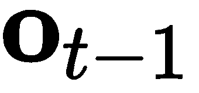相关联的权重，与传统的密集层相比，将有更多的参数要计算。

## 简单 RNNs

在 Keras 中，我们可以创建一个简单的 RNN，具有**五个时间步长**和 **10 个神经单元**(参见*图 13.1* )，如下所示:

```
from tensorflow.keras import Sequential
from tensorflow.keras.layers import SimpleRNN

n_units = 10
t_steps = 5
inpt_ftrs=2
model = Sequential()
model.add(SimpleRNN(n_units, input_shape=(t_steps, inpt_ftrs)))
model.summary()
```

这给出了以下摘要:

```
Model: "sequential"
_________________________________________________________________
Layer (type)            Output Shape  Param # 
=================================================================
simple_rnn (SimpleRNN)  (None, 10)    130 
=================================================================
Total params: 130
Trainable params: 130
Non-trainable params: 0
```

前面的示例代码假设输入中的**特性的数量将只有**两个**；例如，我们可以有二维的序列数据。这些类型的 rnn 被称为*简单*，因为它们类似于具有`tanh`激活和递归方面的密集网络的简单性。**

rnn 通常绑定到嵌入层，我们接下来将讨论这一点。

## 嵌入层

当存在需要额外处理的序列时，嵌入层通常与 RNNs 配对，以使 RNNs 更加鲁棒。考虑这样一种情况，当你有一个句子*“这是一个小向量”*，你想训练一个 RNN 来检测句子什么时候写得正确或者写得不好。你可以用你能想到的所有长度为五的句子训练一个 RNN，包括*“这是一个小向量”。为此，你必须想办法把一个句子转换成 RNN 人能理解的东西。嵌入层来拯救。*

有一种技术叫做**词嵌入**，它的任务是将一个单词转换成一个向量。有几种成功的方法，如 Word2Vec (Mikolov，t .等人，2013 年)或 GloVe (Pennington，j .等人，2014 年)。然而，我们将把重点放在一个容易获得的简单技术上。我们将逐步做到这一点:

1.  确定你想学习的句子的长度。这将成为 RNN 图层输入的维度。对于嵌入层的设计来说，这一步并不是必须的，但是对于 RNN 层来说，你很快就会需要这一步，尽早决定这一点很重要。
2.  确定数据集中不同单词的数量，并给它们分配一个数字，创建一个字典:单词到索引。这就是所谓的词汇。

大多数人会确定词汇表，然后计算每个单词的频率来对词汇表中的单词进行排序，以使索引 0 对应于数据集中最常见的单词，最后一个索引对应于最不常用的单词。例如，如果您想忽略最常用的单词或最不常用的单词，这可能会很有帮助。

3.  用相应的索引替换数据集中所有句子中的单词。
4.  确定词嵌入的维度，并训练嵌入层以从数字索引映射到具有期望维度的实值向量。

看*图 13.2* 中的例子。如果我们把单词*这个*，它的给定索引是 7，一些训练过的嵌入层可以把那个数映射成大小为 10 的向量，如图*图 13.2 (b)* 所示。那就是词嵌入过程。

你可以对完整的句子*“这是一个小向量”*重复这个过程，它可以映射到一个索引为[7，0，6，1，28]的**序列**，它会为你产生一个向量的**序列**；参见*图 13.2 (c)* 。换句话说，它将产生一个**词嵌入序列**。RNN 可以很容易地处理这些序列，并确定这些序列所代表的句子是否是正确的句子。

然而，我们必须说，确定一个句子是否正确是一个具有挑战性和有趣的问题(Rivas，P. et al. (2019)):

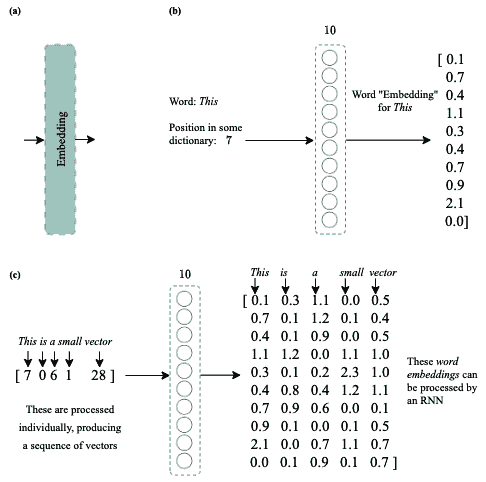

图 13.2。嵌入层:(a)将是本书的首选用途；(b)示出了词嵌入的例子；以及(c)示出了单词序列及其对应的词嵌入矩阵

基于*图 13.2* 中所示的模型，Keras 中的嵌入层可创建如下:

```
from tensorflow.keras import Sequential
from tensorflow.keras.layers import Embedding

vocab_size = 30
embddng_dim = 10
seqnc_lngth = 5

model = Sequential()
model.add(Embedding(vocab_size, embddng_dim, input_length=seqnc_lngth))
model.summary()
```

这会产生以下摘要:

```
Model: "sequential"
_________________________________________________________________
Layer (type)             Output Shape     Param # 
=================================================================
embedding (Embedding)    (None, 5, 10)    300 
=================================================================
Total params: 300
Trainable params: 300
Non-trainable params: 0
```

然而，请注意，对于大多数常见语言中的典型 NLP 任务，词汇表的大小通常在数千的数量级。想想你那本好的老式字典吧...它有多少个条目？通常是几千个。

类似地，句子通常长于五个单词，所以你应该期望有比前一个例子更长的序列。

最后，嵌入维度取决于您希望模型在嵌入空间中有多丰富，或者取决于您的模型空间约束。如果你想要一个更小的模型，可以考虑嵌入 50 维。但是如果空间不是问题，并且您有一个包含数百万条目的优秀数据集，并且您有无限的 GPU 能力，那么您应该尝试嵌入 500、700 甚至 1000+维度。

现在，让我们试着用一个真实的例子把这些碎片拼在一起。

## IMDb 上的词嵌入和 RNNs

IMDb 数据集在前面的章节中已经解释过了，但是为了简单起见，我们说它有基于文本的电影评论和与每个条目相关的正面(1)或负面(0)评论。

Keras 允许您访问这个数据集，并提供了几个很好的特性来优化设计模型时的时间。例如，数据集已经根据每个单词的频率进行了处理，使得最小的索引与频繁出现的单词相关联，反之亦然。记住这一点，你也可以排除英语中最常见的单词，比如 10 个或 20 个。你甚至可以限制词汇量，比如说，5000 或 10000 个单词。

在我们进一步讨论之前，我们必须证明一些你将要看到的事情:

*   词汇量为 10，000。我们可以支持保持 10，000 的词汇量，因为这里的任务是确定评论是积极的还是消极的。也就是说，我们不需要过于复杂的词汇来确定这一点。
*   排除前 20 个单词。英语中最常见的单词包括“a”或“The”等单词；像这样的词在决定一个电影评论是正面还是负面时可能不是很重要。所以，排除 20 个最常见的应该没问题。
*   句子长度为 128 个单词。拥有更短的句子，比如 5 个单词的句子，可能会缺乏足够的内容，拥有更长的句子，比如 300 个单词的句子，也没有太大的意义，因为我们可能会用更少的单词来感受评论的语气。128 个单词的选择完全是任意的，但在所解释的意义上是合理的。

考虑到这些因素，我们可以轻松地加载数据集，如下所示:

```
from keras.datasets import imdb
from keras.preprocessing import sequence

inpt_dim = 128
index_from = 3

(x_train, y_train),(x_test, y_test)=imdb.load_data(num_words=10000,
                                                   start_char=1,
                                                   oov_char=2,
                                                   index_from=index_from,
                                                   skip_top=20)
x_train = sequence.pad_sequences(x_train, 
                                 maxlen=inpt_dim).astype('float32')
x_test = sequence.pad_sequences(x_test, maxlen=inpt_dim).astype('float32')

# let's print the shapes
print('x_train shape:', x_train.shape)
print('x_test shape:', x_test.shape)
```

我们还可以打印一些用于验证的数据，如下所示:

```
# let's print the indices of sample #7
print(' '.join(str(int(id)) for id in x_train[7]))

# let's print the actual words of sample #7
wrd2id = imdb.get_word_index()
wrd2id = {k:(v+index_from) for k,v in wrd2id.items()}
wrd2id["<PAD>"] = 0
wrd2id["<START>"] = 1
wrd2id["<UNK>"] = 2
wrd2id["<UNUSED>"] = 3

id2wrd = {value:key for key,value in wrd2id.items()}
print(' '.join(id2wrd[id] for id in x_train[7] ))
```

这将输出以下内容:

```
x_train shape: (25000, 128)
x_test shape: (25000, 128)

 55   655    707    6371     956    225    1456    841     42 1310   225     2 ...
very middle class suburban setting there's zero atmosphere or mood there's <UNK> ...
```

上述代码的第一部分显示了如何加载被分为训练集和测试集的数据集，分别为`x_train`和`y_train`、`x_test`和`y_test`。剩下的部分只是显示数据集的形状(维度)用于验证，为了验证，我们可以打印出样本#7 的原始形式(索引)以及相应的单词。如果你以前没有使用过 IMDb，这部分代码会有点奇怪。但是要点是我们需要为特殊的记号保留某些索引:句子的开始`<START>`，未使用的索引`<UNUSED>`，未登录词索引`<UNK>`，以及零填充索引`<PAD>`。一旦我们为这些标记做了特殊的分配，我们就可以很容易地从索引映射回单词。RNN 将学习这些指数，并学习如何处理它们，要么忽略它们，要么给它们特定的权重。

现在，让我们实现下图所示的体系结构，该体系结构使用了之前解释的所有层:

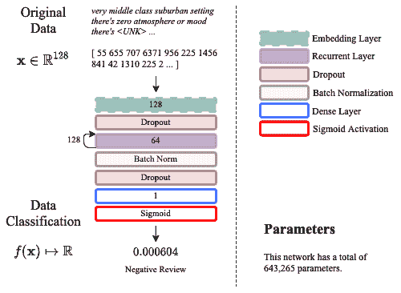

图 13.3。IMDb 数据集的 RNN 架构

该图显示了与负面评价相关联的相同示例(来自训练集的#7)。图表中描述的体系结构以及加载数据的代码如下:

```
from keras.datasets import imdb
from keras.preprocessing import sequence
from tensorflow.keras.models import Model
from tensorflow.keras.layers import SimpleRNN, Embedding, BatchNormalization
from tensorflow.keras.layers import Dense, Activation, Input, Dropout

seqnc_lngth = 128
embddng_dim = 64
vocab_size = 10000

(x_train, y_train), (x_test, y_test) = imdb.load_data(num_words=vocab_size, 
                                                      skip_top=20)
x_train = sequence.pad_sequences(x_train, 
                                 maxlen=seqnc_lngth).astype('float32')
x_test = sequence.pad_sequences(x_test, 
                                maxlen=seqnc_lngth).astype('float32')
```

模型的各层定义如下:

```
inpt_vec = Input(shape=(seqnc_lngth,))
l1 = Embedding(vocab_size, embddng_dim, input_length=seqnc_lngth)(inpt_vec)
l2 = Dropout(0.3)(l1)
l3 = SimpleRNN(32)(l2)
l4 = BatchNormalization()(l3)
l5 = Dropout(0.2)(l4)
output = Dense(1, activation='sigmoid')(l5)

rnn = Model(inpt_vec, output)

rnn.compile(loss='binary_crossentropy', optimizer='adam', 
            metrics=['accuracy'])
rnn.summary()
```

该模型使用我们之前使用的标准损失和优化器，生成的摘要如下:

```
Model: "functional"
_________________________________________________________________
Layer (type)                 Output Shape     Param # 
=================================================================
input_1 (InputLayer)         [(None, 128)]    0 
_________________________________________________________________
embedding (Embedding)        (None, 128, 64)  640000 
_________________________________________________________________
dropout_1 (Dropout)          (None, 128, 64)  0 
_________________________________________________________________
simple_rnn (SimpleRNN)       (None, 32)       3104 
_________________________________________________________________
batch_normalization (BatchNo (None, 32)       128 
_________________________________________________________________
dropout_2 (Dropout)          (None, 32)       0 
_________________________________________________________________
dense (Dense)                (None, 1)        33 
=================================================================
Total params: 643,265
Trainable params: 643,201
Non-trainable params: 64
```

然后我们可以用之前用过的回调来训练网络:a)提前停止，b)自动学习率降低。学习可以按如下方式执行:

```
from tensorflow.keras.callbacks import ReduceLROnPlateau, EarlyStopping
import matplotlib.pyplot as plt

#callbacks
reduce_lr = ReduceLROnPlateau(monitor='val_loss', factor=0.5, patience=3, 
                              min_delta=1e-4, mode='min', verbose=1)

stop_alg = EarlyStopping(monitor='val_loss', patience=7, 
                         restore_best_weights=True, verbose=1)

#training
hist = rnn.fit(x_train, y_train, batch_size=100, epochs=1000, 
               callbacks=[stop_alg, reduce_lr], shuffle=True, 
               validation_data=(x_test, y_test))

```

然后我们保存模型，并像这样显示损失:

```
# save and plot training process
rnn.save_weights("rnn.hdf5")

fig = plt.figure(figsize=(10,6))
plt.plot(hist.history['loss'], color='#785ef0')
plt.plot(hist.history['val_loss'], color='#dc267f')
plt.title('Model Loss Progress')
plt.ylabel('Brinary Cross-Entropy Loss')
plt.xlabel('Epoch')
plt.legend(['Training Set', 'Test Set'], loc='upper right')
plt.show()
```

前面的代码产生了下图所示的曲线，这表明网络在时段#3 之后开始过度拟合:

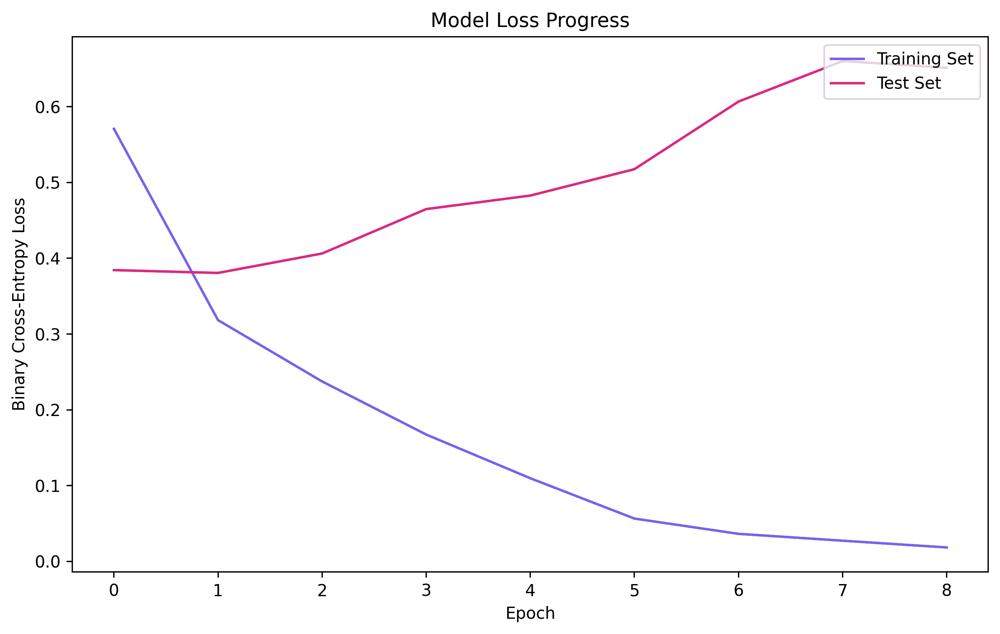

图 13.4。训练中的 RNN 损失

过度拟合在循环网络中很常见，您不应该对此行为感到惊讶。到今天为止，使用当前的算法，这种情况经常发生。然而，关于 RNNs 的一个有趣的事实是，与其他传统模型相比，它们也收敛得非常快。如你所见，三个纪元后的收敛还不算太差。

接下来，我们必须通过查看平衡准确度、混淆矩阵和 ROC 曲线下的**面积** ( **AUC** )来检查实际的分类性能。我们将只在如下测试集中这样做:

```
from sklearn.metrics import confusion_matrix
from sklearn.metrics import balanced_accuracy_score
from sklearn.metrics import roc_curve, auc
import matplotlib.pyplot as plt
import numpy as np

y_hat = rnn.predict(x_test)

# gets the ROC
fpr, tpr, thresholds = roc_curve(y_test, y_hat)
roc_auc = auc(fpr, tpr)

# plots ROC
fig = plt.figure(figsize=(10,6))
plt.plot(fpr, tpr, color='#785ef0', 
         label='ROC curve (AUC = %0.2f)' % roc_auc)
plt.plot([0, 1], [0, 1], color='#dc267f', linestyle='--')
plt.xlim([0.0, 1.0])
plt.ylim([0.0, 1.05])
plt.xlabel('False Positive Rate')
plt.ylabel('True Positive Rate')
plt.title('Receiver Operating Characteristic Curve')
plt.legend(loc="lower right")
plt.show()

# finds optimal threshold and gets ACC and CM
optimal_idx = np.argmax(tpr - fpr)
optimal_threshold = thresholds[optimal_idx]
print("Threshold value is:", optimal_threshold)
y_pred = np.where(y_hat>=optimal_threshold, 1, 0)
print(balanced_accuracy_score(y_test, y_pred))
print(confusion_matrix(y_test, y_pred))
```

先来分析一下这里产生的剧情，如图*图 13.5* 所示:

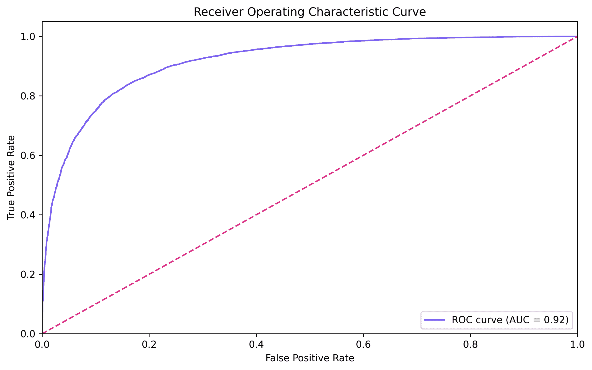

图 13.5。在测试集中计算的 RNN 模型的 ROC 和 AUC

该图显示了**真阳性率** ( **TPR** )和**假阳性率** ( **FPR** )的良好组合，尽管这并不理想:我们希望看到更陡峭的阶梯状曲线。AUC 是 0.92，这也很好，但理想的 AUC 是 1.0。

类似地，代码产生平衡的准确性和混淆矩阵，看起来像这样:

```
Threshold value is: 0.81700134

0.8382000000000001

[[10273 2227]
 [ 1818 10682]]
```

首先，我们在这里计算作为 TPR 和 FPR 的函数的最佳阈值。我们希望选择能给我们最大 TPR 和最小 FPR 的阈值。此处显示的阈值和结果**将根据网络的初始状态而变化**；然而，精度通常应该在非常相似的值左右。

一旦计算出最佳阈值，我们可以使用 NumPy 的`np.where()`方法对整个预测进行阈值处理，将它们映射到{0，1}。在此之后，平衡精度计算为 83.82%，这也不算太差，但也不理想。

对图 13.3 所示的 RNN 模型进行改进的一种可能方法是，以某种方式赋予循环层跨层记住特定单词的能力，并让它们继续刺激整个序列中的神经单元。下一节将介绍一种具有这种功能的 RNN。

# 长短期记忆模型

最初由 Hochreiter 提出，**长短期记忆模型** ( **LSTMs** )作为循环模型的改进版本获得了关注【Hochreiter，s .，*等人* (1997)】。LSTMs 承诺缓解以下与传统 rnn 相关的问题:

*   消失渐变
*   爆炸渐变
*   不能记住或忘记输入序列的某些方面

下图显示了一个非常简化的 LSTM 版本。在 *(b)* 中，我们可以看到附加在某个内存上的自环，在 *(c)* 中，我们可以观察到网络展开或扩展时的样子:

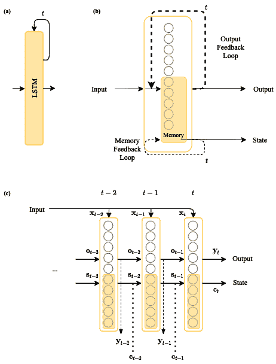

图 13.6。LSTM 的简化表示

模型还有很多，但最基本的元素显示在图 13.6 中。观察 LSTM 层如何从先前的时间步长接收先前的输出，还接收称为**状态**的东西，其充当一种类型的存储器。在图中，您可以看到当前的输出和状态对于下一层是可用的，如果需要的话，它们也可以在任何时候使用。

我们在图 13.6 中没有展示的一些东西包括 LSTM 记忆或遗忘的机制。对于初学者来说，在本书中解释这些可能很复杂。但是，此时您需要知道的是，有三种主要机制:

这些机制对于每一个单独的序列数据集都是可训练和优化的。但是为了展示使用 LSTM 作为递归层的优势，我们将重复与之前完全相同的代码，只是用 LSTM 来更改 RNN。

加载数据集和构建模型的代码如下:

```
from keras.datasets import imdb
from keras.preprocessing import sequence
from tensorflow.keras.models import Model
from tensorflow.keras.layers import LSTM, Embedding, BatchNormalization
from tensorflow.keras.layers import Dense, Activation, Input, Dropout

seqnc_lngth = 128
embddng_dim = 64
vocab_size = 10000

(x_train, y_train), (x_test, y_test) = imdb.load_data(num_words=vocab_size, 
                                                      skip_top=20)
x_train = sequence.pad_sequences(x_train, maxlen=seqnc_lngth).astype('float32')
x_test = sequence.pad_sequences(x_test, maxlen=seqnc_lngth).astype('float32')
```

该模型可以指定如下:

```
inpt_vec = Input(shape=(seqnc_lngth,))
l1 = Embedding(vocab_size, embddng_dim, input_length=seqnc_lngth)(inpt_vec)
l2 = Dropout(0.3)(l1)
l3 = LSTM(32)(l2)
l4 = BatchNormalization()(l3)
l5 = Dropout(0.2)(l4)
output = Dense(1, activation='sigmoid')(l5)

lstm = Model(inpt_vec, output)

lstm.compile(loss='binary_crossentropy', optimizer='adam', 
             metrics=['accuracy'])
lstm.summary()
```

这会产生以下输出:

```
Model: "functional"
_________________________________________________________________
Layer (type) Output Shape Param # 
=================================================================
input (InputLayer)          [(None, 128)] 0 
_________________________________________________________________
embedding (Embedding)       (None, 128, 64) 640000 
_________________________________________________________________
dropout_1 (Dropout)         (None, 128, 64) 0 
_________________________________________________________________
lstm (LSTM)                 (None, 32) 12416 
_________________________________________________________________
batch_normalization (Batch  (None, 32) 128 
_________________________________________________________________
dropout_2 (Dropout)         (None, 32) 0 
_________________________________________________________________
dense (Dense)               (None, 1) 33 
=================================================================
Total params: 652,577
Trainable params: 652,513
Non-trainable params: 64
```

这实质上复制了下图所示的模型:

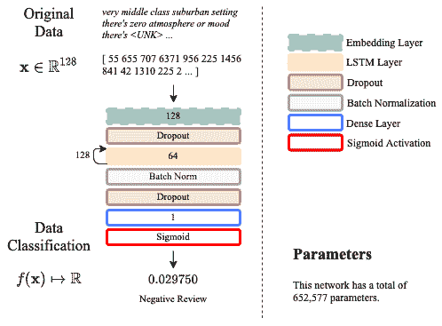

图 13.7。用于 IMDb 数据集的基于 LSTM 的神经架构

请注意，这个模型比简单的 RNN 方法多了近 10，000 个参数。但是，前提是这种参数的增加也要带来性能的提升。

然后我们像以前一样训练我们的模型，就像这样:

```
from tensorflow.keras.callbacks import ReduceLROnPlateau, EarlyStopping
import matplotlib.pyplot as plt

#callbacks
reduce_lr = ReduceLROnPlateau(monitor='val_loss', factor=0.5, patience=3, 
                              min_delta=1e-4, mode='min', verbose=1)

stop_alg = EarlyStopping(monitor='val_loss', patience=7, 
                         restore_best_weights=True, verbose=1)

#training
hist = lstm.fit(x_train, y_train, batch_size=100, epochs=1000, 
                callbacks=[stop_alg, reduce_lr], shuffle=True, 
                validation_data=(x_test, y_test))
```

接下来，我们保存模型并显示其性能，如下所示:

```
# save and plot training process
lstm.save_weights("lstm.hdf5")

fig = plt.figure(figsize=(10,6))
plt.plot(hist.history['loss'], color='#785ef0')
plt.plot(hist.history['val_loss'], color='#dc267f')
plt.title('Model Loss Progress')
plt.ylabel('Brinary Cross-Entropy Loss')
plt.xlabel('Epoch')
plt.legend(['Training Set', 'Test Set'], loc='upper right')
plt.show()
```

该代码将生成下图所示的图:

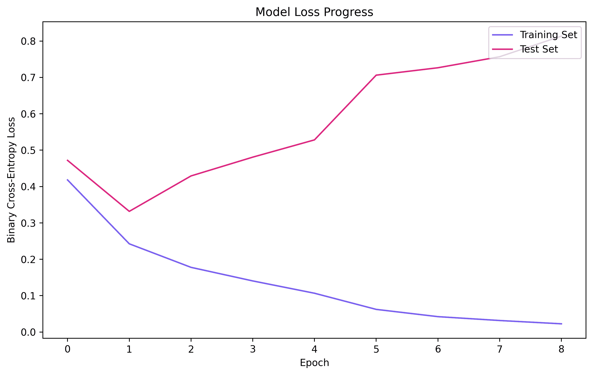

图 13.8。跨时代的损失训练 LSTM

从图中注意到，模型在**一个时期**后开始过度拟合。使用最佳点的训练模型，我们可以计算实际性能如下:

```
from sklearn.metrics import confusion_matrix
from sklearn.metrics import balanced_accuracy_score
from sklearn.metrics import roc_curve, auc
import matplotlib.pyplot as plt
import numpy as np

y_hat = lstm.predict(x_test)

# gets the ROC
fpr, tpr, thresholds = roc_curve(y_test, y_hat)
roc_auc = auc(fpr, tpr)

# plots ROC
fig = plt.figure(figsize=(10,6))
plt.plot(fpr, tpr, color='#785ef0', 
         label='ROC curve (AUC = %0.2f)' % roc_auc)
plt.plot([0, 1], [0, 1], color='#dc267f', linestyle='--')
plt.xlim([0.0, 1.0])
plt.ylim([0.0, 1.05])
plt.xlabel('False Positive Rate')
plt.ylabel('True Positive Rate')
plt.title('Receiver Operating Characteristic Curve')
plt.legend(loc="lower right")
plt.show()

# finds optimal threshold and gets ACC and CM
optimal_idx = np.argmax(tpr - fpr)
optimal_threshold = thresholds[optimal_idx]
print("Threshold value is:", optimal_threshold)
y_pred = np.where(y_hat>=optimal_threshold, 1, 0)
print(balanced_accuracy_score(y_test, y_pred))
print(confusion_matrix(y_test, y_pred))
```

这将产生下图所示的 ROC:

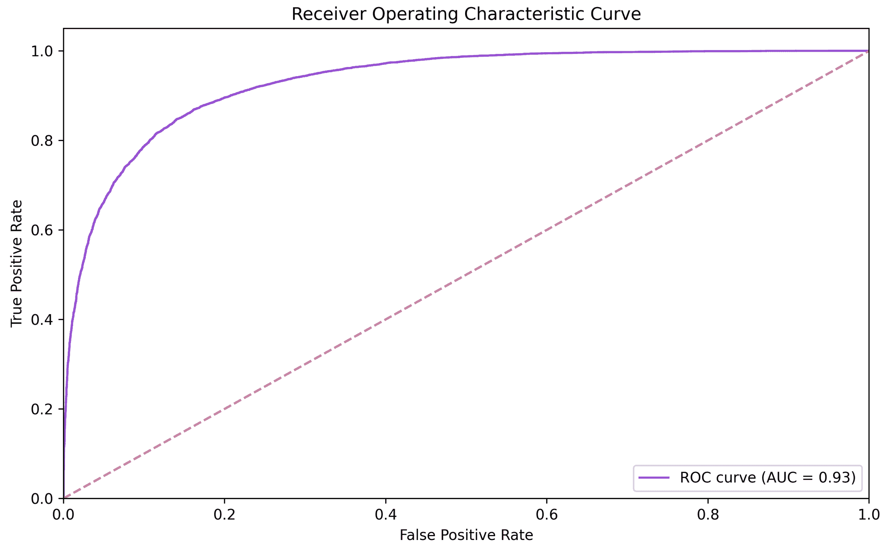

图 13.9。LSTM 建筑的 ROC 曲线

从该图中，我们可以看到模型中有轻微的增益，当简单 RNN 模型的 AUC 为 0.92 时，产生了 0.93 的 AUC。

当查看由前面的代码生成的平衡精度和混淆矩阵时，会显示如下数字:

```
Threshold value is: 0.44251397
0.8544400000000001
[[10459 2041]
 [ 1598 10902]]
```

在这里，我们可以看到准确率为 85.44%，比简单的 RNN 提高了约 2%。我们进行这个实验只是为了表明，通过转换 RNN 模型，我们可以很容易地看到改进。当然，还有其他方法来改进模型，例如以下方法:

*   增加/减少词汇量
*   增加/减少序列长度
*   增加/减少嵌入尺寸
*   增加/减少循环层中的神经单元

除此之外可能还有其他人。

到目前为止，您已经看到了如何获取文本表示(电影评论)，这是一个常见的 NLP 任务，并找到了一种方法来在一个空间中表示这些内容，您可以将它们分为负面或正面评论。我们通过嵌入和 LSTM 层做到了这一点，但在最后，有一个致密层，其中一个神经元给出最终输出。我们可以认为这是从文本空间到一维空间的映射，在一维空间中我们可以执行分类。我们这样说是因为考虑这些映射有三种主要方式:

*   **序列到向量**:就像这里的例子一样，将序列映射到一个 *n-* 维空间。
*   **向量到序列**:这走相反的路，从一个 *n* 维空间到一个序列。
*   **序列到序列**:这是从一个序列到一个序列的映射，通常中间经过一个 *n* 维的映射。

为了举例说明这些事情，我们将在下一节中使用自编码器架构和 MNIST。

# 序列到向量模型

在上一节中，您*在技术上*看到了一个序列到向量的模型，它采用一个序列(代表单词的数字)并映射到一个向量(一维对应于一个电影评论)。然而，为了进一步理解这些模型，我们将回到 MNIST 作为输入源来构建一个模型，该模型将采用一个 MNIST 数并将其映射到一个潜在向量。

## 无监督模型

让我们在下图所示的自编码器架构中工作。我们以前研究过自编码器，现在我们将再次使用它们，因为我们了解到它们在寻找矢量表示(潜在空间)方面非常强大，这些表示是鲁棒的，由无监督学习驱动:


图 13.10。基于 LSTM 的 MNIST 自编码器架构

这里的目标是获取一幅图像并找到它的潜在表示，在图 13.10 的例子中，它是二维的。然而，您可能会想:图像怎么会是一个序列呢？

我们可以将图像理解为一系列行或一系列列。假设我们将一个 28×28 像素的二维图像解释为一系列行；我们可以把每一行从上到下看成一个由 28 个向量组成的序列，每个向量的维数都是 1x28。这样，我们可以使用 LSTM 来处理这些序列，利用 LSTM 理解序列中时间关系的能力。这意味着，例如在 MNIST 的情况下，图像中的特定行看起来像前一行或下一行的可能性非常高。

请进一步注意，图 13.10 中的*提出的模型不像我们之前处理文本时那样需要嵌入层。回想一下，在处理文本时，我们需要将每个词嵌入(向量化)到一个向量序列中。然而，对于图像，它们已经是矢量序列，这消除了对嵌入层的需要。*

除了两个有用的数据操作工具之外，我们将在此展示的代码没有什么新内容:

*   这将允许我们任意重复一个向量。它有助于解码器(参见*图 13.10* )从一个向量转换成一个序列。
*   `TimeDistributed()`:这将允许我们为一个序列的每个元素分配一个特定类型的层。

这两件是`tensorflow.keras.layers`系列的一部分。这些在下面的代码中实现:

```
from tensorflow.keras.models import Model
from tensorflow.keras.layers import Dense, Activation, Input
from tensorflow.keras.layers import BatchNormalization, Dropout
from tensorflow.keras.layers import Embedding, LSTM
from tensorflow.keras.layers import RepeatVector, TimeDistributed
from tensorflow.keras.datasets import mnist
from tensorflow.keras.callbacks import ReduceLROnPlateau, EarlyStopping
import numpy as np

seqnc_lngth = 28    # length of the sequence; must be 28 for MNIST
ltnt_dim = 2        # latent space dimension; it can be anything reasonable

(x_train, y_train), (x_test, y_test) = mnist.load_data()

x_train = x_train.astype('float32') / 255.
x_test = x_test.astype('float32') / 255.

print('x_train shape:', x_train.shape)
print('x_test shape:', x_test.shape)
```

加载数据后，我们可以如下定义模型的编码器部分:

```
inpt_vec = Input(shape=(seqnc_lngth, seqnc_lngth,))
l1 = Dropout(0.1)(inpt_vec)
l2 = LSTM(seqnc_lngth, activation='tanh', 
          recurrent_activation='sigmoid')(l1)
l3 = BatchNormalization()(l2)
l4 = Dropout(0.1)(l3)
l5 = Dense(ltnt_dim, activation='sigmoid')(l4)

# model that takes input and encodes it into the latent space
encoder = Model(inpt_vec, l5)
```

接下来，我们可以将模型的解码器部分定义如下:

```
l6 = RepeatVector(seqnc_lngth)(l5)
l7 = LSTM(seqnc_lngth, activation='tanh', recurrent_activation='sigmoid', 
          return_sequences=True)(l6)
l8 = BatchNormalization()(l7)
l9 = TimeDistributed(Dense(seqnc_lngth, activation='sigmoid'))(l8)

autoencoder = Model(inpt_vec, l9)
```

最后，我们像这样编译和训练模型:

```
autoencoder.compile(loss='binary_crossentropy', optimizer='adam')
autoencoder.summary()

reduce_lr = ReduceLROnPlateau(monitor='val_loss', factor=0.5, patience=5, 
                              min_delta=1e-4, mode='min', verbose=1)

stop_alg = EarlyStopping(monitor='val_loss', patience=15, 
                         restore_best_weights=True, verbose=1)

hist = autoencoder.fit(x_train, x_train, batch_size=100, epochs=1000, 
                       callbacks=[stop_alg, reduce_lr], shuffle=True, 
                       validation_data=(x_test, x_test))
```

代码应该打印以下输出，对应于数据集的维度、模型参数的摘要，然后是训练步骤，为了节省空间，我们省略了这些步骤:

```
x_train shape: (60000, 28, 28)
x_test shape: (10000, 28, 28)

Model: "functional"
_________________________________________________________________
Layer (type)               Output Shape      Param # 
=================================================================
input (InputLayer)         [(None, 28, 28)]  0 
_________________________________________________________________
dropout_1 (Dropout)        (None, 28, 28)    0 
_________________________________________________________________
lstm_1 (LSTM)              (None, 28)        6384 
_________________________________________________________________
batch_normalization_1 (Bat (None, 28)        112 
_________________________________________________________________
.
.
.
time_distributed (TimeDist (None, 28, 28)    812 
=================================================================
Total params: 10,950
Trainable params: 10,838
Non-trainable params: 112
_________________________________________________________________

Epoch 1/1000
600/600 [==============================] - 5s 8ms/step - loss: 0.3542 - val_loss: 0.2461
.
.
.

```

模型最终会收敛到一个谷底，在那里被回调自动停止。在这之后，我们可以简单地调用`encoder`模型将任何有效的序列(例如，MNIST 图像)转换成一个向量，这是我们接下来要做的。

## 结果

我们可以调用`encoder`模型将任何有效的序列转换成向量，如下所示:

```
encoder.predict(x_test[0:1])
```

这将产生一个二维矢量，其值对应于序列`x_test[0]`的矢量表示，这是 MNIST 测试集的第一幅图像。它可能看起来像这样:

```
array([[3.8787320e-01, 4.8048562e-01]], dtype=float32)
```

但是，请记住，这个模型是在没有监督的情况下训练的，因此，这里显示的数字肯定会有所不同！编码器模型实际上就是我们的序列到向量模型。autoencoder 模型的其余部分用于进行重建。

如果您想知道 autoencoder 模型如何能够从只有两个值的矢量中重建 28x28 的图像，或者如果您想知道 MNIST 的整个测试集在学习到的二维空间中投影时会是什么样子，您可以运行以下代码:

```
import matplotlib.pyplot as plt
import numpy as np

x_hat = autoencoder.predict(x_test)

smp_idx = [3,2,1,18,4,8,11,0,61,9]      # samples for 0,...,9 digits
plt.figure(figsize=(12,6))
for i, (img, y) in enumerate(zip(x_hat[smp_idx].reshape(10, 28, 28), y_test[smp_idx])):
  plt.subplot(2,5,i+1)
  plt.imshow(img, cmap='gray')
  plt.xticks([])
  plt.yticks([])
  plt.title(y)
plt.show()
```

它显示原始数字的样本，如图 11 所示。

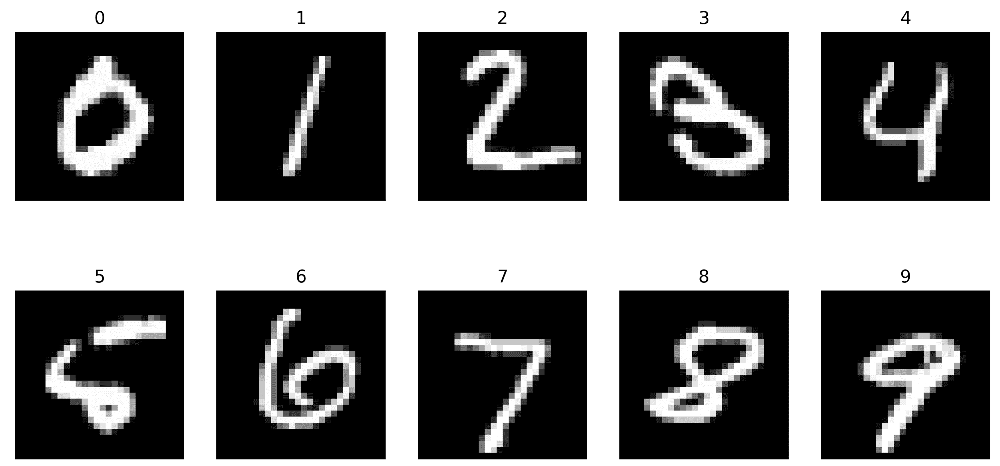

图 11。MNIST 原始数字 0-9

以下代码产生重构数字的样本:

```
plt.figure(figsize=(12,6))
for i, (img, y) in enumerate(zip(x_test[smp_idx].reshape(10, 28, 28), y_test[smp_idx])):
  plt.subplot(2,5,i+1)
  plt.imshow(img, cmap='gray')
  plt.xticks([])
  plt.yticks([])
  plt.title(y)
plt.show()
```

重建的数字如*图 12:* 所示

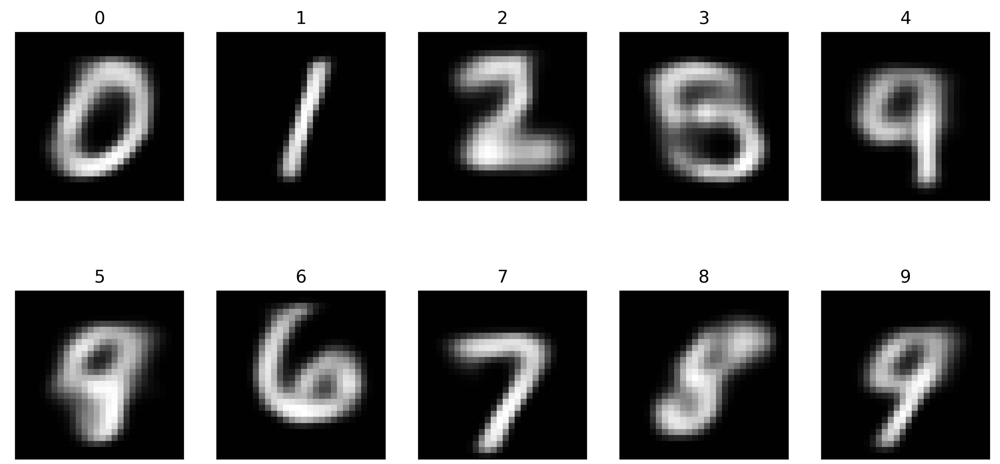

图 12。MNIST 用 LSTM 的自编码器重建了数字 0-9

下一段代码将显示原始数据投射到潜在空间的散点图，如图*图 13* 所示:

```
y_ = list(map(int, y_test))
X_ = encoder.predict(x_test)

plt.figure(figsize=(10,8))
plt.title('LSTM-based Encoder')
plt.scatter(X_[:,0], X_[:,1], s=5.0, c=y_, alpha=0.75, cmap='tab10')
plt.xlabel('First encoder dimension')
plt.ylabel('Second encoder dimension')
plt.colorbar()
```

回想一下，由于自编码器不受监督的特性，这些结果可能会有所不同。类似地，学习的空间可以在视觉上想象成如图*图 13* 所示，其中每个点对应于一个序列(MNIST 数字),该序列是一个二维向量:

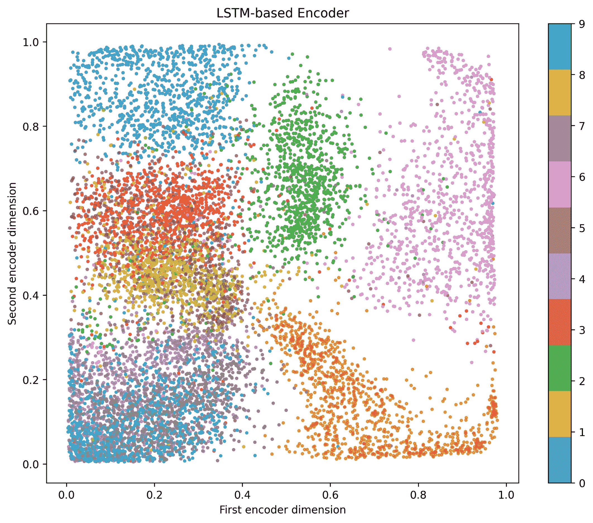

图 13。基于 MNIST 数据集的学习向量空间

从*图 13* 中，我们可以看到，即使重建仅基于二维向量，序列-向量模型也能正常工作。我们将在下一节看到更大的表示。然而，你需要知道序列到向量模型在过去几年里非常有用[张，z .，*等* (2017)]。

另一个有用的策略是创建向量到序列模型，这是从向量表示到序列表示。在自编码器中，这将对应于解码器部分。让我们接着讨论这个问题。

# 向量到序列模型

如果你回头看*图 10* ，向量到序列模型将对应于解码器漏斗形状。主要的理念是，大多数模型通常可以从大量输入到丰富的表示，而不会有任何问题。然而，直到最近，机器学习社区才非常成功地重新获得了从向量产生序列的牵引力(Goodfellow，I .，et al. (2016))。

你可以再次想到图 10 中的*和模型，它将从原始序列中产生一个序列。在这一节中，我们将重点放在第二部分，解码器，并使用它作为一个向量到序列模型。然而，在我们去那里之前，我们将介绍 RNN 的另一个版本，双向 LSTM。*

## 双向 LSTM

一个**双向 LSTM** ( **BiLSTM** )，简单来说，就是一个分析向前和向后的序列的 LSTM，如图*图 14* 所示:

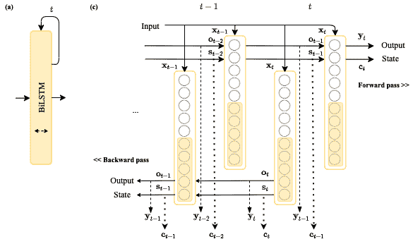

图 14。双向 LSTM 表示

考虑以下向前和向后分析的序列示例:

*   一个在自然声音中分析的音频序列，然后倒回去(有些人这样做是为了寻找*潜意识*信息)。
*   一个文本序列，如一个句子，被分析用于向前的良好风格，也用于向后的良好风格，因为一些模式(至少在英语和西班牙语中)向后引用；例如，指出现在句首的主语的动词。
*   从上到下、从下到上、从一边到另一边、从后到后都有特殊形状的图像；如果你从上到下思考数字 9，传统的 LSTM 可能会忘记顶部的圆形部分，而记住底部的细长部分，但 BiLSTM 可能会通过从上到下和从下到上来回忆数字的两个重要方面。

从*图 14 (b)* 中，我们还可以观察到正向和反向传递的状态和输出在序列中的任何点都是可用的。

我们可以通过简单地调用简单 LSTM 层周围的`Bidirectional()`包装器来实现双向 LSTM。然后，我们将采用图 10 中的*架构，并将其修改为:*

*   潜在空间的 100 个维度
*   取代 LSTM 层的 BiLSTM
*   从潜在空间进入解码器的附加脱落层

新的架构将看起来像图 15 所示:

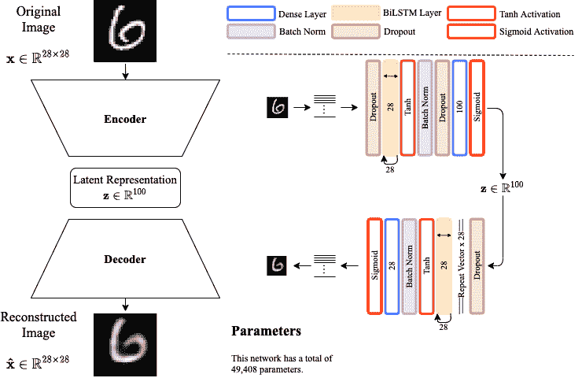

图 15。实现 BiLSTMs，以期建立一个从向量到序列的模型

回想一下，这里最重要的一点是使潜在空间(向量到序列模型的输入)尽可能丰富，以便生成更好的序列。我们试图通过增加潜在空间维度和增加 BiLSTMS 来实现这一点。让我们继续实现它，看看结果。

## 实现情况和结果

实现图 15 中*架构的代码如下:*

```
from tensorflow.keras.models import Model
from tensorflow.keras.layers import Dense, Activation, Input
from tensorflow.keras.layers import BatchNormalization, Dropout
from tensorflow.keras.layers import Bidirectional, LSTM
from tensorflow.keras.layers import RepeatVector, TimeDistributed
from tensorflow.keras.datasets import mnist
from tensorflow.keras.callbacks import ReduceLROnPlateau, EarlyStopping
import numpy as np

seqnc_lngth = 28
ltnt_dim = 100 

(x_train, y_train), (x_test, y_test) = mnist.load_data()

x_train = x_train.astype('float32') / 255.
x_test = x_test.astype('float32') / 255.
```

我们将模型的编码器部分定义如下:

```
inpt_vec = Input(shape=(seqnc_lngth, seqnc_lngth,))
l1 = Dropout(0.5)(inpt_vec)
l2 = Bidirectional(LSTM(seqnc_lngth, activation='tanh', 
                        recurrent_activation='sigmoid'))(l1)
l3 = BatchNormalization()(l2)
l4 = Dropout(0.5)(l3)
l5 = Dense(ltnt_dim, activation='sigmoid')(l4)

# sequence to vector model
encoder = Model(inpt_vec, l5, name='encoder')
```

该模型的解码器部分可以定义如下:

```
ltnt_vec = Input(shape=(ltnt_dim,))
l6 = Dropout(0.1)(ltnt_vec)
l7 = RepeatVector(seqnc_lngth)(l6)
l8 = Bidirectional(LSTM(seqnc_lngth, activation='tanh', 
                   recurrent_activation='sigmoid', 
                   return_sequences=True))(l7)
l9 = BatchNormalization()(l8)
l10 = TimeDistributed(Dense(seqnc_lngth, activation='sigmoid'))(l9)

# vector to sequence model
decoder = Model(ltnt_vec, l10, name='decoder')
```

接下来，我们编译自编码器并训练它:

```
recon = decoder(encoder(inpt_vec))
autoencoder = Model(inpt_vec, recon, name='ae')

autoencoder.compile(loss='binary_crossentropy', optimizer='adam')
autoencoder.summary()

reduce_lr = ReduceLROnPlateau(monitor='val_loss', factor=0.5, patience=5, 
                              min_delta=1e-4, mode='min', verbose=1)

stop_alg = EarlyStopping(monitor='val_loss', patience=15, 
                         restore_best_weights=True, verbose=1)

hist = autoencoder.fit(x_train, x_train, batch_size=100, epochs=1000, 
                       callbacks=[stop_alg, reduce_lr], shuffle=True, 
                       validation_data=(x_test, x_test))
```

这里没有什么新东西，除了前面已经解释过的使用的`Bidirectional()`包装器。输出应该生成完整自编码器模型和完整训练操作的摘要，如下所示:

```
Model: "ae"
_________________________________________________________________
Layer (type)          Output Shape     Param # 
=================================================================
input (InputLayer)    [(None, 28, 28)] 0 
_________________________________________________________________
encoder (Functional)  (None, 100)      18692 
_________________________________________________________________
decoder (Functional)  (None, 28, 28)   30716 
=================================================================
Total params: 49,408
Trainable params: 49,184
Non-trainable params: 224
_________________________________________________________________
Epoch 1/1000
600/600 [==============================] - 9s 14ms/step - loss: 0.3150 - val_loss: 0.1927
.
.
.
```

现在，在大量的无监督学习之后，训练将自动停止，我们可以使用`decoder`模型作为我们的向量到序列模型。但在此之前，我们可能希望通过运行与之前相同的代码来快速检查重建的质量，以生成下图所示的图像:

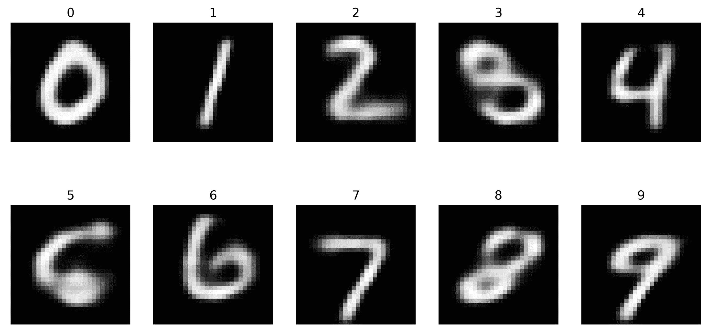

图 16。用 BiLSTM 自编码器重构 MNIST 数字

如果您比较*图 11* 和*图 16* ，您会注意到，与图 12 图*中之前的模型重建相比，重建效果更好，细节层次更高。*

现在，我们可以使用任何兼容的向量直接调用我们的向量到序列模型，如下所示:

```
z = np.random.rand(1,100)
x_ = decoder.predict(z)
print(x_.shape)
plt.imshow(x_[0], cmap='gray')
```

这产生了以下输出和图 17 中的图:

```
(1, 28, 28)
```

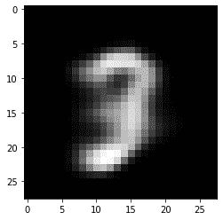

图 17。由模型从随机向量产生的序列

您可以生成任意数量的随机向量，并测试您的向量到序列模型。另一个有趣的观察点是序列到序列模型，我们将在下一步讨论。

# 序列间模型

一位谷歌大脑科学家(Vinyals，o .等人(2015))写道:

“由于循环神经网络的复兴，序列已经成为监督学习中的一等公民。许多需要从一个观察序列映射或映射到一个观察序列的复杂任务现在可以用**序列到序列** ( **seq2seq** )框架来制定，该框架采用链规则来有效地表示序列的联合概率。”

这是惊人的正确，因为现在应用程序已经增长。只需考虑以下序列到序列项目的想法:

*   文档摘要。输入序列:一个文档。输出序列:一个摘要。
*   图像超分辨率。输入序列:低分辨率图像。输出序列:高分辨率图像。
*   视频字幕。输入序列:视频。输出序列:文本标题。
*   机器翻译。输入序列:源语言的文本。输出序列:目标语言的文本。

这些都是激动人心且极具挑战性的应用。如果您使用过在线翻译器，那么您很可能使用了某种序列对序列模型。

在本节中，为了简单起见，我们将继续使用*图 15* 中的自编码器作为我们的主要关注点，但只是为了确保我们在序列间模型的通用性方面达成一致，我们将指出以下注意事项:

*   序列到序列模型可以跨域映射；例如，视频到文本或文本到音频。
*   序列到序列模型可以在不同维度上映射；例如，为了压缩，从低分辨率图像到高分辨率图像，反之亦然。
*   序列到序列模型可以使用许多不同的工具，如密集层、卷积层和递归层。

考虑到这一点，您可以根据您的应用程序构建一个序列到序列的模型。现在，我们将回到图 15 的*中的模型，并展示自编码器是一个序列到序列的模型，它接受一个图像的一系列行，并产生另一个图像的一系列行。由于这是一个自编码器，输入和输出尺寸必须匹配。*

我们将把先前训练的序列到序列模型(autoencoder)的展示限制在以下短代码片段，该代码片段基于上一节中的代码:

```
plt.figure(figsize=(12,6))
for i in range(10):
  plt.subplot(2,5,i+1)
  rnd_vec = np.round(np.mean(x_test[y_test==i],axis=0))   #(a)
  rnd_vec = np.reshape(rnd_vec, (1,28,28))                #(b)
  z = encoder.predict(rnd_vec)                            #(c)
  decdd = decoder.predict(z)                              #(d)
  plt.imshow(decdd[0], cmap='gray')
  plt.xticks([])
  plt.yticks([])
  plt.title(i)
plt.show()
```

让我们解释其中的一些步骤。在 *(a)* 中，我们计算每个单个数的平均序列；这是对以下问题的回答:既然随机操作如此简单，我们可以用什么作为输入序列呢？嗯，使用平均序列来形成测试集听起来很有趣。

接下来， *(b)* 就是简单的让输入与编码器输入尺寸兼容。然后， *(c)* 取平均序列并从中生成一个向量。最后， *(d)* 使用该向量重新创建序列，生成下图所示的图:

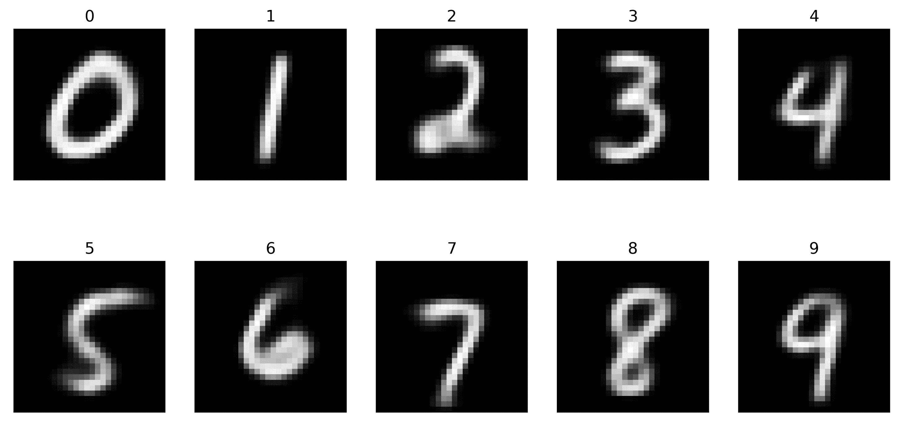

图 18。序列间示例输出

从图中，您可以很容易地观察到与手写数字一致的定义良好的模式，这些模式是由双向 LSTMs 生成的行序列。

在我们结束这个之前，让我们来谈谈这些模型的伦理含义。

# 伦理含义

随着递归模型的复苏及其在序列中捕获时间信息的适用性，存在发现未被适当公平分布的潜在空间的风险。这在无监督的模型中具有更高的风险，这些模型在没有适当管理的数据中操作。如果你仔细想想，这个模型并不关心它所发现的关系；它只关心最小化损失函数，因此，如果用 20 世纪 50 年代的杂志或报纸对它进行训练，它可能会发现单词“women”可能接近(就欧几里德距离而言)家务劳动单词，如“扫帚”、“盘子”和“烹饪”，而单词“man”可能接近所有其他劳动，如“驾驶”、“教学”、“医生”和“科学家”。这是一个已经被引入潜在空间的偏差的例子(Shin，s .，等(2020))。

这里的风险是，向量到序列或序列到序列模型将发现，将医生与男人联系起来比与女人联系起来容易得多，与女人做饭比与男人联系起来容易得多，这只是举几个例子。你也可以把这种方法应用到人脸图像中，发现某些具有某些特征的人可能会被错误地联系起来。这就是为什么进行我们在这里所做的分析是如此的重要，尽可能的可视化潜在空间，尝试观察模型的输出，等等。

这里的关键是，虽然这里讨论的模型非常有趣和强大，但它们也有风险，可以了解我们的社会中特别被认为是不需要的东西。如果风险存在且未被发现，可能会导致偏见(Amini，a .等人(2019))。如果偏见没有被发现，它可能会导致几种形式的歧视。请永远小心这些事情，以及超出你自己的社会背景的事情。

# 摘要

这一高级章节向您展示了如何创建 rnn。您了解了 LSTMs 及其双向实现，这是处理具有远距离时间相关性的序列的最强大的方法之一。您还学习了如何创建一个基于 LSTM 的情感分析模型来对电影评论进行分类。您设计了一个自编码器，使用简单的双向 LSTMs 学习 MNIST 的潜在空间，并将其用作向量到序列模型和序列到序列模型。

在这一点上，你应该有信心解释 RNNs 中记忆背后的动机，因为需要更健壮的模型。使用 Keras/TensorFlow 编写自己的循环网络，你应该会感觉很舒服。此外，您应该有信心实现有监督和无监督的循环网络。

LSTMs 非常适合编码高度相关的空间信息，如图像、音频或文本，就像 CNN 一样。然而，CNN 和 LSTMs 都学习可能缺乏多样性的非常具体的潜在空间。如果有一个恶意的黑客试图破坏你的系统，这可能会导致一个问题；如果您的模型非常特定于您的数据，它可能会对变化产生一定的敏感性，从而导致输出中的灾难性后果。自编码器通过使用称为变分自编码器的生成方法来解决这个问题，变分自编码器学习数据的分布而不是数据本身。然而，问题仍然存在:我们如何在不一定是自编码器的其他类型的网络中实现这种生成方法的思想？要找出答案，你不能错过下一章，[第十四章](7b09fe4b-078e-4c57-8a81-dc0863eba43d.xhtml)，*生成神经网络*。下一章将介绍一种克服神经网络脆弱性的方法，通过攻击它们并教会它们变得更加健壮。但是在你走之前，用下面的问题来测试你自己。

# 问题和答案

1.  **如果 CNN 和 lstm 都可以模拟空间相关数据，lstm 的优势是什么？**

除了 LSTMs 有记忆的事实之外，没有其他的。但是在某些应用程序中，比如 NLP，当你向前和向后移动时，一个句子被连续地发现，在开头、中间和结尾有对某些单词的引用，并且一次有多个。BiLSTMs 比 CNN 更容易模拟这种行为。CNN 可能会学着这么做，但相比之下可能要花更长的时间。

2.  **增加更多的递归层是否会使网络变得更好？**

不。这只会让事情变得更糟。建议保持简单，不要超过三层，除非你是一个科学家，正在尝试一些新的东西。否则，在编码器模型中，一行中的重复层不应超过三个。

3.  【LSTMs 还有哪些应用？

音频处理和分类；图像去噪；图像超分辨率；文本摘要和其他文本处理和分类任务；单词补全；聊天机器人；文本完成；文本生成；音频生成；图像生成。

4.  看起来 LSTMs 和 CNN 有相似的应用。是什么让你选择了一个而不是另一个？

LSTMs 收敛更快；因此，如果时间是一个因素，LSTMs 更好。CNN 比 LSTMs 更稳定；因此，如果您的输入非常不可预测，LSTM 可能会将问题带到循环层，每次都变得更糟，在这种情况下，CNN 可以通过池化来缓解这种情况。就个人而言，对于图像相关的应用程序，我通常首先尝试 CNN，对于 NLP 应用程序，我通常首先尝试 LSTMs。

# 参考

*   鲁梅尔哈特、辛顿和威廉姆斯(1986)。*通过反向传播误差学习表示*。*性质*，323(6088)，533-536。
*   Mikolov，Sutskever，I .，Chen，k .，Corrado，G. S .，和 Dean，J. (2013 年)。*词语的分布式表示及其组合性*。在*神经信息处理系统的进展*(第 3111-3119 页)。
*   Pennington、r . Socher 和 c . d . Manning(2014 年 10 月)。 *Glove:单词表示的全局向量*。在*2014 年自然语言处理经验方法会议论文集* (EMNLP)(第 1532-1543 页)。
*   Rivas p .和 Zimmermann m .(2019 年 12 月)。*用于英语句子质量评估的句子嵌入实证研究*。在 *2019 计算科学与计算智能国际会议* (CSCI)(第 331-336 页)。IEEE。
*   hoch Reiter s .和 schmid Huber j .(1997 年)。*长短期记忆*。*神经计算*，9(8)，1735-1780。
*   张、刘、韩和舒勒(2017)。*学习用于声学事件分类的音频序列表示*。 *arXiv 预印本* arXiv:1707.08729。
*   I .古德费勒、y .本吉奥和 a .库维尔(2016 年)。*序列建模:递归和递归网*。*深度学习*，367-415。
*   Vinyals、s . beng io 和 m . kud lur(2015 年)。*排序事项:对器械包进行排序*。 *arXiv 预印本* arXiv:1511.06391。
*   Shin，s .，Song，k .，Jang，j .，Kim，h .，Joo，w .，和 Moon，I. C. (2020 年)。*用潜在的解纠缠和反事实生成来中和词嵌入中的性别偏见*。arXiv 预印本 arXiv:2004.03133。
*   Amini，a .，Soleimany，A. P .，Schwarting，w .，Bhatia，S. N .，Rus，2019 年 1 月)。*通过学习到的潜在结构发现并减轻算法偏差*。在*2019 年 AAAI/美国计算机学会人工智能、伦理与社会会议论文集*(第 289-295 页)。