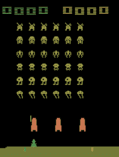
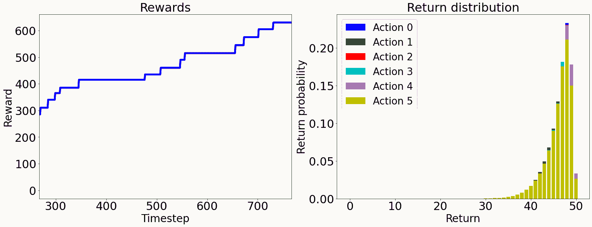
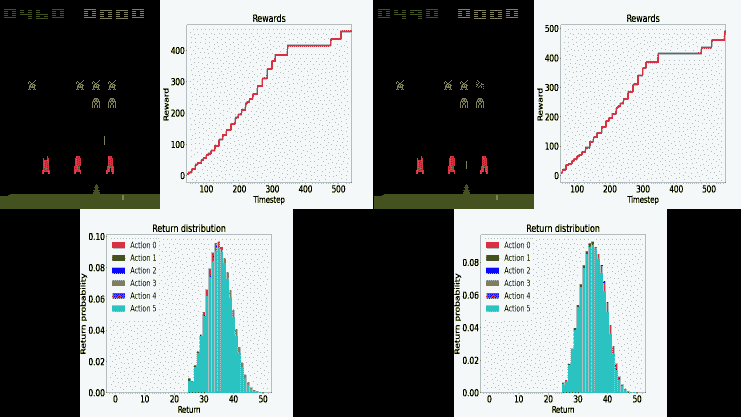

我们一起经历了一段旅程，如果你读到这里，你应该好好犒劳一下自己。你的成就应该得到承认。告诉你的朋友，分享你学到的东西，记得要一直坚持学习。深度学习是一个快速变化的领域；你不能坐着不动。这最后一章将向你简要介绍深度学习中一些新的令人兴奋的话题和机会。如果你想继续学习，我们将向你推荐来自 Packt 的其他有用资源，帮助你在这一领域取得进展。在这一章的最后，你会知道在学习了深度学习的基础知识之后，从这里该何去何从；你会知道 Packt 为你继续深度学习的培训提供了哪些其他资源。

本章分为以下几节:

*   寻找深度学习的高级主题
*   从 Packt 学习更多资源

# 寻找深度学习的高级主题

深度学习的未来目前很难预测；事情变化很快。然而，我相信，如果你在深度学习的当前高级主题上投入时间，你可能会看到这些领域在不久的将来蓬勃发展。

接下来的小节讨论了一些高级主题，这些主题有可能在我们的领域蓬勃发展并具有破坏性。

## 深度强化学习

鉴于深度卷积网络和其他类型的深度网络为过去难以解决的问题提供了解决方案，深度强化学习 ( **DRL** )是一个最近获得大量关注的领域。DRL 的许多用途是在我们无法拥有所有可能想到的情况的数据的奢侈领域，例如太空探索、玩视频游戏或无人驾驶汽车。

让我们详细阐述后一个例子。如果我们使用传统的监督学习来制造一辆自动驾驶汽车，它可以带我们从 A 点到 B 点而不发生碰撞，我们不仅希望有成功旅程事件的积极类的例子，而且我们还需要有糟糕事件(如碰撞和糟糕驾驶)的消极类的例子。想想看:我们需要撞尽可能多的车来保持数据集的平衡。这是不可接受的；然而，强化学习来拯救。

DRL 旨在**奖励**良好的驾驶方面；模特们知道会有回报，所以我们不需要反面的例子。相比之下，传统的学习需要撞车来惩罚不好的结果。

当你使用 DRL 学习使用模拟器时，你可以获得可以在模拟飞行中击败飞行员的 AI([https://fortune . com/2020/08/20/f-16-fighter-pilot-vs-artificial-intelligence-simulation-DARPA/](https://fortune.com/2020/08/20/f-16-fighter-pilot-versus-artificial-intelligence-simulation-darpa/))，或者你可以获得可以在电子游戏模拟器上获胜的 AI。游戏世界对 DRL 来说是一个完美的测试场景。假设你要做一个 DRL 模型来玩著名游戏*太空入侵者*，如图*图 15.1*；你可以做一个奖励摧毁太空入侵者的模型。



图 15.1–太空入侵者视频游戏模拟器

如果你做一个传统的模型来教使用者**不死**，比如说，那么你还是会输，因为你最终会被来自太空的入侵。所以，防止入侵的最佳策略是不杀死和消灭太空入侵者。换句话说，你奖励了导致生存的行动，即快速摧毁太空入侵者，同时避免被他们的炸弹杀死。

2018 年，DRL 发布了一种新的研究工具，名为**多巴胺** (Castro，P. S .等人，2018)。多巴胺([https://github.com/google/dopamine](https://github.com/google/dopamine))意味着强化学习算法的快速原型。回到[第二章](0b6e1f9c-280c-4107-aa1b-862b99f991c8.xhtml)，*深度学习框架的设置和介绍*，我们要求你暂时安装多巴胺。我们只是想让你知道多巴胺有多简单，这样如果你感兴趣，你就可以继续尝试。在下面几行代码中，我们将简单地加载一个预先训练好的模型(代理)，并让它玩游戏。

这将确保安装了库，然后加载预先训练的代理:

```
!pip install -U dopamine-rl

!gsutil -q -m cp -R gs://download-dopamine-rl/colab/samples/rainbow/SpaceInvaders_v4/checkpoints/tf_ckpt-199.data-00000-of-00001 ./
!gsutil -q -m cp -R gs://download-dopamine-rl/colab/samples/rainbow/SpaceInvaders_v4/checkpoints/tf_ckpt-199.index ./
!gsutil -q -m cp -R gs://download-dopamine-rl/colab/samples/rainbow/SpaceInvaders_v4/checkpoints/tf_ckpt-199.meta ./
```

样本训练代理，在本例中称为`rainbow`，是由多巴胺的作者提供的，但是如果你愿意，你也可以训练你自己的。

下一步是让代理运行(即，根据奖励决定采取行动)许多步骤，比如说`1024`:

```
from dopamine.utils import example_viz_lib
example_viz_lib.run(agent='rainbow', game='SpaceInvaders', num_steps=1024,
                    root_dir='./agent_viz', restore_ckpt='./tf_ckpt-199',
                    use_legacy_checkpoint=True)
```

这段代码可能需要一段时间来运行。在内部，它连接到 PyGame，PyGame 是 Python 社区的游戏模拟器资源。它做了几个决定，避免了太空入侵(和死亡)。如图*图 15.2* 所示，该模型描述了跨时间步长获得的累积奖励以及所采取的每项行动的预计回报概率，如停止、向左移动、向右移动和射击:



图 15.2–左图:跨时间步长的模型计算回报。右图:每个动作的估计收益概率

其中一个有趣的事情是，你可以在任何时间步(帧)可视化代理，并使用图 15.2 中的*图作为参考，查看代理在特定时间步做了什么，以决定可视化哪个时间步。假设您想要可视化步骤 540 或 550；您可以这样做:*

```
from IPython.display import Image
frame_number = 540   # or 550
image_file = '/<path to current directory>/agent_viz/SpaceInvaders/rainbow/images/frame_{:06d}.png'.format(frame_number)
Image(image_file)
```

您用当前工作目录的路径替换`<path to current directory>`。这是因为我们需要一个绝对路径，否则我们可以使用一个带有`./`的相对路径来代替。

由此，不言而喻，所有帧都作为图像保存在`./agent_viz/SpaceInvaders/rainbow/images/`目录中。你可以单独展示它们，甚至制作一个视频。前面的代码生成了图 15.3 中所示的图像:



图 15.3–左侧:步骤 540。右:步骤 550

多巴胺就是这么简单。我们希望您能从强化学习中受到启发，并进一步研究。

## 自我监督学习

2018 年 ACM 图灵奖获得者之一 Yann LeCun 在 2020 年的 AAAI 大会上说:*“未来是自我监督的。”*他暗示这个领域令人兴奋，潜力巨大。

自我监督是一个相对较新的术语，用来脱离术语*无监督*。术语“无监督学习”可能会给人一种没有监督的印象，而事实上，无监督学习算法和模型通常比有监督模型使用更多的监督数据。以 MNIST 数据的分类为例。它使用 10 个标签作为监控信号。然而，在以完美重建为目的的自编码器中，每个像素都是一个监控信号，因此，例如，一幅 28×28 的图像有 784 个监控信号。

自我监督也用于表示结合了无监督和有监督学习的一些阶段的模型。例如，如果我们管道化一个在无监督的情况下学习表示的模型，那么我们可以在下游附加一个模型，它将学习对有监督的东西进行分类。

深度学习的许多最新进展都是在自我监督方面。如果你尝试学习更多关于自我监督学习算法和模型的知识，这将是一个很好的时间投资。

## 系统 2 算法

著名经济学家丹尼尔·卡内曼通过他的书*思考快与慢* (Kahneman，D. 2011)使双重过程理论变得流行起来。主要观点是，有一些高度复杂的任务，我们作为人类，擅长相对快速地开发，而且往往不需要想太多；比如喝水，吃东西，或者看着一个物体就认出来。这些过程由*系统 1* 完成。

然而，有些任务对于人类的大脑来说并不简单，这些任务需要我们全神贯注，比如在一条不熟悉的路上开车，看着一个不属于假设环境的奇怪物体，或者理解一幅抽象画。这些过程由*系统 2* 完成。2018 年 ACM 图灵奖的另一位获奖者 Yoshua Bengio 发表了这样的言论:深度学习一直非常擅长系统 1 任务，这意味着现有的模型可以识别物体，并相对容易地执行高度复杂的任务。然而，深度学习在系统 2 任务上没有取得太大进展。也就是说，深度学习的未来将是解决那些对人类来说非常复杂的任务，这可能需要将不同领域的不同模型与不同的学习类型相结合。胶囊神经网络可能是系统 2 任务的一个很好的替代解决方案(Sabour，s .等人 2017 *)* 。

由于这些原因，系统 2 算法将可能是深度学习的未来。

现在，让我们看看 Packt 提供的资源，它们可以帮助我们进一步研究这些想法。

# 从 Packt 学习更多资源

下面的书单并不是详尽无遗的，而是你下一步努力的起点。这些书是在这个领域备受关注的时候出版的。无论你的选择如何，你都不会失望。

## 强化学习

*   *深度强化学习实践第二版*，Maxim Lapan，2020。
*   *强化学习研讨会*，作者 Alessandro Palmas *等人*，2020 年。
*   *游戏的实践强化学习*，作者 Micheal Lanham，2020。
*   *PyTorch 1.x 强化学习食谱*，作者刘禹锡，2019。
*   *Python 强化学习*，作者 Sudharsan Ravichandiran，2019。
*   *用 Python 实现的强化学习算法*，作者 Andrea Lonza，2019。

## 自我监督学习

*   *无监督学习研讨会*，作者亚伦·琼斯*等人。艾尔。*，2020 年。
*   *用 Python 应用无监督学习*，作者 Benjamin Johnston *等人。艾尔。*，2019。
*   *Giuseppe Bonaccorso 于 2019 年发表的《使用 Python 进行动手无监督学习》*。

# 摘要

这最后一章简要介绍了深度学习中新的令人兴奋的主题和机会。我们讨论了强化学习、自我监督算法和系统 2 算法。我们还推荐了来自 Packt 的一些进一步的资源，希望你会想继续学习并在这个领域前进。至此，你应该知道从这里该何去何从，并对深度学习的未来有所启发。为了继续你的学习之旅，你应该了解该领域的其他推荐书籍。

你就是深度学习的未来，未来就是今天。勇往直前，让事情发生。

# 参考

*   卡斯特罗、莫伊特拉、盖拉达、库马尔和贝勒马尔(2018 年)。多巴胺:深度强化学习的研究框架。arXiv 预印本 arXiv:1812.06110。
*   卡尼曼博士(2011 年)。*思考，快与慢*。*麦克米伦*。
*   Sabour、n . Frosst 和 g . e . hint on(2017 年)。胶囊之间的动态路由。在*神经信息处理系统的进展*(第 3856-3866 页)。