# 一、为什么要深度学习？

本章将概述深度学习、深度学习的历史、深度学习的兴起及其在某些领域的最新进展。此外，我们将讨论挑战，以及其未来的潜力。

我们将回答深度学习的实际用户经常提出的几个关键问题，这些用户可能不具备机器学习背景。这些问题包括:

*   什么是**人工智能** ( **AI** )和深度学习？
*   深度学习或 AI 的历史是怎样的？
    *   深度学习有哪些重大突破？
    *   其近期上涨的主要原因是什么？
*   深度架构的动机是什么？
    *   为什么要求助于深度学习，为什么现有的机器学习算法不能解决眼前的问题？
    *   可以应用在哪些领域？
    *   深度学习的成功故事

*   深度学习的潜在未来是怎样的，目前的挑战是什么？

# 什么是 AI 和深度学习？

创造某种模仿我们自己的智能形式的梦想已经存在很久了。虽然它们大多出现在科幻小说中，但近几十年来，我们在实际建造智能机器方面逐渐取得了进展，这些机器可以像人类一样执行某些任务。这是一个叫做**人工智能**的区域。人工智能的起源或许可以追溯到帕米拉·麦科达克的书《会思考的机器》，她在书中将人工智能描述为一种古老的愿望，即锻造神。

深度学习是人工智能的一个分支，其目标是让机器学习更接近其最初的目标:人工智能。

它追求的路径是试图模仿新皮层神经元层的活动，新皮层是大脑中发生思维的 80%的区域。在人脑中，大约有 1000 亿个神经元和 100 ~ 1000 万亿个突触。

它学习层次结构以及表示和抽象级别，以理解来自各种源类型(如图像、视频、声音和文本)的数据模式。

较高级别的抽象被定义为较低级别的抽象的组合。之所以叫**深**是因为它有不止一种非线性特征变换的状态。深度学习的一个最大优势是能够自动学习多个抽象层次的特征表示。这允许系统学习从输入空间映射到输出空间的复杂函数，而不太依赖于人工制作的特征。此外，它还提供了预训练的可能性，即学习一组可用数据集的表示，然后将学习到的表示应用到其他领域。这可能有一些限制，例如能够获得足够好的质量数据用于学习。此外，当以贪婪的方式从大量无监督数据中学习时，深度学习表现良好。

下图是一个简化的**卷积神经网络** ( **CNN** ):

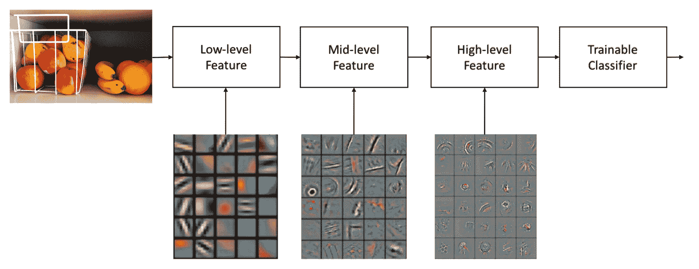

一个简化的卷积神经网络的图示，带有一个学习到的分层特征的图示

深度学习模型，即学习到的深度神经网络往往由多层组成。它们一起分层次地工作以构建改进的特征空间。第一层学习一阶特征，例如颜色和边缘。第二层学习高阶特征，比如角点。第三层学习小补丁或纹理。图层通常在无监督模式下学习，并发现输入空间的一般特征。然后将最终的图层特征输入到监督图层中，以完成分类或回归等任务。

在层之间，节点通过加权边连接。每个节点可以被看作是一个模拟的大脑皮层，与一个激活函数相关联，其输入来自较低层的节点。然而，构建如此庞大的多层神经元样信息流阵列是一个十年前的想法。从创立到最近的成功，它经历了突破和挫折。

随着数学公式的最新改进，越来越强大的计算机和大规模数据集，春天终于来了。深度学习已经成为当今科技世界的一个支柱，并被应用于广泛的领域。在下一节中，我们将追溯它的历史，讨论它不可思议的旅程中的起起落落。

# 深度学习的历史和兴起

最早的神经网络是在 20 世纪 40 年代开发的，在人工智能研究出现后不久。1943 年，一篇名为*神经活动中固有的逻辑思想演算*的开创性论文发表，该论文提出了神经网络的第一个数学模型。该模型的单元是一个简单的形式化神经元，通常被称为麦卡洛克-皮茨神经元。它是一个数学函数，被认为是一个生物神经元的模型，一个神经网络。它们是人工神经网络中的基本单元。下图显示了一个人工神经元。这样的想法看起来确实很有希望，因为他们试图模拟人脑的工作方式，但采用了一种非常简化的方式:

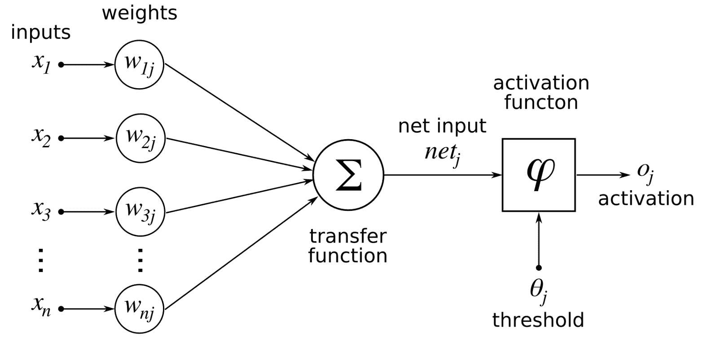

人工神经元模型的图解(来源:https://commons . wikimedia . org/wiki/File:artificial neuron model _ English . png)

这些早期的模型只包括非常小的一组虚拟神经元，一个叫做**的随机数权重**被用来连接它们。这些权重决定了每个模拟神经元之间如何传递信息，即每个神经元如何响应，取值在 0 到 1 之间。利用这种数学表示，神经输出可以表示图像的边缘或形状，或者音素中一个频率的特定能量水平。上图，*一个人工神经元模型的图示，*图示了一个数学上公式化的人工神经元，其中输入对应于树突，激活函数控制神经元在达到阈值时是否触发，输出对应于轴突。然而，早期的神经网络一次只能模拟非常有限数量的神经元，因此使用这样一个简单的架构可以识别的模式并不多。这些模式在 20 世纪 70 年代逐渐消失。

反向传播的概念，即在训练深度学习模型中使用错误，最早是在 20 世纪 60 年代提出的。接下来是具有多项式激活函数的模型。使用一个缓慢的手动过程，从每一层中统计选择的最佳特征被传送到下一层。不幸的是，随后第一个人工智能冬天开始了，持续了大约 10 年。在这个早期阶段，尽管模仿人脑的想法听起来非常花哨，但人工智能程序的实际能力非常有限。即使是最令人印象深刻的也只能处理一些玩具问题。更不用说他们的计算能力非常有限，而且只有很小的数据集可用。严冬的发生主要是因为期望太高，而当结果未能实现时，艾受到了批评，资金也消失了:

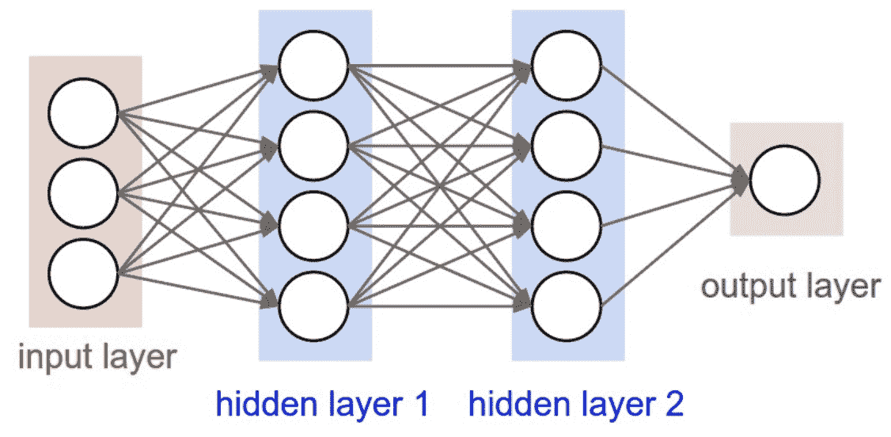

多层感知器神经网络中人工神经元的图示(来源:https://github . com/cs 231n/cs 231n . github . io/blob/master/assets/nn1/neural _ net 2 . JPEG)

慢慢地，反向传播在 20 世纪 70 年代有了显著的发展，但直到 1985 年才应用于神经网络。在 20 世纪 80 年代中期，Hinton 和其他人通过所谓的**深度模型**帮助激发了对神经网络的兴趣，该模型更好地利用了多层神经元，即具有两个以上的隐藏层。多层感知器神经网络的图示可参见上图，*多层感知器神经网络*中人工神经元的图示。到那时，辛顿和他们的合著者([https://www . iro . umontreal . ca/~ vincentp/ift 3395/lectures/back prop _ old . pdf](https://www.iro.umontreal.ca/~vincentp/ift3395/lectures/backprop_old.pdf))证明了神经网络中的反向传播可以导致有趣的代表性分布。1989 年，扬·勒昆([http://yann.lecun.com/exdb/publis/pdf/lecun-89e.pdf](http://yann.lecun.com/exdb/publis/pdf/lecun-89e.pdf))在贝尔实验室展示了反向传播的首次实际应用。他将反向传播引入卷积神经网络，以理解手写数字，他的想法最终演变成一个读取手写支票数字的系统。

这也是第二个 AI 冬季(1985-1990)的时间。1984 年，两位领先的人工智能研究人员罗杰·尚克和马文·明斯基警告商界，对人工智能的热情已经失控。虽然多层网络可以学习复杂的任务，但它们的速度非常慢，结果也不令人印象深刻。因此，当另一种更简单但更有效的方法，如支持向量机被发明出来后，政府和风险资本家不再支持神经网络。仅仅三年后，价值数十亿美元的人工智能产业分崩离析。

然而，这并不是人工智能的真正失败，而是炒作的结束，这在许多新兴技术中很常见。尽管它的声誉、资金和兴趣起伏不定，一些研究人员仍然坚持他们的信念。不幸的是，他们没有真正研究多层网络学习如此困难以及性能不惊人的实际原因。2000 年，消失梯度问题被发现，终于把人们的注意力吸引到真正的关键问题:多层网络为什么不学习？原因在于，对于某些激活功能，输入是压缩的，这意味着大面积的输入映射在极小的区域上。对于从最后一层计算出的较大变化或误差，只有少量会被反射回前/较低层。这意味着很少或没有学习信号到达这些层，并且这些层的学习特征很弱。

请注意，许多上层是问题的基础，因为它们携带最基本的数据代表模式。这变得更糟，因为上层的最佳配置也可能取决于后续层的配置，这意味着上层的优化是基于下层的非最佳配置。所有这些都意味着很难训练更低的层次并产生好的结果。

人们提出了两种方法来解决这个问题:逐层预训练和**长短时记忆**(**)模型。循环神经网络的 LSTM 是由 Sepp Hochreiter 和 Juergen Schmidhuber 于 1997 年首先提出的。**

 **最近十年，许多研究人员取得了一些根本性的概念突破，对深度学习的兴趣突然爆发，不仅来自学术界，也来自业界。2006 年，加拿大多伦多大学的辛顿教授和其他人开发了一种更有效的方法来教授单个神经元层，称为*深度信念网络的快速学习算法(*[https://www.cs.toronto.edu/~hinton/absps/fastnc.pdf](https://www.cs.toronto.edu/~hinton/absps/fastnc.pdf))。).这引发了神经网络的第二次复兴。在他的论文中，他介绍了**深度信念网络** ( **DBNs** )，一种学习算法，通过利用每一层的无监督学习算法，贪婪地一次训练一层，一种**受限玻尔兹曼机器** ( **RBM** )。下图，*hint on 介绍的*逐层预训练展示了这种深度信念网络的逐层训练概念。

使用 MNIST 数据库测试了所提出的 DBN，该数据库是用于比较每种图像识别方法的精确度和准确度的标准数据库。该数据库包括 70，000 个 28×28 像素的手写字符图像，数字从 0 到 9 (60，000 个用于训练，10，000 个用于测试)。目标是正确回答测试用例中写的是 0 到 9 中的哪个数字。虽然这篇论文当时没有引起太多关注，但 DBM 的结果比传统的机器学习方法具有更高的精度:

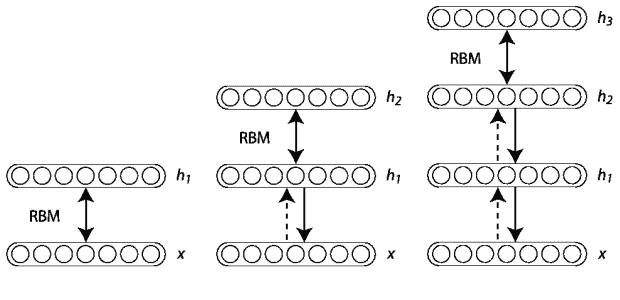

辛顿介绍的分层预训练

快进到 2012 年，整个人工智能研究界被一种方法震惊了。在世界图像识别大赛上， **ImageNet 大规模视觉识别挑战赛** ( **ILSVRC** )，一个名为**监督**([http://image-net.org/challenges/LSVRC/2012/supervision.pdf](http://image-net.org/challenges/LSVRC/2012/supervision.pdf))的团队取得了 15.3%的前五名测试错误率的胜利，而第二名的成绩是 26.2%。ImageNet 拥有大约 120 万张高分辨率图像，分属 1000 个不同的类别。有 1000 万张图片作为学习数据提供，15 万张图片用于测试。来自多伦多大学的 Alex Krizhevsky，Ilya Sutskever 和 Geoffrey E. Hinton 构建了一个深度卷积网络，该网络具有 6000 万个参数，65 万个神经元和 6.3 亿个连接，由 7 个隐藏层和 5 个卷积层组成，其中一些层后面是 max-pooling 层和 3 个全连接层，最终是 1000 路 softmax。为了增加训练数据，作者从可用图像中随机抽取了 224 x 224 个补丁。为了加快训练速度，他们使用了不饱和神经元和卷积运算的非常有效的 GPU 实现。他们还使用*压差*来减少完全连接层中的过拟合，这被证明非常有效。

从那以后，深度学习开始起步，今天我们不仅在图像分类中，而且在回归、降维、纹理建模、动作识别、运动建模、对象分割、信息检索、机器人、自然语言处理、语音识别、生物医学领域、音乐生成、艺术、协同过滤等方面都看到了许多成功的应用:

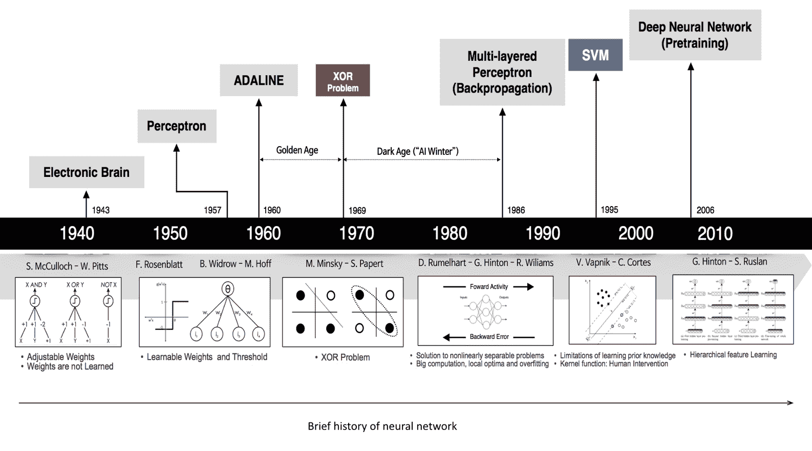

深度学习/人工智能历史的图解

有趣的是，当我们回顾过去时，似乎大多数理论突破都已经在 20 世纪 80-90 年代取得了，那么在过去的十年里还有什么变化呢？一个没有太大争议的理论是*深度学习的成功很大程度上是工程的成功*。吴恩达曾经说过:

如果你把深度学习的理论发展视为引擎*，那么快速计算机、图形处理单元(GPU)的发展和海量标记数据集的出现就是燃料*。

事实上，更快的处理，用 GPU 处理图片，在 10 年的时间里将计算速度提高了 1000 倍。

几乎与此同时，大数据时代到来。每天都会收集数百万、数十亿甚至数万亿字节的数据。行业领导者也在深度学习方面做出努力，以利用他们收集的大量数据。例如，百度拥有 5 万小时的语音识别训练数据，预计还将训练大约 10 万小时的数据。对于面部识别，训练了 2 亿张图像。大公司的参与通过提供过去难以想象的大规模数据，大大提升了深度学习和人工智能的整体潜力。

有了足够的训练数据和更快的计算速度，神经网络现在可以延伸到深度架构，这是以前从未实现过的。一方面，新的理论方法、海量数据和快速计算的出现推动了深度学习的进展。另一方面，新工具、平台和应用的创造推动了学术发展、更快更强大的 GPU 的使用和大数据的收集。这个循环继续下去，深度学习已经成为建立在以下支柱之上的一场革命:

*   各种格式的海量、高质量、带标签的数据集，如图像、视频、文本、语音、音频等。
*   强大的 GPU 单元和网络，能够以并行或分布式方式进行快速浮点计算。
*   创建新的深度架构:AlexNet ( *Krizhevsky 等人，使用深度卷积神经网络的 ImageNet 分类，2012* )、泽勒·弗格斯网(*泽勒等人，可视化和理解卷积网络，2013* )、GoogleLeNet ( *塞格迪等人，使用卷积更深入，2015* )、网络中的网络(*林等人，网络中的网络，2013* )、VGG ( *西蒙扬等人 2015* ) for *极深度 CNN* 、ResNets ( *何等人，用于图像识别的深度残差学习，2015* )、inception 模块、以及高速公路网、MXNet、基于区域的 CNN(R-CNN、 *Girshick 等人，丰富的特征层次用于精确的目标检测和语义分割； Girshick，快速 R-CNN，2015*；*任等更快 R-CNN:用区域提议网络实现实时目标检测，2016* )，生成对抗网络( *Goodfellow 等* 2014)。
*   开源软件平台，如 TensorFlow、Theano 和 MXNet，为开发人员或学者提供易于使用的低级或高级 API，以便他们能够快速实现和迭代他们的想法和应用。
*   改善消失梯度问题的方法，例如使用非饱和激活函数，如 ReLU 而不是 tanh 和逻辑函数。
*   方法有助于避免过度拟合:
    *   新的正则化，如保持网络稀疏的 Dropout，maxout，批量归一化。
    *   允许训练越来越大的网络而没有(或较少)过度拟合的数据扩充。
*   鲁棒优化器 SGD 程序的修改，包括 momentum、RMSprop 和 ADAM，帮助弥补了损失函数的每一个百分比。

# 为什么要深度学习？

到目前为止，我们讨论了什么是深度学习以及深度学习的历史。但是为什么现在这么受欢迎呢？在本节中，我们将讨论深度学习相对于传统浅层方法的优势及其在几个技术领域的重大影响。

# 优于传统浅层方法的优势

传统方法通常被认为是*肤浅的*机器学习，并且通常要求开发人员具有一些关于可能有帮助的输入的特定特征或者如何设计有效特征的先验知识。还有，*浅*学习往往只用一个隐层，例如，一个单层前馈网络。相比之下，深度学习被称为表示学习，已被证明在提取数据中的非局部和全局关系或结构方面表现更好。人们可以向学习系统提供相当原始的数据格式，例如，原始图像和文本，而不是在图像之上提取的特征(例如，大卫·洛的*从局部尺度不变特征进行的 SIFT*和达拉及其合著者的 HOG*用于人类检测的定向梯度直方图*，或者文本的 IF-IDF 向量)。由于体系结构的深度，学习到的表示形成了一个层次结构，其中包含了在不同级别学习到的知识。这个参数化的、多层次的计算图提供了高度的表示。对浅算法和深算法的强调是显著不同的，因为浅算法更多地是关于特征工程和选择，而深度学习强调定义最有用的计算图拓扑(架构)以及高效和正确地优化参数/超参数的方法，以获得学习表示的良好概括能力:

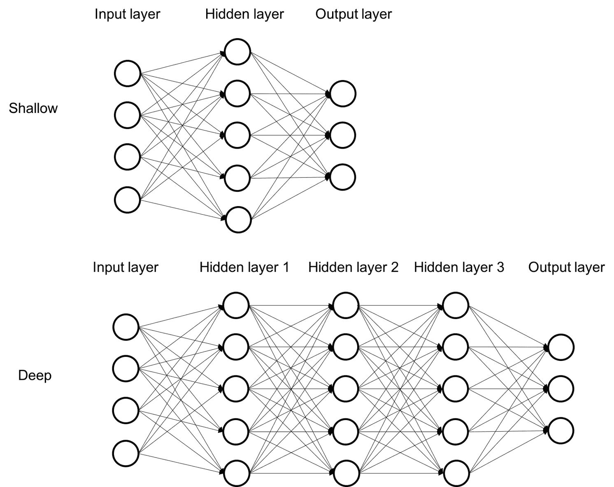

比较深层和浅层建筑。可以看出，深层架构具有许多层次的拓扑结构

与相对较浅的学习架构相比，深度学习算法在提取数据中的非局部和全局关系和模式方面表现更好。通过深度学习学习的抽象表示的其他有用特征包括:

*   它试图探索大量丰富的数据集中的大部分，即使数据是未标记的。
*   随着更多训练数据的加入而持续改进的优势。
*   自动数据表示提取，从非监督数据或监督数据，分布式和分层，通常最好当输入空间是局部结构化的；空间或时间—例如，图像、语言和语音。
*   从无监督的数据中提取特征使其广泛应用于不同的数据类型，如图像、文本、音频等。
*   相对简单的线性模型可以有效地处理从更复杂和更抽象的数据表示中获得的知识。这意味着在提取了高级特征的情况下，接下来的学习模型可以相对简单，这可以有助于降低计算复杂度，例如，在线性建模的情况下。
*   关系和语义知识可以在原始数据的更高抽象和表示级别获得( *Yoshua Bengio 和 Yann LeCun，Scaling Learning Algorithms on AI，2007，*来源*:*[https://journalofbigdata . springer open . com/articles/10.1186/s 40537-014-0007-7](https://journalofbigdata.springeropen.com/articles/10.1186/s40537-014-0007-7))。
*   深层架构在表现上可能是高效的。这听起来很矛盾，但这是一个很大的好处，因为深度学习的分布式表示能力。
*   深度学习算法的学习能力与数据大小成正比，即性能随着输入数据的增加而提高，而对于浅层或传统学习算法，在提供一定量的数据后，性能达到平台期，如下图所示，*深度学习的学习能力与传统机器学习*:

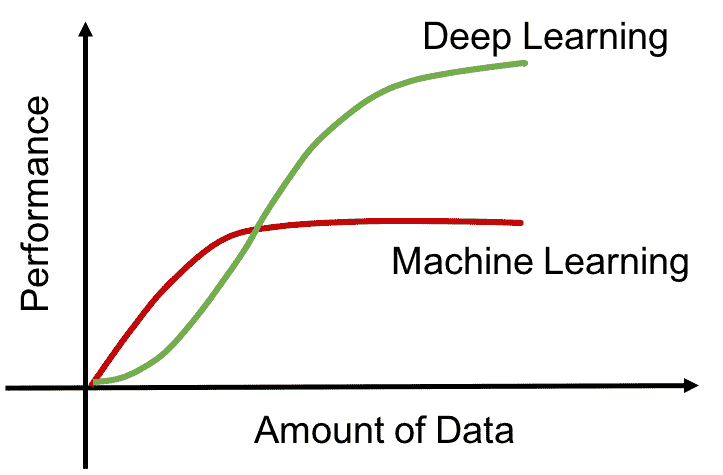

深度学习与传统机器学习的学习能力

# 深度学习的影响

为了向你展示深度学习的一些影响，我们来看看两个具体的领域:图像识别和速度识别。

下图*随时间推移的 ImageNet 分类性能*显示了过去几年 ILSVRC 竞赛获胜者的前五大错误率趋势。传统的图像识别方法采用手工制作的计算机视觉分类器，这些分类器在每个对象类的多个实例上进行训练，例如 SIFT + Fisher 向量。2012 年，深度学习进入了这个比赛。多伦多大学的 Alex Krizhevsky 和 Hinton 教授通过他们的深度卷积神经网络(AlexNet)将错误率降低了约 10%，震惊了整个领域。从那以后，排行榜就被这种方法及其变体占据了。到 2015 年，错误率已经下降到人类测试人员以下:

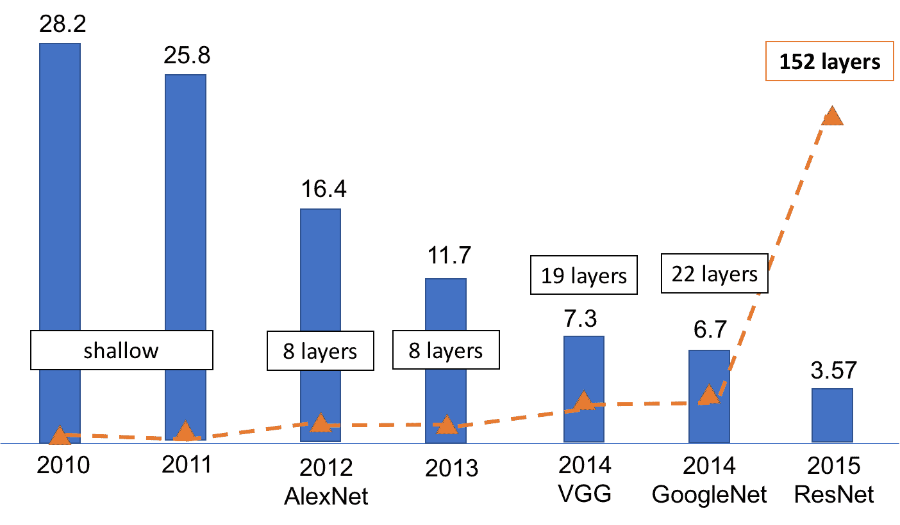

ImageNet 分类随时间推移的性能

下图*语音识别进展*描绘了语音识别领域的最新进展。从 2000 年到 2009 年，进展甚微。自 2009 年以来，深度学习、大数据集和快速计算的参与极大地推动了发展。2016 年，**微软研究院人工智能** ( **MSR 人工智能**)的研究人员和工程师团队取得了重大突破。他们报告了一个语音识别系统，它比专业的转录员犯同样或更少的错误，单词错误率为 5.9%。换句话说，这项技术可以像人一样识别对话中的单词:

语音识别进展

一个自然的问题是，深度学习比传统方法有什么优势？拓扑定义功能。但是为什么我们需要昂贵的深层架构呢？这真的有必要吗？我们在这里试图实现什么？事实证明，理论上和实践上都有支持多层次代表的证据。在下一部分，让我们深入了解深度学习的深层架构的更多细节。

# 深层建筑的动机

架构的深度指的是所学函数中非线性运算的合成的级数。这些操作包括加权和、乘积、单个神经元、核等等。大多数当前的学习算法对应于仅具有 1、2 或 3 级的浅层架构。下表显示了浅算法和深算法的一些示例:

| **级别** | **示例** | **组** |
| 一层 | 逻辑回归，最大熵分类器感知器，线性 SVM | 线性分类器 |
| 两层 | 多层感知器，带核的支持向量机决策树 | 通用逼近器 |
| 3 层或更多层 | 深度学习增强决策树 | 紧凑通用逼近器 |

理解深度学习算法的深层架构主要有两种观点:神经观点和特征表示观点。我们将逐一讨论它们。这两者可能来自不同的起源，但它们一起可以帮助我们更好地理解深度学习的机制和优势。

# 神经观点

从神经的角度来看，学习的架构是受生物启发的。人类大脑具有深层结构，其中皮层似乎有一种通用的学习方法。给定的输入在多个抽象层次上被感知。每一层对应于大脑皮层的一个不同区域。我们以分层的方式处理信息，有多层次的转换和表示。因此，我们先学习简单的概念，然后将它们组合在一起。这种理解结构可以在人类的视觉系统中清楚地看到。如下图所示，*从视网膜到最终识别目标的人类侧枕叶皮层(LOC)的信号路径*，腹侧视觉皮层包括一组以越来越抽象的方式处理图像的区域，从边缘、拐角和轮廓、形状、目标部分到目标，允许我们从任意二维视图学习、识别和分类三维目标:

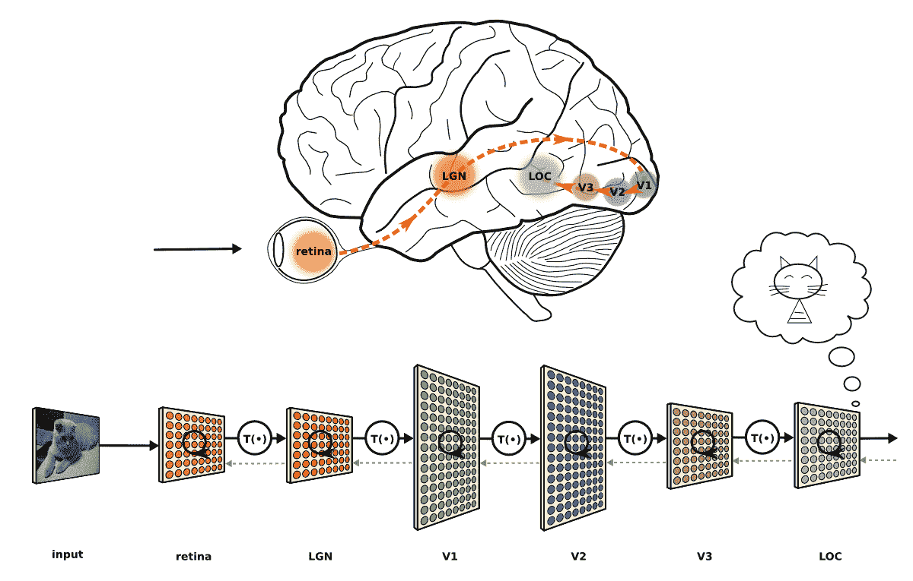

从视网膜到人类侧枕叶皮层(LOC)的信号路径，最终识别目标。图感谢乔纳斯·库比留斯(https://neuwritesd . files . WordPress . com/2015/10/visual _ stream _ small . png)

# 代表性观点

对于大多数传统的机器学习算法来说，它们的性能在很大程度上取决于给定数据的表示。因此，领域先验知识、特征工程和特征选择对于输出的性能至关重要。但是手工制作的特性缺乏应用于不同场景或应用领域的灵活性。此外，它们不是数据驱动的，无法适应新的数据或信息。在过去，人们已经注意到，许多人工智能任务可以通过使用简单的机器学习算法来解决，条件是为任务提取或设计正确的特征集。例如，估计说话者声道的大小被认为是一个有用的特征，因为它是判断说话者是男人、女人还是孩子的有力线索。不幸的是，对于许多任务和各种输入格式，例如图像、视频、音频和文本，很难知道应该提取哪种特征，更不用说它们对于超出当前应用的其他任务的概括能力。为复杂的任务手动设计特性需要大量的领域理解、时间和精力。有时，整个研究团体可能需要几十年才能在这一领域取得进展。如果回顾一下计算机视觉领域，十多年来，由于可用特征提取方法(SIFT、HOG 等)的限制，研究人员一直停滞不前。当时的许多工作都涉及到在给定这些基本特征的情况下尝试设计复杂的机器学习模式，并且进展非常缓慢，特别是对于大规模的复杂问题，例如从图像中识别 1000 个对象。这是设计灵活和自动化的特征表示方法的强烈动机。

这个问题的一个解决方案是使用数据驱动类型的方法，例如机器学习来发现表示。这种表示可以表示从表示到输出的映射(有监督的)，或者简单地表示本身(无监督的)。这种方法被称为表示学习。与手工设计的表示相比，习得的表示通常会产生更好的表现。这也使得人工智能系统能够快速适应新的领域，而无需太多的人工干预。此外，可能需要整个社区花费更多的时间和精力来手工制作和设计功能。而使用表示学习算法，我们可以在几分钟内为简单的任务或几小时到几个月的复杂任务发现一组好的特征。

这就是深度学习的救援之处。深度学习可以被认为是表示学习，而当深度架构试图处理数据、学习和理解输入和输出之间的映射时，特征提取会自动发生。由于人类设计的特征/特征提取缺乏准确性和概括能力，这带来了准确性和灵活性的显著提高。

除了这种自动特征学习之外，所学习的表示是分布式的并且具有分层结构。这种中间表示的成功训练有助于跨不同任务的特征共享和抽象。

下图显示了它与其他类型的机器学习算法之间的关系。在下一节中，我们将解释为什么这些特征(分布式的和分层的)很重要:

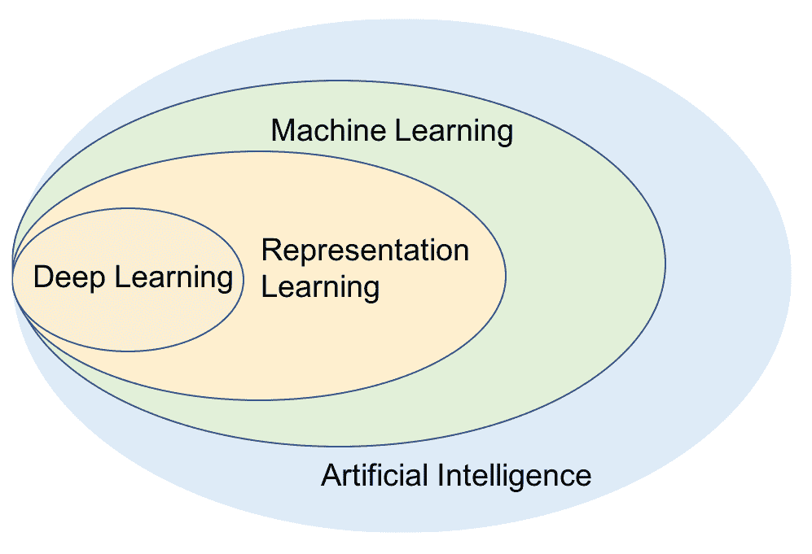

维恩图展示了深度学习是一种表示学习

# 分布式特征表示

分布式表示是密集的，而每个学习的概念由多个神经元同时表示，并且每个神经元表示不止一个概念。换句话说，输入数据被表示在多个相互依赖的层上，每个层在不同的规模或抽象级别上描述数据。因此，该表示分布在各个层和多个神经元上。这样，网络拓扑捕获了两种类型的信息。一方面，对于每一个神经元来说，它必须代表某个东西，所以这就变成了局部代表。另一方面，所谓的分布是指通过拓扑构建的图的映射，并且这些局部表示之间存在多对多的关系。当使用局部概念和神经元来表示整体时，这种连接捕捉到了相互作用和相互关系。与具有相同数量的自由参数的局部表示相比，这种表示具有捕捉更多指数变化的潜力。换句话说，他们可以非局部地推广到看不见的区域。因此，它们提供了更好的泛化能力的潜力，因为学习理论表明，调整 O (B)有效自由度所需的示例数量是 O (B)。这就是分布式表示相对于本地表示的强大之处([http://www . iro . umontreal . ca/~ pift 6266/H10/notes/mlintro . html](http://www.iro.umontreal.ca/~pift6266/H10/notes/mlintro.html))。

理解该示例的简单方法如下。假设我们需要表示三个单词，可以使用传统的 one-hot 编码(长度 N)，这是 NLP 中常用的。那么我们最多可以代表 N 个单词。每当数据具有组件结构时，本地化模型就非常低效:

一键编码

一组形状的分布式表示如下所示:

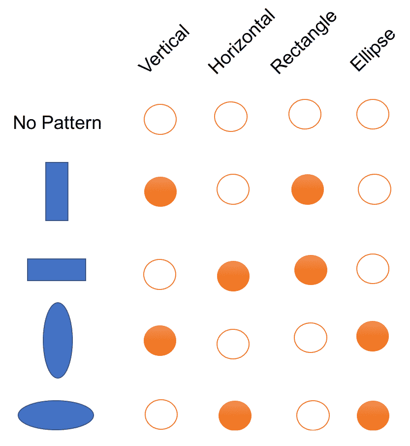

分布式表示

如果我们想用稀疏表示来表示一个新的形状，比如 one-hot-encoding，我们就必须增加维数。但是分布式表示的好处是我们可以用现有的维度来表示一个新的形状。使用前一个示例的示例如下:

使用分布式表示表示新概念

因此，非相互排斥的特征/属性创建了一个组合的大集合的可区分的配置，并且可区分的区域的数量随着参数的数量几乎呈指数增长。

我们需要澄清的另一个概念是分布式和分布式之间的区别。分布式被表示为多个元素中的连续激活级别，例如，与独热编码向量相反的密集字嵌入。

另一方面，分布式是由使用环境表示的。例如，Word2Vec 是分布式的，但基于计数的单词向量也是分布式的，因为我们使用单词的上下文来模拟含义。

# 分层特征表示

学习到的特征将数据的局部和内部关系作为一个整体来捕捉，不仅学习到的特征是分布式的，表示也是分层结构的。*前图，比较深浅的建筑。可以看出，浅层体系结构具有更扁平的拓扑结构，而深层体系结构具有多层分层拓扑结构*比较了浅层和深层体系结构的典型结构，我们可以看到，浅层体系结构通常具有最多一层的扁平结构，而深层体系结构具有多层，较低层合成为较高层的输入。下图使用了一个更具体的例子来显示通过层次结构的各个层了解到了什么信息。

如图所示，较低层侧重于边缘或颜色，而较高层通常更侧重于面片、曲线和形状。这种表示有效地从各种粒度捕捉部分和整体的关系，并自然地解决多任务问题，例如，边缘检测或部分识别。较低的层通常表示基本的和基本的信息，这些信息可用于各种领域中的许多不同的任务。例如，深度信念网络已被成功用于学习各种领域的高级结构，包括手写数字和人体运动捕捉数据。表示的层次结构模仿人类对概念的理解，即首先学习简单的概念，然后通过将简单的概念组合在一起成功地建立更复杂的概念。也更容易监控正在学习的内容，并引导机器到更好的子空间。如果将每个神经元视为一个特征检测器，那么深层架构可以被视为由分层排列的特征检测器单元组成。较低层检测简单的特征并输入到较高层，较高层反过来检测更复杂的特征。如果检测到该特征，负责的一个或多个单元产生大量激活，这些激活可以被后面的分类器阶段拾取，作为该类存在的良好指示:

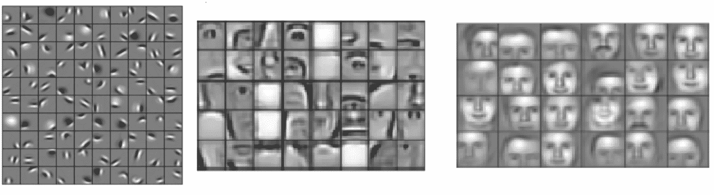

从深度学习算法中学习到的分层特征的图示。图片由 Honglak Lee 及其同事*作* *发表* *于 2009 年*

上图说明了每个特征可以被认为是一个检测器，它试图检测输入图像上的特定特征(斑点、边缘、鼻子或眼睛)。

# 应用程序

现在我们对深度学习及其相对于传统方法的技术优势有了大致的了解。但是现实中我们如何从中受益呢？在本节中，我们将介绍深度学习如何在多个领域的一些实际应用中产生巨大影响。

# 有利可图的应用

在过去的几年里，深度学习的研究人员和工程师的数量以指数速度增长。深度学习使用新颖的神经网络架构和先进的机器学习框架，在它涉及的几乎每个领域都开辟了新天地。随着硬件和算法的重大发展，深度学习已经彻底改变了行业，并在解决许多现实世界的人工智能和数据挖掘问题方面取得了高度成功。

我们已经看到，在图像识别、图像搜索、目标检测、计算机视觉、光学字符识别、视频解析、人脸识别、姿势估计(*曹等人，使用部分亲和场的实时多人姿势估计，2016* )、语音识别、垃圾邮件检测、文本到语音或图像字幕、翻译、自然语言处理、聊天机器人、定向在线广告服务、点击优化、机器人、计算机视觉、能源优化、医学、艺术、 音乐、物理、自动驾驶汽车、生物数据的数据挖掘、生物信息学(蛋白质序列预测、系统发育推断、多序列比对)大数据分析、语义索引、情感分析、网页搜索/信息检索、游戏(*雅达利*([http://karpathy.github.io/2016/05/31/rl/](http://karpathy.github.io/2016/05/31/rl/))和*alpha go*([https://deepmind.com/research/alphago/](https://deepmind.com/research/alphago/)))等等。

# 成功案例

在本节中，我们将列举几个主要的应用领域及其成功案例。

在计算机视觉领域，图像识别/对象识别指的是使用图像或图像的小块作为输入并预测图像或小块包含什么的任务。例如，图像可以标记为狗、猫、房子、自行车等等。过去，研究人员受困于如何设计好的特征来解决具有挑战性的问题，例如尺度不变、方向不变等等。一些众所周知的特征描述符是 Haar-like、**方向梯度直方图** ( **HOG** )、**尺度不变特征变换** ( **SIFT** )、以及**加速鲁棒特征** ( **SURF** )。虽然人类设计的功能在某些任务上很好，如人类检测的 HOG，但它远非理想。

直到 2012 年，深度学习凭借其在 **ImageNet 大规模视觉识别挑战赛** ( **ILSVRC** )中的巨大成功震惊了该领域。在那次比赛中，由 Alex Krizhevsky、Ilya Sutskever 和 Geoffrey Hinton 开发的卷积神经网络(通常称为 AlexNet，见下图)以惊人的 85%的准确率获得了第一名，比获得第二名的算法高出 11%!2013 年，所有获奖作品都基于深度学习，到 2015 年，多个基于 CNN 的算法已经超过了人类 95%的识别率。细节可以在他们的出版物*中找到，深入研究整流器:在 ImageNet 分类上超越人类水平的性能*:

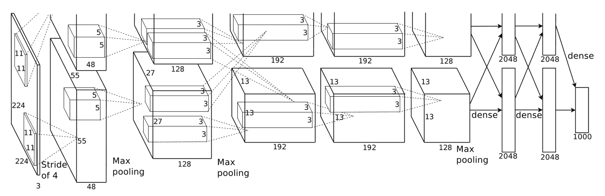

AlexNet 架构插图。它有两个流，因为训练过程的计算非常昂贵，他们不得不将训练分成两个 GPU

在计算机视觉的其他领域，深度学习在模仿人类智能方面也显示出令人惊讶和有趣的力量。例如，深度学习不仅可以准确识别图片中的各种元素(并定位)，它还可以理解人类等有趣的区域，并将单词/短语组织成句子，以描述图片中正在发生的事情。更多细节，可以参考安德烈·卡帕西和费·李非在 http://cs.stanford.edu/people/karpathy/deepimagesent/[展示的作品。他们训练了一个深度学习网络来识别几十个有趣的区域和目标，并用正确的英语语法描述图片中的主体和动作。这包括对图像信息和语言信息的训练，以便在它们之间建立正确的联系。](http://cs.stanford.edu/people/karpathy/deepimagesent/)

作为进一步的进展，贾斯廷·约翰逊、安德烈·卡帕西和李飞飞在 2016 年发表了一篇名为 *DenseCap:用于密集字幕的全卷积本地化网络*的新作。他们提出的**全卷积定位网络** ( **FCLN** )架构可以用自然语言定位和描述图像中的显著区域。下图显示了一些示例:

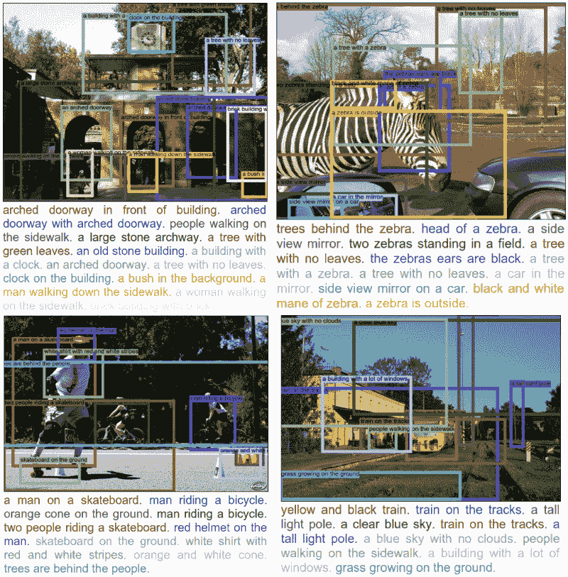

深度学习网络为图片中的显著对象生成自然语言描述。更多的例子可以在项目页面:https://cs.stanford.edu/people/karpathy/densecap/找到

最近，基于注意力的神经编码器-解码器框架已经被广泛用于图像字幕，其中结合了具有视觉哨兵的新型自适应注意力模型，并且已经实现了更好的性能。细节可以在他们的作品《知道什么时候看:通过图像字幕的视觉哨兵的适应性注意力》中找到。

早在 2017 年，来自谷歌大脑团队的瑞安·达尔(Ryan Dahl)和其他人提出了一个名为**像素递归超分辨率**的深度学习网络，以拍摄非常低分辨率的人脸图像，并大幅提高其分辨率。它可以预测每张脸最可能的样子。例如，在下图中，在左栏中，您可以看到原始的 8 x 8 照片，中间的预测结果可以找到相当接近地面的真实情况(在最右栏中):

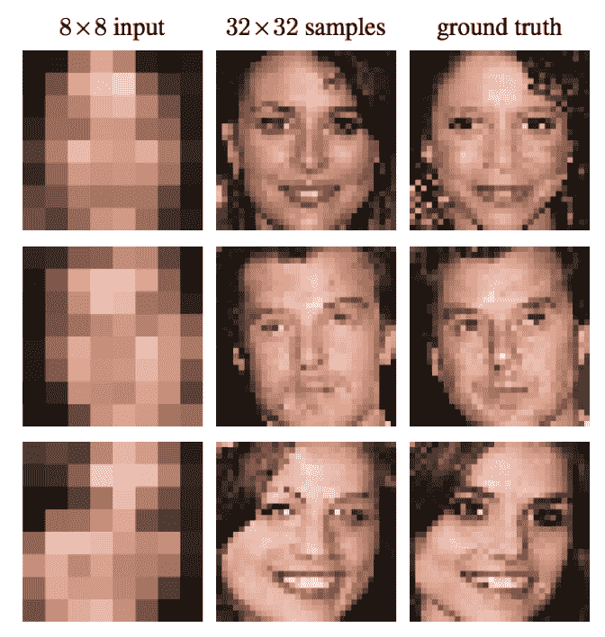

使用深度学习算法的超分辨率的图示。左栏:输入的低分辨率图像，右栏:系统估计，中栏:地面实况。来自瑞安·达尔，穆罕默德·诺鲁齐，黄邦贤·施伦斯，像素递归超分辨率，ICCV 2017

在搜索引擎的语义索引领域，鉴于深度学习的自动化特征表示的优势，各种格式的数据现在可以以更有效和有用的方式表示。除了提高速度和效率之外，这还提供了知识发现和理解的强大来源。**微软音频视频索引服务** ( **MAVIS** )是一个使用基于深度学习(ANN)的语音识别来搜索音频和视频文件的例子。

在**自然语言处理** ( **NLP** )领域，单词/字符表示学习(比如 Word2Vec)和机器翻译就是很好的实践例子。事实上，在过去的两三年里，深度学习几乎已经取代了传统的机器翻译。

机器翻译是自动翻译，通常指的是基于统计推断的系统，这些系统在各种语言之间提供更流畅但不太一致的语音或文本翻译。在过去，流行的方法是从大型语料库中学习翻译规则的统计技术，作为语言专家的替代。虽然像这样的案例克服了数据采集的瓶颈，但仍然存在许多挑战。例如，手工制作的功能可能并不理想，因为它们无法涵盖所有可能的语言变体。很难使用全局特征，翻译模块严重依赖于预处理步骤，包括单词对齐、单词分割、标记化、规则提取、句法分析等等。深度学习的最新发展为这些挑战提供了解决方案。通过一个大型神经网络进行翻译的机器翻译机通常被称为**神经机器翻译** ( **NMT** )。本质上，这是一个序列到序列的学习问题，其中神经网络的目标是学习一个参数化的函数 *P (y [T] | x [1..N] ，y [1..T-1] )* 从输入序列/源句子映射到输出序列/目标句子。映射函数通常包含两个阶段:编码和解码。编码器映射一个源序列 *x [1..N]* 到一个或多个向量来产生隐藏状态表示。解码器预测目标序列 *y [1..m 个符号接一个符号地使用源序列向量表示和先前预测的符号。]*

如下图所示，这个花瓶状的形状在中间隐藏层产生了良好的表示/嵌入:

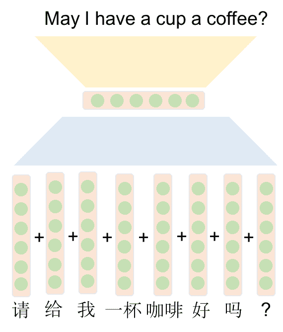

汉译英的一个例子

然而，众所周知，NMT 系统在训练和翻译推理中的计算开销都很大。此外，大多数 NMT 系统对生僻字有困难。最近的一些改进包括注意机制( *Bahdanau 等人，通过联合学习对齐和翻译的神经机器翻译，2014* )，子词级建模( *Sennrich 等人，* *带子词单元的罕见词的神经机器翻译，2015* )和字符级翻译，以及损失函数的改进(Chung 等人，*一种用于神经机器翻译的无显式分割的字符级解码器 2016* )。2016 年，谷歌推出了自己的 NMT 系统，致力于解决众所周知的困难的语言对，即汉语到英语，并试图克服这些缺点。

谷歌的 NMT 系统(GNMT)每天进行大约 1800 万次中英翻译。生产部署建立在公开可用的机器学习工具包 Tensor flow([https://www.tensorflow.org/](https://www.tensorflow.org/))和谷歌的**张量处理单元** ( **TPUs** )的基础上，它们提供了足够的计算能力来部署这些强大的 GNMT 模型，同时满足严格的延迟要求。该模型本身是深度 LSTM 模型，具有使用注意和剩余连接的八个编码器和八个解码器层。在 WMT 的 14 个英语到法语和英语到德语的基准测试中，GNMT 取得了有竞争力的结果。通过对一组孤立的简单句子进行人工并排评估，与谷歌基于短语的生产系统相比，它平均减少了 60%的翻译错误。更多细节，可以参考他们的科技博客([https://research . Google blog . com/2016/09/a-Neural-network-for-Machine . html](https://research.googleblog.com/2016/09/a-neural-network-for-machine.html))或者论文(*吴等人，谷歌的神经机器翻译系统:弥合人类与机器翻译的鸿沟，2016* )。下图显示了深度学习系统对每种语言对的改进。人们可以看到，对于法语**->**英语**来说，它几乎和人类翻译一样好:**

**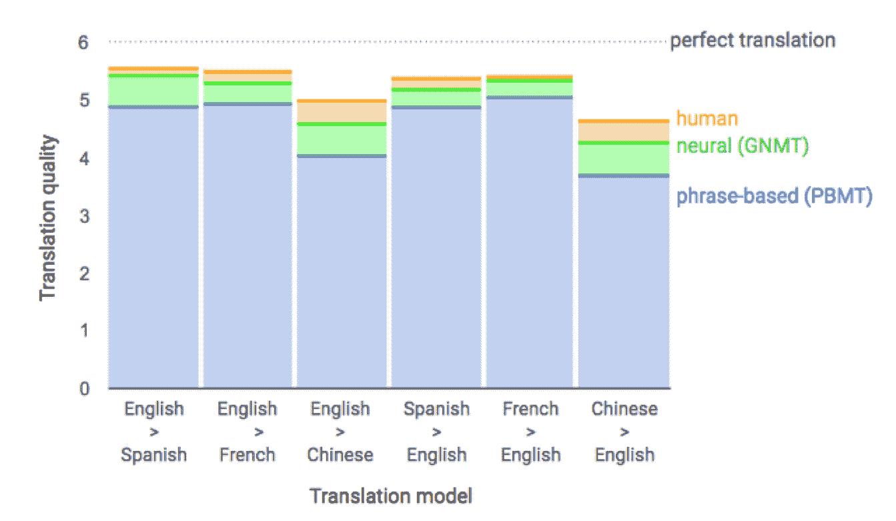

来自谷歌的 NMT 翻译表演。感谢谷歌博客:https://research . Google blog . com/2016/09/a-neural-network-for-machine . html

2016 年，谷歌发布了**wave net**([https://deep mind . com/blog/wave net-generative-model-raw-audio/](https://deepmind.com/blog/wavenet-generative-model-raw-audio/))，百度发布了 deep speech，都是自动生成语音的深度学习网络。这些系统学会自己模仿人类的声音，并随着时间的推移不断改进，观众越来越难区分它们和真正的人类说话。为什么这很重要？虽然 Siri([https://www.wikiwand.com/en/Siri](https://www.wikiwand.com/en/Siri))和 Alexa([https://www.wikiwand.com/en/Amazon_Alexa](https://www.wikiwand.com/en/Amazon_Alexa))可以很好地对话，但在过去，text2voice 系统大多是手动训练的，并不是以完全自主的方式来创建新的语音。

虽然在计算机能够像人类一样说话之前还有一些差距，但我们肯定离实现自动语音生成更近了一步。此外，深度学习在音乐创作和从视频中生成声音方面表现出了令人印象深刻的能力，例如 Owens 和他们的合著者作品*视觉指示声音，2015* 。

深度学习已经在自动驾驶汽车中得到广泛应用，从感知到定位，再到路径规划。在感知方面，深度学习经常用于检测汽车和行人，例如使用单镜头多框检测器(*刘等人，SSD:单镜头多框检测器，2015* )或实时目标检测(【Redmon】等人，你只看一次:统一，实时目标检测，2015 )。人们还可以使用深度学习来理解汽车正在看到的场景，例如，SegNet ( *Badrinarayanan，SegNet:一种用于图像分割的深度卷积编码器-解码器架构，2015* )，将场景分割成具有语义意义的片段(天空，建筑物，电线杆，道路，栅栏，车辆，自行车，行人，等等)。在定位方面，可以使用深度学习来执行里程计，例如 VINet ( *Clark 等人，VINet:作为序列到序列学习问题的视觉惯性里程计，2017* )，它可以估计汽车的精确位置及其姿态(偏航、俯仰、侧倾)。在经常被公式化为优化问题的路径规划中，也可以应用深度学习，特别是强化学习，例如 Shalev-Shwartz 及其合著者的工作( *Safe，Multi-Agent，Reinforcement Learning for Autonomous Driving，2016* )。除了在自动驾驶管道的不同阶段的应用，深度学习还被用于执行端到端学习，将来自摄像头的原始像素映射到转向命令( *Bojarski 等人，自动驾驶汽车的端到端学习，2016* )。

# 商业深度学习

为了利用深度学习在商业中的力量，第一个问题是如何选择要解决的问题？在接受吴恩达采访时，他谈了自己的看法，经验之谈是:

一个典型的人可以用一秒钟的思想做的任何事情，我们现在或很快就可以用人工智能自动化。

如果我们环顾四周，我们很容易发现今天的公司，无论大小，都已经以令人印象深刻的性能和速度将深度学习应用到生产中。想想谷歌、微软、脸书、苹果、亚马逊、IBM 和百度。事实证明，我们每天都在使用基于深度学习的应用和服务。

如今，谷歌可以为你上传的图片添加多个标签和描述。它的翻译系统几乎和人类翻译一样好。其图像搜索引擎可以通过图像查询或基于语言的语义查询返回相关图像。天窗项目([https://www.google.com/get/sunroof](https://www.google.com/get/sunroof))一直在帮助房主探索他们是否应该使用太阳能——为 42 个州的 4300 多万所房屋提供太阳能评估。

苹果正在努力投资机器学习和计算机视觉技术，包括 iOS 上的 CoreML 框架、Siri 和 iOS 上的 ARKit(增强现实平台)，以及他们包括自动驾驶汽车应用在内的自主解决方案。

脸书现在可以自动标记您的朋友。来自微软的研究人员以比人类注释者更好的性能赢得了 ImageNet 比赛，并改进了他们的语音识别系统，现在已经超过了人类。

行业领先的公司也以某种方式贡献了他们的大规模深度学习平台或工具。比如谷歌的 TensorFlow，亚马逊的 MXNet，百度的 PaddlePaddle，脸书的 Torch。就在最近，脸书和微软为可互换的人工智能框架推出了一个新的开放生态系统。所有这些工具包都为神经网络提供了有用的抽象:n 维数组(张量)的例程，不同线性代数后端(CPU/GPU)的简单使用，以及自动微分。

有这么多的资源和好的商业模式可用，可以预见，随着时间的推移，从理论开发到实际行业实现的过程将会缩短。

# 未来的潜力和挑战

尽管有令人兴奋的过去和充满希望的前景，挑战仍然存在。当我们打开这个人工智能的潘多拉盒子时，一个关键问题是，我们要去哪里？它能做什么？不同背景的人都讨论过这个问题。在与吴恩达的一次采访中，他提出了自己的观点，即尽管今天的人工智能正在快速发展，但这种势头将会放缓，直到人工智能达到人类的表现水平。这主要有三个原因，人类可以做的事情的可行性，海量的数据，以及被称为**洞察力**的独特人类能力。尽管如此，这听起来非常令人印象深刻，可能有点可怕，有一天人工智能将超过人类，也许在许多领域取代人类:

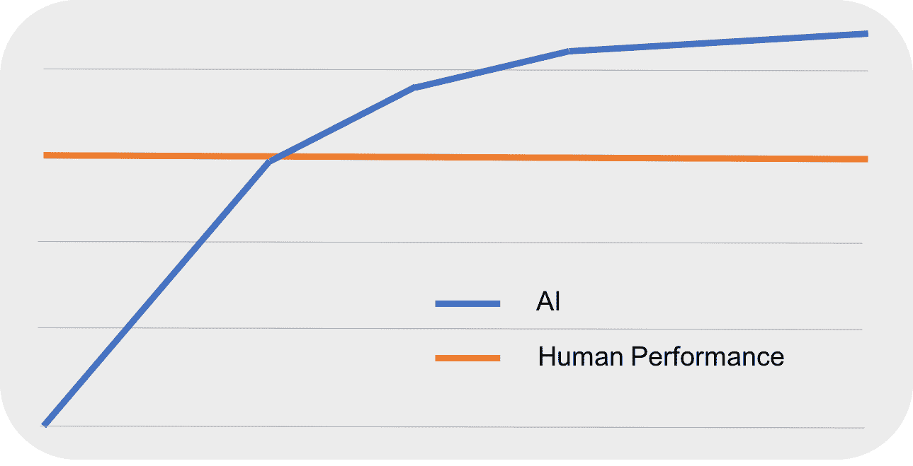

当人工智能超过人类的表现时，进展就会放缓

人工智能基本上有两个主流，积极的和消极的。正如 Paypal、SpaceX 和特斯拉的创始人埃隆·马斯克(Elon Musk)有一天评论的那样:

*Robots will do everything better than us, and people should be really concerned by it*.

但目前，大多数人工智能技术只能在某些领域做有限的工作。在深度学习领域，可能比人们生活中的成功采用更具挑战性。直到现在，深度学习的大部分进展都是通过探索各种架构取得的，但我们仍然缺乏对深度学习为什么以及如何取得如此成功的根本理解。此外，关于为什么和如何选择结构特征以及如何有效地调整超参数的研究有限。目前的大多数方法仍然基于验证或交叉验证，这远远没有理论基础，更多地是在实验和特设的一边( [*普拉门·安杰洛夫和亚历桑德罗·斯佩尔杜蒂，深度学习的挑战，2016*](https://www.elen.ucl.ac.be/Proceedings/esann/esannpdf/es2016-23.pdf) )。从数据源的角度来看，如何处理快速移动和流式传输的数据、高维数据、序列形式的结构化数据(时间序列、音频和视频信号、DNA 等)、树(XML 文档、解析树、RNA 等)、图(化合物、社交网络、图像的一部分等)仍在开发中，尤其是在计算效率方面。

此外，还需要多任务统一建模。正如谷歌 DeepMind 的研究科学家 Raia Hadsell 总结的那样:

世界上没有神经网络，现在也没有方法可以被训练来识别目标和图像，玩太空入侵者，听音乐。

直到现在，许多经过训练的模型只专注于一两个领域，如识别人脸、汽车、人类动作或理解语音，这离真正的人工智能还很远。而真正智能的模块不仅能够处理和理解多源输入，还能对各种任务或任务序列做出决策。如何最好地将从一个领域学到的知识应用到其他领域并快速适应的问题仍然没有答案。

虽然过去已经提出了许多优化方法，例如梯度下降或随机梯度下降、Adagrad、AdaDelta 或 Adma(自适应矩估计)，但是在深度学习中仍然存在一些已知的弱点，例如陷入局部最小值、较低的性能和高计算时间。这个方向的新研究将对深度学习的性能和效率产生根本性的影响。看看全局优化技术是否可以用来帮助关于前述问题的深度学习将是有趣的。

最后但并非最不重要的是，当将深度学习应用于甚至开发新型深度学习算法到迄今为止尚未受益的领域时，面临的机遇可能多于挑战。从金融到电子商务，从社交网络到生物信息学，我们已经看到人们对利用深度学习的兴趣有了巨大的增长。在深度学习的推动下，我们看到应用程序、创业公司和服务正在以更快的速度改变我们的生活。

# 摘要

在这一章中，我们已经介绍了深度学习和人工智能的高级概念。我们讨论了深度学习的历史、起伏以及最近的兴起。从那里，我们深入讨论了浅层算法和深层算法之间的差异。我们具体讨论了理解深度学习的两个方面:神经观点和特征表示学习观点。然后，我们给出了几个跨领域的成功应用。最后，我们讨论了深度学习仍然面临的挑战以及基于机器的人工智能的潜在未来。

在下一章中，我们将帮助您设置开发环境，并亲自动手。****