<title>Deep Learning in Computer Vision</title>  

# 计算机视觉中的深度学习

在前一章中，我们介绍了神经网络的基础知识，以及如何训练和应用它来解决特定的**人工智能** ( **AI** )任务。如本章所述，在计算机视觉领域广泛使用的最受欢迎的深度学习模型之一是卷积神经网络，也称为 CNN。本章旨在更详细地介绍 CNN。我们将回顾对 CNN 的工作至关重要的核心概念，以及如何用它们来解决现实世界中的计算机视觉问题。我们将具体回答以下问题:

*   CNN 是如何起源的，其历史意义是什么？
*   哪些核心概念构成了理解 CNN 的基础？
*   当今有哪些流行的 CNN 架构在使用？
*   如何使用 TensorFlow 实现 CNN 的基本功能？
*   你如何微调一个预先训练好的 CNN 并在你的应用中使用它？

<title>Origins of CNNs</title>  

# CNN 的起源

沃尔特·皮茨和沃伦·麦卡洛克通常被认为是 1943 年第一个计算机模型的发明者，该模型的灵感来自人脑的神经网络结构。他们提出了一种技术，启发了基于逻辑的设计的概念，并提供了一种形式主义，在这种形式主义下，未来的改进导致了有限自动机的发明。**麦卡洛克-皮茨**网络是一个有向图，其中每个节点是一个神经元，边被标记为兴奋性(1)或抑制性(0)，并使用*阈值逻辑*来复制人类的思维过程。

这种设计中的一个挑战是学习阈值或权重，这将在后面定义。Henry J. Kelley 在 1960 年以连续**反向传播模型**的形式提供了这种学习算法的第一个版本，随后由 Arthur Bryson 进行了改进。链规则由 Stuart Dreyfus 开发，作为原始反向传播模型的简化。尽管模型和学习算法是在早期设计的，但它们的低效率导致了研究社区的延迟采用。

深度学习算法的最早工作实现来自于 1965 年的 Ivakhnenko 和帕拉。他们使用了具有多项式激活函数的模型，并对其进行了进一步的统计分析。从每一层中，他们选择统计上最好的特征，并将其转发到下一层，这通常是一个缓慢的手动过程。在他们 1971 年的论文中，他们还描述了一个名为 **alpha** 的深度神经网络系统，它有八层，由数据处理算法的**组方法训练。然而，这些系统都不是专门用于机器感知或视觉任务的。这一系列工作的最早灵感来自于 20 世纪 50 年代和 60 年代的 Hubel 和 Wiesel [5，6]。他们展示了猫和猴子的视觉皮层都包含对视野中的一个小区域单独做出反应的神经元，也称为**感受域** *。***

他们所做的一个关键观察是，相邻细胞有相似和重叠的感受野，这种感受野平铺在整个视觉皮层上。他们还发现，视觉皮层中的细胞由简单细胞和复杂细胞组成。简单细胞对直边作出反应，并且相对于它们的感受野具有特定的方向。另一方面，复杂细胞是由于各种简单细胞的投影而形成的。虽然它们对与其对应的简单细胞相同的边缘方向作出反应，但它们在更宽的感受野上整合了所有固有简单细胞的反应。这使得复杂的细胞对感受野边缘的确切位置不敏感或翻译不变。这是当今实践中 CNN 设计和实现背后的架构原则之一。

受 Hubel 和 Wiesel 工作启发的第一个现实世界系统是由 Kunihiko Fukushima 开发的 **neocognitron、**。Neocognitron 通常被称为现实世界中的第一个 CNN 实现。Neocognitron 的主要重点是学习从零到九的手写数字。在这个特殊的设计中，neocognitron 由九层组成，每层由两组细胞组成:简单细胞的 S 层， **S 细胞**，以及复杂细胞的层， **C 细胞**。每一层被进一步划分成不同数量的平面，然而该层内的每个平面具有相同数量的神经元，也称为**处理元件。**每一层都有不同数量的平面的简单和复杂细胞。例如，U [S1] 有 12 个平面的**19×19**简单单元格。

输入数字的正确分类是由最右边 C 单元层中具有最强响应的类别做出的。这些早期模型为视觉皮层的数学建模提供了一种优雅的形式。然而，学习这些模型的参数仍然被认为是一项困难的任务。直到 1985 年，Rumelhart、Williams 和 Hinton 才应用基于反向传播的技术来学习神经网络。他们表明，使用反向传播，神经网络可以学习有趣的分布表示。当 Yann LeCun 展示了反向传播在银行支票手写数字识别中的实际应用时，反向传播继续取得成功。这些先进的模型需要比当时更多的计算能力。然而，不久之后，2000 年代初现代**图形处理单元** ( **GPU** )的发展将计算速度提高了 1000 倍。正如我们今天所知，这为深度 CNN 模型在大量图像数据上的真实应用铺平了道路。

<title>Convolutional Neural Networks </title>  

# 卷积神经网络

我们从上一章了解到，神经网络由神经元组成，神经元具有通过训练数据集学习的权重和偏差。这个网络被组织成层，每层由许多不同的神经元组成。每层中的神经元通过一组边连接到下一层中的神经元，这组边带有从训练数据集中学习的权重。每个神经元也有一个预选的激活功能。对于接收到的每一个输入，一个神经元用它学习到的权重计算它的点积，并通过它的激活函数产生一个响应。

尽管这种架构适用于小规模数据集，但它面临着规模挑战:


多层神经网络的架构(来源:https://raw . githubusercontent . com/cs 231n/cs 231n . github . io/master/assets/nn1/neural _ net 2 . JPEG)

想象一下，你正在尝试通过神经网络训练一个图像识别系统。输入图像是 32 x 32 x 3，这意味着它们有三个颜色通道，红色、绿色和蓝色(RGB)，每个通道图像是 32 像素宽和 32 像素高。如果您要输入此图像并将第一层中的神经元完全连接到下一层，每个神经元将具有 32 x 32 x 3 = 3072 个边或权重，如多层神经网络图的*架构所示。要在这么大的空间内学习良好的重量表示，您需要大量的数据和计算能力。例如，如果您将图像的大小从 32 x 32 增加到 200 x 200，这一比例挑战将呈多项式增长。这不仅会带来计算挑战，这种参数爆炸将不可避免地导致**过拟合**，这是一个非常常见的机器学习陷阱。*

CNN 是专门为解决这个问题而设计的。如果细胞神经网络的输入具有典型的网格状结构，就像在图像中发现的那样，那么细胞神经网络工作良好。与常规的神经网络不同，CNN 将输入数据组织成一个三维的类似张量的结构，代表**宽度**、**高度**和**深度**。为了防止参数爆炸，一层中的每个体积仅连接到下一层体积中的空间相关区域。这确保了随着层数的增加，每个神经元对其位置都有局部影响(图*CNN*中一个卷积层的架构)。最后，输出层能够将高维输入图像缩减为输出类的单个向量:


CNN 中卷积层的架构(来源:https://github . com/cs 231n/cs 231n . github . io/blob/master/assets/CNN/CNN . JPEG)

最重要的思想之一是卷积运算，CNN 就是以此命名的。卷积运算可以理解为两个实值信号的插值。举例来说，假设你有一个清澈见底的湖泊。你决定从岸边捡起一块石头扔进池塘。当这块石头撞击水面时，它会在湖面上产生一个涟漪，这个涟漪是从石头与水面的撞击点开始的。就卷积而言，你可以将这种涟漪效应解释为水面上的岩石进行卷积运算的结果。卷积过程测量一个信号与另一个信号积分时的影响。它的主要应用之一是在信号中寻找模式。

一个这样的例子是通常在图像处理中使用的平均滤波器。有时，当捕获的图像有非常尖锐的边缘时，您可能想要添加模糊效果，也称为**平均滤波器**。卷积通常是实现这种效果的最常用工具。如图的*卷积运算示例所示，左边的矩阵(**输入数据**)与右边的矩阵(**内核**)卷积时，生成一个输出，也称为**特征图**:*


卷积运算的例子。(来源:https://upload . wikimedia . org/Wikipedia/commons/f/F4/wiki _ kamin ari 3400 _ sp lot _ 2D _ my。PNG)

数学上，卷积可以定义如下:

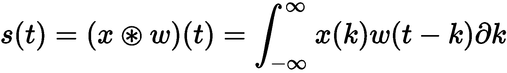

这里， *x* 是输入数据，w 是内核， *s* 是特征图。

<title>Data transformations</title>  

# 数据转换

通常，在 CNN 的任何实际实现中，数据处理和转换是实现良好准确性的关键步骤。在本节中，我们将介绍一些基本但重要的数据转换步骤，这些步骤在当今的实践中更常用。

<title>Input preprocessing</title>  

# 输入预处理

让我们假设我们的数据集 X 有 N 个图像，每个图像都有 D 个展平的像素。以下三个加工步骤通常在`X`上进行:

*   **均值减法**:在这一步，我们计算整个数据集的均值图像，并从每幅图像中减去该均值图像。该步骤的效果是沿着每个特征尺寸使数据在原点上居中。要在 Python 中实现这一步:

```
  import numpy as np

  mean_X = np.mean(X, axis=0)
  centered_X = X - mean_X        
```

*   **归一化**:均值减法步骤之后通常是归一化步骤，其效果是沿着相同的尺度缩放每个特征维度。这是通过将每个特征列除以其标准偏差来实现的。数据标准化的*示例*图说明了标准化对输入数据的影响。它可以用 Python 实现，如下所示:


数据规范化示例(来源:https://raw . githubusercontent . com/cs 231n/cs 231n . github . io/master/assets/nn2/prepro1 . JPEG)

获取规范化数据的代码如下:

```
   std_X = np.std(centered_X, axis=0)
   normalized_X = centered_X / std_X
```

*   **PCA 白化**:通常，用于神经网络的另一个重要转换步骤是使用**主成分分析** ( **PCA** )进行白化。尽管这种方法在 CNN 中没有广泛使用，但它是值得在这里描述的重要步骤。白化可以被理解为这样的过程，其中通过计算协方差矩阵并使用它将数据的维度减少到最高主分量，如所期望的。数据白化的*示例*图显示了该步骤的几何解释。它也可以用 Python 实现，如下所示:

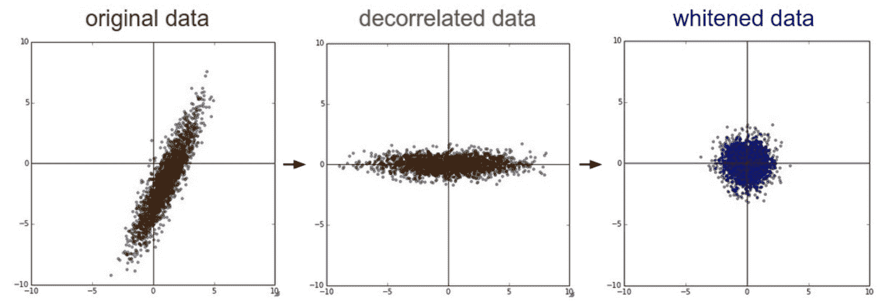

数据白化示例(来源:https://raw . githubusercontent . com/cs 231n/cs 231n . github . io/master/assets/nn2/prepro2 . JPEG)

```
   # Compute the covariance matrix from the centered data
   cov_matrix = np.dot(centered_X.T, centered_X) / centered_X.shape[0] 
   # Perform Singular Valued Decomposition
   U,S,V = np.linalg.svd(cov_matrix)
   # Compute the whitened data without dimensionality reduction
   decorr_X = np.dot(centered_X, U) # decorrelate the data
   # Compute the whitened data
   whitened_X = decorr_X / np.sqrt(S + 1e-5)
```

<title>Data augmentation</title>  

# 数据扩充

提高识别性能的最常见的技巧之一是以智能的方式增加训练数据。有多种策略可以达到这种效果:

*   **平移和旋转不变性**:对于学习平移和旋转不变性的网络，通常建议用图像的不同透视变换来增加图像的训练数据集。例如，您可以获取一幅输入图像，将其水平翻转并添加到训练数据集中。除了水平翻转，您还可以在其他可能的转换中将其平移几个像素。
*   **尺度不变性**:CNN 的局限性之一是它不能有效识别不同尺度下的物体。为了解决这个缺点，用输入图像的随机裁剪来扩充训练集通常是一个好主意。这些随机裁剪充当训练图像的子采样版本。您还可以选取这些随机裁剪，并将它们上采样到输入图像的原始高度和宽度。
*   **颜色扰动**:更有趣的数据转换之一是直接扰动输入图像的颜色值。

<title>Network layers</title>  

# 网络层

如前几章所述，典型的 CNN 架构由一系列层组成，每一层都将输入图像张量转换为输出张量。这些层中的每一层都可能属于多个类别。每一类层在网络中都有特定的用途。*样例 ConvNet 架构*图展示了这样一个网络的例子，它由**输入层**、**卷积层**、**汇聚层**和**全连接层** ( **FC** )组成。典型的 ConvNet 可以具有诸如[输入- > CONV - >池- > FC]的架构。在本节中，我们将更详细地描述每一层，并回顾它们对图像处理的作用和意义:

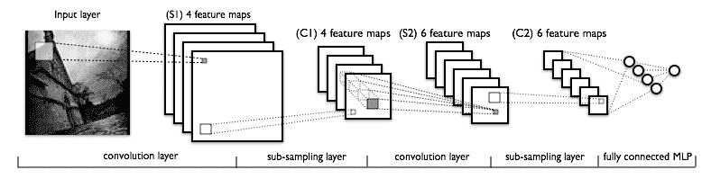

示例 ConvNet 架构(来源:http://deeplearning.net/tutorial/_images/mylenet.png)

<title>Convolution layer</title>  

# 卷积层

卷积层是 CNN 的核心构建模块之一，负责对输入图像应用特定的卷积滤波器。该滤波器应用于图像的每个子区域，这由层的局部连通性参数进一步定义。每个滤波器应用为特定像素位置产生一个标量值，当在所有像素位置组合时，通常称为**特征图。**例如，如果您使用八个滤波器在每个像素位置卷积一个 32 x 32 的图像，您将产生 12 个输出特征图，每个尺寸为 32 x 32。在这种情况下，将对应于特定的卷积滤波器来计算每个特征图。卷积层图的*示例更详细地说明了这个概念。*

讨论中出现的一个重要问题是，如何选择特定的滤波器来卷积图像？为了回答这个问题，这个过滤器实际上是模型的实际可学习参数，必须通过给定的训练数据集来学习。因此，该滤波器的设计成为确保网络高性能的极其重要的一步。典型的过滤器可以是五个像素高和五个像素宽。然而，应用于整个输入体积的这种滤波器的组合充当了有效的特征检测器。这种过滤器的训练过程也相对简单。首先，您决定在网络的每个卷积层应用的过滤器的数量和大小。在训练过程开始时，这些滤波器的初始值是随机选择的。在反向传播算法的正向传递期间，在输入图像中的每个可能的像素值处卷积每个滤波器，以生成特征图。这些特征图现在充当后续层的输入图像张量，导致从原始图像中提取更高级别的图像特征。

需要注意的重要一点是，为每个输入像素位置计算特征映射值在计算上是低效和多余的。例如，如果输入体积的大小为[32 x 32 x 3]，并且过滤器大小为 5 x 5，则卷积层中的每个神经元将连接到输入体积中的[5 x 5 x 3]区域，生成总共 5 * 5 * 3 = 75 个权重(以及+1 个偏差参数)。为了减少这种参数爆炸，我们有时使用一个称为**s**T2【tride length 的参数。步长表示两个后续滤波器应用位置之间的间隙，从而显著减小输出张量的大小。

通常在卷积后立即应用的后处理层之一是**整流线性单元** ( **ReLU** )。ReLU 计算函数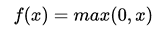。ReLU 的一个优点是大大加快了**随机梯度下降** ( **SGD** )等学习算法的收敛速度:

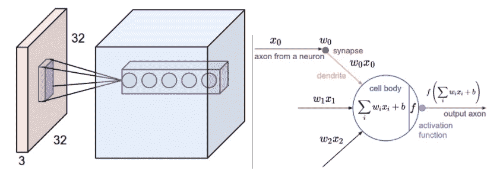

卷积层示例(来源:https://raw . githubusercontent . com/cs 231n/cs 231n . github . io/master/assets/CNN/depthcol . JPEG，https://raw . githubusercontent . com/cs 231n/cs 231n . github . io/master/assets/nn1/neuron _ model . JPEG)

<title>Pooling or subsampling layer</title>  

# 汇集或子采样层

在 CNN 中，汇集层或子采样层通常紧跟在卷积层之后。其作用是沿高度和宽度的空间维度对卷积图层的输出进行下采样。例如，在 12 个特征图之上的 2 x 2 汇集操作将产生大小为[16 x 16 x 12]的输出张量(参见汇集/子采样层的*示例*图)。

池化的主要功能是减少网络要学习的参数数量。这还具有减少过拟合的附加效果，从而提高网络的整体性能和精度。

围绕池有多种技术。一些最常见的池技术有:

*   **最大汇集**:在这种情况下，每个汇集区域的特征图(上例中为 2 x 2)被一个值代替，该值是汇集区域内四个值的最大
***   **平均池化**:在这种情况下，每个池化区域的特征图(在前面的例子中为 2 x 2)被一个单独的值代替，该值是池化区域内四个值的**平均值****

 **通常，池层接受以下内容:

*   输入体积大小:
*   需要两个参数:
    *   它们的空间范围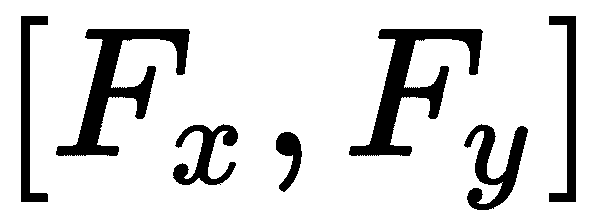
    *   步幅
*   产生大小为的体积，其中:
    *   
    *   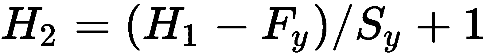
    *   

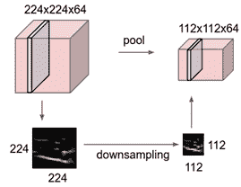

池/子采样层示例(来源:https://raw . githubusercontent . com/cs 231n/cs 231n . github . io/master/assets/CNN/pool . JPEG)

<title>Fully connected or dense layer</title>  

# 完全连接或密集层

CNN 的最后一层通常是全连接层，也称为**密集层**。这一层中的神经元完全连接到前一层中的所有激活。这一层的输出通常是类别分数，其中这一层中神经元的数量通常等于类别的数量。

使用前面描述的层的组合，CNN 将输入图像转换成最终的班级分数。每一层的工作方式不同，参数要求也不同。这些层中的参数通过基于梯度下降的算法以反向传播的方式学习。

<title>Network initialization</title>  

# 网络初始化

CNN 训练的一个最看似琐碎，但却至关重要的方面是网络初始化。每个 CNN 层都有特定的参数或权重，这些参数或权重通过训练集进行训练。学习这个最佳权重的最流行的算法是 SGD。SGD 的输入包括一组初始权重、损失函数和带标签的训练数据。给定训练数据中的标签，SGD 将使用初始权重来计算损失值，并调整其权重以减少损失。这个调整后的权重现在将被馈送到下一次迭代，在下一次迭代中，先前的过程继续，直到实现收敛。从这个过程可以看出，网络初始化时初始权值的选择对网络训练的质量和收敛速度起着至关重要的作用。因此，已经应用了一些策略来解决这个问题。其中一些如下:

*   **随机初始化**:在这种方案中，所有的权重最初都被随机赋予某个值。随机分配的一个良好实践是确保随机样本来自零均值和单位标准差高斯分布。随机化背后的想法很简单——想象一下，如果网络为每个神经元分配非常相似或相同的权重，每个神经元将计算完全相同的损失值，并在每次迭代中进行相同的梯度更新。这意味着每个神经元都将学习相似的特征，网络不会多样化到足以从数据中学习有趣的模式。为了确保网络中的多样性，使用随机权重。这将确保权重被不对称地分配，从而导致网络的多样化学习。不过，随机初始化的一个技巧是网络差异。如果您随机定义权重，神经元输出的分布将具有更高的方差。一个建议是根据图层的输入数量对权重进行归一化。
*   **稀疏初始化**:Sutskever 等人使用，在该方案中，我们随机选择一个神经元，并将其随机连接到前一层的 K 个神经元上。如前所述，随机分配每个神经元的权重。 *K* 的典型数量是 10-15。这种想法背后的核心直觉是将每个单元的连接数与前几层的单元数分离。在这种特殊情况下，将偏差初始化为 0 通常是个好主意。在 ReLU 的情况下，您可能希望选择一个小常数，如 0.01，以确保一些渐变向前传播。
*   批处理规范化:由 Ioffe 和 Szegedy 发明，批处理规范化旨在对网络初始化不良的问题具有鲁棒性。该方案的中心思想是在训练阶段开始时，强制整个网络在单位高斯分布上自我标准化。它采用两个参数γ和β，并生成输入的批量规范化版本:为:


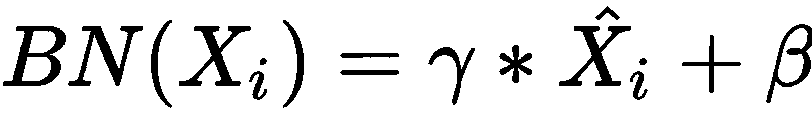

<title>Regularization</title>  

# 正规化

训练 CNN 的挑战之一是过度拟合。过拟合可以被定义为一种现象，其中 CNN，或者一般来说任何学习算法，在优化训练误差方面表现得非常好，但是不能在测试数据上很好地概括。社区中解决这个问题最常用的技巧是**正则化**，它只是在优化的损失函数上增加一个惩罚。有各种方法来规范网络。一些常见的技术解释如下:

*   **L2 正则化**:最流行的正则化形式之一，L2 正则化对权重执行平方惩罚，这意味着权重越高，惩罚越高。这确保了一旦网络被训练，最佳权重的值更小。直觉上，这意味着具有较小权重的网络将适当地使用其所有输入，并且将更加多样化。在一个网络中拥有较高的权重，会使网络更加依赖于权重较高的神经元，最终使其出现偏差。正则化的*效果*图直观地说明了这种效果，其中，在 L2 正则化之后，您会看到更多的权重集中在 **-0.2** 到 **+0.2** 附近，而不是正则化之前的 **-0.5** 到 **+0.5** 。
*   **L1 正则化**:L2 正则化的一个问题是，即使得到的权重较小，但它们大多是正的。这意味着网络接受多个输入，即使它降低了它们的权重。当您处理有噪声的输入时，这就成了一个问题。您希望完全消除噪声输入，理想情况下，您希望将此类输入的权重设为 0。这为 L1 正则化铺平了道路。在这种情况下，您添加了一个一阶权重惩罚，而不是二阶惩罚，如 L2。在规则化的*效果图*中可以看到这种规则化的结果。您可以看到现在较少的权重箱是非空的，这表明网络已经学习了稀疏权重，这对于噪声输入更加鲁棒。你也可以在一个正则化方案中结合 L1 正则化和 L2 正则化，这也被称为**弹性网正则化**。
*   **最大范数约束正则化** : 在该方案中，将权重向量的最大可能范数约束为遵循预先指定的值，例如。这确保了网络权重和更新总是有界的，并且不依赖于诸如网络学习速率的速度之类的因素。
*   **辍学正规化**:正规化的最新进展之一是辍学。这里的想法是使用一个参数，它定义了一个概率，在这个概率下，你只使用下一层中某些神经元的激活。基于辍学的正规化图*给出了一个例子。使用`0.5`的 dropout 参数和四个神经元，您随机选择两个神经元(0.5 * 4)，其激活将被转发到下一层。由于您在培训期间会退出激活，因此您也需要适当地调整激活，以便测试阶段保持不变。为此，您还需要做一个**反向下降**，通过的因子缩放激活:*

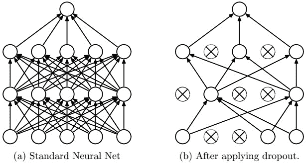

基于退出的正规化示例(来源:https://raw . githubusercontent . com/cs 231n/cs 231n . github . io/master/assets/nn2/Dropout . JPEG)

您可以使用以下单行代码在 TensorFlow 中添加辍学层:

```
   dropout_rate = 0.5   
   fc = tf.layers.dropout(fc, rate=dropout_rate, training=is_training)
```

<title>Loss functions</title>  

# 损失函数

到目前为止，我们已经看到使用基于梯度下降的算法来训练 CNN，该算法试图最小化给定训练数据的损失函数。有多种方法来定义如何选择这个损失函数。在本节中，我们将看看 CNN 训练中最常用的一些损失函数:

*   交叉熵损失:这是 CNN 最常用的损失函数之一。它基于交叉熵的概念，交叉熵是真实分布和估计分布之间距离的度量，可以定义为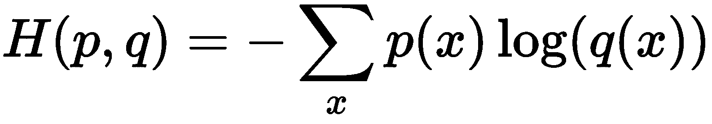。使用这种方法，交叉熵损失可以定义如下:

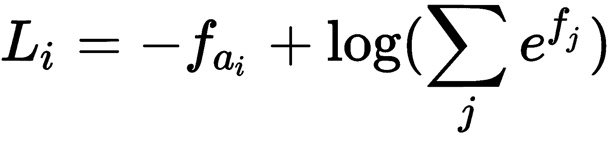

*   **铰链损耗:**铰链损耗可以简单定义如下:

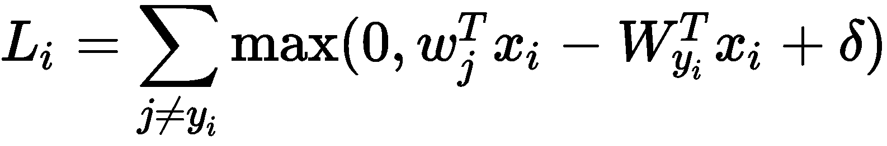

让我们用一个例子来理解这个损失函数。假设我们有三个类别，对于给定的数据点，CNN 按以下顺序输出每个类别的三个分数:[10，-5，5]。我们还假设这个数据点的正确类别是第一类，并且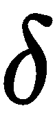的值是 10。在这种情况下，铰链损耗计算如下:

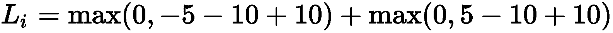

如前所示，总损失函数将计算到`5`。这看起来很直观，因为损失值较小，因为正确的类别 1 具有最高的分数，在这种情况下为`10`。

<title>Model visualization</title>  

# 模型可视化

CNN 的一个重要方面是，一旦它被训练，它就学习一组特征图或过滤器，这些特征图或过滤器充当自然场景图像的特征提取器。因此，将这些过滤器可视化并了解网络通过其训练学到了什么将是非常好的。幸运的是，这是一个越来越令人感兴趣的领域，有很多工具和技术可以让 CNN 更容易地可视化经过训练的过滤器。网络的两个主要部分很有意思:

*   **层激活**:这是最常见的网络可视化形式，在这种形式中，人们可以看到网络向前传递过程中神经元的激活。这种可视化非常重要，原因有很多:
    *   它允许您查看每个学习的过滤器如何响应每个输入图像。您可以使用这些信息来定性地了解过滤器已经学会了对什么做出响应。
    *   您可以通过查看大多数过滤器是否正在学习任何有用的功能，或者只是在网络训练期间提示问题的空白图像，来容易地调试网络。下面的*可视化层激活*图更详细地展示了这一步骤:


可视化图层激活(来源:https://raw . githubusercontent . com/cs 231n/cs 231n . github . io/master/assets/cnnvis/act 1 . JPEG，https://raw . githubusercontent . com/cs 231n/cs 231n . github . io/master/assets/cnnvis/act 2 . JPEG)

*   **过滤器可视化**:可视化的另一个常见用例是可视化实际的过滤器值本身。请记住，CNN 过滤器也可以理解为**特征检测器**，它在可视化时可以演示每个过滤器可以提取哪种图像特征。例如，前面的 *V* *可视化层激活*图说明了 CNN 滤波器可以被训练来检测和提取不同方向以及不同颜色组合的边缘。在这种技术中，还可以容易地检测到噪声滤波器值，从而为网络提供关于较差训练质量的反馈:


可视化已训练的过滤器(来源:https://raw . githubusercontent . com/cs 231n/cs 231n . github . io/master/assets/cnnvis/filt 1 . JPEG，https://raw . githubusercontent . com/cs 231n/cs 231n . github . io/master/assets/cnnvis/filt 2 . JPEG)

<title>Handwritten digit classification example</title>  

# 手写数字分类示例

在本节中，我们将展示如何使用 TensorFlow 实现 CNN 来识别 10 类手写数字。我们将在这个挑战中使用`MNIST`数据集，它由 60，000 个训练样本和 10，000 个手写数字 0 到 9 的测试样本组成，其中每个图像都是 28 x 28 像素的单色图像。

让我们假设所有特征都出现在`features` 变量中，标签出现在`labels`变量中。我们从导入必要的包开始，并从预加载的`features`变量添加输入层:

```
import numpy as np
import tensorflow as tf

# import mnist
mnist = tf.contrib.learn.datasets.load_dataset("mnist")
features = mnist.train.images # Returns np.array

# Input Layer
INPUT = tf.reshape(features, [-1, 28, 28, 1])
```

我们将按以下顺序使用由两个卷积层、两个池层和两个全连接层组成的网络架构:[`INPUT`->`CONV1`->-`POOL1`->`CONV2`->-`POOL2`->`FC1`->`FC2`]。我们对`CONV1`使用 32 个大小为 5×5 的滤波器，对`POOL1`使用 2×2 的滤波器，具有两个步长。它在 TensorFlow 中的实现如下:

```
CONV1 = tf.layers.conv2d(
    inputs=INPUT,
    filters=32,
    kernel_size=[5, 5],
    padding="same",
    activation=tf.nn.relu)

POOL1 = tf.layers.max_pooling2d(inputs=CONV1, pool_size=[2, 2], strides=2)
```

我们使用 64 个大小为 5×5 的过滤器用于`CONV2`和 2×2 的过滤器用于两个步长。我们还将这些层连接到前面的层，如下所示:

```
CONV2 = tf.layers.conv2d(
    inputs=POOL1,
    filters=64,
    kernel_size=[5, 5],
    padding="same",
    activation=tf.nn.relu)

POOL2 = tf.layers.max_pooling2d(inputs=CONV2, pool_size=[2, 2], strides=2)
```

`POOL2`的输出是一个二维矩阵，需要展平，因为我们需要连接一个密集或全连接的层。展平后，我们用`1024`神经元将其连接到完全连接的层:

```
POOL2_FLATTENED = tf.reshape(POOL2, [-1, 7 * 7 * 64])
FC1 = tf.layers.dense(inputs=POOL2_FLATTENED, units=1024, activation=tf.nn.relu)
```

为了改进网络训练，我们需要添加一个正则化方案。我们使用一个丢失率为`0.5`的丢失层，并将其连接到一个完全连接的层。最后，这一层用`10`神经元连接到最后一层——每个数字类别一个神经元:

```
DROPOUT = tf.layers.dropout(
    inputs=FC1, rate=0.5, training=mode == tf.estimator.ModeKeys.TRAIN)
FC2 = tf.layers.dense(inputs=DROPOUT, units=10)
```

现在网络已经完全配置好了，我们需要定义一个`loss`函数并开始训练。如前所述，我们选择交叉熵损失，如下所示:

```
# Calculate Loss (for both TRAIN and EVAL modes)
onehot_labels = tf.one_hot(indices=tf.cast(labels, tf.int32),     
  depth=10)
loss = tf.losses.softmax_cross_entropy(onehot_labels=onehot_labels,    
  logits=FC2)
```

我们现在设置梯度下降的学习参数并开始训练:

```

# Configure the Training Op (for TRAIN mode)
optimizer = tf.train.GradientDescentOptimizer(learning_rate=0.001)
train_op = optimizer.minimize(loss=loss,  
  global_step=tf.train.get_global_step())
train_input_fn = tf.estimator.inputs.numpy_input_fn(
  x={"x": features},
  y=labels,
  batch_size=100,
  num_epochs=None,
  shuffle=True)
mnist_classifier = tf.estimator.EstimatorSpec(
  mode=mode, loss=loss, train_op=train_op)
mnist_classifier.train(input_fn=train_input_fn,steps=20000)
```

<title>Fine-tuning CNNs</title>  

# 微调 CNN

尽管在给定足够的计算能力和标记数据的情况下，CNN 可以很容易地被训练，但训练一个高质量的 CNN 需要大量的迭代和耐心。从头开始训练 CNN 时，优化大量的参数并不总是容易的，这些参数通常在数百万的范围内。此外，CNN 特别适合处理大型数据集的问题。通常，您会面临一个数据集较小的问题，在这样的数据集上训练 CNN 可能会导致训练数据过拟合。微调 CNN 就是这样一种技术，旨在解决 CNN 的这一缺陷。CNN 的微调意味着你永远不会从头开始训练 CNN。相反，您从先前训练的 CNN 模型开始，并精细地调整和改变模型权重，以更好地适应您的应用环境。这种策略有多重优势:

*   它利用大量预先训练好的模型进行改编
*   它减少了计算时间，因为网络已经学习了稳定的过滤器，并且它快速收敛以改进新数据集上的权重
*   它还可以在较小的数据集上工作，并完全避免过度拟合

有多种方法可以对 CNN 进行微调。它们列举如下:

*   CNN 特征提取器(CNN feature extractor):通常，你会面临一个图像分类任务，它有特定数量的类别标签，比如说 20 个。鉴于这项任务，一个明显的问题是，如何利用现有的预训练 CNN 模型，这些模型有多达 1000 个类别标签，并使用它们进行微调？CNN 特征提取器是一种回答这个问题的技术。在这种技术中，我们采用预先训练的 CNN 模型，如 AlexNet，它有 1000 个类，并删除最后一个完全连接的层，保留网络的其余部分。然后，我们对每个输入图像执行前向传递，并捕获所有卷积层的激活，如 **Conv5** ，甚至是倒数第二个全连接层，如 **fc6** 。例如，如果您选择 fc6，您的激活总数是 4096，它现在充当 4096 维的特征向量。这个特征向量现在可以用于任何现有的机器学习分类器，如 SVM，来训练一个简单的 20 类分类模型。
*   **CNN 改编**:有时候，你可能想利用网络中完全连接的层来完成你的分类任务。在这种情况下，您可以将预训练网络的最后一个完全连接层替换为您自己版本的完全连接层，该层具有适合您的应用程序的正确数量的输出类，例如，在前面的示例中有 20 个类。一旦配置了这个新网络，您就可以复制预训练网络的权重，并使用它来初始化新网络。最后，通过反向传播运行新网络，以使新网络权重适应您的特定应用和数据。这种方法具有明显的优点，即不需要为您的任务添加任何额外的分类器，并且只需很少的修改，您就能够使用预训练的模型以及预训练的网络架构来实现您的任务。这种策略也适用于少量的训练数据，因为预先训练的网络已经用大量的数据进行了训练。
*   **CNN 再培训**:当你需要从头开始培训 CNN 时，这个策略很有用。通常，一个 CNN 的完整训练可能会跨越几天，这不是很有用。为了避免这种多日训练，通常建议用预训练模型初始化网络的权重，并从预训练网络停止训练的点开始训练网络。这确保了训练的每一步都是向模型添加更多可学习的过滤器，而不是浪费宝贵的计算时间来重新学习许多预训练模型已经学习过的旧过滤器。通常，在使用再培训时，建议使用较小的学习率。

<title>Popular CNN architectures</title>  

# 流行的 CNN 架构

设计一个完美的 CNN 架构需要大量的实验和计算能力。因此，实现最佳的 CNN 架构设计通常是很重要的。幸运的是，今天存在许多 CNN 架构，对于许多开发者和研究人员来说，它们是从头开始设计 CNN 网络的良好起点。在这一部分，我们将回顾一些当今流行的 CNN 架构。

<title>AlexNet</title>  

# AlexNet

AlexNet 是在大规模图像分类中普及使用 CNN 的最早作品之一，由 Alex Krizhevsky 和他们的合著者在 2012 年提出。它被提交为 2012 年 ImageNet 挑战赛的参赛作品，并以 16%的前五名错误率显著超过了亚军。AlexNet 按以下顺序由八层组成:

[输入-> con v1-> pool 1-> con v2-> pool 2-> con v3-> con V5-> con V5-> pool 3-> FC6-> FC7-> FC8]。

CONV1 是一个卷积层，有 96 个大小为 11 x 11 的滤波器。CONV2 有 256 个尺寸为 5 x 5 的滤波器，CONV3 和 CONV4 有 384 个尺寸为 3 x 3 的滤波器，CONV5 有 256 个尺寸为 3 x 3 的滤波器。所有池层(池 1、池 2 和池 3)都有 3 x 3 个池过滤器。FC6 和 FC7 都具有 4096 个神经元，最后一层是具有 1000 个神经元的 FC8，这等于标记数据中的 1000 个输出类。这是一个非常受欢迎的架构，通常也是当今第一个应用于大规模图像识别任务的 CNN 架构。

<title>Visual Geometry Group</title>  

# 视觉几何组

Simonyan 及其合著者[17]的这种架构是 2014 年 ImageNet 挑战赛的亚军。它的核心思想是更深的网络是更好的网络。虽然它们提供了更高水平的准确性，但它们固有的参数数量更大(~140M)，并且比 AlexNet 使用更多的内存。**视觉几何组** ( **VGG** )拥有比 AlexNet 更小的过滤器，其中每个过滤器的大小为 3 x 3，但步幅较低，为 1，这有效地捕捉了与具有 4 个步幅的 7 x 7 过滤器相同的感受野。根据特定的 VGG 配置，它通常具有 16-19 层。 *VGG CNN 架构*图说明了这种架构:


VGG CNN 建筑(来源:https://raw . githubusercontent . com/paddle paddle/book/develop/03 . image _ classification/image/vgg 16 . png)

<title>GoogLeNet</title>  

# 谷歌网

虽然 VGG 是 2014 年 ImageNet 挑战赛的亚军，但谷歌网络(也称为 **inception，**是获奖作品。它总共有 22 层，根本没有完全连接的层。《盗梦空间》的主要贡献之一是它极大地减少了参数集，从 AlexNet 中的 60M 减少到了 5M。虽然参数的数量减少了，但它在计算上比以前的任何网络都要昂贵。 *GoogLeNet Inception 架构*图展示了这种架构:

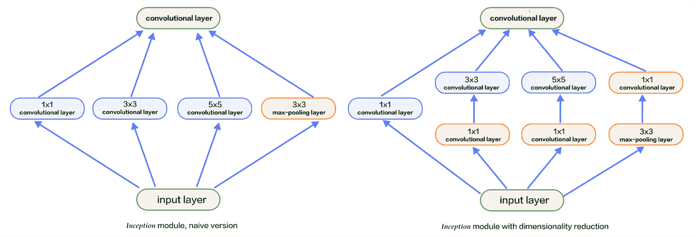

GoogLeNet Inception 架构(来源:http://book . paddle paddle . org/03 . image _ classification/image/Inception _ en . png)

<title>ResNet</title>  

# 雷斯内特

ResNet 是目前最先进的大规模图像识别架构。与以前的架构有一个共同的主题，就是网络越深，性能越好。然而，随着网络深度的增加，**消失梯度**的问题也被放大，因为每一层相对于前一层的梯度连续计算其梯度。层数越多，梯度变得越小，最终消失为 0。为了避免这个问题，ResNet 引入了一个缩短边，即不再计算上的梯度，而是计算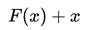上的梯度，其中 *x* 是网络的原始输入。这减轻了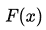逐渐变小的影响。这种策略的好处是，现在你可以创建多达 150 层的更深层次的网络，这在以前是不可能的。

下图 *ResNet ReLU 插图*更详细地展示了这种网络架构:

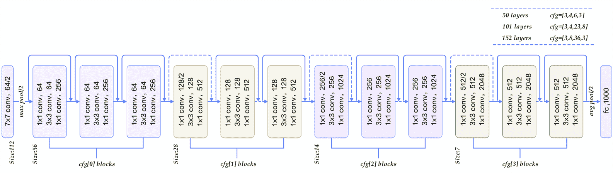

ResNet ReLU 插图(来源:https://raw . githubusercontent . com/paddle paddle/book/develop/03 . image _ classification/image/ResNet . png)

<title>Summary</title>  

# 摘要

在本章中，我们更详细地描述了卷积神经网络的核心概念。我们简要介绍了 CNN 的历史及其起源。我们讨论了 CNN 的基础知识，包括网络结构、层次、损失函数和正则化技术。我们还概述了每个概念的实用建议，并说明了如何使用 TensorFlow 实现一个简单的数字分类系统。我们还概述了如何使用预训练模型进行定制应用程序开发。最后，我们举例说明了流行的 CNN 架构，这些架构通常是开发人员完成任何计算机视觉任务的首选。在下一章，我们将看看深度学习技术如何应用于自然语言处理领域。**