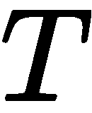

<title>Multimodality</title>  

# 多模态

随着深度学习在计算机视觉、**自然语言处理** ( **NLP** )、机器人等不同领域的令人兴奋的进展，利用多个数据源开发更强大的应用程序成为了一种新兴趋势。这被称为**多模态**，这是一种统一不同信息源的方式，包括图像、文本、语音等等。

在这一章中，我们将讨论使用深度学习的多模态的一些基本进展，并与您分享一些先进的新颖应用。

<title>What is multimodality learning?</title>  

# 什么是多模态学习？

在我们深入探讨之前，首先要问的问题是，什么是多模态/多模态？

模态是指某种类型的信息和/或存储信息的表示格式。例如，人类有各种感觉形态，如光、声音和压力。在我们的案例中，我们更多地讨论了数据是如何获取和存储的。例如，通常可用的模态包括自然语言(口语或书面语)、视觉信息(来自图像或视频)、音频(包括语音、声音和音乐)、**光检测和测距** ( **LIDAR** )数据、深度图像、红外图像、功能性 MRI 和生理信号、**心电图** ( **ECG** )等等。

利用多种数据源来创建真实世界的应用程序的方法更多的是一种需要而不是选择，因为在现实中，处理多模态数据是不可避免的。例如，当我们观看视频时，我们同时消费视觉和听觉信息。在驾驶过程中做决定时，我们利用视觉、听觉、触觉和所有其他信息来共同做出决定。对于一个即使是最简单的人工任务也能完美执行的应用程序来说，来自各种数据源的信息是必要的，并且需要联合处理。

在过去，由于特征提取主要是手工制作的，处理多模态数据的传统方式是在每个单独的模态上分别学习模型，并通过投票、使用加权平均或其他概率方法来组合结果。已经错过了一些非常重要的方面，例如，联合学习/特征嵌入或不同模态之间的关联学习。这就是深度学习提供巨大机会的地方。作为一种表征学习方法，深度学习能够从单模态或多模态数据中提取特定于任务的特征。共享表示法捕捉了不同来源之间的关系，这有助于:

*   学习从一种形态到另一种形态的转换，反之亦然
*   处理缺失模态，只要缺失模态之间的关系已经被有效地学习
*   为下游预测/决策制定生成联合表示

<title>Challenges of multimodality learning</title>  

# 多模态学习的挑战

为了使用多模态信息，我们将面临一些核心挑战，如表示、翻译、对齐、融合和共同学习(非排他性)。在这一节中，我们将简要地讨论它们中的每一个。

<title>Representation</title>  

# 表现

表示是指多模态数据的*计算机可解释描述(例如，向量和张量)。它包括但不限于以下内容:*

*   如何处理不同的符号和信号——比如在机器翻译中，汉字和英文字符是两种截然不同的语言系统；在自动驾驶系统中，来自激光雷达传感器的点云和来自 RGB 相机的图像像素是两种具有不同特征的不同来源
*   如何处理不同的粒度
*   模态可以是静态的，也可以是顺序的
*   不同噪声分布
*   不平衡的比例。

<title>Translation</title>  

# 翻译

翻译/映射指的是*将数据从一种形式转换为另一种形式的过程*，例如，图像字幕、语音合成、视觉动画等。一些已知的挑战包括:

*   不同的表现
*   多源模态
*   开放式翻译
*   主观评价
*   重复过程

<title>Alignment</title>  

# 对齐

对齐是指*识别来自两个或更多不同模态的元素之间的关系*。应用示例包括图像字幕对齐、视频描述对齐、语言-手势共同参考和唇读。下图显示了图像标题对齐的示例:

Andrej Karpathy 论文*双向图像句子映射的深度片段嵌入*中的比对示例

一些已知的挑战包括:

*   长期依赖关系
*   歧义分割
*   带有显式对齐的有限注释数据集
*   一对多关系

<title>Fusion</title>  

# 融合

融合指的是*将来自两个或多个模态的信息结合起来进行预测的过程*。示例应用包括视听语音识别、多模态情感识别、多媒体事件检测和用于自动驾驶的图像-激光雷达联合学习。一些已知的挑战包括:

*   不同的相似性度量
*   时间偶然性
*   变化的预测能力
*   不同噪声拓扑
*   模糊对应

<title>Co-learning</title>  

# 共同学习

共同学习指的是*在模态和它们的表示之间传递知识*。一些挑战如下:

*   部分可观察的视图
*   枢轴标识
*   协作过度拟合
*   不完美的预测
*   潜在分歧

在下一节中，我们将介绍一些多模态学习的最新基准的应用案例。我们将重点关注这些不同领域的高级介绍，以便为您提供一个更好的概述以及如何实现每个应用程序的起点。有了它们作为锚点，你应该能够开始自己对多模态深度学习的探索。

<title>Image captioning</title>  

# 图像字幕

随着计算机视觉和自然语言处理领域的进步，越来越多的研究人员开始关注其交叉领域的潜在应用。

一种应用叫做**图像字幕**或 **im2text** ，用于自动生成给定图像的描述。它需要联合使用计算机视觉和自然语言处理的技术。对于给定的图像，目标是分析其视觉内容，并生成逼真的文本描述来描述图像的主要内容或最突出的方面。例如，照片中的人。

为了实现这个目标，字幕生成模型必须至少具有两种能力:

*   理解视觉线索
*   能够生成逼真的自然语言

理解视觉线索可能是非常具体的任务；也就是说，在不同的场景下，侧重点可以不同。这很像人类的感知。例如，对于相同的图像但不同的焦点，图像的解释可能不同。这与文本生成步骤类似，相同的意思可以有不同的表示。

在接下来的会议中，我们将首先讨论深度学习技术，特别是 Oriol Vinyals 提出的*展示和讲述*方法，让你感受一下深度学习是如何处理这个问题的。对于这部分，我们将结合深度学习技术如**卷积神经网络** ( **CNN** )(在计算机视觉领域开发)和**递归神经网络** ( **RNN** )或**长短期记忆** ( **LSTM** )(在自然语言领域开发)进行攻关。强烈建议读者阅读并理解第 4 章、*计算机视觉中的深度学习*、[第 5 章](9180f330-af15-43ed-9841-c19508d4e842.xhtml)、 *NLP -矢量表示*和[第 6 章](f8f8e6a7-987a-4194-92e5-ee09fc517bf7.xhtml)、*高级自然语言处理、*的内容，因为它们是本章的初步基础。

接下来，我们还将简要讨论一些其他类型的方法，包括传统方法，如基于检索或基于模板的图像字幕生成方法。

当然，不仅仅是在这两个不相关的领域的交叉点上为图像生成标题。这项技术不仅可以为我们带来一些简单明了的应用，例如为未标记的图像添加字幕以更好地检索、标记和生成视频摘要，而且它还可能有助于提高广大人群的生活质量，例如帮助盲人理解相机或视频作为引导工具捕捉的内容。像这样的技术有潜力让我们的世界变得更容易接近。

<title>Show and tell</title>  

# 展示和讲解

Oriol Vinyals 的论文*Show and Tell:2015 年 MSCOCO 图像字幕挑战赛的经验教训*(【https://arxiv.org/abs/1609.06647】T2)中提出了一种图像字幕的基本方法。本次会议将深入探讨*展示和讲述*算法。在高层次上，字幕模型包含两个阶段:编码器阶段和解码器阶段。编码器生成图像嵌入作为解码器的初始输入，解码器将图像表示转换到自然语言描述空间。

在机器翻译领域可以看到类似的过程，目标是将一种语言编写的内容翻译成另一种语言。

在数学上，这种单关节模型以图像 *I* 、*、*作为输入，并被训练以最大化的条件似然，产生能够准确/充分地描述给定图像(描述是否正确生成)并且流利(输出是否合乎语法且流畅)的目标单词序列、*、*。这个序列中的每个单词，，*，*是一个表示来自给定字典的单词的独热向量。在机器翻译领域也可以看到类似的过程，目标是把用一种语言写的内容翻译成另一种语言；即给定一个源句，最大化目标句的可能性，其中是翻译的句子，是源句。事实上，这里的方法是受机器学习系统的启发。

Vinyals 论文中的一个例子如下:

前面的插图显示了 LSTM 模型与 CNN 图像嵌入器和来自 Oriol Vinyals 论文*展示和讲述:从 2015 年 MSCOCO 图像字幕挑战赛中吸取的教训*的单词嵌入的组合。LSTM 的展开图是蓝色的(在硬拷贝中是深灰色)。所有 LSTMs 共享相同的参数。要了解什么是*展开*，请参考[第三章](832a41d4-7499-4921-b5f7-88539508028e.xhtml)、*神经网络入门*。

以下课程将详细介绍每个重要的组成部分。

<title>Encoder</title>  

# 编码器

首先，输入图像将由深度卷积神经网络编码，并生成矢量表示，以捕捉图像中的图像信息/视觉线索。

CNN 可以被认为是一个编码器。CNN 的最后一个隐藏状态连接到解码器，其中该层中的神经节点的状态被认为是视觉特征(例如，具有 4096 个维度)。请注意，这些特征总是从 CNN 的隐藏层提取，而不是从最后一个输出层提取。

<title>Decoder</title>  

# 解码器

解码器通常使用 RNN 或 LSTM，将执行语言建模，将图像表示转换为句子。解码器第一级(t = -1)的输入是编码器的输出。这是为了通知 RNN/LSTM 关于图像内容。在训练阶段，我们使用嵌入变换在时间从由表示的基础真值句中嵌入单词，并将该嵌入馈送到时间的 LSTM，以预测时间 *t+1* 的单词的概率分布，由表示。嵌入变换可以从 Word2Vec 或其他类型的嵌入技术中学习。

<title>Training</title>  

# 培养

CNN(编码器)最后一个隐藏状态的输出被提供给解码器的第一个时间步长。我们设置 *x [1] = <开始>* 向量，并且期望的标签 *y [1]* 等于序列中的第一个字。类似地，我们设置 *x [2]* 等于第一个词的词向量，并期望网络预测第二个词的分布。最后，在最后一步， *x [T]* 等于最后一个字，目标标签*y[T]=<EOS>*token。在训练过程中，即使解码器之前犯了一个错误，也会在每个时间步向解码器提供正确的输入。最后，损失函数被定义为地面真实单词的负对数似然的总和:

<title>Testing/inference</title>  

# 测试/推理

在推断阶段，图像表示被提供给解码器的第一时间步。设置 *x [1] = <开始>* 向量，计算第一个字上的分布， *y [1]* 。人们可以从分布中抽取一组单词，或者贪婪地选择 argmax 而不是计算出的下一个单词的概率，或者从返回的候选中抽取顶部的单词(波束搜索)。如果使用 LSTM，当前状态和输出都将在下一个时间步中用作输入信息。系统重复这个过程，直到它命中一个 *< EOS >* 令牌。

在测试期间，解码器在时间 *t* 的输出被反馈，并成为解码器在时间 *t + 1* 的输入(RNN/LSTM 展开):

上图显示了一组评估结果，按四个级别的人工评级分组——描述无错误、描述有小错误、与图像有一定关系以及与图像无关，来自*展示和讲述:2015 年 MSCOCO 图像字幕挑战赛*的经验教训。

<title>Beam Search</title>  

# 波束搜索

波束搜索是一种启发式搜索算法，通过扩展有限集合中最有希望的节点来探索图形。它可以被认为是减少其存储器需求的最佳优先搜索的优化。基本上，这是一种迭代方法，其中，在每个步骤或时间 *t* ，仅考虑一组 *k* 最佳句子(长度= *t* )来生成句子 *t + 1* 。对于所有长度等于 *t + 1* 的结果句子，只保留其中最好的 *k* 。

<title>Other types of approaches</title>  

# 其他类型的方法

一般来说，图像字幕方法可以分为两类——从零开始生成描述，从视觉空间和/或多模态空间搜索和检索:

*   从视觉输入生成的描述
*   作为视觉空间或多模态空间中的检索的描述

展示和讲述模型可以被认为是从零开始生成描述(使用 RNN)。

对于检索类型方法的范畴，也有两种类型。

第一种类型是将问题视为从联合多模态空间中的检索问题。训练集包含图像-描述对或图像补丁-句子段对，并且使用视觉和文本信息训练联合模型。包括嵌入步骤以构建多模型空间，并且在这种情况下可以应用深度学习类型的网络。所学习的公共表示可以用于从图像到描述或者从描述到图像的跨模态检索。

第二种是把问题铸为视觉空间中的检索问题。例如，系统可以首先探索视觉空间中的相似性以收集一组描述。然后，检索到的顶部描述用于形成对查询图像的描述。

检索方法的一个问题是它的目的不是生成新文本。此外，它通常需要大量的训练数据来提供相关的描述。

在过去，也有建立在对象检测和识别之上的方法，然后使用基于模板的文本生成模式或语言模型来输出文本。下图显示了一个通过对象检测和识别为图像块生成标签的示例，然后根据生成的斑点，构建句子以生成可能的候选对象。然后对候选人进行排名，选择最有可能的一个作为描述。显然，人们可以看到，这个过程没有最佳地将图像和文本联系起来。例如，从最后一个标题中检测到单词**持有**,并从图像中穿紫色衣服的妇女中进行标记，但该单词用于描述穿棕色衣服的妇女:

图像字幕是通过首先检测和识别对象，然后形成句子来选择最佳候选来生成的。

<title>Datasets</title>  

# 数据集

有几个数据集由描述图像内容的英文图像和句子对组成，可公开用于评估目的:

下表列出了一些基本信息:

| **数据集名称** | **#图片** | **#正文** | **对象** | **链接** | **描述** | **参考** |
| 帕斯卡 VOC 2008 | 1000 | 5 | 不 | [http://NLP . cs . Illinois . edu/hockenmailergroup/Pascal-sentences/index . html](http://nlp.cs.illinois.edu/HockenmaierGroup/pascal-sentences/index.html) | 它由从 PASCAL 2008 对象识别挑战的训练和验证集中随机选择的 1，000 幅图像组成。每张图片都与五个不同的标题相关联，这些标题描述了图片中描述的实体和事件，这些图片是使用亚马逊 Mechanical Turk 的众包收集的。 | A.法尔哈迪、m .海拉蒂、M. A .萨德吉、p .杨、c .拉什奇安、j .霍肯迈尔和 d .福塞斯，*每张图片都讲述一个故事:从图片中生成句子*，ECCV，2010 年。 |
| Flickr8K | 8,092 | 5 | 不 | [http://NLP . cs . Illinois . edu/hockenmailergroup/8k-pictures . html](http://nlp.cs.illinois.edu/HockenmaierGroup/8k-pictures.html) | 收集了 8000 张来自 https://www.flickr.com/的图片。每张图片都与五个不同的标题相关联，这些标题描述了图片中描述的实体和事件，这些图片是使用亚马逊 Mechanical Turk 的众包收集的。它主要包含*动作*人物和动物的场景图像。 | C.Rashtchian，P. Young，M. Hodosh 和 J. Hockenmaier，*使用亚马逊的土耳其机器人*收集图像注释，NAACL HLT 关于使用亚马逊的土耳其机器人创建语音和语言数据的研讨会，2010 年，第 139–147 页。 |
| Flickr30K | 31,783 | 5 | 不 | [http://shannon.cs.illinois.edu/DenotationGraph/](http://shannon.cs.illinois.edu/DenotationGraph/) | 包含从 Flickr 收集的 31，783 张图片。这些图像大多描绘了人类进行各种活动。每张图片都配有五个众包标题。 | 页（page 的缩写）Young，A. Lai，M. Hodosh 和 J. Hockenmaier，*从图像描述到视觉指示:事件描述语义推理的新相似性度量*，ACL，2014 年。 |
| MSCOCO | 164,062 | 5 | 部分的 | [http://mscoco.org/dataset/#overview](http://cocodataset.org/#overview) | 最大的图像字幕数据集，包含 82，783 幅用于训练的图像、40，504 幅用于验证的图像和 40，775 幅用于测试的图像。每张图片都有五个人工注释的标题。 | T.-Y. Lin、M. Maire、S. Belongie、J. Hays、p .佩罗娜、D. Ramanan、P. Dollar 和 C. L. Zitnick，*微软 COCO:上下文中的通用对象*、[https://arxiv.org/abs/1405.0312](https://arxiv.org/abs/1405.0312)，2014 年。 |
| SBU1M | 1,000,000 | 一 | 不 | [http://vision.cs.stonybrook.edu/~vicente/sbucaptions/](http://vision.cs.stonybrook.edu/~vicente/sbucaptions/) | 同样来自 Flikr，但是发行版完全不同。数据集还带有预先计算的描述符。数据集最初是为检索型方法开发的。这些描述最初是由 Filckr 用户给出的。数据作者通过设置过滤检索结果的规则来生成数据集。 | 动词 （verb 的缩写）Ordonez、G. Kulkarni 和 T. L. Berg， *Im2text:使用一百万张带标题的照片描述图像*，NIPS，2011 年。 |

除了 SBU，每张图片都被贴上标签，用五句相对直观和不带偏见的话进行了注释。SBU 由图片所有者上传到 Flickr 时给出的描述组成。因此，不能保证它们是直观的或无偏见的，因此该数据集有更多的噪声。

<title>Evaluation</title>  

# 估价

对图像标题/描述结果的评估不是一件容易的事情。与机器翻译类似，一些已知的挑战包括但不限于:

*   人类的评价是主观的
*   多好才算够好？
*   系统 A 比系统 B 好吗？
*   目标应用程序和上下文相关性

通常，考虑两个主要方面——语言质量和语义正确性，并且通常使用两种方法——人工判断和自动测量。

人工评估通常通过众包使用，例如亚马逊机械土耳其人。这些任务通常被设计成包括关于语法、内容和流利程度的问题。向评判者提供图像以及生成的描述。在其他一些情况下，判断者可能被提供两幅图像，一幅带有随机描述，另一幅带有模型生成的说明，并被要求选择一幅。这种类型的方法有利于比较模型，但是缺乏标准化意味着结果可以在不同的实验中使用。此外，一个人判断可能有不同的同意程度。因此，需要开发一种用于公平性和可比性的自动测量度量。自动化指标的一些期望属性包括:

*   与量化的人类描述高度相关
*   对微小的差异敏感
*   对于相似的输入图像/参考对是一致的
*   可靠—得分相似的图像字幕系统的表现也相似
*   可推广—适用于广泛的领域和场景
*   快速轻便，无需人工参与

一些常用的自动评估指标包括 BLEU [Papineni 和他们的合著者，2002 年， *BLEU:一种自动评估机器翻译的方法**(基于精度，来自机器翻译社区)，ROUGE [Chin-Yew Lin，ROUGE:一个自动评估摘要的包*(基于回忆)，METEOR [Denkowski 和 Lavie，2014 年， *METEOR:一种与人类判断的相关性得到改善的机器翻译评估的自动指标*，CIDEr [Vedantam 和他们的 *CIDEr:基于共识的图像描述评价*和 SPICE【Anderson 及其合著者，2016， *SPICE:语义命题图像标题评价*】。

BLEU 和 METEOR 最初是为评估机器翻译引擎或文本摘要系统的输出而开发的，而 CIDEr 和 SPICE 则是专门为图像描述或字幕评估而设计的。

所有这些方法都试图计算算法输出与一个或多个人工编写/众包参考文本之间的相似性。

<title>BLEU</title>  

# 蓝色

双语评测替补 ( **BLEU** )是机器翻译评测的一个流行指标。它计算候选句子相对于引用的基于 n 元语法的精度。不考虑可理解性或语法正确性。BLEU 计算 n-gram 精度的几何平均值，并添加简短惩罚(惩罚比引用的一般长度短的系统结果)来阻止过于简短的句子。BLEU 的范围总是在零和一之间。数字越接近 1 表示候选文本与参考文本越相似。对于多个引用，返回最高分作为质量的判断。

BLEU 最常见的配方是 BLEU4，它使用 1 克到 4 克，但也使用较低阶的变体，如 BLEU1(单字 BLEU)和 BLEU2(单字和双字 BLEU)。

对于机器翻译，BLEU 最经常在语料库级别计算，其中与人类判断的相关性很高(首先评估句子，然后聚合到语料库级别)；对于图像字幕，它通常在句子级别计算，因为对单个句子的准确性更感兴趣。

然而，BLEU 也有一些缺点。例如，BLEU 在句子级别或子句子级别应用时以及仅使用一个引用时表现不佳。部分原因是因为 BLEU 是基于 n-gram 的，并且对于更高(三元或更高)的 n-gram 可能有许多零或低计数。此外，n 元语法计数的剪裁，使得它们不超过引用中每个 n 元语法的计数，也使子句子应用变得复杂。

<title>ROUGE</title>  

# 胭脂

**回忆导向的吉斯丁评价的替身** ( **胭脂**)。它根据引用计算候选句子的基于 n 元语法的召回。这是一种流行的摘要评估指标，试图回答参考摘要中的单词(和/或 n 元语法)在机器生成的摘要中出现的频率(与 BLEU 询问机器生成的摘要中的单词(和/或 n 元语法)在人类参考摘要中出现的频率相比)。

与 BLEU 类似，可以通过改变 n-gram 计数来计算 ROUGE 的版本。胭脂的另外两个版本是胭脂 [S] 和胭脂 [L] 。ROUGE [S] 使用 skip-bigrams 计算带有回忆偏差的 F-measure，而 ROUGE [L] 使用候选句子和每个参考句子之间最长的公共子序列。跳过二元模型是二元模型的一种推广，其中单词不必是连续的，但可以留下跳过的间隙。对于多个引用，返回最高分作为质量的判断。

注意，为了计算 BLEU 和 ROUGE，生成的描述和引用描述都必须进行预处理，包括标记化和去除非字母数字和连字符。此外，在计算胭脂分数之前，可以应用词干分析器来移除停用词。

<title>METEOR</title>  

# 流星

**带有显式排序的翻译评估指标** ( **流星**)最初用于衡量机器翻译。它将召回率和精确度组合为加权的分数部分，只查看单个词的精确度，分别召回和调整每个参考的输出，并获得最佳配对的分数(而不是 BLEU 的简洁惩罚)。它通过单词变形变化、同义词和释义匹配来考虑翻译可变性，从而实现语义对等之间的匹配。此外，它通过对词序的直接惩罚来解决流畅性问题:机器翻译输出与参考的匹配程度如何？与 BLEU 相比，METEOR 与人类判断的相关性明显更好，尤其是在分段级别。

<title>CIDEr</title>  

# 苹果酒

**基于共识的图像描述评估** ( **CIDEr** )衡量生成的句子与人类编写的一组地面真实句子的相似性，试图解决之前的度量与人类判断之间相关性弱的问题。然而，苹果酒显示出与人类评估的共识更高的一致性。使用句子相似性，语法性、显著性、重要性和准确性(精确度和召回率)的概念被这个度量固有地捕获。

<title>SPICE</title>  

# 香料

**语义命题图像字幕评估** ( **SPICE** )基于语义场景图，并且已经表明，与前述标准度量相比，它与人类判断的相关性更好。这个度量的作者说明了以前的度量对 n 元语法重叠很敏感，这对于两个句子表达相同的意思来说既不是必要的也不是充分的。然而，SPICE 侧重于恢复对象、属性以及它们之间的关系；在语法和句法方面不算。类似于基于 n-gram 的度量，SPICE 隐含地假设标题是格式良好的。建议纳入流畅性指标。

<title>Rank position</title>  

# 等级位置

对于基于排序/检索的图像生成系统，可以使用其原始文本描述的排序位置来评估系统，例如位置 k 处的召回( *R@k* )和中值排序分数，其中 k = 1，3，5。位置 k *处的召回(R@k* )表示模型在前 *k* 个结果中返回原始项目的测试查询的百分比。不同的是，中间等级表示系统召回率为 50%时的 *k* (这是为了找到一半查询的原始项目而必须考虑的结果数)，因此， *k* 越小，性能越好。

<title>Attention models</title>  

# 注意力模型

神经网络中的注意机制(非常)松散地基于在人类中发现的视觉注意机制。这种想法是，当算法每次试图进行预测并改进预测时，关注输入的不同部分。

在计算机视觉中，注意力是指以高分辨率注意/聚焦于图像的某个区域，同时以低分辨率感知周围图像以更好地理解突出内容，然后随着时间的推移调整焦点的能力。将注意力模型引入图像理解有几个好处。

首先，它有助于模型只关注对图像的观看者(人或计算机)重要的显著或重要的对象或区域，而对背景较少关注或较少计算。

第二，它提供了*关注*图像的某些方面并执行信息提取/理解的能力，每次对特定区域进行高分辨率放大。这种能力为更精确地理解本地内容提供了更好的机会。以图像为例，这种关注有助于生成嵌入特征向量，与来自整个图像的全局嵌入特征向量相比，嵌入特征向量在更细粒度的级别上表示局部信息。

注意力模型并不是一个新概念，已经在许多其他应用程序中使用，例如图像跟踪(Denil 和他们的合著者，2011 年，*学习在哪里使用图像跟踪的深度架构*)。

注意力也被用于自然语言处理。在下节课中，我们将首先简要介绍它在 NLP 中的用法，因为这将有助于我们更好地理解它在计算机视觉中的用途。

<title>Attention in NLP</title>  

# NLP 中的注意事项

在本节中，我们将讨论在机器翻译中使用 RNNs 中的注意力模型。

机器翻译的问题可以公式化为一个关于 *P (T|S)* 的优化问题，其中 *S* 为源句， *T* 为翻译后的句子。机器翻译系统有两个主要部分:编码器和解码器。

给定一个输入， *S* ，以及这个句子中的每个单词，我们可以展开 RNN，因此对于每个时间步，RNN 将一个输入单词和前一个状态一起更新其内部状态。例如，在下图中，输入单词被输入到 RNN 编码器中；在最后一个单词之后，生成的状态实质上是整个句子的向量表示。然后，解码器将其作为输入，生成序列中每个翻译单词的概率，直到它命中一个 **< EOS >** 标记；也就是基本上是在倒一句话:

你可能想知道用一个向量来表示一个完整的句子有多有效。事实上，研究人员发现，如果你将句子嵌入低维空间，意思相似的句子会彼此更接近。然而，当你有更长的句子时，问题确实会出现(我们在第五章、*、*中简要提到了这一点，当比较 RNNs 和 LSTM 时，LSTM 能够部分解决这个问题)。下图显示了相似的句子在摘要向量空间中靠得很近(显示在左侧)。这也显示了长句子的问题:

来自 Sutskever 及其合著者的出版物*的句子表示的二维可视化序列到使用神经网络的序列学习*

此外，如果在两种语言中构建句子的方式在顺序上有显著差异，问题会变得更糟。例如，在某些语言中，如日语，最后一个单词对于预测第一个单词可能非常重要，而将英语翻译成法语可能更容易，因为句子的顺序(句子的组织方式)彼此更相似。

一种解决方案是关注句子的一部分，对于每个部分，我们生成下一个单词的预测。这听起来像是分而治之的技术，我们将句子分成更小的部分，并假设在源句子和目标句子中，句子的不同部分之间存在局部联系。

这为我们节省了将完整源代码句子编码成固定长度向量的工作。因此，现在单词的预测不仅仅依赖于最后的句子嵌入或解码器的先前状态，而是依赖于编码器所有状态的加权组合，最相关的部分具有更大的权重。每个状态的权重反映了解码器的预测对每个输入字的依赖程度。

现在的问题是，我们如何在计算机视觉应用中推广或利用这样的想法？

<title>Attention in computer vision</title>  

# 计算机视觉中的注意力

与机器翻译中使用的注意力机制类似，注意力机制有助于神经网络专注于输入的特定部分，例如每个时间步长的一到两个单词，注意力模型也有助于图像神经网络专注于不同的空间区域或一些显著区域，以更好地理解图像内容。

回想一下，在上一节课中，我们讨论了如何首先对输入图像进行编码，并使用图像嵌入作为以下 RNN/LTSM 网络的首次输入。现在，系统需要区分图像的不同斑块/空间区域，因为从人类如何理解图像的角度来看，它们不是同等重要的。因此，徐和他们的合作者在他们的基础工作*展示、参与和讲述:具有视觉注意的神经图像字幕生成*中，提出了一种将注意机制整合到系统中的方法。

与以前的工作不同，在以前的工作中，从完全连接的层中提取特征嵌入(考虑这样的嵌入表示完整的图像，类似于我们提到的表示整个句子的嵌入)，他们首先从较低的卷积层中提取特征。这允许解码器通过选择所有特征向量的子集来选择性地聚焦于图像的某些部分。下图说明了建筑师在*的论文中展示、出席和讲述*:

来自“展示、参与和讲述:具有视觉注意力的神经图像字幕生成”的算法架构师

因此，与之前形成单个矢量/嵌入来表示图像信息的模型不同，这次形成了一个矩阵来表示多个补片(上图中的步骤二):

其中每一列是对应于图像的一部分的 D 维表示，整个图像由一组 *L* 向量表示。

回想一下在[第 3 章](832a41d4-7499-4921-b5f7-88539508028e.xhtml)、*神经网络入门、*中，我们介绍了 LSTM，我们谈到在每个时间步，一个 LSTM 单元有来自实际输入数据的三个输入，遗忘门和记忆门。

假设在 *t-1* 的隐藏状态可以用*h[t-1]来表示。注意力模型，也是多层感知器模型，输出每个图像块的正权重:*

其中α [ti] 是在时间 *t* 时补片 *i* 的权重。请注意，它们通常归一化为总和为 1，以形成输入状态的分布。所以 *α [ti]* 代表位置/片 I 是产生下一个单词的正确位置的概率，或者片 *i* 在所有 *L* 片中的重要性。利用该权重，所有图像碎片信息与每次变化的焦点/重要性动态地组合在一起，以生成上下文向量，该上下文向量用于更新 LSTM 单元状态和生成预测输出。

在训练阶段，不仅更新了 LSTM 单元的参数，还更新了确定每个面片的权重或重要性的多层感知器模型。

以下数字来自*展示、参与和讲述:具有视觉注意力的神经图像字幕生成*，其中第一个数字说明注意力随时间的变化，第二个数字说明参与图像中的特定对象并生成正确的单词:

*展示、参与和讲述:具有视觉注意力的神经图像字幕生成*的插图显示了模型生成每个单词时注意力随时间的变化，其中突出显示的部分反映了与该单词相关的图像部分。上面一行是软注意的结果，下面一行是硬注意的结果:

来自*展示、参与和讲述:具有视觉注意力的神经图像字幕生成*的插图显示了图像的参与部分(白色突出显示部分)与描述该部分的文字(带下划线)之间的对应关系。

<title>The difference between hard attention and soft attention</title>  

# 硬注意和软注意的区别

有两种类型的注意模型:硬注意和软注意。

在硬注意中，句子中的每一部分或图像中的每一部分要么用于获得上下文向量，要么被丢弃。在这种情况下，*α[ti]表示零件/补丁被使用的概率；也就是指标 *St 的概率，i = 1* 。例如，在徐的*展示、出席和讲述*中，硬注意场景中的语境向量被计算为:*

给定和为一的标准，可以清楚地看到，硬注意选择了概率最高的元素。这无疑在哲学上更有吸引力，在计算方面也更具可扩展性和效率。然而，这样的定义是不可微的。在徐的论文中，他们使用蒙特卡罗方法来近似导数。读者可以查阅强化学习文献，了解更多细节。

另一方面，软注意没有这样的限制。因此，软注意是可微分的，并且可以简单地反向传播误差以通过梯度下降来学习模型。

<title>Visual question answering</title>  

# 视觉问答

**视觉问题回答** ( **VQA** )的任务是回答一个关于给定图像的开放式文本问题的任务。VQA 由安托尔及其合著者于 2015 年提出([https://www . cv-foundation . org/open access/content _ iccv _ 2015/papers/Antol _ VQA _ Visual _ Question _ ICCV _ 2015 _ paper . pdf](https://www.cv-foundation.org/openaccess/content_iccv_2015/papers/Antol_VQA_Visual_Question_ICCV_2015_paper.pdf))。这项任务位于计算机视觉和自然语言处理的交叉点。它需要对图像的理解和对文本问题的解析和理解。由于其多模态特性和定义良好的定量评估指标，VQA 被认为是一项重要的人工智能任务。它也有潜在的实际应用，包括帮助视力受损者。

下表举例说明了 VQA 任务:

|  |  |  |
| 问:能看到多少只长颈鹿？答:2 | 问:公交车门开着吗？甲:是的 | 问:如果你遇到这个征兆，你会怎么做？甲:停下来 |

已经为视觉问答提出了几个数据集，包括但不限于 http://visualqa.org/vqa_v1_download.html 的 VQA v1()、http://visualqa.org/download.html 的 VQA v2()、视觉基因组数据集([【http://visualgenome.org/】](http://visualgenome.org/))以及自由式多语种*图像问答* (FM-IQA)数据集([http://idl.baidu.com/FM-IQA.html](http://idl.baidu.com/FM-IQA.html))。

在本章中，我们主要关注 VQA v1 和 v2 数据集。VQA 数据集中的问题大多与图像的细节有关，因此一至三个词通常就足以给出答案。让我们以上图为例。问题是，如果你遇到这个征兆，你会怎么做？我们可以用一个字来回答，**停**。主要有三种类型的答案:是/否、数字和其他开放式答案。实验结果表明，机器学习系统在是/否答案上的准确率最高，其次是数字答案和其他答案。也有不用看图像就能从常识中得到的答案，比如消防栓是什么颜色的？

此外，依靠基于语言的先验知识可以获得良好的性能。换句话说，只要看问题和训练问题/答案对，就可以在不看图像的情况下推断出答案。所以 VQA v2 使用平衡对来强调计算机视觉的作用。它为一个问题提供了两个图像，每个图像都有不同的答案。这阻止了仅从问题或基于语言的先验知识的盲目猜测。VQA v2 数据集包括 204，721 幅可可图像、1，105，904 个问题和由人类注释者提供的 11，059，040 个答案。

对 VQA 数据集(有 10 个人类标注者)的评估度量是，对于由 AI 产生的特定答案，它的准确度是:

然后，对组人工标注者进行平均。如果答案是自由式短语或句子，而不是一至三个单词，那么本章前面介绍的 BLEU、METEOR 或 CIDEr 都可以使用。高等人在他们的论文*你是在和一台机器说话吗？多语言图像问答的数据集和方法*为自由式答案提出了*视觉图灵测试*。从本质上来说，人类评判者会收到来自人类注释者或机器学习模型的答案，然后他或她需要决定答案是来自人类还是机器。

解决视觉问答问题的一个流行范例是将问题作为一个分类问题，然后使用一个**卷积神经网络** ( **CNN** )对图像进行编码，一个**递归神经网络** ( **RNN** )对问题进行编码，将它们组合起来，并馈送到一个多层感知器分类器。下图说明了这一概念:

图像嵌入通常可以使用预先训练的 CNN 模型来完成。例如，我们可以使用 VGG 网络的最后一个隐藏层([http://www.robots.ox.ac.uk/~vgg/research/very_deep/](http://www.robots.ox.ac.uk/~vgg/research/very_deep/))作为图像嵌入。预训练的重量可以在[http://www.cs.toronto.edu/~frossard/post/vgg16/](http://www.cs.toronto.edu/~frossard/post/vgg16/)找到。另一种方法是将问题引导的注意力引入图像嵌入。

例如，我们可以预先训练一个 CNN 模型来产生 M×K 个特征，其中 *M* 是图像中位置的数量， *K* 是特征向量的维数。然后，我们连接问题，在图像的不同位置嵌入每个特征向量，并计算权重。关于重量计算的细节，读者可以参考 https://arxiv.org/abs/1708.02711。最终的图像嵌入是 M 个特征向量的加权平均。

为了嵌入问题，我们将问题限定为一定长度，然后使用全连接层和 tanh 非线性，用 300 维向量对每个单词进行编码，然后将问题中的每个单词嵌入馈送到 RNN，例如，长短期记忆网络。我们使用这个 RNN 的最终状态作为问题嵌入。

最后，我们逐点乘以图像和单词嵌入，并将其馈送到多层感知器分类器以产生结果。截至 2017 年 12 月，VQA 数据集上表现最好的模型对所有类型的问题的准确率为 69%，人类的准确率约为 83%。这种巨大的差距表明，视觉问答是一项具有挑战性的人工智能任务，仍然有很大的改进空间。

<title>Multi-source based self-driving</title>  

# 基于多源的自驾

自动驾驶离我们远吗？也许不是。如果你看看摩根士丹利研究公司发布的以下路线图，预计在大约 10-15 年内，我们可以安全地让汽车为我们行驶，而不会受到太多干扰:

伟大的应用需要强大的工具来实现它们，深度学习已经被公认为这样的工具之一。深度学习可能有助于解决自动驾驶汽车系统中存在的许多问题，例如:

*   车道检测
*   行人检测
*   路标识别
*   交通灯检测
*   人脸检测/识别
*   汽车检测
*   障碍物检测
*   环境识别
*   人体动作识别
*   盲点监测

对于所有这些问题，我们可以利用多个数据源来获得更好的准确性和速度。基本上，自动驾驶汽车可以配备各种传感器，如可见光或红外摄像机、激光雷达、雷达、超声波、GPS/IMU、音频等，以便能够看到他们的环境。来自这些不同模态的数据可以被联合用于做出决策和生成驾驶命令。不同的数据源以某种格式从环境中捕获部分信息，然后可以组合这些信息来处理:

*   本地化和地图:汽车在哪里？
*   方向——汽车朝哪个方向行驶？
*   检测——汽车周围是什么，静态的还是动态的？
*   感知/场景理解——什么是检测到的物体、交通灯、车道或移动的行人/汽车？
*   预测——探测到的物体在未来会发生怎样的变化？
*   运动规划—最佳汽车运动路径和速度？如何从 A 地转移到 B 地？
*   车辆命令—加速、制动/减速、转向(向左或向右)、变道
*   驾驶员状态—驾驶员在做什么？

在百度最近发表的陈等人的工作中，*用于自动驾驶的多视角三维物体检测网络*，作者使用激光雷达和相机来获取数据，然后提出了**多视角三维** ( **MV3D** )网络，将激光雷达和相机图像结合在一个复杂的神经网络管道中，如下图所示:

执行的过程如下:

1.  这个**多视图 3D** 网络( **MV3D** )首先利用来自激光雷达数据的鸟瞰图来生成三维边界框提议
2.  然后，将生成的边界框投影到不同的方向，以获得二维感兴趣区域建议，然后将其用于 RGB 图像和激光雷达鸟瞰投影数据和正视投影数据
3.  将得到的感兴趣区域输入到多层网络中，以获得基于区域的融合结果

感兴趣的读者可以参考上面提到的陈等人的论文进行更详细的阅读。

公开的多模态自驾数据集并不多。一个众所周知的例子是 KITTI 数据集([http://www.cvlibs.net/datasets/kitti/](http://www.cvlibs.net/datasets/kitti/))。KITTI 数据集是由名为 **Annieway** 的自动驾驶平台收集的，这是卡尔斯鲁厄理工学院和芝加哥丰田理工学院的一个项目。该数据集是通过在中等城市卡尔斯鲁厄周围、农村地区和高速公路上驾车采集的。总体而言，它包含 6 小时 10–100Hz 的交通场景，使用各种传感器模式，如高分辨率彩色和灰度立体摄像机、威力登 3D 激光扫描仪和高精度 GPS/IMU 惯性导航系统。

数据已经过校准、同步和加时间戳，并提供校正后的原始图像序列。它适用于立体、光流、视觉里程计、3D 对象检测和 3D 跟踪等任务。精确的地面实况由威力登激光扫描仪和 GPS 定位系统提供。每幅图像中最多可以看到 15 辆汽车和 30 名行人。一些对象标签以 3D 轨迹的形式可用。KITTI Vision 基准套件还为每项任务提供了一些基准，以及一个评估指标。

注意，这个数据集是非商业许可的。

对于那些对将深度学习应用于自动驾驶感兴趣的读者来说，互联网上有许多很好的资源，例如:

*   基于端到端视觉的自驾:[https://dev blogs . NVIDIA . com/parallel forall/deep-learning-self-driving-cars/](https://devblogs.nvidia.com/parallelforall/deep-learning-self-driving-cars/)

*   麻省理工学院的自驾课程:【https://selfdrivingcars.mit.edu/ 

<title>Summary</title>  

# 摘要

在本章中，我们学习了什么是多模态学习及其挑战，以及多模态学习的一些特定领域和应用，包括图像字幕、视觉问答和自动驾驶汽车。在下一章，我们将深入另一个多模态学习领域，视听语音识别。我们将讨论音频和视觉特征提取方法和模型，以及如何集成它们来执行可靠的语音识别。