# 八、深度强化学习

在之前的章节中，我们介绍了深度学习的基础知识，这些知识应用于计算机视觉和自然语言处理领域。这些技术中的大多数可以被广泛地归类为监督学习技术，其目标是从训练数据中学习模式，并将它们应用于看不见的测试实例。这种模式学习通常被表示为通过大量训练数据学习的模型。获取如此大量的标记数据通常是一项挑战。这就需要一种新的方法来从有标签或无标签的数据中学习模式。为了确保正确的训练，如果模型正确地学习了一个模式，可以以奖励的形式提供最低限度的监督，否则以惩罚的形式提供。强化学习提供了一个统计框架，以有原则的方式完成这项任务。在本章中，我们将涵盖强化学习的基础知识，并了解如何应用深度学习来提高其性能。我们将具体回答以下问题:

*   什么是**强化学习** ( **RL** )？
*   哪些核心概念构成了理解 RL 的基础？
*   什么是**深度强化学习** ( **DRL** )？
*   如何使用 TensorFlow 实现 DRL 的基本功能？
*   DRL 最受欢迎的应用有哪些？


# 什么是强化学习？

到目前为止，在本书中，我们已经将人工智能视为一个框架，从大量数据中学习。例如，如果你正在训练一个像 MNIST 这样的图像分类器，你需要为每一幅图像加上标签，说明它们代表什么数字。或者，如果您正在训练一个机器翻译系统，您需要提供一个成对句子的平行对齐语料库，其中每对句子构成一个源语言的句子和一个目标语言的等效翻译。鉴于这样的设置，今天有可能建立一个高效的基于深度学习的人工智能系统。

然而，这种系统的大规模部署和产业化仍然面临的核心挑战之一是高质量标签数据的要求。获取数据是便宜的，但是管理和注释是昂贵的，因为它需要人工干预。人工智能领域的一个宏伟愿景是克服这种数据限制障碍，建立一个完全自主的系统，它不需要标签，而只是一种弱形式的监督，以从数据中学习正确的模式。这种系统将直接与环境互动，并在一段时间内学习最佳行为。这种模式类似于通过反复试验来学习，在这种模式下，所采取的行动会在一段时间内根据每个行动的结果进行改进。在下面的小节中，我们将概述 RL 的问题设置以及解决 RL 的传统方法。


# 问题设置

RL 的核心设置包括两个部分:(a)代理和(b)环境。这两个组件动态地相互作用。例如，一个代理采取了一个特定的操作来改变环境的现有状态。基于这种变化，环境转换到新的状态，并向代理提供关于代理采取的动作有多积极或消极的反馈。这种反馈就是我们所说的对代理人的弱监管。在收到这个反馈后，代理试图学习和优化它的未来行动，以便它可以最大化它的正面反馈。这种反馈通常被称为奖励功能。经过几次迭代后，当代理学习得很好时，它所采取的动作被认为是最佳动作。图*强化学习:基本交互模型，*更详细地说明了这个概念:

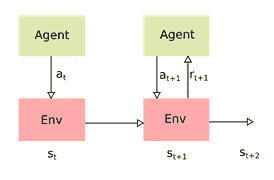

强化学习:基本交互模型

更正式的说法是，代理人 A 在时间 *t* 观察环境的状态*S[t]。代理通过采取动作 a [t] 与环境 E 进行交互。这个动作导致环境 E 在时间 *t+1* 转换到新的状态*S*[*t+1*][。当处于这种状态时， *S [t+1]* ，环境 E 发送一个标量奖励值， *r [t+1]* 给代理 a。代理现在接收这个奖励并重新计算它的策略以采取一个新的行动 *a [t+1]* 。通常，这是通过策略 *π* 来完成的，该策略将给定状态 *S* 映射到特定动作 *a* 作为: *a = π(s)* 。最优策略 *π ^** 被定义为在长时间内使从环境中获得的预期回报最大化的策略。在状态 *S* 和动作 *a* 中的预期奖励值通常作为价值函数来测量:]*

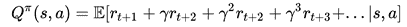

这里，γ是一个贴现因子，其值在 0 和 1 之间。有三种主要的学习策略可以解决这个问题:

*   **基于价值的 RL** :这个策略的目标是估计一个最优的价值函数， *Q*(s，a)* ，然后简单地选择一个策略，使给定的状态-动作组合的价值函数最大化
*   **基于策略的 RL** :该策略的目标是寻找一个最优策略 *π ^** 能够实现最大的未来回报
*   **基于演员-评论家的 RL** :这是一种混合策略，使用价值函数和基于策略的搜索来解决 RL 学习问题

在下面的小节中，我们将更详细地介绍这些策略。


# 基于值学习的算法

基于值学习的 RL 算法关注于为每个状态-动作对定义值的关键方面。更正式地说，它被定义为在状态 *S* 和策略 *π* 下获得的预期报酬值，如下所示:

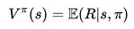

一旦定义了该价值函数，选择最优行动(或最优策略)的任务就简化为学习最优价值函数，如下所示:

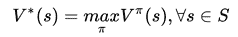

估计该函数的最优值的挑战之一是缺少完整的状态-动作转换矩阵，该矩阵捕获每个可能动作的所有可能状态转换的奖励值。克服这个问题的一个简单技巧是用质量函数代替这个值函数，也称为 Q 函数，如下所示:

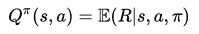

这里要注意的一个重要区别是，*Q*-函数假定一个给定的状态和动作。

因此，可以通过简单地采取使当前状态的 *Q* 函数值最大化的动作，以贪婪的方式选择最佳策略，如下所示:

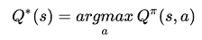

现在剩下的核心问题是计算 Q 函数的一个好的估计: *Q ^π* 。如前所示，这可以表示如下:

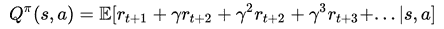

使用马尔可夫性质假设，我们假设给定当前状态，所有未来状态有条件地独立于所有过去状态。这允许我们使用逆向归纳技术在动态编程框架中求解这个方程。这类技术中最常用的算法之一是贝尔曼方程。使用贝尔曼方程，Q 函数可以递归展开如下:

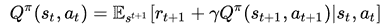

这个等式表明 *Q ^π (s，a)* 的值可以迭代改进。这允许简单的基于增量更新的方法来学习最优的 *Q* 函数，这也被称为 Q 学习:

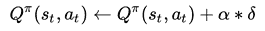

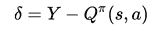

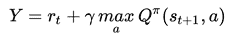

完整的 Q 学习算法可以总结如下:

```
Initialize *Q(s,a)* arbitrarily for all state and action combinations
For each episode
    Sample a state *s*
    For each step *t* of episode
        Choose action *a[t]* with a greedy policy using ***Q(s,a)*** Take action ***a[t]*** and observe reward ***r[t+1]*** and next state ***s[t+1]** *        Update ***Q(s,a)*** based on the equation above
        Update state ***s*** as *s[t+1]*  
    Repeat until ***s*** is a terminal state
```


# 基于策略搜索的算法

与基于值学习的算法相比，基于策略搜索的方法直接在策略空间下搜索最优策略 *π** 。这通常是通过策略*θ*的参数化来完成的，其中参数 *θ* 被更新以最大化奖励*ε(r |θ)*的期望值。参数 *θ* 的引入为策略搜索增加了先验信息，从而利用这些信息来限制搜索空间。

当任务是众所周知的，并且先前知识的整合可以很好地服务于学习问题时，可以经常使用这样的技术。基于策略的算法可以进一步细分为两个部分:

*   **基于无模型的策略搜索** : 这些方法使用交互值直接更新策略。因此，它们需要大量的值或样本来搜索最优策略。然而，由于它们没有强加特定的模型结构，所以它们广泛适用于许多不同的任务。
*   **基于模型的策略搜索**:这些方法基于所提供的交互值来近似模型，并使用该模型来优化策略。给定一个严格的模型假设，它们只适用于可以学习好模型的场景。另一方面，这也允许他们尽可能使用更少的值来逼近一个好的模型。


# 基于演员-评论家的算法

基于值的算法和基于策略的算法都是独立工作的，不会互相学习。基于演员-评论家的算法旨在改善这一缺点。该算法将价值函数与策略迭代算法相结合，使得策略在每次迭代时基于更新的价值函数进行更新。图，*更详细地说明了这个工作流程:*

*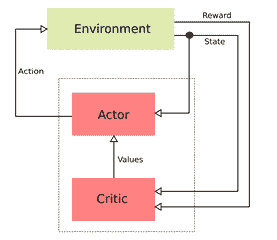

基于演员-评论家的强化学习

在上图中，您从一个**参与者**(基于策略的算法)的初始策略开始。**评论家**或价值函数从**环境**接收新的状态和奖励，并将更新的值发送回**参与者**。收到该反馈的**参与者**更新其策略，并基于该策略生成新的动作。从**评论家**接收更新的价值函数的过程可以被认为是在系统中引入偏差的一种方式。


# 深度强化学习

如前所述，任何基于 RL 的系统都没有几个核心组件。价值函数 *v (s，θ)* 或 Q 函数 *Q (s，a，θ)* ，以及策略函数 *π (a|s，θ)* ，其可以是无模型的或基于模型的。任何基于 RL 的系统的广泛适用性取决于这些估计的好坏。在实践中，现有的 Q 学习系统遭受多个缺点:

*   **维度的诅咒**:如果你要将基于 Q 学习的技术应用于高维 RL 设置，比如基于游戏屏幕图像的当前像素值预测下一次操纵杆移动。具有布尔像素值的 32×32 大小的图像将导致总共 2 个 ^(1024 个)状态。Q-learning 将需要大量的样本来有效地处理这种状态爆炸。
*   **样本相关性**:假设 Q-learning 更新以在线方式发生，连续的样本通常高度相关。这导致系统学习不稳定。

这些缺点共有的一个基本挑战是以紧凑模型的形式简洁地表示高维环境的能力。这就是深度学习的最新进展发挥重要作用的地方。如前几章所述，深度学习可以很好地执行图像建模任务，它可以将高维图像像素向量转换为紧凑的特征集，从而保留关于图像的基本语义信息。这是深度强化学习的基础。

在接下来的几个小节中，我们将介绍一些基于深度学习的技术，这些技术被引入来实现当今高性能的强化学习系统。


# 深度 Q 网(DQN)

Q-learning 已经成为大量 RL 算法的主要支柱。然而，这不能很好地扩展到高维环境，例如构建一个 RL 系统来玩 Atari 的游戏。DQN 使用一个**卷积神经网络** ( **CNN** )将这个高维状态-行为空间映射成稳定的 Q 值函数输出。图*深度 Q-network (DQN):高层架构，*在高层展示了这种交互。核心思想是 CNN 在学习结构化数据中的相关性时非常有用。因此，它们从游戏屏幕获取原始图像像素值，并学习其与最佳动作值(即操纵杆位置)的相关性，并输出相应的 Q 值。这允许我们近似一个稳定的 Q 函数:

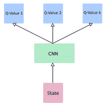

深度 Q 网络(DQN):高层架构

DQN 使用非常标准的 CNN 架构，具有三个卷积层和两个全连接层，如下表所示， *DQN CNN 架构详情*如下:

| **图层** | **输入尺寸** | **过滤器尺寸** | **过滤器数量** | **步幅长度** | **激活单元** | **输出尺寸** |
| Conv 一号 | 84 x 84 x 4 | 8 x 8 | 32 | 四 | 校正线性 | 20 x 20 x 32 |
| Conv-2 | 20 x 20 x 32 | 4 x 4 | 64 | 2 | 校正线性 | 9 x 9 x 64 |
| Conv-3 | 9 x 9 x 64 | 3 x 3 | 64 | 一 | 校正线性 | 7 x 7 x 64 |
| fc4 | 7 x 7 x 64 | 不适用的 | 512 | 不适用的 | 校正线性 | 512 |
| fc5 | 512 | 不适用的 | 18 | 不适用的 | 线性的 | 18 |

DQN CNN 建筑细节

通过近似，CNN DQN 解决了维数灾难问题。然而，由于输入序列数据的高度相关性，它仍然需要处理不稳定的学习。DQN 使用了许多不同的技巧来处理这个问题，例如:

*   体验回放
*   目标网络
*   奖励剪报


# 体验回放

经验重放背后的核心思想是将过去的经验存储在记忆中，并在学习阶段从中取样。更具体地说，在每个时间步 *t* ，DQN 存储一个 *e* [*t*] 形式的经验。为了降低序列数据的相关性，它使用均匀分布从事件缓冲区中采样事件，如下所示:

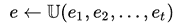

这允许网络避免由于数据相关性而导致的过度拟合。从实现的角度来看，这种基于小批量的更新可以是大规模并行的，从而缩短了训练时间。这种批量更新还减少了与环境交互的次数，并减少了每次训练更新的方差。此外，从历史事件中统一采样可以避免忘记重要的转变，否则会在在线训练中丢失。


# 目标网络

Q 学习不稳定的另一个原因是目标函数的频繁变化。这显示在以下等式中:

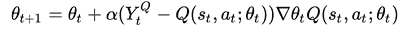

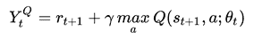

目标网络技巧每隔指定的步数(例如 1000 步)固定目标函数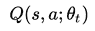的参数。每集结束时，参数会根据网络中的最新值进行更新:

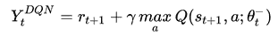


# 奖励剪报

当将 DQN 应用于不同的环境设置时，奖励点不在相同的规模上，训练变得低效。例如，在一场游戏中，一个积极的奖励会带来 100 点的额外积分，而在另一场游戏中，只有 10 点。为了在环境的所有设置中统一规范化奖励和惩罚，使用了奖励剪辑。在这种技术中，每个正奖励被削减为+1，每个负奖励被固定为-1。因此，这避免了大的权重更新，并允许网络平滑地更新其参数。


# 双 DQN

如果您注意到前一节中的 DQN 方程，那么在*Y[t]T5【DQN】中的最大值运算符使用相同的值来选择和评估特定的动作。这可以通过如下重写 DQN 函数看得更清楚:*

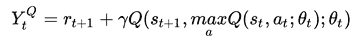

这通常会导致高估这些值，导致超过最优的 *Q* 值估计。为了举例说明这一点，让我们考虑一个场景，其中对于一组动作，我们有相同的最优 *Q* 值。但是，由于使用 Q 学习的估计是次优的，我们将得到高于或低于最优值的 Q 值。由于方程中的 max 算子，我们从最优值中选择正误差最大的动作，这个误差进一步传播到其他状态。因此，状态没有一个最佳值，而是接收这个额外的正偏差，导致值高估问题。

为了解决这个问题，设计了双 DQN。这个网络的核心思想是将选择过程与评估步骤分离。这是通过学习两个不同的价值函数来实现的，一个用于选择，一个用于评估， *θ* 和*θ’*。在每次训练更新期间，这些值中的一个用于使用贪婪策略选择动作，而另一个用于评估其更新值。这可以显示如下:

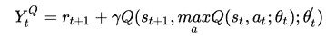

解释这种解耦机制的另一种方式是将双 DQN 视为学习两个不同的 Q 函数: *Q [1]* 和 *Q [2]* ，如下所示:

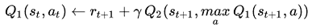

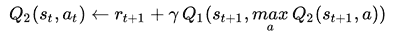


# 优先体验延迟

在上一节中，我们通过对输入序列数据进行去相关，了解了经验延迟在稳定 Q 学习中的重要性。在体验延迟中，我们使用均匀分布从体验缓冲区中对事件进行采样。这样做的效果是，就优先顺序而言，对每个历史事件都一视同仁。然而，实际上并非如此。有些事件比其他事件更有可能促进学习过程。

发现这种事件的一种方法是寻找与 Q 值的当前估计值不相符的事件。通过选择这样的事件并将其输入到学习过程中，您可以增强网络的学习能力。这个可以直观的理解；当我们在现实生活中遇到一个与我们的期望相差甚远的事件时，我们会试图找到更多这样的事件并重演它们，以便使我们的理解和期望更接近这些事件。在优先体验延迟中，我们为体验缓冲器中的每个事件 S 计算误差值如下:

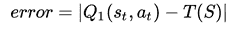

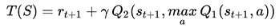

然后，我们用这个误差函数的分布对一个事件进行采样。


# 决斗 DQN

到目前为止，我们已经看到大多数 Q 学习集中在学习状态动作表 *Q (s，a)* ，该表测量特定动作 *a* 在任何给定状态 *s* 下有多好。这是通过联合学习该函数来优化处于给定状态和从该状态采取特定动作来实现的。从学习的角度来看，简单地学习处于给定状态的有用性可能更容易，而不太关心行动的价值。将状态效用与行动价值分离，可能有助于稳健地建立这些函数的模型。这形成了决斗 DQN 建筑背后的核心思想。

决斗 DQN 将 Q 学习函数分解成两个独立的函数:(A)价值函数:*【s】*和(b)优势函数:*【A】*，如下所示:

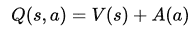

图*决斗深度 Q-网络(决斗 DQN):高级架构，*更详细地说明了决斗 DQN 架构。如图所示，CNN 模型的输出被馈入两个不同的流，一个用于学习价值函数，另一个用于优势函数。这两个函数的输出然后在最后一层合并，以学习网络的 Q 值:

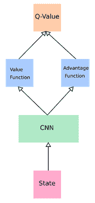

决斗深 Q 网络(决斗 DQN):高层架构


# 实现强化学习

在这一节中，我们将看看如何实现一个简单的强化学习方法。为此，我们将使用 OpenAI 的开源工具包`gym`和`universe`。`gym`是一个开发和比较不同强化学习算法的软件框架。它支持 Atari 的不同游戏环境，棋盘游戏，以及经典的控制任务。另一方面，`universe`在`gym`之上提供了一个带有客户端和服务器模块的包装器，在这里你可以可视化一个强化学习系统的进程。要在 macbook 上安装这些工具包，我们需要执行以下操作:

```
pip install gym
brew install golang libjpeg-turbo
pip install universe
```


# 简单强化学习示例

在本节中，我们将为一个游戏`DuskDrive`实现一个简单的强化学习示例:

1.  为此，我们将使用`gym`游戏环境和`universe` Docker 环境来运行它:

```
import gym
import universe

env = gym.make('flashgames.DuskDrive-v0')
env.configure(remotes=1)
```

2.  一旦环境配置为运行它，我们就将其重置为随机启动状态，如下所示:

```
observations = env.reset()
```

一旦游戏被初始化为随机开始状态，我们需要不断地提供一个动作。由于`DuskDrive`是一个赛车游戏，一个简单的策略就是使用**向上箭头**键向前移动。

3.  我们在无限循环中运行该策略，如下所示:

```
while True:
    action = [[('KeyEvent', 'ArrowUp', True)] for obs in observations]
    observation, reward, done, info = env.step(action)
    env.render()
```

4.  一旦游戏开始，你就可以在你的屏幕上看到这个策略在运行，如图*用简单的 RL 算法玩 DuskDrive。*

这举例说明了如何使用 **gym** 和 **universe** 模块来执行普通游戏的简单强化任务:

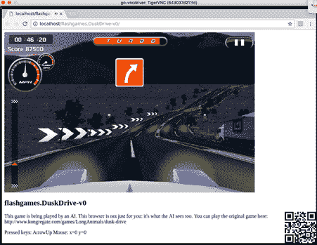

用简单的 RL 算法玩 DuskDrive


# 用 Q-learning 示例进行强化学习

在本节中，我们将使用基于TensorFlow的 Q 学习算法来实现强化学习。我们将看一个流行的游戏，`FrozenLake`，它在 OpenAI `gym`包中有一个内置的环境。`FrozenLake`游戏背后的想法很简单。它由 4 x 4 个网格块组成，每个网格块可以有以下四种状态之一:

*   **S** :起点/安全状态
*   **F** :冰面/安全状态
*   **H** :孔/不安全状态
*   **G** :目标/安全或终端状态

在 16 个单元格中的每一个中，您可以使用四个动作之一，即上/下/左/右，移动到相邻的状态。游戏的目标是从状态 **S** 开始，在状态 **G** 结束。我们将展示如何使用基于神经网络的 Q 学习系统来学习从状态 **S** 到状态**g**的安全路径。首先，我们导入必要的包并定义游戏环境:

```
import gym
import numpy as np
import random
import tensorflow as tf

env = gym.make('FrozenLake-v0')
```

一旦定义了环境，我们就可以定义学习 Q 值的网络结构。我们将使用具有`16`隐藏神经元和`4`输出神经元的一层神经网络，如下所示:

```
input_matrix = tf.placeholder(shape=[1,16],dtype=tf.float32)
weight_matrix = tf.Variable(tf.random_uniform([16,4],0,0.01))
Q_matrix = tf.matmul(input_matrix,weight_matrix)
prediction_matrix = tf.argmax(Q_matrix,1)
nextQ = tf.placeholder(shape=[1,4],dtype=tf.float32)
loss = tf.reduce_sum(tf.square(nextQ - Q_matrix))
train = tf.train.GradientDescentOptimizer(learning_rate=0.05)
model = train.minimize(loss)
init_op = tf.global_variables_initializer()
```

现在我们可以贪婪地选择行动:

```
ip_q = np.zeros(num_states)
ip_q[current_state] = 1
a,allQ = sess.run([prediction_matrix,Q_matrix],feed_dict={input_matrix: 
    [ip_q]})
if np.random.rand(1) < sample_epsilon:
  a[0] = env.action_space.sample()
next_state, reward, done, info = env.step(a[0])
ip_q1 = np.zeros(num_states)
ip_q1[next_state] = 1
Q1 = sess.run(Q_matrix,feed_dict={input_matrix:[ip_q1]})
maxQ1 = np.max(Q1)
targetQ = allQ
targetQ[0,a[0]] = reward + y*maxQ1
_,W1 = sess.run([model,weight_matrix],feed_dict={input_matrix:  
    [ip_q],nextQ:targetQ})

```

图 *RL 与 Q-learning 示例*显示了程序执行时的样本输出。当代理从一种状态移动到另一种状态时，您可以看到 Q 矩阵的不同值。当代理处于状态 **15** 时，您还会注意到奖励值 **1** :

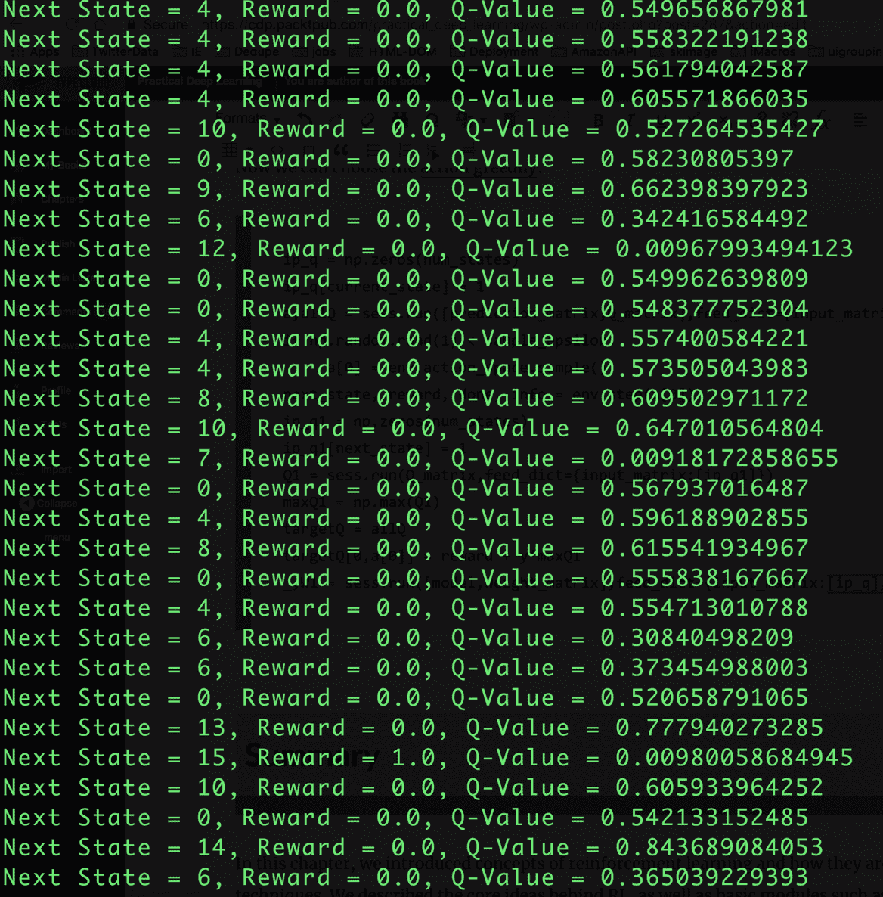

带 Q-学习示例的 RL


# 摘要

在这一章中，我们介绍了强化学习的概念，以及它们与传统监督学习技术的不同之处。我们描述了 RL 背后的核心思想，以及基本模块，如 Q 学习和策略学习，它们是当今任何强化学习技术的特征。我们还以 DRL 的形式展示了传统 RL 技术基于深度学习的进步。我们举例说明了 DRL 的各种不同的网络架构，并讨论了它们的相对优点。最后，我们概述了一些强化学习任务的核心实现，这些任务应用于一些流行的基于计算机的游戏。

在下一章，我们将看看在现实世界应用中实现深度学习模型时使用的一些实用技巧和诀窍。*