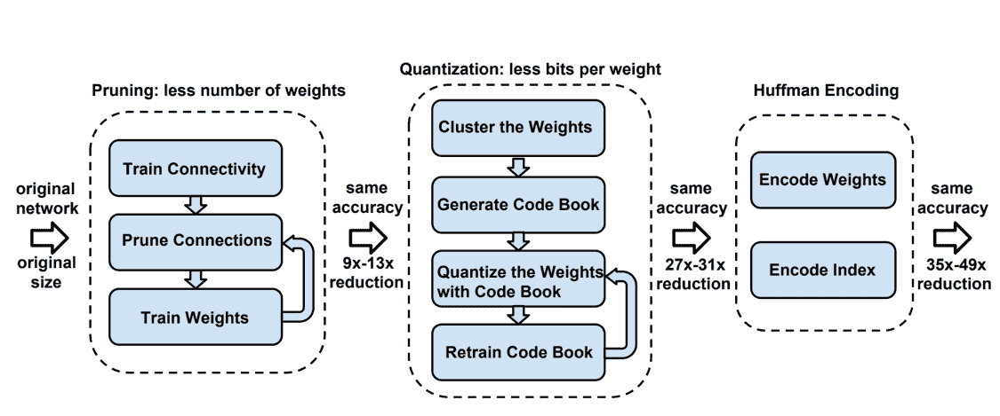

# 深度学习黑客

在这一章中，我们将涵盖许多应用深度学习的实用技巧，例如网络权重初始化的最佳实践、学习参数调整、如何防止过拟合，以及如何在面临数据挑战时为更好的学习准备数据。

读者将在他们自己开发深度学习模型的过程中经历各种重要的主题。


# 篡改你的数据

鉴于不同的问题，成功应用深度学习的最低要求各不相同。与基准数据集(如 MNIST 或 CIFAR-10)不同，真实世界的数据是杂乱且不断变化的。然而，数据是每一个基于机器学习的应用的基础。对于更高质量的数据或特征，即使是相当简单的模型也可以提供更好更快的结果。对于深度学习，类似的规则也适用。在本节中，我们将介绍一些您可以用来准备数据的常见良好实践。


# 数据清理

在开始训练之前，有必要进行一些数据清理，比如删除任何损坏的样本。例如，我们可以移除短文本、高度失真的图像、虚假的输出标签、包含大量空值的要素等等。


# 数据扩充

深度学习需要大量的训练数据，以便有效地学习，但有时，收集这样的数据可能非常昂贵，也不现实。帮助的一个方法是做数据扩充，通过人为地用标签膨胀训练集，保留变换。通过增加样品量，还有助于克服过度拟合问题:

*   经验法则——这种转换或操作必须仔细设计、实现和测试。工作技术可能是特定领域的，可能不是通用的。
*   对于图像数据，一些简单的技术包括重新缩放、随机裁剪、旋转、水平翻转、颜色抖动和添加噪声。通过添加噪声，可以教会深度学习网络在训练时处理噪声信息。例如，对于图像数据，可以添加椒盐噪声。一些更先进和复杂的技术包括使用对比度拉伸、直方图均衡化和自适应直方图均衡化来扩充图像。
*   一些开源工具提供了易于使用的数据扩充类:
    *   喀拉斯(*图像数据生成器*)【https://keras.io/preprocessing/image/】T2
    *   TensorFlow (TFLearn 的*数据增强*)[http://tflearn.org/data_augmentation/](http://tflearn.org/data_augmentation/)
    *   MXNet(Augmenter)[https://MXNet . incubator . Apache . org/API/python/image . html # MXNet . image . Augmenter](https://mxnet.incubator.apache.org/api/python/image.html#mxnet.image.Augmenter)


# 数据标准化

另一个好的做法是归一化实值输入数据。我们通过减去平均值并除以标准差来计算:

```
>> X -= np.mean(X, axis = 0) # zero-center
>>> X /= np.std(X, axis = 0) # normalize
```

这里，`X`是输入的数据。它有帮助的原因是输入数据的每个维度可能有不同的范围，并且我们在所有维度上使用相同的学习率。对数据进行标准化可以避免某些维度补偿过度或补偿不足的问题。


# 训练中的技巧

在本节中，我们将讨论一些有助于训练更好的网络的技术，包括如何初始化权重、优化参数的技巧以及如何减少过拟合。


# 重量初始化

重量初始化涉及以下技术:

*   全零
*   随机初始化
*   ReLU 初始化
*   Xavier 初始化


# 全零

首先，*而不是*使用全零初始化吗？给定适当的数据归一化，预计大约一半的网络权重为正，一半为负。然而，这并不意味着权重应该在两者之间初始化，即零。假设所有的权重都是相同的(不管它们是否为零)，意味着反向传播对于网络的不同部分会产生相同的结果，这对学习帮助不大。


# 随机初始化

按照某种分布，比如正态分布或者均匀分布，用非常小的接近于零的权重来初始化网络(称为**对称破缺**)。由于这种随机性，网络的不同部分将获得不同的更新，从而以不同的方式增长。比如，其中为零均值，单位标准差为高斯，为小数值，比如 0.01 或 0.001。或者，其中是-1 和 1 之间的均匀分布。有两个与重量相关的潜在问题。一个是非常小的权重可能导致梯度减小，因为梯度与权重值成比例，导致梯度消失问题。另一个问题是，大的权重可能导致信号在反向传播中被放大太多，从而导致更长的收敛时间。因此，设置合适的参数很重要。

一种常见的方法是使用输入节点的数量来设置它，使得节点的方差不随着输入的数量而增长，例如，其中是输入的数量，也称为**扇入**。这是为了保持网络方差的统一性。注意，这不考虑 ReLU 的情况。

例如，在单行 Python 代码中，可能如下所示:

```
>>> w = np.random.randn(n_in) / sqrt(n_in)
```


# ReLU 初始化

具体针对 ReLU，何等人在他们的论文*深入挖掘整流器:在 ImageNet 分类上超越人类水平的性能*(【https://arxiv.org/abs/1502.01852】)中，为 ReLU 设计了一个具体的初始化为。

例如，在单行 Python 代码中，可能如下所示:

```
>>> w = np.random.randn(n_in) * sqrt(2.0/n_in)
```

我们如何理解这一点？直观上，整流线性单元的一半输入为零，因此我们需要将权重方差的大小加倍，以保持信号的方差恒定。


# Xavier 初始化

Xavier Glorot 和 Yoshua Bengio 在他们的论文中提出了另一种被称为 **Xavier** ，*理解训练深度前馈神经网络*([http://proceedings.mlr.press/v9/glorot10a/glorot10a.pdf](http://proceedings.mlr.press/v9/glorot10a/glorot10a.pdf))的初始化方式。他们的主要目标是防止梯度消失和过大的权重问题(因为反向传播与权重值成比例增长)。换句话说，Xavier 初始化试图同时解决以下两个问题:

*   如果网络中的权重开始时太小，那么信号在通过每一层时就会缩小，直到太小而没有用
*   如果网络中的权重开始过大，那么信号会随着它通过每一层而增长，直到它过大而无用

Glorot 和 Bengio 提出了一个更合适的标准偏差值，，其中是之前节点/输入(扇入)的数量，是输出的数量，也称为**扇出**。

总的来说，下表总结了初始化策略:

| **类别** | **用于**差异的公式 | **注释** |
| 基本初始化器 |  | 何等初始值设定项 |
|  | 为了 ReLU | Xavier(或 Glorot)初始化器: |
|  |  | 最佳化 |


# 优化是学习的一个重要部分。我们使用优化来最小化目标函数(`error`函数),以学习正确的网络权重和结构。

虽然已经开发了许多高级优化算法，但最常用的优化方法仍然是**随机梯度下降** ( **SGD** )及其变体，例如，基于动量的方法、AdaGrad、Adam 和 RMSProp。我们将主要以 SGD 为基础进行讨论。不同于传统的梯度下降方法，在传统的梯度下降方法中，通过对所有训练样本进行计算来更新参数一次，SGD 仅使用单个或几个训练样本来简单地更新和计算参数的梯度。通常建议在每一步针对多个训练样本(称为**小批量**)计算梯度，这通常更稳定。

学习率


# 学习速率对于快速收敛至关重要。学习率决定了每次迭代时模型参数应与损失函数的**梯度成比例地更新多少:**

选择一个合适的学习速度可能很困难。学习率太小会导致训练和收敛非常慢，而学习率太大会导致超调和反弹，并导致损失函数在最小值附近波动甚至发散。


有几种方法可以设置学习率:

**常数**:学习率在所有时期保持不变

*   **阶跃衰减**:学习率每隔 *t* 个周期衰减一次
*   **倒数衰减**:学习率随时间倒数衰减，
*   **指数衰减**:学习率按自然指数函数衰减，
*   通常，阶跃衰减是首选，因为它最简单、最直观，并且根据经验效果很好。还有，只有一个额外的超参数， *t* ，需要设置( *t* = 2，10)。

在实践中，您可以尝试使用一组较小的数据，将学习率设置为对数间隔值 10^(-1)，10^(-2)，10^(-3)，…。然后，将它缩小到误差最小的一个，并以此为起点。或者，将学习率设置为 0.01 可能是一个安全的赌注。在学习期间，每隔 *t* 个时期降低学习率(例如 *t* = 10)。请记住，适当的学习速度高度依赖于你的数据和你的问题。

除了之前提到的仍然需要一些手动决策的传统方法之外，幸运的是还有许多新开发的方法，例如基于动量的方法，其基于误差函数的曲率来改变学习速率。此外，还有大量关于 SGD 变化的研究，它们具有不需要手动设置的自适应学习率，例如 AdaGrad、Adam(推荐)和 RMSProp。

那么在实践中应该使用哪种优化器呢？肯定是帮助我们的模型正确学习并且快速收敛的一个。一个好的做法是从步长衰减学习率开始。对于自适应学习速率，Adam 经常被发现工作良好，并优于其他自适应技术。如果您的输入数据是稀疏的，那么 SGD 和基于动量的方法可能会表现不佳。因此，对于稀疏数据集，应该使用自适应学习率方法之一。

小批量


# 请注意，在 SGD 中，我们经常使用小批量执行权重更新，这通常在 *32/64-256* 个样本之间。将其与批量梯度下降进行比较，批量梯度下降计算整个训练数据的梯度。SGD 占用更少的内存，并且不太容易落在真正糟糕的点上(鞍点)，因为小样本集携带的噪声有助于局部最小值的逃脱。与通过对数据集的单个实例计算的梯度来更新参数的纯 SGD 相比，小批量 SGD 也比每次循环整个数据集一个样本更稳定和更有效(具有相对较快的收敛)。

剪辑渐变


# 在非常深的网络中，比如循环网络(也可能是循环网络)，梯度可以很快变得很小或很大，梯度下降的局域性假设就失效了。Mikolov 首先提出的解决方案是将梯度裁剪到最大值，这在 RNNs 中产生了很大的差异。

选择损失函数


# `loss`函数用于测量预测值(ŷ)和实际标签(y)之间的不一致性，并指导训练过程。基本上，`loss`功能决定了我们希望网络走向何方。

多类分类


# 对于分类问题(每个样本只包含或涉及一个类别)，均方误差(MES/L2 损失)和交叉熵损失被广泛使用。此外，softmax 通常用于最后一层，当类的数量非常大时，可以选择分层的 softmax。这种情况下，铰链损耗和平方铰链损耗也没问题。另一个注意事项是，应该记住 softmax 作为挤压函数将概率(总和为 1)分配给每个类，因此一个类的输出值/概率并不独立于其他类的概率。

多类多标签分类


# 对于多标签多类分类问题，即当每个样本可以有许多正确答案时，sigmoid 函数通常用于神经网络模型的输出层(不应用 softmax)。由于每个类别的概率独立于其他类别的概率，因此可以使用每个类别概率的阈值，因此一个样本可以获得多个标签。在这种情况下，交叉熵损失仍然是最常用的损失函数，但与多类分类方案相比，其公式略有不同。在 TensorFlow 中，可以选择`sigmoid_cross_entropy_with_logits`([https://www . tensor flow . org/API _ docs/python/TF/nn/sigmoid _ cross _ entropy _ with _ logits](https://www.tensorflow.org/api_docs/python/tf/nn/sigmoid_cross_entropy_with_logits))作为`loss`函数。

回归


# 对于回归，通常使用传统的欧几里得损失和 L1 损失。

其他人


# 对于不同的问题，为了更好地确定估计值与基本事实之间的差异，目标函数可以是不同的(注意，基本事实可能不仅仅是像检测问题中那样的标度类标签)。例如，对于对象检测问题，有一个名为`focal loss`的`loss`函数，它向标准交叉熵标准添加了一个因子，以帮助学习专注于一组稀疏的硬示例，并防止大量容易否定的内容在训练期间淹没检测器。

防止过度拟合


# 为了防止过度拟合，最简单的方法是执行以下操作:

通过减少单元、层和其他参数的数量来减小模型大小

*   在成本函数的权重范数上添加正则化项(L1 或 L2)
*   此外，在接下来的章节中，我们还可以在训练中使用其他一些技巧。

批量标准化


# 防止过度拟合的一种流行技术是批量标准化，它将层标准化，并允许我们训练标准化权重。在训练期间，每层输入的分布随着前几层参数的变化而变化。由于需要较低的学习率和仔细的参数初始化(记住本章权重初始化部分的讨论)，这减慢了训练。批量标准化通过标准化每个小批量的输入来解决这个问题(所谓的**内部协变量移位**)。这使得我们可以使用更高的学习率，并且不用太在意初始化。它还起到了规范作用，在某些情况下消除了辍学的必要性。批量标准化可以应用于网络中的任何层，并且通常被认为是非常有效的，即使是在诸如 CycleGAN 的生成对抗网络中使用。

拒绝传统社会的人


# Dropout 的工作原理是在训练过程中从指定的层中随机删除一个神经元，或者断开某个连接。在训练时，从具有 *p = 0.5* 的伯努利分布中随机采样神经元(注意，在测试时，所有神经元都被使用，但权重值减半)。这有助于减少神经元之间的共同适应(一个特征不能只在特定的其他特征存在时有用)。每个神经元变得更加健壮，并显著提高了训练速度。下图显示了两个时期的网络结构，从中我们可以看出，从本质上来说，通过 Dropout，我们在每个时期都形成了不同的网络架构，总的来说，这个过程可以被认为是模型打包的一种形式:

提前停止


# 早期停止是指我们通过在单独的验证集上监控性能来训练网络，并在验证错误开始增加或没有足够改善时停止训练。杰夫·辛顿称之为*美好的免费午餐*。

微调


# 迁移学习是一种技术，其中我们利用预训练的神经网络，该网络根据类似但更全面的数据进行训练，并微调模型的某些部分，以最佳地解决类似领域中的当前问题。关于微调的更多细节，请参见本章的*微调*部分。

微调


# 在许多常见的实践中，数据是有限的。训练深度神经网络(如 ConvNet)可能会导致过度拟合，conv net 在一小组数据上有数百万个参数。为了避免这种问题，一种常见的做法是利用在更大的数据集上训练的现有深度神经网络，如 ImageNet(120 万标记图像)，并在手头的较小数据集上对其进行微调，这并没有显著的不同；也就是说，使用这个新的更小的数据集来继续训练现有的网络。正如我们所讨论的，深度学习网络的优势之一是，前几层通常代表从数据中挖掘出的更通用的模式。微调本质上是利用从大量数据中获得的常识，并将其应用于特定的领域/应用。例如，ConvNet 中的前几个图层可能会捕捉曲线和边缘等通用特征，这些特征与大多数图像相关问题相关且有用。

何时使用微调


# 在考虑是否使用微调时，有两个主要因素—新数据集的大小及其与原始数据集的相似性。以下是您可以利用微调的两种情况:

当新数据/域与用于训练现有模型的数据/域相似，并且新数据集很小时

*   当您的新数据集与预训练模型中使用的数据差异很大，但有足够的样本时，您甚至可以对大量图层进行微调，但学习率很低
*   何时不使用微调


# 在一些情况下，您可能希望求助于其他技术而不是微调:

当新的数据/域与用于训练现有模型的数据/域完全不同时。在这种情况下，如果有足够的数据量，从头开始训练模型可能是更好的解决方案。

*   当新数据集非常小时，例如，少于 2000 个样本。在这种情况下，继续用如此小的数据集进行训练仍然可能导致过度拟合。然而，人们可以使用现有的网络作为特征学习器，从早期层提取特征，并馈入传统的机器学习模型，如 SVM。例如，可以将 ConvNet 中完全连接的层之前的中间层的输出作为特征，并训练线性 SVM 用于分类目的。
*   技巧和技术


# 以下是一些微调的一般准则:

替换最后一个完全连接的层。微调的一个常见做法是用针对您自己问题的新层结构(softmax)替换最后一个或两个完全连接的层(softmax)。例如，在 AlexNet 和 ConvNet 中，输出有 1000 个类。人们可以用期望的类的数量来替换具有 1000 个节点的最后一层。

*   使用较小的学习速率。由于网络的大部分参数已经被训练，并且我们假设这些层包含来自数据的有用的、通用的模式信息，所以目标不是过度调整这些层，而是训练这些层——例如，新的、最后几层以适应我们自己的问题。因此，我们应该使用较小的训练速率，这样扰动就不会太大或太快。一个好的做法是将初始学习速率设置为比用于从头开始训练的速率小 10 倍。您可以测试此参数以获得最佳结果。
*   正如我们在上一项中提到的，我们希望现有的网络，尤其是前几层，包含有用的、通用的功能。因此，有时我们可以冻结预训练网络的前几层的权重，以保持它们完好无损。这也有助于避免微调过程中的过度拟合。
*   预训练模型列表


# 这里的表格列出了一些在线资源，您可以在这些资源中找到使用 Caffe、TensorFlow 等的现有模型。GitHub 和 Google 是找到许多最先进的模型或适合您自己问题的模型的好地方:

**平台**

| **捆绑现有热门车型** | **链接** | 咖啡 |
| Model Zoo:第三方贡献者分享预先训练好的 Caffe 模型的平台。 | [https://github.com/BVLC/caffe/wiki/Model-Zoo](https://github.com/BVLC/caffe/wiki/Model-Zoo) | 张量流 |
| TensorFlow 模型包含在 TensorFlow 中实现的许多不同的模型，包括官方模型和研究模型。研究模型部分包含许多在不同领域训练的模型，例如图像分类、对象检测和 im2txt。 | 将 Caffe 模型转换为 TensorFlow。[https://github.com/tensorflow/models](https://github.com/tensorflow/models)和 | https://github.com/ethereon/caffe-tensorflow火炬 |
| LoadCaffe 是一个将现有 Caffe 模型移植到 Torch7 的工具。 | torch 的过热-加载现有的过热模型(NYU 的 ConvNet)。【https://github.com/szagoruyko/loadcaffe】T4 和 | [https://github.com/jhjin/overfeat-torch](https://github.com/jhjin/overfeat-torch)克拉斯 |
| Keras 包含一些最受欢迎的先进 Convnet 模型，如 VGG16/19、Xception、ResNet50 和 InceptionV3 | [https://keras.io/applications/](https://keras.io/applications/) | MxNet |
| **mxnet 模型图库**维护预训练的 Inception-BN (V2)和 Inception V3。 | [https://github.com/dmlc/mxnet-model-gallery](https://github.com/dmlc/mxnet-model-gallery) | 模型压缩 |


# 深度学习网络以结构深度复杂著称，参数可以上百万，模型规模也是如此。然而，对于这个移动时代，即使硬件和 CPU/GPU 能力快速提高，一切都需要轻便和即时。客户希望高级应用可以随时随地在设备上运行，而不会将任何个人信息上传到服务器或云端。

深度学习最重要的特征不幸地成为快速、在线、移动应用的障碍。有许多实时应用、移动应用、可穿戴应用促进了便携式深度学习的发展，即具有有限资源，例如存储器、CPU、能量和带宽的高级系统。

深度压缩显著减少了神经网络所需的计算和存储。压缩的目标和好处通常包括以下内容:

更小的尺寸:将尺寸缩小 30-50 倍，以适应移动应用程序的要求

*   准确性:没有或可接受的准确性损失
*   加速:更快的推理还是实时
*   离线:不依赖网络连接，保护用户隐私
*   低功耗:高能效
*   模型比较的方法一般有两类，一类是巧妙设计一个更简洁但性能相似的网络，例如:转移/压缩卷积滤波器、知识提取。另一种方法是压缩模型，即采用现有的深度学习模型，通过修剪最终结果中不太重要的不必要部分(神经元、连接)或通过应用低秩因子分解等变换来消除信息性参数来压缩模型。

俞成等人在他们的新调查*深度神经网络的模型压缩和加速调查* (2017)中总结了不同的模型压缩方法如下:

Yu Cheng and others in their new survey *A Survey of Model Compression and Acceleration for Deep Neural Networks* (2017) summarize different approaches of model compression as follows:

《深度神经网络模型压缩与加速研究综述》(2017)中的不同模型压缩方法汇总表


已经取得了一些好的结果，例如，在李和其他人的工作*中，为有效的 convnets* 剪枝过滤器，作者能够将 16 的推理时间减少多达 34%，将 ResNet 110 的推理时间减少多达 38%。在韩等人的【深度压缩:】深度压缩:用剪枝、训练量化和霍夫曼编码压缩深度神经网络 (2016)中，作者能够在 ImageNet 数据集上将 AlexNet(60 M 参数)所需的存储减少 35 倍，即从 240 MB 减少到 6.9 MB，而不损失精度。对于 VGG-16 模型(130 M 参数)，他们的方法能够将模型的大小从 552 MB 减少到 11.3 MB，减少了 49 倍，同样没有损失精度。这允许将模型装配到片上 SRAM(静态随机存取存储器)高速缓存中，而不是片外**动态随机存取存储器** ( **DRAM** )。这篇论文获得了 2016 年 ICLR 最佳论文奖。该方法包括三个部分:网络剪枝、权重分配和霍夫曼编码。修剪将权重的数量减少了 10 倍，而量化进一步提高了压缩率:在 27 倍和 31 倍之间。霍夫曼编码提供了更多的压缩:在 35 倍和 49 倍之间。压缩率已经包括了稀疏表示的元数据。压缩方案不会导致任何精度损失。下图显示了比较的三个阶段:

来自韩论文《深度压缩:用剪枝、训练量化和霍夫曼编码压缩深度神经网络》(，2016)的三级压缩流水线:剪枝、量化和霍夫曼编码



第一步是*网络修剪*，在这一步中，具有低于某一阈值的小权重的连接被从网络中移除。由于这种移除，性能可能受到影响，因此，修剪后的网络被重新训练以学习新的稀疏设置中的最终权重。

第二步是*权重量化和共享*。该流程如下图所示:

权重量化和分享的图解来自宋寒博士论文深度学习的高效方法和硬件，2017(网址:)


假设该层有 4 个输入和 4 个输出，权重矩阵的大小为 4 x 4(左上)。该权重矩阵中的条目首先被分组/聚类成 4 个质心(用 4 种颜色表示)，其柱索引为 0-3，质心值为(-1.00、0.00、1.50 和 2.00)。然后我们可以通过它们的 bin 索引来量化权重矩阵。在训练期间，为了更新当前网络权重，梯度由标记的权重箱索引/颜色分组。落入同一容器中的梯度首先通过 sum 聚合，作为质心的微调值。质心值减去微调值以获得微调后的质心。来自同一层的权重如果属于同一聚类，将共享相同的权重。权重不是跨层共享的。

在第三步中，对权重值应用霍夫曼编码，这节省了 20%到 30%的网络存储。

与深度学习的其他领域相比，深度压缩仍然非常年轻，但它非常重要，因为世界现在主要生活在移动设备上。关于应该使用哪种方法进行压缩，几乎没有实用的建议:

剪枝和共享可以给出合理的压缩率，性能损失不大，结果也更稳定

*   剪枝和共享或低秩因子分解方法都需要预训练的模型
*   如果从零开始训练，可以采用转移紧滤波器(仅针对层)和蒸馏类型的方法，或者可以尝试韩在他们的论文 *DSD:用于深度神经网络的密集-稀疏-密集训练* (2017)中提出的【】密集-稀疏-密集 ( **DSD**
*   可以联合利用不同的压缩方法，这意味着可以结合两种或更多种技术来最大化压缩率或推理速度
*   请记住，在修剪或其他类型的转换后，有时需要重新训练以保持性能
*   在于成等人的调查论文*深度神经网络的模型压缩和加速调查* (2017)中可以找到其他几个很好的建议。感兴趣的用户可以更深入一点。

摘要


# 在本章中，我们讨论了一些重要的提示和技巧，可用于为深度学习、优化/训练以及利用现有的预训练模型准备数据。在实践中，您可能会面临这些通用/标准技术无法直接解决的复杂场景。然而，一个经验法则是，你应该总是从试图更好地理解你的数据和问题开始，同时深入学习过程(例如，利用一些可视化工具)以理解信息是如何被网络处理和学习的。这样的理解在你调试模型和改进结果的时候将会是极其有价值的。

在下一章，我们将经历深度学习的各种趋势。

In the next chapter, we will be going through various trends in deep learning.