# 十、深度学习趋势

到目前为止，我们已经在本书中介绍了许多深度学习材料。在这一章中，我们将总结深度学习中即将出现的一些想法。具体来说，我们将回答以下问题:

*   新开发的算法的未来趋势是什么？
*   深度学习有哪些新的应用？

# 深度学习的最新模型

最近提出了许多深度学习技术，将深度学习的核心思想扩展到新的应用和学习场景。在这一节中，我们将介绍两个最近引人注目的模型。

# 生成对抗网络

最近，机器学习的一个热门领域已经看到了深度学习技术的使用，这就是生成学习。生成学习可以被定义为从特征和标签中学习联合概率估计 *P(x，y)* 的技术。它建立了一个标签的概率模型，可以对缺失数据和噪声数据具有鲁棒性。此外，这种模型还可以用于生成样本，这些样本可以进一步用于训练高级机器学习模型。另一方面，判别模型学习将数据 *x* 映射为标签 *y* 的函数，从而学习条件概率分布 *P(y|x)* 。虽然近年来，判别模型在机器学习任务中显示出有希望的结果，但是生成模型相对于判别模型有其自身的优势。对生成模型的这种兴趣大多可以追溯到它们理解和解释没有任何标签的数据的底层结构的能力。

**生成性 A****dversarial Network**(**GAN**)是一个最近出现的想法，它试图将生成性学习和鉴别性学习的思想结合起来。GAN 背后的核心思想是有两个对立或竞争的模型。第一个模型充当生成模型，并试图基于固有的概率分布生成看起来真实的数据样本。通常，这是通过向数据样本的潜在空间添加一些噪声来实现的。第二个模型是一个鉴别器，它接收来自生成模型的生成样本以及来自训练数据集的真实样本，并被要求区分这两个来源。来自鉴别器的结果被反馈给生成器，生成器微调其数据生成方案，以更好地适应来自训练数据集的真实世界图像。

这两个对立的网络进行着一场持续的竞争游戏，其中生成器模型学习产生越来越真实的数据样本，而鉴别器模型在区分真实数据和生成数据方面变得更好。最终，一旦训练收敛，生成的样本就变得无法与真实世界的数据区分开来。下图*生成对抗网络*概述更详细地说明了这一概念:

生成对抗网络概述(来源:https://www . LinkedIn . com/pulse/gans-one-hot-topics-machine-learning-al-gharakhanian/)

# 胶囊网络

胶囊网络是深度学习的最新发展之一。它们旨在解决**卷积神经网络** ( **CNN** )的现有局限性。CNN 已经显示出学习图像特征的非凡能力，这些特征对于方向和空间变化是不变的。然而，CNN 中对象的核心表示只是这种不变特征的无序集合。它不了解这些特征之间的相对空间关系。例如，只要面部特征出现在图像中，训练有素的识别人脸的 CNN 仍然会检测到扭曲的人脸的合成图像(面部特征，例如鼻子和眼睛在错误的位置)。这是因为所有经过训练的 CNN 过滤器都会对正常人脸的大多数面部特征产生强烈的激活。如果我们更深入地观察跨层的滤波器交互，我们将认识到 CNN 有效地汇集了前一层的激活，以减少输入到下一层的数据的大小。这通常是通过最大池操作完成的。由于 max 函数不保持顺序，并且只产生集合的最大值，因此前面图层中的过滤器动作的相对空间顺序丢失。

胶囊网络背后的关键思想是通过使用来自计算机图形的想法来解决这种共享的限制。在计算机图形学中，有一种叫做**渲染图**的技术，它是物理对象到现实世界图像的内部表示。物理对象的这种内部表示是一种分层表示，它也考虑了对象的相对位置。这也称为姿态，它只是一个对象的平移和旋转参数的组合。胶囊网络的中心思想是保持对象部分之间的层次姿势关系。这种方法的另一个优点是，它需要最少量的训练数据来学习类似人类的模型。这是对现有模型(如 CNN)的巨大改进，现有模型需要大量的训练数据来实现最佳性能。胶囊网络的当前实现比现代深度学习技术慢。然而，在未来几年，更多的创新是否会导致胶囊网络的更快训练还有待观察。

# 新颖的应用

到目前为止，在本书中，我们已经看到了深度学习在文本挖掘、计算机视觉和多模型学习领域的大量应用。然而，学习数据的强大、通用表示的能力导致了深度学习的新应用领域数量的最近激增。这些应用领域从医疗保健到软件工程，再到计算机系统组织。在这一部分，我们将看看深度学习在这些领域中的一些有趣的新应用。

# 基因组学

深度学习的一个有趣的应用领域是基因组学，其中先进的 CNN 模型用于从大型和高维的 DNA 数据集学习结构。该领域最早的应用之一是使用手工制作的特征和全连接的前馈神经网络来预测外显子的剪接活性。最近，一项名为 *Basset 的开源实现形式的新技术被提出:用深度卷积神经网络*([http://genome . cs hlp . org/content/early/2016/05/03/gr . 200535.115 . abstract](http://genome.cshlp.org/content/early/2016/05/03/gr.200535.115.abstract))学习可及基因组的监管代码，该技术可预测 164 种细胞类型的基因可及性(DNase I 超敏感性)。为了解决这个问题，Basset 使用了深度 CNN。为了将基因可及性预测问题公式化为基于 ConvNet 的分类问题，Basset 首先将输入的基因序列编码成一个 hot code 序列，如下图所示，*Basset 基因可及性预测工作流程概述*。这通常通过将输入基因序列转换成具有四行的一键序列矩阵来实现(DNA 链 ACGT 的每个核苷酸碱基一行，代表腺嘌呤、鸟苷、鸟嘌呤和胸腺嘧啶)。这种表示与具有类似矩阵表示的输入图像非常接近。这个一位热编码序列现在被馈送到第一卷积层，该卷积层使用一组预定义的位置、加权矩阵(滤波器)并将它们卷积以生成滤波器响应。该响应通过整流线性单元传递，通过该单元执行最大汇集操作。在随后的卷积层上重复该过程。最后，两个完全连接的层将这些卷积输出映射到一个 164 维的概率分布中，该概率分布表示 164 种细胞类型中每一种的基因可及性的可能性。下图*Basset 基因可及性预测工作流程概述*更详细地说明了这一过程:

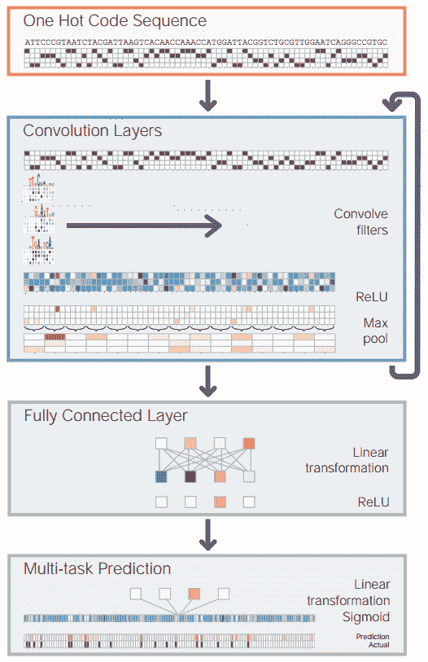

Basset 基因可及性预测工作流程概述(来源:http://genome . cs hlp . org/content/early/2016/05/03/gr . 200535.115 . full . pdf+html)

使用 CNN 进行基因可及性预测的一个额外优势是，您可以将学习到的过滤器可视化，并将它们与众所周知的序列动机相关联。下图，*将从 CNN 学习到的基序与已知的顺式-BP 基序进行比对，*显示了两个这样的例子。左边的第一个动机是关键的 CTCF 基因动机，该动机由网络使用一组 12 个过滤器来学习。这些过滤器中的一些如下所示，并且示出了学习的过滤器与已知动机形式的对齐。基因 **NR1H2** 也显示了类似的学习，其中模型学习了两组不同的过滤器，代表已知 **NR1H2** 动机的两个不同区域:

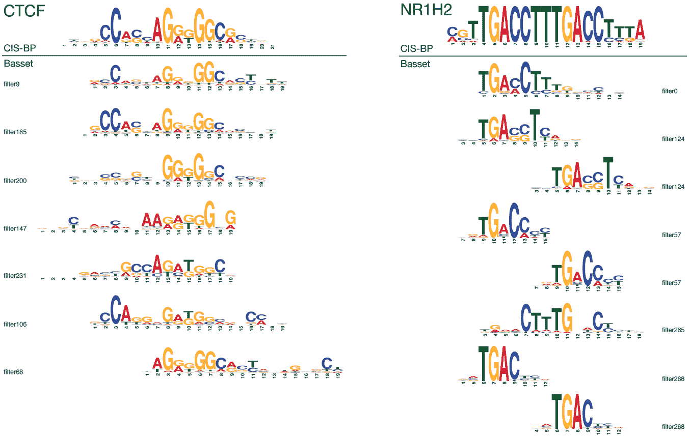

将从 CNN 获得的基序与已知的顺式-BP 基序进行比对(来源:http://genome . cs hlp . org/content/early/2016/05/03/gr . 200535.115 . full . pdf+html)

下图，*Basset 中的深度卷积神经网络架构，*详细描述了网络架构的轮廓，并显示了三个卷积层，后面是两个完全连接的层，其中包含丢失正则化:

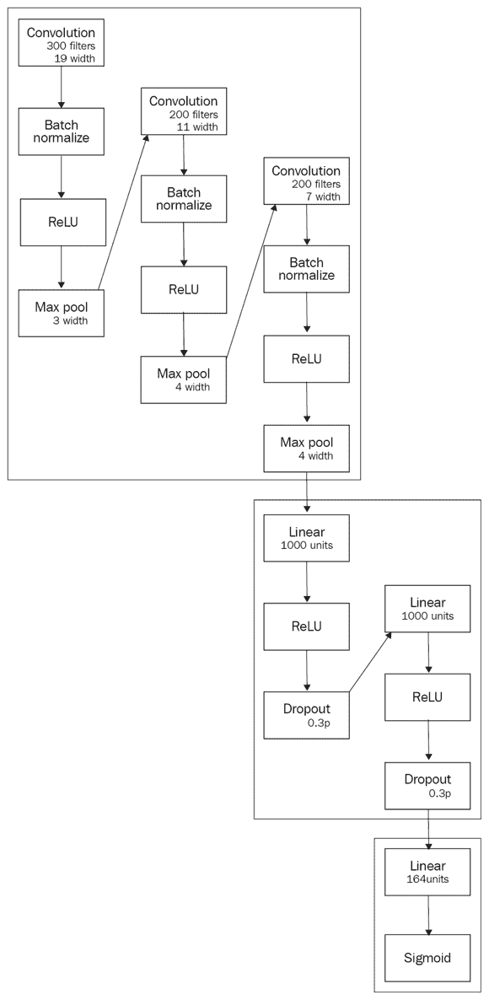

Basset 中的深度卷积神经网络架构(来源:http://genome . cs hlp . org/content/early/2016/05/03/gr . 200535.115 . full . pdf+html)

# 预测医学

深度学习的另一个有趣的应用是预测医学，其目标是对通常具有长期时间依赖性的患者疾病和诊断过程进行建模。 *DeepCare:预测医学的深度动态记忆模型*(【https://arxiv.org/pdf/1602.00357.pdf】T2)是最近推出的深度动态神经网络，试图解决这个问题。它使用来自患者电子医疗记录的信息创建患者病历地图，根据患者当前的住院情况推断当前的疾病状态，并预测未来的医疗结果。DeepCare 建立在**长期短期记忆** ( **LSTM** )的基础上，对其稍作修改，以捕捉不规律的住院时间和干预。下图， *DeepCare:承认嵌入和修改 LSTM 作为疾病的载体，*说明了 DeepCare 的作用。对于在时间 **t** 的任何给定入院，患者接受诊断以及医疗程序。来自这两个领域的信息本质上是分类的，并且需要被转换到连续的特征空间。DeepCare 使用常用的词嵌入模型将诊断和医疗特征转换为实值特征向量。该特征向量现在是 LSTM 的输入，用于进一步建模:

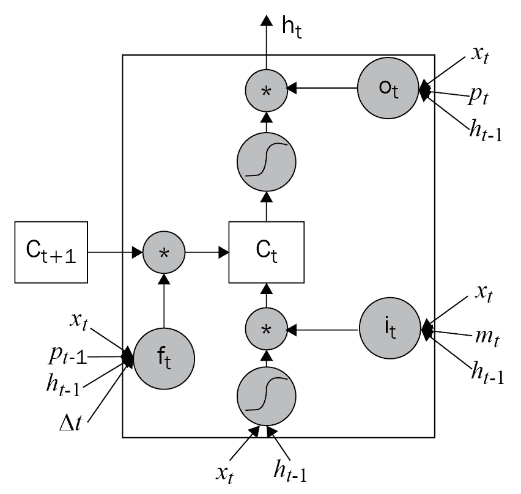

深度护理:承认嵌入和修改 LSTM 作为疾病的载体

下图， *DeepCare LSTM 架构概述，*更详细地描述了 DeepCare LSTM 架构。如图所示，底层接收变换的特征向量，该向量通过 LSTM 来计算潜在疾病状态的相应序列*h[0]， *h [1]* ...*h[n]。为了考虑住院跨度的不同长度，在疾病状态之上应用多尺度加权池，以产生串联的潜在疾病空间表示。最后，该潜在疾病表示被馈送到输出分类器，用于医疗干预的最终分类:**

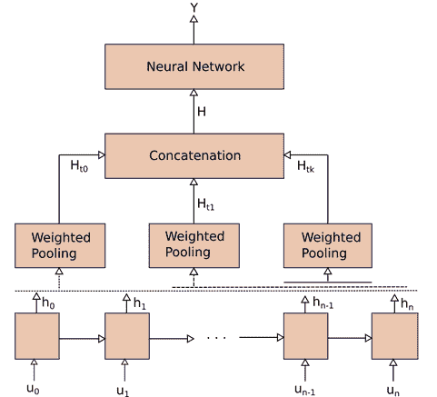

DeepCare LSTM 架构概述

# 临床成像

随着深度学习模型在计算机视觉中的成功，深度学习在临床数据上的最早应用之一是临床成像。更具体地说，使用脑磁共振成像扫描分析来预测阿尔茨海默病的发作受到了广泛的关注。CNN 因执行这些任务而变得流行。

最近，帕扬和他们的合著者([https://arxiv.org/pdf/1502.02506.pdf](https://arxiv.org/pdf/1502.02506.pdf))提出了一项 3D CNNs 的神经成像研究，用于预测阿尔茨海默病。这项工作不同于其前身，因为它使用了两种深度学习模型来实现其目标，即备用自编码器和 3D 卷积网络。下图，*老年痴呆症预测深度学习网络，*概述了这种深度学习模型的架构。如图所示，输入 **MRI 扫描**首先通过**稀疏自编码器**，其学习高维输入扫描的低维嵌入。这个低维被用来初始化 3D 卷积网络的不同层上的滤波器。对网络进行预训练后，通过使用原始扫描作为原始输入，对卷积网络进行简单的微调。卷积网络的输出被映射到三节点输出层。输出层的三个节点代表疾病的三个阶段，分别是**老年痴呆症** ( **AD** )、**轻度认知障碍** ( **MCI** )、健康认知 ( **HC** ):

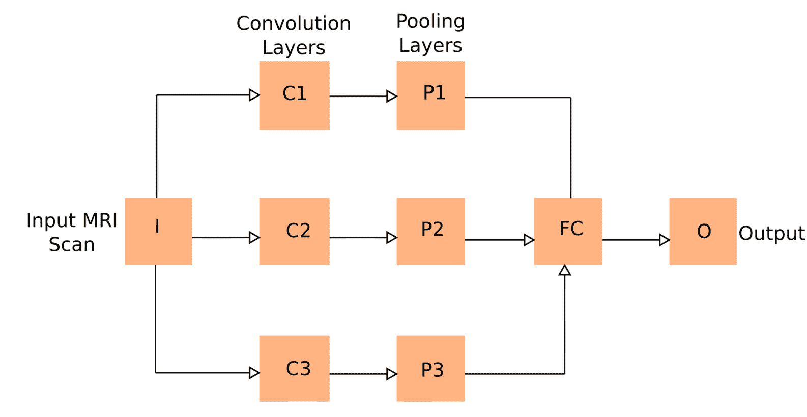

阿尔茨海默预测深度学习网络

# 唇读

深度学习的另一个有趣应用是野外唇读句子。Chung 和他们的合作者()在他们最近的工作中提出了一种通过说话的人脸识别口语单词的方法，不管有没有音频。这个模型背后的核心思想是一个“看-听-听-拼”的网络。该网络将每个输出字符、*y[I]建模为所有先前字符的条件分布、 *y < i* 、嘴唇图像的输入视觉序列、 *x* ^(*v*) 、和输入音频序列、 *x ^a* 建模为:*

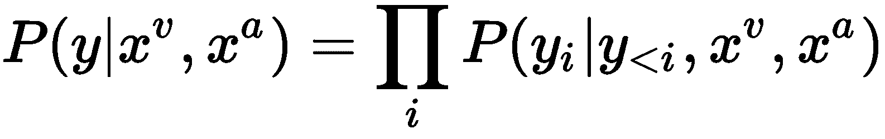

下图，*使用观察、倾听、注意和拼写架构*的唇读应用程序概述，总结了所提出的模型，该模型由以下三个组件组成:

*   **观察网络**:该模块获取输入的嘴唇图像，并将其通过 CNN，随后传递到 LSTM 的循环网络。
*   **监听网络**:这个网络是一个 LSTM 编码器，从原始音频中提取特征。在这个网络中，使用了 13 维**梅尔倒谱系数** ( **MFCC** )特征。
*   **拼写网络**:这个网络是基于一个 LSTM 传感器，增加了双注意机制。在每个时间步，这个网络产生一个角色和两个注意力向量。这些注意力向量对应于来自观看和收听网络的输出状态，并用于从中选择适当的图像和音频样本:

使用观察、倾听、参与和拼写架构的唇读应用程序概述(来源:https://arxiv.org/pdf/1611.05358v1.pdf)

# 视觉推理

批判性推理经常被吹捧为人工智能代理最难解决的问题之一。视觉推理是一种特殊形式的批判性推理任务，其目标是使用图像来回答问题。下图，*一个视觉推理问题的例子，*展示了一个视觉推理问题的例子。给定原始图像，可以提出两种问题:

*   **非相关问题**:这些是迎合图像中一个特定对象的问题
*   **关系问题**:这些问题需要了解图像中的多个对象，以及它们在图像中的关系:

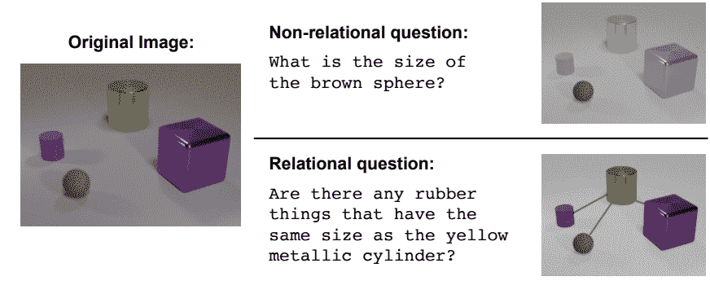

一个视觉推理问题的例子(来源:https://arxiv.org/pdf/1706.01427.pdf)

桑托罗和他们的合著者([https://arxiv.org/pdf/1706.01427.pdf](https://arxiv.org/pdf/1706.01427.pdf))最近提出了一个**关系网络** ( **RN** )，试图解决之前描述的视觉推理问题。这个网络使用多个深度学习模型来执行其任务。如下图所示，*视觉推理网络*，推理网络以一个问题和图像对作为输入，产生一个文本响应。输入的问题被馈送到 LSTM 网络，该网络计算嵌入的问题向量。另一方面，输入图像被馈送到 4 层 CNN，该 CNN 计算表示图像的多个特征图。执行特征图的坐标式切片，这产生一组对象。生成对象的所有成对组合，并与问题向量组合以生成三元组。这个三元组现在通过一个多层感知器。这个感知器的输出被求和并被馈送到另一个 softmax 分类器，以生成所有候选答案的概率分布:

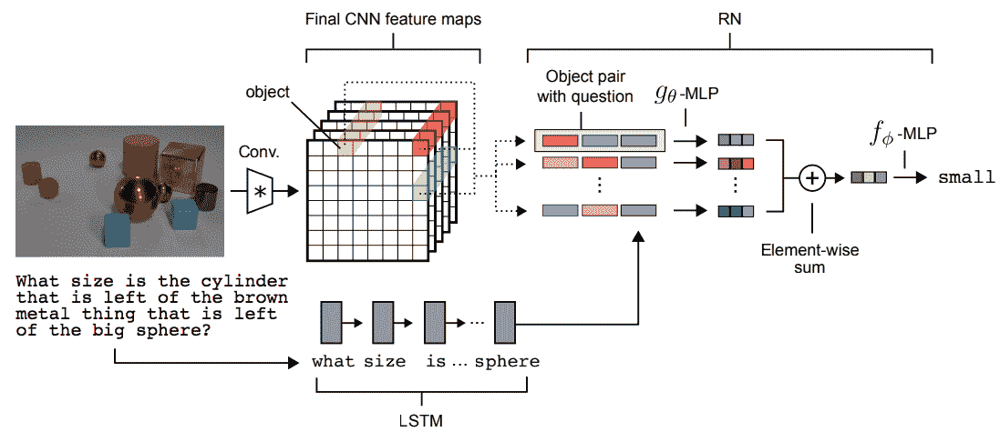

视觉推理网络(来源:https://arxiv.org/pdf/1706.01427.pdf)

# 代码合成

人工智能的宏伟愿景之一是能够根据文本描述编写计算机程序。这个问题通常被称为代码合成。贝尔特拉梅利和他们的合著者([https://arxiv.org/pdf/1705.07962.pdf](https://arxiv.org/pdf/1705.07962.pdf))最近提出了一个名为 **pix2code** 的系统，试图在某种程度上解决这个问题。该系统的目标是将一个**图形用户界面** ( **GUI** )截图作为其输入，并生成**领域特定语言** ( **DSL** )代码，该代码可以进一步编译为源代码。下图，*一个 pix2code 的例子:左边的 GUI 快照被转换成右边的简单 DSL，*左边显示了这样一个输入截图的例子，右边显示了相应的 DSL:

    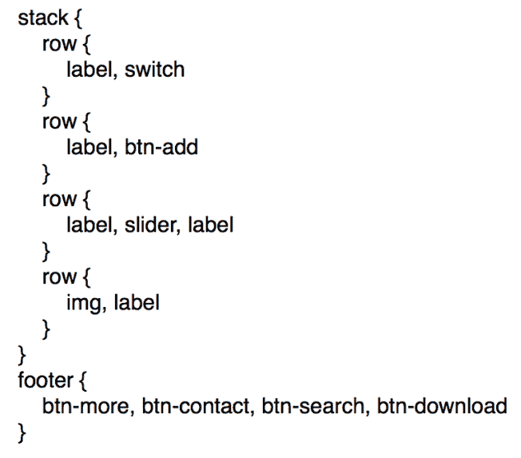

pix2code 示例:左边的 GUI 快照被转换为右边的简单 DSL(来源:https://arxiv.org/pdf/1705.07962.pdf)

pix2code 系统有两个模块:训练和解码。训练模块将 GUI 屏幕截图以及 DSL 令牌序列作为其输入。GUI 截屏被馈送到 CNN，CNN 将其转换成特征向量。DSL 令牌序列被馈送到 LSTM，后者将其映射到输出向量。最后，LSTM 和 CNN 的输出被合并，并通过第二个 LSTM，生成下一个 DSL 令牌。下图，*pix 2 code 培训架构概述，*说明了该培训流程:

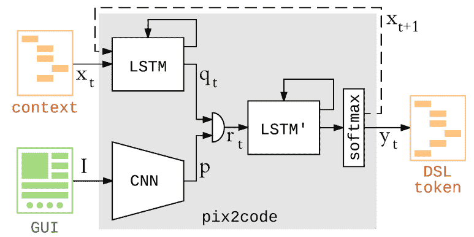

pix2code 培训架构概述(来源:https://arxiv.org/pdf/1705.07962.pdf)

一旦 pix2code 模型被训练，它就被应用到一个新的 GUI 屏幕截图。这是通过解码模块实现的，该解码模块采用 GUI 和先前预测的 DSL 令牌的上下文，并发出最可能的 DSL 令牌。要解码的输入上下文现在用这个预测的标记来更新，并且重复这个过程，直到由解码器生成结束定界符标记。所有预测记号的序列现在被编译成目标代码块。下图，*pix 2 code 解码架构概述，*概述了此解码过程:

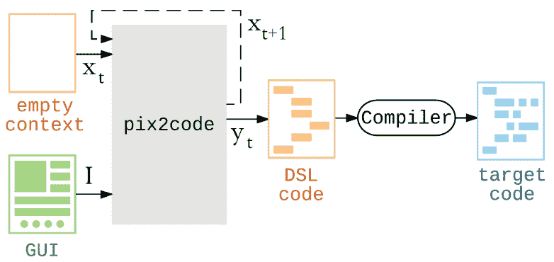

pix2code 解码架构概述(来源:https://arxiv.org/pdf/1705.07962.pdf)

pix2code 显示了一些有希望的结果，在生成正确的 DSL 令牌方面的准确率为 77%。下图， *Pix2code 结果:左边是地面真值，右边是生成的 UI，*展示了 Pix2code 的一个定性例子，左边是地面真值 UI，右边是系统生成的 UI。可以看出，pix2code 能够可靠地生成除了两个以外的所有 GUI 元素:

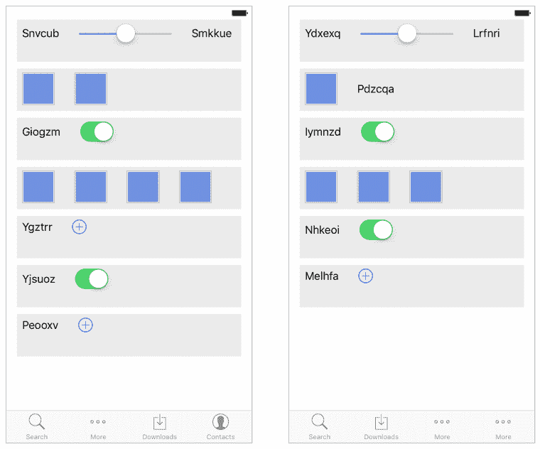

Pix2code 结果:左边是地面实况，右边是生成的 UI(来源:https://arxiv.org/pdf/1705.07962.pdf)

# 摘要

在这一章中，我们概述了深度学习研究的一些新方向。我们介绍了流行的基于深度学习的生成建模技术背后的核心概念，如生成对抗网络。

我们还讨论了胶囊网络背后的关键思想以及它们旨在解决什么问题。最后，我们讨论了深度学习目前正在应用的一些新的应用领域。我们详细描述了这些应用，并展示了深度学习模型如何用于在这些领域实现卓越的性能。

在本书中，我们试图从从业者的角度将深度学习中的关键思想汇集在一起。我们真诚地希望您喜欢这本书，并向我们提供反馈以改进未来的版本。