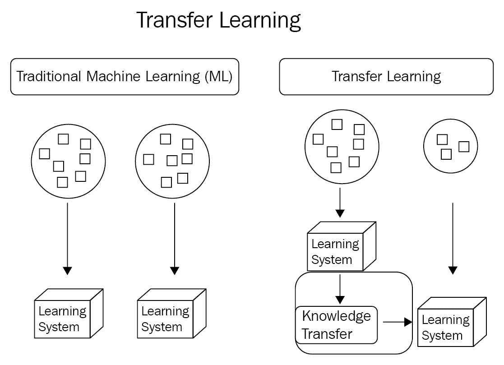
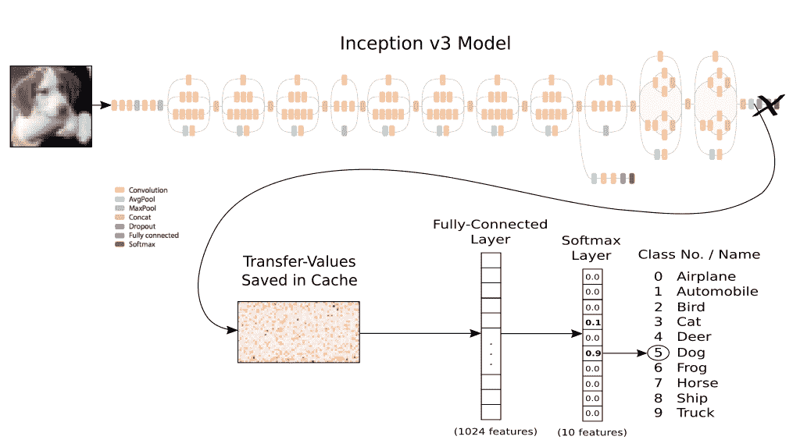
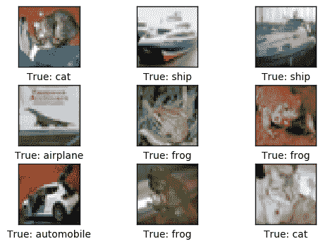
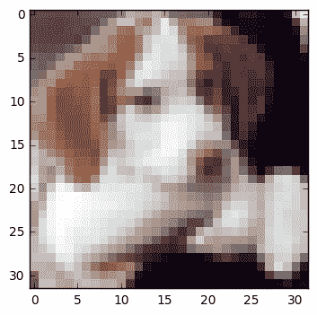
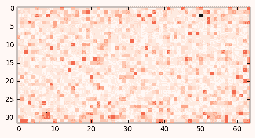
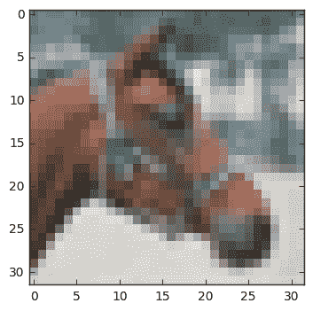
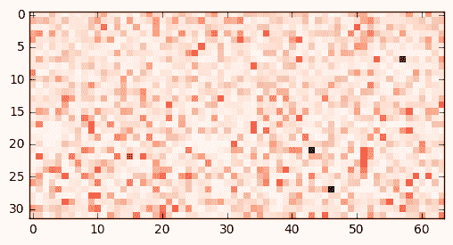
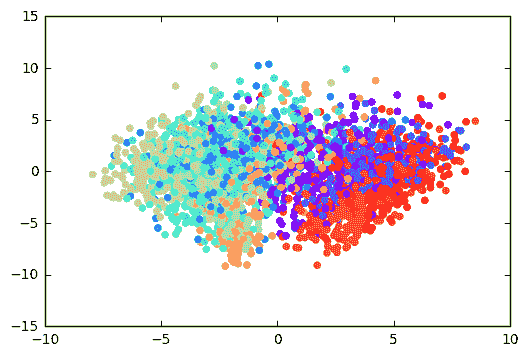
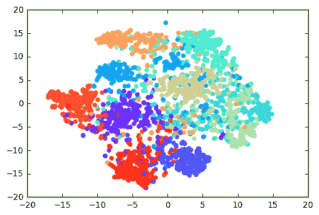
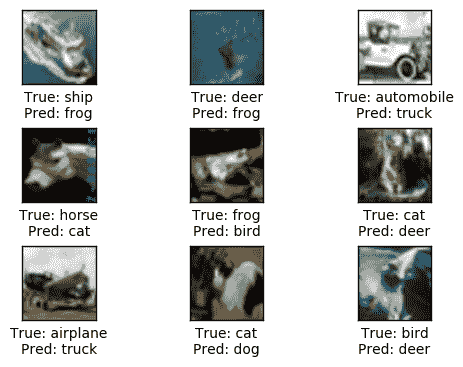

# 对象检测–使用 CNN 进行迁移学习

“个人如何从一种情境转移到另一种具有相似特征的情境”

–*e . l .桑代克*， *R. S .伍德沃斯(1991)*

**迁移学习** ( **TL** )是数据科学中的一个研究问题，主要关注的是将在解决一个特定任务过程中获得的知识持久化，并使用这些获得的知识来解决另一个不同但相似的任务。在这一章中，我们将使用 TL 演示数据科学领域中使用的一种现代实践和常见主题。这里的想法是如何从具有非常大的数据集的域到具有较小数据集的域获得帮助。最后，我们将重温 CIFAR-10 的对象检测示例，并尝试通过 TL 减少训练时间和性能误差。

本章将涵盖以下主题:

*   迁移学习
*   CIFAR-10 目标探测再探


# 迁移学习

深度学习架构是数据贪婪的，在训练集中有几个样本不会让我们从中获得最佳效果。TL 通过将从解决大数据集任务中学到或获得的知识/表示转移到另一个不同但相似的小数据集任务来解决这个问题。

TL 不仅在小训练集的情况下有用，而且我们可以使用它来使训练过程更快。从零开始训练大型深度学习架构有时会非常慢，因为我们在这些架构中有数百万个权重需要学习。取而代之的是，某人可以通过微调一个他/她试图解决的类似问题的学习权重来利用 TL。


# TL 背后的直觉

让我们用下面的师生类比来建立 TL 背后的直觉。教师在他/她所教的模块方面有多年的经验。另一方面，学生可以从老师的讲课中获得这个主题的概要。所以你可以说老师是在用一种简洁紧凑的方式把他们的知识传递给学生。

教师和学生的相同类比可以应用于我们在深度学习或一般神经网络中转移知识的情况。因此，我们的模型从数据中学习一些表示法，这由网络的*权重*来表示。这些习得的表征/特征(权重)可以转移到另一个不同但相似的任务中。这种将学习到的权重转移到另一个任务的过程将减少深度学习架构收敛的巨大数据集的需求，与从头开始训练模型相比，它还将减少使模型适应新数据集所需的时间。

深度学习现在应用广泛，但是通常大多数人在训练深度学习架构的时候都在用 TL；他们很少从零开始训练深度学习架构，因为大多数时候很少有足够大的数据集可供深度学习收敛。所以在像`ImageNet`这样拥有大约 120 万张图片的大型数据集上使用预先训练好的模型，并将其应用到你的新任务中是非常常见的。我们可以使用预训练模型的权重作为特征提取器，或者我们可以用它来初始化我们的架构，然后根据您的新任务对它们进行微调。使用 TL 有三种主要场景:

*   **使用卷积网络作为固定特征提取器** : 在这种情况下，您可以在大型数据集(如 ImageNet)上使用预训练的卷积模型，并将其用于解决您的问题。例如，ImageNet 上预先训练的卷积模型将具有完全连接的层，该层具有 ImageNet 的 1，000 个类别的输出分数。所以您需要删除这一层，因为您对 ImageNet 的类不再感兴趣。然后，将所有其他图层视为特征提取器。使用预训练模型提取特征后，您可以将这些特征提供给任何线性分类器，如 softmax 分类器，甚至线性 SVM。

*   **微调卷积神经网络**:第二种情况与第一种情况有关，但需要额外的努力，使用反向传播来微调新任务的预训练权重。通常，人们保持大多数层固定不变，只对网络的顶端进行微调。试图微调整个网络或甚至大部分层可能会导致过度拟合。因此，您可能只对那些与图像的语义级特征相关的层感兴趣。让早期层保持固定的直觉是，它们包含大多数成像任务中常见的通用或低级特征，如角、边等。如果要引入模型预训练的原始数据集中不存在的新类，则对网络的较高级别或顶端层进行微调将非常有用。

    

图 10.1:为新任务微调预训练的 CNN

*   **预先训练的模型**:第三种广泛使用的场景是下载人们在互联网上提供的检查点。如果您没有强大的计算能力来从零开始训练模型，那么您可能会选择这种场景，因此您只需使用发布的检查点来初始化模型，然后进行一些微调。


# 传统机器学习和目标语言的区别

正如你从上一节注意到的，我们应用机器学习的传统方式和涉及 TL 的机器学习之间有着明显的区别(如下图所示 *)* 。在传统的机器学习中，你不会将任何知识或表示转移到任何其他任务，而在 TL 中则不是这样。有时，人们会以错误的方式使用 TL，所以我们要提到几种情况，在这些情况下，你只能使用 TL 来最大化收益。

以下是应用 TL 的条件:

*   与传统的机器学习不同，源和目标任务或域不必来自相同的分布，但它们必须相似
*   如果训练样本较少或者没有必要的计算能力，也可以使用 TL



图 10.2:传统机器学习与使用 TL 的机器学习


# CIFAR-10 目标探测-重访

在前一章中，我们在 CIFAR-10 数据集上训练了一个简单的**卷积神经网络** ( **CNN** )模型。这里，我们将演示使用预训练模型作为特征提取器的情况，同时移除预训练模型的全连接层，然后我们将这些提取的特征或传输的值馈送到 softmax 层。

此实施中的预训练模型将是初始模型，它将在 ImageNet 上进行预训练。但是请记住，这个实现是建立在前两章介绍 CNN 的基础上的。


# 解决方案大纲

同样，我们将替换预训练的先启模型的最终完全连接层，然后使用先启模型的其余部分作为特征提取器。所以，我们首先在初始模型中输入我们的原始图像，它将从中提取特征，然后输出我们所谓的转移值。

在从 inception 模型中获得提取的特性的转移值之后，您可能需要将它们保存到您的桌面上，因为如果您是在运行中完成的话，这将会花费一些时间，因此将它们保存到您的桌面上以节省您的时间是很有用的。在 TensorFlow 教程中，他们使用术语瓶颈值而不是转移值，但这只是完全相同的东西的不同名称。

在获得转移值或从桌面加载它们之后，我们可以将它们提供给为我们的新任务定制的任何线性分类器。这里，我们将把提取的转移值输入到另一个神经网络，然后为 CIFAR-10 的新类别进行训练。

下图显示了我们将遵循的一般解决方案大纲:



图 10.3:使用带有 TL 的 CIFAR-10 数据集的对象检测任务的解决方案概要


# 装载和探索 CIFAR-10

让我们从导入该实现所需的包开始:

```
%matplotlib inline
import matplotlib.pyplot as plt
import tensorflow as tf
import numpy as np
import time
from datetime import timedelta
import os

# Importing a helper module for the functions of the Inception model.
import inception
```

接下来，我们需要加载另一个助手脚本，用于下载正在处理的 CIFAR-10 数据集:

```
import cifar10
#importing number of classes of CIFAR-10
from cifar10 import num_classes
```

如果您还没有这样做，您需要为 CIFAR-10 设置路径。这个路径将被`cifar-10.py`脚本用来保存数据集:

```
cifar10.data_path = "data/CIFAR-10/"

The CIFAR-10 dataset is about 170 MB, the next line checks if the dataset is already downloaded if not it downloads the dataset and store in the previous data_path:

cifar10.maybe_download_and_extract</span>()

Output:

- Download progress: 100.0%
Download finished. Extracting files.
Done.
```

让我们看看 CIFAR-10 数据集中的类别:

```
#Loading the class names of CIFAR-10 dataset
class_names = cifar10.load_class_names()
class_names
```

输出:

```
Loading data: data/CIFAR-10/cifar-10-batches-py/batches.meta
['airplane',
 'automobile',
 'bird',
 'cat',
 'deer',
 'dog',
 'frog',
 'horse', 
 'ship',
 'truck']
Load the training-set. 
```

这将返回`images`，类别号为`integers`，类别号为称为`labels`的独热编码数组:

```
training_images, training_cls_integers, trainig_one_hot_labels = cifar10.load_training_data()
```

输出:

```
Loading data: data/CIFAR-10/cifar-10-batches-py/data_batch_1
Loading data: data/CIFAR-10/cifar-10-batches-py/data_batch_2
Loading data: data/CIFAR-10/cifar-10-batches-py/data_batch_3
Loading data: data/CIFAR-10/cifar-10-batches-py/data_batch_4
Loading data: data/CIFAR-10/cifar-10-batches-py/data_batch_5
Load the test-set.
```

现在，让我们对测试集做同样的事情，加载图像和它们对应的目标类的整数表示，以及它们的独热编码:

```
#Loading the test images, their class integer, and their corresponding one-hot encoding
testing_images, testing_cls_integers, testing_one_hot_labels = cifar10.load_test_data()

Output:

Loading data: data/CIFAR-10/cifar-10-batches-py/test_batch
```

让我们看看 CIFAR-10 中训练集和测试集的分布情况:

```
print("-Number of images in the training set:\t\t{}".format(len(training_images)))
print("-Number of images in the testing set:\t\t{}".format(len(testing_images)))
```

输出:

```
-Number of images in the training set:          50000
-Number of images in the testing set:           10000
```

让我们定义一些帮助器函数，它们将使我们能够探索数据集。以下辅助函数在网格中绘制一组九个图像:

```
def plot_imgs(imgs, true_class, predicted_class=None):

    assert len(imgs) == len(true_class)

    # Creating a placeholders for 9 subplots
    fig, axes = plt.subplots(3, 3)

    # Adjustting spacing.
    if predicted_class is None:
        hspace = 0.3
    else:
        hspace = 0.6
    fig.subplots_adjust(hspace=hspace, wspace=0.3)

    for i, ax in enumerate(axes.flat):
        # There may be less than 9 images, ensure it doesn't crash.
        if i < len(imgs):
            # Plot image.
            ax.imshow(imgs[i],
                      interpolation='nearest')

            # Get the actual name of the true class from the class_names array
            true_class_name = class_names[true_class[i]]

            # Showing labels for the predicted and true classes
            if predicted_class is None:
                xlabel = "True: {0}".format(true_class_name)
            else:
                # Name of the predicted class.
                predicted_class_name = class_names[predicted_class[i]]

                xlabel = "True: {0}\nPred: {1}".format(true_class_name, predicted_class_name)

            ax.set_xlabel(xlabel)

        # Remove ticks from the plot.
        ax.set_xticks([])
        ax.set_yticks([])

    plt.show()
```

让我们继续想象测试集中的一些图像以及它们对应的实际类:

```
# get the first 9 images in the test set
imgs = testing_images[0:9]

# Get the integer representation of the true class.
true_class = testing_cls_integers[0:9]

# Plotting the images
plot_imgs(imgs=imgs, true_class=true_class)
```

输出:



图 10.4:测试集的前九幅图像


# 初始模型转移值

正如我们前面提到的，我们将在 ImageNet 数据集上使用预训练的 inception 模型。所以，我们需要从网上下载这个预先训练好的模型。

让我们从定义初始模型的`data_dir`开始:

```
inception.data_dir = 'inception/'
```

预训练的初始模型的权重大约是 85 MB。如果它不在先前定义的`data_dir`中，下面的代码行将下载它:

```
inception.maybe_download()

Downloading Inception v3 Model ...
- Download progress: 100%
```

我们将加载 inception 模型，以便我们可以将其用作 CIFAR-10 图像的特征提取器:

```
# Loading the inception model so that we can inialized it with the pre-trained weights and customize for our model
inception_model = inception.Inception()
```

正如我们前面提到的，计算 CIFAR-10 数据集的传输值需要一些时间，因此我们需要缓存它们以供将来使用。谢天谢地，在`inception`模块中有一个助手函数可以帮助我们做到这一点:

```
from inception import transfer_values_cache
```

接下来，我们需要为缓存的训练和测试文件设置文件路径:

```
file_path_train = os.path.join(cifar10.data_path, 'inception_cifar10_train.pkl')
file_path_test = os.path.join(cifar10.data_path, 'inception_cifar10_test.pkl')
print("Processing Inception transfer-values for the training images of Cifar-10 ...")
# First we need to scale the imgs to fit the Inception model requirements as it requires all pixels to be from 0 to 255,
# while our training examples of the CIFAR-10 pixels are between 0.0 and 1.0
imgs_scaled = training_images * 255.0

# Checking if the transfer-values for our training images are already calculated and loading them, if not calculate and save them.
transfer_values_training = transfer_values_cache(cache_path=file_path_train,
                                              images=imgs_scaled,
                                              model=inception_model)
print("Processing Inception transfer-values for the testing images of Cifar-10 ...")
# First we need to scale the imgs to fit the Inception model requirements as it requires all pixels to be from 0 to 255,
# while our training examples of the CIFAR-10 pixels are between 0.0 and 1.0
imgs_scaled = testing_images * 255.0
# Checking if the transfer-values for our training images are already calculated and loading them, if not calcaulate and save them.
transfer_values_testing = transfer_values_cache(cache_path=file_path_test,
                                     images=imgs_scaled,
                                     model=inception_model)

```

如前所述，在 CIFAR-10 数据集的训练集中，我们有 50，000 张图像。所以让我们检查这些图像的传递值的形状。对于该训练集中的每个图像，应该是 2，048:

```
transfer_values_training.shape
```

输出:

```
(50000, 2048)
```

我们需要对测试集做同样的事情:

```
transfer_values_testing.shape
```

输出:

```
(10000, 2048)
```

为了直观地理解传递值的样子，我们将定义一个帮助函数，使我们能够使用来自训练集或测试集的特定图像的传递值绘图:

```
def plot_transferValues(ind):
    print("Original input image:")

    # Plot the image at index ind of the test set.
    plt.imshow(testing_images[ind], interpolation='nearest')
    plt.show()

    print("Transfer values using Inception model:")

    # Visualize the transfer values as an image.
    transferValues_img = transfer_values_testing[ind]
    transferValues_img = transferValues_img.reshape((32, 64))

    # Plotting the transfer values image.
    plt.imshow(transferValues_img, interpolation='nearest', cmap='Reds')
    plt.show()
plot_transferValues(i=16)

Input image:
```


Figure 10.5: Input image

使用 inception 模型转移图像的值:



图 10.6:图 10.3 中输入图像的传递值

```
plot_transferValues(i=17)
```



图 10.7:输入图像

使用 inception 模型转移图像的值:



图 10.8:图 10.5 中输入图像的传递值


# 转移价值分析

在这一节中，我们将对刚刚从训练图像中获得的传递值进行一些分析。此分析的目的是看这些转移值是否足以对 CIFAR-10 中的图像进行分类。

对于每个输入图像，我们有 2048 个传递值。为了绘制这些转移值并对其进行进一步分析，我们可以使用维度缩减技术，如 scikit-learn 的**主成分分析** ( **PCA** )。我们将把传递值从 2，048 减少到 2，以便能够可视化，并查看它们是否是区分不同类别 CIFAR-10 的良好特征:

```
from sklearn.decomposition import PCA
```

接下来，我们需要创建一个 PCA 对象，其中组件的数量只有`2`:

```
pca_obj = PCA(n_components=2)
```

将传递值从 2，048 减少到 2 需要很多时间，因此我们将从 5，000 个具有传递值的图像中选择 3，000 个作为子集:

```
subset_transferValues = transfer_values_training[0:3000]
```

我们还需要获得这些图像的类别号:

```
cls_integers = testing_cls_integers[0:3000]
```

我们可以通过打印传输值的形状来仔细检查我们的子集设置:

```
subset_transferValues.shape
```

输出:

```
(3000, 2048)
```

接下来，我们使用 PCA 对象将传递值从 2，048 减少到 2:

```
reduced_transferValues = pca_obj.fit_transform(subset_transferValues)
```

现在，让我们看看 PCA 减少过程的输出:

```
reduced_transferValues.shape
```

Output:

```
(3000, 2)
```

将传递值的维数减少到只有 2 后，让我们绘制这些值:

```
#Importing the color map for plotting each class with different color.
import matplotlib.cm as color_map

def plot_reduced_transferValues(transferValues, cls_integers):

    # Create a color-map with a different color for each class.
    c_map = color_map.rainbow(np.linspace(0.0, 1.0, num_classes))

    # Getting the color for each sample.
    colors = c_map[cls_integers]

    # Getting the x and y values.
    x_val = transferValues[:, 0]
    y_val = transferValues[:, 1]

    # Plot the transfer values in a scatter plot
    plt.scatter(x_val, y_val, color=colors)
    plt.show()

```

这里，我们绘制了来自训练集的子集的减少的转移值。我们在 CIFAR-10 中有 10 个类，所以我们要用不同的颜色来绘制它们对应的传递值。从下图中可以看出，转移值是根据相应的类进行分组的。组之间的重叠是因为 PCA 的减少过程不能适当地分离转移值:

```
plot_reduced_transferValues(reduced_transferValues, cls_integers)
```



Figure 10.9: Transfer values reduced using PCA

我们可以使用称为 **t-SNE** 的不同降维方法对我们的转移值做进一步分析:

```
from sklearn.manifold import TSNE

```

同样，我们将减少传输值的维数，即 2，048，但这次减少到 50 个值，而不是 2:

```
pca_obj = PCA(n_components=50)
transferValues_50d = pca_obj.fit_transform(subset_transferValues)
```

接下来，我们将第二种降维技术进行叠加，并将 PCA 过程的输出提供给它:

```
tsne_obj = TSNE(n_components=2)
```

最后，我们使用 PCA 方法的缩减值，并对其应用 t-SNE 方法:

```
reduced_transferValues = tsne_obj.fit_transform(transferValues_50d) 
```

并仔细检查它的形状是否正确:

```
reduced_transferValues.shape
```

输出:

```
(3000, 2)
```

让我们用 t-SNE 方法画出减少的传递值。正如您在下图中看到的，t-SNE 比 PCA 能够更好地分离分组传递值。

从该分析中得出的结论是，我们通过将输入图像馈送到预训练的初始模型而获得的提取的转移值可以用于将训练图像分成 10 个类别。由于下图中的小重叠，这种分离不会 100%准确，但我们可以通过对预训练模型进行一些微调来消除这种重叠:

```
plot_reduced_transferValues(reduced_transferValues, cls_integers)
```



图 10.10:使用 t-SNE 减少转移值

现在，我们有了从训练图像中提取的传递值，我们知道这些值将能够在某种程度上区分 CIFAR-10 的不同类别。接下来，我们需要构建一个线性分类器，并将这些传递值提供给它来进行实际的分类。


# 模型构建和培训

因此，让我们从指定输入占位符变量开始，这些变量将被输入到我们的神经网络模型中。第一个输入变量(将包含提取的传递值)的形状将是`[None, transfer_len]`。第二个占位符变量将以独热向量格式保存训练集的实际类标签:

```
transferValues_arrLength = inception_model.transfer_len
input_values = tf.placeholder(tf.float32, shape=[None, transferValues_arrLength], name='input_values')
y_actual = tf.placeholder(tf.float32, shape=[None, num_classes], name='y_actual')
```

我们还可以通过定义另一个占位符变量来获得从 1 到 10 的每个类的相应整数值:

```
y_actual_cls = tf.argmax(y_actual, axis=1)
```

接下来，我们需要构建实际的分类神经网络，它将接受这些输入占位符并生成预测的类:

```
def new_weights(shape):
    return tf.Variable(tf.truncated_normal(shape, stddev=0.05))

def new_biases(length):
    return tf.Variable(tf.constant(0.05, shape=[length]))

def new_fc_layer(input,          # The previous layer.
                 num_inputs,     # Num. inputs from prev. layer.
                 num_outputs,    # Num. outputs.
                 use_relu=True): # Use Rectified Linear Unit (ReLU)?

    # Create new weights and biases.
    weights = new_weights(shape=[num_inputs, num_outputs])
    biases = new_biases(length=num_outputs)

    # Calculate the layer as the matrix multiplication of
    # the input and weights, and then add the bias-values.
    layer = tf.matmul(input, weights) + biases

    # Use ReLU?
    if use_relu:
        layer = tf.nn.relu(layer)

    return layer

# First fully-connected layer.
layer_fc1 = new_fc_layer(input=input_values,
                             num_inputs=2048,
                             num_outputs=1024,
                             use_relu=True)

# Second fully-connected layer.
layer_fc2 = new_fc_layer(input=layer_fc1,
                             num_inputs=1024,
                             num_outputs=num_classes,
                             use_relu=False)

# Predicted class-label.
y_predicted = tf.nn.softmax(layer_fc2)

# Cross-entropy for the classification of each image.
cross_entropy = \
    tf.nn.softmax_cross_entropy_with_logits(logits=layer_fc2,
                                                labels=y_actual)

# Loss aka. cost-measure.
# This is the scalar value that must be minimized.
loss = tf.reduce_mean(cross_entropy)

```

然后，我们需要定义一个将在分类器训练期间使用的优化标准。在这个实现中，我们将使用`AdamOptimizer`。这个分类器的输出将是 10 个概率分数的数组，对应于我们在 CIFAR-10 数据集中的类的数量。然后，我们将对这个数组应用`argmax`操作，将得分最高的类分配给这个输入样本:

```
step = tf.Variable(initial_value=0,
                          name='step', trainable=False)
optimizer = tf.train.AdamOptimizer(learning_rate=1e-4).minimize(loss, step)
y_predicted_cls = tf.argmax(y_predicted, axis=1)
#compare the predicted and true classes
correct_prediction = tf.equal(y_predicted_cls, y_actual_cls)
#cast the boolean values to fload
model_accuracy = tf.reduce_mean(tf.cast(correct_prediction, tf.float32))
```

接下来，我们需要定义一个 TensorFlow 会话，该会话将实际执行图形，然后初始化我们在该实现中前面定义的变量:

```
session = tf.Session()
session.run(tf.global_variables_initializer())

```

在这个实现中，我们将使用**随机梯度下降** ( **SGD** )，因此我们需要定义一个函数来从我们的 50，000 幅图像的训练集中随机生成特定大小的批次。

因此，我们将定义一个帮助函数，用于从传递值的输入训练集生成一个随机批次:

```
#defining the size of the train batch
train_batch_size = 64

#defining a function for randomly selecting a batch of images from the dataset
def select_random_batch():
    # Number of images (transfer-values) in the training-set.
    num_imgs = len(transfer_values_training)

    # Create a random index.
    ind = np.random.choice(num_imgs,
                           size=training_batch_size,
                           replace=False)

    # Use the random index to select random x and y-values.
    # We use the transfer-values instead of images as x-values.
    x_batch = transfer_values_training[ind]
    y_batch = trainig_one_hot_labels[ind]

    return x_batch, y_batch
```

接下来，我们需要定义一个辅助函数来执行实际的优化过程，这将细化网络的权重。它将在每次迭代中生成一个批次，并基于该批次优化网络:

```
def optimize(num_iterations):

    for i in range(num_iterations):
        # Selectin a random batch of images for training
        # where the transfer values of the images will be stored in input_batch
        # and the actual labels of those batch of images will be stored in y_actual_batch
        input_batch, y_actual_batch = select_random_batch()

        # storing the batch in a dict with the proper names
        # such as the input placeholder variables that we define above.
        feed_dict = {input_values: input_batch,
                           y_actual: y_actual_batch}

        # Now we call the optimizer of this batch of images
        # TensorFlow will automatically feed the values of the dict we created above
        # to the model input placeholder variables that we defined above.
        i_global, _ = session.run([step, optimizer],
                                  feed_dict=feed_dict)

        # print the accuracy every 100 steps.
        if (i_global % 100 == 0) or (i == num_iterations - 1):
            # Calculate the accuracy on the training-batch.
            batch_accuracy = session.run(model_accuracy,
                                    feed_dict=feed_dict)

            msg = "Step: {0:>6}, Training Accuracy: {1:>6.1%}"
            print(msg.format(i_global, batch_accuracy))
```

我们将定义一些辅助函数来显示之前神经网络的结果，并显示预测结果的混淆矩阵:

```
def plot_errors(cls_predicted, cls_correct):

    # cls_predicted is an array of the predicted class-number for
    # all images in the test-set.

    # cls_correct is an array with boolean values to indicate
    # whether is the model predicted the correct class or not.

    # Negate the boolean array.
    incorrect = (cls_correct == False)

    # Get the images from the test-set that have been
    # incorrectly classified. 
    incorrectly_classified_images = testing_images[incorrect]

    # Get the predicted classes for those images.
    cls_predicted = cls_predicted[incorrect]

    # Get the true classes for those images.
    true_class = testing_cls_integers[incorrect]

    n = min(9, len(incorrectly_classified_images))

    # Plot the first n images.
    plot_imgs(imgs=incorrectly_classified_images[0:n],
                true_class=true_class[0:n],
                predicted_class=cls_predicted[0:n])
```

接下来，我们需要定义绘制混淆矩阵的辅助函数:

```
from sklearn.metrics import confusion_matrix

def plot_confusionMatrix(cls_predicted):

    # cls_predicted array of all the predicted 
    # classes numbers in the test.

    # Call the confucion matrix of sklearn
    cm = confusion_matrix(y_true=testing_cls_integers,
                          y_pred=cls_predicted)

    # Printing the confusion matrix
    for i in range(num_classes):
        # Append the class-name to each line.
        class_name = "({}) {}".format(i, class_names[i])
        print(cm[i, :], class_name)

    # labeling each column of the confusion matrix with the class number
    cls_numbers = [" ({0})".format(i) for i in range(num_classes)]
    print("".join(cls_numbers))
```

此外，我们将定义另一个帮助器函数来在测试集上运行已训练的分类器，并测量已训练的模型在测试集上的准确性:

```
# Split the data-set in batches of this size to limit RAM usage.
batch_size = 128

def predict_class(transferValues, labels, cls_true):

    # Number of images.
    num_imgs = len(transferValues)

    # Allocate an array for the predicted classes which
    # will be calculated in batches and filled into this array.
    cls_predicted = np.zeros(shape=num_imgs, dtype=np.int)

    # Now calculate the predicted classes for the batches.
    # We will just iterate through all the batches.
    # There might be a more clever and Pythonic way of doing this.

    # The starting index for the next batch is denoted i.
    i = 0

    while i < num_imgs:
        # The ending index for the next batch is denoted j.
        j = min(i + batch_size, num_imgs)

        # Create a feed-dict with the images and labels
        # between index i and j.
        feed_dict = {input_values: transferValues[i:j],
                     y_actual: labels[i:j]}

        # Calculate the predicted class using TensorFlow.
        cls_predicted[i:j] = session.run(y_predicted_cls, feed_dict=feed_dict)

        # Set the start-index for the next batch to the
        # end-index of the current batch.
        i = j

    # Create a boolean array whether each image is correctly classified.
    correct = [a == p for a, p in zip(cls_true, cls_predicted)]

    return correct, cls_predicted

#Calling the above function making the predictions for the test

def predict_cls_test():
    return predict_class(transferValues = transfer_values_test,
                       labels = labels_test,
                       cls_true = cls_test)

def classification_accuracy(correct):
    # When averaging a boolean array, False means 0 and True means 1.
    # So we are calculating: number of True / len(correct) which is
    # the same as the classification accuracy.

    # Return the classification accuracy
    # and the number of correct classifications.
    return np.mean(correct), np.sum(correct)

def test_accuracy(show_example_errors=False,
                        show_confusion_matrix=False):

    # For all the images in the test-set,
    # calculate the predicted classes and whether they are correct.
    correct, cls_pred = predict_class_test()

    # Classification accuracypredict_class_test and the number of correct classifications.
    accuracy, num_correct = classification_accuracy(correct)

    # Number of images being classified.
    num_images = len(correct)

    # Print the accuracy.
    msg = "Test set accuracy: {0:.1%} ({1} / {2})"
    print(msg.format(accuracy, num_correct, num_images))

    # Plot some examples of mis-classifications, if desired.
    if show_example_errors:
        print("Example errors:")
        plot_errors(cls_predicted=cls_pred, cls_correct=correct)

    # Plot the confusion matrix, if desired.
    if show_confusion_matrix:
        print("Confusion Matrix:")
        plot_confusionMatrix(cls_predicted=cls_pred)
```

在进行任何优化之前，让我们先看看前面的神经网络模型的性能:

```
test_accuracy(show_example_errors=True,
                    show_confusion_matrix=True)

Accuracy on Test-Set: 9.4% (939 / 10000)
```

正如你所看到的，网络的性能很低，但在根据我们已经定义的优化标准进行一些优化后，它会变得更好。因此，我们将运行优化器 10，000 次迭代，然后测试模型准确性:

```
optimize(num_iterations=10000)
test_accuracy(show_example_errors=True,
                           show_confusion_matrix=True)
Accuracy on Test-Set: 90.7% (9069 / 10000)
Example errors:
```



图 10.11:测试集中一些错误分类的图像

```
Confusion Matrix:
[926   6  13   2   3   0   1   1  29  19] (0) airplane
[  9 921   2   5   0   1   1   1   2  58] (1) automobile
[ 18   1 883  31  32   4  22   5   1   3] (2) bird
[  7   2  19 855  23  57  24   9   2   2] (3) cat
[  5   0  21  25 896   4  24  22   2   1] (4) deer
[  2   0  12  97  18 843  10  15   1   2] (5) dog
[  2   1  16  17  17   4 940   1   2   0] (6) frog
[  8   0  10  19  28  14   1 914   2   4] (7) horse
[ 42   6   1   4   1   0   2   0 932  12] (8) ship
[  6  19   2   2   1   0   1   1   9 959] (9) truck
 (0) (1) (2) (3) (4) (5) (6) (7) (8) (9)
```

最后，我们将关闭已打开的会话:

```
model.close()
session.close()
```


# 摘要

在这一章中，我们介绍了深度学习最广泛使用的最佳实践之一。TL 是一个非常令人兴奋的工具，可以用来让深度学习架构从你的小数据集学习，但要确保你以正确的方式使用它。

接下来，我们将介绍一种广泛用于自然语言处理的深度学习架构。这些递归类型的架构已经在大多数 NLP 领域实现了突破:机器翻译、语音识别、语言建模和情感分析。