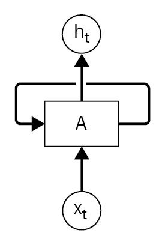
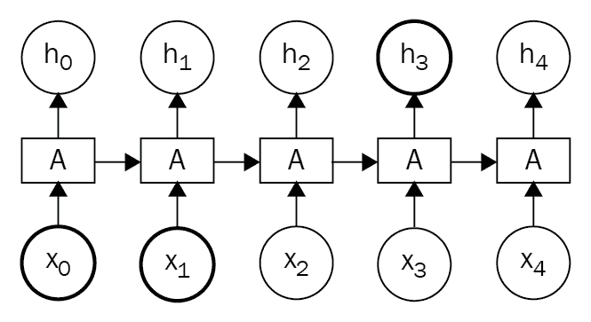
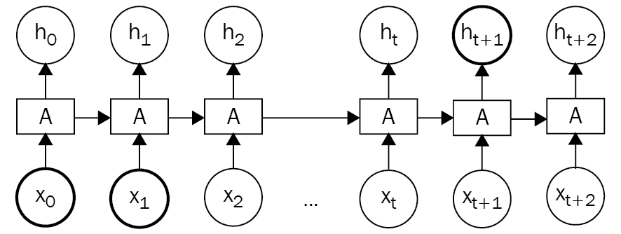
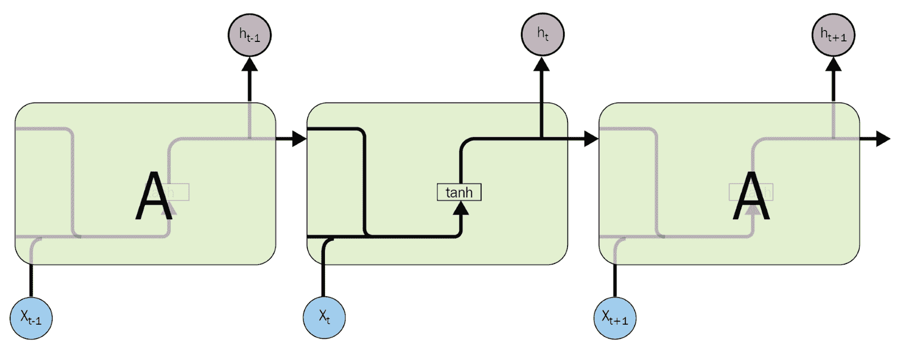
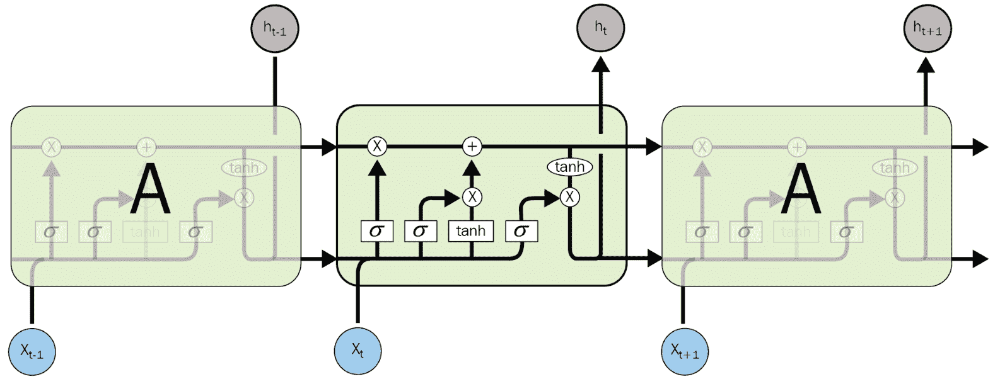
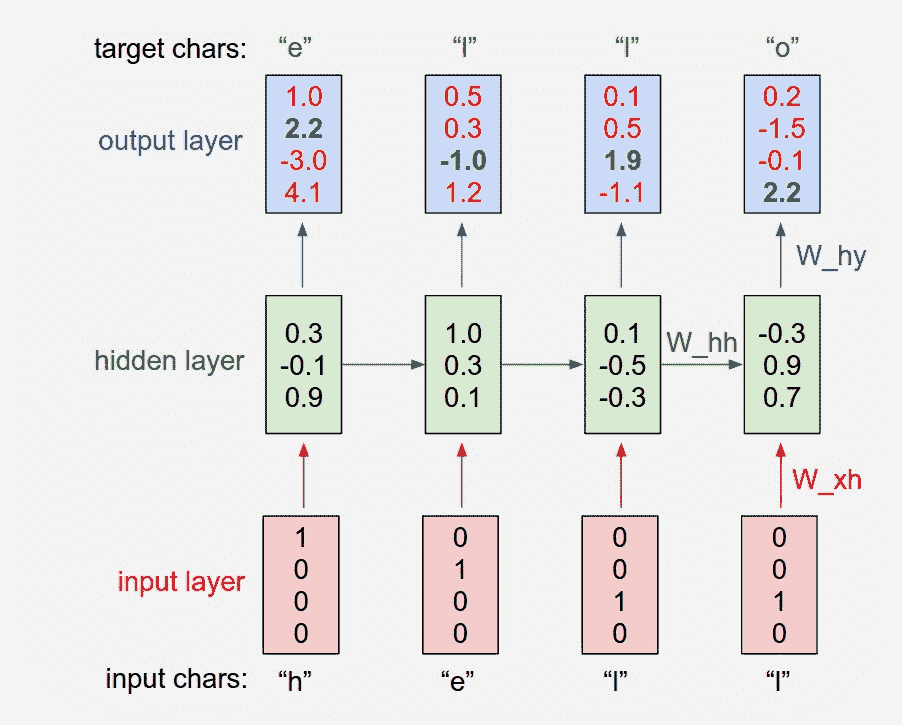
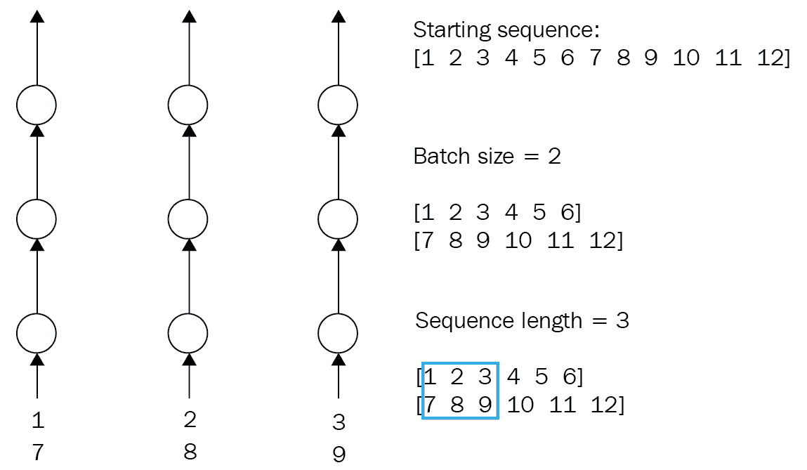
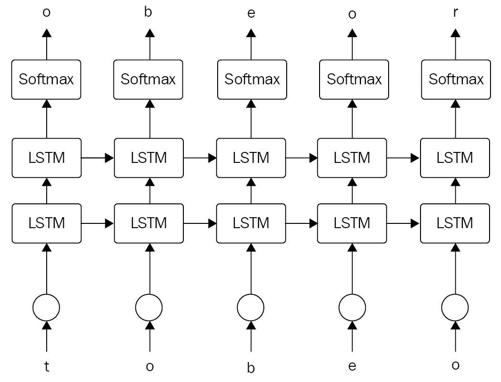

# 十、循环神经网络语言建模

**循环神经网络** ( **RNNs** )是一类深度学习架构，广泛用于自然语言处理。这组架构使我们能够为当前预测提供上下文信息，并且还具有处理任何输入序列中的长期依赖性的特定架构。在这一章中，我们将演示如何建立一个序列到序列的模型，这在 NLP 的许多应用中都很有用。我们将通过构建一个字符级语言模型来演示这些概念，并看看我们的模型如何生成与原始输入序列相似的句子。

本章将涵盖以下主题:

*   RNNs 背后的直觉
*   LSTM 网络公司
*   语言模型的实现


# RNNs 背后的直觉

到目前为止，我们处理的所有深度学习架构都没有记住它们之前接收到的输入的机制。例如，如果你给一个**前馈神经网络** ( **FNN** )输入一系列字符，比如**你好**，当网络到达 **E** 时，你会发现它没有保存任何信息/忘记它只是读取了 **H** 。这对于基于序列的学习来说是一个严重的问题。由于它不记得以前读过的任何字符，这种网络很难训练来预测下一个字符。这对许多应用程序没有意义，比如语言建模、机器翻译、语音识别等等。

出于这个特定的原因，我们将介绍 RNNs，这是一套深度学习架构，可以保存信息并记住他们刚刚遇到的内容。

让我们演示一下 RNNs 应该如何处理相同的字符输入序列， **HELLO** 。当 RNN 单元/单位接收到 **E** 作为输入时，它也接收到之前接收到的那个字符 **H** 。这种将当前字符与过去字符一起输入到 RNN 细胞的方式给这些结构带来了很大的好处，这就是短期记忆；这也使得这些架构可用于预测/猜测在这个特定的字符序列中 **H** 之后最可能的字符，即 **L** 。

我们已经看到，以前的架构为它们的输入分配权重；rnn 遵循相同的优化过程，将权重分配给它们的多个输入，即现在和过去。因此，在这种情况下，网络将为它们中的每一个分配两个不同的权重矩阵。为了做到这一点，我们将使用**梯度下降**和更重版本的反向传播，这被称为**通过时间的反向传播** ( **BPTT** )。


# 循环神经网络体系结构

根据我们使用之前深度学习架构的背景，你会发现为什么 rnn 是特殊的。我们所了解的以前的架构在输入或培训方面不够灵活。它们接受一个固定大小的序列/向量/图像作为输入，并产生另一个固定大小的序列/向量/图像作为输出。RNN 架构有些不同，因为它们使您能够将一个序列作为输入，而将另一个序列作为输出，或者让序列仅在输入/仅在输出中，如图*图 1* 所示。这种灵活性对于多种应用非常有用，例如语言建模和情感分析:


图 RNNs 在输入或输出形状方面的灵活性(http://karpathy.github.io/2015/05/21/rnn-effectiveness/)

这些体系结构背后的直觉是模仿人类处理信息的方式。在任何典型的对话中，你对某人话语的理解完全取决于他之前说了什么，你甚至可以根据他刚刚说的话来预测他接下来要说什么。

对于 RNNs，应该遵循完全相同的过程。例如，假设你想翻译一个句子中的特定单词。你不能使用传统的模糊神经网络，因为他们不能使用以前单词的翻译作为我们想要翻译的当前单词的输入，这可能会因为缺少这个单词的上下文信息而导致不正确的翻译。

rnn 确实保留了关于过去的信息，并且它们具有某种类型的循环，以允许在任何给定点将先前学习的信息用于当前预测:



图 2: RNNs 架构有一个循环来保存过去步骤的信息(来源:http://colah.github.io/posts/2015-08-Understanding-LSTMs/)

在*图 2* 中，我们有一些被称为 *A* 的神经网络，它接收一个输入*X[t]并产生和输出*h[t]。此外，在这个循环的帮助下，它从过去的步骤中接收信息。**

这个循环似乎不清楚，但是如果我们使用展开版本的*图 2* ，您会发现它非常简单和直观，RNN 只不过是同一网络的重复版本(可能是正常的 FNN)，如图*图 3* 所示:


图 3:循环神经网络架构的展开版本(来源:http://colah.github.io/posts/2015-08-Understanding-LSTMs/)

RNNs 的这种直观架构及其在输入/输出形状方面的灵活性使其非常适合基于序列的有趣学习任务，如机器翻译、语言建模、情感分析、图像字幕等。


# rnn 的示例

现在，我们对 RNNs 如何工作以及它如何在不同的有趣的基于序列的例子中有用有了直观的理解。让我们仔细看看这些有趣的例子。


# 字符级语言模型

语言建模是语音识别、机器翻译等许多应用的基本任务。在本节中，我们将尝试模拟 RNNs 的训练过程，并更深入地了解这些网络是如何工作的。我们将构建一个对字符进行操作的语言模型。因此，我们将向我们的网络输入一大块文本，目的是在给定前一个字符的情况下，尝试建立下一个字符的概率分布，这将允许我们生成与我们在训练过程中输入的文本相似的文本。

例如，假设我们有一种只有四个字母作为词汇的语言， **helo** 。

任务是在特定的字符输入序列上训练一个循环神经网络，例如**你好**。在这个具体的例子中，我们有四个训练样本:

1.  给定第一个输入字符 **h** 的上下文，应该计算字符 **e** 的概率，
2.  给定**和**的上下文，应该计算字符 **l** 的概率，
3.  给定 **hel** 的上下文，应计算字符 **l** 的概率，并且
4.  最后，在给定**地狱**的上下文的情况下，应该计算出角色**或**的概率

正如我们在前面的章节中了解到的，深度学习是其中一部分的机器学习技术通常只接受实数值作为输入。因此，我们需要以某种方式将字符转换或编码或输入为数字形式。为此，我们将使用 one-hot-vector 编码，这是一种通过除了向量中的单个条目之外的零向量来编码文本的方法，该向量是我们试图建模的这种语言的词汇表中的字符的索引(在本例中为 **helo** )。在对我们的训练样本进行编码之后，我们将一次一个地将它们提供给 RNN 类型的模型。在每个给定的字符处，RNN 型模型的输出将是一个四维向量(向量的大小对应于 vocab 的大小),它表示词汇表中的每个字符是给定输入字符之后的下一个字符的概率。*图 4* 阐明了这一过程:


图 4:以单热向量编码字符作为输入的 RNN 型网络示例，输出将分布在代表当前字符之后最可能字符的词汇库上(来源:http://karpathy.github.io/2015/05/21/rnn-effectiveness/)

如*图 4* 所示，您可以看到我们将输入序列中的第一个字符 **h** 输入到模型中，输出是一个 4 维向量，表示关于下一个字符的置信度。所以它具有输入 **h** 后的 **h** 的 **1.0** 为下一个字符的置信度， **e** 的 **2.2** 为下一个字符的置信度， **-3.0** 到 **l** 为下一个字符的置信度，最后 **4.1** 到 **o** 为下一个字符的置信度在这个具体的例子中，根据我们的训练序列 **hello** ，我们知道正确的下一个字符将是 **e** 、。因此，在训练这个 RNN 型网络时，我们的主要目标是增加 **e** 成为下一个角色的信心，并降低其他角色的信心。为了进行这种优化，我们将使用梯度下降和反向传播算法来更新权重并影响网络，以便为我们正确的下一个字符 **e** 产生更高的置信度，以此类推，用于其他 3 个训练示例。

正如你所看到的，RNN 型网络的输出在下一个 vocab 的所有字符上产生了一个置信度分布。我们可以将这个置信度分布转换成一个概率分布，使得一个字符成为下一个字符的概率的增加将导致其他字符的概率的减少，因为该概率需要总和为 1。对于这个特定的修改，我们可以对每个输出矢量使用一个标准的 softmax 层。

为了从这种网络中生成文本，我们可以将一个初始字符输入到模型中，并获得下一个可能出现的字符的概率分布，然后我们可以从这些字符中进行采样，并将其作为输入反馈到模型中。我们将能够通过一遍又一遍地重复这个过程来得到一个字符序列，只要我们想要生成一个具有期望长度的文本。


# 使用莎士比亚数据的语言模型

从前面的例子中，我们可以得到生成文本的模型。但是这个网络会给我们带来惊喜，因为它不仅会生成文本，还会学习训练数据的风格和结构。我们可以通过训练一个 RNN 类型的模型来演示这个有趣的过程，这个模型是关于特定类型的文本的，这些文本具有一定的结构和风格，比如下面的莎士比亚作品。

让我们看看训练好的网络生成的输出:

第二个参议员:
他们远离这种痛苦，产生在我的灵魂，
破碎和强烈应该被埋葬，当我灭亡
地球和许多国家的思想。

尽管网络只知道如何一次生成一个字符，但它能够生成有意义的文本和名称，这些文本和名称实际上具有莎士比亚作品的结构和风格。


# 消失梯度问题

在训练这些 RNN 类型的架构时，我们使用梯度下降和时间上的反向传播，这为许多基于序列的学习任务带来了一些成功。但是由于梯度的性质以及由于使用快速训练策略，可以看出梯度值将会太小并消失。这个过程引入了许多从业者陷入的消失梯度问题。在这一章的后面，我们将讨论研究人员如何处理这类问题，并产生了解决这一问题的普通 rnn 的变体:


图 5:消失梯度问题


# 长期依赖的问题

研究人员面临的另一个挑战性问题是人们可以在文本中找到的长期依赖关系。例如，如果有人输入像*这样的序列，我以前住在法国，学会了如何说话...*序列中的下一个明显的单词是单词 French。

在这种情况下，普通 rnn 将能够处理它，因为它具有短期依赖性，如图*图 6* 所示:



图 6:显示文本中的短期依赖关系(来源:http://colah.github.io/posts/2015-08-Understanding-LSTMs/)

另一个例子，如果某人以说*我过去住在法国开始这个序列..*然后他/她开始描述在那里生活的美好，最后他以*我学会了说法语*结束了这一系列。因此，为了让模型预测他/她在序列结束时学习的语言，模型需要有一些关于早期单词 *live* 和 *France* 的信息。如果模型无法跟踪文本中的长期依赖关系，它将无法处理这种情况:



图 7:文本长期依赖的挑战(来源:http://colah.github.io/posts/2015-08-Understanding-LSTMs/)

为了处理文本中消失的梯度和长期依赖性，研究人员引入了一种称为**长短期网络** ( **LSTM** )的普通 RNN 网络的变体。


# LSTM 网络公司

LSTM，RNN 的一种变体，用于帮助学习文本中的长期依存关系。LSTMs 最初是由 Hochreiter & Schmidhuber (1997)提出的(链接:[http://www.bioinf.jku.at/publications/older/2604.pdf](http://www.bioinf.jku.at/publications/older/2604.pdf))，许多研究人员对其进行了研究，并在许多领域产生了有趣的结果。

由于其内部架构，这种架构将能够处理文本中的长期依赖问题。

LSTMs 类似于传统的 RNN，因为它具有随时间重复的模块，但是这个重复模块的内部架构不同于传统的 rnn。它包括更多的遗忘和更新信息的层次:



图 8:包含单层的标准 RNN 中的重复模块(来源:http://colah.github.io/posts/2015-08-Understanding-LSTMs/)

如前所述，普通的 rnn 只有一个 NN 层，但是 LSTMs 有四个不同的层以一种特殊的方式相互作用。这种特殊的交互方式使得 LSTM 在许多领域都能很好地工作，我们将在构建语言模型时看到这一点，例如:



图 9:包含四个交互层的 LSTM 中的重复模块(来源:http://colah.github.io/posts/2015-08-Understanding-LSTMs/)

关于数学细节和四层实际上是如何相互作用的更多细节，你可以看看这个有趣的教程:[http://colah.github.io/posts/2015-08-Understanding-LSTMs/](http://colah.github.io/posts/2015-08-Understanding-LSTMs/)


# LSTM 为什么工作？

我们的普通 LSTM 架构的第一步是决定哪些信息是不必要的，它将通过丢弃这些信息来为更重要的信息留出更多空间。为此，我们有一层叫做**遗忘门层**，它查看之前的输出*h[t-1]和当前的输入 *x [t]* 并决定我们要丢弃哪些信息。*

LSTM 架构的下一步是决定哪些信息值得保留/持久化并存储在单元中。这分两步完成:

1.  称为**输入栅极层**的层，其决定单元的先前状态的哪些值需要更新
2.  第二步是生成一组将添加到单元格中的新候选值

最后，我们需要决定 LSTM 细胞将要输出什么。该输出将基于我们的单元状态，但将是过滤后的版本。


# 语言模型的实现

在这一节中，我们将构建一个操作字符的语言模型。对于这种实现，我们将使用安娜·卡列尼娜小说，并看看网络将如何学习实现文本的结构和风格:



图 10:角色级 RNN 的一般架构(来源:http://karpathy.github.io/2015/05/21/rnn-effectiveness/)

这个网络是基于 Andrej Karpathy 在 RNNs 上的帖子(链接:[http://karpathy.github.io/2015/05/21/rnn-effectiveness/](http://karpathy.github.io/2015/05/21/rnn-effectiveness/))和在 Torch 上的实现(链接:[https://github.com/karpathy/char-rnn](https://github.com/karpathy/char-rnn))。此外，r2rt(链接:[http://r2rt . com/recurrent-neural-networks-in-tensor flow-ii . html](http://r2rt.com/recurrent-neural-networks-in-tensorflow-ii.html))和 GitHub 上的 Sherjil Ozairp(链接:[https://github.com/sherjilozair/char-rnn-tensorflow](https://github.com/sherjilozair/char-rnn-tensorflow))也提供了一些信息。以下是字符型 RNN 的总体架构。

我们将根据安娜·卡列尼娜小说建立一个角色级别的 RNN(链接:[https://en.wikipedia.org/wiki/Anna_Karenina](https://en.wikipedia.org/wiki/Anna_Karenina))[。](https://en.wikipedia.org/wiki/Anna_Karenina)它能够根据书中的文本生成新的文本。您会发现这个实现的资产中包含了`.txt`文件。

让我们首先为这个字符级实现导入必要的库:

```py
import numpy as np
import tensorflow as tf

from collections import namedtuple
```

首先，我们需要通过加载数据集并将其转换为整数来准备数据集。因此，我们将字符转换为整数，然后将它们编码为整数，这使得它可以直接和容易地用作模型的输入变量:

```py
#reading the Anna Karenina novel text file
with open('Anna_Karenina.txt', 'r') as f:
    textlines=f.read()

#Building the vocan and encoding the characters as integers
language_vocab = set(textlines)
vocab_to_integer = {char: j for j, char in enumerate(language_vocab)}
integer_to_vocab = dict(enumerate(language_vocab))
encoded_vocab = np.array([vocab_to_integer[char] for char in textlines], dtype=np.int32)
```

那么，让我们看看安娜·卡列尼娜文本中的前 200 个字符:

```py
textlines[:200]
Output:
"Chapter 1\n\n\nHappy families are all alike; every unhappy family is unhappy in its own\nway.\n\nEverything was in confusion in the Oblonskys' house. The wife had\ndiscovered that the husband was carrying on"
```

我们还将字符转换成便于网络使用的形式，即整数。那么，让我们来看看字符的编码版本:

```py
encoded_vocab[:200]
Output:
array([70, 34, 54, 29, 24, 19, 76, 45, 2, 79, 79, 79, 69, 54, 29, 29, 49,
       45, 66, 54, 39, 15, 44, 15, 19, 12, 45, 54, 76, 19, 45, 54, 44, 44,
      45, 54, 44, 15, 27, 19, 58, 45, 19, 30, 19, 76, 49, 45, 59, 56, 34,
       54, 29, 29, 49, 45, 66, 54, 39, 15, 44, 49, 45, 15, 12, 45, 59, 56,
       34, 54, 29, 29, 49, 45, 15, 56, 45, 15, 24, 12, 45, 11, 35, 56, 79,
       35, 54, 49, 53, 79, 79, 36, 30, 19, 76, 49, 24, 34, 15, 56, 16, 45,
       35, 54, 12, 45, 15, 56, 45, 31, 11, 56, 66, 59, 12, 15, 11, 56, 45,
       15, 56, 45, 24, 34, 19, 45, 1, 82, 44, 11, 56, 12, 27, 49, 12, 37,
       45, 34, 11, 59, 12, 19, 53, 45, 21, 34, 19, 45, 35, 15, 66, 19, 45,
       34, 54, 64, 79, 64, 15, 12, 31, 11, 30, 19, 76, 19, 64, 45, 24, 34,
       54, 24, 45, 24, 34, 19, 45, 34, 59, 12, 82, 54, 56, 64, 45, 35, 54,
       12, 45, 31, 54, 76, 76, 49, 15, 56, 16, 45, 11, 56], dtype=int32)
```

由于网络处理的是单个字符，这类似于一个分类问题，在这个问题中，我们试图从前面的文本中预测下一个字符。这是我们的网络可以选择的课程数量。

因此，我们将一次向模型输入一个字符，模型将通过生成下一个可能出现的字符数的概率分布(vocab)来预测下一个字符，这相当于网络需要从中选择的类别数:

```py
len(language_vocab)
Output:
83
```

由于我们将使用随机梯度下降来训练我们的模型，我们需要将我们的数据转换成训练批次。


# 用于培训的小批量生成

在本节中，我们将把数据分成小批，用于训练。因此，批次将由许多所需数量的序列步骤组成。因此，让我们来看看*图 11* 中的一个直观示例:



图 11:批处理和序列的图示(来源:http://oscarmore2.github.io/Anna_KaRNNa_files/charseq.jpeg)

因此，现在我们需要定义一个函数，它将遍历编码的文本并生成批处理。在这个函数中，我们将使用一个非常好的 Python 机制，叫做 **yield** (链接:[https://jeffknupp . com/blog/2013/04/07/improve-your-Python-yield-and-generators-explained/](https://jeffknupp.com/blog/2013/04/07/improve-your-python-yield-and-generators-explained/))。

一个典型的批处理将有 *N × M* 个字符，其中 *N* 是序列的数量， *M* 是序列步骤的数量。为了获得数据集中可能的批次数量，我们可以简单地将数据长度除以所需的批次大小，在获得可能的批次数量后，我们可以确定每个批次中应该有多少个字符。

之后，我们需要将数据集分割成所需数量的序列( *N* )。我们可以用`arr.reshape(size)`。我们知道我们想要 *N 个*序列(在下面的代码中使用了`num_seqs`，让我们把它设为第一维的大小。对于第二维度，可以使用-1 作为大小中的占位符；它会用合适的数据填充数组。在这之后，你应该有一个数组是 *N × (M * K)* ，其中 *K* 是批次的数量。

现在我们有了这个数组，我们可以遍历它来获得训练批次，其中每个批次都有 *N × M* 个字符。对于每个后续批次，窗口移动`num_steps`。最后，我们还希望为我们的创建输入和输出数组，用作模型输入。创建输出值的这一步非常简单；记住，目标是移动了一个字符的输入。您通常会看到第一个输入字符被用作最后一个目标字符，比如:


其中 *x* 是输入批次， *y* 是目标批次。

我做这个窗口的方式是使用 range 来取大小为`num_steps`的步长，从 0 开始到`arr.shape[1]`，即每个序列中的总步长。这样，您从该范围获得的整数总是指向一个批处理的开始，并且每个窗口都是`num_steps`宽:

```py
def generate_character_batches(data, num_seq, num_steps):
    '''Create a function that returns batches of size
       num_seq x num_steps from data.
    '''
    # Get the number of characters per batch and number of batches
    num_char_per_batch = num_seq * num_steps
    num_batches = len(data)//num_char_per_batch

    # Keep only enough characters to make full batches
    data = data[:num_batches * num_char_per_batch]

    # Reshape the array into n_seqs rows
    data = data.reshape((num_seq, -1))

    for i in range(0, data.shape[1], num_steps):
        # The input variables
        input_x = data[:, i:i+num_steps]

        # The output variables which are shifted by one
        output_y = np.zeros_like(input_x)

        output_y[:, :-1], output_y[:, -1] = input_x[:, 1:], input_x[:, 0]
        yield input_x, output_y
```

因此，让我们通过生成一批 15 个序列和 50 个序列步骤来使用该函数进行演示:

```py
generated_batches = generate_character_batches(encoded_vocab, 15, 50)
input_x, output_y = next(generated_batches)
print('input\n', input_x[:10, :10])
print('\ntarget\n', output_y[:10, :10])
Output:

input
 [[70 34 54 29 24 19 76 45 2 79]
 [45 19 44 15 16 15 82 44 19 45]
 [11 45 44 15 16 34 24 38 34 19]
 [45 34 54 64 45 82 19 19 56 45]
 [45 11 56 19 45 27 56 19 35 79]
 [49 19 54 76 12 45 44 54 12 24]
 [45 41 19 45 16 11 45 15 56 24]
 [11 35 45 24 11 45 39 54 27 19]
 [82 19 66 11 76 19 45 81 19 56]
 [12 54 16 19 45 44 15 27 19 45]]

target
 [[34 54 29 24 19 76 45 2 79 79]
 [19 44 15 16 15 82 44 19 45 16]
 [45 44 15 16 34 24 38 34 19 54]
 [34 54 64 45 82 19 19 56 45 82]
 [11 56 19 45 27 56 19 35 79 35]
 [19 54 76 12 45 44 54 12 24 45]
 [41 19 45 16 11 45 15 56 24 11]
 [35 45 24 11 45 39 54 27 19 33]
 [19 66 11 76 19 45 81 19 56 24]
 [54 16 19 45 44 15 27 19 45 24]]
```

接下来，我们将期待构建这个示例的核心，即 LSTM 模型。


# 构建模型

在开始使用 LSTM 构建角色级模型之前，有必要提一下一个叫做**堆叠 LSTM** 的东西。

堆叠的 LSTMs 对于查看不同时间尺度的信息非常有用。


# 堆叠 LSTMs

“通过在彼此之上堆叠多个循环隐藏状态来构建深度 RNN。这种方法潜在地允许每个级别的隐藏状态在不同的时间尺度上操作“如何构建深度循环神经网络(链接:https://arxiv . org/ABS/1312.6026)，2013

rnn 在时间上是固有的，因为它们的隐藏状态是所有先前隐藏状态的函数。激发这篇论文的问题是 RNNs 是否也能从空间深度中获益；这是由于将多个递归隐藏层堆叠在彼此的顶部，就像前馈层堆叠在传统的深度网络中一样。深度 RNNs 语音识别(链接:[https://arxiv.org/abs/1303.5778](https://arxiv.org/abs/1303.5778))，2013

大多数研究人员使用堆叠 LSTMs 来解决具有挑战性的序列预测问题。堆叠式 LSTM 架构可以定义为由多个 LSTM 层组成的 LSTM 模型。前面的 LSTM 层向 LSTM 层提供序列输出而不是单值输出，如下所示。

具体来说，每个输入时间步长有一个输出，而不是所有输入时间步长都有一个输出时间步长:


图 12:堆叠的 LSTMs

在本例中，我们将使用这种堆叠式 LSTM 架构，它能提供更好的性能。


# 模型架构

这是你建立网络的地方。我们将把它分成几部分，以便更容易对每一部分进行推理。然后，我们可以将它们与整个网络连接起来:



图 13:角色级别的模型架构


# 输入

现在，让我们从将模型输入定义为占位符开始。模型的输入将是训练数据和目标。我们还将为 dropout 层使用一个名为`keep_probability`的参数，这有助于模型避免过度拟合:

```py
def build_model_inputs(batch_size, num_steps):

    # Declare placeholders for the input and output variables
    inputs_x = tf.placeholder(tf.int32, [batch_size, num_steps], name='inputs')
    targets_y = tf.placeholder(tf.int32, [batch_size, num_steps], name='targets')

    # define the keep_probability for the dropout layer
    keep_probability = tf.placeholder(tf.float32, name='keep_prob')

    return inputs_x, targets_y, keep_probability
```


# 建立一个 LSTM 细胞

在这一节中，我们将编写一个函数来创建 LSTM 单元格，它将在隐藏层中使用。这个单元将是我们模型的构建模块。因此，我们将使用 TensorFlow 创建这个单元。让我们看看如何使用 TensorFlow 来构建一个基本的 LSTM 单元。

我们调用以下代码行来创建一个 LSTM 单元格，其中的参数`num_units`表示隐藏层中的单元数:

```py
lstm_cell = tf.contrib.rnn.BasicLSTMCell(num_units)
```

为了防止过度拟合，我们可以使用一种叫做 **dropout** 的东西，这是一种通过降低模型复杂性来防止模型过度拟合数据的机制:

```py
tf.contrib.rnn.DropoutWrapper(lstm, output_keep_prob=keep_probability)
```

正如我们之前提到的，我们将使用堆叠 LSTM 架构；这将有助于我们从不同的角度来看数据，并且实际上已经发现它的性能更好。为了在 TensorFlow 中定义一个堆叠的 LSTM，我们可以使用`tf.contrib.rnn.MultiRNNCell`函数(链接:[https://www . tensor flow . org/versions/r 1.0/API _ docs/python/TF/contrib/rnn/MultiRNNCell](https://www.tensorflow.org/versions/r1.0/api_docs/python/tf/contrib/rnn/MultiRNNCell)):

```py
tf.contrib.rnn.MultiRNNCell([cell]*num_layers)
```

最初对于第一个单元，将没有以前的信息，所以我们需要初始化单元状态为零。我们可以使用下面的函数来实现:

```py
initial_state = cell.zero_state(batch_size, tf.float32)
```

因此，让我们将所有这些放在一起，创建我们的 LSTM 细胞:

```py
def build_lstm_cell(size, num_layers, batch_size, keep_probability):

    ### Building the LSTM Cell using the tensorflow function
    lstm_cell = tf.contrib.rnn.BasicLSTMCell(size)

    # Adding dropout to the layer to prevent overfitting
    drop_layer = tf.contrib.rnn.DropoutWrapper(lstm_cell, output_keep_prob=keep_probability)

    # Add muliple cells together and stack them up to oprovide a level of more understanding
    stakced_cell = tf.contrib.rnn.MultiRNNCell([drop_layer] * num_layers)
    initial_cell_state = lstm_cell.zero_state(batch_size, tf.float32)

    return lstm_cell, initial_cell_state
```


# RNN 产量

接下来，我们需要创建输出层，它负责读取单个 LSTM 细胞的输出，并通过完全连接的层传递它们。这一层有一个 softmax 输出，用于对输入字符之后的下一个可能字符产生一个概率分布。

如您所知，我们已经为网络生成了大小为 *N × M* 个字符的输入批次，其中 *N* 是该批次中的序列数， *M* 是序列步数。在创建模型时，我们还在隐藏层中使用了 *L* 隐藏单元。基于批量大小和隐藏单元的数量，网络的输出将是一个尺寸为 *N × M × L* 的 *3D* 张量，这是因为我们调用 LSTM 单元 *M* 次，每个序列步骤一次。对 LSTM 单元的每次调用都会产生大小为 L 的输出。最后，我们需要按照我们拥有的序列数 *N* 来做这件事。

因此，我们将这个 *N × M × L* 输出传递到一个完全连接的层(对于具有相同权重的所有输出都是一样的)，但在此之前，我们将输出整形为一个 *2D* 张量，其形状为 *(M * N) × L* 。这种重塑将使我们在对输出进行操作时变得更加容易，因为新的形状将更加方便；每行的值代表 LSTM 单元的 *L* 输出，因此每个序列和步骤都有一行。

在得到新的形状后，我们可以通过与权重进行矩阵乘法，用 softmax 将它连接到完全连接的层。默认情况下，在 LSTM 单元格中创建的权重和我们将在这里创建的权重具有相同的名称，在这种情况下，TensorFlow 将引发错误。为了避免这个错误，我们可以使用 TensorFlow 函数`tf.variable_scope()`将这里创建的权重和偏差变量包装在一个变量范围内。

在解释了输出的形状以及我们将如何重塑它之后，为了使事情变得更简单，让我们继续编写这个`build_model_output`函数:

```py
def build_model_output(output, input_size, output_size):

    # Reshaping output of the model to become a bunch of rows, where each row correspond for each step in the seq
    sequence_output = tf.concat(output, axis=1)
    reshaped_output = tf.reshape(sequence_output, [-1, input_size])

    # Connect the RNN outputs to a softmax layer
    with tf.variable_scope('softmax'):
        softmax_w = tf.Variable(tf.truncated_normal((input_size, output_size), stddev=0.1))
        softmax_b = tf.Variable(tf.zeros(output_size))

    # the output is a set of rows of LSTM cell outputs, so the logits will be a set
    # of rows of logit outputs, one for each step and sequence
    logits = tf.matmul(reshaped_output, softmax_w) + softmax_b

    # Use softmax to get the probabilities for predicted characters
    model_out = tf.nn.softmax(logits, name='predictions')

    return model_out, logits
```


# 培训损失

接下来是训练损失。我们得到逻辑和目标，并计算 softmax 交叉熵损失。首先，我们需要对目标进行一次性编码；我们把它们作为编码字符。然后，我们重塑一键目标，因此它是一个大小为 *(M * N) × C* 的 *2D* 张量，其中 *C* 是我们拥有的类/字符的数量。还记得我们重塑了 LSTM 输出，并通过一个带有 *C* 单元的全连接层运行它们。因此，我们的逻辑也将有大小 *(M * N) × C* 。

然后，我们通过`tf.nn.softmax_cross_entropy_with_logits`运行`logits`和`targets`，并找到平均值以获得损失:

```py
def model_loss(logits, targets, lstm_size, num_classes):

    # convert the targets to one-hot encoded and reshape them to match the logits, one row per batch_size per step
    output_y_one_hot = tf.one_hot(targets, num_classes)
    output_y_reshaped = tf.reshape(output_y_one_hot, logits.get_shape())

    #Use the cross entropy loss
    model_loss = tf.nn.softmax_cross_entropy_with_logits(logits=logits, labels=output_y_reshaped)
    model_loss = tf.reduce_mean(model_loss)
    return model_loss
```


# 【计算机】优化程序

最后，我们需要使用一种优化方法来帮助我们从数据集中学到一些东西。正如我们所知，香草 rnn 有爆炸和消失梯度的问题。LSTM 只修复了一个问题，即渐变值的消失，但即使在使用 LSTM 后，一些渐变值会爆炸并无限制地增长。为了解决这个问题，我们可以使用一种叫做**渐变剪辑**的东西，这是一种剪辑爆炸到特定阈值的渐变的技术。

因此，让我们通过将 Adam 优化器用于学习过程来定义我们的优化器:

```py
def build_model_optimizer(model_loss, learning_rate, grad_clip):

    # define optimizer for training, using gradient clipping to avoid the exploding of the gradients
    trainable_variables = tf.trainable_variables()
    gradients, _ = tf.clip_by_global_norm(tf.gradients(model_loss, trainable_variables), grad_clip)

    #Use Adam Optimizer
    train_operation = tf.train.AdamOptimizer(learning_rate)
    model_optimizer = train_operation.apply_gradients(zip(gradients, trainable_variables))

    return model_optimizer
```


# 构建网络

现在，我们可以把所有的部分放在一起，为网络建立一个类。为了通过 LSTM 单元实际运行数据，我们将使用`tf.nn.dynamic_rnn`(链接:[https://www . tensor flow . org/versions/r 1.0/API _ docs/python/TF/nn/dynamic _ rnn](https://www.tensorflow.org/versions/r1.0/api_docs/python/tf/nn/dynamic_rnn))。这个函数将为我们适当地跨 LSTM 单元格传递隐藏和单元格状态。它返回小批量中每个序列的每个步骤的每个 LSTM 单元的输出。它也给了我们最后的 LSTM 状态。我们希望将这个状态保存为`final_state`，这样我们就可以在下一次小批量运行时将它传递给第一个 LSTM 单元。对于`tf.nn.dynamic_rnn`，我们传递从`build_lstm`获得的单元格和初始状态，以及我们的输入序列。此外，在进入 RNN 之前，我们需要对输入进行一次性编码:

```py
class CharLSTM:

    def __init__(self, num_classes, batch_size=64, num_steps=50, 
                       lstm_size=128, num_layers=2, learning_rate=0.001, 
                       grad_clip=5, sampling=False):

        # When we're using this network for generating text by sampling, we'll be providing the network with
        # one character at a time, so providing an option for it.
        if sampling == True:
            batch_size, num_steps = 1, 1
        else:
            batch_size, num_steps = batch_size, num_steps

        tf.reset_default_graph()

        # Build the model inputs placeholders of the input and target variables
        self.inputs, self.targets, self.keep_prob = build_model_inputs(batch_size, num_steps)

        # Building the LSTM cell
        lstm_cell, self.initial_state = build_lstm_cell(lstm_size, num_layers, batch_size, self.keep_prob)

        ### Run the data through the LSTM layers
        # one_hot encode the input
        input_x_one_hot = tf.one_hot(self.inputs, num_classes)

        # Runing each sequence step through the LSTM architecture and finally collecting the outputs
        outputs, state = tf.nn.dynamic_rnn(lstm_cell, input_x_one_hot, initial_state=self.initial_state)
        self.final_state = state

        # Get softmax predictions and logits
        self.prediction, self.logits = build_model_output(outputs, lstm_size, num_classes)

        # Loss and optimizer (with gradient clipping)
        self.loss = model_loss(self.logits, self.targets, lstm_size, num_classes)
        self.optimizer = build_model_optimizer(self.loss, learning_rate, grad_clip)
```


# 模型超参数

与任何深度学习架构一样，有人可以使用一些超参数来控制模型并对其进行微调。以下是我们用于此架构的一组超参数:

*   批处理大小是一次通过网络的序列数。
*   步数是训练网络的序列中的字符数。通常越大越好；该网络将学习更多的远程相关性，但将需要更长的训练时间。在这里，100 通常是个好数字。
*   LSTM 大小是隐藏层中的单元数量。
*   建筑层数是要使用的隐藏 LSTM 层数。
*   学习率是培训的典型学习率。
*   最后，我们称之为保持概率的新事物被丢弃层使用；这有助于网络避免过度拟合。所以，如果你的网络负荷过重，试着减少负荷。


# 训练模型

现在，让我们通过向构建的模型提供输入和输出来开始训练过程，然后使用优化器来训练网络。不要忘记，在对当前状态进行预测时，我们需要使用以前的状态。因此，我们需要将输出状态传回网络，以便在预测下一个输入时使用。

让我们为我们的超参数提供初始值(您可以根据您用来训练该架构的数据集来调整它们):

```py

batch_size = 100        # Sequences per batch
num_steps = 100         # Number of sequence steps per batch
lstm_size = 512         # Size of hidden layers in LSTMs
num_layers = 2          # Number of LSTM layers
learning_rate = 0.001   # Learning rate
keep_probability = 0.5  # Dropout keep probability
```

```py
epochs = 5

# Save a checkpoint N iterations
save_every_n = 100

LSTM_model = CharLSTM(len(language_vocab), batch_size=batch_size, num_steps=num_steps,
                lstm_size=lstm_size, num_layers=num_layers, 
                learning_rate=learning_rate)

saver = tf.train.Saver(max_to_keep=100)
with tf.Session() as sess:
    sess.run(tf.global_variables_initializer())

    # Use the line below to load a checkpoint and resume training
    #saver.restore(sess, 'checkpoints/______.ckpt')
    counter = 0
    for e in range(epochs):
        # Train network
        new_state = sess.run(LSTM_model.initial_state)
        loss = 0
        for x, y in generate_character_batches(encoded_vocab, batch_size, num_steps):
            counter += 1
            start = time.time()
            feed = {LSTM_model.inputs: x,
                    LSTM_model.targets: y,
                    LSTM_model.keep_prob: keep_probability,
                    LSTM_model.initial_state: new_state}
            batch_loss, new_state, _ = sess.run([LSTM_model.loss, 
                                                 LSTM_model.final_state, 
                                                 LSTM_model.optimizer], 
                                                 feed_dict=feed)

            end = time.time()
            print('Epoch number: {}/{}... '.format(e+1, epochs),
                  'Step: {}... '.format(counter),
                  'loss: {:.4f}... '.format(batch_loss),
                  '{:.3f} sec/batch'.format((end-start)))

            if (counter % save_every_n == 0):
                saver.save(sess, "checkpoints/i{}_l{}.ckpt".format(counter, lstm_size))

    saver.save(sess, "checkpoints/i{}_l{}.ckpt".format(counter, lstm_size))
```

在训练过程结束时，您应该会得到一个类似于以下内容的错误:

```py
.
.
.
Epoch number: 5/5...  Step: 978...  loss: 1.7151...  0.050 sec/batch
Epoch number: 5/5...  Step: 979...  loss: 1.7428...  0.051 sec/batch
Epoch number: 5/5...  Step: 980...  loss: 1.7151...  0.050 sec/batch
Epoch number: 5/5...  Step: 981...  loss: 1.7236...  0.050 sec/batch
Epoch number: 5/5...  Step: 982...  loss: 1.7314...  0.051 sec/batch
Epoch number: 5/5...  Step: 983...  loss: 1.7369...  0.051 sec/batch
Epoch number: 5/5...  Step: 984...  loss: 1.7075...  0.065 sec/batch
Epoch number: 5/5...  Step: 985...  loss: 1.7304...  0.051 sec/batch
Epoch number: 5/5...  Step: 986...  loss: 1.7128...  0.049 sec/batch
Epoch number: 5/5...  Step: 987...  loss: 1.7107...  0.051 sec/batch
Epoch number: 5/5...  Step: 988...  loss: 1.7351...  0.051 sec/batch
Epoch number: 5/5...  Step: 989...  loss: 1.7260...  0.049 sec/batch
Epoch number: 5/5...  Step: 990...  loss: 1.7144...  0.051 sec/batch
```


# 保存检查点

现在，让我们加载检查点。有关保存和加载检查点的更多信息，您可以查看 TensorFlow 文档([https://www.tensorflow.org/programmers_guide/variables](https://www.tensorflow.org/programmers_guide/variables)):

```py
tf.train.get_checkpoint_state('checkpoints')
```

```py
Output:
model_checkpoint_path: "checkpoints/i990_l512.ckpt"
all_model_checkpoint_paths: "checkpoints/i100_l512.ckpt"
all_model_checkpoint_paths: "checkpoints/i200_l512.ckpt"
all_model_checkpoint_paths: "checkpoints/i300_l512.ckpt"
all_model_checkpoint_paths: "checkpoints/i400_l512.ckpt"
all_model_checkpoint_paths: "checkpoints/i500_l512.ckpt"
all_model_checkpoint_paths: "checkpoints/i600_l512.ckpt"
all_model_checkpoint_paths: "checkpoints/i700_l512.ckpt"
all_model_checkpoint_paths: "checkpoints/i800_l512.ckpt"
all_model_checkpoint_paths: "checkpoints/i900_l512.ckpt"
all_model_checkpoint_paths: "checkpoints/i990_l512.ckpt"
```


# 生成文本

我们有一个基于输入数据集的训练模型。下一步是使用这个经过训练的模型来生成文本，并查看这个模型如何学习输入数据的样式和结构。为此，我们可以从一些初始字符开始，然后输入新的、预测的字符作为下一步的输入。我们将重复这个过程，直到我们得到一个特定长度的文本。

在下面的代码中，我们还向函数添加了额外的语句，用一些初始文本来初始化网络，并从那里开始。

网络为我们提供了词汇库中每个字符的预测或概率。为了减少噪音并只使用网络更有把握的字符，我们将只从输出中最有可能出现的前 *N* 个字符中选择一个新字符:

```py
def choose_top_n_characters(preds, vocab_size, top_n_chars=4):
    p = np.squeeze(preds)
    p[np.argsort(p)[:-top_n_chars]] = 0
    p = p / np.sum(p)
    c = np.random.choice(vocab_size, 1, p=p)[0]
    return c
```

```py
def sample_from_LSTM_output(checkpoint, n_samples, lstm_size, vocab_size, prime="The "):
    samples = [char for char in prime]
    LSTM_model = CharLSTM(len(language_vocab), lstm_size=lstm_size, sampling=True)
    saver = tf.train.Saver()
    with tf.Session() as sess:
        saver.restore(sess, checkpoint)
        new_state = sess.run(LSTM_model.initial_state)
        for char in prime:
            x = np.zeros((1, 1))
            x[0,0] = vocab_to_integer[char]
            feed = {LSTM_model.inputs: x,
                    LSTM_model.keep_prob: 1.,
                    LSTM_model.initial_state: new_state}
            preds, new_state = sess.run([LSTM_model.prediction, LSTM_model.final_state], 
                                         feed_dict=feed)

        c = choose_top_n_characters(preds, len(language_vocab))
        samples.append(integer_to_vocab[c])

        for i in range(n_samples):
            x[0,0] = c
            feed = {LSTM_model.inputs: x,
                    LSTM_model.keep_prob: 1.,
                    LSTM_model.initial_state: new_state}
            preds, new_state = sess.run([LSTM_model.prediction, LSTM_model.final_state], 
                                         feed_dict=feed)

            c = choose_top_n_characters(preds, len(language_vocab))
            samples.append(integer_to_vocab[c])

    return ''.join(samples)
```

让我们使用保存的最新检查点开始采样过程:

```py
tf.train.latest_checkpoint('checkpoints')
```

```py
Output:
'checkpoints/i990_l512.ckpt'
```

现在，是时候使用这个最新的检查点进行采样了:

```py
checkpoint = tf.train.latest_checkpoint('checkpoints')
sampled_text = sample_from_LSTM_output(checkpoint, 1000, lstm_size, len(language_vocab), prime="Far")
print(sampled_text)
```

```py
Output:
INFO:tensorflow:Restoring parameters from checkpoints/i990_l512.ckpt
```

```py
Farcial the
confiring to the mone of the correm and thinds. She
she saw the
streads of herself hand only astended of the carres to her his some of the princess of which he came him of
all that his white the dreasing of
thisking the princess and with she was she had
bettee a still and he was happined, with the pood on the mush to the peaters and seet it.

"The possess a streatich, the may were notine at his mate a misted
and the
man of the mother at the same of the seem her
felt. He had not here.

"I conest only be alw you thinking that the partion
of their said."

"A much then you make all her
somether. Hower their centing
about
this, and I won't give it in
himself.
I had not come at any see it will that there she chile no one that him.

"The distiction with you all.... It was
a mone of the mind were starding to the simple to a mone. It to be to ser in the place," said Vronsky.
"And a plais in
his face, has alled in the consess on at they to gan in the sint
at as that
he would not be and t
```

你可以看到我们能够产生一些有意义的单词和一些无意义的单词。为了获得更多的结果，您可以运行更多时期的模型，并尝试使用超参数。


# 摘要

我们了解了 rnn，它们是如何工作的，以及为什么它们变得如此重要。我们在有趣的小说数据集上训练了一个 RNN 字符级语言模型，并看到了 rnn 的发展方向。你可以满怀信心地期待 rnn 领域的大量创新，我相信它们将成为智能系统中无处不在的关键组件。