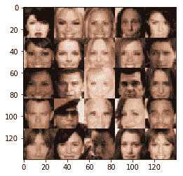
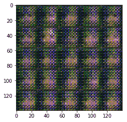
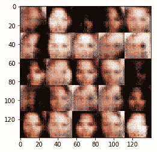
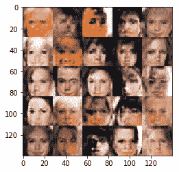
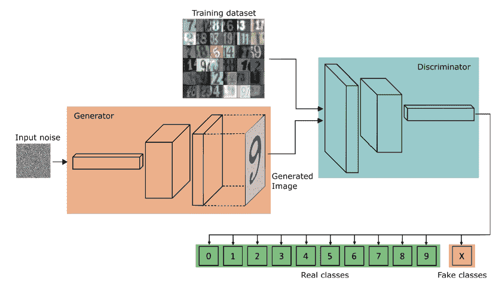
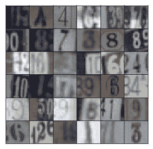
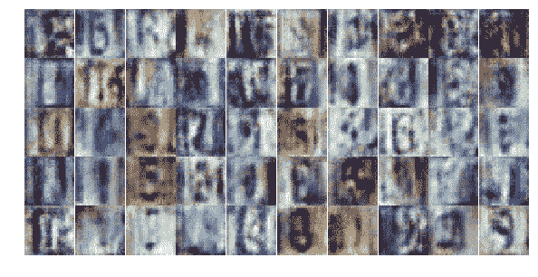
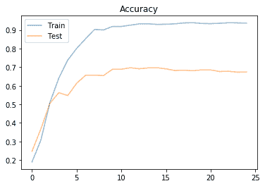

# 十五、人脸生成和缺失标签处理

我们可以使用 GANs 的有趣应用是无止境的。在这一章中，我们将展示 GANs 的另一个有前途的应用，那就是基于 CelebA 数据库的人脸生成。我们还将演示如何将 GANs 用于半监督学习设置，在这种情况下，我们得到了一个带有一些缺失标签的标签较差的数据集。

本章将涵盖以下主题:

*   人脸生成
*   基于生成对抗网络的半监督学习


# 人脸生成

正如我们在前一章提到的，生成器和鉴别器由一个**解卷积网络**(**DNN**:[https://www . quora . com/How-does-a-de convolution-Neural-Network-work](https://www.quora.com/How-does-a-deconvolutional-neural-network-work))和**卷积神经网络**(**CNN**:[http://cs231n.github.io/convolutional-networks/](http://cs231n.github.io/convolutional-networks/)):

*   CNN 是一种神经网络，它将图像的数百个像素编码成小维度(z)的向量，这是图像的摘要
*   DNN 是一个网络，它学习一些滤波器来从 z 恢复原始图像

此外，鉴别器将输出 1 或 0 来指示输入图像是来自实际数据集还是由生成器生成。另一方面，生成器将尝试基于潜在空间 z 复制与原始数据集相似的图像，潜在空间 z 可能遵循高斯分布。因此，鉴别器的目标是正确区分真实图像，生成器的目标是学习原始数据集的分布，从而欺骗鉴别器，使其做出错误的决定。

在本节中，我们将尝试教生成器学习人脸图像分布，以便它可以生成逼真的人脸。

对于大多数图形公司来说，生成类似人类的人脸是至关重要的，他们总是在为他们的应用程序寻找新的人脸，这给了我们一个线索，即人工智能在生成人工人脸方面如何真正接近实现真实感。

在这个例子中，我们将使用 CelebA 数据集。CelebFaces 属性数据集(CelebA)是一个大规模的人脸属性数据集，大约有 20 万张名人图像，每张图像有 40 个属性注释。数据集涵盖了许多姿势变化，以及背景杂波，所以 CelebA 非常多样化，注释也很好。它包括:

*   10，177 个身份
*   202，599 张人脸图片
*   每幅图像五个地标位置和 40 个二元属性注释

除了人脸生成之外，我们还可以将该数据集用于许多计算机视觉应用，例如人脸识别和定位，或者人脸属性检测。

该图显示了生成器误差，或学习人脸分布，如何在训练过程中接近现实:


图 1:从名人图像数据集生成新面孔的 GANs


# 获取数据

在这一节中，我们将定义一些帮助函数来帮助我们下载 CelebA 数据集。我们将从导入实现所需的包开始:

```
import math
import os
import hashlib
from urllib.request import urlretrieve
import zipfile
import gzip
import shutil

import numpy as np
from PIL import Image
from tqdm import tqdm
import utils

import tensorflow as tf
```

接下来，我们将使用 utils 脚本下载数据集:

```
#Downloading celebA dataset
celebA_data_dir = 'input'
utils.download_extract('celeba', celebA_data_dir)
```

```
Output:

Downloading celeba: 1.44GB [00:21, 66.6MB/s] 
Extracting celeba...
```


# 探索数据

CelebA 数据集包含超过 20 万张带注释的名人图片。由于我们将使用 GANs 来生成类似的图像，因此值得从数据集中查看一堆图像，并了解它们的外观。在这一节中，我们将定义一些辅助函数来可视化来自 CelebA 数据集的一组图像。

现在，让我们使用`utils`脚本来显示数据集中的一些图像:

```
#number of images to display
num_images_to_show = 25

celebA_images = utils.get_batch(glob(os.path.join(celebA_data_dir, 'img_align_celeba/*.jpg'))[:num_images_to_show], 28,
                                28, 'RGB')
pyplot.imshow(utils.images_square_grid(celebA_images, 'RGB'))
```

```
Output:
```



图 2:绘制来自 CelebA 数据集的图像样本

这个计算机视觉任务的主要焦点是使用 GANs 来生成与名人数据集中相似的图像，所以我们需要关注图像的面部部分。为了将注意力集中在图像的脸部部分，我们将移除图像中不包括名人脸部的部分。


# 构建模型

现在，让我们从构建实现的核心开始，这是计算图；它将主要包括以下组成部分:

*   模型输入
*   鉴别器
*   发电机
*   模型损失
*   模型优化器
*   训练模型


# 模型输入

在这一节中，我们将实现一个助手函数，我们将定义模型输入占位符，它将负责向计算图形提供数据。

这些功能应该能够创建三个主要占位符:

*   来自数据集的实际输入图像，其尺寸为(批量大小、输入图像宽度、输入图像高度、通道数量)
*   潜在空间 Z，它将被生成器用来生成假图像
*   学习率占位符

helper 函数将返回这三个输入占位符的元组。那么，让我们继续定义这个函数:

```
# defining the model inputs
def inputs(img_width, img_height, img_channels, latent_space_z_dim):
    true_inputs = tf.placeholder(tf.float32, (None, img_width, img_height, img_channels),
                                 'true_inputs')
    l_space_inputs = tf.placeholder(tf.float32, (None, latent_space_z_dim), 'l_space_inputs')
    model_learning_rate = tf.placeholder(tf.float32, name='model_learning_rate')

    return true_inputs, l_space_inputs, model_learning_rate
```


# 鉴别器

接下来，我们需要实现网络的鉴别器部分，它将用于判断输入是来自真实数据集还是由生成器生成。同样，我们将使用`tf.variable_scope`的 TensorFlow 特性给一些变量加上 discriminator 前缀，以便我们可以检索和重用它们。

因此，让我们定义将返回鉴别器的二进制输出以及 logit 值的函数:

```
# Defining the discriminator function
def discriminator(input_imgs, reuse=False):
    # using variable_scope to reuse variables
    with tf.variable_scope('discriminator', reuse=reuse):
        # leaky relu parameter
        leaky_param_alpha = 0.2

        # defining the layers
        conv_layer_1 = tf.layers.conv2d(input_imgs, 64, 5, 2, 'same')
        leaky_relu_output = tf.maximum(leaky_param_alpha * conv_layer_1, conv_layer_1)

        conv_layer_2 = tf.layers.conv2d(leaky_relu_output, 128, 5, 2, 'same')
        normalized_output = tf.layers.batch_normalization(conv_layer_2, training=True)
        leay_relu_output = tf.maximum(leaky_param_alpha * normalized_output, normalized_output)

        conv_layer_3 = tf.layers.conv2d(leay_relu_output, 256, 5, 2, 'same')
        normalized_output = tf.layers.batch_normalization(conv_layer_3, training=True)
        leaky_relu_output = tf.maximum(leaky_param_alpha * normalized_output, normalized_output)

        # reshaping the output for the logits to be 2D tensor
        flattened_output = tf.reshape(leaky_relu_output, (-1, 4 * 4 * 256))
        logits_layer = tf.layers.dense(flattened_output, 1)
        output = tf.sigmoid(logits_layer)

    return output, logits_layer
```


# 发电机

现在，是时候实现网络的第二部分了，它将尝试使用潜在空间`z`复制原始输入图像。对于这个函数，我们也将使用`tf.variable_scope`。

因此，让我们定义将返回生成器生成的图像的函数:

```
def generator(z_latent_space, output_channel_dim, is_train=True):

    with tf.variable_scope('generator', reuse=not is_train):

        #leaky relu parameter
        leaky_param_alpha = 0.2

        fully_connected_layer = tf.layers.dense(z_latent_space, 2*2*512)

        #reshaping the output back to 4D tensor to match the accepted format for convolution layer
        reshaped_output = tf.reshape(fully_connected_layer, (-1, 2, 2, 512))
        normalized_output = tf.layers.batch_normalization(reshaped_output, training=is_train)
        leaky_relu_output = tf.maximum(leaky_param_alpha * normalized_output, normalized_output)

        conv_layer_1 = tf.layers.conv2d_transpose(leaky_relu_output, 256, 5, 2, 'valid')
        normalized_output = tf.layers.batch_normalization(conv_layer_1, training=is_train)
        leaky_relu_output = tf.maximum(leaky_param_alpha * normalized_output, normalized_output)

        conv_layer_2 = tf.layers.conv2d_transpose(leaky_relu_output, 128, 5, 2, 'same')
        normalized_output = tf.layers.batch_normalization(conv_layer_2, training=is_train)
        leaky_relu_output = tf.maximum(leaky_param_alpha * normalized_output, normalized_output)

        logits_layer = tf.layers.conv2d_transpose(leaky_relu_output, output_channel_dim, 5, 2, 'same')
        output = tf.tanh(logits_layer)

        return output
```


# 模型损失

现在到了棘手的部分，我们在前一章已经讨论过了，那就是计算鉴频器和发生器的损耗。

因此，让我们定义这个函数，它将利用之前定义的`generator`和`discriminator`函数:

```
# Define the error for the discriminator and generator
def model_losses(input_actual, input_latent_z, out_channel_dim):
    # building the generator part
    gen_model = generator(input_latent_z, out_channel_dim)
    disc_model_true, disc_logits_true = discriminator(input_actual)
    disc_model_fake, disc_logits_fake = discriminator(gen_model, reuse=True)

    disc_loss_true = tf.reduce_mean(
        tf.nn.sigmoid_cross_entropy_with_logits(logits=disc_logits_true, labels=tf.ones_like(disc_model_true)))

    disc_loss_fake = tf.reduce_mean(tf.nn.sigmoid_cross_entropy_with_logits(
        logits=disc_logits_fake, labels=tf.zeros_like(disc_model_fake)))

    gen_loss = tf.reduce_mean(tf.nn.sigmoid_cross_entropy_with_logits(
        logits=disc_logits_fake, labels=tf.ones_like(disc_model_fake)))

    disc_loss = disc_loss_true + disc_loss_fake

    return disc_loss, gen_loss
```


# 模型优化器

最后，在训练我们的模型之前，我们需要实现这个任务的优化标准。我们将使用之前使用的命名约定来检索鉴别器和生成器的可训练参数，并训练它们:

```
# specifying the optimization criteria
def model_optimizer(disc_loss, gen_loss, learning_rate, beta1):
    trainable_vars = tf.trainable_variables()
    disc_vars = [var for var in trainable_vars if var.name.startswith('discriminator')]
    gen_vars = [var for var in trainable_vars if var.name.startswith('generator')]

    disc_train_opt = tf.train.AdamOptimizer(
        learning_rate, beta1=beta1).minimize(disc_loss, var_list=disc_vars)

    update_operations = tf.get_collection(tf.GraphKeys.UPDATE_OPS)
    gen_updates = [opt for opt in update_operations if opt.name.startswith('generator')]

    with tf.control_dependencies(gen_updates):
        gen_train_opt = tf.train.AdamOptimizer(
            learning_rate, beta1).minimize(gen_loss, var_list=gen_vars)

    return disc_train_opt, gen_train_opt
```


# 训练模型

现在，是时候训练模型了，看看生成器如何通过生成非常接近原始 CelebA 数据集的图像，在某种程度上欺骗鉴别器。

但是首先，让我们定义一个助手函数，它将显示生成器生成的一些图像:

```
# define a function to visualize some generated images from the generator
def show_generator_output(sess, num_images, input_latent_z, output_channel_dim, img_mode):
    cmap = None if img_mode == 'RGB' else 'gray'
    latent_space_z_dim = input_latent_z.get_shape().as_list()[-1]
    examples_z = np.random.uniform(-1, 1, size=[num_images, latent_space_z_dim])

    examples = sess.run(
        generator(input_latent_z, output_channel_dim, False),
        feed_dict={input_latent_z: examples_z})

    images_grid = utils.images_square_grid(examples, img_mode)
    pyplot.imshow(images_grid, cmap=cmap)
    pyplot.show()
```

然后，我们将使用之前定义的辅助函数来构建模型输入、损耗和优化标准。我们将它们堆叠在一起，并开始基于 CelebA 数据集训练我们的模型:

```
def model_train(num_epocs, train_batch_size, z_dim, learning_rate, beta1, get_batches, input_data_shape, data_img_mode):
    _, image_width, image_height, image_channels = input_data_shape

    actual_input, z_input, leaningRate = inputs(
        image_width, image_height, image_channels, z_dim)

    disc_loss, gen_loss = model_losses(actual_input, z_input, image_channels)

    disc_opt, gen_opt = model_optimizer(disc_loss, gen_loss, learning_rate, beta1)

    steps = 0
    print_every = 50
    show_every = 100
    model_loss = []
    num_images = 25

    with tf.Session() as sess:

        # initializing all the variables
        sess.run(tf.global_variables_initializer())

        for epoch_i in range(num_epocs):
            for batch_images in get_batches(train_batch_size):

                steps += 1
                batch_images *= 2.0
                z_sample = np.random.uniform(-1, 1, (train_batch_size, z_dim))

                _ = sess.run(disc_opt, feed_dict={
                    actual_input: batch_images, z_input: z_sample, leaningRate: learning_rate})
                _ = sess.run(gen_opt, feed_dict={
                    z_input: z_sample, leaningRate: learning_rate})

                if steps % print_every == 0:
                    train_loss_disc = disc_loss.eval({z_input: z_sample, actual_input: batch_images})
                    train_loss_gen = gen_loss.eval({z_input: z_sample})

                    print("Epoch {}/{}...".format(epoch_i + 1, num_epocs),
                          "Discriminator Loss: {:.4f}...".format(train_loss_disc),
                          "Generator Loss: {:.4f}".format(train_loss_gen))
                    model_loss.append((train_loss_disc, train_loss_gen))

                if steps % show_every == 0:
                    show_generator_output(sess, num_images, z_input, image_channels, data_img_mode)
```

开始培训过程，这可能需要一些时间，具体取决于您的主机规格:

```
# Training the model on CelebA dataset
train_batch_size = 64
z_dim = 100
learning_rate = 0.002
beta1 = 0.5

num_epochs = 1

celeba_dataset = utils.Dataset('celeba', glob(os.path.join(data_dir, 'img_align_celeba/*.jpg')))
with tf.Graph().as_default():
    model_train(num_epochs, train_batch_size, z_dim, learning_rate, beta1, celeba_dataset.get_batches,
                celeba_dataset.shape, celeba_dataset.image_mode)
```

输出:

```

 Epoch 1/1... Discriminator Loss: 0.9118... Generator Loss: 12.2238
 Epoch 1/1... Discriminator Loss: 0.6119... Generator Loss: 3.2168
 Epoch 1/1... Discriminator Loss: 0.5383... Generator Loss: 2.8054
 Epoch 1/1... Discriminator Loss: 1.4381... Generator Loss: 0.4672
 Epoch 1/1... Discriminator Loss: 0.7815... Generator Loss: 14.8220
 Epoch 1/1... Discriminator Loss: 0.6435... Generator Loss: 9.2591
 Epoch 1/1... Discriminator Loss: 1.5661... Generator Loss: 10.4747
 Epoch 1/1... Discriminator Loss: 1.5407... Generator Loss: 0.5811
 Epoch 1/1... Discriminator Loss: 0.6470... Generator Loss: 2.9002
 Epoch 1/1... Discriminator Loss: 0.5671... Generator Loss: 2.0700
```



图 3:在这个训练点生成的输出样本

```
Epoch 1/1... Discriminator Loss: 0.7950... Generator Loss: 1.5818
Epoch 1/1... Discriminator Loss: 1.2417... Generator Loss: 0.7094
Epoch 1/1... Discriminator Loss: 1.1786... Generator Loss: 1.0948
Epoch 1/1... Discriminator Loss: 1.0427... Generator Loss: 2.8878
Epoch 1/1... Discriminator Loss: 0.8409... Generator Loss: 2.6785
Epoch 1/1... Discriminator Loss: 0.8557... Generator Loss: 1.7706
Epoch 1/1... Discriminator Loss: 0.8241... Generator Loss: 1.2898
Epoch 1/1... Discriminator Loss: 0.8590... Generator Loss: 1.8217
Epoch 1/1... Discriminator Loss: 1.1694... Generator Loss: 0.8490
Epoch 1/1... Discriminator Loss: 0.9984... Generator Loss: 1.0042
```



图 4:在这个训练点生成的输出样本

经过一段时间的训练，你应该会得到这样的东西:



图 5:在这个训练点生成的输出样本


# 基于生成对抗网络的半监督学习

考虑到这一点，半监督学习是一种使用标记和未标记数据来训练分类器的技术。

这种类型的分类器采用一小部分已标记数据和大量未标记数据(来自同一个域)。目标是结合这些数据源来训练一个**深度卷积神经网络** ( **DCNN** )来学习一个能够将新数据点映射到其期望结果的推断函数。

在这个前沿领域，我们提出了一个 GAN 模型，使用一个非常小的标记训练集对街景门牌号进行分类。事实上，该模型使用大约 1.3%的原始 SVHN 训练标签，即 1000(一千)个标记的示例。我们使用了在*这篇论文中描述的一些技术来训练来自 open ai*(【https://arxiv.org/abs/1606.03498】T2)的 GANs。


# 直觉

在构建用于生成图像的 GAN 时，我们同时训练了生成器和鉴别器。训练之后，我们可以丢弃鉴别器，因为我们只使用它来训练生成器。



图 6:用于 11 类分类问题的半监督学习 GAN 架构

在半监督学习中，我们需要将鉴别器转化为多类分类器。这个新模型必须能够在测试集上很好地推广，即使我们没有很多用于训练的标记示例。此外，这一次，在培训结束时，我们实际上可以扔掉发电机。请注意，角色发生了变化。现在，该发生器仅用于在训练期间帮助鉴别器。换句话说，生成器充当不同的信息源，鉴别器从中获得原始的、未标记的训练数据。正如我们将看到的，这些未标记的数据是提高鉴别器性能的关键。此外，对于常规图像生成 GAN，鉴别器只有一个作用。计算其输入是否真实的概率—我们称之为 GAN 问题。

然而，为了将鉴别器变成半监督分类器，除了 GAN 问题之外，鉴别器还必须学习每个原始数据集类的概率。换句话说，对于每一幅输入图像，鉴别器必须知道它是 1、2、3 等等的概率。

回想一下，对于图像生成 GAN 鉴频器，我们有一个 sigmoid 单位输出。该值表示输入图像为真实(值接近 1)或虚假(值接近 0)的概率。换句话说，从鉴别者的角度来看，接近 1 的值意味着样本很可能来自训练集。同样，接近 0 的值意味着样本来自发电机网络的可能性更大。通过使用这种概率，鉴别器能够将信号发送回发生器。该信号允许发生器在训练期间调整其参数，从而有可能提高其创建逼真图像的能力。

我们必须将鉴别器(来自以前的 GAN)转换为 11 类分类器。为此，我们可以将其 sigmoid 输出转换为具有 11 个类输出的 softmax，前 10 个类用于 SVHN 数据集的各个类概率(0 到 9)，第 11 个类用于来自生成器的所有伪图像。

请注意，如果我们将第 11 类概率设置为 0，则前 10 个概率的总和表示使用 sigmoid 函数计算的相同概率。

最后，我们需要以这样一种方式设置损耗，使鉴频器可以做到这两点:

*   帮助生成器学习生成真实的图像。为了做到这一点，我们必须指示鉴别器来区分真假样品。
*   使用生成器的图像以及已标记和未标记的训练数据来帮助对数据集进行分类。

总而言之，鉴别器有三个不同的训练数据来源:

*   有标签的真实图像。这些是像在任何常规监督分类问题中一样的图像标签对。
*   没有标签的真实图像。对于这些，分类器只知道这些图像是真实的。
*   来自生成器的图像。为了使用这些，鉴别者学会分类为假的。

这些不同数据源的组合将使分类器能够从更广泛的角度进行学习。这反过来允许模型比仅使用 1000 个标记的示例进行训练更精确地执行推理。


# 数据分析和预处理

对于这项任务，我们将使用 SVHN 数据集，这是斯坦福(【http://ufldl.stanford.edu/housenumbers/】)街景门牌号码的缩写。因此，让我们通过导入实现所需的包来开始实现:

```
# Lets start by loading the necessary libraries
%matplotlib inline

import pickle as pkl
import time
import matplotlib.pyplot as plt
import numpy as np
from scipy.io import loadmat
import tensorflow as tf
import os

```

接下来，我们将定义一个助手类来下载 SVHN 数据集(记住，您需要首先手动创建`input_data_dir`):

```
from urllib.request import urlretrieve
from os.path import isfile, isdir
from tqdm import tqdm
input_data_dir = 'input/'

input_data_dir = 'input/'

if not isdir(input_data_dir):
    raise Exception("Data directory doesn't exist!")

class DLProgress(tqdm):
    last_block = 0

    def hook(self, block_num=1, block_size=1, total_size=None):
        self.total = total_size
        self.update((block_num - self.last_block) * block_size)
        self.last_block = block_num

if not isfile(input_data_dir + "train_32x32.mat"):
    with DLProgress(unit='B', unit_scale=True, miniters=1, desc='SVHN Training Set') as pbar:
        urlretrieve(
            'http://ufldl.stanford.edu/housenumbers/train_32x32.mat',
            input_data_dir + 'train_32x32.mat',
            pbar.hook)

if not isfile(input_data_dir + "test_32x32.mat"):
    with DLProgress(unit='B', unit_scale=True, miniters=1, desc='SVHN Training Set') as pbar:
        urlretrieve(
            'http://ufldl.stanford.edu/housenumbers/test_32x32.mat',
            input_data_dir + 'test_32x32.mat',
            pbar.hook)

train_data = loadmat(input_data_dir + 'train_32x32.mat')
test_data = loadmat(input_data_dir + 'test_32x32.mat')
```

```
Output:
```

```
trainset shape: (32, 32, 3, 73257)
testset shape: (32, 32, 3, 26032)
```

让我们来了解一下这些图像的样子:

```
indices = np.random.randint(0, train_data['X'].shape[3], size=36)
fig, axes = plt.subplots(6, 6, sharex=True, sharey=True, figsize=(5,5),)
for ii, ax in zip(indices, axes.flatten()):
    ax.imshow(train_data['X'][:,:,:,ii], aspect='equal')
    ax.xaxis.set_visible(False)
    ax.yaxis.set_visible(False)
plt.subplots_adjust(wspace=0, hspace=0)
```

```
Output:
```



图 7:来自 SVHN 数据集的样本图像。

接下来，我们需要将我们的图像缩放到-1 和 1 之间，这是必要的，因为我们将使用`tanh()`函数，它将压缩生成器的输出值:

```
# Scaling the input images
def scale_images(image, feature_range=(-1, 1)):
    # scale image to (0, 1)
    image = ((image - image.min()) / (255 - image.min()))

    # scale the image to feature range
    min, max = feature_range
    image = image * (max - min) + min
    return image
```

```
class Dataset:
    def __init__(self, train_set, test_set, validation_frac=0.5, shuffle_data=True, scale_func=None):
        split_ind = int(len(test_set['y']) * (1 - validation_frac))
        self.test_input, self.valid_input = test_set['X'][:, :, :, :split_ind], test_set['X'][:, :, :, split_ind:]
        self.test_target, self.valid_target = test_set['y'][:split_ind], test_set['y'][split_ind:]
        self.train_input, self.train_target = train_set['X'], train_set['y']

        # The street house number dataset comes with lots of labels,
        # but because we are going to do semi-supervised learning we are going to assume that we don't have all labels
        # like, assume that we have only 1000
        self.label_mask = np.zeros_like(self.train_target)
        self.label_mask[0:1000] = 1

        self.train_input = np.rollaxis(self.train_input, 3)
        self.valid_input = np.rollaxis(self.valid_input, 3)
        self.test_input = np.rollaxis(self.test_input, 3)

        if scale_func is None:
            self.scaler = scale_images
        else:
            self.scaler = scale_func
        self.train_input = self.scaler(self.train_input)
        self.valid_input = self.scaler(self.valid_input)
        self.test_input = self.scaler(self.test_input)
        self.shuffle = shuffle_data

    def batches(self, batch_size, which_set="train"):
        input_name = which_set + "_input"
        target_name = which_set + "_target"

        num_samples = len(getattr(dataset, target_name))
        if self.shuffle:
            indices = np.arange(num_samples)
            np.random.shuffle(indices)
            setattr(dataset, input_name, getattr(dataset, input_name)[indices])
            setattr(dataset, target_name, getattr(dataset, target_name)[indices])
            if which_set == "train":
                dataset.label_mask = dataset.label_mask[indices]

        dataset_input = getattr(dataset, input_name)
        dataset_target = getattr(dataset, target_name)

        for jj in range(0, num_samples, batch_size):
            input_vals = dataset_input[jj:jj + batch_size]
            target_vals = dataset_target[jj:jj + batch_size]

            if which_set == "train":
                # including the label mask in case of training
                # to pretend that we don't have all the labels
                yield input_vals, target_vals, self.label_mask[jj:jj + batch_size]
            else:
                yield input_vals, target_vals
```


# 构建模型

在这一节中，我们将构建测试所需的所有部分，所以让我们从定义用于向计算图提供数据的输入开始。


# 模型输入

首先，我们将定义模型输入函数，该函数将创建模型输入占位符，用于向计算模型提供数据:

```
# defining the model inputs
def inputs(actual_dim, z_dim):
    inputs_actual = tf.placeholder(tf.float32, (None, *actual_dim), name='input_actual')
    inputs_latent_z = tf.placeholder(tf.float32, (None, z_dim), name='input_latent_z')

    target = tf.placeholder(tf.int32, (None), name='target')
    label_mask = tf.placeholder(tf.int32, (None), name='label_mask')

    return inputs_actual, inputs_latent_z, target, label_mask
```


# 发电机

在本节中，我们将实现 GAN 网络的第一个核心部分。该部分的架构和实现将遵循最初的 DCGAN 论文:

```
def generator(latent_z, output_image_dim, reuse_vars=False, leaky_alpha=0.2, is_training=True, size_mult=128):
    with tf.variable_scope('generator', reuse=reuse_vars):
        # define a fully connected layer
        fully_conntected_1 = tf.layers.dense(latent_z, 4 * 4 * size_mult * 4)

        # Reshape it from 2D tensor to 4D tensor to be fed to the convolution neural network
        reshaped_out_1 = tf.reshape(fully_conntected_1, (-1, 4, 4, size_mult * 4))
        batch_normalization_1 = tf.layers.batch_normalization(reshaped_out_1, training=is_training)
        leaky_output_1 = tf.maximum(leaky_alpha * batch_normalization_1, batch_normalization_1)

        conv_layer_1 = tf.layers.conv2d_transpose(leaky_output_1, size_mult * 2, 5, strides=2, padding='same')
        batch_normalization_2 = tf.layers.batch_normalization(conv_layer_1, training=is_training)
        leaky_output_2 = tf.maximum(leaky_alpha * batch_normalization_2, batch_normalization_2)

        conv_layer_2 = tf.layers.conv2d_transpose(leaky_output_2, size_mult, 5, strides=2, padding='same')
        batch_normalization_3 = tf.layers.batch_normalization(conv_layer_2, training=is_training)
        leaky_output_3 = tf.maximum(leaky_alpha * batch_normalization_3, batch_normalization_3)

        # defining the output layer
        logits_layer = tf.layers.conv2d_transpose(leaky_output_3, output_image_dim, 5, strides=2, padding='same')

        output = tf.tanh(logits_layer)

        return output
```


# 鉴别器

现在，是时候构建 GAN 网络的第二个核心部分，即鉴别器。在前面的实现中，我们说过鉴别器将产生一个二进制输出，表示输入图像是来自真实数据集(1)还是由生成器生成(0)。这里的场景是不同的，所以鉴别器现在将是一个多类分类器。

现在，让我们继续构建架构的鉴别器部分:

```
# Defining the discriminator part of the network
def discriminator(input_x, reuse_vars=False, leaky_alpha=0.2, drop_out_rate=0., num_classes=10, size_mult=64):
    with tf.variable_scope('discriminator', reuse=reuse_vars):

        # defining a dropout layer
        drop_out_output = tf.layers.dropout(input_x, rate=drop_out_rate / 2.5)

        # Defining the input layer for the discriminator which is 32x32x3
        conv_layer_3 = tf.layers.conv2d(input_x, size_mult, 3, strides=2, padding='same')
        leaky_output_4 = tf.maximum(leaky_alpha * conv_layer_3, conv_layer_3)
        leaky_output_4 = tf.layers.dropout(leaky_output_4, rate=drop_out_rate)

        conv_layer_4 = tf.layers.conv2d(leaky_output_4, size_mult, 3, strides=2, padding='same')
        batch_normalization_4 = tf.layers.batch_normalization(conv_layer_4, training=True)
        leaky_output_5 = tf.maximum(leaky_alpha * batch_normalization_4, batch_normalization_4)

        conv_layer_5 = tf.layers.conv2d(leaky_output_5, size_mult, 3, strides=2, padding='same')
        batch_normalization_5 = tf.layers.batch_normalization(conv_layer_5, training=True)
        leaky_output_6 = tf.maximum(leaky_alpha * batch_normalization_5, batch_normalization_5)
        leaky_output_6 = tf.layers.dropout(leaky_output_6, rate=drop_out_rate)

        conv_layer_6 = tf.layers.conv2d(leaky_output_6, 2 * size_mult, 3, strides=1, padding='same')
        batch_normalization_6 = tf.layers.batch_normalization(conv_layer_6, training=True)
        leaky_output_7 = tf.maximum(leaky_alpha * batch_normalization_6, batch_normalization_6)

        conv_layer_7 = tf.layers.conv2d(leaky_output_7, 2 * size_mult, 3, strides=1, padding='same')
        batch_normalization_7 = tf.layers.batch_normalization(conv_layer_7, training=True)
        leaky_output_8 = tf.maximum(leaky_alpha * batch_normalization_7, batch_normalization_7)

        conv_layer_8 = tf.layers.conv2d(leaky_output_8, 2 * size_mult, 3, strides=2, padding='same')
        batch_normalization_8 = tf.layers.batch_normalization(conv_layer_8, training=True)
        leaky_output_9 = tf.maximum(leaky_alpha * batch_normalization_8, batch_normalization_8)
        leaky_output_9 = tf.layers.dropout(leaky_output_9, rate=drop_out_rate)

        conv_layer_9 = tf.layers.conv2d(leaky_output_9, 2 * size_mult, 3, strides=1, padding='valid')

        leaky_output_10 = tf.maximum(leaky_alpha * conv_layer_9, conv_layer_9)
```

```
...
```

不是在最后应用完全连接的层，我们将执行所谓的**全局平均池** ( **间隙**)，它在特征向量的空间维度上取平均值；这将产生一个压缩的张量，只有一个值:

```
...
```

```
# Flatten it by global average pooling
leaky_output_features = tf.reduce_mean(leaky_output_10, (1, 2))
```

```
...
```

例如，假设在一堆卷积之后，我们得到一个形状的输出张量:

```
[BATCH_SIZE, 8, 8, NUM_CHANNELS] 
```

为了应用全局平均池，我们在[8×8]张量切片上计算平均值。这一操作将产生如下形状的张量:

```
 [BATCH_SIZE, 1, 1, NUM_CHANNELS] 
```

可以重塑成:

```
[BATCH_SIZE, NUM_CHANNELS].
```

在应用全局平均池后，我们添加一个将输出最终逻辑的全连接层。这些具有以下形状:

`[BATCH_SIZE, NUM_CLASSES]`

它将代表每个类的分数。为了得到这些概率分数，我们将使用`softmax`激活函数:

```
...
# Get the probability that the input is real rather than fake
softmax_output = tf.nn.softmax(classes_logits)s
...
```

最后，鉴别器函数看起来像这样，

```
# Defining the discriminator part of the network
def discriminator(input_x, reuse_vars=False, leaky_alpha=0.2, drop_out_rate=0., num_classes=10, size_mult=64):
    with tf.variable_scope('discriminator', reuse=reuse_vars):

        # defining a dropout layer
        drop_out_output = tf.layers.dropout(input_x, rate=drop_out_rate / 2.5)

        # Defining the input layer for the discrminator which is 32x32x3
        conv_layer_3 = tf.layers.conv2d(input_x, size_mult, 3, strides=2, padding='same')
        leaky_output_4 = tf.maximum(leaky_alpha * conv_layer_3, conv_layer_3)
        leaky_output_4 = tf.layers.dropout(leaky_output_4, rate=drop_out_rate)

        conv_layer_4 = tf.layers.conv2d(leaky_output_4, size_mult, 3, strides=2, padding='same')
        batch_normalization_4 = tf.layers.batch_normalization(conv_layer_4, training=True)
        leaky_output_5 = tf.maximum(leaky_alpha * batch_normalization_4, batch_normalization_4)

        conv_layer_5 = tf.layers.conv2d(leaky_output_5, size_mult, 3, strides=2, padding='same')
        batch_normalization_5 = tf.layers.batch_normalization(conv_layer_5, training=True)
        leaky_output_6 = tf.maximum(leaky_alpha * batch_normalization_5, batch_normalization_5)
        leaky_output_6 = tf.layers.dropout(leaky_output_6, rate=drop_out_rate)

        conv_layer_6 = tf.layers.conv2d(leaky_output_6, 2 * size_mult, 3, strides=1, padding='same')
        batch_normalization_6 = tf.layers.batch_normalization(conv_layer_6, training=True)
        leaky_output_7 = tf.maximum(leaky_alpha * batch_normalization_6, batch_normalization_6)

        conv_layer_7 = tf.layers.conv2d(leaky_output_7, 2 * size_mult, 3, strides=1, padding='same')
        batch_normalization_7 = tf.layers.batch_normalization(conv_layer_7, training=True)
        leaky_output_8 = tf.maximum(leaky_alpha * batch_normalization_7, batch_normalization_7)

        conv_layer_8 = tf.layers.conv2d(leaky_output_8, 2 * size_mult, 3, strides=2, padding='same')
        batch_normalization_8 = tf.layers.batch_normalization(conv_layer_8, training=True)
        leaky_output_9 = tf.maximum(leaky_alpha * batch_normalization_8, batch_normalization_8)
        leaky_output_9 = tf.layers.dropout(leaky_output_9, rate=drop_out_rate)

        conv_layer_9 = tf.layers.conv2d(leaky_output_9, 2 * size_mult, 3, strides=1, padding='valid')

        leaky_output_10 = tf.maximum(leaky_alpha * conv_layer_9, conv_layer_9)

        # Flatten it by global average pooling
        leaky_output_features = tf.reduce_mean(leaky_output_10, (1, 2))

        # Set class_logits to be the inputs to a softmax distribution over the different classes
        classes_logits = tf.layers.dense(leaky_output_features, num_classes + extra_class)

        if extra_class:
            actual_class_logits, fake_class_logits = tf.split(classes_logits, [num_classes, 1], 1)
            assert fake_class_logits.get_shape()[1] == 1, fake_class_logits.get_shape()
            fake_class_logits = tf.squeeze(fake_class_logits)
        else:
            actual_class_logits = classes_logits
            fake_class_logits = 0.

        max_reduced = tf.reduce_max(actual_class_logits, 1, keep_dims=True)
        stable_actual_class_logits = actual_class_logits - max_reduced

        gan_logits = tf.log(tf.reduce_sum(tf.exp(stable_actual_class_logits), 1)) + tf.squeeze(
            max_reduced) - fake_class_logits

        softmax_output = tf.nn.softmax(classes_logits)

        return softmax_output, classes_logits, gan_logits, leaky_output_features
```


# 模型损失

现在是定义模型损失的时候了。首先，鉴频器损耗将分为两部分:

*   一个代表 GAN 问题，即无监督损失
*   第二个将计算个人实际类别概率，这是监督损失

对于鉴别器的无监督损失，它必须在实际训练图像和生成器生成的图像之间进行鉴别。

对于常规的 GAN，一半时间，鉴别器将从训练集中获得未标记的图像作为输入，另一半时间，从生成器获得伪造的未标记的图像。

对于鉴频器损耗的第二部分，即监控损耗，我们需要建立在鉴频器的逻辑上。因此，我们将使用 softmax 交叉熵，因为这是一个多分类问题。

正如在*训练 GANs 的增强技术*论文中提到的，我们应该对发电机损耗使用特征匹配。正如作者所描述的:

特征匹配是惩罚训练数据上某组特征的平均值和生成样本上该组特征的平均值之间的平均绝对误差的概念。为此，我们从两个不同的来源获取一些统计数据(矩),并迫使它们相似。首先，当处理实际的训练小批量时，我们取从鉴别器提取的特征的平均值。第二，我们以同样的方式计算矩，但现在是在鉴别器分析由来自发生器的假图像组成的小批时。最后，对于这两组矩，发电机损耗是它们之间的平均绝对差。换句话说，正如论文所强调的那样:我们训练生成器来匹配鉴别器中间层上特征的期望值。”

最后，模型损失函数将如下所示:

```
def model_losses(input_actual, input_latent_z, output_dim, target, num_classes, label_mask, leaky_alpha=0.2,
                     drop_out_rate=0.):

        # These numbers multiply the size of each layer of the generator and the discriminator,
        # respectively. You can reduce them to run your code faster for debugging purposes.
        gen_size_mult = 32
        disc_size_mult = 64

        # Here we run the generator and the discriminator
        gen_model = generator(input_latent_z, output_dim, leaky_alpha=leaky_alpha, size_mult=gen_size_mult)
        disc_on_data = discriminator(input_actual, leaky_alpha=leaky_alpha, drop_out_rate=drop_out_rate,
                                     size_mult=disc_size_mult)
        disc_model_real, class_logits_on_data, gan_logits_on_data, data_features = disc_on_data
        disc_on_samples = discriminator(gen_model, reuse_vars=True, leaky_alpha=leaky_alpha,
                                        drop_out_rate=drop_out_rate, size_mult=disc_size_mult)
        disc_model_fake, class_logits_on_samples, gan_logits_on_samples, sample_features = disc_on_samples

        # Here we compute `disc_loss`, the loss for the discriminator.
        disc_loss_actual = tf.reduce_mean(
            tf.nn.sigmoid_cross_entropy_with_logits(logits=gan_logits_on_data,
                                                    labels=tf.ones_like(gan_logits_on_data)))
        disc_loss_fake = tf.reduce_mean(
            tf.nn.sigmoid_cross_entropy_with_logits(logits=gan_logits_on_samples,
                                                    labels=tf.zeros_like(gan_logits_on_samples)))
        target = tf.squeeze(target)
        classes_cross_entropy = tf.nn.softmax_cross_entropy_with_logits(logits=class_logits_on_data,
                                                                        labels=tf.one_hot(target,
                                                                                          num_classes + extra_class,
                                                                                          dtype=tf.float32))
        classes_cross_entropy = tf.squeeze(classes_cross_entropy)
        label_m = tf.squeeze(tf.to_float(label_mask))
        disc_loss_class = tf.reduce_sum(label_m * classes_cross_entropy) / tf.maximum(1., tf.reduce_sum(label_m))
        disc_loss = disc_loss_class + disc_loss_actual + disc_loss_fake

        # Here we set `gen_loss` to the "feature matching" loss invented by Tim Salimans.
        sampleMoments = tf.reduce_mean(sample_features, axis=0)
        dataMoments = tf.reduce_mean(data_features, axis=0)

        gen_loss = tf.reduce_mean(tf.abs(dataMoments - sampleMoments))

        prediction_class = tf.cast(tf.argmax(class_logits_on_data, 1), tf.int32)
        check_prediction = tf.equal(tf.squeeze(target), prediction_class)
        correct = tf.reduce_sum(tf.to_float(check_prediction))
        masked_correct = tf.reduce_sum(label_m * tf.to_float(check_prediction))

        return disc_loss, gen_loss, correct, masked_correct, gen_model
```


# 模型优化器

现在，让我们定义模型优化器，它与我们之前定义的非常相似:

```
def model_optimizer(disc_loss, gen_loss, learning_rate, beta1):

        # Get weights and biases to update. Get them separately for the discriminator and the generator
        trainable_vars = tf.trainable_variables()
        disc_vars = [var for var in trainable_vars if var.name.startswith('discriminator')]
        gen_vars = [var for var in trainable_vars if var.name.startswith('generator')]
        for t in trainable_vars:
            assert t in disc_vars or t in gen_vars

        # Minimize both gen and disc costs simultaneously
        disc_train_optimizer = tf.train.AdamOptimizer(learning_rate, beta1=beta1).minimize(disc_loss,
                                                                                           var_list=disc_vars)
        gen_train_optimizer = tf.train.AdamOptimizer(learning_rate, beta1=beta1).minimize(gen_loss, var_list=gen_vars)
        shrink_learning_rate = tf.assign(learning_rate, learning_rate * 0.9)

        return disc_train_optimizer, gen_train_optimizer, shrink_learning_rate
```


# 模特培训

最后，让我们在将所有内容整合在一起后开始培训流程:

```
class GAN:
        def __init__(self, real_size, z_size, learning_rate, num_classes=10, alpha=0.2, beta1=0.5):
            tf.reset_default_graph()

            self.learning_rate = tf.Variable(learning_rate, trainable=False)
            model_inputs = inputs(real_size, z_size)
            self.input_actual, self.input_latent_z, self.target, self.label_mask = model_inputs
            self.drop_out_rate = tf.placeholder_with_default(.5, (), "drop_out_rate")

            losses_results = model_losses(self.input_actual, self.input_latent_z,
                                          real_size[2], self.target, num_classes,
                                          label_mask=self.label_mask,
                                          leaky_alpha=0.2,
                                          drop_out_rate=self.drop_out_rate)
            self.disc_loss, self.gen_loss, self.correct, self.masked_correct, self.samples = losses_results

            self.disc_opt, self.gen_opt, self.shrink_learning_rate = model_optimizer(self.disc_loss, self.gen_loss,
                                                                                     self.learning_rate, beta1)
```

```
def view_generated_samples(epoch, samples, nrows, ncols, figsize=(5, 5)):
        fig, axes = plt.subplots(figsize=figsize, nrows=nrows, ncols=ncols,
                                 sharey=True, sharex=True)
        for ax, img in zip(axes.flatten(), samples[epoch]):
            ax.axis('off')
            img = ((img - img.min()) * 255 / (img.max() - img.min())).astype(np.uint8)
            ax.set_adjustable('box-forced')
            im = ax.imshow(img)

        plt.subplots_adjust(wspace=0, hspace=0)
        return fig, axes
```

```
def train(net, dataset, epochs, batch_size, figsize=(5, 5)):

        saver = tf.train.Saver()
        sample_z = np.random.normal(0, 1, size=(50, latent_space_z_size))

        samples, train_accuracies, test_accuracies = [], [], []
        steps = 0

        with tf.Session() as sess:
            sess.run(tf.global_variables_initializer())
            for e in range(epochs):
                print("Epoch", e)

                num_samples = 0
                num_correct_samples = 0
                for x, y, label_mask in dataset.batches(batch_size):
                    assert 'int' in str(y.dtype)
                    steps += 1
                    num_samples += label_mask.sum()

                    # Sample random noise for G
                    batch_z = np.random.normal(0, 1, size=(batch_size, latent_space_z_size))

                    _, _, correct = sess.run([net.disc_opt, net.gen_opt, net.masked_correct],
                                             feed_dict={net.input_actual: x, net.input_latent_z: batch_z,
                                                        net.target: y, net.label_mask: label_mask})
                    num_correct_samples += correct

                sess.run([net.shrink_learning_rate])

                training_accuracy = num_correct_samples / float(num_samples)

                print("\t\tClassifier train accuracy: ", training_accuracy)

                num_samples = 0
                num_correct_samples = 0

                for x, y in dataset.batches(batch_size, which_set="test"):
                    assert 'int' in str(y.dtype)
                    num_samples += x.shape[0]

                    correct, = sess.run([net.correct], feed_dict={net.input_real: x,
                                                                  net.y: y,
                                                                  net.drop_rate: 0.})
                    num_correct_samples += correct

                testing_accuracy = num_correct_samples / float(num_samples)
                print("\t\tClassifier test accuracy", testing_accuracy)

                gen_samples = sess.run(
                    net.samples,
                    feed_dict={net.input_latent_z: sample_z})
                samples.append(gen_samples)
                _ = view_generated_samples(-1, samples, 5, 10, figsize=figsize)
                plt.show()

                # Save history of accuracies to view after training
                train_accuracies.append(training_accuracy)
                test_accuracies.append(testing_accuracy)

            saver.save(sess, './checkpoints/generator.ckpt')

        with open('samples.pkl', 'wb') as f:
            pkl.dump(samples, f)

        return train_accuracies, test_accuracies, samples
```

不要忘记创建一个名为 checkpoints 的目录:

```
real_size = (32,32,3)
latent_space_z_size = 100
learning_rate = 0.0003

net = GAN(real_size, latent_space_z_size, learning_rate)
```

```
dataset = Dataset(train_data, test_data)

train_batch_size = 128
num_epochs = 25
train_accuracies, test_accuracies, samples = train(net,
                                                   dataset,
                                                   num_epochs,
                                                   train_batch_size,
                                                   figsize=(10,5))
```

最后，在`Epoch 24`时，您应该会看到类似这样的内容:

```
Epoch 24
                Classifier train accuracy:  0.937
                Classifier test accuracy 0.67401659496
                Step time:  0.03694915771484375
                Epoch time:  26.15842580795288
```



图 8:生成器网络使用特征匹配损失创建的样本图像

```
fig, ax = plt.subplots()
plt.plot(train_accuracies, label='Train', alpha=0.5)
plt.plot(test_accuracies, label='Test', alpha=0.5)
plt.title("Accuracy")
plt.legend()
```



图 9:在训练过程中训练与测试的准确性

虽然特征匹配损失在半监督学习的任务上表现良好，但生成器产生的图像不如上一章中创建的图像好。但是引入这个实现主要是为了演示我们如何将 GANs 用于半监督学习设置。


# 摘要

最后，许多研究人员认为无监督学习是一般人工智能系统中缺失的一环。为了克服这些障碍，尝试使用较少标记的数据来解决既定问题是关键。在这种情况下，GANs 为用较少的标记样本学习复杂任务提供了一个真正的替代方案。然而，监督学习和半监督学习之间的性能差距仍然远远不相等。随着新方法的出现，我们当然可以期待这种差距会变得更短。