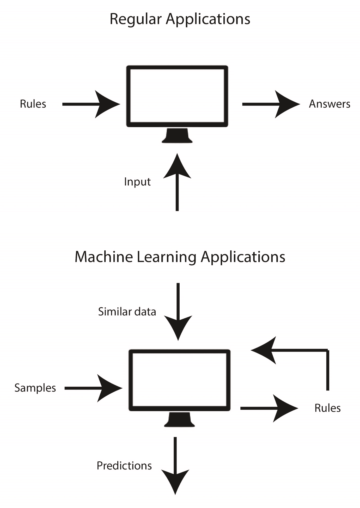
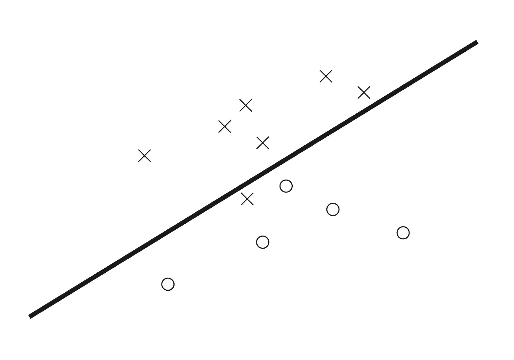
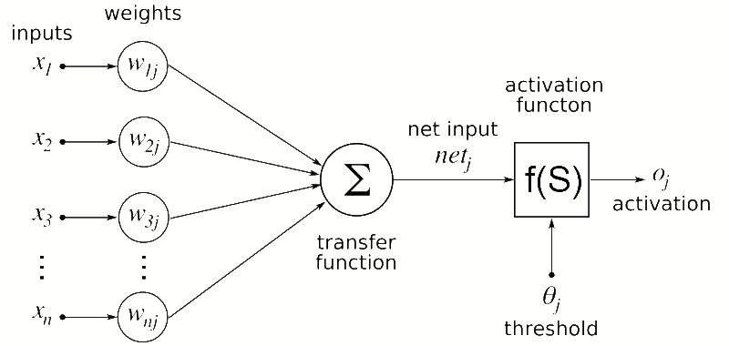
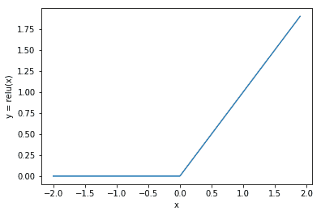
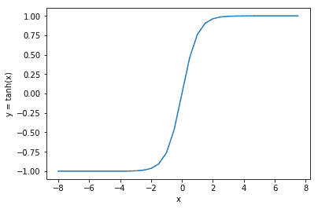
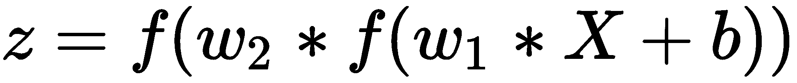
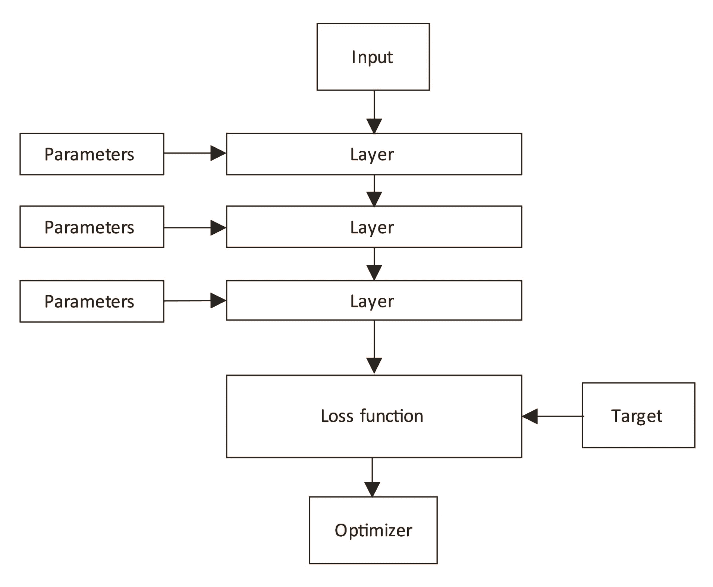
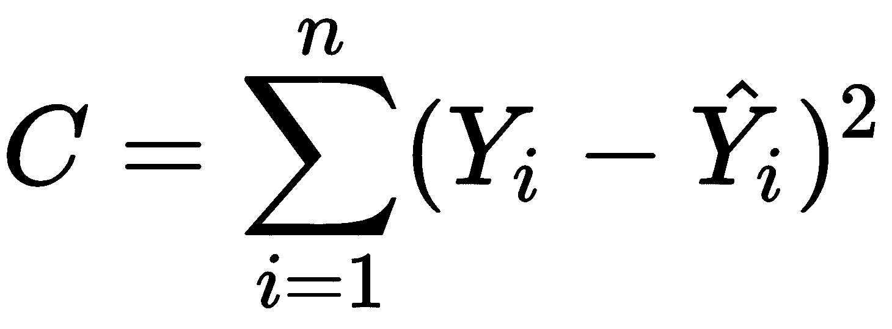

# 一、CNTK 入门

深度学习是一种机器学习技术，受到公众和研究人员的广泛关注。在这一章中，我们将探索什么是深度学习，以及大公司如何使用它来解决复杂的问题。我们将看看是什么让这项技术如此令人兴奋，以及哪些概念推动了深度学习。

然后我们将讨论**微软认知工具包** ( **CNTK** )，它是什么，以及它如何融入深度学习的更大图景。我们还将讨论 CNTK 与其他框架相比的独特之处。

在这一章中，我们还将向你展示如何在你的电脑上安装 CNTK。我们将探索在 Windows 和 Linux 上的安装。如果你有一个兼容的显卡，你也会想看看如何配置你的显卡以与 CNTK 一起使用的说明，因为这将大大加快训练深度学习模型所需的计算速度。

在本章中，我们将讨论以下主题:

*   人工智能、机器学习和深度学习之间的关系
*   深度学习是如何工作的？
*   什么是 CNTK？
*   安装 CNTK


# 人工智能、机器学习和深度学习之间的关系

为了理解什么是深度学习，我们必须探索什么是**人工智能** ( **AI** )以及它与机器学习和深度学习之间的关系。从概念上讲，深度学习是机器学习的一种形式，而机器学习是 AI 的一种形式:


在计算机科学中，人工智能是一种由机器展示的智能形式。人工智能是 20 世纪 50 年代从事计算机科学研究的科学家发明的一个术语。人工智能包含一大套算法，这些算法显示的行为比我们为计算机构建的标准软件更智能。

一些算法展示了智能行为，但无法自我改进。一组称为机器学习算法的算法可以从您展示给它们的样本数据中学习，并生成模型，然后您可以使用类似的数据进行预测。

在机器学习算法组中，有深度学习算法的子类。这组算法使用的模型受到人类或动物生物大脑结构和功能的启发。

机器学习和深度学习都是从你提供的样本数据中学习的。当我们构建常规程序时，我们通过使用不同的语言结构来编写业务规则，例如 if 语句、循环和函数。规则是固定的。在机器学习中，我们将样本和预期答案输入算法，然后该算法学习将样本与预期答案联系起来的规则:



机器学习有两个主要部分:机器学习模型和机器学习算法。

当你使用机器学习来构建一个程序时，你首先要选择一个机器学习模型。机器学习模型是一个包含可训练参数的数学方程，它将输入转换为预测的答案。这个模型塑造了计算机将要学习的规则。例如:预测一辆汽车每加仑行驶的英里数需要你以某种方式模拟现实。对信用卡交易是否欺诈进行分类需要不同的模型。

输入的表示可以是变成向量的汽车的属性。模型的输出可以是汽车每加仑行驶的英里数。在信用卡欺诈的情况下，输入可能是用户帐户的属性和完成的交易。输出表示可以是 0 到 1 之间的分数，其中接近 1 的值意味着交易应该被拒绝。

机器学习模型中的数学转换由一组参数控制，这些参数需要被训练用于转换以产生正确的输出表示。

这就是第二部分，机器学习算法发挥作用的地方。为了找到机器学习模型中参数的最佳值，我们需要执行一个多步骤过程:

1.  最初，计算机会为模型中的每个未知参数选择一个随机值
2.  然后，它将使用样本数据进行初步预测
3.  该预测与预期输出一起被输入到一个`loss`函数中，以获得关于模型执行情况的反馈
4.  然后，该反馈被机器学习算法用来为模型中的参数找到更好的值

这些步骤重复多次，以找到模型中参数的最佳可能值。如果一切顺利，你最终会得到一个能够对许多复杂情况做出准确预测的模型。

我们可以从例子中学习规则的事实是一个有用的概念。在很多情况下，我们无法使用简单的规则来解决特定的问题。例如:信用卡欺诈案件有多种形式和规模。有时，黑客会慢慢破坏系统，随着时间的推移注入更小的黑客攻击，然后窃取资金。其他时候，黑客只是试图在一次尝试中窃取大量金钱。基于规则的程序将变得难以维护，因为它需要包含大量代码来处理所有不同的欺诈案件。机器学习是解决这个问题的一种优雅的方式。它知道如何在没有大量代码的情况下处理不同类型的信用卡欺诈。它还能够在合理的范围内对以前没有见过的案件做出判断。


# 机器学习的局限性

机器学习模型非常强大。您可以在许多基于规则的程序无法满足需求的情况下使用它们。每当你发现一个常规的基于规则的程序无法解决的问题时，机器学习是一个很好的第一选择。然而，机器学习模型也有其局限性。

机器学习模型中的数学转换是非常基本的。例如:当你想对一笔信用交易是否应该被标记为欺诈进行分类时，可以使用线性模型。逻辑回归模型是这种用例的一个很好的模型；它创建了一个区分欺诈案件和非欺诈案件的决策边界函数。大多数欺诈案例都在这条线上，并被正确地标记出来。但是，没有一个机器学习模型是完美的，有些情况不会被模型正确地标记为欺诈，如下图所示。



如果您的数据恰好是完全线性可分的，那么所有案例都会被模型正确分类。但是当必须处理更复杂类型的数据时，基本的机器学习模型就不够用了。机器学习能力有限还有更多原因:

*   许多算法假设输入中的要素之间没有交互
*   在许多情况下，机器学习是基于线性算法的，不能很好地处理非线性
*   通常，您会处理大量的特征，经典的机器学习算法很难处理输入数据中的高维度


# 深度学习是如何工作的？

机器学习中发现的局限性促使科学家寻找其他方法来建立更复杂的模型，使他们能够处理非线性关系和模型输入之间存在大量交互的情况。这导致了人工神经网络的发明。

人工神经网络是由几层人工神经元组成的图形。它的灵感来自于在人类和动物身上发现的生物大脑的结构和功能。

为了理解深度学习的力量以及如何使用 CNTK 建立神经网络，我们需要看看神经网络是如何工作的，以及它是如何被训练来检测你喂给它的样本中的模式的。


# 神经网络体系结构

神经网络由不同的层组成。每层包含多个神经元。

典型的神经网络由几层人工神经元组成。神经网络中的第一层称为**输入层**。这是我们向神经网络输入信息的地方。神经网络的最后一层被称为**输出层**。这是转换后的数据从神经网络出来的地方。神经网络的输出代表网络所做的预测。

在神经网络的输入和输出层之间，可以找到一个或多个隐藏层。输入和输出之间的层是隐藏的，因为我们通常不会观察到通过这些层的数据。

神经网络是数学构造。通过神经网络传递的数据被编码为浮点数。这意味着你想用神经网络处理的一切都必须被编码成浮点数的向量。


# 人工神经元

神经网络的核心是人工神经元。人工神经元是神经网络中最小的单元，我们可以训练它来识别数据中的模式。神经网络中的每个人工神经元都有一个或多个输入。每个向量输入得到一个权重:



图片改编自:https://commons . wikimedia . org/wiki/File:Artificial _ neural _ network . png

神经网络中的人工神经元以大致相同的方式工作，但不使用化学信号。神经网络中的每个人工神经元都有一个或多个输入。每个向量输入都有一个权重。

为神经元的每个输入提供的数字乘以这个权重。然后将该乘法的输出相加，产生神经元的总激活值。

该激活信号随后通过`activation`功能传递。`activation`功能对该信号进行非线性转换。例如；它使用一个`rectified linear`函数来处理输入信号；



`rectified linear`功能会将负激活信号转换为零，但当信号为正数时，会对其执行恒等(传递)转换。

另一个流行的激活功能是`sigmoid`功能。它的行为与`rectified linear`函数略有不同，因为它将负值转换为 0，将正值转换为 1。然而，在-0.5 和+0.5 之间存在激活斜率，其中信号以线性方式转换。



人工神经元中的激活函数在神经网络中起着重要的作用。正是由于这些非线性变换函数，神经网络能够处理数据中的非线性关系。


# 用神经网络预测产量

通过将多层神经元结合在一起，我们创建了一个具有非线性转换和可训练权重的堆叠函数，因此它可以学习识别复杂的关系。为了形象化这一点，让我们将前面章节中的神经网络转换为一个数学公式。首先，让我们看看单层的公式:


*X* 变量是一个向量，表示神经网络中该层的输入。 *w* 参数表示输入向量 *X* 中每个元素的权重向量。在许多神经网络实现中，添加了一个额外的术语 *b* ，这被称为**偏差**，并且基本上增加或减少激活神经元所需的输入的总体水平。最后，还有一个函数， *f* ，它是该层的`activation`函数。

现在，您已经看到了单个层的公式，让我们将其他层放在一起，以创建神经网络的公式:



注意公式是如何变化的。我们现在有了包装在另一个`layer`函数中的第一层的公式。当我们向神经网络添加更多层时，这种函数的包装或堆叠会继续。每一层都引入更多需要优化的参数来训练神经网络。它还允许神经网络从我们输入的数据中学习更复杂的关系。

要使用神经网络进行预测，我们需要填充神经网络中的所有参数。假设我们知道这些，因为我们以前训练过。剩下的就是神经网络的输入值。

输入是一个浮点数的向量，它代表了我们神经网络的输入。输出是一个向量，它形成了神经网络预测输出的表示。


# 优化神经网络

我们已经讨论过用神经网络进行预测。我们还没有谈到如何优化神经网络中的参数。让我们回顾一下神经网络中的每个组件，并探索在我们训练它时它们是如何协同工作的:



神经网络有几层连接在一起。每一层都有一组我们想要优化的可训练参数。优化神经网络是使用一种称为反向传播的技术来完成的。我们的目标是通过逐步优化上图中的 *w1* 、 *w2* 和 *w3* 参数值来最小化损失函数的输出。

神经网络的`loss`函数可以有多种形式。通常，我们选择一个函数来表示预期输出 *Y* 和神经网络产生的实际输出之间的差异。例如:我们可以使用下面的`loss`函数:



首先，用初始化神经网络。我们可以用模型中所有参数的随机值来做到这一点。

初始化神经网络后，我们将数据输入神经网络进行预测。然后，我们将预测和预期输出一起输入到一个`loss`函数中，以测量模型与我们预期的有多接近。

来自`loss`功能的反馈被用于提供给优化器。优化器使用一种称为梯度下降的技术来找出如何优化每个参数。

梯度下降是神经网络优化的一个关键因素，并且由于`loss`函数的一个有趣的性质而有效。当您将一组输入的`loss`函数的输出与神经网络中不同的参数值进行可视化时，您最终会得到一个类似如下的图:


在反向传播过程的开始，我们从这个山区景观的某个斜坡开始。我们的目标是朝着参数值最佳的点下山。这是尽可能减小`loss`功能输出的点。

为了找到下山的路，我们需要找到一个函数来表示山坡上当前点的坡度。我们通过从`loss`函数创建一个派生函数来实现这一点。这个衍生函数为我们提供了模型中参数的梯度。

当我们执行一遍反向传播过程时，我们使用参数的梯度向山下走一步。为此，我们可以在参数中添加梯度。但这是一种沿着斜坡下山的危险方式。因为如果我们走得太快，我们可能会错过最佳位置。因此，所有的神经网络优化器都有一个称为学习率的设置。学习率控制下降率。

因为我们在梯度下降算法中只能采取很小的步骤，所以我们需要多次重复这个过程，以达到神经网络参数的最佳值。


# 什么是 CNTK？

从头开始构建神经网络是一项艰巨的任务——我不建议任何人开始这样做，除非你在寻找编程挑战。有一些很棒的库可以帮助你建立神经网络，而不需要完全理解数学公式。

**微软认知工具包** ( **CNTK** )是一个开源库，包含了构建神经网络的所有基本构建模块。

CNTK 是用 C++和 Python 实现的，但也有 C#和 Java 版本。训练只能在 C++或 Python 中完成，但在训练完神经网络后，您可以轻松地用 C#或 Java 加载模型来进行预测。

还有一个 CNTK 的变种，它使用一种叫做 BrainScript 的专有语言。但是出于本书的目的，我们将只研究 Python 框架的基本特性。稍后，在[第 7 章](8db9f932-5716-4a33-82a7-0c5ce5fe2ed4.xhtml) 、*将模型部署到生产*中，我们将讨论如何使用 C#或 Java 来加载和使用一个经过训练的模型。


# CNTK 的特点

CNTK 是一个库，它同时具有用于构建神经网络的低级和高级 API。低级 API 是为寻求构建下一代神经网络组件的科学家准备的，而高级 API 是为构建生产质量的神经网络准备的。

在这些基本构建模块的基础上，CNTK 还具有一组组件，可以更容易地将数据输入到您的神经网络中。它还包含用于监控和调试神经网络的各种组件。

最后，CNTK 提供了一个 C#和 Java API。您可以使用这两种语言来加载训练好的模型，并从您的 web 应用程序、微服务甚至 Windows 应用商店应用程序中进行预测。此外，如果您想这样做，可以使用 C#来训练模型。

尽管可以在 Java 和 C#中使用 CNTK，但重要的是要知道，在这一点上，Python 版本的 CNTK 中的所有特性并不适用于 C#和 Java APIs。例如:在 Python 中为目标检测而训练的模型在 CNTK 2.6 版的 C#中不工作。


# 一个高速低级 API

在 CNTK 的核心，您会发现一个包含一组数学运算符的低级 API 来构建神经网络组件。低级 API 还包括优化神经网络参数所需的自动微分。

微软构建这些组件时考虑到了高性能。例如:它包括在图形卡上训练神经网络的特定代码。显卡包含专门的处理器，称为 GPU，能够以非常高的速度处理大量的矢量和矩阵数学。通常可以将神经网络的训练过程至少加快 10 倍。


# 快速创建神经网络的基本构件

当您希望构建一个用于生产的神经网络时，通常会使用高级 API。高级 API 包含神经网络的各种不同的构建块。

例如:有一个基本的密集层来构建最基本的神经网络。但是你也会在高级 API 中找到更高级的图层类型，比如处理图像或者时序数据所需的图层类型。

高级 API 还包含不同的优化器来训练神经网络，因此您不必手动构建梯度下降优化器。在 CNTK 中，使用学习者和训练者来实现优化过程，其中学习者定义使用哪种梯度下降算法，而训练者定义如何实现反向传播的基础。

在[第 2 章](4c9da7a9-6873-4de9-99a9-43de693d65f8.xhtml)、*用 CNTK* 构建神经网络中，我们将探讨如何使用高级 API 来构建和训练神经网络。在[第 5 章](9d91a0e4-3870-4a2f-b483-82fdb8849bc2.xhtml)、*处理图像*和[第 6 章](a5da9ef2-399a-4c30-b751-318d64939369.xhtml)、*处理时间序列数据、*中，您将学习如何使用一些更高级的图层类型，通过 CNTK 处理图像和时间序列数据。


# 衡量模型性能

一旦你建立了一个神经网络，你要确保它正常工作。CNTK 提供了许多组件来测量神经网络的性能。

您会经常发现自己在寻找方法来监控您的模型的培训过程进行得如何。CNTK 包括将从您的模型和相关联的优化器生成日志数据的组件，您可以使用这些组件来监视训练过程。


# 加载和处理大型数据集

当你使用深度学习时，你经常需要一个大的数据集来训练神经网络。使用千兆字节的数据来训练您的模型并不罕见。CNTK 包括一组组件，允许您将数据输入神经网络进行训练。

微软尽最大努力构建专门的阅读器，将数据批量加载到内存中，这样你就不需要 1tb 的 RAM 来训练你的网络。我们将在第三章*中更深入地讨论这些读者，让数据进入你的神经网络*。


# 使用 C#和 Java 中的模型

主要的 CNTK 库是在 C++核心之上用 Python 构建的。可以同时使用 C++和 Python 来训练模型。当您想在生产中使用您的模型时，您有更多的选择。您可以使用 C++或 Python 中的训练模型，但大多数开发人员会希望使用 Java 或 C#。就运行时性能而言，Python 比这些语言慢得多。此外，C#和 Java 在企业环境中使用得更广泛。

您可以从 NuGet 或 Maven central 下载 C#和 Java 版本的 CNTK 作为单独的库。在[第 7 章](8db9f932-5716-4a33-82a7-0c5ce5fe2ed4.xhtml)、*将模型部署到生产*中，我们将讨论如何使用这些语言中的 CNTK 在微服务环境中托管一个经过训练的模型。


# 安装 CNTK

现在我们已经了解了神经网络的工作原理以及 CNTK 是什么，接下来让我们来看看如何将它安装到您的计算机上。Windows 和 Linux 都支持 CNTK，所以我们将逐一介绍。


# 在 Windows 上安装

我们将在 Windows 上使用 Python 的 Anaconda 版本来运行 CNTK。Anaconda 是 Python 的一个再发行版，它包含了额外的包，比如`SciPy`和`scikit-learn`，CNTK 使用它们来执行各种计算。


# 安装 Anaconda

你可以从公众网站下载 Anaconda:[https://www.anaconda.com/download/](https://www.anaconda.com/download/)。

下载完安装文件后，开始安装并按照说明在您的计算机上安装 Anaconda。你可以在[https://docs.anaconda.com/anaconda/install/](https://docs.anaconda.com/anaconda/install/)找到安装说明。

Anaconda 会在你的电脑上安装一些实用程序。它将安装一个新的命令提示符，自动将所有 Anaconda 可执行文件包含在 PATH 变量中。您可以从这个命令提示符快速管理您的 Python 环境，安装软件包，当然，还可以运行 Python 脚本。

或者，您可以在 Anaconda 安装中安装 Visual Studio 代码。Visual Studio Code 是一个类似于 Sublime 和 Atom 的代码编辑器，包含大量插件，可以更容易地用不同的编程语言(如 Python)编写程序代码。

CNTK 2.6 只支持 Python 3.6，这意味着并非所有的 Anaconda 发行版都能正常工作。你可以通过 https://repo.continuum.io/archive/的 Anaconda 档案馆获得旧版本的 Anaconda。或者，如果您还没有包含 Python 3.6 的版本，可以在 Anaconda 安装中降级 Python 版本。要在您的 Anaconda 环境中安装 Python 3.6，请打开一个新的 Anaconda 提示符并执行以下命令:

```
conda install python=3.6
```


# 升级 pip

Anaconda 附带了一个稍微过时的 python 包管理器版本`pip`。当我们试图安装`CNTK`包时，这会导致问题。所以，在我们安装`CNTK`包之前，让我们升级一下`pip`可执行文件。

要升级`pip`可执行文件，打开 Anaconda 提示符并执行以下命令:

```
python -m pip install --upgrade pip
```

这将删除旧的`pip`可执行文件，并在其位置安装一个新版本。


# 安装 CNTK

有很多方法可以在你的电脑上安装`CNTK`软件包。最常见的方法是通过`pip`可执行文件安装包:

```
pip install cntk
```

这将从包管理器网站下载`CNTK`包并安装在你的机器上。`pip`将自动检查缺失的依赖项并安装它们。

在您的机器上安装 CNTK 有几种替代方法。该网站有一套整洁的文档，详细解释了其他安装方法:[https://docs . Microsoft . com/en-us/cognitive-toolkit/Setup-CNTK-on-your-machine](https://docs.microsoft.com/en-us/cognitive-toolkit/Setup-CNTK-on-your-machine)。


# 在 Linux 上安装

在 Linux 上安装 CNTK 与在 Windows 上安装略有不同。就像在 Windows 上一样，我们将使用 Anaconda 来运行`CNTK`包。但是在 Linux 上有一个基于终端的安装程序，而不是 Anaconda 的图形安装程序。安装程序可以在大多数 Linux 发行版上运行。我们将描述局限于 Ubuntu，一个广泛使用的 Linux 发行版。


# 安装 Anaconda

在安装 Anaconda 之前，我们需要确保系统是最新的。要检查这一点，请在终端中执行以下两个命令:

```
sudo apt update 
sudo apt upgrade
```

**自动编程工具** ( **APT** )用于安装 Ubuntu 内部的各种包。在代码示例中，我们首先要求`apt`更新对各种包存储库的引用。然后，我们要求它安装最新的更新。

电脑更新后，我们就可以开始安装 Anaconda 了。首先，导航到[https://www.anaconda.com/download/](https://www.anaconda.com/download/)获取最新 Anaconda 安装文件的 URL。您可以右键单击下载链接，并将 URL 复制到您的剪贴板。

现在打开一个终端窗口，执行以下命令:

```
wget -O anaconda-installer.sh url
```

确保用从 Anaconda 网站复制的 URL 替换`url`占位符。按*回车*执行命令。

下载安装文件后，您可以通过运行以下命令来安装 Anaconda:

```
sh ./anaconda-installer.sh
```

这将启动安装程序。按照屏幕上的说明在您的计算机上安装 Anaconda。默认情况下，Anaconda 安装在您的主目录中的一个名为`anaconda3`的文件夹中。

和 Windows 版本的 CNTK 2.6 一样，它只支持 Python 3.6。您可以通过他们在[https://repo.continuum.io/archive/](https://repo.continuum.io/archive/)的档案获得旧版本的 Anaconda，或者通过在您的终端中执行以下命令来降级您的 Python 版本:

```
conda install python=3.6
```


# 将 pip 升级到最新版本

一旦我们安装了 Anaconda，我们需要将`pip`升级到最新版本。`pip`用于在 Python 内部安装包。这是我们将要用来安装 CNTK 的工具:

```
python -m pip install --upgrade pip
```


# 安装 CNTK 包

安装过程的最后一步是安装 CNTK。这是通过使用以下命令通过`pip`完成的:

```
pip install cntk
```

如果您愿意，也可以通过直接下载一个 wheel 文件或者使用包含 Anaconda 的安装程序来安装 CNTK。你可以在[https://docs . Microsoft . com/en-us/cognitive-toolkit/Setup-CNTK-on-your-machine](https://docs.microsoft.com/en-us/cognitive-toolkit/Setup-CNTK-on-your-machine)找到更多关于 CNTK 替代安装方法的信息。


# 将您的 GPU 与 CNTK 配合使用

我们研究了如何安装 CNTK 的基本版本，以便在您的 CPU 上使用。虽然`CNTK`包很快，但在 GPU 上运行会更快。但不是所有的机器都支持这种设置，这就是为什么我把如何使用你的 GPU 的描述放在一个单独的部分。

在尝试安装 CNTK 用于 GPU 之前，请确保您拥有受支持的显卡。目前 CNTK 支持至少 CUDA 3.0 支持的 NVIDIA 显卡。CUDA 是 NVIDIA 的编程 API，允许开发人员在其显卡上运行非图形程序。你可以在这个网站上查看你的显卡是否支持 CUDA:[https://developer.nvidia.com/cuda-gpus](https://developer.nvidia.com/cuda-gpus)。


# 在 Windows 上启用 GPU

要在 Windows 上使用带有 CNTK 的显卡，您需要为您的显卡安装最新的 GeForce 或 Quadro 驱动程序(具体取决于您使用的是哪种驱动程序)。除了最新的驱动程序，你还需要安装 CUDA toolkit 版。

你可以从 NVIDIA 网站下载 CUDA 工具包:[https://developer.nvidia.com/cuda-90-download-archive?target _ OS = Windows&target _ arch = x86 _ 64](https://developer.nvidia.com/cuda-90-download-archive?target_os=Windows&target_arch=x86_64)。下载完成后，运行安装程序并按照屏幕上的说明进行操作。

CNTK 使用 CUDA 之上的一层，称为 cuDNN，用于特定于神经网络的原语。你可以从 NVIDIA 网站[https://developer.nvidia.com/rdp/form/cudnn-download-survey](https://developer.nvidia.com/rdp/form/cudnn-download-survey)下载 cuDNN 二进制文件。与 CUDA 工具包不同，在下载 cuDNN 二进制文件之前，您需要在网站上注册一个帐户。

并非所有的 cuDNN 二进制文件都能与 CUDA 的每个版本兼容。网站提到 cuDNN 的哪个版本与 CUDA 工具包的哪个版本兼容。对于 CUDA 9.0，需要下载 cuDNN 7.4.1。

下载完 cuDNN 二进制文件后，将 zip 文件解压到 CUDA toolkit 安装的根文件夹中。通常，CUDA 工具包位于`C:\program files\NVIDIA GPU Computing Toolkit\CUDA\v9.0`。

在 CNTK 中启用 GPU 的最后一步是安装`CNTK-GPU`包。在 Windows 中打开 Anaconda 提示符并执行以下命令:

```
pip install cntk-gpu
```


# 在 Linux 上启用 GPU

在 Linux 上使用带有 CNTK 的显卡需要运行 NVIDIA 的专有驱动程序。当您在 Linux 机器上安装 CUDA toolkit 时，系统会要求您自动安装显卡的最新驱动程序。虽然您不需要通过 CUDA toolkit 安装程序来安装驱动程序，但我们强烈建议您这样做，因为驱动程序将与 CUDA toolkit 的二进制文件相匹配。这降低了安装失败或以后出现其他错误的风险。

你可以从 NVIDIA 网站下载 CUDA 工具包:【https://developer.nvidia.com/cuda-90-download-archive? target _ OS = Linux&target _ arch = x86 _ 64&target _ distro = Ubuntu&target _ version = 1604&target _ type = runfile local。

请确保您选择了合适的 Linux 发行版和版本。该链接自动选择 Ubuntu 16.04 并使用本地运行文件。

将二进制文件下载到磁盘后，可以通过打开终端并执行以下命令来运行安装程序:

```
sh cuda_9.0.176_384.81_linux-run
```

按照屏幕指示在您的机器上安装 CUDA 工具包。

一旦安装了 CUDA 工具包，就需要修改 Bash 概要文件脚本。在您最喜欢的文本编辑器中打开`$HOME/.bashrc`文件，并在脚本末尾包含以下行:

```
export PATH=/usr/local/cuda-9.0/bin${PATH:+:${PATH}}
export LD_LIBRARY_PATH=/usr/local/cuda-9.0/lib64\ 
 ${LD_LIBRARY_PATH:+:${LD_LIBRARY_PATH}}
```

第一行在 PATH 变量中包含了 CUDA 二进制文件，因此 CNTK 可以访问它们。脚本中的第二行包括库路径中的 CNTK 库，以便 CNTK 可以在需要时加载它们。

保存对文件的更改并关闭编辑器。请确保重新启动您的终端窗口，以确保加载新的设置。

最后一步是下载并安装 cuDNN 二进制文件。CNTK 使用 CUDA 之上的一层，称为 cuDNN，用于特定于神经网络的原语。你可以从 NVIDIA 网站这里下载 cuDNN 二进制文件:【https://developer.nvidia.com/rdp/form/cudnn-download-survey[。与 CUDA 工具包不同，在下载 cuDNN 二进制文件之前，您需要在网站上注册一个帐户。](https://developer.nvidia.com/rdp/form/cudnn-download-survey)

并非所有的 cuDNN 二进制文件都能与 CUDA 的每个版本兼容。网站提到 cuDNN 的哪个版本与 CUDA 工具包的哪个版本兼容。对于 CUDA 9.0，需要下载 cuDNN 7.4.1。下载 Linux 版本，并使用以下命令将其解压缩到`/usr/local/cuda-9.0`文件夹:

```
tar xvzf -C /usr/local/cuda-9.0/ cudnn-9.0-linux-x64-v7.4.1.5.tgz
```

文件名可能略有不同；根据需要更改文件名的路径。


# 摘要

在这一章中，我们学习了深度学习及其与机器学习和人工智能的关系。我们看了深度学习背后的基本概念，以及如何使用梯度下降来训练神经网络。然后我们讨论了 CNTK，它是什么，以及该库提供了哪些功能来构建深度学习模型。我们最后花了一些时间讨论如何在 Windows 和 Linux 上安装 CNTK，以及如何使用你的 GPU。

在下一章中，我们将学习如何用 CNTK 构建基本的神经网络，以便更好地理解本章中的概念在代码中是如何工作的。我们还将讨论我们可以在不同的场景中使用深度学习模型中的各种组件的不同方式。