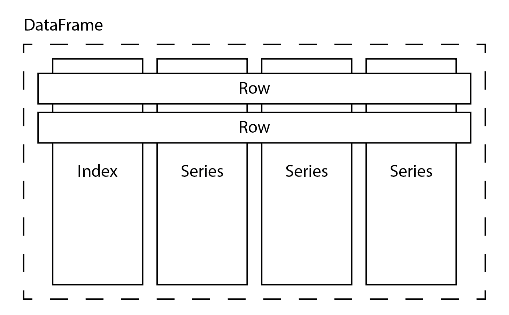

# 三、让数据进入你的神经网络

有许多技术可以用来加载数据来训练神经网络或进行预测。使用哪种技术取决于数据集的大小以及存储数据的格式。在前一章中，我们已经看到了如何手动将数据输入 CNTK 训练器。在这一章中，我们将学习更多将数据输入神经网络的方法。

本章将涵盖以下主题:

*   使用迷你批次有效训练您的神经网络
*   使用小型内存数据集
*   使用大型数据集
*   控制微型批次循环


# 技术要求

我们假设您的计算机上安装了 Anaconda 的最新版本，并按照[第 1 章](9a2c8c46-f9a0-4e05-86ef-31300a28a7ba.xhtml)、*CNTK*中的步骤在您的计算机上安装 CNTK。本章的示例代码可以在我们的 GitHub 资源库中找到，网址为[https://GitHub . com/packt publishing/Deep-Learning-with-Microsoft-Cognitive-Toolkit-Quick-Start-Guide/tree/master/CH3](https://github.com/PacktPublishing/Deep-Learning-with-Microsoft-Cognitive-Toolkit-Quick-Start-Guide/tree/master/ch3)。

在这一章中，我们将学习一些储存在 Jupyter 笔记本中的例子。要访问示例代码，请在下载代码的目录中的 Anaconda 提示符下运行以下命令:

```
cd ch3
jupyter notebook
```

我们将在每一节中提到相关的笔记本，这样你就可以跟着做并自己尝试不同的技术。

请观看以下视频，了解实际运行的代码:

[http://bit.ly/2UczHuH](http://bit.ly/2UczHuH)


# 用小批量有效训练神经网络

在前一章中，我们讨论了如何建立和训练神经网络。在本章中，我们将讨论向 CNTK 培训师提供数据的各种方法。在我们深入研究每种数据处理方法的细节之前，让我们仔细看看在训练神经网络时数据会发生什么。

你需要一些东西来训练一个神经网络。正如我们在前一章所讨论的，你需要有一个模型的基本结构和一个损失函数。`trainer`和`learner`是拼图的最后一块，负责控制训练过程。

`trainer`执行四个步骤:

1.  它获取大量的训练样本，并通过网络和`loss`功能进行反馈
2.  接下来，它获取`loss`功能的输出，并通过`learner`进行馈送
3.  然后，它使用`learner`来获得网络中参数的一组梯度
4.  最后，它使用梯度来确定网络中每个参数的新值

对数据集中的所有样本重复此过程，以在整个时期内训练网络。通常，您需要为多个历元训练网络，以获得最佳结果。

我们之前在训练神经网络时只讨论了单个样本。但在 CNTK 内部，情况并非如此。

CNTK 和许多其他框架使用迷你批处理来训练神经网络。迷你批次是从数据集中提取的一组样本。从本质上讲，迷你批次是一个非常小的样本表。它包含输入特征的预定义数量的样本，以及神经网络目标的相同数量的样本。

在训练期间，小批量通过网络来计算损失函数的输出。`loss`函数的输出不再是单个值，而是一个值列表，等于 minibatch 中的行数。然后，该值列表通过`learner`获得神经网络中每个参数的一组梯度。

现在，使用迷你电池有一个问题。我们希望每个参数有一个梯度来优化它的值。但是我们得到的是梯度列表。我们可以通过计算每个参数梯度的平均值来解决这个问题。然后，平均梯度用于更新神经网络中的参数。

使用迷你电池加速了训练过程，但也付出了代价。因为我们现在必须处理平均值，所以我们在计算模型中参数的梯度时会损失一些分辨率。将所有计算的梯度平均后，单个迷你批次中的梯度很可能为零。当你使用迷你批次来训练你的神经网络时，你会得到一个质量较低的模型。

在开始训练神经网络之前，您需要自己设置每个迷你批次的样本数量。选择较高的迷你批次大小将导致以质量为代价的更快的训练。小批量生产速度较慢，但能生产出更好的型号。选择合适的迷你批次大小是一个实验问题。

选择迷你电池的大小还有一个记忆方面的问题。迷你批次的大小取决于您的机器中有多少可用内存。您会发现，与常规计算机内存相比，您可以在显卡内存中存储更少的样本。

下一节描述的所有方法都将自动使用迷你批次。在本章的后面，*控制微型电池回路，*一节中，我们将讨论如何在需要时自己控制微型电池回路。


# 使用小型内存数据集

您可以通过多种方式向 CNTK 培训师反馈数据。应该使用哪种技术取决于数据集的大小和数据的格式。让我们先看看如何处理较小的内存数据集。

当您在 Python 中处理内存数据时，您很可能会使用 Pandas 或 NumPy 之类的框架。这些框架在其核心处理浮点或对象数据的向量和矩阵，并在处理数据时提供不同程度的便利。

让我们来看看这些库中的每一个，并探索如何使用这些库中存储的数据来训练您的神经网络。


# 使用 numpy 数组

我们将探索的第一个库是 numpy。Numpy 是 Python 中最基本的库，用于对 n 维数组执行数学运算。它的特点是在计算机内存中存储矩阵和向量的有效方法。numpy 库定义了大量操作符来操作这些 n 维数组。例如，它具有计算整个矩阵或矩阵中的行/列的平均值的内置函数。

您可以按照本章开头所述的说明，在浏览器中打开`Training using numpy arrays.ipynb`笔记本，跟随本节中的任何代码。

让我们看看如何在 CNTK 中使用基于 numpy 的数据集。例如，我们将使用随机生成的数据集。我们将模拟二元分类问题的数据。假设我们有一组具有四个特征的观察值。我们想用我们的模型预测两个可能的标签。首先，我们需要生成一组标签，其中包含我们想要预测的标签的独热向量表示。接下来，我们还需要一组作为模型输入要素的要素:

```
import numpy as np

num_samples = 20000

label_mapping = np.eye(2)
y = label_mapping[np.random.choice(2,num_samples)].astype(np.float32)
X = np.random.random(size=(num_samples, 4)).astype(np.float32)
```

遵循给定的步骤:

1.  首先，导入别名为`np`的`numpy`包
2.  然后，使用`np.eye`函数生成一个`label mapping`
3.  之后，使用`np.random.choice`函数从生成的`label mapping`中收集`20,000`个随机样本
4.  最后，使用`np.random.random`函数生成一个随机浮点值数组

生成的标签映射是我们支持的可能类的一键表示，如下所示:

```
[0, 1]
[1, 0]
```

生成的矩阵需要转换为 32 位浮点数，以匹配 CNTK 预期的格式。如果没有这一步，您将看到一个错误，告诉您格式不是预期的类型。CNTK 希望您提供双精度或浮点 32 个数据点。

让我们定义一个适合我们刚刚生成的数据集的基本模型:

```
from cntk.layers import Dense, Sequential
from cntk import input_variable, default_options
from cntk.ops import sigmoid
from cntk.losses import binary_cross_entropy

with default_options(activation=sigmoid):
   model = Sequential([
        Dense(6),
        Dense(2)
    ])

features = input_variable(4)

z = model(features)
```

遵循给定的步骤:

1.  首先，从`layers`模块导入`Dense`和`Sequential`图层函数
2.  然后，导入`sigmoid`作为网络中各层的激活函数
3.  之后，导入`binary_cross_entropy`函数作为`loss`函数来训练网络

4.  接下来，定义网络的默认选项，将`sigmoid`激活功能作为默认设置
5.  现在，使用`Sequential`图层功能创建模型。
6.  使用两个`Dense`层，一个带有`6`神经元，另一个带有`2`神经元，作为输出层
7.  用`4`输入特征初始化一个`input_variable`，它将作为网络的输入。
8.  最后将`features`变量连接到神经网络上完成。

该模型将有四个输入和两个输出，与我们随机生成的数据集的格式相匹配。出于演示的目的，我们插入了一个额外的隐藏层，有六个神经元。

现在我们有了一个神经网络，让我们使用内存中的数据集来训练它:

```
from cntk.learners import sgd
from cntk.logging import ProgressPrinter

progress_writer = ProgressPrinter(0)

labels = input_variable(2)
loss = binary_cross_entropy(z, labels)
learner = sgd(z.parameters, lr=0.1)

training_summary = loss.train((X,y), parameter_learners=[learner], callbacks=[progress_writer])
```

遵循给定的步骤:

1.  首先，从`learners`模块导入`sgd`学习器
2.  接下来，从`logging`模块导入`ProgressPrinter`
3.  为标签定义一个新的`input_variable`
4.  为了训练模型，使用`binary_cross_entropy`函数定义一个`loss`，并为其提供模型`z`和`labels`变量
5.  接下来，初始化`sgd`学习器，并为其提供模型参数和`labels`变量
6.  最后，调用`loss`函数上的`train`方法，并提供输入数据、`sgd`学习器和`progress_printer`作为回调

您不需要为`train`方法提供回调。但是插入一个进度记录器会很有用，这样你就可以监控训练过程。没有这个，你真的看不到训练过程中发生了什么。

当您运行示例代码时，它将产生类似如下的输出:

```
 average      since    average      since      examples
 loss       last     metric       last 
 ------------------------------------------------------
Learning rate per minibatch: 0.5
 1.4        1.4          0          0           512
 1.4        1.4          0          0          1536
 1.39       1.39          0          0          3584
 1.39       1.39          0          0          7680
 1.39       1.39          0          0         15872
```

它列出了每个小批次的学习平均损失、自上次小批次以来的损失以及指标。由于我们没有提供指标，指标列中的值将保持`0`。在最后一列中，列出了神经网络看到的示例数量。

在前面的例子中，我们已经使用默认的批处理大小执行了`learner`。您可以使用`minibatch_size`关键字参数控制批量大小:

```
training_summary = loss.train((X,y), 
    parameter_learners=[learner], 
    callbacks=[progress_writer],
    minibatch_size=512)
```

将`minibatch_size`设置为较大的值将提高训练速度，但代价是模型稍差。

在示例代码中尝试不同的 minibatch 大小，看看它如何影响模型的性能。即使是用随机数据训练的模型。


# 使用熊猫数据框

Numpy 数组是存储数据的最基本方式。Numpy 数组包含的内容非常有限。单个 n 维数组可以包含单一数据类型的数据。对于许多实际情况，您需要一个能够在单个数据集中处理多种数据类型的库。例如，您会发现许多在线数据集的标签列是字符串，而数据集中的其余列包含浮点数。

pandas 库使处理这类数据集变得更加容易，并被许多开发人员和数据科学家使用。这是一个库，它允许你从磁盘上加载以不同格式存储的数据集作为数据帧。例如，您可以读取存储为 JSON、CSV 甚至 Excel 的数据帧。

Pandas 引入了数据框的概念，并引入了大量的数学和统计函数，您可以对数据框运行这些函数。让我们来看看熊猫数据帧的结构，看看这个库是如何工作的:



pandas 中的 DataFrame 是定义各个列的系列的集合。每个数据帧还有一个索引，允许您通过存储在索引中的键值来查找数据帧中的特定行。

使 DataFrame 独一无二的是在系列和数据集本身上定义的大量方法。例如，您可以在数据帧上调用`describe`来一次获得整个数据帧的汇总统计信息。

在单个系列上调用`describe`方法将为数据帧中的特定列获得相同的汇总统计数据。

数据科学家和开发人员广泛使用 Pandas 来处理 Python 中的数据。因为它被广泛使用，所以知道如何用 CNTK 处理存储在 pandas 中的数据是很好的。

在前一章中，我们已经加载了一个包含鸢尾花样本的数据集，并使用该数据集来训练分类模型。之前，我们使用训练器实例来训练神经网络。当你在一个`loss`函数上调用`train`时也会发生这种情况。`train`方法会自动为你创建一个教练和一个会话，所以你不必手动操作。

在[第 2 章](4c9da7a9-6873-4de9-99a9-43de693d65f8.xhtml)、*用 CNTK 构建神经网络*中，我们谈到了根据四个属性对三种可能的鸢尾花进行分类。你可以从本书附带的示例代码中获得该文件，也可以从 https://archive.ics.uci.edu/ml/datasets/Iris[的 UCI 数据集存档下载数据集。让我们看看如何在`loss`函数上使用`train`方法来训练我们在前一章中创建的网络:](https://archive.ics.uci.edu/ml/datasets/Iris)

```
from cntk import default_options, input_variable
from cntk.layers import Dense, Sequential
from cntk.ops import log_softmax, sigmoid

model = Sequential([
    Dense(4, activation=sigmoid),
    Dense(3, activation=log_softmax)
])

features = input_variable(4)

z = model(features)
```

我们之前用于分类花的模型包含一个隐藏层和一个输出层，输出层具有三个神经元，以匹配我们可以预测的类别数量。

为了训练模型，我们需要加载和预处理虹膜数据集，以便它与神经网络的预期布局和数据格式相匹配:

```
import numpy as np
import pandas as pd

df_source = pd.read_csv('iris.csv', 
    names=['sepal_length', 'sepal_width','petal_length','petal_width', 'species'], 
    index_col=False)

label_mapping = {
    'Iris-setosa': 0,
    'Iris-versicolor': 1,
    'Iris-virginica': 2
}

X = df_source.iloc[:, :4].values

y = df_source['species'].values
y = np.array([one_hot(label_mapping[v], 3) for v in y])

X = X.astype(np.float32)
y = y.astype(np.float32)
```

遵循吉文斯的步骤:

1.  首先，使用`read_csv`函数将数据集载入内存
2.  接下来，创建一个字典，将数据集中的标签与其对应的数字表示进行映射
3.  使用`DataFrame`上的`iloc`步进器选择前四列
4.  选择物种列作为数据集的标签
5.  使用`label_mapping`映射数据集中的标签，并使用`one_hot`编码将它们转换成独热编码数组
6.  将要素和映射的标注都转换为浮点型，以便可以通过 CNTK 使用它们

标签以字符串的形式存储在数据集中，CNTK 不能处理这些字符串值，它需要代表标签的一次性编码向量。为了对标签进行编码，我们需要使用映射表和`one_hot`函数，您可以使用下面的代码来创建它:

```
def one_hot(index, length):
    result = np.zeros(length)
    result[index] = index

    return result
```

遵循给定的步骤:

1.  使用`np.zeros`函数创建一个大小为`length`的新向量，并用零填充
2.  在提供的`index`处选择元素，并将其值设置为`1`
3.  返回`result`以便在数据集中使用

一旦我们有了正确格式的 numpy 数组，我们就可以像以前一样使用它们来训练我们的模型:

```
from cntk.losses import cross_entropy_with_softmax
from cntk.learners import sgd 
from cntk.logging import ProgressPrinter

progress_writer = ProgressPrinter(0)

labels = input_variable(3)
loss = cross_entropy_with_softmax(z, labels)
learner = sgd(z.parameters, 0.1)

train_summary = loss.train((X,y), 
    parameter_learners=[learner], 
    callbacks=[progress_writer], 
    minibatch_size=16, 
    max_epochs=5)
```

遵循给定的步骤:

1.  导入`cross_entropy_with_softmax`函数作为模型的损耗。
2.  然后，导入`sgd`学习器优化参数。
3.  之后，从`logging`模块导入`ProgressPrinter`来可视化训练进度。
4.  接下来，创建一个新的`ProgressPrinter`实例来记录优化器的输出。
5.  创建一个新的`input_variable`来存储用于培训的标签。
6.  初始化`sgd`学习器，给它模型的参数和`0.1`的学习率。
7.  最后，调用 loss 上的`train`方法，并向其提供训练数据、`learner`和`progress_writer`。除此之外，为`train`方法提供一个`16`的`minibatch_size`，并将`max_epochs`关键字参数设置为`5`。

`loss`函数上的`train`方法的`max_epochs`关键字参数是可选的。当您忽略它时，`trainer`将训练模型一个时期。

我们使用`ProgressWriter`来生成培训过程的输出，这样我们就可以监控培训课程的进度。你可以不考虑这一点，但这对于了解训练中发生的事情很有帮助。配置了进度编写器后，输出将类似于以下内容:

```
average      since    average      since      examples
 loss       last     metric       last 
 ------------------------------------------------------
Learning rate per minibatch: 0.1
 1.1        1.1          0          0            16
 0.835      0.704          0          0            48
 0.993       1.11          0          0           112
 1.14       1.14          0          0            16
 0.902      0.783          0          0            48
 1.03       1.13          0          0           112
 1.19       1.19          0          0            16
 0.94      0.817          0          0            48
 1.06       1.16          0          0           112
 1.14       1.14          0          0            16
 0.907       0.79          0          0            48
 1.05       1.15          0          0           112
 1.07       1.07          0          0            16
 0.852      0.744          0          0            48
 1.01       1.14          0          0           112
```

因为我们使用与常规 numpy 数组相同的方法来训练网络，所以我们也可以控制批量大小。我们将由您来尝试不同的批量设置，并找出产生最佳模型的方法。


# 使用大型数据集

我们已经将 NumPy 和 Pandas 作为向 CNTK 提供内存数据集进行训练的方法。但并不是每个数据集都小到可以放入内存。对于包含图像、视频样本或声音样本的数据集来说尤其如此。当您处理较大的数据集时，您只想一次将数据集的一小部分加载到内存中。通常，您只需将足够的样本加载到内存中，以运行一个小批量的训练。

CNTK 通过使用`MinibatchSource`支持处理更大的数据集。现在，`MinibatchSource`是一个可以从磁盘上分块加载数据的组件。它可以自动随机化从数据源读取的样本。这有助于防止神经网络由于训练数据集中的固定顺序而过度拟合。

`MinibatchSource`有一个内置的转换管道。您可以使用这个管道来扩充您的数据。当您处理图像等数据时，这是一个非常有用的功能。当你训练一个基于图像的模型时，你需要确保一个图像即使在一个有趣的角度也能被识别。转换管道允许您通过旋转从磁盘读取的原始图像来生成额外的样本。

`MinibatchSource`的一个独特之处是它在一个独立于训练过程的后台线程上加载数据。通过在一个单独的线程中加载数据，它可以提前加载迷你批处理，这样你的显卡就不会在这个过程中停滞不前。

在这一章中，我们将局限于`MinibatchSource`的基本用法。在 [第 5 章](9d91a0e4-3870-4a2f-b483-82fdb8849bc2.xhtml)、*处理图像* *、*和 [第 6 章](a5da9ef2-399a-4c30-b751-318d64939369.xhtml)、*处理时间序列数据*中，我们将看看如何使用`MinibatchSource`组件处理图像和时间序列数据。

让我们探索如何使用带有内存不足数据的微型批处理源来处理更大的数据集，并使用它来为训练神经网络提供数据。


# 创建 MinibatchSource 实例

在*处理熊猫数据帧*部分，我们处理了鸢尾花的例子。让我们回过头来，用`MinibatchSource`替换使用熊猫数据帧中的数据的代码。第一步是创建一个基本的`MinibatchSource`实例:

```
from cntk.io import StreamDef, StreamDefs, MinibatchSource, CTFDeserializer, INFINITELY_REPEAT

labels_stream = StreamDef(field='labels', shape=3, is_sparse=False)
features_stream = StreamDef(field='features', shape=4, is_sparse=False)

deserializer = CTFDeserializer('iris.ctf', StreamDefs(labels=labels_stream, features=features_stream))

minibatch_source = MinibatchSource(deserializer, randomize=True)
```

遵循给定的步骤:

1.  首先，从`io`模块导入小批量来源的组件。
2.  接下来，使用`StreamDef`类为标签创建一个流定义。使用标签字段，并将其设置为从流中读取`3`特征。确保使用`is_sparse`关键字参数，并将其设置为`False`。
3.  然后，创建另一个`StreamDef`实例，并从输入文件中读取 features 字段。此流具有`4`特性。使用`is_sparse`关键字参数指定数据存储为密集向量。
4.  之后，初始化`deserializer`。提供`iris.ctf`文件作为输入，并通过将流定义包装在`StreamDefs`实例中来为其提供流定义。
5.  最后，使用`deserializer`创建一个`MinibatchSource`实例。


# 创建 CTF 文件

我们使用的数据来自文件`iris.ctf`，并以一种叫做**CNTK Text Format**(**CTF**)的文件格式存储。这是一种如下所示的文件格式:

```
|features 0.1 2.0 3.1 5.4 |labels 0 1 0
|features 2.3 4.1 5.1 5.2 |labels 1 0 1
```

每一行都包含我们神经网络的一个样本。每一行可以包含我们模型的多个输入的值。每个输入前面都有一个垂直管道。每个输入的值由空格分隔。

`CTFDeserializer`可以通过使用我们在代码示例中初始化的流定义来读取文件。

为了获得我们刚刚创建的`MinibatchSource`实例的数据，您需要为我们的数据集创建一个 CTF 文件。没有官方的转换器将数据格式如**逗号分隔值** ( **CSV** )转换成 CTF 文件，所以你需要写一些 Python 代码。您可以在本章示例代码中的`Creating a CTF file.ipynb`笔记本中找到准备用于小批量培训的 CTF 文件的代码。

让我们探索如何使用 Python 创建 CTF 文件。第一步是将数据加载到内存中，并将其转换为正确的格式:

```
import pandas as pd
import numpy as np

df_source = pd.read_csv('iris.csv', 
    names=['sepal_length', 'sepal_width','petal_length','petal_width', 'species'], 
    index_col=False)

features = df_source.iloc[:,:4].values
labels = df_source['species'].values

label_mapping = {
    'Iris-setosa': 0,
    'Iris-versicolor': 1,
    'Iris-virginica': 2
}

labels = [one_hot(label_mapping[v], 3) for v in labels]
```

遵循给定的步骤:

1.  在我们开始处理数据之前，导入`pandas`和`numpy`包以访问数据处理功能。
2.  首先，将`iris.csv`文件加载到内存中，并存储在`df_source`变量中。
3.  然后，使用`iloc`索引器获取前四列的内容作为特性。
4.  接下来，使用物种列中的数据作为数据集的标签。
5.  现在创建一个`label_mapping`字典，在标签名和它的数字表示之间创建一个映射。
6.  最后，使用 Python list comprehension 和`one_hot`函数将标签转换为一组独热编码矢量。

为了对标签进行编码，我们将使用一个名为`one_hot`的实用函数，您可以使用以下代码创建它:

```
def one_hot(index, length):
    result = np.zeros(length)
    result[index] = 1

    return result
```

遵循给定的步骤:

1.  使用`np.zeros`功能，用指定的`length`生成一个新的空矢量
2.  接下来，获取指定的`index`处的元素，并将其设置为`1`
3.  最后，返回新生成的独热编码向量，以便可以在其余代码中使用它

一旦我们加载并预处理了数据，我们就可以将它以 CTF 文件格式存储在磁盘上:

```
with open('iris.ctf', 'w') as output_file:
    for index in range(0, features.shape[0]):
        feature_values = ' '.join([str(x) for x in np.nditer(features[index])])
        label_values = ' '.join([str(x) for x in np.nditer(labels[index])])

        output_file.write('|features {} |labels {}\n'.format(feature_values, label_values))
```

遵循给定的步骤:

1.  首先，我们打开`iris.ctf`文件进行写入
2.  然后，迭代数据集中的所有记录
3.  对于每条记录，创建一个新的字符串，其中包含`features`向量的序列化值
4.  接下来，使用 Python list comprehension 将`labels`序列化为一个字符串
5.  最后，将`features`和`labels`写入文件

`features`和`labels`向量中的元素应该用空格分开。请注意，在输出文件中，每个序列化的数据都以管道字符及其名称为前缀。


# 将数据输入培训课程

用`MinibatchSource`训练，可以用和之前一样的训练逻辑。只是这一次，我们将使用`MinibatchSource`作为`loss`函数的`train`方法的输入:

```
from cntk.logging import ProgressPrinter
from cntk.train import Trainer, training_session

minibatch_size = 16
samples_per_epoch = 150
num_epochs = 30

input_map = {
    features: minibatch_source.streams.features,
    labels: minibatch_source.streams.labels
}

progress_writer = ProgressPrinter(0)

train_history = loss.train(minibatch_source, 
           parameter_learners=[learner],
           model_inputs_to_streams=input_map,
           callbacks=[progress_writer],
           epoch_size=samples_per_epoch,
           max_epochs=num_epochs)
```

遵循给定的步骤:

1.  首先，导入`ProgressPrinter`，这样我们可以记录培训课程的输出。
2.  接下来，导入`trainer`和`training_session`，您将需要它们来设置培训课程。
3.  然后，为训练代码定义一组常数。`minibatch_size`控制每批的样本数量，`samples_per_epoch`控制单个时期的样本数量，最后`num_epochs`设置控制训练时期的数量。
4.  定义网络的输入变量与 minibatch 源中的流之间的映射，以便 CNTK 知道如何在训练期间读取数据。
5.  然后，用一个新的`ProgressPrinter`实例初始化`progress_writer`变量，以记录训练过程的输出。
6.  最后，在提供`MinibatchSource`的`loss`和`model_inputs_to_stream keyword`参数中的`input_map`上调用`train`方法。

当您从本章的示例代码中打开`Training with a minibatch source.ipynb`时，您可以运行本节中的代码。我们已经包含了一个`progress printer`实例来可视化培训会话的输出。当您运行代码时，您将得到类似如下的输出:

```
average since average since examples loss    last  metric  last ------------------------------------------------------ Learning rate per minibatch: 0.1
1.21    1.21  0       0     32
1.15    1.12  0       0     96
1.09    1.09  0       0     32
1.03    1.01  0       0     96
0.999   0.999 0       0     32
0.999   0.998 0       0     96
0.972   0.972 0       0     32
0.968   0.966 0       0     96
0.928   0.928 0       0     32
[...]
```


# 控制微型批次循环

在上一节中，我们已经看到了如何使用带有`MinibatchSource`的 CTF 格式向 CNTK 训练器提供数据。但是大多数数据集不是这种格式。因此，除非创建自己的数据集或将原始数据集转换为 CTF 格式，否则无法真正使用这种格式。

CNTK 目前支持有限的一组用于图像、文本和语音的`deserializers`。目前你不能扩展反串行化器，这限制了你可以用标准`MinibatchSource`做什么。你可以创建自己的`UserMinibatchSource`，但这是一个复杂的过程。因此，与其向您展示如何构建定制的`MinibatchSource`，不如让我们看看如何手动将数据输入 CNTK 训练器。

让我们首先重新创建我们用来分类鸢尾花的模型:

```
from cntk import default_options, input_variable
from cntk.layers import Dense, Sequential
from cntk.ops import log_softmax, sigmoid

model = Sequential([
    Dense(4, activation=sigmoid),
    Dense(3, activation=log_softmax)
])

features = input_variable(4)

z = model(features)
```

该模型与前几节相同；它是一个具有四个输入神经元和三个输出神经元的基本分类模型。我们将使用分类交叉熵损失，因为这是一个多类分类问题。

让我们使用手动迷你批次循环来训练模型:

```
import pandas as pd
import numpy as np
from cntk.losses import cross_entropy_with_softmax
from cntk.logging import ProgressPrinter
from cntk.learners import sgd
from cntk.train import Trainer

labels = input_variable(3)
loss = cross_entropy_with_softmax(z, labels)
learner = sgd(z. parameters, 0.1)

progress_writer = ProgressPrinter(0)
trainer = Trainer(z, (loss, None), learner, progress_writer)

input_data = pd.read_csv('iris.csv', 
    names=['sepal_length', 'sepal_width','petal_length','petal_width', 'species'], 
    index_col=False, chunksize=16)

for df_batch in input_data:
    feature_values = df_batch.iloc[:,:4].values
    feature_values = feature_values.astype(np.float32)

    label_values = df_batch.iloc[:,-1]
    label_values = label_values.map(lambda x: label_mapping[x])
    label_values = label_values.values

    encoded_labels = np.zeros((label_values.shape[0], 3))
    encoded_labels[np.arange(label_values.shape[0]), label_values] = 1.

    trainer.train_minibatch({features: feature_values, labels: encoded_labels})
```

遵循给定的步骤:

1.  首先，导入训练神经网络所需的组件。
2.  接下来，定义一个`input _variable`来存储标签。

3.  然后，使用`cross_entropy_with_softmax`函数定义`loss`函数，并将神经网络的输出和标签变量连接到它。
4.  之后，用神经网络的参数和学习率`0.1`初始化`learner`。
5.  创建一个新的`ProgressWriter`实例来记录培训过程的输出。
6.  接下来，创建一个`Trainer`类的新实例，并用网络、`loss`、`learner`和`progress_writer`对其进行初始化。
7.  初始化网络后，从磁盘加载数据集并使用`chunksize`关键字参数，这样就可以分块读取数据集，而不是在一次操作中将数据集加载到内存中。
8.  现在创建一个新的`for`循环来迭代数据集的块。
9.  通过以适当的格式从中提取`labels`和`features`来处理每个块。使用前四列作为神经网络的输入特征，最后一列作为标签。
10.  使用*处理熊猫数据帧一节中的`one_hot`函数将标签值转换为独热编码矢量。*
11.  最后，调用`trainer`上的`train_minibatch`方法，并将其输入`features`和`labels`。

请注意，我们没有编写任何代码来运行多个时期的训练。如果您愿意，您可以通过在另一个`for`循环中包装从 CSV 文件读取和处理迷你批处理的逻辑，将这一点引入到代码中。查看本章示例代码中的`Training with a manual minibatch loop.ipynb`笔记本来尝试一下。

您会发现，使用手动微型批次循环制备单个微型批次需要更多的工作。这主要是因为我们没有使用标准`MinibatchSource`逻辑附带的自动分块。此外，由于我们没有预先预处理数据集，我们需要在训练期间对标签进行编码。

当你不得不处理一个大数据集并且不能使用`MinibatchSource`时，手动迷你批处理循环是你最后的选择。但是，它更强大，因为您可以更好地控制模型的训练方式。如果您想要在每个迷你批次上执行复杂的操作或随着训练的进行更改设置，使用手动迷你批次循环会非常有用。


# 摘要

在这一章中，我们探讨了如何用小型和大型数据集训练神经网络。对于较小的数据集，我们已经了解了如何通过调用`loss`函数上的`train`方法来快速训练模型。对于更大的数据集，我们已经探索了如何使用`MinibatchSource`和手动迷你批处理循环来训练你的网络。

使用正确的训练方法可以在训练你的模型需要多长时间和你的模型最终有多好方面产生很大的影响。现在，您可以在使用内存数据和成块读取数据之间做出明智的选择。请务必试验迷你批次大小设置，看看哪种最适合您的型号。

到本章为止，我们还没有看到监控你的模型的方法。我们确实看到了一些用进度书写器帮助你可视化训练过程的片段。但这非常有限。

在下一章，我们将学习如何测量神经网络的性能。我们还将探索如何使用不同的可视化和监控工具来监控和调试 CNTK 模型。