<title>Validating Model Performance</title>  

# 验证模型性能

当你使用神经网络建立了一个深度学习模型时，你会遇到一个问题，当出现新数据时，它可以预测得多好。模型做出的预测是否足够准确，可以在现实世界中使用？在本章中，我们将了解如何衡量深度学习模型的性能。我们还将深入工具来监控和调试您的模型。

到本章结束时，你将对可以用来衡量模型性能的不同验证技术有一个坚实的理解。你还将知道如何使用 TensorBoard 之类的工具进入你的神经网络的细节。最后，你将知道如何应用不同的可视化来调试你的神经网络。

本章将涵盖以下主题:

*   选择一个好的策略来验证模型性能
*   验证分类模型的性能
*   验证回归模型的性能
*   衡量内存不足数据集的性能
*   监控您的模型

<title>Technical requirements</title>  

# 技术要求

我们假设您的计算机上安装了 Anaconda 的最新版本，并按照[第 1 章](9a2c8c46-f9a0-4e05-86ef-31300a28a7ba.xhtml)、*CNTK 入门*中的步骤在您的计算机上安装 CNTK。本章的示例代码可以在我们的 GitHub 资源库中找到，网址是[https://GitHub . com/packt publishing/Deep-Learning-with-Microsoft-Cognitive-Toolkit-Quick-Start-Guide/tree/master/CH4](https://github.com/PacktPublishing/Deep-Learning-with-Microsoft-Cognitive-Toolkit-Quick-Start-Guide/tree/master/ch4)。

在这一章中，我们将学习一些储存在 Jupyter 笔记本中的例子。要访问示例代码，请在下载代码的目录中的 Anaconda 提示符下运行以下命令:

```
cd ch4
jupyter notebook
```

我们将在每一部分提到相关的笔记本，这样你就可以跟着做，自己尝试不同的技术。

请观看以下视频，了解实际运行的代码:

[http://bit.ly/2TVuoR3](http://bit.ly/2TVuoR3)

<title>Choosing a good strategy to validate model performance</title>  

# 选择一个好的策略来验证模型性能

在我们深入研究各种模型的不同验证技术之前，让我们先来谈谈深度学习模型的一般验证。

当你建立一个机器学习模型时，你是在用一组数据样本来训练它。机器学习模型学习这些样本，并从中导出一般规则。当您向模型提供相同的样本时，它会在这些样本上表现得相当好。但是，当您向模型输入训练中没有使用过的新样本时，模型的行为会有所不同。在对这些样本做出好的预测时，它很可能会更差。这是因为你的模型总是倾向于以前见过的数据。

但是我们不希望我们的模型擅长预测它以前见过的样本的结果。对于模型中的新样本，它需要很好地工作，因为在生产环境中，您将获得不同的输入，您需要预测其结果。为了确保我们的模型运行良好，我们需要使用一组没有用于训练的样本来验证它。

让我们来看两种不同的技术来创建用于验证神经网络的数据集。首先，我们将探索如何使用拒绝数据集。之后，我们将关注一个更复杂的方法，创建一个单独的验证数据集。

<title>Using a hold-out dataset for validation</title>  

# 使用拒绝数据集进行验证

创建数据集来验证神经网络的第一个也是最简单的方法是使用拒绝集。您保留了一组训练样本，并在完成模型训练后使用这些样本来衡量模型的性能:

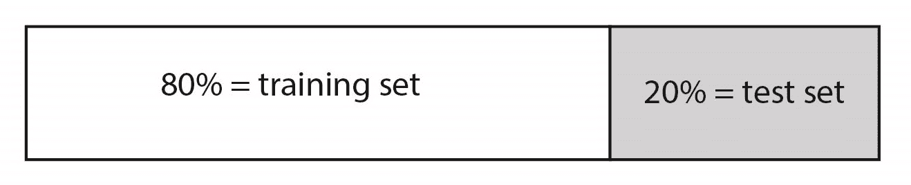

训练样本和验证样本之间的比率通常是 80%训练样本对 20%测试样本。这可以确保您有足够的数据来训练模型，并有合理数量的样本来很好地衡量性能。

通常，您从主数据集中选择随机样本来包含在训练集和测试集中。这将确保您在集合之间获得均匀的分布。

您可以使用`scikit-learn`库中的`train_test_split`函数生成自己的伸出集。它接受任意数量的数据集，并根据`train_size`或`test_size`关键字参数将它们分成两段:

```
from sklearn.model_selection import train_test_split

X_train, X_test, y_train, y_test = train_test_split(X, y, test_size=0.2)
```

每次运行训练课程时，随机分割数据集是一种很好的做法。深度学习算法，如 CNTK 中使用的算法，受随机数生成器以及训练期间你向神经网络提供样本的顺序的影响很大。因此，为了平衡样本顺序的影响，您需要在每次训练模型时随机化数据集的顺序。

当您想要快速测量模型的性能时，使用保持集效果很好。当你有一个大的数据集或者一个需要很长时间训练的模型时，它也是很棒的。但是使用拒绝技术也有不利的一面。

您的模型对训练期间提供样本的顺序很敏感。此外，每次开始新的训练时，计算机中的随机数生成器将提供不同的值来初始化神经网络中的参数。这可能会导致性能指标的波动。有时候，你会得到非常好的结果，但有时候你会得到非常糟糕的结果。最后，这是不好的，因为它不可靠。

对包含应作为单个输入进行处理的样本序列的数据集进行随机化时要小心，例如处理时间序列数据集时。像`scikit-learn`这样的库不能正确处理这种数据集，你可能需要编写自己的随机化逻辑。

<title>Using k-fold cross-validation</title>  

# 使用 k 倍交叉验证

您可以通过使用一种称为 k-fold 交叉验证的技术来增加模型的性能指标的可靠性。交叉验证执行与拒绝集相同的技术。但是它会重复很多次——通常是 5 到 10 次:


k-fold 交叉验证的过程是这样的:首先，将数据集分成训练集和测试集。然后，使用训练集训练模型。最后，您使用测试集来计算您的模型的性能指标。这个过程会根据需要重复很多次，通常是 5 到 10 次。在交叉验证过程结束时，会计算所有性能指标的平均值，从而得出最终的性能指标。大多数工具也会给你单独的数值，这样你就可以看到不同训练之间有多少差异。

交叉验证为您提供了更加稳定的性能测量，因为您使用了更加真实的培训和测试场景。在生产中不定义样本的顺序，这是通过多次运行相同的训练过程来模拟的。此外，我们使用单独的保留集来模拟看不见的数据。

在验证深度学习模型时，使用 k-fold 交叉验证会花费大量时间，所以要明智地使用它。如果您仍然在试验您的模型的设置，您最好使用基本的坚持技术。稍后，当您完成实验时，您可以使用 k-fold 交叉验证来确保该模型在生产环境中运行良好。

注意，CNTK 不支持运行 k 重交叉验证。为此，您需要编写自己的脚本。

<title>What about underfitting and overfitting?</title>  

# 欠拟合和过拟合怎么办？

当您开始使用保留数据集或通过应用 k-fold 交叉验证来收集神经网络的指标时，您会发现训练数据集和验证数据集的指标输出会有所不同。在本节中，我们将看看如何使用从收集的指标中获得的信息来检测模型的过度拟合和欠拟合问题。

当一个模型过度拟合时，它在训练中看到的样本上表现得非常好，但在新的样本上则不然。您可以通过查看指标来检测验证过程中的过度拟合。当测试集上的度量低于训练集上的相同度量时，您的模型是过度拟合的。

大量的过度拟合对业务不利，因为你的模型不知道如何处理新样本。但是在你的模型中有一点点过度拟合是合乎逻辑的；这是意料之中的，因为您希望最大限度地学习您的模型。

当您的模型在不代表其使用的真实环境的数据集上训练时，过度拟合的问题会变得更大。然后你会得到一个过度适应数据集的模型。它将预测新样本的随机输出。可悲的是，你无法察觉这种过度拟合。发现这个问题的唯一方法是在生产中使用您的模型，并使用适当的日志记录和用户反馈来衡量您的模型做得有多好。

像过度拟合一样，您也可以有欠拟合的模型。这意味着模型没有从训练集中学习到足够的知识，并且不能预测有用的输出。您可以通过性能指标轻松检测到这一点。通常，它会比你预期的要低。实际上，当你开始训练第一个纪元时，你的模型将会不适应，并且随着训练的进行会变得不那么不适应。

一旦模型被训练，它仍然可能是欠拟合的。您可以通过查看训练集和测试集的指标来发现这一点。当测试集上的指标高于训练集上的指标时，您就有了一个欠拟合模型。您可以通过仔细查看模型的设置并更改它们来解决此问题，以便下次训练模型时会变得更好。你也可以试着训练它一段时间，看看是否有帮助。

监控工具将有助于检测模型的欠拟合和过拟合。所以，一定要使用它们。我们将在*监控您的模型一节中讨论如何与 CNTK 一起使用它们。*

<title>Validating performance of a classification model</title>  

# 验证分类模型的性能

在前面的章节中，*选择一个好的策略来验证模型性能*，我们谈到了选择一个好的策略来验证你的神经网络。在接下来的部分中，我们将深入研究如何为不同类型的模型选择度量标准。

当您构建分类模型时，您会寻找表示有多少样本被正确分类的指标。您可能还对测量有多少样本被错误分类感兴趣。

您可以使用混淆矩阵(一个包含预测输出和预期输出的表格)来找出有关模型性能的大量详细信息。这往往会变得复杂，因此我们还将研究一种使用 F-measure 来测量模型性能的方法。

<title>Using a confusion matrix to validate your classification model</title>  

# 使用混淆矩阵来验证您的分类模型

让我们仔细看看如何使用混淆矩阵来度量分类模型的性能。为了理解混淆矩阵的工作原理，让我们为预测信用卡交易是正常还是欺诈的二进制分类模型创建一个混淆矩阵:

|  | **实际欺诈** | **实际正常** |
| **预测诈骗** | 正确肯定 | 假阳性 |
| **预测正常** | 假阴性 | 正确否定 |

样本混淆矩阵包含两列和两行。我们有一个班级欺诈专栏和一个班级正常专栏。我们还在欺诈类和正常类中添加了行。表格中的单元格将包含数字，告诉我们有多少样本被标记为真阳性、真阴性、假阳性和假阴性。

当模型正确地预测到交易中的欺诈时，我们正在处理一个真正的积极事件。当我们预测欺诈，但交易不应被标记为欺诈时，我们处理的是误报。

你可以从混淆矩阵中计算出许多不同的东西。首先，您可以根据混淆矩阵中的值计算精度:

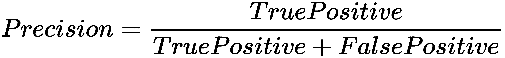

精度告诉您在我们预测的所有样本中，有多少样本被正确预测。高精度意味着您的模型很少出现误报。

我们可以根据混淆矩阵计算的第二个指标是召回指标:


Recall 告诉您数据集中有多少欺诈案例被模型实际检测到。拥有高召回率意味着你的模型在总体上善于发现欺诈案例。

最后，您可以计算模型的总体精度:

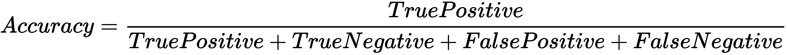

总体精度告诉你模型作为一个整体做得有多好。但当数据集不平衡时，这是一个危险的指标。例如:如果您有 100 个样本，其中 5 个被标记为欺诈，95 个被标记为正常，那么预测所有样本都正常的准确度为 *0.95* 。这似乎很高，但我们在欺骗自己。

算个平衡精度就好很多了。为此，我们需要知道模型的精度和特异性。我们已经知道如何计算模型的精度。我们可以使用以下公式计算特异性:

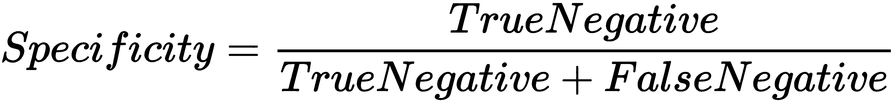

特异性告诉我们，我们的模型在检测样本正常而不是欺诈方面有多好。它是精确度的完美反义词，这告诉我们我们的模型在检测欺诈方面有多好。

一旦我们有了特异性，我们就可以将它与精度指标结合起来计算平衡精度:


平衡的准确性告诉我们，我们的模型在将数据集分为欺诈和正常情况方面有多好，这正是我们想要的。让我们回到之前的准确度测量，并使用准确度度量的平衡版本重试一次:

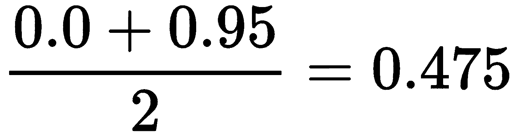

记住，我们有 100 个样本，其中 5 个应该被标记为欺诈。当我们预测一切正常时，我们最终的精度为 *0.0* ，因为我们没有正确预测任何欺诈案例。特异性是 *0.95* ，因为在 100 个样本中，我们错误地预测了 5 个为正常。最终结果是 *0.475* 的平衡精度，由于显而易见的原因，这个精度不是很高。

现在你已经对混淆矩阵的样子和工作原理有了很好的感觉，让我们来谈谈更复杂的情况。当您有一个包含两个以上类别的多类别分类模型时，您将需要用更多的行和列来扩展矩阵。

例如:当我们为一个预测三个可能类别的模型创建一个混淆矩阵时，我们可能会得到如下结果:

|  | **实际 A** | **实际 B** | **实际 C** |
| **预测了一个** | 91 | 75 | 60 |
| **预测 B** | 5 | 15 | 30 |
| **预测 C** | 四 | 10 | 10 |

我们仍然可以计算这个矩阵的精度、召回率和特异性。但是这样做更复杂，我们只能在每个类的基础上这样做。举个例子:当你要为 A 类计算精度时，你需要取 A 的真正率，也就是 *91* ，除以实际为 A 但被预测为 B 和 C 的样本数，总共就是 *9* 。这为我们提供了以下计算结果:

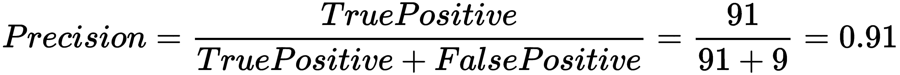

计算召回率、特异性和准确性的过程大致相同。要获得度量的整体数字，您需要计算所有类的平均值。

有两种策略可以用来计算平均指标，如精确度、召回率、特异性和准确性。您可以选择计算微观平均值或宏观平均值。让我们首先使用精度指标来研究宏观平均值:

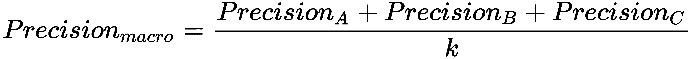

为了获得精度度量的宏平均值，我们首先将所有类的精度值相加，然后将它们除以类的数量， *k* 。宏观平均值没有考虑任何阶级不平衡。例如:A 类可能有 100 个样本，而 b 类只有 20 个样本。计算宏平均值会给你一个扭曲的图像。

当您处理多类分类模型时，最好对不同的指标(精确度、召回率、特异性和准确性)使用微平均值。我们来看看如何计算微平均精度:

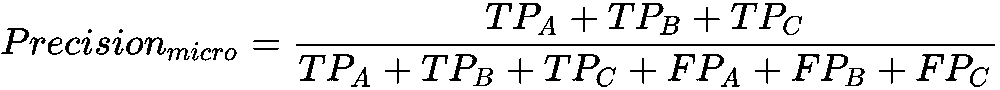

首先，我们将把每门课的所有正面因素加起来。然后，我们将它们除以每个类别的所有真阳性和假阴性的总和。这将为我们提供一个更加平衡的不同指标的视图。

<title>Using the F-measure as an alternative to the confusion matrix</title>  

# 使用 F-测度作为混淆矩阵的替代

虽然使用 precision 和 recall 可以让您很好地了解模型的执行情况，但它们不能同时最大化。这两个指标之间有很强的关系:

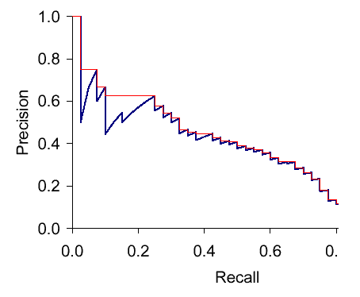

让我们看看精确度和回忆之间的关系是如何发展的。假设你想使用深度学习模型将细胞样本分类为癌变或正常。理论上，要在模型中达到最高精度，需要将预测数减少到 1。这给了你达到 100%精确度的最大机会，但是回忆变得非常低，因为你错过了许多可能的癌症病例。当你想达到最大的召回率以检测尽可能多的癌症病例时，你需要做尽可能多的预测。但是这降低了精确度，因为您增加了得到假阳性的机会。

在实践中，你会发现自己在精确度和召回率之间保持平衡。你应该主要追求精确还是回忆取决于你希望你的模型预测什么。通常，您需要与您的模型的用户交谈，以确定他们认为最重要的是什么:低数量的假阳性或发现患有致命疾病的患者的高几率。

一旦你在精确度和召回率之间做了选择，你需要一种方法来用一个度量标准来表达它。F 值允许你这样做。F-measure 表示精确度和召回率之间的调和平均值:

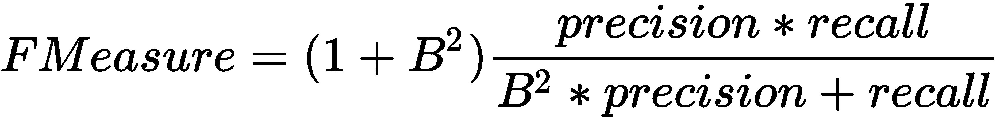

F-measure 的完整公式包括一个额外的项， *B* ，它被设置为 1 以获得相同的精度和召回率。这被称为 F1-measure，是你会遇到的几乎所有工具的标准。它对查全率和查准率给予了同等的重视。当你想强调回忆的时候，你可以把 *B* 因子设置为 2。或者，当您想要在模型中强调精度时，您可以将 *B* 因子设置为 0.5。

在下一节中，我们将看到如何使用 CNTK 中的混淆矩阵和 f-measure 来度量分类模型的性能。

<title>Measuring classification performance in CNTK</title>  

# 在 CNTK 中测量分类性能

让我们看看如何使用 CNTK 度量函数为我们在第 2 章*使用 CNTK* 构建神经网络中使用的花卉分类模型创建混淆矩阵。

您可以通过打开本章示例文件中的`Validating performance of classification models.ipynb`笔记本文件来理解本节中的代码。在这一节中，我们将重点关注验证代码。示例代码还包含了关于如何为模型预处理数据的更多细节。

在我们可以训练和验证模型之前，我们需要为训练准备数据集。我们将数据集分成单独的训练集和测试集，以确保我们的模型获得正确的性能度量:

```
from sklearn.model_selection import train_test_split

X_train, X_test, y_train, y_test = train_test_split(X,y, test_size=0.2, stratify=y)
```

首先，我们将从`sklearn.model_selection`包中导入`train_test_split`函数。然后，我们获取特征`X`和标签`y`，并通过函数对它们进行分割。我们将用 20%的样品进行测试。

注意，我们使用的是`stratify`关键字参数。因为我们正在验证一个分类模型，所以我们希望在测试和训练集中的类之间有一个良好的平衡。理想情况下，每个类在测试集和训练集中应该有相等的代表性。当您向关键字`stratify`输入一个类或标签列表时，`scikit-learn`将使用它们在训练集和测试集中均匀地分布样本。

现在我们有了训练和测试集，让我们来训练模型:

```
from cntk.losses import cross_entropy_with_softmax
from cntk.learners import sgd 
from cntk.logging import ProgressPrinter

progress_writer = ProgressPrinter(0)
loss = cross_entropy_with_softmax(z, labels)
learner = sgd(z.parameters, 0.1)

train_summary = loss.train((X_train,y_train), 
                           parameter_learners=[learner], 
                           callbacks=[progress_writer], 
                           minibatch_size=16, max_epochs=15)
```

我们将通过训练函数运行整个数据集，总共进行 15 个时期的训练。我们包括了一个进度书写器来可视化训练过程。

此时，我们不知道性能如何。我们知道，经过 15 个时期的训练，这种损失明显减少了。但问题是，这就足够了吗？让我们通过在模型中运行验证样本来找出答案，并创建一个混淆矩阵:

```
from sklearn.metrics import confusion_matrix

y_true = np.argmax(y_test, axis=1)
y_pred = np.argmax(z(X_test), axis=1)

matrix = confusion_matrix(y_true=y_true, y_pred=y_pred)

print(matrix)
```

我们使用来自`scikit-learn`的`confusion_matrix`函数来创建混淆矩阵。该函数需要真实标签和预测标签。两者都需要存储为 numpy 数组，用数值表示标签。我们没有这些数字。我们有一个标签的二进制表示，因为这是模型所需要的。为了解决这个问题，我们需要将标签的二进制表示转换成数字表示。你可以通过调用`numpy`包中的`argmax`函数来实现。`confusion_matrix`函数的输出是一个 numpy 数组，如下所示:

```
[[ 8 0 0]
 [ 0 4 6]
 [ 0 0 10]]
```

我们在混淆矩阵中得到三行和三列，因为我们的模型可以预测三个可能的类别。输出本身读起来不太舒服。您可以使用另一个名为`seaborn`的包将该表转换成热图:

```
import seaborn as sns
import matplotlib.pyplot as plt

g = sns.heatmap(matrix, 
                annot=True, 
                xticklabels=label_encoder.classes_.tolist(), 
                yticklabels=label_encoder.classes_.tolist(), 
                cmap='Blues')

g.set_yticklabels(g.get_yticklabels(), rotation=0)

g.set_xlabel('Predicted species')
g.set_ylabel('Actual species')
g.set_title('Confusion matrix for iris prediction model')

plt.show()
```

首先，我们基于混淆矩阵创建一个新的热图。我们传入在为行和列标签预处理数据集时使用的`label_encoder`的类。

标准热图需要做一些调整，以便于阅读。我们在热图中使用了自定义的颜色图。我们还在 X 轴和 Y 轴上使用自定义标签。最后，我们添加一个标题并显示图表:

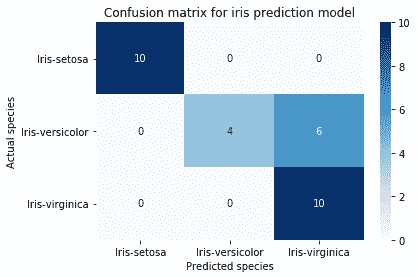

标准热图

查看混淆矩阵，您可以快速了解模型的运行情况。在这种情况下，模型缺少 Iris-versicolor 类的一些情况。这种花只有 60%被正确分类。

虽然混淆矩阵给出了关于模型在不同类上如何执行的许多细节，但是获得模型的单个性能数字可能是有用的，这样您可以容易地比较不同的实验。

获得单一性能数据的一种方法是使用来自 CNTK 的`classification_error`指标。它计算被错误分类的样本的比例。

要使用它，我们需要修改训练代码。我们不只是用一个`loss`函数来优化模型，还将包括一个指标。之前我们只创建了一个`loss`函数实例，这一次我们将不得不编写一个`criterion`函数来产生一个组合的`loss`和`metric`函数，我们可以在训练期间使用。下面的代码演示了如何做到这一点:

```
import cntk

@cntk.Function
def criterion_factory(output, target):
    loss = cntk.losses.cross_entropy_with_softmax(output, target)
    metric = cntk.metrics.classification_error(output, target)

    return loss, metric
```

遵循给定的步骤:

1.  首先，创建一个新的 Python 函数，它将我们的模型作为`output`参数，将我们想要优化的目标作为`output`参数。
2.  在该函数中，创建一个`loss`函数，并为其提供`output`和`target`。
3.  接下来，创建一个`metric`函数，并为其提供`output`和`target`。
4.  在函数的末尾，以元组的形式返回两者，其中第一个元素是`loss`函数，第二个元素是`metric`函数。
5.  用`@cntk.Function`标记该功能。这将包装损失和度量，因此我们可以对其调用`train`方法来训练模型，并调用`test`方法来验证模型。

一旦我们有了组合的`loss`和`metric`功能工厂，我们就可以在训练中使用它:

```
from cntk.losses import cross_entropy_with_softmax
from cntk.learners import sgd 
from cntk.logging import ProgressPrinter

progress_writer = ProgressPrinter(0)
loss = criterion_factory(z, labels)
learner = sgd(z.parameters, 0.1)

train_summary = loss.train((X_train,y_train), 
                           parameter_learners=[learner], 
                           callbacks=[progress_writer], 
                           minibatch_size=16, max_epochs=15)
```

遵循给定的步骤:

1.  首先，从`losses`模块导入`cross_entropy_with_softmax`函数
2.  接下来，从`learners`模块导入`sgd`学习器
3.  此外，从`logging`模块导入`ProgressPrinter`，这样您就可以记录培训过程的输出
4.  然后，创建一个新的实例`progress_writer`来记录培训过程的输出
5.  之后，使用新创建的`criterion_factory`函数创建一个`loss`，并输入模型变量`z`和`labels`变量
6.  接下来，使用`sgd`函数创建`learner`实例，并输入参数和`0.1`的学习速率
7.  最后，用训练数据、`learner`和`progress_writer`调用`train`方法

当我们在`loss`函数上调用 train 时，我们得到一个稍微不同的输出。不仅仅是损失，我们还可以在训练中看到`metric`函数的输出。在我们的例子中，指标的值应该随着时间的推移而增加:

```
 average      since    average      since      examples
 loss       last     metric       last 
 ------------------------------------------------------
Learning rate per minibatch: 0.1
 1.48       1.48       0.75       0.75            16
 1.18       1.03       0.75       0.75            48
 0.995      0.855      0.518      0.344           112
 1.03       1.03      0.375      0.375            16
 0.973      0.943      0.396      0.406            48
 0.848      0.753      0.357      0.328           112
 0.955      0.955      0.312      0.312            16
 0.904      0.878      0.375      0.406            48
```

最后，当我们完成训练时，您可以在`loss` / `metric`组合函数上使用`test`方法，使用我们之前创建的测试集来计算分类误差:

```
loss.test((X_test, y_test))
```

当您使用数据集对`loss`函数执行`test`方法时，CNTK 会将您提供的样本作为该函数的输入，并基于输入特征进行预测`X_test`。然后，它获取预测值和存储在`y_test`中的值，并通过我们在`criterion_factory`函数中创建的`metric`函数运行它们。这将产生一个表示度量的标量值。

我们在这个示例中使用的`classification_error`函数测量实际标签和预测标签之间的差异。它返回一个值，该值表示被错误分类的样本的百分比。

`classification_error`函数的输出应该确认我们在创建混淆矩阵时看到的内容，看起来类似于:

```
{'metric': 0.36666666666666664, 'samples': 30}
```

由于用于初始化模型的随机数生成器不同，结果可能会有所不同。您可以使用以下代码为随机数生成器设置固定的随机种子:

```
import cntk
import numpy 

cntk.cntk_py.set_fixed_random_seed(1337)
numpy.random.seed = 1337
```

这将修复输出中的一些差异，但不是全部。CNTK 中有几个组件忽略了固定的随机种子，每次运行训练代码时仍然会生成不同的结果。

CNTK 2.6 包含了`fmeasure`函数，它实现了我们在*小节中讨论的 F-measure，使用 F-measure 作为混淆矩阵*的替代。在定义`criterion factory`函数时，您可以通过将对`cntk.metrics.classification_error`的调用替换为对`cntk.losses.fmeasure`的调用来使用训练代码中的`fmeasure`;

```
import cntk

@cntk.Function
def criterion_factory(output, target):
    loss = cntk.losses.cross_entropy_with_softmax(output, target)
    metric = cntk.losses.fmeasure(output, target)

    return loss, metric
```

再次运行训练代码将为`loss.test`方法调用生成不同的输出:

```
{'metric': 0.831014887491862, 'samples': 30}
```

与前面的示例一样，由于随机数生成器用于初始化模型的方式不同，输出可能会有所不同。

<title>Validating performance of a regression model</title>  

# 验证回归模型的性能

在前面的章节中，*验证分类模型的性能，*我们谈到了验证分类模型的性能。现在让我们来看看验证回归模型的性能。

回归模型的不同之处在于，对于单个样本，没有正确或错误的二元度量。相反，您希望测量预测值与实际值的接近程度。我们越接近预期的输出，模型的表现就越好。

在本节中，我们将讨论测量用于回归的神经网络性能的三种方法。我们将首先讨论如何使用不同的误码率函数来测量性能。然后，我们将讨论如何使用决定系数来进一步验证您的回归模型。最后，我们将使用残差图来深入了解我们的模型是如何工作的。

<title>Measuring the accuracy of your predictions</title>  

# 衡量你预测的准确性

让我们首先看看验证回归模型的基本概念。正如我们之前提到的，在验证回归模型时，您无法真正说出预测是对还是错。您希望预测尽可能接近真实值，但是小的误差幅度是可以接受的。

通过查看预测值和期望值之间的距离，可以计算回归模型所做预测的误差幅度。这可以用一个公式来表示，就像这样:

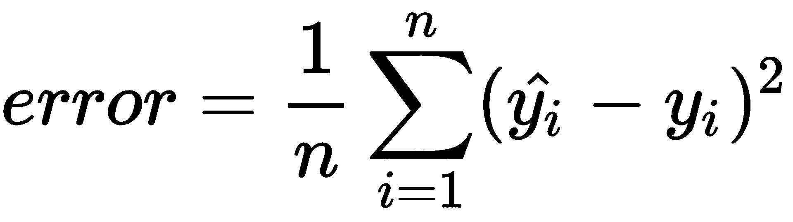

首先我们计算预测值， *y* 用帽子表示，和真实值， *y* 之间的距离，并平方。为了获得模型的总体错误率，我们需要对这些平方距离求和，并计算平均值。

平方运算符用于将预测值 *y* 与真实值 *y* 之间的负距离转换为正距离。如果没有这个，我们就会遇到问题:当你有一个+100 的距离，而在下一个样本中有一个-100 的距离时，你会得到一个 0 的错误率。这当然不是我们想要的。平方算子为我们解决了这个问题。

因为我们计算了预测值和实际值之间的距离的平方，所以对于较大的错误，我们会对计算机进行更多的惩罚。

`mean squared`误差函数可用作验证的度量和训练期间的损失函数。从数学上来说，两者没有区别。这使得在训练期间更容易看到回归模型的性能。你只需要看看损失就能对表演有所了解。

重要的是要明白，你从均方差函数得到一个距离。这不是衡量模型性能的绝对标准。你必须决定你能接受的预测值和期望值之间的最大距离。例如:您可以指定 90%的预测实际值和预测值之间的最大差值为 5%。这对你的模型的用户来说是非常有价值的。他们通常想要某种形式的保证，即模型预测在一定范围内。

如果您正在寻找表示误差幅度的性能数字，您将不会发现`mean squared`误差函数有多大用处。相反，你需要一个表示绝对误差的公式。这可以通过使用`mean absolute`误差函数来完成:

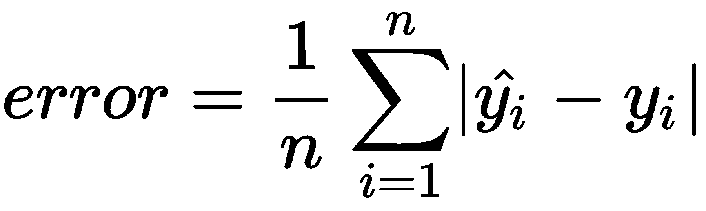

这是预测值和真实值之间的绝对距离，将它们相加，然后取平均值。这会给你一个可读性更强的数字。例如:当你谈论房价时，向用户提供 5000 美元的误差比 25000 美元的平方误差更容易理解。后者看起来很大，但实际上不是，因为它是一个平方值。

我们将纯粹着眼于如何使用来自 CNTK 的指标来验证回归模型。但是最好记住与你的模型的用户交谈，以确定什么样的性能足够好。

<title>Measuring regression model performance in CNTK</title>  

# 在 CNTK 中测量回归模型性能

现在我们已经看到了如何在理论上验证回归模型，让我们看看如何结合 CNTK 使用我们刚刚讨论过的不同指标。在本节中，我们将使用一个模型，该模型使用以下代码来预测汽车的每加仑英里数:

```
from cntk import default_options, input_variable
from cntk.layers import Dense, Sequential
from cntk.ops import relu

with default_options(activation=relu):
    model = Sequential([
        Dense(64),
        Dense(64),
        Dense(1,activation=None)
    ])

features = input_variable(X.shape[1])
target = input_variable(1)

z = model(features)
```

遵循给定的步骤:

1.  首先，从`cntk`包中导入所需的组件
2.  接下来，使用`default_options`功能定义默认激活功能。在这个例子中，我们使用了`relu`函数
3.  创建一个新的`Sequential`层集合，并提供两个`Dense`层，每个层有`64`个神经元
4.  添加一个额外的`Dense`层到`Sequential`层集合，给它`1`神经元，不激活。该图层将作为输出图层
5.  创建网络后，为输入要素创建一个输入变量，并确保它与我们将用于训练的要素具有相同的形状
6.  创建另一个大小为 1 的`input_variable`来存储神经网络的期望值。

输出层没有分配激活函数，因为我们希望它是线性的。当您忽略某个层的激活函数时，CNTK 将使用一个标识函数，并且该层不会对数据应用非线性。这对于回归场景非常有用，因为我们不想将输出限制在特定的值范围内。

为了训练模型，我们需要分割数据集并执行一些预处理:

```
from sklearn.preprocessing import StandardScaler
from sklearn.model_selection import train_test_split

X = df_cars.drop(columns=['mpg']).values.astype(np.float32)
y = df_cars.iloc[:,0].values.reshape(-1,1).astype(np.float32)

scaler = StandardScaler()
X = scaler.fit_transform(X)

X_train, X_test, y_train, y_test = train_test_split(X, y, test_size=0.2)
```

遵循给定的步骤:

1.  首先，使用`drop`方法获取数据集并删除`mpg`列。这将产生原始数据集的副本，从中我们可以从`values`属性获得 numpy 个向量。
2.  接下来，使用`StandardScaler`缩放数据，这样我们可以得到-1 到+ 1 之间的值。这样做将有助于防止神经网络中的爆炸梯度问题。
3.  最后，使用`train_test_split`函数将数据集分割成一个训练和验证集。

一旦我们对数据进行分割和预处理，我们就可以训练神经网络。为了训练模型，我们将定义一个`loss`和`metric`函数的组合来训练模型:

```
import cntk 

def absolute_error(output, target):
    return cntk.ops.reduce_mean(cntk.ops.abs(output - target))

@cntk.Function
def criterion_factory(output, target):
    loss = squared_error(output, target)
    metric = absolute_error(output, target)

    return loss, metric
```

遵循给定的步骤:

1.  定义一个名为`absolute_error`的新函数
2.  在`absolute_error`功能中，计算输出和目标之间的平均绝对差值
3.  返回结果
4.  接下来，创建另一个名为`criterion_factory`的函数
5.  用`@cntk.Function`标记这个函数，告诉 CNTK 在函数中包含`train`和`test`方法
6.  在函数中，使用`squared_loss`函数创建`loss`
7.  然后，使用`absolute_error`功能创建指标
8.  将`loss`和`metric`作为一个元组返回

CNTK 会自动将这些组合成一个可调用的函数。当您调用`train`方法时，损失用于优化神经网络中的参数。当您调用`test`方法时，该指标用于测量先前训练的神经网络的性能。

如果我们想要测量我们模型的绝对误差，我们需要写我们自己的度量，因为框架中不包括`mean absolute`误差函数。这可以通过组合 CNTK 中包含的标准运算符来实现。

既然我们已经有了创建组合的`loss`和`metric`函数的方法，让我们看看如何使用它来训练模型:

```
from cntk.logging import ProgressPrinter
from cntk.losses import squared_error
from cntk.learners import sgd

loss = criterion_factory(z, target)
learner = sgd(z.parameters, 0.001)

progress_printer = ProgressPrinter(0)

train_summary = loss.train((X_train,y_train), 
                           parameter_learners=[learner], 
                           callbacks=[progress_printer],
                           minibatch_size=16,
                           max_epochs=10)
```

我们将使用`criterion_factory`作为我们模型的`loss`和`metric`组合。当你训练这个模型的时候，你会发现随着时间的推移，损失下降的很快。我们还可以看到，平均绝对误差也在下降:

```
 average      since    average      since      examples

    loss       last     metric       last              

 ------------------------------------------------------

Learning rate per minibatch: 0.001

      690        690       24.9       24.9            16

      654        636       24.1       23.7            48

      602        563       23.1       22.3           112

      480        373       20.4         18           240

       62         62       6.19       6.19            16

     47.6       40.4       5.55       5.24            48

     44.1       41.5       5.16       4.87           112

     32.9       23.1        4.5       3.92           240

     15.5       15.5       3.12       3.12            16

     15.7       15.7       3.13       3.14            48

     15.8       15.9       3.16       3.18           112
[...]
```

现在，我们需要确保我们的模型能够像处理训练数据一样处理新数据。为此，我们需要对测试数据集的`loss` / `metric`组合调用`test`方法:

```
loss.test((X_test,y_test))
```

这为我们提供了性能指标的值和运行它的样本数。输出应该类似于下图。它很低，告诉我们这个模型的误差很小:

```
{'metric': 1.8967978561980814, 'samples': 79}
```

当我们对测试集的损失调用`test`方法时，它将获取测试数据`X_test`，并通过模型运行它以获得每个样本的预测。然后，它通过`metric`函数将这些与预期输出`y_test`一起运行。这将产生一个标量值作为输出。

<title>Measuring performance for out-of-memory datasets</title>  

# 衡量内存不足数据集的性能

我们已经讨论了很多不同的方法来验证你的神经网络的性能。到目前为止，我们只需要处理适合内存的数据集。但是这在生产场景中几乎是不可能的，因为你需要大量的数据来训练一个神经网络。在本节中，我们将讨论如何在内存不足的数据集上使用不同的指标。

<title>Measuring performance when working with minibatch sources</title>  

# 使用微型批次源时测量性能

当您使用 minibatch 数据源时，您需要一个稍微不同的损失和度量设置。让我们回过头来看看如何使用小批量来源设置培训，并使用指标扩展它以验证模型。首先，我们需要建立一种向模型的训练者提供数据的方法:

```
from cntk.io import StreamDef, StreamDefs, MinibatchSource, CTFDeserializer, INFINITELY_REPEAT

def create_datasource(filename, limit=INFINITELY_REPEAT):
    labels_stream = StreamDef(field='labels', shape=3, is_sparse=False)
    features_stream = StreamDef(field='features', shape=4, is_sparse=False)

    deserializer = CTFDeserializer(filename, StreamDefs(labels=labels_stream, features=features_stream))
    minibatch_source = MinibatchSource(deserializer, randomize=True, max_sweeps=limit)

    return minibatch_source

training_source = create_datasource('iris_train.ctf')
test_source = create_datasource('iris_test.ctf', limit=1)
```

遵循给定的步骤:

1.  首先，导入创建迷你批处理源所需的组件。
2.  接下来，定义一个新函数`create_datasource`，它有两个参数`filename`和`limit`，默认值为`INFINITELY_REPEAT`。
3.  在该函数中，为标签创建一个`StreamDef`，它从具有三个特性的标签字段中读取。将`is_sparse`关键字参数设置为`False`。

4.  为从具有四个特征的特征字段读取的特征创建另一个`StreamDef`。将`is_sparse`关键字参数设置为`False`。
5.  接下来，初始化一个新的`CTFDeserializer`类实例，并指定您想要反序列化的文件名和流。
6.  最后，使用`deserializer`创建一个 minibatch 源，并将其配置为混洗数据集，并使用配置的扫描数量指定`max_sweeps`关键字参数。

请记住第 3 章、*将数据输入神经网络*中的内容，要使用迷你批处理源，您需要一个兼容的文件格式。对于[第 3 章](f7cd9148-99e8-427c-acf4-d74c3e52df58.xhtml)、*将数据输入神经网络中的分类模型，*我们使用 CTF 文件格式作为 MinibatchSource 的输入。我们已经在本章的示例代码中包含了数据文件。查看`Validating with a minibatch source.ipynb`文件了解更多细节。

一旦我们有了数据源，我们就可以创建与我们在前面章节*中使用的模型相同的模型，验证分类模型*的性能，并为它初始化一个训练会话:

```
from cntk.logging import ProgressPrinter
from cntk.train import Trainer, training_session

minibatch_size = 16
samples_per_epoch = 150
num_epochs = 30
max_samples = samples_per_epoch * num_epochs

input_map = {
    features: training_source.streams.features,
    labels: training_source.streams.labels
}

progress_writer = ProgressPrinter(0)
trainer = Trainer(z, (loss, metric), learner, progress_writer)

session = training_session(trainer, 
                           mb_source=training_source,
                           mb_size=minibatch_size, 
                           model_inputs_to_streams=input_map, 
                           max_samples=max_samples,
                           test_config=test_config)

session.train()
```

遵循给定的步骤:

1.  首先，导入`ProgressPrinter`来记录关于培训过程的信息
2.  另外，从`train`模块导入`Trainer`和`training_session`组件
3.  接下来，定义模型的输入变量和来自微型批次源的数据流之间的映射
4.  然后，创建一个新的`ProgressWriter`实例来记录培训进度的输出
5.  之后，初始化`trainer`并为其提供型号、`loss`、`metric`、`learner`和`progress_writer`
6.  最后，调用`training_session`函数开始训练过程。通过`training_source`提供功能、设置以及输入变量和来自微型批次源的数据流之间的映射。

要向该设置添加验证，您需要使用一个`TestConfig`对象，并将其分配给`train_session`函数的`test_config`关键字参数。`TestConfig`对象没有太多需要配置的设置:

```
from cntk.train import TestConfig

test_config = TestConfig(test_source)
```

遵循给定的步骤:

1.  首先，从`train`模块导入`TestConfig`类
2.  然后，用我们之前创建的`test_source`作为输入，创建一个新的`TestConfig`实例

通过在`train`方法中指定`test_config`关键字参数，您可以在训练期间使用这个测试配置。

当您运行培训会话时，您将获得类似于以下内容的输出:

```
 average      since    average      since      examples

    loss       last     metric       last              

 ------------------------------------------------------

Learning rate per minibatch: 0.1

     1.57       1.57      0.214      0.214            16

     1.38       1.28      0.264      0.289            48

     1.41       1.44      0.147     0.0589           112

     1.27       1.15     0.0988     0.0568           240

     1.17       1.08     0.0807     0.0638           496

      1.1       1.03     0.0949      0.109          1008

    0.973      0.845      0.206      0.315          2032

    0.781       0.59      0.409       0.61          4080

Finished Evaluation [1]: Minibatch[1-1]: metric = 70.72% * 30;
```

首先，您将看到模型是使用来自培训 MinibatchSource 的数据进行培训的。因为我们将进度打印机配置为培训会话的回调，所以我们可以看到损失的进展情况。此外，您将看到一个度量值在增加。这个指标输出来自于我们给`training_session`函数一个训练器，这个训练器配置了损失和指标。

当训练结束时，将使用来自您在`TestConfig`对象中配置的 MinibatchSource 的数据对模型进行测试。

最酷的是，现在不仅您的训练数据被小批量加载到内存中以防止内存问题，测试数据也被小批量加载。如果您正在处理具有大型数据集的模型，即使是为了测试目的，这也非常有用。

<title>Measuring performance when working with a manual minibatch loop</title>  

# 使用手动微型批次定量环测量性能

在使用 CNTK 中的常规 API 进行训练时，使用度量标准是在训练期间和训练之后测量模型性能的最简单的方法。当您使用手动微型批次循环时，事情会变得更加困难。这是你最能控制的地方。

让我们首先回顾一下如何使用手动迷你批次循环来训练模型。我们将使用我们在章节*中使用的分类模型来验证分类模型*的性能。您可以在本章示例代码的`Validating with a manual minibatch loop.ipynb`文件中找到它。

模型的损失定义为`cross-entropy`损失函数和 F-measure 指标的组合，我们在第*节中看到，使用 F-Measure 替代混淆矩阵*。您可以使用我们之前在*测量 CNTK 中的分类性能一节中使用的功能对象组合，*使用手动训练过程，这是一种很好的方式:

```
import cntk
from cntk.losses import cross_entropy_with_softmax, fmeasure

@cntk.Function
def criterion_factory(outputs, targets):
    loss = cross_entropy_with_softmax(outputs, targets)
    metric = fmeasure(outputs, targets, beta=1)

    return loss, metric
```

一旦我们定义了损失，我们就可以在训练器中使用它来设置手动训练课程。正如您所料，用 Python 代码编写它需要更多的工作:

```
import pandas as pd
import numpy as np
from cntk.logging import ProgressPrinter
from cntk.train import Trainer

progress_writer = ProgressPrinter(0)
trainer = Trainer(z, loss, learner, progress_writer)

for _ in range(0,30):
    input_data = pd.read_csv('iris.csv', 
        names=['sepal_length', 'sepal_width','petal_length','petal_width', 'species'], 
        index_col=False, chunksize=16)

    for df_batch in input_data:
        feature_values = df_batch.iloc[:,:4].values
        feature_values = feature_values.astype(np.float32)

        label_values = df_batch.iloc[:,-1]

        label_values = label_values.map(lambda x: label_mapping[x])
        label_values = label_values.values

        encoded_labels = np.zeros((label_values.shape[0], 3))
        encoded_labels[np.arange(label_values.shape[0]), label_values] = 1.

        trainer.train_minibatch({features: feature_values, labels: encoded_labels})
```

遵循给定的步骤:

1.  首先，导入`numpy`和`pandas`包来加载和预处理数据
2.  接下来，导入`ProgressPrinter`类来记录训练过程中的信息
3.  然后，从`train`模块导入`Trainer`类
4.  导入所有必要的组件后，创建一个新的`ProgressPrinter`实例
5.  然后，初始化`trainer`并为其提供型号、`loss`、`learner`和`progress_writer`

6.  若要定型模型，请创建一个在数据集上迭代三十次的循环。这将是我们的外部训练循环
7.  接下来，使用`pandas`从磁盘加载数据，并将`chunksize`关键字参数设置为`16`,这样就可以小批量加载数据集
8.  使用一个`for`循环迭代每个小批量，这将是我们的内部训练循环
9.  在`for`循环中，使用`iloc`步进器作为`features`读取前四列，并将其转换为`float32`
10.  接下来，读取最后一列作为要训练的标签
11.  标签以字符串的形式存储，但是我们使用一次性向量，所以要将标签字符串转换成数字表示
12.  然后，获取标签的数字表示，并将其转换为 numpy 数组，这样更容易使用它们
13.  之后，创建一个新的 numpy 数组，其行数与我们刚刚转换的标签值的行数相同。但是用`3`列表示模型可以预测的可能类别的数量
14.  现在，选择基于数字标签值的列，并将其设置为`1`，以创建一键编码标签
15.  最后，调用`trainer`上的`train_minibatch`方法，并向其提供小批次的已处理特征和标签

当您运行代码时，您将会看到类似如下的输出:

```
average since average since  examples 
loss    last  metric  last 
------------------------------------------------------ 
Learning rate per minibatch: 0.1
1.45    1.45  -0.189  -0.189  16 
1.24    1.13  -0.0382  0.0371 48 
1.13    1.04  0.141    0.276  112 
1.21    1.3   0.0382  -0.0599 230 
1.2     1.18  0.037    0.0358 466
```

因为我们在 function 对象中组合了一个度量和损失，并在 trainer 配置中使用了一个进度打印机，所以我们在训练期间获得了损失和度量的输出。

若要评估模型性能，您需要执行与训练模型类似的任务。只是这一次，我们需要使用一个`Evaluator`实例来测试模型:

```
from cntk import Evaluator

evaluator = Evaluator(loss.outputs[1], [progress_writer])

input_data = pd.read_csv('iris.csv', 
        names=['sepal_length', 'sepal_width','petal_length','petal_width', 'species'], 
        index_col=False, chunksize=16)

for df_batch in input_data:
    feature_values = df_batch.iloc[:,:4].values
    feature_values = feature_values.astype(np.float32)

    label_values = df_batch.iloc[:,-1]

    label_values = label_values.map(lambda x: label_mapping[x])
    label_values = label_values.values

    encoded_labels = np.zeros((label_values.shape[0], 3))
    encoded_labels[np.arange(label_values.shape[0]), label_values] = 1.

    evaluator.test_minibatch({ features: feature_values, labels: encoded_labels})

evaluator.summarize_test_progress()
```

遵循给定的步骤:

1.  首先，从`cntk`包中导入`Evaluator`
2.  然后，创建一个`Evaluator`的新实例，并向它提供`loss`函数的第二个输出
3.  初始化`Evalutator`后，加载包含数据的 CSV 文件，并提供`chunksize`参数，以便我们批量加载数据
4.  现在，迭代由`read_csv`函数返回的批次，以处理数据集中的项目
5.  在这个循环中，读取前四列作为`features`并将其转换为`float32`
6.  之后，阅读标签栏
7.  由于标签存储为字符串，我们需要首先将它们转换为数字表示
8.  之后，为了更容易处理，使用底层的 numpy 数组
9.  接下来，使用`np.zeros`函数创建一个新数组
10.  将我们在步骤 7 中获得的标签索引处的元素设置为`1`以创建标签的独热编码向量
11.  然后，调用`evaluator`上的`test_minibatch`方法，并为其提供特性和编码标签
12.  最后，使用`evaluator`上的`summarize_test_progress`方法获得最终的性能指标

当您运行`evaluator`时，您将得到类似如下的输出:

```
Finished Evaluation [1]: Minibatch[1-11]: metric = 65.71% * 166;
```

虽然手动迷你批次循环对于培训和评估来说需要做更多的工作，但它是最强大的循环之一。你可以改变一切，甚至在训练期间的不同时间间隔进行评估。如果您有一个需要花很长时间训练的模型，这一点尤其有用。通过使用定期测试，您可以监控您的模型何时开始过度拟合，并且如果需要，您可以停止训练。

<title>Monitoring your model</title>  

# 监控您的模型

既然我们已经对我们的模型做了一些验证，现在是时候谈谈在训练期间监控你的模型了。在前面的章节*测量 CNTK* 中的分类性能和前面的[第 2 章](4c9da7a9-6873-4de9-99a9-43de693d65f8.xhtml)、*通过使用`ProgressWriter`类使用 CNTK、*构建神经网络中，您已经看到了一些，但是还有更多方法来监控您的模型。比如:可以用`TensorBoardProgressWriter`。让我们仔细看看 CNTK 中的监控是如何工作的，以及如何使用它来检测模型中的问题。

<title>Using callbacks during training and validation</title>  

# 在培训和验证期间使用回调

CNTK 允许您在 API 的几个地方指定回调。例如:当您在一个`loss`函数上调用 train 时，您可以通过 callbacks 参数指定一组回调:

```
train_summary = loss.train((X_train,y_train), 
                           parameter_learners=[learner], 
                           callbacks=[progress_writer], 
                           minibatch_size=16, max_epochs=15)
```

如果您正在使用 minibatch 源或使用手动 minibatch 循环，那么您可以在创建`Trainer`时指定用于监视目的的回调:

```
from cntk.logging import ProgressPrinter

callbacks = [
    ProgressPrinter(0)
]

trainer = Trainer(z, (loss, metric), learner, [callbacks])
```

CNTK 将在设定的时间调用这些回调函数:

*   当小批量完成时
*   当在训练期间完成对数据集的全扫描时
*   当小批量测试完成时
*   当在测试期间完成对数据集的全扫描时

CNTK 中的回调可以是一个可调用的函数，也可以是一个进度编写器实例。进度编写器使用一个特定的 API，该 API 对应于日志记录数据被写入的四个时间。我们将进度编写器的实现留给您自己探索。相反，我们将看看如何在培训期间使用不同的进度书写器来监控您的模型。

<title>Using ProgressPrinter</title>  

# 使用进度打印机

你会发现自己经常使用的监控工具之一是`ProgressPrinter`。这个类实现了基本的基于控制台的日志来监控你的模型。如果您需要，它还可以记录到磁盘。如果您在分布式训练场景中工作，或者在无法登录控制台查看 Python 程序输出的场景中工作，这一点尤其有用。

您可以像这样创建一个`ProgressPrinter`实例:

```
ProgressPrinter(0, log_to_file='test_log.txt'),
```

您可以在`ProgressPrinter`中配置很多东西，但是我们将把自己限制在最常用的参数上。然而，如果你想要更奇特的东西，你可以在 CNTK 网站上找到更多关于`ProgressPrinter`的信息。

当您配置`ProgressPrinter`时，您可以将频率指定为第一个参数，以配置数据打印到输出的频率。当您将值指定为零时，它将每隔一个迷你批次(1，2，4，6，8，...).您可以将此设置更改为大于零的值，以创建自定义计划。例如，当您输入 3 作为频率时，记录器将在每 3 个小批次后写入状态数据。

`ProgressPrinter`类也接受一个`log_to_file`参数。您可以在这里指定要写入日志数据的文件名。使用时，该文件的输出将类似于以下内容:

```
test_log.txt
CNTKCommandTrainInfo: train : 300
CNTKCommandTrainInfo: CNTKNoMoreCommands_Total : 300
CNTKCommandTrainBegin: train
 average since average since examples
 loss  last  metric  last 
 ------------------------------------------------------
Learning rate per minibatch: 0.1
 8.91 8.91   0.296 0.296 16
 3.64 1      0.229 0.195 48
 2.14 1.02   0.215 0.204 112
 0.875 0.875  0.341 0.341 16
 0.88 0.883  0.331 0.326 48
```

这与我们之前在本章中使用`ProgressPrinter`类时看到的非常相似。

最后，您可以使用`metric_is_pct`设置来指定`ProgressPrinter`类应该如何显示指标。将此项设置为`False`以打印原始值，而不是默认策略以百分比打印指标。

<title>Using TensorBoard</title>  

# 使用 TensorBoard

虽然`ProgressPrinter`可以用来监控 Python 笔记本中的训练进度，但它确实还有很多不足之处。例如:使用`ProgressPrinter`很难很好地了解损失和指标随时间的变化。

在 CNTK 中有一个很好的替代类`ProgressPrinter`。您可以使用`TensorBoardProgressWriter`以本机 TensorBoard 格式记录数据。

TensorBoard 是 Google 发明的一个工具，用于 TensorFlow。它可以在培训期间和培训之后可视化您的模型的各种指标。您可以通过使用 PIP 安装来手动下载该工具:

```
pip install tensorboard
```

要使用 TensorBoard，您需要首先在您的训练代码中设置`TensorBoardProgressWriter`:

```
import time
from cntk.logging import TensorBoardProgressWriter

tensorboard_writer = TensorBoardProgressWriter(log_dir='logs/{}'.format(time.time()), freq=1, model=z)
```

1.  首先，导入`time`包
2.  接下来，导入`TensorBoardProgressWriter`
3.  最后，创建一个新的`TensorBoardProgressWriter`并提供一个带时间戳的目录来登录。确保将模型作为关键字参数提供，以便在培训期间发送到 TensorBoard。

通过用时间戳参数化日志目录设置，我们选择为每次运行使用单独的日志`dir`。这确保了对同一模型的多次运行被分别记录，并且可以被查看和比较。最后，您可以指定使用 TensorBoard progress writer 的模型。

一旦您训练了您的模型，确保您在您的`TensorboardProgressWriter`实例上调用了`close`方法，以确保日志文件被完全写入。如果没有这一点，您可能会错过一些(如果不是全部)在培训期间收集的指标。

您可以通过在 Anaconda 提示符下使用命令启动 TensorBoard 来可视化 TensorBoard 日志记录数据:

```
tensorboard --logdir logs
```

`--logdir`参数应该与记录所有运行的根`dir`相匹配。在这种情况下，我们使用`logs` `dir`作为 TensorBoard 的输入源。现在，您可以在浏览器中打开 TensorBoard，方法是转到启动 TensorBoard 的控制台中显示的 URL。

TensorBoard 网页如下所示，默认页面为标量选项卡:

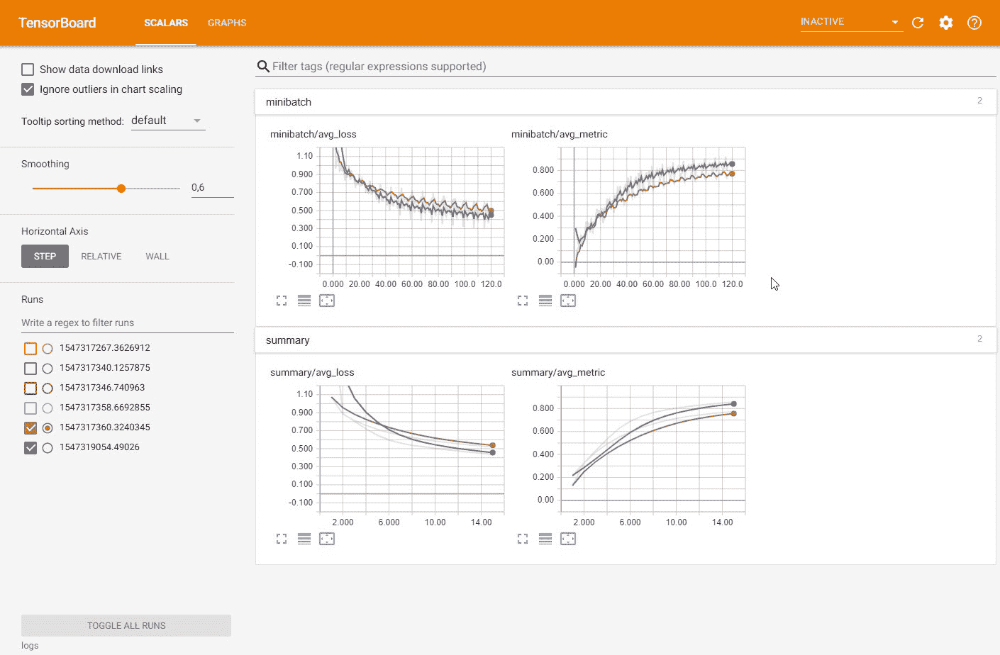

Tensorboard 网页，标量选项卡作为默认页面

您可以通过在屏幕左侧选择多个运行来查看它们。这允许您比较不同的运行，以查看运行之间发生了多少变化。在屏幕中间，您可以查看不同的图表，这些图表描述了一段时间内的损失和指标。CNTK 将记录每个迷你批次和每个时期的指标，这两者都可用于查看指标随时间的变化情况。

TensorBoard 有更多的方式来帮助监控您的模型。当您转到 GRAPHS 选项卡时，您可以在一个漂亮的图形地图中看到您的模型的样子:

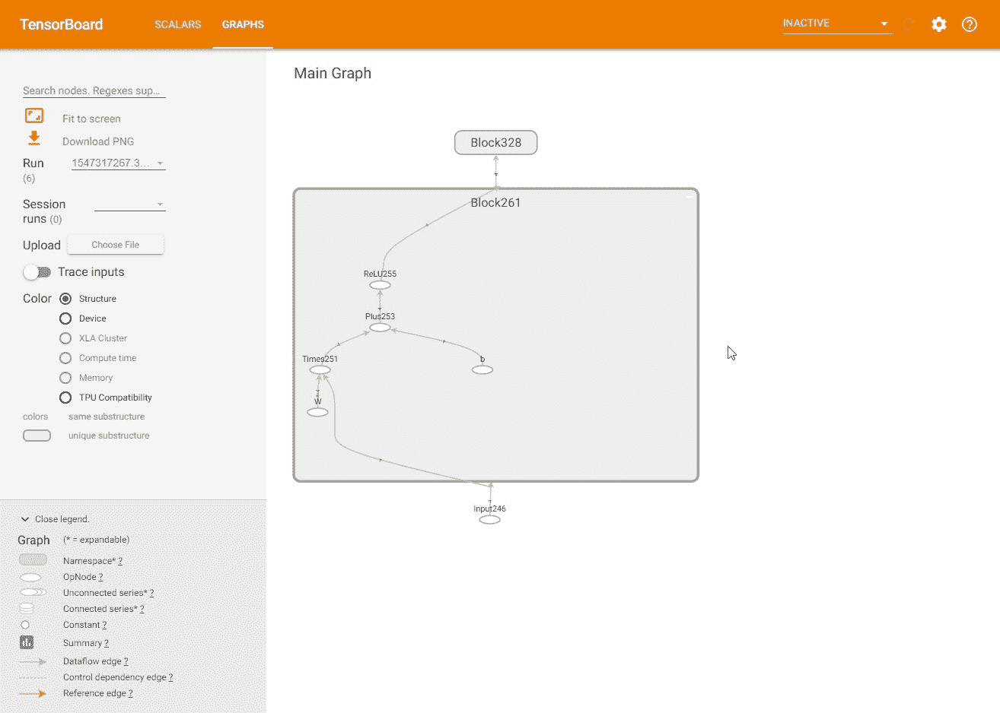

在图形地图中显示您的模型

这对于有很多层的技术复杂的模型特别有用。它有助于您理解层是如何连接的，并且让许多开发人员免除了头痛，因为他们能够通过这个选项卡找到他们断开的层。

TensorBoard 包含更多监视模型的方法，但遗憾的是，默认情况下，CNTK 只使用标量和图表选项卡。如果您需要使用图像，您也可以将其记录到 TensorBoard。当我们开始处理图像时，我们将在第 5 章、*处理图像*中讨论这个问题。

<title>Summary</title>  

# 摘要

在本章中，您学习了如何验证不同类型的深度学习模型，以及如何使用 CNTK 中的指标来实现模型的验证逻辑。我们还探索了如何使用 TensorBoard 来可视化训练进度和模型的结构，以便您可以轻松地调试您的模型。

尽早并经常地监控和验证你的模型将确保你最终得到的神经网络在生产中运行良好，并做你的客户所期望的事情。这是检测模型欠拟合和过拟合的唯一方法。

既然你已经知道如何建立和验证基本的神经网络，我们将深入更有趣的深度学习场景。在下一章中，我们将探索如何通过神经网络使用图像来执行图像检测，在第六章、*的*中，我们将了解如何构建和验证处理时间序列数据(如金融市场数据)的深度学习模型。在接下来的章节中，你将需要本章和前面章节中描述的所有技术来充分利用更高级的深度学习场景。